# 第一章。集成技术简介

集成技术是模型输出聚合技术，在过去十多年中在统计和机器学习领域得到了发展。这构成了本书的中心主题。任何统计模型和机器学习工具的用户都会熟悉构建模型的问题以及从潜在候选模型中选择的关键决策。模型的准确性当然不是唯一的相关标准；我们还关心其复杂性，以及整体模型是否具有实际意义。

常见的建模问题包括选择模型的决定，并且存在各种方法来帮助这项任务。在统计学中，我们求助于诸如**赤池信息准则**（**AIC**）和**贝叶斯信息准则**（**BIC**）这样的度量，而在其他方面，与拟合模型中的变量相关的 p 值有助于做出决策。这个过程通常被称为**模型选择**。岭回归惩罚、Lasso 和其他统计方法也有助于这项任务。对于机器学习模型，如神经网络、决策树等，当模型使用称为训练数据的数据的一部分构建时，k 折交叉验证是有用的，然后我们会在未训练区域或验证数据中寻找准确性。如果模型对其复杂性敏感，这种练习可能是徒劳的。

获得最佳模型的过程意味着我们创建了一大批其他模型，这些模型本身几乎与最佳模型一样高效。此外，最佳模型准确地覆盖了大多数样本，而其他模型可能准确地评估了它不准确变量的空间区域。因此，我们可以看到，最终入围的模型与第二名相比优势很少。接下来的模型并不那么糟糕，以至于可以完全拒绝。这使得有必要找到一种方法，将已从模型中获得的大部分结果以有意义的方式结合起来。寻找将各种模型组合起来的方法是集成学习的主要目标。或者可以说，集成学习将竞争模型转化为协作模型。实际上，集成技术并不是建模练习的终点，因为它们还将扩展到无监督学习问题。我们将演示一个例子，以证明这种需要的合理性。

没有现代计算能力的发明，集成方法的实现将是不可能的。统计方法预见到了需要巨大计算的技术。如排列检验和 Jackknife 等方法是计算能力有效性的证据。我们将在本章后面进行一项练习来学习这些方法，并在本书后面的部分重新审视它们。

从机器学习的角度来看，*监督学习*和*无监督学习*是两种主要的学习方法。**监督学习**是机器学习的一个分支，其过程是已知某个变量，目的是通过其他各种变量来理解这个变量。在这里，我们有一个目标变量。由于学习是在输出变量的基础上进行的，因此监督学习有时被称为有教师的学习。并非所有目标变量都是相同的，它们通常属于以下四种类型之一。如果目标是把观察结果分类到*k*种类型之一（例如，是/否，满意/不满意），那么我们有一个分类问题。这样的变量在统计学中被称为*分类变量*。感兴趣的变量可能是一个连续变量，从软件的角度来看是数值的。这可能包括每升油的汽车里程数，一个人的收入，或一个人的年龄。对于这样的场景，机器学习问题的目的是通过其他相关变量来学习变量，然后预测未知案例，在这些案例中，只有相关变量的值是可用的。我们将广泛地将这类问题称为**回归问题**。

在临床试验中，事件发生的时间通常是一个关注的焦点。当疾病被诊断出来时，我们会询问所提出的药物是否比现有的药物有所改进。在这里，所讨论的变量是诊断和死亡之间的时间长度，而临床试验数据会带来几个其他问题。分析不能等到所有患者都去世，或者有些患者可能已经离开了研究，使得我们无法再了解他们的状态。因此，我们得到了截尾数据。作为研究观察的一部分，完整的信息并不总是可用。生存分析主要处理这类问题，我们将在这里着手解决创建集成模型的问题。

对于分类、回归和生存数据，可以假设实例/观察是相互独立的。这是一个非常合理的假设，因为有一个合理的理由相信患者会对药物的反应是独立的，客户会流失或支付贷款也是独立的，等等。在另一个重要的问题类别中，这个假设并不成立，我们面临的是通过时间序列数据相互依赖的观察。时间序列数据的一个例子是某公司股票交易所的收盘点。显然，一家公司股票的表现不可能每天都是独立的，因此我们需要考虑依赖性。

在许多实际问题中，目标是理解模式或找到观察值的组，我们没有关于需要训练哪个算法的具体变量。找到组或聚类被称为无监督学习或无导师学习。在寻找聚类时出现的两个主要实际问题包括：(i) 通常事先不知道总体中有多少个聚类，以及(ii) 不同初始聚类中心的选择会导致不同的解决方案。因此，我们需要一个不受初始化影响，或者至少对初始化不敏感的解决方案，并考虑每个有用解决方案的优点。这将引导我们走向无监督集成技术。

寻找最佳模型，无论是监督学习还是无监督学习，常常受到异常值的存在而受阻。已知单个异常值会严重影响线性模型的整体拟合度，而且对非线性模型也有显著影响。异常值检测本身就是一项挑战，大量的统计方法有助于识别异常值。众多机器学习方法也有助于识别异常值。当然，集成方法在这里也会有所帮助，我们将开发 R 程序来帮助解决识别异常值的问题。这种方法将被称作异常值集成。

在一开始，读者熟悉本书中使用的数据集非常重要。所有主要数据集将在第一部分介绍。我们首先简要介绍核心的统计/机器学习模型，并在之后立即将其付诸实践。很快就会明显看出，没有一种模型会比其他模型表现得更好。如果存在这样的解决方案，我们就不需要集成技术了。

在本章中，我们将涵盖：

+   **数据集**：本书中将使用的核心数据集

+   **统计/机器学习模型**：这里将解释重要的分类模型

+   **正确模型困境**：没有占主导地位的模型

+   **集成概述**：集成方法的需求

+   **互补统计测试**：这里将讨论对模型比较有用的重要统计测试

本章将需要以下 R 包：

+   `ACSWR`

+   `caret`

+   `e1071`

+   `factoextra`

+   `mlbench`

+   `NeuralNetTools`

+   `perm`

+   `pROC`

+   `RSADBE`

+   `Rpart`

+   `survival`

+   `nnet`

# 数据集

数据无疑是机器学习最重要的组成部分。如果没有数据，我们就不会有共同的目标。在大多数情况下，收集数据的目的本身就定义了问题本身。正如我们所知，变量可能属于几种类型，其存储和组织方式也非常重要。

李和艾尔德（1997）考虑了一系列数据集，并引入了集成模型的需求。我们将首先查看他们论文中考虑的数据集的细节，然后在本书的后续部分介绍其他重要数据集。

## 甲状腺功能减退

甲状腺功能减退数据集 `Hypothyroid.csv` 可在本书的代码包中找到，位于 `/…/Chapter01/Data`。虽然数据集中有 26 个变量，但我们只会使用其中的 7 个变量。在这里，观测值的数量是 *n* = 3163。数据集是从 [`archive.ics.uci.edu/ml/datasets/thyroid+disease`](http://archive.ics.uci.edu/ml/datasets/thyroid+disease) 下载的，文件名为 `hypothyroid.data` ([`archive.ics.uci.edu/ml/machine-learning-databases/thyroid-disease/hypothyroid.data`](http://archive.ics.uci.edu/ml/machine-learning-databases/thyroid-disease/hypothyroid.data))。经过对某些值重新标记顺序的调整后，CSV 文件被包含在本书的代码包中。研究的目的是根据其他变量提供的信息对患有甲状腺问题的患者进行分类。数据集有多种变体，读者可以在以下网页深入了解细节：[`archive.ics.uci.edu/ml/machine-learning-databases/thyroid-disease/HELLO`](http://archive.ics.uci.edu/ml/machine-learning-databases/thyroid-disease/HELLO)。在这里，代表感兴趣变量的列被命名为 `Hypothyroid`，这表明我们有 151 名患有甲状腺问题的患者。其余 3012 名测试结果为阴性。显然，这个数据集是 *不平衡数据* 的一个例子，这意味着两种情况中的一种数量远远超过另一种；对于每个甲状腺病例，我们大约有 20 个阴性病例。这类问题需要不同的处理方式，我们需要深入算法的细微差别来构建有意义的模型。在构建预测模型时，我们将使用的额外变量或协变量包括 `Age`（年龄）、`Gender`（性别）、`TSH`（促甲状腺激素）、`T3`（三碘甲状腺原氨酸）、`TT4`（总甲状腺素）、`T4U`（甲状腺素自由指数）和 `FTI`（游离三碘甲状腺原氨酸）。数据首先被导入 R 会话，并根据感兴趣的变量进行子集化，如下所示：

```py
> HT <- read.csv("../Data/Hypothyroid.csv",header = TRUE,stringsAsFactors = F)
> HT$Hypothyroid <- as.factor(HT$Hypothyroid)
> HT2 <- HT[,c("Hypothyroid","Age","Gender","TSH","T3","TT4","T4U","FTI")]
```

第一行代码使用 `read.csv` 函数从 `Hypothyroid.csv` 文件中导入数据。现在数据集中变量有很多缺失数据，如下所示：

```py
> sapply(HT2,function(x) sum(is.na(x)))
Hypothyroid         Age      Gender         TSH          T3         TT4 
          0         446          73         468         695         249 
        T4U         FTI 
        248         247 
```

因此，我们删除了所有包含缺失值的行，然后将数据分为训练集和测试集。我们还将为分类问题创建一个公式：

```py
> HT2 <- na.omit(HT2)
> set.seed(12345)
> Train_Test <- sample(c("Train","Test"),nrow(HT2),replace=TRUE, prob=c(0.7,0.3))
> head(Train_Test)
[1] "Test"  "Test"  "Test"  "Test"  "Train" "Train"
> HT2_Train <- HT2[Train_Test=="Train",]
> HT2_TestX <- within(HT2[Train_Test=="Test",],rm(Hypothyroid))
> HT2_TestY <- HT2[Train_Test=="Test",c("Hypothyroid")]
> HT2_Formula <- as.formula("Hypothyroid~.")
```

`set.seed` 函数确保每次运行程序时结果都是可重复的。在用 `na.omit` 函数删除缺失观测值后，我们将甲状腺数据分为训练集和测试集。前者用于构建模型，后者用于验证，使用的是未用于构建模型的数据。Quinlan – C4.5 算法的发明者 – 广泛使用了这个数据集。

## 波形

这个数据集是一个模拟研究的例子。在这里，我们有二十一个变量作为输入或独立变量，以及一个被称为`classes`的类别变量。数据是通过`mlbench` R 包中的`mlbench.waveform`函数生成的。更多详情，请参考以下链接：ftp://ftp.ics.uci.edu/pub/machine-learning-databases。我们将为这个数据集模拟 5000 个观测值。如前所述，`set.seed`函数保证了可重复性。由于我们正在解决二元分类问题，我们将波形函数生成的三个类别减少到两个，然后为了模型构建和测试目的，将数据分为训练集和测试集：

```py
> library(mlbench)
> set.seed(123)
> Waveform <- mlbench.waveform(5000)
> table(Waveform$classes)
   1    2    3 
1687 1718 1595 
> Waveform$classes <- ifelse(Waveform$classes!=3,1,2)
> Waveform_DF <- data.frame(cbind(Waveform$x,Waveform$classes)) # Data Frame
> names(Waveform_DF) <- c(paste0("X",".",1:21),"Classes")
> Waveform_DF$Classes <- as.factor(Waveform_DF$Classes)
> table(Waveform_DF$Classes)
   1    2 
3405 1595 
```

R 函数`mlbench.waveform`创建了一个新的`mlbench`类对象。由于它由`x`和`classes`两个子部分组成，我们将通过一些进一步的操作将其转换为`data.frame`。`cbind`函数将两个对象`x`（一个矩阵）和`classes`（一个数值向量）绑定成一个单一的矩阵。`data.frame`函数将矩阵对象转换成数据框，这是程序其余部分所需的数据类型。

数据分区后，我们将为波形数据集创建所需的`formula`：

```py
> set.seed(12345)
> Train_Test <- sample(c("Train","Test"),nrow(Waveform_DF),replace = TRUE,
+ prob = c(0.7,0.3))
> head(Train_Test)
[1] "Test"  "Test"  "Test"  "Test"  "Train" "Train"
> Waveform_DF_Train <- Waveform_DF[Train_Test=="Train",]
> Waveform_DF_TestX <- within(Waveform_DF[Train_Test=="Test",],rm(Classes))
> Waveform_DF_TestY <- Waveform_DF[Train_Test=="Test","Classes"]
> Waveform_DF_Formula <- as.formula("Classes~.")
```

## 德国信贷

贷款并不总是全额偿还，存在违约者。在这种情况下，银行根据可用的信息识别潜在的违约者变得很重要。在这里，我们改编了`RSADBE`包中的`GC`数据集，以正确反映因子变量的标签。转换后的数据集作为`GC2.RData`在数据文件夹中可用。`GC`数据集本身主要是对[`archive.ics.uci.edu/ml/datasets/statlog+(german+credit+data)`](https://archive.ics.uci.edu/ml/datasets/statlog+(german+credit+data))上可用的版本的一种改编。在这里，我们有 1000 个观测值，以及 20 个协变量/独立变量，如现有支票账户的状态、期限等。贷款是否完全偿还的最终状态在`good_bad`列中可用。我们将数据分为训练集和测试集，并创建公式：

```py
> library(RSADBE)
> load("../Data/GC2.RData")
> table(GC2$good_bad)
 bad good 
 300  700 
> set.seed(12345)
> Train_Test <- sample(c("Train","Test"),nrow(GC2),replace = TRUE,prob=c(0.7,0.3))
> head(Train_Test)
[1] "Test"  "Test"  "Test"  "Test"  "Train" "Train"
> GC2_Train <- GC2[Train_Test=="Train",]
> GC2_TestX <- within(GC2[Train_Test=="Test",],rm(good_bad))
> GC2_TestY <- GC2[Train_Test=="Test","good_bad"]
> GC2_Formula <- as.formula("good_bad~.")
```

## Iris

Iris 可能是最著名的分类数据集。伟大的统计学家 R.A.费舍尔使这个数据集流行起来，他使用这个数据集根据花瓣和萼片的长度和宽度测量来对三种类型的`iris`植物进行分类。费舍尔使用这个数据集开创了统计分类器线性判别分析的发端。由于有三种`iris`物种，我们将这个问题转化为二元分类问题，分离了数据集，并创建了如这里所见到的公式：

```py
> data("iris")
> ir2 <- iris
> ir2$Species <- ifelse(ir2$Species=="setosa","S","NS")
> ir2$Species <- as.factor(ir2$Species)
> set.seed(12345)
> Train_Test <- sample(c("Train","Test"),nrow(ir2),replace = TRUE,prob=c(0.7,0.3))
> head(Train_Test)
[1] "Test"  "Test"  "Test"  "Test"  "Train" "Train"
> ir2_Train <- ir2[Train_Test=="Train",]
> ir2_TestX <- within(ir2[Train_Test=="Test",],rm(Species))
> ir2_TestY <- ir2[Train_Test=="Test","Species"]
> ir2_Formula <- as.formula("Species~.")
```

## 皮马印第安人糖尿病

糖尿病是一种健康危害，通常是不可治愈的，被诊断出患有这种病的患者必须调整他们的生活方式以适应这种状况。基于`pregnant`、`glucose`、`pressure`、`triceps`、`insulin`、`mass`、`pedigree`和`age`等变量，这里的问题是判断一个人是否患有糖尿病。在这里，我们有 768 个观测值。这个数据集来自`mlbench`包：

```py
> data("PimaIndiansDiabetes")
> set.seed(12345)
> Train_Test <- sample(c("Train","Test"),nrow(PimaIndiansDiabetes),replace = TRUE,
+ prob = c(0.7,0.3))
> head(Train_Test)
[1] "Test"  "Test"  "Test"  "Test"  "Train" "Train"
> PimaIndiansDiabetes_Train <- PimaIndiansDiabetes[Train_Test=="Train",]
> PimaIndiansDiabetes_TestX <- within(PimaIndiansDiabetes[Train_Test=="Test",],
+                                     rm(diabetes))
> PimaIndiansDiabetes_TestY <- PimaIndiansDiabetes[Train_Test=="Test","diabetes"]
> PID_Formula <- as.formula("diabetes~.")
```

到目前为止描述的五个数据集都是分类问题。我们分别看一个回归、时间序列、生存、聚类和异常值检测问题的例子。

## 美国犯罪

在这里，对美国 47 个不同州的每百万人口犯罪率的研究被进行，并试图找出它与 13 个变量的依赖关系。这些包括年龄分布、南方州的指标、平均在校年数等。与早期数据集一样，我们也将这个数据集分成以下 R 程序块：

```py
> library(ACSWR)
Warning message:
package 'ACSWR' was built under R version 3.4.1 
> data(usc)
> str(usc)
'data.frame':	47 obs. of  14 variables:
 $ R  : num  79.1 163.5 57.8 196.9 123.4 ...
 $ Age: int  151 143 142 136 141 121 127 131 157 140 ...
 $ S  : int  1 0 1 0 0 0 1 1 1 0 ...
 $ Ed : int  91 113 89 121 121 110 111 109 90 118 ...
 $ Ex0: int  58 103 45 149 109 118 82 115 65 71 ...
 $ Ex1: int  56 95 44 141 101 115 79 109 62 68 ...
 $ LF : int  510 583 533 577 591 547 519 542 553 632 ...
 $ M  : int  950 1012 969 994 985 964 982 969 955 1029 ...
 $ N  : int  33 13 18 157 18 25 4 50 39 7 ...
 $ NW : int  301 102 219 80 30 44 139 179 286 15 ...
 $ U1 : int  108 96 94 102 91 84 97 79 81 100 ...
 $ U2 : int  41 36 33 39 20 29 38 35 28 24 ...
 $ W  : int  394 557 318 673 578 689 620 472 421 526 ...
 $ X  : int  261 194 250 167 174 126 168 206 239 174 ...
> set.seed(12345)
> Train_Test <- sample(c("Train","Test"),nrow(usc),replace = TRUE,prob=c(0.7,0.3))
> head(Train_Test)
[1] "Test"  "Test"  "Test"  "Test"  "Train" "Train"
> usc_Train <- usc[Train_Test=="Train",]
> usc_TestX <- within(usc[Train_Test=="Test",],rm(R))
> usc_TestY <- usc[Train_Test=="Test","R"]
> usc_Formula <- as.formula("R~.")
```

在本节迄今为止讨论的每个示例中，我们都有理由相信观测值之间是独立的。这个假设简单来说就是，一个观测值的回归因变量和回归自变量与其他观测值的回归因变量和回归自变量之间没有关系。这是一个简单且合理的假设。我们还有另一类观测值/数据集，其中这样的假设并不实用。例如，一天的最高气温并不完全独立于前一天的温度。如果是这样的话，我们可能会经历一个酷热无比的日子，接着是冬天，然后又是另一个炎热的夏天，接着是一个非常大雨的天气。然而，天气并不以这种方式发生，因为连续几天，天气依赖于前一天。在下一个例子中，我们考虑新西兰的海外游客数量。

## 海外游客

新西兰海外数据集在 Tattar 等人（2017）的第十章中进行了详细处理。在这里，海外游客的数量从 1977 年 1 月到 1995 年 12 月按月记录。我们有超过 228 个月的游客数据。`osvisit.dat`文件可在多个网页链接中找到，包括[`www.stat.auckland.ac.nz/~ihaka/courses/726-/osvisit.dat`](https://www.stat.auckland.ac.nz/~ihaka/courses/726-/osvisit.dat)和[`github.com/AtefOuni/ts/blob/master/Data/osvisit.dat`](https://github.com/AtefOuni/ts/blob/master/Data/osvisit.dat)。它也包含在书籍的代码包中。我们将使用 R 导入数据，将其转换为时间序列对象，并可视化：

```py
> osvisit <- read.csv("../Data/osvisit.dat", header= FALSE)
> osv <- ts(osvisit$V1, start = 1977, frequency = 12)
> class(osv)
[1] "ts"
> plot.ts(osv)
```

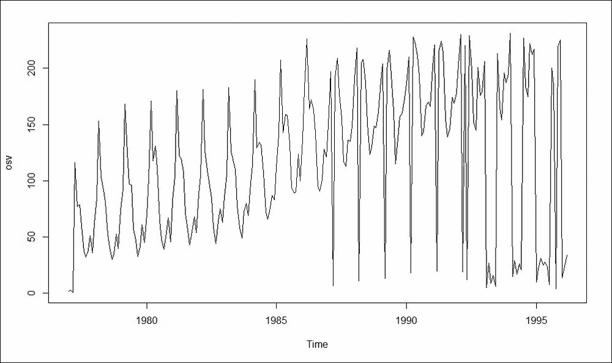

图 1：新西兰海外游客

在这里，数据集没有被分割！时间序列数据不能任意分割成训练和测试部分。原因很简单：如果我们有五个按时间顺序排列的观察结果 *y1*，*y2*，*y3*，*y4*，*y5*，并且我们相信影响顺序是 *y1→y2→y3→y4→y5*，任意分割 *y1*，*y2*，*y5* 将会有不同的行为。它不会与三个连续观察结果具有相同的信息。因此，时间序列分割必须保留依赖结构；我们保留最近的部分时间作为测试数据。对于五个观察结果的例子，我们选择 *y1*，*y2*，*y3* 作为测试数据。分割很简单，我们将在第十一章，*集成时间序列模型*中介绍这一点。

实时测试实验很少能得出完整的观察结果。在可靠性分析以及生存分析/临床试验中，单位/患者会被观察到预定义的时间，并记录是否发生了特定事件，这通常是指故障或死亡。相当一部分观察结果在预定的截止时间之前并未发生故障，分析不能等待所有单位都发生故障。缩短研究的原因可能是因为所有单位都会发生故障的时间点可能非常长，并且继续研究到那时会非常昂贵。因此，我们只能得到不完整的观察结果；我们只知道在研究被取消之前，单位的寿命至少持续了预定义的时间，而感兴趣的事件可能在未来的某个时间发生。因此，一些观察结果是截断的，数据被称为截断数据。分析此类数据集需要特殊的统计方法。我们将在下一节给出这些类型数据集的例子，并在第十章，*集成生存模型*中进行分析。

## 原发性胆汁性肝硬化

来自生存包的`pbc`数据集是临床试验领域的一个基准数据集。梅奥诊所收集了这些数据，它涉及肝脏的原发性胆汁性肝硬化（PBC）。该研究是在 1974 年至 1984 年之间进行的。更多详细信息可以通过在 R 终端上运行`pbc`，然后是`library(survival)`来找到。在这里，感兴趣事件的主要时间是注册和死亡、移植或 1986 年 7 月的研究分析之间的天数，这被捕获在时间变量中。与生存研究类似，事件可能被截尾，指示器在状态列中。需要理解事件时间，考虑到变量如`trt`、`age`、`sex`、`ascites`、`hepato`、`spiders`、`edema`、`bili`、`chol`、`albumin`、`copper`、`alk.phos`、`ast`、`trig`、`platelet`、`protime`和`stage`。

到目前为止讨论的八个数据集都有一个目标变量，或回归因变量，是监督学习问题的例子。另一方面，还有一些实际案例，我们只是试图理解数据，并从中找到有用的模式和组/簇。当然，重要的是要注意，聚类的目的是找到一个相同的组并给它一个合理的标签。例如，如果我们试图根据长度、宽度、马力、发动机排量等特征对汽车进行分组，我们可能会找到被标记为敞篷车、轿车和沙龙车类的组，而另一个聚类解决方案可能会导致基本、高端和运动变体组的标签。聚类中提出的主要问题是组数的选择和形成稳健的簇。我们考虑来自`factoextra`R 包的一个简单数据集。

## 多形状

来自`factoextra`包的`multishapes`数据集包含三个变量：`x`、`y`和`shape`。它由不同的形状组成，每个形状形成一个簇。在这里，我们有两个并行的圆形形状，两个平行的矩形/床，以及右下角的一个点簇。散点图中也添加了异常值。一些简短的 R 代码提供了有用的显示：

```py
> library(factoextra)
> data("multishapes")
> names(multishapes)
[1] "x"     "y"     "shape"
> table(multishapes$shape)
  1   2   3   4   5   6 
400 400 100 100  50  50 
> plot(multishapes[,1],multishapes[,2],col=multishapes[,3])
```

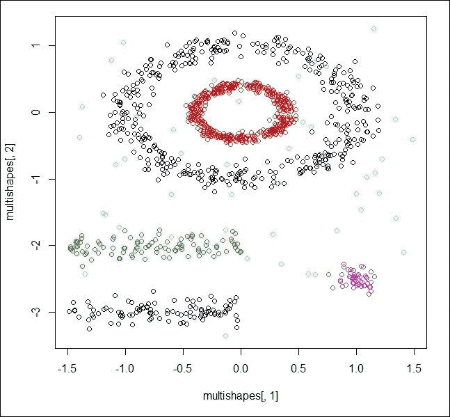

图 2：寻找形状或组

此数据集包含一个名为`shape`的列，因为它是一个假设数据集。在真正的聚类问题中，我们将没有簇组指示器，也没有仅两个变量的可视化奢侈。在这本书的后面，我们将看到集成聚类技术如何帮助克服确定簇数量和簇成员一致性的问题。

虽然这种情况并不常见，但在微调不同参数、拟合不同模型和其他技巧都未能找到有用的工作模型时，可能会产生挫败感。这种情况的罪魁祸首通常是异常值。已知单个异常值会破坏一个本可能有用的模型，因此它们的检测至关重要。到目前为止，参数和非参数异常值检测一直是专业知识深厚的问题。在复杂场景中，识别将是一项无法逾越的任务。可以使用集成异常值框架达成对观测值是否为异常值的共识。为了考虑这一点，我们将考虑板刚度数据集。我们将在本书的结论部分看到如何确定异常值。

## 板刚度

板刚度数据集可通过`ACSWR`包中的`stiff`数据框获得。该数据集包含 30 块板的四个刚度度量。第一个刚度度量是通过在板上发送冲击波获得的，第二个是通过振动板获得的，其余两个是通过静态测试获得的。在多元数据集中识别异常值的一种快速方法是使用马氏距离函数。观测值离中心的距离越远，该观测值成为异常值的可能性就越大：

```py
> data(stiff)
> sort(mahalanobis(stiff,colMeans(stiff),cov(stiff)),decreasing = TRUE)
 [1] 16.8474070168 12.2647549939  9.8980384087  7.6166439053
 [5]  6.2837628235  5.4770195915  5.2076098038  5.0557446013
 [9]  4.9883497928  4.5767867224  3.9900602512  3.5018290410
[13]  3.3979804418  2.9951752177  2.6959023813  2.5838186338
[17]  2.5385575365  2.3816049840  2.2191408683  1.9307771418
[21]  1.4876569689  1.4649908273  1.3980776252  1.3632123553
[25]  1.0792484215  0.7962095966  0.7665399704  0.6000128595
[29]  0.4635158597  0.1295713581
```

# 统计/机器学习模型

上一节通过真实数据集介绍了一系列问题，现在我们将讨论一些标准模型变体，这些变体有助于处理此类问题。首先，我们建立所需的数学框架。

假设我们拥有 *n* 对独立的观测数据，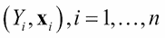，其中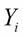表示感兴趣的随机变量，也称为*因变量*、内生变量等。是与解释变量相关的向量，或独立/外生变量。解释向量将包含 *k* 个元素，即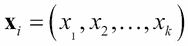。实现的数据形式为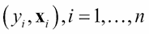，其中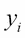是随机变量的实现值（数据）。本书将采用一种惯例，即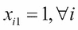，这将处理截距项。我们假设观测数据来自真实的分布 *F*，该分布并不完全已知。一般回归模型，包括分类模型以及回归模型，由以下指定：

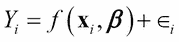

在这里，函数 *f* 是一个未知函数，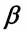 是回归参数，它捕捉了 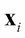 对  的影响。误差 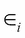 是相关的不可观测误差项。可以应用多种方法来建模 Ys 和 `xes` 之间的关系。统计回归模型专注于误差分布  的完整指定，通常函数形式会是线性的，如 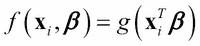 所示。函数 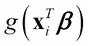 是广义线性模型类中的连接函数。非参数和半参数回归模型更加灵活，因为我们不对误差的概率分布施加限制。然而，灵活性是有代价的，在这里我们需要更多的观测数据来做出有效的推断，尽管这个数量是不确定的，并且通常是主观的。

机器学习范式包括一些 *黑盒* 方法，并且这种方法与非参数和半参数模型之间存在健康的重叠。读者也应注意，黑盒并不意味着在任何意义上都是非科学的。这些方法有坚实的数学基础，并且每次都是可复制的。接下来，我们将快速回顾一些最重要的统计和机器学习模型，并通过前面讨论的数据集来展示它们。

## 逻辑回归模型

逻辑回归模型是一种二元分类模型，它是广义线性模型类中的指数族成员。现在，用  表示二元标签：

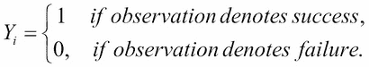

使用包含在解释向量 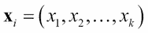 中的信息，我们试图构建一个有助于这项任务的模型。逻辑回归模型如下：

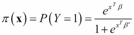

在这里，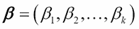 是回归系数的向量。请注意，logit 函数 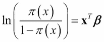 在回归系数上是线性的，因此模型的名称是逻辑回归模型。逻辑回归模型可以等价地写成以下形式：

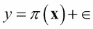

在这里，是遵循伯努利分布的二进制误差项。更多信息，请参阅 Tattar 等人（2016 年）的第十七章。逻辑回归参数的估计需要**迭代加权最小二乘法**（**IRLS**），我们将使用 R 函数`glm`来完成这项任务。在本节中，我们将使用甲状腺功能减退症数据集。在前一节中，已经创建了训练和测试数据集以及公式，我们将从那个点继续进行。

### 甲状腺功能减退症分类的逻辑回归

对于`hypothyroid`数据集，我们使用`HT2_Train`作为训练数据集。测试数据集被分为`HT2_TestX`中的协变量矩阵和测试数据集的输出`HT2_TestY`，而逻辑回归模型的公式可在`HT2_Formula`中找到。首先，使用`glm`函数将逻辑回归模型拟合到训练数据集，并将拟合的模型命名为`LR_fit`，然后使用`summary(LR_fit)`检查模型拟合摘要。然后，使用`predict`函数将拟合的模型应用于测试部分的协变量数据以创建`LR_Predict`。然后，在`LR_Predict_Bin`中标记预测概率，并将这些标签与实际的`testY_numeric`进行比较，从而获得整体准确率：

```py
> ntr <- nrow(HT2_Train) # Training size
> nte <- nrow(HT2_TestX) # Test size
> p <- ncol(HT2_TestX)
> testY_numeric <- as.numeric(HT2_TestY)
> LR_fit <- glm(HT2_Formula,data=HT2_Train,family = binomial())
Warning message:
glm.fit: fitted probabilities numerically 0 or 1 occurred 
> summary(LR_fit)
Call:
glm(formula = HT2_Formula, family = binomial(), data = HT2_Train)
Deviance Residuals: 
    Min       1Q   Median       3Q      Max  
-3.6390   0.0076   0.0409   0.1068   3.5127  
Coefficients:
             Estimate Std. Error z value Pr(>|z|)    
(Intercept) -8.302025   2.365804  -3.509 0.000449 ***
Age         -0.024422   0.012145  -2.011 0.044334 *  
GenderMALE  -0.195656   0.464353  -0.421 0.673498    
TSH         -0.008457   0.007530  -1.123 0.261384    
T3           0.480986   0.347525   1.384 0.166348    
TT4         -0.089122   0.028401  -3.138 0.001701 ** 
T4U          3.932253   1.801588   2.183 0.029061 *  
FTI          0.197196   0.035123   5.614 1.97e-08 ***
---
Signif. codes:  0 '***' 0.001 '**' 0.01 '*' 0.05 '.' 0.1 ' ' 1

(Dispersion parameter for binomial family taken to be 1)

    Null deviance: 609.00  on 1363  degrees of freedom
Residual deviance: 181.42  on 1356  degrees of freedom
AIC: 197.42
Number of Fisher Scoring iterations: 9
> LR_Predict <- predict(LR_fit,newdata=HT2_TestX,type="response")
> LR_Predict_Bin <- ifelse(LR_Predict>0.5,2,1)
> LR_Accuracy <- sum(LR_Predict_Bin==testY_numeric)/nte
> LR_Accuracy
[1] 0.9732704
```

从拟合的 GLM（在`summary(LR_fit)`行之后的输出）的摘要中可以看出，我们有四个显著的变量`in Age`、`TT4`、`T4U`和`FTI`。使用`predict`函数，我们将拟合的模型应用于`HT2_TestX`中的未知测试案例，并与实际值进行比较，发现准确率为 97.33%。因此，逻辑回归在 R 软件中很容易部署。

## 神经网络

逻辑回归可能看起来受限，因为它只允许通过链接函数对协变量的线性影响。线性假设可能不成立，而且在大多数实际情况下，我们没有足够的信息来指定非线性关系的函数形式。因此，我们只知道很可能存在一个未知的非线性关系。神经网络是逻辑回归的非线性推广，这涉及到两个重要组成部分：隐藏神经元和学习率。我们首先将修订神经网络的结构。

在神经网络中，输入变量被认为是神经元的第一个层次，输出是最终和结论性的神经元层次。神经网络模型的架构可以使用 R 包`NeuralNetTools`进行可视化。假设我们有三个输入变量和两个隐藏层，每个隐藏层包含两个隐藏神经元。在这里，我们有一个具有四个层次的神经网络。下面的代码段给出了一个具有三个输入变量、两个隐藏层中的两个隐藏神经元和一个输出变量的神经网络结构的可视化：

```py
> library(NeuralNetTools) 
> plotnet(rep(0,17),struct=c(3,2,2,1))
> title("A Neural Network with Two Hidden Layers")
```

我们发现 R 包`NeuralNetTools`在可视化神经网络结构方面非常有用。使用核心 R 包`nnet`构建的神经网络也可以使用`NeuralNetTools::plotnet`函数进行可视化。`plotnet`函数通过`struct`选项设置一个神经网络，其结构由第一层三个神经元、第二和第三层每个层两个神经元以及最终输出层的一个神经元组成。弧上的权重在`rep(0,17)`中设置为零：

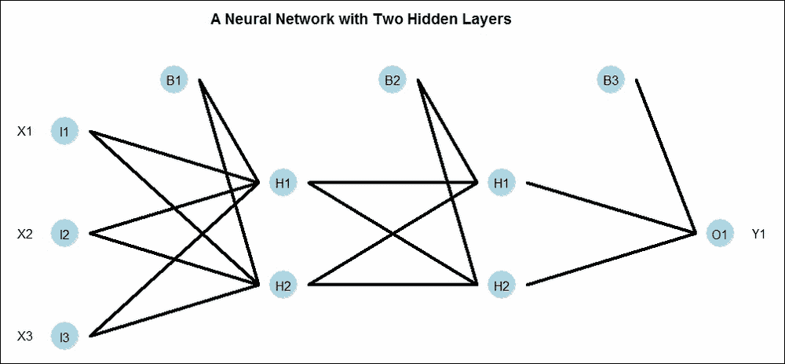

图 3：神经网络的架构

在前一个图中，我们看到了神经网络的四层。第一层由**B1**（偏差）、**I1 (X1**)、**I2 (X2**)和**I3 (X3**)组成。第二层由**B2**（第一隐藏层的偏差）、**H1**和**H2**三个神经元组成。请注意，偏差**B2**不接收来自第一隐藏层的任何输入。接下来，每个神经元从前一层的每个神经元接收整体输入，在这里是**B1**、**X1**、**X2**和**X3**。然而，第一隐藏层的**H1**和**H2**将接收来自**B1**、**X1**、**X2**和**X3**的不同聚合输入。网络中的每条弧上都作用着适当的权重，这些权重构成了神经网络的参数；也就是说，第一层**H1**的到达将类似于

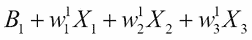

有效到达是通过一个*传递函数*实现的。传递函数可能是一个恒等函数、S 形函数等等。同样，第一层第二个神经元的到达是

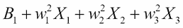

。通过扩展，**B2**、**H1**和**H2**（第一层）将成为第二隐藏层的输入，**B3**、**H1**和**H2**将成为最终输出的输入。在神经网络的每个阶段，我们都有权重。这些权重需要以这种方式确定，即预测输出**O1**与真实**Y1**之间的差异尽可能小。请注意，逻辑回归是神经网络的一个特例，可以通过直接移除所有隐藏层和输入层来看到，这会导致输出层。神经网络将被拟合到甲状腺功能减退问题。

### 甲状腺功能减退分类的神经网络

我们使用同名的`nnet`函数来设置甲状腺功能减退分类问题的神经网络。公式、训练集和测试集继续与之前相同。准确度计算遵循与逻辑回归中类似的步骤。拟合的神经网络使用`NeuralNetTools`包中的`plotnet`图形函数进行可视化：

```py
> set.seed(12345)
> NN_fit <- nnet(HT2_Formula,data = HT2_Train,size=p,trace=FALSE)
> NN_Predict <- predict(NN_fit,newdata=HT2_TestX,type="class")
> NN_Accuracy <- sum(NN_Predict==HT2_TestY)/nte
> NN_Accuracy
[1] 0.9827044025
> plotnet(NN_fit)
> title("Neural Network for Hypothyroid Classification")
```

在这里，准确度为 98.27%，这比逻辑回归模型有所提高。拟合模型的视觉展示如下图所示。我们使用`set.seed(12345)`将神经网络参数的随机初始化固定在`12345`，以确保结果在读者端可重复。这是一个有趣的集成建模案例。不同的初始种子（读者可以尝试）会导致不同的准确度。有时，你可能会得到低于本节中考虑的任何模型的准确度，而在其他时候，你可能会得到最高的准确度。种子选择的任意性导致了一个重要的问题：哪种解决方案是有用的。由于种子是任意的，因此不会出现好种子或坏种子的问题。在这种情况下，如果一个模型给你更高的准确度，这并不一定意味着什么：

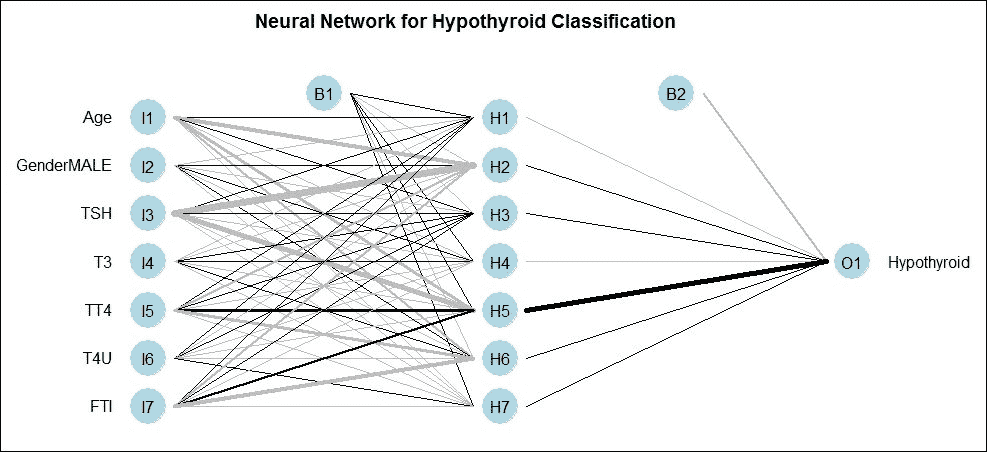

图 4：甲状腺功能减退症分类的神经网络

## 朴素贝叶斯分类器

基于贝叶斯公式的朴素贝叶斯分类器是一种简单的实现。它基于简单的经验概率和条件概率，这在实际数据中得到了体现。除了观察独立性的最简单假设之外，我们在使用此模型时没有任何限制。

### 用于甲状腺功能减退症分类的朴素贝叶斯

朴素贝叶斯分类器使用来自`e1071` R 包的`naiveBayes`函数进行拟合。预测和准确度评估是通过两个函数`predict`和`sum`完成的：

```py
> NB_fit <- naiveBayes(HT2_Formula,data=HT2_Train)
> NB_predict <- predict(NB_fit,newdata=HT2_TestX)
Warning message:
In data.matrix(newdata) : NAs introduced by coercion
> NB_Accuracy <- sum(NB_predict==HT2_TestY)/nte
> NB_Accuracy
[1] 0.9732704403
```

朴素贝叶斯分类器的准确度为 97.33%，与逻辑回归模型相同，但低于神经网络提供的准确度。我们在此指出，这种方法和逻辑回归的准确度相同只是一个巧合。

## 决策树

布莱曼和奎南主要开发了决策树，自 20 世纪 80 年代以来，决策树已经发展了很多。如果因变量是连续的，决策树将是一个回归树；如果是分类变量，它将是一个分类树。当然，我们也可以有生存树。决策树将是受益于集成技术的模型，这一点将在整本书中看到。

考虑以下图表中给出的回归树。我们可以看到有三个输入变量，即 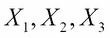，输出变量是 *Y*。严格来说，决策树不会显示构建树时使用的所有变量。在这个树结构中，决策树传统上是倒置显示的。我们有四个终端节点。如果满足条件 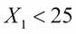，我们移动到树的右侧，并得出结论，平均 *Y* 值为 40。如果不满足条件，我们移动到左侧，并检查是否满足 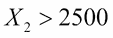。如果不满足这个条件，我们移动到树的左侧，并得出结论，平均 *Y* 值为 100。在满足这个条件后，我们移动到右侧，然后如果满足分类变量 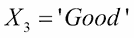，平均 *Y* 值将是 250，否则是 10。这个决策树也可以用以下方程表示：

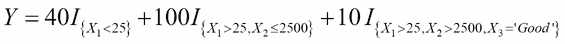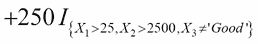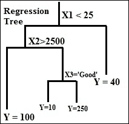

图 5：回归树

统计学家 Terry Therneau 开发了 `rpart` R 包。

### 甲状腺功能减退分类的决策树

使用 `rpart` 包中的 `rpart` 函数，我们为之前分区的数据构建了相同的分类树。该树可以使用绘图函数进行可视化，变量名可以用文本函数刻在树上。拟合的分类树（见图 *甲状腺功能减退分类的决策树*）的方程如下：

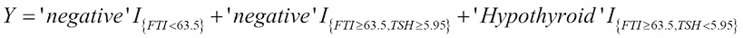

预测和准确度执行的方式与之前提到的类似：

```py
> CT_fit <- rpart(HT2_Formula,data=HT2_Train)
> plot(CT_fit,uniform=TRUE)
> text(CT_fit)
> CT_predict <- predict(CT_fit,newdata=HT2_TestX,type="class")
> CT_Accuracy <- sum(CT_predict==HT2_TestY)/nte
> CT_Accuracy
[1] 0.9874213836
```

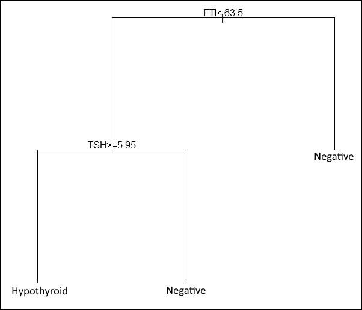

图 6：甲状腺功能减退分类树

因此，分类树给出了 98.74% 的准确度，是目前考虑的四个模型中最好的。接下来，我们将考虑最终的模型，即支持向量机。

## 支持向量机

**支持向量机**，通常简称为 **SVM**，是机器学习的一个重要类别。理论上，SVM 可以处理无限数量的特征/协变量，并构建适当的分类或回归 SVM。

### 用于甲状腺功能减退分类的支持向量机（SVM）

来自 `e1071` 包的 `svm` 函数将有助于在甲状腺功能减退数据集上构建 `SVM` 分类器。按照惯例，我们在 R 会话中得到了以下输出：

```py
> SVM_fit <- svm(HT2_Formula,data=HT2_Train)
> SVM_predict <- predict(SVM_fit,newdata=HT2_TestX,type="class")
> SVM_Accuracy <- sum(SVM_predict==HT2_TestY)/nte
> SVM_Accuracy
[1] 0.9842767296
```

SVM 技术为我们提供了 98.43% 的准确度，是目前设置模型中的第二好。

在下一节中，我们将为波形、德国信贷、鸢尾花和皮马印第安人糖尿病问题数据集的五个分类模型分别运行。

# 正确模型困境！

在上一节中，我们对`Hypothyroid`数据集运行了五个分类模型。这里，任务是重复对其他四个数据集进行同样的练习。改变适当位置的代码并重复四次将是一项非常繁琐的任务。因此，为了避免这个问题，我们将创建一个新的函数，称为`Multiple_Model_Fit`。这个函数将接受四个参数：`formula`、`train`、`testX`和`testY`。这四个参数已经为五个数据集中的每一个设置好了。然后，该函数被设置成以概括上一节中每个模型的步骤。

函数继续创建一个矩阵，其第一列包含模型名称，第二列包含准确率。这个矩阵作为该函数的输出返回：

```py
> Multiple_Model_Fit <- function(formula,train,testX,testY){
+   ntr <- nrow(train) # Training size
+   nte <- nrow(testX) # Test size
+   p <- ncol(testX)
+   testY_numeric <- as.numeric(testY)
+   
+   # Neural Network
+   set.seed(12345)
+   NN_fit <- nnet(formula,data = train,size=p,trace=FALSE)
+   NN_Predict <- predict(NN_fit,newdata=testX,type="class")
+   NN_Accuracy <- sum(NN_Predict==testY)/nte
+   
+   # Logistic Regressiona
+   LR_fit <- glm(formula,data=train,family = binomial())
+   LR_Predict <- predict(LR_fit,newdata=testX,type="response")
+   LR_Predict_Bin <- ifelse(LR_Predict>0.5,2,1)
+   LR_Accuracy <- sum(LR_Predict_Bin==testY_numeric)/nte
+   
+   # Naive Bayes
+   NB_fit <- naiveBayes(formula,data=train)
+   NB_predict <- predict(NB_fit,newdata=testX)
+   NB_Accuracy <- sum(NB_predict==testY)/nte
+   
+   # Decision Tree
+   CT_fit <- rpart(formula,data=train)
+   CT_predict <- predict(CT_fit,newdata=testX,type="class")
+   CT_Accuracy <- sum(CT_predict==testY)/nte
+   
+   # Support Vector Machine
+   svm_fit <- svm(formula,data=train)
+   svm_predict <- predict(svm_fit,newdata=testX,type="class")
+   svm_Accuracy <- sum(svm_predict==testY)/nte
+   
+   Accu_Mat <- matrix(nrow=5,ncol=2)
+   Accu_Mat[,1] <- c("Neural Network","Logistic Regression","Naive Bayes",
+                 "Decision Tree","Support Vector Machine")
+   Accu_Mat[,2] <- round(c(NN_Accuracy,LR_Accuracy,NB_Accuracy,
+                     CT_Accuracy,svm_Accuracy),4)
+   return(Accu_Mat)
+   
+ }
```

`Multiple_Model_Fit`现在应用于`Hypothyroid`数据集，结果可以看到与上一节一致：

```py
> Multiple_Model_Fit(formula=HT2_Formula,train=HT2_Train,
+                    testX=HT2_TestX,
+                    testY=HT2_TestY)
     [,1]                     [,2]    
[1,] "Neural Network"         "0.989" 
[2,] "Logistic Regression"    "0.9733"
[3,] "Naive Bayes"            "0.9733"
[4,] "Decision Tree"          "0.9874"
[5,] "Support Vector Machine" "0.9843"
```

然后将`Multiple_Model_Fit`函数应用于其他四个分类数据集：

```py
> Multiple_Model_Fit(formula=Waveform_DF_Formula,train=Waveform_DF_Train,
+                    testX=Waveform_DF_TestX,
+                    testY=Waveform_DF_TestY)
     [,1]                     [,2]    
[1,] "Neural Network"         "0.884" 
[2,] "Logistic Regression"    "0.8873"
[3,] "Naive Bayes"            "0.8601"
[4,] "Decision Tree"          "0.8435"
[5,] "Support Vector Machine" "0.9171"
> Multiple_Model_Fit(formula=GC2_Formula,train=GC2_Train,
+                    testX=GC2_TestX,
+                    testY =GC2_TestY )
     [,1]                     [,2]    
[1,] "Neural Network"         "0.7252"
[2,] "Logistic Regression"    "0.7572"
[3,] "Naive Bayes"            "0.8083"
[4,] "Decision Tree"          "0.7061"
[5,] "Support Vector Machine" "0.754" 
> Multiple_Model_Fit(formula=ir2_Formula,train=ir2_Train,
+                    testX=ir2_TestX,
+                    testY=ir2_TestY)
     [,1]                     [,2]
[1,] "Neural Network"         "1" 
[2,] "Logistic Regression"    "1" 
[3,] "Naive Bayes"            "1" 
[4,] "Decision Tree"          "1" 
[5,] "Support Vector Machine" "1"  
> Multiple_Model_Fit(formula=PID_Formula,train=PimaIndiansDiabetes_Train,
+                    testX=PimaIndiansDiabetes_TestX,
+                    testY=PimaIndiansDiabetes_TestY)
     [,1]                     [,2]    
[1,] "Neural Network"         "0.6732"
[2,] "Logistic Regression"    "0.751" 
[3,] "Naive Bayes"            "0.7821"
[4,] "Decision Tree"          "0.7588"
[5,] "Support Vector Machine" "0.7665"
```

每个数据集的结果总结在下表中：

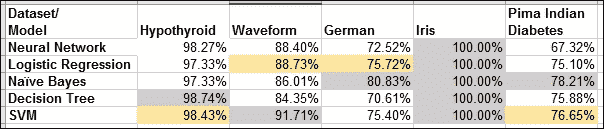

表 1：五个数据集五个模型的准确率

`iris`数据集是一个简单直接的问题，因此五个模型在测试数据上都能给出 100%的准确率。这个数据集将不再进一步研究。

对于每个数据集，我们用灰色突出显示最高准确率的单元格，并用黄色突出显示次高准确率的单元格。

这里是建模困境。朴素贝叶斯方法对于`German`和`Pima Indian Diabetes`数据集表现最佳。决策树对`Hypothyroid`数据集给出了最高的准确率，而 SVM 对`Waveform`给出了最佳结果。逻辑回归和 SVM 各两次获得了第二名。然而，我们也知道，根据初始种子和可能隐藏神经元的数量，神经网络也预期在某些数据集上表现最佳。我们还得考虑结果是否会因不同的分区而有所不同。

在这样的实际场景中，我们更希望有一个单一的方法来确保合理的属性。对于`Hypothyroid`数据集，每个模型的准确率都是 97%或更高，因此使用任何模型都不会出错。然而，在`German`和`Pima Indian Diabetes`问题上，最大准确率分别是 80%和 78%。因此，如果我们能充分利用所有模型并构建一个准确率更高的单一统一模型会更好。

# 集成概述

`caret` R 包是集成机器学习方法的基石。它提供了一个大型的框架，我们还可以将不同的统计和机器学习模型组合起来创建集成。对于作者笔记本电脑上该包的最新版本，`caret`包提供了以下模型的访问权限：

```py
> library(caret)
> names(getModelInfo())
  [1] "ada"                 "AdaBag"              "AdaBoost.M1" 
  [4] "adaboost"            "amdai"               "ANFIS" 
  [7] "avNNet"              "awnb"                "awtan"        

[229] "vbmpRadial"          "vglmAdjCat"          "vglmContRatio 
[232] "vglmCumulative"      "widekernelpls"       "WM" 
[235] "wsrf"                "xgbLinear"           "xgbTree" 
[238] "xyf"               
```

```py

Figure 7: Caret providing a message to install the required R package

```

您需要输入数字`1`并继续。包将被安装和加载，程序将继续。了解集成方法的众多选项是很好的。这里提供了一个堆叠集成分析模型的简要方法，详细内容将在本书的后续部分展开。

对于`Hypothyroid`数据集，五个模型之间的平均准确率高达 98%。`Waveform`数据集的平均准确率约为 88%，而`German` Credit 数据集的平均准确率为 75%。我们将尝试提高这个数据集的准确率。将尝试使用三个模型：朴素贝叶斯、逻辑回归和分类树来提高准确率。首先，我们需要将数据分为三部分：训练、测试和堆叠：

```py
> load("../Data/GC2.RData")
> set.seed(12345)
> Train_Test_Stack <- sample(c("Train","Test","Stack"),nrow(GC2),replace = TRUE,prob = c(0.5,0.25,0.25))
> GC2_Train <- GC2[Train_Test_Stack=="Train",]
> GC2_Test <- GC2[Train_Test_Stack=="Test",]
> GC2_Stack <- GC2[Train_Test_Stack=="Stack",]The dependent and independent variables will be marked next in character vectors for programming convenient. 

> # set label name and Exhogenous
> Endogenous <- 'good_bad'
> Exhogenous <- names(GC2_Train)[names(GC2_Train) != Endogenous]
```

模型将首先建立在训练数据上，并使用曲线下的面积（ROC 曲线）来评估准确性。首先设置控制参数，然后使用训练数据集创建三个模型：朴素贝叶斯、分类树和逻辑回归：

```py
> # Creating a caret control object for the number of 
> # cross-validations to be performed
> myControl <- trainControl(method='cv', number=3, returnResamp='none')
> # train all the ensemble models with GC2_Train
> model_NB <- train(GC2_Train[,Exhogenous], GC2_Train[,Endogenous], 
+                    method='naive_bayes', trControl=myControl)
> model_rpart <- train(GC2_Train[,Exhogenous], GC2_Train[,Endogenous], 
+                      method='rpart', trControl=myControl)
> model_glm <- train(GC2_Train[,Exhogenous], GC2_Train[,Endogenous], 
+                        method='glm', trControl=myControl)
```

接下来进行测试和堆叠块的预测。我们将预测概率存储在测试和堆叠数据框中：

```py
> # get predictions for each ensemble model for two last datasets
> # and add them back to themselves
> GC2_Test$NB_PROB <- predict(object=model_NB, GC2_Test[,Exhogenous],
+                              type="prob")[,1]
> GC2_Test$rf_PROB <- predict(object=model_rpart, GC2_Test[,Exhogenous],
+                             type="prob")[,1]
> GC2_Test$glm_PROB <- predict(object=model_glm, GC2_Test[,Exhogenous],
+                                  type="prob")[,1]
> GC2_Stack$NB_PROB <- predict(object=model_NB, GC2_Stack[,Exhogenous],
+                               type="prob")[,1]
> GC2_Stack$rf_PROB <- predict(object=model_rpart, GC2_Stack[,Exhogenous],
+                              type="prob")[,1]
> GC2_Stack$glm_PROB <- predict(object=model_glm, GC2_Stack[,Exhogenous],
+                                   type="prob")[,1]
```

ROC（受试者工作特征曲线）是模型评估的重要指标。ROC 曲线下的面积越大，模型越好。请注意，这些指标或任何其他指标都不会与之前拟合的模型相同，因为数据已经发生了变化：

```py
> # see how each individual model performed on its own
> AUC_NB <- roc(GC2_Test[,Endogenous], GC2_Test$NB_PROB )
> AUC_NB$auc
Area under the curve: 0.7543
> AUC_rf <- roc(GC2_Test[,Endogenous], GC2_Test$rf_PROB )
> AUC_rf$auc
Area under the curve: 0.6777
> AUC_glm <- roc(GC2_Test[,Endogenous], GC2_Test$glm_PROB )
> AUC_glm$auc
Area under the curve: 0.7446
```

对于`test`数据集，我们可以看到朴素贝叶斯、分类树和逻辑回归的曲线下面积分别为`0.7543`、`0.6777`和`0.7446`。如果我们以某种格式将预测值组合在一起，并且这导致准确性的提高，那么集成技术的目的就达到了。因此，我们考虑三个模型下的新预测概率，并将它们附加到堆叠数据框中。这三个列现在将被视为新的输入向量。然后我们构建一个朴素贝叶斯模型，这是一个任意的选择，您可以为堆叠数据框尝试任何其他模型（不一定是这些中的任何一个）。然后可以预测并计算 AUC：

```py
> # Stacking it together
> Exhogenous2 <- names(GC2_Stack)[names(GC2_Stack) != Endogenous]
> Stack_Model <- train(GC2_Stack[,Exhogenous2], GC2_Stack[,Endogenous], 
+                      method='naive_bayes', trControl=myControl)
> Stack_Prediction <- predict(object=Stack_Model,GC2_Test[,Exhogenous2],type="prob")[,1]
> Stack_AUC <- roc(GC2_Test[,Endogenous],Stack_Prediction)
> Stack_AUC$auc
Area under the curve: 0.7631
```

堆叠数据观察的 AUC 高于之前的任何模型，这是一个改进。

对于批判性思考者来说，应该会涌现出许多问题。这项技术为什么能起作用？它是否会在所有可能的情况下导致即兴发挥？如果是的话，仅仅添加新的模型预测是否会带来进一步的改进？如果不是，我们如何选择基础模型以确保我们可以合理地确信即兴发挥？模型选择有哪些限制？我们将在本书中提供对这些问题的多数解决方案。在下一节中，我们将快速查看一些有用的统计检验，这些检验将有助于评估模型性能。

# 补充统计检验

在这里，一个模型被选为另一个可能的模型。一个模型的准确性似乎高于另一个。该模型的 ROC 曲线下的面积（**AUC**）大于另一个。然而，仅基于纯数字得出结论是不合适的。从统计推断的角度来看，重要的是要得出这些数字是否具有统计学意义的结论。在分析世界中，当我们有机会时，使用统计测试来验证主张/假设是至关重要的。使用统计测试的一个原因是概率可能非常反直觉，表面上看起来可能的情况，在仔细检查并考虑到机会变化后可能并不成立。例如，如果一枚公平的硬币抛掷 100 次，认为正面数必须是正好 50 是不明智的。因此，如果一枚公平的硬币出现 45 次正面，我们需要考虑到正面数可能少于 50 的机会变化。在处理不确定数据时，我们必须始终保持谨慎。以下是一些例子。两个变量可能看起来彼此独立，相关系数也可能几乎等于零。然而，应用相关测试可能会得出结论，相关系数并不显著为零。由于我们将在本文中大量进行抽样和重抽样，我们将查看相关的测试。

## 排列测试

假设有两个过程，A 和 B，这两个过程的方差已知是相等的，尽管是未知的。从过程 A 的三个独立观察结果产生了 18、20 和 22 的产量，而从过程 B 的三个独立观察结果产生了 24、26 和 28 的产量。在假设产量遵循正态分布的情况下，我们想测试过程 A 和 B 的均值是否相同。这是一个适合应用 t 检验的情况，因为观察的数量较少。`t.test`函数的应用表明，两个均值彼此不同，这直观上似乎是正确的。

现在，在零假设下的假设是均值相等，方差在两个过程中未知且假设相等。因此，我们有充分的理由相信过程 A 的观察结果也可能发生在过程 B 中，反之亦然。因此，我们可以将过程 B 中的一个观察结果与过程 A 交换，并重新计算 t 检验。这个过程可以针对两个样本的所有可能的排列重复进行。一般来说，如果我们有来自总体 1 的 m 个样本和来自总体 2 的 n 个样本，我们可以有


不同的样本和尽可能多的测试。一个综合测试可以基于这样的排列样本和这样的测试被称为**排列测试**。

对于过程 A 和 B 的观察，我们首先将应用 t 检验，然后是排列检验。`t.test`可在核心`stats`包中找到，而排列 t 检验则来自`perm`包：

```py
> library(perm)
> x <- c(18,20,22); y <- c(24,26,28)
> t.test(x,y,var.equal = TRUE)
Two Sample t-test
data:  x and y
t = -3.6742346, df = 4, p-value = 0.02131164
alternative hypothesis: true difference in means is not equal to 0
95 percent confidence interval:
 -10.533915871  -1.466084129
sample estimates:
mean of x mean of y 
       20        26 
```

较小的 p 值表明过程 A 和 B 的均值不相等。因此，我们现在应用来自`perm`包的排列检验`permTS`：

```py
> permTS(x,y)
Exact Permutation Test (network algorithm)
data:  x and y
p-value = 0.1
alternative hypothesis: true mean x - mean y is not equal to 0
sample estimates:
mean x - mean y 
             -6 
```

现在的 p 值为 0.1，这意味着排列检验得出结论，过程的均值是相等的。这难道意味着排列检验将始终得出这个结论，与 t 检验相矛盾？答案是下一段代码给出的：

```py
> x2 <- c(16,18,20,22); y2 <- c(24,26,28,30)
> t.test(x2,y2,var.equal = TRUE)
Two Sample t-test
data:  x2 and y2
t = -4.3817805, df = 6, p-value = 0.004659215
alternative hypothesis: true difference in means is not equal to 0
95 percent confidence interval:
 -12.46742939  -3.53257061
sample estimates:
mean of x mean of y 
       19        27 
> permTS(x2,y2)
Exact Permutation Test (network algorithm)
data:  x2 and y2
p-value = 0.02857143
alternative hypothesis: true mean x2 - mean y2 is not equal to 0
sample estimates:
mean x2 - mean y2 
               -8 
```

## 卡方检验和 McNemar 检验

我们对甲状腺功能减退测试有五个模型。然后我们计算了准确度，并对这些数字感到满意。让我们首先看看拟合模型犯的错误数量。测试分区中有 636 个观察值，其中 42 个测试呈甲状腺功能减退阳性。请注意，如果我们将所有患者标记为阴性，我们将得到准确度为*1-42/636 = 0.934*，即约 93.4%。使用表格函数，我们将实际值与预测值进行比较，看看拟合模型出错有多频繁。我们在此指出，将甲状腺功能减退病例识别为相同，将阴性病例识别为阴性是正确的预测，而将甲状腺功能减退病例标记为阴性，反之亦然会导致错误。对于每个模型，我们查看误分类错误：

```py
> table(LR_Predict_Bin,testY_numeric)
              testY_numeric
LR_Predict_Bin   1   2
             1  32   7
             2  10 587
> table(NN_Predict,HT2_TestY)
             HT2_TestY
NN_Predict    hypothyroid negative
  hypothyroid          41       22
  negative              1      572
> table(NB_predict,HT2_TestY)
             HT2_TestY
NB_predict    hypothyroid negative
  hypothyroid          33        8
  negative              9      586
> table(CT_predict,HT2_TestY)
             HT2_TestY
CT_predict    hypothyroid negative
  hypothyroid          38        4
  negative              4      590
> table(SVM_predict,HT2_TestY)
             HT2_TestY
SVM_predict   hypothyroid negative
  hypothyroid          34        2
  negative              8      592
```

从错误分类表中，我们可以看到神经网络正确地识别了 42 个甲状腺功能减退病例中的 41 个，但它也错误地识别了更多的甲状腺功能减退病例。由此产生的问题是，拟合模型的正确预测是否只是偶然发生，或者它们是否依赖于真实情况并可解释。为了测试这一点，在假设框架中，我们想测试实际值和预测值是否相互独立或相互依赖。技术上，零假设是预测与实际值无关，如果一个模型解释了真实情况，则必须拒绝零假设。我们应该得出结论，拟合模型的预测依赖于真实情况。在这里，我们部署了两种解决方案，即卡方检验和 McNemar 检验：

```py
> chisq.test(table(LR_Predict_Bin,testY_numeric))
Pearson's Chi-squared test with Yates' continuity correction
data:  table(LR_Predict_Bin, testY_numeric)
X-squared = 370.53501, df = 1, p-value < 0.00000000000000022204
> chisq.test(table(NN_Predict,HT2_TestY))
Pearson's Chi-squared test with Yates' continuity correction
data:  table(NN_Predict, HT2_TestY)
X-squared = 377.22569, df = 1, p-value < 0.00000000000000022204
> chisq.test(table(NB_predict,HT2_TestY))
Pearson's Chi-squared test with Yates' continuity correction
data:  table(NB_predict, HT2_TestY)
X-squared = 375.18659, df = 1, p-value < 0.00000000000000022204
> chisq.test(table(CT_predict,HT2_TestY))
Pearson's Chi-squared test with Yates' continuity correction
data:  table(CT_predict, HT2_TestY)
X-squared = 498.44791, df = 1, p-value < 0.00000000000000022204
> chisq.test(table(SVM_predict,HT2_TestY))
Pearson's Chi-squared test with Yates' continuity correction
data:  table(SVM_predict, HT2_TestY)
X-squared = 462.41803, df = 1, p-value < 0.00000000000000022204
> mcnemar.test(table(LR_Predict_Bin,testY_numeric))
McNemar's Chi-squared test with continuity correction
data:  table(LR_Predict_Bin, testY_numeric)
McNemar's chi-squared = 0.23529412, df = 1, p-value = 0.6276258
> mcnemar.test(table(NN_Predict,HT2_TestY))
McNemar's Chi-squared test with continuity correction
data:  table(NN_Predict, HT2_TestY)
McNemar's chi-squared = 17.391304, df = 1, p-value = 0.00003042146
> mcnemar.test(table(NB_predict,HT2_TestY))
McNemar's Chi-squared test with continuity correction
data:  table(NB_predict, HT2_TestY)
McNemar's chi-squared = 0, df = 1, p-value = 1
> mcnemar.test(table(CT_predict,HT2_TestY))
McNemar's Chi-squared test
data:  table(CT_predict, HT2_TestY)
McNemar's chi-squared = 0, df = 1, p-value = 1
> mcnemar.test(table(SVM_predict,HT2_TestY))
McNemar's Chi-squared test with continuity correction
data:  table(SVM_predict, HT2_TestY)
McNemar's chi-squared = 2.5, df = 1, p-value = 0.1138463
```

卡方检验提供的答案清楚地表明，每个拟合模型的预测并非偶然。它还表明，拟合模型对甲状腺功能减退病例以及阴性病例的预测是预期的。McNemar 检验的解释和结论留给读者。在分类问题中，最重要的度量标准是 ROC 曲线，接下来我们将讨论它。

## ROC 检验

ROC 曲线是对模型性能的假阳性率和真阴性率的重要改进。有关详细解释，请参阅 Tattar 等人（2017 年）的第九章。ROC 曲线基本上是绘制真阳性率与假阳性率的关系图，我们测量拟合模型的 AUC。

ROC 测试试图实现的主要目标是以下内容。假设模型 1 给出 AUC 为 0.89，模型 2 给出 0.91。使用简单的 AUC 标准，我们直接得出结论，模型 2 优于模型 1。然而，一个重要的问题是，0.91 是否显著高于 0.89。来自`pROC`R 包的`roc.test`提供了答案。对于神经网络和分类树，以下 R 段提供了所需的答案：

```py
> library(pROC)
> HT_NN_Prob <- predict(NN_fit,newdata=HT2_TestX,type="raw")
> HT_NN_roc <- roc(HT2_TestY,c(HT_NN_Prob))
> HT_NN_roc$auc
Area under the curve: 0.9723826
> HT_CT_Prob <- predict(CT_fit,newdata=HT2_TestX,type="prob")[,2]
> HT_CT_roc <- roc(HT2_TestY,HT_CT_Prob)
> HT_CT_roc$auc
Area under the curve: 0.9598765
> roc.test(HT_NN_roc,HT_CT_roc)
	DeLong's test for two correlated ROC curves
data:  HT_NN_roc and HT_CT_roc
Z = 0.72452214, p-value = 0.4687452
alternative hypothesis: true difference in AUC is not equal to 0
sample estimates:
 AUC of roc1  AUC of roc2 
0.9723825557 0.9598765432 
```

由于 p 值非常大，我们得出结论，两个模型的 AUC 没有显著差异。

统计测试至关重要，我们建议在合适的情况下使用它们。本章中强调的概念将在本书的其余部分进行更详细的阐述。

# 摘要

本章以介绍本书其余部分将使用的一些最重要的数据集开始。这些数据集涵盖了包括分类、回归、时间序列、生存、聚类以及识别异常值很重要的数据集在内的各种分析问题。然后在统计/机器学习模型部分介绍了重要的分类模型家族。在介绍了各种模型后，我们立即看到了不足之处，即我们没有适用于所有季节的模型。模型性能因数据集而异。根据初始化的不同，某些模型（如神经网络）的性能受到影响。因此，有必要找到一种方法来确保模型可以在大多数情况下得到改进。

这为集成方法铺平了道路，这也是本书的标题。我们将在本书的其余部分详细阐述这种方法。本章以快速统计测试结束，这些测试有助于进行模型比较。重采样是集成方法的核心，我们将在下一章探讨重要的 Jackknife 和 Bootstrap 方法。
