# 第四章：随机森林

上一章介绍了袋装法作为一种基于同质基学习器的集成技术，其中决策树作为基学习器。袋装法的一个轻微不足是自助树之间存在相关性。因此，尽管预测的方差得到了降低，但偏差将持续存在。Breiman 提出了在每个分割处随机抽样协变量和独立变量的方法，这种方法随后有助于去相关自助树。

在本章的第一节中，介绍了随机森林算法并进行了说明。变量重要性的概念对于决策树及其所有变体至关重要，因此有一节专门用于清晰地阐述这一概念。随机森林的表现是否优于袋装法？答案将在下一节中给出。

Breiman 在随机森林的背景下阐述了邻近图的重要性，我们很快就会深入探讨这一点。如此复杂的算法将有很多细节，其中一些将通过程序和真实数据来展示。缺失数据几乎是普遍存在的，我们将承担使用随机森林插补缺失值的任务。尽管随机森林主要是一种监督学习技术，但它也可以用于对数据进行聚类，这一主题将是最后一节。

本章的核心主题如下：

+   随机森林算法

+   决策树和随机森林的变量重要性

+   比较随机森林与袋装法

+   使用邻近图

+   随机森林的细节、细节和细微差别

+   通过使用随机森林处理缺失数据

+   使用随机森林进行聚类

# 技术要求

在本章中，我们将使用以下库：

+   `kernlab`

+   `randomForest`

+   `randomForestExplainer`

+   `rpart`

# 随机森林

第三章，*袋装*，通过自助原理泛化了决策树。在我们开始随机森林之旅之前，我们将快速回顾决策树的历史，并突出其一些优点和缺点。决策树的发明是通过一系列论文的累积，而树的当前形式可以在 Breiman 等人（1984 年）的论文中找到详细信息。Breiman 的方法广为人知为**分类**和**回归**树，简称**CART**。在 20 世纪 70 年代末和 80 年代初，Quinlan 独立于 Breiman 发明了一种称为 C4.5 的算法。更多信息，请参阅 Quinlan（1984）。在很大程度上，当前形式的决策树、袋装和随机森林归功于 Breiman。还有一种类似的方法也存在于一个流行的缩写为 CHAID 的算法中，代表**Chi-square** **Automatic** **Interaction** **Detector**。CART 的深入探讨可以在 Hastie 等人（2009 年）的书中找到，而统计视角可以在 Berk（2016 年）的书中找到。Seni 和 Elder（2010 年）也有一套出色的简短笔记。没有特定的方向，我们强调 CART 的一些优点和缺点：

+   树自动解决变量选择问题，因为每次分割时，它们都寻找在回归变量中给出最佳分割的变量，因此树消除了无用的变量。

+   树不需要数据预处理。这意味着我们不必考虑转换、缩放和/或证据权重预处理。

+   树在计算上是可扩展的，时间复杂度是可管理的。

+   树提供了一个称为变量重要性的度量，该度量基于变量对树中所有分割的误差减少的贡献。

+   树有效地处理缺失值，如果一个观测值有缺失值，树将继续使用观测值的可用值。处理缺失数据通常是通过代理分割的概念来实现的。

+   树的参数较少，如前一章所示。

+   树具有简单的自顶向下的解释。

+   深度大的树往往几乎是无偏的。

+   变量之间的交互效应很容易识别。

+   它的缺点是拟合的模型不是连续的，并且会有尖锐的边缘。本质上，树是分段常数回归模型。

+   树不能近似低交互的目标函数。

+   树的贪婪搜索方法会导致高方差。

树的第一种扩展可以在前一章讨论的袋装算法中看到。假设我们有 N 个观测值。对于每个自助样本，我们用替换法抽取 N 个观测值。两个自助样本之间可能有多少观测值是共同的？让我们先写一个简单的程序来找出它，使用简单的`sample`函数：

```py
> N <- seq(1e3,1e4,1e3)
> N
 [1]  1000  2000  3000  4000  5000  6000  7000  8000  9000 10000
> B <- 1e3
> Common_Prob <- NULL
>index<- 1
>for(i in N){
+   temp_prob <- NULL
+   for(j in 1:B){
+     s1 <- sample(i,size=i,replace=TRUE)
+     s2 <- sample(i,size=i,replace=TRUE)
+     temp_prob <- c(temp_prob,length(intersect(s1,s2))/i)
+   }
+   Common_Prob[index] <- mean(temp_prob)
+   index<- index + 1
+ }
> Common_Prob
 [1] 0.4011 0.4002 0.3996 0.3982 0.3998 0.3996 0.3994 0.3997 0.3996 0.3995
```

这个程序需要解释。观测值数量 *N* 从 1000 到 10000 不等，每次增加 1000，我们进行 *B = 1e3 = 1000* 次自助迭代。现在，对于固定的 *N* 大小，我们抽取两个有放回的样本，大小为 *N*，看看它们之间有多少观测值是共同的，然后除以 *N*。*B = 1000* 个样本的平均值是两个样本之间找到共同观测值的概率。等价地，它给出了两个样本之间的共同观测值百分比。

自助概率清楚地表明，大约 40%的观测值将在任意两棵树之间是共同的。因此，这些树将是相关的。

在第十五章中，Hastie 等人（2009 年）指出，袋装树是独立同分布的树，因此任何一棵树的期望值与任何其他树的期望值相同。因此，袋装树的偏差与单个树的偏差相同。因此，方差减少是袋装提供的唯一改进。假设我们有一个 B 个独立同分布的随机变量，其方差为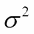。样本平均值的方差为。然而，如果我们知道变量只是同分布的，并且存在的正相关对，那么样本平均值的方差如下：

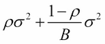

注意，随着 B 样本数量的增加，第二项消失，第一项保持不变。因此，我们看到袋装树的关联性限制了平均化的好处。这促使布莱曼创新，使得后续的树不会相关。

布莱曼的解决方案是在每次分割之前，随机选择 *m < p* 个输入变量进行分割。这为随机森林奠定了基础，我们在数据中“摇动”以改善性能。请注意，仅仅“摇动”并不能保证改进。这个技巧在我们有高度非线性估计器时很有帮助。正式的随机森林算法，根据 Hastie 等人（2009 年）和 Berk（2016 年）的描述，如下所示：

1.  从数据中抽取一个大小为 N 的有放回的随机样本。

1.  从预测值中抽取一个不放回的随机样本。

1.  按照常规方式构建数据的第一层递归分割。

1.  重复步骤 2，直到树达到所需的大小。重要的是不要剪枝。计算每个终端节点的比例。

1.  将树外的（OOB）数据向下传递到树中，并存储每个观测值分配的类别，以及每个观测值的预测值。

1.  重复步骤 1-5 多次，例如 1000 次。

1.  当观测值是 OOB 时，仅使用分配给每个观测值的类别，计算观测值在树中被分类为一个类别和另一个类别的次数。

1.  当该案例为 OOB 时，通过在树集合中对每个案例进行多数投票将其分配到类别。

从他的实践经验中，Breiman 建议在每次分割时随机选择一定数量的协变量，如 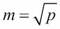 对于分类问题，最小节点大小为 1，而对于回归问题，建议 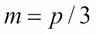 最小节点大小为 5。

我们将使用 `randomForest` R 包进行软件实现。将使用德国信用数据进行进一步分析。如果你还记得，在第一章，*集成技术介绍*中，使用基本分类树获得的准确率为 70%。我们将使用与之前相同的设置设置德国信用数据，并将构建随机森林：

```py
>load("../Data/GC2.RData")
>set.seed(12345)
> Train_Test <- sample(c("Train","Test"),nrow(GC2),
+ replace = TRUE,prob = c(0.7,0.3))
> GC2_Train <- GC2[Train_Test=="Train",]
> GC2_TestX <- within(GC2[Train_Test=="Test",],rm(good_bad))
> GC2_TestY <- GC2[Train_Test=="Test","good_bad"]
> GC2_Formula <- as.formula("good_bad~.")
> GC2_RF <- randomForest(GC2_Formula,data=GC2_Train,ntree=500)
> GC2_RF_Margin <- predict(GC2_RF,newdata = GC2_TestX,type="class")
>sum(GC2_RF_Margin==GC2_TestY)/313
[1] 0.7795527
```

`randomForest` 函数如前所述应用于 `formula` 和 `data`。在这里，我们指定了树的数量为 500，使用 `ntree=500`。

如果我们将这个随机结果与上一章中的 bagging 结果进行比较，那里的准确率仅为 `0.78`。这里我们有 `p = 19` 个协变量，因此我们将尝试在 `8` 处增加用于分割的协变量样本数量，并看看它的表现：

```py
> GC2_RF2 <- randomForest(GC2_Formula,data=GC2_Train,mtry=8, 
+ ntree=500)
> GC2_RF_Margin <- predict(GC2_RF,newdata = GC2_TestX, type="class")
> GC2_RF2_Margin <- predict(GC2_RF2,newdata = GC2_TestX,type="class")
> sum(GC2_RF2_Margin==GC2_TestY)/313
[1] 0.7859425
```

增加 `0.01` 或大约 1%可能看起来很少。然而，在银行环境中，这种准确率将转化为数百万美元。我们将使用常规的 `plot` 函数：

```py
>plot(GC2_RF2)
> GC2_RF2.legend <- colnames(GC2_RF2$err.rate)
> legend(x=300,y=0.5,legend = GC2_RF2.legend,lty=c(1,2,3), col=c(1,2,3))
>head(GC2_RF2$err.rate,10)
            OOB       bad      good
 [1,] 0.3206751 0.4743590 0.2452830
 [2,] 0.3218673 0.4769231 0.2490975
 [3,] 0.3222656 0.5437500 0.2215909
 [4,] 0.3006993 0.5224719 0.2005076
 [5,] 0.3262643 0.5445026 0.2274882
 [6,] 0.3125000 0.5522388 0.2027335
 [7,] 0.3068702 0.5631068 0.1893096
 [8,] 0.2951807 0.5741627 0.1670330
 [9,] 0.2976190 0.5619048 0.1774892
[10,] 0.2955882 0.5801887 0.1666667
```

以下图形是使用 `plot` 函数执行的前述代码的输出：`

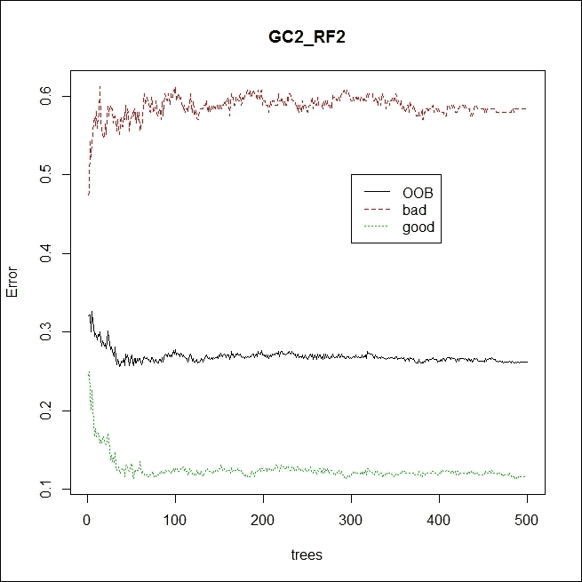

图 1：德国信用数据随机森林的错误率

我们有三个曲线：OOB 的错误率、好类别的错误率和坏类别的错误率。请注意，错误率在大约 100 棵树时稳定。使用损失矩阵，可能可以减少三条曲线之间的差距。理想情况下，三条曲线应该尽可能接近。

**练习**：创建具有 `split` 标准选项、`loss` 矩阵、`minsplit` 和不同 `mtry` 的随机森林。检查错误率曲线并准备总结。

可视化随机森林！树在哪里？显然，我们需要做很多练习来从拟合的 `randomForest` 对象中提取树。在 `Utilities.R` 文件中定义了一个新的函数 `plot_RF`，我们将在下面显示它：

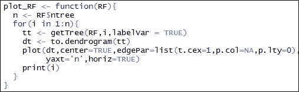

`plot_RF` 函数首先获取森林中的 `$ntree` 树的数量。然后它将运行一个 `for` 循环。在循环的每次迭代中，它将使用 `getTree` 函数提取与该树相关的信息并创建一个新的 `dendogram` 对象。然后可视化 `dendogram`，它就是树。此外，`print` 命令是可选的，可以被禁用。

在以下图中显示了 PDF 文件中森林中的四个任意选择的树，随机森林的树：

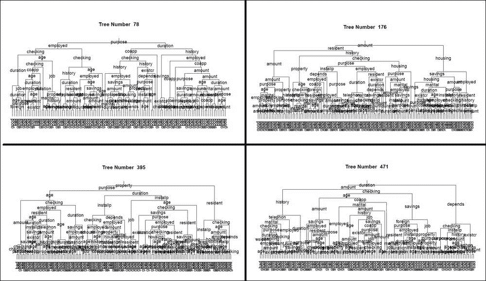

图 2：随机森林的树

快速浏览了 Pima 印第安人糖尿病问题。在第一章的准确率表中，*集成技术介绍*，我们可以看到决策树的准确率为 0.7588，或 75.88%：

```py
> data("PimaIndiansDiabetes")
> set.seed(12345)
> Train_Test <- sample(c("Train","Test"),nrow(PimaIndiansDiabetes),
+ replace = TRUE, prob = c(0.7,0.3))
> head(Train_Test)
[1] "Test"  "Test"  "Test"  "Test"  "Train" "Train"
> PimaIndiansDiabetes_Train <- PimaIndiansDiabetes[Train_Test=="Train",]
> PimaIndiansDiabetes_TestX <- within(PimaIndiansDiabetes[Train_Test=="Test",],rm(diabetes))
> PimaIndiansDiabetes_TestY <- PimaIndiansDiabetes[ 
+ Train_Test=="Test","diabetes"]
> PID_Formula <- as.formula("diabetes~.")
> PID_RF <- randomForest(PID_Formula,data=PimaIndiansDiabetes_Train,coob=TRUE,
+                        ntree=500,keepX=TRUE,mtry=5,
+                        parms=list(prior=c(0.65,0.35)))
> PID_RF_Margin <- predict(PID_RF,newdata = PimaIndiansDiabetes_TestX, type="class")
> sum(PID_RF_Margin==PimaIndiansDiabetes_TestY)/257
[1] 0.7704
```

因此，我们的准确率提高了 0.7704 - 0.7588 = 0.0116，或大约 1.2%。

**练习**：获取 Pima 印第安人糖尿病问题的错误率图。

# 变量重要性

统计模型，例如线性回归和逻辑回归，通过 p 值和 t 统计量等指标来指示哪些变量是显著的。在决策树中，分割是由单个变量引起的。如果指定代理分割的变量数量，某个变量可能在树中多次作为分割标准出现，而某些变量可能根本不会出现在树分割中。在每次分割中，我们选择导致最大不纯度减少的变量，并且一个变量在整个树分割中的贡献也会不同。整个树分割的总体改进（通过分类树的不纯度减少或通过分割标准的改进）被称为*变量重要性*。在集成方法如 bagging 和随机森林的情况下，对技术中的每棵树进行变量重要性的测量。虽然变量重要性的概念很简单，但其计算理解往往不清楚。这主要是因为没有给出数学形式的公式或表达式。下面的简单代码展示了这个想法。

来自`rpart`包的`kyphosis`数据集包含四个变量，这里的目标变量命名为`Kyphosis`，表示手术后存在脊柱侧弯类型的变形。三个解释变量是`Age`、`Number`和`Start`。我们使用`maxsurrogate=0`选项构建了一个没有代理变量的分割标准的分类树。零代理变量的选择确保我们在分割处只有一个变量。树被设置并如下可视化：

```py
> data(kyphosis)
> kc<- rpart(Kyphosis~.,data=kyphosis,maxsurrogate=0)
> plot(kc);text(kc)
```

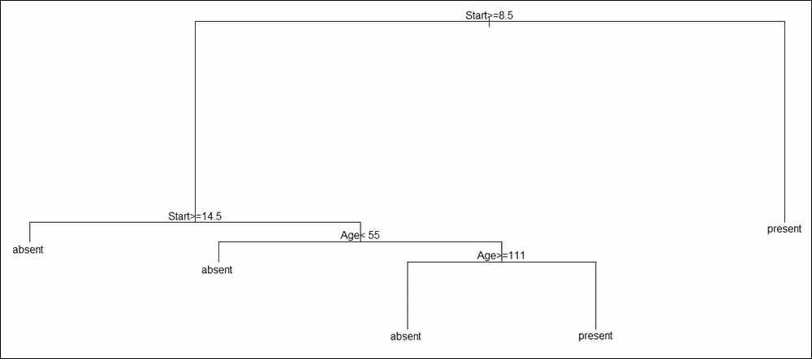

图 3：脊柱侧弯分类树

在无代理树中，第一个分割变量是`Start`，分割的右侧部分有一个终端叶。左侧/分区进一步使用`Start`变量再次分割，左侧有一个终端节点/叶，右侧有一个后续分割。在接下来的两个分割点，我们只使用`Age`变量，`Number`变量在整个树中任何地方都没有使用。因此，我们预计`Number`变量的重要性为零。

在拟合的分类树上使用 `$variable.importance`，我们获得了三个解释变量的变量重要性：

```py
>kc$variable.importance
Start   Age 
7.783 2.961 
```

如预期的那样，`Number` 变量没有显示任何重要性。`Start` 的重要性给出为 `7.783`，而 `Age` 为 `2.961`。要理解 R 如何计算这些值，请在分类树上运行 `summary` 函数：

```py
>summary(kc)
Call:
rpart(formula = Kyphosis ~ ., data = kyphosis, maxsurrogate = 0)
  n= 81 
       CP nsplit rel error xerror   xstd
1 0.17647      0    1.0000      1 0.2156
2 0.01961      1    0.8235      1 0.2156
3 0.01000      4    0.7647      1 0.2156

Variable importance
Start   Age 
   72    28 

Node number 1: 81 observations,    complexity param=0.1765
predicted class=absent   expected loss=0.2099  P(node) =1
class counts:    64    17
probabilities: 0.790 0.210 
left son=2 (62 obs) right son=3 (19 obs)
  Primary splits:
Start  < 8.5to the right, improve=6.762, (0 missing)
      Number <5.5  to the left,  improve=2.867, (0 missing)
      Age    < 39.5 to the left,  improve=2.250, (0 missing)

Node number 2: 62 observations,    complexity param=0.01961
predicted class=absent   expected loss=0.09677  P(node) =0.7654
class counts:    56     6
probabilities: 0.903 0.097 
left son=4 (29 obs) right son=5 (33 obs)
  Primary splits:
Start  < 14.5to the right, improve=1.0210, (0 missing)
      Age    < 55   to the left,  improve=0.6849, (0 missing)
      Number <4.5  to the left,  improve=0.2975, (0 missing)

Node number 3: 19 observations
predicted class=present  expected loss=0.4211  P(node) =0.2346
class counts:     8    11
probabilities: 0.421 0.579 

Node number 4: 29 observations
predicted class=absent   expected loss=0  P(node) =0.358
class counts:    29     0
probabilities: 1.000 0.000 

Node number 5: 33 observations,    complexity param=0.01961
predicted class=absent   expected loss=0.1818  P(node) =0.4074
class counts:    27     6
probabilities: 0.818 0.182 
left son=10 (12 obs) right son=11 (21 obs)
  Primary splits:
Age    < 55to the left,  improve=1.2470, (0 missing)
Start  < 12.5 to the right, improve=0.2888, (0 missing)
      Number <3.5  to the right, improve=0.1753, (0 missing)

Node number 10: 12 observations
predicted class=absent   expected loss=0  P(node) =0.1481
class counts:    12     0
probabilities: 1.000 0.000 

Node number 11: 21 observations,    complexity param=0.01961
predicted class=absent   expected loss=0.2857  P(node) =0.2593
class counts:    15     6
probabilities: 0.714 0.286 
left son=22 (14 obs) right son=23 (7 obs)
  Primary splits:
Age    <111  to the right, improve=1.71400, (0 missing)
Start  < 12.5 to the right, improve=0.79370, (0 missing)
      Number <3.5  to the right, improve=0.07143, (0 missing)

Node number 22: 14 observations
predicted class=absent   expected loss=0.1429  P(node) =0.1728
class counts:    12     2
probabilities: 0.857 0.143 

Node number 23: 7 observations
predicted class=present  expected loss=0.4286  P(node) =0.08642
class counts:     3     4
probabilities: 0.429 0.571 
```

摘要输出中已经突出显示了四行输出，每一行都包含了关于分割、每个变量提供的最佳改进以及分割时选择的变量的信息。因此，对于 `Start` 变量，第一行突出显示了 `6.762` 的改进，第二行显示了 `1.021`。通过将这些值相加，我们得到 `6.762 + 1.021 = 7.783`，这与从 `$variable.importance` 提取器给出的输出相同。同样，最后两行突出显示了 `Age` 的贡献，即 `1.274 + 1.714 = 2.961`。因此，我们已经清楚地概述了变量重要性的计算。

**练习**：创建一个新的分类树，例如 `KC2`，并允许使用代理分割。使用 `summary` 函数验证与变量重要性相关的计算。

来自 `randomForest` 包的 `VarImpPlot` 函数为我们提供了一个变量重要性测量的点图：

```py
>windows(height=100,width=200)
>par(mfrow=c(1,2))
>varImpPlot(GC2_RF,main="Variable Importance plot for \n Random 
+ Forest of German Data")
>varImpPlot(PID_RF,main="Variable Importance plot for \n Random Forest of Pima Indian Diabetes")
```

下一个图给出了一个视觉展示：

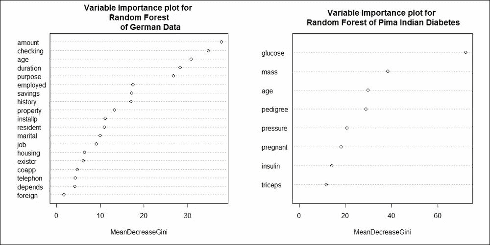

图 4：德国和皮马印第安人糖尿病随机森林的变量重要性图

因此，将德国信贷分类为好或坏的五个最重要的变量是 `amount`、`checking`、`age`、`duration` 和 `purpose`。对于皮马印第安人糖尿病分类，三个最重要的变量是 `glucose`、`mass` 和 `age`。

我们接下来将探讨邻近度测量的概念。

# 邻近图

根据 Hastie 等人（2009）的说法，"*随机森林的一个宣传输出是邻近图"*（见第 595 页）。但邻近图是什么？如果我们有 *n* 个观测值在训练数据集中，就会创建一个阶数为 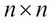 的邻近矩阵。在这里，矩阵初始化时所有值都为 0。每当一对观测值，如 OOB，在树的终端节点中同时出现时，邻近计数就会增加 1。邻近矩阵使用多维尺度方法进行可视化，这是一个超出本章范围的概念，其中邻近矩阵以二维形式表示。邻近图从随机森林的角度给出了哪些点彼此更近的指示。

在早期创建随机森林时，我们没有指定邻近矩阵的选项。因此，我们将首先使用邻近选项创建随机森林，如下所示：

```py
> GC2_RF3 <- randomForest(GC2_Formula,data=GC2_Train,
+                         ntree=500,proximity=TRUE,cob.prox=TRUE)
> GC2_RF3$proximity[1:10,1:10]
        5      6      7      8     11     12     14     15     16     17
5  1.0000 0.0000 0.0000 0.0133 0.0139 0.0159 0.0508 0.0645 0.0000 0.0000
6  0.0000 1.0000 0.0435 0.0308 0.0000 0.0000 0.0000 0.0000 0.0000 0.0417
7  0.0000 0.0435 1.0000 0.0000 0.0000 0.0000 0.0000 0.0000 0.0000 0.2000
8  0.0133 0.0308 0.0000 1.0000 0.0000 0.0000 0.0000 0.0000 0.0137 0.0000
11 0.0139 0.0000 0.0000 0.0000 1.0000 0.0395 0.0000 0.2034 0.0147 0.0000
12 0.0159 0.0000 0.0000 0.0000 0.0395 1.0000 0.0000 0.0323 0.0000 0.0000
14 0.0508 0.0000 0.0000 0.0000 0.0000 0.0000 1.0000 0.0167 0.0435 0.0182
15 0.0645 0.0000 0.0000 0.0000 0.2034 0.0323 0.0167 1.0000 0.0345 0.0000
16 0.0000 0.0000 0.0000 0.0137 0.0147 0.0000 0.0435 0.0345 1.0000 0.0159
17 0.0000 0.0417 0.2000 0.0000 0.0000 0.0000 0.0182 0.0000 0.0159 1.0000
>MDSplot(GC2_RF3,fac = GC2_Train$good_bad,
+         main="MDS Plot for Proximity Matrix of a RF")
```

选项 `proximity=TRUE,cob.prox=TRUE` 对于获得 `proximity` 矩阵非常重要。然后我们简单地使用 `MDSplot` 图形函数：

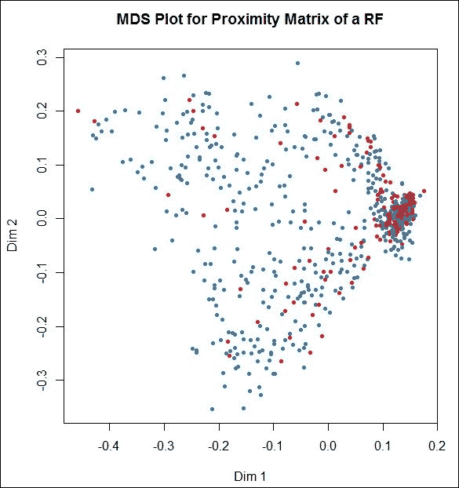

图 5：RF 邻近矩阵的多维图

从邻近数据的角度来看，使用`which.max`函数更容易找到与给定观察值最近的观察值，而不是欧几里得距离：

```py
>which.max(GC2_RF3$proximity[1,-1])
962 
657 
>which.max(GC2_RF3$proximity[2,-2])
686 
458 
```

因此，训练数据集中编号为`657`的观察值（以及在整体数据集中的`962`）与第一个观察值最接近。请注意，整体位置是由于从样本函数中提取的名称造成的。`which.max`函数对于在数组中找到最大位置是有用的。

结果表明，大多数情况下，使用`MDSplot`函数的图形显示结果是一个类似星形的显示。邻近矩阵也有助于进行聚类分析，这将在本章的结尾部分看到。接下来，我们将更详细地介绍随机森林的参数。

# 随机森林的细微差别

`GC_Random_Forest.pdf`文件包含了 500 棵树，这些树作为随机森林集成中的同质学习器。众所周知，决策树有一个很好且清晰的解释。这是因为它展示了如何遍历路径到一个终端节点。在每个分割点随机选择特征和自举样本导致随机森林的建立。请参考图*随机森林的树*，它描绘了编号为`78`、`176`、`395`和`471`的树。这四棵树的第一分割点分别是`目的`、`金额`、`属性`和`持续时间`。这四棵树第一左边的第二分割点分别是`雇员`、`居民`、`目的`和`金额`。看到哪些变量比其他变量更有意义是一项繁琐的练习。我们知道，变量出现得越早，其重要性就越高。随之而来的问题是，对于随机森林而言，我们如何找到变量的深度分布？这一点以及许多其他问题都通过一个强大的随机森林包`randomForestExplainer`得到了解决，而且毫不夸张地说，没有这个了不起的包，本节将无法实现。

通过对随机森林对象应用`min_depth_distribution`函数，我们得到变量的深度分布。然后使用`plot_min_depth_distribution`，我们得到最小深度分布的图：

```py
> GC2_RF_MDD <- min_depth_distribution(GC2_RF)
>head(GC2_RF_MDD)
tree variable minimal_depth
1    1      age             4
2    1   amount             3
3    1 checking             0
4    1    coapp             2
5    1  depends             8
6    1 duration             2
>windows(height=100,width=100)
> plot_min_depth_distribution(GC2_RF_MDD,k=nrow(GC2_TestX))
```

前一个代码块的结果是*德国随机森林的最小深度分布*，具体如下：

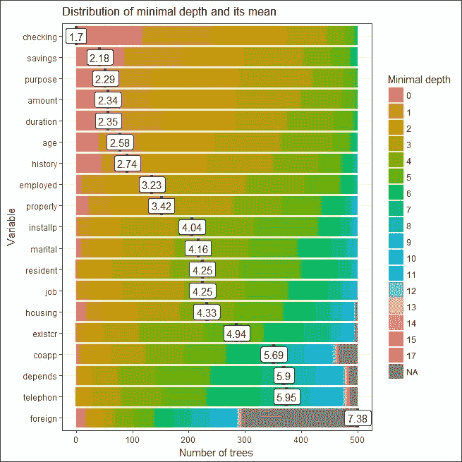

图 6：德国随机森林的最小深度分布

从前面的图中可以看出，`checking`变量作为主要分割点出现的频率更高，其次是`savings`、`目的`、`金额`和`持续时间`。因此，通过最小深度分布图，我们得到了一个有用的描述。可以通过使用`measure_importance`函数进行进一步的分析，它为我们提供了随机森林变量各种重要性度量：

```py
> GC2_RF_VIM <- measure_importance(GC2_RF)
[1] "Warning: your forest does not contain information on local importance so 'accuracy_decrease' measure cannot be extracted. To add it regrow the forest with the option localImp = TRUE and run this function again."
```

我们在这里被警告，随机森林没有使用`localImp = TRUE`选项进行生长，这是获得度量的关键。因此，我们创建一个新的随机森林，然后在其上运行`measure_importance`函数：

```py
> GC2_RF4<- randomForest(GC2_Formula,data=GC2_Train,
+                        ntree=500,localImp=TRUE)
> GC2_RF4_VIM <- measure_importance(GC2_RF4)
```

输出格式更宽，因此我们以图像格式提供它，并在*变量重要性度量分析*中垂直显示结果。我们可以看到，`measure_importance`函数提供了关于平均最小深度、变量作为节点出现在 500 棵树中的节点数量、平均准确度下降、基尼减少等方面的许多信息。

从输出中我们可以看到，如果平均最小深度较高，相关的 p 值也较高，因此变量不显著。例如，变量`coapp`、`depends`、`existcr`、`foreign`和`telephon`的平均最小深度较高，在大多数情况下它们的 p 值也是 1。同样，`gini_decrease`的较低值也与较高的 p 值相关联，这表明变量的不显著性：

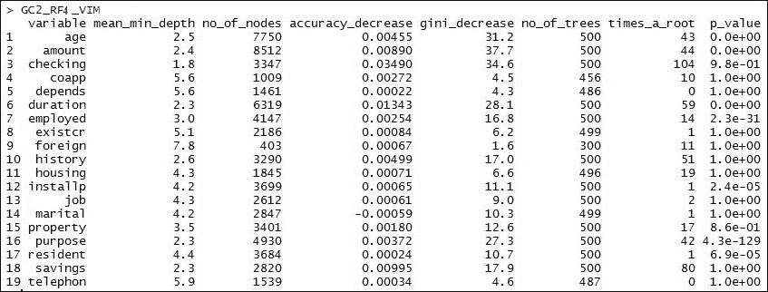

图 7：变量重要性度量分析

可以使用重要性度量对象`GC2_RF_VIM`进行进一步分析。对于`no_of_nodes`度量，我们可以比较之前变量重要性度量中的各种指标。例如，我们想看看变量的`times_a_root`值与平均最小深度的关系。同样，我们还想分析其他度量。通过在此对象上应用`plot_multi_way_importance`图形函数，我们得到以下输出：

```py
> P1 <- plot_multi_way_importance(GC2_RF4_VIM, size_measure = "no_of_nodes",
+                           x_measure="mean_min_depth",
+                           y_measure = "times_a_root")
> P2 <- plot_multi_way_importance(GC2_RF4_VIM, size_measure = "no_of_nodes",
+                           x_measure="mean_min_depth",
+                           y_measure = "gini_decrease")
> P3 <- plot_multi_way_importance(GC2_RF4_VIM, size_measure = "no_of_nodes",
+                           x_measure="mean_min_depth",
+                           y_measure = "no_of_trees")
> P4 <- plot_multi_way_importance(GC2_RF4_VIM, size_measure = "no_of_nodes",
+                           x_measure="mean_min_depth",
+                           y_measure = "p_value")
> grid.arrange(P1,P2,P3,P4, ncol=2)
```

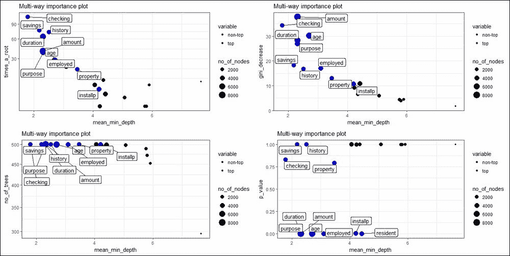

图 8：德国信贷数据的多元重要性图

在这里，变量的`times_a_root`值与平均最小深度`mean_min_depth`相对应，同时保持节点数量与其大小一致。非顶级变量为黑色，而顶级变量为蓝色。同样，我们在前一个图中将`gini_decrease`、`no_of_trees`和`p_value`与`mean_min_depth`相对应。

使用`plot_importance_ggpairs`函数绘制了五个度量之间的相关性，如下所示：

```py
> plot_importance_ggpairs(GC2_RF4_VIM)
```

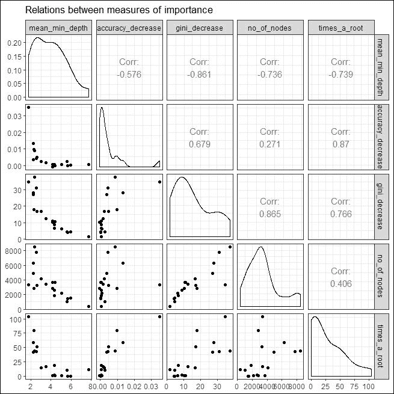

图 9：重要性度量之间的关系

由于这些度量高度相关，无论是正相关还是负相关，我们需要所有五个这些度量来理解随机森林。

树结构的优点之一是解释变量之间的交互作用。例如，如果父节点中的分割是由一个变量进行的，而在子节点中是由另一个变量进行的，我们可以得出这两个变量之间存在交互的结论。再次，对于随机森林来说，问题又出现了。使用`important_variables`和`min_depth_interactions`，我们可以获得随机森林中变量之间的交互如下：

```py
> GC2_RF4_VIN <- important_variables(GC2_RF4, k = 5, 
+                                    measures = c("mean_min_depth", "no_of_trees"))
> GC2_RF4_VIN_Frame <- min_depth_interactions(GC2_RF4,GC2_RF4_VIN)
>head(GC2_RF4_VIN_Frame[order(GC2_RF4_VIN_Frame$occurrences, decreasing = TRUE), ])
variable root_variable mean_min_depth occurrences       interaction
7    amount      checking            1.6         442   checking:amount
2       age      checking            2.0         433      checking:age
27 duration      checking            2.1         426 checking:duration
77  purpose      checking            2.0         420  checking:purpose
32 employed      checking            2.6         417 checking:employed
8    amount      duration            2.4         408   duration:amount
   uncond_mean_min_depth
7                    2.4
2                    2.5
27                   2.3
77                   2.3
32                   3.0
8                    2.4
> plot_min_depth_interactions(GC2_RF2_VIN_Frame)
```

以下是将获得的结果：

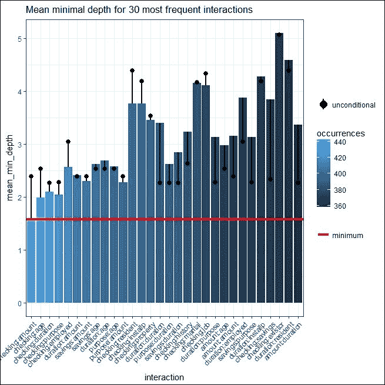

图 10：德国随机森林的最小深度交互

因此，我们可以轻松地找到随机森林的交互变量。

`randomForestExplainer` R 包非常强大，帮助我们获得随机森林后执行许多诊断。没有后诊断，我们无法评估任何拟合模型。因此，建议读者在本节的实现中执行大多数学习到的步骤。

在下一节中，我们将比较随机森林与 Bagging 过程。

**练习**：对为皮马印第安人糖尿病问题构建的随机森林进行诊断。

# 与 Bagging 的比较

当将随机森林的结果与德国信用数据集和皮马印第安人糖尿病数据集的 Bagging 对应方进行比较时，我们没有在数据的验证分区上看到准确率的明显提高。可能的原因是 Bagging 实现的方差减少已经达到最佳，任何偏差的改进都不会导致准确率的提高。

我们认为数据集可以从 R 核心包`kernlab`中获取。该数据集是垃圾邮件，包含 4601 封带有标签的电子邮件，标签表明电子邮件是垃圾邮件还是非垃圾邮件。数据集包含从电子邮件内容中派生的 57 个变量的良好集合。任务是构建一个用于垃圾邮件识别问题的良好分类器。该数据集迅速划分为训练集和验证集，就像早期问题一样：

```py
> data("spam")
> set.seed(12345)
> Train_Test <- sample(c("Train","Test"),nrow(spam),replace = TRUE,
+ prob = c(0.7,0.3))
> head(Train_Test)
[1] "Test"  "Test"  "Test"  "Test"  "Train" "Train"
> spam_Train <- spam[Train_Test=="Train",]
> spam_TestX <- within(spam[Train_Test=="Test",],rm(type))
> spam_TestY <- spam[Train_Test=="Test","type"]
> spam_Formula <- as.formula("type~.")
```

首先，我们将构建简单的分类树：

```py
> spam_ct <- rpart(spam_Formula,data=spam_Train)
> spam_ct_predict <- predict(spam_ct,newdata=spam_TestX, 
+ type="class")
> ct_accuracy <- sum(spam_ct_predict==spam_TestY)/nrow(spam_TestX)
> ct_accuracy
[1] 0.8994
```

分类树给出了大约 90%的适度准确率。然后我们将应用`randomForest`并构建随机森林：

```py
> spam_rf <- randomForest(spam_Formula,data=spam_Train,coob=TRUE,
+                         ntree=500,keepX=TRUE,mtry=5)
> spam_rf_predict <- predict(spam_rf,newdata=spam_TestX, 
+ type="class")
> rf_accuracy <- sum(spam_rf_predict==spam_TestY)/nrow(spam_TestX)
> rf_accuracy
[1] 0.9436
```

可以使用`randomForest`函数进行 Bagging。技巧是要求随机森林在设置分割时使用所有变量。因此，选择`mtry=ncol(spal_TestX)`将选择所有变量，然后 Bagging 就很容易执行：

```py
> spam_bag <- randomForest(spam_Formula,data=spam_Train,coob=TRUE,
+ ntree=500,keepX=TRUE,mtry=ncol(spam_TestX))
> spam_bag_predict <- predict(spam_bag,newdata=spam_TestX,
+ type="class")
> bag_accuracy <- sum(spam_bag_predict==spam_TestY)/
+ nrow(spam_TestX)
> bag_accuracy
[1] 0.935
> windows(height=100,width=200)
> par(mfrow=c(1,2))
> plot(spam_rf,main="Random Forest for Spam Classification")
> plot(spam_bag,main="Bagging for Spam Classification")
```

准确率的提高也反映在准确率图中，如下所示：

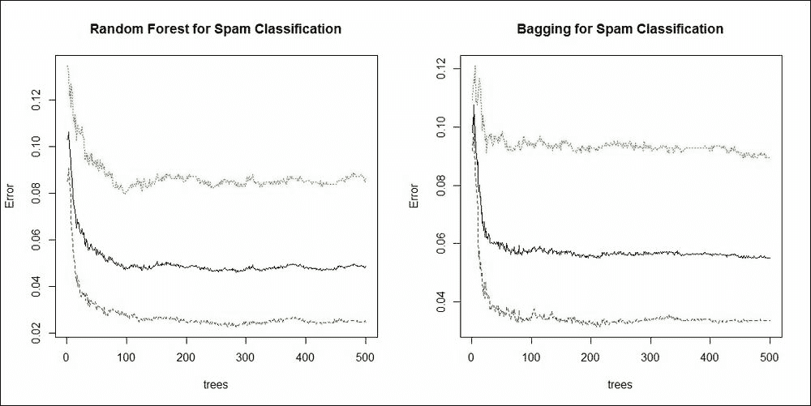

图 11：垃圾邮件分类问题的随机森林和 Bagging 比较

在最后两节中，我们将探讨随机森林的一些利基应用。

# 缺失数据插补

缺失数据是一个威胁！它突然出现并阻止分析，直到得到妥善处理。期望最大化算法的统计技术，或简称为 EM 算法，需要对概率分布、结构关系和统计模型的深入细节有大量信息。然而，在这里完全排除了使用 EM 算法的方法。随机森林可以用来克服缺失数据问题。

当我们在本书的其余部分遇到缺失数据问题时，我们将使用`missForest` R 包来修复。`missForest`函数的算法和其他细节可以在[`academic.oup.com/bioinformatics/article/28/1/112/219101`](https://academic.oup.com/bioinformatics/article/28/1/112/219101)找到。对于任何具有缺失数据的变量/列，技术是为此变量构建一个随机森林，并将 OOB 预测作为插补误差估计。请注意，该函数可以处理连续和分类的缺失值。该包的创建者已启用并行运行功能以节省时间。

我们将从[`openmv.net/info/travel-times`](https://openmv.net/info/travel-times)获取一个简单的数据集，并且数据中存在缺失值。数据由`13`个变量和`205`个观测值组成。在可用的`13`个变量中，只有`FuelEconomy`变量有缺失值。让我们在 R 终端中探索这个数据集：

```py
> TT <- read.csv("../Data/Travel_Times.csv")
>dim(TT)
[1] 205  13
>sum(is.na(TT))
[1] 19
>sapply(TT,function(x) sum(is.na(x)))
          Date      StartTime      DayOfWeek        GoingTo       Distance 
             0              0              0              0              0 
      MaxSpeed       AvgSpeed AvgMovingSpeed    FuelEconomy      TotalTime 
             0              0              0             19              0 
    MovingTime     Take407All       Comments 
             0              0              0 
> TT$FuelEconomy
  [1]    NA    NA    NA    NA    NA    NA    NA    NA  8.89  8.89  8.89  8.89
 [13]  8.89  8.89  8.89  8.89  9.08  9.08  9.08  9.08  9.08  9.08  9.08  9.08
 [25]  9.76  9.76  9.76  9.76  9.76  9.76  9.76  9.16  9.16  9.16    NA    NA
 [37]    NA    NA    NA    NA    NA    NA  9.30  9.30  9.30  9.30  9.30  9.30
 [49] 10.05 10.05 10.05 10.05  9.53  9.53  9.53  9.53  9.53  9.53  9.53  9.53
 [61]  9.35  9.35  9.35  9.35  9.35  9.35  9.35  9.35  8.32  8.32  8.32  8.32

[181]  8.48  8.48  8.48  8.45  8.45  8.45  8.45  8.45  8.45  8.45  8.45  8.45
[193]  8.45  8.28  8.28  8.28  7.89  7.89  7.89  7.89  7.89  7.89    NA    NA
[205]    NA
```

可以看到有`19`个观测值存在缺失值。`sapply`函数告诉我们，所有`19`个观测值只有`FuelEconomy`变量存在缺失值。现在正在部署`missForest`函数：

```py
> TT_Missing <- missForest(TT[,-c(1,2,12)],
+                          maxiter = 10,ntree=500,mtry=6)
missForest iteration 1 in progress...done!
missForest iteration 2 in progress...done!
missForest iteration 3 in progress...done!
missForest iteration 4 in progress...done!
> TT_FuelEconomy <- cbind(TT_Missing$ximp[,7],TT$FuelEconomy)
> TT_FuelEconomy[is.na(TT$FuelEconomy),]
      [,1] [,2]
 [1,] 8.59   NA
 [2,] 8.91   NA
 [3,] 8.82   NA
 [4,] 8.63   NA
 [5,] 8.44   NA
 [6,] 8.63   NA
 [7,] 8.60   NA
 [8,] 8.50   NA
 [9,] 9.07   NA
[10,] 9.10   NA
[11,] 8.52   NA
[12,] 9.12   NA
[13,] 8.53   NA
[14,] 8.85   NA
[15,] 8.70   NA
[16,] 9.42   NA
[17,] 8.40   NA
[18,] 8.49   NA
[19,] 8.64   NA
```

我们现在已经插补了缺失值。需要注意的是，插补值应该有意义，并且不应该显得不合适。在第九章中，我们将使用`missForest`函数来插补大量缺失值。

**练习**：如何验证插补值？使用`missForest`包中的`prodNA`函数，并用缺失数据戳记良好值。使用`missForest`函数获取插补值，并与原始值进行比较。

邻近矩阵告诉我们从随机森林的角度来看观测值有多接近。如果我们有关于观测值邻域的信息，我们可以进行聚类分析。使用邻近矩阵的副产品，我们现在也可以使用随机森林来解决无监督问题。

# 随机森林聚类

随机森林可以设置不包含目标变量。使用此功能，我们将计算邻近矩阵并使用 OOB 邻近值。由于邻近矩阵为我们提供了观测之间的接近度度量，因此可以使用层次聚类方法将其转换为聚类。

我们从在`randomForest`函数中设置`y = NULL`开始。指定`proximity=TRUE`和`oob.prox=TRUE`选项以确保我们获得所需的邻近矩阵：

```py
>data(multishapes)
>par(mfrow=c(1,2))
>plot(multishapes[1:2],col=multishapes[,3], 
+      main="Six Multishapes Data Display")
> MS_RF <- randomForest(x=multishapes[1:2],y=NULL,ntree=1000,
+ proximity=TRUE, oob.prox=TRUE,mtry = 1)
```

接下来，我们使用`hclust`函数和`ward.D2`选项对距离矩阵进行层次聚类分析。`cutree`函数将`hclust`对象划分为`k = 6`个聚类。最后，`table`函数和可视化给出了使用随机森林进行聚类效果的好坏概念：

```py
> MS_hclust <- hclust(as.dist(1-MS_RF$proximity),method="ward.D2")
> MS_RF_clust <- cutree(MS_hclust,k=6)
>table(MS_RF_clust,multishapes$shape)

MS_RF_clust   1   2   3   4   5   6
          1 113   0   0   0  10   0
          2 143   0   0   0  20  50
3  57 170   0   0   3   0
4  63  55   0   0   3   0
5  24 175   0   0   2   0
          6   0   0 100 100  12   0
>plot(multishapes[1:2],col=MS_RF_clust,
+      main="Clustering with Random Forest
```

以下是一个说明使用随机森林进行聚类的图表：

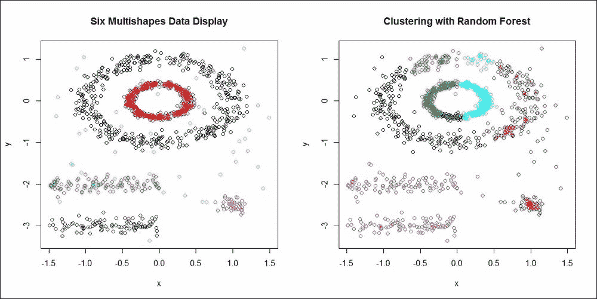

图 12：使用随机森林进行聚类

尽管随机森林提供的聚类不适合标签识别问题，但我们仍将它们作为起点。需要理解的是，随机森林可以正确地用于聚类分析。

# 摘要

随机森林是为了改进袋装方法而创建的。作为一个同质集成方法的例子，我们看到了森林如何帮助提高准确性。随机森林的可视化和变量重要性被详细阐述。我们还看到了在拟合随机森林后可以使用的许多诊断方法。然后，该方法与袋装方法进行了比较。还展示了随机森林在缺失数据插补和聚类分析中的新颖应用。

在下一章中，我们将探讨提升，这是一种非常重要的集成方法。
