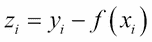
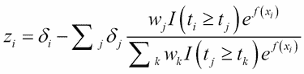

# 第六章：提升改进

在上一章中，我们学习了提升算法。我们研究了算法的结构形式，用一个数值示例进行了说明，然后将算法应用于回归和分类问题。在本章简要介绍中，我们将涵盖提升算法及其基础的一些理论方面。提升理论在这里也很重要。

本章，我们还将从几个不同的角度探讨提升算法为什么有效。不同类型的问题需要不同类型的损失函数，以便提升技术能够有效。在下一节中，我们将探讨我们可以选择的不同类型的损失函数。极端梯度提升方法在专门用于处理`xgboost`包的章节中概述。此外，`h2o`包将在最后一节中最终讨论，这可能对其他集成方法也很有用。本章将涵盖以下主题：

+   提升为什么有效？

+   `gbm`包

+   `xgboost`包

+   `h2o`包

# 技术要求

本章我们将使用以下 R 库：

+   `adabag`

+   `gbm`

+   `h2o`

+   `kernlab`

+   `rpart`

+   `xgboost`

# 提升为什么有效？

上一章中关于**自适应提升算法**的部分包含了*m*个模型、分类器、*n*个观察值和权重，以及一个按顺序确定的投票权。通过一个玩具示例说明了自适应提升方法的适应，然后使用专用函数应用了该方法。与袋装法和随机森林方法相比，我们发现提升提供了最高的准确率，这你可能还记得上一章前面提到的那个部分的结果。然而，算法的实现并没有告诉我们为什么它预期会表现得更好。

我们没有一个普遍接受的答案来解释提升为什么有效，但根据 Berk（2016）的第 6.2.2 小节，有三种可能的解释：

+   提升是边缘最大化器

+   提升是统计优化器

+   提升是一个插值器

但这些实际上意味着什么呢？现在我们将逐一介绍这些观点。在提升算法中，一个观察值的边缘计算如下：


我们可以看到，边界值是正确分类和错误分类总和之间的差异。在先前的公式中，表示投票权重。提升算法之所以工作得如此之好，尤其是在分类问题上，是因为它是一个*边界最大化器*。在他们的开创性论文中，提升算法的发明者 Schapire 等人声称，提升特别擅长找到具有大边界的分类器，因为它专注于那些边界值小（或负）的例子，并迫使基本学习算法为这些例子生成良好的分类。下面引文中的粗体部分将在下一个 R 代码块中展示。

将使用来自`kernlab`包的垃圾邮件数据集来说明这一关键思想。`gbm`包中的`boosting`函数将拟合数据，以区分垃圾邮件和正常邮件。我们将从一个仅包含一次迭代的初始模型开始，获取准确率，获取边界值，然后在下面的代码块中生成摘要：

```py
> data("spam")
> set.seed(12345)
> Train_Test <- sample(c("Train","Test"),nrow(spam),replace = TRUE,prob = c(0.7,0.3))
> spam_Train <- spam[Train_Test=="Train",]
> spam_Formula <- as.formula("type~.")
> spam_b0 <- boosting(spam_Formula,data=spam_Train,mfinal=1)
> sum(predict(spam_b0,newdata=spam_Train)$class==
+       spam_Train$type)/nrow(spam_Train)
[1] 0.905
> mb0 <- margins(spam_b0,newdata=spam_Train)$margins
> mb0[1:20]
 [1]  1 -1  1 -1  1  1  1  1  1  1  1  1  1  1  1  1  1  1  1  1
> summary(mb0)
   Min. 1st Qu.  Median    Mean 3rd Qu.    Max. 
 -1.000   1.000   1.000   0.809   1.000   1.000 
```

接下来，我们将迭代次数增加到 5、10、20、50 和 200。读者应跟踪以下结果的准确率和边界值摘要：

```py
> spam_b1 <- boosting(spam_Formula,data=spam_Train,mfinal=5)
> sum(predict(spam_b1,newdata=spam_Train)$class==
+       spam_Train$type)/nrow(spam_Train)
[1] 0.948
> mb1 <- margins(spam_b1,newdata=spam_Train)$margins
> mb1[1:20]
 [1]  1.0000 -0.2375  0.7479 -0.2375  0.1771  0.5702  0.6069  0.7479  1.0000
[10]  0.7479  1.0000  1.0000 -0.7479  1.0000  0.7479  1.0000  0.7479  1.0000
[19] -0.0146  1.0000
> summary(mb1)
   Min. 1st Qu.  Median    Mean 3rd Qu.    Max. 
 -1.000   0.631   1.000   0.783   1.000   1.000 
> spam_b2 <- boosting(spam_Formula,data=spam_Train,mfinal=10)
> sum(predict(spam_b2,newdata=spam_Train)$class==
+       spam_Train$type)/nrow(spam_Train)
[1] 0.969		
> mb2 <- margins(spam_b2,newdata=spam_Train)$margins
> mb2[1:20]
 [1]  0.852  0.304  0.245  0.304  0.288  0.629  0.478  0.678  0.827  0.678
[11]  1.000  1.000 -0.272  0.517  0.700  0.517  0.700  0.478  0.529  0.852
> summary(mb2)
   Min. 1st Qu.  Median    Mean 3rd Qu.    Max. 
 -0.517   0.529   0.807   0.708   1.000   1.000 
> spam_b3 <- boosting(spam_Formula,data=spam_Train,mfinal=20)
> sum(predict(spam_b3,newdata=spam_Train)$class==
+       spam_Train$type)/nrow(spam_Train)
[1] 0.996
> mb3 <- margins(spam_b3,newdata=spam_Train)$margins
> mb3[1:20]
 [1] 0.5702 0.3419 0.3212 0.3419 0.3612 0.6665 0.4549 0.7926 0.7687 0.6814
[11] 0.8958 0.5916 0.0729 0.6694 0.6828 0.6694 0.6828 0.6130 0.6813 0.7467
> summary(mb3)
   Min. 1st Qu.  Median    Mean 3rd Qu.    Max. 
 -0.178   0.537   0.719   0.676   0.869   1.000 
> spam_b4<- boosting(spam_Formula,data=spam_Train,mfinal=50)
> sum(predict(spam_b4,newdata=spam_Train)$class==
+       spam_Train$type)/nrow(spam_Train)
[1] 1
> mb4 <- margins(spam_b4,newdata=spam_Train)$margins
> mb4[1:20]
 [1] 0.407 0.333 0.386 0.333 0.379 0.518 0.486 0.536 0.579 0.647 0.695 0.544
[13] 0.261 0.586 0.426 0.586 0.426 0.488 0.572 0.677
> summary(mb4)
   Min. 1st Qu.  Median    Mean 3rd Qu.    Max. 
  0.098   0.444   0.590   0.586   0.729   1.000 
> spam_b5<- boosting(spam_Formula,data=spam_Train,mfinal=200)
> sum(predict(spam_b5,newdata=spam_Train)$class==
+       spam_Train$type)/nrow(spam_Train)
[1] 1
> mb5 <- margins(spam_b5,newdata=spam_Train)$margins
> mb5[1:20]
 [1] 0.386 0.400 0.362 0.368 0.355 0.396 0.368 0.462 0.489 0.491 0.700 0.486
[13] 0.317 0.426 0.393 0.426 0.393 0.385 0.624 0.581
> summary(mb5)
   Min. 1st Qu.  Median    Mean 3rd Qu.    Max. 
  0.272   0.387   0.482   0.510   0.607   0.916 
```

第一个重要的区别是，边界值完全摆脱了负数，并且在迭代次数达到 50 或更多之后，每个边界值都是非负的。为了更清楚地了解这一点，我们将边界值进行列绑定，然后查看初始化时具有负边界的所有观察值：

```py
> View(cbind(mb1,mb2,mb3,mb4,mb5)[mb1<0,])
```

以下快照显示了前面代码的结果：


图 1：迭代过程中误分类观察值的边界

因此，我们可以清楚地看到，随着迭代次数的增加，边界值也在增加。

关于提升，特别是自适应提升，需要记住的第二点是它是一个统计优化器。Berk（2016）第 264-5 页和 Zhou（2012）第 25-6 页显示，提升集成达到了贝叶斯误差率。这意味着由于指数损失被最小化，分类错误率也被最小化。

关于提升作为插值器的第三点非常直接。很明显，提升的迭代可以看作是随机森林的加权平均。

到目前为止，提升方法仅解决了分类和回归问题。损失函数对于机器学习算法至关重要，下一节将讨论各种损失函数，这些函数将有助于为不同格式的数据设置提升算法。

# `gbm`包

由 Greg Ridgeway 创建的 R `gbm` 包是一个非常通用的包。该包的详细信息可以在[`www.saedsayad.com/docs/gbm2.pdf`](http://www.saedsayad.com/docs/gbm2.pdf)找到。该文档详细介绍了梯度提升的理论方面，并说明了 `gbm` 函数的各种其他参数。首先，我们将考虑 `gbm` 函数中可用的收缩因子。

收缩参数非常重要，也有助于解决过拟合问题。通过此选项实现惩罚。对于垃圾邮件数据集，我们将收缩选项设置为 0.1（非常大）和 0.0001（非常小），并观察性能如何受到影响：

```py
> spam_Train2 <- spam_Train
> spam_Train2$type <- as.numeric(spam_Train2$type)-1
> spam_gbm <- gbm(spam_Formula,distribution="bernoulli",
+       data=spam_Train2, n.trees=500,bag.fraction = 0.8,
+       shrinkage = 0.1)
> plot(spam_gbm) # output suppressed
> summary(spam_gbm)
                                var      rel.inf
charExclamation     charExclamation 21.740302311
charDollar               charDollar 18.505561199
remove                       remove 11.722965305
your                           your  8.282553567
free                           free  8.142952834
hp                               hp  7.399617456

num415                       num415  0.000000000
direct                       direct  0.000000000
cs                               cs  0.000000000
original                   original  0.000000000
table                         table  0.000000000
charSquarebracket charSquarebracket  0.000000000
```

摘要函数还绘制了相对变量重要性图。如下截图所示：


图 2：相对变量影响图

接下来获取拟合对象的详细信息：

```py
> spam_gbm
gbm(formula = spam_Formula, distribution = "bernoulli", data = spam_Train2, 
    n.trees = 500, shrinkage = 0.1, bag.fraction = 0.8)
A gradient boosted model with bernoulli loss function.
500 iterations were performed.
There were 57 predictors, of which 43 had nonzero influence.

Here, the choice of shrinkage = 0.1 leads to 43 nonzero influential variables. We can now reduce the shrinkage factor drastically and observe the impact: 

> spam_gbm2 <- gbm(spam_Formula,distribution="bernoulli",
+       data=spam_Train2,n.trees=500,bag.fraction = 0.8,
+       shrinkage = 0.0001)
> spam_gbm2
gbm(formula = spam_Formula, distribution = "bernoulli", data = spam_Train2, 
    n.trees = 500, shrinkage = 1e-04, bag.fraction = 0.8)
A gradient boosted model with Bernoulli loss function.
500 iterations were performed.
There were 57 predictors of which 2 had nonzero influence.
```

收缩参数太低，因此几乎没有变量具有影响力。接下来，我们将生成以下图表：

```py
> windows(height=100,width=200)
> par(mfrow=c(1,2))
> gbm.perf(spam_gbm,plot.it=TRUE)
Using OOB method...
[1] 151
Warning message:
In gbm.perf(spam_gbm, plot.it = TRUE) :
  OOB generally underestimates the optimal number of iterations although predictive performance is reasonably competitive. Using cv.folds>0 when calling gbm usually results in improved predictive performance.
> gbm.perf(spam_gbm2,plot.it=TRUE)
Using OOB method...
[1] 500
Warning message:
In gbm.perf(spam_gbm2, plot.it = TRUE) :
  OOB generally underestimates the optimal number of iterations although predictive performance is reasonably competitive. Using cv.folds>0 when calling gbm usually results in improved predictive performance.
```


图 3：收缩因子作为收敛的一个因素

我们对于极小的收缩因子没有清晰的收敛。

`gbm` 函数的更多详细信息可以从包文档或之前提供的源中获取。提升是一种非常通用的技术，Ridgeway 为各种数据结构实现了这一技术。下表列出了四种最常见的几种数据结构，展示了统计模型、偏差（与损失函数相关）、初始值、梯度和每个终端节点的输出估计：

| 输出类型 | 统计模型 | 偏差 | 初始值 | 梯度 | 终端节点估计 |
| --- | --- | --- | --- | --- | --- |
| 数值 | 高斯 |  |  |  |  |
| 二元 | 伯努利 |  |  |  |  |
| 计数 | 泊松 |  |  |  |  |
| 生存数据 | Cox 比例风险模型 |  |  | 0 | 牛顿-拉夫森算法 |

> 表 1：GBM 提升选项

我们将应用 `gbm` 函数对计数数据和生存数据进行处理。

## 计数数据的提升

事故、错误/打字错误、出生等数量数据是流行的例子。在这里，我们计算特定时间、地点和/或空间内事件的数量。泊松分布非常适合用于建模数量数据。当我们有以协变量和独立变量形式提供的额外信息时，相关的回归问题通常很有兴趣。广义线性模型是建模数量数据的一种流行技术。

让我们看看可从 [`stats.idre.ucla.edu/r/dae/poisson-regression/`](https://stats.idre.ucla.edu/r/dae/poisson-regression/) 获取的模拟数据集。必要的更改如本源所示进行。首先，我们使用 `glm` 函数拟合泊松回归模型。接下来，我们拟合提升模型，如下所示：

```py
> # Poisson regression and boosting
> # https://stats.idre.ucla.edu/r/dae/poisson-regression/
> pregnancy <- read.csv("https://stats.idre.ucla.edu/stat/data/poisson_sim.csv")
> pregnancy <- within(pregnancy, {
+   prog <- factor(prog, levels=1:3, 
+   labels=c("General", "Academic","Vocational"))
+   id <- factor(id)
+ })
> summary(pregnancy)
       id        num_awards           prog          math     
 1      :  1   Min.   :0.00   General   : 45   Min.   :33.0  
 2      :  1   1st Qu.:0.00   Academic  :105   1st Qu.:45.0  
 3      :  1   Median :0.00   Vocational: 50   Median :52.0  
 4      :  1   Mean   :0.63                    Mean   :52.6  
 5      :  1   3rd Qu.:1.00                    3rd Qu.:59.0  
 6      :  1   Max.   :6.00                    Max.   :75.0  
 (Other):194                                                 
> pregnancy_Poisson <- glm(num_awards ~ prog + math, 
+                     family="poisson", data=pregnancy)
> summary(pregnancy_Poisson)

Call:
glm(formula = num_awards ~ prog + math, family = "poisson", data = pregnancy)

Deviance Residuals: 
   Min      1Q  Median      3Q     Max  
-2.204  -0.844  -0.511   0.256   2.680  

Coefficients:
               Estimate Std. Error z value Pr(>|z|)    
(Intercept)     -5.2471     0.6585   -7.97  1.6e-15 ***
progAcademic     1.0839     0.3583    3.03   0.0025 ** 
progVocational   0.3698     0.4411    0.84   0.4018    
math             0.0702     0.0106    6.62  3.6e-11 ***
---
Signif. codes:  0 '***' 0.001 '**' 0.01 '*' 0.05 '.' 0.1 ' ' 1

(Dispersion parameter for poisson family taken to be 1)

    Null deviance: 287.67  on 199  degrees of freedom
Residual deviance: 189.45  on 196  degrees of freedom
AIC: 373.5

Number of Fisher Scoring iterations: 6

> pregnancy_boost <- gbm(num_awards ~ prog+math,dist="poisson",
+ n.trees=100,interaction.depth = 2,shrinkage=0.1,data=pregnancy)
> cbind(pregnancy$num_awards,predict(m1,type="response"),
+       predict(pboost,n.trees=100,type="response"))
    [,1]   [,2]   [,3]
1      0 0.1352 0.1240
2      0 0.0934 0.1072
3      0 0.1669 0.3375
4      0 0.1450 0.0850
5      0 0.1260 0.0257
6      0 0.1002 0.0735

195    1 1.0469 1.4832
196    2 2.2650 2.0241
197    2 1.4683 0.4047
198    1 2.2650 2.0241
199    0 2.4296 2.0241
200    3 2.6061 2.0241
> sum((pregnancy$num_awards-predict(m1,type="response"))²)
[1] 151
> sum((pregnancy$num_awards-predict(pboost,n.trees=100,
+    type="response"))²)
[1] 141
> summary(pregnancy_boost)
      var rel.inf
math math    89.7
prog prog    10.3
```

这是一个非常简单的例子，只有两个协变量。然而，在实践中，我们多次看到数量数据被当作回归问题处理。这是不幸的，一般回归技术并不是任何形式的炼金术。我们必须尊重数据结构，并且需要对数量数据进行分析。请注意，这里拟合的模型是非线性的。尽管这里的好处并不明显，但随着变量数量的增加，数量数据框架变得更加合适。我们将通过两个树的变量重要性图以及表格显示来结束对数量数据分析的讨论：


图 4：提升数量数据 – 变量重要性

```py
> pretty.gbm.tree(pregnancy_boost,i.tree=18)
  SplitVar SplitCodePred LeftNode RightNode MissingNode ErrorReduction Weight
0        1      64.50000        1         5           6          10.41    100
1        1      57.50000        2         3           4           1.14     90
2       -1      -0.01146       -1        -1          -1           0.00     71
3       -1       0.02450       -1        -1          -1           0.00     19
4       -1      -0.00387       -1        -1          -1           0.00     90
5       -1       0.05485       -1        -1          -1           0.00     10
6       -1       0.00200       -1        -1          -1           0.00    100
  Prediction
0    0.00200
1   -0.00387
2   -0.01146
3    0.02450
4   -0.00387
5    0.05485
6    0.00200
> pretty.gbm.tree(pregnancy_boost,i.tree=63)
  SplitVar SplitCodePred LeftNode RightNode MissingNode ErrorReduction Weight
0        1      60.50000        1         5           6          3.837    100
1        0      20.00000        2         3           4          0.407     79
2       -1      -0.00803       -1        -1          -1          0.000     40
3       -1       0.05499       -1        -1          -1          0.000     39
4       -1       0.02308       -1        -1          -1          0.000     79
5       -1       0.02999       -1        -1          -1          0.000     21
6       -1       0.02453       -1        -1          -1          0.000    100
  Prediction
0    0.02453
1    0.02308
2   -0.00803
3    0.05499
4    0.02308
5    0.02999
6    0.02453
```

`pretty.gbm.tree` 函数有助于提取 `gbm` 对象的隐藏树。在下一节中，我们将处理生存数据的梯度提升技术。

## 生存数据的提升

`pbc` 数据集已在 第一章 和 *集成技术简介* 以及 第二章 和 *自助法* 中介绍。如前所述，生存数据有缺失观测值，我们需要专门的技术来处理这种情况。在表 1 中，我们看到偏差函数相当复杂。多亏了 Ridgeway，我们不必过多担心这类计算。相反，我们只需使用带有 `dist="coxph"` 选项的 `gbm` 函数，并按以下方式进行数据分析：

```py
> # Survival data
> pbc_boost <- gbm(Surv(time,status==2)~trt + age + sex+ascites +
+                    hepato + spiders + edema + bili + chol + 
+                    albumin + copper + alk.phos + ast + trig + 
+                    platelet + protime + stage,
+                  n.trees=100,interaction.depth = 2,
+                  shrinkage=0.01,dist="coxph",data=pbc)
> summary(pbc_boost)
              var rel.inf
bili         bili  54.220
age           age  10.318
protime   protime   9.780
stage       stage   7.364
albumin   albumin   6.648
copper     copper   5.899
ascites   ascites   2.361
edema       edema   2.111
ast           ast   0.674
platelet platelet   0.246
alk.phos alk.phos   0.203
trig         trig   0.178
trt           trt   0.000
sex           sex   0.000
hepato     hepato   0.000
spiders   spiders   0.000
chol         chol   0.000
> pretty.gbm.tree(pbc_boost,i.tree=2)  # output suppressed
> pretty.gbm.tree(pbc_boost,i.tree=72) # output suppressed
```

因此，使用多功能的 `gbm` 函数，我们可以轻松地对各种数据结构执行梯度提升技术。

# xgboost 软件包

`xgboost` R 包是梯度提升方法的优化、分布式实现。这是一个已知效率高、灵活且可移植的工程优化——有关更多详细信息及常规更新，请参阅[`github.com/dmlc/xgboost`](https://github.com/dmlc/xgboost)。这提供了并行树提升，因此在数据科学社区中被发现非常有用。特别是在[www.kaggle.org](http://www.kaggle.org)的比赛中，许多获胜者使用了`xgboost`技术。Kaggle 获胜者的部分列表可在[`github.com/dmlc/xgboost/tree/master/demo#machine-learning-challenge-winning-solutions`](https://github.com/dmlc/xgboost/tree/master/demo#machine-learning-challenge-winning-solutions)找到。

极端梯度提升实现的优点如下所示：

+   **并行计算**: 此包通过 OpenMP 启用并行处理，然后使用计算机的所有核心

+   **正则化**: 这通过结合正则化思想来避免过拟合问题

+   **交叉验证**: 执行交叉验证不需要额外的编码

+   **剪枝**: 这将树增长到最大深度，然后反向剪枝

+   **缺失值**: 缺失值在内部被处理

+   **保存和重新加载**: 这不仅有助于保存现有模型，还可以从上次停止的地方继续迭代

+   **跨平台**: 这适用于 Python、Scala 等

我们将使用书中早些时候看到的垃圾邮件数据集来说明这些想法。`xgboost`包的函数要求所有变量都是数值型，输出也应标记为`0`和`1`。此外，协变量矩阵和输出需要分别提供给`xgboost` R 包。因此，我们首先加载垃圾邮件数据集，然后创建分区和公式，如下所示：

```py
> ## The xgboost Package
> data("spam")
> spam2 <- spam
> spam2$type <- as.numeric(spam2$type)-1
> head(data.frame(spam2$type,spam$type))
  spam2.type spam.type
1          1      spam
2          1      spam
3          1      spam
4          1      spam
5          1      spam
6          1      spam
> # 1 denotes spam, and 0 - nonspam
> set.seed(12345)
> Train_Test <- sample(c("Train","Test"),nrow(spam2),replace = TRUE,
+                      prob = c(0.7,0.3))
> spam2_Train <- spam2[Train_Test=="Train",]
> spam_Formula <- as.formula("type~.")
> spam_train <- list()
```

`xgboost`包还要求指定训练回归数据为特殊的`dgCMatrix`矩阵。因此，我们可以使用`as`函数将其转换：

```py
> spam_train$data <- as(spam_train$data,"dgCMatrix")
> spam_train$label <- spam2_Train$type
> class(spam_train$data)
[1] "dgCMatrix"
attr(,"package")
[1] "Matrix"
```

我们现在已准备好应用`xgboost`函数的基础设施。选择`nrounds=100`和逻辑函数，结果如下所示：

```py
> # Simple XGBoosting
> spam_xgb<- xgboost(data=spam_train$data,label=spam_train$label,+                     nrounds = 100,objective="binary:logistic")
[1]	train-error:0.064062 
[2]	train-error:0.063437 
[3]	train-error:0.053438 
[4]	train-error:0.050313 
[5]	train-error:0.047812 
[6]	train-error:0.045313 

[95]	train-error:0.002188 
[96]	train-error:0.001875 
[97]	train-error:0.001875 
[98]	train-error:0.001875 
[99]	train-error:0.000937 
[100]	train-error:0.000937 
```

使用拟合的增强模型，我们现在应用`predict`函数并评估准确性：

```py
> xgb_predict <- predict(spam_xgb,spam_train$data)
> sum(xgb_predict>0.5)
[1] 1226
> sum(spam_train$label)
[1] 1229
> table(spam_train$label,c(xgb_predict>0.5))

    FALSE TRUE
  0  1971    0
  1     3 1226
```

如果观察到的概率（在这种情况下是响应）被标记为 1 的概率超过 0.5，那么我们可以将观察到的标签标记为 1，否则为 0。通过使用 table R 函数，我们可以获得预测标签和实际标签的列联表。显然，我们具有非常好的准确性，并且只有三个错误分类。

我们声称`xgboost`包不需要额外的编码来进行交叉验证分析。`xgb.cv`函数在这里很有用，它使用与`xgboost`函数相同的参数，并通过`nfold`选项指定的交叉验证折数来工作。在这里，我们选择`nfold=10`。现在，使用`xgb.cv`函数，我们进行该分析并评估预测准确率：

```py
> # XGBoosting with cross-validation
> spam_xgb_cv <- xgb.cv(data=spam_train$data,
+           label=spam_train$label,nfold=10,nrounds = 100,
+           objective="binary:logistic",prediction = TRUE)
[1]	train-error:0.064410+0.001426	test-error:0.091246+0.01697
[2]	train-error:0.058715+0.001862	test-error:0.082805+0.01421
[3]	train-error:0.052986+0.003389	test-error:0.077186+0.01472
[4]	train-error:0.049826+0.002210	test-error:0.073123+0.01544
[5]	train-error:0.046910+0.001412	test-error:0.070937+0.01340
[6]	train-error:0.043958+0.001841	test-error:0.066249+0.01346

[95]	train-error:0.001667+0.000340	test-error:0.048119+0.00926
[96]	train-error:0.001528+0.000318	test-error:0.047181+0.01008
[97]	train-error:0.001458+0.000260	test-error:0.046868+0.00974
[98]	train-error:0.001389+0.000269	test-error:0.047181+0.00979
[99]	train-error:0.001215+0.000233	test-error:0.047182+0.00969
[100]	train-error:0.001111+0.000260	test-error:0.045932+0.01115
> xgb_cv_predict <- spam_xgb_cv$pred
> sum(xgb_cv_predict>0.5)
[1] 1206
> table(spam_train$label,c(xgb_cv_predict>0.5))

    FALSE TRUE
  0  1909   62
  1    85 1144
```

交叉验证分析显示准确率有所下降。这表明我们在`xgboost`函数中遇到了过拟合问题。现在，我们将查看`xgboost`包的其他特性。在本节的开头，我们声称该技术通过提前停止和恢复早期拟合的模型对象提供了灵活性。

然而，一个重要的问题是*何时需要提前停止迭代？*我们没有关于迭代次数的任何基础理论，这个次数是作为变量数量和观测数量的函数。因此，我们将以指定的迭代次数开始这个过程。如果误差减少的收敛性没有低于阈值水平，那么我们将继续进行更多的迭代，这项任务将在下一部分进行。然而，如果指定的迭代次数过高，并且提升方法的性能正在变差，那么我们不得不停止迭代。这是通过指定`early_stopping_rounds`选项来实现的，我们将在下面的代码中将其付诸实践：

```py
> # Stop early
> spam_xgb_cv2 <- xgb.cv(data=spam_train$data,label=
+             spam_train$label, early_stopping_rounds = 5,
+             nfold=10,nrounds = 100,objective="binary:logistic",
+             prediction = TRUE)
[1]	train-error:0.064271+0.002371	test-error:0.090294+0.02304
Multiple eval metrics are present. Will use test_error for early stopping.
Will train until test_error hasn't improved in 5 rounds.

[2]	train-error:0.059028+0.003370	test-error:0.085614+0.01808
[3]	train-error:0.052048+0.002049	test-error:0.075930+0.01388
[4]	train-error:0.049236+0.002544	test-error:0.072811+0.01333
[5]	train-error:0.046007+0.002775	test-error:0.070622+0.01419
[6]	train-error:0.042882+0.003065	test-error:0.066559+0.01670

[38]	train-error:0.010382+0.001237	test-error:0.048121+0.01153[39]	train-error:0.010069+0.001432	test-error:0.048434+0.01162
[40]	train-error:0.009653+0.001387	test-error:0.048435+0.01154
[41]	train-error:0.009236+0.001283	test-error:0.048435+0.01179
[42]	train-error:0.008924+0.001173	test-error:0.048748+0.01154
Stopping. Best iteration:
[37]	train-error:0.010625+0.001391	test-error:0.048121+0.01162
```

在这里，最佳迭代已经发生在编号`37`，这是通过`early_stopping_rounds = 5`选项获得的确认。现在我们已经找到了最佳迭代，我们停止这个过程。

现在，我们将查看如何添加更多的迭代。以下代码仅用于说明。使用`nrounds = 10`选项，以及早期拟合的`spam_xgb`，以及数据和标签的选项，我们将要求`xgboost`函数进行十次额外的迭代：

```py
> # Continue training
> xgboost(xgb_model=spam_xgb,
+         data=spam_train$data,label=spam_train$label,
+         nrounds = 10)
[101]	train-error:0.000937 
[102]	train-error:0.000937 
[103]	train-error:0.000937 
[104]	train-error:0.000937 
[105]	train-error:0.000937 
[106]	train-error:0.000937 
[107]	train-error:0.000937 
[108]	train-error:0.000937 
[109]	train-error:0.000937 
[110]	train-error:0.000937 
##### xgb.Booster
raw: 136 Kb 
call:
  xgb.train(params = params, data = dtrain, nrounds = nrounds, 
    watchlist = watchlist, verbose = verbose, print_every_n = print_every_n, early_stopping_rounds = early_stopping_rounds, maximize = maximize, save_period = save_period, save_name = save_name, xgb_model = xgb_model, callbacks = callbacks)
params (as set within xgb.train):
  silent = "1"
xgb.attributes:
  niter
callbacks:
  cb.print.evaluation(period = print_every_n)
  cb.evaluation.log()
  cb.save.model(save_period = save_period, save_name = save_name)
niter: 110
evaluation_log:
    iter train_error
       1    0.064062
       2    0.063437
---                 
     109    0.000937
     110    0.000937
```

迭代次数的粗体和粗大字体并不是 R 软件输出的格式。这种变化是为了强调从早期拟合的`spam_xgb`对象开始的迭代次数现在将从`101`继续，并增加到`110`。使用`xgboost`函数很容易增加额外的迭代次数。

`xgb.plot.importance`函数与`xgb.importance`函数一起使用，可以用来提取并显示由提升方法确定的最重要的变量：

```py
> # Variable Importance
> xgb.plot.importance(xgb.importance(names(spam_train$data),
+                                    spam_xgb)[1:10,])
```

结果是以下图表：


图 5：xgboost 函数的变量重要性图

我们现在已经看到了`xgboost`包的力量。接下来，我们将概述`h2o`包的功能。

# h2o 包

R 软件的`.exe`文件大小为 75 MB（版本 3.4.1）。`h2o` R 包的大小为 125 MB。这可能会让你意识到`h2o`包的重要性。本书中使用的所有数据集大小都非常有限，观测数不超过 10,000。在大多数情况下，文件大小最大仅为几 MB。然而，数据科学界的工作非常努力，经常处理 GB 级别甚至更高格式的文件。因此，我们需要更多的能力，而`h2o`包正好提供了这些能力。我们只需简单地加载`h2o`包，就可以一窥究竟：

```py
> library(h2o)

----------------------------------------------------------------------

Your next step is to start H2O:
    > h2o.init()

For H2O package documentation, ask for help:
    > ??h2o

After starting H2O, you can use the Web UI at http://localhost:54321
For more information visit http://docs.h2o.ai

----------------------------------------------------------------------

Attaching package: 'h2o'

The following objects are masked from 'package:stats':

    cor, sd, var

The following objects are masked from 'package:base':

    %*%, %in%, &&, ||, apply, as.factor, as.numeric, colnames,
    colnames<-, ifelse, is.character, is.factor, is.numeric, log,
    log10, log1p, log2, round, signif, trunc

Warning message:
package 'h2o' was built under R version 3.4.4 
> h2o.init()

H2O is not running yet, starting it now...

Note:  In case of errors look at the following log files:
    C:\Users\tprabhan\AppData\Local\Temp\Rtmpu6f0fO/h2o_TPRABHAN_started_from_r.out
    C:\Users\tprabhan\AppData\Local\Temp\Rtmpu6f0fO/h2o_TPRABHAN_started_from_r.err

java version "1.7.0_67"
Java(TM) SE Runtime Environment (build 1.7.0_67-b01)
Java HotSpot(TM) 64-Bit Server VM (build 24.65-b04, mixed mode)

Starting H2O JVM and connecting: .. Connection successful!

R is connected to the H2O cluster: 
    H2O cluster uptime:         4 seconds 449 milliseconds 
    H2O cluster version:        3.16.0.2 
    H2O cluster version age:    7 months and 7 days !!! 
    H2O cluster name:           H2O_started_from_R_TPRABHAN_saz680 
    H2O cluster total nodes:    1 
    H2O cluster total memory:   1.76 GB 
    H2O cluster total cores:    4 
    H2O cluster allowed cores:  4 
    H2O cluster healthy:        TRUE 
    H2O Connection ip:          localhost 
    H2O Connection port:        54321 
    H2O Connection proxy:       NA 
    H2O Internal Security:      FALSE 
    H2O API Extensions:         AutoML, Algos, Core V3, Core V4 
    R Version:                  R version 3.4.0 (2017-04-21) 

Warning message:
In h2o.clusterInfo() : 
Your H2O cluster version is too old (7 months and 7 days)!
Please download and install the latest version from http://h2o.ai/download/
```

集群和线程有助于扩展计算。对于更热情的读者，以下资源将帮助使用`h2o`包：

+   [`blog.revolutionanalytics.com/2014/04/a-dive-into-h2o.html`](http://blog.revolutionanalytics.com/2014/04/a-dive-into-h2o.html)

+   [`docs.h2o.ai/`](http://docs.h2o.ai/)

+   [`www.analyticsvidhya.com/blog/2016/05/h2o-data-table-build-models-large-data-sets/`](https://www.analyticsvidhya.com/blog/2016/05/h2o-data-table-build-models-large-data-sets/)

使用`gbm`、`xgboost`和`h2o`包，读者可以分析复杂和大型数据集。

# 摘要

我们在本章开始时简要思考了为什么提升（boosting）有效。有三个视角可能解释了提升的成功，这些内容在我们深入探讨这个主题之前已经讨论过了。`gbm`包非常强大，它提供了调整梯度提升算法的不同选项，该算法可以处理多种数据结构。我们通过收缩选项展示了其能力，并将其应用于计数和生存数据结构。`xgboost`包是梯度提升方法的更高效实现。它更快，还提供了其他灵活性。我们通过使用`xgboost`函数进行交叉验证、早期停止以及根据需要继续迭代来展示其使用方法。`h2o`包/平台有助于在大规模上实现集成机器学习技术。

在下一章中，我们将探讨为什么集成（ensembling）有效。特别是，我们将看到为什么将多个模型组合在一起通常是一种有用的实践，我们还将探讨我们可以这样做的情况。
