# 第九章. 集成回归模型

第三章, *袋装*, 到 第八章, *集成诊断*，都致力于学习不同类型的集成方法。讨论主要基于分类问题。如果监督学习问题的回归变量/输出是一个数值变量，那么我们就有了一个回归问题，这将在本章中解决。为了演示目的，本章选择了房价问题，数据集来自 Kaggle 竞赛：[`www.kaggle.com/c/house-prices-advanced-regression-techniques/`](https://www.kaggle.com/c/house-prices-advanced-regression-techniques/)。数据包括许多变量，包括多达 79 个独立变量，房价作为输出/依赖变量。数据集需要一些预处理，因为一些变量有缺失日期，一些变量有大量级别，其中一些变量只出现得非常少，还有一些变量在超过 20%的观测值中缺失数据。

预处理技术将被变量减少方法所继替，然后我们将拟合重要的回归模型：线性回归、神经网络和回归树。首先将提供回归树的集成扩展，然后我们将应用袋装和随机森林方法。将使用各种提升方法来提高预测。在结论部分将应用堆叠集成方法。

在本章中，我们将涵盖以下内容：

+   数据预处理和可视化

+   变量减少技术

+   回归模型

+   回归数据的袋装和随机森林

+   提升回归模型

+   回归数据的堆叠集成方法

# 技术要求

我们将需要以下 R 包来完成本章内容：

+   `adabag`

+   `caret`

+   `caretEnsemble`

+   `ClustofVar`

+   `FactoMinR`

+   `gbm`

+   `ipred`

+   `missForest`

+   `nnet`

+   `NeuralNetTools`

+   `plyr`

+   `rpart`

+   `RSADBE`

# 预处理房价数据

数据集是从[www.kaggle.com](http://www.kaggle.com)选择的，项目的标题是**房价：高级回归技术**。我们将使用的主要文件是`test.csv`和`train.csv`，这些文件可在配套的捆绑包中找到。变量的描述可以在`data_description.txt`文件中找到。更详细的信息当然可以在[`www.kaggle.com/c/house-prices-advanced-regression-techniques/`](https://www.kaggle.com/c/house-prices-advanced-regression-techniques/)获得。训练数据集包含 1460 个观测值，而测试数据集包含 1459 个观测值。房产价格只在训练数据集中已知，在测试数据集中不可用。我们只将使用训练数据集进行模型开发。首先使用`read.csv`、`dim`、`names`和`str`函数将数据集加载到 R 会话中，并进行初步检查：

```py
> housing_train <- read.csv("../Data/Housing/train.csv",
+                           row.names = 1,na.strings = "NA",
+                           stringsAsFactors = TRUE)
> housing_test <- read.csv("../Data/Housing/test.csv",
+                           row.names = 1,na.strings = "NA",
+                           stringsAsFactors = TRUE)
> dim(housing_train)
[1] 1460   80
> dim(housing_test)
[1] 1459   79
> names(housing_train)
 [1] "MSSubClass"    "MSZoning"      "LotFrontage"   "LotArea"      
 [5] "Street"        "Alley"         "LotShape"      "LandContour"  
 [9] "Utilities"     "LotConfig"     "LandSlope"     "Neighborhood" 

[69] "X3SsnPorch"    "ScreenPorch"   "PoolArea"      "PoolQC"       
[73] "Fence"         "MiscFeature"   "MiscVal"       "MoSold"       
[77] "YrSold"        "SaleType"      "SaleCondition" "SalePrice" 
> str(housing_train)
'data.frame':	1460 obs. of  80 variables:
 $ MSSubClass   : int  60 20 60 70 60 50 20 60 50 190 ...
 $ MSZoning     : Factor w/ 5 levels "C (all)","FV",..: 4 4 4 4 4 4 4 4 5 4 ...
 $ LotFrontage  : int  65 80 68 60 84 85 75 NA 51 50 ...
 $ LotArea      : int  8450 9600 11250 9550 14260 14115 10084 10382 6120 7420 ...
 $ Street       : Factor w/ 2 levels "Grvl","Pave": 2 2 2 2 2 2 2 2 2 2 ...
 $ Alley        : Factor w/ 2 levels "Grvl","Pave": NA NA NA NA NA NA NA NA NA NA ...

 $ MiscFeature  : Factor w/ 4 levels "Gar2","Othr",..: NA NA NA NA NA 3 NA 3 NA NA ...
 $ MiscVal      : int  0 0 0 0 0 700 0 350 0 0 ...
 $ MoSold       : int  2 5 9 2 12 10 8 11 4 1 ...
 $ YrSold       : int  2008 2007 2008 2006 2008 2009 2007 2009 2008 2008 ...
 $ SaleType     : Factor w/ 9 levels "COD","Con","ConLD",..: 9 9 9 9 9 9 9 9 9 9 ...
 $ SaleCondition: Factor w/ 6 levels "Abnorml","AdjLand",..: 5 5 5 1 5 5 5 5 1 5 ...
 $ SalePrice    : int  208500 181500 223500 140000 250000 143000 307000 200000 129900 118000 ...
```

```py
read.csv function enabled importing the data from the comma-separated values file. The size of the imported data frame is evaluated using the dim function, while names gives us the variable names as stored in the original file. The str function gives a quick preview of the variable types and also gives a few of the observations.
```

数据框的维度表示变量的数量和观测值的数量。所有变量的详细信息可以在`data_description.txt`文件中找到。可以看出，我们手头上的是一个综合性的数据集。现在，我们在`read.csv`导入函数中运行了`na.strings = "NA"`选项，并且很自然地，这暗示我们存在缺失数据。当训练数据和测试数据分区中都有缺失数据时，作者建议将分区的协变量合并，然后进一步检查。首先将协变量合并，然后我们找出每个变量的缺失观测值数量：

```py
> housing <- rbind(housing_train[,1:79],housing_test)
> dim(housing)
[1] 2919   79
> sort(sapply(housing,function(x) sum(is.na(x))),dec=TRUE)
       PoolQC   MiscFeature         Alley         Fence   FireplaceQu 
         2909          2814          2721          2348          1420 
  LotFrontage   GarageYrBlt  GarageFinish    GarageQual    GarageCond 
          486           159           159           159           159 
   GarageType      BsmtCond  BsmtExposure      BsmtQual  BsmtFinType2 
          157            82            82            81            80 
 BsmtFinType1    MasVnrType    MasVnrArea      MSZoning     Utilities 
           79            24            23             4             2 
 BsmtFullBath  BsmtHalfBath    Functional   Exterior1st   Exterior2nd 
            2             2             2             1             1 
   BsmtFinSF1    BsmtFinSF2     BsmtUnfSF   TotalBsmtSF    Electrical 
            1             1             1             1             1 
  KitchenQual    GarageCars    GarageArea      SaleType    MSSubClass 
            1             1             1             1             0 
      LotArea        Street      LotShape   LandContour     LotConfig 
            0             0             0             0             0 

  OpenPorchSF EnclosedPorch    X3SsnPorch   ScreenPorch      PoolArea 
            0             0             0             0             0 
      MiscVal        MoSold        YrSold SaleCondition 
            0             0             0             0 
```

`rbind`函数将训练和测试数据集中的数据合并。`is.na(x)`代码检查`x`中每个元素的值是否存在，应用`sum`函数后告诉我们变量的缺失观测值数量。然后使用`sapply`函数对`housing`的每个变量应用此函数。使用带有`dec=TRUE`参数的`sort`函数按降序对变量的缺失观测值计数进行排序，因此它使我们能够在开始时找到缺失值最多的变量。

读者可能会想知道关于观察结果整理背后的理由。整理观察结果的直观推理是，虽然某些变量可能有缺失数据，在训练数据中比在测试数据中多，或者相反，重要的是整体缺失百分比不要超过观测值的某个特定阈值。尽管我们有缺失数据插补技术，但在缺失数据百分比过高时使用它们可能会使我们错过特征的重要模式。因此，我们任意选择限制变量，如果超过 10%的值缺失。如果任何变量的缺失百分比超过 10%，我们将避免进一步分析该变量。首先，我们识别出超过 10%的变量，然后从主数据框中移除它们。下面的 R 代码块给出了我们想要的结果：

```py
> miss_variables <- names(which(sapply(housing,
+         function(x) sum(is.na(x)))>0.1*nrow(housing_train)))
> miss_variables
 [1] "LotFrontage"  "Alley"        "FireplaceQu"  "GarageType"  
 [5] "GarageYrBlt"  "GarageFinish" "GarageQual"   "GarageCond"  
 [9] "PoolQC"       "Fence"        "MiscFeature" 
> length(miss_variables)
[1] 11
> housing[,miss_variables] <- NULL
> dim(housing)
[1] 2919   68
```

首先识别出超过 10%缺失观测值的变量，然后存储在`miss_variables`字符向量中，我们有 11 个变量符合这一标准。这些变量通过`NULL`赋值被消除。

接下来，我们找到因子变量的水平数（不同的）。我们定义了一个函数，`find_df`，它将找到因子变量的水平数。对于数值和整数变量，它将返回`1`。这个练习的目的很快就会变得清楚。`find_df`函数将在下一个代码块中创建：

```py
> find_df <- function(x){
+   if(class(x)=="numeric") mdf <- 1
+   if(class(x)=="integer") mdf <- 1
+   if(class(x) =="factor") mdf <- length(levels(x))
+   if(class(x) =="character") mdf <- length(unique(x))
+   return(mdf)
+ }
> sapply(housing,find_df)
   MSSubClass      MSZoning       LotArea        Street      LotShape 
            1             4             1             2             3 
  LandContour     Utilities     LotConfig     LandSlope  Neighborhood 
            2             3             4             2            25 
   Condition1    Condition2      BldgType    HouseStyle   OverallQual 
            3             2             3             4             1 

   X3SsnPorch   ScreenPorch      PoolArea       MiscVal        MoSold 
            1             1             1             1             1 
       YrSold      SaleType SaleCondition 
            1             4             4 
> dim(housing)
[1] 2919   68
```

我们需要检查`67`个变量，在消除`11`个具有超过 10%缺失观测值的变量之后。其中一些可能不是因子变量。`find_df`函数显示，对于因子变量，水平数从 2 到 25 不等。现在对于`Condition2`和`Exterior1st`变量出现了一个快速问题：

```py
> round(table(housing$Condition2)/nrow(housing),2)
Artery  Feedr   Norm   PosA   PosN   RRAe   RRAn   RRNn 
  0.00   0.00   0.99   0.00   0.00   0.00   0.00   0.00 
> round(table(housing$Exterior1st)/nrow(housing),2)
AsbShng AsphShn BrkComm BrkFace  CBlock CemntBd HdBoard ImStucc MetalSd 
   0.02    0.00    0.00    0.03    0.00    0.04    0.15    0.00    0.15 
Plywood   Stone  Stucco VinylSd Wd Sdng WdShing 
   0.08    0.00    0.01    0.35    0.14    0.02 
```

在许多实际问题中，似乎存在一些**因子变量**，它们的一些水平出现频率非常低。现在，如果我们测试/验证分区中有新的水平，我们就无法进行预测。从统计学的角度来看，我们遇到了一个技术问题：失去了太多的**自由度**。这里采取了一种基本的方法，我们只是简单地将所有观察结果汇总到`Others`这个总类别中。创建了一个`Truncate_Factor`函数，它有两个参数：`x`和`alpha`。`x`对象是要传递给函数的变量，而`alpha`是任何变量频率会被汇总到`Others`中的指定比例。

### 注意

如果因子变量在测试数据集中有新的水平，就没有分析方法是能够包含其影响的。因此，在我们有太多不常见水平的情况下，某些水平没有被包括在训练数据集中的可能性很高，预测结果将不会为测试观察结果提供输出。

现在，创建`Truncate_Factor`函数：

```py
> Truncate_Factor <- function(x,alpha){
+   xc <- as.character(x); n <- length(x)
+   if(length(unique(x))<=20) {
+     critical <- n*alpha
	+     xc[xc %in% names(which((prop.table(table(xc)))<alpha))] <- "Others"
+   }
+   xc <- as.factor(xc)
+   return(xc)
+ }
> for(i in 1:ncol(housing)){
+   if(any(class(housing[,i]) == c('character','factor'))) 
+     housing[,i] = Truncate_Factor(housing[,i],0.05)
+ }
> table(housing$Condition2)/nrow(housing)
  Norm Others 
  0.99   0.01 
> table(housing$Exterior1st)/nrow(housing)
HdBoard MetalSd  Others Plywood VinylSd Wd Sdng 
  0.151   0.154   0.126   0.076   0.351   0.141 
```

我们现在可以看到，“其他”级别出现的频率更高，如果我们随机创建分区，未知级别的出现问题很可能不会发生。

你可能还记得，我们之前已经消除了具有过多缺失观测值的变量。这并不意味着我们没有缺失数据，这一点可以很快地发现：

```py
> sum(is.na(housing))
[1] 474
> prod(dim(housing))
[1] 198492
```

`474`个值不能被忽视。缺失数据插补是填充缺失值的重要方法。尽管 EM 算法是实现这一目标的一种流行方法，但我们将应用随机森林技术来模拟缺失观测值。`missForest`包在第四章中介绍，即*随机森林*，并使用一个示例来模拟缺失值。我们将应用此函数到房价数据框上。由于此函数中默认选择的变量数是`mtry=5`，而我们房价中有 68 个变量，因此用于分割节点的变量数将更改为大约 p/3，因此在下一个 R 块中可以看到`mtry=20`的选项。在 8GB RAM 的机器上，下一行代码需要运行几个小时。接下来，我们将应用`missForest`函数，保存插补对象以供将来参考，并使用插补值创建测试和训练数据集：

```py
> housing_impute <- missForest(housing,maxiter = 10,ntree=500,mtry=20)
  missForest iteration 1 in progress...done!
  missForest iteration 2 in progress...done!
  missForest iteration 3 in progress...done!
  missForest iteration 4 in progress...done!
  missForest iteration 5 in progress...done!
  missForest iteration 6 in progress...done!
  missForest iteration 7 in progress...done!
There were 14 warnings (use warnings() to see them)
> save(housing_impute,file=
+ '../Data/Housing/housing_covariates_impute.Rdata')
> ht_imp <- cbind(housing_impute$ximp[1:nrow(housing_train),],
+ housing_train$SalePrice)
> save(ht_imp,file='../Data/Housing/ht_imp.Rdata')
> htest_imp <- housing_impute$ximp[(nrow(housing_train)+1):nrow(
+ housing),]
> save(htest_imp,file='../Data/Housing/htest_imp.Rdata')
```

读者当然应该在他们的本地机器上运行`missForest`代码行。然而，为了节省时间，读者也可以跳过这一行，然后从代码包中加载`ht_imp`和`htest_imp`对象。下一节将展示一种可视化大数据集和两种数据降维方法的方式。

# 可视化和变量降维

在上一节中，房价数据经历了大量的分析预处理，我们现在准备进一步分析它。首先，我们从可视化开始。由于我们有大量的变量，R 可视化设备上的可视化稍微有些困难。正如前几章所见，为了可视化随机森林和其他大型、复杂结构，我们将初始化一个 PDF 设备并将图表存储在其中。在房价数据集中，主要变量是房价，因此我们将首先将输出变量命名为`SalePrice`。我们需要以方便展示众多变量与`SalePrice`之间的关系的方式来可视化数据。自变量可以是数值型或分类型。如果变量是数值型，散点图将表明变量与`SalePrice`回归量之间的关系。如果自变量是分类型/因子型，我们将对因子的每个级别可视化箱线图。`pdf`、`plot`和`boxplot`函数将有助于生成所需的图表：

```py
> load("../Data/Housing/ht_imp_author.Rdata")
> names(ht_imp)[69] <- "SalePrice"
> SP <- ht_imp$SalePrice
> pdf("../Output/Visualizing_Housing_Data.pdf")
> for(i in 1:68){
+   if(class(ht_imp[,i])=="numeric") {
+     plot(ht_imp[,i],SP,xlab=names(ht_imp)[i],ylab="Sales Price")
+     title(paste("Scatter plot of Sales Price against ", 
+ names(ht_imp)[i]))
+   }
+   if(class(ht_imp[,i])=="factor") {
+     boxplot(SP~ht_imp[,i],xlab=names(ht_imp)[i],ylab=
+ "Sales Price",notch=TRUE)
+     title(paste("Boxplot of Salesprice by ",names(ht_imp)[i]))
+   }
+ }
> dev.off()
null device 
          1 
```

`ht_imp`对象是从`ht_imp_author.Rdata`文件中加载的。注意，如果你在自己的机器上运行`missForest`函数并在此文件上工作，那么结果将与`ht_imp_author.Rdata`不同。`pdf`函数已知可以启动一个同名文件，如之前多次所见。对于数值变量，检查`if`条件，并显示散点图，其中`xlab`使用变量的实际名称作为*x*轴上的标签名称。`title`函数将`paste`函数的输出贴上，而`paste`函数确保我们有一个适合生成的图的标题。对于因子变量，也测试了类似的条件。我们现在将查看一些有趣的图表。`SalePrice`与`MSSubClass`的第一个图表（见`Visualizing_Housing_Data.pdf`文件）如下：

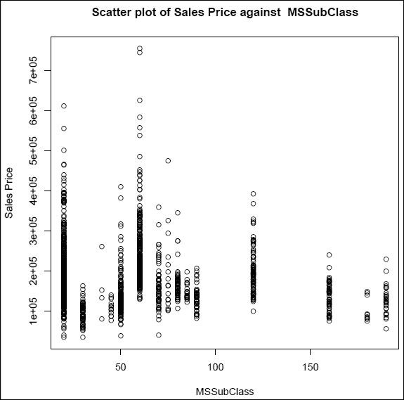

图 1：销售价格与 MSSubClass 的散点图

### 注意

注意，尽管我们指定了`MSSubClass`变量为数值变量，但散点图并没有给出同样的印象。在这里，`MSSubClass`变量的值围绕一个特定的点杂乱无章，然后尺度跳到下一个值。

简而言之，它似乎不是一个连续变量，这可以通过以下方式轻松验证：

```py
> table(ht_imp$MSSubClass)
20  30  40  45  50  60  70  75  80  85  90 120 160 180 190 
536  69   4  12 144 299  60  16  58  20  52  87  63  10  30 
```

**练习**：读者应将`MSSubClass`变量转换为因子，然后应用`Truncate_Factor`以减少噪声。在`Visualizing_Housing_Data.pdf`文件中识别其他表现出此特性的数值变量。

现在让我们看看`MSZoning`因子变量的箱线图：

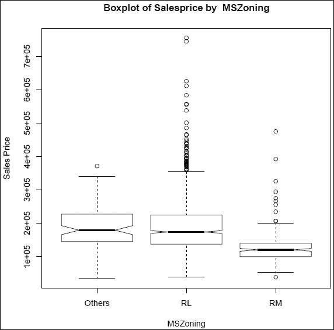

图 2：MSZoning 三个级别的销售价格箱线图

超出胡须的点表示存在异常值。然而，对于复杂问题，解释也可能非常错误。缺口是箱线图显示中的有用技巧。如果两个变量级别的缺口不重叠，则表示级别是显著的，因此信息是有用的，如`SalePrice`与`MSZoning`级别箱线图的显示所示。

接下来展示的是`SalePrice`与`LotArea`的散点图：

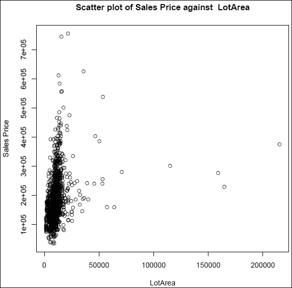

图 3：销售价格与 Lot Area 的散点图

明显地，散点图显示这两个变量`SalePrice`和`LotArea`之间没有有意义的关系。在下面的图中，`SalePrice`与`TotalBsmtSF`之间可以看到不同类型的显示：

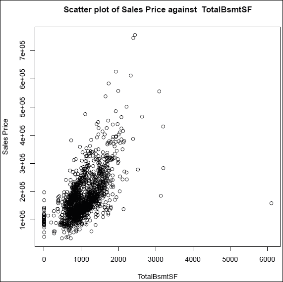

图 4：销售价格与 TotalBsmtSF 的散点图

我们可以清楚地看到图的最右侧`TotalBsmtSF`值存在一个异常值。同时，`TotalBsmtSF`在 0 值处也存在值的杂乱，这可能是其他某个变量的控制结果。或者，可能会发现该变量存在零膨胀，因此它可能是一个混合变量。同样，所有其他图表也可以进行解释。接下来获得`SalePrice`与其他数值变量之间的相关性：

```py
> cor(ht_imp[sapply(ht_imp,is.numeric)])[,1]
   MSSubClass       LotArea   OverallQual   OverallCond     YearBuilt 
       1.0000       -0.1398        0.0326       -0.0593        0.0279 
 YearRemodAdd    MasVnrArea    BsmtFinSF1    BsmtFinSF2     BsmtUnfSF 
       0.0406        0.0206       -0.0698       -0.0656       -0.1408 
  TotalBsmtSF     X1stFlrSF     X2ndFlrSF  LowQualFinSF     GrLivArea 
      -0.2385       -0.2518        0.3079        0.0465        0.0749 
 BsmtFullBath  BsmtHalfBath      FullBath      HalfBath  BedroomAbvGr 
       0.0035       -0.0023        0.1316        0.1774       -0.0234 
 KitchenAbvGr  TotRmsAbvGrd    Fireplaces    GarageCars    GarageArea 
       0.2817        0.0404       -0.0456       -0.0401       -0.0987 
   WoodDeckSF   OpenPorchSF EnclosedPorch    X3SsnPorch   ScreenPorch 
      -0.0126       -0.0061       -0.0120       -0.0438       -0.0260 
     PoolArea       MiscVal        MoSold        YrSold     SalePrice 
       0.0083       -0.0077       -0.0136       -0.0214       -0.0843
```

**练习**：解释`Visualizing_Housing_Data.pdf`文件中的所有关系，并按照其绝对值在前面 R 代码中对相关性进行排序。

我们使用了感兴趣的变量进行可视化，这进而导致了有价值的见解。正如之前所述，*p = 68*意味着有很多协变量/独立变量。在大数据中，复杂性将在北方方向增加，而且众所周知，对于许多实际应用，我们拥有数千个独立变量。虽然大多数可视化技术都有洞察力，但一个缺点是我们很少能深入了解高阶关系。例如，当涉及到三个或更多变量时，在图形显示中很少能充分展现它们之间的关系。因此，部署那些在不牺牲信息的情况下减少变量数量的方法是重要的。这里将要讨论的两种数据降维方法是**主成分分析**和**变量聚类**。

**主成分分析**（**PCA**）是从**多元统计**的更广泛领域抽取的一种方法。在数据降维方面，这种方法很有用，因为它在给定原始变量数量的情况下，试图用尽可能少的新变量来覆盖原始数据的大部分方差。这里简要介绍了 PCA。

假设我们有一个观测值的随机向量 。给定随机向量 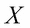，主成分分析（PCA）找到一个新的主成分向量 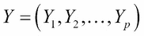，使得每个 *Yi* 都是  的线性组合。此外，主成分满足 *Y1* 的方差高于 *Y2* 的方差，且两者不相关；*Y2* 的方差高于 *Y3* 和 *Y1* 的方差，*Y2* 和 *Y3* 不相关，以此类推。这与 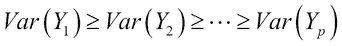 有关，它们之间都不相关。主成分被设置成使得 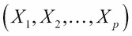 的大部分方差累积在前几个主成分中（关于此信息的更多信息，请参阅 Tattar 等人（2016）的第十五章）。因此，我们可以实现大量的数据降维。然而，PCA 的基本前提是 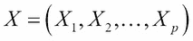 是一个连续随机变量的向量。在我们的数据集中，我们也有因子变量。因此，我们不能为了我们的目的使用 PCA。一种粗略的方法是忽略因子变量，并在连续变量上简单地执行数据降维。相反，我们会使用 `混合数据的因子分析`，并且 `FactoMineR` 软件包中提供了执行此操作的软件功能。

由于数据降维只需要在协变量上执行，而我们没有纵向数据，因此数据降维应用于所有可用的观测值集，而不仅仅是训练数据集。在整份数据集上执行数据降维的理由与截断因子变量级别的数量相同。`housing_impute` 数据框可在 `housing_covariates_impute.Rdata` 中找到。我们首先将其加载，然后应用 `FAMD` 函数来执行混合数据的因子分析：

```py
> load("../Data/Housing/housing_covariates_impute.Rdata")
> housing_covariates <- housing_impute$ximp
> housing_cov_famd <- FAMD(housing_covariates,ncp=68,graph=FALSE)
> colnames(housing_cov_famd$eig) <- c("Component","Variance",
+    "Cumulative")
> housing_cov_famd$eig
            Component     Variance Cumulative
comp 1  12.2267562274 9.3334017003  9.33340170
comp 2   5.4502085801 4.1604645650 13.49386627
comp 3   4.5547218487 3.4768869074 16.97075317
comp 4   4.0710151565 3.1076451576 20.07839833
comp 5   3.1669428163 2.4175136002 22.49591193
comp 6   2.8331129142 2.1626816139 24.65859354
comp 7   2.6471571767 2.0207306692 26.67932421
comp 8   2.1871762983 1.6696002277 28.34892444
comp 9   2.1563067109 1.6460356572 29.99496010
comp 10  2.0083000432 1.5330534681 31.52801357

comp 66  0.7691341212 0.5871252834 80.58667899
comp 67  0.7648033308 0.5838193365 81.17049833
comp 68  0.7559712365 0.5770772798 81.74757561
> windows(height=100,width=200)
> pareto.chart(housing_cov_famd$eig[,2])
```

在`FAMD`函数中，`ncp`选项被设置为 68，因为这是我们拥有的变量数量。我们还想看看主成分如何响应数据集。如果选择`graph=TRUE`选项，函数将显示相关图表。`housing_cov_famd$eig`的`colnames`被更改为默认名称，因为这些名称并不能公正地反映它生成的输出。我们可以从特征值分析中看到，总共 68 个成分并没有完全覆盖数据中可用的全部变异。此外，即使是解释了 50%变异的成分，我们也需要从中选择 26 个。因此，这里的变量减少似乎并不富有成效。然而，这并不意味着在下一组分析中性能会差。当使用质量控制包`qcc`中的`pareto.chart`函数对频率数据进行处理时，会得到一个帕累托图。正如百分比所展示的，很明显，如果我们需要原始变量中 90%的变异由主成分解释，那么我们需要近 60 个主成分。因此，减少的变量数量仅为 8，解释也增加了一个复杂性。这并不是好消息。然而，我们仍然会保存主成分的数据：

```py
> save(housing_cov_famd,file='../Data/Housing/Housing_FAMD.Rdata')
> Housing_FAMD_Data <- housing_cov_famd$ind$coord
> save(Housing_FAMD_Data,file='../Data/Housing/
+ Housing_FAMD_Data.Rdata')
```

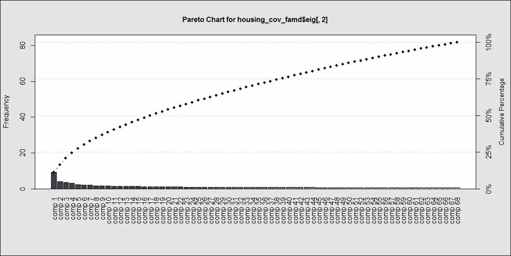

图 5：主成分贡献的帕累托图

**练习**：探索使用来自 R 包`PCAmix`的`PCAmix`函数，通过主成分分析来减少变量的数量。

## 变量聚类

变量可以像我们对观测值那样进行分组。为了实现这一点，我们将使用来自`ClustOfVar`包的`kmeansvar`函数。变量聚类包需要分别指定定量（数值）变量，定性（因子）变量也需要分别指定。此外，我们还需要指定需要多少个变量簇。`init`选项有助于在这里进行指定。`is.numeric`和`is.factor`函数用于识别数值和因子变量，并设置变量簇：

```py
> Housing_VarClust <- kmeansvar(
+     X.quanti = housing_covariates[sapply(housing_covariates,
+                     is.numeric)],
+     X.quali = housing_covariates[sapply(housing_covariates,
+                       is.factor)],init=4)
Error: Some categorical variables have same names of categories,
             rename categories or use the option rename.level=TRUE to rename it automatically
```

哎呀！这是一个错误。重要的是要记住，所有不常见的因子变量级别都被标记为“其他”。可能存在其他级别在多个变量中具有相同的名称，这在调查数据中是一个非常常见的标签选择，包括如“非常不满意 < 不满意 < 一般 < 好 < 优秀”这样的选项。这种变量级别的选择可以在多个问题中相同。然而，我们需要所有变量的级别名称在所有变量中都是独特的。手动重命名标签将是徒劳的，并且是时间上的极大浪费。因此，我们将使用一组将在变量中唯一的名称来解决这个问题，即变量名称本身。变量名称将与变量级别连接，因此我们将在整个变量中拥有独特的因子级别。使用`paste0`函数和`plyr`包中的`mapvalues`，我们首先执行级别重命名操作，然后再次应用`kmeansvar`：

```py
> hc2 <- housing_covariates
> for(i in 1:ncol(hc2)){
+   if(class(hc2[,i])=="factor") {
+     hc2[,i] <- mapvalues(hc2[,i],from=levels(hc2[,i]),
+     to=paste0(names(hc2)[i],"_",levels(hc2[,i])))
+   }
+ }
> Housing_VarClust <- kmeansvar(
+         X.quanti = hc2[sapply(hc2,is.numeric)],
+         X.quali = hc2[sapply(hc2,is.factor)], init=4)
> Housing_VarClust$cluster
   MSSubClass       LotArea   OverallQual   OverallCond     YearBuilt 
            2             1             1             4             4 
 YearRemodAdd    MasVnrArea    BsmtFinSF1    BsmtFinSF2     BsmtUnfSF 
            4             3             1             2             4 

     BsmtCond  BsmtExposure  BsmtFinType1  BsmtFinType2       Heating 
            3             1             4             2             3 
    HeatingQC    CentralAir    Electrical   KitchenQual    Functional 
            4             1             4             4             4 
   PavedDrive      SaleType SaleCondition 
            1             4             4 
> summary(Housing_VarClust)

Call:
kmeansvar(X.quanti = hc2[sapply(hc2, is.numeric)], X.quali = hc2[sapply(hc2,     is.factor)], init = 4)

number of iterations:  2

Data: 
   number of observations:  2919
   number of  variables:  68
        number of numerical variables:  34
        number of categorical variables:  34
   number of clusters:  4

Cluster  1 : 
             squared loading correlation
X1stFlrSF             0.6059       0.778
TotalBsmtSF           0.5913       0.769
OverallQual           0.5676       0.753

PoolArea              0.0166       0.129
MiscVal               0.0059       0.077
MoSold                0.0024       0.049

Cluster  2 : 
             squared loading correlation
X2ndFlrSF             0.8584      -0.927
HouseStyle            0.7734          NA
TotRmsAbvGrd          0.5185      -0.720

BsmtFinType2          0.0490          NA
BsmtFinSF2            0.0408       0.202
X3SsnPorch            0.0039       0.063

Cluster  3 : 
           squared loading correlation
MasVnrType         0.83189          NA
MasVnrArea         0.82585      -0.909
Heating            0.03532          NA
BsmtCond           0.02681          NA
Utilities          0.00763          NA
YrSold             0.00084       0.029

Cluster  4 : 
              squared loading correlation
Neighborhood           0.7955          NA
YearBuilt              0.7314      -0.855
BsmtQual               0.6792          NA

BsmtHalfBath           0.0087       0.093
Street                 0.0041          NA
Condition2             0.0015          NA

Gain in cohesion (in %):  11.56
```

重要的问题是，尽管我们已经将变量分组标记，但我们如何使用它们？答案是每个组内变量的系数。要显示系数，请在`clustvar`对象`Housing_VarClust`旁边运行`$coef`：

```py
> Housing_VarClust$coef
$cluster1
                       [,1]
const              -7.1e+00
LotArea             2.1e-05
OverallQual         2.2e-01

CentralAir_N       -5.3e-01
CentralAir_Y        3.8e-02
PavedDrive_N       -5.2e-01
PavedDrive_Others  -2.8e-01
PavedDrive_Y        5.0e-02

$cluster2
                        [,1]
const                3.79789
MSSubClass          -0.00472
BsmtFinSF2           0.00066

HouseStyle_1.5Fin   -0.11967
HouseStyle_1Story    0.41892
HouseStyle_2Story   -0.69610
HouseStyle_Others    0.10816
BsmtFinType2_Others  0.33286
BsmtFinType2_Unf    -0.04491

$cluster3
                       [,1]
const              -33.1748
MasVnrArea          -0.0039
YrSold               0.0167

BsmtCond_TA         -0.0365
Heating_GasA        -0.0179
Heating_Others       1.1425

$cluster4
                          [,1]
const                 45.30644
OverallCond            0.09221
YearBuilt             -0.01009

SaleCondition_Normal   0.03647
SaleCondition_Others   0.20598
SaleCondition_Partial -0.58877
```

现在，对于数据中的观测值，相应的变量将与变量聚类的系数相乘，以获得该变量聚类的单个向量。因此，我们将 68 个变量减少到 4 个变量。

**练习**：使用之前显示的系数，获取`housing_covariates`数据框的聚类变量。

房地产问题的数据预处理现在已完成。在下一节中，我们将为回归数据构建基础学习器。

# 回归模型

弗朗西斯·高尔顿爵士在十九世纪末发明了简单的线性回归模型。所用的例子是研究父母的身高如何影响孩子的身高。这项研究使用了数据，并奠定了回归分析的基础。父母和孩子的身高之间的相关性是众所周知的，高尔顿利用 928 对身高测量数据，开发了线性回归模型。然而，在伽尔顿正式发明之前，这种方法可能已经在非正式地使用了。简单的线性回归模型由一个单一输入（自变量）和一个单一输出组成。

在这种监督学习方法中，目标变量/输出/因变量是一个连续变量，它也可以取区间值，包括非负数和实数。输入/自变量没有限制，因此它可以取数值、分类或其他我们之前用于分类问题的任何形式。有趣的是，线性回归模型的出现时间比分类回归模型（如逻辑回归模型）要早得多。机器学习问题更常基于分类问题进行概念化，而集成方法，特别是提升方法，是通过将分类作为动机来开发的。主要原因在于误差改进提供了良好的直觉，次要原因可能是因为著名的机器学习示例，如数字识别、垃圾邮件分类等。

简单线性回归的扩展是多元线性回归，其中我们允许有多个独立变量。我们将完全放弃简单和多元回归的惯例，并简单地遵循回归。作为基学习器，线性回归模型首先被介绍。有趣的数据库将被用来启动线性回归模型。

## 线性回归模型

更正式地说，设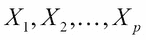为包含*p*个独立变量的集合，而*Y*是感兴趣的变量。我们需要从回归变量的角度来理解回归变量*Y*。线性回归模型由以下公式给出：

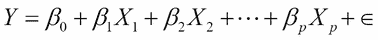

*Y* 与回归变量之间的关系是线性的；是截距项；是回归系数；而是误差项。需要指出的是，这里的线性是指回归系数的线性。同时，需要注意的是，回归变量可以采取任何形式，有时也可以被看作是其他形式，包括对数、指数和二次形式。误差项通常假设服从具有未知方差和零均值的正态分布。关于线性回归模型的更多细节，可以参考 Draper 和 Smith (1999)、Chatterjee 和 Hadi (2012)以及 Montgomery 等人(2005)的著作。关于使用 R 软件实现此技术的信息，请参阅 Tattar 等人(2016)的第十二章或 Tattar(2017)的第六章。

首先，我们将使用 Galton 数据集来解释线性回归模型的核心概念。数据是从`RSADBE`包中加载的，使用`lm`函数，我们可以构建模型：

```py
> data(galton)
> cor(galton)
       child parent
child   1.00   0.46
parent  0.46   1.00
> plot(galton)
> head(galton)
  child parent
1    62     70
2    62     68
3    62     66
4    62     64
5    62     64
6    62     68
> cp_lm <- lm(child~parent,data=galton)
> summary(cp_lm)
Call:
lm(formula = child ~ parent, data = galton)

Residuals:
   Min     1Q Median     3Q    Max 
-7.805 -1.366  0.049  1.634  5.926 

Coefficients:
            Estimate Std. Error t value Pr(>|t|)    
(Intercept)  23.9415     2.8109    8.52   <2e-16 ***
parent        0.6463     0.0411   15.71   <2e-16 ***
---
Signif. codes:  0 '***' 0.001 '**' 0.01 '*' 0.05 '.' 0.1 ' ' 1

Residual standard error: 2.2 on 926 degrees of freedom
Multiple R-squared:  0.21,	Adjusted R-squared:  0.21 
F-statistic:  247 on 1 and 926 DF,  p-value: <2e-16
```

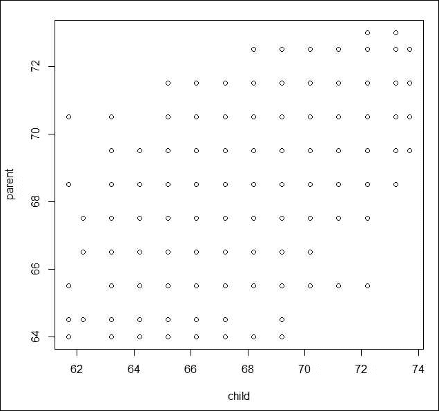

图 6：儿童身高与父母身高对比 - 散点图

这段代码块告诉我们什么？首先，我们将从 RSADBE 包中加载 galton 数据，然后查看父母和孩子的`cor`相关系数。相关系数是`0.46`，这似乎是一个强烈的正相关。散点图也表明了这种正相关，因此我们继续构建以父母高度为函数的孩子的线性回归模型。建议首先查看与模型相关的 p 值，在这种情况下，它在`summary(cp_lm)`的最后行给出，为`<2e-16`。较小的 p 值意味着我们拒绝模型无意义的零假设，因此当前的拟合模型是有用的。与截距项和变量项相关的 p 值都是`<2e-16`，这也意味着这些项是显著的。回归系数`0.6463`意味着如果父母身高增加一英寸，孩子的身高将增加回归系数的量级。

`Multiple R-squared`（技术上简单的 R 平方）和`Adjusted R-squared`的值都是`0.21`，这是预期的，因为我们模型中只有一个变量。R 平方的解释是，如果我们将其乘以 100（在这种情况下是 21%），那么得到的数字就是数据（孩子的高度）变化中由拟合值解释的百分比。这个指标的值越高，模型就越好。在这个例子中，这意味着父母的高度只能解释孩子身高变化的约 21%。这意味着我们需要考虑其他变量。在这种情况下，一个起点可能是考虑父母双方的高度。如果你添加更多的变量，多重 R 平方值将会持续增加，因此更倾向于使用更稳健的调整 R 平方值。是否有可能获得完美的 R 平方，例如 1 或 100%？

一个名为`Mantel`的数据集在捆绑包中在线可用，我们将构建一个线性回归模型来检查其 R 平方。为此，我们导入数据集并对其运行`lm`函数：

```py
> Mantel <- read.csv("../Data/Mantel.csv")
> Mantel
   Y  X1   X2   X3
1  5   1 1004  6.0
2  6 200  806  7.3
3  8 -50 1058 11.0
4  9 909  100 13.0
5 11 506  505 13.1
> Mantel_lm <- lm(Y~.,data=Mantel)
> summary(Mantel_lm)

Call:
lm(formula = Y ~ ., data = Mantel)

Residuals:
        1         2         3         4         5 
-2.49e-13  2.92e-13  3.73e-14 -3.89e-14 -4.14e-14 

Coefficients:
             Estimate Std. Error   t value Pr(>|t|)    
(Intercept) -1.00e+03   2.73e-10 -3.67e+12  1.7e-13 ***
X1           1.00e+00   2.73e-13  3.67e+12  1.7e-13 ***
X2           1.00e+00   2.73e-13  3.67e+12  1.7e-13 ***
X3           1.33e-14   2.16e-13  6.00e-02     0.96    
---
Signif. codes:  0 '***' 0.001 '**' 0.01 '*' 0.05 '.' 0.1 ' ' 1

Residual standard error: 3.9e-13 on 1 degrees of freedom
Multiple R-squared:     1,	Adjusted R-squared:     1 
F-statistic: 4.99e+25 on 3 and 1 DF,  p-value: 1.04e-13
```

在这里，我们可以看到 R 平方是完美的。在我们开始分析房价数据的严肃任务之前，让我们先玩一会儿吧。

对于`galton`数据集，我们将添加一个新的变量，称为`frankenstein`，这个变量将是拟合模型`cp_lm`的残差。将创建一个新的数据集，它将使用残差来增强`galton`数据集；然后，将使用`lm`函数拟合线性模型，并检查其 R 平方：

```py
> d2 <- cbind(galton,residuals(cp_lm))
> names(d2)
[1] "child"            "parent"           "residuals(cp_lm)"
> names(d2) <- c("child","parent","frankenstein")
> cpf_lm <- lm(child~.,d2)
> summary(cpf_lm)
Call:
lm(formula = child ~ ., data = d2)
Residuals:
      Min        1Q    Median        3Q       Max 
-2.60e-15 -7.40e-16 -3.00e-16  2.10e-16  1.02e-13 
Coefficients:
             Estimate Std. Error  t value Pr(>|t|)    
(Intercept)  2.39e+01   5.74e-15 4.17e+15   <2e-16 ***
parent       6.46e-01   8.40e-17 7.69e+15   <2e-16 ***
frankenstein 1.00e+00   6.71e-17 1.49e+16   <2e-16 ***
---
Signif. codes:  0 '***' 0.001 '**' 0.01 '*' 0.05 '.' 0.1 ' ' 1
Residual standard error: 4.6e-15 on 925 degrees of freedom
Multiple R-squared:     1,	Adjusted R-squared:     1 
F-statistic: 1.41e+32 on 2 and 925 DF,  p-value: <2e-16
Warning message:
In summary.lm(cpf_lm) : essentially perfect fit: summary may be unreliable
```

不要忽略警告函数。你可能还记得，对于`Mantel`数据集没有显示这样的警告函数。这是因为通过向`frankenstein`变量添加一点噪声，可以消除这个警告，从而使它更加可怕：

```py
> d2$frankenstein <- jitter(d2$frankenstein)
> summary(lm(child~.,d2))
Call:
lm(formula = child ~ ., data = d2)
Residuals:
      Min        1Q    Median        3Q       Max 
-0.004072 -0.002052  0.000009  0.001962  0.004121 
Coefficients:
             Estimate Std. Error t value Pr(>|t|)    
(Intercept)  2.39e+01   2.92e-03    8210   <2e-16 ***
parent       6.46e-01   4.27e-05   15143   <2e-16 ***
frankenstein 1.00e+00   3.41e-05   29331   <2e-16 ***
---
Signif. codes:  0 '***' 0.001 '**' 0.01 '*' 0.05 '.' 0.1 ' ' 1
Residual standard error: 0.0023 on 925 degrees of freedom
Multiple R-squared:     1,	Adjusted R-squared:     1 
F-statistic: 5.45e+08 on 2 and 925 DF,  p-value: <2e-16
```

因此，我们已经掌握了获得完美 R 平方的艺术。玩耍的时间已经结束，让我们继续到住房数据集。我们之前已经将住房数据集保存为训练和测试块，分别命名为`ht_imp.Rdata`和`htest_imp.Rdata`文件。作者将文件名版本修改为`_author`，以便更清晰地表示。然后，我们将训练块分为训练和测试两部分。然后，我们使用`load`函数导入数据，使用`sample`函数对其进行分区，然后使用`lm`函数构建回归模型：

```py
> load("../Data/Housing/ht_imp_author.Rdata")
> load("../Data/Housing/htest_imp_author.Rdata")
> ls()
[1] "ht_imp"    "htest_imp"
> Y <- "SalePrice"
> X <- names(ht_imp)[-69]
> set.seed(12345)
> BV <- sample(c("Build","Validate"),nrow(ht_imp),replace = TRUE,
+              prob=c(0.7,0.3))
> HT_Build <- ht_imp[BV=="Build",]
> HT_Validate <- ht_imp[BV=="Validate",]
> HT_Formula <- as.formula("SalePrice~.")
> HT_LM_01 <- lm(HT_Formula,data=HT_Build)
> summary(HT_LM_01)

Call:
lm(formula = HT_Formula, data = HT_Build)

Residuals:
    Min      1Q  Median      3Q     Max 
-268498  -12222    -409   11351  240990 

Coefficients: (2 not defined because of singularities)
                      Estimate Std. Error t value Pr(>|t|)    
(Intercept)          -2.87e+03   1.53e+06    0.00  0.99850    
MSSubClass           -1.52e+02   7.95e+01   -1.91  0.05583 .  
MSZoningRL            8.55e+03   6.27e+03    1.36  0.17317    
MSZoningRM            1.20e+04   7.50e+03    1.60  0.11011    
LotArea               4.90e-01   1.21e-01    4.04  5.8e-05 ***
StreetPave            2.81e+04   1.70e+04    1.65  0.09979 .  
LotShapeOthers       -3.59e+03   6.12e+03   -0.59  0.55733    
LotShapeReg           1.25e+03   2.40e+03    0.52  0.60111    
LandContourOthers    -1.22e+04   3.99e+03   -3.05  0.00236 ** 
UtilitiesOthers      -5.76e+04   3.25e+04   -1.77  0.07637 .  
LotConfigCulDSac      1.21e+04   4.96e+03    2.44  0.01477 *  
LotConfigInside      -1.62e+03   2.58e+03   -0.63  0.52972    
LotConfigOthers      -1.28e+04   5.57e+03   -2.30  0.02144 *  

EnclosedPorch         6.95e+00   1.91e+01    0.36  0.71628    
X3SsnPorch            3.81e+01   3.87e+01    0.98  0.32497    
ScreenPorch           3.78e+01   2.01e+01    1.88  0.05988 .  
PoolArea              5.13e+01   2.60e+01    1.98  0.04842 *  
MiscVal               5.13e-02   6.57e+00    0.01  0.99377    
MoSold               -4.38e+02   3.67e+02   -1.19  0.23313    
YrSold               -1.01e+02   7.53e+02   -0.13  0.89376    
SaleTypeOthers       -4.88e+04   2.19e+04   -2.23  0.02598 *  
SaleTypeWD           -5.10e+04   2.20e+04   -2.32  0.02061 *  
SaleConditionNormal   1.93e+03   4.31e+03    0.45  0.65421    
SaleConditionOthers   1.87e+03   7.42e+03    0.25  0.80168    
SaleConditionPartial -3.21e+04   2.21e+04   -1.45  0.14641    
---
Signif. codes:  0 '***' 0.001 '**' 0.01 '*' 0.05 '.' 0.1 ' ' 1

Residual standard error: 28400 on 861 degrees of freedom
Multiple R-squared:  0.884,	Adjusted R-squared:  0.867 
F-statistic: 51.1 on 129 and 861 DF,  p-value: <2e-16
```

在拟合三个更多基础学习器之后，将进行拟合线性模型的准确性评估。调整后的 R 平方值约为 87%。然而，我们有 68 个变量，我们可以从之前的总结中的 p 值看到，许多变量没有 p 值小于 0.05 或 0.1。因此，我们需要消除不显著的变量。`step`函数可以应用于许多拟合的回归模型，以消除不显著的变量，同时保留模型的大部分特征。

在 R 会话中运行`step`函数会导致控制台中出现大量的输出。初始输出因空间限制而丢失。因此，作者使用 RStudio 中的**从 R 脚本编译报告**选项运行脚本，选择 MS Word 作为报告输出格式，并保存该文件。以下是该文件结果的简略版：

```py
## Start:  AIC=20446.87
## SalePrice ~ MSSubClass + MSZoning + LotArea + Street + LotShape + 
##     LandContour + Utilities + LotConfig + LandSlope + Neighborhood + 
##     Condition1 + Condition2 + BldgType + HouseStyle + OverallQual + 
##     OverallCond + YearBuilt + YearRemodAdd + RoofStyle + RoofMatl + 
##     Exterior1st + Exterior2nd + MasVnrType + MasVnrArea + ExterQual + 
##     ExterCond + Foundation + BsmtQual + BsmtCond + BsmtExposure + 
##     BsmtFinType1 + BsmtFinSF1 + BsmtFinType2 + BsmtFinSF2 + BsmtUnfSF + 
##     TotalBsmtSF + Heating + HeatingQC + CentralAir + Electrical + 
##     X1stFlrSF + X2ndFlrSF + LowQualFinSF + GrLivArea + BsmtFullBath + 
##     BsmtHalfBath + FullBath + HalfBath + BedroomAbvGr + KitchenAbvGr + 
##     KitchenQual + TotRmsAbvGrd + Functional + Fireplaces + GarageCars + 
##     GarageArea + PavedDrive + WoodDeckSF + OpenPorchSF + EnclosedPorch + 
##     X3SsnPorch + ScreenPorch + PoolArea + MiscVal + MoSold + 
##     YrSold + SaleType + SaleCondition
## 
## 
## Step:  AIC=20446.87
## SalePrice ~ MSSubClass + MSZoning + LotArea + Street + LotShape + 
##     LandContour + Utilities + LotConfig + LandSlope + Neighborhood + 
##     Condition1 + Condition2 + BldgType + HouseStyle + OverallQual + 
##     OverallCond + YearBuilt + YearRemodAdd + RoofStyle + RoofMatl + 
##     Exterior1st + Exterior2nd + MasVnrType + MasVnrArea + ExterQual + 
##     ExterCond + Foundation + BsmtQual + BsmtCond + BsmtExposure + 
##     BsmtFinType1 + BsmtFinSF1 + BsmtFinType2 + BsmtFinSF2 + BsmtUnfSF + 
##     TotalBsmtSF + Heating + HeatingQC + CentralAir + Electrical + 
##     X1stFlrSF + X2ndFlrSF + LowQualFinSF + BsmtFullBath + BsmtHalfBath + 
##     FullBath + HalfBath + BedroomAbvGr + KitchenAbvGr + KitchenQual + 
##     TotRmsAbvGrd + Functional + Fireplaces + GarageCars + GarageArea + 
##     PavedDrive + WoodDeckSF + OpenPorchSF + EnclosedPorch + X3SsnPorch + 
##     ScreenPorch + PoolArea + MiscVal + MoSold + YrSold + SaleType + 
##     SaleCondition
## 
## 
## Step:  AIC=20446.87
## SalePrice ~ MSSubClass + MSZoning + LotArea + Street + LotShape + 
##     LandContour + Utilities + LotConfig + LandSlope + Neighborhood + 
##     Condition1 + Condition2 + BldgType + HouseStyle + OverallQual + 
##     OverallCond + YearBuilt + YearRemodAdd + RoofStyle + RoofMatl + 
##     Exterior1st + Exterior2nd + MasVnrType + MasVnrArea + ExterQual + 
##     ExterCond + Foundation + BsmtQual + BsmtCond + BsmtExposure + 
##     BsmtFinType1 + BsmtFinSF1 + BsmtFinType2 + BsmtFinSF2 + BsmtUnfSF + 
##     Heating + HeatingQC + CentralAir + Electrical + X1stFlrSF + 
##     X2ndFlrSF + LowQualFinSF + BsmtFullBath + BsmtHalfBath + 
##     FullBath + HalfBath + BedroomAbvGr + KitchenAbvGr + KitchenQual + 
##     TotRmsAbvGrd + Functional + Fireplaces + GarageCars + GarageArea + 
##     PavedDrive + WoodDeckSF + OpenPorchSF + EnclosedPorch + X3SsnPorch + 
##     ScreenPorch + PoolArea + MiscVal + MoSold + YrSold + SaleType + 
##     SaleCondition
## 
##                 Df  Sum of Sq        RSS   AIC
## - Exterior2nd    5 2.6926e+09 6.9890e+11 20441
## - HeatingQC      3 8.4960e+08 6.9706e+11 20442
## - MasVnrType     3 9.3578e+08 6.9714e+11 20442
## - OverallQual    1 3.2987e+10 7.2919e+11 20491
## - X2ndFlrSF      1 3.9790e+10 7.3600e+11 20500
## - Neighborhood  24 1.6770e+11 8.6391e+11 20613
## 
## Step:  AIC=20440.69
## SalePrice ~ MSSubClass + MSZoning + LotArea + Street + LotShape + 
##     LandContour + Utilities + LotConfig + LandSlope + Neighborhood + 
##     Condition1 + Condition2 + BldgType + HouseStyle + OverallQual + 
##     OverallCond + YearBuilt + YearRemodAdd + RoofStyle + RoofMatl + 
##     Exterior1st + MasVnrType + MasVnrArea + ExterQual + ExterCond + 
##     Foundation + BsmtQual + BsmtCond + BsmtExposure + BsmtFinType1 + 
##     BsmtFinSF1 + BsmtFinType2 + BsmtFinSF2 + BsmtUnfSF + Heating + 
##     HeatingQC + CentralAir + Electrical + X1stFlrSF + X2ndFlrSF + 
##     LowQualFinSF + BsmtFullBath + BsmtHalfBath + FullBath + HalfBath + 
##     BedroomAbvGr + KitchenAbvGr + KitchenQual + TotRmsAbvGrd + 
##     Functional + Fireplaces + GarageCars + GarageArea + PavedDrive + 
##     WoodDeckSF + OpenPorchSF + EnclosedPorch + X3SsnPorch + ScreenPorch + 
##     PoolArea + MiscVal + MoSold + YrSold + SaleType + SaleCondition

## Step:  AIC=20386.81
## SalePrice ~ MSSubClass + LotArea + Street + LandContour + Utilities + 
##     LotConfig + LandSlope + Neighborhood + Condition1 + Condition2 + 
##     BldgType + HouseStyle + OverallQual + OverallCond + YearBuilt + 
##     RoofStyle + RoofMatl + Exterior1st + BsmtQual + BsmtCond + 
##     BsmtExposure + BsmtFinType1 + BsmtFinSF1 + BsmtFinType2 + 
##     X1stFlrSF + X2ndFlrSF + LowQualFinSF + BsmtFullBath + FullBath + 
##     HalfBath + KitchenAbvGr + KitchenQual + TotRmsAbvGrd + Functional + 
##     Fireplaces + GarageCars + WoodDeckSF + ScreenPorch + PoolArea + 
##     MoSold + SaleType
## 
##                Df  Sum of Sq        RSS   AIC
## <none>                       7.1467e+11 20387
## - KitchenAbvGr  1 1.4477e+09 7.1612e+11 20387
## - MoSold        1 1.6301e+09 7.1630e+11 20387
## - BldgType      2 3.1228e+09 7.1779e+11 20387
## - Utilities     1 1.7130e+09 7.1639e+11 20387
## - BsmtCond      1 1.7554e+09 7.1643e+11 20387
## - BsmtFinType2  1 1.8708e+09 7.1654e+11 20387
## - YearBuilt     1 2.0543e+09 7.1673e+11 20388
## - Street        1 2.1163e+09 7.1679e+11 20388
## - LowQualFinSF  1 2.1785e+09 7.1685e+11 20388
## - ScreenPorch   1 2.2387e+09 7.1691e+11 20388
## - MSSubClass    1 2.2823e+09 7.1695e+11 20388
## - LandSlope     1 2.5566e+09 7.1723e+11 20388
## - PoolArea      1 2.6036e+09 7.1728e+11 20388
## - Exterior1st   5 9.1221e+09 7.2379e+11 20389
## - Functional    1 3.4117e+09 7.1808e+11 20390
## - Condition1    2 4.9604e+09 7.1963e+11 20390
## - BsmtFinSF1    1 3.9442e+09 7.1862e+11 20390
## - Condition2    1 4.0659e+09 7.1874e+11 20390
## - RoofStyle     2 6.1817e+09 7.2085e+11 20391
## - HalfBath      1 5.3010e+09 7.1997e+11 20392
## - FullBath      1 5.4987e+09 7.2017e+11 20392
## - Fireplaces    1 6.0438e+09 7.2072e+11 20393
## - TotRmsAbvGrd  1 7.0166e+09 7.2169e+11 20395
## - LandContour   1 7.7036e+09 7.2238e+11 20395
## - WoodDeckSF    1 8.8947e+09 7.2357e+11 20397
## - LotConfig     3 1.2015e+10 7.2669e+11 20397
## - RoofMatl      1 9.0967e+09 7.2377e+11 20397
## - BsmtFullBath  1 9.4178e+09 7.2409e+11 20398
## - HouseStyle    3 1.2940e+10 7.2761e+11 20399
## - BsmtFinType1  5 1.7704e+10 7.3238e+11 20401
## - SaleType      2 1.5305e+10 7.2998e+11 20404
## - LotArea       1 1.4293e+10 7.2897e+11 20404
## - OverallCond   1 1.8131e+10 7.3280e+11 20410
## - BsmtQual      3 2.3916e+10 7.3859e+11 20413
## - X1stFlrSF     1 2.1106e+10 7.3578e+11 20414
## - BsmtExposure  3 2.8182e+10 7.4285e+11 20419
## - GarageCars    1 2.6886e+10 7.4156e+11 20421
## - KitchenQual   3 3.1267e+10 7.4594e+11 20423
## - OverallQual   1 3.7361e+10 7.5203e+11 20435
## - X2ndFlrSF     1 4.3546e+10 7.5822e+11 20443
## - Neighborhood 24 1.8921e+11 9.0389e+11 20572
```

`model`的总结如下：

```py
> summary(HT_LM_Final)

Call:
lm(formula = SalePrice ~ MSSubClass + LotArea + Street + LandContour + 
    Utilities + LotConfig + LandSlope + Neighborhood + Condition1 + 
    Condition2 + BldgType + HouseStyle + OverallQual + OverallCond + 
    YearBuilt + RoofStyle + RoofMatl + Exterior1st + BsmtQual + 
    BsmtCond + BsmtExposure + BsmtFinType1 + BsmtFinSF1 + BsmtFinType2 + 
    X1stFlrSF + X2ndFlrSF + LowQualFinSF + BsmtFullBath + FullBath + 
    HalfBath + KitchenAbvGr + KitchenQual + TotRmsAbvGrd + Functional + 
    Fireplaces + GarageCars + WoodDeckSF + ScreenPorch + PoolArea + 
    MoSold + SaleType, data = HT_Build)

Residuals:
    Min      1Q  Median      3Q     Max 
-272899  -11717     -42   11228  235349 

Coefficients:
                     Estimate Std. Error t value Pr(>|t|)    
(Intercept)         -2.64e+05   1.78e+05   -1.48  0.13894    
MSSubClass          -1.27e+02   7.46e+01   -1.70  0.08965 .  
LotArea              4.75e-01   1.12e-01    4.25  2.3e-05 ***

MoSold              -4.99e+02   3.48e+02   -1.44  0.15136    
SaleTypeOthers      -1.69e+04   5.85e+03   -2.89  0.00396 ** 
SaleTypeWD          -1.76e+04   4.00e+03   -4.40  1.2e-05 ***
---
Signif. codes:  0 '***' 0.001 '**' 0.01 '*' 0.05 '.' 0.1 ' ' 1

Residual standard error: 28100 on 904 degrees of freedom
Multiple R-squared:  0.881,	Adjusted R-squared:  0.87 
F-statistic: 78.1 on 86 and 904 DF,  p-value: <2e-16
```

覆盖`step`函数的小模块可以在`Housing_Step_LM.R`文件中找到，使用 R Markdown 生成的输出保存在名为`Housing_Step_LM.docx`的文件中。`step`函数的输出超过四十三页，但我们不必检查每一步中省略的变量。只需说，已经消除了许多不显著的变量，而没有丢失模型的特征。验证分区的准确性评估将在稍后看到。接下来，我们将扩展线性回归模型到非线性模型，并解决神经网络问题。

**练习**：使用主成分和变量聚类变量构建线性回归模型。使用相关变量集的准确性（R 平方）是否提高了线性回归模型？

## 神经网络

神经网络架构在第一章的*统计/机器学习模型*部分中介绍，*集成技术介绍*。神经网络能够处理非线性关系，隐藏神经元数量的选择、传递函数的选择以及学习率（或衰减率）的选择在构建有用的回归模型时提供了很大的灵活性。Haykin (2009)和 Ripley (1996)提供了神经网络理论的两个详细解释。

我们已经探讨了神经网络在分类问题中的应用，并看到了堆叠集成模型的实际操作。对于回归模型，我们需要通过`linout=TRUE`选项告诉`nnet`函数输出/因变量是连续变量。在这里，我们将构建一个具有五个隐藏神经元的神经网络，`size=5`，并运行函数最多 100 次迭代，`maxit=100`：

```py
> HT_NN <- nnet(HT_Formula,data=HT_Build,linout=TRUE,maxit=100,size=5)
# weights:  666
initial  value 38535430702344.617187 
final  value 5951814083616.587891 
converged
> summary(HT_NN)
a 131-5-1 network with 666 weights
options were - linear output units 
   b->h1   i1->h1   i2->h1   i3->h1   i4->h1   i5->h1   i6->h1   i7->h1 
-1.0e-02  6.5e-01 -8.0e-02  4.6e-01  5.0e-02 -4.0e-02  3.9e-01  1.3e-01 
  i8->h1   i9->h1  i10->h1  i11->h1  i12->h1  i13->h1  i14->h1  i15->h1 
 2.1e-01  4.6e-01  1.9e-01  5.2e-01 -6.6e-01  3.2e-01 -3.0e-02  2.2e-01 
 i16->h1  i17->h1  i18->h1  i19->h1  i20->h1  i21->h1  i22->h1  i23->h1 
-2.5e-01 -1.2e-01  3.3e-01 -2.8e-01 -4.6e-01 -3.8e-01 -4.1e-01 -3.2e-01 

-4.0e-01 -2.9e-01 -5.1e-01 -2.6e-01  2.5e-01 -6.0e-01  1.0e-02  1.5e-01 
i120->h5 i121->h5 i122->h5 i123->h5 i124->h5 i125->h5 i126->h5 i127->h5 
 3.7e-01 -2.0e-01  2.0e-01  1.0e-02 -3.3e-01 -2.4e-01 -1.9e-01  7.0e-01 
i128->h5 i129->h5 i130->h5 i131->h5 
-1.3e-01 -3.4e-01 -6.9e-01 -6.6e-01 
    b->o    h1->o    h2->o    h3->o    h4->o    h5->o 
 6.3e+04  6.3e+04  6.3e+04 -9.1e+04  4.7e-01 -8.4e+03 
```

注意，神经网络架构并不非常实用。然而，有时我们被要求展示我们所构建的内容。因此，我们将使用来自`NeuralNetTools`包的`plotnet`函数来生成网络。由于变量太多（本例中为 68 个），我们将绘图保存到`Housing_NN.pdf` PDF 文件中，读者可以打开并放大查看：

```py
> pdf("../Output/Housing_NN.pdf",height = 25, width=60)
> plotnet(HT_NN) # very chaotic network
> dev.off()
RStudioGD 
        2
```

神经网络的预测将很快进行。

**练习 1**：使用不同的衰减选项构建神经网络；默认值为 0。在 0-0.2 的范围内变化衰减值，增量分别为 0.01、0.05 等。

**练习 2**：使用`reltol`值、衰减值以及这些变量的组合来改进神经网络拟合。

## 回归树

回归树构成了住房数据集的第三个基学习器，并为回归问题提供了决策树结构。决策树的自然优势也自然地转移到回归树上。如第三章中所述，*Bagging*，许多决策树的选项也适用于回归树。

我们将使用`rpart`库中的`rpart`函数和默认设置来构建回归树。使用绘图和文本函数，我们设置了回归树：

```py
> HT_rtree <- rpart(HT_Formula,data=HT_Build)
> windows(height=100,width=100)
> plot(HT_rtree,uniform = TRUE); text(HT_rtree)
> HT_rtree$variable.importance
 OverallQual Neighborhood    YearBuilt    ExterQual  KitchenQual 
     3.2e+12      2.0e+12      1.7e+12      1.7e+12      1.4e+12 
  Foundation   GarageCars    GrLivArea   GarageArea    X1stFlrSF 
     1.3e+12      8.0e+11      6.9e+11      6.1e+11      3.8e+11 
   X2ndFlrSF  TotalBsmtSF TotRmsAbvGrd     BsmtQual   MasVnrArea 
     3.8e+11      3.2e+11      2.7e+11      2.7e+11      1.8e+11 
    FullBath     HalfBath   HouseStyle   BsmtFinSF1 YearRemodAdd 
     1.7e+11      1.3e+11      1.2e+11      1.1e+11      5.3e+10 
    MSZoning BsmtFinType1 BedroomAbvGr  Exterior1st BsmtFullBath 
     4.6e+10      4.4e+10      4.0e+10      2.4e+10      1.1e+10 
     LotArea 
     5.7e+09 
```

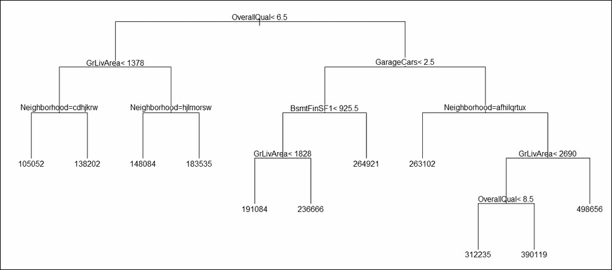

图 7：房屋销售价格的回归树

哪些变量在这里很重要？这个答案由变量重要性指标提供。我们从`HT_rtree`中提取变量重要性，条形长度最高的变量是所有变量中最重要的。现在我们将使用`barplot`函数对`HT_rtree`进行绘图：

```py
> barplot(HT_rtree$variable.importance,las=2,yaxt="n")
```

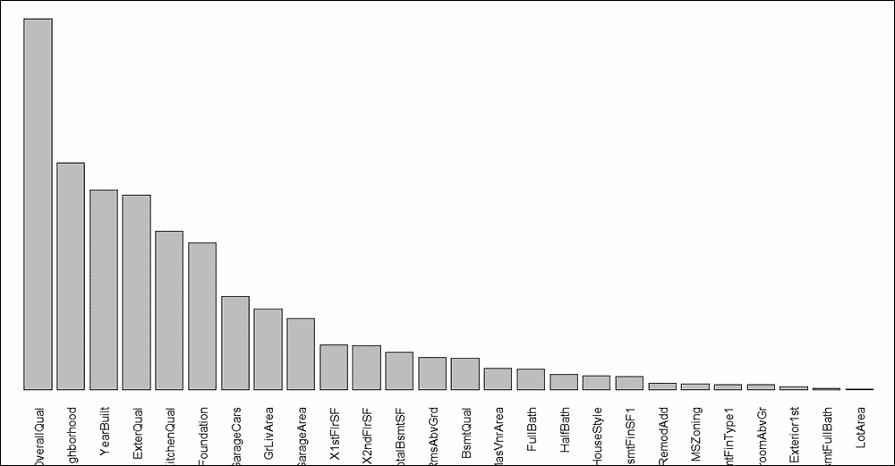

图 8：住房模型回归树的变量重要性

**练习**：探索回归树的剪枝选项。

接下来，我们将查看三个基础学习器在验证数据集上的性能。

## 回归模型的预测

我们将房价训练数据集分为两个部分：训练和验证。现在我们将使用构建的模型并检查它们的性能如何。我们将通过查看 MAPE 指标（`|实际-预测|/实际`）来完成这项工作。使用带有`newdata`选项的`predict`函数，首先获得预测值，然后计算数据验证部分观测值的 MAPE：

```py
> HT_LM_01_val_hat <- predict(HT_LM_01,newdata = HT_Validate[,-69])
Warning message:
In predict.lm(HT_LM_01, newdata = HT_Validate[, -69]) :
  prediction from a rank-deficient fit may be misleading
> mean(abs(HT_LM_01_val_hat - HT_Validate$SalePrice)/HT_Validate$SalePrice)
[1] 0.11
> HT_LM_Final_val_hat <- predict(HT_LM_Final,newdata = HT_Validate[,-69])
> mean(abs(HT_LM_Final_val_hat - HT_Validate$SalePrice)/HT_Validate$SalePrice)
[1] 0.11
> HT_NN_val_hat <- predict(HT_NN,newdata = HT_Validate[,-69])
> mean(abs(HT_NN_val_hat - HT_Validate$SalePrice)/HT_Validate$SalePrice)
[1] 0.37
> HT_rtree_val_hat <- predict(HT_rtree,newdata = HT_Validate[,-69])
> mean(abs(HT_rtree_val_hat - HT_Validate$SalePrice)/HT_Validate$SalePrice)
[1] 0.17
```

线性回归模型`HT_LM_01`和最有效的线性模型（根据 AIC）`HT_LM_Final`都给出了相同的准确度（精确到两位数），这两个模型的 MAPE 为`0.11`。具有五个隐藏神经元的神经网络模型`HT_NN`的 MAPE 为`0.37`，这是一个不好的结果。这再次证实了众所周知的事实：复杂性并不一定意味着准确性。回归树`HT_rtree`的准确度为`0.17`。

预测的价格在以下程序中进行了可视化：

```py
> windows(height = 100,width = 100)
> plot(HT_Validate$SalePrice,HT_LM_01_val_hat,col="blue",
+      xlab="Sales Price",ylab="Predicted Value")
> points(HT_Validate$SalePrice,HT_LM_Final_val_hat,col="green")
> points(HT_Validate$SalePrice,HT_NN_val_hat,col="red")
> points(HT_Validate$SalePrice,HT_rtree_val_hat,col="yellow")
> legend(x=6e+05,y=4e+05,lty=3,
+        legend=c("Linear","Best Linear","Neural Network","Regression Tree"),
+        col=c("blue","green","red","yellow"))
```

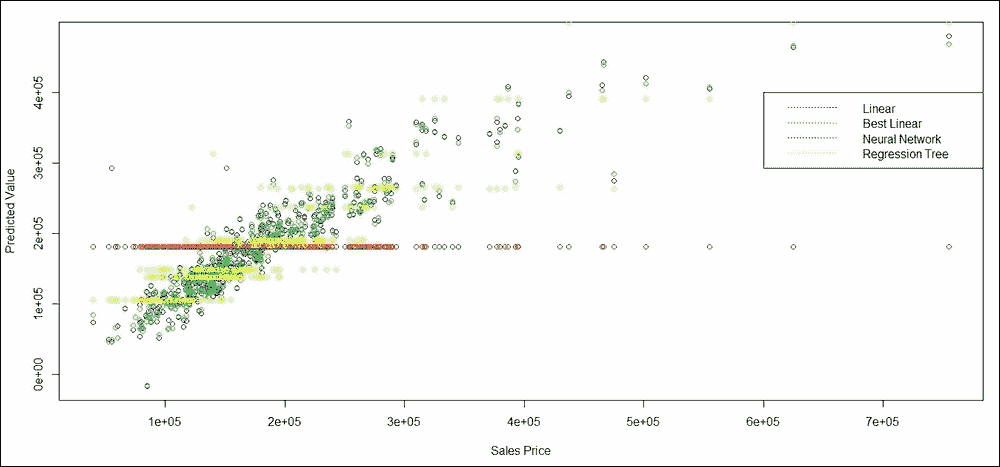

图 9：预测房价

现在我们已经设置了基础学习器，是时候构建它们的集成模型了。我们将基于决策树的同质基础学习器构建集成模型。

# Bagging 和随机森林

第三章，*Bagging*，和第四章，*随机森林*，展示了如何提高基本决策树的稳定性和准确性。在本节中，我们将主要使用决策树作为基础学习器，并以与第三章和第四章中相同的方式创建树集成。

`split`函数是 Bagging 和随机森林算法在分类和回归树中的主要区别。因此，不出所料，我们可以继续使用与分类问题中使用的相同函数和包来处理回归问题。我们将首先使用`ipred`包中的`bagging`函数来为房价数据设置 Bagging 算法：

```py
> housing_bagging <- bagging(formula = HT_Formula,data=ht_imp,nbagg=500,
+                            coob=TRUE,keepX=TRUE)
> housing_bagging$err
[1] 35820
```

与第三章中的相同方式一样，Bagging 对象中的树可以被保存到 PDF 文件中：*Bagging*：

```py
> pdf("../Output/Housing_Bagging.pdf")
> for(i in 1:500){
+   temp <- housing_bagging$mtrees[[i]]
+   plot(temp$btree)
+   text(temp$btree,use.n=TRUE)
+ }
> dev.off()
RStudioGD 
        2 
```

由于 `ipred` 包没有直接给出变量重要性，而了解哪些变量重要始终是一个重要的衡量标准，因此我们运行了一个与 第三章 中使用的类似循环和程序，即 *Bagging*，以获取变量重要性图：

```py
> VI <- data.frame(matrix(0,nrow=500,ncol=ncol(ht_imp)-1))
> vnames <- names(ht_imp)[-69]
> names(VI) <- vnames
> for(i in 1:500){
+   VI[i,] <- as.numeric(housing_bagging$mtrees[[i]]$btree$variable.importance[vnames])
+ }
> Bagging_VI <- colMeans(VI,na.rm = TRUE)
> Bagging_VI <- sort(Bagging_VI,dec=TRUE)
> barplot(Bagging_VI,las=2,yaxt="n")
> title("Variable Importance of Bagging")
```

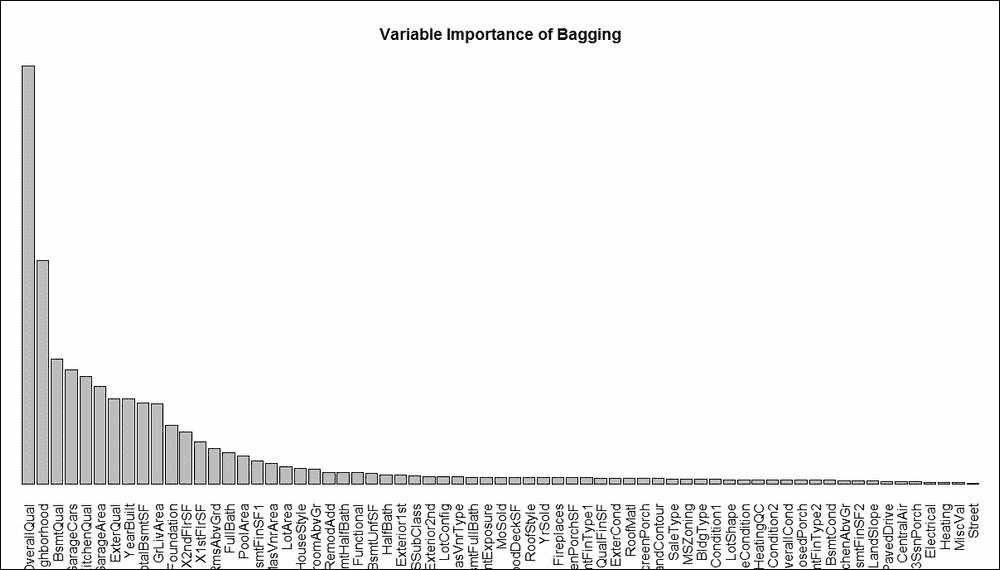

图 10：住房数据 bagging 算法的变量重要性图

**练习：** 比较 *图 10* 和 *图 8*，以决定回归树中是否存在过拟合问题。

bagging 是否提高了预测性能？这是我们需要评估的重要标准。使用带有 `newdata` 选项的 `predict` 函数，我们再次计算 MAPE，如下所示：

```py
> HT_bagging_val_hat <- predict(housing_bagging,newdata = HT_Validate[,-69])
> mean(abs(HT_bagging_val_hat - HT_Validate$SalePrice)/HT_Validate$SalePrice)
[1] 0.13
```

简单回归树的 MAPE 为 17%，现在降至 13%。这引出了下一个练习。

**练习：** 使用 `rpart.control` 中的某些剪枝选项来提高 bagging 的性能。

在 bagging 之后，下一步是随机森林。我们将使用同名的 `randomForest` 函数。在这里，我们探索了 500 棵树来构建这个森林。对于回归数据，节点分裂时随机采样的协变量数量的默认设置是 `mtry = p/3`，其中 `p` 是协变量的数量。我们将使用默认选择。`randomForest` 函数用于设置树集成，然后使用在 第四章 中定义的 `plot_rf` 函数，即 *随机森林*，将森林的树保存到 PDF 文件中：

```py
> housing_RF <- randomForest(formula=HT_Formula,data=ht_imp,ntree=500,
+                            replace=TRUE,importance=TRUE)
> pdf("../Output/Housing_RF.pdf",height=100,width=500)
Error in pdf("../Output/Housing_RF.pdf", height = 100, width = 500) : 
  cannot open file '../Output/Housing_RF.pdf'
> plot_RF(housing_RF)
[1] 1
[1] 2
[1] 3

[1] 498
[1] 499
[1] 500
> dev.off()
null device 
          1 
> windows(height=100,width=200)
> varImpPlot(housing_RF2)
```

下图给出了随机森林的变量重要性图：

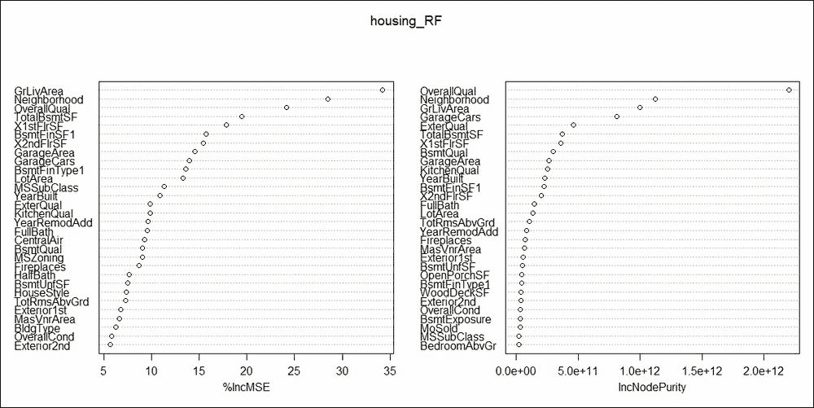

图 11：住房数据的随机森林变量重要性

**练习：** 找出两个变量重要性图 `%lncMSE` 和 `IncNodePurity` 之间的差异。同时，比较随机森林的变量重要性图和 bagging 图，并对此进行评论。

我们的森林有多准确？使用 `predict` 函数，我们将得到答案：

```py
> HT_RF_val_hat <- predict(housing_RF,newdata = HT_Validate[,-69])
> mean(abs(HT_RF_val_hat - HT_Validate$SalePrice)/HT_Validate$SalePrice)
[1] 0.038
```

这真是太棒了，随机森林通过大幅降低 MAPE 从 `0.17` 到 `0.038` 显著提高了精度。这是迄今为止构建的所有模型中的绝对赢家。

**练习：** 尽管精度有所提高，但尝试基于剪枝树构建森林，并计算精度。

让我们看看提升如何改变树的性能。

# 提升回归模型

第五章《提升》介绍了当有感兴趣的分类变量时，提升法对树的提升方法。将提升法应用于回归问题需要大量的计算改变。更多信息，请参阅 Zemel 和 Pitassi（2001）的论文，[`papers.nips.cc/paper/1797-a-gradient-based-boosting-algorithm-for-regression-problems.pdf`](http://papers.nips.cc/paper/1797-a-gradient-based-boosting-algorithm-for-regression-problems.pdf)，或 Ridgeway 等人（1999）的论文，[`dimacs.rutgers.edu/Research/MMS/PAPERS/BNBR.pdf`](http://dimacs.rutgers.edu/Research/MMS/PAPERS/BNBR.pdf)。

将使用`gbm`库中的`gbm`函数来提升由随机森林生成的弱学习器。我们生成了一千棵树，`n.trees=1e3`，并使用`shrinkage`因子为`0.05`，然后使用梯度提升算法对回归数据进行提升：

```py
> housing_gbm <- gbm(formula=HT_Formula,data=HT_Build,distribution = "gaussian",
+                    n.trees=1e3,shrinkage = 0.05,keep.data=TRUE,
+                    interaction.depth=1,
+                    cv.folds=3,n.cores = 1)
> summary(housing_gbm)
                        var     rel.inf
OverallQual     OverallQual 29.22608012
GrLivArea         GrLivArea 18.85043432
Neighborhood   Neighborhood 13.79949556

PoolArea           PoolArea  0.00000000
MiscVal             MiscVal  0.00000000
YrSold               YrSold  0.00000000
```

本总结按降序给出了变量的重要性。可以通过`gbm.perf`函数查看提升法的性能，由于我们的目标始终是生成对新数据表现良好的技术，因此还叠加了以下出袋曲线：

```py
> windows(height=100,width=200)
> par(mfrow=c(1,2))
> gbm.perf(housing_gbm,method="OOB",plot.it=TRUE,
+                              oobag.curve = TRUE,overlay=TRUE)
[1] 135
```

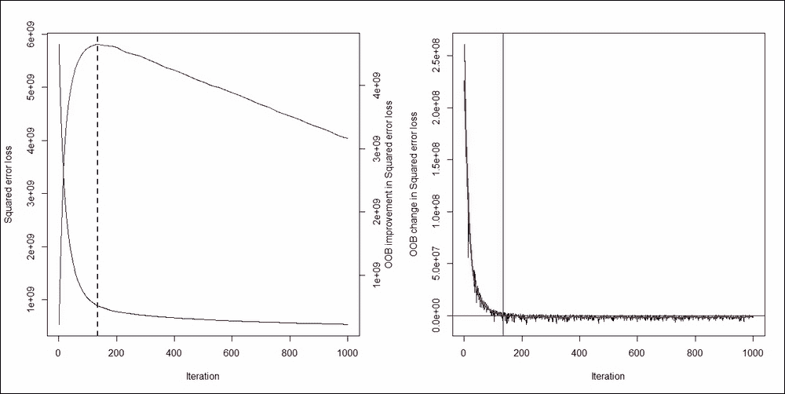

图 12：住房数据的提升收敛

提升法在第**137**次迭代时收敛。接下来，我们查看提升法在验证数据上的性能：

```py
> HT_gbm_val_hat <- predict(housing_gbm,newdata = HT_Validate[,-69])
Using 475 trees...
> mean(abs(HT_gbm_val_hat - HT_Validate$SalePrice)/HT_Validate$SalePrice)
[1] 0.11
```

MAPE 已从 17%降至 11%。然而，随机森林仍然是迄今为止最准确的模型。

# 回归模型的堆叠方法

线性回归模型、神经网络和回归树是这里将要堆叠的三个方法。我们将需要`caret`和`caretEnsemble`包来完成这项任务。堆叠集成方法已在第七章《一般集成技术》中详细介绍。首先，我们指定训练任务的控制参数，指定算法列表，并创建堆叠集成：

```py
> control <- trainControl(method="repeatedcv", number=10, repeats=3, 
+                         savePredictions=TRUE, classProbs=TRUE)
> algorithmList <- c('lm', 'rpart')
> set.seed(12345)
> Emodels <- caretList(HT_Formula, data=HT_Build, trControl=control, 
+                      methodList=algorithmList,
+                      tuneList=list(
+                        nnet=caretModelSpec(method='nnet', trace=FALSE,
+                                            linout=TRUE)
+                        
+                      )
+                      )
There were 37 warnings (use warnings() to see them)
```

神经网络通过`caretModelSpec`指定。`Emodels`需要重新采样以进行进一步分析：

```py
> Enresults <- resamples(Emodels)
> summary(Enresults)

Call:
summary.resamples(object = Enresults)

Models: nnet, lm, rpart 
Number of resamples: 30 

MAE 
       Min. 1st Qu. Median  Mean 3rd Qu.  Max. NA's
nnet  30462   43466  47098 47879   53335 58286    0
lm    16153   18878  20348 20138   21337 23865    0
rpart 30369   33946  35688 35921   37354 42437    0

RMSE 
       Min. 1st Qu. Median  Mean 3rd Qu.  Max. NA's
nnet  42598   66632  70197 69272   73089 85971    0
lm    22508   26137  29192 34347   39803 66875    0
rpart 38721   46508  50528 50980   55705 65337    0

Rsquared 
        Min. 1st Qu. Median Mean 3rd Qu. Max. NA's
nnet  0.0064    0.16   0.32 0.31    0.44 0.74    4
lm    0.4628    0.77   0.85 0.81    0.88 0.92    0
rpart 0.4805    0.55   0.57 0.58    0.61 0.69    0

> dotplot(Enresults)
```

接下来显示`dotplot`：

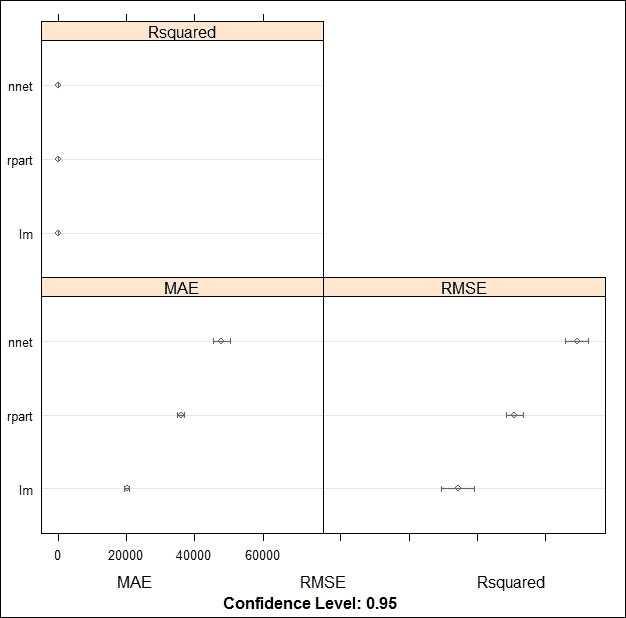

图 13：住房数据的 R-square、MAE 和 RMSE

我们可以从*图 13*中看到，三个模型的 R-square 相似，尽管三个模型的 MAE 和 RMSE 有显著差异。可以使用`modelCor`函数找到模型的相关性：

```py
> modelCor(Enresults)
        nnet    lm rpart
nnet   1.000 0.033 -0.44
lm     0.033 1.000  0.29
rpart -0.441 0.288  1.00
```

我们现在将集成方法应用于验证数据：

```py
> HT_Validate_Predictions <- rowMeans(predict(Emodels,newdata = HT_Validate))
Warning message:
In predict.lm(modelFit, newdata) :
  prediction from a rank-deficient fit may be misleading
> mean(abs(HT_Validate_Predictions - HT_Validate$SalePrice)/HT_Validate$SalePrice)
[1] 0.16
```

### 注意

注意，神经网络的默认结果，我们没有指定隐藏层的大小。16%的 MAPE 并不理想，我们最好使用随机森林集成。

**练习**：对主成分和变量聚类数据进行堆叠集成方法的操作。

# 摘要

在本章中，我们扩展了书中早期学习的大多数模型和方法。本章从住房数据的详细示例开始，我们进行了可视化和预处理。主成分方法有助于减少数据，变量聚类方法也有助于完成同样的任务。随后介绍了线性回归模型、神经网络和回归树作为基学习器的方法。袋装、提升和随机森林算法是一些有助于改进模型的方法。这些方法基于同质集成方法。本章最后以堆叠集成方法为三个异质基学习器进行了总结。

下一章将讨论不同结构的有删失观测数据，这种数据被称为生存数据，它通常出现在临床试验的研究中。
