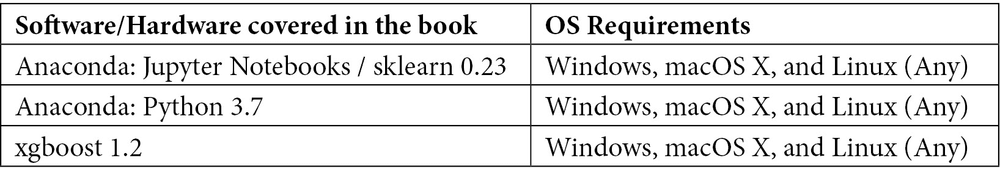
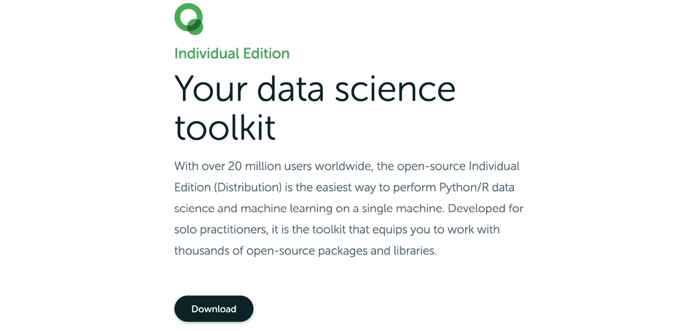
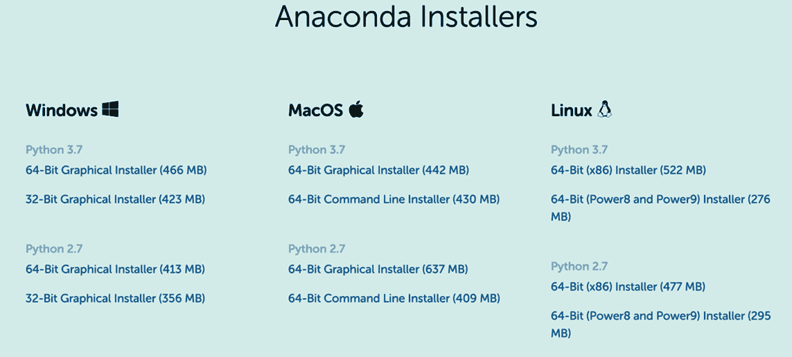
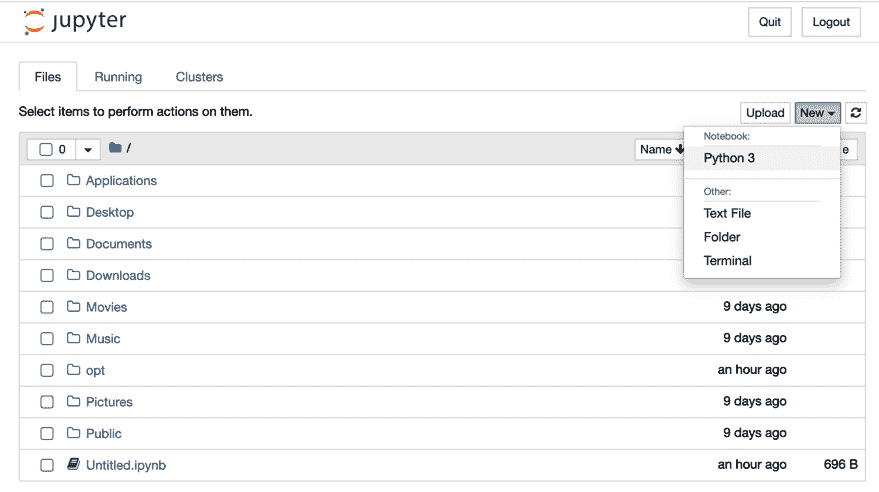
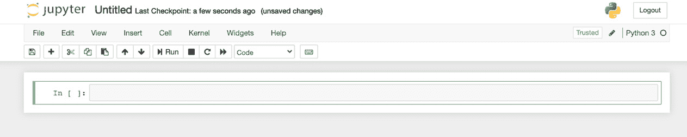
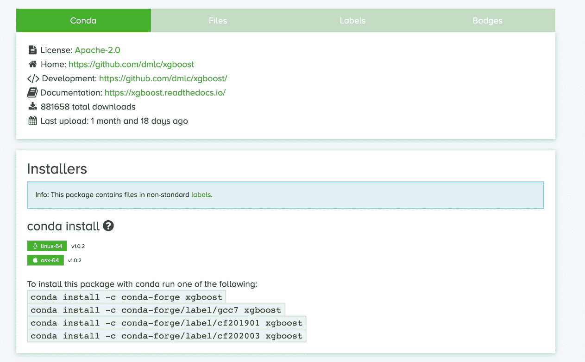
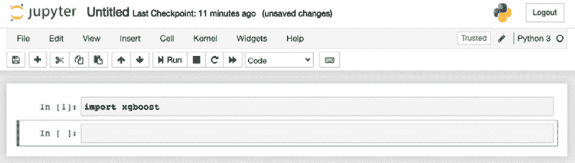

# 前言

XGBoost 是一个行业验证的开源软件库，提供一个梯度提升框架，能够快速高效地扩展数十亿个数据点。

本书介绍了机器学习和 XGBoost 在 scikit-learn 中的应用，先通过线性回归和逻辑回归引入，随后讲解梯度提升背后的理论。你将学习决策树，并在机器学习的背景下分析集成方法，学习扩展到 XGBoost 的超参数。在此过程中，你将从零开始构建梯度提升模型，并将其扩展到大数据中，同时认识到使用计时器时的速度限制。XGBoost 中的细节将着重于速度提升以及数学推导参数。在详细的案例研究帮助下，你将练习使用 scikit-learn 和原生 Python API 构建并微调 XGBoost 分类器和回归器。你将利用 XGBoost 超参数来提升得分、修正缺失值、调整不平衡数据集，并微调其他基础学习器。最后，你将应用先进的 XGBoost 技术，如构建非相关集成、堆叠模型，并使用稀疏矩阵、自定义转换器和管道准备模型以便于行业部署。

本书结束时，你将能够使用 XGBoost 构建高效的机器学习模型，最大限度地减少错误并提高速度。

## 适合人群

本书面向数据科学专业人员和爱好者、数据分析师以及希望构建快速且准确的机器学习模型并能够应对大数据的开发人员。掌握 Python 编程语言并对线性代数有基本了解，将帮助你最大限度地提高本书的学习效果。

## 本书涵盖内容

*第一章*，*机器学习全景*，通过介绍线性回归和逻辑回归，将 XGBoost 放入机器学习的一般背景中，随后将其与 XGBoost 进行对比。`pandas` 被引入用于预处理机器学习的原始数据，方法包括转换分类列和以多种方式清理空值。

*第二章*，*深入探讨决策树*，详细介绍了 XGBoost 使用的决策树超参数，并通过图形和统计分析，探讨了方差和偏差的分析，强调了过拟合的重要性，这是整本书贯穿的主题。

*第三章*，*使用随机森林的集成方法*，概述了随机森林作为 XGBoost 的竞争者，重点讲解了集成方法。与随机森林共享的 XGBoost 超参数，如 `n_estimators` 和 `subsample`，也得到了充分的讲解。

*第四章*，*从梯度提升到 XGBoost*，介绍了提升方法的基本原理，如何在`scikit-learn`中从零开始构建一个提升器，微调新的 XGBoost 超参数，如`eta`，并通过比较梯度提升与 XGBoost 的运行时间，突出了 XGBoost 在速度上的优势。

*第五章*，*XGBoost 揭秘*，分析了 XGBoost 算法的数学推导，并通过一个历史相关的案例研究，展示了 XGBoost 在 Higgs Boson Kaggle 竞赛中的获胜模型角色。讨论了标准的 XGBoost 参数，构建了基础模型，并介绍了原始 Python API。

*第六章*，*XGBoost 超参数*，介绍了所有重要的 XGBoost 超参数，总结了之前树集成方法的超参数，并使用原始网格搜索函数来微调 XGBoost 模型，以优化得分。

*第七章*，*用 XGBoost 发现系外行星*，通过一个从头到尾的案例研究，展示如何用 XGBoost 发现系外行星。分析了不平衡数据集的陷阱，利用混淆矩阵和分类报告，引出了不同的评分指标和重要的 XGBoost 超参数`scale_pos_weight`。

*第八章*，*XGBoost 替代基础学习器*，介绍了 XGBoost 所有的提升器，包括`gbtree`、`dart`和`gblinear`，用于回归和分类。将随机森林作为基础学习器，作为 XGBoost 的替代模型，并介绍了新的`XGBRFRegressor`和`XGBRFClassifier`类。

*第九章*，*XGBoost Kaggle 大师*，展示了 XGBoost Kaggle 获胜者使用的一些技巧和窍门，帮助他们在竞赛中获胜，内容包括高级特征工程、构建非相关的机器学习集成和堆叠方法。

*第十章*，*XGBoost 模型部署*，通过使用自定义的转换器来处理混合数据，并通过机器学习管道对新数据进行预测，将原始数据转化为 XGBoost 机器学习预测，进而部署微调后的 XGBoost 模型。

# 为了充分利用这本书

读者应熟练掌握 Python，至少能够切片列表、编写自己的函数并使用点标记法。对线性代数有基本了解，能够访问矩阵中的行和列即可。具有 pandas 和机器学习背景会有帮助，但不是必需的，因为书中的所有代码和概念都会逐步解释。

本书使用了 Python 最新版本，并且配合 Anaconda 发行版在 Jupyter Notebook 中运行。强烈推荐使用 Anaconda，因为它包含了所有主要的数据科学库。在开始之前，值得更新一下 Anaconda。以下部分提供了详细的步骤，以便您像我们一样设置您的编码环境。

# 设置您的编码环境

下表总结了本书中使用的必要软件。



下面是将此软件上传到您系统的说明。

## Anaconda

本书中您需要的数据科学库以及 Jupyter Notebook、scikit-learn (sklearn) 和 Python 可以一起通过 Anaconda 安装，强烈推荐使用 Anaconda。

以下是 2020 年在您的计算机上安装 Anaconda 的步骤：

1.  前往 [`www.anaconda.com/products/individual`](https://www.anaconda.com/products/individual)。

1.  点击下图中的 **下载**，此时尚未开始下载，但会为您提供多个选项（参见第 3 步）：

    

    图 0.1 – 准备下载 Anaconda

1.  选择您的安装程序。推荐使用适用于 Windows 和 Mac 的 `64 位图形安装程序`。请确保您选择的是 Python 3.7 下的前两行，因为本书中使用的都是 Python 3.7：

    

    图 0.2 – Anaconda 安装程序

1.  下载开始后，请按照计算机上的提示继续，以完成安装：

    Mac 用户警告

    如果遇到错误 **无法在此位置安装 Anaconda3**，请不要惊慌。只需点击高亮显示的 **仅为我安装**，然后 **继续** 按钮将会显示作为一个选项。


图 0.3 – Mac 用户警告 – 只需点击“仅为我安装”，然后点击“继续”

## 使用 Jupyter Notebook

现在您已经安装了 Anaconda，可以打开 Jupyter Notebook 使用 Python 3.7。以下是打开 Jupyter Notebook 的步骤：

1.  点击您计算机上的 **Anaconda-Navigator**。

1.  点击 **启动** 下的 **Jupyter Notebook**，如下图所示：

    

    图 0.4 – Anaconda 主屏幕

    这应该会在浏览器窗口中打开一个 Jupyter Notebook。虽然 Jupyter Notebook 为了方便在网页浏览器中显示，但它们实际运行在您的个人计算机上，而非在线。Google Colab Notebook 是一个可以接受的在线替代方案，但本书中仅使用 Jupyter Notebook。

1.  从 Jupyter Notebook 右侧的 **新建** 标签中选择 **Python 3**，如下图所示：



图 0.5 – Jupyter Notebook 主屏幕

这应该会将您带到以下屏幕：



图 0.6 – Jupyter Notebook 内部界面

恭喜！您现在可以运行 Python 代码了！只需在单元格中输入任何内容，例如 `print('hello xgboost!')`，然后按 *Shift* + *Enter* 执行代码。

解决 Jupyter Notebook 问题

如果你在运行或安装 Jupyter notebooks 时遇到问题，请访问 Jupyter 官方的故障排除指南：[`jupyter-notebook.readthedocs.io/en/stable/troubleshooting.html`](https://jupyter-notebook.readthedocs.io/en/stable/troubleshooting.html)。

## XGBoost

在写作时，XGBoost 尚未包含在 Anaconda 中，因此必须单独安装。

以下是安装 XGBoost 到你电脑上的步骤：

1.  访问[`anaconda.org/conda-forge/xgboost`](https://anaconda.org/conda-forge/xgboost)。你应该看到以下内容：

    

    图 0.7 – Anaconda 安装 XGBoost 的推荐方法

1.  复制上面截图中显示的第一行代码，如下所示：

    

    图 0.8 – 包安装

1.  打开你电脑上的终端（Terminal）。

    如果你不知道终端在哪里，可以在 Mac 上搜索`Terminal`，在 Windows 上搜索`Windows Terminal`。

1.  将以下代码粘贴到你的终端中，按 *Enter*，并按照提示操作：

    ```py
    conda install -c conda-forge xgboost
    ```

1.  通过打开一个新的 Jupyter notebook 来验证安装是否成功，具体步骤见前一部分。然后输入`import xgboost`并按 *Shift* + *Enter*。你应该会看到以下内容：



图 0.9 – 在 Jupyter notebook 中成功导入 XGBoost

如果没有错误，恭喜你！你现在已经具备了运行本书代码所需的所有技术要求。

提示

如果在设置编码环境时遇到错误，请重新检查前面的步骤，或者考虑查看 Anaconda 错误文档：[`docs.anaconda.com/anaconda/user-guide/troubleshooting/`](https://docs.anaconda.com/anaconda/user-guide/troubleshooting/)。Anaconda 用户应通过在终端中输入`conda update conda`来更新 Anaconda。如果在安装 XGBoost 时遇到问题，请参考官方文档：[`xgboost.readthedocs.io/en/latest/build.html`](https://xgboost.readthedocs.io/en/latest/build.html)。

## 版本

这里是你可以在 Jupyter notebook 中运行的代码，用来查看你所使用的软件版本：

```py
import platform; print(platform.platform())
import sys; print("Python", sys.version)
import numpy; print("NumPy", numpy.__version__)
import scipy; print("SciPy", scipy.__version__)
import sklearn; print("Scikit-Learn", sklearn.__version__)
import xgboost; print("XGBoost", xgboost.__version__)
```

以下是本书中生成代码所使用的版本：

```py
Darwin-19.6.0-x86_64-i386-64bit
Python 3.7.7 (default, Mar 26 2020, 10:32:53) 
[Clang 4.0.1 (tags/RELEASE_401/final)]
NumPy 1.19.1
SciPy 1.5.2
Scikit-Learn 0.23.2
XGBoost 1.2.0
```

如果你的版本与我们的不同也没关系。软件是不断更新的，使用更新版本可能会获得更好的结果。如果你使用的是旧版本，建议通过运行`conda update conda`来使用 Anaconda 更新。若你之前安装过旧版本的 XGBoost 并通过 Anaconda 进行管理，可以按前一部分的说明运行`conda update xgboost`进行更新。

## 访问代码文件

**如果你正在使用本书的数字版，我们建议你自己输入代码，或通过 GitHub 仓库访问代码（链接将在下一部分提供）。这样可以帮助你避免因复制和粘贴代码而导致的潜在错误。**

本书的代码包也托管在 GitHub 上，地址为 [`github.com/PacktPublishing/Hands-On-Gradient-Boosting-with-XGBoost-and-Scikit-learn`](https://github.com/PacktPublishing/Hands-On-Gradient-Boosting-with-XGBoost-and-Scikit-learn)。如果代码有更新，将会在现有的 GitHub 仓库中更新。

我们还提供了来自我们丰富书籍和视频目录的其他代码包，您可以在 [`github.com/PacktPublishing/`](https://github.com/PacktPublishing/) 查看。

# 下载彩色图片

我们还提供了一份包含本书中使用的截图/图表彩色图片的 PDF 文件。您可以在这里下载：

[`static.packt-cdn.com/downloads/9781839218354_ColorImages.pdf`](https://static.packt-cdn.com/downloads/9781839218354_ColorImages.pdf)。

# 使用的约定

本书中使用了多种文本约定。

`文本中的代码`：表示文本中的代码词汇、数据库表名、文件夹名称、文件名、文件扩展名、路径名、虚拟网址、用户输入和 Twitter 账号。以下是一个示例：“`AdaBoostRegressor` 和 `AdaBoostClassifier` 算法可以从 `sklearn.ensemble` 库下载，并应用于任何训练集。”

代码块如下所示：

```py
X_bikes = df_bikes.iloc[:,:-1]
y_bikes = df_bikes.iloc[:,-1]
from sklearn.model_selection import train_test_split
X_train, X_test, y_train, y_test = train_test_split(X_bikes, y_bikes, random_state=2)
```

当我们希望您关注代码块的特定部分时，相关行或项目会以粗体显示：

```py
Stopping. Best iteration:
[1]	validation_0-error:0.118421
Accuracy: 88.16%
```

提示或重要说明

显示效果如下。

# 联系我们

我们始终欢迎读者的反馈。

**一般反馈**：如果您对本书的任何部分有疑问，请在邮件主题中提及书名，并发送邮件至 customercare@packtpub.com。

**勘误**：尽管我们已尽最大努力确保内容的准确性，但难免会有错误。如果您在本书中发现错误，恳请您向我们报告。请访问 [www.packtpub.com/support/errata](http://www.packtpub.com/support/errata)，选择您的书籍，点击勘误提交表单链接并输入相关详情。

**盗版**：如果您在互联网上发现我们的作品以任何形式的非法复制，我们将非常感激您提供位置地址或网站名称。请通过 copyright@packt.com 与我们联系，并附上相关材料的链接。

**如果您有兴趣成为作者**：如果您在某个领域具有专业知识，并且有兴趣撰写或为书籍做贡献，请访问 [authors.packtpub.com](http://authors.packtpub.com)。

# 评审

请留下评论。阅读并使用本书后，为什么不在购买您书籍的网站上留下评价呢？潜在读者可以根据您的公正意见做出购买决策，我们 Packt 也能了解您对我们产品的看法，我们的作者能够看到您对其书籍的反馈。谢谢！

关于 Packt 的更多信息，请访问 [packt.com](http://packt.com)。
