# 第一章：*第一章*：机器学习的全景

欢迎来到*XGBoost 与 Scikit-Learn 实战*，本书将教授你 XGBoost 的基础知识、技巧和窍门，XGBoost 是最佳的用于从表格数据中进行预测的机器学习算法。

本书的重点是**XGBoost**，也称为**极端梯度提升**。XGBoost 的结构、功能以及原始能力将在每一章中逐步详细展开。本书的章节展开讲述了一个令人难以置信的故事：XGBoost 的故事。通过阅读完本书，你将成为利用 XGBoost 从真实数据中进行预测的专家。

在第一章中，XGBoost 将以预览的形式出现。它将在**机器学习**回归和分类的更大背景下首次亮相，为接下来的内容铺垫基础。

本章重点介绍为机器学习准备数据的过程，也叫做**数据处理**。除了构建机器学习模型，你还将学习如何使用高效的**Python**代码加载数据、描述数据、处理空值、将数据转换为数值列、将数据分割为训练集和测试集、构建机器学习模型、实施**交叉验证**，并且将**线性回归**和**逻辑回归**模型与 XGBoost 进行比较。

本章中介绍的概念和库将在全书中使用。

本章包含以下内容：

+   预览 XGBoost

+   数据处理

+   预测回归

+   预测分类

# 预览 XGBoost

机器学习在 1940 年代随着第一个神经网络的出现而获得认可，接着在 1950 年代迎来了第一个机器学习国际象棋冠军。经过几十年的沉寂，机器学习领域在 1990 年代迎来了飞跃，当时**深蓝**在著名的比赛中击败了世界象棋冠军加里·卡斯帕罗夫。随着计算能力的飞速增长，1990 年代和 2000 年代初涌现出大量学术论文，揭示了诸如**随机森林**和**AdaBoost**等新的机器学习算法。

提升的基本思路是通过反复改进错误，将弱学习器转变为强学习器。**梯度提升**的核心思想是利用梯度下降法最小化残差的错误。这一从标准机器学习算法到梯度提升的进化思路是本书前四章的核心内容。

XGBoost 是**极端梯度提升**（Extreme Gradient Boosting）的缩写。*极端*部分指的是通过极限计算来提高准确性和速度。XGBoost 的快速流行主要得益于其在**Kaggle 竞赛**中的无与伦比的成功。在 Kaggle 竞赛中，参赛者构建机器学习模型，力图做出最佳预测并赢取丰厚的现金奖励。与其他模型相比，XGBoost 在竞赛中常常碾压对手。

理解 XGBoost 的细节需要了解梯度提升算法中机器学习的全貌。为了呈现完整的图景，我们从机器学习的基础开始讲起。

## 什么是机器学习？

机器学习是计算机从数据中学习的能力。2020 年，机器学习能够预测人类行为、推荐产品、识别面孔、超越扑克高手、发现系外行星、识别疾病、操作自动驾驶汽车、个性化互联网体验，并直接与人类交流。机器学习正在引领人工智能革命，影响着几乎所有大公司底线。

在实践中，机器学习意味着实现计算机算法，当新数据进入时，算法的权重会随之调整。机器学习算法通过学习数据集来对物种分类、股市、公司利润、人类决策、亚原子粒子、最佳交通路线等进行预测。

机器学习是我们手中最好的工具，可以将大数据转化为准确、可操作的预测。然而，机器学习并非在真空中发生。机器学习需要大量的数据行和列。

# 数据清洗

数据清洗是一个全面的术语，涵盖了机器学习开始之前的数据预处理各个阶段。数据加载、数据清理、数据分析和数据操作都属于数据清洗的范畴。

本章详细介绍了数据清洗。示例旨在涵盖标准的数据清洗挑战，所有这些挑战都可以通过 Python 的数据分析专用库**pandas**快速处理。尽管不要求具有**pandas**的经验，但基本的**pandas**知识将对学习有帮助。所有代码都有详细解释，方便新手跟随学习。

## 数据集 1 – 自行车租赁

自行车租赁数据集是我们的第一个数据集。数据源来自世界著名的公共数据仓库 UCI 机器学习库（[`archive.ics.uci.edu/ml/index.php`](https://archive.ics.uci.edu/ml/index.php)）。我们的自行车租赁数据集已从原始数据集（[`archive.ics.uci.edu/ml/datasets/bike+sharing+dataset`](https://archive.ics.uci.edu/ml/datasets/bike+sharing+dataset)）调整，添加了空值，以便你可以练习如何修正这些空值。

### 访问数据

数据清洗的第一步是访问数据。可以通过以下步骤实现：

1.  下载数据。所有本书的文件都存储在 GitHub 上。你可以通过点击桌面上的`Data`文件夹，将所有文件下载到本地计算机。

1.  打开 Jupyter Notebook。您可以在前言中找到下载 Jupyter Notebook 的链接。在终端中点击 `jupyter notebook`。网页浏览器打开后，您应该看到一列文件夹和文件。进入与自行车租赁数据集相同的文件夹，选择 **New: Notebook: Python 3**。这里有一个视觉指南：

    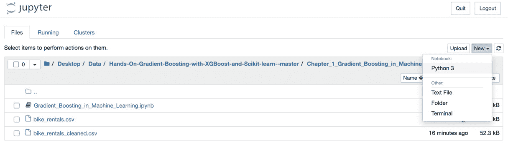

    图 1.2 – 访问 Jupyter Notebook 的视觉指南

    小贴士

    如果您在打开 Jupyter Notebook 时遇到困难，请参阅 Jupyter 的官方故障排除指南：[`jupyter-notebook.readthedocs.io/en/stable/troubleshooting.html`](https://jupyter-notebook.readthedocs.io/en/stable/troubleshooting.html)。

1.  在 Jupyter Notebook 的第一个单元格中输入以下代码：

    ```py
    import pandas as pd 
    ```

    按下 *Shift* + *Enter* 运行单元格。现在，当你输入 `pd` 时，你可以访问 `pandas` 库了。

1.  使用 `pd.read_csv` 加载数据。加载数据需要一个 `read` 方法。`read` 方法将数据存储为 DataFrame，这是一个用于查看、分析和操作数据的 `pandas` 对象。加载数据时，将文件名放在引号内，然后运行单元格：

    ```py
    df_bikes = pd.read_csv('bike_rentals.csv')
    ```

    如果您的数据文件与 Jupyter Notebook 不在同一位置，您必须提供文件目录，例如 `Downloads/bike_rental.csv`。

    现在数据已正确存储在名为 `df_bikes` 的 DataFrame 中。

    小贴士

    **Tab 补全**：在 Jupyter Notebook 中编码时，输入几个字符后，按 *Tab* 键。对于 CSV 文件，您应该看到文件名出现。用光标高亮显示名称，然后按 *Enter* 键。如果文件名是唯一的选项，您可以按 *Enter* 键。Tab 补全可以使您的编码体验更快速、更可靠。

1.  使用 `.head()` 显示数据。最后一步是查看数据以确保正确加载。`.head()` 是一个显示 DataFrame 前五行的方法。您可以在括号中放入任何正整数以查看任意数量的行。输入以下代码并按 *Shift* + *Enter*：  

    ```py
    df_bikes.head()
    ```

    这里是前几行的屏幕截图以及预期的输出：


图 1.3 – `bike_rental.csv` 输出

现在我们可以访问数据，让我们看看三种理解数据的方法。

## 理解数据

现在数据已加载，是时候理解数据了。理解数据对于未来做出明智决策至关重要。以下是三种理解数据的好方法。

### `.head()`

您已经看到了 `.head()`，这是一个广泛使用的方法，用于解释列名和编号。如前面的输出所示，`dteday` 是日期，而 `instant` 是有序索引。

### .describe()

可以使用 `.describe()` 查看数值统计信息，如下所示：

```py
df_bikes.describe()
```

这是预期的输出：


图 1.4 – `.describe()` 输出

你可能需要向右滚动才能查看所有列。

比较均值和中位数（50%）可以指示数据的偏斜程度。正如你所看到的，`mean` 和 `median` 相近，所以数据大致对称。每列的 `max` 和 `min` 值，以及四分位数和标准差（`std`）也被展示出来。

### .info()

另一个很好的方法是 `.info()`，它显示有关列和行的一般信息：

```py
df_bikes.info()
```

这是预期的输出：

```py
<class 'pandas.core.frame.DataFrame'>
RangeIndex: 731 entries, 0 to 730
Data columns (total 16 columns):
 #   Column      Non-Null Count  Dtype  
---  ------      --------------  -----  
 0   instant     731 non-null    int64  
 1   dteday      731 non-null    object 
 2   season      731 non-null    float64
 3   yr          730 non-null    float64
 4   mnth        730 non-null    float64
 5   holiday     731 non-null    float64
 6   weekday     731 non-null    float64
 7   workingday  731 non-null    float64
 8   weathersit  731 non-null    int64  
 9   temp        730 non-null    float64
 10  atemp       730 non-null    float64
 11  hum         728 non-null    float64
 12  windspeed   726 non-null    float64
 13  casual      731 non-null    int64  
 14  registered  731 non-null    int64  
 15  cnt         731 non-null    int64  
dtypes: float64(10), int64(5), object(1)
memory usage: 91.5+ KB
```

如你所见，`.info()` 给出了行数、列数、列类型和非空值的数量。由于非空值的数量在列之间不同，空值一定存在。

## 修正空值

如果空值没有得到修正，未来可能会出现意外的错误。在本小节中，我们展示了多种修正空值的方法。我们的例子不仅用于处理空值，还展示了 `pandas` 的广度和深度。

以下方法可以用于修正空值。

### 查找空值的数量

以下代码显示空值的总数：

```py
df_bikes.isna().sum().sum()
```

这是结果：

```py
12
```

请注意，需要两个 `.sum()` 方法。第一个方法对每一列的空值进行求和，第二个方法对列数进行求和。

### 显示空值

你可以通过以下代码显示所有包含空值的行：

```py
 df_bikes[df_bikes.isna().any(axis=1)]
```

这段代码可以分解如下：`df_bikes[conditional]` 是满足括号内条件的 `df_bikes` 子集。`.df_bikes.isna().any` 聚集所有的空值，而 `(axis=1)` 指定了列中的值。在 pandas 中，行是 `axis 0`，列是 `axis 1`。

这是预期的输出：

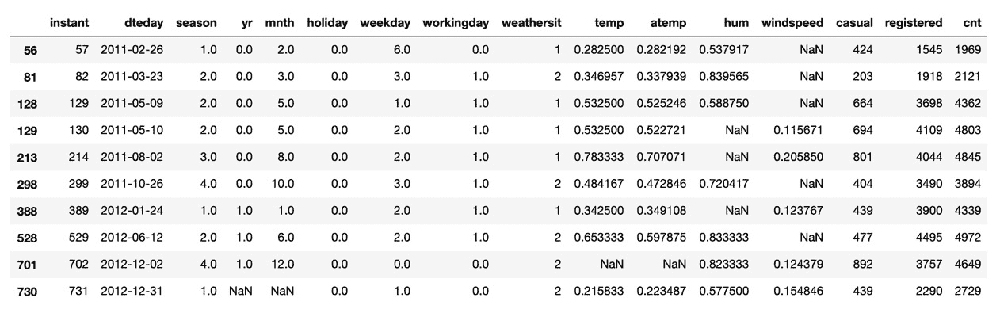

图 1.5 – 自行车租赁数据集的空值

从输出中可以看出，`windspeed`、`humidity` 和 `temperature` 列以及最后一行都存在空值。

提示

如果这是你第一次使用 **pandas**，可能需要一些时间来习惯这种表示法。你可以查看 Packt 的 *Hands-On Data Analysis with Pandas*，这是一本很好的入门书籍：[`subscription.packtpub.com/book/data/9781789615326`](https://subscription.packtpub.com/book/data/9781789615326)。

### 修正空值

修正空值的方法取决于列和数据集。我们来看看一些策略。

#### 用中位数/均值替换

一种常见的策略是用中位数或均值替换空值。这里的想法是用列的平均值替换空值。

对于 `'windspeed'` 列，可以用 `median` 值替换空值，方法如下：

```py
df_bikes['windspeed'].fillna((df_bikes['windspeed'].median()), inplace=True)
```

`df_bikes['windspeed'].fillna` 意味着 `'windspeed'` 列的空值将被填充。`df_bikes['windspeed'].median()` 是 `'windspeed'` 列的中位数。最后，`inplace=True` 确保更改是永久性的。

提示

中位数通常比均值更合适。中位数保证数据中有一半的值大于该值，另一半小于该值。相比之下，均值容易受到**异常值**的影响。

在前面的单元格中，`df_bikes[df_bikes.isna().any(axis=1)]`显示了`windspeed`列为空值的行 `56` 和 `81`。可以使用`.iloc`显示这些行，`iloc`是**索引位置**的缩写：

```py
df_bikes.iloc[[56, 81]]
```

这是预期的输出：

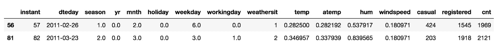

图 1.6 – 行 56 和 81

如预期的那样，空值已被替换为风速的中位数。

提示

用户在使用`.iloc`时常常会因单括号或双括号的使用不当而出错。`.iloc`使用单括号来表示一个索引，如：`df_bikes.iloc[56]`。现在，`df_bikes`也支持在括号内使用列表来接受多个索引。多个索引需要使用双括号，如：`df_bikes.iloc[[56, 81]]`。有关更多文档，请参考[`pandas.pydata.org/pandas-docs/stable/reference/api/pandas.DataFrame.iloc.html`](https://pandas.pydata.org/pandas-docs/stable/reference/api/pandas.DataFrame.iloc.html)。

#### 使用中位数/均值进行 groupby

使用**groupby**可以在修正空值时获得更细致的结果。

groupby 通过共享的值来组织行。由于行中有四个共享的季节，按季节进行 groupby 会得到四行数据，每行对应一个季节。但是，每个季节的值来自许多不同的行。我们需要一种方法来合并或聚合这些值。常用的聚合方式包括`.sum()`、`.count()`、`.mean()`和`.median()`。我们使用`.median()`。

通过`.median()`聚合按季节分组`df_bikes`的代码如下：

```py
df_bikes.groupby(['season']).median()
```

这是预期的输出：

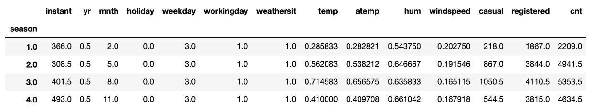

图 1.7 – 按季节分组的 df_bikes 输出

如你所见，列中的值为中位数。

要修正`hum`列中的空值，`hum`是**湿度**的缩写，我们可以按季节取湿度的中位数。

修正`hum`列空值的代码是`df_bikes['hum'] = df_bikes['hum'].fillna()`。

`fillna`中的代码是所需的值。从`groupby`获取的值需要使用`transform`方法，如下所示：

```py
df_bikes.groupby('season')['hum'].transform('median')
```

这是合并后的代码，作为一步长操作：

```py
df_bikes['hum'] = df_bikes['hum'].fillna(df_bikes.groupby('season')['hum'].transform('median'))
```

你可以通过检查`df_bikes.iloc[[129, 213, 388]]`来验证转换结果。

#### 从特定行获取中位数/均值

在某些情况下，用特定行的数据替代空值可能更有利。

在修正温度时，除了参考历史记录外，取前后两天的平均温度通常可以得到一个较好的估算值。

要查找`'temp'`列中的空值，可以输入以下代码：

```py
df_bikes[df_bikes['temp'].isna()]
```

这是预期的输出：

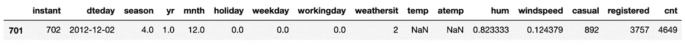

图 1.8 – 'temp' 列的输出

如你所见，索引`701`包含空值。

要找到 `701` 索引前一天和后一天的平均温度，完成以下步骤：

1.  将第 `700` 和第 `702` 行的温度相加并除以 `2`。对 `'temp'` 和 `'atemp'` 列执行此操作：

    ```py
    mean_temp = (df_bikes.iloc[700]['temp'] + df_bikes.iloc[702]['temp'])/2
    mean_atemp = (df_bikes.iloc[700]['atemp'] + df_bikes.iloc[702]['atemp'])/2
    ```

1.  替换空值：

    ```py
    df_bikes['temp'].fillna((mean_temp), inplace=True)
    df_bikes['atemp'].fillna((mean_atemp), inplace=True)
    ```

你可以自行验证，空值已经按预期填充。

#### 外推日期

我们纠正空值的最终策略涉及日期。当提供了真实日期时，日期值可以进行外推。

`df_bikes['dteday']` 是一列日期列；然而，`df_bikes.info()` 显示的列类型是对象，通常表示为字符串。日期对象，如年份和月份，必须从 `datetime` 类型中外推。可以使用 `to_datetime` 方法将 `df_bikes['dteday']` 转换为 `'datetime'` 类型，如下所示：

```py
df_bikes['dteday'] = pd.to_datetime(df_bikes['dteday'],infer_datetime_format=True)
```

`infer_datetime_format=True` 允许 **pandas** 决定存储哪种类型的日期时间对象，在大多数情况下这是一个安全的选项。

要外推单个列，首先导入 `datetime` 库：

```py
import datetime as dt
```

现在我们可以使用不同的方法来外推空值的日期。一个标准方法是将 '`mnth`' 列转换为从 'dteday' 列外推得到的正确月份。这有助于纠正转换过程中可能出现的其他错误，前提是当然 'dteday' 列是正确的。

代码如下：

```py
ddf_bikes['mnth'] = df_bikes['dteday'].dt.month
```

验证更改是非常重要的。由于空日期值位于最后一行，我们可以使用 `.tail()`，这是一个与 `.head()` 类似的 DataFrame 方法，用于显示最后五行：

```py
df_bikes.tail()
```

这是预期的输出：

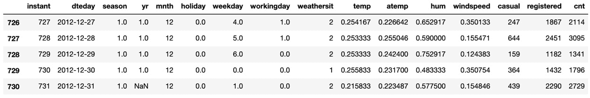

图 1.9 – 外推日期值的输出

如你所见，月份值都是正确的，但年份值需要更改。

'`dteday`' 列中最后五行的年份都是 `2012`，但由 '`yr`' 列提供的对应年份是 `1.0`。为什么？

数据已被归一化，这意味着它已转换为介于 `0` 和 `1` 之间的值。

归一化数据通常更高效，因为机器学习权重不需要调整不同范围的值。

你可以使用 `.loc` 方法填充正确的值。`.loc` 方法用于按行和列定位条目，方法如下：

```py
df_bikes.loc[730, 'yr'] = 1.0
```

现在你已经练习过修正空值并获得了相当的 **pandas** 使用经验，是时候处理非数值列了。

### 删除非数值列

对于机器学习，所有数据列都应该是数值型的。根据 `df.info()`，唯一不是数值型的列是 `df_bikes['dteday']`。此外，这列是冗余的，因为所有日期信息已经存在于其他列中。

可以按如下方式删除该列：

```py
df_bikes = df_bikes.drop('dteday', axis=1)
```

现在我们已经有了所有数值列且没有空值，我们可以进行机器学习了。

# 预测回归

机器学习算法旨在利用一个或多个输入列的数据来预测一个输出列的值。这些预测依赖于由所处理的机器学习问题的总体类别所决定的数学方程式。大多数监督学习问题被分类为回归或分类问题。在这一部分中，机器学习将在回归的背景下进行介绍。

## 预测自行车租赁数量

在自行车租赁数据集中，`df_bikes['cnt']`是某一天的自行车租赁数量。预测这一列对于自行车租赁公司来说非常有用。我们的问题是基于数据（如是否为假期或工作日、预报温度、湿度、风速等）来预测某一天的自行车租赁数量。

根据数据集，`df_bikes['cnt']`是`df_bikes['casual']`和`df_bikes['registered']`的总和。如果将`df_bikes['registered']`和`df_bikes['casual']`作为输入列，则预测结果将始终 100%准确，因为这些列的和始终是正确的结果。虽然完美的预测在理论上是理想的，但在现实中包括那些本应无法得知的输入列是没有意义的。

所有当前的列都可以用来预测`df_bikes['cnt']`，除了之前提到的`'casual'`和`'registered'`列。可以通过`.drop`方法删除`'casual'`和`'registered'`列，如下所示：

```py
df_bikes = df_bikes.drop(['casual', 'registered'], axis=1)
```

数据集现在已经准备好了。

## 保存数据以供未来使用

本书中将多次使用自行车租赁数据集。为了避免每次运行笔记本进行数据整理，可以将清理后的数据集导出为 CSV 文件，以便未来使用：

```py
df_bikes.to_csv('bike_rentals_cleaned.csv', index=False)
```

`index=False`参数防止索引创建额外的列。

## 声明预测列和目标列

机器学习通过对每个预测列（输入列）执行数学运算来确定目标列（输出列）。

通常将预测列用大写`X`表示，将目标列用小写`y`表示。由于我们的目标列是最后一列，可以通过使用索引表示法切片的方式将数据划分为预测列和目标列：

```py
X = df_bikes.iloc[:,:-1]y = df_bikes.iloc[:,-1]
```

逗号用于分隔列和行。第一个冒号`:`表示所有行都包含在内。逗号后的`:-1`表示从第一列开始，一直到最后一列，但不包括最后一列。第二个`-1`只包含最后一列。

## 理解回归

预测自行车租赁数量，在实际情况中可能会得到任何**非负整数**。当目标列包含无限范围的值时，机器学习问题被归类为**回归**问题。

最常见的回归算法是线性回归。线性回归将每个预测变量列视为 **多项式变量**，并将这些值乘以 **系数**（也称为 **权重**），以预测目标变量列。**梯度下降法**在幕后工作，以最小化误差。线性回归的预测结果可以是任何实数。

在运行线性回归之前，我们必须将数据分割为训练集和测试集。训练集将数据拟合到算法中，使用目标列来最小化误差。模型建立后，将其在测试数据上进行评分。

保留一个测试集来评估模型的重要性不容小觑。在大数据的世界中，由于有大量的数据点可用于训练，**过拟合**训练集是常见的现象。过拟合通常是不好的，因为模型会过于贴合离群点、不寻常的实例和临时趋势。强大的机器学习模型能够在对新数据进行良好泛化的同时，准确地捕捉到当前数据的细微差异，这一概念在 *第二章**《决策树深入解析》*中有详细探讨。

## 访问 scikit-learn

所有机器学习库都将通过 **scikit-learn** 进行处理。Scikit-learn 的广泛功能、易用性和计算能力使其成为全球最广泛使用的机器学习库之一。

从 scikit-learn 导入 `train_test_split` 和 `LinearRegression`，如下所示：

```py
from sklearn.model_selection import train_test_split
from sklearn.linear_model import LinearRegression
```

接下来，将数据分割为训练集和测试集：

```py
X_train, X_test, y_train, y_test = train_test_split(X, y, random_state=2)
```

注意 `random_state=2` 参数。每当看到 `random_state=2` 时，这意味着你选择了伪随机数生成器的种子，以确保结果可复现。

## 静默警告

在构建你的第一个机器学习模型之前，先静默所有警告。Scikit-learn 包含警告，通知用户未来的更改。一般来说，不建议静默警告，但由于我们的代码已被测试过，建议在 Jupyter Notebook 中节省空间。

可以按如下方式静默警告：

```py
import warnings
warnings.filterwarnings('ignore')
```

现在是时候构建你的第一个模型了。

## 构建线性回归模型

线性回归模型可以通过以下步骤构建：

1.  初始化机器学习模型：

    ```py
    lin_reg = LinearRegression()
    ```

1.  在训练集上拟合模型。这是机器学习模型构建的地方。请注意，`X_train` 是预测变量列，`y_train` 是目标变量列。

    ```py
    lin_reg.fit(X_train, y_train)
    ```

1.  对测试集进行预测。`X_test`（测试集中的预测变量列）的预测结果使用 `.predict` 方法通过 `lin_reg` 存储为 `y_pred`：

    ```py
    y_pred = lin_reg.predict(X_test)
    ```

1.  将预测结果与测试集进行比较。对模型进行评分需要一个比较基准。线性回归的标准是 `mean_squared_error`，即预测值与实际值之间差异的平方和，再取平方根，以保持单位一致。可以导入 `mean_squared_error`，并使用 **Numerical Python**，即 **NumPy**，一个为与 **pandas** 一起工作而设计的高速库，来计算平方根。

1.  导入 `mean_squared_error` 和 NumPy，然后计算均方误差并取平方根：

    ```py
    from sklearn.metrics import mean_squared_error
    import numpy as np
    mse = mean_squared_error(y_test, y_pred)
    rmse = np.sqrt(mse)
    ```

1.  打印你的结果：

    ```py
    print("RMSE: %0.2f" % (rmse))
    ```

    结果如下：

    ```py
    RMSE: 898.21
    ```

    这是构建你的第一个机器学习模型的所有代码的截图：

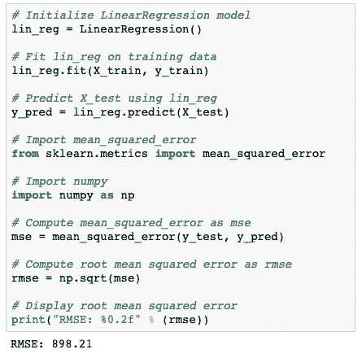

图 1.10 – 构建你的机器学习模型的代码

在不知道每日预期租赁量的范围时，很难判断 `898` 次租赁错误是否好坏。

`.describe()` 方法可以用于 `df_bikes['cnt']` 列，以获取范围等信息：

```py
df_bikes['cnt'].describe()
```

这是输出结果：

```py
count     731.000000
mean     4504.348837
std      1937.211452
min        22.000000
25%      3152.000000
50%      4548.000000
75%      5956.000000
max      8714.000000
Name: cnt, dtype: float64
```

预测的值范围从 `22` 到 `8714`，均值为 `4504`，标准差为 `1937`，RMSE 为 `898`，虽然不差，但也不能说很好。

## XGBoost

线性回归是解决回归问题的众多算法之一。其他回归算法可能会产生更好的结果。一般的策略是尝试不同的回归器进行比较。你将在本书中尝试多种回归器，包括决策树、随机森林、梯度提升，以及本书的重点，XGBoost。

本书后续将提供 XGBoost 的全面介绍。现在请注意，XGBoost 包括一个回归器，名为 `XGBRegressor`，可以用于任何回归数据集，包括刚才评分的自行车租赁数据集。现在我们将使用 `XGBRegressor` 来将自行车租赁数据集的结果与线性回归进行比较。

你应该已经在前面安装了 XGBoost。如果没有，请现在安装 XGBoost。

## XGBRegressor

安装 XGBoost 后，可以按如下方式导入 XGBoost 回归器：

```py
from xgboost import XGBRegressor
```

构建 `XGBRegressor` 的一般步骤与构建 `LinearRegression` 的步骤相同，唯一的区别是初始化 `XGBRegressor` 而不是 `LinearRegression`：

1.  初始化一个机器学习模型：

    ```py
    xg_reg = XGBRegressor()
    ```

1.  在训练集上拟合模型。如果此时 XGBoost 给出一些警告，请不用担心：

    ```py
    xg_reg.fit(X_train, y_train)
    ```

1.  对测试集进行预测：

    ```py
    y_pred = xg_reg.predict(X_test)
    ```

1.  将预测结果与测试集进行比较：

    ```py
    mse = mean_squared_error(y_test, y_pred)
    rmse = np.sqrt(mse)
    ```

1.  打印你的结果：

    ```py
    print("RMSE: %0.2f" % (rmse))
    ```

    输出如下：

    ```py
    RMSE: 705.11
    ```

`XGBRegressor` 表现明显更好！

XGBoost 为什么通常比其他方法表现更好将在*第五章*中探讨，书名为 *XGBoost 揭秘*。

## 交叉验证

一个测试分数是不可靠的，因为将数据拆分为不同的训练集和测试集会得到不同的结果。实际上，将数据拆分为训练集和测试集是任意的，不同的`random_state`会得到不同的 RMSE。

解决不同分割之间评分差异的一种方法是**k 折交叉验证**。其思路是将数据多次拆分为不同的训练集和测试集，然后取这些评分的均值。分割次数，称为**折叠**，由**k**表示。标准做法是使用 k = 3、4、5 或 10 个分割。

下面是交叉验证的可视化描述：


图 1.11 – 交叉验证

（重绘自[`commons.wikimedia.org/wiki/File:K-fold_cross_validation_EN.svg`](https://commons.wikimedia.org/wiki/File:K-fold_cross_validation_EN.svg)）

交叉验证通过在第一个训练集上拟合机器学习模型，并在第一个测试集上进行评分来工作。为第二次分割提供不同的训练集和测试集，从而生成一个新的机器学习模型，并对其进行评分。第三次分割会生成一个新的模型，并在另一个测试集上进行评分。

在训练集之间会有重叠，但测试集之间没有。

选择折叠数是灵活的，取决于数据。五折是标准做法，因为每次都会保留 20%的测试集。使用 10 折时，只有 10%的数据被保留；然而，90%的数据可用于训练，且均值对异常值的敏感性较小。对于较小的数据集，三折可能效果更好。

最后，将会有 k 个不同的评分，评估模型在 k 个不同的测试集上的表现。取这 k 个折叠的平均得分比任何单一折叠的得分更可靠。

`cross_val_score`是实现交叉验证的一种便捷方式。`cross_val_score`接受一个机器学习算法作为输入，以及预测列和目标列，可选的额外参数包括评分标准和所需的折叠次数。

### 使用线性回归进行交叉验证

让我们使用`LinearRegression`进行交叉验证。

首先，从`cross_val_score`库中导入`cross_val_score`：

```py
from sklearn.model_selection import cross_val_score
```

现在，使用交叉验证按以下步骤构建和评分机器学习模型：

1.  初始化一个机器学习模型：

    ```py
    model = LinearRegression()
    ```

1.  使用`cross_val_score`实现模型、`X`、`y`、`scoring='neg_mean_squared_error'`和折叠次数`cv=10`作为输入：

    ```py
    scores = cross_val_score(model, X, y, scoring='neg_mean_squared_error', cv=10)
    ```

    提示

    为什么使用`scoring='neg_mean_squared_error'`？Scikit-learn 的设计是选择最高的得分来训练模型。这对于准确度是有效的，但对于误差则不适用，因为最低的误差才是最佳的。通过取每个均方误差的负值，最低的结果最终变为最高值。后续通过`rmse = np.sqrt(-scores)`来补偿这一点，因此最终结果是正数。

1.  通过取负评分的平方根来找到 RMSE：

    ```py
    rmse = np.sqrt(-scores)
    ```

1.  显示结果：

    ```py
    print('Reg rmse:', np.round(rmse, 2))
    print('RMSE mean: %0.2f' % (rmse.mean()))
    ```

    输出如下：

    ```py
    Reg rmse: [ 504.01  840.55 1140.88  728.39  640.2   969.95 
    1133.45 1252.85 1084.64  1425.33]
    RMSE mean: 972.02
    ```

线性回归的平均误差为`972.06`。 这比之前获得的`980.38`略好。 关键不在于分数是好还是坏，而在于这是对线性回归在未见数据上表现的更好估计。

始终建议使用交叉验证以更好地估计分数。

关于`print`函数

在运行自己的机器学习代码时，全局`print`函数通常是不必要的，但如果要打印多行并格式化输出，则非常有用。

### 使用 XGBoost 进行交叉验证

现在让我们用`XGBRegressor`进行交叉验证。 步骤相同，只是初始化模型不同：

1.  初始化机器学习模型：

    ```py
    model = XGBRegressor()
    ```

1.  使用模型`X`、`y`、评分和折数`cv`实现`cross_val_score`：

    ```py
    scores = cross_val_score(model, X, y, scoring='neg_mean_squared_error', cv=10)
    ```

1.  通过取负分数的平方根来查找 RMSE：

    ```py
    rmse = np.sqrt(-scores)
    ```

1.  打印结果：

    ```py
    print('Reg rmse:', np.round(rmse, 2))
    print('RMSE mean: %0.2f' % (rmse.mean()))
    ```

    输出如下：

    ```py
    Reg rmse: [ 717.65  692.8   520.7   737.68  835.96 1006.24  991.34  747.61  891.99 1731.13]
    RMSE mean: 887.31
    ```

`XGBRegressor`再次胜出，比线性回归高约 10%。

# 预测分类

您已了解到 XGBoost 在回归中可能有优势，但分类呢？ XGBoost 有分类模型，但它是否能像经过充分测试的分类模型（如逻辑回归）一样准确？ 让我们找出答案。

## 什么是分类？

与回归不同，当预测具有有限输出数量的目标列时，机器学习算法被归类为分类算法。 可能的输出包括以下内容：

+   是，否

+   垃圾邮件，非垃圾邮件

+   0, 1

+   红色，蓝色，绿色，黄色，橙色

## 数据集 2 – 人口普查

我们将更快地通过第二个数据集，人口普查收入数据集 ([`archive.ics.uci.edu/ml/datasets/Census+Income`](https://archive.ics.uci.edu/ml/datasets/Census+Income))，来预测个人收入。

## 数据整理

在实施机器学习之前，必须对数据集进行预处理。 在测试新算法时，所有数值列都没有空值是至关重要的。

### 数据加载

由于此数据集直接托管在 UCI 机器学习网站上，可以使用`pd.read_csv`直接从互联网下载：

```py
df_census = pd.read_csv('https://archive.ics.uci.edu/ml/machine-learning-databases/adult/adult.data')
df_census.head()
```

这里是预期的输出：

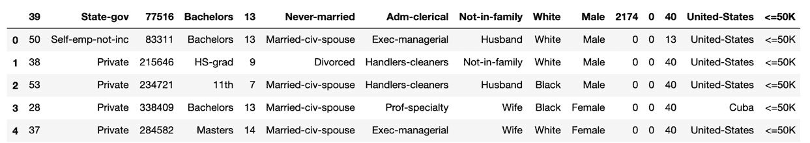

图 1.12 – 人口普查收入数据集

输出显示，列标题代表第一行的条目。 当发生这种情况时，可以使用`header=None`参数重新加载数据：

```py
df_census = pd.read_csv('https://archive.ics.uci.edu/ml/machine-learning-databases/adult/adult.data', header=None)
df_census.head()
```

这里是没有标题的预期输出：


图 1.13 – `header=None`参数输出

如您所见，列名仍然缺失。 它们列在人口普查收入数据集网站的*属性信息*下 ([`archive.ics.uci.edu/ml/datasets/Census+Income`](https://archive.ics.uci.edu/ml/datasets/Census+Income))。

列名可以更改如下：

```py
df_census.columns=['age', 'workclass', 'fnlwgt', 'education', 'education-num', 'marital-status', 'occupation', 'relationship', 'race', 'sex', 'capital-gain', 'capital-loss', 'hours-per-week', 'native-country', 'income']
df_census.head()
```

这是包含列名的预期输出：

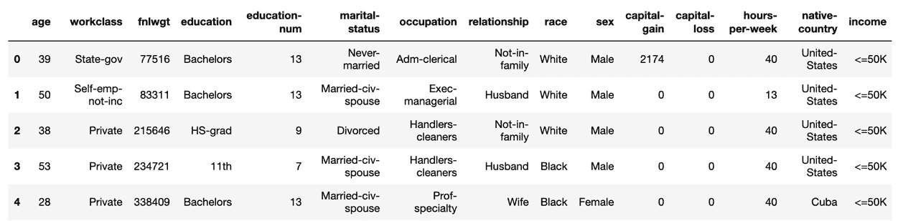

图 1.14 – 预期的列名

如你所见，列名已经恢复。

### 空值

检查空值的好方法是查看数据框的`.info()`方法：

```py
df_census.info()
```

输出如下：

```py
<class 'pandas.core.frame.DataFrame'>
RangeIndex: 32561 entries, 0 to 32560
Data columns (total 15 columns):
 #   Column          Non-Null Count  Dtype 
---  ------          --------------  ----- 
 0   age             32561 non-null  int64 
 1   workclass       32561 non-null  object
 2   fnlwgt          32561 non-null  int64 
 3   education       32561 non-null  object
 4   education-num   32561 non-null  int64 
 5   marital-status  32561 non-null  object
 6   occupation      32561 non-null  object
 7   relationship    32561 non-null  object
 8   race            32561 non-null  object
 9   sex             32561 non-null  object
 10  capital-gain    32561 non-null  int64 
 11  capital-loss    32561 non-null  int64 
 12  hours-per-week  32561 non-null  int64 
 13  native-country  32561 non-null  object
 14  income          32561 non-null  object
dtypes: int64(6), object(9)
memory usage: 3.7+ MB
```

由于所有列的非空行数相同，我们可以推断没有空值。

### 非数值列

所有`dtype`为对象的列必须转换为数值列。`get_dummies`方法将每一列的非数值唯一值转换为各自的列，其中`1`表示存在，`0`表示不存在。例如，如果数据框"书籍类型"的列值为"精装书"、"平装书"或"电子书"，`pd.get_dummies`会创建三个新列，分别命名为"精装书"、"平装书"和"电子书"，并替换原有的"书籍类型"列。

这是"书籍类型"数据框：

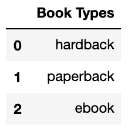

图 1.15 – "书籍类型"数据框

这是应用了`pd.get_dummies`后的相同数据框：

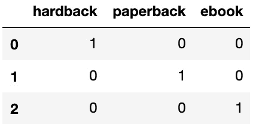

图 1.16 – 新的数据框

`pd.get_dummies`会创建许多新列，因此值得检查是否有某些列可以被删除。快速查看`df_census`数据可以发现`'education'`列和`education_num`列。`education_num`列是`'education'`列的数值转换，因为信息相同，`'education'`列可以删除：

```py
df_census = df_census.drop(['education'], axis=1)
```

现在使用`pd.get_dummies`将非数值列转换为数值列：

```py
df_census = pd.get_dummies(df_census)
df_census.head()
```

这是预期的输出：

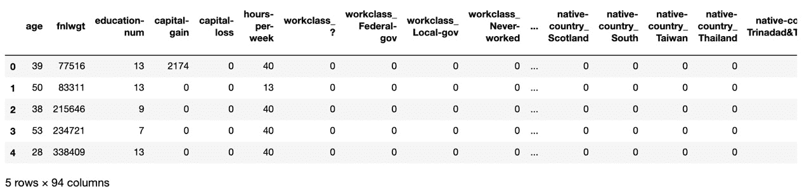

图 1.17 – pd.get_dummies – 非数值列转换为数值列

如你所见，新的列是通过`column_value`语法创建的，引用了原始列。例如，`native-country`是原始列，而台湾是其中一个值。新的`native-country_Taiwan`列的值为`1`（如果这个人来自台湾），否则为`0`。

提示

使用`pd.get_dummies`可能会增加内存使用量，可以通过在数据框上使用`.info()`方法并查看最后一行来验证。存储的是`1`，而`0`的值不会被存储。有关稀疏矩阵的更多信息，请参见*第十章*，*XGBoost 模型部署*，或访问 SciPy 的官方文档：[`docs.scipy.org/doc/scipy/reference/`](https://docs.scipy.org/doc/scipy/reference/)。

### 目标列和预测列

由于所有列都是数值型且没有空值，接下来是将数据分为目标列和预测列。

目标列是判断某人是否赚取 50K。经过`pd.get_dummies`处理后，生成了两个列，`df_census['income_<=50K']`和`df_census['income_>50K']`，用来判断某人是否赚取 50K。由于任一列都能使用，我们删除了`df_census['income_<=50K']`：

```py
df_census = df_census.drop('income_ <=50K', axis=1)
```

现在将数据拆分为`X`（预测列）和`y`（目标列）。请注意，由于最后一列是目标列，因此使用`-1`进行索引：

```py
X = df_census.iloc[:,:-1]y = df_census.iloc[:,-1]
```

现在是时候构建机器学习分类器了！

## 逻辑回归

逻辑回归是最基本的分类算法。从数学上讲，逻辑回归的工作方式类似于线性回归。对于每一列，逻辑回归会找到一个适当的权重或系数，最大化模型的准确度。主要的区别在于，逻辑回归使用**sigmoid 函数**，而不是像线性回归那样对每一项求和。

这是 sigmoid 函数及其对应的图：

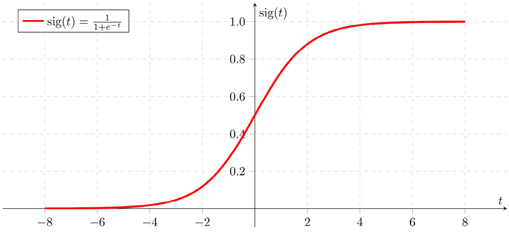

图 1.18 – Sigmoid 函数图

Sigmoid 函数通常用于分类。所有大于 0.5 的值都会被匹配为 1，所有小于 0.5 的值都会被匹配为 0。

使用 scikit-learn 实现逻辑回归几乎与实现线性回归相同。主要的区别是，预测列应该适应类别，并且误差应该以准确率为度量。作为附加奖励，误差默认是以准确率为度量的，因此不需要显式的评分参数。

你可以按如下方式导入逻辑回归：

```py
from sklearn.linear_model import LogisticRegression
```

### 交叉验证函数

让我们在逻辑回归上使用交叉验证，预测某人是否赚取超过 50K。

不要重复复制粘贴，让我们构建一个交叉验证分类函数，该函数接受机器学习算法作为输入，并输出准确度得分，使用`cross_val_score`：

```py
def cross_val(classifier, num_splits=10):    model = classifier     scores = cross_val_score(model, X, y, cv=num_splits)    print('Accuracy:', np.round(scores, 2))    print('Accuracy mean: %0.2f' % (scores.mean()))
```

现在使用逻辑回归调用函数：

```py
cross_val(LogisticRegression())
```

输出如下：

```py
Accuracy: [0.8  0.8  0.79 0.8  0.79 0.81 0.79 0.79 0.8  0.8 ]
Accuracy mean: 0.80
```

80%的准确率已经不错了。

让我们看看 XGBoost 是否能做得更好。

提示

每当你发现自己在复制和粘贴代码时，应该寻找更好的方法！计算机科学的一个目标是避免重复。编写你自己的数据分析和机器学习函数，能让你的工作更加轻松和高效，长远来看也会带来好处。

## XGBoost 分类器

XGBoost 有回归器和分类器。要使用分类器，请导入以下算法：

```py
from xgboost import XGBClassifier
```

现在，在`cross_val`函数中运行分类器，并进行一个重要的添加。由于有 94 列，并且 XGBoost 是一个集成方法，这意味着它每次运行时会结合多个模型，每个模型包含 10 个分割，我们将把`n_estimators`（模型数量）限制为`5`。通常，XGBoost 非常快速，事实上，它有着成为最快的提升集成方法的声誉，这个声誉我们将在本书中验证！然而，出于初步目的，`5`个估计器，虽然没有默认的`100`个那么强大，但已经足够。关于如何选择`n_estimators`的细节将在*第四章**，从梯度提升到 XGBoost*中深入探讨。

```py
cross_val(XGBClassifier(n_estimators=5))
```

输出如下：

```py
Accuracy: [0.85 0.86 0.87 0.85 0.86 0.86 0.86 0.87 0.86 0.86]
Accuracy mean: 0.86
```

正如你所看到的，XGBoost 在默认设置下的表现优于逻辑回归。

# 概述

你的 XGBoost 之旅正式开始了！你从学习数据处理的基础知识开始，并掌握了所有机器学习从业者必备的**pandas**技能，重点是处理空值。接着，你通过将线性回归与 XGBoost 进行比较，学习了如何在 scikit-learn 中构建机器学习模型。然后，你准备了一个分类数据集，并将逻辑回归与 XGBoost 进行了比较。在这两个案例中，XGBoost 都是明显的赢家。

恭喜你成功构建了第一个 XGBoost 模型！你已经完成了使用**pandas**、NumPy 和 scikit-learn 库进行数据处理和机器学习的入门。

在*第二章**，深入决策树*中，你将通过构建决策树（XGBoost 机器学习模型的基础学习器）并微调超参数来提高你的机器学习技能，从而改善结果。
