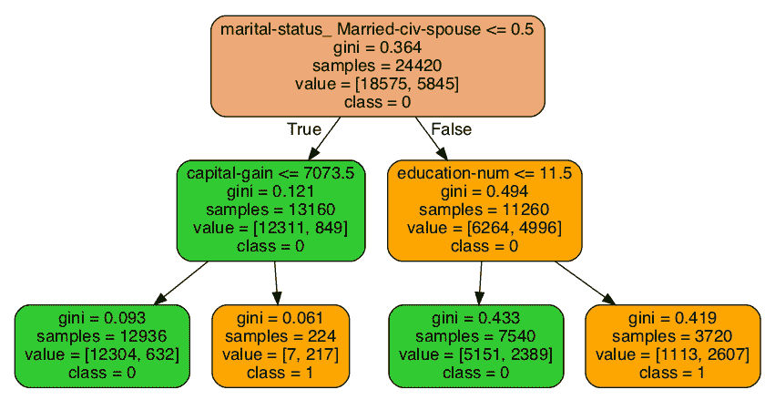

# 第二章：*第二章*：决策树深入解析

在本章中，你将熟练掌握**决策树**，这也是 XGBoost 模型的核心机器学习算法。你还将亲自体验**超参数调优**的科学和艺术。由于决策树是 XGBoost 模型的基础，因此你在本章学到的技能对构建强健的 XGBoost 模型至关重要。

在本章中，你将构建和评估**决策树分类器**和**决策树回归器**，可视化并分析决策树的方差和偏差，并调优决策树的超参数。此外，你还将应用决策树进行一个案例研究，该研究预测患者的心脏病。

本章包含以下主要内容：

+   引入 XGBoost 中的决策树

+   探索决策树

+   对比方差和偏差

+   调优决策树超参数

+   预测心脏病——案例研究

# 引入 XGBoost 中的决策树

XGBoost 是一种**集成方法**，意味着它由多个机器学习模型组成，这些模型共同协作。构成 XGBoost 集成的单个模型被称为**基学习器**。

决策树是最常用的 XGBoost 基学习器，在机器学习领域具有独特性。与线性回归和逻辑回归（见*第一章*，*机器学习领域*）通过数值权重乘以列值不同，决策树通过提问列的内容来分割数据。实际上，构建决策树就像是在玩“20 个问题”游戏。

例如，决策树可能包含一个温度列，该列可以分为两组，一组是温度高于 70 度，另一组是温度低于 70 度。接下来的分裂可能基于季节，如果是夏季，则走一条分支，否则走另一条分支。此时，数据已被分为四个独立的组。通过分支将数据分割成新组的过程会持续进行，直到算法达到预期的准确度。

决策树可以创建成千上万的分支，直到它将每个样本唯一地映射到训练集中的正确目标。这意味着训练集可以达到 100%的准确度。然而，这样的模型对于新数据的泛化能力较差。

决策树容易对数据过拟合。换句话说，决策树可能会过于精确地拟合训练数据，这个问题将在本章后面通过方差和偏差进行探讨。超参数调优是防止过拟合的一种解决方案。另一种解决方案是聚合多棵树的预测，这是**随机森林**和 XGBoost 采用的策略。

虽然随机森林和 XGBoost 将是后续章节的重点，但我们现在深入探讨决策树。

# 探索决策树

决策树通过将数据分割成*分支*来工作。沿着分支向下到达*叶子*，在这里做出预测。理解分支和叶子是如何创建的，通过实际示例要容易得多。在深入了解之前，让我们构建第一个决策树模型。

## 第一个决策树模型

我们首先通过构建一个决策树来预测某人是否年收入超过 50K 美元，使用的是来自*第一章*的《*机器学习领域*》中的人口普查数据集：

1.  首先，打开一个新的 Jupyter Notebook，并从以下导入开始：

    ```py
    import pandas as pd
    import numpy as np
    import warnings
    warnings.filterwarnings('ignore')
    ```

1.  接下来，打开文件`'census_cleaned.csv'`，它已经上传到[`github.com/PacktPublishing/Hands-On-Gradient-Boosting-with-XGBoost-and-Scikit-learn/tree/master/Chapter02`](https://github.com/PacktPublishing/Hands-On-Gradient-Boosting-with-XGBoost-and-Scikit-learn/tree/master/Chapter02)供你使用。如果你按照*前言*的建议从 Packt GitHub 页面下载了本书的所有文件，那么在启动 Anaconda 后，你可以像浏览其他章节一样浏览到*第二章*《*决策树深入解析*》。否则，现在就去我们的 GitHub 页面克隆文件：

    ```py
    df_census = pd.read_csv('census_cleaned.csv')
    ```

1.  将数据上传到 DataFrame 后，声明预测变量和目标列`X`和`y`，如下所示：

    ```py
    X = df_census.iloc[:,:-1]
    y = df_census.iloc[:,-1]
    ```

1.  接下来，导入`train_test_split`，以`random_state=2`的方式将数据分割为训练集和测试集，以确保结果一致：

    ```py
    from sklearn.model_selection import train_test_split X_train, X_test, y_train, y_test = train_test_split(X, y, random_state=2)
    ```

    与其他机器学习分类器一样，在使用决策树时，我们初始化模型，使用训练集进行训练，并使用`accuracy_score`进行测试。

`accuracy_score`确定的是正确预测的数量与总预测数量之比。如果 20 次预测中有 19 次正确，那么`accuracy_score`为 95%。

首先，导入`DecisionTreeClassifier`和`accuracy_score`：

```py
from sklearn.tree import DecisionTreeClassifier
from sklearn.metrics import accuracy_score
```

接下来，我们按照标准步骤构建一个决策树分类器：

1.  初始化一个机器学习模型，设置`random_state=2`以确保结果一致：

    ```py
    clf = DecisionTreeClassifier(random_state=2)
    ```

1.  在训练集上拟合模型：

    ```py
    clf.fit(X_train, y_train)
    ```

1.  对测试集进行预测：

    ```py
    y_pred = clf.predict(X_test)
    ```

1.  将预测结果与测试集进行比较：

    ```py
    accuracy_score(y_pred, y_test) 
    ```

    `accuracy_score`如下：

    ```py
    0.8131679154894976
    ```

81%的准确率与同一数据集中的逻辑回归模型在*第一章*中的准确率相当，*机器学习领域*。

现在你已经看到如何构建决策树，接下来让我们深入看看决策树内部。

## 决策树内部

决策树具有很好的可视化效果，可以揭示其内部工作原理。

这是一个来自人口普查数据集的决策树，只有两个分裂：



图 2.1 – 人口普查数据集决策树

树的顶部是根节点，**True**/**False**箭头是分支，数据点是节点。在树的末端，节点被归类为叶子节点。让我们深入研究前面的图示。

### 根节点

树的根节点位于顶部。第一行显示 **marital-status_Married-civ-spouse <=5**。**marital-status** 是一个二值列，因此所有值要么是 **0**（负类），要么是 **1**（正类）。第一次分割是基于一个人是否已婚。树的左侧是**True**分支，表示用户未婚，右侧是**False**分支，表示用户已婚。

### Gini 系数

根节点的第二行显示：`Gini` 系数为 0 意味着没有错误。Gini 系数为 1 意味着所有的预测都是错误的。Gini 系数为 0.5 表示元素均匀分布，这意味着预测效果不比随机猜测好。越接近 0，错误率越低。在根节点处，Gini 系数为 0.364，意味着训练集不平衡，类别 1 占比 36.4%。

Gini 系数的公式如下：


图 2.2 – Gini 系数公式

 是分割结果为正确值的概率，c 是类别的总数：在前面的例子中是 2。另一种解释是， 是集合中具有正确输出标签的项的比例。

### 样本、值、类别

树的根节点显示总共有 24,420 个样本。这是训练集中的样本总数。接下来的行显示 **[18575 , 5845]**。排序为 0 和 1，因此 18,575 个样本的值为 0（收入少于 50K），而 5,845 个样本的值为 1（收入超过 50K）。

### True/False 节点

跟随第一条分支，你会看到左侧是**True**，右侧是**False**。True 在左，False 在右的模式贯穿整个树。

在第二行的左侧节点中，分割条件 **capital_gain <= 7073.5** 被应用到后续节点。其余的信息来自上一个分支的分割。对于 13,160 个未婚的人，12,311 人的收入低于 50K，而 849 人的收入高于 50K。此时的 Gini 系数 **0.121**，是一个非常好的得分。

### 树桩

一棵树有可能只有一个分割，这样的树叫做**树桩**。虽然树桩本身不是强大的预测器，但当用作提升器时，树桩可以变得非常强大，这在*第四章*《从梯度提升到 XGBoost》中有详细讨论。

### 叶节点

树的末端节点是叶节点，叶节点包含所有最终的预测结果。

最左侧的叶节点的 Gini 系数为 **0.093**，正确预测了 12,304 个中的 12,938 个案例，准确率为 95%。我们有 95% 的信心认为，资本收益低于 7,073.50 的未婚用户年收入不超过 50K。

其他叶节点可以类似地解释。

现在我们来看看这些预测在哪些地方出错。

# 对比方差和偏差

假设你有如下图所示的数据点。你的任务是拟合一条直线或曲线，以便可以对新的数据点进行预测。

这是一个随机点的图：


图 2.3 – 随机点图

一种方法是使用线性回归，通过最小化每个点与直线之间的距离平方，来拟合数据，如下图所示：


图 2.4 – 使用线性回归最小化距离

直线通常具有较高的**偏差**。在机器学习中，偏差是一个数学术语，表示在将模型应用于现实问题时对误差的估计。直线的偏差较高，因为预测结果仅限于直线，未能考虑数据的变化。

在许多情况下，直线的复杂度不足以进行准确的预测。当发生这种情况时，我们说机器学习模型存在高偏差的欠拟合。

第二个选项是使用八次多项式拟合这些点。由于只有九个点，八次多项式将完美拟合这些数据，正如你在以下图形中看到的那样：


图 2.5 – 八次多项式

这个模型具有较高的**方差**。在机器学习中，方差是一个数学术语，表示给定不同的训练数据集时，模型变化的程度。严格来说，方差是随机变量与其均值之间的平方偏差的度量。由于训练集中有九个不同的数据点，八次多项式将会完全不同，从而导致高方差。

高方差的模型通常会过拟合数据。这些模型无法很好地推广到新的数据点，因为它们过于贴合训练数据。

在大数据的世界里，过拟合是一个大问题。更多的数据导致更大的训练集，而像决策树这样的机器学习模型会过度拟合训练数据。

作为最终选项，考虑使用三次多项式拟合数据点，如下图所示：


图 2.6 – 三次多项式

这个三次多项式在方差和偏差之间提供了良好的平衡，一般跟随曲线，但又能适应变化。低方差意味着不同的训练集不会导致曲线发生显著变化。低偏差表示在将该模型应用于实际问题时，误差不会太高。在机器学习中，低方差和低偏差的结合是理想的。

达到方差和偏差之间良好平衡的最佳机器学习策略之一是微调超参数。

# 调整决策树的超参数

超参数与参数不同。

在机器学习中，参数是在模型调整过程中进行调整的。例如，线性回归和逻辑回归中的权重就是在构建阶段调整的参数，目的是最小化误差。相比之下，超参数是在构建阶段之前选择的。如果没有选择超参数，则使用默认值。

## 决策树回归器

学习超参数的最佳方式是通过实验。虽然选择超参数范围背后有理论依据，但结果胜过理论。不同的数据集在不同的超参数值下会有不同的改进效果。

在选择超参数之前，让我们先使用`DecisionTreeRegressor`和`cross_val_score`找到一个基准分数，步骤如下：

1.  下载`'bike_rentals_cleaned'`数据集并将其拆分为`X_bikes`（预测变量）和`y_bikes`（训练数据）：

    ```py
    df_bikes = pd.read_csv('bike_rentals_cleaned.csv')X_bikes = df_bikes.iloc[:,:-1]y_bikes = df_bikes.iloc[:,-1]
    ```

1.  导入`DecisionTreeRegressor`和`cross_val_score`：

    ```py
    from sklearn.tree import DecisionTreeRegressor from sklearn.model_selection import cross_val_score
    ```

1.  初始化`DecisionTreeRegressor`并在`cross_val_score`中拟合模型：

    ```py
    reg = DecisionTreeRegressor(random_state=2)
    scores = cross_val_score(reg, X_bikes, y_bikes, scoring='neg_mean_squared_error', cv=5)
    ```

1.  计算`1233.36`。这比在*第一章**机器学习概况*中通过线性回归得到的`972.06`以及通过 XGBoost 得到的`887.31`还要差。

模型是否因为方差太高而导致过拟合？

这个问题可以通过查看决策树在训练集上的预测效果来回答。以下代码检查训练集的误差，然后再对测试集进行预测：

```py
reg = DecisionTreeRegressor()reg.fit(X_train, y_train)y_pred = reg.predict(X_train)
from sklearn.metrics import mean_squared_error reg_mse = mean_squared_error(y_train, y_pred)reg_rmse = np.sqrt(reg_mse)reg_rmse
```

结果如下：

```py
0.0
```

一个`0.0`的 RMSE 意味着模型已经完美拟合了每一个数据点！这个完美的分数，再加上`1233.36`的交叉验证误差，证明决策树在数据上出现了过拟合，且方差很高。训练集完美拟合，但测试集表现很差。

超参数可能会解决这个问题。

## 一般而言的超参数

所有 scikit-learn 模型的超参数详细信息可以在 scikit-learn 的官方文档页面查看。

这是来自 DecisionTreeRegressor 网站的摘录（[`scikit-learn.org/stable/modules/generated/sklearn.tree.DecisionTreeRegressor.html`](https://scikit-learn.org/stable/modules/generated/sklearn.tree.DecisionTreeRegressor.html)）。

注意

*sklearn*是*scikit-learn*的缩写。


图 2.7\. DecisionTreeRegressor 官方文档页面摘录

官方文档解释了超参数背后的含义。请注意，这里的`Parameters`是*超参数*的缩写。在自己工作时，查看官方文档是最可靠的资源。

让我们逐个讨论超参数。

### max_depth

`max_depth` 定义了树的深度，取决于分割的次数。默认情况下，`max_depth` 没有限制，这可能会导致成百上千次的分割，进而引起过拟合。通过限制 `max_depth` 为较小的值，可以减少方差，使模型在新数据上具有更好的泛化能力。

如何选择 `max_depth` 的最佳值？

您总是可以尝试 `max_depth=1`，然后是 `max_depth=2`，然后是 `max_depth=3`，依此类推，但这个过程会很累人。相反，您可以使用一个叫做 `GridSearchCV` 的神奇工具。

### GridSearchCV

`GridSearchCV` 使用交叉验证搜索超参数网格，以提供最佳结果。

`GridSearchCV` 像任何机器学习算法一样工作，这意味着它在训练集上进行拟合，并在测试集上进行评分。主要的不同点是 `GridSearchCV` 在最终确定模型之前会检查所有超参数。

`GridSearchCV` 的关键是建立一个超参数值的字典。没有一个正确的值集可以尝试。一种策略是选择一个最小值和一个最大值，并在两者之间均匀分布数字。由于我们试图减少过拟合，通常的做法是为 `max_depth` 在较低端尝试更多的值。

导入 `GridSearchCV` 并按如下方式定义 `max_depth` 的超参数列表：

```py
from sklearn.model_selection import GridSearchCV params = {'max_depth':[None,2,3,4,6,8,10,20]}
```

`params` 字典包含一个键 `'max_depth'`，它是一个字符串，以及一个我们选择的数字列表。请注意，`None` 是默认值，这意味着 `max_depth` 没有限制。

提示

一般来说，减少最大超参数并增加最小超参数将减少变化并防止过拟合。

接下来，初始化一个 `DecisionTreeRegressor`，并将其放入 `GridSearchCV` 中，与 `params` 和评分标准一起使用：

```py
reg = DecisionTreeRegressor(random_state=2)grid_reg = GridSearchCV(reg, params, scoring='neg_mean_squared_error', cv=5, n_jobs=-1)grid_reg.fit(X_train, y_train)
```

现在，`GridSearchCV` 已经在数据上进行了拟合，您可以按如下方式查看最佳超参数：

```py
best_params = grid_reg.best_params_print("Best params:", best_params)
```

结果如下：

```py
Best params: {'max_depth': 6}
```

如您所见，`max_depth` 值为 `6` 在训练集上获得了最佳交叉验证分数。

训练分数可以通过 `best_score` 属性显示：

```py
best_score = np.sqrt(-grid_reg.best_score_)print("Training score: {:.3f}".format(best_score))
```

分数如下：

```py
Training score: 951.938
```

测试分数可以如下显示：

```py
best_model = grid_reg.best_estimator_
y_pred = best_model.predict(X_test) 
rmse_test = mean_squared_error(y_test, y_pred)**0.5
print('Test score: {:.3f}'.format(rmse_test))
```

分数如下：

```py
Test score: 864.670
```

方差已经大大减少。

### min_samples_leaf

`min_samples_leaf` 通过增加叶子节点可能包含的样本数量来提供限制。与 `max_depth` 类似，`min_samples_leaf` 旨在减少过拟合。

当没有限制时，`min_samples_leaf=1` 是默认值，这意味着叶子节点可能包含唯一的样本（容易导致过拟合）。增加 `min_samples_leaf` 可以减少方差。如果 `min_samples_leaf=8`，那么所有叶子节点必须包含至少八个样本。

测试 `min_samples_leaf` 的一系列值需要经过与之前相同的过程。我们写一个函数，使用 `GridSearchCV` 和 `DecisionTreeRegressor(random_state=2)` 作为默认参数 `reg` 来显示最佳参数、训练分数和测试分数，而不是复制和粘贴：

```py
def grid_search(params, reg=DecisionTreeRegressor(random_state=2)):
    grid_reg = GridSearchCV(reg, params,   
    scoring='neg_mean_squared_error', cv=5, n_jobs=-1):
    grid_reg.fit(X_train, y_train)
       best_params = grid_reg.best_params_    print("Best params:", best_params)    best_score = np.sqrt(-grid_reg.best_score_)    print("Training score: {:.3f}".format(best_score))
    y_pred = grid_reg.predict(X_test)    rmse_test = mean_squared_error(y_test, y_pred)**0.5
    print('Test score: {:.3f}'.format(rmse_test))
```

提示

在编写自己的函数时，包含默认关键字参数是有利的。默认关键字参数是一个带有默认值的命名参数，可以在后续使用和测试时修改。默认关键字参数大大增强了 Python 的功能。

在选择超参数的范围时，了解构建模型的训练集大小是非常有帮助的。Pandas 提供了一个很好的方法，`.shape`，它返回数据的行和列：

```py
X_train.shape
```

数据的行和列如下：

```py
(548, 12)
```

由于训练集有 `548` 行数据，这有助于确定 `min_samples_leaf` 的合理值。我们试试 `[1, 2, 4, 6, 8, 10, 20, 30]` 作为 `grid_search` 的输入：

```py
grid_search(params={'min_samples_leaf':[1, 2, 4, 6, 8, 10, 20, 30]})
```

分数如下：

```py
Best params: {'min_samples_leaf': 8}
Training score: 896.083
Test score: 855.620
```

由于测试分数高于训练分数，因此方差已减少。

当我们将 `min_samples_leaf` 和 `max_depth` 放在一起时，会发生什么呢？我们来看一下：

```py
grid_search(params={'max_depth':[None,2,3,4,6,8,10,20],'min_samples_leaf':[1,2,4,6,8,10,20,30]})
```

分数如下：

```py
Best params: {'max_depth': 6, 'min_samples_leaf': 2}
Training score: 870.396
Test score: 913.000
```

结果可能会让人惊讶。尽管训练分数提高了，但测试分数却没有变化。`min_samples_leaf` 从 `8` 降低到 `2`，而 `max_depth` 保持不变。

提示

这是一个有关超参数调优的重要经验：超参数不应单独选择。

至于减少前面示例中的方差，将 `min_samples_leaf` 限制为大于三的值可能会有所帮助：

```py
grid_search(params={'max_depth':[6,7,8,9,10],'min_samples_leaf':[3,5,7,9]})
```

分数如下：

```py
Best params: {'max_depth': 9, 'min_samples_leaf': 7}
Training score: 888.905
Test score: 878.538
```

如你所见，测试分数已提高。

现在，我们将探索其余的决策树超参数，而无需单独测试。

### max_leaf_nodes

`max_leaf_nodes` 类似于 `min_samples_leaf`。不同之处在于，它指定了叶子的总数，而不是每个叶子的样本数。因此，`max_leaf_nodes=10` 意味着模型不能有超过 10 个叶子，但可以少于 10 个。

### max_features

`max_features` 是减少方差的有效超参数。它并不是考虑所有可能的特征进行分裂，而是每次选择一部分特征进行分裂。

`max_features` 常见的选项如下：

+   `'auto'` 是默认选项，没有任何限制。

+   `'sqrt'` 是特征总数的平方根。

+   `'log2'` 是特征总数的以 2 为底的对数。32 列特征对应 5，因为 2⁵ = 32。

### min_samples_split

另一种分割技术是 `min_samples_split`。顾名思义，`min_samples_split` 为进行分裂之前要求的样本数设定了限制。默认值为 `2`，因为两个样本可以被分成各自的单个叶子。如果将限制增加到 `5`，那么对于包含五个样本或更少的节点，不再允许进一步的分裂。

### splitter

`splitter`有两个选项，`'random'`和`'best'`。Splitter 告诉模型如何选择分裂每个分支的特征。默认的`'best'`选项选择能带来最大信息增益的特征。与此相对，`'random'`选项会随机选择分裂。

将`splitter`更改为`'random'`是防止过拟合并使树结构多样化的好方法。

### criterion

用于决策树回归器和分类器分裂的`criterion`是不同的。`criterion`提供了机器学习模型用于决定如何进行分裂的方法。这是分裂的评分方法。对于每个可能的分裂，`criterion`计算一个分裂的数值，并将其与其他选项进行比较。分裂得分最高的选项会被选中。

对于决策树回归器，选项有`mse`（均方误差）、`friedman_mse`（包括 Friedman 调整）和`mae`（平均绝对误差）。默认值是`mse`。

对于分类器，之前提到的`gini`和`entropy`通常会给出相似的结果。

#### min_impurity_decrease

以前被称为`min_impurity_split`，`min_impurity_decrease`在不纯度大于或等于该值时会进行分裂。

*不纯度*是衡量每个节点预测纯度的标准。一个具有 100%准确率的树的不纯度为 0.0。一个具有 80%准确率的树的不纯度为 0.20。

不纯度是决策树中的一个重要概念。在整个树构建过程中，不纯度应不断减少。每个节点选择的分裂是那些能最大程度降低不纯度的分裂。

默认值为`0.0`。这个数值可以增大，以便树在达到某个阈值时停止构建。

#### min_weight_fraction_leaf

`min_weight_fraction_leaf`是成为叶节点所需的最小权重占总权重的比例。根据文档，*当未提供 sample_weight 时，样本具有相等的权重*。

从实际应用角度来看，`min_weight_fraction_leaf`是另一个可以减少方差并防止过拟合的超参数。默认值是 0.0。假设权重相等，1%的限制，即 0.01，将要求至少有 500 个样本中的 5 个作为叶节点。

#### ccp_alpha

`ccp_alpha`超参数在此不进行讨论，因为它是用于树构建后修剪的。欲了解更多内容，请参阅最小成本复杂度修剪：[`scikit-learn.org/stable/modules/tree.html#minimal-cost-complexity-pruning`](https://scikit-learn.org/stable/modules/tree.html#minimal-cost-complexity-pruning)。

## 将所有内容整合在一起

在微调超参数时，涉及几个因素：

+   分配的时间量

+   超参数的数量

+   所需的精度小数位数

所花费的时间、调优的超参数数量以及期望的准确度取决于你、数据集和手头的项目。由于超参数相互关联，并不要求修改所有超参数。调整较小范围的超参数可能会带来更好的结果。

现在你已经理解了决策树和决策树超参数的基本原理，是时候应用你所学到的知识了。

提示

决策树的超参数太多，无法始终如一地使用所有超参数。根据我的经验，`max_depth`、`max_features`、`min_samples_leaf`、`max_leaf_nodes`、`min_impurity_decrease` 和 `min_samples_split` 通常已经足够。

# 预测心脏病——案例研究

医院要求你使用机器学习来预测心脏病。你的任务是开发一个模型，并突出显示医生和护士可以专注的两个到三个重要特征，以改善患者健康。

你决定使用经过调优的超参数的决策树分类器。在构建模型后，你将使用`feature_importances_`属性来解释结果，该属性确定了预测心脏病时最重要的特征。

## 心脏病数据集

心脏病数据集已上传至 GitHub，文件名为`heart_disease.csv`。这是对原始心脏病数据集（[`archive.ics.uci.edu/ml/datasets/Heart+Disease`](https://archive.ics.uci.edu/ml/datasets/Heart+Disease)）的轻微修改，由 UCI 机器学习库（[`archive.ics.uci.edu/ml/index.php`](https://archive.ics.uci.edu/ml/index.php)）提供，并已清理了空值，方便使用。

上传文件并显示前五行，如下所示：

```py
df_heart = pd.read_csv('heart_disease.csv')df_heart.head()
```

上述代码会生成如下表格：


图 2.8 – heart_disease.csv 输出

目标列，便捷地标记为`target`，是二值型的，其中`1`表示患者患有心脏病，`0`表示患者没有心脏病。

以下是从之前链接的数据源中提取的预测变量列的含义：

+   `age`：年龄（单位：年）

+   `sex`：性别（`1` = 男性；`0` = 女性）

+   `cp`：胸痛类型（`1` = 典型心绞痛，`2` = 非典型心绞痛，`3` = 非心绞痛性疼痛，`4` = 无症状）

+   `trestbps`：静息血压（单位：mm Hg，入院时测量）

+   `chol`：血清胆固醇（单位：mg/dl） `fbs`：（空腹血糖 > 120 mg/dl）（`1` = 是；`0` = 否）

+   `fbs`：空腹血糖 > 120 mg/dl（`1` = 是；`0` = 否）

+   `restecg`：静息心电图结果（`0` = 正常，`1` = 存在 ST-T 波异常（T 波倒置和/或 ST 段抬高或低于 0.05 mV），`2` = 根据 Estes 标准显示可能或确诊的左心室肥厚）

+   `thalach`：最大心率

+   `exang`：运动诱发的心绞痛（`1` = 是；`0` = 否）

+   `oldpeak`：运动诱发的 ST 段压低（与静息状态相比）

+   `slope`：最大运动 ST 段的坡度（`1` = 上升，`2` = 平坦，`3` = 下降）

+   `ca`: 主要血管数量（0-3），由透视法显示

+   `thal`: `3` = 正常；`6` = 固定缺陷；`7` = 可逆缺陷

将数据分为训练集和测试集，为机器学习做准备：

```py
X = df_heart.iloc[:,:-1]y = df_heart.iloc[:,-1]from sklearn.model_selection import train_test_split X_train, X_test, y_train, y_test = train_test_split(X, y, random_state=2)
```

你现在已经准备好进行预测了。

## 决策树分类器

在实现超参数之前，拥有一个基准模型进行比较是很有帮助的。

使用`cross_val_score`和`DecisionTreeClassifier`如下：

```py
model = DecisionTreeClassifier(random_state=2)
scores = cross_val_score(model, X, y, cv=5)
print('Accuracy:', np.round(scores, 2))
print('Accuracy mean: %0.2f' % (scores.mean()))
Accuracy: [0.74 0.85 0.77 0.73 0.7 ]
```

结果如下：

```py
Accuracy mean: 0.76
```

初始准确率为 76%。我们来看看通过超参数微调可以获得多少提升。

### 随机搜索分类器函数

当调整多个超参数时，`GridSearchCV`可能需要过长时间。scikit-learn 库提供了`RandomizedSearchCV`作为一个很好的替代方案。`RandomizedSearchCV`与`GridSearchCV`的工作方式相同，但它并不是尝试所有的超参数，而是尝试一个随机数量的组合。它并不是要穷举所有组合，而是要在有限的时间内找到最佳的组合。

这是一个使用`RandomizedSearchCV`的函数，它返回最佳模型及其得分。输入是`params`（待测试的超参数字典）、`runs`（要检查的超参数组合数）和`DecisionTreeClassifier`：

```py
def randomized_search_clf(params, runs=20, clf=DecisionTreeClassifier(random_state=2)):    rand_clf = RandomizedSearchCV(clf, params, n_iter=runs,    cv=5, n_jobs=-1, random_state=2)    rand_clf.fit(X_train, y_train)
    best_model = rand_clf.best_estimator_
    best_score = rand_clf.best_score_  
    print("Training score: {:.3f}".format(best_score))
    y_pred = best_model.predict(X_test)
    accuracy = accuracy_score(y_test, y_pred)
    print('Test score: {:.3f}'.format(accuracy))
    return best_model
```

现在，让我们选择一个超参数范围。

## 选择超参数

选择超参数没有单一的正确方法。实验才是关键。这里是一个初步的列表，放入`randomized_search_clf`函数中。这些数值的选择旨在减少方差，并尝试一个广泛的范围：

```py
randomized_search_clf(params={'criterion':['entropy', 'gini'],'splitter':['random', 'best'], 'min_weight_fraction_leaf':[0.0, 0.0025, 0.005, 0.0075, 0.01],'min_samples_split':[2, 3, 4, 5, 6, 8, 10],'min_samples_leaf':[1, 0.01, 0.02, 0.03, 0.04],'min_impurity_decrease':[0.0, 0.0005, 0.005, 0.05, 0.10, 0.15, 0.2],'max_leaf_nodes':[10, 15, 20, 25, 30, 35, 40, 45, 50, None],'max_features':['auto', 0.95, 0.90, 0.85, 0.80, 0.75, 0.70],'max_depth':[None, 2,4,6,8],'min_weight_fraction_leaf':[0.0, 0.0025, 0.005, 0.0075, 0.01, 0.05]})
Training score: 0.798
Test score: 0.855
DecisionTreeClassifier(class_weight=None, criterion='entropy', max_depth=8, max_features=0.8, max_leaf_nodes=45, min_impurity_decrease=0.0, min_impurity_split=None, min_samples_leaf=0.04, min_samples_split=10,min_weight_fraction_leaf=0.05, presort=False, random_state=2, splitter='best')
```

这是一个显著的改进，且该模型在测试集上具有良好的泛化能力。我们来看看通过缩小范围能否做到更好。

## 缩小范围

缩小范围是改善超参数的一种策略。

例如，使用从最佳模型中选择的`max_depth=8`作为基准，我们可以将范围缩小到`7`到`9`。

另一种策略是停止检查那些默认值已经表现良好的超参数。例如，`entropy`相较于`'gini'`的差异非常小，因此不推荐使用`entropy`。`min_impurity_split`和`min_impurity_decrease`也可以保留默认值。

这是一个新的超参数范围，增加了`100`次运行：

```py
randomized_search_clf(params={'max_depth':[None, 6, 7],'max_features':['auto', 0.78], 'max_leaf_nodes':[45, None], 'min_samples_leaf':[1, 0.035, 0.04, 0.045, 0.05],'min_samples_split':[2, 9, 10],'min_weight_fraction_leaf': [0.0, 0.05, 0.06, 0.07],}, runs=100)
Training score: 0.802
Test score: 0.868
DecisionTreeClassifier(class_weight=None, criterion='gini', max_depth=7,max_features=0.78, max_leaf_nodes=45, min_impurity_decrease=0.0, min_impurity_split=None, min_samples_leaf=0.045, min_samples_split=9, min_weight_fraction_leaf=0.06, presort=False, random_state=2, splitter='best')
```

这个模型在训练和测试得分上更为准确。

然而，为了进行适当的比较基准，必须将新模型放入`cross_val_clf`中。可以通过复制并粘贴前面的模型来实现：

```py
model = DecisionTreeClassifier(class_weight=None, criterion='gini', max_depth=7, max_features=0.78, max_leaf_nodes=45, min_impurity_decrease=0.0, min_impurity_split=None, min_samples_leaf=0.045, min_samples_split=9, min_weight_fraction_leaf=0.06, presort=False, random_state=2, splitter='best')
scores = cross_val_score(model, X, y, cv=5)
print('Accuracy:', np.round(scores, 2))
print('Accuracy mean: %0.2f' % (scores.mean()))
Accuracy: [0.82 0.9  0.8  0.8  0.78]
```

结果如下：

```py
Accuracy mean: 0.82
```

这比默认模型高出六个百分点。在预测心脏病时，更高的准确性能够挽救生命。

## feature_importances_

拼图的最后一块是传达机器学习模型中最重要的特征。决策树有一个非常有用的属性，`feature_importances_`，它正是用于显示这些重要特征的。

首先，我们需要最终确定最佳模型。我们的函数已经返回了最佳模型，但它尚未被保存。

在测试时，重要的是不要混用训练集和测试集。然而，在选择最终模型后，将模型拟合到整个数据集上可能是有益的。为什么呢？因为目标是测试模型在从未见过的数据上的表现，且将模型拟合到整个数据集可能会提高准确性。

让我们使用最佳超参数定义模型，并将其拟合到整个数据集上：

```py
best_clf = DecisionTreeClassifier(class_weight=None, criterion='gini', max_depth=9,max_features=0.8, max_leaf_nodes=47,min_impurity_decrease=0.0, min_impurity_split=None,min_samples_leaf=1, min_samples_split=8,min_weight_fraction_leaf=0.05, presort=False,random_state=2, splitter='best')
best_clf.fit(X, y)
```

为了确定最重要的特征，我们可以在`best_clf`上运行`feature_importances_`属性：

```py
best_clf.feature_importances_
array([0.04826754, 0.04081653, 0.48409586, 0.00568635, 0.        , 0., 0., 0.00859483, 0., 0.02690379, 0., 0.18069065, 0.20494446])
```

解释这些结果并不容易。以下代码会将列与最重要的特征一起压缩成字典，然后按相反的顺序显示，以便清晰地输出并容易理解：

```py
feature_dict = dict(zip(X.columns, best_clf.feature_importances_))
# Import operator import operator
Sort dict by values (as list of tuples)sorted(feature_dict.items(), key=operator.itemgetter(1), reverse=True)[0:3]
[('cp', 0.4840958610240171),
 ('thal', 0.20494445570568706),
 ('ca', 0.18069065321397942)]
```

三个最重要的特征如下：

+   `'cp'`：胸痛类型（`1` = 典型心绞痛，`2` = 非典型心绞痛，`3` = 非心绞痛性疼痛，`4` = 无症状）

+   `'thalach'`：最大心率

+   `'ca'`：通过透视染色的主要血管数量（0-3）

这些数字可以解释为它们对方差的贡献，因此`'cp'`解释了 48%的方差，超过了`'thal'`和`'ca'`的总和。

你可以告诉医生和护士，使用胸痛、最大心率和透视作为三大最重要特征，你的模型能够以 82%的准确率预测患者是否患有心脏病。

# 总结

在本章中，通过研究决策树这一 XGBoost 的基础学习器，你已经在掌握 XGBoost 的道路上迈出了重要一步。你通过`GridSearchCV`和`RandomizedSearchCV`微调超参数，构建了决策树回归器和分类器。你还可视化了决策树，并从方差和偏差的角度分析了它们的误差和准确性。此外，你还学会了一个不可或缺的工具——`feature_importances_`，它是 XGBoost 的一个属性，用于传达模型中最重要的特征。

在下一章中，你将学习如何构建随机森林，这是我们第一个集成方法，也是 XGBoost 的竞争对手。随机森林的应用对于理解 bagging 和 boosting 的区别、生成与 XGBoost 相当的机器学习模型以及了解随机森林的局限性至关重要，正是这些局限性促成了 XGBoost 的发展。
