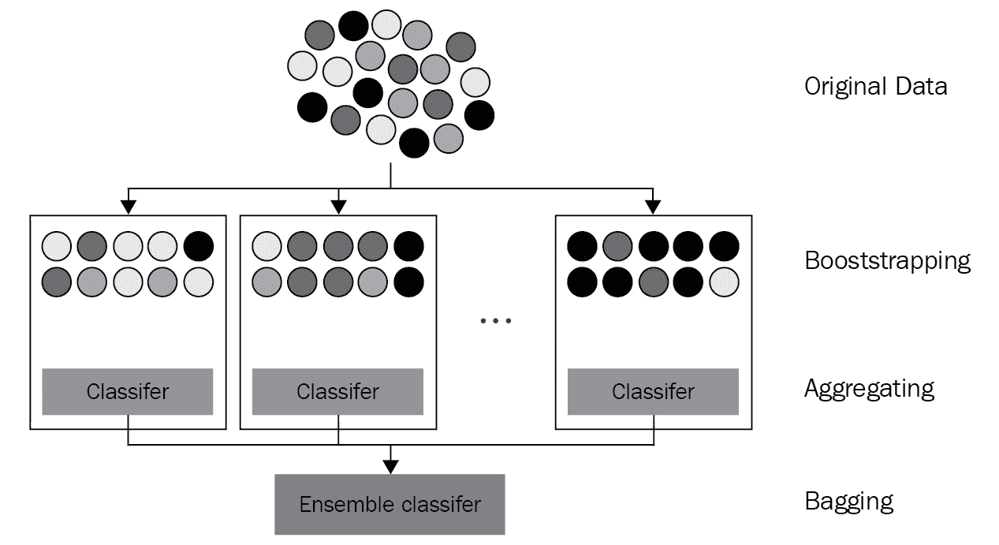
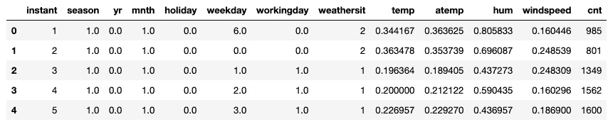
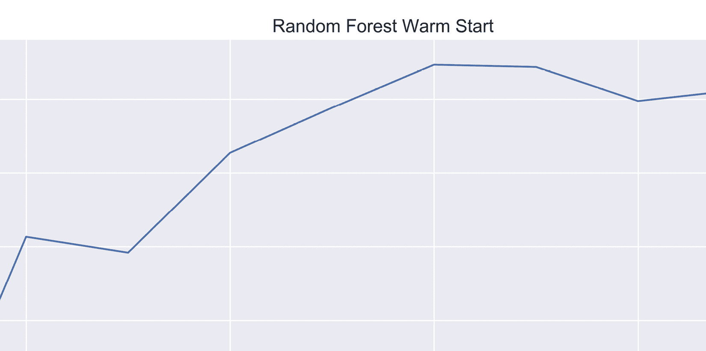
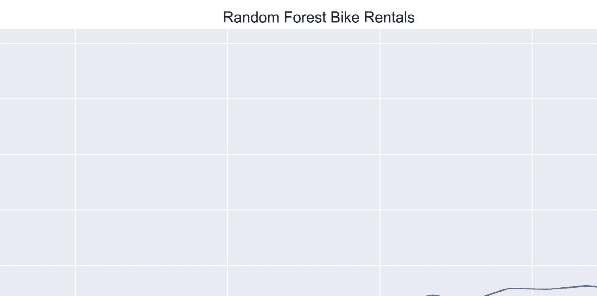
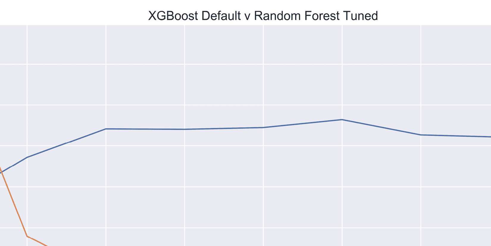

# 第三章：*第三章*：使用随机森林进行 Bagging

在本章中，你将掌握构建**随机森林**的技巧，随机森林是与 XGBoost 竞争的领先方法。与 XGBoost 一样，随机森林也是决策树的集成体。不同之处在于，随机森林通过**bagging**结合树，而 XGBoost 则通过**boosting**结合树。随机森林是 XGBoost 的一个可行替代方案，具有本章中强调的优点和局限性。了解随机森林非常重要，因为它们能为树基集成方法（如 XGBoost）提供宝贵的见解，并使你能够更深入地理解 boosting 与 bagging 之间的比较和对比。

在本章中，你将构建和评估**随机森林分类器**和**随机森林回归器**，掌握随机森林的超参数，学习机器学习中的 bagging 技巧，并探索一个案例研究，突出随机森林的局限性，这些局限性促使了梯度提升（XGBoost）的发展。

本章涵盖以下主要内容：

+   Bagging 集成方法

+   探索随机森林

+   调整随机森林超参数

+   推动随机森林的边界——案例研究

# 技术要求

本章的代码可以在[`github.com/PacktPublishing/Hands-On-Gradient-Boosting-with-XGBoost-and-Scikit-learn/tree/master/Chapter03`](https://github.com/PacktPublishing/Hands-On-Gradient-Boosting-with-XGBoost-and-Scikit-learn/tree/master/Chapter03)找到

# Bagging 集成方法

在本节中，你将了解为什么集成方法通常优于单一的机器学习模型。此外，你还将学习 bagging 技巧。这两者是随机森林的重要特征。

## 集成方法

在机器学习中，集成方法是一种通过聚合单个模型的预测结果来构建的模型。由于集成方法结合了多个模型的结果，它们较不容易出错，因此往往表现更好。

假设你的目标是确定一栋房子是否会在上市的第一个月内售出。你运行了几个机器学习算法，发现**逻辑回归**的准确率为 80%，**决策树**为 75%，**k 最近邻**为 77%。

一个选项是使用逻辑回归，作为最准确的模型，作为你的最终模型。更有说服力的选项是将每个单独模型的预测结果结合起来。

对于分类器，标准选项是采用多数投票。如果至少有三个模型中的两个预测房子会在第一个月内卖掉，那么预测结果是*YES*。否则，预测结果是*NO*。

使用集成方法通常能提高整体准确性。要让预测错误，仅仅一个模型出错是不够的；必须有大多数分类器都预测错误。

集成方法通常分为两类。第一类是将不同的机器学习模型组合在一起，例如用户选择的 scikit-learn 的`VotingClassifier`。第二类集成方法将同一模型的多个版本组合在一起，就像 XGBoost 和随机森林一样。

随机森林是所有集成方法中最流行和最广泛使用的。随机森林的单独模型是决策树，正如上一章的重点，*第二章*，*深入了解决策树*。一个随机森林可能包含数百或数千棵决策树，其预测结果将被合并成最终结果。

尽管随机森林使用多数规则来分类器，使用所有模型的平均值来回归器，但它们还使用一种叫做袋装（bagging）的方法，袋装是自助聚合（bootstrap aggregation）的缩写，用来选择单独的决策树。

## 自助聚合

**自助法（Bootstrapping）**是指带放回的抽样。

想象一下，你有一袋 20 颗有色大理石。你将依次选择 10 颗大理石，每次选择后都将其放回袋中。这意味着，虽然极不可能，但你有可能选中同一颗大理石 10 次。

你更可能多次选中一些大理石，而有些大理石则可能一次也不选中。

这里是大理石的可视化图：



图 3.1 – 袋装的可视化示意图（改绘自：Siakorn，Wikimedia Commons，[`commons.wikimedia.org/wiki/File:Ensemble_Bagging.svg`](https://commons.wikimedia.org/wiki/File:Ensemble_Bagging.svg)）

从上面的示意图可以看出，自助样本是通过带放回的抽样获得的。如果大理石没有被放回，那么就不可能得到比原始袋中更多黑色（*原图中的蓝色*）大理石的样本，正如最右侧的框所示。

在随机森林中，自助法在幕后发挥作用。自助法发生在每棵决策树建立时。如果所有的决策树都由相同的样本组成，那么这些树会给出类似的预测，最终结果也会与单棵树的预测相似。而在随机森林中，树是通过自助法建立的，通常样本数与原始数据集相同。数学估计表明，每棵树中约三分之二的样本是唯一的，三分之一包含重复样本。

在模型建立的自助法阶段后，每棵决策树会做出自己的单独预测。结果是由多棵树组成的森林，这些树的预测结果会根据分类器的多数规则和回归器的平均值合并成最终预测。

总结一下，随机森林聚合了自助法生成的决策树的预测。这种通用的集成方法在机器学习中被称为自助法（bagging）。

# 探索随机森林

为了更好地了解随机森林的工作原理，让我们使用 scikit-learn 构建一个随机森林。

## 随机森林分类器

让我们使用一个随机森林分类器，使用我们在**第一章**，*机器学习概览*中清理和评分的普查数据集，预测用户收入是否超过 50,000 美元，并在**第二章**，*决策树深入剖析*中重新检查。我们将使用`cross_val_score`确保我们的测试结果具有良好的泛化能力：

以下步骤使用普查数据集构建并评分一个随机森林分类器：

1.  导入`pandas`、`numpy`、`RandomForestClassifier`和`cross_val_score`，然后关闭警告：

    ```py
    import pandas as pd
    import numpy as np
    from sklearn.ensemble import RandomForestClassifier
    from sklearn.model_selection import cross_val_score
    import warnings
    warnings.filterwarnings('ignore')
    ```

1.  加载数据集`census_cleaned.csv`并将其拆分为`X`（预测变量）和`y`（目标变量）：

    ```py
    df_census = pd.read_csv('census_cleaned.csv')
    X_census = df_census.iloc[:,:-1]
    y_census = df_census.iloc[:,-1]
    ```

    在准备好导入和数据后，现在是时候构建模型了。

1.  接下来，我们初始化随机森林分类器。在实践中，集成算法与其他机器学习算法一样工作。一个模型被初始化、拟合训练数据，并在测试数据上评分。

    我们通过提前设置以下超参数来初始化随机森林：

    a) `random_state=2`确保你的结果与我们的结果一致。

    b) `n_jobs=-1`通过利用并行处理加速计算。

    c) `n_estimators=10`，这是 scikit-learn 的默认值，足以加速计算并避免歧义；新的默认值已设置为`n_estimators=100`。`n_estimators`将在下一节中详细探讨：

    ```py
    rf = RandomForestClassifier(n_estimators=10, random_state=2, n_jobs=-1)
    ```

1.  现在我们将使用`cross_val_score`。`cross_val_score`需要一个模型、预测列和目标列作为输入。回顾一下，`cross_val_score`会对数据进行拆分、拟合和评分：

    ```py
    scores = cross_val_score(rf, X_census, y_census, cv=5)
    ```

1.  显示结果：

    ```py
    print('Accuracy:', np.round(scores, 3))
    print('Accuracy mean: %0.3f' % (scores.mean()))
    Accuracy: [0.851 0.844 0.851 0.852 0.851]
    Accuracy mean: 0.850
    ```

默认的随机森林分类器在**第二章**，*决策树深入剖析*（81%）的数据集上，比决策树表现更好，但还不如**第一章**，*机器学习概览*（86%）中的 XGBoost。为什么它比单一的决策树表现更好？

性能提升可能与上一节中描述的自助法（bagging）有关。在这个森林中有 10 棵树（因为`n_estimators=10`），每个预测是基于 10 棵决策树，而不是 1 棵。树是通过自助法生成的，这增加了多样性，并通过聚合减少了方差。

默认情况下，随机森林分类器在寻找分裂时会从特征总数的平方根中选择特征。因此，如果有 100 个特征（列），每棵决策树在选择分裂时只会考虑 10 个特征。因此，两个样本重复的树可能由于分裂的不同而给出完全不同的预测。这是随机森林减少方差的另一种方式。

除了分类，随机森林还可以用于回归。

## 随机森林回归器

在随机森林回归器中，样本是通过自助法（bootstrap）抽取的，和随机森林分类器一样，但最大特征数是特征总数，而不是平方根。这个变化是基于实验结果（参见 [`orbi.uliege.be/bitstream/2268/9357/1/geurts-mlj-advance.pdf`](https://orbi.uliege.be/bitstream/2268/9357/1/geurts-mlj-advance.pdf)）。

此外，最终的预测是通过对所有决策树的预测结果求平均得出的，而不是通过多数规则投票。

为了查看随机森林回归器的实际应用，请完成以下步骤：

1.  从*第二章*《决策树深度剖析》上传自行车租赁数据集，并提取前五行以供回顾：

    ```py
    df_bikes = pd.read_csv('bike_rentals_cleaned.csv')
    df_bikes.head()
    ```

    上述代码应生成以下输出：

    

    图 3.2 – 自行车租赁数据集 – 已清理

1.  将数据划分为`X`和`y`，即预测列和目标列：

    ```py
    X_bikes = df_bikes.iloc[:,:-1]
    y_bikes = df_bikes.iloc[:,-1]
    ```

1.  导入回归器，然后使用相同的默认超参数进行初始化，`n_estimators=10`，`random_state=2`，`n_jobs=-1`：

    ```py
    from sklearn.ensemble import RandomForestRegressor
    rf = RandomForestRegressor(n_estimators=10, random_state=2, n_jobs=-1)
    ```

1.  现在我们需要使用`cross_val_score`。将回归器`rf`与预测器和目标列一起放入`cross_val_score`。请注意，负均方误差（`'neg_mean_squared_error'`）应定义为评分参数。选择 10 折交叉验证（`cv=10`）：

    ```py
    scores = cross_val_score(rf, X_bikes, y_bikes, scoring='neg_mean_squared_error', cv=10)
    ```

1.  查找并显示**均方根误差**（**RMSE**）：

    ```py
    rmse = np.sqrt(-scores)
    print('RMSE:', np.round(rmse, 3))
    print('RMSE mean: %0.3f' % (rmse.mean()))
    ```

    输出如下：

    ```py
    RMSE: [ 801.486  579.987  551.347  846.698  895.05  1097.522   893.738  809.284  833.488 2145.046]
    RMSE mean: 945.365
    ```

随机森林的表现令人满意，尽管不如我们之前看到的其他模型。我们将在本章后面的案例研究中进一步分析自行车租赁数据集，以了解原因。

接下来，我们将详细查看随机森林的超参数。

# 随机森林超参数

随机森林超参数的范围很大，除非已经具备决策树超参数的工作知识，如在*第二章*《决策树深度剖析》中所讨论的那样。

在本节中，我们将在介绍您已见过的超参数分组之前，讨论一些额外的随机森林超参数。许多超参数将被 XGBoost 使用。

## oob_score

我们的第一个超参数，可能也是最引人注目的，是`oob_score`。

随机森林通过袋装（bagging）选择决策树，这意味着样本是带替换地选取的。所有样本选择完后，应该会有一些未被选择的样本。

可以将这些样本作为测试集保留。在模型拟合完一棵树后，模型可以立即用这个测试集进行评分。当超参数设置为`oob_score=True`时，正是发生了这种情况。

换句话说，`oob_score`提供了一种获取测试分数的快捷方式。在模型拟合后，可以立即打印出`oob_score`。

让我们在普查数据集上使用`oob_score`，看看它在实践中的表现。由于我们使用`oob_score`来测试模型，因此不需要将数据拆分为训练集和测试集。

随机森林可以像往常一样初始化，设置`oob_score=True`：

```py
rf = RandomForestClassifier(oob_score=True, n_estimators=10, random_state=2, n_jobs=-1)
```

接下来，可以在数据上拟合`rf`：

```py
rf.fit(X_census, y_census)
```

由于`oob_score=True`，在模型拟合后可以获得分数。可以通过模型的属性`.oob_score_`来访问分数，如下所示（注意`score`后有下划线）：

```py
rf.oob_score_
```

分数如下：

```py
0.8343109855348423
```

如前所述，`oob_score`是通过对训练阶段被排除的个别树上的样本进行评分生成的。当森林中的树木数量较少时（例如使用 10 个估计器），可能没有足够的测试样本来最大化准确度。

更多的树意味着更多的样本，通常也意味着更高的准确性。

## n_estimators

当森林中有很多树时，随机森林的效果非常强大。那么多少棵树才足够呢？最近，scikit-learn 的默认设置已从 10 改为 100。虽然 100 棵树可能足够减少方差并获得良好的分数，但对于较大的数据集，可能需要 500 棵或更多的树。

让我们从`n_estimators=50`开始，看看`oob_score`是如何变化的：

```py
rf = RandomForestClassifier(n_estimators=50, oob_score=True, random_state=2, n_jobs=-1)
rf.fit(X_census, y_census)
rf.oob_score_
```

分数如下：

```py
0.8518780135745216
```

有了明显的提升。那么 100 棵树呢？

```py
rf = RandomForestClassifier(n_estimators=100, oob_score=True, random_state=2, n_jobs=-1)
rf.fit(X_census, y_census)
rf.oob_score_
```

分数如下：

```py
0.8551334418476091
```

增益较小。随着`n_estimators`的不断增加，分数最终会趋于平稳。

## warm_start

`warm_start`超参数非常适合确定森林中树的数量（`n_estimators`）。当`warm_start=True`时，添加更多树木不需要从头开始。如果将`n_estimators`从 100 改为 200，构建 200 棵树的森林可能需要两倍的时间。使用`warm_start=True`时，200 棵树的随机森林不会从头开始，而是从先前模型停止的位置继续。

`warm_start`可以用来绘制不同`n_estimators`值下的各种分数。

作为示例，以下代码每次增加 50 棵树，从 50 开始，到 500 结束，显示一系列分数。由于每轮都在通过添加 50 棵新树来构建 10 个随机森林，这段代码可能需要一些时间才能完成运行！代码按以下步骤分解：

1.  导入 matplotlib 和 seaborn，然后通过`sns.set()`设置 seaborn 的暗色网格：

    ```py
    import matplotlib.pyplot as plt
    import seaborn as sns
    sns.set()
    ```

1.  初始化一个空的分数列表，并用 50 个估计器初始化随机森林分类器，确保`warm_start=True`和`oob_score=True`：

    ```py
    oob_scores = []
    rf = RandomForestClassifier(n_estimators=50, warm_start=True, oob_score=True, n_jobs=-1, random_state=2)
    ```

1.  将`rf`拟合到数据集上，然后将`oob_score`添加到`oob_scores`列表中：

    ```py
    rf.fit(X_census, y_census)
    oob_scores.append(rf.oob_score_)
    ```

1.  准备一个估计器列表，其中包含从 50 开始的树的数量：

    ```py
    est = 50
    estimators=[est]
    ```

1.  写一个 for 循环，每轮添加 50 棵树。每一轮，向 `est` 添加 50， 将 `est` 附加到 `estimators` 列表中，使用 `rf.set_params(n_estimators=est)` 更改 `n_estimators`，在数据上拟合随机森林，然后附加新的 `oob_score_`：

    ```py
    for i in range(9):
        est += 50
        estimators.append(est)
        rf.set_params(n_estimators=est)
        rf.fit(X_census, y_census)
        oob_scores.append(rf.oob_score_)
    ```

1.  为了更好的展示，显示一个更大的图表，然后绘制估计器和 `oob_scores`。添加适当的标签，然后保存并显示图表：

    ```py
    plt.figure(figsize=(15,7))
    plt.plot(estimators, oob_scores)
    plt.xlabel('Number of Trees')
    plt.ylabel('oob_score_')
    plt.title('Random Forest Warm Start', fontsize=15)
    plt.savefig('Random_Forest_Warm_Start', dpi=325)
    plt.show()
    ```

    这将生成以下图表：



图 3.3 – 随机森林热启动 – 每个树的 oob_score

如你所见，树木的数量在大约 300 时趋于峰值。使用超过 300 棵树成本较高且耗时，而且收益微乎其微。

## bootstrap

尽管随机森林通常是自助法（bootstrap），但 `bootstrap` 超参数可以设置为 `False`。如果 `bootstrap=False`，则无法包含 `oob_score`，因为 `oob_score` 仅在样本被排除时才可能。

我们将不再继续此选项，尽管如果发生欠拟合，这个方法是合理的。

## 冗长

`verbose` 超参数可以设置为更高的数字，以在构建模型时显示更多信息。你可以自己尝试实验。当构建大型模型时，`verbose=1` 可以在过程中提供有用的信息。

## 决策树超参数

其余的超参数都来自决策树。事实证明，在随机森林中，决策树的超参数并不那么重要，因为随机森林本身通过设计减少了方差。

这里是按类别分组的决策树超参数，供您查看。

### 深度

属于此类别的超参数有：

+   `max_depth`：总是需要调整。决定分裂发生的次数，也就是树的长度。是减少方差的一个好方法。

### 分裂

属于此类别的超参数有：

+   `max_features`：限制在进行分裂时可选择的特征数。

+   `min_samples_split`：增加进行新分裂所需的样本数。

+   `min_impurity_decrease`：限制分裂以减少超过设定阈值的杂质。

### 叶子

属于此类别的超参数有：

+   `min_samples_leaf`：增加成为叶子节点所需的最小样本数。

+   `min_weight_fraction_leaf`：成为叶子的所需总权重的比例。

如需了解更多关于上述超参数的信息，请查阅官方随机森林回归器文档：[`scikit-learn.org/stable/modules/generated/sklearn.ensemble.RandomForestRegressor.html`](https://scikit-learn.org/stable/modules/generated/sklearn.ensemble.RandomForestRegressor.html)

# 推动随机森林的边界 – 案例研究

假设你为一家自行车租赁公司工作，目标是根据天气、一天中的时间、季节和公司的成长来预测每天的自行车租赁数量。

在本章的早期，您实现了一个带有交叉验证的随机森林回归器，得到了 945 辆自行车的 RMSE。您的目标是修改随机森林以获得尽可能低的误差得分。

## 准备数据集

在本章的早期，您下载了数据集`df_bikes`并将其分割为`X_bikes`和`y_bikes`。现在，您进行一些严肃的测试，决定将`X_bikes`和`y_bikes`拆分为训练集和测试集，如下所示：

```py
from sklearn.model_selection import train_test_split
X_train, X_test, y_train, y_test = train_test_split(X_bikes, y_bikes, random_state=2)
```

## n_estimators

首先选择一个合理的`n_estimators`值。回想一下，`n_estimators`可以增加以提高准确性，但会以计算资源和时间为代价。

以下是使用`warm_start`方法对多种`n_estimators`进行 RMSE 图形展示，所使用的代码与之前在*warm_start*部分提供的相同：



图 3.4 – 随机森林自行车租赁 – 每棵树的 RMSE

这个图表非常有趣。随机森林在 50 个估计器下提供了最佳得分。在 100 个估计器后，误差开始逐渐增加，这是一个稍后会重新讨论的概念。

现在，使用`n_estimators=50`作为起点是合理的选择。

## cross_val_score

根据之前的图表，误差范围从 620 到 690 辆自行车租赁，现在是时候看看数据集在使用`cross_val_score`进行交叉验证时的表现了。回想一下，在交叉验证中，目的是将样本划分为*k*个不同的折，并在不同的折中使用所有样本作为测试集。由于所有样本都用于测试模型，`oob_score`将无法使用。

以下代码包含了您在本章早期使用的相同步骤：

1.  初始化模型。

1.  对模型进行评分，使用`cross_val_score`与模型、预测列、目标列、评分标准和折数作为参数。

1.  计算 RMSE。

1.  显示交叉验证得分和平均值。

这里是代码：

```py
rf = RandomForestRegressor(n_estimators=50, warm_start=True, n_jobs=-1, random_state=2)
scores = cross_val_score(rf, X_bikes, y_bikes, scoring='neg_mean_squared_error', cv=10)
rmse = np.sqrt(-scores)
print('RMSE:', np.round(rmse, 3))
print('RMSE mean: %0.3f' % (rmse.mean()))
```

输出结果如下：

```py
RMSE: [ 836.482  541.898  533.086  812.782  894.877  881.117   794.103  828.968  772.517 2128.148]
RMSE mean: 902.398
```

这个得分比本章之前的得分更好。注意，最后一个折中的误差显著更高，根据 RMSE 数组中的最后一项。这可能是由于数据中的错误或异常值所致。

## 微调超参数

是时候创建一个超参数网格，使用`RandomizedSearchCV`来微调我们的模型了。以下是一个使用`RandomizedSearchCV`的函数，用于显示 RMSE 和平均得分以及最佳超参数：

```py
from sklearn.model_selection import RandomizedSearchCV
def randomized_search_reg(params, runs=16, reg=RandomForestRegressor(random_state=2, n_jobs=-1)):
    rand_reg = RandomizedSearchCV(reg, params, n_iter=runs, scoring='neg_mean_squared_error', cv=10, n_jobs=-1, random_state=2)
    rand_reg.fit(X_train, y_train)
    best_model = rand_reg.best_estimator_
    best_params = rand_reg.best_params_
    print("Best params:", best_params)
    best_score = np.sqrt(-rand_reg.best_score_)
    print("Training score: {:.3f}".format(best_score))
    y_pred = best_model.predict(X_test)
    from sklearn.metrics import mean_squared_error as MSE
    rmse_test = MSE(y_test, y_pred)**0.5
    print('Test set score: {:.3f}'.format(rmse_test))
```

这里是一个初学者的超参数网格，放入新的`randomized_search_reg`函数中以获得初步结果：

```py
randomized_search_reg(params={'min_weight_fraction_leaf':[0.0, 0.0025, 0.005, 0.0075, 0.01, 0.05],'min_samples_split':[2, 0.01, 0.02, 0.03, 0.04, 0.06, 0.08, 0.1],'min_samples_leaf':[1,2,4,6,8,10,20,30],'min_impurity_decrease':[0.0, 0.01, 0.05, 0.10, 0.15, 0.2],'max_leaf_nodes':[10, 15, 20, 25, 30, 35, 40, 45, 50, None], 'max_features':['auto', 0.8, 0.7, 0.6, 0.5, 0.4],'max_depth':[None,2,4,6,8,10,20]})
```

输出结果如下：

```py
Best params: {'min_weight_fraction_leaf': 0.0, 'min_samples_split': 0.03, 'min_samples_leaf': 6, 'min_impurity_decrease': 0.05, 'max_leaf_nodes': 25, 'max_features': 0.7, 'max_depth': None}
Training score: 759.076
Test set score: 701.802
```

这是一个重要的改进。让我们看看通过缩小范围是否能够得到更好的结果：

```py
randomized_search_reg(params={'min_samples_leaf': [1,2,4,6,8,10,20,30], 'min_impurity_decrease':[0.0, 0.01, 0.05, 0.10, 0.15, 0.2],'max_features':['auto', 0.8, 0.7, 0.6, 0.5, 0.4], 'max_depth':[None,2,4,6,8,10,20]})
```

输出结果如下：

```py
Best params: {'min_samples_leaf': 1, 'min_impurity_decrease': 0.1, 'max_features': 0.6, 'max_depth': 10}
Training score: 679.052
Test set score: 626.541
```

得分再次提高了。

现在，让我们增加运行次数，并为`max_depth`提供更多选项：

```py
randomized_search_reg(params={'min_samples_leaf':[1,2,4,6,8,10,20,30],'min_impurity_decrease':[0.0, 0.01, 0.05, 0.10, 0.15, 0.2],'max_features':['auto', 0.8, 0.7, 0.6, 0.5, 0.4],'max_depth':[None,4,6,8,10,12,15,20]}, runs=20)
```

输出结果如下：

```py
Best params: {'min_samples_leaf': 1, 'min_impurity_decrease': 0.1, 'max_features': 0.6, 'max_depth': 12}
Training score: 675.128
Test set score: 619.014
```

得分持续提升。此时，根据之前的结果，可能值得进一步缩小范围：

```py
randomized_search_reg(params={'min_samples_leaf':[1,2,3,4,5,6], 'min_impurity_decrease':[0.0, 0.01, 0.05, 0.08, 0.10, 0.12, 0.15], 'max_features':['auto', 0.8, 0.7, 0.6, 0.5, 0.4],'max_depth':[None,8,10,12,14,16,18,20]})
```

输出如下：

```py
Best params: {'min_samples_leaf': 1, 'min_impurity_decrease': 0.05, 'max_features': 0.7, 'max_depth': 18}
Training score: 679.595
Test set score: 630.954
```

测试分数已经回升。此时增加`n_estimators`可能是一个好主意。森林中的树木越多，可能带来的小幅提升也越大。

我们还可以将运行次数增加到`20`，以寻找更好的超参数组合。请记住，结果是基于随机搜索，而不是完全的网格搜索：

```py
randomized_search_reg(params={'min_samples_leaf':[1,2,4,6,8,10,20,30], 'min_impurity_decrease':[0.0, 0.01, 0.05, 0.10, 0.15, 0.2], 'max_features':['auto', 0.8, 0.7, 0.6, 0.5, 0.4],'max_depth':[None,4,6,8,10,12,15,20],'n_estimators':[100]}, runs=20)
```

输出如下：

```py
Best params: {'n_estimators': 100, 'min_samples_leaf': 1, 'min_impurity_decrease': 0.1, 'max_features': 0.6, 'max_depth': 12}
Training score: 675.128
Test set score: 619.014
```

这与迄今为止取得的最佳得分相匹配。我们可以继续调整。通过足够的实验，测试分数可能会降到低于 600 辆的水平。但我们似乎已经在 600 辆附近达到了瓶颈。

最后，让我们将最好的模型放入`cross_val_score`，看看结果与原始模型相比如何：

```py
rf = RandomForestRegressor(n_estimators=100,  min_impurity_decrease=0.1, max_features=0.6, max_depth=12, warm_start=True, n_jobs=-1, random_state=2)
scores = cross_val_score(rf, X_bikes, y_bikes, scoring='neg_mean_squared_error', cv=10)
rmse = np.sqrt(-scores)
print('RMSE:', np.round(rmse, 3))
print('RMSE mean: %0.3f' % (rmse.mean()))
```

输出如下：

```py
RMSE: [ 818.354  514.173  547.392  814.059  769.54   730.025  831.376  794.634  756.83  1595.237]
RMSE mean: 817.162
```

RMSE 回升至`817`。这个得分比`903`好得多，但比`619`差得多。这是怎么回事？

在`cross_val_score`中可能存在最后一次分割的问题，因为它的得分比其他的差了两倍。让我们看看打乱数据是否能解决这个问题。Scikit-learn 有一个 shuffle 模块，可以从 `sklearn.utils` 导入，方法如下：

```py
from sklearn.utils import shuffle
```

现在我们可以按如下方式打乱数据：

```py
df_shuffle_bikes = shuffle(df_bikes, random_state=2)
```

现在将数据分成新的`X`和`y`，再次运行`RandomForestRegressor`并使用`cross_val_score`：

```py
X_shuffle_bikes = df_shuffle_bikes.iloc[:,:-1]
y_shuffle_bikes = df_shuffle_bikes.iloc[:,-1]
rf = RandomForestRegressor(n_estimators=100,  min_impurity_decrease=0.1, max_features=0.6, max_depth=12, n_jobs=-1, random_state=2)
scores = cross_val_score(rf, X_shuffle_bikes, y_shuffle_bikes, scoring='neg_mean_squared_error', cv=10)
rmse = np.sqrt(-scores)
print('RMSE:', np.round(rmse, 3))
print('RMSE mean: %0.3f' % (rmse.mean()))
```

输出如下：

```py
RMSE: [630.093 686.673 468.159 526.676 593.033 724.575 774.402 672.63  760.253  616.797]
RMSE mean: 645.329
```

在打乱数据后，最后一次分割没有问题，得分比预期要高得多。

## 随机森林的缺点

到头来，随机森林的性能受限于其单棵树。如果所有树都犯了同样的错误，随机森林也会犯这个错误。正如本案例研究所揭示的，在数据未打乱之前，随机森林无法显著改进错误，原因是数据中的某些问题单棵树无法处理。

一种能够改进初始缺陷的集成方法，一种能够在未来回合中从决策树的错误中学习的集成方法，可能会带来优势。Boosting 的设计就是为了从早期回合中树木的错误中学习。Boosting，特别是梯度提升——下一章的重点——讨论了这一主题。

最后，以下图表展示了调优后的随机森林回归器和默认的 XGBoost 回归器，在没有打乱数据的情况下增加树木数量时的表现：



图 3.5 – 比较 XGBoost 默认模型和调优后的随机森林

如你所见，XGBoost 在树木数量增加时的学习表现远远优于其他方法。而且 XGBoost 模型甚至还没有进行调优！

# 总结

在本章中，你学习了集成方法的重要性，特别是了解了袋装法（bagging），即自助抽样（bootstrapping）、带放回的采样和聚合的结合，将多个模型合并成一个。你构建了随机森林分类器和回归器。你通过调整`n_estimators`和`warm_start`超参数，并使用`oob_score_`来查找误差。然后，你修改了随机森林的超参数以优化模型。最后，你分析了一个案例研究，其中数据洗牌带来了优秀的结果，而对未洗牌数据增加更多的树并没有带来任何提升，这与 XGBoost 的结果形成了对比。

在下一章中，你将学习提升方法（boosting）的基本原理，这是一种集成方法，通过从错误中学习，随着更多决策树的加入，提升准确率。你将实现梯度提升（gradient boosting）进行预测，为极端梯度提升（Extreme Gradient Boosting，简称 XGBoost）奠定基础。
