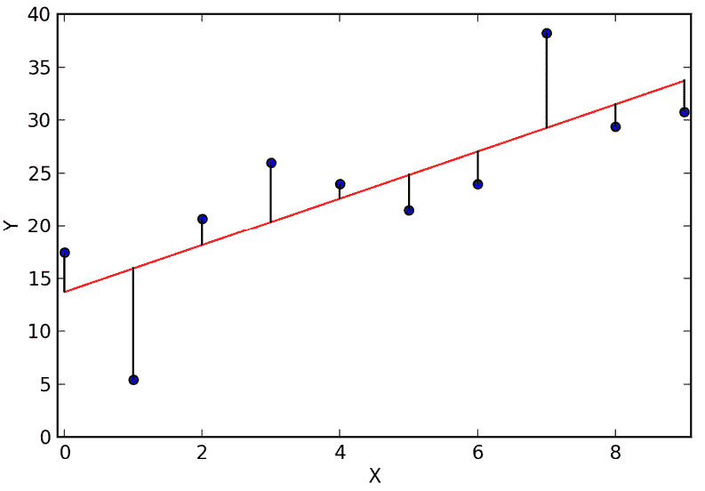
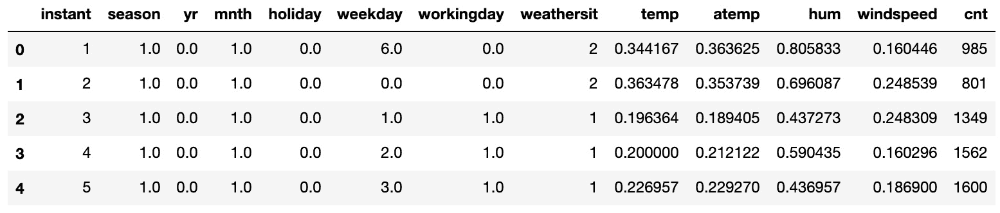
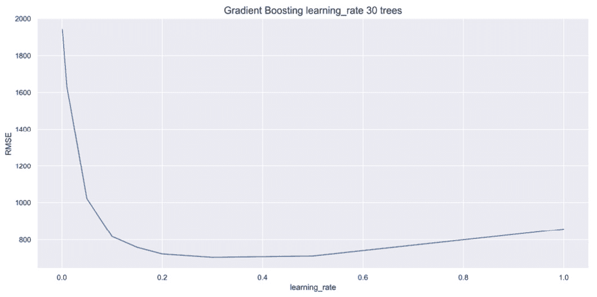
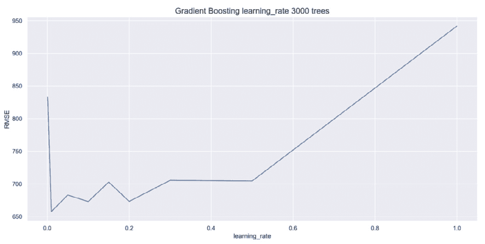
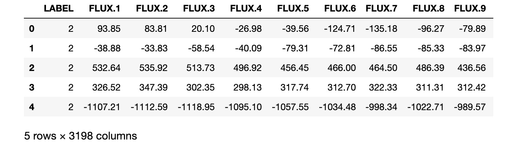

# 第四章：*第四章*：从梯度提升到 XGBoost

XGBoost 是一种独特的梯度提升形式，具有多个显著的优势，这些优势将在*第五章*，《XGBoost 揭示》中进行解释。为了理解 XGBoost 相较于传统梯度提升的优势，您必须首先了解传统梯度提升是如何工作的。XGBoost 融入了传统梯度提升的结构和超参数。在本章中，您将发现梯度提升的强大能力，而这正是 XGBoost 的核心所在。

在本章中，您将从零开始构建梯度提升模型，并与之前的结果对比梯度提升模型和错误。特别地，您将专注于**学习率**超参数，构建强大的梯度提升模型，其中包括 XGBoost。最后，您将预览一个关于外行星的案例研究，强调对更快算法的需求，这种需求在大数据领域中至关重要，而 XGBoost 正好满足了这一需求。

在本章中，我们将覆盖以下主要主题：

+   从袋装法到提升法

+   梯度提升的工作原理

+   修改梯度提升的超参数

+   面对大数据的挑战——梯度提升与 XGBoost 的对比

# 技术要求

本章的代码可以在[`github.com/PacktPublishing/Hands-On-Gradient-Boosting-with-XGBoost-and-Scikit-learn/tree/master/Chapter04`](https://github.com/PacktPublishing/Hands-On-Gradient-Boosting-with-XGBoost-and-Scikit-learn/tree/master/Chapter04)找到。

# 从袋装法到提升法

在*第三章*，《随机森林的袋装法》中，您学习了为什么像随机森林这样的集成机器学习算法通过将多个机器学习模型结合成一个，从而做出更好的预测。随机森林被归类为袋装算法，因为它们使用自助法样本的聚合（决策树）。

相比之下，提升方法通过学习每棵树的错误来进行优化。其一般思路是基于前一棵树的错误来调整新树。

在提升方法（boosting）中，每棵新树的错误修正是与袋装法（bagging）不同的。在袋装模型中，新树不会关注之前的树。此外，新树是通过自助法（bootstrapping）从零开始构建的，最终的模型将所有单独的树进行聚合。然而，在提升方法中，每棵新树都是基于前一棵树构建的。这些树并不是孤立运作的，而是相互叠加构建的。

## 介绍 AdaBoost

**AdaBoost**是最早且最受欢迎的提升模型之一。在 AdaBoost 中，每一棵新树都会根据前一棵树的错误来调整权重。通过调整权重，更多地关注预测错误的样本，给予这些样本更高的权重。通过从错误中学习，AdaBoost 能够将弱学习者转变为强学习者。弱学习者是指那些表现几乎与随机猜测一样的机器学习算法。相比之下，强学习者则从数据中学习到了大量信息，表现优异。

提升算法背后的基本思想是将弱学习者转变为强学习者。弱学习者几乎不比随机猜测更好。但这种弱开始是有目的的。基于这一基本思想，提升通过集中精力进行迭代的错误修正来工作，*而不是*建立一个强大的基准模型。如果基准模型太强，学习过程就会受到限制，从而削弱提升模型背后的整体策略。

通过数百次迭代，弱学习者被转化为强学习者。从这个意义上来说，微小的优势可以带来很大不同。事实上，在过去几十年里，提升方法一直是产生最佳结果的机器学习策略之一。

本书不深入研究 AdaBoost 的细节。像许多 scikit-learn 模型一样，在实践中实现 AdaBoost 非常简单。`AdaBoostRegressor`和`AdaBoostClassifier`算法可以从`sklearn.ensemble`库中下载，并适用于任何训练集。最重要的 AdaBoost 超参数是`n_estimators`，即创建强学习者所需的树的数量（迭代次数）。

注意

有关 AdaBoost 的更多信息，请查阅官方文档：[`scikit-learn.org/stable/modules/generated/sklearn.ensemble.AdaBoostClassifier.html`](https://scikit-learn.org/stable/modules/generated/sklearn.ensemble.AdaBoostClassifier.html)（分类器）和[`scikit-learn.org/stable/modules/generated/sklearn.ensemble.AdaBoostRegressor.html`](https://scikit-learn.org/stable/modules/generated/sklearn.ensemble.AdaBoostRegressor.html)（回归器）。

我们现在将介绍梯度提升，它是 AdaBoost 的强有力替代方案，在性能上略有优势。

## 区分梯度提升

梯度提升采用与 AdaBoost 不同的方法。虽然梯度提升也基于错误的预测进行调整，但它更进一步：梯度提升根据前一棵树的预测错误完全拟合每一棵新树。也就是说，对于每一棵新树，梯度提升首先查看错误，然后围绕这些错误完全构建一棵新树。新树不会关心那些已经正确的预测。

构建一个仅关注错误的机器学习算法需要一种全面的方法，累加错误以做出准确的最终预测。这种方法利用了残差，即模型预测值与实际值之间的差异。其基本思想如下：

*梯度提升计算每棵树预测的残差，并将所有残差加总来评估模型。*

理解**计算**和**累加残差**至关重要，因为这个思想是 XGBoost（梯度提升的高级版本）核心原理之一。当你构建自己的梯度提升版本时，计算和累加残差的过程会变得更加清晰。在下一节中，你将构建自己的梯度提升模型。首先，让我们详细了解梯度提升的工作原理。

# 梯度提升的工作原理

在本节中，我们将深入了解梯度提升的内部原理，通过对前一棵树的错误训练新树，从零开始构建一个梯度提升模型。这里的核心数学思想是残差。接下来，我们将使用 scikit-learn 的梯度提升算法获得相同的结果。

## 残差

残差是给定模型的预测与实际值之间的差异。在统计学中，残差常常被分析，以判断线性回归模型与数据的拟合程度。

请考虑以下示例：

1.  自行车租赁

    a) *预测*: 759

    b) *结果*: 799

    c) *残差*: 799 - 759 = 40

1.  收入

    a) *预测*: 100,000

    b) *结果*: 88,000

    c) *残差*: 88,000 – 100,000 = -12,000

正如你所看到的，残差告诉你模型的预测与实际之间的偏差，残差可能是正的，也可能是负的。

下面是一个展示**线性回归**线的残差的可视化示例：



图 4.1 – 线性回归线的残差

线性回归的目标是最小化残差的平方。正如图表所示，残差的可视化展示了线性拟合数据的效果。在统计学中，线性回归分析通常通过绘制残差图来深入了解数据。

为了从零开始构建一个梯度提升算法，我们将计算每棵树的残差，并对残差拟合一个新模型。现在我们开始吧。

## 学习如何从零开始构建梯度提升模型

从零开始构建梯度提升模型将帮助你更深入理解梯度提升在代码中的工作原理。在构建模型之前，我们需要访问数据并为机器学习做准备。

### 处理自行车租赁数据集

我们继续使用自行车租赁数据集，比较新模型与旧模型的表现：

1.  我们将从导入`pandas`和`numpy`开始，并添加一行代码来关闭任何警告：

    ```py
    import pandas as pd
    import numpy as np
    import warnings
    warnings.filterwarnings('ignore')
    ```

1.  现在，加载`bike_rentals_cleaned`数据集并查看前五行：

    ```py
    df_bikes = pd.read_csv('bike_rentals_cleaned.csv')
    df_bikes.head()
    ```

    你的输出应如下所示：

    

    图 4.2 – 自行车租赁数据集的前五行

1.  现在，将数据拆分为`X`和`y`。然后，将`X`和`y`拆分为训练集和测试集：

    ```py
    X_bikes = df_bikes.iloc[:,:-1]
    y_bikes = df_bikes.iloc[:,-1]
    from sklearn.model_selection import train_test_split
    X_train, X_test, y_train, y_test = train_test_split(X_bikes, y_bikes, random_state=2)
    ```

现在是时候从头开始构建梯度提升模型了！

### 从头开始构建梯度提升模型

以下是从头开始构建梯度提升机器学习模型的步骤：

1.  将数据拟合到决策树：你可以使用决策树桩，其`max_depth`值为`1`，或者使用深度为`2`或`3`的决策树。初始决策树被称为`max_depth=2`，并将其拟合到训练集上，作为`tree_1`，因为它是我们集成中的第一棵树：

    ```py
    from sklearn.tree import DecisionTreeRegressor
    tree_1 = DecisionTreeRegressor(max_depth=2, random_state=2)
    tree_1.fit(X_train, y_train)
    ```

1.  使用训练集进行预测：与使用测试集进行预测不同，梯度提升法中的预测最初是使用训练集进行的。为什么？因为要计算残差，我们需要在训练阶段比较预测结果。模型构建的测试阶段是在所有树构建完毕后才会进行。第一轮的训练集预测结果是通过将`predict`方法应用到`tree_1`，并使用`X_train`作为输入来得到的：

    ```py
    y_train_pred = tree_1.predict(X_train)
    ```

1.  计算残差：残差是预测值与目标列之间的差异。将`X_train`的预测值，定义为`y_train_pred`，从`y_train`目标列中减去，来计算残差：

    ```py
    y2_train = y_train - y_train_pred
    ```

    注意

    残差定义为`y2_train`，因为它是下一棵树的目标列。

1.  将新树拟合到残差上：将新树拟合到残差上与将模型拟合到训练集上有所不同。主要的区别在于预测。对于自行车租赁数据集，在将新树拟合到残差上时，我们应逐渐得到更小的数字。

    初始化一棵新树，并将其拟合到`X_train`和残差`y2_train`上：

    ```py
    tree_2 = DecisionTreeRegressor(max_depth=2, random_state=2)
    tree_2.fit(X_train, y2_train)
    ```

1.  重复步骤 2-4：随着过程的进行，残差应逐渐从正向和负向逼近`0`。迭代会持续进行，直到达到估计器的数量`n_estimators`。

    让我们重复第三棵树的过程，如下所示：

    ```py
    y2_train_pred = tree_2.predict(X_train)
    y3_train = y2_train - y2_train_pred
    tree_3 = DecisionTreeRegressor(max_depth=2, random_state=2)
    tree_3.fit(X_train, y3_train)
    ```

    这个过程可能会持续几十棵、几百棵甚至几千棵树。在正常情况下，你当然会继续进行。要将一个弱学习器转变为强学习器，肯定需要更多的树。然而，由于我们的目标是理解梯度提升背后的工作原理，因此在一般概念已经覆盖的情况下，我们将继续前进。

1.  汇总结果：汇总结果需要为每棵树使用测试集进行预测，如下所示：

    ```py
    y1_pred = tree_1.predict(X_test)
    y2_pred = tree_2.predict(X_test)
    y3_pred = tree_3.predict(X_test)
    ```

    由于预测值是正负差异，将预测值进行汇总应能得到更接近目标列的预测结果，如下所示：

    ```py
    y_pred = y1_pred + y2_pred + y3_pred
    ```

1.  最后，我们计算**均方误差**（**MSE**）来获得结果，如下所示：

    ```py
    from sklearn.metrics import mean_squared_error as MSE
    MSE(y_test, y_pred)**0.5
    ```

    以下是预期的输出：

    ```py
    911.0479538776444
    ```

对于一个尚未强大的弱学习器来说，这样的表现还不错！现在，让我们尝试使用 scikit-learn 获得相同的结果。

## 在 scikit-learn 中构建梯度提升模型

让我们看看能否通过调整一些超参数，使用 scikit-learn 的`GradientBoostingRegressor`得到与前一节相同的结果。使用`GradientBoostingRegressor`的好处是，它构建得更快，且实现起来更简单：

1.  首先，从`sklearn.ensemble`库中导入回归器：

    ```py
    from sklearn.ensemble import GradientBoostingRegressor
    ```

1.  在初始化`GradientBoostingRegressor`时，有几个重要的超参数。为了获得相同的结果，必须将`max_depth=2`和`random_state=2`匹配。此外，由于只有三棵树，我们必须设置`n_estimators=3`。最后，我们还必须设置`learning_rate=1.0`超参数。稍后我们会详细讨论`learning_rate`：

    ```py
    gbr = GradientBoostingRegressor(max_depth=2, n_estimators=3, random_state=2, learning_rate=1.0)
    ```

1.  现在模型已经初始化，可以在训练数据上进行拟合，并在测试数据上进行评分：

    ```py
    gbr.fit(X_train, y_train)
    y_pred = gbr.predict(X_test)
    MSE(y_test, y_pred)**0.5
    ```

    结果如下：

    ```py
    911.0479538776439
    ```

    结果在小数点后 11 位都是相同的！

    回顾一下，梯度提升的关键是构建一个足够多的树的模型，将弱学习器转变为强学习器。通过将`n_estimators`（迭代次数）设置为一个更大的数字，这可以很容易地实现。

1.  让我们构建并评分一个拥有 30 个估算器的梯度提升回归器：

    ```py
    gbr = GradientBoostingRegressor(max_depth=2, n_estimators=30, random_state=2, learning_rate=1.0)
    gbr.fit(X_train, y_train)
    y_pred = gbr.predict(X_test)
    MSE(y_test, y_pred)**0.5
    ```

    结果如下：

    ```py
    857.1072323426944
    ```

    得分有所提升。现在，让我们看看 300 个估算器的情况：

    ```py
    gbr = GradientBoostingRegressor(max_depth=2, n_estimators=300, random_state=2, learning_rate=1.0)
    gbr.fit(X_train, y_train)
    y_pred = gbr.predict(X_test)
    MSE(y_test, y_pred)**0.5
    ```

    结果是这样的：

    ```py
    936.3617413678853
    ```

这真是个惊讶！得分变差了！我们是不是被误导了？梯度提升真如人们所说的那样有效吗？

每当得到一个意外的结果时，都值得仔细检查代码。现在，我们更改了`learning_rate`，却没有详细说明。那么，如果我们移除`learning_rate=1.0`，并使用 scikit-learn 的默认值会怎样呢？

让我们来看看：

```py
gbr = GradientBoostingRegressor(max_depth=2, n_estimators=300, random_state=2)
gbr.fit(X_train, y_train)
y_pred = gbr.predict(X_test)
MSE(y_test, y_pred)**0.5
```

结果是这样的：

```py
653.7456840231495
```

难以置信！通过使用 scikit-learn 对`learning_rate`超参数的默认值，得分从`936`变为`654`。

在接下来的章节中，我们将深入学习不同的梯度提升超参数，重点关注`learning_rate`超参数。

# 修改梯度提升超参数

在本节中，我们将重点关注`learning_rate`，这是最重要的梯度提升超参数，可能唯一需要注意的是`n_estimators`，即模型中的迭代次数或树的数量。我们还将调查一些树的超参数，以及`subsample`，这会导致`RandomizedSearchCV`，并将结果与 XGBoost 进行比较。

## learning_rate

在上一节中，将`GradientBoostingRegressor`的`learning_rate`值从`1.0`更改为 scikit-learn 的默认值`0.1`，得到了巨大的提升。

`learning_rate`，也称为*收缩率*，会缩小单棵树的贡献，以确保在构建模型时没有一棵树的影响过大。如果整个集成模型是通过一个基础学习器的误差构建的，而没有仔细调整超参数，模型中的早期树可能会对后续的发展产生过大的影响。`learning_rate`限制了单棵树的影响。通常来说，随着`n_estimators`（树的数量）的增加，`learning_rate`应该减小。

确定最优的`learning_rate`值需要调整`n_estimators`。首先，让我们保持`n_estimators`不变，看看`learning_rate`单独的表现。`learning_rate`的取值范围是从`0`到`1`。`learning_rate`值为`1`意味着不做任何调整。默认值`0.1`表示树的影响权重为 10%。

这里是一个合理的起始范围：

`learning_rate_values = [0.001, 0.01, 0.05, 0.1, 0.15, 0.2, 0.3, 0.5, 1.0]`

接下来，我们将通过构建和评分新的`GradientBoostingRegressor`来遍历这些值，看看得分如何比较：

```py
for value in learning_rate_values:
    gbr = GradientBoostingRegressor(max_depth=2,   n_estimators=300, random_state=2, learning_rate=value)
    gbr.fit(X_train, y_train)
    y_pred = gbr.predict(X_test)
    rmse = MSE(y_test, y_pred)**0.5
    print('Learning Rate:', value, ', Score:', rmse)
```

学习率的值和得分如下：

```py
Learning Rate: 0.001 , Score: 1633.0261400367258
Learning Rate: 0.01 , Score: 831.5430182728547
Learning Rate: 0.05 , Score: 685.0192988749717
Learning Rate: 0.1 , Score: 653.7456840231495
Learning Rate: 0.15 , Score: 687.666134269379
Learning Rate: 0.2 , Score: 664.312804425697
Learning Rate: 0.3 , Score: 689.4190385930236
Learning Rate: 0.5 , Score: 693.8856905068778
Learning Rate: 1.0 , Score: 936.3617413678853
```

从输出中可以看出，默认的`learning_rate`值为`0.1`时，300 棵树的得分最好。

现在让我们调整`n_estimators`。使用前面的代码，我们可以生成`learning_rate`图，其中`n_estimators`为 30、300 和 3,000 棵树，如下图所示：



图 4.3 – 30 棵树的 learning_rate 图

如您所见，使用 30 棵树时，`learning_rate`值在大约`0.3`时达到峰值。

现在，让我们看一下 3,000 棵树的`learning_rate`图：



图 4.4 -- 3,000 棵树的 learning_rate 图

使用 3,000 棵树时，`learning_rate`值在第二个值，即`0.05`时达到峰值。

这些图表突显了调优`learning_rate`和`n_estimators`的重要性。

## 基础学习器

梯度提升回归器中的初始决策树被称为**基础学习器**，因为它是集成模型的基础。它是过程中的第一个学习器。这里的*学习器*一词表示一个*弱学习器*正在转变为*强学习器*。

尽管基础学习器不需要为准确性进行微调，正如在*第二章*《决策树深入解析》中所述，当然也可以通过调优基础学习器来提高准确性。

例如，我们可以选择`max_depth`值为`1`、`2`、`3`或`4`，并比较结果如下：

```py
depths = [None, 1, 2, 3, 4]
for depth in depths:
    gbr = GradientBoostingRegressor(max_depth=depth, n_estimators=300, random_state=2)
    gbr.fit(X_train, y_train)
    y_pred = gbr.predict(X_test)
    rmse = MSE(y_test, y_pred)**0.5
    print('Max Depth:', depth, ', Score:', rmse) 
```

结果如下：

```py
Max Depth: None , Score: 867.9366621617327
Max Depth: 1 , Score: 707.8261886858736
Max Depth: 2 , Score: 653.7456840231495
Max Depth: 3 , Score: 646.4045923317708
Max Depth: 4 , Score: 663.048387855927
```

`max_depth`值为`3`时，得到最佳结果。

其他基础学习器的超参数，如在*第二章*《决策树深入解析》中所述，也可以采用类似的方式进行调整。

## 子样本（subsample）

`subsample`是样本的一个子集。由于样本是行，子集意味着在构建每棵树时可能并不是所有的行都会被包含。当将`subsample`从`1.0`改为更小的小数时，树在构建阶段只会选择该百分比的样本。例如，`subsample=0.8`会为每棵树选择 80%的样本。

继续使用`max_depth=3`，我们尝试不同的`subsample`百分比，以改善结果：

```py
samples = [1, 0.9, 0.8, 0.7, 0.6, 0.5]
for sample in samples:
    gbr = GradientBoostingRegressor(max_depth=3, n_estimators=300, subsample=sample, random_state=2)
    gbr.fit(X_train, y_train)
    y_pred = gbr.predict(X_test)
    rmse = MSE(y_test, y_pred)**0.5
    print('Subsample:', sample, ', Score:', rmse)
```

结果如下：

```py
Subsample: 1 , Score: 646.4045923317708
Subsample: 0.9 , Score: 620.1819001443569
Subsample: 0.8 , Score: 617.2355650565677
Subsample: 0.7 , Score: 612.9879156983139
Subsample: 0.6 , Score: 622.6385116402317
Subsample: 0.5 , Score: 626.9974073227554
```

使用`subsample`值为`0.7`，300 棵树和`max_depth`为`3`时，获得了目前为止最佳的得分。

当`subsample`不等于`1.0`时，模型被归类为**随机梯度下降**，其中*随机*意味着模型中存在某些随机性。

## 随机搜索交叉验证（RandomizedSearchCV）

我们有一个良好的工作模型，但尚未进行网格搜索，如*第二章*《决策树深入分析》中所述。我们的初步分析表明，以`max_depth=3`、`subsample=0.7`、`n_estimators=300`和`learning_rate = 0.1`为中心进行网格搜索是一个不错的起点。我们已经展示了，当`n_estimators`增加时，`learning_rate`应当减少：

1.  这是一个可能的起点：

    ```py
    params={'subsample':[0.65, 0.7, 0.75],
            'n_estimators':[300, 500, 1000],
             'learning_rate':[0.05, 0.075, 0.1]}
    ```

    由于`n_estimators`从初始值 300 增加，`learning_rate`从初始值`0.1`减少。我们保持`max_depth=3`以限制方差。

    在 27 种可能的超参数组合中，我们使用`RandomizedSearchCV`尝试其中的 10 种组合，希望找到一个好的模型。

    注意

    尽管`GridSearchCV`可以实现 27 种组合，但最终你会遇到可能性过多的情况，`RandomizedSearchCV`在此时变得至关重要。我们在这里使用`RandomizedSearchCV`进行实践并加速计算。

1.  让我们导入`RandomizedSearchCV`并初始化一个梯度提升模型：

    ```py
    from sklearn.model_selection import RandomizedSearchCV
    gbr = GradientBoostingRegressor(max_depth=3, random_state=2)
    ```

1.  接下来，初始化`RandomizedSearchCV`，以`gbr`和`params`作为输入，除了迭代次数、评分标准和折叠数。请记住，`n_jobs=-1`可能加速计算，而`random_state=2`确保结果的一致性：

    ```py
    rand_reg = RandomizedSearchCV(gbr, params, n_iter=10, scoring='neg_mean_squared_error', cv=5, n_jobs=-1, random_state=2)
    ```

1.  现在在训练集上拟合模型，并获取最佳参数和分数：

    ```py
    rand_reg.fit(X_train, y_train)
    best_model = rand_reg.best_estimator_
    best_params = rand_reg.best_params_
    print("Best params:", best_params)
    best_score = np.sqrt(-rand_reg.best_score_)
    print("Training score: {:.3f}".format(best_score))
    y_pred = best_model.predict(X_test)
    rmse_test = MSE(y_test, y_pred)**0.5
    print('Test set score: {:.3f}'.format(rmse_test))
    ```

    结果如下：

    ```py
    Best params: {'learning_rate': 0.05, 'n_estimators': 300, 'subsample': 0.65}
    Training score: 636.200
    Test set score: 625.985
    ```

    从这里开始，值得逐个或成对地调整参数进行实验。尽管当前最好的模型有`n_estimators=300`，但通过谨慎调整`learning_rate`，提高该超参数可能会得到更好的结果。`subsample`也可以进行实验。

1.  经过几轮实验后，我们得到了以下模型：

    ```py
    gbr = GradientBoostingRegressor(max_depth=3, n_estimators=1600, subsample=0.75, learning_rate=0.02, random_state=2)
    gbr.fit(X_train, y_train)
    y_pred = gbr.predict(X_test)
    MSE(y_test, y_pred)**0.5 
    ```

    结果如下：

    ```py
    596.9544588974487
    ```

在`n_estimators`为`1600`、`learning_rate`为`0.02`、`subsample`为`0.75`、`max_depth`为`3`时，我们得到了最佳得分`597`。

可能还有更好的方法。我们鼓励你尝试！

现在，让我们看看 XGBoost 与梯度提升在使用迄今为止所涉及的相同超参数时有何不同。

## XGBoost

XGBoost 是梯度提升的高级版本，具有相同的一般结构，这意味着它通过将树的残差求和，将弱学习器转化为强学习器。

上一节中的超参数唯一的不同之处是，XGBoost 将`learning_rate`称为`eta`。

让我们用相同的超参数构建一个 XGBoost 回归模型来比较结果。

从`xgboost`导入`XGBRegressor`，然后初始化并评分模型，代码如下：

```py
from xgboost import XGBRegressor
xg_reg = XGBRegressor(max_depth=3, n_estimators=1600, eta=0.02, subsample=0.75, random_state=2)
xg_reg.fit(X_train, y_train)
y_pred = xg_reg.predict(X_test)
MSE(y_test, y_pred)**0.5
```

结果如下：

```py
584.339544309016
```

分数更好。为什么分数更好将在下一章中揭示，*第五章*，*XGBoost 揭秘*。

准确性和速度是构建机器学习模型时最重要的两个概念，我们已经多次证明 XGBoost 非常准确。XGBoost 通常比梯度提升更受欢迎，因为它始终提供更好的结果，并且因为它更快，以下案例研究对此做出了证明。

# 面对大数据——梯度提升与 XGBoost 的对比

在现实世界中，数据集可能庞大，包含万亿个数据点。仅依靠一台计算机可能会因为资源有限而不利于工作。处理大数据时，通常使用云计算来利用并行计算机。

数据集之所以被认为是“大”，是因为它们突破了计算的极限。在本书至此为止，数据集的行数限制在数万行，列数不超过一百列，应该没有显著的时间延迟，除非你遇到错误（每个人都会发生）。

在本节中，我们将随时间考察**系外行星**。数据集包含 5,087 行和 3,189 列，记录了恒星生命周期不同阶段的光通量。将列和行相乘得到 150 万数据点。以 100 棵树为基准，我们需要 1.5 亿个数据点来构建模型。

在本节中，我的 2013 款 MacBook Air 等待时间大约为 5 分钟。新电脑应该会更快。我选择了系外行星数据集，以便等待时间对计算有显著影响，同时不会让你的计算机长时间占用。

## 介绍系外行星数据集

系外行星数据集来自 Kaggle，数据大约来自 2017 年：[`www.kaggle.com/keplersmachines/kepler-labelled-time-series-data`](https://www.kaggle.com/keplersmachines/kepler-labelled-time-series-data)。该数据集包含关于恒星光的资料。每一行是一个单独的恒星，列展示了随时间变化的不同光模式。除了光模式外，如果恒星有系外行星，系外行星列标记为`2`；否则标记为`1`。

数据集记录了成千上万颗恒星的光通量。**光通量**，通常被称为**光亮通量**，是恒星的感知亮度。

注意

感知亮度与实际亮度不同。例如，一颗非常明亮但距离遥远的恒星，其光通量可能很小（看起来很暗），而像太阳这样距离很近的中等亮度恒星，其光通量可能很大（看起来很亮）。

当单颗恒星的光通量周期性变化时，可能是由于该恒星被外行星所绕。假设是外行星在恒星前方运行时，它会阻挡一小部分光线，导致观测到的亮度略微减弱。

小贴士

寻找外行星是非常罕见的。预测列，关于恒星是否拥有外行星，正例非常少，导致数据集不平衡。不平衡的数据集需要额外的注意。在*第七章*《使用 XGBoost 发现外行星》中，我们将进一步探讨该数据集的不平衡问题。

接下来，让我们访问外行星数据集并为机器学习做准备。

## 对外行星数据集进行预处理

外行星数据集已经上传到我们的 GitHub 页面：[`github.com/PacktPublishing/Hands-On-Gradient-Boosting-with-XGBoost-and-Scikit-learn/tree/master/Chapter04`](https://github.com/PacktPublishing/Hands-On-Gradient-Boosting-with-XGBoost-and-Scikit-learn/tree/master/Chapter04)。

以下是加载和预处理外行星数据集以供机器学习使用的步骤：

1.  下载`exoplanets.csv`文件，并将其与 Jupyter Notebook 放在同一文件夹下。然后，打开该文件查看内容：

    ```py
    df = pd.read_csv('exoplanets.csv')
    df.head() 
    ```

    DataFrame 会如下所示：

    

    图 4.5 – 外行星数据框

    由于空间限制，并非所有列都会显示。光通量列为浮动数值类型，而`Label`列对于外行星恒星是`2`，对于非外行星恒星是`1`。

1.  让我们使用`df.info()`来确认所有列都是数值型的：

    ```py
    df.info()
    ```

    结果如下：

    ```py
    <class 'pandas.core.frame.DataFrame'>
    RangeIndex: 5087 entries, 0 to 5086
    Columns: 3198 entries, LABEL to FLUX.3197
    dtypes: float64(3197), int64(1)
    memory usage: 124.1 MB
    ```

    从输出结果可以看出，`3197`列是浮动数值类型，`1`列是`int`类型，所以所有列都是数值型的。

1.  现在，让我们用以下代码确认空值的数量：

    ```py
    df.isnull().sum().sum()
    ```

    输出结果如下：

    ```py
    0
    ```

    输出结果显示没有空值。

1.  由于所有列都是数值型且没有空值，我们可以将数据拆分为训练集和测试集。请注意，第 0 列是目标列`y`，其余列是预测列`X`：

    ```py
    X = df.iloc[:,1:]
    y = df.iloc[:,0]
    X_train, X_test, y_train, y_test = train_test_split(X, y, random_state=2)
    ```

现在是时候构建梯度提升分类器来预测恒星是否拥有外行星了。

## 构建梯度提升分类器

梯度提升分类器的工作原理与梯度提升回归器相同，主要的区别在于评分方式。

让我们开始导入`GradientBoostingClassifer`和`XGBClassifier`，并导入`accuracy_score`，以便我们可以比较这两个模型：

```py
from sklearn.ensemble import GradientBoostingClassifier
from xgboost import XGBClassifier
from sklearn.metrics import accuracy_score
```

接下来，我们需要一种方法来使用定时器比较模型。

## 模型计时

Python 自带了一个`time`库，可以用来标记时间。一般的做法是在计算前后标记时间，时间差告诉我们计算花费的时间。

`time`库的导入方法如下：

```py
import time
```

在`time`库中，`.time()`方法以秒为单位标记时间。

作为一个例子，查看通过使用`time.time()`在计算前后标记开始和结束时间，`df.info()`运行需要多长时间：

```py
start = time.time()
df.info()
end = time.time()
elapsed = end - start
print('\nRun Time: ' + str(elapsed) + ' seconds.')
```

输出如下：

```py
<class 'pandas.core.frame.DataFrame'>
RangeIndex: 5087 entries, 0 to 5086
Columns: 3198 entries, LABEL to FLUX.3197
dtypes: float64(3197), int64(1)
memory usage: 124.1 MB
```

运行时间如下：

```py
Run Time: 0.0525362491607666 seconds.
```

你的结果可能会与我们的不同，但希望在同一数量级范围内。

现在让我们使用前面的代码标记时间，比较`GradientBoostingClassifier`和`XGBoostClassifier`在外行星数据集上的速度。

提示

Jupyter Notebooks 配有魔法函数，用`%`符号标记在命令前。`%timeit`就是这样一个魔法函数。与计算运行一次代码所需的时间不同，`%timeit`会计算多次运行代码所需的时间。有关魔法函数的更多信息，请参见[ipython.readthedocs.io/en/stable/interactive/magics.html](http://ipython.readthedocs.io/en/stable/interactive/magics.html)。

## 比较速度

是时候用外行星数据集对`GradientBoostingClassifier`和`XGBoostClassifier`进行速度对比了。我们设置了`max_depth=2`和`n_estimators=100`来限制模型的大小。我们从`GradientBoostingClassifier`开始：

1.  首先，我们将标记开始时间。在构建并评分模型后，我们将标记结束时间。以下代码可能需要大约 5 分钟来运行，具体时间取决于你的计算机速度：

    ```py
    start = time.time()
    gbr = GradientBoostingClassifier(n_estimators=100, max_depth=2, random_state=2)
    gbr.fit(X_train, y_train)
    y_pred = gbr.predict(X_test)
    score = accuracy_score(y_pred, y_test)
    print('Score: ' + str(score))
    end = time.time()
    elapsed = end - start
    print('\nRun Time: ' + str(elapsed) + ' seconds')
    ```

    结果如下：

    ```py
    Score: 0.9874213836477987
    Run Time: 317.6318619251251 seconds
    ```

    `GradientBoostingRegressor`在我的 2013 款 MacBook Air 上运行了超过 5 分钟。对于一台旧电脑来说，在 150 百万数据点的情况下，表现还不错。

    注意

    尽管 98.7%的得分通常在准确性上非常出色，但对于不平衡数据集而言情况并非如此，正如你将在*第七章*中看到的那样，*使用 XGBoost 发现外行星*。

1.  接下来，我们将构建一个具有相同超参数的`XGBClassifier`模型，并以相同的方式标记时间：

    ```py
    start = time.time()
    xg_reg = XGBClassifier(n_estimators=100, max_depth=2, random_state=2)
    xg_reg.fit(X_train, y_train)
    y_pred = xg_reg.predict(X_test)
    score = accuracy_score(y_pred, y_test)
    print('Score: ' + str(score))
    end = time.time()
    elapsed = end - start
    print('Run Time: ' + str(elapsed) + ' seconds')
    ```

    结果如下：

    ```py
    Score: 0.9913522012578616
    Run Time: 118.90568995475769 seconds
    ```

在我的 2013 款 MacBook Air 上，XGBoost 运行时间不到 2 分钟，速度是原来的两倍以上。它的准确性也提高了半个百分点。

在大数据的领域中，一个速度是原来两倍的算法可以节省数周甚至数月的计算时间和资源。这一优势在大数据领域中是巨大的。

在提升法的世界里，XGBoost 因其无与伦比的速度和出色的准确性而成为首选模型。

至于外行星数据集，它将在*第七章*中重新讨论，在一个重要的案例研究中揭示了处理不平衡数据集时的挑战，以及针对这些挑战的多种潜在解决方案。

注意

我最近购买了一台 2020 款的 MacBook Pro 并更新了所有软件。使用相同代码时，时间差异惊人：

梯度提升运行时间：197.38 秒

XGBoost 运行时间：8.66 秒

超过 10 倍的差异！

# 总结

在本章中，你了解了 bagging 与 boosting 的区别。你通过从零开始构建一个梯度提升回归器，学习了梯度提升是如何工作的。你实现了各种梯度提升超参数，包括`learning_rate`、`n_estimators`、`max_depth`和`subsample`，这导致了随机梯度提升。最后，你利用大数据，通过比较`GradientBoostingClassifier`和`XGBoostClassifier`的运行时间，预测星星是否拥有系外行星，结果表明`XGBoostClassifier`的速度是前者的两倍，甚至超过十倍，同时更为准确。

学习这些技能的优势在于，你现在能明白何时使用 XGBoost，而不是像梯度提升这样的类似机器学习算法。你现在可以通过正确利用核心超参数，包括`n_estimators`和`learning_rate`，来构建更强大的 XGBoost 和梯度提升模型。此外，你也已经具备了为所有计算设定时间的能力，而不再依赖直觉。

恭喜！你已经完成了所有初步的 XGBoost 章节。到目前为止，目的在于让你了解机器学习和数据分析在更广泛的 XGBoost 叙事中的背景。目的是展示 XGBoost 如何从集成方法、提升、梯度提升以及大数据的需求中应运而生。

下一章将为我们的旅程开启新的一篇，带来 XGBoost 的高级介绍。在这里，你将学习 XGBoost 算法背后的数学细节，并了解 XGBoost 如何通过硬件修改来提高速度。此外，你还将通过一个关于希格斯玻色子发现的历史性案例，使用原始的 Python API 构建 XGBoost 模型。接下来的章节将重点介绍如何构建快速、高效、强大且适合行业应用的 XGBoost 模型，其中涵盖了令人兴奋的细节、优势、技巧和窍门，这些模型将在未来多年内为你所用。
