# 第五章：*第五章*：XGBoost 揭示

在这一章中，你将最终看到**极限梯度提升**（Extreme Gradient Boosting），或称为**XGBoost**。XGBoost 是在我们构建的机器学习叙事框架中呈现的，从决策树到梯度提升。章节的前半部分聚焦于 XGBoost 带给树集成算法的独特进展背后的理论。后半部分则聚焦于在**Higgs 博士 Kaggle 竞赛**中构建 XGBoost 模型，正是这个竞赛让 XGBoost 向全世界展示了它的强大。

具体而言，你将识别出使 XGBoost 更加快速的速度增强，了解 XGBoost 如何处理缺失值，并学习 XGBoost 的**正则化参数选择**背后的数学推导。你将建立构建 XGBoost 分类器和回归器的模型模板。最后，你将了解**大型强子对撞机**（Large Hadron Collider），即希格斯玻色子发现的地方，在那里你将使用原始的 XGBoost Python API 来加权数据并进行预测。

本章涉及以下主要内容：

+   设计 XGBoost

+   分析 XGBoost 参数

+   构建 XGBoost 模型

+   寻找希格斯玻色子 – 案例研究

# 设计 XGBoost

XGBoost 是相较于梯度提升算法的重大升级。在本节中，你将识别 XGBoost 的关键特性，这些特性使它与梯度提升和其他树集成算法区分开来。

## 历史叙事

随着大数据的加速发展，寻找能产生准确、最优预测的优秀机器学习算法的探索开始了。决策树生成的机器学习模型过于精确，无法很好地泛化到新数据。集成方法通过**集成**和**提升**组合多棵决策树，证明了更加有效。梯度提升是从树集成算法轨迹中出现的领先算法。

梯度提升的一致性、强大功能和出色结果使得华盛顿大学的陈天奇（Tianqi Chen）决定增强其能力。他将这一新算法命名为 XGBoost，代表**极限梯度提升**（Extreme Gradient Boosting）。陈天奇的新型梯度提升算法包含内建的正则化，并在速度上取得了显著提升。

在 Kaggle 竞赛中取得初步成功后，2016 年，陈天奇和卡洛斯·格斯特林（Carlos Guestrin）共同撰写了 *XGBoost: A Scalable Tree Boosting System*，向更广泛的机器学习社区介绍了他们的算法。你可以在[`arxiv.org/pdf/1603.02754.pdf`](https://arxiv.org/pdf/1603.02754.pdf)上查看原文。以下部分总结了其中的关键要点。

## 设计特性

如*第四章*所示，*从梯度提升到 XGBoost*，在处理大数据时，对更快算法的需求显而易见。*极限*（Extreme）在*极限梯度提升*（Extreme Gradient Boosting）中意味着将计算极限推向极致。推动计算极限不仅需要构建模型的知识，还需要了解磁盘读取、压缩、缓存和核心等方面的知识。

尽管本书的重点仍然是构建 XGBoost 模型，但我们将窥探一下 XGBoost 算法的内部机制，以区分其关键进展，如处理缺失值、提升速度和提高准确度，这些因素使 XGBoost 更快、更准确、并且更具吸引力。接下来，让我们看看这些关键进展。

### 处理缺失值

你在*第一章*《机器学习概述》中花费了大量时间，练习了不同的方法来处理**空值**。这是所有机器学习从业者必须掌握的基本技能。

然而，XGBoost 能够为你处理缺失值。它有一个名为 `missing` 的超参数，可以设置为任何值。遇到缺失数据时，XGBoost 会对不同的分割选项进行评分，并选择结果最好的那个。

### 提升速度

XGBoost 是专门为速度设计的。速度的提升使得机器学习模型能够更快速地构建，这在处理百万、十亿或万亿行数据时尤为重要。在大数据的世界里，这并不罕见，因为每天，工业和科学领域都会积累比以往更多的数据。以下新的设计功能使 XGBoost 在速度上相比同类集成算法具有显著优势：

+   **近似分割查找算法**

+   **稀疏感知分割查找**

+   **并行计算**

+   **缓存感知访问**

+   **块压缩与分片**

让我们更详细地了解这些功能。

#### 近似分割查找算法

决策树需要最优的分割才能产生最优结果。*贪心算法*在每一步选择最佳的分割，并且不会回溯查看之前的分支。请注意，决策树分割通常以贪心的方式进行。

XGBoost 提出了一个精确的贪心算法，并且增加了一种新的近似分割查找算法。分割查找算法使用**分位数**（用于拆分数据的百分比）来提出候选的分割点。在全局提议中，整个训练过程中使用相同的分位数；而在局部提议中，每一轮分割都会提供新的分位数。

一个已知的算法，**分位数草图**，在数据集权重相等的情况下表现良好。XGBoost 提出了一个新型的加权分位数草图，基于合并和修剪，并提供了理论保证。虽然该算法的数学细节超出了本书的范围，但你可以参考 XGBoost 原始论文的附录，链接请见[`arxiv.org/pdf/1603.02754.pdf`](https://arxiv.org/pdf/1603.02754.pdf)。

#### 稀疏感知分割查找

使用`pd.get_dummies`将**类别列**转换为**数值列**。这会导致数据集增大，并产生许多值为 0 的条目。将类别列转换为数值列，其中 1 表示存在，0 表示不存在，这种方法通常称为独热编码。你将在*第十章*中练习独热编码，*XGBoost 模型部署*。

稀疏矩阵旨在仅存储具有非零且非空值的数据点，这样可以节省宝贵的空间。稀疏感知的分裂意味着，在寻找分裂时，XGBoost 更快，因为它的矩阵是稀疏的。

根据原始论文《XGBoost: A Scalable Tree Boosting System》，稀疏感知的分裂查找算法在**All-State-10K**数据集上比标准方法快 50 倍。

#### 并行计算

增强方法并不适合**并行计算**，因为每棵树都依赖于前一棵树的结果。然而，仍然有一些并行化的机会。

并行计算发生在多个计算单元同时协同处理同一个问题时。XGBoost 将数据排序并压缩为块。这些块可以分发到多个机器，或者分发到外部内存（即核心外存储）。

使用块排序数据速度更快。分裂查找算法利用了块，因而查找分位数的速度也更快。在这些情况下，XGBoost 提供了并行计算，以加速模型构建过程。

#### 缓存感知访问

计算机上的数据被分为**缓存**和**主内存**。缓存是你最常使用的部分，保留给高速内存。较少使用的数据则保留在较低速的内存中。不同的缓存级别有不同的延迟量级，详细信息可以参见：[`gist.github.com/jboner/2841832`](https://gist.github.com/jboner/2841832)。

在梯度统计方面，XGBoost 使用**缓存感知预取**。XGBoost 分配一个内部缓冲区，提取梯度统计数据，并通过小批量进行累积。根据《XGBoost: A Scalable Tree Boosting System》中的描述，预取延长了读写依赖，并将大规模数据集的运行时间减少了大约 50%。

#### 块压缩与分片

XGBoost 通过**块压缩**和**块分片**提供额外的速度提升。

块压缩通过压缩列来帮助计算密集型磁盘读取。块分片通过将数据分片到多个磁盘，并在读取数据时交替使用，减少了读取时间。

### 准确性提升

XGBoost 增加了内建正则化，以在梯度提升之外实现准确性提升。**正则化**是通过增加信息来减少方差并防止过拟合的过程。

尽管数据可以通过超参数微调进行正则化，但也可以尝试使用正则化算法。例如，`Ridge` 和 `Lasso` 是 `LinearRegression` 的正则化机器学习替代方法。

XGBoost 将正则化作为学习目标的一部分，与梯度提升和随机森林不同。正则化参数通过惩罚复杂性并平滑最终权重来防止过拟合。XGBoost 是一种正则化版本的梯度提升。

在下一节中，你将接触到 XGBoost 学习目标背后的数学原理，它将正则化与损失函数结合在一起。虽然你不需要知道这些数学内容来有效地使用 XGBoost，但掌握数学知识可能会让你对其有更深的理解。如果愿意，你可以跳过下一节。

# 分析 XGBoost 参数

在本节中，我们将通过数学推导分析 XGBoost 用于创建最先进机器学习模型的参数。

我们将保持与*第二章*《决策树深入解析》中的参数和超参数的区分。超参数是在模型训练之前选择的，而参数则是在模型训练过程中选择的。换句话说，参数是模型从数据中学习到的内容。

以下推导来自 XGBoost 官方文档，*Boosted Trees 介绍*，网址为 [`xgboost.readthedocs.io/en/latest/tutorials/model.html`](https://xgboost.readthedocs.io/en/latest/tutorials/model.html)。

## 学习目标

机器学习模型的学习目标决定了模型与数据的拟合程度。对于 XGBoost，学习目标包括两个部分：**损失函数** 和 **正则化项**。

数学上，XGBoost 的学习目标可以定义如下：

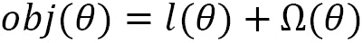

这里，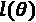 是损失函数，表示回归的**均方误差**（**MSE**），或分类的对数损失，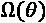 是正则化函数，一个用于防止过拟合的惩罚项。将正则化项作为目标函数的一部分使 XGBoost 与大多数树集成方法有所区别。

让我们通过考虑回归的均方误差（MSE）更详细地看一下目标函数。

### 损失函数

定义为回归的均方误差（MSE）的损失函数可以用求和符号表示，如下所示：

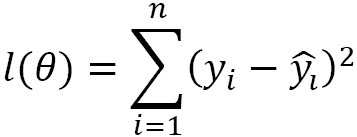

这里，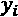 是第  行的目标值，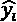 是机器学习模型为第  行预测的值。求和符号 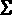 表示从 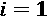 开始到 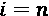 结束，所有行的求和。

对于给定的树，预测值 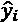 需要一个从树根开始，到叶子结束的函数。数学上可以表达为：

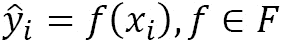

这里，*x*i 是一个向量，其条目为第  行的列，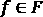 表示函数 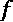 是 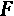 的成员，后者是所有可能的 CART 函数集合。**CART** 是 **分类与回归树**（**Classification And Regression Trees**）的缩写。CART 为所有叶子节点提供了一个实值，即使对于分类算法也是如此。

在梯度提升中，决定第  行预测的函数包括所有之前函数的和，如*第四章*《从梯度提升到 XGBoost》中所述。因此，可以写出以下公式：

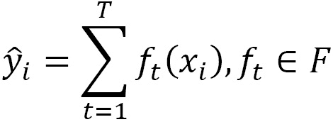

这里，*T* 是提升树的数量。换句话说，为了获得第  棵树的预测结果，需要将之前所有树的预测结果与新树的预测结果相加。符号 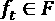 表明这些函数属于 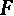，即所有可能的 CART 函数集合。

第 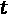 棵提升树的学习目标现在可以重写如下：

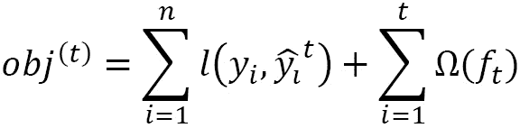

这里，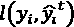 是第 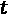 棵提升树的总损失函数，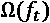 是正则化项。

由于提升树会将之前树的预测结果与新树的预测结果相加，因此必须满足 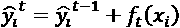。这就是加法训练的思想。

将此代入之前的学习目标，我们得到以下公式：

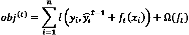

对于最小二乘回归情况，可以将其重写如下：

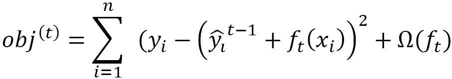

展开多项式后，我们得到以下公式：

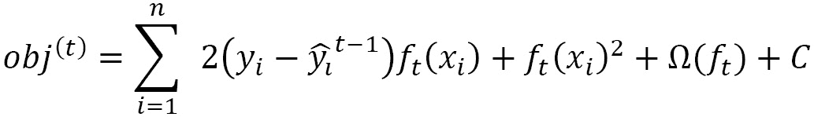

这里， 是一个常数项，不依赖于 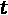。从多项式的角度来看，这是一个关于变量 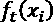 的二次方程。请记住，目标是找到一个最优值 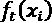，即最优函数，它将根节点（样本）映射到叶节点（预测值）。

任何足够光滑的函数，例如二次多项式（quadratic），都可以通过**泰勒多项式**来逼近。XGBoost 使用牛顿法与二次泰勒多项式来得到以下公式：

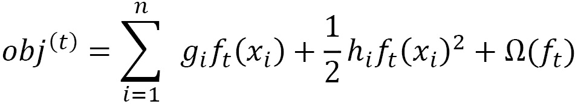

这里，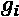 和 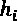 可以写作以下偏导数：

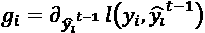

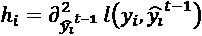

若要了解 XGBoost 如何使用 **泰勒展开**，请查阅 [`stats.stackexchange.com/questions/202858/xgboost-loss-function-approximation-with-taylor-expansion`](https://stats.stackexchange.com/questions/202858/xgboost-loss-function-approximation-with-taylor-expansion)。

XGBoost 通过使用仅需要 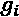 和  作为输入的求解器来实现这一学习目标函数。由于损失函数是通用的，相同的输入可以用于回归和分类。

这留下了正则化函数，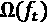。

### 正则化函数

设 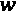 为叶子的向量空间。那么，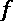，即将树根映射到叶子的函数，可以用  来重新表示，形式如下：

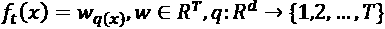

这里，*q* 是将数据点分配给叶子的函数，*T* 是叶子的数量。

经过实践和实验，XGBoost 确定了以下作为正则化函数，其中 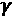 和 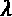 是用于减少过拟合的惩罚常数：

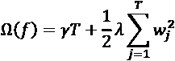

### 目标函数

将损失函数与正则化函数结合，学习目标函数变为以下形式：

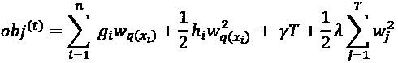

我们可以定义分配给 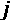 叶子的数据显示点的索引集，如下所示：

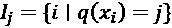

目标函数可以写成如下形式：

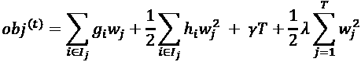

最后，通过设置 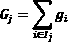 和 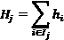，在重新排列索引并合并相似项后，我们得到目标函数的最终形式，即：

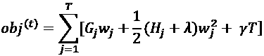

通过对目标函数求导并关于 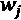 令左侧为零，我们得到如下结果：


这可以代回到目标函数中，得到以下结果：


这是 XGBoost 用来确定模型与数据拟合程度的结果。

恭喜你完成了一个漫长且具有挑战性的推导过程！

# 构建 XGBoost 模型

在前两部分中，你学习了 XGBoost 如何在底层工作，包括参数推导、正则化、速度增强以及新的特性，如 `missing` 参数用于补偿空值。

本书中，我们主要使用 scikit-learn 构建 XGBoost 模型。scikit-learn 的 XGBoost 封装器在 2019 年发布。在完全使用 scikit-learn 之前，构建 XGBoost 模型需要更陡峭的学习曲线。例如，必须将 NumPy 数组转换为 `dmatrices`，才能利用 XGBoost 框架。

然而，在 scikit-learn 中，这些转换是后台自动完成的。在 scikit-learn 中构建 XGBoost 模型与构建其他机器学习模型非常相似，正如你在本书中所经历的那样。所有标准的 scikit-learn 方法，如 `.fit` 和 `.predict` 都可以使用，此外还包括如 `train_test_split`、`cross_val_score`、`GridSearchCV` 和 `RandomizedSearchCV` 等重要工具。

在这一部分，你将开发用于构建 XGBoost 模型的模板。以后，这些模板可以作为构建 XGBoost 分类器和回归器的起点。

我们将为两个经典数据集构建模板：用于分类的 **Iris 数据集** 和用于回归的 **Diabetes 数据集**。这两个数据集都很小，内置于 scikit-learn，并且在机器学习社区中经常被测试。作为模型构建过程的一部分，你将显式定义默认的超参数，这些超参数使 XGBoost 模型得分优秀。这些超参数被显式定义，以便你了解它们是什么，并为将来调整它们做好准备。

## Iris 数据集

Iris 数据集，机器学习领域的一个重要数据集，由统计学家 Robert Fischer 于 1936 年引入。它易于访问、数据量小、数据干净，且具有对称的数值，这些特点使其成为测试分类算法的热门选择。

我们将通过使用 `datasets` 库中的 `load_iris()` 方法直接从 scikit-learn 下载 Iris 数据集，如下所示：

```py
import pandas as pd
import numpy as np
from sklearn import datasets
iris = datasets.load_iris()
```

Scikit-learn 数据集以 `pandas` DataFrame 的形式存储，后者更多用于数据分析和数据可视化。将 NumPy 数组视为 DataFrame 需要使用 `pandas` 的 `DataFrame` 方法。这个 scikit-learn 数据集在预先划分为预测列和目标列后，合并它们需要用 `np.c_` 来连接 NumPy 数组，然后再进行转换。列名也会被添加，如下所示：

```py
df = pd.DataFrame(data= np.c_[iris['data'], iris['target']],columns= iris['feature_names'] + ['target'])
```

你可以使用 `df.head()` 查看 DataFrame 的前五行：

```py
df.head()
```

结果 DataFrame 将如下所示：


图 5.1 – Iris 数据集

预测列的含义不言自明，分别衡量萼片和花瓣的长度与宽度。目标列根据 scikit-learn 文档， [`scikit-learn.org/stable/auto_examples/datasets/plot_iris_dataset.html`](https://scikit-learn.org/stable/auto_examples/datasets/plot_iris_dataset.html)，包含三种不同的鸢尾花：**setosa**、**versicolor** 和 **virginica**。数据集包含 150 行。

为了准备机器学习所需的数据，导入 `train_test_split`，然后相应地划分数据。你可以使用原始的 NumPy 数组 `iris['data']` 和 `iris['target']` 作为 `train_test_split` 的输入：

```py
from sklearn.model_selection import train_test_split
X_train, X_test, y_train, y_test = train_test_split(iris['data'], iris['target'], random_state=2)
```

现在我们已经划分了数据，接下来让我们构建分类模板。

### XGBoost 分类模板

以下模板用于构建 XGBoost 分类器，假设数据集已经分为 `X_train`、`X_test`、`y_train` 和 `y_test`：

1.  从 `xgboost` 库中导入 `XGBClassifier`：

    ```py
    from xgboost import XGBClassifier
    ```

1.  根据需要导入分类评分方法。

    虽然 `accuracy_score` 是标准评分方法，但其他评分方法，如 `auc`（**曲线下的面积**），将在后面讨论：

    ```py
    from sklearn.metrics import accuracy_score
    ```

1.  使用超参数初始化 XGBoost 分类器。

    超参数微调是 *第六章* 的重点，*XGBoost 超参数*。在本章中，最重要的默认超参数已明确列出：

    ```py
    xgb = XGBClassifier(booster='gbtree', objective='multi:softprob', max_depth=6, learning_rate=0.1, n_estimators=100, random_state=2, n_jobs=-1)
    ```

    前述超参数的简要描述如下：

    a) `booster='gbtree'`：`booster` 的 `'gbtree'` 代表梯度提升树，是 XGBoost 的默认基础学习器。尽管不常见，但也可以使用其他基础学习器，这是一种我们在 *第八章* 中使用的策略，*XGBoost 替代基础学习器*。

    b) `objective='multi:softprob'`：标准的目标选项可以在 XGBoost 官方文档中查看，[`xgboost.readthedocs.io/en/latest/parameter.html`](https://xgboost.readthedocs.io/en/latest/parameter.html)，在 *学习任务参数* 部分。`multi:softprob` 目标是当数据集包含多个类别时，作为 `binary:logistic` 的标准替代方案。它计算分类的概率，并选择最高的一个。如果没有明确指定，XGBoost 通常会为你找到合适的目标。

    c) `max_depth=6`：树的 `max_depth` 决定了每棵树的分支数量。它是做出平衡预测时最重要的超参数之一。XGBoost 默认值为 `6`，不同于随机森林，后者不会提供值，除非明确编程。

    d) `learning_rate=0.1`：在 XGBoost 中，这个超参数通常被称为 `eta`。该超参数通过减少每棵树的权重来限制方差，达到给定的百分比。`learning_rate` 超参数在 *第四章* 中进行了详细探讨，*从梯度提升到 XGBoost*。

    e) `n_estimators=100`：在集成方法中非常流行，`n_estimators` 是模型中的提升树数量。增加这个数量并降低 `learning_rate` 可以得到更稳健的结果。

1.  将分类器拟合到数据上。

    这就是魔法发生的地方。整个 XGBoost 系统，包括前两节中探讨的细节，最佳参数选择，包括正则化约束，以及速度增强，例如近似分裂查找算法，以及阻塞和分片，都会在这行强大的 scikit-learn 代码中发生：

    ```py
    xgb.fit(X_train, y_train)
    ```

1.  将 *y* 值预测为 `y_pred`：

    ```py
    y_pred = xgb.predict(X_test)
    ```

1.  通过将 `y_pred` 与 `y_test` 进行比较来对模型进行评分：

    ```py
    score = accuracy_score(y_pred, y_test)
    ```

1.  显示你的结果：

    ```py
    print('Score: ' + str(score))
    Score: 0.9736842105263158
    ```

不幸的是，Iris 数据集没有官方的得分列表，得分太多无法在一个地方汇总。使用默认超参数，在 Iris 数据集上的初始得分为 `97.4` 百分比，非常不错（参见 [`www.kaggle.com/c/serpro-iris/leaderboard`](https://www.kaggle.com/c/serpro-iris/leaderboard)）。

前面段落中提供的 XGBoost 分类器模板并非最终版本，而是未来构建模型的起点。

## 糖尿病数据集

现在你已经熟悉了 scikit-learn 和 XGBoost，你正逐步培养起快速构建和评分 XGBoost 模型的能力。在本节中，提供了一个使用 `cross_val_score` 的 XGBoost 回归器模板，并应用于 scikit-learn 的糖尿病数据集。

在构建模板之前，请导入预测列为 `X`，目标列为 `y`，如下所示：

```py
X,y = datasets.load_diabetes(return_X_y=True)
```

现在我们已导入预测列和目标列，让我们开始构建模板。

### XGBoost 回归器模板（交叉验证）

以下是在 scikit-learn 中使用交叉验证构建 XGBoost 回归模型的基本步骤，假设已定义预测列 `X` 和目标列 `y`：

1.  导入 `XGBRegressor` 和 `cross_val_score`：

    ```py
    from sklearn.model_selection import cross_val_score
    from xgboost import XGBRegressor
    ```

1.  初始化 `XGBRegressor`。

    在这里，我们初始化 `XGBRegressor`，并设置 `objective='reg:squarederror'`，即均方误差（MSE）。最重要的超参数默认值已明确给出：

    ```py
    xgb = XGBRegressor(booster='gbtree', objective='reg:squarederror', max_depth=6, learning_rate=0.1, n_estimators=100, random_state=2, n_jobs=-1)
    ```

1.  使用 `cross_val_score` 进行回归器的拟合和评分。

    使用 `cross_val_score`，拟合和评分在一个步骤中完成，输入包括模型、预测列、目标列和评分：

    ```py
    scores = cross_val_score(xgb, X, y, scoring='neg_mean_squared_error', cv=5)
    ```

1.  显示结果。

    回归得分通常以**均方根误差** (**RMSE**) 展示，以保持单位一致：

    ```py
    rmse = np.sqrt(-scores)
    print('RMSE:', np.round(rmse, 3))
    print('RMSE mean: %0.3f' % (rmse.mean()))
    ```

    结果如下：

    ```py
    RMSE: [63.033 59.689 64.538 63.699 64.661]
    RMSE mean: 63.124
    ```

没有比较基准，我们无法理解该得分的意义。将目标列 `y` 转换为 `pandas` DataFrame 并使用 `.describe()` 方法将显示预测列的四分位数和一般统计数据，如下所示：

```py
pd.DataFrame(y).describe()
```

这是预期的输出：


图 5.2 – 描述 y，糖尿病目标列的统计数据

得分为 `63.124` 小于 1 个标准差，这是一个可敬的结果。

现在你拥有了可以用于构建模型的 XGBoost 分类器和回归器模板。

现在你已经习惯在 scikit-learn 中构建 XGBoost 模型，是时候深入探索高能物理学了。

# 寻找希格斯玻色子 – 案例研究

在本节中，我们将回顾希格斯玻色子 Kaggle 竞赛，该竞赛使 XGBoost 成为机器学习的焦点。为了铺垫背景，在进入模型开发之前，首先提供历史背景。我们构建的模型包括当时 XGBoost 提供的默认模型和 Gabor Melis 提供的获胜解决方案的参考。本节内容无需 Kaggle 账户，因此我们不会花时间展示如何提交结果。如果你感兴趣，我们已提供了相关指南。

## 物理背景

在大众文化中，希格斯玻色子被称为*上帝粒子*。该粒子由彼得·希格斯在 1964 年提出，用于解释为什么粒子具有质量。

寻找希格斯玻色子的过程最终在 2012 年通过**大型强子对撞机**在瑞士日内瓦的 CERN 发现达到了高潮。诺贝尔奖颁发了，物理学的标准模型，即解释所有已知物理力（除了重力之外）的模型，变得比以往任何时候都更加重要。

希格斯玻色子是通过以极高速度碰撞质子并观察结果来发现的。观测数据来自**ATLAS**探测器，该探测器记录了*每秒数亿次质子-质子碰撞*所产生的数据，具体内容可以参考竞赛的技术文档《Learning to discover: the Higgs boson machine learning challenge》，[`higgsml.lal.in2p3.fr/files/2014/04/documentation_v1.8.pdf`](https://higgsml.lal.in2p3.fr/files/2014/04/documentation_v1.8.pdf)。

在发现希格斯玻色子后，下一步是精确测量其衰变特性。ATLAS 实验通过从背景噪声中提取的数据发现希格斯玻色子衰变成两个**tau**粒子。为了更好地理解数据，ATLAS 寻求了机器学习社区的帮助。

## Kaggle 竞赛

Kaggle 竞赛是一种旨在解决特定问题的机器学习竞赛。机器学习竞赛在 2006 年变得有名，当时 Netflix 提供了 100 万美元奖励给任何能够改进其电影推荐系统 10%的人。2009 年，100 万美元奖金被颁发给了*BellKor*的*Pragmatic Chaos*团队 ([`www.wired.com/2009/09/bellkors-pragmatic-chaos-wins-1-million-netflix-prize/`](https://www.wired.com/2009/09/bellkors-pragmatic-chaos-wins-1-million-netflix-prize/))。

许多企业、计算机科学家、数学家和学生开始意识到机器学习在社会中的日益重要性。机器学习竞赛逐渐火热，企业主和机器学习从业者都从中获得了互利的好处。从 2010 年开始，许多早期采用者前往 Kaggle 参与机器学习竞赛。

2014 年，Kaggle 宣布了*希格斯玻色子机器学习挑战赛*与 ATLAS 合作（[`www.kaggle.com/c/higgs-boson`](https://www.kaggle.com/c/higgs-boson)）。比赛奖金池为 13,000 美元，共有 1,875 支队伍参加了比赛。

在 Kaggle 比赛中，提供了训练数据以及所需的评分方法。团队在训练数据上构建机器学习模型，然后提交结果。测试数据的目标列不会提供。然而，允许多次提交，参赛者可以在最终日期之前不断优化自己的模型。

Kaggle 比赛是测试机器学习算法的沃土。与工业界不同，Kaggle 比赛吸引了成千上万的参赛者，这使得获奖的机器学习模型经过了非常充分的测试。

## XGBoost 与希格斯挑战

XGBoost 于 2014 年 3 月 27 日公开发布，早于希格斯挑战赛 6 个月。在比赛中，XGBoost 大放异彩，帮助参赛者在 Kaggle 排行榜上攀升，同时节省了宝贵的时间。

让我们访问数据，看看参赛者们在使用什么数据。

## 数据

我们将使用源自 CERN 开放数据门户的原始数据，而不是 Kaggle 提供的数据：[`opendata.cern.ch/record/328`](http://opendata.cern.ch/record/328)。CERN 数据与 Kaggle 数据的区别在于，CERN 数据集要大得多。我们将选择前 250,000 行，并进行一些修改以匹配 Kaggle 数据。

你可以直接从[`github.com/PacktPublishing/Hands-On-Gradient-Boosting-with-XGBoost-and-Scikit-learn/tree/master/Chapter05`](https://github.com/PacktPublishing/Hands-On-Gradient-Boosting-with-XGBoost-and-Scikit-learn/tree/master/Chapter05)下载 CERN 希格斯玻色子数据集。

将`atlas-higgs-challenge-2014-v2.csv.gz`文件读取到`pandas`数据框中。请注意，我们仅选择前 250,000 行，并且使用`compression=gzip`参数，因为数据集是以`csv.gz`文件形式压缩的。读取数据后，查看前五行，如下所示：

```py
df = pd.read_csv('atlas-higgs-challenge-2014-v2.csv.gz', nrows=250000, compression='gzip')
df.head()
```

输出的最右边几列应与以下截图所示相同：


图 5.3 – CERN 希格斯玻色子数据 – 包含 Kaggle 列

请注意`Kaggleset`和`KaggleWeight`列。由于 Kaggle 数据集较小，Kaggle 在其权重列中使用了不同的数字，该列在前面的图中表示为`KaggleWeight`。`Kaggleset`下的`t`值表示它是 Kaggle 数据集的训练集的一部分。换句话说，这两列，`Kaggleset`和`KaggleWeight`，是 CERN 数据集中的列，用于包含将被用于 Kaggle 数据集的信息。在本章中，我们将限制 CERN 数据的子集为 Kaggle 训练集。

为了匹配 Kaggle 训练数据，我们将删除`Kaggleset`和`Weight`列，将`KaggleWeight`转换为`'Weight'`，并将`'Label'`列移到最后一列，如下所示：

```py
del df[‹Weight›]
del df[‹KaggleSet›]
df = df.rename(columns={«KaggleWeight»: «Weight»})
```

一种移动`Label`列的方法是将其存储为一个变量，删除该列，然后通过将其分配给新变量来添加新列。每当将新列分配给 DataFrame 时，新列会出现在末尾：

```py
label_col = df['Label']
del df['Label']
df['Label'] = label_col
```

现在所有更改已经完成，CERN 数据与 Kaggle 数据一致。接下来，查看前五行数据：

```py
df.head()
```

这是期望输出的左侧部分：


图 5.4 – CERN 希格斯玻色子数据 – 物理列

许多列没有显示，并且出现了`-999.00`这一不寻常的值。

`EventId`之后的列包含以`PRI`为前缀的变量，`PRI`代表*原始值*，即在碰撞过程中由探测器直接测量的值。相比之下，标记为`DER`的列是从这些测量值中得出的数值推导。

所有列名和类型可以通过`df.info()`查看：

```py
df.info()
```

这是输出的一个示例，中间的列已被截断以节省空间：

```py
<class 'pandas.core.frame.DataFrame'>
RangeIndex: 250000 entries, 0 to 249999
Data columns (total 33 columns):
 #   Column                       Non-Null Count   Dtype  
---  ------                       --------------   -----  
 0   EventId                      250000 non-null  int64  
 1   DER_mass_MMC                 250000 non-null  float64
 2   DER_mass_transverse_met_lep  250000 non-null  float64
 3   DER_mass_vis                 250000 non-null  float64
 4   DER_pt_h                     250000 non-null  float64
…
 28  PRI_jet_subleading_eta       250000 non-null  float64
 29  PRI_jet_subleading_phi       250000 non-null  float64
 30  PRI_jet_all_pt               250000 non-null  float64
 31  Weight                       250000 non-null  float64
 32  Label                        250000 non-null  object  
dtypes: float64(30), int64(3)
memory usage: 62.9 MB
```

所有列都有非空值，只有最后一列`Label`是非数字类型。列可以按如下方式分组：

+   列 `0`：`EventId` – 对于机器学习模型无关。

+   列 `1-30`：来自 LHC 碰撞的物理列。这些列的详细信息可以在[`higgsml.lal.in2p3.fr/documentation`](http://higgsml.lal.in2p3.fr/documentation)中的技术文档链接中找到。这些是机器学习的预测列。

+   列 `31`：`Weight` – 该列用于对数据进行缩放。问题在于希格斯玻色子事件非常稀有，因此一个 99.9%准确率的机器学习模型可能无法找到它们。权重弥补了这一不平衡，但测试数据中没有权重。处理权重的策略将在本章后续部分讨论，并在*第七章*中讨论，*使用 XGBoost 发现外星行星*。

+   列 `32`：`Label` – 这是目标列，标记为`s`表示信号，`b`表示背景。训练数据是从实际数据模拟而来，因此信号比实际情况下更多。信号是指希格斯玻色子衰变的发生。

数据的唯一问题是目标列`Label`不是数字类型。通过将`s`值替换为`1`，将`b`值替换为`0`，将`Label`列转换为数字列，如下所示：

```py
df['Label'].replace(('s', 'b'), (1, 0), inplace=True)
```

现在所有列都变为数字类型并且没有空值，你可以将数据拆分为预测列和目标列。回顾一下，预测列的索引是 1–30，目标列是最后一列，索引为`32`（或 -1）。注意，`Weight`列不应包含在内，因为测试数据中没有该列：

```py
X = df.iloc[:,1:31]
y = df.iloc[:,-1]
```

## 打分

Higgs 挑战不是普通的 Kaggle 竞赛。除了理解高能物理以进行特征工程（这不是我们将要追求的路径）的难度外，评分方法也不是标准的。Higgs 挑战要求优化 **近似中位数显著性** (**AMS**)。

AMS 的定义如下：


这里， 是真阳性率， 是假阳性率，而  是一个常数正则化项，其值为 `10`。

幸运的是，XGBoost 为比赛提供了一种 AMS 评分方法，因此不需要正式定义。高 AMS 的结果来自许多真阳性和很少的假阴性。关于为何选择 AMS 而不是其他评分方法的理由在技术文档中说明，地址为 [`higgsml.lal.in2p3.fr/documentation`](http://higgsml.lal.in2p3.fr/documentation)。

提示

可以构建自己的评分方法，但通常不需要。在极少数需要构建自定义评分方法的情况下，你可以查看 [`scikit-learn.org/stable/modules/model_evaluation.html`](https://scikit-learn.org/stable/modules/model_evaluation.html) 获取更多信息。

## 权重

在构建 Higgs 玻色子的机器学习模型之前，了解并利用权重非常重要。

在机器学习中，权重可以用来提高不平衡数据集的准确性。考虑 Higgs 挑战中的 `s`（信号）和 `b`（背景）列。实际上，`s` << `b`，所以信号在背景噪声中非常稀少。例如，信号比背景噪声少 1,000 倍。你可以创建一个权重列，其中 `b` = 1，`s` = 1/1000 以补偿这种不平衡。

根据比赛的技术文档，权重列定义为 `s`（信号）事件。

首先应将权重按比例缩放以匹配测试数据，因为测试数据提供了测试集生成的信号和背景事件的预期数量。测试数据有 550,000 行，比训练数据提供的 250,000 行（`len(y)`）多两倍以上。将权重按比例缩放以匹配测试数据可以通过将权重列乘以增加百分比来实现，如下所示：

```py
df['test_Weight'] = df['Weight'] * 550000 / len(y)
```

接下来，XGBoost 提供了一个超参数 `scale_pos_weight`，它考虑了缩放因子。缩放因子是背景噪声权重之和除以信号权重之和。可以使用 `pandas` 的条件符号来计算缩放因子，如下所示：

```py
s = np.sum(df[df['Label']==1]['test_Weight'])
b = np.sum(df[df['Label']==0]['test_Weight'])
```

在上述代码中，`df[df['Label']==1]` 缩小了 DataFrame 到 `Label` 列等于 `1` 的行，然后 `np.sum` 使用 `test_Weight` 列的值加总这些行的值。

最后，要查看实际比率，将 `b` 除以 `s`：

```py
b/s
593.9401931492318
```

总结来说，权重代表数据生成的预期信号和背景事件的数量。我们将权重缩放以匹配测试数据的大小，然后将背景权重之和除以信号权重之和，以建立 `scale_pos_weight=b/s` 超参数。

提示

要了解有关权重的更多详细讨论，请查看 KDnuggets 提供的精彩介绍：[`www.kdnuggets.com/2019/11/machine-learning-what-why-how-weighting.html`](https://www.kdnuggets.com/2019/11/machine-learning-what-why-how-weighting.html)。

## 模型

现在是时候构建一个 XGBoost 模型来预测信号——即模拟的希格斯玻色子衰变事件。

在比赛开始时，XGBoost 是一种新工具，且 scikit-learn 的封装还没有发布。即便到了今天（2020 年），关于在 Python 中实现 XGBoost 的大多数信息仍然是在 scikit-learn 发布之前的版本。由于你可能会在线遇到 pre-scikit-learn 版本的 XGBoost Python API，而且这正是所有参与者在 Higgs Challenge 中使用的版本，因此本章只展示了使用原始 Python API 的代码。

以下是为 Higgs Challenge 构建 XGBoost 模型的步骤：

1.  导入 `xgboost` 为 `xgb`：

    ```py
    import xgboost as xgb
    ```

1.  初始化 XGBoost 模型时，将 `-999.0` 设置为未知值。在 XGBoost 中，未知值可以通过 `missing` 超参数来设置，而不是将这些值转换为中位数、均值、众数或其他空值替代。在模型构建阶段，XGBoost 会自动选择最佳的拆分值。

1.  `weight` 超参数可以等于新列 `df['test_Weight']`，如 `weight` 部分所定义：

    ```py
    xgb_clf = xgb.DMatrix(X, y, missing=-999.0, weight=df['test_Weight'])
    ```

1.  设置其他超参数。

    以下超参数是 XGBoost 为竞赛提供的默认值：

    a) 初始化一个名为 `param` 的空字典：

    ```py
    param = {}
    ```

    b) 将目标定义为 `'binary:logitraw'`。

    这意味着一个二分类模型将从逻辑回归概率中创建。这个目标将模型定义为分类器，并允许对目标列进行排序，这是此特定 Kaggle 比赛提交所要求的：

    ```py
    param['objective'] = 'binary:logitraw'
    ```

    c) 使用背景权重除以信号权重对正样本进行缩放。这有助于模型在测试集上表现得更好：

    ```py
    param['scale_pos_weight'] = b/s
    ```

    d) 学习率 `eta` 设置为 `0.1`：

    ```py
    param['eta'] = 0.1
    ```

    e) `max_depth` 设置为 `6`：

    ```py
    param['max_depth'] = 6
    ```

    f) 将评分方法设置为 `'auc'`，以便显示：

    ```py
    param['eval_metric'] = 'auc'
    ```

    虽然会打印 AMS 分数，但评估指标设置为 `auc`，即 `auc` 是描述真正例与假正例的曲线，当其值为 `1` 时是完美的。与准确率类似，`auc` 是分类问题的标准评分指标，尽管它通常优于准确率，因为准确率对于不平衡数据集来说有局限性，正如在*第七章*《使用 XGBoost 发现系外行星》中所讨论的那样，*难以遗忘*。

1.  创建一个参数列表，包含前面提到的内容，并加上评估指标（`auc`）和`ams@0.15`，XGBoost 实现的使用 15%阈值的 AMS 分数：

    ```py
    plst = list(param.items())+[('eval_metric', 'ams@0.15')]
    ```

1.  创建一个观察列表，包含初始化的分类器和`'train'`，这样你就可以在树继续提升的过程中查看分数：

    ```py
    watchlist = [ (xg_clf, 'train') ]
    ```

1.  将提升轮次设置为`120`：

    ```py
    num_round = 120
    ```

1.  训练并保存模型。通过将参数列表、分类器、轮次和观察列表作为输入来训练模型。使用`save_model`方法保存模型，这样你就不必再经过耗时的训练过程。然后，运行代码并观察随着树的提升，分数如何提高：

    ```py
    print ('loading data end, start to boost trees')
    bst = xgb.train( plst, xgmat, num_round, watchlist )
    bst.save_model('higgs.model')
    print ('finish training')
    ```

    你的结果应该包括以下输出：

    ```py
    [110]	train-auc:0.94505	train-ams@0.15:5.84830
    [111]	train-auc:0.94507	train-ams@0.15:5.85186
    [112]	train-auc:0.94519	train-ams@0.15:5.84451
    [113]	train-auc:0.94523	train-ams@0.15:5.84007
    [114]	train-auc:0.94532	train-ams@0.15:5.85800
    [115]	train-auc:0.94536	train-ams@0.15:5.86228
    [116]	train-auc:0.94550	train-ams@0.15:5.91160
    [117]	train-auc:0.94554	train-ams@0.15:5.91842
    [118]	train-auc:0.94565	train-ams@0.15:5.93729
    [119]	train-auc:0.94580	train-ams@0.15:5.93562
    finish training
    ```

恭喜你构建了一个能够预测希格斯玻色子衰变的 XGBoost 分类器！

该模型的`auc`为`94.58`百分比，AMS 为`5.9`。就 AMS 而言，竞赛的最高值在三分之三的上方。该模型在提交测试数据时，AMS 大约为`3.6`。

你刚刚构建的模型是由 Tanqi Chen 为 XGBoost 用户在竞赛期间提供的基准模型。竞赛的获胜者，Gabor Melis，使用这个基准模型来构建他的模型。从查看获胜解决方案[`github.com/melisgl/higgsml`](https://github.com/melisgl/higgsml)并点击**xgboost-scripts**可以看出，对基准模型所做的修改并不显著。Melis 和大多数 Kaggle 参赛者一样，也进行了特征工程，向数据中添加了更多相关列，这是我们将在*第九章*中讨论的内容，*XGBoost Kaggle 大师*。

在截止日期之后，你是可以自己构建和训练模型，并通过 Kaggle 提交的。对于 Kaggle 竞赛，提交必须经过排名、正确索引，并且必须使用 Kaggle API 主题进行进一步说明。如果你希望提交实际竞赛的模型，XGBoost 排名代码对你可能有所帮助，可以在[`github.com/dmlc/xgboost/blob/master/demo/kaggle-higgs/higgs-pred.py`](https://github.com/dmlc/xgboost/blob/master/demo/kaggle-higgs/higgs-pred.py)找到。

# 总结

在这一章中，你学习了 XGBoost 是如何通过处理缺失值、稀疏矩阵、并行计算、分片和块等技术，来提高梯度提升的准确性和速度。你学习了 XGBoost 目标函数背后的数学推导，该函数决定了梯度下降和正则化的参数。你使用经典的 scikit-learn 数据集构建了`XGBClassifier`和`XGBRegressor`模板，获得了非常好的分数。最后，你构建了 XGBoost 为希格斯挑战提供的基准模型，这个模型最终引领了获胜解决方案，并将 XGBoost 推到了聚光灯下。

既然你已经对 XGBoost 的整体叙述、设计、参数选择和模型构建模板有了扎实的理解，在下一章中，你将微调 XGBoost 的超参数，以达到最佳评分。
