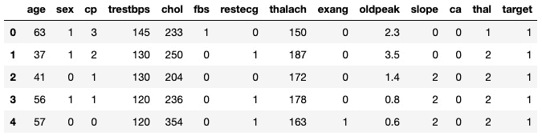
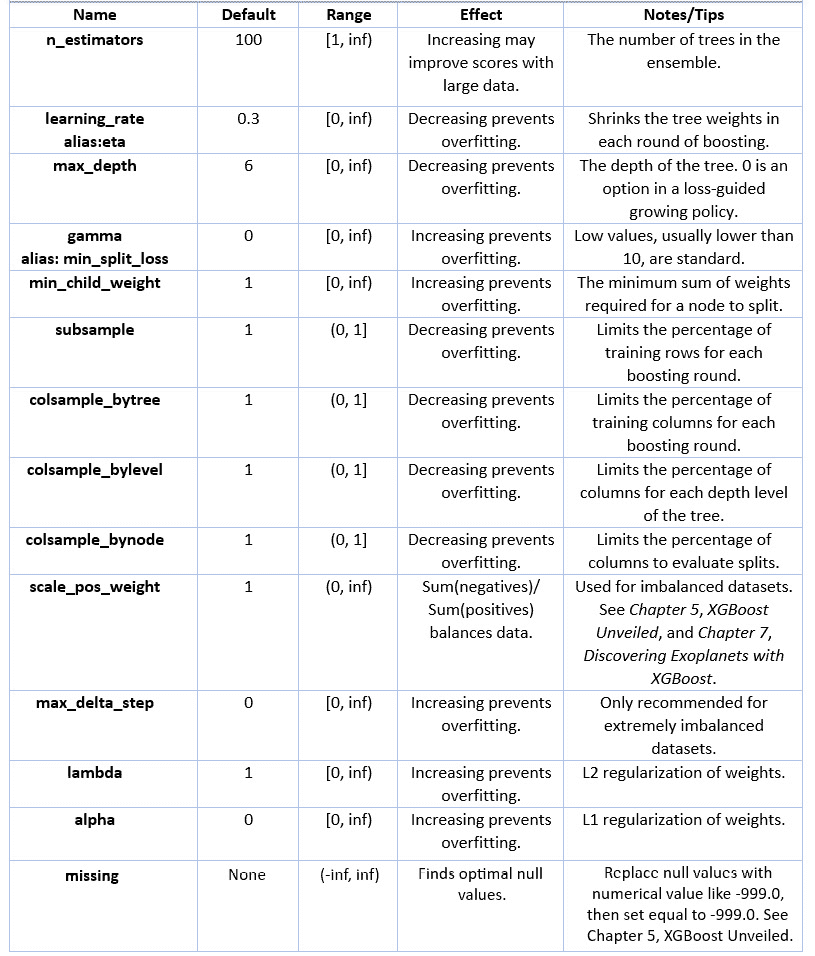

# 第六章：*第六章*：XGBoost 超参数

XGBoost 有许多超参数。XGBoost 的基础学习器超参数包含所有决策树的超参数作为起点。由于 XGBoost 是梯度提升的增强版，因此也有梯度提升的超参数。XGBoost 特有的超参数旨在提升准确性和速度。然而，一次性尝试解决所有 XGBoost 超参数可能会让人感到头晕。

在*第二章*中，*决策树深入剖析*，我们回顾并应用了基础学习器超参数，如`max_depth`，而在*第四章*中，*从梯度提升到 XGBoost*，我们应用了重要的 XGBoost 超参数，包括`n_estimators`和`learning_rate`。我们将在本章中再次回顾这些超参数，并介绍一些新的 XGBoost 超参数，如`gamma`，以及一种叫做**早停法**的技术。

在本章中，为了提高 XGBoost 超参数微调的熟练度，我们将讨论以下主要主题：

+   准备数据和基础模型

+   调整核心 XGBoost 超参数

+   应用早停法

+   将所有内容整合在一起

# 技术要求

本章的代码可以在[`github.com/PacktPublishing/Hands-On-Gradient-Boosting-with-XGBoost-and-Scikit-learn/tree/master/Chapter06`](https://github.com/PacktPublishing/Hands-On-Gradient-Boosting-with-XGBoost-and-Scikit-learn/tree/master/Chapter06)找到。

# 准备数据和基础模型

在介绍和应用 XGBoost 超参数之前，让我们做好以下准备：

+   获取**心脏病数据集**

+   构建`XGBClassifier`模型

+   实现`StratifiedKFold`

+   对**基准 XGBoost 模型**进行评分

+   将`GridSearchCV`与`RandomizedSearchCV`结合，形成一个强大的函数

良好的准备对于在微调超参数时获得准确性、一致性和速度至关重要。

## 心脏病数据集

本章使用的数据集是最初在*第二章*中提出的心脏病数据集，*决策树深入剖析*。我们选择相同的数据集，以最大化超参数微调的时间，并最小化数据分析的时间。让我们开始这个过程：

1.  访问[`github.com/PacktPublishing/Hands-On-Gradient-Boosting-with-XGBoost-and-Scikit-learn/tree/master/Chapter06`](https://github.com/PacktPublishing/Hands-On-Gradient-Boosting-with-XGBoost-and-Scikit-learn/tree/master/Chapter06)，加载`heart_disease.csv`到 DataFrame 中，并显示前五行。以下是代码：

    ```py
    import pandas as pd
    df = pd.read_csv('heart_disease.csv')
    df.head()
    ```

    结果应如下所示：

    

    图 6.1 - 前五行数据

    最后一列，**target**，是目标列，**1**表示存在，表示患者患有心脏病，**2**表示不存在。有关其他列的详细信息，请访问[`archive.ics.uci.edu/ml/datasets/Heart+Disease`](https://archive.ics.uci.edu/ml/datasets/Heart+Disease)上的 UCI 机器学习库，或参见*第二章*《决策树深入剖析》。

1.  现在，检查`df.info()`以确保数据全部为数值型且没有空值：

    ```py
    df.info()
    ```

    这是输出结果：

    ```py
    <class 'pandas.core.frame.DataFrame'>
    RangeIndex: 303 entries, 0 to 302
    Data columns (total 14 columns):
     #   Column    Non-Null Count  Dtype  
    ---  ------    --------------  -----  
     0   age       303 non-null    int64  
     1   sex       303 non-null    int64  
     2   cp        303 non-null    int64  
     3   trestbps  303 non-null    int64  
     4   chol      303 non-null    int64  
     5   fbs       303 non-null    int64  
     6   restecg   303 non-null    int64  
     7   thalach   303 non-null    int64  
     8   exang     303 non-null    int64  
     9   oldpeak   303 non-null    float64
     10  slope     303 non-null    int64  
     11  ca        303 non-null    int64  
     12  thal      303 non-null    int64  
     13  target    303 non-null    int64  
    dtypes: float64(1), int64(13)
    memory usage: 33.3 KB
    ```

由于所有数据点都是非空且数值型的，数据已经准备好用于机器学习。现在是时候构建一个分类器了。

## XGBClassifier

在调整超参数之前，我们先构建一个分类器，以便获得一个基准评分作为起点。

构建 XGBoost 分类器的步骤如下：

1.  从各自的库中下载`XGBClassifier`和`accuracy_score`。代码如下：

    ```py
    from xgboost import XGBClassifier
    from sklearn.metrics import accuracy_score
    ```

1.  声明`X`为预测列，`y`为目标列，其中最后一行是目标列：

    ```py
    X = df.iloc[:, :-1]
    y = df.iloc[:, -1]
    ```

1.  使用`booster='gbtree'`和`objective='binary:logistic'`的默认设置初始化`XGBClassifier`，并将`random_state=2`：

    ```py
    model = XGBClassifier(booster='gbtree', objective='binary:logistic', random_state=2)
    ```

    `'gbtree'`提升器，即基本学习器，是一个梯度提升树。`'binary:logistic'`目标是二分类中常用的标准目标，用于确定损失函数。虽然`XGBClassifier`默认包含这些值，但我们在此明确指出，以便熟悉这些设置，并为后续章节的修改做准备。

1.  为了评估基准模型，导入`cross_val_score`和`numpy`，以便进行拟合、评分并显示结果：

    ```py
    from sklearn.model_selection import cross_val_score
    import numpy as np
    scores = cross_val_score(model, X, y, cv=5)
    print('Accuracy:', np.round(scores, 2))
    print('Accuracy mean: %0.2f' % (scores.mean()))
    ```

    准确率如下：

    ```py
    Accuracy: [0.85 0.85 0.77 0.78 0.77]
    Accuracy mean: 0.81
    ```

81%的准确率是一个非常好的起点，远高于在*第二章*《决策树深入剖析》中，`DecisionTreeClassifier`通过交叉验证获得的 76%。

我们在这里使用了`cross_val_score`，并将使用`GridSearchCV`来调整超参数。接下来，让我们找到一种方法，确保使用`StratifiedKFold`时测试折叠保持一致。

## StratifiedKFold

在调整超参数时，`GridSearchCV`和`RandomizedSearchCV`是标准选项。来自*第二章*《决策树深入剖析》中的一个问题是，`cross_val_score`和`GridSearchCV`/`RandomizedSearchCV`在划分数据时方式不同。

一种解决方案是在使用交叉验证时使用`StratifiedKFold`。

分层折叠法在每一折中都包含相同百分比的目标值。如果数据集中目标列中包含 60%的 1 和 40%的 0，则每个分层测试集都包含 60%的 1 和 40%的 0。当折叠是随机的时，可能会出现一个测试集包含 70%-30%的划分，而另一个测试集包含 50%-50%的目标值划分。

提示

使用`train_test_split`时，shuffle 和 stratify 参数使用默认设置，以帮助你对数据进行分层抽样。有关一般信息，请参见[`scikit-learn.org/stable/modules/generated/sklearn.model_selection.train_test_split.html`](https://scikit-learn.org/stable/modules/generated/sklearn.model_selection.train_test_split.html)。

使用`StratifiedKFold`时，执行以下操作：

1.  从`sklearn.model_selection`中实现`StratifiedKFold`：

    ```py
    from sklearn.model_selection import StratifiedKFold
    ```

1.  接下来，通过选择`n_splits=5`、`shuffle=True`和`random_state=2`作为`StratifiedKFold`的参数来定义折叠数为`kfold`。请注意，`random_state`提供一致的索引排序，而`shuffle=True`允许初始时对行进行随机排序：

    ```py
    kfold = StratifiedKFold(n_splits=5, shuffle=True, random_state=2)
    ```

    现在可以在`cross_val_score`、`GridSearchCV`和`RandomizedSearchCV`中使用`kfold`变量，以确保结果的一致性。

现在，让我们回到`cross_val_score`，使用`kfold`，这样我们就有了一个适当的基准进行比较。

## 基准模型

现在我们有了一种获取一致折叠的方法，是时候在`cross_val_score`中使用`cv=kfold`来评分一个正式的基准模型。代码如下：

```py
scores = cross_val_score(model, X, y, cv=kfold)
print('Accuracy:', np.round(scores, 2))
print('Accuracy mean: %0.2f' % (scores.mean()))
```

准确率如下：

```py
Accuracy: [0.72 0.82 0.75 0.8 0.82]
Accuracy mean: 0.78
```

分数下降了。这意味着什么？

重要的是不要过于执着于获得最高的评分。在这种情况下，我们在不同的折叠上训练了相同的`XGBClassifier`模型，并获得了不同的分数。这显示了在训练模型时，保持测试折叠的一致性的重要性，也说明了为什么分数不一定是最重要的。虽然在选择模型时，获得最好的评分是一个最佳策略，但这里的分数差异表明模型并不一定更好。在这种情况下，两个模型的超参数相同，分数差异归因于不同的折叠。

这里的关键是，当使用`GridSearchCV`和`RandomizedSearchCV`微调超参数时，使用相同的折叠来获得新的分数，以确保分数的比较是公平的。

## 结合`GridSearchCV`和`RandomizedSearchCV`

`GridSearchCV`在超参数网格中搜索所有可能的组合以找到最佳结果。`RandomizedSearchCV`默认选择 10 个随机超参数组合。通常，当`GridSearchCV`变得繁琐，无法逐一检查所有超参数组合时，`RandomizedSearchCV`就会被使用。

我们将`GridSearchCV`和`RandomizedSearchCV`合并成一个精简的函数，而不是为它们写两个单独的函数，步骤如下：

1.  从`sklearn.model_selection`导入`GridSearchCV`和`RandomizedSearchCV`：

    ```py
    from sklearn.model_selection import GridSearchCV, RandomizedSearchCV
    ```

1.  定义一个`grid_search`函数，以`params`字典作为输入，`random=False`：

    ```py
    def grid_search(params, random=False): 
    ```

1.  使用标准默认值初始化 XGBoost 分类器：

    ```py
    xgb = XGBClassifier(booster='gbtree', objective='binary:logistic', random_state=2)
    ```

1.  如果`random=True`，则用`xgb`和`params`字典初始化`RandomizedSearchCV`。设置`n_iter=20`，以允许 20 个随机组合，而不是 10 个。否则，用相同的输入初始化`GridSearchCV`。确保设置`cv=kfold`以确保结果的一致性：

    ```py
        if random:
            grid = RandomizedSearchCV(xgb, params, cv=kfold, n_iter=20, n_jobs=-1)
        else:
            grid = GridSearchCV(xgb, params, cv=kfold, n_jobs=-1)
    ```

1.  将`X`和`y`拟合到`grid`模型：

    ```py
    grid.fit(X, y)
    ```

1.  获取并打印`best_params_`：

    ```py
    best_params = grid.best_params_
    print("Best params:", best_params)
    ```

1.  获取并打印`best_score_`：

    ```py
    best_score = grid.best_score_
    print("Training score: {:.3f}".format(best_score))
    ```

现在可以使用`grid_search`函数来微调所有超参数。

# 调整 XGBoost 超参数

XGBoost 有许多超参数，其中一些在前几章已经介绍。下表总结了关键的 XGBoost 超参数，我们在本书中大部分进行了讨论。

注意

此处展示的 XGBoost 超参数并非详尽无遗，而是力求全面。要查看完整的超参数列表，请阅读官方文档中的*XGBoost 参数*，[`xgboost.readthedocs.io/en/latest/parameter.html`](https://xgboost.readthedocs.io/en/latest/parameter.html)。

紧随表格后，提供了进一步的解释和示例：



图 6.2 – XGBoost 超参数表

既然已经展示了关键的 XGBoost 超参数，让我们逐一调优它们，进一步了解它们的作用。

## 应用 XGBoost 超参数

本节中展示的 XGBoost 超参数通常由机器学习从业者进行微调。每个超参数简要解释后，我们将使用前面定义的`grid_search`函数测试标准的变动。

## n_estimators

回顾一下，`n_estimators`表示集成中树的数量。在 XGBoost 中，`n_estimators`是训练残差的树的数量。

使用默认的`100`初始化`n_estimators`的网格搜索，然后将树的数量翻倍至`800`，如下所示：

```py
grid_search(params={'n_estimators':[100, 200, 400, 800]})
```

输出如下：

```py
Best params: {'n_estimators': 100}
Best score: 0.78235
```

由于我们的数据集较小，增加`n_estimators`并没有带来更好的结果。在本章的*应用早期停止*部分中讨论了寻找理想`n_estimators`值的策略。

## learning_rate

`learning_rate`会缩小每一轮提升中树的权重。通过降低`learning_rate`，需要更多的树来获得更好的得分。降低`learning_rate`能防止过拟合，因为传递下来的权重较小。

默认值为`0.3`，尽管以前版本的 scikit-learn 使用的是`0.1`。这里是`learning_rate`的一个起始范围，已放入我们的`grid_search`函数中：

```py
grid_search(params={'learning_rate':[0.01, 0.05, 0.1, 0.2, 0.3, 0.4, 0.5]})
```

输出如下：

```py
Best params: {'learning_rate': 0.05}
Best score: 0.79585
```

改变学习率导致了轻微的增加。如在*第四章*中所述，*从梯度提升到 XGBoost*，当`n_estimators`增大时，降低`learning_rate`可能会带来好处。

## max_depth

`max_depth`决定了树的长度，相当于分裂的轮次。限制`max_depth`可以防止过拟合，因为单棵树的生长受到`max_depth`的限制。XGBoost 默认的`max_depth`值为六：

```py
grid_search(params={'max_depth':[2, 3, 5, 6, 8]})
```

输出如下：

```py
Best params: {'max_depth': 2}
Best score: 0.79902
```

将`max_depth`从`6`调整到`2`后得到了更好的分数。较低的`max_depth`值意味着方差已被减少。

## gamma

被称为`gamma`的值为节点提供了一个阈值，只有超过这个阈值后，节点才会根据损失函数进行进一步的分裂。`gamma`没有上限，默认值为`0`，而大于`10`的值通常认为非常高。增大`gamma`会使模型变得更加保守：

```py
grid_search(params={'gamma':[0, 0.1, 0.5, 1, 2, 5]})
```

输出如下：

```py
Best params: {'gamma': 0.5}
Best score: 0.79574
```

将`gamma`从`0`调整到`0.5`带来了轻微的改善。

## min_child_weight

`min_child_weight`表示一个节点进行分裂成子节点所需的最小权重和。如果权重和小于`min_child_weight`的值，则不会进行进一步的分裂。通过增大`min_child_weight`的值，可以减少过拟合：

```py
grid_search(params={'min_child_weight':[1, 2, 3, 4, 5]})
```

输出如下：

```py
Best params: {'min_child_weight': 5}
Best score: 0.81219
```

对`min_child_weight`的微调给出了最佳结果。

## subsample

`subsample`超参数限制了每次提升轮次的训练实例（行）百分比。将`subsample`从 100%降低有助于减少过拟合：

```py
grid_search(params={'subsample':[0.5, 0.7, 0.8, 0.9, 1]})
```

输出如下：

```py
Best params: {'subsample': 0.8}
Best score: 0.79579
```

分数再次略有提高，表明存在轻微的过拟合现象。

## colsample_bytree

类似于`subsample`，`colsample_bytree`根据给定的百分比随机选择特定的列。`colsample_bytree`有助于限制列的影响并减少方差。请注意，`colsample_bytree`接受的是百分比作为输入，而不是列的数量：

```py
grid_search(params={'colsample_bytree':[0.5, 0.7, 0.8, 0.9, 1]})
```

输出如下：

```py
Best params: {'colsample_bytree': 0.7}
Best score: 0.79902
```

在这里的增益最多也只是微乎其微。建议你尝试自行使用`colsample_bylevel`和`colsample_bynode`。`colsample_bylevel`在每一层深度随机选择列，而`colsample_bynode`则在评估每个树的分裂时随机选择列。

微调超参数既是一门艺术，也是一门科学。与这两种学科一样，采取不同的策略都会有效。接下来，我们将探讨早停法作为微调`n_estimators`的一种特定策略。

# 应用早停法

早停法是一种通用方法，用于限制迭代机器学习算法的训练轮次。在本节中，我们将探讨如何通过`eval_set`、`eval_metric`和`early_stopping_rounds`来应用早停法。

## 什么是早停法？

早停法为迭代机器学习算法的训练轮次提供了限制。与预定义训练轮次不同，早停法允许训练继续，直到*n*次连续的训练轮次未能带来任何增益，其中*n*是由用户决定的数字。

仅选择`n_estimators`的 100 的倍数是没有意义的。也许最佳值是 737 而不是 700。手动找到这么精确的值可能会很累人，特别是当超参数调整可能需要在后续进行更改时。

在 XGBoost 中，每轮增强后可能会确定一个得分。尽管得分会上下波动，但最终得分将趋于稳定或朝错误方向移动。

当所有后续得分未提供任何增益时，达到峰值分数。在经过 10、20 或 100 个训练轮次未能改进得分后，您会确定峰值。您可以选择轮次数。

在早停策略中，给予模型足够的失败时间是很重要的。如果模型停止得太早，比如在连续五轮没有改进后停止，那么模型可能会错过稍后可以捕捉到的一般模式。与深度学习类似，早停策略经常被使用，梯度提升需要足够的时间来在数据中找到复杂的模式。

对于 XGBoost，`early_stopping_rounds`是应用早停策略的关键参数。如果`early_stopping_rounds=10`，则模型将在连续 10 个训练轮次未能改进模型后停止训练。类似地，如果`early_stopping_rounds=100`，则训练将持续直到连续 100 轮未能改进模型。

现在您了解了什么是早停策略后，让我们来看看`eval_set`和`eval_metric`。

## eval_set 和 eval_metric

`early_stopping_rounds`不是一个超参数，而是优化`n_estimators`超参数的策略。

通常在选择超参数时，会在所有增强轮次完成后给出测试分数。要使用早停策略，我们需要在每一轮后得到一个测试分数。

可以将`eval_metric`和`eval_set`用作`.fit`的参数，以生成每个训练轮次的测试分数。`eval_metric`提供评分方法，通常为分类时的`'error'`和回归时的`'rmse'`。`eval_set`提供要评估的测试集，通常为`X_test`和`y_test`。

以下六个步骤显示了每轮训练的评估指标，其中默认`n_estimators=100`：

1.  将数据分为训练集和测试集：

    ```py
    from sklearn.model_selection import train_test_split
    X_train, X_test, y_train, y_test = train_test_split(X, y, random_state=2)
    ```

1.  初始化模型：

    ```py
    model = XGBClassifier(booster='gbtree', objective='binary:logistic', random_state=2)
    ```

1.  声明`eval_set`：

    ```py
    eval_set = [(X_test, y_test)]
    ```

1.  声明`eval_metric`：

    ```py
    eval_metric = 'error'
    ```

1.  使用`eval_metric`和`eval_set`拟合模型：

    ```py
    model.fit(X_train, y_train, eval_metric=eval_metric, eval_set=eval_set)
    ```

1.  检查最终得分：

    ```py
    y_pred = model.predict(X_test)
    accuracy = accuracy_score(y_test, y_pred)
    print("Accuracy: %.2f%%" % (accuracy * 100.0))
    ```

    这里是截断的输出：

    ```py
    [0]	validation_0-error:0.15790
    [1]	validation_0-error:0.10526
    [2]	validation_0-error:0.11842
    [3]	validation_0-error:0.13158
    [4]	validation_0-error:0.11842
    …
    [96]	validation_0-error:0.17105
    [97]	validation_0-error:0.17105
    [98]	validation_0-error:0.17105
    [99]	validation_0-error:0.17105
    Accuracy: 82.89%
    ```

不要对得分过于激动，因为我们尚未使用交叉验证。事实上，我们知道当`n_estimators=100`时，`StratifiedKFold`交叉验证给出的平均准确率为 78%。得分差异来自于测试集的不同。

## early_stopping_rounds

`early_stopping_rounds`是在拟合模型时与`eval_metric`和`eval_set`一起使用的可选参数。

让我们尝试`early_stopping_rounds=10`。

以添加`early_stopping_rounds=10`的方式重复了上述代码：

```py
model = XGBClassifier(booster='gbtree', objective='binary:logistic', random_state=2)
eval_set = [(X_test, y_test)]
eval_metric='error'
model.fit(X_train, y_train, eval_metric="error", eval_set=eval_set, early_stopping_rounds=10, verbose=True)
y_pred = model.predict(X_test)
accuracy = accuracy_score(y_test, y_pred)
print("Accuracy: %.2f%%" % (accuracy * 100.0))
```

输出如下所示：

```py
[0]	validation_0-error:0.15790
Will train until validation_0-error hasn't improved in 10 rounds.
[1]	validation_0-error:0.10526
[2]	validation_0-error:0.11842
[3]	validation_0-error:0.13158
[4]	validation_0-error:0.11842
[5]	validation_0-error:0.14474
[6]	validation_0-error:0.14474
[7]	validation_0-error:0.14474
[8]	validation_0-error:0.14474
[9]	validation_0-error:0.14474
[10]	validation_0-error:0.14474
[11]	validation_0-error:0.15790
Stopping. Best iteration:
[1]	validation_0-error:0.10526
Accuracy: 89.47%
```

结果可能会让人惊讶。早停止显示`n_estimators=2`给出了最佳结果，这可能是测试折叠的原因。

为什么只有两棵树？只给模型 10 轮来提高准确性，可能数据中的模式尚未被发现。然而，数据集非常小，因此两轮提升可能给出了最佳结果。

一个更彻底的方法是使用更大的值，比如`n_estimators = 5000`和`early_stopping_rounds=100`。

通过设置`early_stopping_rounds=100`，您将确保达到 XGBoost 提供的默认`100`个提升树。

这是一段代码，最多生成 5,000 棵树，并在连续 100 轮未找到任何改进时停止：

```py
model = XGBClassifier(random_state=2, n_estimators=5000)
eval_set = [(X_test, y_test)]
eval_metric="error"
model.fit(X_train, y_train, eval_metric=eval_metric, eval_set=eval_set, early_stopping_rounds=100)
y_pred = model.predict(X_test)
accuracy = accuracy_score(y_test, y_pred)
print("Accuracy: %.2f%%" % (accuracy * 100.0))
```

这里是截断的输出：

```py
[0]	validation_0-error:0.15790
Will train until validation_0-error hasn't improved in 100 rounds.
[1]	validation_0-error:0.10526
[2]	validation_0-error:0.11842
[3]	validation_0-error:0.13158
[4]	validation_0-error:0.11842
...
[98]	validation_0-error:0.17105
[99]	validation_0-error:0.17105
[100]	validation_0-error:0.17105
[101]	validation_0-error:0.17105
Stopping. Best iteration:
[1]	validation_0-error:0.10526
Accuracy: 89.47%
```

在 100 轮提升后，两棵树提供的分数仍然是最佳的。

最后一点要注意的是，早停止在大型数据集中特别有用，当不清楚应该瞄准多高时。

现在，让我们使用早停止的结果，以及之前调整的所有超参数来生成最佳模型。

# 结合超参数

是时候将本章的所有组件结合起来，以提高通过交叉验证获得的 78%分数。

正如您所知，没有一种适合所有情况的超参数微调方法。一种方法是使用`RandomizedSearchCV`输入所有超参数范围。更系统化的方法是逐个处理超参数，使用最佳结果进行后续迭代。所有方法都有优势和局限性。无论采取何种策略，尝试多种变化并在数据到手时进行调整是至关重要的。

## 一次调整一个超参数

使用系统化的方法，我们一次添加一个超参数，并在途中聚合结果。

### n_estimators

尽管`n_estimators`值为`2`给出了最佳结果，但值得在`grid_search`函数上尝试一系列值，该函数使用交叉验证：

```py
grid_search(params={'n_estimators':[2, 25, 50, 75, 100]})
```

输出如下：

```py
Best params: {'n_estimators': 50}
Best score: 0.78907
```

没有什么奇怪的，`n_estimators=50`，介于先前最佳值 2 和默认值 100 之间，给出了最佳结果。由于早停止没有使用交叉验证，这里的结果是不同的。

### 最大深度

`max_depth`超参数确定每棵树的长度。这里是一个不错的范围：

```py
grid_search(params={'max_depth':[1, 2, 3, 4, 5, 6, 7, 8], 'n_estimators':[50]})
```

输出如下：

```py
Best params: {'max_depth': 1, 'n_estimators': 50}
Best score: 0.83869
```

这是一个非常可观的收益。深度为 1 的树称为**决策树桩**。通过调整只有两个超参数，我们从基线模型中获得了四个百分点的增长。

保留顶级值的方法的局限性在于我们可能会错过更好的组合。也许`n_estimators=2`或`n_estimators=100`与`max_depth`结合会给出更好的结果。让我们看看：

```py
grid_search(params={'max_depth':[1, 2, 3, 4, 6, 7, 8], 'n_estimators':[2, 50, 100]})
```

输出如下：

```py
Best params: {'max_depth': 1, 'n_estimators': 50}
Best score: 0.83869
```

`n_estimators=50`和`max_depth=1`仍然给出了最佳结果，因此我们将继续使用它们，并稍后回到我们的早停止分析。

### 学习率

由于`n_estimators`合理较低，调整`learning_rate`可能会改善结果。以下是一个标准范围：

```py
grid_search(params={'learning_rate':[0.01, 0.05, 0.1, 0.2, 0.3, 0.4, 0.5], 'max_depth':[1], 'n_estimators':[50]})
```

输出结果如下：

```py
Best params: {'learning_rate': 0.3, 'max_depth': 1, 'n_estimators': 50}
Best score: 0.83869
```

这是与之前获得的得分相同的结果。请注意，`learning_rate`值为 0.3 是 XGBoost 提供的默认值。

### min_child_weight

让我们看看调整分裂为子节点所需的权重总和是否能提高得分：

```py
grid_search(params={'min_child_weight':[1, 2, 3, 4, 5], 'max_depth':[1], 'n_estimators':[50]})
```

输出结果如下：

```py
Best params: {'max_depth': 1, 'min_child_weight': 1, 'n_estimators': 50}
Best score: 0.83869
```

在这种情况下，最佳得分保持不变。请注意，`min_child_weight`的默认值是 1。

### subsample

如果减少方差是有益的，`subsample`可能通过限制样本的百分比来起作用。然而，在此情况下，初始只有 303 个样本，样本量较少使得调整超参数以提高得分变得困难。以下是代码：

```py
grid_search(params={'subsample':[0.5, 0.6, 0.7, 0.8, 0.9, 1], 'max_depth':[1], 'n_estimators':[50]})
```

输出结果如下：

```py
Best params: {'max_depth': 1, 'n_estimators': 50, 'subsample': 1}
Best score: 0.83869
```

仍然没有提升。此时，你可能会想，若使用`n_estimators=2`，是否会继续带来新的提升。

让我们通过使用到目前为止所使用的值进行全面的网格搜索，找出结果。

```py
grid_search(params={'subsample':[0.5, 0.6, 0.7, 0.8, 0.9, 1], 
                    'min_child_weight':[1, 2, 3, 4, 5], 
                    'learning_rate':[0.1, 0.2, 0.3, 0.4, 0.5], 
                    'max_depth':[1, 2, 3, 4, 5],
                    'n_estimators':[2]})
```

输出结果如下：

```py
Best params: {'learning_rate': 0.5, 'max_depth': 2, 'min_child_weight': 4, 'n_estimators': 2, 'subsample': 0.9}
Best score: 0.81224
```

一台仅有两棵树的分类器表现较差并不令人意外。尽管初始得分较高，但它没有经过足够的迭代，导致超参数没有得到显著调整。

## 超参数调整

当调整超参数方向时，`RandomizedSearchCV`非常有用，因为它涵盖了广泛的输入范围。

这是一个将新输入与先前知识结合的超参数值范围。通过`RandomizedSearchCV`限制范围增加了找到最佳组合的机会。回想一下，`RandomizedSearchCV`在总组合数量过多以至于网格搜索太耗时时特别有用。以下选项共有 4,500 种可能的组合：

```py
grid_search(params={'subsample':[0.5, 0.6, 0.7, 0.8, 0.9, 1], 
                    'min_child_weight':[1, 2, 3, 4, 5], 
                    'learning_rate':[0.1, 0.2, 0.3, 0.4, 0.5], 
                    'max_depth':[1, 2, 3, 4, 5, None], 
                    'n_estimators':[2, 25, 50, 75, 100]},
                    random=True)
```

输出结果如下：

```py
Best params: {'subsample': 0.6, 'n_estimators': 25, 'min_child_weight': 4, 'max_depth': 4, 'learning_rate': 0.5}
Best score: 0.82208
```

这很有趣。不同的值取得了不错的结果。

我们将使用最佳得分对应的超参数继续调整。

### Colsample

现在，我们按顺序尝试`colsample_bytree`、`colsample_bylevel`和`colsample_bynode`。

#### colsample_bytree

让我们从`colsample_bytree`开始：

```py
grid_search(params={'colsample_bytree':[0.5, 0.6, 0.7, 0.8, 0.9, 1], 'max_depth':[1], 'n_estimators':[50]})
```

输出结果如下：

```py
Best params: {'colsample_bytree': 1, 'max_depth': 1, 'n_estimators': 50}
Best score: 0.83869
```

得分没有改善。接下来，尝试`colsample_bylevel`。

#### colsample_bylevel

使用以下代码尝试`colsample_bylevel`：

```py
grid_search(params={'colsample_bylevel':[0.5, 0.6, 0.7, 0.8, 0.9, 1],'max_depth':[1], 'n_estimators':[50]})
```

输出结果如下：

```py
Best params: {'colsample_bylevel': 1, 'max_depth': 1, 'n_estimators': 50}
Best score: 0.83869
```

仍然没有提升。

看来我们在浅层数据集上已经达到峰值。让我们尝试不同的方法。与其单独使用`colsample_bynode`，不如一起调整所有 colsamples。

#### colsample_bynode

尝试以下代码：

```py
grid_search(params={'colsample_bynode':[0.5, 0.6, 0.7, 0.8, 0.9, 1], 'colsample_bylevel':[0.5, 0.6, 0.7, 0.8, 0.9, 1], 'colsample_bytree':[0.5, 0.6, 0.7, 0.8, 0.9, 1], 'max_depth':[1], 'n_estimators':[50]})
```

输出结果如下：

```py
Best params: {'colsample_bylevel': 0.9, 'colsample_bynode': 0.5, 'colsample_bytree': 0.8, 'max_depth': 1, 'n_estimators': 50}
Best score: 0.84852
```

非常好。通过共同调整，colsamples 组合起来取得了目前为止的最高得分，比原始得分高出了 5 个百分点。

### gamma

我们将尝试微调的最后一个超参数是`gamma`。这里是一个旨在减少过拟合的`gamma`值范围：

```py
grid_search(params={'gamma':[0, 0.01, 0.05, 0.1, 0.5, 1, 2, 3], 'colsample_bylevel':[0.9], 'colsample_bytree':[0.8], 'colsample_bynode':[0.5], 'max_depth':[1], 'n_estimators':[50]})
```

输出结果如下：

```py
Best params: {'colsample_bylevel': 0.9, 'colsample_bynode': 0.5, 'colsample_bytree': 0.8, 'gamma': 0, 'max_depth': 1, 'n_estimators': 50}
Best score: 0.84852
```

`gamma`仍然保持在默认值`0`。

由于我们的最佳得分比原始得分高出超过五个百分点，这在 XGBoost 中是一个不小的成就，我们将在这里停止。

# 总结

在这一章节中，你通过使用 `StratifiedKFold` 建立了一个基准的 XGBoost 模型，为超参数调优做了准备。接着，你将 `GridSearchCV` 和 `RandomizedSearchCV` 结合成一个强大的功能。你学习了 XGBoost 关键超参数的标准定义、范围和应用，并且掌握了一种名为早停（early stopping）的新技巧。你将所有功能、超参数和技巧进行了综合应用，成功地对心脏病数据集进行了调优，从默认的 XGBoost 分类器中提升了令人印象深刻的五个百分点。

XGBoost 超参数调优需要时间来掌握，而你已经走在了正确的道路上。调优超参数是一项关键技能，它将机器学习专家与初学者区分开来。了解 XGBoost 的超参数不仅有用，而且对于最大化机器学习模型的性能至关重要。

恭喜你完成了这一重要章节。

接下来，我们展示了一个 XGBoost 回归的案例研究，从头到尾，突出展示了 `XGBClassifier` 的强大功能、适用范围和应用。
