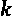

# 第八章：*第八章*: XGBoost 替代基础学习器

在本章中，您将分析并应用不同的`gbtree`，基础学习器的附加选项包括`gblinear`和`dart`。此外，XGBoost 还有其自己的随机森林实现，作为基础学习器以及作为树集成算法，您将在本章中进行实验。

通过学习如何应用替代的基础学习器，您将大大扩展 XGBoost 的使用范围。您将能够构建更多的模型，并学习开发线性、基于树的以及随机森林机器学习算法的新方法。本章的目标是让您熟练掌握使用替代基础学习器构建 XGBoost 模型，从而能够利用 XGBoost 的高级选项，在各种情况下找到最优的模型。

在本章中，我们将涵盖以下主要主题：

+   探索替代的基础学习器

+   应用`gblinear`

+   比较`dart`

+   查找 XGBoost 随机森林

# 技术要求

本章的代码和数据集可以在[`github.com/PacktPublishing/Hands-On-Gradient-Boosting-with-XGBoost-and-Scikit-learn/tree/master/Chapter08`](https://github.com/PacktPublishing/Hands-On-Gradient-Boosting-with-XGBoost-and-Scikit-learn/tree/master/Chapter08)找到。

# 探索替代的基础学习器

基础学习器是 XGBoost 用来构建其集成中第一个模型的机器学习模型。使用*base*这个词是因为它是第一个出现的模型，而使用*learner*是因为该模型会在从错误中学习后自我迭代。

决策树已成为 XGBoost 首选的基础学习器，因为提升树模型能够 consistently 产生优秀的分数。决策树的受欢迎程度不仅仅局限于 XGBoost，还扩展到其他集成算法，如随机森林以及`ExtraTreesClassifier`和`ExtraTreesRegressor`（[`scikit-learn.org/stable/modules/ensemble.html`](https://scikit-learn.org/stable/modules/ensemble.html)）。

在 XGBoost 中，默认的基础学习器是`gbtree`，它是多种基础学习器之一。还有`gblinear`，一种梯度提升线性模型，以及`dart`，一种包括基于神经网络的 dropout 技术的决策树变种。此外，XGBoost 还有随机森林的实现。在接下来的部分中，我们将探讨这些基础学习器之间的差异，然后在后续章节中应用它们。

## gblinear

决策树对于**非线性数据**非常适用，因为它们可以通过多次划分数据来轻松访问数据点。由于实际数据通常是非线性的，决策树通常更适合作为基础学习器。

然而，可能会有某些情况，`gblinear`作为**线性基础学习器**的选项。

提升线性模型的基本思想与提升树模型相同。首先构建一个基模型，然后在每个后续模型中训练残差。最后，将所有模型的结果求和得到最终结果。与线性基学习器的主要区别在于，集成中的每个模型都是线性的。

与`gblinear`一样，`dart`也在线性回归中添加了正则化项。XGBoost 的创始人兼开发者 Tianqi Chin 在 GitHub 上评论称，经过多轮提升后，`gblinear`可以用来*返回一个单一的 lasso 回归*（[`github.com/dmlc/xgboost/issues/332`](https://github.com/dmlc/xgboost/issues/332)）。

`gblinear`也可以通过**逻辑回归**应用于分类问题。这是因为逻辑回归的构建方式与**线性回归**相同，都是通过找到最优系数（加权输入）并通过**sigmoid 方程**求和（见*第一章*，*机器学习概览*）。

我们将在本章的*应用 gblinear*部分深入探讨`gblinear`的细节和应用。现在，先了解一下`dart`。

## DART

**丢弃法与多重加法回归树**，简称**DART**，由 UC Berkeley 的 K. V. Rashmi 和微软的 Ran Gilad-Bachrach 于 2015 年在以下论文中提出：[`proceedings.mlr.press/v38/korlakaivinayak15.pdf`](http://proceedings.mlr.press/v38/korlakaivinayak15.pdf)。

Rashmi 和 Gilad-Bachrach 指出，**多重加法回归树**（**MART**）是一种成功的模型，但其问题在于过度依赖早期的树。为了改进这一点，他们没有侧重于**收缩**这一标准的惩罚项，而是使用了来自**神经网络**的**丢弃法**技术。简单来说，丢弃法技术通过从神经网络的每一层学习中删除节点（数学点），从而减少过拟合。换句话说，丢弃法通过在每一轮中删除信息，减缓了学习过程。

在 DART 中，每一轮新的提升中，DART 并不是通过对所有前一个树的残差求和来建立新模型，而是随机选择部分前一个树的样本，并通过一个缩放因子来归一化叶子节点！[](img/Formula_08_001.png)，其中是被丢弃的树的数量。

DART 是决策树的一种变体。XGBoost 中的 DART 实现类似于`gbtree`，但是增加了一些超参数来适应丢弃法。

有关 DART 的数学细节，请参考本节第一段中提到的原始论文。

你将在本章稍后的*比较 dart*部分，练习使用`DART`基学习器来构建机器学习模型。

## XGBoost 随机森林

本节我们将探索的最后一个选项是 XGBoost 随机森林。通过将 `num_parallel_trees` 设置为大于 `1` 的整数，可以将随机森林实现为基础学习器，并作为 XGBoost 中的类选项，定义为 `XGBRFRegressor` 和 `XGBRFClassifier`。

请记住，梯度提升法是为改进相对较弱的基础学习器的错误而设计的，而不是像随机森林这样强大的基础学习器。然而，可能会有一些边缘情况，随机森林基础学习器也可能具有优势，因此它是一个不错的选择。

作为额外奖励，XGBoost 提供了 `XGBRFRegressor` 和 `XGBRFClassifier` 作为随机森林机器学习算法，它们不是基础学习器，而是独立的算法。这些算法的工作方式与 scikit-learn 的随机森林类似（参见 *第三章*，*使用随机森林的袋装法*）。主要的区别在于，XGBoost 包括默认的超参数来对抗过拟合，并有自己构建单棵树的方法。XGBoost 随机森林虽然还处于实验阶段，但自 2020 年末以来，它们已经开始超越 scikit-learn 的随机森林，如你将在本章中看到的。

在本章的最后部分，我们将分别尝试将 XGBoost 的随机森林作为基础学习器和独立模型进行实验。

现在你已经对 XGBoost 基础学习器有了一个概览，接下来我们将逐一应用它们。

# 应用 gblinear

很难找到与线性模型最为契合的真实世界数据集。实际数据往往比较杂乱，复杂的模型（如树集成）通常会产生更好的得分。而在其他情况下，线性模型可能会有更好的泛化能力。

机器学习算法的成功依赖于它们在真实世界数据上的表现。在接下来的部分，我们将首先将 `gblinear` 应用于糖尿病数据集，然后再应用于一个通过构造生成的线性数据集。

## 将 gblinear 应用于糖尿病数据集

糖尿病数据集是由 scikit-learn 提供的一个回归数据集，包含 442 名糖尿病患者。预测列包括年龄、性别、**BMI**（**体重指数**）、**BP**（**血压**）和五项血清测量值。目标列是疾病在 1 年后的进展。你可以在原始论文中阅读有关数据集的详细信息，链接在这里：[`web.stanford.edu/~hastie/Papers/LARS/LeastAngle_2002.pdf`](http://web.stanford.edu/~hastie/Papers/LARS/LeastAngle_2002.pdf)。

Scikit-learn 的数据集已经为你将预测列和目标列拆分好了。它们已预处理，机器学习时 `X` 是预测列，`y` 是目标列，分别加载。

下面是你需要用来处理这个数据集以及本章其余部分的完整导入列表：

```py
import pandas as pd
import numpy as np
from sklearn.datasets import load_diabetes
from sklearn.model_selection import cross_val_score
from xgboost import XGBRegressor, XGBClassifier, XGBRFRegressor, XGBRFClassifier
from sklearn.ensemble import RandomForestRegressor, RandomForestClassifier
from sklearn.linear_model import LinearRegression, LogisticRegression
from sklearn.linear_model import Lasso, Ridge
from sklearn.model_selection import GridSearchCV
from sklearn.model_selection import KFold
from sklearn.metrics import mean_squared_error as MSE
```

让我们开始吧！要使用糖尿病数据集，请执行以下操作：

1.  你首先需要使用 `load_diabetes` 并将 `return_X_y` 参数设置为 `True`，以定义 `X` 和 `y`：

    ```py
    X, y = load_diabetes(return_X_y=True)
    ```

    计划是使用 `cross_val_score` 和 `GridSearchCV`，所以我们先创建折叠以获得一致的得分。在 *第六章*，*XGBoost 超参数* 中，我们使用了 `StratifiedKFold`，它对目标列进行分层，确保每个测试集包含相同数量的类别。

    这种方法适用于分类问题，但不适用于回归问题，其中目标列是连续值，不涉及类别。`KFold` 通过在数据中创建一致的分割来实现类似的目标，而不进行分层。

1.  现在，打乱数据并使用 `KFold` 对数据进行 `5` 次分割，使用以下参数：

    ```py
    kfold = KFold(n_splits=5, shuffle=True, random_state=2)  
    ```

1.  构建一个使用 `cross_val_score` 的函数，输入一个机器学习模型，并返回 `5` 次折叠的平均得分，确保设置 `cv=kfold`：

    ```py
    def regression_model(model):
        scores = cross_val_score(model, X, y, scoring='neg_mean_squared_error', cv=kfold)
        rmse = (-scores)**0.5
        return rmse.mean()
    ```

1.  要使用 `gblinear` 作为基本模型，只需在回归函数中的 `XGBRegressor` 中设置 `booster='gblinear'`：

    ```py
    regression_model(XGBRegressor(booster='gblinear'))
    ```

    得分如下：

    ```py
    55.4968907398679
    ```

1.  让我们检查这个得分与其他线性模型的对比，包括 `LinearRegression`，`Lasso`，使用 `Ridge`，使用 `LinearRegression` 如下：

    ```py
    regression_model(LinearRegression())
    ```

    得分如下：

    ```py
    55.50927267834351
    ```

    b) `Lasso` 如下：

    ```py
    regression_model(Lasso())
    ```

    得分如下：

    ```py
    62.64900771743497
    ```

    c) `Ridge` 如下：

    ```py
    regression_model(Ridge())
    ```

    得分如下：

    ```py
    58.83525077919004
    ```

    如您所见，`XGBRegressor` 在使用 `gblinear` 作为基本学习器时表现最佳，与 `LinearRegression` 一同表现突出。

1.  现在将 `booster='gbtree'` 放入 `XGBRegressor` 中，这是默认的基本学习器：

    ```py
    regression_model(XGBRegressor(booster='gbtree'))
    ```

    得分如下：

    ```py
    65.96608419624594
    ```

如您所见，在这种情况下，`gbtree` 基本学习器的表现远不如 `gblinear` 基本学习器，这表明线性模型更为理想。

让我们看看是否能通过调整超参数使 `gblinear` 作为基本学习器获得一些提升。

### gblinear 超参数

在调整超参数时，理解 `gblinear` 和 `gbtree` 之间的区别非常重要。在 *第六章**，XGBoost 超参数* 中介绍的许多 XGBoost 超参数是树形超参数，不适用于 `gblinear`。例如，`max_depth` 和 `min_child_weight` 是专门为树形设计的超参数。

以下是针对线性模型设计的 XGBoost `gblinear` 超参数总结。

#### reg_lambda

Scikit-learn 使用 `reg_lambda` 代替 `lambda`，因为 `lambda` 是 Python 中保留的关键字，用于定义 Lambda 函数。这是 `Ridge` 使用的标准 L2 正则化。接近 `0` 的值通常效果最好：

+   *默认值：0*

+   *范围：[0, inf)*

+   *增大可防止过拟合*

+   *别名：lambda*

#### reg_alpha

Scikit-learn 接受 `reg_alpha` 和 `alpha` 两种方式。这是 `Lasso` 使用的标准 L1 正则化。接近 `0` 的值通常效果最好：

+   *默认值：0*

+   *范围：[0, inf)*

+   *增大可防止过拟合*

+   *别名：alpha*

#### 更新器

这是 XGBoost 在每轮提升过程中用于构建线性模型的算法。`shotgun`使用`hogwild`并行化与坐标下降法来生成非确定性解。相比之下，`coord_descent`是普通的坐标下降法，产生确定性解：

+   *默认值：shotgun*

+   *范围：shotgun, coord_descent*

    注意

    *坐标下降法*是机器学习术语，定义为通过逐一寻找每个坐标的梯度来最小化误差。

#### feature_selector

`feature_selector`决定了如何选择权重，具体选项如下：

a) `cyclic` – 迭代循环通过特征

b) `shuffle` – 每轮随机特征重排的循环方式

c) `random` – 坐标下降法中的坐标选择是随机的

d) `greedy` – 耗时；选择具有最大梯度幅度的坐标

e) `thrifty` – 大致是贪婪的，根据权重变化重新排序特征

+   *默认值：cyclic*

+   *范围必须与`updater`一起使用，具体如下：*

    a) `shotgun`: `cyclic`, `shuffle`

    b) `coord_descent`: `random`, `greedy`, `thrifty`

    注意

    对于大数据集来说，`greedy`计算开销较大，但通过更改参数`top_k`（见下文），可以减少`greedy`考虑的特征数量。

#### top_k

`top_k`是`greedy`和`thrifty`在坐标下降法中选择特征的数量：

+   *默认值：0（所有特征）*

+   *范围：[0，最大特征数]*

    注意

    欲了解更多关于 XGBoost `gblinear`超参数的信息，请查阅 XGBoost 官方文档页面：[`xgboost.readthedocs.io/en/latest/parameter.html#parameters-for-linear-booster-booster-gblinear`](https://xgboost.readthedocs.io/en/latest/parameter.html#parameters-for-linear-booster-booster-gblinear)。

### gblinear 网格搜索

现在你已经熟悉了`gblinear`可能使用的超参数范围，接下来让我们使用`GridSearchCV`在自定义的`grid_search`函数中找到最佳参数：

1.  这是我们从*第六章*中得到的`grid_search`函数版本，*XGBoost 超参数*：

    ```py
    def grid_search(params, reg=XGBRegressor(booster='gblinear')):
        grid_reg = GridSearchCV(reg, params, scoring='neg_mean_squared_error', cv=kfold)
        grid_reg.fit(X, y)
        best_params = grid_reg.best_params_
        print("Best params:", best_params)
        best_score = np.sqrt(-grid_reg.best_score_)
        print("Best score:", best_score)
    ```

1.  让我们从使用标准范围修改`alpha`开始：

    ```py
    grid_search(params={'reg_alpha':[0.001, 0.01, 0.1, 0.5, 1, 5]})
    ```

    输出如下：

    ```py
    Best params: {'reg_alpha': 0.01}
    Best score: 55.485310447306425
    ```

    得分大致相同，但略有提升。

1.  接下来，让我们使用相同的范围修改`reg_lambda`：

    ```py
    grid_search(params={'reg_lambda':[0.001, 0.01, 0.1, 0.5, 1, 5]})
    ```

    输出如下：

    ```py
    Best params: {'reg_lambda': 0.001}
    Best score: 56.17163554152289
    ```

    这里的得分非常相似，但略逊一筹。

1.  现在让我们将`feature_selector`与`updater`一起使用。默认情况下，`updater=shotgun`，`feature_selector=cyclic`。当`updater=shotgun`时，`feature_selector`唯一的另一个选择是`shuffle`。

    让我们看看`shuffle`是否比`cyclic`表现更好：

    ```py
    grid_search(params={'feature_selector':['shuffle']})
    ```

    输出如下：

    ```py
    Best params: {'feature_selector': 'shuffle'}
    Best score: 55.531684115240594
    ```

    在这种情况下，`shuffle`表现不佳。

1.  现在让我们将`updater`更改为`coord_descent`。因此，`feature_selector`可以选择`random`、`greedy`或`thrifty`。通过输入以下代码，尝试在`grid_search`中测试所有`feature_selector`选项：

    ```py
    grid_search(params={'feature_selector':['random', 'greedy', 'thrifty'], 'updater':['coord_descent'] })
    ```

    输出如下：

    ```py
    Best params: {'feature_selector': 'thrifty', 'updater': 'coord_descent'}
    Best score: 55.48798105805444
    This is a slight improvement from the base score.
    ```

    最后一个需要检查的超参数是 `top_k`，它定义了在坐标下降过程中，`greedy` 和 `thrifty` 检查的特征数量。由于总共有 10 个特征，`top_k` 的范围从 `2` 到 `9` 都是可以接受的。

1.  在 `grid_search` 中为 `greedy` 和 `thrifty` 输入 `top_k` 的范围，以找到最佳选项：

    ```py
    grid_search(params={'feature_selector':['greedy', 'thrifty'], 'updater':['coord_descent'], 'top_k':[3, 5, 7, 9]})
    ```

    输出如下：

    ```py
    Best params: {'feature_selector': 'thrifty', 'top_k': 3, 'updater': 'coord_descent'}
    Best score: 55.478623763746256
    ```

这是迄今为止最好的得分。

在继续之前，请注意，除了树以外，还可以使用其他超参数，比如 `n_estimators` 和 `learning_rate`。

现在让我们看看 `gblinear` 在一个构建时就是线性的数据集上的表现。

## 线性数据集

确保数据集是线性的一个方法是通过构建。我们可以选择一系列 `X` 值，比如从 `1` 到 `99`，然后乘以一个缩放因子，并加入一些随机性。

这是构建线性数据集的步骤：

1.  设置 `X` 值的范围从 `1` 到 `100`：

    ```py
    X = np.arange(1,100)
    ```

1.  使用 NumPy 声明一个随机种子，以确保结果的一致性：

    ```py
    np.random.seed(2) 
    ```

1.  创建一个空列表，定义为 `y`：

    ```py
    y = []
    ```

1.  遍历 `X`，将每个条目乘以一个从 `-0.2` 到 `0.2` 的随机数：

    ```py
    for i in X:
           y.append(i * np.random.uniform(-0.2, 0.2))
    ```

1.  将 `y` 转换为 `numpy` 数组以用于机器学习：

    ```py
    y = np.array(y)
    ```

1.  重塑 `X` 和 `y`，使它们包含与数组成员相同数量的行和一列，因为列是 scikit-learn 期望的机器学习输入：

    ```py
    X = X.reshape(X.shape[0], 1)
    y = y.reshape(y.shape[0], 1)
    ```

    我们现在有一个线性数据集，其中 `X` 和 `y` 含有随机性。

让我们再次运行 `regression_model` 函数，这次使用 `gblinear` 作为基础学习器：

```py
regression_model(XGBRegressor(booster='gblinear', objective='reg:squarederror'))
```

得分如下：

```py
6.214946302686011
```

现在使用 `gbtree` 作为基础学习器运行 `regression_model` 函数：

```py
regression_model(XGBRegressor(booster='gbtree', objective='reg:squarederror'))
```

得分如下：

```py
9.37235946501318
```

如你所见，`gblinear` 在我们构建的线性数据集上表现更好。

为了更精确，让我们在同一数据集上尝试 `LinearRegression`：

```py
regression_model(LinearRegression())
```

得分如下：

```py
6.214962315808842
```

在这种情况下，`gblinear` 的表现稍好，或许差距微乎其微，得分比 `LinearRegression` 低了 `0.00002` 分。

## 分析 gblinear

`gblinear` 是一个有吸引力的选择，但只有在你有理由相信线性模型可能比基于树的模型表现更好时，才应使用它。在真实数据集和构建的数据集中，`gblinear` 比 `LinearRegression` 的表现高出非常微弱的优势。在 XGBoost 中，`gblinear` 在数据集庞大且线性时，是一个很强的基础学习器选择。`gblinear` 也可以用于分类数据集，下一节中你将应用这一方法。

# 比较 dart

基础学习器 `dart` 类似于 `gbtree`，因为它们都是梯度提升树。主要的区别是，`dart` 在每一轮提升中移除一些树（称为 dropout）。

在本节中，我们将应用并比较基础学习器 `dart` 与其他基础学习器在回归和分类问题中的表现。

## 使用 XGBRegressor 的 DART 方法

让我们看看 `dart` 在糖尿病数据集上的表现：

1.  首先，像之前一样使用 `load_diabetes` 重新定义 `X` 和 `y`：

    ```py
    X, y = load_diabetes(return_X_y=True)
    ```

1.  要将`dart`作为 XGBoost 的基础学习器使用，需要在`regression_model`函数内将`XGBRegressor`参数`booster='dart'`设置：

    ```py
    regression_model(XGBRegressor(booster='dart', objective='reg:squarederror'))
    ```

    分数如下：

    ```py
    65.96444746130739
    ```

`dart`基础学习器与`gbtree`基础学习器的结果相同，精确到小数点后两位。结果相似是因为数据集较小，且`gbtree`默认的超参数能够有效防止过拟合，无需采用丢弃树技术。

让我们看看`dart`与`gbtree`在更大数据集上的分类表现如何。

## dart 与 XGBClassifier

你在本书的多个章节中使用了 Census 数据集。我们在*第一章*《机器学习概况》中修改过的清洁版数据集，已经为你预加载，另外还包括了*第八章*《XGBoost 替代基础学习器》中的代码，数据集可以从[`github.com/PacktPublishing/Hands-On-Gradient-Boosting-with-XGBoost-and-Scikit-learn/tree/master/Chapter08`](https://github.com/PacktPublishing/Hands-On-Gradient-Boosting-with-XGBoost-and-Scikit-learn/tree/master/Chapter08)获取。现在让我们开始测试`dart`在更大数据集上的表现：

1.  将 Census 数据集加载到 DataFrame 中，并使用最后一列索引（`-1`）作为目标列，将预测列和目标列拆分为`X`和`y`：

    ```py
    df_census = pd.read_csv('census_cleaned.csv')
    X_census = df_census.iloc[:, :-1]
    y_census = df_census.iloc[:, -1]
    ```

1.  定义一个新的分类函数，使用`cross_val_score`，输入为机器学习模型，输出为均值分数，类似于本章前面定义的回归函数：

    ```py
    def classification_model(model):
        scores = cross_val_score(model, X_census, y_census, scoring='accuracy', cv=kfold)
        return scores.mean()
    ```

1.  现在使用`XGBClassifier`分别设置`booster='gbtree'`和`booster='dart'`调用函数两次进行结果比较。请注意，由于数据集更大，运行时间会更长：

    a) 首先，让我们调用`XGBClassifier`并设置`booster='gbtree'`：

    ```py
    classification_model(XGBClassifier(booster='gbtree'))
    ```

    分数如下：

    ```py
    0.8701208195968675
    ```

    b) 现在，让我们调用`XGBClassifier`并设置`booster='dart'`：

    ```py
    classification_model(XGBClassifier(booster='dart')
    ```

    分数如下：

    ```py
    0.8701208195968675
    ```

这令人吃惊。`dart`与`gbtree`的结果完全相同，精确到所有 16 位小数！目前尚不清楚是否真的丢弃了树，或者丢弃树对结果没有任何影响。

我们可以调整超参数以确保丢弃树，但首先，让我们看看`dart`与`gblinear`的比较。回想一下，`gblinear`通过使用 sigmoid 函数来对权重进行缩放，类似于逻辑回归，从而也能用于分类：

1.  使用`XGBClassifier`调用`classification_model`函数，并设置`booster='gblinear'`：

    ```py
    classification_model(XGBClassifier(booster='gblinear'))
    ```

    分数如下：

    ```py
    0.8501275704120015
    ```

    这种线性基础学习器的表现不如树型基础学习器。

1.  让我们看看`gblinear`与逻辑回归的比较。由于数据集较大，最好将逻辑回归的`max_iter`超参数从`100`调整为`1000`，以便有更多时间进行收敛并消除警告。请注意，在这种情况下，增加`max_iter`能提高准确率：

    ```py
    classification_model(LogisticRegression(max_iter=1000))
    ```

    分数如下：

    ```py
    0.8008968643699182
    ```

    在这种情况下，`gblinear`比逻辑回归具有明显的优势。值得强调的是，XGBoost 的`gblinear`选项在分类中提供了一个可行的替代逻辑回归的方案。

现在你已经了解了`dart`与`gbtree`和`gblinear`作为基本学习器的比较，接下来我们来修改`dart`的超参数。

## DART 超参数

`dart`包含所有`gbtree`的超参数，并且还包括一组额外的超参数，用于调整丢弃树的百分比、频率和概率。有关详细信息，请参见 XGBoost 文档：[`xgboost.readthedocs.io/en/latest/parameter.html#additional-parameters-for-dart-booster-booster-dart`](https://xgboost.readthedocs.io/en/latest/parameter.html#additional-parameters-for-dart-booster-booster-dart)。

以下各节是 XGBoost 中专门针对`dart`的超参数总结。

#### sample_type

`sample_type`的选项包括`uniform`，表示树是均匀丢弃的，和`weighted`，表示树按其权重比例丢弃：

+   *默认值："uniform"*

+   *范围：["uniform", "weighted"]*

+   *决定丢弃树的选择方式*

#### normalize_type

`normalize_type`的选项包括`tree`，即新树的权重与丢弃的树相同，和`forest`，即新树的权重与丢弃的树的总和相同：

+   *默认值："tree"*

+   *范围：["tree", "forest"]*

+   *计算树的权重，以丢弃的树为单位*

#### rate_drop

`rate_drop`允许用户精确设置丢弃树的百分比：

+   *默认值：0.0*

+   *范围：[0.0, 1.0]*

+   *丢弃树的百分比*

#### one_drop

当设置为`1`时，`one_drop`确保每次提升轮次中总有一棵树被丢弃：

+   *默认值：0*

+   *范围：[0, 1]*

+   *用于确保丢弃*

#### skip_drop

`skip_drop`给出了完全跳过丢弃的概率。在官方文档中，XGBoost 说 `skip_drop` 的优先级高于`rate_drop`或`one_drop`。默认情况下，每棵树被丢弃的概率相同，因此对于某次提升轮次可能没有树被丢弃。`skip_drop`允许更新此概率，以控制丢弃轮次的数量：

+   *默认值：0.0*

+   *范围：[0.0, 1.0]*

+   *跳过丢弃的概率*

现在让我们修改`dart`的超参数，以区分不同的得分。

## 修改 dart 超参数

为确保每次提升轮次中至少有一棵树被丢弃，我们可以设置`one_drop=1`。现在通过`classification_model`函数使用 Census 数据集来实现：

```py
classification_model(XGBClassifier(booster='dart', one_drop=1))
```

结果如下：

```py
0.8718714338474818
```

这是一个提高了百分之一点的改进，表明每次提升轮次丢弃至少一棵树可能是有利的。

现在我们正在丢弃树以更改得分，让我们回到更小且更快的糖尿病数据集，修改剩余的超参数：

1.  使用`regression_model`函数，将`sample_type`从`uniform`更改为`weighted`：

    ```py
    regression_model(XGBRegressor(booster='dart', objective='reg:squarederror', sample_type='weighted'))
    ```

    得分如下：

    ```py
    65.96444746130739
    ```

    这个得分比之前 `gbtree` 模型得分高出 0.002 分。

1.  将 `normalize_type` 更改为 `forest`，以便在更新权重时包括树的总和：

    ```py
    regression_model(XGBRegressor(booster='dart', objective='reg:squarederror', normalize_type='forest'))
    ```

    得分如下：

    ```py
    65.96444746130739
    ```

    分数没有变化，这可能发生在数据集较浅的情况下。

1.  将 `one_drop` 更改为 `1`，确保每次提升回合至少丢弃一棵树：

    ```py
    regression_model(XGBRegressor(booster='dart', objective='reg:squarederror', one_drop=1))
    ```

    得分如下：

    ```py
    61.81275131335009
    ```

    这是一个明显的改进，得分提高了四个完整点。

对于 `rate_drop`，即将被丢弃的树的百分比，可以使用以下 `grid_search` 函数来设置百分比范围：

```py
grid_search(params={'rate_drop':[0.01, 0.1, 0.2, 0.4]}, reg=XGBRegressor(booster='dart', objective='reg:squarederror', one_drop=1))
```

结果如下：

```py
Best params: {'rate_drop': 0.2}
Best score: 61.07249602732062
```

这是迄今为止的最佳结果。

我们可以使用类似的范围来实现 `skip_drop`，它给出了某棵树*不*被丢弃的概率：

```py
grid_search(params={'skip_drop':[0.01, 0.1, 0.2, 0.4]}, reg=XGBRegressor(booster='dart', objective='reg:squarederror'))
```

结果如下：

```py
Best params: {'skip_drop': 0.1}
Best score: 62.879753748627635
```

这是一个不错的得分，但 `skip_drop` 没有带来实质性的提升。

现在你看到 `dart` 的实际应用，让我们分析一下结果。

## 分析 dart

`dart` 在 XGBoost 框架中提供了一个很有吸引力的选项。由于 `dart` 接受所有 `gbtree` 超参数，因此在修改超参数时，可以轻松地将基础学习器从 `gbtree` 改为 `dart`。实际上，优点是你可以尝试包括 `one_drop`、`rate_drop`、`normalize` 等新的超参数，以查看是否能获得额外的收益。在你的研究和 XGBoost 模型构建中，`dart` 绝对值得尝试作为基础学习器。

现在你已经对 `dart` 有了很好的理解，是时候转向随机森林了。

# 查找 XGBoost 随机森林

在 XGBoost 中实现随机森林有两种策略。第一种是将随机森林作为基础学习器，第二种是使用 XGBoost 的原始随机森林，即 `XGBRFRegressor` 和 `XGBRFClassifier`。我们从原始主题开始，即将随机森林作为替代基础学习器。

## 随机森林作为基础学习器

没有选项可以将提升器的超参数设置为随机森林。相反，可以将超参数 `num_parallel_tree` 从其默认值 `1` 增加，以将 `gbtree`（或 `dart`）转变为一个提升的随机森林。这里的思路是，每个提升回合将不再是单棵树，而是多个并行的树，这些树共同构成一片森林。

以下是 XGBoost 超参数 `num_parallel_tree` 的简要总结。

#### num_parallel_tree

`num_parallel_tree` 指定了在每次提升回合中构建的树的数量，可能大于 1：

+   *默认值：1*

+   *范围：[1, inf)*

+   *给出并行提升的树的数量*

+   *大于 1 的值会将提升器转变为随机森林*

通过在每回合中包含多棵树，基础学习器不再是单棵树，而是森林。由于 XGBoost 包含与随机森林相同的超参数，因此当 `num_parallel_tree` 超过 1 时，基础学习器被适当分类为随机森林。

让我们看看 XGBoost 随机森林基础学习器在实际中的表现：

1.  使用 `XGBRegressor` 调用 `regression_model` 并设置 `booster='gbtree'`。此外，设置 `num_parallel_tree=25`，意味着每次提升回合由 `25` 棵树组成：

    ```py
    regression_model(XGBRegressor(booster='gbtree', objective='reg:squarederror', num_parallel_tree=25))
    ```

    评分如下：

    ```py
    65.96604877151103
    ```

    评分是相当不错的，在这种情况下，几乎和提升一个单独的 `gbtree` 相同。原因在于梯度提升的设计是通过从前一个树的错误中学习来优化性能。通过从一个强大的随机森林开始，学习的空间有限，因此收益最多是微小的。

    理解梯度提升算法的核心优势来自于学习过程至关重要。因此，尝试将 `num_parallel_tree` 设置为一个更小的值（例如 `5`）是有意义的。

1.  在同一个回归模型中设置 `num_parallel_tree=5`：

    ```py
    regression_model(XGBRegressor(booster='gbtree', objective='reg:squarederror', num_parallel_tree=5))
    ```

    评分如下：

    ```py
    65.96445649315855
    ```

    从技术上讲，这个得分比 25 棵树的森林产生的得分高 0.002 分。虽然这个改善不大，但一般来说，在构建 XGBoost 随机森林时，较低的 `num_parallel_tree` 值会更好。

现在你已经看到如何将随机森林作为 XGBoost 中的基础学习器实现，是时候将随机森林构建为原始的 XGBoost 模型了。

## 作为 XGBoost 模型的随机森林

除了 `XGBRegressor` 和 `XGBClassifier`，`XGBoost` 还提供了 `XGBRFRegressor` 和 `XGBRFClassifier` 来构建随机森林。

根据官方 XGBoost 文档 [`xgboost.readthedocs.io/en/latest/tutorials/rf.html`](https://xgboost.readthedocs.io/en/latest/tutorials/rf.html)，scikit-learn 的随机森林包装器仍处于实验阶段，默认值可能会随时更改。在编写本文时（2020 年），以下是 `XGBRFRegressor` 和 `XGBRFClassifier` 的默认值。

#### n_estimators

使用 `n_estimators` 而不是 `num_parallel_tree` 来构建随机森林时，请使用 `XGBRFRegressor` 或 `XGBRFClassifier`。请记住，在使用 `XGBRFRegressor` 和 `XGBRFClassifier` 时，你并不是在做梯度提升，而是在一次回合中对树进行集成，就像传统的随机森林一样：

+   *默认值： 100*

+   *范围： [1, inf)*

+   *自动转换为 num_parallel_tree 用于随机森林*

#### learning_rate

`learning_rate` 通常是为学习型模型设计的，包括增强器，而不是 `XGBRFRegressor` 或 `XGBRFClassifier`，因为它们仅由一轮树组成。然而，将 `learning_rate` 从 1 改变会影响得分，因此通常不建议修改这个超参数：

+   *默认值： 1*

+   *范围： [0, 1]*

#### subsample, colsample_by_node

Scikit-learn 的随机森林将这些默认值保持为 `1`，使得默认的 `XGBRFRegressor` 和 `XGBRFClassifier` 更不容易过拟合。这是 XGBoost 和 scikit-learn 随机森林默认实现之间的主要区别：

+   *默认值： 0.8*

+   *范围： [0, 1]*

+   *减少有助于防止过拟合*

现在，让我们看看 XGBoost 的随机森林在实践中的工作原理：

1.  首先，将`XGBRFRegressor`放入`regression_model`函数中：

    ```py
    regression_model(XGBRFRegressor(objective='reg:squarederror'))
    ```

    得分如下：

    ```py
    59.447250741400595
    ```

    这个得分稍微比之前展示的`gbtree`模型好一些，但比本章中展示的最佳线性模型稍差。

1.  为了对比，看看将`RandomForestRegressor`放入相同函数后的表现：

    ```py
    regression_model(RandomForestRegressor())
    ```

    得分如下：

    ```py
    59.46563031802505
    ```

    这个得分稍微比`XGBRFRegressor`差一些。

现在让我们使用更大的 Census 数据集进行分类，将 XGBoost 随机森林与 scikit-learn 的标准随机森林进行比较：

1.  将`XGBRFClassifier`放入`classification_model`函数中，看看它在预测用户收入时的表现如何：

    ```py
    classification_model(XGBRFClassifier())
    ```

    得分如下：

    ```py
    0.856085650471878
    ```

    这个得分很好，比`gbtree`稍低，`gbtree`之前的得分是 87%。

1.  现在将`RandomForestClassifier`放入相同的函数中，比较结果：

    ```py
    classification_model(RandomForestClassifier())
    ```

    得分如下：

    ```py
    0.8555328202034789
    ```

    这个得分稍微比 XGBoost 的实现差一些。

由于 XGBoost 的随机森林仍处于开发阶段，我们将在此结束并分析结果。

## 分析 XGBoost 随机森林

你可以通过将`num_parallel_tree`增加到大于`1`的值，随时尝试将随机森林作为 XGBoost 的基础学习器。尽管正如你在本节中所见，提升法（boosting）是为了从弱模型中学习，而不是从强模型中学习，因此`num_parallel_tree`的值应该保持接近`1`。将随机森林作为基础学习器应该谨慎使用。如果单棵树的提升法未能产生最佳分数，随机森林基础学习器是一个可选方案。

或者，XGBoost 的随机森林的`XGBRFRegressor`和`XGBRFClassifier`可以作为 scikit-learn 随机森林的替代方法来实现。XGBoost 新的`XGBRFRegressor`和`XGBRFClassifier`表现超过了 scikit-learn 的`RandomForestRegressor`和`RandomForestClassifier`，尽管这次比较非常接近。鉴于 XGBoost 在机器学习社区中的总体成功，未来使用`XGBRFRegressor`和`XGBRFClassifier`作为可行的选择绝对值得尝试。

# 总结

在本章中，你通过将所有 XGBoost 基础学习器（包括`gbtree`、`dart`、`gblinear`和随机森林）应用于回归和分类数据集，极大地扩展了 XGBoost 的使用范围。你预览、应用并调优了独特的基础学习器超参数以提高得分。此外，你还尝试了使用线性构建数据集的`gblinear`，以及使用`XGBRFRegressor`和`XGBRFClassifier`构建没有任何提升法的 XGBoost 随机森林。现在，你已经熟悉了所有基础学习器，你对 XGBoost 的理解已经达到了高级水平。

在下一章中，你将分析 Kaggle 高手的技巧，进一步提升你的 XGBoost 技能！
