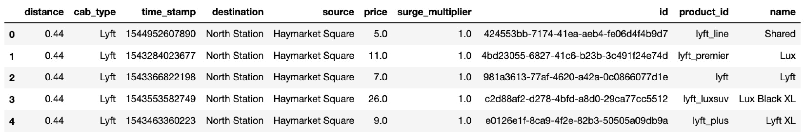
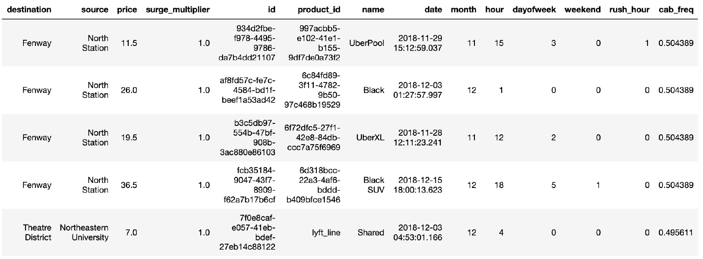

# 第九章：*第九章*：XGBoost Kaggle 大师

在本章中，您将学习从`VotingClassifier`和`VotingRegressor`中获得的宝贵技巧和窍门，以构建非相关的机器学习集成模型，并了解**堆叠**最终模型的优势。

在本章中，我们将涵盖以下主要内容：

+   探索 Kaggle 竞赛

+   构建新的数据列

+   构建非相关集成模型

+   堆叠最终模型

# 技术要求

本章的代码可以在[`github.com/PacktPublishing/Hands-On-Gradient-Boosting-with-XGBoost-and-Scikit-learn/tree/master/Chapter09`](https://github.com/PacktPublishing/Hands-On-Gradient-Boosting-with-XGBoost-and-Scikit-learn/tree/master/Chapter09)找到。

# 探索 Kaggle 竞赛

"我只用了 XGBoost（尝试过其他的，但没有一个能达到足够的表现以最终加入我的集成模型中）。"

– *Qingchen Wang，Kaggle 获胜者*

([`www.cnblogs.com/yymn/p/4847130.html`](https://www.cnblogs.com/yymn/p/4847130.html))

在本节中，我们将通过回顾 Kaggle 竞赛的简短历史、它们的结构以及区分验证/测试集与保留/测试集的重要性，来探讨 Kaggle 竞赛。

## XGBoost 在 Kaggle 竞赛中的表现

XGBoost 因其在赢得 Kaggle 竞赛中的无与伦比的成功而建立了作为领先机器学习算法的声誉。XGBoost 常常与深度学习模型如**神经网络**一起出现在获胜的集成模型中，除了单独获胜之外。一个 XGBoost Kaggle 竞赛获胜者的样例列表出现在*分布式（深度）机器学习社区*的网页上，[`github.com/dmlc/xgboost/tree/master/demo#machine-learning-challenge-winning-solutions`](https://github.com/dmlc/xgboost/tree/master/demo#machine-learning-challenge-winning-solutions)。要查看更多 XGBoost Kaggle 竞赛获胜者，可以通过*Winning solutions of Kaggle competitions* ([`www.kaggle.com/sudalairajkumar/winning-solutions-of-kaggle-competitions`](https://www.kaggle.com/sudalairajkumar/winning-solutions-of-kaggle-competitions))来研究获胜模型。

注意事项

虽然 XGBoost 经常出现在获胜者中，但其他机器学习模型也有出现。

如*第五章*《XGBoost 揭秘》中提到的，Kaggle 竞赛是机器学习竞赛，机器学习从业者相互竞争，争取获得最佳分数并赢得现金奖励。当 XGBoost 在 2014 年参加*希格斯玻色子机器学习挑战*时，它迅速跃升至排行榜顶端，并成为 Kaggle 竞赛中最受欢迎的机器学习算法之一。

在 2014 年到 2018 年间，XGBoost 一直在表格数据（以行和列组织的数据，相对于图像或文本等非结构化数据，神经网络在这些领域占有优势）上表现出色。随着 **LightGBM** 在 2017 年问世，这款由微软推出的快速梯度提升算法，XGBoost 在表格数据上终于遇到了真正的竞争者。

以下是由八位作者编写的入门论文，*LightGBM: A Highly Efficient Gradient Boosting Decision Tree*，推荐用作了解 LightGBM 的入门材料：[`papers.nips.cc/paper/6907-lightgbm-a-highly-efficient-gradient-boosting-decision-tree.pdf`](https://papers.nips.cc/paper/6907-lightgbm-a-highly-efficient-gradient-boosting-decision-tree.pdf)。

在 Kaggle 竞赛中实现一个优秀的机器学习算法，如 XGBoost 或 LightGBM，仅仅做到这一点还不够。同样，调优模型的超参数通常也不足够。尽管单个模型的预测很重要，但工程化新的数据并结合最优模型以获得更高的分数同样至关重要。

## Kaggle 竞赛的结构

理解 Kaggle 竞赛的结构是很有价值的，这有助于你理解为什么像无相关的集成构建和堆叠技术在竞赛中如此广泛应用。此外，探索 Kaggle 竞赛的结构也会让你在未来如果选择参与此类竞赛时更有信心。

提示

Kaggle 推荐了 *Housing Prices: Advanced Regression Techniques*，[`www.kaggle.com/c/house-prices-advanced-regression-techniques`](https://www.kaggle.com/c/house-prices-advanced-regression-techniques)，适合那些希望从基础过渡到高级竞赛的机器学习学生。这是许多基于知识的竞赛之一，尽管它们不提供现金奖励。

Kaggle 竞赛存在于 Kaggle 网站上。以下是 *Avito Context Ad Clicks* 竞赛网站的链接，这场比赛于 2015 年由 XGBoost 用户 Owen Zhang 获胜：[`www.kaggle.com/c/avito-context-ad-clicks/overview`](https://www.kaggle.com/c/avito-context-ad-clicks/overview)。许多 XGBoost Kaggle 竞赛的获胜者，包括 Owen Zhang，在 2015 年就已获得奖项，这表明 XGBoost 在 Tianqi Chin 2016 年发表的里程碑论文 *XGBoost: A Scalable Tree Boosting System* 之前就已广泛传播：[`arxiv.org/pdf/1603.02754.pdf`](https://arxiv.org/pdf/1603.02754.pdf)。

这是 *Avito Context Ad Clicks* 网站的顶部：


图 9.1 – Avito Context Ad Clicks Kaggle 竞赛网站

该概览页面对竞赛的解释如下：

+   在 **概览**（以蓝色高亮显示）旁边的附加链接包括 **数据**，在这里你可以访问竞赛的数据。

+   **笔记本**，Kagglers 发布解决方案和起始笔记本的地方。

+   **讨论区**，Kagglers 在这里发布和回答问题。

+   **排行榜**，展示最高分的地方。

+   **规则**，解释了竞赛的运作方式。

+   另外，请注意右侧的**延迟提交**链接，表示即使竞赛已经结束，提交仍然是被接受的，这是 Kaggle 的一项常规政策。

若要下载数据，你需要通过注册一个免费的账户来参加竞赛。数据通常被分为两个数据集，`training.csv` 是用于构建模型的训练集，`test.csv` 是用于评估模型的测试集。提交模型后，你会在公共排行榜上获得一个分数。竞赛结束时，最终模型会提交给一个私有测试集，以确定获胜的解决方案。

## 保留集

在构建机器学习模型时，区分在 Kaggle 竞赛中构建模型与独立构建模型非常重要。到目前为止，我们已经将数据集分为训练集和测试集，以确保我们的模型能够很好地泛化。然而，在 Kaggle 竞赛中，模型必须在竞争环境中进行测试。因此，测试集的数据会保持隐藏。

下面是 Kaggle 的训练集和测试集之间的区别：

+   `training.csv`：这是你自己训练和评分模型的地方。这个训练集应该使用 `train_test_split` 或 `cross_val_score` 将其划分为自己的训练集和测试集，从而构建能够很好泛化到新数据的模型。在训练过程中使用的测试集通常被称为**验证集**，因为它们用来验证模型。

+   `test.csv`：这是一个独立的保留集。在模型准备好并可以在它从未见过的数据上进行测试之前，你不会使用测试集。隐藏测试集的目的是保持竞赛的公正性。测试数据对参与者是隐藏的，结果只会在参与者提交模型之后才会公开。

在构建研究或行业模型时，将测试集留存一旁始终是一个良好的做法。当一个模型在已经见过的数据上进行测试时，模型有过拟合测试集的风险，这种情况通常出现在 Kaggle 竞赛中，参赛者通过千分之一的微小差异来过度优化自己的成绩，从而在公共排行榜上提升名次。

Kaggle 竞赛与现实世界在保留集的使用上有所交集。构建机器学习模型的目的是使用未知数据进行准确的预测。例如，如果一个模型在训练集上达到了 100% 的准确率，但在未知数据上只有 50% 的准确率，那么这个模型基本上是没有价值的。

在测试集上验证模型与在保留集上测试模型之间的区别非常重要。

这里是验证和测试机器学习模型的一般方法：

1.  **将数据划分为训练集和保留集**：将保留集隔离开，并抵制查看它的诱惑。

1.  **将训练集划分为训练集和测试集，或使用交叉验证**：在训练集上拟合新模型，并验证模型，一来一回地改进得分。

1.  **在获得最终模型后，在保留集上进行测试**：这是对模型的真正考验。如果得分低于预期，返回到*第 2 步*并重复。切记——这一点很重要——不要将保留集用作新的验证集，一来一回地调整超参数。这样做会导致模型根据保留集进行调整，这违背了保留集的初衷。

在 Kaggle 竞赛中，过于将机器学习模型与测试集紧密结合是行不通的。Kaggle 通常将测试集拆分为公共和私有两个部分。公共测试集让参赛者有机会评估他们的模型，并进行改进，一来一回地调整并重新提交。私有测试集直到竞赛最后一天才会揭晓。虽然公共测试集的排名会显示，但竞赛的胜者是基于未见测试集的结果宣布的。

赢得 Kaggle 竞赛需要在私有测试集上获得尽可能高的分数。在 Kaggle 竞赛中，每一个百分点都至关重要。业界有时对这种精确度嗤之以鼻，但它促使了创新的机器学习实践来提高得分。理解本章所介绍的这些技术，可以让我们构建更强的模型，并更深入地理解整体机器学习。

# 开发新列

"几乎总是，我都能找到我想做的事情的开源代码，我的时间应该更多地用在研究和特征工程上。"

– *Owen Zhang，Kaggle 冠军*

([`medium.com/kaggle-blog/profiling-top-kagglers-owen-zhang-currently-1-in-the-world-805b941dbb13`](https://medium.com/kaggle-blog/profiling-top-kagglers-owen-zhang-currently-1-in-the-world-805b941dbb13))

许多 Kaggle 参赛者和数据科学家都承认，他们花了相当多的时间在研究和特征工程上。在本节中，我们将使用`pandas`来开发新的数据列。

## 什么是特征工程？

机器学习模型的效果取决于它们训练所用的数据。当数据不足时，构建一个强大的机器学习模型几乎是不可能的。

一个更具启发性的问题是，数据是否可以改进。当从其他列中提取新数据时，这些新列的数据被称为*工程化*数据。

特征工程是从原始列中开发新数据列的过程。问题不是你是否应该实施特征工程，而是你应该实施多少特征工程。

让我们在预测**Uber**和**Lyft**打车费的数据集上进行特征工程实践。

## Uber 和 Lyft 数据

除了举办竞赛，Kaggle 还主办了大量数据集，其中包括如下公开数据集，该数据集预测 Uber 和 Lyft 的出租车价格：[`www.kaggle.com/ravi72munde/uber-lyft-cab-prices`](https://www.kaggle.com/ravi72munde/uber-lyft-cab-prices)：

1.  首先，导入本节所需的所有库和模块，并禁止警告：

    ```py
    import pandas as pd
    import numpy as np
    from sklearn.model_selection import cross_val_score
    from xgboost import XGBClassifier, XGBRFClassifier
    from sklearn.ensemble import RandomForestClassifier, StackingClassifier
    from sklearn.linear_model import LogisticRegression
    from sklearn.model_selection import train_test_split, StratifiedKFold
    from sklearn.metrics import accuracy_score
    from sklearn.ensemble import VotingClassifier
    import warnings
    warnings.filterwarnings('ignore')
    ```

1.  接下来，加载`'cab_rides.csv'` CSV 文件并查看前五行。限制`nrows`为`10000`，以加快计算速度。数据总共有超过 60 万行：

    ```py
    df = pd.read_csv('cab_rides.csv', nrows=10000)
    df.head()
    ```

    以下是预期输出：



图 9.2 – 出租车数据集

此展示显示了多种列，包括类别特征和时间戳。

### 空值

一如既往，进行任何计算之前要检查空值：

1.  记得`df.info()`也提供了关于列类型的信息：

    ```py
    df.info()
    ```

    输出结果如下：

    ```py
    <class 'pandas.core.frame.DataFrame'>
    RangeIndex: 10000 entries, 0 to 9999
    Data columns (total 10 columns):
     #   Column            Non-Null Count  Dtype  
    ---  ------            --------------  -----  
     0   distance          10000 non-null  float64
     1   cab_type          10000 non-null  object 
     2   time_stamp        10000 non-null  int64  
     3   destination       10000 non-null  object 
     4   source            10000 non-null  object 
     5   price             9227 non-null   float64
     6   surge_multiplier  10000 non-null  float64
     7   id                10000 non-null  object 
     8   product_id        10000 non-null  object 
     9   name              10000 non-null  object 
    dtypes: float64(3), int64(1), object(6)
    memory usage: 781.4+ KB
    ```

    从输出结果可以看到，`price`列中存在空值，因为非空浮动数值少于`10,000`。

1.  检查空值是值得的，以查看是否可以获得更多关于数据的信息：

    ```py
    df[df.isna().any(axis=1)]
    ```

    以下是输出的前五行：

    

    图 9.3 – 出租车数据集中的空值

    如你所见，这些行没有什么特别明显的问题。可能是因为这次乘车的价格从未被记录。

1.  由于`price`是目标列，可以使用`dropna`删除这些行，并使用`inplace=True`参数确保删除操作发生在 DataFrame 中：

    ```py
    df.dropna(inplace=True)
    ```

你可以使用`df.na()`或`df.info()`再检查一次，验证没有空值。

### 特征工程时间列

**时间戳**列通常表示**Unix 时间**，即自 1970 年 1 月 1 日以来的毫秒数。可以从时间戳列中提取特定时间数据，帮助预测出租车费用，如月份、小时、是否为高峰时段等：

1.  首先，使用`pd.to_datetime`将时间戳列转换为时间对象，然后查看前五行：

    ```py
    df['date'] = pd.to_datetime(df['time_stamp'])
    df.head()
    ```

    以下是预期输出：

    

    图 9.4 – 时间戳转换后的出租车数据集

    这个数据有问题。稍微具备领域知识的人就能知道 Lyft 和 Uber 在 1970 年并不存在。额外的小数位是转换不正确的线索。

1.  尝试了几个乘数以进行适当的转换后，我发现`10**6`给出了合适的结果：

    ```py
    df['date'] = pd.to_datetime(df['time_stamp']*(10**6))
    df.head()
    ```

    以下是预期输出：

    

    图 9.5 – `'date'`转换后的出租车数据集

1.  对于一个日期时间列，你可以在导入`datetime`后提取新列，如`month`、`hour`和`day of week`，如下所示：

    ```py
    import datetime as dt
    df['month'] = df['date'].dt.month
    df['hour'] = df['date'].dt.hour
    df['dayofweek'] = df['date'].dt.dayofweek
    ```

    现在，你可以使用这些列来进行特征工程，创建更多的列，例如判断是否是周末或高峰时段。

1.  以下函数通过检查 `'dayofweek'` 是否等于 `5` 或 `6` 来确定一周中的某天是否为周末，这两个值分别代表星期六或星期天，具体参见官方文档：[`pandas.pydata.org/pandas-docs/stable/reference/api/pandas.Series.dt.weekday.html`](https://pandas.pydata.org/pandas-docs/stable/reference/api/pandas.Series.dt.weekday.html)：

    ```py
    def weekend(row):
        if row['dayofweek'] in [5,6]:
            return 1
        else:
            return 0
    ```

1.  接下来，将该函数应用于 DataFrame 作为新列 `df['weekend']`，如下所示：

    ```py
    df['weekend'] = df.apply(weekend, axis=1)
    ```

1.  相同的策略可以用来创建一个高峰时段列，通过判断小时是否在早上 6-10 点（小时 `6-10`）和下午 3-7 点（小时 `15-19`）之间：

    ```py
    def rush_hour(row):
        if (row['hour'] in [6,7,8,9,15,16,17,18]) & 
            (row['weekend'] == 0):
            return 1
        else:
            return 0
    ```

1.  现在，将该函数应用于新的 `'rush_hour'` 列：

    ```py
    df['rush_hour'] = df.apply(rush_hour, axis=1)
    ```

1.  最后一行显示了新列的变化，正如`df.tail()`所揭示的：

    ```py
    df.tail()
    ```

    下面是输出的摘录，展示了新列：


图 9.6 – 特征工程后出租车乘车数据集的最后五行

提取和工程化新时间列的过程可以继续进行。

注意

在进行大量新列的工程化时，值得检查是否有新的特征高度相关。数据的相关性将在本章稍后讨论。

现在你理解了时间列特征工程的实践，让我们来进行类别列的特征工程。

### 类别列特征工程

之前，我们使用 `pd.get_dummies` 将类别列转换为数值列。Scikit-learn 的 `OneHotEncoder` 特性是另一种选择，它使用稀疏矩阵将类别数据转换为 0 和 1，这种技术将在 *第十章* *XGBoost 模型部署* 中应用。虽然使用这两种方法将类别数据转换为数值数据是常规做法，但也存在其他的替代方法。

虽然 0 和 1 作为类别列的数值表示是有意义的，因为 0 表示缺失，1 表示存在，但也有可能其他值能提供更好的结果。

一种策略是将类别列转换为它们的频率，这相当于每个类别在给定列中出现的百分比。因此，列中的每个类别都被转换为它在该列中的百分比，而不是一个类别列。

接下来，让我们查看将类别值转换为数值值的步骤。

#### 工程化频率列

要对类别列进行工程化，例如 `'cab_type'`，首先查看每个类别的值的数量：

1.  使用 `.value_counts()` 方法查看各类型的频率：

    ```py
    df['cab_type'].value_counts()
    ```

    结果如下：

    ```py
    Uber    4654
    Lyft    4573
    Name: cab_type, dtype: int64
    ```

1.  使用 `groupby` 将计数放入新列。`df.groupby(column_name)` 是 `groupby`，而 `[column_name].transform` 指定要转换的列，后面跟着括号内的聚合操作：

    ```py
    df['cab_freq'] = df.groupby('cab_type')['cab_type'].transform('count')
    ```

1.  将新列除以总行数以获得频率：

    ```py
    df['cab_freq'] = df['cab_freq']/len(df)
    ```

1.  验证更改是否按预期进行：

    ```py
    df.tail()
    ```

    下面是显示新列的输出摘录：



图 9.7 – 经出租车频率工程处理后的出租车乘车数据集

现在，出租车频率显示出预期的结果。

### Kaggle 小贴士 – 均值编码

我们将通过一个经过竞赛验证的特征工程方法来结束这一部分，称为**均值编码**或**目标编码**。

均值编码将类别列转换为基于目标变量均值的数值列。例如，如果颜色橙色对应的七个目标值为 1，三个目标值为 0，那么均值编码后的列将是 7/10 = 0.7。由于在使用目标值时存在数据泄漏，因此需要额外的正则化技术。

**数据泄漏**发生在训练集和测试集之间，或者预测列和目标列之间共享信息时。这里的风险是目标列被直接用来影响预测列，这在机器学习中通常是个坏主意。不过，均值编码已被证明能产生出色的结果。当数据集很深，并且均值分布对于输入数据大致相同时，它仍然有效。正则化是减少过拟合可能性的一项额外预防措施。

幸运的是，scikit-learn 提供了`TargetEncoder`来帮助你处理均值转换：

1.  首先，从`category_encoders`导入`TargetEncoder`。如果无法工作，可以使用以下代码安装`category_encoders`：

    ```py
    pip install --upgrade category_encoders
    from category_encoders.target_encoder import TargetEncoder
    ```

1.  接下来，初始化`encoder`，如下所示：

    ```py
    encoder = TargetEncoder()
    ```

1.  最后，介绍一个新列，并使用编码器的`fit_transform`方法应用均值编码。将要更改的列和目标列作为参数传入：

    ```py
    df['cab_type_mean'] = encoder.fit_transform(df['cab_type'], df['price'])
    ```

1.  现在，验证更改是否按预期进行：

    ```py
    df.tail()
    ```

    下面是显示新列的输出摘录：


图 9.8 – 经均值编码后的出租车乘车数据集

最右侧的列`cab_type_mean`符合预期。

有关均值编码的更多信息，请参考这篇 Kaggle 研究：[`www.kaggle.com/vprokopev/mean-likelihood-encodings-a-comprehensive-study`](https://www.kaggle.com/vprokopev/mean-likelihood-encodings-a-comprehensive-study)。

这里的观点并不是说均值编码比独热编码更好，而是说明均值编码是一种经过验证的技术，在 Kaggle 竞赛中表现优异，可能值得实施来尝试提高得分。

### 更多特征工程

没有理由止步于此。更多的特征工程可能包括对其他列进行统计度量，使用`groupby`和附加编码器。其他类别型列，比如目的地和到达列，可以转换为纬度和经度，然后转换为新的距离度量方式，例如出租车距离或**Vincenty**距离，它考虑了球面几何。

在 Kaggle 竞赛中，参与者可能会进行数千列新的特征工程，希望能获得几位小数的准确度。如果你有大量的工程化列，可以使用`.feature_importances_`选择最重要的列，正如在*第二章*《决策树深入剖析》中所述。你还可以去除高度相关的列（将在下一节“构建无相关性的集成模型”中解释）。

对于这个特定的出租车乘车数据集，还附带了一个包含天气数据的 CSV 文件。但如果没有天气文件该怎么办呢？你可以自行查找提供日期的天气数据，并将其添加到数据集中。

特征工程是任何数据科学家构建鲁棒模型的必要技能。这里讲解的策略只是现存选项的一部分。特征工程涉及研究、实验、领域专业知识、标准化列、对新列的机器学习性能反馈，并最终缩小最终列的范围。

现在你已经了解了各种特征工程策略，让我们继续讨论构建无相关性的集成模型。

# 构建无相关性的集成模型

“在我们的最终模型中，我们使用了 XGBoost 作为集成模型，其中包含了 20 个 XGBoost 模型，5 个随机森林，6 个随机化决策树模型，3 个正则化贪婪森林，3 个逻辑回归模型，5 个 ANN 模型，3 个弹性网模型和 1 个 SVM 模型。”

– *Song, Kaggle 获胜者*

([`hunch243.rssing.com/chan-68612493/all_p1.html`](https://hunch243.rssing.com/chan-68612493/all_p1.html))

Kaggle 竞赛的获胜模型很少是单一模型；它们几乎总是集成模型。这里所说的集成模型，并不是指提升（boosting）或袋装（bagging）模型，如随机森林（random forests）或 XGBoost，而是纯粹的集成模型，包含任何不同的模型，包括 XGBoost、随机森林等。

在本节中，我们将结合机器学习模型，构建无相关性的集成模型，以提高准确性并减少过拟合。

## 模型范围

威斯康星州乳腺癌数据集用于预测患者是否患有乳腺癌，包含 569 行和 30 列数据，可以在[`scikit-learn.org/stable/modules/generated/sklearn.datasets.load_breast_cancer.html?highlight=load_breast_cancer`](https://scikit-learn.org/stable/modules/generated/sklearn.datasets.load_breast_cancer.html?highlight=load_breast_cancer)查看。

以下是使用几种分类器准备和评分数据集的步骤：

1.  从 scikit-learn 导入 `load_breast_cancer` 数据集，以便我们能快速开始构建模型：

    ```py
    from sklearn.datasets import load_breast_cancer
    ```

1.  通过设置 `return_X_y=True` 参数，将预测变量列赋值给 `X`，将目标变量列赋值给 `y`：

    ```py
    X, y = load_breast_cancer(return_X_y=True)
    ```

1.  使用 `StratifiedKFold` 准备 5 折交叉验证以确保一致性：

    ```py
    kfold = StratifiedKFold(n_splits=5)
    ```

1.  现在，构建一个简单的分类函数，该函数接收一个模型作为输入，并返回交叉验证的平均得分作为输出：

    ```py
    def classification_model(model):
        scores = cross_val_score(model, X, y, cv=kfold)
        return scores.mean()
    ```

1.  获取几个默认分类器的得分，包括 XGBoost 及其替代基础学习器、随机森林和逻辑回归：

    a) 使用 XGBoost 进行评分：

    ```py
    classification_model(XGBClassifier())
    ```

    得分如下：

    ```py
    0.9771619313771154
    ```

    b) 使用 `gblinear` 进行评分：

    ```py
    classification_model(XGBClassifier(booster='gblinear'))
    ```

    得分如下：

    ```py
    0.5782952957615277
    ```

    c) 使用 `dart` 进行评分：

    ```py
    classification_model(XGBClassifier(booster='dart', one_drop=True))
    ```

    得分如下：

    ```py
    0.9736376339077782
    ```

    请注意，对于 dart 增强器，我们设置 `one_drop=True` 以确保树木确实被丢弃。

    d) 使用 `RandomForestClassifier` 进行评分：

    ```py
    classification_model(RandomForestClassifier(random_state=2))
    ```

    得分如下：

    ```py
    0.9666356155876418
    ```

    e) 使用 `LogisticRegression` 进行评分：

    ```py
    classification_model(LogisticRegression(max_iter=10000))
    ```

    得分如下：

    ```py
    0.9490451793199813
    ```

大多数模型的表现都很不错，其中 XGBoost 分类器获得了最高分。然而，`gblinear` 基础学习器的表现不太好，因此我们以后将不再使用它。

实际上，应该对每个模型进行调整。由于我们在多个章节中已经介绍了超参数调整，因此在这里不再讨论该选项。然而，了解超参数的知识可以增加尝试快速模型并调整一些参数值的信心。例如，正如以下代码所示，可以尝试将 XGBoost 的 `max_depth` 降至 `2`，将 `n_estimators` 增加到 `500`，并确保将 `learning_rate` 设置为 `0.1`：

```py
classification_model(XGBClassifier(max_depth=2, n_estimators=500, learning_rate=0.1))
```

得分如下：

```py
0.9701133364384411
```

这是一个非常不错的得分，尽管它不是最高的，但在我们的集成模型中可能仍然有价值。

现在我们有了多种模型，让我们了解它们之间的相关性。

## 相关性

本节的目的是选择非相关的模型，而不是选择所有模型进行集成。

首先，让我们理解**相关性**代表什么。

相关性是一个统计度量，范围从 `-1` 到 `1`，表示两组数据点之间线性关系的强度。相关性为 `1` 表示完全的直线关系，而相关性为 `0` 表示没有任何线性关系。

一些关于相关性的可视化图表可以使事情变得更加清晰。以下图表来自维基百科的 *Correlation and Dependence* 页面，[`en.wikipedia.org/wiki/Correlation_and_dependence`](https://en.wikipedia.org/wiki/Correlation_and_dependence)：

+   显示相关性的散点图如下所示：


图 9.9 – 列出相关性

许可证信息

由 DenisBoigelot 上传，原上传者是 Imagecreator – 自制作品，CC0，[`commons.wikimedia.org/w/index.php?curid=15165296`](https://commons.wikimedia.org/w/index.php?curid=15165296)。

+   Anscombe 四重奏 – 四个相关性为 **0.816** 的散点图如下所示：


图 9.10 – 相关性为 0.816

许可证信息

由 Anscombe.svg 提供：Schutz（使用下标标记）：Avenue – Anscombe.svg，CC BY-SA 3.0，[`commons.wikimedia.org/w/index.php?curid=9838454`](https://commons.wikimedia.org/w/index.php?curid=9838454)

第一个示例表明，相关性越高，点通常越接近直线。第二个示例表明，相同相关性的数据显示点可能会有较大差异。换句话说，相关性提供了有价值的信息，但它不能完全说明问题。

现在你理解了相关性是什么意思，接下来让我们将相关性应用于构建机器学习集成。

## 机器学习集成中的相关性

现在我们选择要包括在集成学习中的模型。

机器学习模型之间的高相关性在集成学习中是不可取的。那为什么呢？

考虑两个分类器每个有 1,000 个预测的情况。如果这两个分类器做出了相同的预测，那么从第二个分类器中没有获得新信息，使得它变得多余。

使用*多数规则*实现时，只有在大多数分类器预测错误时，预测才算错误。因此，拥有表现良好但给出不同预测的多样化模型是可取的。如果大多数模型给出了相同的预测，相关性就很高，那么将新模型加入集成学习的价值就不大了。找到模型预测的差异，尤其是强模型可能错误的地方，为集成学习提供了产生更好结果的机会。当模型不相关时，预测结果会有所不同。

要计算机器学习模型之间的相关性，我们首先需要用来比较的数据点。机器学习模型生成的不同数据点是它们的预测结果。获得预测结果后，我们将它们连接成一个数据框，然后应用`.corr`方法一次性获取所有相关性。

以下是找到机器学习模型之间相关性的步骤：

1.  定义一个函数，返回每个机器学习模型的预测结果：

    ```py
    def y_pred(model):
        model.fit(X_train, y_train)
        y_pred = model.predict(X_test)
        score = accuracy_score(y_pred, y_test)
        print(score)
        return y_pred
    ```

1.  使用`train_test_split`准备数据进行一次预测：

    ```py
    X_train, X_test, y_train, y_test = train_test_split(X, y, random_state=2)
    ```

1.  使用之前定义的函数获取所有分类器候选的预测结果：

    a) `XGBClassifier`使用以下方法：

    ```py
    y_pred_gbtree = y_pred(XGBClassifier())
    ```

    准确率得分如下：

    ```py
    0.951048951048951
    ```

    b) `XGBClassifier`使用`dart`，采用以下方法：

    ```py
    y_pred_dart = y_pred(XGBClassifier(booster='dart', one_drop=True))
    ```

    准确率得分如下：

    ```py
    0.951048951048951
    ```

    c) `RandomForestClassifier`使用以下方法：

    ```py
    y_pred_forest = y_pred(RandomForestClassifier())
    ```

    准确率得分如下：

    ```py
    0.9370629370629371
    ```

    d) `LogisticRegression`使用以下方法：

    ```py
    y_pred_logistic = y_pred(LogisticRegression(max_iter=10000))
    ```

    准确率得分如下：

    ```py
    0.9370629370629371
    y_pred_xgb = y_pred(XGBClassifier(max_depth=2, n_estimators=500, learning_rate=0.1))
    ```

    准确率得分如下：

    ```py
    0.965034965034965
    ```

1.  使用`np.c`（`c`代表连接）将预测结果连接成一个新的数据框：

    ```py
    df_pred = pd.DataFrame(data= np.c_[y_pred_gbtree, y_pred_dart, y_pred_forest, y_pred_logistic, y_pred_xgb], columns=['gbtree', 'dart','forest', 'logistic', 'xgb'])
    ```

1.  使用`.corr()`方法在数据框上运行相关性计算：

    ```py
    df_pred.corr()
    ```

    你应该看到以下输出：


图 9.11 – 各种机器学习模型之间的相关性

如您所见，所有对角线上的相关性都是`1.0`，因为模型与自身之间的相关性必须是完全线性的。其他所有值也相当高。

没有明确的截断值来确定非相关性的阈值。最终选择依赖于相关性值和可选模型的数量。对于这个例子，我们可以选择与最佳模型`xgb`相关性最小的下两个模型，分别是随机森林和逻辑回归。

现在我们已经选择了模型，接下来我们将它们组合成一个集成模型，使用`VotingClassifier`集成，如下所述。

## VotingClassifier 集成

Scikit-learn 的`VotingClassifier`集成旨在结合多个分类模型，并使用多数规则选择每次预测的输出。请注意，scikit-learn 还包含`VotingRegressor`，它通过取每个回归模型的平均值来结合多个回归模型。

以下是在 scikit-learn 中创建集成模型的步骤：

1.  初始化一个空列表：

    ```py
    estimators = []
    ```

1.  初始化第一个模型：

    ```py
    logistic_model = LogisticRegression(max_iter=10000)
    ```

1.  将模型作为元组`(model_name, model)`追加到列表中：

    ```py
    estimators.append(('logistic', logistic_model))
    ```

1.  根据需要重复*步骤 2*和*步骤 3*：

    ```py
    xgb_model = XGBClassifier(max_depth=2, n_estimators=500, learning_rate=0.1)
    estimators.append(('xgb', xgb_model))
    rf_model = RandomForestClassifier(random_state=2)
    estimators.append(('rf', rf_model))
    ```

1.  使用模型列表作为输入初始化`VotingClassifier`（或`VotingRegressor`）：

    ```py
    ensemble = VotingClassifier(estimators)
    ```

1.  使用`cross_val_score`评分分类器：

    ```py
    scores = cross_val_score(ensemble, X, y, cv=kfold)
    print(scores.mean())
    ```

    得分如下：

    ```py
    0.9754075454122031
    ```

如您所见，得分已经提高。

现在您已经了解了构建无相关性机器学习集成模型的目的和技术，让我们继续探讨一种类似但可能更有优势的技术——堆叠。

# 堆叠模型

“对于堆叠和提升方法，我使用 xgboost，主要是由于对它的熟悉以及它验证过的优异结果。”

– *David Austin, Kaggle 冠军*

([`www.pyimagesearch.com/2018/03/26/interview-david-austin-1st-place-25000-kaggles-popular-competition/`](https://www.pyimagesearch.com/2018/03/26/interview-david-austin-1st-place-25000-kaggles-popular-competition/))

在本节最后，我们将探讨 Kaggle 获奖者经常使用的最强大技巧之一——堆叠。

## 什么是堆叠？

堆叠将机器学习模型结合在两个不同的层次：基础层，模型对所有数据进行预测；元层，将基础层模型的预测作为输入，并用它们生成最终预测。

换句话说，堆叠中的最终模型并不直接使用原始数据作为输入，而是将基础机器学习模型的预测作为输入。

堆叠模型在 Kaggle 比赛中取得了巨大的成功。大多数 Kaggle 比赛都有合并截止日期，个人和团队可以在此期间合并。通过合并，作为团队而非个人竞争可以获得更大的成功，因为参赛者可以构建更大的集成模型并将其堆叠在一起。

注意，堆叠与标准集成方法不同，因为它有一个在最后进行预测组合的元模型。由于元模型将预测值作为输入，因此通常建议使用一个简单的元模型，比如回归任务中的线性回归和分类任务中的逻辑回归。

现在你对堆叠有所了解，让我们使用 scikit-learn 应用堆叠。

## 在 scikit-learn 中的堆叠

幸运的是，scikit-learn 提供了一个堆叠回归器和分类器，使得这一过程相当简单。其基本思路与上一节中的集成模型非常相似。选择多种基础模型，然后为元模型选择线性回归或逻辑回归。

以下是在 scikit-learn 中使用堆叠的步骤：

1.  创建一个空的基础模型列表：

    ```py
    base_models = []
    ```

1.  使用语法`(name, model)`将所有基础模型作为元组附加到基础模型列表中：

    ```py
    base_models.append(('lr', LogisticRegression()))
    base_models.append(('xgb', XGBClassifier()))
    base_models.append(('rf', RandomForestClassifier(random_state=2)))
    ```

    在堆叠中可以选择更多的模型，因为没有多数规则的限制，并且线性权重能更容易地调整到新数据。一个最佳方法是使用非相关性作为松散的指导原则，并尝试不同的组合。

1.  选择一个元模型，最好是回归任务中的线性回归和分类任务中的逻辑回归：

    ```py
    meta_model = LogisticRegression()
    ```

1.  使用`base_models`作为`estimators`，`meta_model`作为`final_estimator`来初始化`StackingClassifier`（或`StackingRegressor`）：

    ```py
    clf = StackingClassifier(estimators=base_models, final_estimator=meta_model)
    ```

1.  使用`cross_val_score`或任何其他评分方法来验证堆叠模型：

    ```py
    scores = cross_val_score(clf, X, y, cv=kfold)
    print(scores.mean())
    ```

    得分如下：

    ```py
    0.9789318428815401
    ```

这是迄今为止最强的结果。

正如你所看到的，堆叠是一种非常强大的方法，它超越了上一节中的非相关集成模型。

# 总结

在这一章中，你学习了一些来自 Kaggle 竞赛获胜者的经过验证的技巧和窍门。除了探索 Kaggle 竞赛并理解保留集的重要性外，你还获得了在时间列特征工程、类别列特征工程、均值编码、构建非相关集成模型以及堆叠方面的基本实践。这些高级技术在精英 Kaggler 中广泛使用，它们能在你开发用于研究、竞赛和行业的机器学习模型时，提供优势。

在下一章，也是最后一章，我们将从竞争世界转向技术世界，在这里我们将使用转换器和管道从头到尾构建一个 XGBoost 模型，完成一个适合行业部署的模型。
