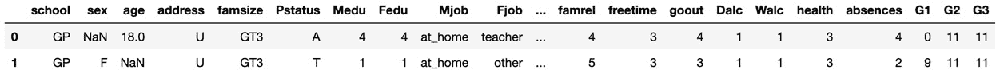

# 第十章：*第十章*: XGBoost 模型部署

在本章关于 XGBoost 的最后一部分，您将把所有内容结合起来，并开发新的技术，构建一个适应行业需求的强大机器学习模型。将模型部署到行业环境中与为研究和竞赛构建模型有所不同。在行业中，自动化非常重要，因为新数据会频繁到达。更多的重视放在流程上，而不是通过微调机器学习模型来获得微小的百分比提升。

本章中，您将获得与**独热编码**和**稀疏矩阵**相关的丰富经验。此外，您还将实现并自定义 scikit-learn 转换器，以自动化机器学习管道，对包含**分类**和**数值**列的混合数据进行预测。到本章结束时，您的机器学习管道将准备好处理任何新来的数据。

在本章中，我们将讨论以下主题：

+   编码混合数据

+   自定义 scikit-learn 转换器

+   完成 XGBoost 模型

+   构建机器学习管道

# 技术要求

本章的代码可以在[`github.com/PacktPublishing/Hands-On-Gradient-Boosting-with-XGBoost-and-Scikit-learn/tree/master/Chapter10`](https://github.com/PacktPublishing/Hands-On-Gradient-Boosting-with-XGBoost-and-Scikit-learn/tree/master/Chapter10)找到。

# 编码混合数据

想象一下，您正在为一家教育科技公司工作，您的工作是预测学生成绩，以便为弥补技术技能差距的服务提供目标。您的第一步是将包含学生成绩的数据加载到`pandas`中。

## 加载数据

由公司提供的学生表现数据集，可以通过加载已为您导入的`student-por.csv`文件来访问。

首先导入`pandas`并关闭警告。然后，下载数据集并查看前五行：

```py
import pandas as pd
import warnings
warnings.filterwarnings('ignore')
df = pd.read_csv('student-por.csv')
df.head()
```

这里是预期的输出：


图 10.1 – 学生表现数据集的原始样子

欢迎来到行业世界，在这里数据并不总是如预期那样呈现。

推荐的选项是查看 CSV 文件。可以在 Jupyter Notebook 中通过定位到本章节的文件夹并点击`student-por.csv`文件来实现。

您应该看到如下内容：


图 10.2 – 学生表现 CSV 文件

如前图所示，数据是通过分号分隔的。CSV 代表`pandas`，它带有一个`sep`参数，表示**分隔符**，可以将其设置为分号（*;*），如下所示：

```py
df = pd.read_csv('student-por.csv', sep=';')
df.head()
```

这里是预期的输出：


图 10.3 – 学生表现数据集

现在，DataFrame 看起来符合预期，包含了分类值和数值的混合数据，我们必须清理**空值**。

## 清理空值

你可以通过在`df.insull()`上调用`.sum()`方法来查看所有包含空值的列。以下是结果的摘录：

```py
df.isnull().sum()
school        0
sex           1
age           1
address       0
…
health        0
absences      0
G1            0
G2            0
G3            0
dtype: int64
```

你可以通过将`df.isna().any(axis=1)`放入括号中与`df`一起使用，来查看这些列的行：

```py
df[df.isna().any(axis=1)]
```

以下是预期的输出：



图 10.4 – 学生成绩数据集的空数据

最好将空列显示在中间，Jupyter 默认会删除它们，因为列数较多。可以通过将`max columns`设置为`None`来轻松修正，如下所示：

```py
pd.options.display.max_columns = None
```

现在，再次运行代码会显示所有的列：

```py
df[df.isna().any(axis=1)]
```

以下是预期的输出摘录：


图 10.5 – 学生成绩数据集中所有行的空数据

如你所见，所有列，包括`'guardian'`下隐藏的空值，现已显示。

数值型空值可以设置为`-999.0`，或其他值，XGBoost 将使用`missing`超参数为你找到最佳替代值，正如在*第五章*中介绍的那样，*XGBoost 揭示*。

下面是用`-999.0`填充`'age'`列的代码：

```py
df['age'].fillna(-999.0)
```

接下来，类别列可以通过众数进行填充。众数是列中最常见的值。用众数填充类别列可能会扭曲结果分布，但只有在空值数量很大时才会发生。然而，我们只有两个空值，所以我们的分布不会受到影响。另一种选择是将类别空值替换为`'unknown'`字符串，经过独热编码后，这个字符串可能会变成一个单独的列。需要注意的是，XGBoost 需要数值型输入，因此从 2020 年起，`missing`超参数不能直接应用于类别列。

以下代码将`'sex'`和`'guardian'`这两列类别数据转换为众数：

```py
df['sex'] = df['sex'].fillna(df['sex'].mode())
df['guardian'] = df['guardian'].fillna(df['guardian'].mode())
```

由于我们的空值出现在前两行，我们可以通过使用`df.head()`来显示它们已经被更改：

```py
df.head()
```

以下是预期的输出：


图 10.6 – 删除空值后的学生成绩数据集（仅显示前五行）

空值已经按预期被清除。

接下来，我们将使用独热编码将所有类别列转换为数值列。

## 独热编码

之前，我们使用`pd.get_dummies`将所有类别变量转换为`0`和`1`的数值，其中`0`表示缺失，`1`表示存在。虽然这种方法是可以接受的，但它也存在一些不足之处。

第一个缺点是`pd.get_dummies`在计算上可能非常昂贵，就像你在前几章等待代码运行时所发现的那样。第二个缺点是`pd.get_dummies`在转换到 scikit-learn 的管道时效果不太好，这是我们将在下一节中探讨的概念。

一个不错的`pd.get_dummies`替代方案是 scikit-learn 的`OneHotEncoder`。与`pd.get_dummies`类似，独热编码将所有类别值转换为`0`和`1`，其中`0`表示缺失，`1`表示存在，但与`pd.get_dummies`不同的是，它并不在计算上昂贵。`OneHotEncoder`使用稀疏矩阵而不是密集矩阵，从而节省空间和时间。

稀疏矩阵通过只存储不包含零的值来节省空间。通过使用更少的位数，保存了相同的信息量。

此外，`OneHotEncoder`是一个 scikit-learn 的转换器，意味着它是专门设计用来在机器学习管道中使用的。

在以前的 scikit-learn 版本中，`OneHotEncoder`只接受数值输入。在那时，需要使用`LabelEncoder`先将所有类别列转换为数值列，作为中间步骤。

要在特定列上使用`OneHotEncoder`，可以按照以下步骤进行：

1.  将所有`dtype`为对象的类别列转换为列表：

    ```py
    categorical_columns = df.columns[df.dtypes==object].tolist()
    ```

1.  导入并初始化`OneHotEncoder`：

    ```py
    from sklearn.preprocessing import OneHotEncoder
    ohe = OneHotEncoder()
    ```

1.  在列上使用`fit_transform`方法：

    ```py
    hot = ohe.fit_transform(df[categorical_columns])
    ```

1.  `0`或`1`。

1.  如果你想查看`hot`稀疏矩阵的实际样子，可以按如下方式打印出来：

    ```py
    print(hot)
    ```

    这是结果的一个摘录：

    ```py
      (0, 0)		1.0
      (0, 2)		1.0
      (0, 5)		1.0
      (0, 6)		1.0
      (0, 8)		1.0
    …  
    0 have been skipped. For instance, the 0th row and the 1st column, denoted by (0, 1), has a value of 0.0 in the dense matrix, but it's skipped over in the one-hot matrix.
    ```

如果你想获得更多关于稀疏矩阵的信息，只需输入以下变量：

```py
hot
```

结果如下：

```py
<649x43 sparse matrix of type '<class 'numpy.float64'>'
	with 11033 stored elements in Compressed Sparse Row format>
```

这告诉我们，矩阵是`649`行`43`列，但只有`11033`个值被存储，从而节省了大量空间。请注意，对于包含许多零的文本数据，稀疏矩阵是非常常见的。

## 合并独热编码矩阵和数值列

现在我们拥有一个独热编码的稀疏矩阵，接下来我们需要将它与原始 DataFrame 的数值列合并。

首先，让我们分离数值列。可以使用`df.select_dtypes`的`exclude=["object"]`参数来选择特定类型的列，方法如下：

```py
cold_df = df.select_dtypes(exclude=["object"])
cold_df.head()
```

这是预期的输出：


图 10.8 – 学生表现数据集的数值列

这些就是我们要查找的列。

对于这种规模的数据，我们可以选择将稀疏矩阵转换为常规的 DataFrame，如前面的截图所示，或者将这个 DataFrame 转换为稀疏矩阵。我们将选择后者，因为行业中的 DataFrame 可能非常庞大，节省空间是有利的：

1.  要将`cold_df` DataFrame 转换为压缩稀疏矩阵，请从`scipy.sparse`导入`csr_matrix`并将 DataFrame 放入其中，如下所示：

    ```py
    from scipy.sparse import csr_matrix
    cold = csr_matrix(cold_df)
    ```

1.  最后，通过导入并使用`hstack`，将热矩阵和冷矩阵堆叠起来，`hstack`将稀疏矩阵水平组合：

    ```py
    from scipy.sparse import hstack
    final_sparse_matrix = hstack((hot, cold))
    ```

1.  通过将稀疏矩阵转换为密集矩阵并像往常一样显示数据框，验证`final_sparse_matrix`是否按预期工作：

    ```py
    final_df = pd.DataFrame(final_sparse_matrix.toarray())
    final_df.head()
    ```

    这是预期的输出：


图 10.9 – 最终稀疏矩阵的数据框

输出被向右移动，以显示一热编码和数值列一起呈现。

现在数据已准备好进行机器学习，让我们使用变换器和流水线自动化这个过程。

# 定制 Scikit-learn 变换器

现在我们有了一个将数据框转换为适合机器学习的稀疏矩阵的过程，将其用变换器进行泛化，以便可以轻松地为新的数据重复这个过程，将会是一个有利的选择。

Scikit-learn 的变换器通过使用`fit`方法与机器学习算法一起工作，`fit`方法用于找到模型参数，`transform`方法则将这些参数应用于数据。这些方法可以合并为一个`fit_transform`方法，在一行代码中同时完成拟合和变换数据。

当一起使用时，各种变换器，包括机器学习算法，可以在同一流水线中协同工作，便于使用。然后，数据被放入流水线中，进行拟合和变换，以实现期望的输出。

Scikit-learn 提供了许多优秀的变换器，例如`StandardScaler`和`Normalizer`分别用于标准化和归一化数据，`SimpleImputer`用于转换空值。然而，当数据包含混合类别和数值列时（如本例所示），你需要小心。在某些情况下，Scikit-learn 提供的选项可能不是自动化的最佳选择。在这种情况下，值得创建你自己的变换器来精确地完成你想要的操作。

## 定制变换器

创建你自己的变换器的关键是使用 Scikit-learn 的`TransformerMixin`作为父类。

这是在 Scikit-learn 中创建定制变换器的一般代码框架：

```py
class YourClass(TransformerMixin):
    def __init__(self):
        None
    def fit(self, X, y=None):
        return self
    def transform(self, X, y=None):
        # insert code to transform X
        return X
```

如你所见，你无需初始化任何内容，`fit`方法可以始终返回`self`。简而言之，你可以将所有用于变换数据的代码放在`transform`方法下。

现在你已经了解了定制化的一般操作方式，让我们创建一个定制的变换器，用来处理不同类型的空值。

### 定制混合空值填充器

让我们通过创建一个定制的混合空值填充器来看看这个如何工作。这里，定制化的原因是为了处理不同类型的列，并采用不同的方式修正空值。

以下是步骤：

1.  导入`TransformerMixin`并定义一个新类，以`TransformerMixin`作为父类：

    ```py
    from sklearn.base import TransformerMixin 
    class NullValueImputer(TransformerMixin):
    ```

1.  使用`self`作为输入初始化类。如果这个操作没有实际作用也没关系：

    ```py
    def __init__(self):
    None
    ```

1.  创建一个`fit`方法，接受`self`和`X`作为输入，`y=None`，并返回`self`：

    ```py
    def fit(self, X, y=None):
    return self
    ```

1.  创建一个`transform`方法，该方法接受`self`和`X`作为输入，`y=None`，并通过返回一个新的`X`来转换数据，如下所示：

    ```py
    def transform(self, X, y=None):
    ```

    我们需要根据列的不同单独处理空值。

    以下是将空值转换为众数或`-999.0`的步骤，具体取决于列的类型：

    a) 通过将列转换为列表来循环遍历列：

    ```py
    for column in X.columns.tolist():
    ```

    b) 在循环中，通过检查哪些列是`object`类型来访问字符串列：

    ```py
        if column in X.columns[X.dtypes==object].tolist():
    ```

    c) 将字符串（`object`）列的空值转换为众数：

    ```py
            X[column] = X[column].fillna(X[column].mode())
    ```

    d) 否则，将列填充为`-999.0`：

    ```py
        else:
            X[column]=X[column].fillna(-999.0)
          return X
    ```

在前面的代码中，你可能会想知道为什么使用了`y=None`。原因是，当将机器学习算法纳入管道时，`y`将作为输入使用。通过将`y`设置为`None`，只会对预测列进行预期的更改。

现在定制的插补器已经定义完成，可以通过在数据上调用`fit_transform`方法来使用它。

通过从 CSV 文件创建一个新的 DataFrame 并使用定制的`NullValueImputer`在一行代码中转换空值，来重置数据：

```py
df = pd.read_csv('student-por.csv', sep=';')
nvi = NullValueImputer().fit_transform(df)
nvi.head()
```

这里是期望的输出：


图 10.10 – 使用 NullValueImputer()后的学生表现 DataFrame

如你所见，所有空值都已清除。

接下来，让我们像之前一样将数据转换为独热编码的稀疏矩阵。

### 独热编码混合数据

我们将采取与上一节类似的步骤，通过创建一个定制的转换器对分类列进行独热编码，然后将它们与数值列合并为一个稀疏矩阵（对于这个大小的数据集，密集矩阵也可以）：

1.  定义一个新的类，继承`TransformerMixin`作为父类：

    ```py
    class SparseMatrix(TransformerMixin):
    ```

1.  用`self`作为输入初始化类。如果这没有任何作用也没关系：

    ```py
    def __init__(self):
        		None
    ```

1.  创建一个`fit`方法，该方法接受`self`和`X`作为输入并返回`self`：

    ```py
    def fit(self, X, y=None):
        		return self
    ```

1.  创建一个`transform`方法，该方法接受`self`和`X`作为输入，转换数据并返回新的`X`：

    ```py
    def transform(self, X, y=None):
    ```

    以下是完成转换的步骤；首先访问仅包含`object`类型的分类列，如下所示：

    a) 将分类列放入一个列表中：

    ```py
        		categorical_columns= X.columns[X.dtypes==object].tolist()
    ```

    b) 初始化`OneHotEncoder`：

    ```py
        		ohe = OneHotEncoder() 
    ```

    c) 使用`OneHotEncoder`转换分类列：

    ```py
    hot = ohe.fit_transform(X[categorical_columns])
    ```

    d) 通过排除字符串，创建一个仅包含数值列的 DataFrame：

    ```py
    cold_df = X.select_dtypes(exclude=["object"])
    ```

    e) 将数值型 DataFrame 转换为稀疏矩阵：

    ```py
            	cold = csr_matrix(cold_df)
    ```

    f) 将两个稀疏矩阵合并为一个：

    ```py
             final_sparse_matrix = hstack((hot, cold))
    ```

    g) 将其转换为**压缩稀疏行**（**CSR**）矩阵，以限制错误。请注意，XGBoost 要求使用 CSR 矩阵，并且根据你的 XGBoost 版本，转换可能会自动发生：

    ```py
             final_csr_matrix = final_sparse_matrix.tocsr()
             return final_csr_matrix
    ```

1.  现在我们可以使用强大的`fit_transform`方法对没有空值的`nvi`数据进行转换：

    ```py
    sm = SparseMatrix().fit_transform(nvi)
    print(sm)
    ```

    这里给出的期望输出已被截断以节省空间：

    ```py
      (0, 0)	1.0
      (0, 2)	1.0
      (0, 5)	1.0
      (0, 6)	1.0
      (0, 8)	1.0
      (0, 10)	1.0
      :	:
      (648, 53)	4.0
      (648, 54)	5.0
      (648, 55)	4.0
      (648, 56)	10.0
      (648, 57)	11.0
      (648, 58)	11.0
    ```

1.  你可以通过将稀疏矩阵转换回密集矩阵来验证数据是否符合预期，方法如下：

    ```py
    sm_df = pd.DataFrame(sm.toarray())
    sm_df.head()
    ```

    以下是预期的密集输出：


图 10.11 – 稀疏矩阵转换为密集矩阵

这看起来是正确的。图中显示第 27 列的值为`0.0`，第 28 列的值为`1.0`。前面的独热编码输出排除了（`0`，`27`），并显示（`0`，`28`）的值为`1.0`，与密集输出匹配。

现在数据已经转换，让我们将两个预处理步骤合并到一个单一的管道中。

## 预处理管道

在构建机器学习模型时，通常会先将数据分为`X`和`y`。在考虑管道时，合理的做法是转换`X`（预测列），而不是`y`（目标列）。此外，重要的是保留一个测试集以供后用。

在将数据放入机器学习管道之前，让我们将数据拆分为训练集和测试集，并保留测试集。我们按以下方式从头开始：

1.  首先将 CSV 文件读取为一个 DataFrame：

    ```py
    df = pd.read_csv('student-por.csv', sep=';')
    ```

    在为学生表现数据集选择`X`和`y`时，需要注意的是，最后三列都包含学生成绩。这里有两个潜在的研究方向值得关注：

    a) 包括之前的成绩作为预测列

    b) 不包括之前的成绩作为预测列

    假设你的 EdTech 公司希望基于社会经济变量进行预测，而不是基于以前获得的成绩，因此忽略前两列成绩，索引为`-2`和`-3`。

1.  选择最后一列作为`y`，并将最后三列以外的所有列作为`X`：

    ```py
    y = df.iloc[:, -1]
    X = df.iloc[:, :-3]
    ```

1.  现在导入`train_test_split`，并将`X`和`y`拆分为训练集和测试集：

    ```py
    from sklearn.model_selection import train_test_split
    X_train, X_test, y_train, y_test = train_test_split(X, y, random_state=2)
    ```

现在让我们按照以下步骤构建管道：

1.  首先从`sklearn.pipeline`导入`Pipeline`：

    ```py
    from sklearn.pipeline import Pipeline
    ```

1.  接下来，使用语法（name，transformer）将元组分配为`Pipeline`中的参数，按顺序排列：

    ```py
    data_pipeline = Pipeline([('null_imputer', NullValueImputer()), ('sparse', SparseMatrix())])
    ```

1.  最后，通过将`X_train`放入`data_pipeline`的`fit_transform`方法中来转换我们的预测列`X_train`：

    ```py
    X_train_transformed = data_pipeline.fit_transform(X_train)
    ```

现在你有了一个数值稀疏矩阵，没有空值，可以作为机器学习的预测列。

此外，你有一个管道，可以通过一行代码转换任何传入的数据！现在让我们完成一个 XGBoost 模型来进行预测。

# 完成 XGBoost 模型的最终调整

现在是时候构建一个稳健的 XGBoost 模型并将其添加到管道中。请按以下方式导入`XGBRegressor`、`numpy`、`GridSearchCV`、`cross_val_score`、`KFold`和`mean_squared_error`：

```py
import numpy as np
from sklearn.model_selection import GridSearchCV
from sklearn.model_selection import cross_val_score, KFold
from sklearn.metrics import mean_squared_error as MSE
from xgboost import XGBRegressor
```

现在让我们构建模型。

## 第一个 XGBoost 模型

这个学生表现数据集在预测列`y_train`方面有一个有趣的值范围，可以如下所示：

```py
y_train.value_counts()
```

结果如下：

```py
11    82
10    75
13    58
12    53
14    42
15    36
9     29
16    27
8     26
17    24
18    14
0     10
7      7
19     1
6      1
5      1
```

如你所见，数值范围从`5`到`19`，并且包括`0`。

由于目标列是有序的，意味着其值是按数字顺序排列的，因此回归方法比分类方法更为合适，尽管输出有限。在通过回归训练模型后，最终结果可能会进行四舍五入，以给出最终预测。

下面是对 `XGBRegressor` 使用此数据集进行评分的步骤：

1.  从设置使用 `KFold` 的交叉验证开始：

    ```py
    kfold = KFold(n_splits=5, shuffle=True, random_state=2)
    ```

1.  现在定义一个交叉验证函数，该函数返回 `cross_val_score`：

    ```py
    def cross_val(model):
        scores = cross_val_score(model, X_train_transformed, y_train, scoring='neg_root_mean_squared_error', cv=kfold)
        rmse = (-scores.mean())
        return rmse
    ```

1.  通过调用 `cross_val` 以 `XGBRegressor` 为输入并将 `missing=-999.0`，为 XGBoost 寻找最佳替代值，建立一个基准分数：

    ```py
    cross_val(XGBRegressor(missing=-999.0))
    ```

    分数如下：

    ```py
    2.9702248207546296
    ```

这是一个值得尊敬的起始分数。`2.97` 的均方根误差，基于 19 种可能性，表示分数的准确性相差不到几个点。这几乎是 15%，在美国 A-B-C-D-F 系统中准确到一个字母等级。在工业界，您甚至可以使用统计学方法来包括置信区间，提供预测区间，这是本书范围之外的推荐策略。

现在您已有了基准分数，让我们微调超参数以改进模型。

## 微调 XGBoost 超参数

我们从检查带有提前停止的 `n_estimators` 开始。回忆一下，为了使用提前停止，我们可能会检查一个测试折叠。创建测试折叠需要进一步划分 `X_train` 和 `y_train`：

1.  这是第二个 `train_test_split`，可用于创建一个测试集进行验证，同时确保将真实的测试集保留到后期：

    ```py
    X_train_2, X_test_2, y_train_2, y_test_2 = train_test_split(X_train_transformed, y_train, random_state=2)
    ```

1.  现在定义一个函数，使用提前停止来返回回归器的最佳估计器数量（参见 *第六章*，XGBoost 超参数）：

    ```py
    def n_estimators(model):
        eval_set = [(X_test_2, y_test_2)]
        eval_metric="rmse"
        model.fit(X_train_2, y_train_2, eval_metric=eval_metric, eval_set=eval_set, early_stopping_rounds=100)
        y_pred = model.predict(X_test_2)
        rmse = MSE(y_test_2, y_pred)**0.5
        return rmse  
    ```

1.  现在运行 `n_estimators` 函数，将最大值设置为 `5000`：

    ```py
    n_estimators(XGBRegressor(n_estimators=5000, missing=-999.0))
    ```

    下面是输出的最后五行：

    ```py
    [128]	validation_0-rmse:3.10450
    [129]	validation_0-rmse:3.10450
    [130]	validation_0-rmse:3.10450
    [131]	validation_0-rmse:3.10450
    Stopping. Best iteration:
    [31]	validation_0-rmse:3.09336
    ```

    分数如下：

    ```py
    3.0933612343143153
    ```

使用我们默认的模型，31 个估计器目前给出最佳估算值。这将是我们的起点。

接下来，这是一个我们多次使用的 `grid_search` 函数，它搜索超参数网格并显示最佳参数和最佳分数：

```py
def grid_search(params, reg=XGBRegressor(missing=-999.0)):
    grid_reg = GridSearchCV(reg, params, scoring='neg_mean_squared_error', cv=kfold)
    grid_reg.fit(X_train_transformed, y_train)
    best_params = grid_reg.best_params_
    print("Best params:", best_params)
    best_score = np.sqrt(-grid_reg.best_score_)
    print("Best score:", best_score)
```

以下是一些推荐的模型微调步骤：

1.  从将 `max_depth` 范围设置为 `1` 到 `8` 开始，同时将 `n_estimators` 设置为 `31`：

    ```py
    grid_search(params={'max_depth':[1, 2, 3, 4, 6, 7, 8], 
                        'n_estimators':[31]})
    ```

    结果如下：

    ```py
    Best params: {'max_depth': 1, 'n_estimators': 31}
    Best score: 2.6634430373079425
    ```

1.  将 `max_depth` 从 `1` 缩小到 `3`，同时将 `min_child_weight` 范围设定为 `1` 到 `5`，并保持 `n_estimators` 为 `31`：

    ```py
    grid_search(params={'max_depth':[1, 2, 3], 
                        'min_child_weight':[1,2,3,4,5], 
                        'n_estimators':[31]})
    ```

    结果如下：

    ```py
    Best params: {'max_depth': 1, 'min_child_weight': 1, 'n_estimators': 31}
    Best score: 2.6634430373079425
    ```

    没有改进。

1.  通过强制将 `min_child_weight` 设置为 `2` 或 `3`，同时包含 `subsample` 范围从 `0.5` 到 `0.9`，你可能可以保证一些变化。此外，增加 `n_estimators` 可能有助于为模型提供更多学习时间：

    ```py
    grid_search(params={'max_depth':[2],
                        'min_child_weight':[2,3],
                        'subsample':[0.5, 0.6, 0.7, 0.8, 0.9],
                       'n_estimators':[31, 50]})
    ```

    结果如下：

    ```py
    Best params: {'max_depth': 1, 'min_child_weight': 2, 'n_estimators': 50, 'subsample': 0.9}
    Best score: 2.665209161229433
    ```

    分数几乎相同，但略有下降。

1.  缩小 `min_child_weight` 和 `subsample` 的范围，同时将 `colsample_bytree` 设置为 `0.5` 到 `0.9` 的范围：

    ```py
    grid_search(params={'max_depth':[1],
                        'min_child_weight':[1, 2, 3], 
                        'subsample':[0.6, 0.7, 0.8], 
                        'colsample_bytree':[0.5, 0.6, 0.7, 0.8, 0.9, 1],
                       'n_estimators':[50]})
    ```

    结果如下：

    ```py
    Best params: {'colsample_bytree': 0.9, 'max_depth': 1, 'min_child_weight': 3, 'n_estimators': 50, 'subsample': 0.8}
    Best score: 2.659649642579931
    ```

    这是目前为止最好的分数。

1.  保持当前最优值，尝试`colsample_bynode`和`colsample_bylevel`的范围从`0.6`到`1.0`：

    ```py
     grid_search(params={'max_depth':[1],
                        'min_child_weight':[3], 
                        'subsample':[.8], 
                        'colsample_bytree':[0.9],
                        'colsample_bylevel':[0.6, 0.7, 0.8, 0.9, 1],
                        'colsample_bynode':[0.6, 0.7, 0.8, 0.9, 1],
                        'n_estimators':[50]})
    ```

    结果如下：

    ```py
    Best params: {'colsample_bylevel': 0.9, 'colsample_bynode': 0.8, 'colsample_bytree': 0.9, 'max_depth': 1, 'min_child_weight': 3, 'n_estimators': 50, 'subsample': 0.8}
    Best score: 2.64172735526102
    ```

    得分再次提高。

进一步尝试使用基础学习器`dart`和`gamma`，但未获得新收益。

根据项目的时间和范围，可能值得进一步调整超参数，甚至将它们一起放入`RandomizedSearch`中尝试。在工业界，你很有可能可以访问到云计算，在这里，廉价的、可抢占的**虚拟机**（**VMs**）将允许更多的超参数搜索，以找到更好的结果。只需要注意的是，scikit-learn 目前没有提供一种方法来停止耗时的搜索，以便在代码完成之前保存最佳参数。

现在我们有了一个健壮的模型，可以继续前进并测试该模型。

## 测试模型

现在你有了一个潜在的最终模型，重要的是在测试集上对它进行测试。

记住，测试集在我们的管道中并没有进行转化。幸运的是，此时只需要一行代码即可将其转化：

```py
X_test_transformed = data_pipeline.fit_transform(X_test)
```

现在我们可以使用之前部分中选择的最佳超参数初始化一个模型，拟合训练集，并在保留的测试集上进行测试：

```py
model = XGBRegressor(max_depth=2, min_child_weight=3, subsample=0.9, colsample_bytree=0.8, gamma=2, missing=-999.0)
model.fit(X_train_transformed, y_train)
y_pred = model.predict(X_test_transformed)
rmse = MSE(y_pred, y_test)**0.5
rmse
```

得分如下：

```py
2.7908972630881435
```

得分稍微高一些，尽管这可能是由于折叠的原因。

如果没有的话，我们的模型可能在验证集上拟合得过于紧密，这在微调超参数并将其精确调整以改进验证集时是可能发生的。模型的泛化能力还不错，但它可以有更好的泛化能力。

对于接下来的步骤，当考虑是否可以改进得分时，以下选项是可用的：

+   返回超参数微调。

+   保持模型不变。

+   根据超参数知识进行快速调整。

快速调整超参数是可行的，因为模型可能会过拟合。例如，增加`min_child_weight`并降低`subsample`应该有助于模型更好地泛化。

让我们进行最终的调整，得到一个最终模型：

```py
model = XGBRegressor(max_depth=1,
                       min_child_weight=5,
                       subsample=0.6, 
                       colsample_bytree=0.9, 
                       colsample_bylevel=0.9,
                       colsample_bynode=0.8,
                     n_estimators=50,
                       missing=-999.0)
model.fit(X_train_transformed, y_train)
y_pred = model.predict(X_test_transformed)
rmse = MSE(y_pred, y_test)**0.5
rmse
```

结果如下：

```py
2.730601403138633
```

请注意，得分已经提高。

此外，你绝对不应该反复尝试提高验证集得分。在收到测试得分后进行少许调整是可以接受的；否则，你永远无法在第一次结果的基础上进行改进。

现在剩下的就是完成管道。

# 构建机器学习管道

完成机器学习管道需要将机器学习模型添加到之前的管道中。你需要在`NullValueImputer`和`SparseMatrix`之后，得到一个机器学习元组，如下所示：

```py
full_pipeline = Pipeline([('null_imputer', NullValueImputer()),  ('sparse', SparseMatrix()), 
('xgb', XGBRegressor(max_depth=1, min_child_weight=5, subsample=0.6, colsample_bytree=0.9, colsample_bylevel=0.9, colsample_bynode=0.8, missing=-999.0))]) 
```

这个管道现在已经完成了机器学习模型，并且它可以在任何`X`，`y`组合上进行拟合，如下所示：

```py
full_pipeline.fit(X, y)
```

现在你可以对任何目标列未知的数据进行预测：

```py
new_data = X_test
full_pipeline.predict(new_data)
```

这是预期输出的前几行：

```py
array([13.55908  ,  8.314051 , 11.078157 , 14.114085 , 12.2938385, 11.374797 , 13.9611025, 12.025812 , 10.80344  , 13.479145 , 13.02319  ,  9.428679 , 12.57761  , 12.405045 , 14.284043 , 8.549758 , 10.158956 ,  9.972576 , 15.502667 , 10.280028 , ...
```

为了得到更真实的预测，数据可能需要按如下方式四舍五入：

```py
np.round(full_pipeline.predict(new_data))
```

期望的输出如下：

```py
array([14.,  8., 11., 14., 12., 11., 14., 12., 11., 13., 13.,  9., 13., 12., 14.,  9., 10., 10., 16., 10., 13., 13.,  7., 12.,  7.,  8., 10., 13., 14., 12., 11., 12., 15.,  9., 11., 13., 12., 11.,  8.,
...
11., 13., 12., 13.,  9., 13., 10., 14., 12., 15., 15., 11., 14., 10., 14.,  9.,  9., 12., 13.,  9., 11., 14., 13., 11., 13., 13., 13., 13., 11., 13., 14., 15., 13.,  9., 10., 13.,  8.,  8., 12., 15., 14., 13., 10., 12., 13.,  9.], dtype=float32)
```

最后，如果新数据到达，可以将其与之前的数据连接，并通过相同的管道处理，从而得到一个更强大的模型，因为新的模型可能会基于更多的数据进行训练，如下所示：

```py
new_df = pd.read_csv('student-por.csv')
new_X = df.iloc[:, :-3]
new_y = df.iloc[:, -1]
new_model = full_pipeline.fit(new_X, new_y)
```

现在，这个模型可以用于对新数据进行预测，如以下代码所示：

```py
more_new_data = X_test[:25]
np.round(new_model.predict(more_new_data))
```

期望的输出如下：

```py
array([14.,  8., 11., 14., 12., 11., 14., 12., 11., 13., 13.,  9., 13., 12., 14.,  9., 10., 10., 16., 10., 13., 13.,  7., 12.,  7.],
      dtype=float32)
```

有一个小小的细节。

如果你只想对一行数据进行预测怎么办？如果你将单行数据通过管道处理，生成的稀疏矩阵将没有正确的列数，因为它只会对单行数据中存在的类别进行独热编码。这将导致数据中的*不匹配*错误，因为机器学习模型已经适配了一个需要更多数据行的稀疏矩阵。

一个简单的解决方法是将新的一行数据与足够多的行数据连接起来，以确保生成的稀疏矩阵包含所有可能的类别列并进行转换。我们已经看到，这样操作使用`X_test`中的 25 行数据是有效的，因为没有出现错误。使用`X_test`中的 20 行或更少的数据将导致在这种情况下出现不匹配错误。

因此，如果你想用单行数据进行预测，可以将这一行数据与`X_test`的前`25`行连接，并按如下方式进行预测：

```py
single_row = X_test[:1]
single_row_plus = pd.concat([single_row, X_test[:25]])
print(np.round(new_model.predict(single_row_plus))[:1])
```

结果是这样的：

```py
[14.]
```

你现在知道如何将机器学习模型纳入管道，以对新数据进行转换和预测。

# 总结

恭喜你完成了本书！这是一次非凡的旅程，从基础的机器学习和`pandas`开始，到最终构建自己定制的转换器、管道和函数，以便在工业场景中使用稀疏矩阵部署强大、精细调优的 XGBoost 模型进行新数据预测。

在此过程中，你了解了 XGBoost 的故事，从最初的决策树到随机森林和梯度提升，再到发现使 XGBoost 如此特别的数学细节和复杂性。你一次又一次地看到 XGBoost 超越了其他机器学习算法，并且你获得了调优 XGBoost 广泛超参数的实践经验，包括`n_estimators`、`max_depth`、`gamma`、`colsample_bylevel`、`missing`和`scale_pos_weight`。

你了解了物理学家和天文学家如何通过历史上重要的案例研究获得关于我们宇宙的知识，并且通过不平衡数据集和替代基本学习器的应用，深入了解了 XGBoost 的广泛范围。你甚至通过先进的特征工程、非相关集成和堆叠等技巧，从 Kaggle 竞赛中学到了行业技巧。最后，你了解了工业中的高级自动化过程。

此时，你对 XGBoost 的知识已经达到高级水平。你现在可以高效、迅速、强大地使用 XGBoost 来解决你将面对的机器学习问题。当然，XGBoost 并不完美。如果你处理的是非结构化数据，比如图像或文本，**神经网络**可能会更适合你。对于大多数机器学习任务，尤其是表格数据的任务，XGBoost 通常会给你带来优势。

如果你有兴趣继续深入研究 XGBoost，我个人的建议是参加 Kaggle 竞赛。原因是 Kaggle 竞赛汇聚了经验丰富的机器学习从业者，与他们竞争会让你变得更强。此外，Kaggle 竞赛提供了一个结构化的机器学习环境，许多从业者都在同一个问题上进行工作，这导致了共享笔记本和论坛讨论，进一步促进了学习过程。这也是 XGBoost 在希格斯玻色子竞赛中首次建立起非凡声誉的地方，如本书所述。

你现在可以自信地使用 XGBoost 进入大数据领域，推动研究、参加竞赛，并构建适合生产的机器学习模型。
