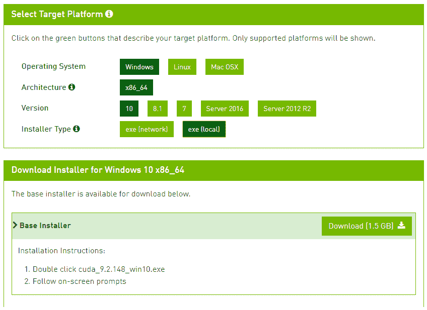
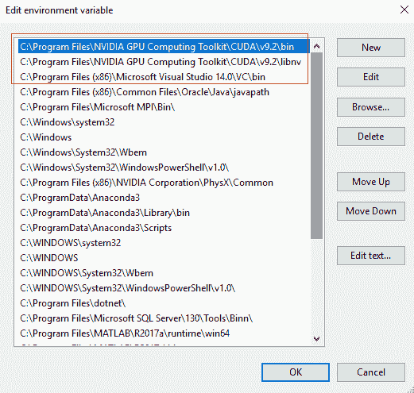
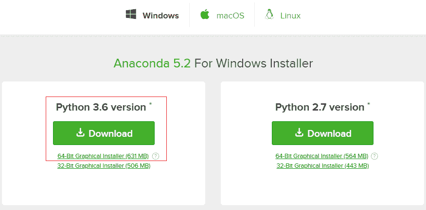
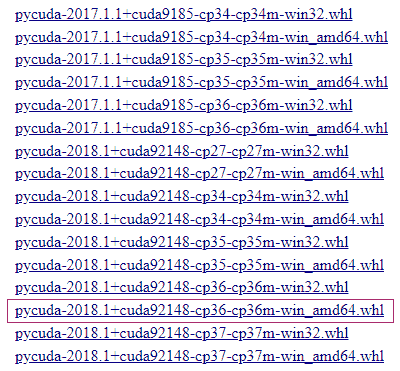
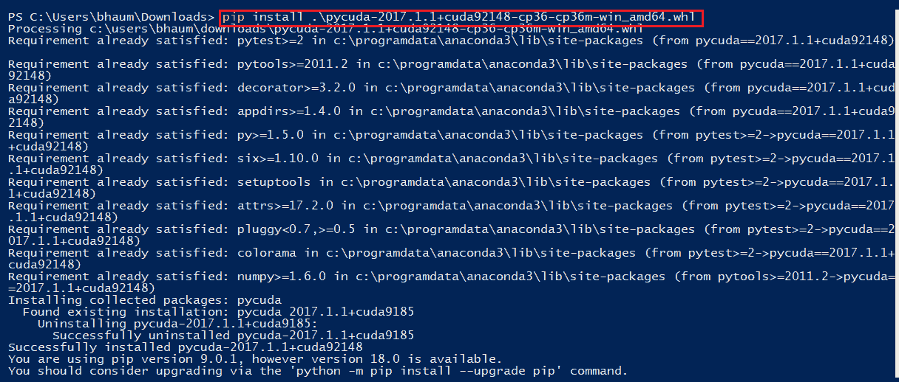
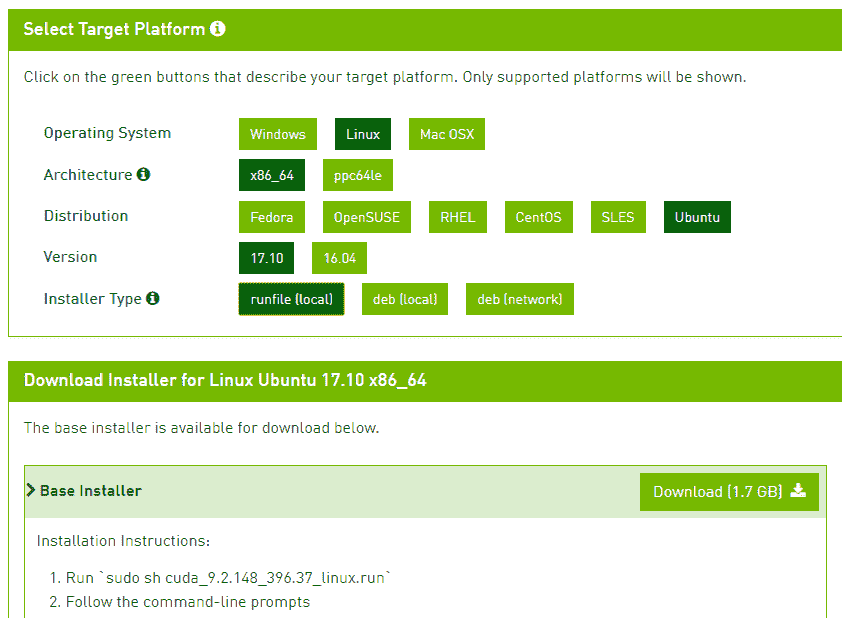
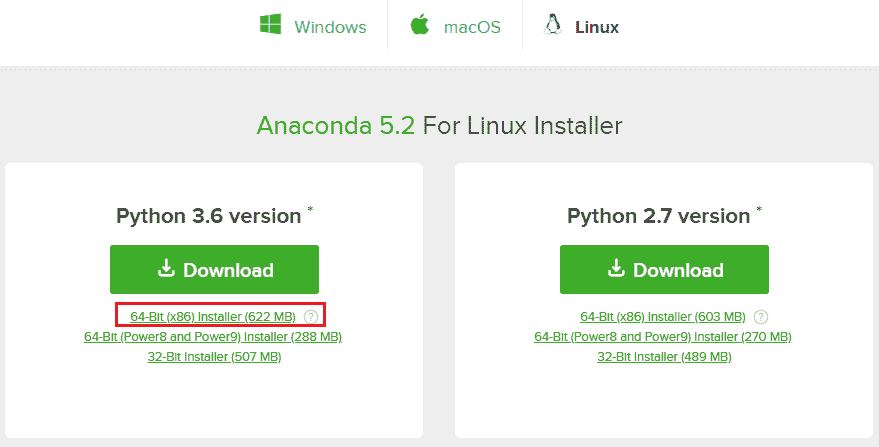
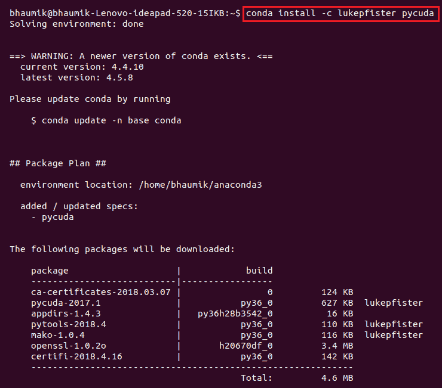
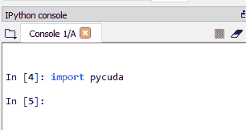

# 第十章：PyCUDA 入门

我们已经看到如何使用 OpenCV 和 CUDA 加速各种应用。我们使用了 C 或 C++ 作为编程语言。如今，Python 在许多领域都非常流行，因此如果我们能够使用 CUDA 加速 Python 应用程序，将会非常有用。Python 提供了一个 PyCUDA 模块，它正是为此而设计的。

它使用 Nvidia CUDA 工具包，这反过来又需要在计算机上安装 Nvidia 显卡。本章将介绍 Python 语言和 PyCUDA 模块，特别是。它将讨论在 Windows 和 Linux 操作系统上安装 PyCUDA 模块的安装过程。尽管本章需要一些对 Python 语言的熟悉，但新来者也能跟随大多数步骤。

本章将涵盖以下主题：

+   Python 编程语言简介

+   PyCUDA 模块简介

+   在 Windows 上安装 PyCUDA

+   在 Ubuntu 上安装 PyCUDA

# 技术要求

本章需要良好的 Python 编程语言理解。它还需要任何配备 Nvidia GPU 的计算机或笔记本电脑。本章中使用的 Windows PyCUDA 安装文件可以从以下 GitHub 链接下载：[`github.com/PacktPublishing/Hands-On-GPU-Accelerated-Computer-Vision-with-OpenCV-and-CUDA`](https://github.com/PacktPublishing/Hands-On-GPU-Accelerated-Computer-Vision-with-OpenCV-and-CUDA)。

# Python 编程语言简介

Python 正在持续增加其受欢迎程度，因为它可以在许多领域使用，具有广泛的应用。它是一种高级编程语言，可以帮助用几行代码表达复杂的系统。Python 语法易于学习，比其他语言如 C++ 和 Java 更易于阅读，这使得它对新手程序员来说更容易学习。

Python 是一种轻量级的脚本语言，可以轻松用于嵌入式应用。此外，它是一种解释型语言，需要解释器而不是编译器，这与其他编程语言不同。这允许程序员逐行执行代码。它需要一个可以在所有操作系统上轻松安装的 Python 解释器。由于 Python 是开源的，因此一个庞大的社区选择与之合作。他们开发了一系列库，并将其开源，因此它可以无成本地用于应用程序。

Python 可以用于各种领域，如数据科学、机器学习、深度学习、数据分析、图像处理、计算机视觉、数据挖掘和网页开发。它几乎为所有提到的操作系统领域提供了现成的模块，有助于快速开发应用程序。本书前面解释过的 OpenCV 库也具有 Python 接口。因此，它可以轻松地与 Python 代码集成，用于计算机视觉应用程序。Python 还具有用于机器学习和深度学习的库，可以与 OpenCV 一起用于计算机视觉应用程序。

类似于 Python 这样的解释语言的一个缺点是，它比编译语言如 C 或 C++ 慢得多。Python 有一个特性，可以在 Python 脚本中集成 C 或 C++ 代码。这允许你使用 Python 包装器编写计算密集型的 C 或 C++ 代码。

# PyCUDA 模块简介

在最后一节中，我们看到了使用 Python 编程语言的优势。还提到 Python 比 C 或 C++ 慢得多。因此，如果它能利用 GPU 的并行处理能力，将会很有益。Python 提供了一个 PyCUDA 包装器，可以通过使用 Nvidia CUDA API 来利用 GPU 的并行计算能力。Python 还有一个 `PyOpenCL` 模块，可以用于任何 GPU 上的并行计算。

然后，你可能会有一个疑问，为什么你必须使用 PyCUDA，它是专门针对 Nvidia GPU 的。使用 PyCUDA 相比其他类似模块有许多优势；以下是一些原因：

+   它为 Python 开发者提供了一个与 CUDA API 交互的简单接口，并且有良好的文档，这使得学习变得容易。

+   可以使用 PyCUDA 模块在 Python 代码中利用 Nvidia 提供的 CUDA API 的全部功能。

+   PyCUDA 的基础层是用 C++ 编写的，这使得它更快。

+   它具有更高的抽象级别，与基于 Nvidia C 的运行时 API 相比，使用起来更简单。

+   它具有非常高效的内存管理机制，与对象的生存期相关联的对象清理功能。这个特性帮助它编写正确的代码，没有内存泄漏或崩溃。

+   CUDA 代码中的错误也可以通过 Python 异常来处理，这有助于代码中的错误处理机制。

本节描述了使用 PyCUDA 加速 Python 应用程序的优势。在下一节中，我们将看到如何在 Windows 和 Ubuntu 操作系统上安装 PyCUDA 的步骤。

# 在 Windows 上安装 PyCUDA

本节将描述在 Windows 操作系统上安装 PyCUDA 的步骤。演示使用的是 Windows 10，但该过程适用于任何较新的 Windows 版本。以下是步骤描述：

1.  如果您尚未安装 CUDA 工具包，如第一章所述，请从[`developer.nvidia.com/cuda-downloads`](https://developer.nvidia.com/cuda-downloads)下载最新的 CUDA 工具包。它将询问您的操作系统、CPU 架构以及是否通过互联网安装或先下载整个安装程序。如下面的截图所示，我们选择了带有本地安装程序的 Windows 10。您可以根据您的设置选择相应的值：

1.  双击下载的安装程序并按照屏幕提示安装 CUDA 工具包。

1.  安装具有可视化 C++版本的最新 Visual Studio 版本。我们使用的是免费的 Visual Studio 2017 社区版，其可视化 C++路径应添加到路径环境变量中。可以通过右键单击我的电脑（此电脑）|属性|高级系统设置|环境变量|系统变量来访问环境变量。在路径环境变量中添加可视化 C++安装和 CUDA 工具包安装的 bin 文件夹路径，如下面的截图所示：

1.  将 Anaconda 分布用作 Python 解释器，因此可以从以下网站下载：[`www.anaconda.com/download/`](https://www.anaconda.com/download/)。我们使用的是 Python 3.6 版本的 Anaconda 5.2，如下面的截图所示：

1.  双击下载的安装程序并按照屏幕提示安装 Anaconda。确保勾选将安装路径添加到路径环境变量的复选框。

1.  根据您的系统设置，从以下链接下载最新的 PyCUDA 二进制文件：[`www.lfd.uci.edu/~gohlke/Pythonlibs/#pycuda`](https://www.lfd.uci.edu/~gohlke/pythonlibs/#pycuda)。我们使用 CUDA 9.2148 和 Python 3.6，因此选择了相应的 PyCUDA 版本，如下所示：

1.  打开命令提示符，转到 PyCUDA 二进制文件下载的文件夹，并执行以下截图所示的命令：

命令将在 Python 分布中完成 PyCUDA 的安装。

# 检查 PyCUDA 安装步骤

以下步骤用于检查 PyCUDA 是否已正确安装：

1.  打开 Spyder，这是一个随 Anaconda 安装一起提供的 Python IDE。您可以在开始菜单中输入`Spyder`来打开它。

1.  在 Spyder IDE 中，如以下截图所示，在 IPython 控制台中输入`import pycuda`。如果没有错误报告，则表示 PyCUDA 已正确安装。

# 在 Ubuntu 上安装 PyCUDA

本节将描述在 Linux 操作系统上安装 PyCUDA 的步骤。以 Ubuntu 为演示，但此过程适用于任何最新的 Linux 发行版。步骤如下：

1.  如果您尚未安装 CUDA 工具包，如第一章所述，请从 [`developer.nvidia.com/cuda-downloads`](https://developer.nvidia.com/cuda-downloads) 下载最新的 CUDA 工具包。它将询问您的操作系统、CPU 架构以及是否通过互联网安装或首先下载整个安装程序。如下面的截图所示，我们选择了带有运行文件（本地）安装程序的 Ubuntu。您可以根据您的设置选择值：

1.  在命令提示符中运行 **sudo sh cuda_9.2.148_396.37_linux.run** 命令以安装 CUDA 工具包。

1.  将使用 Anaconda 发行版作为 Python 解释器，因此可以从网站：[`www.anaconda.com/download/`](https://www.anaconda.com/download/) 下载和安装。我们使用的是带有 Python 3.6 版本的 Anaconda 5.2，如下面的截图所示：

1.  安装 Anaconda 后，在终端中执行以下命令，如下面的截图所示以安装 PyCUDA：

命令将在 Python 发行版中完成 PyCUDA 的安装。

# 检查 PyCUDA 安装的步骤

以下步骤用于检查 PyCUDA 是否已正确安装：

+   打开 Spyder，这是 Anaconda 安装附带的一个 Python IDE。您可以在终端中输入 `Spyder` 来打开它。

+   在 Spyder IDE 中，在 IPython 控制台中输入 `import pycuda`，如下面的截图所示。如果没有错误报告，则表示 PyCUDA 已正确安装。

# 摘要

总结来说，本章介绍了 Python 编程语言及其在各种领域用于广泛应用的用法。与 C 或 C++ 语言相比，它轻量但较慢。因此，如果它能利用 GPU 的并行计算能力，那么它将非常有用。PyCUDA 是一个 Python 包装器，允许 Python 代码利用 Nvidia CUDA API。PyCUDA 相比于 Python 中可用的其他并行处理模块的优势被详细解释。PyCUDA 使用 Nvidia CUDA 运行时 API 和 Python 解释器。Anaconda 是一个著名的 Python 发行版，它附带了许多有用的 Python 库和 IDE，以及 CUDA 工具包。本章讨论了在 Windows 和 Ubuntu 操作系统上安装 PyCUDA 的详细步骤。

在接下来的两章中，我们将详细介绍如何使用 PyCUDA 加速 Python 应用程序。

# 问题

1.  Python 相比于 C 或 C++ 等编程语言有哪些优势？

1.  编译型语言和解释型语言之间的区别是什么？

1.  判断对错：Python 比 C 或 C++ 更快。

1.  PyOpenCL 相比 PyCUDA 的优势是什么？

1.  判断对错：Python 允许在 Python 脚本中使用 C 或 C++ 代码。
