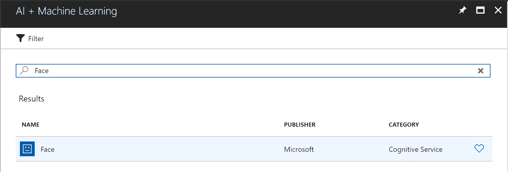
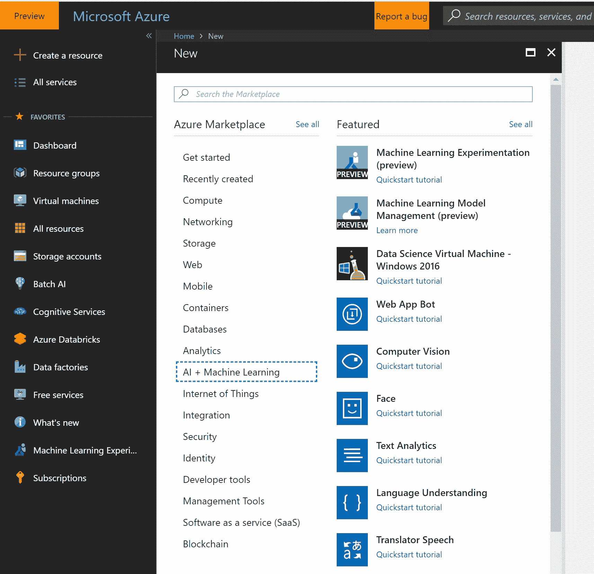
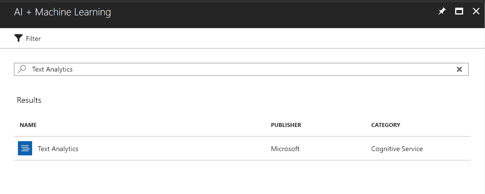
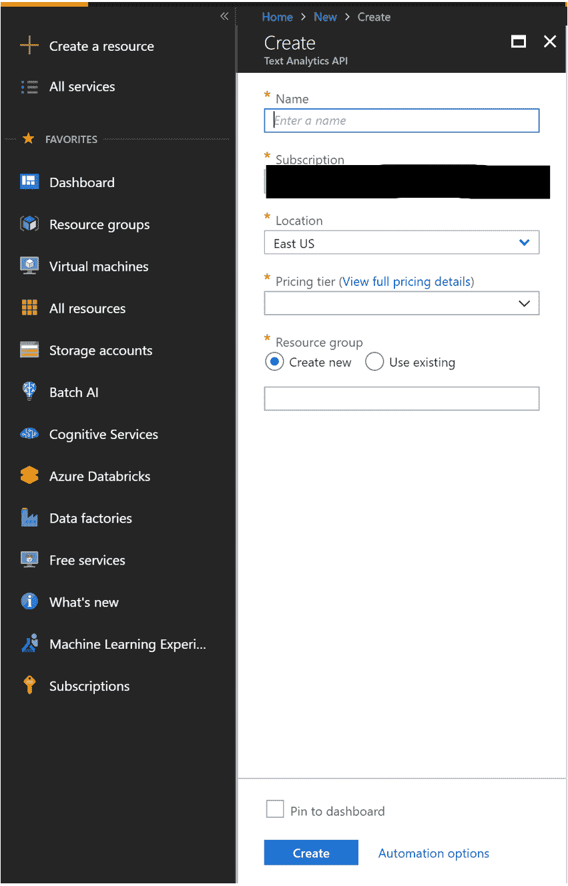
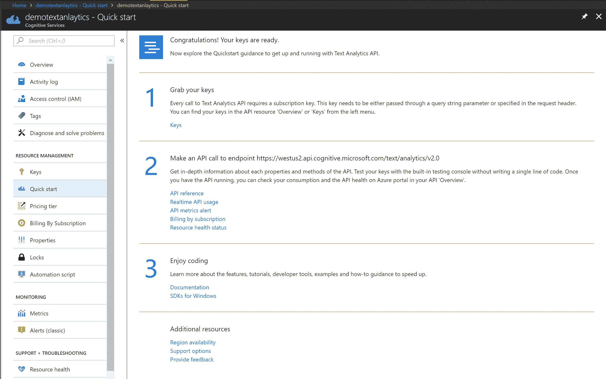
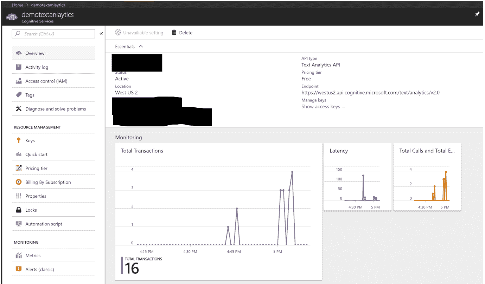

# 第三章：认知服务

认知服务是一组来自微软的预训练 API，允许开发者开发使用 AI 的应用程序，而无需构建机器学习模型。凭借其对边缘部署的支持，开发者可以构建在无人机等设备上使用强大 AI 算法来解释、监听、说话和看的应用程序。

有五个主要类别的 API：

+   视觉

+   语言

+   语音

+   知识

+   搜索

许多这些 API 现在可以定制以满足公司和客户的具体需求。在本章中，我们将查看每个服务类别的概述，并探讨一些示例。

# 视觉 API 的认知服务

视觉 API 帮助您将图像分析功能添加到您的 AI 应用程序中。在撰写本文时，认知服务中包含五个视觉 API：

+   计算机视觉

+   人脸

+   内容审核员

+   视频索引器

+   定制视觉

在本章中，我们将学习前两个 API。其余的我们将留给您自己探索。

# 计算机视觉 API

此 API 根据可识别的对象、生物、动作和风景为图像提供标签。上传图像或指定图像的 URL 后，计算机视觉 API 的算法会提出它在图像中识别的标签。这可能包括主要主题、环境（室内或室外）、家具、工具、植物、动物、配饰和设备。

让我们看看一个示例图像：


我们将其发送到 API，并得到 JSON 格式的输出。这将显示标签以及与每个标签关联的置信度：

| **标签** | ```{ "name": "bench", "confidence": 0.999963641 ...` |
| --- | --- |

# 人脸 API

现在我们来看看视觉类别中的下一个 API，即人脸 API。

这可以用来检测人脸并比较相似的人脸。它还将指示面部特征，包括年龄、情绪、性别和发色。

让我们看看一个示例图像：

![图片

如果我们将此输入图像发送到 API，我们将以 JSON 格式获得以下输出：

```py
//output omitted
"faceAttributes": {
      "hair": {
        "bald": 0.01,
        "invisible": false,
        "hairColor": [
          {
            "color": "blond",
            "confidence": 1.0
          },
          {
            "color": "brown",
            "confidence": 0.87
          },
        //omitted
        ]
      },
      "smile": 0.018,
      "headPose": {
        "pitch": 0.0,
        "roll": 3.2,
        "yaw": -23.3
      },
      "gender": "female",
      "age": 24.4,
      "facialHair": {
        "moustache": 0.0,
        "beard": 0.0,
        "sideburns": 0.0
      },
      "glasses": "NoGlasses",      "makeup": {
        "eyeMakeup": true,
        "lipMakeup": true
      },
      "emotion": {
        "anger": 0.001,
        "contempt": 0.002,
        "disgust": 0.002,
        "fear": 0.0,
        "happiness": 0.018,
        "neutral": 0.969,
        "sadness": 0.006,
        "surprise": 0.002
      },
//output omitted
```

要快速尝试人脸 API，您可以访问以下网址：[`azure.microsoft.com/en-us/services/cognitive-services/face/`](https://azure.microsoft.com/en-us/services/cognitive-services/face/).

就像计算机视觉 API 一样，您可以使用 Python 或任何其他语言调用人脸 API。创建人脸 API 资源的步骤与计算机视觉 API 类似，只是您必须在门户中搜索人脸 API，如下面的截图所示：



关于剩余的视觉 API 的更多信息，您可以访问以下网址：[`azure.microsoft.com/en-us/services/cognitive-services/directory/vision/`](https://azure.microsoft.com/en-us/services/cognitive-services/directory/vision/).

# 语言 API 的认知服务

语言 API 允许我们在我们的 AI 应用程序中添加文本分析、翻译和其他功能。在撰写本文时，认知服务提供了五个语言 API：

+   文本分析

+   翻译文本

+   Bing 拼写检查

+   内容审核员

+   语言理解

在本章中，我们只查看第一个 API。其他 API 我们将留给您自己探索。

# 文本分析

文本分析 API 可以用于从您的文本中检测情感、关键短语、实体和语言。以下是一个示例，将输入文本发送到 API，并得到以下 JSON 格式的输出。文本如下：“我对使用微软的 AI 产品感到兴奋”：

```py
{  "languageDetection": {    "documents": [      {        "id": "fe2529ff-073e-4355-86fa-b927d1b62a23",        "detectedLanguages": [          {            "name": "English",            "iso6391Name": "en",            "score": 1.0          }        ]      }    ],    "errors": []  },  "keyPhrases": {    "documents": [      {        "id": "fe2529ff-073e-4355-86fa-b927d1b62a23",        "keyPhrases": [          "Microsoft's offerings",          "AI space"        ]      }    ],    "errors": []  },  "sentiment": {    "documents": [      {        "id": "fe2529ff-073e-4355-86fa-b927d1b62a23",        "score": 0.93527746200561523      }    ],    "errors": []  },  "entities": {    "documents": [      {        "id": "fe2529ff-073e-4355-86fa-b927d1b62a23",        "entities": [          {            "name": "Microsoft",            "matches": [              {                "text": "Microsoft's",                "offset": 25,                "length": 11              }            ],            "wikipediaLanguage": "en",            "wikipediaId": "Microsoft",            "wikipediaUrl": "https://en.wikipedia.org/wiki/Microsoft",            "bingId": "a093e9b9-90f5-a3d5-c4b8-5855e1b01f85"          },          {            "name": "Ai Space",            "matches": [              {                "text": "AI space",                "offset": 50,                "length": 8              }            ],            "wikipediaLanguage": "en",            "wikipediaId": "Ai Space",            "wikipediaUrl": "https://en.wikipedia.org/wiki/Ai_Space",            "bingId": "2d055fa3-b3cc-e9f6-776a-77b6ed7f341f"          }        ]      }    ],    "errors": []  }}
```

要快速尝试文本分析 API，请访问以下 URL：[`azure.microsoft.com/en-us/services/cognitive-services/text-analytics/`](https://azure.microsoft.com/en-us/services/cognitive-services/text-analytics/).

作为一名 AI 开发者，您可以使用任何语言调用 API。在本例中，我们将查看如何使用 Python 调用 API。对于其他编程语言，可以使用类似的方法：

1.  从 Azure 门户创建一个文本分析 API 认知服务资源：[`portal.azure.com`](https://portal.azure.com).

1.  如下截图所示，导航到 API。点击创建资源，然后是 AI + 机器学习，然后是文本分析：



1.  或者，您可以在 Azure 门户中搜索“文本分析”：



1.  为您的服务提供一个名称，然后选择一个合适的 Azure 订阅、位置和定价层（免费或付费）。您还需要创建一个新的资源组或选择现有的一个：



1.  创建 API 将花费不到一分钟的时间。一旦创建，您将看到快速入门页面，其中包含 API 密钥及其文档的链接。您将需要 API 密钥才能从您的 Python（或任何其他语言）代码中访问 API，或使用您所使用的任何语言的代码。一旦创建 API，您将看到以下屏幕：



1.  使用您喜欢的 Python 编辑器，并使用以下示例代码调用 API：

```py
# Replace <Subscription Key> with your valid subscription's api access key.
subscription_key = "<Access Key>"
assert subscription_key

# Replace the base url with what you see as Endpoint in the portal’s Overview section under your api
text_analytics_base_url = "https://westus2.api.cognitive.microsoft.com/text/analytics/v2.0/"
sentiment_api_url = text_analytics_base_url + "sentiment"

# Send the text you want the api to analyze
# You can send multiple texts
documents = {'documents' : [
  {'id': '1', 'text': 'I am excited about using AI offerings by Microsoft.'},
]}

import requests
# Get sentiment of text
headers   = {"Ocp-Apim-Subscription-Key": subscription_key}
response  = requests.post(sentiment_api_url, headers=headers, json=documents)
sentiments = response.json()
print(sentiments)

# Get the language of text
language_api_url = text_analytics_base_url + "languages"
response  = requests.post(language_api_url, headers=headers, json=documents)
languages = response.json()
print(languages)

# Get key phrases from text
key_phrase_api_url = text_analytics_base_url + "keyPhrases"
response  = requests.post(key_phrase_api_url, headers=headers, json=documents)
key_phrases = response.json()
print(key_phrases)

# Get well-known entities
entity_linking_api_url = text_analytics_base_url + "entities"
response  = requests.post(entity_linking_api_url, headers=headers, json=documents)
entities = response.json()
print(entities)
```

1.  当您运行前面的代码时，您将看到如下所示的输出：

```py

{'documents': [{'id': '1', 'score': 0.9388835430145264}], 'errors': []}{'documents': [{'detectedLanguages': [{'iso6391Name': 'en', 'name': 'English', 'score': 1.0}], 'id': '1'}], 'errors': []}
{'documents': [{'keyPhrases': ['AI offerings', 'Microsoft'], 'id': '1'}], 'errors': []}
{'documents': [{'id': '1', 'entities': [{'name': 'Microsoft', 'wikipediaId': 'Microsoft', 'matches': [{'offset': 41, 'length': 9, 'text': 'Microsoft'}], 'bingId': 'a093e9b9-90f5-a3d5-c4b8-5855e1b01f85', 'wikipediaUrl': 'https://en.wikipedia.org/wiki/Microsoft', 'wikipediaLanguage': 'en'}, {'name': 'Artificial intelligence', 'wikipediaId': 'Artificial intelligence', 'matches': [{'offset': 25, 'length': 2, 'text': 'AI'}], 'bingId': '9d99fb44-edac-0e03-1579-19d8d8591a49',
'wikipediaUrl': 'https://en.wikipedia.org/wiki/Artificial_intelligence', 'wikipediaLanguage': 'en'}]}], 'errors': []}
```

情感得分为 0.93 表示积极情感。API 识别出英语为语言，并检测到两个关键短语和实体。

1.  每次交易相当于一次 API 调用。门户将显示您可以监控的详细信息，例如总调用次数、错误、延迟和进出数据。在先前的示例中，我们调用了四个不同的 API：`sentiment`、`languages`、`keyPhrases` 和 `entities`：



要了解更多关于剩余语言 API 的信息，您可以访问以下 URL：[`azure.microsoft.com/en-us/services/cognitive-services/directory/lang/`](https://azure.microsoft.com/en-us/services/cognitive-services/directory/lang/)。

# 语音 API 的认知服务

语音 API 帮助您将语音到文本和文本到语音操作的各种功能添加到您的 AI 应用程序中。

在撰写本文时，认知服务提供了四个语音 API：

+   语音转文本

+   文本到语音

+   说话人识别

+   语音翻译

# 语音转文本

语音转文本 API 可以帮助将语音音频转换为文本。音频可以是实时音频或从录音流出的音频。您可以在[`azure.microsoft.com/en-us/services/cognitive-services/speech-to-text/`](https://azure.microsoft.com/en-us/services/cognitive-services/speech-to-text/)找到更多信息。

# 知识 API 的认知服务

知识 API 帮助通过自然语言处理解析复杂信息，并以易于消费的方式将其映射。

在撰写本文时，有一个基于知识 API 的服务：QnA Maker。

# QnA Maker

此 API 允许您通过智能解析以 FAQ 形式存在的文本来快速提取问题和答案。一旦这些信息可用，就可以用来创建问答机器人。您可以在[`azure.microsoft.com/en-us/services/cognitive-services/qna-maker/`](https://azure.microsoft.com/en-us/services/cognitive-services/qna-maker/)找到更多信息。

# 搜索 API 的认知服务

搜索 API 帮助您搜索不同类型的内容，而无需开发复杂的搜索算法。

在撰写本文时，认知服务提供了八个 API：

+   Bing 网络搜索

+   Bing 自定义搜索

+   Bing 视频搜索

+   Bing 图片搜索

+   Bing 视觉搜索

+   Bing 实体搜索

+   Bing 新闻搜索

+   Bing 自动补全

在本章中，我们将讨论一个 API，即 Bing 视觉搜索，并让您自己探索剩余的 API。

# Bing 视觉搜索

Bing 视觉搜索 API 允许用户在图像中识别实体和文本。这意味着他们可以执行一系列操作，包括从图像中提取信息以及在不同类别中找到类似图像、产品和对像，包括时尚、地标、花卉、名人等。Bing 视觉搜索可以从名片中提取信息，并且可以针对特定领域进行定制。

以下截图显示了发送到 API 的输入图像示例。然后我们收到了以 JSON 格式的输出，这可以被解析并在网页上显示，如截图右侧所示：


要尝试此 API 或以编程方式调用 API，您可以访问以下网址：[`azure.microsoft.com/en-us/services/cognitive-services/bing-visual-search/`](https://azure.microsoft.com/en-us/services/cognitive-services/bing-visual-search/)。它还包含了 API 参考文档。

对于剩余的搜索 API，您可以访问以下网址：[`azure.microsoft.com/en-us/services/cognitive-services/directory/search/`](https://azure.microsoft.com/en-us/services/cognitive-services/directory/search/)。

# 摘要

在本章中，我们学习了如何快速使用认知服务开发人工智能应用。在下一章中，我们将学习关于 Bot Framework 的内容，该框架用于构建机器人。

# 参考

+   所有认知服务都可以通过以下网址访问：[`azure.microsoft.com/en-us/services/cognitive-services/`](https://azure.microsoft.com/en-us/services/cognitive-services/)
