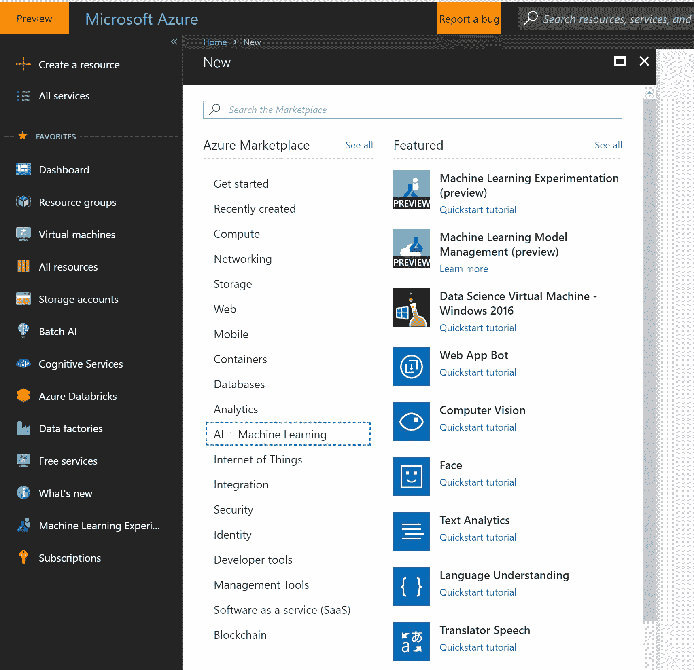
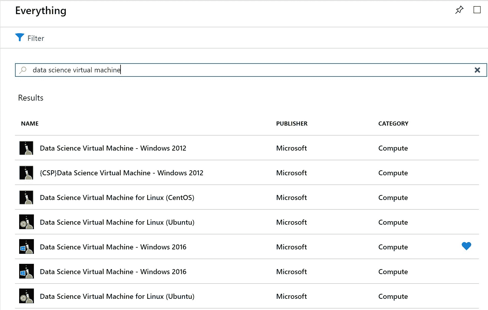
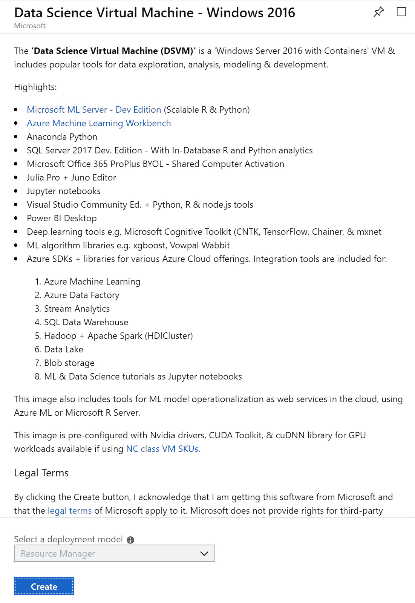
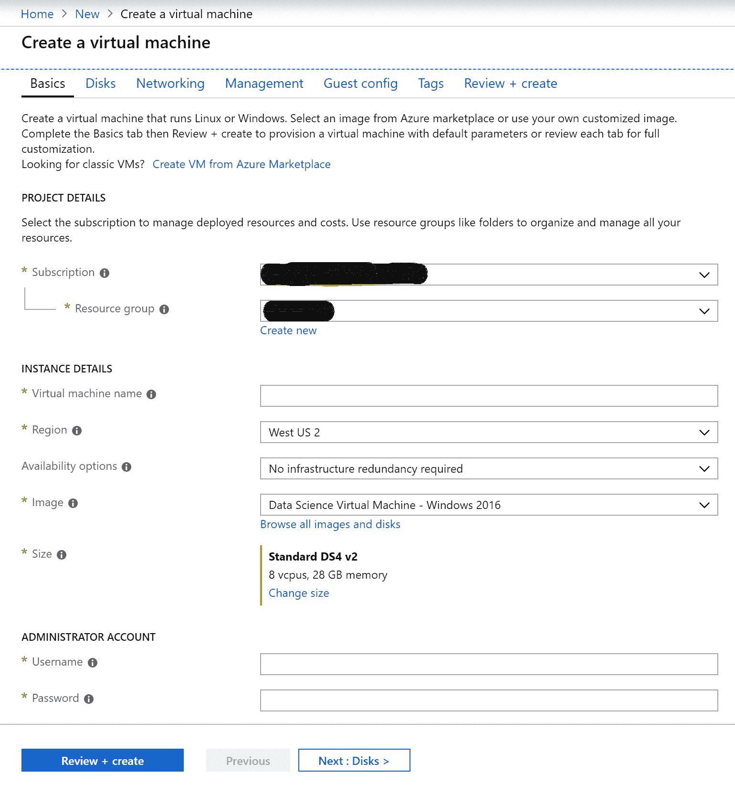
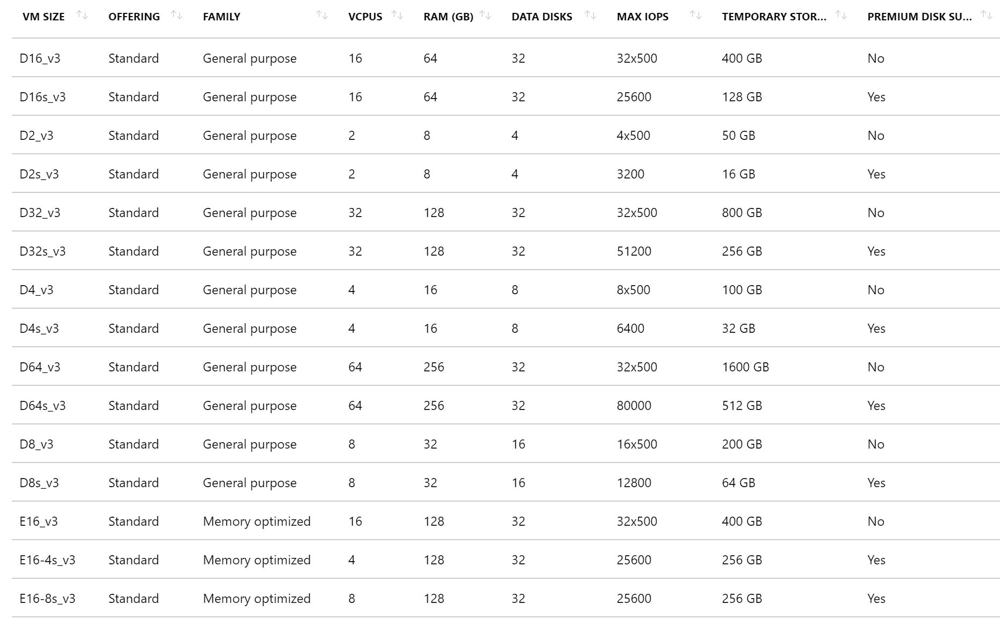
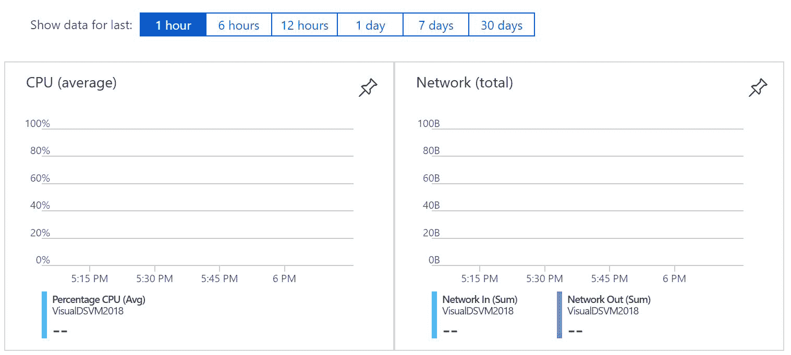
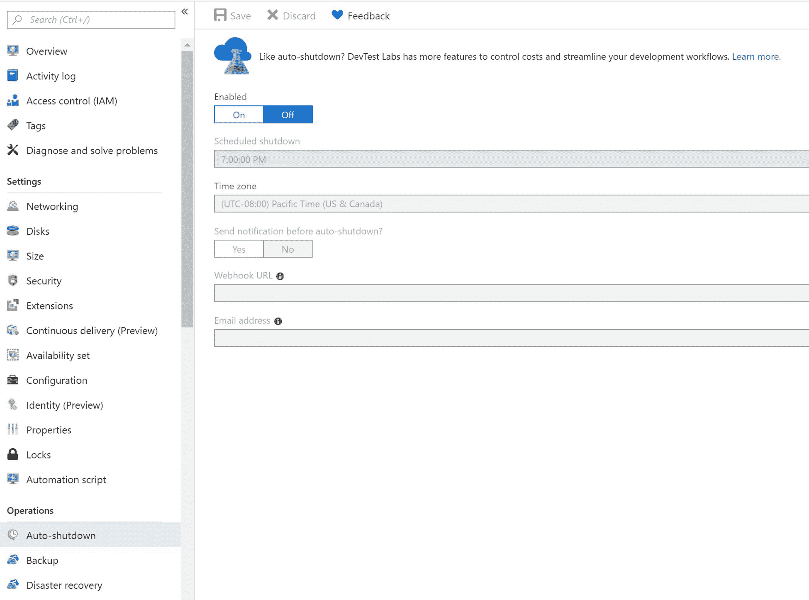
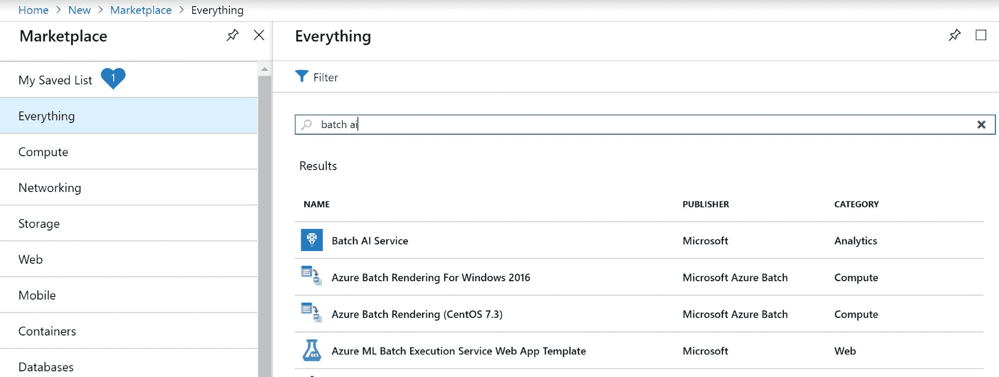

# 第六章：数据科学可扩展计算

在本章中，我们将学习如何使用 Azure 进行数据科学。我们将探讨如何准备数据，包括清洗和转换数据，创建工程特征，创建和训练机器学习模型，最后，使用机器学习模型进行预测。

要构建大数据机器学习算法，我们需要处理大量数据来训练它。为此，我们需要大量的计算能力。我们还需要计算能力能够根据负载动态扩展，以便大规模地提供这些机器学习模型，以便它们可以执行预测。

在公有云出现之前的时代，我们必须事先购买所有硬件。我们必须为所有这些硬件付费，...

# Azure 中的不同可扩展计算选项

在 Azure 中，我们可以进行两种类型的扩展，以帮助我们扩展我们的 CPU 和/或 GPU：

+   **垂直扩展**：增加虚拟机的 CPU 内核和内存数量。

+   **水平扩展**：在集群中增加虚拟机的数量，同时保持每个虚拟机中的 CPU 内核和内存不变。当我们使用水平扩展时，我们可能需要编写额外的代码来使用支持的框架执行并行或分布式计算。

# DSVMs 简介

DSVM 是由流行的数据科学工具和框架组成的 Linux 或 Windows 容器。它可以帮助我们快速开始数据分析和数据科学。它支持多种操作系统；目前，我们可以使用 Windows 2012、Windows 2016、Ubuntu Linux 和 CentOS Linux 创建 DSVM。DSVM 的理念是减少创建工作环境所需的时间。

DSVM 预配置了经过兼容性测试的库。它每隔几个月就会更新，以便使用工具、库和框架的最新兼容版本。它支持 GPU 虚拟机，并预装了必要的驱动程序。DSVM 还包括有关如何开始的教程和指南。

DSVM 很可能 ...

# 部署 DSVM

让我们现在通过创建 DSVM 所需的步骤。在这个例子中，我们将创建一个 Windows 2016 DSVM，但如果您想创建 Linux DSVM，步骤是相似的：

1.  请访问 Azure 门户 [`portal.azure.com`](https://portal.azure.com)。

1.  点击创建资源，然后转到 AI + 机器学习，并点击数据科学虚拟机 – Windows 2016：

1.  或者，我们可以在 Azure 门户中搜索 `数据科学虚拟机`：

1.  将会弹出一个窗口，显示您选择的 DSVM 的一些关键特性：

1.  我们可以通过提供必要的信息快速创建 DSVM。这包括资源组、区域、用户名和密码：

1.  我们需要考虑的一个重要参数是虚拟机大小。在这里，我们有选择基于 CPU 和/或 GPU 的虚拟机的选项。根据我们的 CPU、内存和网络需求，我们有大量的选项。以下是一个不同类型虚拟机的示例截图：

在 Azure 创建我们的虚拟机时，请等待几分钟。一旦准备就绪，我们将在门户中收到通知。

在我们的虚拟机创建完成后，我们可以使用 RDP 或 SSH 根据操作系统访问它。从概览窗口，我们可以查看虚拟机运行时的不同指标，例如 CPU 使用率或磁盘操作。这些指标可以帮助我们决定是否需要调整虚拟机的大小：

我们还可以通过门户的“自动关机”选项配置虚拟机自动关机：

在我们登录到 DSVM 后，我们可以像使用本地机器一样开始使用其工具。有关每个工具的更多信息，请参阅以下网站：[`docs.microsoft.com/en-us/azure/machine-learning/data-science-virtual-machine/provision-vm#important-directories-on-the-vm`](https://docs.microsoft.com/en-us/azure/machine-learning/data-science-virtual-machine/provision-vm#important-directories-on-the-vm)。

使用完虚拟机后，我们可以从门户停止它，以避免不必要的费用。当我们想要在未来使用它时，我们可以再次启动它，而无需重新创建。

现在我们来看一下 DSVM 的一个变体——DLVM。

# DLVM

DLVM 是一种特殊的 DSVM，其基础镜像是为深度学习定制的。我们可以使用 Windows 2016 或 Ubuntu Linux 作为操作系统。它预装了框架、工具和教程，以便您快速开始深度学习。

配置 DLVM 与配置 DSVM 类似。我们需要为 DLVM 选择一个基于 GPU 的虚拟机：

1.  前往 Azure 门户，搜索“深度学习虚拟机”。我们可以以创建 DSVM 相同的方式创建 DLVM。

1.  会弹出一个窗口，要求我们提供名称并选择操作系统、用户名、密码、资源组、位置等信息。下一个窗口要求我们选择基于 GPU 的虚拟机。如下面的截图所示，您所在地区不可用的虚拟机大小...

# 批量 AI 服务

DSVMs 和 DLVMs 擅长执行基于单个节点的计算。然而，在我们需要分布式训练的场景中，我们可以使用批处理 AI 服务，这使我们能够专注于训练，而不必担心管理集群。批处理 AI 服务具有使用与 DSVM 相同基础镜像的 VM，这意味着在 DSVM 中可用的所有库、工具和框架在批处理 AI 服务中也可用。批处理 AI 服务允许我们使用并行训练和基于 GPU 的 VM 进行深度学习，我们还可以将 Docker 容器部署到批处理 AI 节点。当使用批处理 AI 服务时，我们可以将我们的 Azure Blob 或 Azure Data Lake Storage 挂载到我们的集群。这意味着我们可以使用大量数据训练，而无需将数据复制到集群，因为它可以流式传输。

在撰写本文时，批处理 AI 服务仅作为预览版提供，因此当服务普遍可用时可能会有新功能。

# 部署批处理 AI 服务

现在我们继续创建一个批处理 AI 服务：

1.  访问 Azure 门户[`portal.azure.com`](https://portal.azure.com)。转到创建资源并搜索“批处理 AI”：

1.  在下一屏，我们可以创建我们的批处理 AI 服务。

1.  在那之后的屏幕会要求输入我们的批处理 AI 服务工作区的名称、订阅、资源组和位置。工作区是添加集群、实验和文件服务的地方。

1.  批处理 AI 集群将为运行您的实验提供计算能力。我们可以提供基本信息，例如 VM 数量、VM 类型、用户账户详情和网络... 

# ACI

作为数据科学家，在我们训练了机器学习模型之后，我们可能希望将其作为 Web 服务部署以进行实时或批量评分。当我们训练机器学习模型时，我们使用特定的框架和库。在大多数情况下，我们的部署环境中应该有相同的环境。容器是创建此类环境的快速简单方式，在其中我们可以托管我们的模型和依赖项。使用 ACI 可以轻松创建容器。作为数据科学家，我们可以使用 AML 将我们的机器学习模型作为 Web 服务部署到 ACI。这样，我们可以开发测试我们的模型，然后将其部署到生产环境中。有关 ACI 的更多详细信息，请参阅以下网站：[`docs.microsoft.com/en-us/azure/container-instances/container-instances-overview`](https://docs.microsoft.com/en-us/azure/container-instances/container-instances-overview)。

# AKS

Kubernetes 是一个开源项目，用于管理托管在容器中的应用程序。AKS 是一个托管的 Kubernetes 服务，使得使用 Kubernetes 变得容易。一旦您测试了您的机器学习模型，您就可以将其部署到 AKS 的可扩展集群中。然后，您可以为您的机器学习模型拥有一个可扩展的 Web 服务。您可以使用 AML 将您的模型部署到 AKS。有关 AKS 的更多详细信息，请参阅以下网站：[`docs.microsoft.com/en-us/azure/aks/intro-kubernetes`](https://docs.microsoft.com/en-us/azure/aks/intro-kubernetes)。

# 摘要

在本章中，我们学习了可供您扩展机器学习训练和部署的不同计算选项。我们了解了可以用来为您提供大量计算能力的垂直和水平扩展计算选项。

在下一章中，我们将学习机器学习服务器，它可以用于本地部署。
