# 第八章：HDInsight

HDInsight 是 Hadoop 在微软 Azure 平台上运行的一种实现方式。HDInsight 基于**Hortonworks 数据平台**（**HDP**），与 Apache Hadoop 完全兼容。

HDInsight 可以被视为微软的**Hadoop 作为服务**（**Haas**）。你可以通过门户或通过 Windows PowerShell 脚本快速部署系统，无需创建任何物理或虚拟机器。

以下为 HDInsight 的特点：

+   你可以在集群中实现少量或大量节点

+   你只需为使用的部分付费

+   当你的工作完成时，你可以取消集群的配置，当然，你也可以停止为其付费

+   你可以使用微软 Azure 存储，即使集群被取消配置，你也能保留数据

+   HDInsight 服务与来自微软和其他供应商的输入输出技术协同工作

正如之前提到的，HDInsight 服务运行在微软 Azure 上，在进一步讨论之前需要稍作解释。

数据被描述为“大数据”，以表明它正在以不断增长的数量、越来越高的速度和越来越多样化的非结构化格式以及可变的语义上下文中收集。大数据收集本身并不为企业提供价值。为了使大数据以可操作智能或洞察力的形式提供价值，它必须可访问、清洗、分析，然后以有用的方式呈现，通常与来自各种其他来源的数据相结合。

Apache Hadoop 是一个软件框架，它促进了大数据的管理和分析。Apache Hadoop 的核心提供了可靠的**Hadoop 分布式文件系统**（**HDFS**）数据存储，以及一个简单的 MapReduce 编程模型，以并行处理和分析存储在此分布式系统中的数据。HDFS 使用数据复制来应对在部署如此高度分布式系统时出现的硬件故障问题。

Windows Azure HDInsight 将 Apache Hadoop 作为云服务提供。它使 HDFS 或 MapReduce 软件框架和相关项目在一个更简单、更可扩展、成本效益更高的环境中可用。为了简化配置和运行 Hadoop 作业，以及管理已部署的集群，微软提供了 JavaScript 和 Hive 交互式控制台。这种简化的 JavaScript 方法使得 IT 专业人士和更广泛的开发者群体能够通过提供更易于访问的 Hadoop 框架路径来处理大数据管理和分析。

对于已经使用 R 的数据科学家来说，HDInsight 提供了一条通往云端的路径，以实现大数据分析。对于 IT 专业人士和系统管理员来说，它允许以简单直观的方式管理大数据。

正如前几章所述，我们将使用微软的 TDSP 作为背景，使用 HDInsight 生成机器学习模型。现在，我们将使用 R 和 HDInsight 来分析和建模一个样本数据集。

# R 与 HDInsight

HDInsight 的主要功能是什么？它是一个微软专有解决方案，但在微软 Azure 云中是一个 100% 的 Apache Hadoop 解决方案。Azure HDInsight 是一种服务，在云中部署和配置 Apache Hadoop 群集以进行大数据分析。

HDInsight 提供了一个软件框架，用于管理、分析和报告大数据。您可以使用 HDInsight 在任何格式中对结构化或非结构化数据进行交互式查询，达到 PB 级别。您还可以构建模型，将它们连接到 BI 工具。HDInsight 致力于通过 Excel 和 Power BI 提供大数据分析和洞察。Azure 的 HDInsight 服务将 Apache Hadoop 作为一项云服务提供，提供软件 ...

# 开始使用 Azure HDInsight 和 ML 服务

HDInsight 有多种群集类型，包括 Hadoop（Hive）、HBase、Storm、Spark、Kafka、交互式 Hive（LLAP）和 ML 服务（R 服务器）（带 R Studio，R 9.1）。以下是 ML 群集配置，这是在设置过程中建立的：


# HDInsight 的设置和配置

在本节中，我们将设置和配置 HDInsight。要设置和配置 HDInsight，请执行以下步骤：

1.  确保您有一个 Azure 账户

1.  登录到 Azure 门户 [portal.azure.com](https://portal.azure.com)

1.  当您登录到 Azure 门户时，点击按钮添加新资源

1.  在搜索查询框中，输入`HDInsight`，您将获得多个选项

1.  选择仅说“HDInsight”的选项

接下来，我们将设置 HDInsight 的基本配置。

# HDInsight 的基本配置

在基本配置项中，您需要输入您希望用于 Azure HDInsight 的名称，以及存储选项。以下是一个示例配置：


对于群集类型，请确保您选择 ML 服务选项。以下是一个示例：

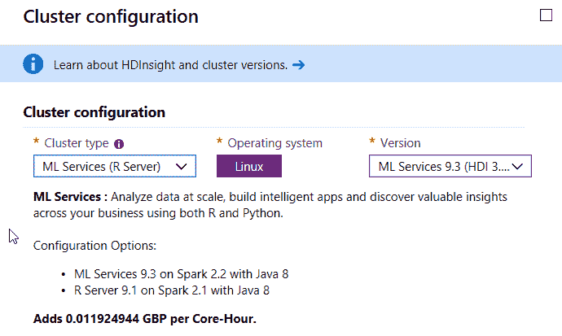

# Azure HDInsight 的存储选项

一旦选择了群集类型，下一步就是考虑存储。在撰写本文时，有两种存储类型：默认 Azure 存储，以及 Azure Data Lake Storage 1 代。在本教程中，将使用默认 Azure 存储：

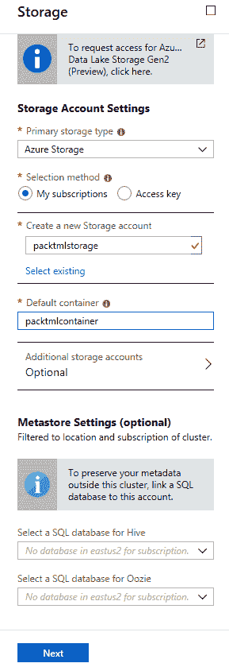

要完成 HDInsight 群集的创建，请点击“下一步”。然后检查设置并点击“创建”。

HDInsight 群集的设置大约需要二十分钟。

设置完成后，点击门户中的 Azure HDInsight 群集。以下是门户的截图：

这是 Azure HDInsight 的一个截图 ...

# 使用 SSH 连接到 HDInsight 群集

Azure Cloud Shell 允许数据科学家使用 SSH 访问 HDInsight 集群。Azure Cloud Shell 位于 Azure 门户的顶部导航中，并用箭头符号表示。以下是截图：


1.  在 Azure 门户中点击 Azure Cloud Shell 图标。

1.  选择订阅以创建存储帐户和 Microsoft Azure Files 共享。

1.  选择创建存储。

1.  确认 shell 窗口左侧的环境下拉菜单显示为 Bash。现在，您可以使用`ssh`命令登录。以下是截图：


登录后，您就可以访问 Azure HDInsight 集群上的 Microsoft ML 服务了。

# 访问 Azure HDInsight 上的 Microsoft ML 服务

在 bash 提示符中，只需输入 R 即可访问 Microsoft ML 服务。以下是截图：

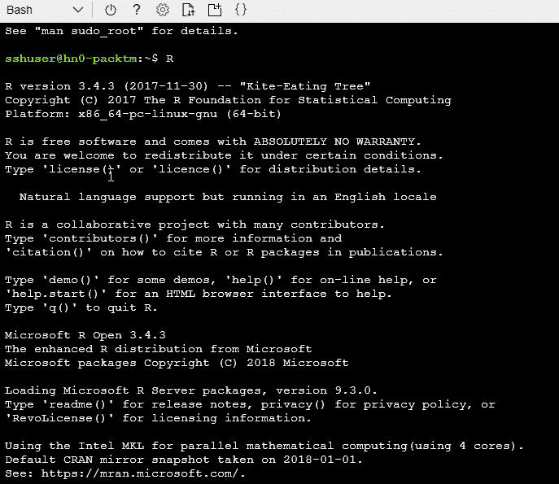

要查看 HDInsight 集群上的文件，请使用以下 RevoScaleR 命令：

```py
rxHadoopListFiles
```

然后将文件读入 DOS 提示符框中。以下是一个示例：

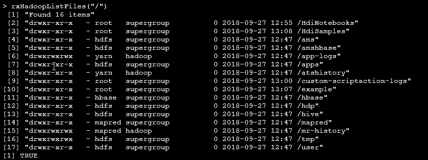

一旦文件被读取出来，我们就可以开始使用 R 处理一些样本数据集了。Iris 数据集将被用来解释在 HDInsight 的 Microsoft ML 服务中使用 R。

输入以下命令将使数据科学家感到放心...

# 使用 R 进行 HDInsight 和数据分析

首先，我们需要将我们的数据放入 Azure，以便 HDInsight 可以看到它。我们可以直接上传数据到 Azure 存储，或者我们可以使用**SQL Server Integration Services**（**SSIS**）中的功能。SSIS 具有连接到 Azure Blob 存储和 Azure HDInsight 的能力。它使您能够创建集成服务包，在 Azure Blob 存储和本地数据源之间传输数据。然后，Azure HDInsight 进程可以对数据进行处理。

为了使用 SSIS 将数据放入 HDInsight，需要安装 Azure Feature Pack。Microsoft SSIS Feature Pack for Azure 为 SQL Server Integration Services 提供了连接到许多 Azure 服务的能力，例如 Azure Blob 存储、Azure Data Lake Store、Azure SQL Data Warehouse 和 Azure HDInsight。这是一个单独的安装，您需要在服务器上安装 Azure Feature Pack 之前确保 SQL 服务器已安装。否则，Feature Pack 中的组件在您将包部署到 SSIS 目录数据库时可能不可用。

要安装 Microsoft SQL Server 2017 Integration Services Feature Pack for Azure，使用术语`Microsoft SQL Server 2017 Integration Services Feature Pack for Azure`搜索 Microsoft 下载页面。然后，下载文件并运行向导。

# Azure Data Factory 和 HDInsight 如何交互？

可以将文件移动到或从 Azure Blob 存储中读取和写入数据。使用 Azure Data Factory 的好处在于，它可以扩展现有的 ETL 管道以使用云存储，或通过 Azure VM 实现基于云的 SSIS 执行。在 2018 年 7 月推出通用可用版本后，Azure Data Factory 版本 2 可以部署 SSIS 包。它提供了强大的功能，有助于为云计算服务（如 HDInsight 和 Microsoft ML Server）准备数据。它可以执行一系列任务，包括将数据存档到云存储，以及在 Blob 存储中直接枚举文件。

Azure 中的特定 HDInsight 处理任务 ...

# 使用 ML 服务在 Azure HDInsight 上运行查询

在 HDInsight 的 ML 服务中，计算上下文指定了处理给定工作负载的计算引擎的物理位置。默认值为本地，这意味着它在您的本地计算机上运行。为了充分利用云运行，您需要从本地切换到远程。

如果 R 脚本在边缘节点上的 ML 服务集群中运行，则 R 脚本在该节点上的 R 解释器中运行。如果它调用 RevoScaleR 函数，则它在由您设置的 RevoScaleR 计算上下文确定的计算环境中执行。在这种情况下，当您从边缘节点运行 R 脚本时，计算上下文的可能值如下：

+   本地顺序 (*local*)

+   本地并行 (*localpar*)

+   MapReduce

+   Spark

并行提供了最佳性能。local 和 localpar 选项都会在所有可用核心上以并行方式执行其他 `rx` 函数调用，除非指定了其他方式。为此，使用 `rxOptions numCoresToUse` 设置，以下是一个示例：

```py
rxOptions(numCoresToUse=6)
```

如果要分析的数据量较小，并且是一次性或偶尔的分析，则建议您直接使用本地或 localpar 将其流式传输到分析程序中。如果要分析的数据量在小型或中型范围内，并且需要重复或迭代分析，则将其复制到本地文件系统，导入到 XDF，并通过本地或 localpar 进行分析。

# Azure 中的 RevoScaleR

RevoScaleR 是一套强大的微软专有函数，用于大规模实践数据科学。当使用 R 进行大数据分析时，RevoScaleR 提供额外的功能，例如用于导入、转换、操作、汇总、可视化和分析的数据相关函数。使用 R 和 HDInsight 可让您能够并行且在分布式文件系统上对非常大的数据集执行这些任务。RevoScaleR 使用外部内存算法，允许它一次处理一块数据，更新结果，并遍历所有可用数据。

RevoScaleR 函数通过 RevoScaleR 包提供，该包可在 Azure HDInsight ML 服务中使用。...

# 我们如何使用 ML 服务将数据读入 HDInsight？

使用 RevoScaleR 的 R 默认命令，我们可以在 HDInsight 上使用 ML 服务读取数据。这些数据类型包括以下内容：

+   通过**开放数据库连接**（**ODBC**）数据源读取数据

+   从其他文件系统（如 SAS、SPSS、ODBC、Teradata、分隔符和固定格式文本）读取文件

+   使用内部数据框作为数据源

+   从 R 无法原生读取的数据源中处理数据

RevoScaleR 还嵌入在 Azure HDInsight、Azure DSVMs 和 SQL Server 中。RevoScaleR 还包括一个可扩展的框架，用于为大数据集编写自己的分析。

优先的数据格式是 XDF 格式。从那里，我们可以使用 R 在 HDInsight 和 ML 服务上进行多项分析。

# 我们可以在 HDInsight 的 ML 服务中使用 R 进行哪些类型的分析？

我们可以进行汇总、交叉表操作，创建立方体，以及进行决策树和森林等建模，以及标准的 R 工作。要执行代码，我们将使用 RStudio 执行 Microsoft R 服务器命令。RStudio 使 R 更容易使用。它包括代码编辑器，以及调试和可视化工具。在以下示例中，代码练习和图像将使用 RStudio 执行。我们还将使用 R 笔记本作为一种整洁的方式来执行代码。R 笔记本是一个包含可以独立和交互式执行的代码块的文档。正如我们将在整个练习中看到的那样，输出将立即显示在输入下方。我们可以可视化...

# 从 Azure HDInsight ML 服务中读取文件数据

ML 服务可以读取几乎所有的平面文本文件，例如 SPSS、CSV 和 TXT 文件。

这里有一个例子，我们提供路径方向并从给定的路径读取文件目录到 R：

```py
filename <- read.csv ( file = "Filename.csv" )
```

我们还可以将文本文件导入 R，然后查看文件以读取它：

```py
filename <- rxImport ( "full file path")
```

在 R 中首先检查工作目录的位置至关重要。确认路径是一个良好的实践。命令通过以下命令执行：

`getwd()`

在我们的例子中，工作目录位于`D`驱动器上，是`Demo`文件夹。

要读取 CSV 文件，我们提供路径，然后读取文件路径，该路径指向一个变量名。在这个例子中，文件将存储在名为`SalesRecordsFile`的变量中：

```py
 SalesRecordsFile <- read.csv ( "D:/Demo/SalesRecordsFile.csv" , header = TRUE )
```

接下来，我们将使用`SalesRecordsFile`变量，并将其设置为读取 CSV 文件的命令。

一旦我们执行了`SalesRecordsFile`命令，Microsoft ML 服务器就会读取`SalesRecordsFile.csv`文件。

# 将文本和 CSV 文件转换为首选的 XDF 格式

与 CSV 文件相比，XDF 文件体积小且已压缩。这意味着 XDF 文件可以比 CSV 文件更快地读取和处理。平面文件包含没有结构化相互关系的记录。XDF 文件格式只能由 Microsoft ML Server 读取。这是一种非常高效的存储和查询平面文件中数据的方式。与其他文件相比，这些文件体积非常小，因此它们可以快速且容易地进行分析。RStudio 可以轻松处理将我们的源文本或 CSV 文件转换为 XDF 格式的任务。

要转换文件，我们可以使用 `rxImport` 函数，该函数将平面文件（如文本文件）中保存的数据加载到首选的 ...

# 在 Microsoft ML 服务中使用新的 XDF 文件

我们设置 `SalesRecordsXDF` 变量以保存传入数据的路径，并指定 XDF 文件必须写入的位置。

我们可以使用 `print` 命令来获取名为 `SalesRecordsXDF` 的变量中的内容信息。当我们运行代码时，我们可以看到输出，它详细说明了处理的行数和位置。如果我们想查看文件内容，我们可以使用 `rxGetInfo` 命令来提供一些信息。在这个例子中，我们将获取前五行数据。

# XDF 与平面文本文件比较

现在我们已经查看了一个 CSV 文件和一个 XDF 文件，哪一个更好？XDF 文件可以读取和处理，因此它们存储在本地磁盘上。通过调用 `rxImport()`，Microsoft R Server 将读取 XDF 文件并解压缩它，然后将其作为数据框插入内存中。

XDF 文件格式是 Microsoft 文件格式。这意味着检查输出和导出功能很重要，因为其他程序将无法读取它。XDF 文件旨在支持 RevoScaleR 包中的分析数据处理功能集。

文件大小的优势是什么？对于大数据，这意味着数据可以与机器上可用的磁盘大小一样大，而不会造成任何压力 ...

# 从 SQL Server 读取数据

要连接到 SQL Server，应遵循以下事件序列：

1.  连接到 Microsoft SQL Server

1.  从 Microsoft SQL Server 获取数据

# 连接到 SQL Server 数据库

Microsoft ML 服务还可以通过 **开放数据库连接 (ODBC**) 读取数据，这是一种知名且普遍接受的数据库访问方法。最初，连接字符串被设置，并分配给一个变量。在这个例子中，变量名包含连接字符串。以下是一个示例代码：

```py
sqlServerConnectionString <- "SERVER=<IP Address goes here>;DATABASE=<database name goes here>;UID=<User Name goes here>; PWD=<Your Password Goes Here>”
```

# 从表中提取数据，从 Microsoft SQL Server 获取数据

一旦我们设置了连接字符串信息，下一步就是设置一个变量以保存用于检索数据的 SQL 命令。以下是一段示例代码：

```py
sqlServerDataSource <- RxSqlServerData(sqlQuery = "SELECT * FROM <view name goes here>",connectionString = sqlServerConnectionString)
```

# 在 Microsoft ML 服务上安装 R 包

可以在 Azure ML Studio、Microsoft ML Server 和 SQL Server 机器学习服务中使用相同的 R 代码。

在这个例子中，`rjson` 包允许用户使用 `fromJSON()` 函数导入数据。如果 `rjson` 包未安装在 Microsoft ML Server 上，那么您需要安装它。以下是安装说明：

1.  导航到安装 R 工具的文件夹。

1.  右键点击 `RGui.exe`，然后选择以管理员身份运行。如果您没有所需的权限，请联系数据库管理员并提供您需要的包列表。

1.  从命令行，如果您知道包名，键入：`install.packages("rjson")`。

1.  注意双引号 ...

# 在 Microsoft ML 服务中分析和汇总数据

我们可以使用不同类型的统计方法来分析和汇总我们的数据。一些统计方法更为基础，我们首先从使用简单的交叉表开始。然后，我们可以转向更复杂的统计方法。

# 交叉表和单变量统计

交叉表提供了一个功能，通过简单的受访者计数和比例的表格，帮助探索调查数据，包括以下指定能力：

+   频率计数或行/列/联合/总计表比例

+   多行和列变量

+   所有边距，仅大边距，或无边距

要创建交叉表，使用 `rxCrossTabs()` 函数。`rxCrossTabs()` 也用于根据不同变量的组合计算总和：

```py
rxCrossTabs(formula, data, …)
```

`rxCrossTabs` 函数使用一个包含您想要交叉制表的变量的公式。它还有一个对数据的引用，该引用指的是您想要查找变量所在的数据集 ...

# 处理数据立方体

分析的一个重要特性是数据的聚合。在 Microsoft ML Server 中，当我们要在 R 中对数据进行进一步分析时，使用 `rxCube()` 函数进行数据聚合。

`rxCube()` 函数执行的功能与 `rxCrossTabs()` 非常相似。`rxCube()` 通过计算诸如表格求和或平均值等指标来帮助分析。`rxCube()` 以长格式而不是表格形式生成求和或平均值。`rxCube` 的示例语法如下：

```py
rxCube(formula, data, …)
```

代码显示 `rxCube` 需要一个包含交叉制表变量公式的公式。它与 `rxCrossTabs()` 在平均值参数的默认值上有所不同（`rxCube()` 为 true；`rxCrossTabs()` 为 false）。与 `rxCrossTabs` 类似，数据项指的是您想要在公式中指定的变量所在的数据集。以下是一个示例代码片段，使用之前提到的 Iris 数据集：

```py
IrisDataCube <- rxCube(Petal.Width ~ Species, data = iris)
```

为了阐明其用法，以下展示了一个示例输出：

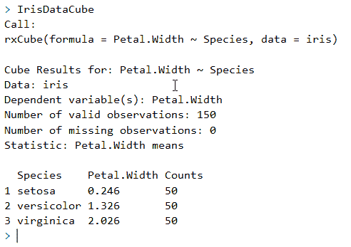

现在我们已经看到了如何进行初步分析，我们可以通过进行一些分组来进一步研究数据。

# 使用 Microsoft ML Server 和 R 对数据进行分组

在商业智能和数据分析中，许多数据操作都是在按变量定义的分组数据上完成的。在 Microsoft ML Services 中，有一个额外的增强 R 公式，称为`rxSummary`，它可以总结数据，这是调查数据的好起点。`rxSummary`通过计算包括变量均值的汇总统计量来工作。

这里是使用`rxSummary`和 Iris 数据集的输出示例：

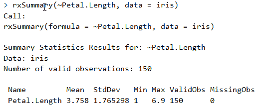

摘要侧重于一列，`Petal.Length`。它产生了我们从 R 中的`summary`命令所期望的相同信息。

# 在 Microsoft ML Server 中使用 R 计算分位数

在 Microsoft ML Server 中，使用`rxQuantile`函数快速计算近似分位数。请注意，此计算不包含任何类型的排序。以下代码片段使用`rxQuantile`对 Iris 数据集的瓣长进行操作：

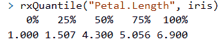

分位数计算提供了数据的分位数并打印出来。

# Microsoft ML Services 中的逻辑回归

逻辑回归是用于建模具有二元响应变量的数据的标准工具。在 R 中，您可以使用`glm`函数拟合逻辑回归，指定二项式家族和对数链接函数。在 Microsoft ML Services 中，使用`rxGlm`进行相同的目的，并且以相同的方式：

```py
irisGLM <- rxGlm(Petal.Width~ Species,family = Gamma,dropFirst = TRUE,data = iris)
```

然后，我们可以输入变量名以查看结果。以下是一个截图：

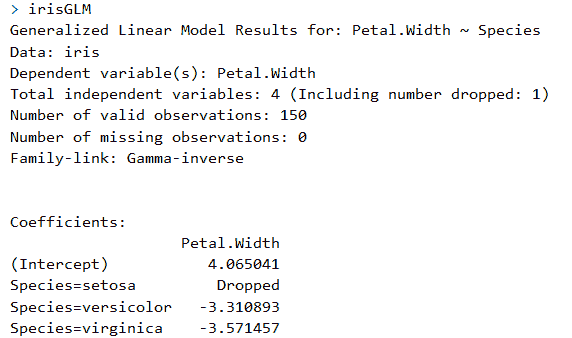

为了更好地解释系数，我们可以将它们转换回因变量的原始尺度。为此，我们执行...

# 使用模型预测值

如果输入数据集与用于拟合`rxLinMod`对象的相同，则得到的预测是模型的拟合值。如果输入数据集是不同的数据集，则得到的预测是来自原始模型的新的响应的真预测。如以下示例所示，可以通过将`computeResiduals`标志设置为`TRUE`来获取预测值的残差：

```py
rxPredict(irisGLM,data = iris,writeModelVars = TRUE,computeResiduals  = TRUE,overwrite = TRUE)
```

接下来，我们使用`rxPredict`来获取拟合值、预测标准误差和置信区间。通过将`writeModelVars`设置为`TRUE`，模型中使用的变量也将包含在输出数据集中。以下是一个示例输出：

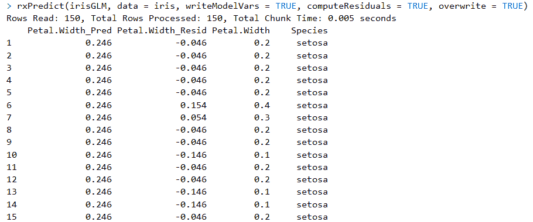

我们可以在这里查看`irisGLM`模型的摘要：


输出结果显示，这些 p 值高度显著，这意味着模型看起来是一个很好的拟合。

然而，我们可以通过查看残差偏差与残差自由度的比率来检查模型是否合理，这个比率是 10.2/147，得到的结果是 0.06。这意味着模型相当分散不足。另一个选择是使用二项式而不是伽马家族重新执行`irisGLM`模型。

为了更好地理解数据，可以使用 Microsoft ML 服务中的默认 R 语言和自定义功能来可视化数据。

# 数据可视化

Microsoft ML 服务提供了使用 R 作为可视化引擎来生成图形的功能。您可以为各种图表和仪表板提供表示单变量和多变量数值和分类数据的简单方式。

# 创建直方图

`rxHistogram()` 用于创建数据的直方图。以下是 Iris 数据集的语法示例：

```py
rxHistogram(~Petal.Width, data = iris)
```

您可以在公式中看到，最简单的情况是只有一个变量位于 `~` 右侧的公式。

如前所述，Iris 数据集是这里使用的数据，这是您想要指定所使用数据集的部分。以下是输出示例：

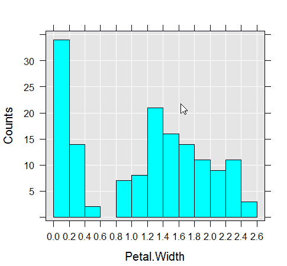

使用单行代码创建直方图非常简单。

# 创建折线图

直方图只是可视化数据的一种方式。另一个例子是 `rxLinePlot` 示例，它使用数据创建散点图的线条。对于此函数，此公式应在 `~` 的左侧有一个变量，它反映了 *y* 轴，在 `~` 的右侧有一个变量，它反映了 *x* 轴。以下是折线图的示例：

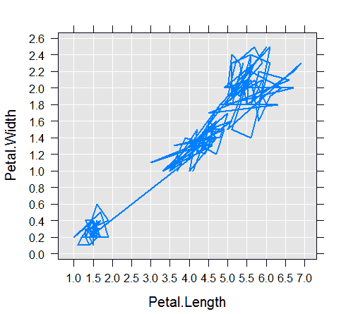

我们还可以使用 Microsoft ML 服务中的其他功能和特性来转换数据子集，然后重新可视化数据。

一旦我们能够看到并理解我们的数据，我们可以通过使用额外的 Microsoft ML 服务功能来进一步丰富它。...

# 为分析丰富数据

在大数据解决方案中，有时由于数据本身的巨大规模，需要将其转换和加工成更小的块。为了解决这个问题，Microsoft 引入了一些功能来帮助。本节将介绍旨在帮助解决大数据问题的功能。

# rxDataSteps

`rxDataStep` 函数可用于分块处理数据。它是 Microsoft ML 服务中重要的数据转换函数之一。

`rxDataStep` 函数可用于创建和转换数据子集。`rxDataStep` 函数一次处理一个数据块，从一个数据源读取并写入另一个数据源。`rxDataStep` 允许您修改现有列或向数据中添加新列。它还可以通过与您的列和行一起工作，以及在进一步处理数据之前对其进行过滤和排除来丰富分析。

`rxDataStep` 的一个常见用途是创建一个新的数据集，其中包含行和变量的子集，如下所示：

```py
rxDataStep(inData = iris, outFile = "myIrisXDF.xdf")
```

在上一部分 ...

# 摘要

在本章中，我们探讨了在 HDInsight 上 Microsoft ML 服务的机器学习过程。我们回顾了如何导入数据、如何清理数据、如何建模数据以及如何可视化数据。

最后一步是确保当你停止使用 HDInsight 时，将其关闭。HDInsight 按分钟计费，让它持续运行将会产生费用。建议你在不再需要时保存代码并关闭所有内容。

如果你只是想要运行代码并学习如何使用微软机器学习服务，之前的代码示例在 DSVM 上的 Visual Studio 中的微软机器学习服务器上同样适用。
