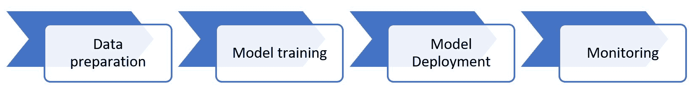
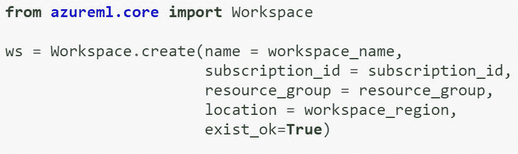
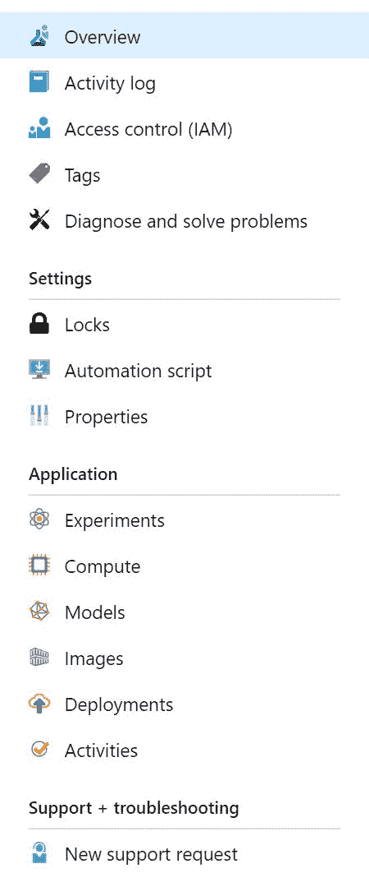
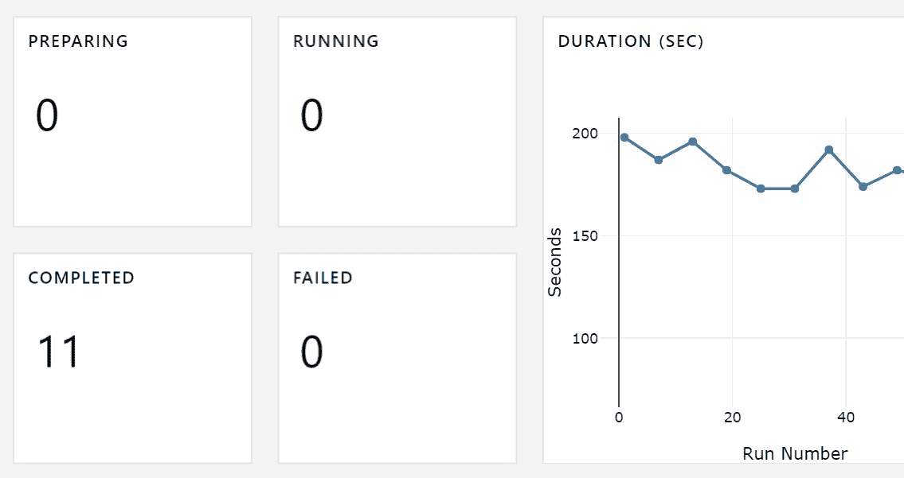
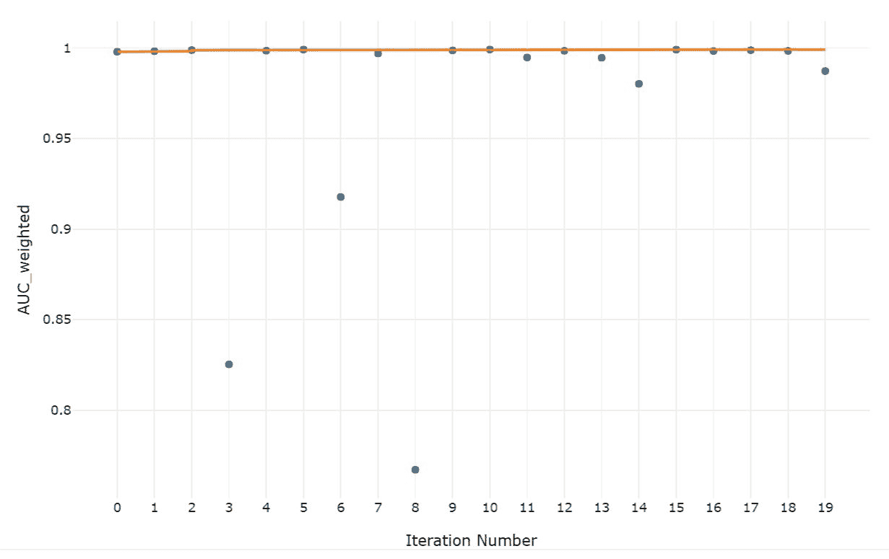
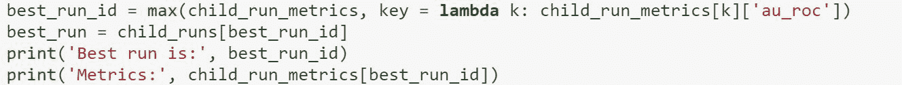
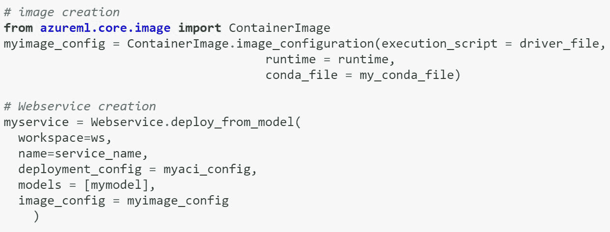
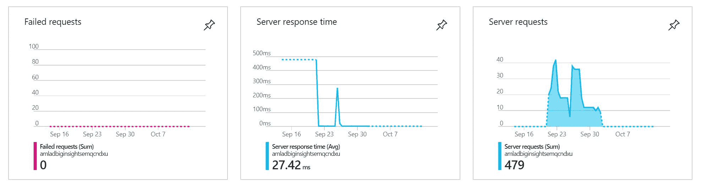

# 第十二章：端到端机器学习

在本章中，我们将学习关于与 Azure 机器学习服务一起推出的新功能，这些功能可以帮助数据科学家和 AI 开发者进行**端到端**（**E2E**）机器学习。

在开发 AI 应用时，我们可以使用第三章中描述的认知服务，即[Cognitive Services]。或者，我们可以使用自己的数据创建定制的机器学习模型，因为认知服务并不适用于所有可能的场景。在这些情况下，我们必须训练自己的机器学习算法。Azure 机器学习服务有一个 SDK、CLI 和 API，可以帮助你创建这些定制的模型。

在本章中，我们将学习如何使用 Azure 机器学习 ...

# 使用 Azure 机器学习 SDK 进行端到端机器学习

如以下图所示，端到端机器学习的第一步是**数据准备**，这包括数据清洗和特征化。然后，在**模型训练**步骤中，我们必须创建和训练一个机器学习模型。之后，我们有**模型部署**，这意味着将模型作为 Web 服务部署以执行预测。最后一步是**监控**，这包括分析模型的性能，然后触发模型的重新训练。

Azure ML SDK 使专业数据科学家和 DevOps 工程师能够执行端到端机器学习。它允许我们无缝使用云的力量来训练和部署我们的模型。我们可以通过在任何 Python 环境中使用`pip`轻松安装它来开始使用 Azure ML SDK。我们可以通过使用 CPU 或 GPU 集群来扩展训练的计算能力。我们还可以使用 SDK 轻松跟踪所有实验的运行历史。这个运行历史存储在一个可共享的工作区中，这使得团队能够共享资源和实验结果。SDK 的另一个优点是，它允许我们根据我们指定的指标，例如，例如，最高的准确率或最低的错误率，从实验的多次运行中找到最佳的模型。

一旦我们有一个满足我们需求的机器学习模型，我们就可以使用 Azure ML 服务将其投入使用。我们可以从模型创建一个可以在 Azure 管理的计算机或 IoT 设备上部署的 Web 服务。SDK 可以安装在任何 IDE 中，因此即使你不使用 Jupyter Notebooks 或 Databricks，你也可以使用 VS Code 或 PyCharm 来部署模型。对于开发测试场景，我们可以将 Web 服务部署到**Azure 容器实例**（**ACI**）。要部署生产环境中的模型，我们可以使用**Azure Kubernetes 服务**（**AKS**）。在 Web 服务部署到 AKS 后，我们可以启用监控并查看 Web 服务的性能。

以下示例代码显示了如何使用 SDK 进行端到端机器学习。首先，为您的机器学习项目创建一个工作区。这将创建在您的 Azure 订阅中，并且可以与组织中不同的用户共享。这个工作区逻辑上分组了我们将需要的计算、实验、数据存储、模型、镜像和部署，以进行端到端机器学习：

这个工作区可以通过代码或在我们的订阅中的 Azure 门户内访问。我们可以管理工作区的所有逻辑组件，我们还可以管理用户权限。以下截图显示了门户中看到的工作区组件：

一旦我们创建了一个工作区，我们就可以创建一个可以根据我们的训练需求自动扩展的训练计算。这个计算可以使用 CPU 或 GPU，我们可以使用我们喜欢的任何框架。例如，我们可以使用 scikit-learn 进行经典机器学习，或者使用 TensorFlow 进行深度学习。任何框架或库都可以使用`pip`安装，并使用 SDK 使用。我们可以将实验运行提交给这个计算，我们将在我们的环境和 Azure 门户中看到结果。我们还可以将指标作为我们训练脚本的一部分进行记录。以下是实验运行和相应指标在 Azure 门户中可能出现的示例截图。我们还可以使用 SDK 中的代码访问这些指标。

以下截图显示了实验的数量以及运行每个实验所需的时间：

这张截图显示了特定运行中正在监控的指标：

如前所述，我们可以根据感兴趣的特定指标找到最佳运行。以下是一个用于找到最佳运行的代码片段示例：

一旦我们找到了最佳运行，我们可以将模型作为 Web 服务部署到 ACI 或 AKS。为此，我们需要提供一个评分脚本和一个环境配置，以及我们想要部署的模型。以下是可以用于部署模型的示例代码：

当模型在生产中部署到 AKS 并启用监控时，我们可以查看我们的 Web 服务性能的见解。我们还可以为我们的模型添加自定义监控。以下截图显示了 Web 服务在几天内的表现：

您可以在以下网站上获取有关 Azure 机器学习服务的更多详细信息：[`docs.microsoft.com/en-us/azure/machine-learning/service/overview-what-is-azure-ml`](https://docs.microsoft.com/en-us/azure/machine-learning/service/overview-what-is-azure-ml)。

您也可以在以下网站上获取示例笔记本，以开始使用 Azure 机器学习 SDK：[`github.com/Azure/MachineLearningNotebooks`](https://github.com/Azure/MachineLearningNotebooks)。

# 摘要

在本章中，我们学习了 Azure 机器学习服务的新功能，这使得执行端到端机器学习变得容易。我们还学习了专业数据科学家和 DevOps 工程师如何从 Azure 机器学习 SDK 的实验和模型管理功能中受益。
