# 第二章：数据处理

在**机器学习**（**ML**）中，我们用于训练的数据是至关重要的。我们可以从我们所工作的流程中收集训练数据，或者我们可以从第三方来源获取已经准备好的训练数据。无论如何，我们必须将训练数据存储在满足我们开发要求的文件格式中。这些要求取决于我们解决的问题以及数据收集过程。有时，我们需要将存储在一个格式中的数据转换为另一个格式以满足我们的需求。以下是一些这样的需求的例子：

+   提高人类可读性，以便与工程师进行沟通

+   存在压缩可能性，以便数据在辅助存储上占用更少的空间

+   使用二进制形式的数据来加速解析过程

+   支持数据不同部分之间的复杂关系，以便精确地映射特定领域

+   平台独立性，以便能够在不同的开发和生产环境中使用数据集

今天，存在各种用于存储不同类型信息的文件格式。其中一些非常特定，而另一些则是通用目的的。有一些软件库允许我们操作这些文件格式。很少需要从头开始开发新的格式和解析器。使用现有的软件来读取格式可以显著减少开发和测试时间，这使我们能够专注于特定的任务。

本章讨论了如何处理我们用于存储数据的流行文件格式。它展示了用于处理 `OpenCV` 和 `Dlib` 库的库，以及如何将这些库中使用的数据格式转换为线性代数库中使用的数据类型。它还描述了数据归一化技术，如特征缩放和标准化过程，以处理异构数据。

本章将涵盖以下主题：

+   将数据格式解析为 C++ 数据结构

+   从 C++ 数据结构初始化矩阵和张量对象

+   使用 `OpenCV` 和 `Dlib` 库操作图像

+   将图像转换为各种库的矩阵和张量对象

+   数据归一化

# 技术要求

本章所需的技术和安装如下：

+   支持 C++17/C++20 的现代 C++ 编译器

+   CMake 构建系统版本 >= 3.22

+   `Dlib` 库安装

+   `mlpack` 库安装

+   `Flashlight` 库安装

+   `Eigen` 库安装

+   `hdf5lib` 库安装

+   `HighFive` 库安装

+   `nlohmann-json` 库安装

+   `Fast-CPP-CSV-Parser` 库安装

本章的代码可以在以下 GitHub 仓库中找到：[`github.com/PacktPublishing/Hands-on-Machine-learning-with-C-Second-Edition`](https://github.com/PacktPublishing/Hands-on-Machine-learning-with-C-Second-Edition)

# 将数据格式解析为 C++ 数据结构

表示结构化数据最流行的格式被称为 **CSV**。这种格式只是一个包含二维表的文本文件，其中行中的值用逗号分隔，而行则放在每一行的开头。它看起来像这样：

```py
1, 2, 3, 4
5, 6, 7, 8
9, 10, 11, 12
```

这种文件格式的优点在于其结构简单，许多软件工具可以处理它，它是可读的，并且支持多种计算机平台。缺点是它不支持多维数据以及结构复杂的数据，并且与二进制格式相比，解析速度较慢。

另一种广泛使用的格式是 **JSON**。尽管该格式的缩写中包含 JavaScript，但我们几乎可以用所有编程语言使用它。这是一个具有名称-值对的文件格式，以及此类对的数组。它有关于如何将此类对分组为不同的对象和数组声明的规则，以及如何定义不同类型值的规则。以下代码示例展示了 JSON 格式的文件：

```py
{
  "name": "Bill",
  "age": 25,
  "phones": [
    {
      "type": "home",
      "number": 43534590
    },
    {
      "type": "work",
      "number": 56985468
    }
  ]
}
```

这种格式的优点在于人眼可读性、许多计算机平台上的软件支持，以及存储分层和嵌套数据结构的可能性。缺点是，与二进制格式相比，其解析速度较慢，并且对于表示数值矩阵来说并不十分有用。在字符读取方面，二进制格式提供了对底层数据结构的直接访问，允许更快、更精确地提取字符。使用文本格式时，可能需要额外的步骤将字符转换为它们的数值表示，这可能会引入额外的处理开销。

通常，我们会使用多种文件格式的组合来表示复杂的数据集。例如，我们可以用 JSON 描述对象关系，而二进制形式的数据/数值数据可以存储在文件系统上的文件夹结构中，并在 JSON 文件中引用它。

**HDF5** 是一种专门用于存储科学数据的文件格式。这种文件格式是为了存储具有复杂结构的异构多维数据而开发的。因为它具有优化数据结构以使用辅助存储，所以它能够快速访问单个元素。此外，HDF5 支持数据压缩。一般来说，这种文件格式由包含多类型多维数组的命名组组成。该文件格式的每个元素都可以包含元数据，如下面的图所示：

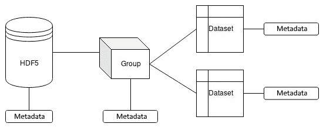

图 2.1 – HDF5 格式结构

这种格式的优点是其读写速度快，快速访问不同元素，以及支持复杂结构和多种类型的数据。缺点是用户需要专用工具进行编辑和查看，不同平台之间类型转换的支持有限，以及整个数据集使用单个文件。最后一个问题使得在文件损坏的情况下数据恢复几乎不可能。因此，定期备份数据以防止硬件故障或意外删除导致的数据丢失是有意义的。

对于机器学习中的数据集表示，有许多其他格式，但我们发现提到的这些格式最有用。

## 使用 Fast-CPP-CSV-Parser 库读取 CSV 文件

考虑如何在 C++中处理 CSV 格式。有多个不同的库可以用于解析 CSV 格式，它们有不同的函数集和集成到应用程序中的不同方式。使用 C++库最简单的方法是使用仅包含头文件的库，因为这消除了构建和链接它们的需要。我们建议使用`Fast-CPP-CSV-Parser`库，因为它是一个小型单文件头文件库，具有所需的最小功能，可以轻松集成到开发代码库中。它还提供了一种快速高效地读取和写入 CSV 数据的方法。

作为 CSV 文件格式的示例，我们使用`Iris`数据集，它描述了三种不同的鸢尾花植物（*Iris setosa*、*Iris versicolor*和*Iris virginica*），由 R.A. Fisher 构想。文件中的每一行包含以下字段：花瓣长度、花瓣宽度、花萼长度、花萼宽度，以及一个带有类名的字符串。这个数据集用于展示如何根据这四个特征对未知鸢尾花进行分类的示例。

注意

Iris 数据集的引用如下：*Dua, D.* 和 *Graff, C.* (*2019*)。*UCI Machine Learning Repository* [[`archive.ics.uci.edu/static/public/53/iris.zip`](https://archive.ics.uci.edu/static/public/53/iris.zip)]。*Irvine, CA: University of California, School of Information and* *Computer Science*。

要使用`Fast-CPP-CSV-Parser`库读取此数据集，我们需要包含一个单独的头文件，如下所示：

```py
#include <csv.h>
```

然后，我们定义一个`io::CSVReader`类型的对象。我们必须将列数定义为模板参数。这个参数是库的限制之一，因为我们需要了解 CSV 文件的结构。下面的代码片段展示了这一点：

```py
const uint32_t columns_num = 5;
io::CSVReader<columns_num> csv_reader(file_path);
```

接下来，我们定义用于存储读取值的容器，如下所示：

```py
std::vector<std::string> categorical_column;
std::vector<double> values;
```

然后，为了使我们的代码更通用，并将所有关于列类型的信息集中在一个地方，我们引入以下辅助类型和函数。我们定义了一个元组对象，用于描述一行中的值，如下所示：

```py
using RowType = 
  std::tuple<double, double, double, double, std::string>;
RowType row;
```

使用元组的原因是我们可以用元编程技术轻松迭代它。然后，我们定义两个辅助函数。一个是用于从文件中读取一行，它使用`io::CSVReader`类的`read_row()`方法。`read_row()`方法接受不同类型的不同数量的参数。我们的`RowType`类型描述了这些值。我们通过使用`std::index_sequence`类型和`std::get`函数来实现自动参数填充，如下面的代码片段所示：

```py
template <std::size_t... Idx, typename T, typename R>
bool read_row_help(std::index_sequence<Idx...>, T& row, R& r) {
  return r.read_row(std::get<Idx>(row)...);
}
```

第二个辅助函数使用类似的技术将行元组对象转换为我们的值向量，如下所示：

```py
template <std::size_t... Idx, typename T>
void fill_values(std::index_sequence<Idx...>,
                 T& row,
                 std::vector<double>& data) {
    data.insert(data.end(), {std::get<Idx>(row)...});
}
```

现在，我们可以将所有部分组合在一起。我们定义一个循环，其中我们连续读取行值并将它们移动到我们的容器中。读取一行后，我们检查`read_row()`方法的返回值，它告诉我们读取是否成功。一个`false`的返回值意味着我们已经到达了文件的末尾。在解析错误的情况下，我们捕获来自`io::error`命名空间的异常。有不同解析失败类型的异常。在以下示例中，我们处理数字解析错误：

```py
try {
  bool done = false;
  while (!done) {
    done = !read_row_help(
      std::make_index_sequence<
        std::tuple_size<RowType>::value>{},
      row, csv_reader);
    if (!done) {
      categorical_column.push_back(std::get<4>(row));
      fill_values(
        std::make_index_sequence<columns_num - 1>{},
        row, values);
    }
  }
}
} catch (const io::error::no_digit& err) {
    // Ignore badly formatted samples
    std::cerr << err.what() << std::endl;
}
```

此外，请注意，我们只将四个值移动到我们的双精度浮点数向量中，因为最后一列包含字符串对象，我们将它们放入另一个分类值向量中。

在这个代码示例中，我们看到了如何将包含字符串和数值的特殊数据集解析到两个容器中：`std::vector<std::string> categorical_column` 和 `std::vector<double> values`。

## 预处理 CSV 文件

有时候，我们拥有的数据格式与我们要使用的库不兼容。例如，Iris 数据集文件包含一个包含字符串的列。许多机器学习库无法读取这样的值，因为它们假设 CSV 文件只包含可以直接加载到内部矩阵表示的数值。

因此，在使用此类数据集之前，我们需要对它们进行预处理。在 Iris 数据集的情况下，我们需要将包含字符串标签的`categorical`列替换为数值编码。在下面的代码示例中，我们用不同的数字替换字符串，但一般来说，这种方法不是一个好主意，尤其是在分类任务中。机器学习算法通常只学习数值关系，因此一个更合适的方法是使用专门的编码——例如，独热编码。独热编码是机器学习中用来表示分类数据为数值的方法。它涉及为分类特征中的每个唯一值创建一个二进制向量，其中向量中只有一个元素设置为`1`，其余都设置为`0`。代码可以在下面的代码块中看到：

```py
#include <fstream>
#include <regex>
...
std::ifstream data_stream("iris.data");
std::string data_string(
    (std::istreambuf_iterator<char>(data_stream)),
    std::istreambuf_iterator<char>()
);
data_string = std::regex_replace(data_string,
                                 std::regex("Irissetosa"),
                                 "1");
data_string = std::regex_replace(data_string,
                                 std::regex("Irisversicolor"),
                                 "2");
data_string = std::regex_replace(data_string,
                                 std::regex("Irisvirginica"),
                                 "3");
std::ofstream out_stream("iris_fix.csv");
out_stream << data_string;
```

我们使用`std::ifstream`对象将 CSV 文件内容读取到`std::string`对象中。此外，我们使用`std::regex`例程将字符串类名替换为数字。使用`regex`函数可以减少代码量，并使其与通常使用`std::string::find()`和`std::string::replace()`方法的循环方法相比更具表达性。在替换文件中的所有分类类名后，我们使用`std::ofstream`对象创建一个新的文件。

## 使用 mlpack 库读取 CSV 文件

许多机器学习框架已经具有将 CSV 文件格式读取到其内部表示的例程。在以下代码示例中，我们展示了如何使用`mlpack`库将 CSV 文件加载到`matrix`对象中。该库中的 CSV 解析器可以自动为非数值值创建数值映射，因此我们可以轻松地加载 Iris 数据集而无需额外的预处理。

要使用`mlpack`库读取 CSV 文件，我们必须包含相应的头文件，如下所示：

```py
#include <mlpack/core.hpp>
using namespace mlpack;
```

我们可以使用`data::Load`函数从文件中加载 CSV 数据，如下面的代码片段所示：

```py
arma::mat dataset;
data::DatasetInfo info;
data::Load(file_name,
           dataset,
           info,
           /*fail with error*/ true);
```

注意，`data::Load`函数接受要加载数据的`dataset`矩阵对象和`DatasetInfo`类型的`info`对象，该对象可以用来获取有关加载文件的附加信息。此外，最后一个布尔参数`true`用于在加载错误情况下使函数抛出异常。例如，我们可以获取列数和用于非数值值的可用映射，如下所示：

```py
std::cout << "Number of dimensions: " << info.Dimensionality() 
          << std::endl;
std::cout << "Number of classes: " << info.NumMappings(4) 
          << std::endl;
```

由于数据是按原样加载的，因此没有关于数据集结构的自动假设。因此，为了提取标签，我们需要手动将加载的矩阵对象划分为以下形式：

```py
arma::Row<size_t> labels;
labels = arma::conv_to<arma::Row<size_t>>::from(
    dataset.row(dataset.n_rows - 1));
dataset.shed_row(dataset.n_rows – 1);
```

我们使用`arma::conv_to`函数从数据集行创建独立的`arma::Row`对象。然后，我们使用`shed_row`方法从数据集中删除最后一行。

## 使用 Dlib 库读取 CSV 文件

`Dlib`库可以直接将 CSV 文件加载到其矩阵类型中，就像`mlpack`库一样。为此操作，我们可以使用简单的 C++流操作符和标准的`std::ifstream`对象。

作为第一步，我们进行必要的`include`语句，如下所示：

```py
include <Dlib/matrix.h>
using namespace Dlib;
```

然后，我们定义一个`matrix`对象并从文件中加载数据，如下所示：

```py
matrix<double> data;
std::ifstream file("iris_fix.csv");
file >> data;
std::cout << data << std::endl;
```

在`Dlib`库中，`matrix`对象用于直接训练机器学习算法，无需将它们转换为中间数据集类型。

## 使用 nlohmann-json 库读取 JSON 文件

一些数据集附带结构化注释，可以包含多个文件和文件夹。这类复杂数据集的一个例子是**上下文中的常见物体**（**COCO**）数据集。该数据集包含一个文本文件，用于描述物体及其结构部分之间的关系。这个广为人知的数据集被用于训练分割、物体检测和分类任务的模型。该数据集中的注释定义在 JSON 文件格式中。JSON 是一种广泛使用的用于对象（实体）表示的文件格式。

它只是一个带有特殊符号来描述物体及其部分的文本文件。在下面的代码示例中，我们将展示如何使用 `nlohmann-json` 库来处理这种文件格式。这个库提供了一个简单直观的接口来处理 JSON，使得在 JSON 字符串和 C++ 数据结构（如映射、向量和自定义类）之间进行转换变得容易。它还支持各种功能，如自动类型转换、格式化打印和错误处理。然而，我们将使用一个更直接的、定义论文评论的数据集。这个数据集的作者是 Keith, B.、Fuentes, E. 和 Meneses, C.，他们为他们的工作《应用于论文*评论*的混合方法情感分析》（2017）创建了此数据集。

下面的示例展示了基于 JSON 的数据集的一部分：

```py
{
  "paper": [
    {
      "id": 1,
      "preliminary_decision": "accept",
      "review": [
        {
          "confidence": "4",
          "evaluation": "1",
          "id": 1,
          "lan": "es",
          "orientation": "0",
          "remarks": "",
          "text" : "- El artículo aborda un problema contingente\n 
            y muy relevante, e incluye tanto un diagnóstico\n 
            nacional de uso de buenas prácticas como una solución\n
            (buenas prácticas concretas)... ",
          "timespan": "2010-07-05"
        },
        {
          "confidence": "4",
          "evaluation": "1",
          "id": 2,
          "lan": "es",
          "orientation": "1",
          "remarks": "",
          "text" : "El artículo presenta recomendaciones\n 
         prácticas para el desarrollo de software seguro... ",
          "timespan": "2010-07-05"
        },
        {
          "confidence": "5",
          "evaluation": "1",
          "id": 3,
          "lan": "es",
          "orientation": "1",
          "remarks": "",
          "text" : "- El tema es muy interesante y puede ser de\n 
            mucha ayuda una guía para incorporar prácticas de\n 
            seguridad... ",
          "timespan": "2010-07-05"
        }
      ]
    }
  ]
}
```

解析和处理 JSON 文件主要有两种方法，如下列出：

+   第一种方法假设一次性解析整个文件并创建一个**文档对象模型**（**DOM**）。DOM 是一个表示存储在文件中的实体的分层对象结构。它通常存储在计算机内存中，在处理大文件的情况下，它可能占用大量的内存。

+   另一种方法是连续解析文件，并为用户提供一个**应用程序编程接口**（**API**）来处理和每个与文件解析过程相关的事件。这种第二种方法通常被称为**简单 XML API**（**SAX**）。尽管它的名字叫 SAX，但它是一种通用的方法，也用于非 XML 数据。SAX 在解析大型 XML 文件时比 DOM 快，因为它不会在内存中构建整个文档的完整树形表示。然而，对于需要访问文档特定部分进行复杂操作的情况，它可能更难以使用。

使用 DOM 处理训练数据集通常需要为对机器学习算法无用的结构分配大量内存。因此，在许多情况下，使用 SAX 接口更为可取。SAX 允许我们过滤无关数据并初始化可以直接在我们的算法中使用的结构。在下面的代码示例中，我们使用这种方法。

作为初步步骤，我们定义了 `paper`/`review` 实体的类型，如下所示：

```py
...
struct Paper {
  uint32_t id{0};
  std::string preliminary_decision;
  std::vector<Review> reviews;
};
using Papers = std::vector<Paper>;
...
struct Review {
  std::string confidence;
  std::string evaluation;
  uint32_t id{0};
  std::string language;
  std::string orientation;
  std::string remarks;
  std::string text;
  std::string timespan;
};
```

然后，我们声明一个用于对象的类型，该类型将由解析器用于处理解析事件。这个类型应该从`nlohmann::json::json_sax_t`基类继承，并且我们需要重写解析器在特定解析事件发生时将调用的虚拟处理函数，如下面的代码块所示：

```py
#include <nlohmann/json.hpp>
using json = nlohmann::json;
...
struct ReviewsHandler
: public json::json_sax_t {
  ReviewsHandler(Papers* papers) : papers_(papers) {}
  bool null() override;
  bool boolean(bool) override;
  bool number_integer(number_integer_t) override;
  bool number_float(number_float_t, const string_t&) override;
  bool binary(json::binary_t&) override;
  bool parse_error(std::size_t, const std::string&, 
                                const json::exception& ex) override;
  bool number_unsigned(number_unsigned_t u) override;
  bool string(string_t& str) override ;
  bool key(string_t& str) override;
  bool start_object(std::size_t) override;
  bool end_object() override;
  bool start_array(std::size_t)override;
  bool end_array() override;
  Paper paper_;
  Review review_;
  std::string key_;
  Papers* papers_{nullptr};
  HandlerState state_{HandlerState::None};
};
```

我们必须重写所有方法，但我们可以只为对象、数组解析事件和解析无符号`int`/`string`值的解析事件提供实际的处理函数实现。其他方法可以有简单的实现，如下所示：

```py
bool number_float(number_float_t, const string_t&) override {
  return true;
}
```

现在，我们可以使用`nlohmann::json::sax_parse`方法加载 JSON 文件；这个方法接受`std::istream`对象和一个`handler`对象作为第二个参数。下面的代码块显示了如何使用它：

```py
std::ifstream file(filename);
if (file) {
  // define papers data container to be filled
  Papers papers;
  // define object with SAX handlers
  ReviewsHandler handler(&papers);
  // parse file
  bool result = json::sax_parse(file, &handler);
  // check parsing result
  if (!result) {
    throw std::runtime_error(handler.error_);
  }
  return papers;
} else {
  throw std::invalid_argument("File can't be opened " + filename);
}
```

当没有解析错误时，我们将有一个初始化的`Paper`类型对象数组。更精确地考虑，事件处理器的实现细节。我们的事件处理器作为一个状态机工作。在一个状态下，我们用`Review`对象填充它，在另一个状态下，我们用`Paper`对象填充，还有其他事件的状态，如下面的代码片段所示：

```py
enum class HandlerState {
  None,
  Global,
  PapersArray,
  Paper,
  ReviewArray,
  Review
};
```

我们只为`Paper`和`Review`对象的`Id`属性解析无符号`unit`值，并根据当前状态和之前解析的键更新这些值，如下所示：

```py
bool number_unsigned(number_unsigned_t u) override {
  bool res{true};
  try {
    if (state_ == HandlerState::Paper && key_ == "id") {
      paper_.id = u;
    } else if (state_ == HandlerState::Review && key_ == "id") {
      review_.id = u;
    } else {
      res = false;
    }
  } catch (...) {
    res = false;
  }
  key_.clear();
  return res;
}
```

字符串值也存在于这两种类型的对象中，所以我们进行相同的检查来更新相应的值，如下所示：

```py
bool string(string_t& str) override {
  bool res{true};
  try {
    if (state_ == HandlerState::Paper &&
        key_ == "preliminary_decision") {
      paper_.preliminary_decision = str;
    } else if (state_ == HandlerState::Review &&
               key_ == "confidence") {
      review_.confidence = str;
    } else if (state_ == HandlerState::Review &&
               key_ == "evaluation") {
      review_.evaluation = str;
    } else if (state_ == HandlerState::Review &&
               key_ == "lan") {
      review_.language = str;
    } else if (state_ == HandlerState::Review &&
               key_ == "orientation") {
      review_.orientation = str;
    } else if (state_ == HandlerState::Review &&
               key_ == "remarks") {
      review_.remarks = str;
    } else if (state_ == HandlerState::Review &&
               key_ == "text") {
      review_.text = str;
    } else if (state_ == HandlerState::Review &&
               key_ == "timespan") {
      review_.timespan = str;
    } else {
      res = false;
    }
  } catch (...) {
    res = false;
  }
  key_.clear();
  return res;
}
```

JSON `key`属性的事件处理器将`key`值存储到适当的变量中，我们使用这个变量在解析过程中识别当前对象，如下所示：

```py
bool key(string_t& str) override  {
  key_ = str;
  return true;
}
```

`start_object`事件处理器根据当前的`key`值和之前的`state`值切换状态。我们的当前实现基于对当前 JSON 文件结构的了解：没有`Paper`对象的数组，每个`Paper`对象包含一个评论数组。这是 SAX 接口的一个限制——我们需要知道文档的结构才能正确实现所有事件处理器。代码可以在下面的代码块中看到：

```py
bool start_object(std::size_t) override {
  if (state_ == HandlerState::None && key_.empty()) {
      state_ = HandlerState::Global;
  } else if (state_ == HandlerState::PapersArray && key_.empty()) {
      state_ = HandlerState::Paper;
  } else if (state_ == HandlerState::ReviewArray && key_.empty()) {
      state_ = HandlerState::Review;
  } else {
      return false;
  }
  return true;
}
```

在`end_object`事件处理器中，我们根据当前状态填充`Paper`和`Review`对象的数组。同时，我们通过运行以下代码将当前状态切换回上一个状态：

```py
bool end_object() override {
  if (state_ == HandlerState::Global) {
      state_ = HandlerState::None;
  } else if (state_ == HandlerState::Paper) {
      state_ = HandlerState::PapersArray;
      papers_->push_back(paper_);
      paper_ = Paper();
  } else if (state_ == HandlerState::Review) {
      state_ = HandlerState::ReviewArray;
      paper_.reviews.push_back(review_);
  } else {
      return false;
  }
  return true;
}
```

在`start_array`事件处理器中，我们通过运行以下代码根据当前的`state`值切换当前状态到新的一个：

```py
bool start_array(std::size_t) override {
  if (state_ == HandlerState::Global && key_ == "paper") {
      state_ = HandlerState::PapersArray;
      key_.clear();
  } else if (state_ == HandlerState::Paper && key_ == "review") {
      state_ = HandlerState::ReviewArray;
      key_.clear();
  } else {
      return false;
  }
  return true;
}
```

在`end_array`事件处理器中，我们通过运行以下代码根据我们对文档结构的了解将当前状态切换回上一个状态：

```py
bool end_array() override {
  if (state_ == HandlerState::ReviewArray) {
      state_ = HandlerState::Paper;
  } else if (state_ == HandlerState::PapersArray) {
      state_ = HandlerState::Global;
  } else {
      return false;
  }
  return true;
}
```

在这种方法中，关键的事情是在对象处理完毕后清除当前的`key`值。这有助于我们调试解析错误，并且我们总是有关于当前处理实体的实际信息。

对于小文件，使用 DOM 方法可能更可取，因为它导致代码更少且算法更简洁。

## 使用 HighFive 库编写和读取 HDF5 文件

HDF5 是一种用于存储数据集和科学值的非常高效的文件格式。`HighFive` 库为 HDF Group 提供了一个高级 C++ 接口。在这个例子中，我们建议通过将上一节中使用的数据集转换为 HDF5 格式来查看其接口。

HDF5 格式的核心概念是组和数据集。每个组可以包含其他组和不同类型属性。此外，每个组还可以包含一组数据集条目。每个数据集是相同类型值的多维数组，也可以具有不同类型的属性。

让我们从包含所需的头文件开始，如下所示：

```py
#include <highfive/H5DataSet.hpp>
#include <highfive/H5DataSpace.hpp>
#include <highfive/H5File.hpp>
```

然后，我们必须创建一个 `file` 对象，我们将在此对象中写入数据集，如下所示：

```py
HighFive::File file(file_name, 
  HighFive::File::ReadWrite | HighFive::File::Create | 
  HighFive::File::Truncate);
```

在我们有一个 `file` 对象后，我们可以开始创建组。我们定义一个包含所有 `paper` 对象的论文组，如下所示：

```py
auto papers_group = file.createGroup("papers");
```

然后，我们遍历一个论文数组（如前节所示），并为每个 `paper` 对象创建一个组，包含两个属性：数值 `id` 属性和 `preliminary_decision` 属性，后者为 `string` 类型，如下面的代码块所示：

```py
for (const auto& paper : papers) {
  auto paper_group = papers_group.createGroup(
    "paper_" + std::to_string(paper.id));

  std::vector<uint32_t> id = {paper.id};
  auto id_attr = paper_group.createAttribute<uint32_t>(
    "id", HighFive::DataSpace::From(id));
  id_attr.write(id);
  auto dec_attr = paper_group.createAttribute<std::string>(
    "preliminary_decision",
    HighFive::DataSpace::From(paper.preliminary_decision));
  dec_attr.write(paper.preliminary_decision);
}
```

在我们创建属性后，我们必须使用 `write()` 方法将其值放入其中。请注意，`HighFive::DataSpace::From` 函数会自动检测属性值的大小。大小是存储属性值所需的内存量。然后，对于每个 `paper_group` 对象，我们创建相应的评论组，如下所示：

```py
 auto reviews_group = paper_group.createGroup("reviews");
```

我们在每个 `reviews_group` 对象中插入一个包含 `confidence`、`evaluation` 和 `orientation` 字段数值的数据集。对于数据集，我们定义 `DataSpace`（数据集中元素的数量）大小为 `3`，并将存储类型定义为 32 位整数，如下所示：

```py
std::vector<size_t> dims = {3};
std::vector<int32_t> values(3);
for (const auto& r : paper.reviews) {
     auto dataset = reviews_group.createDataSet<int32_t>(
       std::to_string(r.id), HighFive::DataSpace(dims));
     values[0] = std::stoi(r.confidence);
     values[1] = std::stoi(r.evaluation);
     values[2] = std::stoi(r.orientation);
     dataset.write(values);
 }
}
```

在我们创建并初始化所有对象后，HDF5 格式的 Papers/Reviews 数据集就准备好了。当 `file` 对象离开作用域时，其析构函数会将所有内容保存到辅助存储中。

拥有 HDF5 格式的文件，我们可以考虑使用 `HighFive` 库的文件读取接口。

作为第一步，我们再次创建一个 `HighFive::File` 对象，但带有读取属性，如下所示：

```py
HighFive::File file(file_name, HighFive::File::ReadOnly);
```

然后，我们使用 `getGroup()` 方法获取顶级 `papers_group` 对象，如下所示：

```py
auto papers_group = file.getGroup("papers");
```

`getGroup` 方法允许我们通过名称获取一个特定的组，因此它是一种在 HDF5 文件结构中的导航方式。

我们需要获取此组中所有嵌套对象的列表，因为我们只能通过它们的名称来访问对象。我们可以通过运行以下代码来完成此操作：

```py
auto papers_names = papers_group.listObjectNames();
```

使用循环，我们遍历 `papers_group` 容器中的所有 `papers_group` 对象，如下所示：

```py
for (const auto& pname : papers_names) {
    auto paper_group = papers_group.getGroup(pname);
...
}
```

对于每个`paper`对象，我们读取其属性和属性值所需的内存空间。由于每个属性可以是多维的，因此我们应该注意这一点，并分配一个合适的容器，如下所示：

```py
std::vector<uint32_t> id;
paper_group.getAttribute("id").read(id);
std::cout << id[0];
std::string decision;
paper_group.getAttribute("preliminary_decision").read(decision);
std::cout << " " << decision << std::endl;
```

对于读取数据集，我们可以使用相同的方法：获取`reviews`组，然后获取数据集名称列表，最后在循环中读取每个数据集，如下所示：

```py
auto reviews_group = paper_group.getGroup("reviews");
auto reviews_names = reviews_group.listObjectNames();
std::vector<int32_t> values(2);
for (const auto& rname : reviews_names) {
    std::cout << "\t review: " << rname << std::endl;
    auto dataset = reviews_group.getDataSet(rname);
    auto selection = dataset.select({1}, {2}); 
  // or use just dataset.read method to get whole data
    selection.read(values);
    std::cout << "\t\t evaluation: " << values[0] << std::endl;
    std::cout << "\t\t orientation: " << values[1] << std::endl;
}
```

注意，我们使用`select()`方法来处理数据集，这允许我们只读取数据集的一部分。我们通过作为参数给出的范围来定义这部分。`dataset`类型中有一个`read()`方法，可以一次性读取整个数据集。

使用这些技术，我们可以读取和转换任何 HDF5 数据集。这种文件格式允许我们只处理所需数据的一部分，而不必将整个文件加载到内存中。此外，由于这是一个二进制格式，其读取效率比读取大型文本文件要高。HDF5 的其他有用特性如下：

+   数据集和属性的数据压缩选项，减少存储空间和传输时间。

+   I/O 操作的并行化，允许多个线程或进程同时访问文件。这可以大大提高吞吐量并减少处理时间。

在本节中，我们了解了如何使用各种 C++库提供的 C++数据结构将不同文件格式的数据加载进来。特别是，我们学习了如何填充将在不同机器学习算法中使用到的矩阵和张量对象。在下一节中，我们将看到如何使用常规 C++容器中的值来初始化这些相同的数据结构，这在实现自己的数据加载器时可能很重要。

# 从 C++数据结构初始化矩阵和张量对象

用于数据集的文件格式有很多种，并且并非所有这些格式都可能被库支持。对于使用不受支持的格式的数据，我们可能需要编写自定义解析器。在将值读取到常规 C++容器之后，我们通常需要将它们转换成我们在使用的机器学习框架中使用的对象类型。作为一个例子，让我们考虑从文件中读取矩阵数据到 C++对象的情况。

## 使用 Eigen 库

使用`Eigen`库，我们可以使用`Eigen::Map`类型将 C++数组包装成`Eigen::Matrix`对象。包装后的对象将表现得像一个标准的`Eigen`矩阵。我们必须用具有所需行为的矩阵类型来参数化`Eigen::Map`类型。此外，当我们创建`Eigen::Map`对象时，它需要一个指向 C++数组的指针和矩阵维度作为参数，如下面的代码片段所示：

```py
std::vector<double> values;
...
auto x_data = Eigen::Map<Eigen::Matrix<double,
                                       Eigen::Dynamic,
                                       Eigen::Dynamic,
                                       Eigen::RowMajor>>(
    values.data(),
    rows_num,
    columns_num);
```

## 使用 Eigen 库

`Blaze`库有特殊的类，可以用来为 C++数组创建包装器。为了使用这些类的对象来包装一个 C++容器，我们必须传递一个指向数据的指针和相应的维度作为参数，如下面的代码片段所示：

```py
std::array<int, 4> data = {1, 2, 3, 4};
blaze::CustomVector<int,
                    blaze::unaligned,
                    blaze::unpadded,
                    blaze::rowMajor>
    v2(data.data(), data.size());
std::vector<float> mdata = {1, 2, 3, 4, 5, 6, 7, 8, 9};
blaze::CustomMatrix<float,
                    blaze::unaligned,
                    blaze::unpadded,
                    blaze::rowMajor>
    a2(mdata.data(), 3UL, 3UL);
```

注意，使用了额外的模板参数来指定内存布局、对齐和填充。

## 使用 Dlib 库

`Dlib`库有`Dlib::mat()`函数，用于将 C++容器包装到`Dlib`矩阵对象中。它也接受数据指针和矩阵维度作为参数，如下面的代码片段所示：

```py
double data[] = {1, 2, 3, 4, 5, 6};
auto m2 = Dlib::mat(data, 2, 3); // create matrix with size 2x3
```

`Dlib::mat`函数有其他重载，可以接受其他类型的容器来创建矩阵。

## 使用 ArrayFire 库

`ArrayFire`库有一种初始化数组对象的方法，即使用外部内存指针。它可以如下使用：

```py
float host_data[] = {0, 1, 2, 3, 4, 5};
array A(2, 3, host_data);
```

在这个例子中，我们使用`C`数组对象中的数据初始化了`2x3`矩阵。我们使用了`array`类型构造函数。前两个参数是矩阵的行数和列数，最后一个参数是数据指针。我们也可以使用 CUDA 指针以相同的方式初始化`array`类型对象，但第四个参数应该是`afDevice`指定。

## 使用 mlpack 库

`mlpack`框架使用`Armadillo`库进行线性代数对象。因此，要将 C++容器包装到`arma::mat`对象中，我们可以使用相应的构造函数，该构造函数接受数据指针和矩阵维度，如下面的代码片段所示：

```py
std::vector<double> values;
...
arma::mat(values.data(), n_rows, n_cols, /*copy_aux_mem*/ false);
```

如果将名为`copy_aux_mem`的第四个参数设置为`false`，则数据将不会复制到矩阵的内部缓冲区中。

注意，所有这些函数只为存储数据的原始 C++数组创建了一个包装器，并没有将值复制到新位置。如果我们想将 C++数组中的值复制到`matrix`对象中，我们通常需要调用`clone()`方法或其包装对象的类似方法。

在我们为所使用的机器学习框架创建了一个矩阵对象之后，我们可以初始化其他用于训练机器学习算法的专用对象。此类抽象的例子包括`Flashlight`库中的`fl::TensorDataset`类或`libtorch`库中的`torch::data::Dataset`类。

在本节中，我们学习了如何使用常规 C++容器和指针初始化矩阵和张量对象。下一节将转向另一个重要主题：图像操作。

# 使用 OpenCV 和 Dlib 库操作图像

许多机器学习算法与**计算机视觉**（**CV**）问题相关。此类任务的例子包括图像中的目标检测、分割、图像分类等。为了能够处理此类任务，我们需要用于处理图像的工具。我们通常需要将图像加载到计算机内存的例程，以及图像处理的例程。例如，标准操作是图像缩放，因为许多机器学习算法仅在特定大小的图像上训练。这种限制源于算法结构或硬件要求。例如，由于**图形处理单元**（**GPU**）内存大小有限，我们不能将大图像加载到 GPU 内存中。

此外，硬件要求可能导致我们的硬件支持的数值类型范围有限，因此我们需要将初始图像表示更改为硬件可以高效处理的表示。此外，ML 算法通常假设图像通道的预定义布局，这可能与原始图像文件中的布局不同。

另一种图像处理任务是创建训练数据集。在许多情况下，我们针对特定任务只有有限数量的可用图像。然而，为了使机器算法训练良好，我们通常需要更多的训练图像。因此，典型的做法是对现有图像进行增强。增强可以通过随机缩放、裁剪图像部分、旋转以及其他可以用来从现有集合中生成不同图像的操作来完成。

在本节中，我们将展示如何使用两个最流行的图像处理库来处理 C++。`OpenCV` 是一个用于解决 CV 问题的框架，其中包含许多现成的 CV 算法实现。此外，它还提供了许多图像处理功能。`Dlib` 是一个包含大量实现算法的 CV 和 ML 框架，以及丰富的图像处理例程。

## 使用 OpenCV

在 `OpenCV` 库中，图像被视为一个多维值矩阵。为此，有一个特殊的 `cv::Mat` 类型。有两个基本函数：`cv::imread()` 函数加载图像，`cv::imwrite()` 函数将图像写入文件，如下面的代码片段所示：

```py
#include <opencv2/opencv.hpp>
..
cv::Mat img = cv::imread(file_name);
cv::imwrite(new_file_name, img);
```

此外，还有用于管理位于内存缓冲区中的图像的功能。`cv::imdecode()` 函数从内存缓冲区中加载图像，而 `cv::imencode()` 函数将图像写入内存缓冲区。

`OpenCV` 库中的缩放操作可以使用 `cv::resize()` 函数来完成。此函数接受输入图像、输出图像、输出图像大小或缩放因子以及插值类型作为参数。插值类型决定了缩放后的输出图像将如何显示。以下是一些一般性建议：

+   使用 `cv::INTER_AREA` 进行缩小

+   使用 `cv::INTER_CUBIC`（较慢）或 `cv::INTER_LINEAR` 进行缩放

+   由于速度快，使用 `cv::INTER_LINEAR` 进行所有缩放操作

线性缩放和立方缩放之间的主要区别在于它们缩放像素的方法。线性缩放保持宽高比且更简单，而立方缩放则试图保持细节和过渡。选择哪种缩放取决于您项目的具体要求和期望的结果。

以下代码示例展示了如何缩放图像：

```py
cv::resize(img,
           img,
           {img.cols / 2, img.rows / 2},
           0,
           0,
           cv::INTER_AREA);
cv::resize(img, img, {}, 1.5, 1.5, cv::INTER_CUBIC);
```

在 `OpenCV` 库中没有专门用于图像裁剪的函数，但 `cv::Mat` 类型重载了 `operator()` 方法，该方法接受一个裁剪矩形作为参数，并返回一个包含指定矩形周围图像部分的新的 `cv::Mat` 对象。此外，请注意，此对象将与原始图像共享相同的内存，因此其修改将改变原始图像。要创建 `cv::Mat` 对象的深度副本，我们需要使用 `clone()` 方法，如下所示：

```py
img = img(cv::Rect(0, 0, img.cols / 2, img.rows / 2));
```

有时，我们需要移动或旋转图像。`OpenCV` 库通过仿射变换支持图像的平移和旋转操作。我们必须手动或使用辅助函数创建一个二维仿射变换矩阵，然后将其应用于我们的图像。对于移动（平移），我们可以手动创建这样的矩阵，然后使用 `cv::wrapAffine()` 函数将其应用于图像，如下所示：

```py
cv::Mat trm = (cv::Mat_<double>(2, 3) << 1, 0, -50, 0, 1, -50);
cv::wrapAffine(img, img, trm, {img.cols, img.rows});
```

我们可以使用 `cv::getRotationMatrix2D()` 函数创建一个旋转矩阵。此函数接受一个原点和一个旋转角度（以度为单位），如下面的代码片段所示：

```py
auto rotm = cv::getRotationMatrix2D({img.cols / 2, img.rows / 2},
                                     45,
                                     1);
cv::wrapAffine(img, img, rotm, {img.cols, img.rows});
```

另一个有用的操作是不缩放但添加边界来扩展图像大小。`OpenCV` 库中有 `cv::copyMakeBorder()` 函数用于此目的。此函数在创建边界方面有不同的选项。它接受输入图像、输出图像、顶部、底部、左侧和右侧的边界大小、边界类型以及边界颜色。边界类型可以是以下之一：

+   `BORDER_CONSTANT`: 使函数用单一颜色填充边界

+   `BORDER_REPLICATE`: 使函数在每个边界侧用最后像素值的副本填充边界（例如，*aaaaaa|abcdefgh|hhhhhhh*）

+   `BORDER_REFLECT`: 使函数在每个边界侧用相反像素值的副本填充边界（例如，*fedcba|abcdefgh|hgfedcb*）

+   `BORDER_WRAP`: 通过模拟图像重复来填充边界，例如（*cdefgh|abcdefgh|abcdefg*）

以下示例展示了如何使用此函数：

```py
int top = 50; // px
int bottom = 20; // px
int left = 150; // px
int right = 5; // px
cv::copyMakeBorder(img,img,top,bottom,left,right,
                   cv::BORDER_CONSTANT | cv::BORDER_ISOLATED,
                   cv::Scalar(255, 0, 0));
```

当我们使用这个函数时，应该注意源图像的起点。`OpenCV` 文档中提到：“*如果源图像是大图像的一部分，该函数将尝试使用 ROI（区域兴趣）之外的像素来形成边界。要禁用此功能并始终进行外推，就像源图像不是另一图像的一部分一样，请使用边界* *类型* `BORDER_ISOLATED`。”

之前描述的函数在需要将不同大小的训练图像适应某些机器学习算法中使用的标准图像大小时非常有用，因为使用此函数，我们不会扭曲目标图像内容。

存在 `cv::cvtColor()` 函数在 `OpenCV` 库中将不同的颜色空间进行转换。该函数接受一个输入图像、一个输出图像和一个转换方案类型。例如，在下面的代码示例中，我们将 **红色、绿色和蓝色** （**RGB**） 颜色空间转换为灰度：

```py
cv::cvtColor(img, img, cv::COLOR_RGB2GRAY);
// now pixels values are in range 0-1
```

在某些场景下，这可以非常方便。

## 使用 Dlib

`Dlib` 是另一个流行的图像处理库。这个库有不同的函数和类用于数学运算和图像处理。库文档建议使用 `Dlib::array2d` 类型来表示图像。`Dlib::array2d` 类型是一个模板类型，必须用像素类型进行参数化。`Dlib` 库中的像素类型是用像素类型特性定义的。有以下预定义的像素类型：`rgb_pixel`、`bgr_pixel`、`rgb_alpha_pixel`、`hsi_pixel`、`lab_pixel`，以及任何标量类型都可以用于灰度像素的表示。

我们可以使用 `load_image()` 函数从磁盘加载图像，如下所示：

```py
#include <Dlib/image_io.h>
#include <Dlib/image_transforms.h>
using namespace Dlib;
...
array2d<rgb_pixel> img;
load_image(img, file_path);
```

对于缩放操作，有 `Dlib::resize_image()` 函数。这个函数有两个不同的重载版本。一个接受一个缩放因子和一个图像对象的引用。另一个接受输入图像、输出图像、期望的大小和插值类型。要在 `Dlib` 库中指定插值类型，我们应该调用特殊函数：`interpolate_nearest_neighbor()`、`interpolate_quadratic()` 和 `interpolate_bilinear()` 函数。选择其中一个的标准与我们在 *使用 OpenCV* 部分讨论的标准相同。请注意，`resize_image()` 函数的输出图像应该已经预先分配，如下面的代码片段所示：

```py
array2d<rgb_pixel> img2(img.nr() / 2, img.nc() / 2);
resize_image(img, img2, interpolate_nearest_neighbor());
resize_image(1.5, img); // default interpolate_bilinear
```

要使用 `Dlib` 裁剪图像，我们可以使用 `Dlib::extract_image_chips()` 函数。这个函数接受一个原始图像、矩形定义的边界和一个输出图像。此外，这个函数还有接受矩形边界数组和输出图像数组的重载版本，如下所示：

```py
extract_image_chip(
    img,
    rectangle(0, 0, img.nc() / 2, img.nr() / 2),
    img2);
```

`Dlib` 库通过仿射变换支持图像变换操作。存在一个 `Dlib::transform_image()` 函数，它接受一个输入图像、一个输出图像和一个仿射变换对象。变换对象的例子可以是 `Dlib::point_transform_affine` 类的实例，它使用旋转矩阵和变换向量定义仿射变换。此外，`Dlib::transform_image()` 函数可以接受一个插值类型作为最后一个参数，如下面的代码片段所示：

```py
transform_image(img,img2,interpolate_bilinear(),
                point_transform_affine(
                    identity_matrix<double>(2),
                    Dlib::vector<double, 2>(-50, -50)));
```

如果我们只需要旋转，`Dlib` 有 `Dlib::rotate_image()` 函数。`Dlib::rotate_image()` 函数接受一个输入图像、一个输出图像、一个以度为单位的角度和一个插值类型，如下所示：

```py
rotate_image(img, img2, -45, interpolate_bilinear());
```

在 `Dlib` 库中没有为添加图像边框的函数的完整对应物。有两个函数：`Dlib::assign_border_pixels()` 和 `Dlib::zero_border_pixels()` 用于用指定的值填充图像边框。在使用这些例程之前，我们应该调整图像大小并将内容放置在正确的位置。新的图像大小应包括边框的宽度。我们可以使用 `Dlib::transform_image()` 函数将图像内容移动到正确的位置。以下代码示例展示了如何向图像添加边框：

```py
int top = 50; // px
int bottom = 20; // px
int left = 150; // px
int right = 5; // px
img2.set_size(img.nr() + top + bottom, img.nc() + left + right);
transform_image(
  img, img2, interpolate_bilinear(),
  point_transform_affine(
    identity_matrix<double>(2),
    Dlib::vector<double, 2>(-left/2, -top/2)
  )
);
```

对于颜色空间转换，`Dlib` 库中存在 `Dlib::assign_image()` 函数。此函数使用我们从图像定义中使用的像素类型信息。因此，要将图像转换为另一个颜色空间，我们应该定义一个新的图像，具有所需的像素类型，并将其传递给此函数。以下示例展示了如何将 RGB 图像转换为 **蓝、绿、红** （**BGR**）图像：

```py
array2d<bgr_pixel> img_bgr;
assign_image(img_bgr, img);
```

要创建灰度图像，我们可以定义一个具有 `unsigned char` 像素类型的图像，如下所示：

```py
array2d<unsigned char> img_gray;
assign_image(img_gray, img);
```

在本节中，我们学习了如何使用 `OpenCV` 和 `Dlib` 库加载和预处理图像。下一步重要的步骤是将图像转换为矩阵或张量结构，以便能够在机器学习算法中使用它们；这将在下一节中描述。

# 将图像转换为各种库的矩阵或张量对象

在大多数情况下，图像在计算机内存中以交错格式表示，这意味着像素值按顺序逐个放置。每个像素值由表示颜色的几个数字组成。例如，对于 RGB 格式，将会有三个值放在一起。因此，在内存中，我们将看到以下布局，对于一个 4x4 的图像：

```py
rgb rgb rgb rgb
rgb rgb rgb rgb
rgb rgb rgb rgb
rgb rgb rgb rgb
```

对于图像处理库，这种值布局不是问题，但许多机器学习算法需要不同的顺序。例如，对于 **神经网络** （**NNs**），按顺序单独排列图像通道是一种常见的方法。以下示例展示了这种布局通常如何在内存中放置：

```py
r r r r g g g g b b b b
r r r r g g g g b b b b
r r r r g g g g b b b b
r r r r g g g g b b b b
```

因此，通常，我们需要在将图像传递给某些机器学习算法之前解交错图像表示。这意味着我们需要将颜色通道提取到单独的向量中。

此外，我们通常还需要转换颜色的值数据类型。例如，`OpenCV` 库的用户经常使用浮点格式，这使得他们在图像变换和处理程序中能够保留更多的颜色信息。相反的情况是，当我们使用 256 位类型来表示颜色通道信息时，但此时我们需要将其转换为浮点类型。因此，在许多情况下，我们需要将底层数据类型转换为更适合我们需求的另一种类型。

## OpenCV 中的解交错

默认情况下，当我们使用 `OpenCV` 库加载图像时，它以 BGR 格式加载图像，并以 `char` 作为底层数据类型。因此，我们需要将其转换为 RGB 格式，如下所示：

```py
cv::cvtColor(img, img, cv::COLOR_BGR2RGB);
```

然后，我们可以将底层数据类型转换为`float`类型，如下所示：

```py
img.convertTo(img, CV_32FC3, 1/255.0);
```

接下来，为了解交织通道，我们需要使用`cv::split()`函数将它们分割，如下所示：

```py
cv::Mat bgr[3];
cv::split(img, bgr);
```

然后，我们可以使用`cv::vconcat()`函数将通道按所需顺序放回`cv::Mat`对象中，如下所示：

```py
cv::Mat ordered_channels;
cv::vconcat(bgr[2], bgr[1], ordered_channels);
cv::vconcat(ordered_channels, bgr[0], ordered_channels);
```

`cv::Mat`类型中有一个有用的方法名为`isContinuous`，它允许我们检查矩阵的数据是否以单个连续块放置在内存中。如果是`true`，我们可以复制这个内存块或将它传递给处理原始 C 数组的程序。

## Dlib 中的解交织

`Dlib`库使用`unsigned char`类型来表示像素颜色，我们只能使用浮点类型来处理灰度图像。《Dlib》库以行主序存储像素，通道交错，数据在内存中连续放置在一个块中。`Dlib`库中没有特殊函数来管理图像通道，因此我们无法解交织它们或混合它们。然而，我们可以使用原始像素数据手动管理颜色值。`Dlib`库中的两个函数可以帮助我们：`image_data()`函数用于访问原始像素数据，`width_step()`函数用于获取填充值。

解交织`Dlib`图像对象的最直接方法是通过遍历所有像素的循环。在这样的循环中，我们可以将每个像素值分割成单独的颜色。

作为第一步，我们为每个通道定义了容器，如下所示：

```py
auto channel_size = static_cast<size_t>(img.nc() * img.nr());
std::vector<unsigned char> ch1(channel_size);
std::vector<unsigned char> ch2(channel_size);
std::vector<unsigned char> ch3(channel_size);
```

然后，我们使用两个嵌套循环遍历图像的行和列，读取每个像素的颜色值，如下所示：

```py
size_t i{0};
for (long r = 0; r < img.nr(); ++r) {
  for (long c = 0; c < img.nc(); ++c) {
    ch1[i] = img[r][c].red;
    ch2[i] = img[r][c].green;
    ch3[i] = img[r][c].blue;
    ++i;
  }
}
```

结果是三个包含颜色通道值的容器，我们可以单独使用它们。它们适合用于初始化灰度图像以在图像处理程序中使用。或者，我们可以使用它们来初始化一个矩阵类型的对象，我们可以使用线性代数程序来处理它。

我们看到了如何加载和准备图像以用于线性代数抽象和机器学习算法。在下一节中，我们将学习准备数据以用于机器学习算法的一般方法。这些方法将帮助我们使学习过程更加稳定并更快地收敛。

# 数据归一化

数据归一化是机器学习中的一个关键预处理步骤。通常，数据归一化是一个将多尺度数据转换为相同尺度的过程。数据集中的特征值可以具有非常不同的尺度——例如，高度可以以厘米为单位给出，数值较小，但收入可以有大数值。这一事实对许多机器学习算法有重大影响。

例如，如果某些特征值与其他特征值相差几倍，那么在基于欧几里得距离的分类算法中，这个特征将主导其他特征。一些算法对输入数据的归一化有强烈的要求；这类算法的例子是**支持向量机**（**SVM**）算法。神经网络也通常需要归一化的输入数据。此外，数据归一化对优化算法也有影响。例如，基于**梯度下降**（**GD**）方法的优化器如果数据具有相同的尺度，可以更快地收敛。

归一化的方法有多种，但根据我们的观点，最流行的是标准化、最小-最大和均值归一化方法。

**标准化**是一个使数据具有零均值和标准差等于 1 的过程。标准化向量的公式为，其中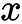是一个原始向量，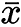是使用公式计算得到的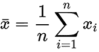的平均值，而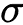是使用公式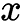计算得到的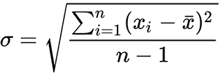的标准差。

`[0, 1]`。我们可以使用以下公式进行缩放：

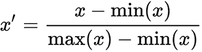

当你的数据集中不同特征的比例差异显著时，最小-最大缩放非常有用。它有助于使特征可比较，这对于许多机器学习模型来说非常重要。

`[-1, 1]`，使其均值变为零。我们可以使用以下公式进行均值归一化：

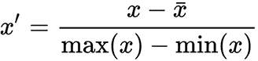

这种转换有助于使数据更容易解释，并通过减少异常值的影响并确保所有特征处于相似尺度上，从而提高某些机器学习算法的性能。考虑我们如何实现这些归一化技术以及哪些机器学习框架函数可以用来计算它们。

我们假设这个矩阵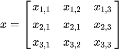的每一行是一个训练样本，每一列的值是当前样本的一个特征值。

## 使用特征值进行归一化

`Eigen`库中没有数据归一化的函数。然而，我们可以根据提供的公式实现它们。

对于标准化，我们首先必须计算标准差，如下所示：

```py
Eigen::Array<double, 1, Eigen::Dynamic> std_dev =
  ((x.rowwise() - x.colwise().mean())
    .array()
    .square()
    .colwise()
    .sum() /
    (x_data.rows() - 1))
  .sqrt();
```

注意，`Eigen`库中的一些减少函数仅与数组表示形式一起工作；例如，`sum()`和`sqrt()`函数。我们还计算了每个特征的均值——我们使用了`x.colwise().mean()`函数组合，它返回一个`mean`向量。我们可以用相同的方法来计算其他特征统计值。

在得到标准差值后，标准化公式的其余部分如下所示：

```py
Eigen::Matrix<double, Eigen::Dynamic, Eigen::Dynamic> x_std =
    (x.rowwise() - x.colwise().mean()).array().rowwise() / std_dev;
```

`min-max`归一化的实现非常直接，不需要中间值，如下面的代码片段所示：

```py
Eigen::Matrix<double, Eigen::Dynamic, Eigen::Dynamic> x_min_max =
    (x.rowwise() - x.colwise().minCoeff()).array().rowwise() /
    (x.colwise().maxCoeff() - x.colwise().minCoeff()).array();
```

我们以相同的方式实现均值归一化，如下所示：

```py
Eigen::Matrix<double, Eigen::Dynamic, Eigen::Dynamic> x_avg =
  (x.rowwise() - x.colwise().mean()).array().rowwise() /
  (x.colwise().maxCoeff() - x.colwise().minCoeff()).array();
```

注意，我们以向量化方式实现公式，而不使用循环；这种方法在计算上更有效，因为它可以被编译为在 GPU 或**中央处理单元（CPU）的****单指令多数据（SIMD）**指令上执行。

## 使用 mlpack 进行归一化

`mlpack`库中有不同的类用于特征缩放。对我们来说最有趣的是`data::data::MinMaxScaler`，它实现了最小-最大归一化（或缩放），以及`mlpack::data::StandardScaler`，它实现了数据标准化。我们可以重用这些类的对象来对具有相同学习统计数据的不同的数据进行缩放。这在我们在一个应用了缩放的数据格式上训练 ML 算法，然后使用该算法对新数据进行预测的情况下可能很有用。为了使此算法按我们的意愿工作，我们必须以与训练过程中相同的方式缩放新数据，如下所示：

```py
#include <mlpack/core.hpp>
...
arma::mat features;
arma::Row<size_t> labels;
data::MinMaxScaler min_max_scaler;
min_max_scaler.Fit(features); // learn statistics
arma::mat scaled_dataset;
min_max_scaler.Transform(features, scaled_dataset);
```

要学习统计值，我们使用`MinMaxScaler`类的`Fit()`方法，而对于特征修改，我们使用`Transform()`方法。

可以以相同的方式使用`StandardScaler`类，如下所示：

```py
data::StandardScaler standard_scaler;
standard_scaler.Fit(features);
standard_scaler.Transform(features, scaled_dataset);
```

要在`mlpack`库中打印矩阵对象，可以使用以下标准流操作符：

```py
std::cout << scaled_dataset << std::endl;
```

此外，为了撤销应用缩放，这些类有`InverseTransform`方法。

## 使用 Dlib 进行归一化

`Dlib`库提供了`Dlib::vector_normalizer`类来提供特征标准化的功能。使用此类的一个限制是，我们无法使用它来处理包含所有训练样本的大矩阵。作为替代，我们应该用单独的向量对象表示每个样本，并将它们放入 C++的`std::vector`容器中，如下所示：

```py
std::vector<matrix<double>> samples;
...
vector_normalizer<matrix<double>> normalizer;
samples normalizer.train(samples);
samples = normalizer(samples);
```

我们可以看到，此类对象可以重用，但应该先进行训练。训练方法的实现可能如下所示：

```py
matrix<double> m(mean(mat(samples)));
matrix<double> sd(reciprocal(stddev(mat(samples))));
for (size_t i = 0; i < samples.size(); ++i)
    samples[i] = pointwise_multiply(samples[i] - m, sd);
```

注意，`Dlib::mat()`函数有不同的重载，用于从不同来源创建矩阵。此外，我们还使用了`reciprocal()`函数，它将输入矩阵`m`转换为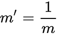矩阵。

在`Dlib`库中，为了调试目的打印矩阵可以使用简单的流操作符，如下面的代码片段所示：

```py
std::cout << mat(samples) << std::endl;
```

我们可以看到，`Dlib`库提供了一个丰富的数据预处理接口，可以轻松使用。

## 使用 Flashlight 进行归一化

`Flashlight`库没有特定的类来执行特征缩放。但它有计算基本统计数据的函数，因此我们可以按照以下方式实现特征缩放算法：

```py
fl::Tensor x;
...
// min-max scaling
auto x_min = fl::amin(x, {1});
auto x_max = fl::amax(x, {1});
auto x_min_max = (x - x_min) / (x_max - x_min);
// normalization(z-score)
auto x_mean = fl::mean(x, {1});
auto x_std = fl::std(x, {1});
auto x_norm = (x - x_mean) / x_std;
```

`fl::amin` 和 `fl::amax` 函数用于查找最小值和最大值。`fl::mean` 和 `fl::std` 函数分别计算平均值和标准差。所有这些函数都沿着指定的维度进行计算，该维度作为第二个参数。这意味着我们单独对数据集中的每个 `x` 特征进行缩放。

我们可以使用标准的 C++ 流操作符来打印 `fl::Tensor` 对象，如下所示：

```py
std::cout << dataset << std::endl;
```

我们看到，尽管 `FlashLight` 库没有提供专门用于数据预处理的类，但我们可以使用线性代数例程构建它们。

# 摘要

在本章中，我们讨论了如何从 CSV、JSON 和 HDF5 格式加载数据。CSV 格式易于读写，使其适用于小型到中型数据集。CSV 文件通常用于表格数据，例如客户信息、销售记录或金融交易。JSON 是一种轻量级的数据交换格式，可读性强且易于解析。它通常用于表示结构化数据，包括对象、数组和键值对。在机器学习中，JSON 可以用于存储用于训练模型的数据，例如特征向量、标签和元数据。HDF5 是一种高性能的文件格式，专为科学数据存储和分析设计。它支持具有复杂结构的大型数据集，允许高效地存储多维数组和表格。HDF5 文件常用于需要高效存储和访问大量数据的应用程序。

我们看到了如何将加载的数据转换为适用于不同机器学习框架的对象。我们使用了库的 API 将原始 C++ 数组转换为矩阵和更高层次的机器学习算法数据集对象。

我们探讨了如何使用 `OpenCV` 和 `Dlib` 库加载和处理图像。这些库提供了一系列函数和算法，可用于各种计算机视觉应用。这些库可用于基本的图像预处理，以及更复杂的系统，这些系统使用机器学习来解决行业重要任务，例如人脸检测和识别，这些可以用于构建安全系统、访问控制或面部认证。目标检测可用于图像中的对象计数、产品缺陷检测、特定对象的识别或其运动的跟踪。这在工业自动化、监控系统识别可疑活动以及自动驾驶汽车中非常有用。图像分割允许用户提取图像的特定部分以进行进一步分析。这在医学影像分析中诊断疾病时至关重要。随时间对物体进行运动跟踪也用于体育分析、交通监控和监控。

我们熟悉了数据归一化过程，这对于许多机器学习算法非常重要。我们还看到了机器学习库中可用的归一化技术，并使用 `Eigen` 库的线性代数函数实现了某些归一化方法。

在下一章中，我们将看到如何测量模型在不同类型数据上的性能。我们将探讨一些特殊技术，这些技术帮助我们理解模型如何很好地描述训练数据集以及它在新数据上的表现。此外，我们还将学习机器学习模型所依赖的不同类型参数，并了解如何选择最佳参数组合以提升模型性能。

# 进一步阅读

+   HDF5® 库和文件格式：[`www.hdfgroup.org/solutions/hdf5/`](https://www.hdfgroup.org/solutions/hdf5/)

+   Fast-CPPCSV 解析器的 GitHub 链接：[`github.com/ben-strasser/Fast-CPP-CSV-Parser`](https://github.com/ben-strasser/Fast-CPP-CSV-Parser)

+   `OpenCV`：[`opencv.org/`](https://opencv.org/)

+   `Dlib` C++ 库：[`Dlib.net/`](http://Dlib.net/)

+   `Flashlight` 文档：[`fl.readthedocs.io/en/latest/index.html`](https://fl.readthedocs.io/en/latest/index.html)

+   `nlohmann-json` 文档：[`json.nlohmann.me/`](https://json.nlohmann.me/)

+   `mlpack` 文档：[`mlpack.org/doc/index.html`](https://mlpack.org/doc/index.html)

+   *应用于论文评论的混合情感分析方法* 数据集：[`archive.ics.uci.edu/static/public/410/paper+reviews.zip`](https://archive.ics.uci.edu/static/public/410/paper+reviews.zip)
