# 第七章：分类

在机器学习中，分类的任务是将一组观察（对象）根据其形式描述的分析划分为称为**类别**的组。在**分类**中，每个观察（对象）根据特定的定性属性被分配到一组或命名类别。分类是一个监督任务，因为它需要已知的类别来训练样本。训练集的标记通常是通过手动完成，并涉及该研究领域的专家。值得注意的是，如果类别最初没有定义，那么在聚类中将会出现问题。此外，在分类任务中，可能存在超过两个类别（多类别），并且每个对象可能属于多个类别（相交）。

在本章中，我们将讨论使用机器学习解决分类任务的多种方法。我们将查看一些最知名和最广泛使用的算法，包括逻辑回归、**支持向量机**（**SVM**）和**k 最近邻**（**kNN**）。逻辑回归是基于线性回归和特殊损失函数的最直接算法之一。SVM 基于支持向量的概念，有助于构建决策边界来分离数据。这种方法可以有效地用于高维数据。kNN 具有简单的实现算法，它使用数据紧凑性的想法。此外，我们还将展示如何使用前面提到的算法解决多类别分类问题。我们将实现程序示例，以了解如何使用这些算法通过不同的 C++库来解决分类任务。

本章涵盖了以下主题：

+   分类方法的概述

+   探索各种分类方法

+   使用 C++库处理分类任务的示例

# 技术要求

本章所需的技术和安装包括以下内容：

+   `mlpack`库

+   `Dlib`库

+   Flashlight 库

+   支持 C++20 的现代 C++编译器

+   CMake 构建系统版本 >= 3.10

本章的代码文件可以在以下 GitHub 仓库中找到：[`github.com/PacktPublishing/Hands-On-Machine-Learning-with-C-Second-Edition/tree/main/Chapter07`](https://github.com/PacktPublishing/Hands-On-Machine-Learning-with-C-Second-Edition/tree/main/Chapter07).

# 分类方法的概述

分类是**应用统计学**、**机器学习**和**人工智能**（**AI**）中的一个基本任务。这是因为分类是最容易理解和解释的数据分析技术之一，分类规则可以用自然语言表述。在机器学习中，分类任务是通过监督算法解决的，因为类别是预先定义的，训练集中的对象有类别标签。解决分类任务的解析模型被称为**分类器**。

分类是将对象根据其形式化的特征移动到预定的类别的过程。在这个问题中，每个对象通常被表示为 *N*-维空间中的一个向量。该空间中的每个维度都是对象的一个特征的描述。

我们可以用数学符号来表述分类任务。让 *X* 表示对象的描述集合，*Y* 是一个有限的名字或类别标签集合。存在一个未知的客观函数——即映射 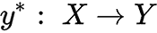，其值只在最终训练样本的对象上已知，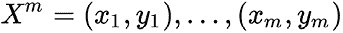。因此，我们必须构建一个 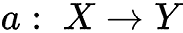 算法，能够对 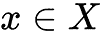 任意对象进行分类。在数学统计学中，分类问题也被称为判别分析问题。

分类任务适用于许多领域，包括以下内容：

+   **贸易**：对客户和产品的分类使企业能够优化营销策略，刺激销售，并降低成本

+   **电信**：对订阅者的分类使企业能够评估客户忠诚度，因此开发忠诚度计划

+   **医疗保健**：通过将人群分类到风险组中来辅助疾病诊断

+   **银行**：对客户的分类用于信用评分程序

分类可以通过以下方法来解决：

+   逻辑回归

+   kNN 方法

+   SVM

+   判别分析

+   决策树

+   神经网络

我们在*第六章*，*降维*中探讨了判别分析，将其作为一个降维算法，但大多数库也提供了用于判别分析算法作为分类器的**应用程序编程接口**（**API**）。我们将在*第九章*，*集成学习*中讨论决策树，重点关注算法集成。我们还将讨论在接下来的章节*第十章*，*用于图像分类的神经网络*中的神经网络。

现在我们已经讨论了分类任务是什么，让我们来看看各种分类方法。

# 探索各种分类方法

现在，**深度学习**在分类任务中也变得越来越流行，尤其是在处理复杂和高维数据（如图像、音频和文本）时。深度神经网络可以学习数据的层次表示，从而能够进行准确的分类。在本章中，我们专注于更经典的分类方法，因为它们仍然适用，并且通常需要较少的计算资源。具体来说，我们将讨论一些分类方法，如 Logistic 回归、**核岭回归**（**KRR**）、kNN 方法和 SVM 方法。

## Logistic 回归

Logistic 回归通过使用 Logistic 函数来确定分类因变量与一个或多个自变量之间的依赖程度。它旨在找到输入变量的系数值，就像线性回归一样。在 Logistic 回归的情况下，区别在于输出值是通过使用非线性（Logistic）函数转换的。Logistic 函数具有 S 形曲线，并将任何值转换为`0`到`1`之间的数字。这一特性很有用，因为我们可以将规则应用于 Logistic 函数的输出，将`0`和`1`绑定到类预测。以下截图显示了 Logistic 函数的图形：

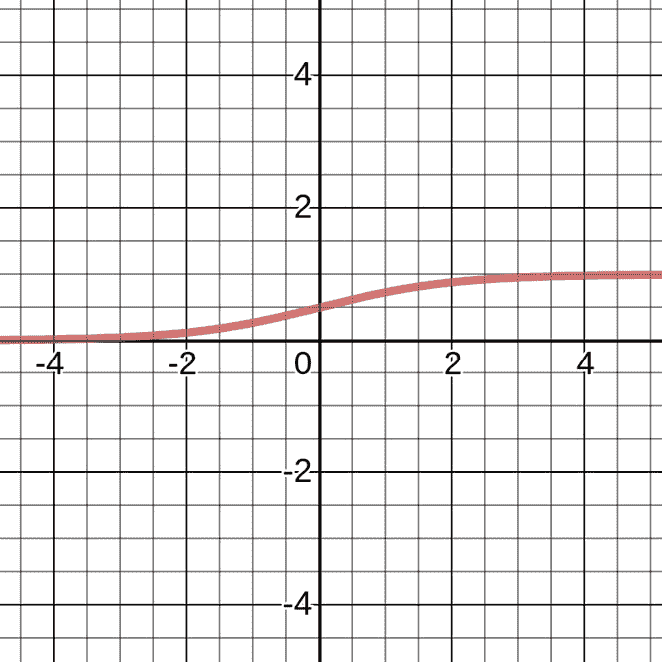

图 7.1 – Logistic 函数

例如，如果函数的结果小于`0.5`，则输出为`0`。预测不仅仅是简单的答案（`+1`或`-1`），我们还可以将其解释为被分类为`+1`的概率。

在许多任务中，这种解释是一个基本的企业需求。例如，在信用评分任务中，Logistic 回归传统上被使用，贷款违约的概率是一个常见的预测。与线性回归的情况一样，如果移除了异常值和相关性变量，Logistic 回归的性能会更好。Logistic 回归模型可以快速训练，非常适合二元分类问题。

线性分类器的基本思想是特征空间可以通过一个超平面分为两个半空间，在每个半空间中预测目标类的两个值之一。如果我们能够无错误地划分特征空间，那么训练集被称为**线性可分**。Logistic 回归是一种独特的线性分类器，但它能够预测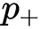的概率，将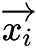的例子归为类*+*，如图所示：

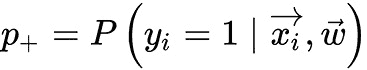

考虑二元分类任务，目标类的标签用 `+1`（正例）和 `-1`（反例）表示。我们想要预测 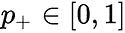 的概率；因此，现在我们可以使用以下优化技术构建线性预测：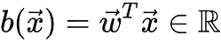。那么，我们如何将得到的值转换为概率，其极限为 `[0, 1]`？这种方法需要一个特定的函数。在逻辑回归模型中，用于此的特定函数 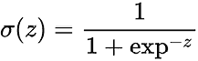 被使用。

让我们用 *P(X)* 表示事件 *X* 发生的概率。概率优势比 *OR(X)* 由 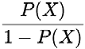 确定。这是事件发生与否的概率比。我们可以看到，概率和优势比都包含相同的信息。然而，虽然 *P(X)* 的范围是 `0` 到 `1`，*OR(X)* 的范围是 `0` 到 。如果你计算 *OR(X)* 的对数（称为 **优势对数** 或 **概率比的对数**），很容易看出以下适用：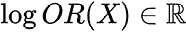。

使用逻辑函数预测  的概率，可以从概率比（暂时假设我们也有权重）中得到如下：

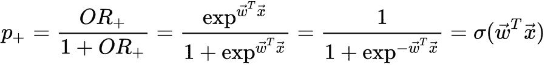

因此，逻辑回归预测将样本分类到 "*+*" 类的概率，作为模型权重向量与样本特征向量的线性组合的 sigmoid 变换，如下所示：

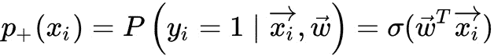

从最大似然原理中，我们可以得到逻辑回归解决的优化问题——即最小化逻辑损失函数。对于 "`-`" 类，概率由一个类似的公式确定，如图所示：

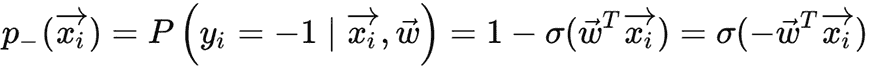

两个类的表达式可以合并为一个，如图所示：

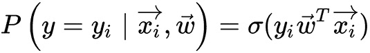

在这里，表达式 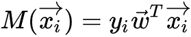 被称为  对象的分类边缘。分类边缘可以理解为模型对对象分类的 *置信度*。这个边缘的解释如下：

+   如果边缘向量的绝对值很大且为正，则类标签设置正确，对象远离分离超平面。因此，这样的对象被自信地分类。

+   如果边缘很大（通过模运算）但为负，则类标签设置错误。对象远离分离超平面。这样的对象很可能是异常值。

+   如果边缘很小（通过模运算），则对象接近分离超平面。在这种情况下，边缘符号决定了对象是否被正确分类。

在离散情况下，似然函数 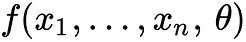 可以解释为样本 *X*1 *, . . . , X*n 等于 *x*1 *, . . . , x*n 在给定实验集中的概率。此外，这个概率依赖于 *θ*，如图所示：

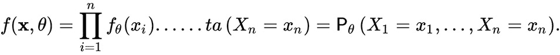

对于未知参数 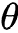 的最大似然估计  被称为  的值，此时函数 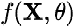 达到其最大值（*θ* 固定时作为 *θ* 的函数），如图所示：

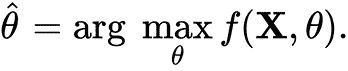

现在，我们可以写出样本的似然函数——即在样本  中观察到给定向量 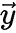 的概率。我们做出一个假设——对象独立地从单个分布中出现，如图所示：

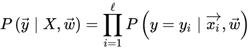

让我们取这个表达式的对数，因为求和比求积更容易优化，如下所示：

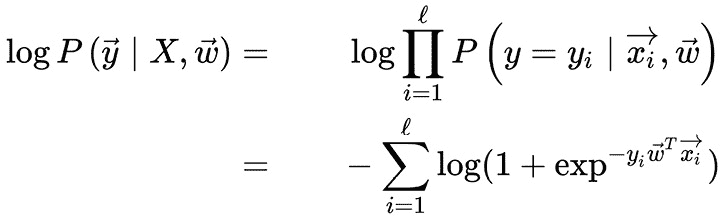

在这种情况下，最大化似然的原则导致表达式的最小化，如图所示：

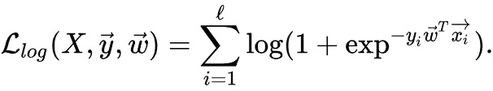

这个公式是逻辑损失函数，对所有训练样本中的对象进行求和。通常，给模型添加一些正则化来处理过拟合是一个好主意。逻辑回归的**L2 正则化**与岭回归（带有正则化的**线性回归**）的安排方式大致相同。然而，在 SVM 模型中，通常使用控制变量衰减参数 *C*，其中它表示软边界参数的表示。因此，对于逻辑回归，*C* 等于逆正则化系数 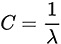。*C* 和 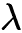 之间的关系如下：降低 *C* 会增强正则化效果。因此，而不是最小化函数 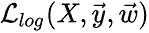，应该最小化以下函数：

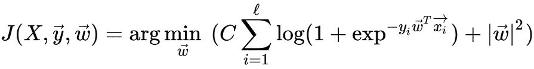

.

对于这个函数最小化问题，我们可以应用不同的方法——例如，最小二乘法，或者**梯度下降**方法。逻辑回归的关键问题是它通常是一个线性分类器，为了处理非线性决策边界，通常使用以原始特征为基础的多项式特征。这种方法在我们讨论多项式回归时在*第三章*中进行了讨论。

## KRR

KRR 结合了线性岭回归（线性回归和 L2 范数正则化）与核技巧，可用于分类问题。它学习在由所选核和训练数据产生的更高维空间中的线性函数。对于非线性核，它在原始空间中学习非线性函数。

KRR 学习到的模型与 SVM 模型相同，但这些方法有以下不同之处：

+   KRR 方法使用平方误差损失，而 SVM 模型在分类时使用不可分损失或铰链损失。

+   与 SVM 方法相比，KRR 的训练可以以闭式形式完成，因此对于中等大小的数据集可以更快地训练。

+   学习到的 KRR 模型是非稀疏的，在预测时间上可能比 SVM 模型慢。

尽管有这些不同之处，但两种方法通常都使用 L2 正则化。

## SVM

SVM 方法是一组用于分类和回归分析任务的算法。考虑到在*N*维空间中，每个对象属于两个类别之一，SVM 生成一个(*N-1*)维超平面来将这些点分为两组。它类似于纸上描绘的两个不同类型点可以线性划分的图示。此外，SVM 选择具有最大距离于最近组元素的超平面。

输入数据可以使用各种超平面进行分离。最佳超平面是具有最大分离结果和两个类别之间最大差异的超平面。

想象平面上数据点。在以下情况下，分离器只是一条直线：

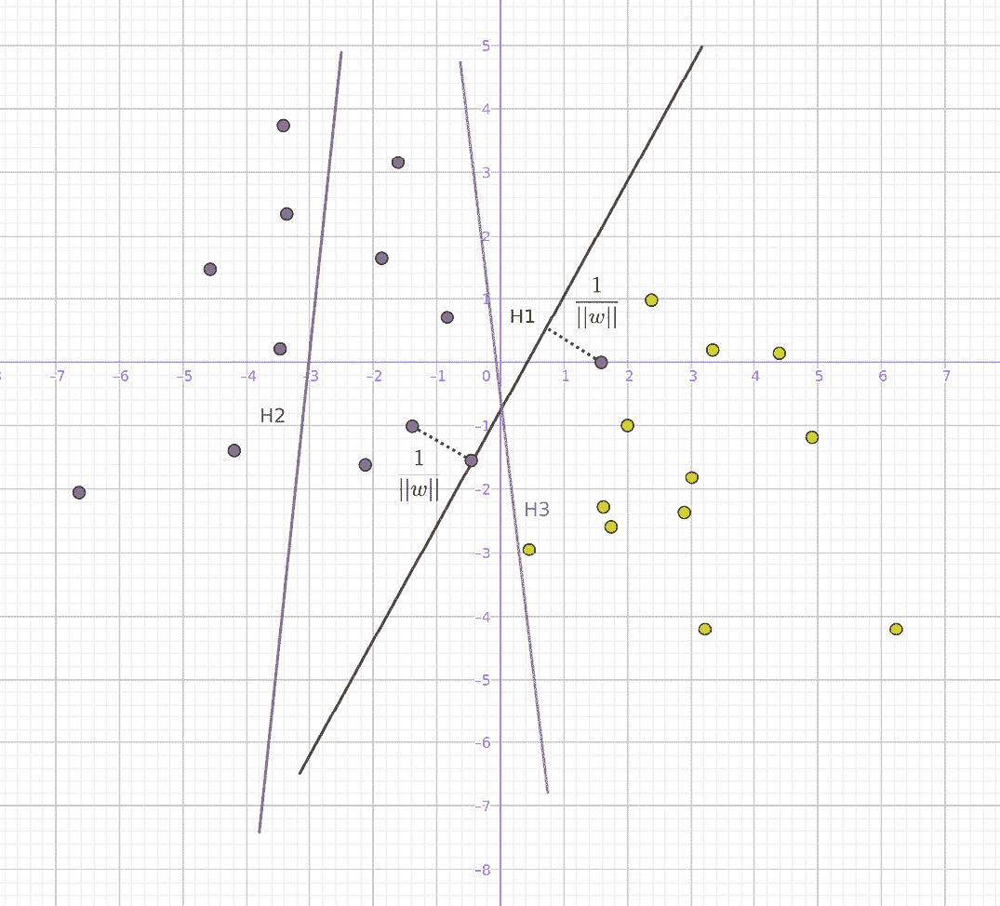

图 7.2 – 点分离线

让我们画出将点分为两集的明显直线。然后，选择尽可能远离点的直线，最大化它到每一边最近点的距离。如果存在这样的线，则称为最大间隔超平面。直观上，由于超平面本身（它具有最长距离到任何类别的训练样本的最近点），因此，一般来说，距离越大，分类器误差越小。

考虑给定的学习样本集合 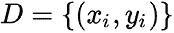，其中包含 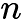 个对象，每个对象有  个参数，其中  取值为-1 或 1，从而定义了点的类别。每个点 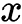 是一个维度为  的向量。我们的任务是找到分离观察值的最大间隔超平面。我们可以使用解析几何来定义任何超平面为满足条件的点集 ，如图所示：

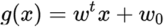

这里，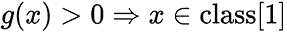 和 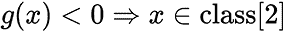。

因此，线性分离（判别）函数由方程 *g(x)=0* 描述。点到分离函数 *g(x)=0*（点到平面的距离）等于以下：

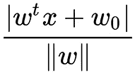

.

 位于边界 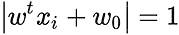 的闭集中。边界，即分隔带的宽度，需要尽可能大。考虑到边界的闭集满足条件 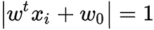，那么 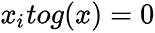 的距离如下所示：

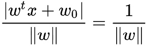

.

因此，分隔带的宽度是 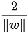。为了排除分隔带中的点，我们可以写出以下条件：


让我们再介绍一个索引函数 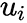，它显示了 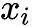 属于哪个类别，如下所示：

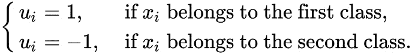

因此，选择一个生成最大宽度走廊的分离函数的任务可以写成如下：

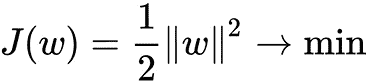

*J(w)* 函数是在假设 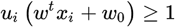 对所有 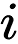 成立的情况下引入的。由于目标函数是二次的，这个问题有一个唯一解。

根据库恩-塔克定理，这个条件等价于以下问题：


.

这是在假设  和 ，其中 ，是新的变量的情况下提供的。我们可以将  以矩阵形式重写，如下所示：


矩阵的 *H* 系数可以按照以下方式计算：


二次规划方法可以解决  任务。

在找到每个  的最优  之后，满足以下两个条件之一：

+    (*i* 对应于非支持向量)

+    (*i* 对应于支持向量)

然后，从关系  中找到 ，并确定  的值，考虑到对于任何  和 ，如下所示：


因此，我们可以根据提供的条件使用提供的公式来计算 w0。

最后，我们可以获得判别函数，如图所示：


注意，求和不是对所有向量进行的，而只是对集合 *S* 进行的，*S* 是支持向量  的集合。

很不幸，所描述的算法仅适用于线性可分的数据集，而这种数据集本身出现的频率相当低。处理线性不可分数据有两种方法。

其中一种被称为软边界，它选择一个尽可能纯粹（最小化错误）地分割训练样本的超平面，同时最大化到训练数据集中最近点的距离。为此，我们必须引入额外的变量，，这些变量表征了每个对象 *x*i 上的错误大小。此外，我们还可以将总误差的惩罚引入目标泛函中，如下所示：


在这里， 是一个方法调整参数，允许你调整最大化分割条带宽度和最小化总误差之间的关系。对于相应的对象 *x*i，惩罚  的值取决于对象 *x*i 相对于分割线的位置。因此，如果 *x*i 位于判别函数的对面，则我们可以假设惩罚  的值，如果 *x*i 位于分割条带中，并且来自其类别。因此，相应的权重是 。在理想情况下，我们假设 。然后，可以将该问题重新表述如下：


注意，非理想情况下的元素也参与了最小化过程，如下所示：


在这里，常数 *β* 是考虑条带宽度的权重。如果 *β* 很小，那么我们可以允许算法在非理想位置（分割条带中）定位相对较多的元素。如果 *β* 很大，那么我们要求在非理想位置（分割条带中）的元素数量很少。不幸的是，由于  的不连续性，最小化问题相当复杂。相反，我们可以使用以下内容的优化：


这是在以下限制  下发生的，如下所示：


在类别的线性分离不可能的情况下，SVM 方法的一个想法是过渡到更高维度的空间，在那里这种分离是可能的。虽然原始问题可以在有限维空间中表述，但往往发生的情况是，用于判别的样本在这个空间中不是线性可分的。因此，建议将原始的有限维空间映射到更大的维度空间，这使得分离变得容易得多。为了保持计算负载合理，支持向量算法中使用的映射提供了在原始空间变量（特别是核函数）方面的计算便利。

首先，选择映射函数  将  的数据映射到更高维度的空间。然后，可以写出形式为  的非线性判别函数。该方法的思想是找到核函数  并最大化目标函数，如图所示：


在这里，为了最小化计算，没有使用将数据直接映射到更高维度的空间。相反，使用了一种称为核技巧的方法——即 *K(x, y)*，这是一个核矩阵。核技巧是机器学习算法中使用的一种方法，用于将非线性数据转换到更高维度的空间，使其成为线性可分的。这允许使用线性算法来解决非线性问题，因为它们通常更简单且计算效率更高（参见*第六章*中对核技巧的详细解释）。

通常，方法选择的支撑向量越多，其泛化能力越好。任何不构成支撑向量的训练示例，如果出现在测试集中，都会被正确分类，因为正负示例之间的边界仍然在同一位置。因此，支持向量方法预期的错误率通常等于支撑向量示例的比例。随着测量数量的增加，这个比例也会增加，因此该方法并非不受维度的诅咒，但它比大多数算法更能抵抗这种诅咒。

值得注意的是，支持向量方法对噪声和数据标准化很敏感。

此外，SVM 方法不仅限于分类任务，还可以适应解决回归任务。因此，通常可以使用相同的 SVM 软件实现来解决分类和回归任务。

## kNN 方法

kNN 是一种流行的分类方法，有时也用于回归问题。它是分类的最自然方法之一。该方法的核心是通过其邻居中最普遍的类别来对当前项进行分类。形式上，该方法的基础是紧致性假设：如果成功阐明示例之间的距离度量，则相似的示例更有可能属于同一类别。例如，如果你不知道在蓝牙耳机广告中指定什么类型的产品，你可以找到五个类似的头盔广告。如果其中四个被分类为 *配件*，只有一个被分类为 *硬件*，常识会告诉你你的广告可能应该放在 *配件* 类别中。

通常，为了对对象进行分类，必须按顺序执行以下操作：

1.  计算对象到训练数据集中其他对象的距离。

1.  选择与被分类对象距离最小的 *k* 个训练对象。

1.  将分类对象的类别设置为在最近的 *k* 邻居中最常出现的类别。

如果我们将最近邻的数量 *k = 1*，那么算法就会失去泛化能力（即，无法对算法中未遇到过的数据进行正确的结果），因为新项目被分配到最近的类别。如果我们设置得太高，那么算法可能不会揭示许多局部特征。

计算距离的函数必须满足以下规则：

+   

+    仅当 *x = y* 时

+   

+    当 *x*、*y* 和 *z* 点不在一条直线上时

在这种情况下，*x*、*y* 和 *z* 是比较对象的特征向量。对于有序属性值，可以应用欧几里得距离，如下所示：


在这种情况下，*n* 是属性的数量。

对于无法排序的字符串变量，可以使用差分函数，其设置如下：


在寻找距离时，有时会考虑属性的重要性。通常，属性的相关性可以通过专家或分析师的主观判断来确定，这基于他们的经验、专业知识和问题解释。在这种情况下，总和差异的每个 *i* 次方乘以系数 *Z*i。例如，如果属性 *A* 比属性  (, ) 重要三倍，那么距离的计算如下：


这种技术被称为**拉伸坐标轴**，这可以减少分类误差。

对于分类对象的选择也可以不同，并且有两种主要方法来做出这种选择：**无权投票**和**加权投票**。

对于无权投票，我们通过指定**k**的数量来确定在分类任务中有多少对象有投票权。我们通过它们到新对象的最近距离来识别这些对象。对每个对象的单独距离对于投票不再至关重要。在类定义中，所有对象都有平等的权利。每个现有对象都会为它所属的类投票。我们将获得最多投票的类分配给新对象。然而，如果几个类获得相同数量的投票，可能会出现问题。加权投票解决了这个问题。

在加权投票过程中，我们也会考虑新对象的距离。距离越小，投票的贡献就越大。对类的投票公式如下：


在这种情况下，是已知对象到新对象的距离的平方，而是计算投票的已知对象的数量。`class`是类的名称。新对象对应于获得最多投票的类。在这种情况下，几个类获得相同数量投票的概率要低得多。当时，新对象被分配到最近邻的类。

kNN 方法的一个显著特点是它的惰性。惰性意味着计算仅在分类的瞬间开始。当使用 kNN 方法进行训练样本时，我们不仅构建模型，同时也会进行样本分类。请注意，最近邻方法是一个研究得很好的方法（在机器学习、计量经济学和统计学中，只有线性回归更为人所知）。对于最近邻方法，有相当多的关键定理表明，在**无限**样本上，kNN 是最佳分类方法。经典书籍《统计学习基础》的作者认为 kNN 是一个理论上理想的算法，其适用性仅受计算能力和维度的诅咒所限制。

kNN 是最简单的分类算法之一，因此在现实世界的任务中往往效果不佳。KNN 算法有几个缺点。除了在没有足够样本的情况下分类精度低之外，kNN 分类器的另一个问题是分类速度：如果训练集中有 *N* 个对象，空间维度是 *K*，那么对测试样本进行分类的操作次数可以估计为 。用于算法的数据集必须是具有代表性的。模型不能与数据分离：要分类一个新示例，你需要使用所有示例。

正面特征包括算法对异常离群值的抵抗力，因为这种记录落入 kNN 数量中的概率很小。如果发生这种情况，那么对投票（唯一加权）的影响  也可能是不显著的，因此对分类结果的影响也较小。算法的程序实现相对简单，算法结果易于解释。因此，应用领域的专家可以根据找到相似对象来理解算法的逻辑。通过使用最合适的函数和度量组合来修改算法的能力，你可以调整算法以适应特定任务。

## 多类分类

大多数现有的多类分类方法要么基于二元分类器，要么被简化为它们。这种方法的总体思路是使用一组训练有素的二元分类器，以将不同组对象彼此分离。在这种多类分类中，使用各种投票方案对一组二元分类器进行投票。

在针对 *N* 个类的 **一对一** 策略中，训练 *N* 个分类器，每个分类器将其类别与其他所有类别分离。在识别阶段，未知向量 *X* 被输入到所有 *N* 个分类器中。向量 *X* 的成员资格由给出最高估计的分类器确定。这种方法可以解决当出现类别不平衡问题时的问题。即使多类分类的任务最初是平衡的（即，每个类别的训练样本数量相同），当训练二元分类器时，每个二元问题的样本数量比例会随着类别数量的增加而增加，这因此显著影响了具有显著数量类别的任务。

**每个对抗每个**策略分配  个分类器。这些分类器被训练来区分所有可能的类别对。对于输入向量，每个分类器给出一个关于  的估计，反映其在  和  类别中的成员资格。结果是具有最大和  的类别，其中 *g* 是单调不减函数——例如，相同或逻辑函数。

**射击锦标赛**策略也涉及训练  个分类器，这些分类器区分所有可能的类别对。与之前的策略不同，在向量 *X* 的分类阶段，我们安排了类别之间的锦标赛。我们创建一个锦标赛树，其中每个类别都有一个对手，只有获胜者才能进入下一轮锦标赛。因此，在每一步，只有一个分类器确定向量 *X* 的类别，然后使用获胜的类别来确定下一对类别的下一个分类器。这个过程一直进行到只剩下一个获胜的类别，这应该被视为结果。

一些方法可以立即产生多类分类，无需额外的配置和组合。kNN 算法或神经网络可以被认为是此类方法的例子。

此外，逻辑回归可以通过使用 softmax 函数来推广到多类情况。softmax 函数用于确定一个样本属于特定类别的概率，其形式如下：


在这里，*K* 是可能的类别数量，而 theta 是一个可学习参数的向量。当 *K=2* 时，这个表达式简化为逻辑回归：


用单个参数向量替换向量差：


我们可以看到，对于一类，其概率将按以下方式预测：


对于第二类，它将是以下内容：


如您所见，这些表达式等同于我们之前看到的逻辑回归。

现在我们已经熟悉了一些最广泛使用的分类算法，让我们看看如何在不同的 C++ 库中使用它们。

# 使用 C++ 库处理分类任务的示例

现在我们来看看如何使用我们描述的方法来解决人工数据集上的分类任务，这些数据集可以在下面的屏幕截图中看到：


图 7.3 – 人工数据集

如我们所见，这些数据集包含两种和三种不同的对象类别，因此使用多类分类方法是有意义的，因为这类任务在现实生活中出现得更频繁；它们可以很容易地简化为二分类。

分类是一种监督技术，因此我们通常有一个训练数据集，以及用于分类的新数据。为了模拟这种情况，在我们的示例中我们将使用两个数据集，一个用于训练，一个用于测试。它们来自一个大型数据集中的相同分布。然而，测试集不会用于训练；因此，我们可以评估准确度指标，并查看模型的表现和泛化能力如何。

## 使用 mlpack 库

在本节中，我们展示如何使用`mlpack`库来解决分类任务。这个库为三种主要的分类算法提供了实现：逻辑回归、softmax 回归和 SVM。

### 使用 softmax 回归

`mlpack`库在`SoftmaxRegression`类中实现了多类逻辑回归。使用这个类非常简单。我们必须使用用于训练的样本数量和类的数量初始化一个对象。假设我们有以下对象作为训练数据和标签：

```py
using namespace mlpack;
size_t num_classes;
arma::mat train_input;
arma::Row<size_t> train_labels;
```

然后，我们可以如下初始化一个`SoftmaxRegression`对象：

```py
SoftmaxRegression smr(train_input.n_cols, num_classes);
```

在我们有了分类器对象之后，我们可以对其进行训练，并对一些新数据应用分类函数。以下代码片段显示了如何实现：

```py
smr.Train(train_input, train_labels, num_classes);
arma::Row<size_t> predictions;
smr.Classify(test_input, predictions);
```

获得预测向量后，我们可以使用本书中基于`plotcpp`库的技术将其可视化。请注意，`Train`和`Classify`方法需要`size_t`类型的类标签。以下截图显示了将`mlpack`实现的 softmax 回归算法应用于我们的数据集的结果：


图 7.4 – 使用 mlpack 的 softmax 分类

注意到我们在**Dataset 0**、**Dataset 1**和**Dataset 2**数据集中存在分类错误，而其他数据集的分类几乎正确。

### 使用 SVMs

`mlpack`库在`LinearSVM`类中也有多类 SVM 算法的实现。该库为所有分类算法提供了几乎相同的 API，因此分类器对象的初始化与上一个示例大致相同。主要区别在于您可以使用不带参数的构造函数。因此，对象初始化如下：

```py
mlpack::LinearSVM<> lsvm;
```

然后，我们使用`Train`方法训练分类器，并使用`Classify`方法对新数据样本进行应用，如下所示：

```py
lsvm.Train(train_input, train_labels, num_classes);
arma::Row<size_t> predictions;
lsvm.Classify(test_input, predictions);
```

以下截图显示了将`mlpack`实现的 SVM 算法应用于我们的数据集的结果：


图 7.5 – 使用 mlpack 的 SVM 分类

您可以看到我们从 SVM 方法得到的结果与使用 softmax 回归得到的结果几乎相同。

### 使用线性回归算法

`mlpack` 库还在 `LogisticRegression` 类中实现了经典的逻辑回归算法。这个类的对象只能用于将样本分类为两个类别。使用 API 与 `mlpack` 库之前的示例相同。这个类的典型应用如下：

```py
using namespace mlpack;
LogisticRegression<> lr;
lr.Train(train_input, train_labels);
arma::Row<size_t> predictions;
lr.Classify(test_input, predictions);
```

以下截图显示了将两类逻辑回归应用于我们的数据集的结果：


图 7.6 – 使用 mlpack 的逻辑回归分类

您可以看到，我们只为 **Dataset 3** 和 **Dataset 4** 获得了合理的分类，因为它们可以用直线分开。然而，由于两类的限制，我们无法获得正确的结果。

## 使用 Dlib 库

`Dlib` 库没有很多分类算法。其中有两个是最适用的：*KRR* 和 *SVM*。这些方法被实现为二元分类器，但对于多类分类，这个库提供了 `one_vs_one_trainer` 类，它实现了投票策略。请注意，这个类可以使用不同类型的分类器，这样您可以将 KRR 和 SVM 结合起来进行一个分类任务。我们还可以指定哪些分类器应该用于哪些不同的类别。

### 使用 KRR

以下代码示例展示了如何使用 `Dlib` 的 KRR 算法实现进行多类分类：

```py
void KRRClassification(const Samples& samples,
                       const Labels& labels,
                       const Samples& test_samples,
                       const Labels& test_labels) {
  using OVOtrainer = one_vs_one_trainer<
    any_trainer<SampleType>>;
  using KernelType = radial_basis_kernel<SampleType>;
  krr_trainer<KernelType> krr_trainer;
  krr_trainer.set_kernel(KernelType(0.1));
  OVOtrainer trainer;
  trainer.set_trainer(krr_trainer);
  one_vs_one_decision_function<OVOtrainer> df =
      trainer.train(samples, labels);
  // process results and estimate accuracy
  DataType accuracy = 0;
  for (size_t i = 0; i != test_samples.size(); i++) {
    auto vec = test_samples[i];
    auto class_idx = static_cast<size_t>(df(vec));
    if (static_cast<size_t>(test_labels[i]) == class_idx)
        ++accuracy;
    // ...
  }
  accuracy /= test_samples.size();
}
```

首先，我们初始化了 `krr_trainer` 类的对象，然后使用核对象的实例配置它。在这个例子中，我们使用了 `radial_basis_kernel` 类型作为核对象，以处理无法线性分离的样本。在获得二元分类器对象后，我们初始化了 `one_vs_one_trainer` 类的实例，并使用 `set_trainer()` 方法将这个分类器添加到其堆栈中。然后，我们使用 `train()` 方法来训练我们的多类分类器。与 `Dlib` 库中的大多数算法一样，这个算法假设训练样本和标签具有 `std::vector` 类型，其中每个元素具有 `matrix` 类型。`train()` 方法返回一个决策函数——即作为函数对象的行为的对象，它接受一个单独的样本并返回其分类标签。这个决策函数是 `one_vs_one_decision_function` 类型的对象。以下代码片段展示了我们如何使用它：

```py
        auto vec = test_samples[i];
        auto class_idx = static_cast<size_t>(df(vec));
```

`Dlib` 库中没有对准确度指标进行明确的实现；因此，在这个例子中，准确度直接计算为正确分类的测试样本数与总测试样本数的比率。

以下截图显示了将 `Dlib` 的 KRR 算法实现应用于我们的数据集的结果：


图 7.7 – 使用 Dlib 的 KRR 分类

注意到 KRR 算法在所有数据集上进行了正确的分类。

### 使用 SVM

以下代码示例展示了如何使用 `Dlib` SVM 算法实现进行多类分类：

```py
void SVMClassification(const Samples& samples,
                       const Labels& labels,
                       const Samples& test_samples,
                       const Labels& test_labels) {
  using OVOtrainer = one_vs_one_trainer<
    any_trainer<SampleType>>;
  using KernelType = radial_basis_kernel<SampleType>;
  svm_nu_trainer<KernelType> svm_trainer;
  svm_trainer.set_kernel(KernelType(0.1));
  OVOtrainer trainer;
  trainer.set_trainer(svm_trainer);
  one_vs_one_decision_function<OVOtrainer> df =
    trainer.train(samples, labels);
  // process results and estimate accuracy
  DataType accuracy = 0;
  for (size_t i = 0; i != test_samples.size(); i++) {
    auto vec = test_samples[i];
    auto class_idx = static_cast<size_t>(df(vec));
    if (static_cast<size_t>(test_labels[i]) == class_idx)
        ++accuracy;
    // ...
  }
  accuracy /= test_samples.size();
}
```

此示例表明 `Dlib` 库也有一个统一的 API 用于使用不同的算法，与前一个示例的主要区别是二分类器的对象。对于 SVM 分类，我们使用了 `svm_nu_trainer` 类型的对象，该对象还配置了 `radial_basis_kernel` 类型的核对象。

以下截图展示了将 `Dlib` SVM 算法的实现应用于我们的数据集的结果：


图 7.8 – 使用 Dlib 的 SVM 分类

您可以看到 `Dlib` SVM 算法的实现也在所有数据集上进行了正确的分类，因为 `mlpack` 对同一算法的实现由于线性特性在某些情况下进行了错误的分类。

## 使用 Flashlight 库

Flashlight 库没有为分类算法提供任何特殊的类。但通过使用库的线性代数原语和自动微分功能，我们可以从头实现逻辑回归算法。此外，为了处理非线性可分的数据集，我们将实现核技巧方法。

### 使用逻辑回归

以下示例展示了如何使用 Flashlight 库实现二类分类。让我们定义一个用于训练线性分类器的函数；它将具有以下签名：

```py
fl::Tensor train_linear_classifier(
  const fl::Tensor& train_x,
  const fl::Tensor& train_y, float learning_rate);
```

`train_x` 和 `train_y` 是训练样本及其相应的标签。函数的结果是学习到的参数向量——在我们的例子中，使用 `fl::Tensor` 类定义。我们将使用批梯度下降算法来学习参数向量。因此，我们可以使用 Flashlight 数据集类型来简化对训练数据批次的处理。以下代码片段展示了我们如何创建一个数据集对象，它将允许我们遍历批次：

```py
std::vector<fl::Tensor> fields{train_x, train_y};
auto dataset = std::make_shared<fl::TensorDataset>(fields);
int batch_size = 8;
auto batch_dataset = std::make_shared<fl::BatchDataset>(
  dataset, batch_size);
```

首先，我们使用 `fl::TensorDataset` 类型定义了常规数据集对象，然后我们使用它创建了 `fl::BatchDataset` 类型的对象，该对象还初始化了批次大小值。

接下来，我们需要初始化我们将使用梯度下降法学习的参数向量，如下所示：

```py
auto weights = fl::Variable(fl::rand({
  train_x.shape().dim(0), 1}), /*calcGrad=*/true);
```

注意我们明确地将 `true` 值作为最后一个参数传递，以启用 Flashlight autograd 机制进行梯度计算。现在，我们准备好使用预定义的周期数定义训练周期。在每个周期中，我们将遍历数据集中的所有批次。因此，这样的周期可以定义为以下：

```py
int num_epochs = 100;
for (int e = 1; e <= num_epochs; ++e) {
  fl::Tensor epoch_error = fl::fromScalar(0);
  for (auto& batch : *batch_dataset) {
    auto x = fl::Variable(batch[0], /*calcGrad=*/false);
    auto y = fl::Variable(
      fl::reshape(batch[1], {1, batch[1].shape().dim(0)}), 
      /*calcGrad=*/false);
  }
}
```

您可以看到两个嵌套循环：外层循环用于 epoch，内层循环用于批次。在`for`循环中使用的`batch_dataset`对象与 C++基于范围的 for 循环构造兼容，因此它很容易用来访问批次。此外，请注意，我们定义了两个变量`x`和`y`，其类型与权重相同，为`fl::Variable`类型。使用这种类型使得将张量值传递到自动微分机制成为可能。对于这些变量，我们没有配置梯度计算，因为它们不是可训练的参数。另一个重要问题是，我们使用了`fl::reshape`来使所有张量形状与损失函数计算中将要应用的矩阵乘法兼容。逻辑回归损失函数如下所示：


在代码中，我们可以用以下几行来实现它：

```py
auto z = fl::matmul(fl::transpose(weights), x);
auto loss = fl::sum(fl::log(1 + fl::exp(-1 * y * z)), /*axes=*/{1});
```

在我们得到损失值后，我们可以应用梯度下降算法，根据当前训练样本批次的影响来纠正权重（参数向量）。以下代码片段展示了如何实现它：

```py
loss.backward();
weights.tensor() -= learning_rate *weights.grad().tensor();
weights.zeroGrad();
```

注意到梯度归零的最后一步是为了使从下一个训练样本中学习新内容成为可能，而不是混合梯度。在训练周期结束时，可以从函数中返回结果参数向量，如下所示：

```py
return weights.tensor();
```

以下示例展示了如何使用我们的训练函数：

```py
fl::Tensor train_x;
fl::Tensor train_y;
auto weights = train_linear_classifier(
  train_x, train_y, /*learning_rate=*/0.1f);
```

在获得学习参数向量后，我们可以用它来分类新的数据样本，如下所示：

```py
fl::Tensor sample;
constexpr float threshold = 0.5;
auto p = fl::sigmoid(fl::matmul(fl::transpose(weights), sample));
if (p.scalar<float>() > threshold)
  return 1;
else
  return 0;
```

您可以看到我们将返回结果的逻辑函数调用实现了到`p`变量中。这个变量的值可以解释为样本属于特定类的事件的概率。我们引入了`threshold`变量来检查概率。如果它大于这个阈值，那么我们将样本分类为类`1`；否则，它属于类`0`。

以下截图显示了将 Flashlight 实现的逻辑回归算法应用于我们的具有两个类别的数据集的结果：


图 7.9 – 使用 Flashlight 进行逻辑回归分类

您可以看到，它未能正确分类**数据集 0**和**数据集 1**（具有非线性类边界），但成功地将**数据集 4**分类为线性可分。

### 使用逻辑回归和核技巧

为了解决非线性类边界的问题，我们可以应用核技巧。让我们看看我们如何在 Flashlight 库中使用高斯核来实现它。想法是将我们的数据样本移动到更高维的空间中，在那里它们可以线性可分。高斯核函数如下所示：


为了使我们的计算更加高效，我们可以按以下方式重写它们：


以下代码示例展示了该公式的实现：

```py
fl::Tensor make_kernel_matrix(const fl::Tensor& x,
                              const fl::Tensor& y, float gamma) {
  auto x_norm = fl::sum(fl::power(x, 2), /*axes=*/{-1});
  x_norm = fl::reshape(x_norm, {x_norm.dim(0), 1});
  auto y_norm = fl::sum(fl::power(y, 2), /*axes=*/{-1});
  y_norm = fl::reshape(y_norm, {1, y_norm.dim(0)});
  auto k = fl::exp(-gamma * (x_norm + y_norm -
                             2 * fl::matmul(fl::transpose(x), y)));
  return k;
}
```

`make_kernel_matrix` 函数接受两个矩阵，并应用高斯核，返回单个矩阵。让我们看看我们如何将其应用于我们的问题。首先，我们将其应用于我们的训练数据集，如下所示：

```py
constexpr float rbf_gamma = 100.f;
auto kx = make_kernel_matrix(train_x, train_x, rbf_gamma);
```

注意到函数对两个参数使用了相同的 `train_x` 值。因此，我们根据这个训练数据集将我们的训练数据集移动到更高维的空间。在这个例子中，gamma 是一个手动配置的缩放超参数。有了这个转换后的数据集，我们可以使用我们在上一个例子中创建的函数来训练一个分类器，如下所示：

```py
auto kweights = train_linear_classifier(kx, train_y, learning_rate);
```

然后，为了使用这些权重（参数向量），我们应该以下述方式将核函数应用于新的数据样本：

```py
fl::Tensor sample;
auto k_sample = make_kernel_matrix(fl::reshape(sample, {
  sample.dim(0), 1}), train_x, rbf_gamma);
```

你可以看到我们使用了重塑的新样本作为第一个参数，训练集张量作为第二个参数。因此，我们根据原始训练数据将新样本转换到更高维的空间，以保持相同的空间属性。然后，我们可以像上一个例子一样应用相同的分类程序，如下所示：

```py
constexpr float threshold = 0.5;
auto p = fl::sigmoid(fl::matmul(fl::transpose(kweights),
         fl::transpose(k_sample)));
if (p.scalar<float>() > threshold)
  return 1;
else
  return 0;
```

你可以看到我们只是使用了转换后的权重张量和转换后的样本。

以下截图显示了将带有核技巧的逻辑回归应用于我们的双类数据集的结果：


图 7.10 – 使用 Flashlight 的带有核技巧的逻辑回归分类

你可以看到，使用核技巧的逻辑回归成功地对具有非线性类别边界的数据进行分类。

# 摘要

在本章中，我们讨论了用于解决分类任务的监督机器学习方法。这些方法使用训练好的模型根据其特征确定对象的类别。我们考虑了两种二分类方法：逻辑回归和 SVMs。我们探讨了多类分类的实现方法。

我们看到处理非线性数据需要算法和它们的调整的额外改进。分类算法的实现因性能、所需内存量和学习所需时间而异。因此，分类算法的选择应受特定任务和业务需求指导。此外，它们在不同库中的实现可能产生不同的结果，即使是相同的算法。因此，为你的软件拥有几个库是有意义的。

在下一章中，我们将讨论推荐系统。我们将了解它们是如何工作的，有哪些算法用于实现它们，以及如何训练和评估它们。在最简单的意义上，推荐系统用于预测用户可能感兴趣的对象（商品或服务）。这样的系统在许多在线商店，如亚马逊，或流媒体网站，如 Netflix 上都可以看到，它们根据你的先前消费推荐新的内容。

# 进一步阅读

+   *逻辑回归——详细概述*：[`towardsdatascience.com/logistic-regression-detailed-overview-46c4da4303bc`](https://towardsdatascience.com/logistic-regression-detailed-overview-46c4da4303bc)

+   通过示例理解 SVM 算法（附带代码）：[`www.analyticsvidhya.com/blog/2017/09/understaing-support-vector-machine-example-code/`](https://www.analyticsvidhya.com/blog/2017/09/understaing-support-vector-machine-example-code/)

+   理解支持向量机：入门指南：[`appliedmachinelearning.wordpress.com/2017/03/09/understanding-support-vector-machines-a-primer/`](https://appliedmachinelearning.wordpress.com/2017/03/09/understanding-support-vector-machines-a-primer/)

+   *支持向量机：核技巧；梅尔策的定理*：[`towardsdatascience.com/understanding-support-vector-machine-part-2-kernel-trick-mercers-theorem-e1e6848c6c4d`](https://towardsdatascience.com/understanding-support-vector-machine-part-2-kernel-trick-mercers-theorem-e1e6848c6c4d)

+   带有核技巧的 SVM（讲座）：[`ocw.mit.edu/courses/sloan-school-of-management/15-097-prediction-machine-learning-and-statistics-spring-2012/lecture-notes/MIT15_097S12_lec13.pdf`](https://ocw.mit.edu/courses/sloan-school-of-management/15-097-prediction-machine-learning-and-statistics-spring-2012/lecture-notes/MIT15_097S12_lec13.pdf)

+   *支持向量机——核和核技巧*：[`cogsys.uni-bamberg.de/teaching/ss06/hs_svm/slides/SVM_Seminarbericht_Hofmann.pdf`](https://cogsys.uni-bamberg.de/teaching/ss06/hs_svm/slides/SVM_Seminarbericht_Hofmann.pdf)

+   *K-Nearest-Neighbors 的完整指南及其在 Python 和 R 中的应用*：[`kevinzakka.github.io/2016/07/13/k-nearest-neighbor`](https://kevinzakka.github.io/2016/07/13/k-nearest-neighbor)
