# 第九章：集成学习

任何从事数据分析与机器学习工作的人都会理解没有哪种方法是理想的或通用的。这就是为什么有这么多方法。研究人员和爱好者多年来一直在寻找各种模型在准确性、简单性和可解释性之间的折衷方案。此外，我们如何在不改变模型本质的情况下提高模型的准确性？提高模型准确性的方法之一是创建和训练模型**集成**——即用于解决同一问题的模型集合。集成训练方法是对一组简单分类器的训练，随后将它们预测结果合并成一个聚合算法的单个预测。

本章描述了集成学习是什么，存在哪些类型的集成，以及它们如何帮助获得更好的预测性能。在本章中，我们还将使用不同的 C++ 库实现这些方法的示例。

本章将涵盖以下主题：

+   集成学习的概述

+   学习决策树和随机森林

+   使用 C++ 库创建集成示例

# 技术要求

本章所需的技术和安装如下：

+   `Dlib` 库

+   `mlpack` 库

+   支持 C++20 的现代 C++ 编译器

+   CMake 构建系统版本 >= 3.22

本章的代码文件可以在以下 GitHub 仓库中找到：[`github.com/PacktPublishing/Hands-on-Machine-learning-with-C-Second-Edition/tree/main/Chapter09`](https://github.com/PacktPublishing/Hands-on-Machine-learning-with-C-Second-Edition/tree/main/Chapter09)

# 集成学习的概述

集成模型的训练被理解为训练一组最终的基本算法的过程，其结果随后被组合以形成聚合分类器的预测。集成模型的目的在于提高聚合分类器预测的准确性，尤其是在与每个单独的基本分类器的准确性相比时。直观上很明显，将简单的分类器组合起来可以比单独的每个简单分类器给出更准确的结果。尽管如此，简单的分类器在特定的数据集上可能足够准确，但与此同时，它们可能在不同的数据集上犯错误。

集成的一个例子是**孔多塞陪审团定理**（1784）。陪审团必须得出正确或错误的共识，并且每个陪审员都有独立的观点。如果每个陪审员做出正确决定的概率超过 0.5，那么陪审团作为一个整体做出正确决定的概率（趋向于 1）会随着陪审团规模的增加而增加。如果每个陪审员做出正确决定的概率小于 0.5，那么随着陪审团规模的增加，做出正确决定的概率单调递减（趋向于零）。

定理如下：

+   *N*: 陪审团成员的数量

+   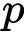: 陪审团成员做出正确决定的概率

+   *μ*: 整个陪审团做出正确决定的概率

+   *m*: 陪审团成员的最小多数：


+   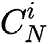: 由 *N* 个元素组成的 *i* 的组合数：

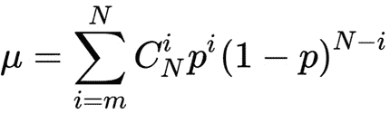

如果 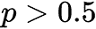 则 

如果  则 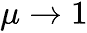

因此，基于一般推理，可以区分出为什么分类器集成可以成功的三种原因，如下：

+   **统计性**: 分类算法可以被视为在 **H 假设**空间中的搜索过程，关注数据的分布以找到最佳假设。通过从最终数据集中学习，算法可以找到许多不同的假设，这些假设可以同样好地描述训练样本。通过构建模型集成，我们可以 *平均*每个假设的错误，并减少新假设形成中的不稳定性和随机性的影响。

+   **计算方法**: 大多数学习算法使用寻找特定目标函数极值的方法。例如，神经网络使用 **梯度下降**（**GD**）方法来最小化预测误差。决策树使用最小化数据熵的贪婪算法。这些优化算法可能会陷入局部极值点，这是一个问题，因为它们的目的是找到全局最优解。结合简单分类器预测结果的模型集合，由于它们从初始假设集的不同点开始寻找最优解，因此有更高的机会找到全局最优解。

+   **代表性**: 组合假设可能不在简单分类器的可能假设集中。因此，通过构建组合假设，我们扩展了可能的假设集。

康多塞陪审团定理和之前提供的理由并不完全适用于现实、实际的情况，因为算法不是独立的（它们解决一个问题，在一个目标向量上学习，只能使用一个模型，或者少数几个模型）。

因此，应用集成开发的大多数技术都是为了确保集成是多样化的。这使得单个算法在单个对象中的错误可以通过其他算法的正确操作来补偿。总的来说，构建集成提高了简单算法的质量和多样性。目标是创建一个多样化的预测集，这些预测相互补充，并减少集成预测的整体方差和偏差。

最简单的集成类型是模型平均，其中集成中的每个成员对最终预报的贡献是相等的。每个模型对最终集成预报的贡献相等是这种方法的一个局限性。问题在于贡献不平衡。尽管如此，仍然要求集成中的所有成员的预测技能高于随机机会。

然而，众所周知，一些模型的表现比其他模型好得多或差得多。可以通过使用加权集成来解决此问题，其中每个成员对最终预报的贡献由该模型的性能加权。当模型的权重是一个小的正值且所有权重的总和等于 1 时，权重可以表示对每个模型的信心百分比（或预期性能）。

目前，构建集成最常见的方法如下：

+   **袋装**：这是一组模型，它们在来自同一训练集的不同随机样本上并行研究。最终结果由集成算法的投票决定。例如，在分类中，选择被最多分类器预测的类别。

+   **提升**：这是一组按顺序训练的模型，每个后续算法都在前一个算法出错的数据样本上训练。

+   **堆叠**：这是一种方法，其中训练集被分为*N*个块，并在其中的*N-1*个块上训练一组简单模型。然后，第*N*个模型在剩余的块上训练，但使用底层算法的输出（形成所谓的**元属性**）作为目标变量。

+   **随机森林**：这是一组独立构建的决策树，其答案通过平均和多数投票来决定。

以下几节将详细讨论之前描述的方法。

## 使用袋装方法创建集成

袋装（来自自助聚合）是最早和最直接类型的集成之一。袋装基于统计自助方法，旨在获得最准确的样本估计并将结果扩展到整个总体。自助方法如下。

假设有一个大小为*M*的*X*数据集。从数据集中均匀选择*N*个对象，并在选择后将其放回数据集。在选择下一个之前，我们可以生成*N*个子数据集。这个程序意味着*N*次，我们选择一个任意的样本对象（我们假设每个对象被*选中*的概率相同 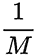)，每次，我们都从所有原始*M*个对象中选择。此外，这个过程也称为带替换的抽样，这意味着数据集中的每个元素都有被选中多次的机会。

我们可以想象这是一个袋子，从中取出球。在给定步骤选中的球在选中后返回到袋子中，下一次选择仍然是从相同数量的球中按相同概率进行。请注意，由于每次都返回球，因此存在重复。

每次新的选择表示为 *X*1。重复该过程 *k* 次，我们生成 *k* 个子数据集。现在，我们有一个相当大的样本数量，我们可以评估原始分布的各种统计量。

主要描述性统计量是样本均值、中位数和标准差。总结统计量（例如，样本均值、中位数和相关性）可能因样本而异。自助法的想法是使用采样结果作为虚构的总体来确定统计量的样本分布。自助法分析大量被称为**自助样本**的虚拟样本。对于每个样本，计算目标统计量的估计值，然后对这些估计值进行平均。自助法可以看作是**蒙特卡洛方法**的修改。

假设有 *X* 训练数据集。借助自助法，我们可以生成 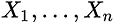 子数据集。现在，在每一个子数据集上，我们可以训练我们的 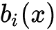 分类器。最终的分类器平均这些分类器的响应（在分类的情况下，这对应于投票），如下所示：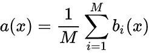。以下图表显示了此方案：

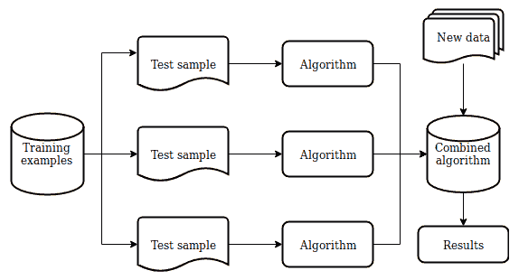

图 9.1 – Bagging 方法方案

考虑使用简单算法 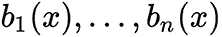 解决回归问题。假设对于所有 *y(x)* 对象都有一个真实的答案函数，并且在 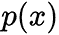 对象上也有一个分布。在这种情况下，我们可以写出每个回归函数的误差如下：

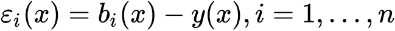

我们也可以写出**均方误差**（**MSE**）的期望值如下：

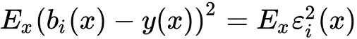

构建的回归函数的平均误差如下：

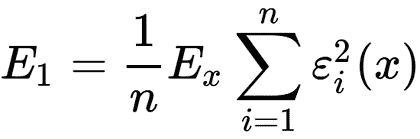

现在，假设误差是无偏且不相关的，如图所示：

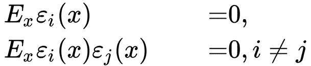

现在，我们可以编写一个新的回归函数，该函数平均我们构建的函数的响应，如下所示：

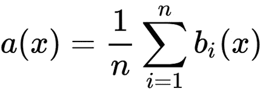

让我们找到其**均方根误差**（**RMSE**）以查看平均化的效果，如下所示：

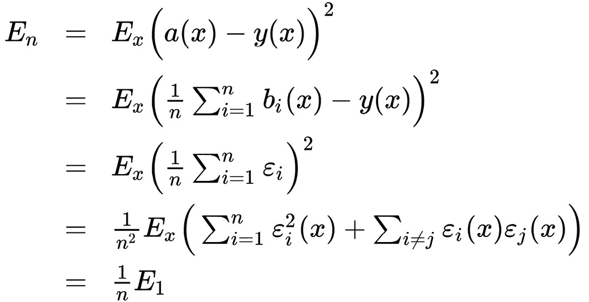

因此，平均答案使我们能够将平均平方误差减少 *n* 倍。

Bagging 还可以帮助我们减少训练算法的方差，防止过拟合。Bagging 的有效性基于底层算法，这些算法在相当不同的子数据集上训练，并且在投票过程中相互补偿错误。此外，异常值可能不会落入某些训练子数据集中，这也增加了 Bagging 方法的有效性。

当排除少量训练对象会导致构建出显著不同的简单算法时，bagging 对于小型数据集是有用的。在大型数据集的情况下，通常生成比原始数据集显著小的子数据集。

注意，关于误差不相关的假设很少得到满足。如果这个假设不正确，那么误差减少的幅度不如我们可能假设的那么显著。

在实践中，与简单的单个算法相比，bagging 在提高结果准确性方面提供了良好的改进，尤其是如果简单算法足够准确但不够稳定时。通过减少单个算法预测错误的波动来提高预测的准确性。bagging 算法的优点在于其实施简单，以及可以在不同的计算节点上并行计算训练每个基本算法。

## 使用梯度提升方法创建集成

提升法的主要思想是基本算法不是独立构建的。我们构建每个顺序算法，使其纠正前一个算法的错误，从而提高整个集成质量。提升法第一个成功的版本是**自适应提升法**（**AdaBoost**）。现在它很少被使用，因为梯度提升已经取代了它。

假设我们有一组由属性*x*和目标变量*y*组成的对，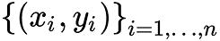。在这个集合上，我们恢复形式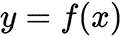的依赖关系。我们通过近似来恢复它。为了选择最佳的近似解，我们使用特定形式的损失函数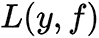，我们应该按照以下方式优化它：

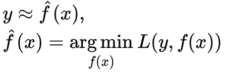

由于可用于学习的有限数据量，我们也可以用数学期望来重写表达式，如下所示：

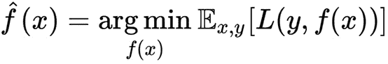

我们的近似是不准确的。然而，提升法的理念在于，通过添加另一个模型的结果来纠正其错误，从而可以改进这种近似，如图所示：

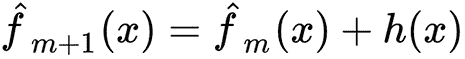

以下方程显示了理想的误差校正模型：

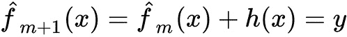

我们可以将这个公式重写为以下形式，这更适合校正模型：

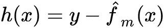

基于前面列出的假设，提升的目标是逼近 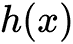，使其结果尽可能接近 *残差* 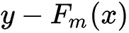。这种操作是顺序执行的，即 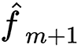 改善了先前 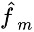 函数的结果。

这种方法的进一步推广使我们能够将残差视为损失函数的负梯度，具体形式为 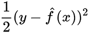。换句话说，梯度提升是一种使用损失函数及其梯度的 GD 方法。

现在，已知损失函数梯度的表达式，我们可以在我们的数据上计算其值。因此，我们可以训练模型，使我们的预测与这个梯度（带有负号）更好地相关。因此，我们将解决回归问题，试图纠正这些残差的预测。对于分类、回归和排序，我们总是最小化残差与我们的预测之间的平方差。

在梯度提升方法中，使用以下形式的函数逼近：

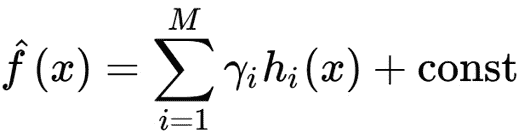

这是 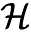 类的 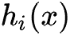 函数的总和；它们统称为 **弱模型**（算法）。这种逼近是顺序进行的，从初始逼近开始，初始逼近是一个确定的常数，如下所示：

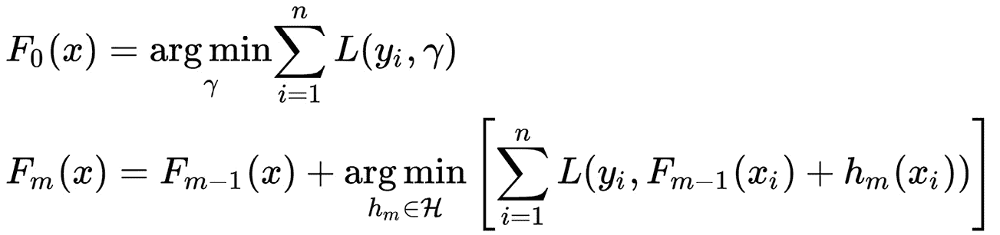

不幸的是，对于任意损失函数，在每一步选择 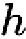 最佳函数极其困难，因此采用了一种更直接的方法。想法是使用可微分的 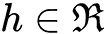 函数和可微分的损失函数，如图所示：

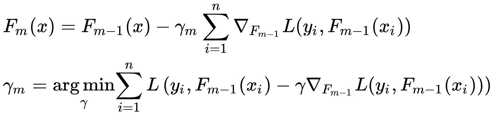

然后提升算法形成如下：

1.  使用常数值初始化模型，如下所示：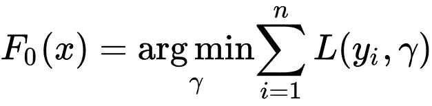

1.  重复指定的迭代次数并执行以下操作：

    1.  按如下方式计算伪残差：

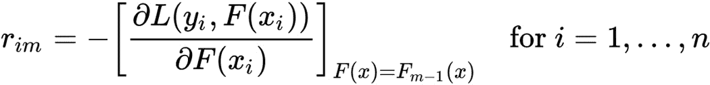

在这里，*n* 是训练样本的数量，*m* 是迭代次数，*L* 是损失函数。

1.  在伪残差数据上训练基础算法（回归模型）。

1.  通过以下一维优化问题计算 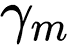 系数：

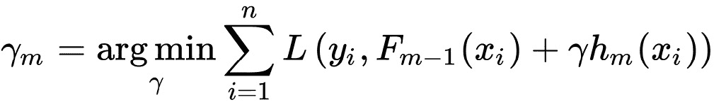

1.  按如下方式更新模型：

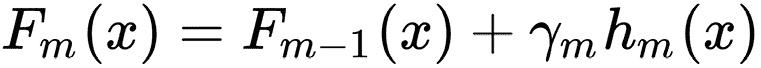

此算法的输入如下：

+   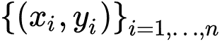 数据集

+   *M* 迭代次数

+   具有解析梯度（这种形式的梯度可以减少数值计算的数量）的 *L( y, f)* 损失函数

+   *h(x)*基本算法的函数族选择，以及它们的训练过程和超参数

初始近似的常数以及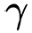-最优系数可以通过二分搜索找到，或者通过相对于初始损失函数（而不是梯度）的另一种线性搜索算法找到。

回归损失函数的例子如下：

+   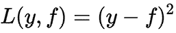：一个*L*2 损失，也称为**高斯损失**。这个公式是经典的条件均值，最常见和简单的选项。如果没有额外的信息或模型可持续性要求，应该使用它。

+   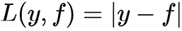：一个*L*1 损失，也称为**拉普拉斯损失**。这个公式乍一看并不非常可微，并确定条件中位数。正如我们所知，中位数对异常值更具抵抗力。因此，在某些问题中，这个损失函数更可取，因为它不像二次函数那样对大的偏差进行惩罚。

+   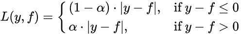：一个*L*q 损失，也称为**分位数损失**。如果我们不想要条件中位数，但想要条件 75%分位数，我们将使用这个选项与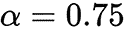一起。这个函数是不对称的，对那些最终出现在所需分位数一侧的观察值进行更多惩罚。

分类损失函数的例子如下：

+   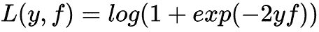：逻辑损失，也称为**伯努利损失**。这个损失函数的一个有趣特性是我们甚至对正确预测的类别标签进行惩罚。通过优化这个损失函数，我们可以在所有观察都正确预测的情况下，继续使类别分离并提高分类器。这个函数是二元分类任务中最标准、最常用的损失函数。

+   ：**AdaBoost 损失**。恰好使用这个损失函数的经典 AdaBoost 算法（AdaBoost 算法也可以使用不同的损失函数）等同于梯度提升。从概念上讲，这个损失函数与逻辑损失非常相似，但它对分类错误的指数惩罚更强，使用频率较低。

提取的思想是它可以与梯度提升方法一起使用，这被称为**随机梯度提升**。这样，新的算法是在训练集的子样本上训练的。这种方法可以帮助我们提高集成算法的质量，并减少构建基本算法所需的时间（每个算法都是在减少的训练样本数量上训练的）。

尽管提升本身是一种集成方法，但可以将其应用于其他集成方案，例如通过平均几种提升方法。即使我们使用相同的参数平均提升，由于实现的随机性，它们也会有所不同。这种随机性来源于每一步选择随机子数据集或在我们构建决策树时选择不同的特征（如果它们被选为基本算法）。

目前，基础的 **梯度提升机** （**GBM**） 已针对不同的统计任务有许多扩展。具体如下：

+   GLMBoost 和 GAMBoost 作为现有 **广义加性** **模型** （**GAM**） 的增强

+   CoxBoost 用于生存曲线

+   RankBoost 和 LambdaMART 用于排序

此外，同一 GBM 在不同名称和不同平台上也有许多实现，例如以下这些：

+   **随机 GBM**

+   **梯度提升决策** **树** （**GBDT**）

+   **梯度提升回归** **树** （**GBRT**）

+   **多重加性回归** **树** （**MART**）

+   **广义提升** **机** （**GBM**）

此外，提升可以在搜索引擎承担的排序任务中长期应用和使用。该任务基于损失函数编写，该函数对搜索结果顺序中的错误进行惩罚；因此，将其插入 GBM 中变得方便。

## 使用堆叠方法创建集成

堆叠的目的是使用在相同数据上训练的不同算法作为基本模型。然后在一个元分类器上训练基本算法或源数据的结果，也补充了基本算法本身的结果。有时，元分类器使用它收到的分布参数估计（例如，分类中每个类的概率估计）进行训练，而不是基本算法的结果。

最直接的堆叠方案是混合。对于这个方案，我们将训练集分为两部分。第一部分用于教授一组基本算法。它们的结果可以被视为新特征（元特征）。然后我们使用它们作为与数据集第二部分的补充特征，并训练新的元算法。这种混合方案的问题是，既没有基本算法也没有元算法使用整个数据集进行训练。为了提高混合的质量，你可以平均在不同数据分区上训练的几个混合的结果。

实现堆叠的另一种方式是使用整个训练集。在某些资料中，这被称为 *泛化*。整个集被分成几部分（折），然后算法依次遍历这些折，并在除了随机选择的折之外的所有折上教授基本算法。剩下的折被用来推断基本算法。基本算法的输出值被解释为从折中计算出的新元属性（或新特征）。在这种方法中，也期望实现几个不同的折划分，然后平均相应的元属性。对于一个元算法，对元属性应用正则化或添加一些正常噪声是有意义的。这种添加的系数类似于正则化系数。我们可以总结说，描述的方法背后的基本思想是使用一组基础算法；然后，使用另一个元算法，我们将它们的预测结合起来，目的是减少泛化误差。

与提升和传统的袋装不同，在堆叠中，你可以使用不同性质的算法（例如，结合随机森林的岭回归）。然而，记住对于不同的算法，需要不同的特征空间是至关重要的。例如，如果将分类特征用作目标变量，那么可以直接使用随机森林算法，但对于回归算法，你必须首先进行 one-hot 编码。

由于元特征是已经训练好的算法的结果，它们具有很强的相关性。这个事实是 *先验的*，这是这种方法的一个缺点；基本算法在训练过程中往往被欠优化，以对抗相关性。有时，为了克服这个缺点，基本算法的训练不是在目标特征上，而是在特征与目标之间的差异上进行的。

## 使用随机森林方法创建集成

在我们转向随机森林方法之前，我们需要熟悉决策树算法，它是随机森林集成算法的基础。

### 决策树算法概述

决策树是一种基于人类解决预测或分类任务的监督机器学习算法。通常，这是一个具有决策规则的节点和叶节点上目标函数预测的 *k* 维树。决策规则是一个函数，它允许你确定哪个子节点应该被用作考虑对象的父节点。决策树的叶节点中可以存在不同类型的对象——即分配给对象的类别标签（在分类任务中）、类别的概率（在分类任务中）以及目标函数的值（在回归任务中）。

在实践中，二叉决策树比具有任意数量子节点的树使用得更频繁。

构建决策树的一般算法如下：

1.  首先，检查算法停止的标准。如果执行了这个标准，就选择为节点发布的预测。否则，我们必须将训练集分割成几个不相交的小集合。

1.  在一般情况下，一个  决策规则在 *t* 节点定义，它考虑了一定范围内的值。这个范围被划分为 *R*t 个不相交的对象集合：，其中 *R*t 是节点的后代数量，每个  是落入  后代的对象集合。

1.  根据所选规则将节点中的集合分割，并对每个节点递归地重复算法。

最常见的决策规则是 ，即特征——也就是说，。对于分区，我们可以使用以下规则：

+    对于选择的边界值 。

+   ，其中  是一个向量的标量积。实际上，这是一个角值检查。

+   ，其中距离  定义在某些度量空间中（例如，）。

+   ，其中  是一个谓词。

通常，你可以使用任何决策规则，但那些最容易解释的更好，因为它们更容易配置。没有必要采取比谓词更复杂的东西，因为你可以借助谓词创建一个在训练集上具有 100%准确性的树。

通常，选择一组决策规则来构建树。为了在每个特定节点中找到它们中的最优者，我们需要引入一个衡量最优性的标准。为此引入了  度量，用于测量特定  节点中对象如何分散（回归）或类别如何混合（分类）。这个度量称为**不纯度函数**。它需要根据决策规则集的所有特征和参数找到  的最大值，以便选择决策规则。通过这个选择，我们可以为当前节点中的对象集合生成最优分区。

信息增益，，是指对于所选的分割我们可以获得多少信息，其计算方法如下：


在前面的方程中，以下适用：

+   *R* 是当前节点被分割成子节点的数量

+   *t* 是当前节点

+    是通过所选分区获得的后代节点

+    是落在当前节点子 *i* 的对象数量

+    是当前节点中捕获的对象数量

+    是被捕获在 *t* 顶点的对象

我们可以将 MSE 或 **平均绝对误差**（**MAE**）作为回归任务的  杂乱函数。对于分类任务，我们可以使用以下函数：

+   Gini 准则  作为误分类的概率，具体来说，如果我们预测给定节点中类别的发生概率

+   熵  作为随机变量的不确定性度量

+   将分类错误  作为最强类别的分类错误率

在之前描述的函数中， 是节点 *t* 中遇到类别 *i* 对象的 **先验概率**——即训练样本中标签为类别 *i* 并落入 *t* 的对象数量除以 *t* 中的对象总数（）。

以下规则可以作为构建决策树的停止标准：

+   限制树的最大深度

+   限制叶片中的最小对象数量

+   限制树中叶子的最大数量

+   如果节点中的所有对象都属于同一类，则停止

+   要求在分裂过程中信息增益至少提高 8%

对于任何训练集，都有一个无错误的树，这导致了过拟合的问题。找到正确的停止标准来解决这个问题是具有挑战性的。一种解决方案是**剪枝**——在整棵树构建完成后，我们可以剪掉一些节点。这种操作可以使用测试或验证集来完成。剪枝可以减少最终分类器的复杂性，并通过减少过拟合来提高预测精度。

剪枝算法如下：

1.  我们为训练集构建一个树。

1.  然后，我们将验证集通过构建的树，并考虑任何内部节点 *t* 及其左右子节点 ，。

1.  如果验证样本中没有对象达到 *t*，那么我们可以说这个节点（及其所有子树）是不重要的，并将 *t* 设为叶子（使用训练集将此节点的谓词值设置为多数类的集合）。

1.  如果验证集中的对象达到了 *t*，那么我们必须考虑以下三个值：

    +   来自 *t* 子树的分类错误数量

    +   来自  子树的分类错误数量

    +   来自  子树的分类错误数量

如果第一个案例的值为零，则将节点*t*作为具有相应类别预测的叶节点。否则，我们选择这些值中的最小值。根据哪个是最小的，我们分别执行以下操作：

+   如果第一个是最小的，则什么都不做

+   如果第二个是最小的，则用节点的子树替换节点*t*。

+   如果第三个是最小的，则用节点的子树替换节点*t*。

这样的过程使算法规范化，以克服过拟合并提高泛化能力。在*k*-维树的情况下，可以使用不同的方法来选择叶中的预测。对于分类，我们可以选择落在该叶下的训练对象中最常见的类别。或者，我们可以计算这些对象的客观函数的平均值来进行回归。

我们从树根开始应用决策规则到一个新对象，以预测或分类新数据。因此，确定对象应该进入哪个子树。我们递归地重复此过程，直到达到某个叶节点，最后返回我们找到的叶节点的值，作为分类或回归的结果。

### 随机森林方法概述

决策树是用于袋装算法的合适的基本算法族，因为它们相当复杂，并且最终可以在任何训练集上实现零误差。我们可以使用一种使用随机子空间（如袋装）的方法来减少树之间的相关性，避免过拟合。基本算法在不同的特征空间子集上训练，这些子集也是随机选择的。可以使用以下算法构建使用随机子空间方法的决策树模型集合。

其中训练对象的数量为*N*，特征的数量为，按照以下步骤进行：

1.  选择作为集成中的单个树的数量。

1.  对于每个单独的树，选择作为的特征数量。通常，所有树都使用一个值。

1.  对于每棵树，使用自举方法创建一个训练子集。

现在，按照以下方式从个样本构建决策树：

1.  从源中选择个随机特征，然后最优的训练集分割将限制其搜索范围。

1.  根据给定的标准，我们选择最佳的属性，并根据它对树进行分割。

1.  树的构建直到每个叶节点中剩余的对象不超过，直到达到树的某个高度，或者直到训练集耗尽。

现在，要将集成模型应用于新对象，必须通过多数投票或通过结合**后验**概率来组合单个模型的结果。以下是一个最终分类器的示例：


考虑以下算法的基本参数及其属性：

+   **树的数量**：树越多，质量越好，但训练时间和算法的工作量也会成比例增加。通常，随着树的数量增加，训练集的质量会提高（甚至可以达到 100%的准确率），但测试集的质量是渐近的（因此可以估计所需的最小树的数量）。

+   **分裂选择的特征数量**：随着特征数量的增加，森林的构建时间也会增加，树比以前更均匀。在分类问题中，通常选择与和相等的属性数量，对于回归问题。

+   **最大树深度**：深度越小，算法构建和运行的速度越快。随着深度的增加，训练过程中的质量会显著提高。测试集上的质量也可能提高。建议使用最大深度（除非训练对象太多，我们得到非常深的树，构建这些树需要相当多的时间）。当使用浅层树时，改变与限制叶节点中对象数量和分裂相关的参数不会产生显著影响（叶子已经很大）。在具有大量噪声对象（异常值）的任务中推荐使用浅层树。

+   **杂质函数**：这是选择分支特征（决策规则）的标准。对于回归问题，通常是均方误差（MSE）/平均绝对误差（MAE）。对于分类问题，是基尼准则、熵或分类误差。树的平衡和深度可能取决于我们选择的特定杂质函数。

我们可以将随机森林视为袋装决策树，在这些树的训练过程中，我们为每个分区使用特征随机子集的特征。这种方法是一个通用算法，因为随机森林可以用于解决分类、回归、聚类、异常搜索和特征选择等任务。

在下一节中，我们将看到如何使用不同的 C++库来开发机器学习模型集成。

# 使用 C++库创建集成示例

以下章节将展示如何在`Dlib`和`mlpack`库中使用集成。这些库中有现成的随机森林和梯度提升算法的实现；我们将展示如何使用它们的`mlpack`库。

## 使用 Dlib 的集成

`Dlib` 库中只有随机森林算法的实现，在本节中，我们将展示如何在实践中使用它的具体 API。

为了展示随机森林算法的应用，我们需要为此任务创建一些数据集。让我们创建一个模拟余弦函数的人工数据集。首先，我们定义数据类型来表示样本和标签项。以下代码示例显示了如何实现：

```py
using DataType = double;
using SampleType = dlib::matrix<DataType, 0, 1>;
using Samples = std::vector<SampleType>;
using Labels = std::vector<DataType>;
```

然后我们定义 `GenerateData` 函数：

```py
std::pair<Samples, Labels> GenerateData(DataType start,
                                        DataType end,
                                        size_t n) {
  Samples x;
  x.resize(n);
  Labels y;
  y.resize(n);
  auto step = (end - start) / (n - 1);
  auto x_val = start;
  size_t i = 0;
  for (auto& x_item : x) {
    x_item = SampleType({x_val});
    auto y_val = std::cos(M_PI * x_val);
    y[i] = y_val;
    x_val += step;
    ++i;
  }
  return {x, y};
}
```

`GenerateData` 函数接受三个参数：生成范围的起始值和结束值以及要生成的点数 `n`。实现方式简单，在循环中计算余弦值。该函数返回一个包含 `double` 值的 `std::vector` 类型对象对。此函数的结果将用于测试。

为了证明随机森林算法确实可以近似值，我们将向原始数据添加一些噪声。以下代码片段显示了 `GenerateNoiseData` 函数的实现：

```py
std::pair<Samples, Labels> GenerateNoiseData(DataType start,
                                             DataType end,
                                             size_t n) {
  Samples x;
  x.resize(n);
  Labels y;
  y.resize(n);
  std::mt19937 re(3467);
  std::uniform_real_distribution<DataType> dist(start, end);
  std::normal_distribution<DataType> noise_dist;
  for (size_t i = 0; i < n; ++i) {
    auto x_val = dist(re);
    auto y_val =
        std::cos(M_PI * x_val) + (noise_dist(re) * 0.3);
    x[i] = SampleType({x_val});
    y[i] = y_val;
  }
  return {x, y};
}
```

`GenerateNoiseData` 函数也在简单的循环中计算余弦值。它接受与 `GenerateData` 函数相同的输入参数。然而，此函数不是按顺序生成值，而是在每次迭代中从指定的范围内采样一个随机值。对于每个样本，它计算余弦值并添加噪声样本。噪声是通过随机分布生成的。该函数还返回两个包含 `double` 值的 `std::vector` 类型对象，第一个用于训练输入，第二个用于目标值。

使用这些数据生成函数，我们可以创建训练集和测试集，如下所示：

```py
auto [train_samples, train_lables] =
  GenerateNoiseData(start, end, num_samples);
auto [test_samples, test_lables] =
  GenerateData(start, end, num_samples);
```

现在，Dlib 随机森林实现的用法非常简单。以下代码片段展示了它：

```py
#include <dlib/random_forest.h>
... 
dlib::random_forest_regression_trainer<
  dlib::dense_feature_extractor> trainer;
constexpr size_t num_trees = 1000;
trainer.set_num_trees(num_trees);
auto random_forest = trainer.train(train_samples, train_lables);
for (const auto& sample : test_samples) {
  auto prediction = random_forest(sample);
  …
}
```

在这里，我们使用名为 `trainer` 的 `random_forest_regression_trainer` 类的实例，通过 `train` 方法创建 `random_forest` 对象。`trainer` 对象配置了要使用的树的数量。`random_forest_regression_trainer` 类使用 `dense_feature_extractor` 类进行参数化——这是 `Dlib` 库现在提供的唯一特征提取类，但你可以创建一个自定义的。`train` 方法简单地接受两个 `std::vector` 类型对象，第一个用于输入数据值，第二个用于目标数据值。

训练完成后，创建了 `random_forest` 对象，并将其用作功能对象来对一个单一值进行预测。

下图显示了从 `Dlib` 库应用随机森林算法的结果。原始数据以星号表示，预测数据以线条表示：


图 9.2 – 使用 Dlib 的随机森林回归

注意，这种方法对这个数据集上的回归任务不太适用。你可以看到全局趋势被成功学习，但在细节上有很多错误。

## 使用 mlpack 的集成

`mlpack`库中有两种集成学习算法：随机森林和 AdaBoost 算法。对于这组样本，我们将使用位于[`archive.ics.uci.edu/dataset/17/breast+cancer+wisconsin+diagnostic`](https://archive.ics.uci.edu/dataset/17/breast+cancer+wisconsin+diagnostic)的*Wisconsin 乳腺癌诊断*数据集。它来自*D*. *Dua, 和 C. Graff (2019), UCI 机器学习* *Repository* ([`archive.ics.uci.edu/ml`](http://archive.ics.uci.edu/ml))。

这个数据集中有 569 个实例，每个实例有 32 个属性：ID、诊断和 30 个实值输入特征。诊断可以有两个值：*M =* 恶性，和*B =* 良性。其他属性为每个细胞核计算了 10 个实值特征，如下所示：

+   半径（从中心到周界的平均距离）

+   纹理（灰度值的标准差）

+   周长

+   面积

+   光滑度（半径长度的局部变化）

+   紧凑度

+   凹陷（轮廓凹部分的严重程度）

+   凹点（轮廓凹部分的数目）

+   对称性

+   分形维度（海岸线近似—1）

这个数据集可以用于二元分类任务。

### mlpack 的数据准备

在`mlpack`中有一个`DatasetInfo`类用于描述数据集。这个类的实例可以与不同的算法一起使用。此外，`mlpack`中还有一个`data::Load`函数，可以自动从`.csv`、`.tsv`和`.txt`文件中加载数据集。然而，这个函数假设这些文件中只包含可以解释为矩阵的数值数据。在我们的情况下，数据以`.csv`格式存在，但`Diagnosis`列包含字符串值`M`和`B`。因此，我们简单地将它们转换为`0`和`1`。

当我们有了正确的`.csv`文件后，数据可以按照以下方式加载：

```py
arma::mat data;
mlpack::data::DatasetInfo info;
data::Load(dataset_name, data, info, /*fail with error*/ true);
```

我们将数据集文件名和`data`矩阵对象以及`info`对象的引用传递给`Load`函数。注意，我们通过将最后一个参数传递为`true`来请求函数在失败情况下生成异常。

然后我们按照以下方式将数据分为输入和目标部分：

```py
// extract the labels row
arma::Row<size_t> labels;
 labels = arma::conv_to<arma::Row<size_t>>::from( data.row(0));
// remove the labels row
data.shed_row(0);
```

在这里，我们使用了矩阵对象的`row`方法来获取特定的行。然后我们使用`arma::conv_to`函数将其值转换为`site_t`类型，因为我们的数据集的第一行包含标签。最后，我们从`data`对象中移除了第一行，使其可以作为输入数据使用。

拥有输入数据和标签矩阵后，我们可以按照以下方式将它们分为训练和测试部分：

```py
// split dataset into the train and test parts - make views
size_t train_num = 500;
arma::Row<size_t> train_labels = labels.head_cols( train_num); arma::mat test_input = data.tail_cols( num_samples - train_num); arma::Row<size_t> test_labels = 
  labels.tail_cols( num_samples - train_num);
```

我们使用矩阵对象的 `head_cols` 方法从输入数据中取出前 `train_num` 列并将其标记为训练值，并使用矩阵对象的 `tail_cols` 方法取出最后的列作为测试值。

### 使用 `mlpack` 的随机森林

`mlpack` 库中的随机森林算法位于 `RandomForest` 类中。此类有两个主要方法：`Train` 和 `Classify`。`Train` 方法可以使用如下方式：

```py
using namespace mlpack;
RandomForest<> rf;
rf.Train(train_input,
         train_labels,
         num_classes,
         /*numTrees=*/100,
         /*minimumLeafSize=*/10,
         /*minimumGainSplit=*/1e-7,
         /*maximumDepth=*/10);
```

前四个参数具有自描述性。最后几个参数更具有算法特定性。`minimumLeafSize` 参数是每个树叶子节点的最小点数。`minimumGainSplit` 参数是分割决策树节点的最小增益。`maximumDepth` 参数是允许的最大树深度。

在使用 `Train` 方法处理训练数据后，可以使用 `rf` 对象通过 `Classify` 方法进行分类。此方法将单个值或行矩阵作为输入的第一个参数，第二个参数是单个预测值或由该方法填充的预测值向量。

`mlpack` 中有一个 `Accuracy` 类，可以用来估计算法的准确度。它可以与不同的算法对象一起工作，并具有统一的接口。我们可以如下使用它：

```py
Accuracy acc;
auto acc_value = acc.Evaluate(rf, test_input, test_labels);
std::cout << "Random Forest accuracy = " << acc_value << std::endl;
```

我们使用 `Evaluate` 方法获取使用我们的数据训练的随机森林算法的准确度值。打印的值是 `Random Forest accuracy = 0.971014`。

### 使用 `mlpack` 的 AdaBoost

`mlpack` 库中另一个基于集成算法的是 AdaBoost。它基于弱学习者的集成，用于生成强学习者。以下是基于简单感知器作为弱学习者的 AdaBoost 算法对象的定义：

```py
using namespace mlpack;
Perceptron<> p;
AdaBoost<Perceptron<>> ab;
```

我们使用 `Perceptron` 类作为模板参数来参数化 `AdaBoost` 类。在 `AdaBoost` 对象实例化后，我们可以使用 `Train` 方法用我们的数据集对其进行训练。以下代码片段显示了如何使用 `Train` 方法：

```py
ab.Train(train_input,
         train_labels,
         num_classes,
         p,
         /*iterations*/ 1000,
         /*tolerance*/ 1e-10);
```

前三个输入参数非常明显——输入数据、标签和分类的类别数。然后我们传递了 `p` 对象；它是 `Perceptron` 类的实例，我们的弱学习者。在弱学习者对象之后，我们将学习次数和提前停止学习的准确度容忍度传递给 `Train` 方法。

在强学习者 `ab` 训练完成后，我们可以使用 `Classify` 方法对新数据值进行分类。此外，我们还可以使用 `Accuracy` 类的实例来估计训练算法的准确度。我们已经在上一章中看到了如何使用 `Accuracy`。它的 API 对于 `mlpack` 中的所有算法都是相同的。对于 `AdaBoost`，我们可以如下使用：

```py
Accuracy acc;
auto acc_value = acc.Evaluate(ab, test_input, test_labels);
std::cout << "AdaBoost accuracy = " << acc_value << std::endl;
```

对于与相同数据集的 `AdaBoost` 算法，我们得到了以下输出：`AdaBoost 准确率 = 0.985507`。准确率略高于我们使用随机森林算法得到的准确率。

### 使用 mlpack 的堆叠集成

为了展示更多集成学习技术的实现，我们可以手动开发堆叠方法。使用 `mlpack` 库或任何其他库都不是很难。

堆叠方法基于学习一组弱学习器。通常，k-fold 技术用于实现这一点。这意味着我们在 `k-1` 折上学习一个弱模型，并使用最后一折进行预测。让我们看看我们如何使用 `mlpack` 创建 k-fold 拆分。我们将使用与前面小节相同的相同数据集。主要思想是重复数据集，以便仅通过使用索引就能得到不同的折。以下代码片段定义了具有一个方法和构造函数的 `KfoldDataSet` 结构：

```py
struct KFoldDataSet {
  KFoldDataSet(const arma::mat& train_input,
               const arma::Row<size_ t>& train_labels,
               size_t k);
  std::tuple<arma::mat, arma::Row<size_t>, arma::mat,
             arma::Row<size_t>>
  get_fold(const size_t i);
  size_t k{0};
  size_t bin_size{0};
  size_t last_bin_size{0};
  arma::mat inputs;
  arma::Row<size_t> labels;
};
```

构造函数接受输入数据、标签和用于拆分的折数。`get_fold` 方法接受一个折的索引并返回四个值：

+   矩阵包含 `k-1` 折的输入数据

+   行矩阵包含 `k-1` 折的标签

+   矩阵包含输入数据的最后一折

+   行矩阵包含最后一折的标签

构造函数的实现可以如下：

```py
KFoldDataSet(const arma::mat& train_input,
             const arma::Row<size_t>& train_labels, size_t k)
  : k(k) {
  fold_size = train_input.n_cols / k;
  last_fold_size = train_input.n_cols - ((k - 1) * fold_size);
  inputs = arma::join_rows(
    train_input, train_input.cols(0, train_input.n_cols -
                                   last_fold_size - 1));
  labels = arma::join_rows(
    train_labels,
    train_labels.cols(
      0, train_labels.n_cols - last_fold_size - 1));
}
```

在这里，我们通过将输入数据中的样本总数除以折数来计算 `fold_size` 值。样本总数可能与折数不匹配，因此最后一折的大小可能不同。这就是为什么我们额外计算了 `last_fold_size` 值，以便能够正确地拆分。有了折的大小值，我们使用了 `arma::join_rows` 函数来重复训练样本。这个函数连接两个矩阵；对于第一个参数，我们使用了原始样本矩阵，对于第二个参数，我们使用了减少的矩阵。我们使用矩阵对象的 `cols` 方法只取第二个参数的 `k-1` 列。

当我们有重复的数据样本时，`get_fold` 方法的实现可以如下：

```py
std::tuple<arma::mat, arma::Row<size_t>, arma::mat,
           arma::Row<size_t>>
get_fold(const size_t i) {
  const size_t subset_size =
    (i != 0) ? last_fold_size + (k - 2) * fold_size
             : (k - 1) * fold_size;
  const size_t last_subset_size =
    (i == k - 1) ? last_fold_size : fold_size;
  // take k-1
  auto input_fold =
    arma::mat(inputs.colptr(fold_size * i), inputs.n_rows,
              subset_size, false, true);
  auto labels_fold = arma::Row<size_t>(
    labels.colptr(fold_size * i), subset_size, false, true);
  // take last k-th
  auto last_input_fold =
    arma::mat(inputs.colptr(fold_size * (i + k - 1)),
              inputs.n_rows, last_subset_size, false, true);
  auto last_labels_fold =
    arma::Row<size_t>(labels.colptr(fold_size * (i + k - 1)),
                      last_subset_size, false, true);
  return {input_fold, labels_fold, last_input_fold,
          last_labels_fold};
}
```

`get_fold` 方法最重要的部分是获取属于 `k-1` 子集和最后一折子集的正确样本数量。因此，首先我们检查要拆分的所需折是否为最后一折，因为最后一折可能包含不同大小的样本。有了这个信息，我们只需将 `k-1` 或 `k-2` 的数字乘以折的大小，并根据条件添加最后一折的大小以获得样本子集。对于最后一折，我们也根据所需的折拆分索引有条件地获取折的大小。

在获得正确的子集大小后，我们使用了`colptr`方法来获取从重复数据中开始列样本的指针。我们使用这样的指针和子集大小来初始化指向现有数据的`arma::mat`对象，而不进行复制，通过将`copy_aux_mem`构造函数参数设置为`false`。使用这种方法，我们初始化了`k-1`个折叠样本和最后一个折叠样本的矩阵，并将它们作为元组返回。

拥有`KfoldDataSet`类后，我们可以进一步实现`StackingClassification`函数。其声明可以如下所示：

```py
void StackingClassification(
  size_t num_classes,
  const arma::mat& raw_train_input,
  const arma::Row<size_t>& raw_train_labels,
  const arma::mat& test_input,
  const arma::Row<size_t>& test_labels);
```

它将使用分类类别数量、训练输入和标签数据以及测试输入和标签数据来估计算法的准确性。

`StackingClassification`函数的实现可以分解为以下步骤：

1.  准备训练数据集。

1.  创建元数据集。

1.  训练元模型。

1.  训练弱模型。

1.  评估测试数据。

让我们逐一查看它们。数据集准备可以如下实现：

```py
using namespace mlpack;
// Shuffle data
arma::mat train_input;
arma::Row<size_t> train_labels;
ShuffleData(raw_train_input, raw_train_labels, train_input,
            train_labels);
// Normalize data
data::StandardScaler sample_scaler;
sample_scaler.Fit(train_input);
arma::mat scaled_train_input(train_input.n_rows,
                             train_input.n_cols);
sample_scaler.Transform(train_input, scaled_train_input);
```

我们使用了`ShuffleData`函数来随机化训练和测试数据，并使用了`StandardScaler`类的`sample_scaler`对象来将我们的训练和测试数据缩放到零均值和单位方差。请注意，我们在训练数据上拟合了一个缩放器对象，然后使用`Transform`方法使用它。我们稍后会使用这个缩放器对象来处理测试数据。

在准备好数据集后，我们可以使用用于堆叠的弱（或基本）算法来创建元数据集。它将是三个弱算法的模型：

+   Softmax 回归

+   决策树

+   线性 SVM

元数据集生成基于在从原始数据集准备好的 k-fold 分割上对弱模型进行训练和评估。我们已创建了`KFoldDataset`类来完成此目的，其用法如下：

```py
size_t k = 30;
KFoldDataSet meta_train(scaled_train_input, train_labels, k);
```

在这里，我们实例化了`meta_train`数据集对象以进行 30 个折叠分割。以下代码片段显示了如何使用三个弱模型生成元数据集：

```py
for (size_t i = 0; i < k; ++i) {
  auto [fold_train_inputs, fold_train_labels, fold_valid_inputs,
        fold_valid_labels] = meta_train.get_fold(i);
  arma::Row<size_t> predictions;
  auto [fold_train_inputs, fold_train_labels, fold_valid_inputs,
        fold_valid_labels] = meta_train.get_fold(i);
  arma::Row<size_t> predictions;
  arma::mat meta_feature;
  LinearSVM<> local_weak0;
  local_weak0.Train(fold_train_inputs, fold_train_labels,
                    num_classes);
  local_weak0.Classify(fold_valid_inputs, predictions);
  meta_feature = arma::join_cols(
      meta_feature,
      arma::conv_to<arma::mat>::from(predictions));
  SoftmaxRegression local_weak1(fold_train_inputs.n_cols,
                                num_classes);
  local_weak1.Train(fold_train_inputs, fold_train_labels,
                    num_classes);
  local_weak1.Classify(fold_valid_inputs, predictions);
  meta_feature = arma::join_cols(
      meta_feature,
      arma::conv_to<arma::mat>::from(predictions));
  DecisionTree<> local_weak2;
  local_weak2.Train(fold_train_inputs, fold_train_labels,
                    num_classes);
  local_weak2.Classify(fold_valid_inputs, predictions);
  meta_feature = arma::join_cols(
      meta_feature,
      arma::conv_to<arma::mat>::from(predictions));
  meta_train_inputs =
      arma::join_rows(meta_train_inputs, meta_feature);
  meta_train_labels =
      arma::join_rows(meta_train_labels, fold_valid_labels);
}
```

元数据集存储在`meta_train_inputs`和`meta_train_labels`矩阵对象中。使用循环，我们迭代了 30 个折叠索引，并对每个索引，我们调用了`meta_train`对象的`get_fold`方法。这个调用给了我们第*k*个折叠分割，其中包含了用于训练和评估的四个矩阵。然后我们训练了本地弱对象，在我们的例子中，这些是`LinearSVM`、`SoftmaxRegression`和`DecisionTree`类对象的实例。

对于它们的训练，我们使用了折的训练输入和标签。在训练了弱模型（`LinearSVM`、`SoftmaxRegression`和`DecisionTree`模型）之后，我们使用`Classify`方法在`fold_valid_input`对象中找到的折测试输入上对它们进行了评估。分类结果被放置在`predictions`对象中。使用`join_cols`函数将所有三个分类结果堆叠到新的`meta_feature`矩阵对象中。因此，我们用新的元特征替换了原始数据集的特征。这个`meta_feature`对象使用`join_rows`方法添加到`meta_train_inputs`对象中。位于`fold_valid_labels`中的折测试标签使用`join_rows`函数添加到元数据集中。

在创建元数据集之后，我们使用`DecisionTree`实例按以下方式训练元模型：

```py
DecisionTree<> meta_model;
meta_model.Train(meta_train_inputs,
                 meta_train_labels,
                 num_classes);
```

为了能够使用这个元模型，我们必须再次创建一个弱模型。它将被用来为这个元模型生成元输入特征。可以按照以下方式完成：

```py
LinearSVM<> weak0;
weak0.Train(scaled_train_input, train_labels, num_classes);
SoftmaxRegression weak1(scaled_train_input.n_cols, num_classes);
weak1.Train(scaled_train_input, train_labels, num_classes);
DecisionTree<> weak2;
weak2.Train(scaled_train_input, train_labels, num_classes);
```

在这里，我们使用了整个训练数据集来训练每个弱模型。

在训练了集成之后，我们可以在测试数据集上对其进行评估。由于我们使用了数据预处理，我们也应该以与转换训练数据相同的方式转换我们的测试数据。我们按以下方式缩放测试数据：

```py
arma::mat scaled_test_input(test_input.n_rows,
                            test_input.n_cols);
sample_scaler.Transform(test_input, scaled_test_input);
```

集成评估从使用我们之前训练的弱模型预测元特征开始。我们将每个弱模型的预测存储在以下对象中：

```py
arma::mat meta_eval_inputs;
arma::Row<size_t> meta_eval_labes;
The next code snippet shows how we get the meta-features from the weak models:
weak0.Classify(scaled_test_input, predictions);
meta_eval_inputs = arma::join_cols(meta_eval_inputs,
      arma::conv_to<arma::mat>::from(predictions));
weak1.Classify(scaled_test_input, predictions);
meta_eval_inputs = arma::join_cols(meta_eval_inputs,
      arma::conv_to<arma::mat>::from(predictions));
weak2.Classify(scaled_test_input, predictions);
meta_eval_inputs = arma::join_cols(meta_eval_inputs,
      arma::conv_to<arma::mat>::from(predictions));
```

在这里，我们像创建元数据集时那样，将每个弱模型的预测堆叠到`meta_eval_inputs`对象中。

在我们创建了元特征之后，我们可以将它们作为输入传递给`meta_model`对象的`Classify`方法以生成真实预测。我们还可以计算准确度，如下所示：

```py
Accuracy acc;
auto acc_value =
      acc.Evaluate(meta_model, meta_eval_inputs, test_labels);
std::cout << "Stacking ensemble accuracy = " << acc_value << std::endl;
```

此代码的输出是`Stacking ensemble accuracy = 0.985507`。你可以看到，即使使用默认设置，这个集成也比随机森林实现表现得更好。在进一步调整的情况下，它可能会给出更好的结果。

# 摘要

在本章中，我们探讨了构建机器学习算法集成的各种方法。创建集成的目的是减少基本算法的错误，扩展可能假设的集合，并在优化过程中增加达到全局最优的概率。

我们看到，构建集成的方法主要有三种：在各个数据集上训练基本算法并平均误差（袋装），持续改进先前较弱算法的结果（提升），以及从基本算法的结果中学习元算法（堆叠）。请注意，我们已涵盖的构建集成的方法，除了堆叠外，都需要基本算法属于同一类别，这是集成的主要要求之一。人们还认为，提升比袋装给出更准确的结果，但同时也更容易过拟合。堆叠的主要缺点是它只有在相对较大的训练样本数量下才开始显著提高基本算法的结果。

在下一章中，我们将讨论**人工神经网络**（**ANNs**）的基础知识。我们将探讨其创建的历史背景，介绍 ANN 中使用的基本数学概念，实现一个**多层感知器**（**MLP**）网络和一个简单的**卷积神经网络**（**CNN**），并讨论深度学习是什么以及为什么它如此流行。

# 进一步阅读

+   *集成方法：袋装与提升*：`medium.com/@sainikhilesh/difference-between-bagging-and-boosting-f996253acd22`

+   *如何解释梯度提升*：[`explained.ai/gradient-boosting/`](https://explained.ai/gradient-boosting/)

+   原文由杰罗姆·弗里德曼撰写，题为*贪婪函数逼近：梯度提升机*：[`jerryfriedman.su.domains/ftp/trebst.pdf`](https://jerryfriedman.su.domains/ftp/trebst.pdf)

+   集成学习方法提高机器学习结果：[`www.kdnuggets.com/2017/09/ensemble-learning-improve-machine-learning-results.html`](https://www.kdnuggets.com/2017/09/ensemble-learning-improve-machine-learning-results.html)

+   决策树简介：[`www.analyticsvidhya.com/blog/2021/08/decision-tree-algorithm/`](https://www.analyticsvidhya.com/blog/2021/08/decision-tree-algorithm/)

+   如何可视化决策树：[`explained.ai/decision-tree-viz/`](https://explained.ai/decision-tree-viz/)

+   *理解随机森林*：[`towardsdatascience.com/understanding-random-forest-58381e0602d2`](https://towardsdatascience.com/understanding-random-forest-58381e0602d2)

# 第三部分：高级示例

在本部分中，我们将描述神经网络是什么以及它们如何应用于解决图像分类任务。我们还将描述现代**大型语言模型**（**LLMs**）是什么以及它们如何帮助解决诸如情感分析之类的神经网络处理任务。

本部分包括以下章节：

+   *第十章*, *用于图像分类的神经网络*

+   *第十一章*，*使用 BERT 和迁移学习进行情感分析*
