# 第十章：用于图像分类的神经网络

近年来，我们对**神经网络**产生了巨大的兴趣，它们在各种领域得到成功应用，如商业、医学、技术、地质和物理。神经网络在需要解决预测、分类或控制问题时发挥了作用。神经网络直观，因为它们基于人类神经系统的简化生物模型。它们源于人工智能领域的研究，即尝试通过模拟大脑的低级结构来复制生物神经系统的学习和纠错能力。神经网络是非线性建模方法，使我们能够复制极其复杂的依赖关系，因为它们是非线性的。神经网络也比其他不允许对大量变量建模依赖关系的方法更好地处理*维度诅咒*。

在本章中，我们将探讨人工神经网络的基本概念，并展示如何使用不同的 C++ 库实现神经网络。我们还将介绍多层感知器和简单的卷积网络的实现，并了解深度学习及其应用。

本章将涵盖以下主题：

+   神经网络概述

+   深入卷积网络

+   深度学习是什么？

+   使用 C++ 库创建神经网络的示例

+   使用 LeNet 架构理解图像分类

# 技术要求

+   完成本章内容你需要以下工具：

+   `Dlib` 库

+   `mlpack` 库

+   `Flashlight` 库

+   `PyTorch` 库

+   支持 C++20 的现代 C++ 编译器

+   CMake 构建系统版本 >= 3.22

本章的代码文件可以在以下 GitHub 仓库中找到：[`github.com/PacktPublishing/Hands-on-Machine-learning-with-C-Second-Edition/tree/main/Chapter10`](https://github.com/PacktPublishing/Hands-on-Machine-learning-with-C-Second-Edition/tree/main/Chapter10)。

# 神经网络概述

在本节中，我们将讨论人工神经网络及其构建块是什么。我们将学习人工神经元的工作原理以及它们与生物类似物的关系。我们还将讨论如何使用反向传播方法训练神经网络，以及如何处理过拟合问题。

神经网络是一系列通过突触相互连接的神经元。神经网络的结构直接来自生物学。得益于这种结构，计算机可以分析和甚至记住信息。神经网络基于人脑，人脑包含数百万个神经元，它们以电脉冲的形式传递信息。

人工神经网络受到生物学的启发，因为它们由具有与生物神经元类似功能性的元素组成。这些元素可以组织成与大脑解剖相对应的方式，并且它们表现出许多大脑固有的特性。例如，它们可以从经验中学习，将先前的先例推广到新的案例，并从包含冗余信息的输入数据中识别出显著特征。

现在，让我们了解单个神经元的过程。

## 神经元

**生物神经元**由一个身体和连接它到外部世界的处理过程组成。神经元接收兴奋的处理过程称为**树突**。神经元传递兴奋的过程称为**轴突**。每个神经元只有一个轴突。树突和轴突具有相当复杂的分支结构。轴突和树突的连接点称为**突触**。以下图显示了生物神经元的结构：

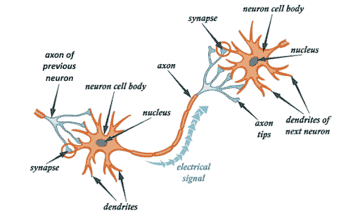

图 10.1 – 生物神经元结构

神经元的主要功能是将来自树突的兴奋传递到轴突。然而，来自不同树突的信号可能会影响轴突中的信号。当总兴奋超过一定限值时，神经元会发出信号，这个限值在一定范围内变化。如果信号没有发送到轴突，神经元就不会对兴奋做出反应。神经元接收到的信号强度（因此是激活可能性）强烈依赖于突触活动。突触是传输这种信息的接触点。每个突触都有一个长度，并且特殊的化学物质沿着它传递信号。与生物系统相比，这个基本电路有很多简化和例外，但大多数神经网络都是基于这些简单特性来建模的。

人工神经元接收一组特定的信号作为输入，每个输入都是另一个神经元的输出。每个输入乘以相应的权重，这相当于其突触功率。然后，将所有乘积相加，这个求和的结果用于确定神经元的激活水平。以下图示演示了这个概念：

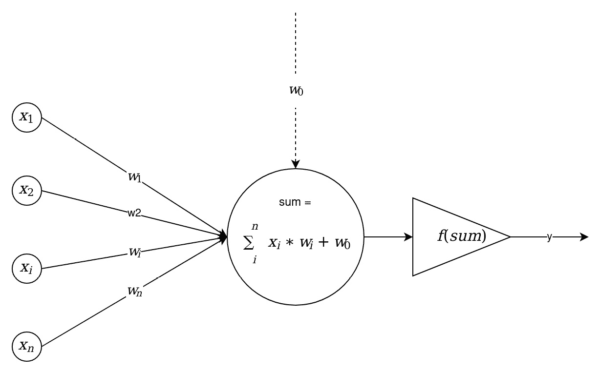

图 10.2 – 数学神经元结构

在这里，一组输入信号，表示为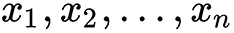，进入一个人工神经元。这些输入信号对应于到达生物神经元突触的信号。每个信号乘以相应的权重，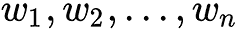，然后传递到求和块。每个权重对应于一个生物突触连接的强度。求和块对应于生物神经元的身体，代数上组合加权输入。

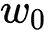信号，称为偏置，显示了极限值函数的作用，即所谓的`和`，使得`f (和)`的值属于特定的区间。也就是说，如果我们有一个大的输入数，通过激活函数传递它，我们就能得到所需的输出。存在许多激活函数，我们将在本章后面讨论它们。要了解更多关于神经网络的信息，我们将查看它们的一些更多组件。

## 感知器和神经网络

人工神经网络首次出现可以追溯到 1943 年发表的文章《神经活动内在逻辑演算》，其中提出了人工神经元的早期模型。后来，美国神经生理学家弗兰克·罗森布拉特在 1957 年发明了感知器概念，作为人类大脑信息感知的数学模型。目前，使用诸如**单层感知器**（**SLP**）或简称为感知器，以及**多层感知器**（**MLP**）这样的术语。通常，在感知器的层下面是一系列位于同一水平且未连接的神经元。以下图表显示了此模型：

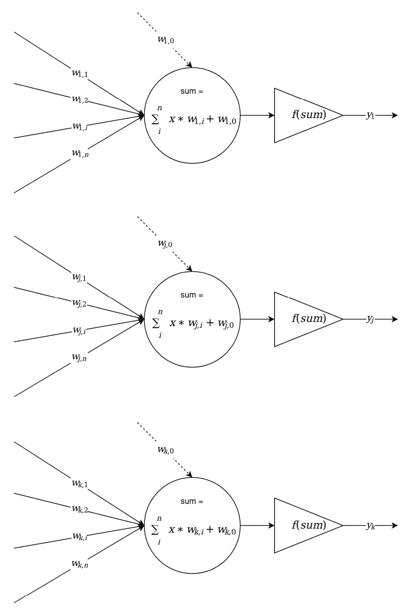

图 10.3 – 感知器的一层

通常，我们可以区分以下类型的神经网络层：

+   **输入层**：这仅仅是作为系统（模型）输入的数据或信号源。例如，这些可以是训练集中特定向量的单个分量，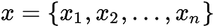。

+   **隐藏层**：这是位于输入层和输出层之间的一层神经元。可能存在多个隐藏层。

+   **输出层**：这是最后的一层神经元，它汇总了模型的工作，其输出被用作模型工作的结果。

**单层感知器**这个术语通常被理解为描述一个由输入层和汇总输入数据的艺术神经元组成的模型。这个术语有时与**罗森布拉特感知器**这个术语一起使用，但这并不完全正确，因为罗森布拉特使用随机过程来设置输入数据和神经元之间的连接，以将数据传输到不同的维度，这使得解决分类线性不可分数据时出现的问题成为可能。在罗森布拉特的工作中，感知器由*S*和*A*神经元类型以及*R*加法器组成。*S*神经元是输入层，*A*神经元是隐藏层，*R*神经元生成模型的结果。术语的歧义产生是因为只使用了*R*神经元的权重，而在*S*和*A*神经元类型之间使用了常数权重。然而，请注意，这些类型神经元之间的连接是根据特定的随机过程建立的：

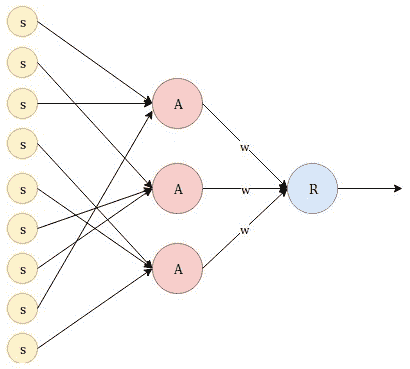


MLP 这个术语指的是一个由输入层、一定数量的隐藏层和输出层组成的模型。这可以在以下图中看到：

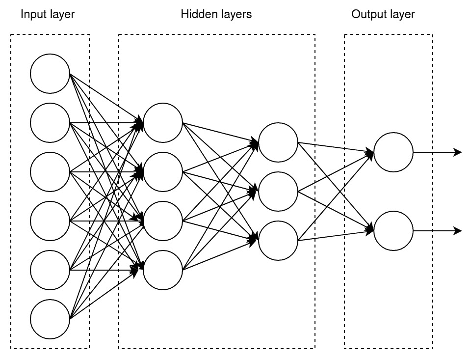

图 10.5 – 多层感知器（MLP）

应该注意的是，感知器（或神经网络）的架构包括信号传播的方向。在先前的例子中，所有通信都是从输入神经元指向输出神经元——这被称为前馈网络。其他网络架构也可能包括神经元之间的反馈。

在感知器的架构中，我们需要注意的第二点是神经元之间的连接数量。在先前的图中，我们可以看到同一层的每个神经元都与下一层的所有神经元相连——这被称为 **全连接层**。这并不是一个要求，但我们可以在 *图 10.3* 中的 *罗森布拉特感知器* 方案中看到一个具有不同类型连接的层的例子。

现在，让我们了解人工神经网络可以训练的一种方法。

## 使用反向传播法进行训练

让我们考虑用于训练前馈神经网络的常见方法：**误差反向传播法**。它与监督方法相关，因此需要训练示例中的目标值。

该算法使用神经网络的输出误差。在算法的每次迭代中，有两个网络传递——正向和反向。在正向传递中，一个输入向量从网络输入传播到其输出，形成一个与当前（实际）权重状态相对应的特定输出向量。然后，计算神经网络误差。在反向传递中，这个错误从网络输出传播到其输入，并纠正神经元权重。

用于计算网络误差的函数称为 **损失函数**。此类函数的一个例子是实际值和目标值之间差异的平方：

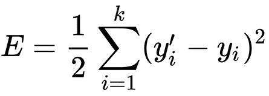

在这里，*k* 是网络中输出神经元的数量，*y’* 是目标值，而 *y* 是实际输出值。该算法是迭代的，并使用 *逐步* 训练的原则；在提交一个训练示例作为输入后，网络的神经元权重会进行调整。在反向传播过程中，这个错误会从网络输出传播到其输入，以下规则会纠正神经元的权重：

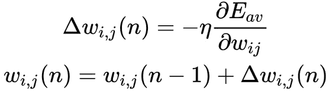

这里，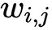是第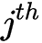个神经元与第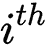个神经元的连接权重，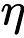是学习率参数，它允许我们控制校正步骤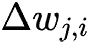的值。为了准确调整到误差的最小值，这个值在学习过程中是实验选择的（它在 0 到 1 的范围内变化）。

选择合适的学习率可以显著影响机器学习模型的表现和收敛速度。如果学习率太小，模型可能收敛缓慢或根本不收敛。另一方面，如果学习率太大，模型可能会超过最优解并发散，导致精度差和过拟合。为了避免这些问题，根据具体问题和数据集仔细选择学习率非常重要。自适应学习率（如 Adam）可以帮助在训练过程中自动调整学习率，从而更容易获得好的结果。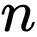是算法的层次结构编号（即步骤编号）。比如说，第*i*个神经元的输出总和如下：

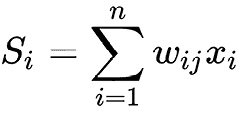

从这个角度来看，我们可以展示以下内容：

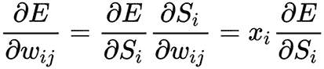

这里，我们可以看到，网络中神经元的激活函数*f(s)*的微分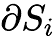必须存在且在任何点上都不等于零；也就是说，激活函数必须在整个数值轴上可微分。因此，为了应用反向传播方法，通常使用 sigmoid 激活函数，如逻辑函数或双曲正切函数。

在实践中，训练不是一直持续到网络精确调整到误差函数的最小值，而是直到达到足够准确的近似值。这个过程使我们能够减少学习迭代次数，并防止网络过拟合。

目前，已经开发了许多反向传播算法的改进版本。让我们看看其中的一些。

### 反向传播方法模式

反向传播方法主要有三种模式：

+   随机

+   批量

+   小批量

让我们看看这些模式是什么，以及它们之间有何不同。

#### 随机模式

在随机模式中，反向传播方法在计算一个训练样本的网络输出后立即对权重系数进行校正。

随机方法比批量方法慢。鉴于它不执行精确的梯度下降，而是通过未发展的梯度引入一些*噪声*，它可以跳出局部最小值并产生更好的结果。当处理大量训练数据时，它也更容易应用。

#### 批量模式

对于梯度下降的批量模式，损失函数会立即对所有可用的训练样本进行计算，然后通过误差反向传播方法引入神经元权重系数的校正。

批量方法比随机模式更快、更稳定，但它倾向于停止并陷入局部最小值。此外，当需要训练大量数据时，它需要大量的计算资源。

#### 小批量模式

在实践中，小批量通常被用作折衷方案。在处理几个训练样本（小批量）之后调整权重。这比随机下降做得少，但比批量模式做得多。

现在我们已经了解了主要的反向传播训练模式，让我们来讨论反向传播方法的问题。

### 反向传播方法问题

尽管小批量方法不是万能的，但目前它很普遍，因为它在计算可扩展性和学习有效性之间提供了一个折衷方案。它也有个别缺陷。它的大部分问题都来自无限长的学习过程。在复杂任务中，训练网络可能需要几天甚至几周的时间。此外，在训练网络时，由于校正，权重的值可能会变得非常大。这个问题可能导致所有或大多数神经元开始以巨大的值工作，在损失函数导数非常小的区域。由于学习过程中发送回的误差与这个导数成比例，学习过程实际上可能会冻结。

梯度下降法可能会陷入局部最小值而无法达到全局最小值。误差反向传播方法使用了一种梯度下降；也就是说，它是沿着误差表面下降，不断调整权重直到它们达到最小值。复杂网络的误差表面在多维空间中崎岖不平，由山丘、山谷、褶皱和峡谷组成。当附近存在一个更深的局部最小值时，网络可能会陷入局部最小值。在局部最小值点，所有方向都向上，网络无法从中逃脱。训练神经网络的主要困难在于用于退出局部最小值的方法：每次我们离开一个局部最小值，下一次局部最小值都是通过相同的方法搜索的，从而通过误差反向传播直到无法找到出路。

对收敛证明的仔细分析表明，权重校正被假定为无穷小。在实际中，这个假设是不可行的，因为它会导致无限的学习时间。步长应该取最终大小。如果步长固定且非常小，则收敛会太慢；如果固定且太大，则可能导致瘫痪或永久不稳定。今天，已经开发了许多使用可变校正步长的优化方法。它们根据学习过程调整步长（这类算法的例子包括 Adam、Adagrad、RMSProp、Adadelta 和 Nesterov 加速梯度）。

注意，网络可能存在过拟合的可能性。随着神经元数量的增加，网络泛化信息的能力可能会丧失。网络可以学习提供的整个训练样本集，但对于任何其他图像，即使是非常相似的，也可能被错误分类。为了防止这个问题，我们需要使用正则化，并在设计我们的网络架构时注意这一点。

### 反向传播方法 – 一个例子

要理解反向传播方法是如何工作的，让我们来看一个例子。

我们将为所有表达式元素引入以下索引：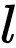 是层的索引， 是层中神经元的索引，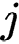 是当前元素或连接（例如，权重）的索引。我们使用以下索引：

+   

这个表达式应该被读作 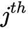 层中 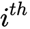 神经元的元素。

假设我们有一个由三层组成的网络，每层包含两个神经元：

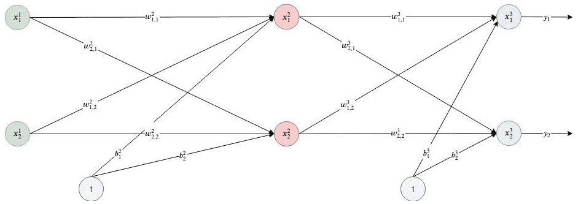

图 10.6 – 三层神经网络

+   作为损失函数，我们选择实际值和目标值之间差异的平方：


+   在这里，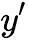 是网络输出的目标值，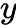 是网络输出层的实际结果，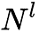 是输出层中的神经元数量。

+   这个公式计算了层中的神经元输出总和 ，在 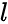 层：


+   在这里，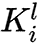 是特定神经元的输入数量，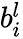 是特定神经元的偏置值。

+   例如，对于第二层的第一个神经元，它等于以下内容：

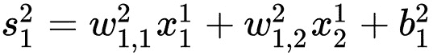

+   不要忘记，第一层没有权重，因为这一层只代表输入值。

+   决定神经元输出的激活函数应该是 Sigmoid，如下所示：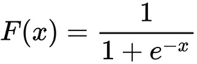

+   它的性质以及其他激活函数将在本章后面讨论。因此，第 *l* 层的第 *i* 个神经元的输出(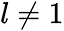)等于以下表达式：

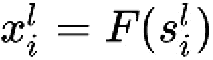

+   现在，我们实现随机梯度下降；也就是说，我们在每个训练示例之后校正权重，并在权重多维空间中移动。为了达到误差的最小值，我们需要朝着梯度相反的方向移动。我们必须根据相应的输出为每个权重，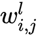，添加误差校正。以下公式显示了我们是如何根据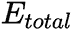输出计算误差校正值，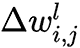的：

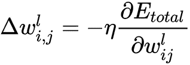

+   现在我们有了误差校正值的公式，我们可以写出权重更新的公式：

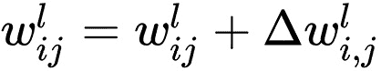

+   这里，-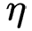是一个学习率值。

+   误差相对于权重的偏导数，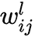，使用链式法则计算，该法则应用了两次。注意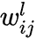只影响求和，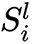：

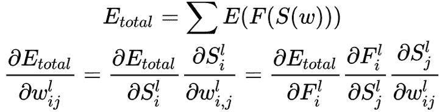

+   我们从输出层开始，推导出一个用于计算权重校正的表达式，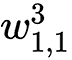。为此，我们必须依次计算各个组成部分。考虑我们网络中误差的计算方式：

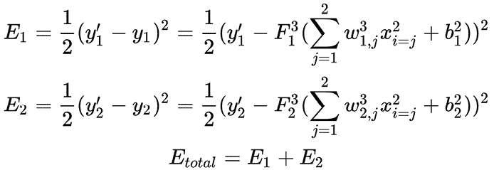

+   这里，我们可以看到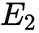不依赖于的权重。这个变量相对于它的偏导数等于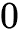：

+   然后，一般表达式变为遵循下一个公式：

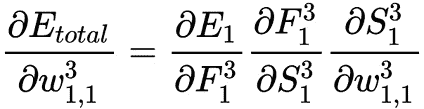

+   表达式的第一部分计算如下：


+   Sigmoid 导数是，分别。对于表达式的第二部分，我们得到以下结果：


+   第三部分是求和的偏导数，其计算如下：


+   现在，我们可以将所有这些组合成一个公式：


+   我们还可以推导出一个通用公式，用于计算输出层所有权重的误差校正：


+   这里，是网络输出层的索引。

+   现在，我们可以考虑如何对网络的内部（隐藏）层进行相应的计算。以权重，为例。这里，方法相同，但有一个显著的区别——隐藏层神经元的输出传递到所有（或几个）输出层神经元的输入，这一点必须考虑：


+   在这里，我们可以看到和已经在之前的步骤中计算出来，并且我们可以使用它们的值来进行计算：


通过组合获得的结果，我们得到以下输出：


同样，我们可以使用之前步骤中计算出的值——和——来计算总和的第二部分：


权重校正表达式的剩余部分，，如下获得，类似于如何获得输出层权重的表达式：


通过组合获得的结果，我们得到一个通用公式，我们可以用它来计算隐藏层权重调整的幅度：


在这里，是隐藏层的索引，而是其中的神经元数量。

层，。

现在，我们拥有了描述误差反向传播算法主要步骤的所有必要公式：

1.  使用小的随机值初始化所有权重，（初始化过程将在后面讨论）。

1.  依次重复此操作，对所有的训练样本或样本的小批量进行操作。

1.  将一个训练样本（或样本的小批量）传递到网络输入，计算并记住所有神经元的输出。这些计算包括我们激活函数的所有总和和值。

1.  计算输出层所有神经元的误差：

1.  对于所有*l*层上的每个神经元，从倒数第二个开始，计算误差：


在这里，*Lnext*是*l + 1*层的神经元数量。

1.  更新网络权重：


这里，是学习率值。

反向传播算法有许多版本，可以改进算法的稳定性和收敛速度。最早提出的改进之一是使用动量。在每一步，值被记住，在下一步，我们使用当前梯度值和前一步的线性组合：


是用于额外算法调整的超参数。这个算法现在比原始版本更常见，因为它允许我们在训练过程中取得更好的结果。

用于训练神经网络的下一个重要元素是损失函数。

## 损失函数

使用损失函数，神经网络训练被简化为选择权重矩阵系数的过程，以最小化误差。这个函数应该对应于任务，例如，对于分类问题使用类别交叉熵，对于回归使用差异的平方。如果使用反向传播方法来训练网络，可微性也是损失函数的一个基本属性。让我们看看神经网络中使用的流行损失函数：

+   **均方误差**（**MSE**）损失函数在回归和分类任务中得到了广泛的应用。分类器可以预测连续分数，这些是中间结果，只有在分类过程的最后一步才被转换为类别标签（通常通过阈值）。MSE 可以使用这些连续分数而不是类别标签来计算。这种做法的优点是避免了由于二分化而丢失信息。MSE 损失函数的标准形式定义如下：

+   **均方对数误差**（**MSLE**）损失函数是 MSE 的一种变体，其定义如下：


通过对预测值和目标值取对数，我们测量的方差已经改变。当预测值和实际值都是大数时，我们通常不希望对预测值和目标值之间的较大差异进行惩罚。此外，MSLE 对低估的惩罚比对高估的惩罚更大。

+   **L2**损失函数是实际值与目标值之间差异的 L2 范数的平方。其定义如下：


+   **平均绝对误差**（**MAE**）损失函数用于衡量预测或预测值与最终结果之间的接近程度：


MAE 需要复杂的工具，如线性规划来计算梯度。由于它没有使用平方，MAE 比 MSE 对异常值更鲁棒。

+   **L1**损失函数是实际值与目标值之间差异的绝对误差之和。与 MSE 和 L2 的关系类似，L1 在数学上与 MAE 相似，但它没有除以**n**。其定义如下：


+   **交叉熵**损失函数通常用于二元分类任务，其中标签被假定为取 0 或 1 的值。它被定义为如下：


交叉熵衡量两个概率分布之间的差异。如果交叉熵很大，这意味着两个分布之间的差异显著；如果交叉熵很小，这意味着两个分布彼此相似。交叉熵损失函数的优点是收敛速度更快，并且比二次损失函数更有可能达到全局优化。

+   **负对数似然**损失函数用于神经网络中的分类任务。当模型为每个类别输出一个概率而不是类别标签时使用。它定义如下：


+   **余弦邻近**损失函数计算预测值和目标值之间的余弦邻近度。它定义如下：


此函数与余弦相似度相同，它是两个非零向量之间相似度的度量。这表示为它们之间角度的余弦值。如果单位向量平行，则它们最大程度相似；如果它们正交，则最大程度不相似。

+   **Hinge 损失**函数用于训练分类器。Hinge 损失也称为最大间隔目标，用于**最大间隔**分类。它使用分类器决策函数的原始输出，而不是预测的类别标签。它定义如下：


有许多其他的损失函数。复杂的网络架构通常使用多个损失函数来训练网络的各个部分。例如，用于在图像上预测对象类别和边界的*Mask RCNN*架构，使用不同的损失函数：一个用于回归，另一个用于分类器。在下一节中，我们将讨论神经元的激活函数。

## 激活函数

人工神经元的作用是什么？简单来说，它计算输入的加权和，加上偏置，并决定是否排除这个值或进一步使用它。人工神经元不知道一个阈值，可以用来判断输出值是否将神经元切换到激活状态。为此，我们添加一个激活函数。它检查神经元产生的值，以确定外部连接是否应该识别这个神经元是激活的，还是可以忽略。它根据输入加权和与阈值值的计算结果来确定神经元的输出值。

让我们考虑一些激活函数及其特性的例子。

### 步进激活函数

步进激活函数的工作方式是这样的——如果总和值高于特定的阈值值，我们认为神经元被激活。否则，我们说神经元是不活跃的。

此函数的图形可以在以下图中看到：


图 10.7 – 步进激活函数

当参数大于*0*时（零值是一个阈值），函数返回*1*（神经元已被激活），否则函数返回*0*（神经元未被激活）。这种方法很简单，但它有缺陷。想象一下我们正在创建一个二元分类器——一个应该说出*是*或*否*（激活或不）的模型。阶梯函数可以为我们做到这一点——它打印*1*或*0*。现在，想象一个需要更多神经元来分类许多类别的情形：*class1*、*class2*、*class3*，甚至更多。如果有多个神经元被激活会发生什么？所有激活函数的神经元都会得出*1*。

在这种情况下，关于给定对象最终应该获得哪个类别的疑问产生了。我们只想激活一个神经元，其他神经元的激活函数应该是零（除了在这种情况下，我们可以确信网络正确地定义了类别）。这样的网络更难以训练并达到收敛。如果激活函数不是二元的，那么可能的值是激活 50%，激活 20%，等等。如果有几个神经元被激活，我们可以找到激活函数值最高的神经元。由于神经元输出存在中间值，学习过程运行得更平滑、更快。

在阶梯激活函数中，在训练期间出现几个完全激活的神经元的可能性降低（尽管这取决于我们正在训练的内容以及数据）。此外，阶梯激活函数在点 0 处不可导，其导数在所有其他点都等于 0。这导致我们在使用梯度下降方法进行训练时遇到困难。

### 线性激活函数

线性激活函数，*y = c x*，是一条直线，并且与输入（即这个神经元的加权求和）成正比。这种激活函数的选择使我们能够得到一系列值，而不仅仅是二元答案。我们可以连接几个神经元，如果多个神经元被激活，决策将基于例如最大值的选取。

以下图表显示了线性激活函数的形状：


图 10.8 – 线性激活函数

关于*y = c x*相对于*x*的导数是*c*。这个结论意味着梯度与函数的参数无关。梯度是一个常数向量，而下降是根据一个常数梯度进行的。如果做出了错误的预测，那么反向传播误差的更新变化也是常数，并且不依赖于对输入所做的任何变化。

另一个问题：相关层。线性函数激活每一层。这个函数的值作为输入传递到下一层，而第二层考虑其输入的加权总和，并反过来包含神经元，这取决于另一个线性激活函数。我们有多少层无关紧要。如果它们都是线性的，那么最后一层的最终激活函数只是第一层输入的线性函数。这意味着两层（或 *N* 层）可以被一层替换。因此，我们失去了创建层集的能力。整个神经网络仍然类似于具有线性激活函数的一层，因为它是由线性函数的线性组合。

### Sigmoid 激活函数

Sigmoid 激活函数，，是一个平滑函数，类似于阶梯函数：


图 10.9 – Sigmoid 激活函数

Sigmoid 是一个非线性函数，sigmoid 的组合也产生一个非线性函数。这使我们能够组合神经元层。Sigmoid 激活函数不是二元的，它具有从范围 [0,1] 的值集合的激活，与阶梯函数相反。Sigmoid 也以平滑梯度为特征。在  的值从 -2 到 2 的范围内，值  变化非常快。这个梯度属性意味着在这个区域任何  值的微小变化都会导致  值的显著变化。这种函数的行为表明  倾向于附着在曲线的一侧。

Sigmoid 看起来是一个适合分类任务的函数。它试图将值带到曲线的一侧（例如，在  的上边缘和  的下边缘）。这种行为使我们能够在预测中找到清晰的边界。

Sigmoid 相对于线性函数的另一个优点如下：在第一种情况下，我们有一个固定的函数值范围，[0, 1]，而线性函数在  内变化。这有利于处理激活函数上的大值时，不会导致数值计算错误。

现在，Sigmoid 函数是神经网络中最受欢迎的激活函数之一。但它也存在我们必须考虑的缺陷。当 Sigmoid 函数接近其最大值或最小值时，的输出值往往弱地反映的变化。这意味着这些区域的梯度取值很小，而小的值会导致梯度消失。**梯度消失**问题是一种梯度值变得太小或消失，神经网络拒绝进一步学习或学习速度非常慢的情况。

### 双曲正切

双曲正切是另一种常用的激活函数。它可以如下图形表示：


Figure 10.10 – 双曲正切激活函数

双曲正切函数与 Sigmoid 函数非常相似。这是正确的 Sigmoid 函数，。因此，这样的函数具有与我们之前看到的 Sigmoid 函数相同的特性。它的本质是非线性的，非常适合层与层的组合，函数值的范围是。因此，没有必要担心激活函数的值会导致计算问题。然而，值得注意的是，切向函数的梯度值比 Sigmoid 函数的梯度值高（导数比 Sigmoid 函数的导数更陡峭）。我们选择 Sigmoid 函数还是双曲正切函数取决于梯度幅度的要求。与 Sigmoid 函数一样，双曲正切函数也有固有的梯度消失问题。

**修正线性单元**（**ReLU**），，如果为正，则返回，否则返回：


Figure 10.11 – ReLU 激活函数

初看起来，ReLU 似乎与线性函数有相同的问题，因为 ReLU 在第一象限是线性的。但实际上，ReLU 是非线性的，ReLU 的组合也是非线性的。ReLU 的组合可以逼近任何函数。这一特性意味着我们可以使用层，它们不会退化成线性组合。ReLU 允许的值范围是，这意味着它的值可以相当高，从而导致计算问题。然而，这一特性也消除了梯度消失的问题。建议使用正则化和归一化输入数据来解决大函数值问题（例如，到值范围[0,1]）。

让我们来看看激活稀疏性作为神经网络的一个特性。想象一个拥有许多神经元的庞大神经网络。使用 sigmoid 或双曲正切函数意味着所有神经元都会被激活。这一动作意味着几乎所有的激活都必须被处理以计算网络输出。换句话说，激活是密集且昂贵的。

理想情况下，我们希望某些神经元不活跃，这将使激活变得稀疏且高效。ReLU 允许我们做到这一点。想象一个具有随机初始化权重（或归一化）的网络，由于 ReLU 的特性，大约 50%的激活为 0，因为![img/B19849_Formula_1112.png]的负值返回 0。在这样的网络中，包含的神经元较少（稀疏激活），网络本身也变得轻量。

由于 ReLU 的一部分是水平线（对于负值，见![img/B19849_Formula_1123.png]），这部分上的梯度为 0。这一特性导致在训练过程中无法调整权重。这种现象被称为**渐逝 ReLU 问题**。由于这个问题，一些神经元被关闭并且不响应，使得神经网络的大部分变得被动。然而，ReLU 的一些变体有助于解决这个问题。例如，用表达式![img/B19849_Formula_1142.png]将函数的水平部分（![img/B19849_Formula_1133.png]的区域）替换为线性部分是有意义的。还有其他避免零梯度的方法，但主要思想是使梯度非零，并在训练过程中逐渐恢复它。

此外，ReLU 在计算资源上的要求远低于双曲正切或 sigmoid，因为它执行比上述函数更简单的数学运算。

ReLU 的关键特性是其小的计算复杂度、非线性和对梯度消失问题的不敏感性。这使得它成为创建深度神经网络中最常用的激活函数之一。

现在我们已经研究了多种激活函数，我们可以突出它们的主要特性。

### 激活函数特性

以下是一个激活函数特性的列表，在决定选择哪种激活函数时值得考虑：

+   **非线性**：如果激活函数是非线性的，可以证明即使是双层神经网络也能成为函数的通用逼近器。

+   **连续可微性**：这一特性对于提供梯度下降优化方法是有益的。

+   **值范围**：如果激活函数的值集合有限，基于梯度的学习方法更稳定，更不容易出现计算错误，因为没有大值。如果值的范围是无限的，训练通常更有效，但必须小心避免梯度爆炸（这意味着梯度值可以达到极值，学习能力将丧失）。

+   **单调性**：如果激活函数是单调的，单层模型相关的误差表面将保证是凸的。这使我们能够更有效地学习。

+   **单调导数的平滑函数**：在某些情况下，这些提供了更高程度的一般性。

现在我们已经讨论了用于训练神经网络的主体组件，是时候学习如何处理在训练过程中经常出现的过度拟合问题。

## 神经网络中的正则化

过度拟合是机器学习模型，尤其是神经网络模型的问题之一。问题在于模型只解释了训练集中的样本，因此适应了训练样本而不是学习分类未参与训练过程的样本（失去了泛化的能力）。通常，过度拟合的主要原因在于模型的复杂性（从参数数量来看）。这种复杂性可能对于可用的训练集来说太高，最终对于要解决的问题来说也是如此。正则化器的作用是降低模型的复杂性，同时保留参数数量。让我们考虑在神经网络中常用的最常见正则化方法。

最受欢迎的正则化方法是 L2 正则化、dropout 和批量归一化。让我们逐一看看。

### L2 正则化

**L2 正则化**（权重衰减）通过惩罚具有最高值的权重来实现。惩罚是通过最小化它们的-范数来实现的，使用参数——一个正则化系数，表示在需要最小化训练集上的损失时，我们倾向于最小化范数。也就是说，对于每个权重，我们在损失函数中添加项（使用因子是为了使这个项相对于参数的梯度等于而不是，以便于应用误差反向传播方法）。我们必须正确选择。如果系数太小，那么正则化的效果可以忽略不计。如果太大，模型可以重置所有权重。

### Dropout 正则化

**Dropout 正则化**包括改变网络结构。每个神经元有概率被排除在网络结构之外，概率为。排除一个神经元意味着无论输入数据或参数如何，它都会返回 0。

被排除的神经元在任何阶段的反向传播算法中都不会对学习过程做出贡献。因此，至少排除一个神经元相当于学习一个新的神经网络。这种*稀疏*网络用于训练剩余的权重。在执行梯度步骤之后，所有被驱逐的神经元都会返回到神经网络中。因此，在训练的每一步，我们设置可能的 2*N 个网络架构之一。当我们评估神经网络时，神经元不再被排除。每个神经元的输出乘以(*1 - p*)。这意味着在神经元的输出中，我们接收所有 2*N 个架构的响应期望。因此，使用 Dropout 正则化训练的神经网络可以被视为从 2*N 个网络集合中平均响应的结果。

### 批量归一化

**批量归一化**确保神经网络的有效学习过程不受阻碍。当信号通过网络内部层的传播时，均值和方差可能会显著扭曲输入信号，即使我们在网络输入处最初已经对信号进行了归一化。这种现象称为内部协方差偏移，并在不同层或级别的梯度之间产生严重差异。因此，我们必须使用更强的正则化器，这会减慢学习速度。

批量归一化为此问题提供了一个简单直接的解决方案：以获得零均值和单位方差的方式对输入数据进行归一化。归一化在每个层进入之前执行。在训练过程中，我们对批次样本进行归一化，在使用过程中，我们根据整个训练集获得的统计数据归一化，因为我们无法提前看到测试数据。我们按照以下方式计算特定批次的均值和方差：


使用这些统计特性，我们将激活函数转换为在整个批次中具有零均值和单位方差的形式：


在这里， 是一个参数，它保护我们在批次的方差非常小或甚至等于零的情况下避免除以 0。最后，为了得到最终的激活函数 ，我们需要确保在归一化过程中，我们不会失去泛化的能力。由于我们对原始数据应用了缩放和移位操作，我们可以允许对归一化值进行任意的缩放和移位，从而获得最终的激活函数：


在这里， 和  是系统可以训练的批归一化的参数（它们可以通过在训练数据上的梯度下降法进行优化）。这种泛化还意味着，当直接应用神经网络的输入时，批归一化可能是有用的。

当这种方法应用于多层网络时，几乎总是成功地达到其目标——加速学习。此外，它是一个出色的正则化器，允许我们选择学习率、 正则化器的幂和 dropout。这里的正则化是这样一个事实的结果，即网络对特定样本的结果不再是确定的（它依赖于得到这个结果的整体批次），这简化了泛化过程。

我们接下来要探讨的下一个重要主题是神经网络初始化。它影响训练过程的收敛性、训练速度和整体网络性能。

## 神经网络初始化

选择构成模型层的权重初始值的原则非常重要。将所有权重设置为 0 是一个严重的阻碍学习的障碍，因为没有任何权重可以最初是活跃的。从区间[0, 1]的随机值分配权重通常也不是最佳选择。实际上，模型性能和学习过程收敛可以很大程度上依赖于正确的权重初始化；然而，初始任务和模型复杂性也可能扮演着重要的角色。即使任务的解决方案不假设对初始权重值有强烈的依赖性，一个精心选择的重置权重的方法也可以显著影响模型学习的能力。这是因为它在考虑损失函数的同时预设了模型参数。让我们看看两种常用的初始化权重的流行方法。

### Xavier 初始化方法

**Xavier 初始化方法**用于简化在正向传递和反向传递误差时通过层的信号流。这种方法对 sigmoid 函数也适用，因为其未饱和区域也具有线性特征。在计算权重时，此方法依赖于具有方差的概率分布（如均匀分布或正态分布），其中和分别是前一层和后一层中的神经元数量。

### 他初始化方法

**He 初始化方法**是 Xavier 方法的变体，更适合 ReLU 激活函数，因为它补偿了该函数在定义域的一半返回零的事实。这种权重计算方法依赖于以下方差的概率分布：


还有其他权重初始化方法。你选择哪种方法通常取决于要解决的问题、网络拓扑、使用的激活函数和损失函数。例如，对于递归网络，可以使用正交初始化方法。我们将在*第十二章**，导出和导入模型*中提供一个具体的神经网络初始化编程示例。

在前面的章节中，我们讨论了人工神经网络的基本组件，这些组件几乎适用于所有类型的网络。在下一节中，我们将讨论常用于图像处理的卷积神经网络的特点。

# 深入卷积网络

MLP（多层感知器）是最强大的前馈神经网络。它由多个层组成，其中每个神经元接收来自前一层神经元的所有输出副本。这种模型适用于某些类型的任务，例如，在有限数量的更多或更少的非结构化参数上进行训练。

然而，让我们看看当使用原始数据作为输入时，这种模型中的参数（权重）数量会发生什么变化。例如，CIFAR-10 数据集包含 32 x 32 x 32 彩色图像，如果我们考虑每个像素的每个通道作为 MLP 的独立输入参数，第一隐藏层中的每个神经元都会为模型增加大约 3,000 个新参数！随着图像尺寸的增加，情况迅速失控，产生用户无法用于实际应用的图像。

一种流行的解决方案是降低图像的分辨率，以便 MLP（多层感知器）变得适用。然而，当我们降低分辨率时，我们可能会丢失大量信息。如果在应用降低质量之前处理信息，那么我们不会导致模型参数数量的爆炸性增加，这将是极好的。有一种非常有效的方法可以解决这个问题，那就是基于卷积操作。

## 卷积算子

这种方法最初用于处理图像的神经网络，但它已经成功地用于解决其他学科领域的问题。让我们考虑使用这种方法进行图像分类。

假设当形成我们感兴趣的特征（图像中的物体特征）时，相邻的图像像素比位于相当距离的像素相互作用更紧密。此外，如果一个小特征在图像分类过程中被认为非常重要，那么这个特征在图像的哪个部分被发现并不重要。

让我们来看看卷积算子的概念。我们有一个二维图像 *I* 和一个小的 *K* 矩阵，其尺寸为 *h x w*（所谓的卷积核），它以图形方式编码了一个特征。我们计算 *I * K* 的最小化图像，将核心以所有可能的方式叠加到图像上，并记录原始图像和核的元素之和：


精确的定义假设核矩阵是转置的，但对于机器学习任务来说，这个操作是否执行并不重要。卷积算子是 CNN（卷积神经网络）中卷积层的基础。该层由一定数量的核组成，（每个核具有加性位移组件，），并使用每个核计算前一层输出图像的卷积，每次添加一个位移组件。最后，可以将激活函数，，应用于整个输出图像。通常，卷积层的输入流由 *d* 个通道组成——例如，对于输入层，红色/绿色/蓝色，在这种情况下，核也扩展，以便它们也由 *d* 个通道组成。以下公式是卷积层输出图像的一个通道，其中 *K* 是核，*b* 是步长（位移）组件：


以下图示以示意图形式展示了前面的公式：


图 10.12 – 卷积操作方案

如果加法（步长）组件不等于 1，则可以如下示意图表示：


图 10.13 – 步长等于一的卷积

请注意，由于我们在这里所做的只是添加和缩放输入像素，因此可以使用梯度下降法从现有的训练样本中获得内核，类似于在 MLP 中计算权重。MLP 可以完美地处理卷积层的功能，但它需要更长的训练时间，以及更多的训练数据。

注意到卷积算子不仅限于二维数据：大多数深度学习框架直接提供了一维或*N*维卷积的层。还值得注意的是，尽管与全连接层相比，卷积层减少了参数的数量，但它使用了更多的超参数——在训练之前选择的参数。

特别是，以下超参数被选中：

+   **深度**：一个层中涉及多少个内核和偏置系数。

+   每个内核的**高度**和**宽度**。

+   **步长（步距）**：在计算结果图像的下一个像素时，内核在每一步中移动的距离。通常，所采用的步长值等于 1，值越大，产生的输出图像的大小就越小。

+   **填充**：请注意，对大于 1 x 1 维度的任何内核进行卷积都会减小输出图像的大小。由于通常希望保持原始图像的大小，因此沿边缘补充了模式。

卷积层的一次遍历通过减少特定通道的长度和宽度来影响图像，但增加其值（深度）。

另一种减少图像维度并保留其一般属性的方法是对图像进行下采样。执行此类操作的神经网络层被称为**池化层**。

## 池化操作

池化层接收图像的小片段，并将每个片段组合成一个值。有几种可能的聚合方法。最直接的方法是从像素集中取最大值。这种方法在以下示意图中显示：


图 10.14 – 池化操作

让我们考虑最大池化是如何工作的。在先前的图中，我们有一个 6 x 6 大小的数字矩阵。池化窗口的大小为 3，因此我们可以将这个矩阵分成四个 3 x 3 大小的更小的子矩阵。然后，我们可以从每个子矩阵中选择最大值，并从这些数字中构建一个 2 x 2 大小的更小的矩阵。

卷积层或池化层最重要的特性是其受感野值，这使我们能够了解用于处理的信息量。让我们详细讨论一下。

## 受感野

卷积神经网络架构的一个基本组成部分是在模型输入到输出的数据量减少的同时，仍然增加通道深度。如前所述，这通常是通过选择卷积步长（步长）或池化层来实现的。受信域决定了原始输入在输出中处理了多少。受信域的扩展允许卷积层将低级特征（线条、边缘）组合成高级特征（曲线、纹理）。


图 10.15 – 受信域概念

层*k*的受信域可以用以下公式给出：


这里，是层*k - 1*的受信域，*k - 1*，是滤波器大小，是层*i*的步长。因此，对于前面的例子，输入层的*RF = 1*，隐藏层的*RF = 3*，最后一层的*RF = 5*。

现在我们已经熟悉了 CNN 的基本概念，让我们看看如何将它们结合起来创建一个具体的图像分类网络架构。

## 卷积网络架构

该网络从初始阶段的一小部分低级滤波器发展到大量滤波器，每个滤波器都找到特定的中级属性。从级别到级别的过渡提供了模式识别的层次结构。

首先成功应用于模式识别任务的卷积网络架构之一是 LeNet-5，由 Yann LeCun、Leon Bottou、Yosuha Bengio 和 Patrick Haffner 开发。它在 20 世纪 90 年代用于识别手写和印刷数字。以下图表显示了该架构：


图 10.16 – LeNet-5 网络架构

该架构的网络层在以下表格中解释：

| **编号** | **层** | **特征图（深度）** | **大小** | **核大小** | **步长** | **激活函数** |
| --- | --- | --- | --- | --- | --- | --- |
| 输入 | 图像 | 1 | 32 x 32 | - | - | - |
| 1 | 卷积 | 6 | 28 x 28 | 5 x 5 | 1 | tanh |
| 2 | 平均池化 | 6 | 14 x 14 | 2 x 2 | 2 | tanh |
| 3 | 卷积 | 16 | 10 x 10 | 5 x 5 | 1 | tanh |
| 4 | 平均池化 | 16 | 5 x 5 | 2 x 2 | 2 | tanh |
| 5 | 卷积 | 120 | 1 x 1 | 5 x 5 | 1 | tanh |
| 6 | FC |  | 84 | - | - | tanh |
| 输出 | FC |  | 10 | - | - | softmax |

表 10.1 – LeNet-5 层属性

注意层深和层大小是如何向最终层变化的。我们可以看到深度在增加，而大小在减小。这意味着在最终层，网络可以学习的特征数量增加了，但它们的尺寸变小了。这种行为在不同的卷积网络架构中非常常见。

在下一节中，我们将讨论深度学习，它是机器学习的一个子集，使用人工神经网络进行学习和决策。它被称为*深度*学习，因为所使用的神经网络具有多层，这使得它们能够模拟数据中的复杂关系和模式。

# 深度学习是什么？

最常使用深度学习这个术语来描述设计用于处理大量数据并使用复杂算法来训练模型的人工神经网络。深度学习的算法可以使用监督和非监督算法（强化学习）。学习过程是*深度*的，因为随着时间的推移，神经网络覆盖的层级越来越多。网络越深（即，具有更多的隐藏层、滤波器和特征抽象层级），网络的性能就越高。在大数据集上，深度学习比传统的机器学习算法表现出更好的准确性。

导致当前对深度神经网络兴趣复苏的真正突破发生在 2012 年，在*ACM 通讯*杂志上发表的*使用深度卷积神经网络进行 ImageNet 分类*一文之后，由*Alex Krizhevsky*、*Ilya Sutskever*和*Geoff Hinton*撰写。作者们汇集了许多不同的学习加速技术。这些技术包括卷积神经网络、智能使用 GPU 以及一些创新的数学技巧：优化线性神经元（ReLU）和 dropout，表明他们可以在几周内训练一个复杂的神经网络，其结果将超越传统方法在计算机视觉中的应用。

现在，基于深度学习的系统已应用于各个领域，并成功取代了传统机器学习的传统方法。以下是一些深度学习应用的领域示例：

+   **语音识别**：所有主要的商业语音识别系统（如微软小娜、Xbox、Skype 翻译器、亚马逊 Alexa、谷歌 Now、苹果 Siri、百度和科大讯飞）都是基于深度学习的。

+   **计算机视觉**：今天，深度学习图像识别系统已经能够给出比人眼更准确的结果，例如，在分析医学研究图像（MRI、X 射线等）时。

+   **新药发现**：例如，AtomNet 神经网络被用来预测新的生物分子，并被提出用于治疗埃博拉病毒和多发性硬化症等疾病。

+   **推荐系统**：今天，深度学习被用来研究用户偏好。

+   **生物信息学**：它也被用来研究基因本体预测。

随着我们深入神经网络开发的领域，我们将探讨如何使用 C++库创建和训练人工神经网络模型。

# 使用 C++库创建神经网络的示例

许多机器学习库都有用于创建和操作神经网络的 API。我们在前几章中使用的所有库——`mlpack`、`Dlib`和`Flashlight`——都支持神经网络。但也有一些专门用于神经网络的框架；例如，一个流行的框架是 PyTorch 框架。专门库和通用库之间的区别在于，专门库支持更多可配置选项和不同类型的网络、层和损失函数。此外，专门库通常拥有更现代的工具，并且这些工具会更快地引入到它们的 API 中。

在本节中，我们将使用`mlpack`、`Dlib`和`Flashlight`库创建一个用于回归任务的简单 MLP。我们还将使用 PyTorch C++ API 创建一个更高级的网络——具有 LeNet5 架构的卷积深度神经网络，我们之前在*卷积网络架构*部分讨论过。我们将使用这个网络进行图像分类。

让我们学习如何使用`mlpack`、`Dlib`和`Flashlight`库来创建一个用于回归任务的简单 MLP。对于所有系列样本，任务都是相同的——MLP 应该学习在有限区间内的余弦函数。在这本书的代码示例中，我们可以找到数据生成和 MLP 训练的完整程序。在这里，我们将讨论用于神经网络 API 视图的程序的基本部分。请注意，我们将为这些示例使用 Tanh 和 ReLU 函数作为激活函数。我们选择它们是为了实现特定任务的更好收敛。

## Dlib

`Dlib`库有一个用于处理神经网络的 API。它还可以通过 Nvidia CUDA 支持进行性能优化。如果我们计划处理大量数据和深度神经网络，使用 CUDA 或 OpenCL 对于 GPU 来说非常重要。

`Dlib`库中用于神经网络的策略与该库中其他机器学习算法的策略相同。我们应该实例化和配置所需算法类的对象，然后使用特定的训练器在数据集上对其进行训练。

在`Dlib`库中存在用于训练神经网络的`dnn_trainer`类。这个类的对象应该使用具体的网络对象和优化算法对象进行初始化。最流行的优化算法是带有动量的随机梯度下降算法，这在*反向传播方法模式*章节中已经讨论过。这个算法在`sgd`类中实现。`sgd`类的对象应该配置权重衰减正则化和动量参数值。`dnn_trainer`类有以下基本配置方法：`set_learning_rate`、`set_mini_batch_size`和`set_max_num_epochs`。这些分别设置学习率参数值、小批量大小和最大训练轮数。此外，这个训练类支持动态学习率变化，因此我们可以，例如，为后续轮次设置较低的学习率。学习率衰减参数可以通过`set_learning_rate_shrink_factor`方法进行配置。但在下面的例子中，我们将使用恒定学习率，因为对于这个特定的数据，它给出了更好的训练结果。

实例化训练对象下一个基本的项目是神经网络类型对象。`Dlib`库使用声明式风格来定义网络架构，为此，它使用 C++模板。因此，为了定义神经网络架构，我们应该从网络的输入开始。在我们的案例中，这是`matrix<double>`类型。我们需要将这个类型作为模板参数传递给下一个层类型；在我们的案例中，这是`fc`类型的全连接层。全连接层类型也接受神经元数量作为模板参数。为了定义整个网络，我们应该创建嵌套类型定义，直到我们达到最后一层和损失函数。在我们的案例中，这是`loss_mean_squared`类型，它实现了均方损失函数，这通常用于回归任务。

下面的代码片段显示了使用`Dlib`库 API 的网络定义：

```py
using NetworkType = loss_mean_squared<fc<
    1,
    htan<fc<
        8,
        htan<fc<16,
                htan<fc<32, input<matrix<double>>>>>>>>>>;
```

这个定义可以按照以下顺序阅读：

1.  我们从输入层开始：

    ```py
    input<matrix<double>
    ```

1.  然后，我们添加了具有 32 个神经元的第一个隐藏层：

    ```py
    fc<32, input<matrix<double>>
    ```

1.  然后，我们在第一个隐藏层添加了双曲正切激活函数：

    ```py
    htan<fc<32, input<matrix<double>>>
    ```

1.  接下来，我们添加了具有 16 个神经元和激活函数的第二个隐藏层：

    ```py
    htan<fc<16, htan<fc<32, input<matrix<double>>>>>>
    ```

1.  然后，我们添加了具有 8 个神经元和激活函数的第三个隐藏层：

    ```py
    htan<fc<8, htan<fc<16, htan<fc<32,
        input<matrix<double>>>>>>>>
    ```

1.  然后，我们添加了没有激活函数的具有 1 个神经元的最后一个输出层：

    ```py
    fc<1, htan<fc<8, htan<fc<16, htan<fc<32,
        input<matrix<double>>>>>>>>>
    ```

1.  最后，我们完成了损失函数：

    ```py
    loss_mean_squared<...>
    ```

下面的片段显示了包含网络定义的完整源代码示例：

```py
size_t n = 10000;
...
std::vector<matrix<double>> x(n);
std::vector<float> y(n);
...
using NetworkType = loss_mean_squared<
fc < 1, htan < fc < 8, htan < fc < 16, htan < fc < 32,
    input < matrix < double >>>>>>>>>>;
NetworkType network;
float weight_decay = 0.0001f;
float momentum = 0.5f;
sgd solver(weight_decay, momentum);
dnn_trainer<NetworkType> trainer(network, solver);
trainer.set_learning_rate(0.01);
trainer.set_learning_rate_shrink_factor(1);  // disable learning rate 
                                            //changes
trainer.set_mini_batch_size(64);
trainer.set_max_num_epochs(500);
trainer.be_verbose();
trainer.train(x, y);
network.clean();
auto predictions = network(new_x);
```

现在我们已经配置了训练器对象，我们可以使用`train`方法开始实际的训练过程。此方法接受两个 C++向量作为输入参数。第一个应该包含`matrix<double>`类型的训练对象，第二个应该包含目标回归值，这些值是`float`类型。我们还可以调用`be_verbose`方法来查看训练过程的输出日志。在训练网络之后，我们调用`clean`方法以允许网络对象清除中间训练值并因此减少内存使用。

## mlpack

要使用`mlpack`库创建神经网络，我们必须首先定义网络的架构。我们使用`mlpack`库中的`FFN`类来这样做，它用于聚合网络层。**FFN**代表**前馈网络**。库中有用于创建层的类：

+   `线性`：具有输出尺寸值的全连接层

+   `Sigmoid`：sigmoid 激活函数层

+   `卷积`：二维卷积层

+   `ReLU`：ReLU 激活函数层

+   `MaxPooling`：最大池化层

+   `Softmax`：具有 softmax 激活函数的层

库中还有其他类型的层。所有这些都可以添加到 FFN 类型对象中，以创建神经网络。创建神经网络的第一个步骤是`FFN`对象的实例化，可以这样做：

```py
MeanSquaredError loss;
ConstInitialization init(0.);
FFN<MeanSquaredError, ConstInitialization> model( loss, init);
```

你可以看到`FFN`类构造函数接受两个参数。第一个参数是一个损失函数对象，在我们的例子中是`MeanSeqaredError`类型对象。第二个参数是一个初始化对象；我们使用了`ConstantInitialization`类型并设置为`0`值。`mlpack`库中还有其他初始化类型；例如，你可以使用`HeInitialization`或`GlorotInitialization`类型。

然后，为了向网络添加一个新层，我们可以使用以下代码：

```py
model.Add<Linear>(8);
model.Add<ReLU>();
...
```

新对象层是通过`Add`方法添加的，并且使用了模板参数来专门化层类型。此方法接受一个变量作为参数的数量，这取决于层类型。在这个例子中，我们传递了一个单一参数——全连接线性层的输出维度。`FNN`对象自动配置输入维度。

在我们能够训练网络之前，我们必须创建一个优化方法对象。我们可以这样做：

```py
size_t epochs = 100;
ens::MomentumSGD optimizer(
    /*stepSize=*/0.01,
    /*batchSize=*/ 64,
    /*maxIterations=*/ epochs * x.n_cols,
    /*tolerance=*/1e-10,
    /*shuffle=*/false);
```

我们创建了一个实现带有动量的随机梯度下降优化的对象。在`mlpack`库中的优化器类型不仅接受优化参数，例如学习率值，还包括配置整个训练周期的参数。我们传递了学习率、批量大小、迭代次数、早期停止的损失值容忍度以及打乱数据集的标志作为参数。请注意，我们没有直接传递训练周期数；相反，我们计算了`maxIteration`参数值作为周期数和训练元素数的乘积。`MomentumSGD`类只是`SGD`类与`MomentumUpdate`策略类的模板特化。因此，要更新默认的动量值，我们必须访问特定的字段，如下所示：

```py
optimizer.UpdatePolicy().Momentum() = 0.5;
```

`mlpack`库中还有各种其他遵循相同初始化方案的优化器。

在有了网络和优化器对象后，我们可以如下训练一个模型：

```py
model.Train(x, y, optimizer);
```

我们将训练样本的`x`和`y`矩阵以及优化器对象作为参数传递给`FFN`类型对象的`Train`方法。在`mlpack`库中没有专门的数据集类型，因此使用原始的`arma::mat`对象来完成这个目的。在一般情况下，训练是静默进行的，这在实验中并不有用。因此，`Train`方法中有额外的参数来增加详细程度。在优化器参数之后，`Train`方法接受多个回调。例如，如果我们想在控制台看到带有损失值的训练过程日志，我们可以添加`ProgressBar`对象回调如下：

```py
model.Train(x, y, optimizer, ens::ProgressBar());
```

此外，我们还可以添加另一个类型回调。在下面的示例中，我们添加了早期停止回调和记录最佳参数值的回调：

```py
ens::StoreBestCoordinates<arma::mat> best_params;
model.Train(scaled_x,
            scaled_y,
            optimizer,
            ens::ProgressBar(),
            ens::EarlyStopAtMinLoss(20),
            best_params);
```

我们配置了训练，如果损失值在 20 个批次内没有变化，则停止训练，并将最佳损失值的参数保存到`best_params`对象中。

本示例的完整源代码如下：

```py
MeanSquaredError loss;
ConstInitialization init(0.);
FFN<MeanSquaredError, ConstInitialization> model( loss, init);
model.Add<Linear>(8);
model.Add<ReLU>();
model.Add<Linear>(16);
model.Add<ReLU>();
model.Add<Linear>(32);
model.Add<ReLU>();
model.Add<Linear>(1);
// Define optimizer
size_t epochs = 100;
ens::MomentumSGD optimizer(
    /*stepSize=*/0.01,
    /*batchSize= */ 64,
    /*maxIterations= */ epochs * x.n_cols,
    /*tolerance=*/1e-10,
    /*shuffle=*/false);
ens::StoreBestCoordinates<arma::mat> best_params;
model.Train(x, y, optimizer, ens::ProgressBar(),
            ens::EarlyStopAtMinLoss(20), best_params);
```

在我们有一个训练好的模型后，我们可以如下使用它进行预测：

```py
arma::mat predictions;
model.Predict(x, predictions);
```

在这里，我们创建了一个名为`predictions`的输出变量，并将其与输入变量`x`一起传递给`Predict`方法。`model`对象包含所有最新的训练权重，但我们可以用我们在`best_weights`回调中保存的最佳权重来替换它们如下：

```py
model.Parameters() = best_params.BestCoordinates();
```

我们只是使用`model`对象的`Parameters`方法替换了当前的权重。

在下一小节中，我们将使用 Flashlight 框架实现相同的神经网络。

## Flashlight

要使用 Flashlight 库创建神经网络，你必须遵循与我们使用`mlpack`库相同的步骤。主要区别在于你需要自己实现训练循环。这在你处理复杂架构和训练方法时提供了更多的灵活性。让我们从网络定义开始。我们创建了一个具有全连接线性层的前馈模型，如下所示：

```py
fl::Sequential model;
model.add(fl::View({1, 1, 1, -1}));
model.add(fl::Linear(1, 8));
model.add(fl::ReLU());
```

使用`Sequential`类创建网络对象，然后使用`add`方法填充它以包含层。我们使用了与上一个示例中相同的`Linear`和`ReLU`层。主要区别在于我们添加的第一个层是`View`类型对象。这是为了使模型正确处理一批输入数据。Flashlight 张量数据布局`{1,1,1,-1}`意味着我们的输入数据是单通道、一维数据，批次大小应该自动检测，因为我们使用了`-1`作为最后一个维度。

接下来，我们必须定义一个损失函数对象，如下所示：

```py
auto loss = fl::MeanSquaredError();
```

我们再次使用了 MSE 损失，因为我们正在解决相同的回归任务。创建优化器对象的外观与其他框架类似：

```py
float learning_rate = 0.01;
float momentum = 0.5;
auto sgd = fl::SGDOptimizer(model.params(), learning_rate, momentum);
```

我们还使用了带有动量算法的随机梯度下降。请注意，优化器对象构造函数将模型参数作为第一个参数。这与`Dlib`和`mlpack`库中的方法不同，在那些库中，训练过程主要隐藏在顶级训练 API 中。

将模型参数传递给优化器的做法在可以更精确配置训练过程的框架中更为常见；你将在 PyTorch 中看到它。

在所有基础块初始化完成后，我们可以实现一个训练循环。这样的循环将包含以下重要步骤：

1.  预测步骤——前向传播。

1.  计算损失值。

1.  梯度计算——反向传播。

1.  使用梯度值的优化步骤。

1.  清除梯度。

我们可以按照以下步骤实现这些步骤：

```py
const int epochs = 500;
for (int epoch_i = 0; epoch_i < epochs; ++epoch_i) {
  for (auto& batch : batch_dataset) {
    // Forward propagation
    auto predicted = model(fl::input(batch[0]));
    // Calculate loss
    auto local_batch_size = batch[0].shape().dim(0);
    auto target =
        fl::reshape(batch[1], {1, 1, 1, local_batch_size});
    auto loss_value =
        loss(predicted,
             fl::noGrad(target));  // Backward propagation
    loss_value.backward();
    // Optimization - updating parameters
    sgd.step();
    // clearing graients
    sgd.zeroGrad();
  }
}
```

注意，我们在我们的训练数据集中创建了两个循环，一个是关于时代的循环，另一个是关于批次的内部循环。在内循环中，我们使用了`batch_dataset`变量；我们假设它具有`fl::BatchDataset`数据集类型，因此`batch`循环变量是张量的`std::vector`。通常，它将只有两个张量，用于输入数据和目标批次数据。

我们使用了`fl::input`函数将我们的输入批次张量`batch[0]`包装成禁用梯度计算的 Flashlight `Variable`类型。`Variable`类型用于 Flashlight 自动梯度机制。对于目标批次数据`batch[1]`，我们使用了`fl::noGrad`函数来禁用梯度计算。

我们的`model`对象返回一个具有 WHCN 格式的 4D 形状的预测张量。如果你没有对你的数据集进行重塑以获得方便的形状，你将不得不像在这个例子中那样为每个批次使用`fl::reshape`函数；否则，你将在损失值计算中遇到形状不一致的错误。

在使用`loss`对象计算预测值和目标值得到的损失值之后，我们计算了梯度值。这是通过`loss_value`对象的`backward`方法完成的，它具有`fl::Variable`类型。

在计算了梯度值之后，我们使用了`sgd`对象的`step`方法来应用网络参数的优化步骤。请记住，我们使用模型参数（权重）初始化了优化`sgd`对象。在最后一步，我们调用优化器的`zeroGrad`方法来清除网络参数的梯度。

当网络（模型）训练完成后，很容易用于预测，如下所示：

```py
auto predicted = model(fl::noGrad(x));
```

`x`应该是你的输入数据。在模型评估（预测）阶段禁用梯度计算非常重要，因为它可以节省大量的计算资源并提高整体模型吞吐量。

在下一节中，我们将使用`PyTorch`库实现一个更复杂的神经网络来解决图像分类任务。

# 使用 LeNet 架构理解图像分类

在本节中，我们将实现一个用于图像分类的卷积神经网络（CNN）。我们将使用著名的手写数字数据集，称为**修改后的国家标准与技术研究院**（**MNIST**）数据集，该数据集可在[`yann.lecun.com/exdb/mnist/`](http://yann.lecun.com/exdb/mnist/)找到。该数据集是一个标准，由*美国国家标准与技术研究院*提出，用于使用机器学习校准和比较图像识别方法，主要基于神经网络。

数据集的制作者使用了一组来自美国人口普查局的样本，后来又添加了一些美国大学学生的样本。所有样本都是 28 x 28 像素的归一化、抗锯齿的灰度图像。MNIST 数据集包含 60,000 个用于训练的图像和 10,000 个用于测试的图像。共有四个文件：

+   `train-images-idx3-ubyte`：训练集图像

+   `train-labels-idx1-ubyte`：训练集标签

+   `t10k-images-idx3-ubyte`：测试集图像

+   `t10k-labels-idx1-ubyte`：测试集标签

包含标签的文件格式如下：

| **偏移量** | **类型** | **值** | **描述** |
| --- | --- | --- | --- |
| 0 | 32 位整数 | 0x00000801(2049) | 魔数（最高位优先） |
| 4 | 32 位整数 | 60,000 或 10,000 | 项目数量 |
| 8 | 无符号字符 | ?? | 标签 |
| 9 | 无符号字符 | ?? | 标签 |
| ... | ... | ... | ... |

表 10.2 – MNIST 标签文件格式

标签值从`0`到`9`。包含图像的文件格式如下：

| **偏移量** | **类型** | **值** | **描述** |
| --- | --- | --- | --- |
| 0 | 32 位整数 | 0x00000803(2051) | 魔数（大端优先） |
| 0 | 32 位整数 | 60,000 或 10,000 | 图像数量 |
| 0 | 32 位整数 | 28 | 行数 |
| 0 | 32 位整数 | 28 | 列数 |
| 0 | 无符号字节 | ?? | 像素 |
| 0 | 无符号字节 | ?? | 像素 |
| ... | ... | ... | ... |

表 10.3 – MNIST 图像文件格式

像素以行优先的方式存储，值在[0, 255]范围内。`0`表示背景（白色），而`255`表示前景（黑色）。

在这个例子中，我们使用 PyTorch 深度学习框架。这个框架主要用于 Python 语言。然而，其核心部分是用 C++编写的，并且有一个良好文档和积极开发的 C++客户端 API，称为**LibPyTorch**。该框架基于名为**ATen**的线性代数库，它大量使用 Nvidia CUDA 技术来提高性能。Python 和 C++ API 几乎相同，但具有不同的语言符号，因此我们可以使用官方 Python 文档来学习如何使用该框架。该文档还包含一个说明 C++和 Python API 之间差异的部分，以及关于 C++ API 使用的特定文章。

PyTorch 框架在深度学习研究中被广泛使用。正如我们之前讨论的，该框架提供了管理大数据集的功能。它可以自动并行化从磁盘加载数据，管理预加载的数据缓冲区以减少内存使用，并限制昂贵的性能磁盘操作。它为用户自定义数据集提供了`torch::data::Dataset`基类实现。我们在这里只需要重写两个方法：`get`和`size`。这两个方法不是虚拟的，因为我们必须使用 C++模板的多态性来继承这个类。

## 读取训练数据集

考虑`MNISTDataset`类，它提供了对 MNIST 数据集的访问。该类的构造函数接受两个参数：一个是包含图像的文件名，另一个是包含标签的文件名。它将整个文件加载到其内存中，这不是最佳实践，但对于这个数据集，这种方法效果很好，因为数据集很小。对于更大的数据集，我们必须实现从磁盘读取数据的另一种方案，因为在实际任务中，我们通常无法将所有数据加载到计算机的内存中。

我们使用 OpenCV 库来处理图像，因此我们将所有加载的图像存储在`cv::Mat`类型的 C++ `vector`中。标签存储在`unsigned char`类型的 vector 中。我们编写了两个额外的辅助函数来从磁盘读取图像和标签：`ReadImages`和`ReadLabels`。以下代码片段显示了该类的头文件：

```py
#include <torch/torch.h>
#include <opencv2/opencv.hpp>
#include <string>
class MNISTDataset
    : public torch::data::Dataset<MNISTDataset> {
 public:
  MNISTDataset(const std::string& images_file_name,
               const std::string& labels_file_name);
  // torch::data::Dataset implementation
  torch::data::Example<> get(size_t index) override;
  torch::optional<size_t> size() const override;
 private:
  void ReadLabels(const std::string& labels_file_name);
  void ReadImages(const std::string& images_file_name);
  uint32_t rows_ = 0;
  uint32_t columns_ = 0;
  std::vector<unsigned char> labels_;
  std::vector<cv::Mat> images_;
}
```

以下代码片段显示了该类的公共接口实现：

```py
MNISTDataset::MNISTDataset(
    const std::string& images_file_name,
    const std::string& labels_file_name) {
  ReadLabels(labels_file_name);
  ReadImages(images_file_name);
}
```

我们可以看到构造函数将文件名传递给了相应的加载函数。`size` 方法返回从磁盘加载到 `labels` 容器中的项目数量：

```py
torch::optional<size_t> MNISTDataset::size() const {
    return labels_.size();
}
```

下面的代码片段显示了 `get` 方法的实现：

```py
torch::data::Example<> MNISTDataset::get(size_t index) {
  return {
      CvImageToTensor(images_[index]),
      torch::tensor(static_cast<int64_t>(labels_[index]),
                    torch::TensorOptions()
                        .dtype(torch::kLong)
                        .device(torch::DeviceType::CUDA))};
}
```

`get` 方法返回 `torch::data::Example<>` 类型的对象。一般来说，这种类型包含两个值：用 `torch::Tensor` 类型表示的训练样本和目标值，目标值也用 `torch::Tensor` 类型表示。此方法使用给定的下标从相应的容器中检索图像，使用 `CvImageToTensor` 函数将图像转换为 `torch::Tensor` 类型，并使用转换为 `torch::Tensor` 类型的标签值作为目标值。

存有一组 `torch::tensor` 函数，用于将 C++ 变量转换为 `torch::Tensor` 类型。它们会自动推断变量类型并创建具有相应值的张量。在我们的例子中，我们显式地将标签转换为 `int64_t` 类型，因为稍后我们将使用的损失函数假设目标值具有 `torch::Long` 类型。注意，我们将 `torch::TensorOptions` 作为 `torch::tensor` 函数的第二个参数传递。我们指定了张量值的 `torch` 类型，并告诉系统通过将 `device` 参数设置为等于 `torch::DeviceType::CUDA` 值并使用 `torch::TensorOptions` 对象来将此张量放置在 GPU 内存中。当我们手动创建 PyTorch 张量时，我们必须显式配置它们放置的位置——在 CPU 还是 GPU 上。放置在不同类型内存中的张量不能一起使用。

要将 OpenCV 图像转换为张量，编写以下函数：

```py
torch::Tensor CvImageToTensor(const cv::Mat& image) {
  assert(image.channels() == 1);
  std::vector<int64_t> dims{
      static_cast<int64_t>(1),
      static_cast<int64_t>(image.rows),
      static_cast<int64_t>(image.cols)};
  torch::Tensor tensor_image =
      torch::from_blob(image.data, torch::IntArrayRef(dims),
                       // clone is required to copy data
                       // from temporary object
                       torch::TensorOptions()
                           .dtype(torch::kFloat)
                           .requires_grad(false))
          .clone();
  return tensor_image.to(torch::DeviceType::CUDA);
}
```

此函数最重要的部分是对 `torch::from_blob` 函数的调用。此函数从通过第一个参数传递的指针引用的内存中的值构建张量。第二个参数应该是一个包含张量维度值的 C++ 向量；在我们的例子中，我们指定了一个具有一个通道和两个图像维度的三维张量。第三个参数是 `torch::TensorOptions` 对象。我们指定数据应为浮点类型，并且不需要计算梯度。

PyTorch 使用自动梯度方法进行模型训练，这意味着它不会构建一个具有预计算梯度依赖关系的静态网络图。相反，它使用一个动态网络图，这意味着模块的梯度流路径在训练过程的反向传播期间动态连接和计算。这种架构允许我们在程序运行时动态更改网络的拓扑和特性。我们之前提到的所有库都使用静态网络图。

在这里使用的第三个有趣的 PyTorch 函数是`torch::Tensor::to`函数，它允许我们将张量从 CPU 内存移动到 GPU 内存，反之亦然。

现在，让我们学习如何读取数据集文件。

### 读取数据集文件

我们使用`ReadLabels`函数读取标签文件：

```py
void MNISTDataset::ReadLabels(
    const std::string& labels_file_name) {
  std::ifstream labels_file(
      labels_file_name,
      std::ios::binary | std::ios::binary);
  labels_file.exceptions(std::ifstream::failbit |
                         std::ifstream::badbit);
  if (labels_file) {
    uint32_t magic_num = 0;
    uint32_t num_items = 0;
    if (read_header(&magic_num, labels_file) &&
        read_header(&num_items, labels_file)) {
      labels_.resize(static_cast<size_t>(num_items));
      labels_file.read(
          reinterpret_cast<char*>(labels_.data()),
          num_items);
    }
  }
}
```

此函数以二进制模式打开文件并读取头记录、魔数和文件中的项目数量。它还直接将所有项目读取到 C++向量中。最重要的部分是正确读取头记录。为此，我们可以使用`read_header`函数：

```py
template <class T>
bool read_header(T* out, std::istream& stream) {
  auto size = static_cast<std::streamsize>(sizeof(T));
  T value;
  if (!stream.read(reinterpret_cast<char*>(&value), size)) {
    return false;
  } else {
    // flip endianness
    *out = (value << 24) | ((value << 8) & 0x00FF0000) |
           ((value >> 8) & 0X0000FF00) | (value >> 24);
    return true;
  }
}
```

此函数从输入流（在我们的情况下，是文件流）读取值，并翻转字节序。此函数还假设头记录是 32 位整数值。在不同的场景中，我们可能需要考虑其他翻转字节序的方法。

### 读取图像文件

读取图像文件也很直接；我们读取头记录并顺序读取图像。从头记录中，我们得到文件中的图像总数和图像大小。然后，我们定义具有相应大小和类型的 OpenCV 矩阵对象——单通道图像，其底层字节类型为`CV_8UC1`。我们通过传递由`data`对象变量返回的指针到流读取函数，直接将磁盘上的图像读取到 OpenCV 矩阵对象中。我们需要读取的数据大小是通过调用`cv::Mat::size()`函数，然后调用`area`函数确定的。然后，我们使用 OpenCV 的`convertTo`函数将图像从`unsigned byte`类型转换为 32 位浮点类型。这对于在网络层执行数学运算时保持足够的精度非常重要。我们还通过除以 255 来归一化所有数据，使其在[0, 1]范围内。

我们将所有图像的大小调整为 32 x 32，因为 LeNet5 网络架构要求我们保持卷积滤波器的原始维度：

```py
void MNISTDataset::ReadImages(
    const std::string& images_file_name) {
  std::ifstream images_file(
      images_file_name,
      std::ios::binary | std::ios::binary);
  labels_file.exceptions(std::ifstream::failbit |
                         std::ifstream::badbit);
  if (labels_file) {
    uint32_t magic_num = 0;
    uint32_t num_items = 0;
    rows_ = 0;
    columns_ = 0;
    if (read_header(&magic_num, labels_file) &&
        read_header(&num_items, labels_file) &&
        read_header(&rows_, labels_file) &&
        read_header(&columns_, labels_file)) {
      assert(num_items == labels_.size());
      images_.resize(num_items);
      cv::Mat img(static_cast<int>(rows_),
                  static_cast<int>(columns_), CV_8UC1);
      for (uint32_t i = 0; i < num_items; ++i) {
        images_file.read(reinterpret_cast<char*>(img.data),
                         static_cast<std::streamsize>(
                             img.size().area()));
        img.convertTo(images_[i], CV_32F);
        images_[i] /= 255;  // normalize
        cv::resize(images_[i], images_[i],
                   cv::Size(32, 32));  // Resize to
        // 32x32 size
      }
    }
  }
}
```

现在我们已经加载了训练数据，我们必须定义我们的神经网络。

## 神经网络定义

在这个例子中，我们选择了由 Yann LeCun、Leon Bottou、Yosuha Bengio 和 Patrick Haffner 开发的 LeNet5 架构（[`yann.lecun.com/exdb/lenet/`](http://yann.lecun.com/exdb/lenet/)）。架构的细节在之前的*卷积网络架构*部分中已经讨论过。在这里，我们将向您展示如何使用 PyTorch 框架实现它。

在 PyTorch 框架中，所有神经网络的结构部分都应该从`torch::nn::Module`类派生。以下是一个`LeNet5`类的头文件片段：

```py
#include <torch/torch.h>
class LeNet5Impl : public torch::nn::Module {
    public:
        LeNet5Impl();
        torch::Tensor forward(torch::Tensor x);
    private:
        torch::nn::Sequential conv_;
        torch::nn::Sequential full_;
};
TORCH_MODULE(LeNet5);
```

注意，我们定义了一个中间实现类，称为 `LeNet5Impl`。这是因为 PyTorch 使用基于智能指针的内存管理模型，所有模块都应该被封装在特殊类型中。有一个特殊的类叫做 `torch::nn::ModuleHolder`，它是 `std::shared_ptr` 的封装，同时也定义了一些用于管理模块的额外方法。因此，如果我们想遵循所有 PyTorch 规范，并且无任何问题地使用我们的模块（网络）以及所有 PyTorch 的函数，我们的模块类定义应该如下所示：

```py
class Name : public torch::nn::ModuleHolder<Impl> {}
```

`Impl` 是我们模块的实现，它从 `torch::nn::Module` 类派生。有一个特殊的宏可以自动完成这个定义；它被称为 `TORCH_MODULE`。我们需要指定我们的模块名称才能使用它。

在这个定义中最重要的函数是 `forward` 函数。在这个例子中，该函数接收网络的输入，并将其传递通过所有网络层，直到从该函数返回一个输出值。如果我们没有实现整个网络，而是实现 *一些* 定制的层或 *一些* 网络的结构部分，这个函数应该假设我们从前一层或其他网络部分获取值作为输入。此外，如果我们正在实现一个不是来自 PyTorch 标准模块的自定义模块，我们应该定义 `backward` 函数，该函数应该计算我们自定义操作的梯度。

在我们的模块定义中，下一个重要的事情是使用 `torch::nn::Sequential` 类。这个类用于在网络上分组顺序层，并自动化它们之间传递值的流程。我们将我们的网络分为两部分，一部分包含卷积层，另一部分包含最终的完全连接层。

PyTorch 框架包含许多用于创建层的函数。例如，`torch::nn::Conv2d` 函数创建了二维卷积层。在 PyTorch 中创建层的另一种方法是使用 `torch::nn::Functional` 函数将一些简单函数封装到层中，然后它可以与前一层的所有输出连接。请注意，激活函数不是 PyTorch 中的神经元的一部分，应该作为单独的层连接。以下代码片段显示了我们的网络组件的定义：

```py
static std::vector<int64_t> k_size = {2, 2};
static std::vector<int64_t> p_size = {0, 0};
LeNet5Impl::LeNet5Impl() {
  conv_ = torch::nn::Sequential(
      torch::nn::Conv2d(torch::nn::Conv2dOptions(1, 6, 5)),
      torch::nn::Functional(torch::tanh),
      torch::nn::Functional(
          torch::avg_pool2d,
          /*kernel_size*/ 
          /*kernel_size*/ torch::IntArrayRef(k_size),
          /*stride*/ torch::IntArrayRef(k_size),
          /*padding*/ torch::IntArrayRef(p_size),
          /*ceil_mode*/ false,
          /*count_include_pad*/ false),
      torch::nn::Conv2d(torch::nn::Conv2dOptions(6, 16, 5)),
      torch::nn::Functional(torch::tanh),
      torch::nn::Functional(
          torch::avg_pool2d,
          /*kernel_size*/ torch::IntArrayRef(k_size),
          /*stride*/ torch::IntArrayRef(k_size),
          /*padding*/ torch::IntArrayRef(p_size),
          /*ceil_mode*/ false,
          /*count_include_pad*/ false),
      torch::nn::Conv2d(
          torch::nn::Conv2dOptions(16, 120, 5)),
      torch::nn::Functional(torch::tanh));
  register_module("conv", conv_);
  full_ = torch::nn::Sequential(
      torch::nn::Linear(torch::nn::LinearOptions(120, 84)),
      torch::nn::Functional(torch::tanh),
      torch::nn::Linear(torch::nn::LinearOptions(84, 10)));
  register_module("full", full_);
}
```

在这里，我们初始化了两个 `torch::nn::Sequential` 模块。它们在构造函数中接受不同数量的其他模块作为参数。请注意，对于 `torch::nn::Conv2d` 模块的初始化，我们必须传递 `torch::nn::Conv2dOptions` 类的实例，该实例可以通过输入通道数、输出通道数和内核大小进行初始化。我们使用了 `torch::tanh` 作为激活函数；请注意，它被封装在 `torch::nn::Functional` 类实例中。

平均池化函数也被包装在`torch::nn::Functional`类实例中，因为它在 PyTorch C++ API 中不是一个层，而是一个函数。此外，池化函数需要几个参数，所以我们绑定了它们的固定值。当 PyTorch 中的函数需要维度的值时，它假设我们提供了一个`torch::IntArrayRef`类型的实例。这种类型的对象作为具有维度值的数组的包装器。我们应该在这里小心，因为这样的数组应该与包装器的生命周期同时存在；注意`torch::nn::Functional`内部存储`torch::IntArrayRef`对象。这就是为什么我们将`k_size`和`p_size`定义为静态全局变量的原因。

还要注意`register_module`函数。它将字符串名称与模块关联，并在父模块的内部注册它。如果以某种方式注册了模块，我们可以在以后使用基于字符串的参数搜索（通常在需要手动管理训练期间的权重更新时使用）和自动模块序列化。

`torch::nn::Linear`模块定义了全连接层，应该使用`torch::nn::LinearOptions`类型的实例进行初始化，该类型定义了输入和输出的数量，即层的神经元数量。注意，最后一层返回 10 个值，而不是一个标签，尽管我们只有一个目标标签。这是分类任务中的标准方法。

以下代码展示了`forward`函数的实现，该函数执行模型推理：

```py
torch::Tensor LeNet5Impl::forward(at::Tensor x) {
    auto output = conv_->forward(x);
    output = output.view({x.size(0), -1});
    output = full_->forward(output);
    output = torch::log_softmax(output, -1);
    return output;
}
```

此函数的实现如下：

1.  我们将输入张量（图像）传递到序列卷积组的`forward`函数。

1.  然后，我们使用`view`张量方法展平其输出，因为全连接层假设输入是展平的。`view`方法接受张量的新维度并返回一个张量视图，而不需要复制数据；`-1`表示我们不在乎维度的值，它可以被展平。

1.  然后，将卷积组的展平输出传递到全连接组。

1.  最后，我们对最终输出应用了 softmax 函数。由于多次重载，我们无法将`torch::log_softmax`包装在`torch::nn::Functional`类实例中。

softmax 函数将维度为的向量转换为维度相同的向量，其中结果向量的每个坐标由一个范围在内的实数表示，坐标之和为 1。

坐标计算如下：


在机器学习中，当可能的类别数量超过两个时（对于两个类别，使用逻辑函数），使用 softmax 函数进行分类问题。结果向量的坐标，，可以解释为对象属于类，的概率。我们选择这个函数是因为其结果可以直接用于交叉熵损失函数，该函数衡量两个概率分布之间的差异。目标分布可以直接从目标标签值计算得出——我们创建一个包含 10 个值的零向量，并在标签值索引的位置放置一个值。现在，我们已经拥有了训练神经网络所需的所有组件。

## 网络训练

首先，我们应该为训练和测试数据集创建 PyTorch 数据加载器对象。数据加载器对象负责从数据集中采样对象并从中制作小批量。该对象可以按以下方式配置：

1.  首先，我们初始化代表我们的数据集的`MNISTDataset`类型对象。

1.  然后，我们使用`torch::data::make_data_loader`函数创建一个数据加载器对象。此函数接受一个带有数据加载器配置设置的`torch::data::DataLoaderOptions`类型对象。我们将小批量大小设置为 256 个项目，并设置了 8 个并行数据加载线程。我们还应该配置采样器类型，但在这个案例中，我们将保留默认的随机采样器。

以下代码片段展示了如何初始化训练和测试数据加载器：

```py
auto train_images = root_path / "train-images-idx3-ubyte";
auto train_labels = root_path / "train-labels-idx1-ubyte";
auto test_images = root_path / "t10k-images-idx3-ubyte";
auto test_labels = root_path / "t10k-labels-idx1-ubyte";
// initialize train dataset
// ----------------------------------------------
MNISTDataset train_dataset(train_images.native(),
                           train_labels.native());
auto train_loader = torch::data::make_data_loader(
    train_dataset.map(torch::data::transforms::Stack<>()),
    torch::data::DataLoaderOptions()
        .batch_size(256)
        .workers(8));
// initialize test dataset
// ----------------------------------------------
MNISTDataset test_dataset(test_images.native(),
                          test_labels.native());
auto test_loader = torch::data::make_data_loader(
    test_dataset.map(torch::data::transforms::Stack<>()),
    torch::data::DataLoaderOptions()
        .batch_size(1024)
        .workers(8));
```

注意，我们没有直接将数据集对象传递给`torch::data::make_data_loader`函数，而是对其应用了堆叠转换映射。这种转换使我们能够以`torch::Tensor`对象的形式采样小批量。如果我们跳过这个转换，小批量将以张量 C++向量的形式被采样。通常，这并不很有用，因为我们不能以矢量化方式对整个批量应用线性代数运算。

下一步是初始化之前定义的`LeNet5`类型的神经网络对象。我们将将其移动到 GPU 上以提高训练和评估性能：

```py
LeNet5 model;
model->to(torch::DeviceType::CUDA);
```

当我们的神经网络模型初始化完成后，我们可以初始化一个优化器。我们选择了带有动量优化的随机梯度下降。它在`torch::optim::SGD`类中实现。这个类的对象应该用模型（网络）参数和`torch::optim::SGDOptions`类型的对象来初始化。所有`torch::nn::Module`类型的对象都有`parameters()`方法，它返回包含网络所有参数（权重）的`std::vector<Tensor>`对象。还有一个`named_parameters`方法，它返回命名参数的字典。参数名称是用我们在`register_module`函数调用中使用的名称创建的。如果我们想过滤参数并排除其中的一些参数不参与训练过程，这个方法就很有用。

可以通过配置学习率、权重衰减正则化因子和动量值因子来配置`torch::optim::SGDOptions`对象：

```py
double learning_rate = 0.01;
double weight_decay = 0.0001; // regularization parameter
torch::optim::SGD optimizer(
    model->parameters(),
    torch::optim::SGDOptions(learning_rate)
        .weight_decay(weight_decay)
        .momentum(0.5));
```

现在我们已经初始化了数据加载器、`network`对象和`optimizer`对象，我们准备开始训练周期。以下代码片段展示了训练周期的实现：

```py
int epochs = 100;
for (int epoch = 0; epoch < epochs; ++epoch) {
  model->train();  // switch to the training mode
  // Iterate the data loader to get batches from the dataset
  int batch_index = 0;
  for (auto& batch : (*train_loader)) {
    // Clear gradients
    optimizer.zero_grad();
    // Execute the model on the input data
    torch::Tensor prediction = model->forward(batch.data);
    // Compute a loss value to estimate error of our model
    // target should have size of [batch_size]
    torch::Tensor loss =
        torch::nll_loss(prediction, batch.target);
    // Compute gradients of the loss and parameters of our
    // model
    loss.backward();
    // Update the parameters based on the calculated
    // gradients.
    optimizer.step();
    // Output the loss every 10 batches.
    if (++batch_index % 10 == 0) {
      std::cout << "Epoch: " << epoch
                << " | Batch: " << batch_index
                << " | Loss: " << loss.item<float>()
                << std::endl;
    }
  }
```

我们已经创建了一个循环，重复执行 100 个 epoch 的训练周期。在训练周期的开始，我们使用`model->train()`将我们的网络对象切换到训练模式。对于一个 epoch，我们遍历数据加载器对象提供的所有小批量：

```py
for (auto& batch : (*train_loader)){
...
}
```

对于每一个小批量，我们执行了接下来的训练步骤，通过调用优化器对象的`zero_grad`方法来清除之前的梯度值，然后对网络对象执行前向步骤，`model->forward(batch.data)`，并使用`nll_loss`函数计算损失值。这个函数计算的是*负对数似然*损失。它接受两个参数：一个向量，包含一个训练样本属于由向量中位置标识的类别的概率，以及一个数字类标签（编号）。然后，我们调用了损失张量的`backward`方法。它递归地计算整个网络的梯度。最后，我们调用了优化器对象的`step`方法，该方法更新了所有参数（权重）及其对应的梯度值。`step`方法只更新了用于初始化的参数。

在每个 epoch 之后使用测试或验证数据来检查训练过程是一种常见的做法。我们可以这样做：

```py
model->eval(); // switch to the training mode
unsigned long total_correct = 0;
float avg_loss = 0.0;
for (auto& batch : (*test_loader)) {
  // Execute the model on the input data
  torch::Tensor prediction = model->forward(batch.data);
  // Compute a loss value to estimate error of our model
  torch::Tensor loss =
      torch::nll_loss(prediction, batch.target);
  avg_loss += loss.sum().item<float>();
  auto pred = std::get<1>(prediction.detach_().max(1));
  total_correct += static_cast<unsigned long>(
      pred.eq(batch.target.view_as(pred))
          .sum()
          .item<long>());
}
avg_loss /= test_dataset.size().value();
double accuracy = (static_cast<double>(total_correct) /
                   test_dataset.size().value());
std::cout << "Test Avg. Loss: " << avg_loss
          << " |
    Accuracy : " << accuracy << std::endl;
```

首先，我们通过调用`eval`方法将模型切换到评估模式。然后，我们遍历测试数据加载器中的所有批次。对于这些批次中的每一个，我们在网络上执行正向传递，以与我们的训练过程相同的方式计算损失值。为了估计模型的总体损失（错误）值，我们平均了所有批次的损失值。为了获取批次的总体损失，我们使用了`loss.sum().item<float>()`。在这里，我们总结了批次中每个训练样本的损失，并使用`item<float>()`方法将其移动到 CPU 浮点变量中。

接下来，我们计算准确度值。这是正确答案与误分类答案的比例。让我们通过以下方法来了解这个计算过程。首先，我们通过使用张量对象的`max`方法来确定预测的类别标签：

```py
auto pred = std::get<1>(prediction.detach_().max(1));
```

`max`方法返回一个元组，其中包含输入张量在给定维度上每行的最大值以及该方法找到的每个最大值的位置索引。然后，我们将预测标签与目标标签进行比较，并计算正确答案的数量：

```py
total_correct += static_cast<unsigned long>(
    pred.eq(batch.target.view_as(pred)).sum().item<long>());
```

我们使用了`eq`张量的方法来进行比较。此方法返回一个布尔向量，其大小与输入向量相等，当向量元素组件相等时值为`1`，不相等时值为`0`。为了执行比较操作，我们为预测张量创建了一个与目标标签张量相同维度的视图。我们使用`view_as`方法进行此比较。然后，我们计算了`1`值的总和，并使用`item<long>()`方法将值移动到 CPU 变量中。

通过这样做，我们可以看到专门的框架有更多的配置选项，对于神经网络开发来说更加灵活。它有更多的层类型，支持动态网络图。它还拥有强大的专用线性代数库，可用于创建新的层，以及新的损失和激活函数。它具有强大的抽象，使我们能够处理大量训练数据。还有一个重要的事情需要注意，那就是它有一个与 Python API 非常相似的 C++ API，因此我们可以轻松地将 Python 程序移植到 C++，反之亦然。

# 摘要

在本章中，我们探讨了人工神经网络是什么，回顾了它们的历史，并分析了它们出现、兴起和衰落的原因，以及为什么它们今天成为了最活跃发展的机器学习方法之一。在学习由弗兰克·罗森布拉特创造的感知器概念的基本原理之前，我们探讨了生物神经元和人工神经元之间的区别。然后，我们讨论了人工神经元和网络的内禀特征，例如激活函数及其特性、网络拓扑和卷积层概念。我们还学习了如何使用误差反向传播方法训练人工神经网络。我们看到了如何为不同类型任务选择合适的损失函数。然后，我们讨论了在训练过程中用于对抗过拟合的正则化方法。

最后，我们使用 mlpack、Dlib 和 Flashlight C++机器学习库实现了一个简单的 MLP 回归任务。然后，我们使用 PyTorch，一个专门的神经网络框架，实现了一个更高级的卷积网络用于图像分类任务。这展示了专用框架相对于通用库的优势。

在下一章中，我们将讨论如何使用预训练的**大型语言模型**（**LLMs**）并将它们适应到我们的特定任务中。我们将看到如何使用迁移学习技术和 BERT 网络来进行情感分析。

# 进一步阅读

+   *深度神经网络在分类中的损失函数*：[`arxiv.org/pdf/1702.05659.pdf`](https://arxiv.org/pdf/1702.05659.pdf)

+   *神经网络与深度学习*，迈克尔·尼尔森著：[`neuralnetworksanddeeplearning.com/`](http://neuralnetworksanddeeplearning.com/)

+   *神经动力学原理*，罗森布拉特，弗兰克（1962），华盛顿特区：斯巴达图书

+   *感知器*，明斯基 M. L.和帕佩特 S. A. 1969。剑桥，马萨诸塞州：麻省理工学院出版社

+   *神经网络与学习机器*，西蒙·O·海金，2008

+   *深度学习*，伊恩·古德费洛，约书亚·本吉奥，阿隆·库维尔，2016

+   PyTorch GitHub 页面：[`github.com/pytorch/`](https://github.com/pytorch/)

+   PyTorch 文档网站：[`pytorch.org/docs/`](https://pytorch.org/docs/)

+   LibPyTorch（C++）文档网站：[`pytorch.org/cppdocs/`](https://pytorch.org/cppdocs/)
