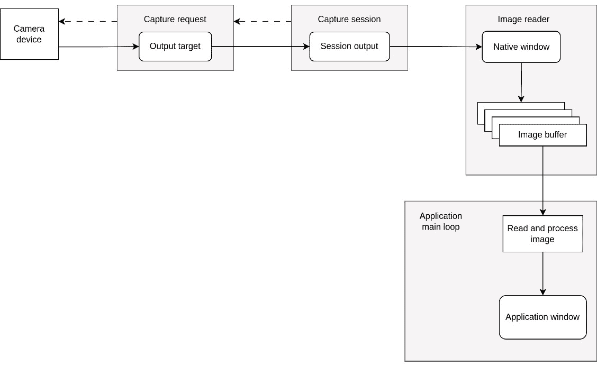
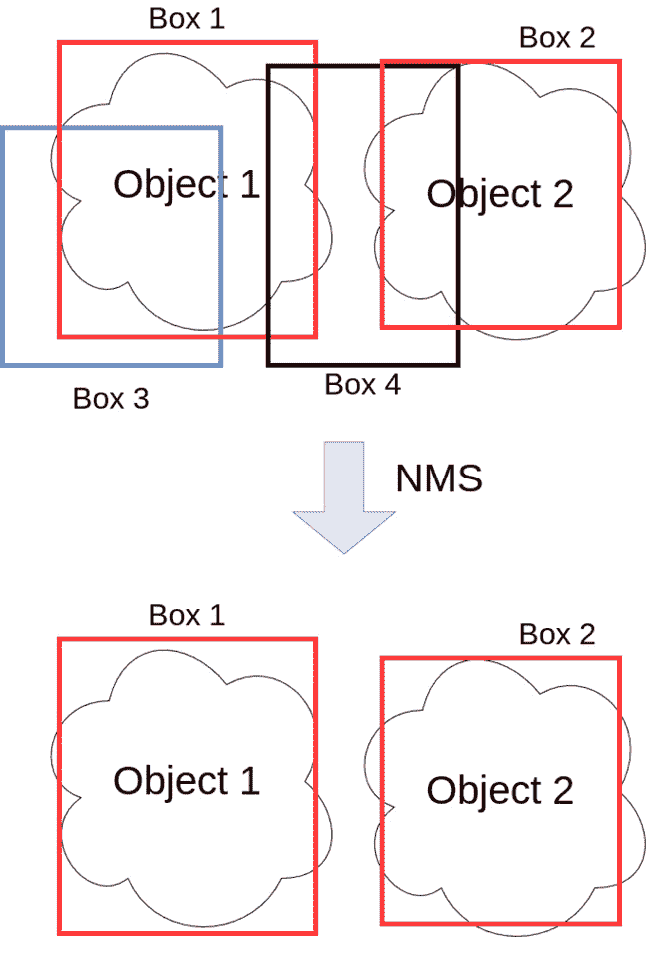
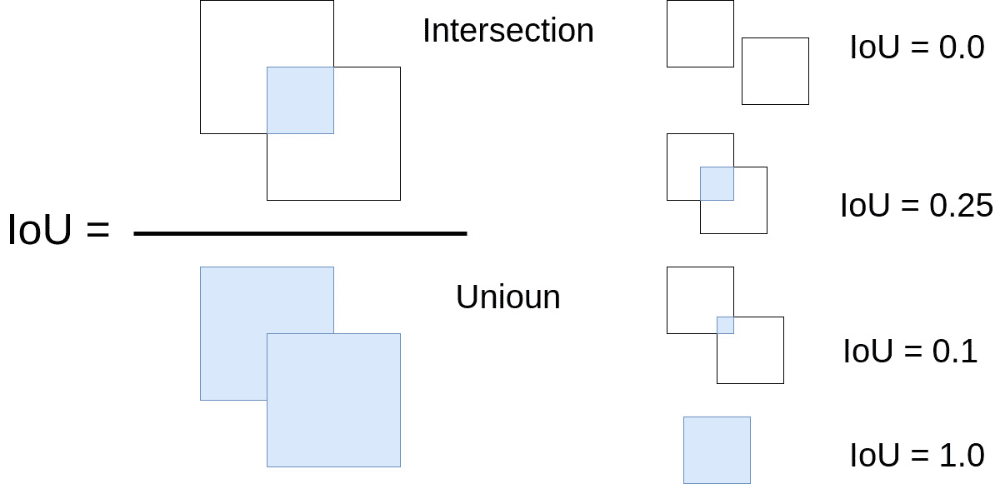
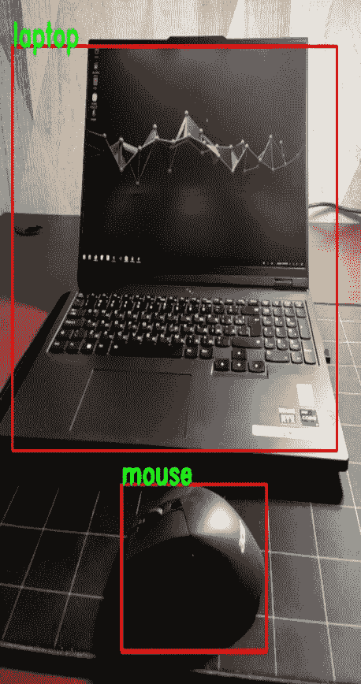

# 第十四章：在移动平台上部署模型

在本章中，我们将讨论在运行 Android 操作系统的移动设备上部署**机器学习**（**ML**）模型。机器学习可以用于改善移动设备上的用户体验，尤其是我们可以创建更多自主功能，使我们的设备能够学习和适应用户行为。例如，机器学习可用于图像识别，使设备能够识别照片和视频中的对象。此功能对于增强现实或照片编辑工具等应用程序可能很有用。此外，由机器学习驱动的语音识别可以使语音助手更好地理解和响应自然语言命令。自主功能开发的另一个重要好处是它们可以在没有互联网连接的情况下工作。这在连接有限或不稳定的情况下尤其有用，例如在偏远地区旅行或自然灾害期间。

在移动设备上使用 C++可以使我们编写更快速、更紧凑的程序。由于现代编译器可以针对目标 CPU 架构优化程序，我们可以利用尽可能多的计算资源。C++不使用额外的垃圾回收器进行内存管理，这可能会对程序性能产生重大影响。程序大小可以减小，因为 C++不使用额外的**虚拟机**（**VM**）并且直接编译成机器码。此外，使用 C++可以通过更精确的资源使用和相应调整来帮助优化电池寿命。这些事实使 C++成为资源有限的移动设备的正确选择，并且可以用于解决重计算任务。

到本章结束时，你将学习如何使用 PyTorch 和 YOLOv5 在 Android 移动平台上通过相机实现实时对象检测。但本章并非 Android 开发的全面介绍；相反，它可以作为在 Android 平台上进行机器学习和计算机视觉实验的起点。它提供了一个完整的、所需的最小项目示例，你可以根据你的任务对其进行扩展。

本章涵盖了以下主题：

+   创建 Android C++开发所需的最小项目

+   实现对象检测所需的最小 Kotlin 功能

+   在项目的 C++部分初始化图像捕获会话

+   使用 OpenCV 处理原生相机图像并绘制结果

+   使用 PyTorch 脚本在 Android 平台上启动 YOLOv5 模型

# 技术要求

以下为本章节的技术要求：

+   Android Studio，**Android 软件开发工具包**（**SDK**），以及 Android **本地开发** **工具包**（**NDK**）

+   PyTorch 库

+   支持 C++20 的现代 C++编译器

+   CMake 构建系统版本 >= 3.22

本章的代码文件可以在以下 GitHub 仓库中找到：[`github.com/PacktPublishing/Hands-On-Machine-Learning-with-C-Second-edition/tree/main/Chapter14`](https://github.com/PacktPublishing/Hands-On-Machine-Learning-with-C-Second-edition/tree/main/Chapter14)。

# 在 Android 上开发目标检测

关于如何将机器学习模型部署到 Android 移动设备上，有许多方法。我们可以使用 PyTorch、ExecuTorch、TensorFlow Lite、NCNN、ONNX Runtime 或其他工具。在本章中，我们将使用 PyTorch 框架，因为我们已经在之前的章节中讨论过它，并且因为它允许我们使用几乎任何 PyTorch 模型，同时功能限制最小。不幸的是，我们只能使用目标设备的 CPU 进行推理。其他框架，如 ExecuTorch、TensorFlow Lite、NCNN 和 ONNX Runtime，允许您使用其他推理后端，例如板载 GPU 或**神经处理单元**（**NPU**）。然而，这个选项也带来一个显著的限制，即缺少某些操作符或函数，这可能会限制可以在移动设备上部署的模型类型。动态形状支持通常有限，这使得处理不同维度的数据变得困难。

另一个挑战是受限的控制流，这限制了使用具有动态计算图和实现高级算法的模型的能力。这些限制可能会使得使用前面描述的框架在移动平台上部署机器学习模型变得更加困难。因此，当在移动设备上部署机器学习模型时，模型的功能和所需性能之间存在权衡。为了平衡功能和性能，开发者必须仔细评估他们的需求，并选择满足他们特定需求的框架。

## PyTorch 框架的移动版本

Maven 仓库中有一个名为`org.pytorch:pytorch_android_lite`的 PyTorch 移动设备二进制分发版。然而，这个分发版已经过时。因此，要使用最新版本，我们需要从源代码构建它。我们可以像编译其常规版本一样做，但需要额外的 CMake 参数来启用移动模式。您还必须安装 Android NDK，它包括适当的 C/C++编译器和构建应用程序所需的 Android 原生库。

安装 Android 开发工具最简单的方法是下载 Android Studio IDE，并使用该 IDE 中的 SDK Manager 工具。您可以在`cmdline-tools`包下找到 SDK Manager。然而，您需要在系统中安装 Java；对于 Ubuntu，您可以按照以下方式安装 Java：

```py
sudo apt install default-jre
```

以下命令行脚本展示了如何安装 CLI 开发所需的所有包：

```py
# make the folder where to install components
mkdir android
cd android
# download command line tools
wget https://dl.google.com/android/repository/commandlinetools-linux-9477386_latest.zip
# unzip them and move to the correct folder
unzip commandlinetools-linux-9477386_latest.zip
mv cmdline-tools latest
mkdir cmdline-tools
mv latest cmdline-tools
# install SDK, NDK and build tools for Android using sdkmanager utility
yes | ./cmdline-tools/latest/bin/sdkmanager --licenses
yes | ./cmdline-tools/latest/bin/sdkmanager "platform-tools"
yes | ./cmdline-tools/latest/bin/sdkmanager "platforms;android-35"
yes | ./cmdline-tools/latest/bin/sdkmanager "build-tools;35.0.0"
yes | ./cmdline-tools/latest/bin/sdkmanager "system-images;android-35;google_apis;arm64-v8a"
yes | ./cmdline-tools/latest/bin/sdkmanager --install "ndk;26.1.10909125"
```

在这里，我们使用了`sdkmanager`管理工具来安装所有所需的组件及其适当的版本。使用此脚本，NDK 的路径将如下所示：

```py
android/ndk/26.1.10909125/
```

安装了构建工具和 NDK 后，我们可以继续编译 PyTorch 移动版本。

以下代码片段展示了如何使用命令行环境检出 PyTorch 并构建它：

```py
cd /home/[USER]
git clone https://github.com/pytorch/pytorch.git
cd pytorch/
git checkout v2.3.1
git submodule update --init --recursive
export ANDROID_NDK=[Path to the installed NDK]
export ANDROID_ABI='arm64-v8a'
export ANDROID_STL_SHARED=1
$START_DIR/android/pytorch/scripts/build_android.sh \
-DBUILD_CAFFE2_MOBILE=OFF \
-DBUILD_SHARED_LIBS=ON \
-DUSE_VULKAN=OFF \
-DCMAKE_PREFIX_PATH=$(python -c 'from distutils.sysconfig import get_python_lib; print(get_python_lib())') \
-DPYTHON_EXECUTABLE=$(python -c 'import sys; print(sys.executable)') \
```

在这里，我们假设 `/home/[USER]` 是用户的家目录。构建 PyTorch 移动版本时的主要要求是声明 `ANDROID_NDK` 环境变量，它应该指向 Android NDK 安装目录。可以使用 `ANDROID_ABI` 环境变量来指定 `arm64-v8a` 架构。

我们使用了 PyTorch 源代码分发中的 `build_android.sh` 脚本来构建移动 PyTorch 二进制文件。这个脚本内部使用 CMake 命令，这就是为什么它需要将 CMake 参数定义作为参数。请注意，我们传递了 `BUILD_CAFFE2_MOBILE=OFF` 参数来禁用构建 `Caffe2` 的移动版本，因为当前版本中该库已被弃用，难以使用。我们使用的第二个重要参数是 `BUILD_SHARED_LIBS=ON`，这使我们能够构建共享库。我们还通过使用 `DUSE_VULKAN=OFF` 禁用了 Vulkan API 支持，因为它仍然是实验性的，并且存在一些编译问题。其他配置的参数是用于中间构建代码生成的 Python 安装路径。

现在我们已经有了移动 PyTorch 库，即 `libc10.so` 和 `libtorch.so`，我们可以开始开发应用程序了。我们将基于 YOLOv5 神经网络架构构建一个目标检测应用程序。

YOLOv5 是一种基于 **You Only Look Once** (**YOLO**) 架构的目标检测模型。它是一个最先进的深度学习模型，能够以高精度和速度在图像和视频中检测物体。该模型相对较小且轻量，便于在资源受限的设备上部署。此外，它足够快速，这对于需要分析实时视频流的实时应用来说非常重要。它是一个开源软件，这意味着开发者可以自由访问代码并根据他们的需求进行修改。

## 使用 TorchScript 进行模型快照

在本节中，我们将讨论如何获取 YOLOv5 模型的 TorchScript 文件，以便我们可以在我们的移动应用程序中使用它。在前面的章节中，我们讨论了如何保存和加载模型参数，以及如何使用 ONNX 格式在框架之间共享模型。当我们使用 PyTorch 框架时，我们还可以使用另一种方法在 Python API 和 C++ API 之间共享模型，称为 **TorchScript**。

此方法使用实时模型跟踪来获取一种特殊类型的模型定义，该定义可以由 PyTorch 引擎执行，不受 API 限制。在 PyTorch 中，只有 Python API 可以创建此类定义，但我们可以使用 C++ API 来加载模型并执行它。此外，PyTorch 框架的移动版本不允许我们使用功能齐全的 C++ API 来编程神经网络。然而，正如之前所说，TorchScript 允许我们导出和运行具有复杂控制流和动态形状的模型，这在目前对于 ONNX 和其他在其他移动框架中使用的格式来说是不完全可能的。

目前，YOLOv5 PyTorch 模型可以直接导出为 TorchScript，以便在移动 CPU 上进行推理。例如，有针对 TensorFlow Lite 和 NCNN 框架优化的 YOLOv5 模型，但我们将不讨论这些情况，因为我们主要使用 PyTorch。我必须说，使用 NCNN 将允许你通过 Vulkan API 使用移动 GPU，而使用 TensorFlow Lite 或 ONNX Runtime for Android 将允许你使用某些设备的移动 NPU。然而，你需要通过减少一些功能或使用 TensorFlow 进行开发来将模型转换为另一种格式。

因此，在这个例子中，我们将使用 TorchScript 模型来进行目标检测。为了获取 YOLOv5 模型，我们必须执行以下步骤：

1.  从 GitHub 克隆模型仓库并安装依赖项；在终端中运行以下命令：

    ```py
    git clone https://github.com/ultralytics/yolov5
    cd yolov5
    jit script of the model optimized for mobile:

    ```

    python export.py --weights yolov5s.torchscript --include torchscript --optimize

    ```py

    ```

第二步的脚本会自动跟踪模型并为我们保存 TorchScript 文件。在我们完成这些步骤后，将会有`yolo5s.torchscript`文件，我们将能够加载并在 C++中使用它。

现在，我们已经具备了所有先决条件，可以继续创建我们的 Android Studio 项目。

# Android Studio 项目

在本节中，我们将使用 Android Studio IDE 来创建我们的移动应用程序。我们可以使用默认的`objectdetection`并选择**Kotlin**作为编程语言，然后 Android Studio 将创建一个特定的项目结构；以下示例显示了其最有价值的部分：

```py
app
|--src
|  `--main
|    |--cpp
|    |  |—CmakeLists.txt
|    |  `—native-lib.cpp
|    |--java
|    |  `--com
|    |    `--example
|    |       `--objectdetection
|    |         `--MainActivity.kt
|    |--res
|    |  `--layout
|    |    `--activity_main.xml
|    |--values
|       |--colors.xml
|       |--strings.xml
|       |--styles.xml
|          `—…
|--build.gradle
`--...
```

`cpp`文件夹包含整个项目的 C++部分。在这个项目中，Android Studio IDE 将 C++部分创建为一个配置了 CMake 构建生成系统的本地共享库项目。`java`文件夹包含项目的 Kotlin 部分。在我们的案例中，它是一个定义主活动的单个文件——该活动用于将 UI 元素和事件处理器连接起来。`res`文件夹包含项目资源，例如 UI 元素和字符串定义。

我们还需要在`main`文件夹下创建一个名为`jniLibs`的文件夹，其结构如下：

```py
app
|--src
|  |--main
|  |--…
|  |--JniLibs
|     `--arm64-v8a
|        |--libc10.so
|        |--libtorch_cpu.so
|        |--libtorch_global_deps.so
|        `—libtorch.so
`...
```

Android Studio 要求我们将额外的本地库放置在这样的文件夹中，以便正确地将它们打包到最终应用程序中。它还允许`arm64-v8a`文件夹，因为它们只编译了这种 CPU 架构。如果您有其他架构的库，您必须创建具有相应名称的文件夹。

此外，在上一小节中，我们学习了如何获取 YOLOv5 torch 脚本模型。模型文件及其对应文件，以及类 ID，应放置在`assets`文件夹中。此文件夹应创建在`JniLibs`文件夹旁边，处于同一文件夹级别，如下所示：

```py
app
|--src
|  `--main
|     |--...
|     |--cpp
|     |--JniLibs
|     |--assests
|     |  |--yolov5.torchscript
|     |  `--classes.txt
|     `—...
`...
```

将字符串类名称映射到模型返回的数值 ID 的文件可以从[`github.com/ultralytics/yolov5/blob/master/data/coco.yaml`](https://github.com/ultralytics/yolov5/blob/master/data/coco.yaml)下载。

在我们的示例中，我们简单地将 YAML 文件转换为文本文件，以简化其解析。

该 IDE 使用 Gradle 构建系统进行项目配置，因此有两个名为`build.gradle.kts`的文件，一个用于应用程序模块，另一个用于项目属性。查看我们示例中的应用程序模块的`build.gradle`文件。有两个变量定义了 PyTorch 源代码文件夹和 OpenCV Android SDK 文件夹的路径。如果您更改这些路径，则需要更新它们的值。预构建的 OpenCV Android SDK 可以从官方 GitHub 仓库([`github.com/opencv/opencv/releases`](https://github.com/opencv/opencv/releases))下载，并直接解压。

## 项目的 Kotlin 部分

在这个项目中，我们将使用本地的 C++部分来绘制捕获的图片，并带有检测到的对象的边界框和类标签。因此，Kotlin 部分将没有 UI 代码和声明。然而，Kotlin 部分将用于请求和检查所需的相机访问权限。如果权限被授予，它还将启动相机捕获会话。所有 Kotlin 代码都将位于`MainActivity.kt`文件中。

### 保留相机方向

在我们的项目中，我们跳过了设备旋转处理的实现，以使代码更简单，并仅展示与目标检测模型一起工作的最有趣的部分。因此，为了使我们的代码稳定，我们必须禁用横屏模式，这可以在`AndroidManifest.xml`文件中完成，如下所示：

```py
…
<activity
    …
    android:screenOrientation="portrait">
…
```

我们将屏幕方向指令添加到活动实体中。这不是一个好的解决方案，因为有些设备只能在横屏模式下工作，我们的应用程序将无法与它们一起工作。在实际的生产型应用程序中，您应该处理不同的方向模式；例如，对于大多数智能手机，这种脏解决方案应该可以工作。

### 处理相机权限请求

在 Android NDK 中没有 C++ API 来请求权限。我们只能从 Java/Kotlin 侧或通过 JNI 从 C++请求所需的权限。编写 Kotlin 代码请求相机权限比编写 JNI 调用要简单。

第一步是修改`MainActivity`类的声明，以便能够处理权限请求结果。如下所示完成：

```py
class MainActivity
    : NativeActivity(),
      ActivityCompat.OnRequestPermissionsResultCallback {
  …
}
```

在这里，我们继承了`MainActivity`类自`OnRequestPermissionsResultCallback`接口。这给了我们重写`onRequestPermissionsResult`方法的可能性，在那里我们将能够检查结果。然而，要获取结果，我们必须首先发出请求，如下所示：

```py
override fun onResume() {
  super.onResume() val cameraPermission =
      android.Manifest.permission
          .CAMERA if (checkSelfPermission(
                          cameraPermission) !=
                      PackageManager.PERMISSION_GRANTED) {
    requestPermissions(arrayOf(cameraPermission),
                       CAM_PERMISSION_CODE)
  }
  else {
    val camId =
        getCameraBackCameraId() if (camId.isEmpty()){
            Toast
                .makeText(
                    this,
                    "Camera probably won't work on this
                    device !",
                    Toast.LENGTH_LONG)
                .show() finish()} initObjectDetection(camId)
  }
}
```

我们重写了`Activity`类的`onResume`方法。此方法在每次我们的应用程序开始工作或从后台恢复时都会被调用。我们使用所需的相机权限常量值初始化了`cameraPermission`变量。然后，我们使用`checkSelfPermission`方法检查我们是否已经授予了此权限。如果没有相机权限，我们使用`requestPermissions`方法请求它。

注意，我们在回调方法中使用了`CAM_PERMISSION_CODE`代码来识别我们的请求。如果我们被授予访问相机的权限，我们尝试获取背面相机的 ID 并为该相机初始化对象检测管道。如果我们无法访问相机，我们使用`finish`方法和相应的消息结束 Android 活动。在`onRequestPermissionsResult`方法中，我们检查是否已授予所需的权限，如下所示：

```py
override fun onRequestPermissionsResult(requestCode
                                        : Int, permissions
                                        : Array<out String>,
                                          grantResults
                                        : IntArray) {
  super.onRequestPermissionsResult(requestCode,
                                   permissions,
                                   grantResults)
    if (requestCode == CAM_PERMISSION_CODE &&
      grantResults[0] != PackageManager.PERMISSION_GRANTED)
    {
       Toast.makeText(this,
                     "This app requires camera permission",
                     Toast.LENGTH_SHORT).show()
                     finish()
    }
}
```

首先，我们调用了父方法以保留标准应用程序行为。然后，我们检查了权限识别代码`CAM_PERMISSION_CODE`以及权限是否被授予。在失败情况下，我们只显示错误消息并结束 Android 活动。

如我们之前所说，在成功的情况下，我们寻找背面相机的 ID，如下所示：

```py
private fun getCameraBackCameraId(): String {
  val camManager = getSystemService(
      Context.CAMERA_SERVICE)as CameraManager
  for (camId in camManager.cameraIdList) {
      val characteristics =
          camManager.getCameraCharacteristics(camId)
      val hwLevel = characteristics.get(
     CameraCharacteristics.INFO_SUPPORTED_HARDWARE_LEVEL)
      val facing = characteristics.get(
          CameraCharacteristics.LENS_FACING)
      if (hwLevel != INFO_SUPPORTED_HARDWARE_LEVEL_LEGACY &&
          facing == LENS_FACING_BACK) {
              return camId
      }
  }
  return ""
}
```

我们获取了`CameraManager`对象的实例，并使用此对象遍历设备上的每个相机。对于每个相机对象，我们询问其特征、支持的硬件级别以及该相机面向的方向。如果一个相机是常规的遗留设备并且面向背面，我们返回其 ID。如果我们没有找到合适的设备，我们返回一个空字符串。

在授予相机访问权限和相机 ID 之后，我们调用了`initObjectDetection`函数来开始图像捕获和对象检测。这个函数和`stopObjectDetection`函数是通过 JNI 从 C++部分提供给 Kotlin 部分的函数。`stopObjectDetection`函数用于停止相机捕获会话，如下所示：

```py
override fun onPause() {
  super.onPause()
  stopObjectDetection()
}
```

在重写的`onPause`活动方法中，我们只是停止了相机捕获会话。此方法在每次 Android 应用程序关闭或进入后台时都会被调用。

### 原生库加载

有两个方法，`initObjectDetection`和`stopObjectDetection`，它们是 JNI 调用原生库中用 C++实现的函数。为了将原生库与 Java 或 Kotlin 代码连接起来，我们使用 JNI。这是一个标准的机制，用于从 Kotlin 或 Java 调用 C/C++函数。

首先，我们必须使用`System.LoadLibrary`调用加载原生库，并将其放置在我们活动的伴随对象中。然后，我们必须通过将它们声明为`external`来定义原生库中实现的方法。以下代码片段展示了如何在 Kotlin 中定义这些方法：

```py
private external fun initObjectDetection(camId: String)
private external fun stopObjectDetection()
companion object {
  init {
      System.loadLibrary("object-detection")
  }
}
```

这样的声明允许 Kotlin 找到相应的原生库二进制文件，加载它，并访问函数。JNI 通过提供一组 API 来实现，允许 Java 代码调用原生代码，反之亦然。JNI API 由一组可以从 Java 或原生代码调用的函数组成。这些函数允许你执行诸如从原生代码创建和访问 Java 对象、从原生代码调用 Java 方法以及从 Java 访问原生数据结构等任务。

内部，JNI 通过将 Java 对象和类型映射到它们的对应原生版本来工作。这种映射是通过`JNIEnv`接口完成的，它提供了访问`JNIEnv`的方法，用于查找相应的原生方法并传递必要的参数。同样，当原生方法返回一个值时，使用`JNIEnv`将原生值转换为 Java 对象。JVM 管理 Java 和原生对象内存。然而，原生代码必须显式地分配和释放自己的内存。JNI 提供了分配和释放内存的函数，以及用于在 Java 和原生内存之间复制数据的函数。JNI 代码必须是线程安全的。这意味着任何由 JNI 访问的数据都必须正确同步，以避免竞争条件。使用 JNI 可能会有性能影响。原生代码通常比 Java 代码快，但通过 JNI 调用原生代码会有开销。

在下一节中，我们将讨论项目的 C++部分。

## 项目的原生 C++部分

本示例项目的主要功能是在原生 C++部分实现的。它旨在使用 OpenCV 库处理摄像头图像，并使用 PyTorch 框架进行目标检测模型推理。这种做法允许你在需要时将此解决方案移植到其他平台，并允许你使用标准桌面工具，如 OpenCV 和 PyTorch，来开发和调试将在移动平台上使用的算法。

本项目中主要有两个 C++类。`Detector`类是应用程序外观，它实现了与 Android 活动图像捕获管道的连接，并将对象检测委托给第二个类`YOLO`。`YOLO`类实现了对象检测模型的加载及其推理。

下面的子节将描述这些类的实现细节。

### 使用 JNI 初始化对象检测

我们通过讨论 JNI 函数声明结束了 Kotlin 部分的讨论。`initObjectDetection` 和 `stopObjectDetection` 的相应 C++ 实现在 `native-lib.cpp` 文件中。此文件由 Android Studio IDE 自动创建，用于原生活动项目。以下代码片段展示了 `initObjectDetection` 函数的定义：

```py
#include <jni.h>
...
std::shared_ptr<ObjectDetector> object_detector_;
extern "C" JNIEXPORT void JNICALL
Java_com_example_objectdetection_MainActivity_initObjectDetection(
    JNIEnv* env,
    jobject /* this */,
    jstring camId) {
  auto camera_id = env->GetStringUTFChars(camId, nullptr);

LOGI("Camera ID: %s", camera_id);
  if (object_detector_) {
    object_detector_->allow_camera_session(camera_id);
    object_detector_->configure_resources();
  } else
    LOGE("Object Detector object is missed!");
}
```

我们遵循 JNI 规则，使函数声明正确且在 Java/Kotlin 部分可见。函数名称包括完整的 Java 包名，包括命名空间，我们前两个必需的参数是 `JNIEnv*` 和 `jobject` 类型。第三个参数是字符串，对应于相机 ID；这是在函数的 Kotlin 声明中存在的参数。

在函数实现中，我们检查 `ObjectDetector` 对象是否已经实例化，如果是这样，我们使用相机 ID 调用 `allow_camera_session` 方法，然后调用 `configure_resources` 方法。这些调用使 `ObjectDetector` 对象记住要使用哪个相机以及初始化，配置输出窗口，并初始化图像捕获管道。

在 Kotlin 部分我们使用的第二个函数是 `stopObjectDetection`，其实现如下：

```py
extern "C" JNIEXPORT void JNICALL
Java_com_example_objectdetection_MainActivity_stopObjectDetection(
    JNIEnv*,
    jobject /* this */) {
  if (object_detector_) {
    object_detector_->release_resources();
  } else
    LOGE("Object Detector object is missed!");
}
```

在这里，我们只是释放了用于图像捕获管道的资源，因为当应用程序挂起时，对相机设备的访问被阻止。当应用程序再次激活时，`initObjectDetection` 函数将被调用，图像捕获管道将重新初始化。

您可以看到我们使用了 `LOGI` 和 `LOGE` 函数，其定义如下：

```py
#include <android/log.h>
#define LOG_TAG "OBJECT-DETECTION"
#define LOGI(...) __android_log_print(ANDROID_LOG_INFO,
                                      LOG_TAG, __VA_ARGS__)
#define LOGW(...) __android_log_print(ANDROID_LOG_WARN,
                                      LOG_TAG, __VA_ARGS__)
#define LOGE(...) __android_log_print(ANDROID_LOG_ERROR,
                                      LOG_TAG, __VA_ARGS__)
#define ASSERT(cond, fmt, ...)                                \
  if (!(cond))
  {                                              \
     __android_log_assert(#cond, LOG_TAG, fmt, ##__VA_ARGS__); \
  }
```

我们定义了这些函数，以便更容易地将消息记录到 Android 的 `logcat` 子系统中。这一系列函数使用相同的标签进行记录，并且比原始的 `__android_log_xxx` 函数具有更少的参数。此外，日志级别被编码在函数名称中。

### 主应用程序循环

此项目将使用 Native App Glue 库。这是一个帮助 Android 开发者创建原生应用的库。它提供了一个抽象层，在 Java 代码和原生代码之间，使得使用这两种语言开发应用程序变得更加容易。

使用这个库，我们可以拥有一个带有循环的标准 `main` 函数，该循环持续运行，更新 UI，处理用户输入，并响应系统事件。以下代码片段展示了我们如何在 `native-lib.cpp` 文件中实现 `main` 函数：

```py
extern "C" void android_main(struct android_app* app) {
  LOGI("Native entry point");
  object_detector_ = std::make_shared<ObjectDetector>(app);
  app->onAppCmd = ProcessAndroidCmd;
  while (!app->destroyRequested) {
    struct android_poll_source* source = nullptr;
    auto result = ALooper_pollOnce(0, nullptr, nullptr,
                                   (void**)&source);
    ASSERT(result != ALOOPER_POLL_ERROR,
           "ALooper_pollOnce returned an error");
    if (source != nullptr) {
      source->process(app, source);
    }
    if (object_detector_)
      object_detector_->draw_frame();
  }
  object_detector_.reset();
}
```

`android_main` 函数接收 `android_app` 类型的实例，而不是常规的 `argc` 和 `argv` 参数。`android_app` 是一个 C++ 类，它提供了对 Android 框架的访问权限，并允许你与系统服务进行交互。此外，你可以使用它来访问设备硬件，例如传感器和摄像头。

`android_main` 主函数是我们本地模块的起点。因此，我们在这里初始化了全局的 `object_detector_` 对象，使其对 `initObjectDetection` 和 `stopObjectDetection` 函数可用。对于初始化，`ObjectDetector` 实例接收 `android_app` 对象的指针。

然后，我们将命令处理函数附加到 Android 应用程序对象上。最后，我们启动了主循环，它一直工作到应用程序被销毁（关闭）。在这个循环中，我们使用 `ALooper_pollOnce` Android NDK 函数获取到命令（事件）轮询对象的指针。

我们调用了该对象的 `process` 方法，通过 `app` 对象将当前命令派发到我们的 `ProcessAndroidCmd` 函数。在循环结束时，我们使用我们的目标检测器对象抓取当前摄像头图像，并在 `draw_frame` 方法中对其进行处理。

`ProcessAndroidCmd` 函数的实现如下：

```py
 static void ProcessAndroidCmd(struct android_app* /*app*/,
                              int32_t cmd) {
  if (object_detector_) {
  switch (cmd) {
    case APP_CMD_INIT_WINDOW:
      object_detector_->configure_resources();
      break;
    case APP_CMD_TERM_WINDOW:
      object_detector_->release_resources();
      break;
  }
}
```

在这里，我们只处理了两个与应用程序窗口初始化和终止相对应的命令。我们使用它们在目标检测器中初始化和清除图像捕获管道。当窗口创建时，我们根据捕获分辨率配置其尺寸。窗口终止命令允许我们清除捕获资源，以防止访问已阻塞的摄像头设备。

这就是关于 `native-lib.cpp` 文件的所有信息。接下来的小节将探讨 `ObjectDetector` 类的实现细节。

### `ObjectDetector` 类概述

这是应用程序整个目标检测管道的主界面。以下列表显示了它所实现的功能项：

+   摄像头设备访问管理

+   应用程序窗口尺寸配置

+   图像捕获管道管理

+   将摄像头图像转换为 OpenCV 矩阵对象

+   将对象检测结果绘制到应用程序窗口中

+   将对象检测委托给 YOLO 推理对象

在我们开始查看这些项目细节之前，让我们看看构造函数、析构函数和一些辅助方法的实现。构造函数的实现如下：

```py
ObjectDetector::ObjectDetector(android_app *app) : android_app_(app) {
  yolo_ = std::make_shared<YOLO>(app->activity->assetManager);
}
```

我们只是保存了 `android_app` 对象的指针，并创建了 `YOLO` 类推理对象。此外，我们使用 `android_app` 对象获取到 `AssetManager` 对象的指针，该对象用于加载打包到 **Android 应用程序包**（**APK**）中的文件。析构函数的实现如下：

```py
ObjectDetector::~ObjectDetector() {
  release_resources();
  LOGI("Object Detector was destroyed!");
}
void ObjectDetector::release_resources() {
  delete_camera();
  delete_image_reader();
  delete_session();
}
```

我们调用了`release_resources`方法，这是关闭已打开的相机设备和清除捕获管道对象的地方。以下代码片段显示了通过`initObjectDetection`函数从 Kotlin 部分使用的方法：

```py
void ObjectDetector::allow_camera_session(std::string_view camera_id) {
  camera_id_ = camera_id;
}
```

在`allow_camera_session`中，我们保存了相机 ID 字符串；具有此 ID 的设备将在`configure_resources`方法中打开。正如我们所知，只有当所需的权限被授予且 Android 设备上有后置摄像头时，相机 ID 才会传递给`ObjectDetector`。因此，我们定义了`is_session_allowed`如下：

```py
bool ObjectDetector::is_session_allowed() const {
  return !camera_id_.empty();
}
```

这里，我们只是检查了相机 ID 是否不为空。

以下小节将详细展示主要功能项。

### 相机设备和应用程序窗口配置

在`ObjectDetection`类中有一个名为`create_camera`的方法，它实现了创建相机管理器对象和打开相机设备，如下所示：

```py
void ObjectDetector::create_camera() {
  camera_mgr_ = ACameraManager_create();
  ASSERT(camera_mgr_, "Failed to create Camera Manager");
  ACameraManager_openCamera(camera_mgr_, camera_id_.c_str(),
                            &camera_device_callbacks,
                            &camera_device_);
  ASSERT(camera_device_, "Failed to open camera");
}
```

`camera_mgr_`是`ObjectDetector`成员变量，初始化后用于打开相机设备。打开的相机设备的指针将存储在`camera_device_`成员变量中。注意，我们使用相机 ID 字符串打开特定设备。`camera_device_callbacks`变量定义如下：

```py
namespace {
void onDisconnected(
    [[maybe_unused]] void* context,
    [[maybe_unused]] ACameraDevice* device) {
  LOGI("Camera onDisconnected");
}
void onError([[maybe_unused]] void* context,
             [[maybe_unused]] ACameraDevice* device,
             int error) {
  LOGE("Camera error %d", error);
}
ACameraDevice_stateCallbacks camera_device_callbacks = {
    .context = nullptr,
    .onDisconnected = onDisconnected,
    .onError = onError,
};
}  // namespace
```

我们定义了带有指向函数引用的`ACameraDevice_stateCallbacks`结构对象，这些函数简单地报告相机是否已打开或关闭。在其他应用程序中，这些处理程序可以执行一些更有用的操作，但由于 API 要求，我们无法用空值初始化它们。

`create_camera`方法在`ObjectDetection`类的`configure_resources`方法中被调用。每次应用程序激活时都会调用此方法，其实现如下：

```py
void ObjectDetector::configure_resources() {
  if (!is_session_allowed() || !android_app_ ||
      !android_app_->window) {
          LOGE("Can't configure output window!");
      return;
  }
  if (!camera_device_)
      create_camera();
  // configure output window size and format
  ...
  if (!image_reader_ && !session_output_) {
      create_image_reader();
      create_session();
  }
}
```

在开始时，我们检查了所有必需的资源：相机 ID、`android_app`对象，以及该对象是否指向应用程序窗口。然后，我们创建了一个相机管理器对象并打开了一个相机设备。使用相机管理器，我们获取了相机传感器的方向以配置应用程序窗口的适当宽度和高度。此外，使用图像捕获宽度和高度值，我们配置了窗口尺寸，如下所示：

```py
ACameraMetadata *metadata_obj{nullptr};
ACameraManager_getCameraCharacteristics(camera_mgr_,
                                        camera_id_.c_str(),
                                        &metadata_obj);
ACameraMetadata_const_entry entry;
ACameraMetadata_getConstEntry(metadata_obj,
                              ACAMERA_SENSOR_ ORIENTATION,
                              &entry);
orientation_ = entry.data.i32[0];
bool is_horizontal = orientation_ == 0 || orientation_ == 270;
auto out_width = is_horizontal ? width_ : height_;
auto out_height = is_horizontal ? height_ : width_;
ANativeWindow_setBuffersGeometry(android_app_->window,
                                 out_width,
                                 out_height,
                                 WINDOW_FORMAT_RGBA_8888);
```

这里，我们使用了`ACameraManager_getCameraCharacteristics`函数来获取相机元数据特性对象。然后，我们使用`ACameraMetadata_getConstEntry`函数读取`ACAMERA_SENSOR_ORIENTATION`属性。之后，我们根据使用的方向，基于`ANativeWindow_setBuffersGeometry`函数选择适当的宽度和高度顺序，以设置应用程序输出窗口尺寸和渲染缓冲区格式。

我们设置的格式是竖屏模式下的`32`位`800`像素高度和`600`像素宽度。这种方向处理非常简单，只需正确处理输出窗口缓冲区即可。之前，我们已禁用了应用中的横屏模式，因此我们将忽略相机传感器的方向在相机图像解码中的使用。

在`configure_resources`方法结束时，我们创建了相机读取器对象并初始化了捕获管道。

### 图像捕获管道构建

之前，我们看到在捕获管道初始化之前，我们创建了图像读取器对象。这是在`create_image_reader`方法中完成的，如下所示：

```py
void ObjectDetector::create_image_reader() {
  constexpr int32_t MAX_BUF_COUNT = 4;
  auto status = AImageReader_new(
      width_, height_, AIMAGE_FORMAT_YUV_420_888,
      MAX_BUF_COUNT, &image_reader_);
  ASSERT(image_reader_ && status == AMEDIA_OK,
         "Failed to create AImageReader");
}
```

我们使用`AImageReader_new`创建了一个具有特定宽度和高度、YUV 格式和四个图像缓冲区的`AImageReader`对象。我们使用的宽度和高度值与输出窗口尺寸配置中使用的相同。我们使用 YUV 格式，因为它是最多相机设备的原生图像格式。使用四个图像缓冲区是为了使图像捕获稍微独立于它们的处理。这意味着当我们在读取另一个缓冲区并处理它时，图像读取器将用相机数据填充一个图像缓冲区。

捕获会话初始化是一个复杂的过程，需要创建几个对象并将它们相互连接。`create_session`方法如下实现：

```py
void ObjectDetector::create_session() {
  ANativeWindow* output_ native_window;
  AImageReader_getWindow(image_reader_,
                         &output_ native_window);
  ANativeWindow_acquire(output_native_window);
  ACaptureSessionOutputContainer_create(&output_container_);
  ACaptureSessionOutput_create(output_native_window,
                               &session_ output_);
  ACaptureSessionOutputContainer_add(output_container_,
                                     session_output_);
  ACameraOutputTarget_create(output_native_window,
                             &output_target_);
  ACameraDevice_createCaptureRequest(
      camera_ device_, TEMPLATE_PREVIEW, &capture_request_);
  ACaptureRequest_ addTarget(capture_request_,
                             output_target_);
  ACameraDevice_createCaptureSession(camera_device_,
                                     output_container_,
                                     &session_callbacks,
                                     &capture_session_);
  // Start capturing continuously
  ACameraCaptureSession_setRepeatingRequest(capture_session_,
                                            nullptr,
                                            1,
                                            &capture_request_,
                                            nullptr);
}
```

我们从图像读取器对象中获取并获取了一个原生窗口。窗口获取意味着我们获取了窗口的引用，系统不应删除它。这个图像读取器窗口将被用作捕获管道的输出，因此相机图像将被绘制到其中。

然后，我们创建了会话输出对象和会话输出的容器。会话可以有几个输出，它们应该放入一个容器中。每个会话输出都是一个具体表面或窗口输出的连接对象；在我们的情况下，它是图像读取器窗口。

在配置了会话输出后，我们创建了捕获请求对象，并确保其输出目标是图像读取窗口。我们为打开的相机设备配置了捕获请求，并设置了预览模式。之后，我们实例化了捕获会话对象，并将其指向打开的相机设备，该设备包含我们之前创建的输出容器。

最后，我们通过设置会话的重复请求来开始捕获。会话与捕获请求之间的关系如下：我们创建了一个配置了可能输出列表的捕获会话，捕获请求指定了实际将使用的表面。可能有多个捕获请求和多个输出。在我们的情况下，我们有一个单一的捕获请求和一个单一的输出，它将连续重复。因此，总的来说，我们将像视频流一样捕获摄像头的实时图片。以下图片显示了捕获会话中图像数据流的逻辑方案：



图 14.1 – 捕获会话中的逻辑数据流

这不是实际的数据流方案，而是逻辑方案，显示了捕获会话对象是如何连接的。虚线表示请求路径，实线表示逻辑图像数据路径。

### 捕获图像和输出窗口缓冲区管理

当我们讨论主应用程序循环时，我们提到了`draw_frame`方法，该方法在处理命令后在此循环中被调用。此方法用于从图像读取对象中获取捕获的图像，然后检测其上的对象并在应用程序窗口中绘制检测结果。以下代码片段显示了`draw_frame`方法实现：

```py
void ObjectDetector::draw_frame() {
  if (image_reader_ == nullptr)
      return;
  AImage *image = nullptr;
  auto status = AImageReader_acquireNextImage(image_reader_, &image);

  if (status != AMEDIA_OK) {
      return;
  }
ANativeWindow_acquire(android_app_->window);
ANativeWindow_Buffer buf;
if (ANativeWindow_lock(android_app_->window,
                       &buf,
                       nullptr) < 0) {
  AImage_delete(image);
  return;
}
    process_image(&buf, image);
    AImage_delete(image);
    ANativeWindow_unlockAndPost(android_app_->window);
    ANativeWindow_release(android_app_->window);
}
```

我们获取了图像读取对象接收到的下一张图像。记住我们初始化了它以拥有四个图像缓冲区。因此，我们在主循环中逐个从这些缓冲区获取图像，同时我们处理一张图像时，捕获会话会填充另一个已经处理过的图像。这是以循环方式完成的。拥有来自摄像头的图像，我们获取并锁定应用程序窗口，但如果锁定失败，我们删除当前图像引用，停止处理，并进入主循环的下一个迭代。否则，如果我们成功锁定应用程序窗口，我们处理当前图像，检测其上的对象，并将检测结果绘制到应用程序窗口中——这是在`process_image`方法中完成的。此方法接受`AImage`和`ANativeWindow_Buffer`对象。

当我们锁定应用程序窗口时，我们获得用于绘制的内部缓冲区的指针。在处理图像并绘制结果后，我们解锁应用程序窗口以使其缓冲区可供系统使用，释放对窗口的引用，并删除对图像对象的引用。因此，这种方法主要关于资源管理，而真正的图像处理是在`process_image`方法中完成的，我们将在下一小节中讨论。

### 捕获图像处理

`process_image`方法实现了以下任务：

1.  将 Android YUV 图像数据转换为 OpenCV 矩阵。

1.  将图像矩阵调度到 YOLO 对象检测器。

1.  将检测结果绘制到 OpenCV 矩阵中。

1.  将 OpenCV 结果矩阵复制到 RGB（红色、蓝色、绿色）窗口缓冲区。

让我们逐一查看这些任务的实现。`process_image` 方法的签名如下所示：

```py
void ObjectDetector::process_image(
    ANativeWindow_Buffer* buf,
    AImage* image);
```

此方法接受用于结果绘制的应用程序窗口缓冲区对象和用于实际处理的图像对象。为了能够处理图像，我们必须将其转换为某种适当的数据结构格式；在我们的情况下，这就是 OpenCV 矩阵。我们首先检查图像格式属性，如下所示：

```py
int32_t src_format = -1;
AImage_getFormat(image, &src_format);
ASSERT(AIMAGE_FORMAT_YUV_420_888 == src_format,
       "Unsupported image format for displaying");
int32_t num_src_planes = 0;
AImage_getNumberOfPlanes(image, &num_src_planes);
ASSERT(num_src_planes == 3,
      "Image for display has unsupported number of planes");
int32_t src_height;
AImage_getHeight(image, &src_height);
int32_t src_width;
AImage_getWidth(image, &src_width);
```

我们检查了图像格式为 YUV（亮度（Y）、蓝色亮度（U）和红色亮度（V）），并且图像有三个平面，因此我们可以继续其转换。然后，我们获得了图像尺寸，这些尺寸将在以后使用。之后，我们验证了从 YUV 平面数据中提取的输入数据，如下所示：

```py
int32_t y_stride{0};
AImage_getPlaneRowStride(image, 0, &y_stride);
int32_t uv_stride1{0};
AImage_getPlaneRowStride(image, 1, &uv_stride1);
int32_t uv_stride2{0};
AImage_getPlaneRowStride(image, 1, &uv_stride2);
uint8_t *y_pixel{nullptr}, *uv_pixel1{nullptr}, *uv_pixel2{nullptr};
int32_t y_len{0}, uv_len1{0}, uv_len2{0};
AImage_getPlaneData(image, 0, &y_pixel, &y_len);
AImage_getPlaneData(image, 1, &uv_pixel1, &uv_len1);
AImage_getPlaneData(image, 2, &uv_pixel2, &uv_len2);
```

我们获得了步长、数据大小以及实际 YUV 平面数据的指针。在此格式中，图像数据分为三个组件：亮度（`y`），表示亮度，以及两个色度组件（`u` 和 `v`），它们表示颜色信息。`y` 成分通常以全分辨率存储，而 `u` 和 `v` 成分可能被子采样。这允许更有效地存储和传输视频数据。Android YUV 图像使用 `u` 和 `v` 的半分辨率。步长将使我们能够正确访问平面缓冲区中的行数据；这些步长取决于图像分辨率和数据内存布局。

拥有 YUV 平面数据及其步长和长度后，我们将它们转换为 OpenCV 矩阵对象，如下所示：

```py
cv::Size actual_size(src_width, src_height);
cv::Size half_size(src_width / 2, src_height / 2);
cv::Mat y(actual_size, CV_8UC1, y_pixel, y_stride);
cv::Mat uv1(half_size, CV_8UC2, uv_pixel1, uv_stride1);
cv::Mat uv2(half_size, CV_8UC2, uv_pixel2, uv_stride2);
```

我们创建了两个 `cv::Size` 对象来存储 Y 平面的原始图像大小以及 `u` 和 `v` 平面的半大小。然后，我们使用这些大小、数据指针和步长为每个平面创建一个 OpenCV 矩阵。我们没有将实际数据复制到 OpenCV 矩阵对象中；它们将使用传递给初始化的数据指针。这种视图创建方法节省了内存和计算资源。`y`-平面矩阵具有 8 位单通道类型，而 `u` 和 `v` 矩阵具有 8 位双通道类型。我们可以使用这些矩阵与 OpenCV 的 `cvtColorTwoPlane` 函数将它们转换为 RGBA 格式，如下所示：

```py
cv::mat rgba_img_;
...
long addr_diff = uv2.data - uv1.data;
if (addr_diff > 0) {
  cvtColorTwoPlane(y, uv1, rgba_img_, cv::COLOR_YUV2RGBA_NV12);
} else {
  cvtColorTwoPlane(y, uv2, rgba_img_, cv::COLOR_YUV2RGBA_NV21);
}
```

我们使用地址差异来确定 `u` 和 `v` 平面的顺序：正差异表示 NV12 格式，而负差异表示 NV21 格式。`NV12` 和 `NV21` 是 YUV 格式的类型，它们在色度平面中 `u` 和 `v` 成分的顺序上有所不同。在 `NV12` 中，`u` 成分先于 `v` 成分，而在 `NV21` 中则相反。这种平面顺序在内存消耗和图像处理性能中发挥作用，因此选择使用哪种格式取决于实际任务和项目。此外，格式可能取决于实际的相机设备，这就是我们添加此检测的原因。

`cvtColorTwoPlane`函数接受`y`平面和`uv`平面矩阵作为输入参数，并将 RGBA 图像矩阵输出到`rgba_img_`变量中。最后一个参数是告诉函数它应该执行什么实际转换的标志。现在，这个函数只能将 YUV 格式转换为 RGB 或 RGBA 格式。

正如我们之前所说的，我们的应用程序仅在纵向模式下工作，但为了使图像看起来正常，我们需要将其旋转如下：

```py
cv::rotate(rgba_img_, rgba_img_, cv::ROTATE_90_CLOCKWISE);
```

即使我们的方向已经固定，Android 相机传感器返回的图像仍然是旋转的，所以我们使用了`cv::rotate`函数使其看起来是垂直的。

准备好 RGBA 图像后，我们将其传递给`YOLO`对象检测器，并获取检测结果。对于每个结果项，我们在已经用于检测的图像矩阵上绘制矩形和标签。这些步骤的实现方式如下：

```py
auto results = yolo_->detect(rgba_img_);
for (auto& result : results) {
  int thickness = 2;
  rectangle(rgba_img_, result.rect.tl(), result.rect.br(),
            cv::Scalar(255, 0, 0, 255), thickness,
            cv::LINE_4);
  cv::putText(rgba_ img_, result.class_name,
              result.rect.tl(), cv::FONT_HERSHEY_DUPLEX,
              1.0, CV_RGB(0, 255, 0), 2);
}
```

我们调用了`YOLO`对象的`detect`方法，并获取了`results`容器。这个方法将在稍后讨论。然后，对于容器中的每个项，我们为检测到的对象绘制一个边界框和文本标签。我们使用了带有`rgba_img_`目标图像参数的 OpenCV `rectangle`函数。此外，文本也被渲染到`rgba_img_`对象中。检测结果是`yolo.h`头文件中定义的结构，如下所示：

```py
struct YOLOResult {
  int class_index;
  std::string class_name;
  float score;
  cv::Rect rect;
};
```

因此，一个检测结果具有类别索引和名称属性、模型置信度分数以及图像坐标中的边界框。对于我们的结果可视化，我们只使用了矩形和类别名称属性。

`process_image`方法最后执行的任务是将生成的图像渲染到应用程序窗口缓冲区中。其实现方式如下：

```py
cv::Mat buffer_mat(src_width,
                   src_height,
                   CV_8UC4,
                   buf->bits,
                   buf->stride * 4);
rgba_img_.copyTo(buffer_mat);
```

我们创建了 OpenCV 的`buffer_mat`矩阵来包装给定的窗口缓冲区。然后，我们简单地使用 OpenCV 的`copyTo`方法将带有渲染矩形和类别标签的 RGBA 图像放入`buffer_mat`对象中。`buffer_mat`是 OpenCV 对 Android 窗口缓冲区的视图。我们创建它是为了遵循在`configure_resources`方法中配置的窗口缓冲区格式，即`WINDOW_FORMAT_RGBA_8888`格式。因此，我们创建了一个 8 位 4 通道类型的 OpenCV 矩阵，并使用缓冲区步进信息来满足内存布局访问。这样的视图使我们能够编写更少的代码，并使用 OpenCV 例程进行内存管理。

我们讨论了我们的对象检测应用程序的主要外观，在接下来的小节中，我们将讨论 YOLO 模型推理的实现细节以及其结果如何解析到`YOLOResult`结构中。

### YOLO 包装器初始化

`YOLO`类的公共 API 中只有构造函数和`detect`方法。我们已经看到`YOLO`对象是在`ObjectDetector`类的构造函数中初始化的，`detect`方法是在`process_image`方法中使用的。`YOLO`类的构造函数只接受资产管理器对象作为单个参数，其实现方式如下：

```py
YOLO::YOLO(AAssetManager* asset_manager) {
  const std::string model_file_name = "yolov5s.torchscript";
  auto model_buf = read_asset(asset_manager,
                           model_file_name);
  model_ = torch::jit::_load_for_mobile(
      std::make_unique<ReadAdapter>(model_buf));
  const std::string classes_file_name = "classes.txt";
  auto classes_buf = read_asset( asset_manager,
                             classes_file_name);
  VectorStreamBuf<char> stream_buf(classes_buf);
  std::istream is(&stream_buf);
  load_classes(is);
}
```

记住，我们已经将`yolov5s.torchscript`和`classes.txt`文件添加到我们项目的`assets`文件夹中。这些文件可以通过`AAssetManager`类对象在应用程序中访问；此对象是从`android_main`函数中的`android_app`对象中获取的。因此，在构造函数中，我们通过调用`read_asset`函数加载模型二进制文件和类列表文件。然后，使用`torch::jit::_load_for_mobile`函数使用模型二进制数据加载和初始化 PyTorch 脚本模块。

注意，脚本模型应该以针对移动设备优化的方式保存，并使用相应的函数加载。当编译 PyTorch for mobile 时，常规的`torch::jit::load`功能会自动禁用。让我们看看`read_asset`函数，该函数以`std::vector<char>`对象的形式从应用程序包中读取资源。以下代码展示了其实现：

```py
std::vector<char> read_asset(AAssetManager* asset_manager,
                             const std::string& name) {
  std::vector<char> buf;
  AAsset* asset = AAssetManager_open(
      asset_manager, name.c_str(), AASSET_MODE_UNKNOWN);
  if (asset != nullptr) {
    LOGI("Open asset %s OK", name.c_str());
    off_t buf_size = AAsset_getLength(asset);
    buf.resize(buf_size + 1, 0);
    auto num_read =AAsset_read(
                      asset, buf.data(), buf_size);
    LOGI("Read asset %s OK", name.c_str());
    if (num_read == 0)
      buf.clear();
    AAsset_close(asset);
    LOGI("Close asset %s OK", name.c_str());
  }
  return buf;
}
```

我们使用了四个 Android 框架函数来从应用程序包中读取资产。`AAssetManager_open`函数打开了资产，并返回指向`AAsset`对象的非空指针。此函数假设资产的路径是文件路径格式，并且此路径的根是`assets`文件夹。在我们打开资产后，我们使用`AAsset_getLength`函数获取文件大小，并使用`std::vector::resize`方法为`std::vector<char>`分配内存。然后，我们使用`AAsset_read()`函数将整个文件读取到`buf`对象中。

此函数执行以下操作：

+   它获取要读取的资产对象的指针

+   需要使用内存缓冲区的`void*`指针来读取

+   它测量要读取的字节大小

因此，正如你所看到的，资源 API 基本上与标准 C 库 API 的文件操作相同。当我们完成与资源对象的协作后，我们使用`AAsset_close`函数通知系统我们不再需要访问此资源。如果你的资源以`.zip`存档格式存储，你应该检查`AAsset_read`函数返回的字节数，因为 Android 框架是分块读取存档的。

你可能会注意到我们没有直接将字符向量传递给`torch::jit::_load_for_mobile`函数。此函数不与标准 C++流和类型一起工作；相反，它接受一个指向`caffe2::serialize::ReadAdapterInterface`类对象的指针。以下代码展示了如何具体实现`caffe2::serialize::ReadAdapterInterface`类，该类封装了`std::vector<char>`对象：

```py
class ReadAdapter
    : public caffe2::serialize::ReadAdapterInterface {
 public:
  explicit ReadAdapter(const std::vector<char>& buf)
      : buf_(&buf) {}
  size_t size() const override { return buf_->size(); }
  size_t read(uint64_t pos,
              void* buf,
              size_t n,
              const char* what) const override {
    std::copy_n(buf_->begin() + pos, n,
                reinterpret_cast<char*>(buf));
    return n;
  }
 private:
  const std::vector<char>* buf_;
};
```

`ReaderAdapter` 类重写了 `caffe2::serialize::ReadAdapterInterface` 基类中的两个方法，`size` 和 `read`。它们的实现相当明显：`size` 方法返回底层向量对象的大小，而 `read` 方法使用标准算法函数 `std::copy_n` 将 `n` 字节（字符）从向量复制到目标缓冲区。

为了加载类信息，我们使用了 `VectorStreamBuf` 适配器类将 `std::vector<char>` 转换为 `std::istream` 类型对象。这样做是因为 `YOLO::load_classes` 方法需要一个 `std::istream` 类型的对象。`VectorStreamBuf` 的实现如下：

```py
template<typename CharT, typename TraitsT = std::char_traits<CharT> >
struct VectorStreamBuf : public std::basic_streambuf<CharT, TraitsT> {
  explicit VectorStreamBuf(std::vector<CharT>& vec) {
    this->setg(vec.data(), vec.data(),
               vec.data() + vec.size());
  }
}
```

我们从 `std::basic_streambuf` 类继承，并在构造函数中，使用输入向量的字符值初始化 `streambuf` 内部数据。然后，我们使用此适配器类的对象作为常规 C++ 输入流。您可以在以下代码片段中看到它，这是 `load_classes` 方法实现的一部分：

```py
void YOLO::load_classes(std::istream& stream) {
  LOGI("Init classes start OK");
  classes_.clear();
  if (stream) {
    std::string line;
    std::string id;
    std::string label;
    size_t idx = 0;
    while (std::getline(stream, line)) {
      auto pos = line.find_first_of(':');
      id = line.substr(0, pos);
      label = line.substr(pos + 1);
      classes_.insert({idx, label});
      ++idx;
    }
  }
  LOGI("Init classes finish OK");
}
```

`classes.txt` 中的行格式如下：

```py
[ID] space character [class name]
```

因此，我们逐行读取此文件，并在第一个空格字符的位置拆分每一行。每一行的第一部分是类标识符，而第二部分是类名。为了将模型的评估结果与正确的类名匹配，我们创建了一个字典（映射）对象，其键是 `id` 值，值是 `label`（例如，类名）。

### YOLO 检测推理

`YOLO` 类的 `detect` 方法是我们进行实际对象检测的地方。此方法以表示 RGB 图像的 OpenCV 矩阵对象为参数，其实现如下：

```py
std::vector<YOLOResult> YOLO::detect(const cv::Mat& image) {
  constexpr int input_width = 640;
  constexpr int input_height = 640;
  cv::cvtColor(image, rgb_img_, cv::COLOR_RGBA2RGB);
  cv::resize(rgb_img_, rgb_img_,
             cv::Size(input_width, input_height));
  auto img_scale_x =
      static_cast<float>(image.cols) / input_width;
  auto img_scale_y =
      static_cast<float>(image.rows) / input_height;
  auto input_tensor = mat2tensor(rgb_img_);
  std::vector<torch::jit::IValue> inputs;
  inputs.emplace_back(input_tensor);
  auto output = model_.forward(inputs).toTuple() - >
                elements()[0].toTensor().squeeze(0);
  output2results(output, img_scale_x, img_scale_y);
  return non_max_suppression();
}
```

我们定义了代表模型输入宽度和高度的常量；它是 `640` x `640`，因为 YOLO 模型是在这种大小的图像上训练的。使用这些常量，我们调整了输入图像的大小。此外，我们移除了 alpha 通道并制作了 RGB 图像。我们计算了图像尺寸的缩放因子，因为它们将被用来将检测到的对象边界重新缩放到原始图像大小。在调整了图像大小后，我们使用 `mat2tensor` 函数将 OpenCV 矩阵转换为 PyTorch Tensor 对象，我们将在稍后讨论其实现。我们将 PyTorch Tensor 对象添加到 `torch::jit::IValue` 值的容器中时，对象类型转换是自动完成的。在这个 `inputs` 容器中只有一个元素，因为 YOLO 模型需要一个 RGB 图像输入。

然后，我们使用 YOLO `model_` 对象的 `forward` 函数进行推理。PyTorch API 脚本模块返回 `torch::jit::Tuple` 类型。因此，我们显式地将返回的 `torch::jit::IValue` 对象转换为元组，并取第一个元素。该元素被转换为 PyTorch `Tensor` 对象，并使用 `squeeze` 方法从其中移除批维度。因此，我们得到了大小为 `25200` x `85` 的 `torch::Tensor` 类型 `output` 对象。其中，`25200` 是检测到的对象数量，我们将应用非极大值抑制算法以获得最终减少的输出。`85` 表示 `80` 个类别分数、`4` 个边界框位置（x, y, 宽度，高度）和 `1` 个置信度分数。结果张量在 `output2results` 方法中解析为 `YOLOResult` 结构。正如我们所说的，我们使用了 `non_max_suppression` 方法来选择最佳检测结果。

让我们看看我们用于推理的所有中间函数的详细信息。

### 将 OpenCV 矩阵转换为 torch::Tensor

`mat2tensor` 函数将 OpenCV `mat` 对象转换为 `torch::Tensor` 对象，其实现如下：

```py
torch::Tensor mat2tensor(const cv::Mat& image) {
  ASSERT(image.channels() == 3, "Invalid image format");
  torch::Tensor tensor_image = torch::from_blob(
      image.data,
      {1, image.rows, image.cols, image.channels()},
      at::kByte);
  tensor_image = tensor_image.to(at::kFloat) / 255.;
  tensor_image = torch::transpose(tensor_image, 1, 2);
  tensor_image = torch::transpose(tensor_image, 1, 3);
  return tensor_image;
}
```

我们使用 `torch::from_blob` 函数从原始数据创建 torch `Tensor` 对象。数据指针是我们从 OpenCV 对象的 `data` 属性中获取的。我们使用的形状 `[HEIGHT, WIDTH, CHANNELS]` 遵循 OpenCV 内存布局，其中最后一个维度是通道号维度。然后，我们将张量转换为浮点数并归一化到 `[0,1]` 区间。PyTorch 和 YOLO 模型使用不同的形状布局 `[CHANNELS, HEIGHT, WIDTH]`。因此，我们适当地转置张量通道。

### 处理模型输出张量

我们使用的下一个函数是 `output2results`，它将输出 Tensor 对象转换为 `YOLOResult` 结构的向量。其实现如下：

```py
void YOLO::output2results(const torch::Tensor &output,
                          float img_scale_x,
                          float img_scale_y) {
  auto outputs = output.accessor<float, 2>();
  auto output_row = output.size(0);
  auto output_column = output.size(1);
  results_.clear();
  for (int64_t i = 0; i < output_row; i++) {
    auto score = outputs[i][4];
    if (score > threshold) {
      // read the bounding box
      // calculate the class id
      results_.push_back(YOLOResult{
          .class_index = cls,
          .class_name = classes_[cls],
          .score = score,
          .rect = cv::Rect(left, top, bw, bh),
      });
    }
  }
```

在开始时，我们使用 torch Tensor 对象的 `accessor<float, 2>` 方法来获取一个对张量非常有用的 accessor。这个 accessor 允许我们使用方括号运算符访问多维张量中的元素。数字 `2` 表示张量是 2D 的。然后，我们对张量行进行循环，因为每一行对应一个单独的检测结果。在循环内部，我们执行以下步骤：

1.  我们从行索引 `4` 的元素中读取置信度分数。

1.  如果置信度分数大于阈值，我们继续处理结果行。

1.  我们读取 `0, 1, 2, 3` 元素，这些是边界矩形的 `[x, y, 宽度, 高度]` 坐标。

1.  使用先前计算的比例因子，我们将这些坐标转换为 `[左, 上, 宽度, 高度]` 格式。

1.  我们读取元素 5-84，这些是类别概率，并选择最大值的类别。

1.  我们使用计算出的值创建 `YOLOResult` 结构并将其插入到 `results_` 容器中。

边界框计算如下：

```py
float cx = outputs[i][0];
float cy = outputs[i][1];
float w = outputs[i][2];
float h = outputs[i][3];
int left = static_cast<int>(img_scale_x * (cx - w / 2));
int top = static_cast<int>(img_scale_y * (cy - h / 2));
int bw = static_cast<int>(img_scale_x * w);
int bh = static_cast<int>(img_scale_y * h);
```

YOLO 模型返回矩形的中心 X 和 Y 坐标，因此我们将它们转换为图像（屏幕）坐标系：到左上角点。

类别 ID 选择实现如下：

```py
float max = outputs[i][5];
int cls = 0;
for (int64_t j = 0; j < output_column - 5; j++) {
if (outputs[i][5 + j] > max) {
  max = outputs[i][5 + j];
  cls = static_cast<int>(j);
}
}
```

我们使用遍历代表 79 个类别概率的最后元素来选择最大值的索引。这个索引被用作类别 ID。

### NMS 和 IoU

**非极大值抑制**（**NMS**）和 **交并比**（**IoU**）是 YOLO 中用于精炼和过滤输出预测以获得最佳结果的两个关键算法。

非极大值抑制（NMS）用于抑制或消除相互重叠的重复检测。它通过比较网络预测的边界框并移除与其他边界框重叠度高的那些来实现。例如，如果有两个边界框被预测为同一对象，NMS 将只保留置信度评分最高的那个，其余的将被丢弃。以下图片展示了 NMS 的工作原理：



图 14.2 – NMS

IoU 是另一种与 NMS 结合使用的算法，用于测量边界框之间的重叠。IoU 计算两个框之间交集面积与并集面积的比率。范围在 `0` 到 `1` 之间，其中 `0` 表示没有重叠，`1` 表示完全重叠。以下图片展示了 IoU 的工作原理：



图 14.3 – IoU

我们在 `non_max_suppression` 方法中实现了 NMS，如下所示：

```py
std::vector<YOLOResult> YOLO::non_max_suppression() {
  // do an sort on the confidence scores, from high to low.
    std::sort(results_.begin(), results_.end(), [](
          auto &r1, auto &r2) {
        return r1.score > r2.score;
    });
    std::vector<YOLOResult> selected;
    std::vector<bool> active(results_.size(), true);
    int num_active = static_cast<int>(active.size());
    bool done = false;
    for (size_t i = 0; i < results_.size() && !done; i++) {
  if (active[i]) {
    const auto& box_a = results_[i];
    selected.push_back(box_a);
    if (selected.size() >= nms_limit)
      break;
    for (size_t j = i + 1; j < results_.size(); j++) {
      if (active[j]) {
        const auto& box_b = results_[j];
        if (IOU(box_a.rect, box_b.rect) > threshold) {
          active[j] = false;
          num_active -= 1;
          if (num_active <= 0) {
            done = true;
            break;
          }
        }
      }
    }
  }
}
  return selected;
}
```

首先，我们按置信度分数降序对所有检测结果进行排序。我们将所有结果标记为活动状态。如果一个检测结果是活动的，那么我们可以将其与另一个结果进行比较，否则，该结果已被抑制。然后，每个活动检测结果依次与后续的活动结果进行比较；记住容器是排序的。比较是通过计算边界框的 IoU 值并与阈值进行比较来完成的。如果 IoU 值大于阈值，我们将置信度值较低的结果标记为非活动状态；我们抑制了它。因此，我们定义了嵌套比较循环。在外层循环中，我们也忽略了被抑制的结果。此外，这个嵌套循环还有检查允许的最大结果数量的检查；请参阅 `nms_limit` 值的使用。

两个边界框的 IoU 算法在 `IOU` 函数中实现如下：

```py
float IOU(const cv::Rect& a, const cv::Rect& b) {
  if (a.empty() <= 0.0)
    return 0.0f;
  if (b.empty() <= 0.0)
    return 0.0f;
  auto min_x = std::max(a.x, b.x);
  auto min_y = std::max(a.y, b.y);
  auto max_x = std::min(a.x + a.width, b.x + b.width);
  auto max_y = std::min(a.y + a.height, b.y + b.height);
  auto area = std::max(max_y - min_y, 0) *
              std::max(max_x - min_x, 0);
  return static_cast<float>(area) /
         static_cast<float>(a.area() + b.area() - area);
}
```

首先，我们检查边界框是否为空；如果一个框为空，则 IoU 值为零。然后，我们计算交集面积。这是通过找到 X 和 Y 的最小和最大值，考虑两个边界框，然后取这些值之间的差异的乘积来完成的。并集面积是通过将两个边界框的面积相加减去交集面积来计算的。您可以在返回语句中看到这个计算，我们在其中计算了面积比率。

NMS 和 IoU 共同帮助通过丢弃假阳性并确保只有相关的检测被包含在最终输出中，从而提高了 YOLO 的准确性和精确度。

在本节中，我们探讨了 Android 系统对象检测应用的实现。我们学习了如何将预训练模型从 Python 程序导出为 PyTorch 脚本文件。然后，我们深入开发了一个使用 Android Studio IDE 和 PyTorch C++库移动版本的移动应用程序。在下面的图中，你可以看到一个应用程序输出窗口的示例：



图 14.4 – 对象检测应用输出

在这张图中，你可以看到我们的应用成功地在智能手机摄像头前检测到了一台笔记本电脑和一只鼠标。每一个检测结果都用边界框和相应的标签进行了标记。

# 摘要

在本章中，我们讨论了如何部署机器学习模型，特别是神经网络，到移动平台。我们探讨了在这些平台上，我们通常需要为我们项目使用的机器学习框架的定制构建。移动平台使用不同的 CPU，有时，它们有专门的神经网络加速器设备，因此你需要根据这些架构编译你的应用程序和机器学习框架。这些架构与开发环境不同，你通常用于两个不同的目的。第一种情况是使用配备 GPU 的强大机器配置来加速机器学习训练过程，因此你需要构建你的应用程序时考虑到一个或多个 GPU 的使用。另一种情况是仅使用设备进行推理。在这种情况下，你通常根本不需要 GPU，因为现代 CPU 在很多情况下可以满足你的性能要求。

在本章中，我们为 Android 平台开发了一个对象检测应用。我们学习了如何通过 JNI 将 Kotlin 模块与原生 C++库连接起来。然后，我们探讨了如何使用 NDK 构建 Android 平台的 PyTorch C++库，并看到了使用移动版本的限制。

这本书的最后一章；我希望你喜欢这本书，并觉得它在你掌握使用 C++进行机器学习的过程中有所帮助。我希望到现在为止，你已经对如何利用 C++的力量来构建稳健和高效的机器学习模型有了坚实的理解。在整个书中，我旨在提供复杂概念的清晰解释、实用示例和逐步指南，帮助你开始使用 C++进行机器学习。我还包括了一些提示和最佳实践，帮助你避免常见的陷阱并优化你的模型以获得更好的性能。我想提醒你，在使用 C++进行机器学习时，可能性是无限的。

不论你是初学者还是有经验的开发者，总有新的东西可以学习和探索。考虑到这一点，我鼓励你继续挑战自己的极限，尝试不同的方法和技巧。机器学习的世界不断在发展，通过跟上最新的趋势和发展，你可以保持领先，构建能够解决复杂问题的尖端模型。

再次感谢您选择我的书籍，并抽出时间学习如何使用 C++ 进行机器学习。我希望您能觉得这是一份有价值的资源，并帮助您在成为熟练且成功的机器学习开发者之路上取得进步。

# 进一步阅读

+   PyTorch C++ API：[`pytorch.org/cppdocs/`](https://pytorch.org/cppdocs/)

+   应用开发者文档：[`developer.android.com/develop`](https://developer.android.com/develop)

+   Android NDK：[`developer.android.com/ndk`](https://developer.android.com/ndk)

+   PyTorch 移动开发指南：[`pytorch.org/mobile/android/`](https://pytorch.org/mobile/android/)

+   PyTorch 优化移动脚本导出指南：[`pytorch.org/tutorials/recipes/script_optimized.html`](https://pytorch.org/tutorials/recipes/script_optimized.html)

+   OpenCV Android SDK 教程：[`docs.opencv.org/4.x/d5/df8/tutorial_dev_with_OCV_on_Android.html`](https://docs.opencv.org/4.x/d5/df8/tutorial_dev_with_OCV_on_Android.html)

+   ExcuTorch – 在嵌入式设备上运行 PyTorch 的新框架：[`pytorch.org/executorch/stable/index.html`](https://pytorch.org/executorch/stable/index.html)
