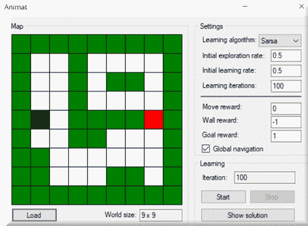
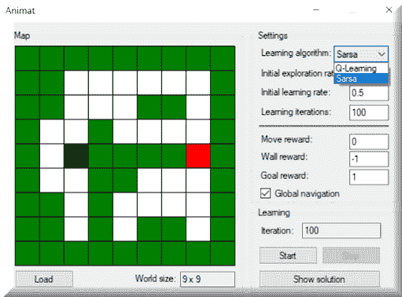
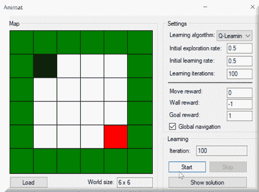
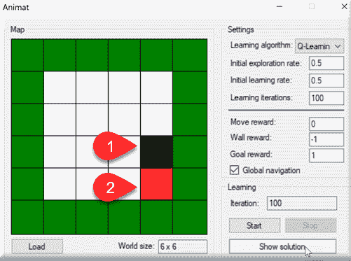
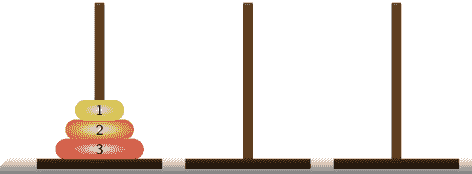
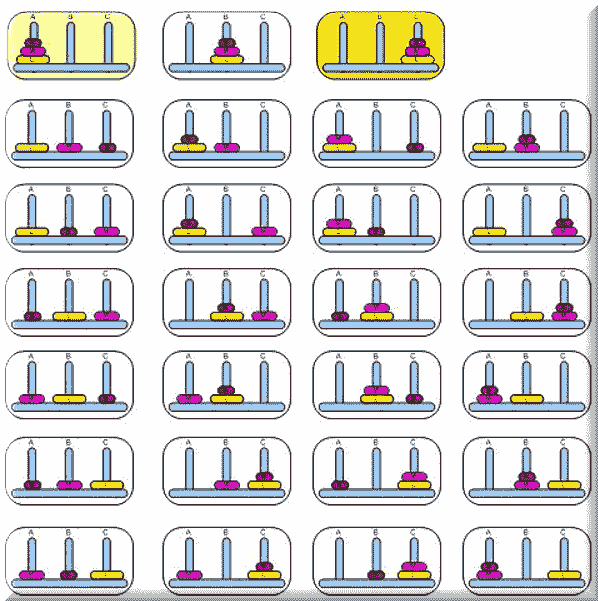
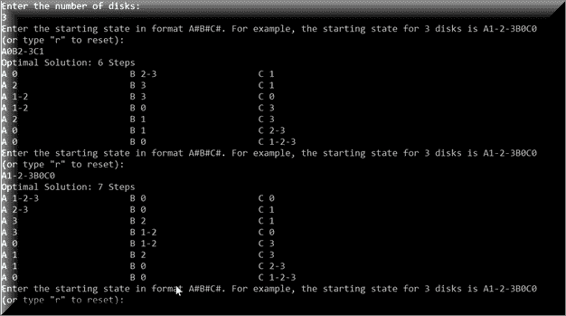
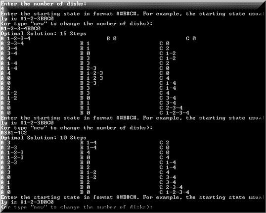

# 第四章：风险与回报 – 强化学习

在本章中，我们将更深入地探讨机器学习中的一个热门话题：强化学习。我们将涵盖几个令人兴奋的示例，以展示你如何在应用程序中使用它。我们将介绍几个算法，然后在我们的第一个更正式的示例之后，我们将带你到一个最终令人兴奋的示例，你一定会喜欢的！

本章将涵盖以下主题：

+   强化学习的概述

+   学习类型

+   Q 学习

+   SARSA

+   运行我们的应用程序

+   汉诺塔

# 强化学习的概述

如第一章“机器学习基础”中提到的，强化学习是一个机器被训练以实现特定结果的情况，其唯一目的是最大化效率和/或性能。算法因做出正确决策而获得奖励，因做出错误决策而受到惩罚，如下面的图表所示：


持续训练用于不断改进性能。这里的重点是性能，意味着在未知数据和算法已学到的内容之间找到某种平衡。算法对其环境采取行动，根据其行为获得奖励或惩罚，然后重复此过程。

在本章中，我们将直接深入到应用程序的应用，并使用令人难以置信的 Accord.NET 开源机器学习框架来突出展示我们如何使用强化学习帮助一个自主物体从其起始位置（由黑色物体表示）到达一个期望的终点（由红色物体表示）。

这个概念与自主车辆从 A 点到 B 点的行为类似，尽管复杂度要低得多。我们的示例将允许你使用不同复杂度的地图，这意味着在自主物体和期望位置之间可能会有各种障碍。让我们看看我们的应用程序：


在这里，你可以看到我们加载了一个非常基础的地图，一个没有障碍物，只有外部限制墙的地图。黑色方块（起点）是我们的自主物体，红色方块（停止）是我们的目的地。在这个应用程序中，我们的目标是导航墙壁以到达我们期望的位置。如果我们下一步移动到白色方块上，我们的算法将获得奖励。如果我们下一步移动到墙壁上，它将受到惩罚。从这个角度来看，我们的自主物体应该能够到达其目的地。问题是：它能多快学会？在这个例子中，它的路径上绝对没有任何障碍，所以应该没有问题在尽可能少的移动次数内解决问题。

以下是我们环境中的另一个相对复杂的地图示例：



# 学习类型

在我们应用程序的右侧是我们的设置，如下面的截图所示。我们看到的第一件事是学习算法。在这个应用程序中，我们将处理两种不同的学习算法，**Q-learning**和**状态-动作-奖励-状态-动作**（**SARSA**）。让我们简要讨论这两种算法：



# Q-learning

Q-learning 可以在给定状态下识别出最佳动作（在每个状态下具有最高价值的动作），而无需对环境有一个完全定义的模型。它也非常擅长处理具有随机转换和奖励的问题，而无需调整或适应。

这里是 Q-learning 的数学直觉：


如果我们提供一个非常高级的抽象示例，可能更容易理解。代理从状态 1 开始。然后执行动作 1 并获得奖励 1。接下来，它四处张望，看看在状态 2 中动作的最大可能奖励是多少；它使用这个来更新动作 1 的价值。以此类推！

# SARSA

**SARSA**（根据名字，你可以猜到这一点）的工作方式如下：

1.  代理从状态 1 开始

1.  然后执行动作 1 并获得奖励 1

1.  然后，它移动到状态 2，执行动作 2，并获得奖励 2

1.  然后，代理返回并更新动作 1 的价值

如你所见，两种算法的区别在于寻找未来奖励的方式。Q-learning 使用从状态 2 可能采取的最高动作，而 SARSA 使用实际采取的动作的价值。

这里是 SARSA 的数学直觉：


# 运行我们的应用程序

现在，让我们使用默认参数开始使用我们的应用程序。只需点击“开始”按钮，学习过程就会开始。一旦完成，你将能够点击“显示答案”按钮，学习路径将从开始到结束进行动画展示。

点击“开始”将开始学习阶段，并持续到黑色物体达到目标：



在这里，你会看到随着学习的进行，我们将输出发送到`ReflectInsight`，以帮助我们了解和学习算法内部正在做什么。你会看到对于每一次迭代，都会评估不同的物体位置，以及它们的行为和奖励：


一旦学习完成，我们可以点击“显示答案”按钮来重新播放最终解决方案。当完成后，黑色物体将位于红色物体之上：



现在，让我们看看我们应用程序中的代码。我们之前强调了两种学习方式。以下是 Q-learning 的看起来：

```py
int iteration = 0;
             TabuSearchExploration tabuPolicy = (TabuSearchExploration)qLearning.ExplorationPolicy;
             EpsilonGreedyExploration explorationPolicy = (EpsilonGreedyExploration)tabuPolicy.BasePolicy;

             while ((!needToStop) && (iteration < learningIterations))
             {
                 explorationPolicy.Epsilon = explorationRate - ((double)iteration / learningIterations) * explorationRate;
                 qLearning.LearningRate = learningRate - ((double)iteration / learningIterations) * learningRate;
                 tabuPolicy.ResetTabuList();

                 var agentCurrentX = agentStartX;
                 var agentCurrentY = agentStartY;

                 int steps = 0;
                 while ((!needToStop) && ((agentCurrentX != agentStopX) || (agentCurrentY != agentStopY)))
                 {
                     steps++;
                     int currentState = GetStateNumber(agentCurrentX, agentCurrentY);
                     int action = qLearning.GetAction(currentState);
                     double reward = UpdateAgentPosition(ref agentCurrentX, ref agentCurrentY, action);
                     int nextState = GetStateNumber(agentCurrentX, agentCurrentY);

                     // do learning of the agent - update his Q-function, set Tabu action
                     qLearning.UpdateState(currentState, action, reward, nextState);
                     tabuPolicy.SetTabuAction((action + 2) % 4, 1);
                 }

                 System.Diagnostics.Debug.WriteLine(steps);
                 iteration++;

                 SetText(iterationBox, iteration.ToString());
             }
```

SARSA 学习有何不同？让我们看看 SARSA 学习的`while`循环，并理解：

```py
int iteration = 0;
             TabuSearchExploration tabuPolicy = (TabuSearchExploration)sarsa.ExplorationPolicy;
             EpsilonGreedyExploration explorationPolicy = (EpsilonGreedyExploration)tabuPolicy.BasePolicy;

             while ((!needToStop) && (iteration < learningIterations))
             {
                 explorationPolicy.Epsilon = explorationRate - ((double)iteration / learningIterations) * explorationRate;
                 sarsa.LearningRate = learningRate - ((double)iteration / learningIterations) * learningRate;
                 tabuPolicy.ResetTabuList();

                 var agentCurrentX = agentStartX;
                 var agentCurrentY = agentStartY;
                 int steps = 1;
                 int previousState = GetStateNumber(agentCurrentX, agentCurrentY);
                 int previousAction = sarsa.GetAction(previousState);
                 double reward = UpdateAgentPosition(ref agentCurrentX, ref agentCurrentY, previousAction);

                 while ((!needToStop) && ((agentCurrentX != agentStopX) || (agentCurrentY != agentStopY)))
                 {
                     steps++;

                     tabuPolicy.SetTabuAction((previousAction + 2) % 4, 1);
                     int nextState = GetStateNumber(agentCurrentX, agentCurrentY);
                     int nextAction = sarsa.GetAction(nextState);
                     sarsa.UpdateState(previousState, previousAction, reward, nextState, nextAction);
                     reward = UpdateAgentPosition(ref agentCurrentX, ref agentCurrentY, nextAction);
                     previousState = nextState;
                     previousAction = nextAction;
                 }

                 if (!needToStop)
                 {
                     sarsa.UpdateState(previousState, previousAction, reward);
                 }

                 System.Diagnostics.Debug.WriteLine(steps);

                 iteration++;

                 SetText(iterationBox, iteration.ToString());
             }
```

我们的最后一步是看看我们如何可以动画化解决方案。这将帮助我们确认我们的算法达到了目标。以下是代码：

```py
TabuSearchExploration tabuPolicy;

             if (qLearning != null)
                 tabuPolicy = (TabuSearchExploration)qLearning.ExplorationPolicy;
             else if (sarsa != null)
                 tabuPolicy = (TabuSearchExploration)sarsa.ExplorationPolicy;
             else
                 throw new Exception();

             var explorationPolicy = (EpsilonGreedyExploration)tabuPolicy?.BasePolicy;
             explorationPolicy.Epsilon = 0;
             tabuPolicy?.ResetTabuList();
             int agentCurrentX = agentStartX, agentCurrentY = agentStartY;
             Array.Copy(map, mapToDisplay, mapWidth * mapHeight);
             mapToDisplay[agentStartY, agentStartX] = 2;
             mapToDisplay[agentStopY, agentStopX] = 3;
```

这里是我们的`while`循环，所有的魔法都在这里发生！

```py
while (!needToStop)
             {
                 cellWorld.Map = mapToDisplay;
                 Thread.Sleep(200);

                 if ((agentCurrentX == agentStopX) && (agentCurrentY == agentStopY))
                 {
                     mapToDisplay[agentStartY, agentStartX] = 2;
                     mapToDisplay[agentStopY, agentStopX] = 3;
                     agentCurrentX = agentStartX;
                     agentCurrentY = agentStartY;
                     cellWorld.Map = mapToDisplay;
                     Thread.Sleep(200);
                 }

                 mapToDisplay[agentCurrentY, agentCurrentX] = 0;
                 int currentState = GetStateNumber(agentCurrentX, agentCurrentY);
                 int action = qLearning?.GetAction(currentState) ?? sarsa.GetAction(currentState);
                 UpdateAgentPosition(ref agentCurrentX, ref agentCurrentY, action);
                 mapToDisplay[agentCurrentY, agentCurrentX] = 2;
             }
```

让我们将这个问题分解成更易于消化的部分。我们首先建立 tabu 策略。如果你不熟悉 tabu 搜索，请注意，它旨在通过放宽其规则来提高局部搜索的性能。在每一步，如果没有其他选择（具有奖励的动作），有时允许动作变差是可以接受的。

此外，为了确保算法不会回到之前访问过的解决方案，我们设置了禁止（tabu）规则。

```py
            TabuSearchExploration tabuPolicy;

             if (qLearning != null)
                 tabuPolicy = (TabuSearchExploration)qLearning.ExplorationPolicy;
             else if (sarsa != null)
                 tabuPolicy = (TabuSearchExploration)sarsa.ExplorationPolicy;
             else
                 throw new Exception();

             var explorationPolicy = (EpsilonGreedyExploration)tabuPolicy?.BasePolicy;
             explorationPolicy.Epsilon = 0;
             tabuPolicy?.ResetTabuList();
```

接下来，我们必须定位我们的代理并准备地图。


下面是我们的主要执行循环，它将展示动画解决方案：

```py
while (!needToStop)
             {
                 cellWorld.Map = mapToDisplay;
                 Thread.Sleep(200);

                 if ((agentCurrentX == agentStopX) && (agentCurrentY == agentStopY))
                 {
                     mapToDisplay[agentStartY, agentStartX] = 2;
                     mapToDisplay[agentStopY, agentStopX] = 3;
                     agentCurrentX = agentStartX;
                     agentCurrentY = agentStartY;
                     cellWorld.Map = mapToDisplay;
                     Thread.Sleep(200);
                 }

                 mapToDisplay[agentCurrentY, agentCurrentX] = 0;
                 int currentState = GetStateNumber(agentCurrentX, agentCurrentY);
                 int action = qLearning?.GetAction(currentState) ?? sarsa.GetAction(currentState);
                 UpdateAgentPosition(ref agentCurrentX, ref agentCurrentY, action);
                 mapToDisplay[agentCurrentY, agentCurrentX] = 2;
             }
```

# 汉诺塔

由于我们已经讨论了 Q 学习，我想在本章的剩余部分突出展示 Kenan Deen 的一些出色工作。他的汉诺塔解决方案是使用强化学习解决现实世界问题的绝佳例子。

这种形式的强化学习更正式地被称为**马尔可夫决策过程**（**MDP**）。MDP 是一个离散时间随机控制过程，这意味着在每个时间步，过程处于状态 *x*。决策者可以选择该状态下的任何可用动作，过程将在下一个时间步通过随机移动到新状态并向决策者提供奖励来响应。过程移动到新状态的概率由所选动作决定。因此，下一个状态取决于当前状态和决策者的动作。给定状态和动作，下一步完全独立于所有先前状态和动作。

汉诺塔由三根杆和几个按顺序排列的盘子组成，最左边的杆上。目标是使用尽可能少的移动次数将所有盘子从最左边的杆移动到最右边的杆。

你必须遵循的两个重要规则是，你一次只能移动一个盘子，你不能把一个更大的盘子放在一个较小的盘子上面；也就是说，在任何杆上，盘子的顺序必须始终是从底部最大的盘子到顶部最小的盘子，如下所示：



假设我们正在使用三个盘子，如上图所示。在这种情况下，有 3³种可能的状态，如下所示：



汉诺塔谜题中所有可能状态的总数是盘子的数量 3 的幂。

*||S|| = 3^n*

其中 ||*S*|| 是状态集中的元素数量，*n* 是盘子的数量。

因此，在我们的例子中，我们有 *3 x 3 x 3 = 27* 种独特的磁盘分布状态，包括空杆；但最多只能有两个空杆处于某种状态。

在定义了总状态数之后，这里列出了我们的算法从一种状态移动到另一种状态所具有的所有可能动作：


此谜题可能的最少移动次数为：*LeastPossibleMoves = 2^n - 1*

其中 *n* 是盘子的数量。

Q 学习算法可以正式定义为以下内容：


在这个 Q 学习算法中，我们使用了以下变量：

+   **Q 矩阵**：一个二维数组，最初为所有元素填充一个固定值（通常是 0）。它用于存储所有状态的计算策略；也就是说，对于每个状态，它存储相应可能动作的奖励。

+   **R 矩阵**：一个二维数组，包含初始奖励并允许程序确定特定状态的可能的动作列表。

+   **折扣因子**：决定了智能体如何处理奖励的策略。接近 0 的折扣因子将使智能体变得贪婪，只考虑当前奖励，而接近 1 的折扣因子将使其更具战略性和远见，以获得长期更好的奖励。

我们应该简要概述我们 Q 学习类的一些方法：

+   `Init`：用于生成所有可能的状态以及学习过程的开始。

+   `学习`：具有学习过程的连续步骤。

+   `InitRMatrix`：使用这些值之一初始化奖励矩阵：

    +   `0`：在当前状态下采取此动作时，我们没有关于奖励的信息

    +   `X`：在当前状态下无法采取此动作

    +   `100`：这是我们最终状态的大奖励，我们希望达到这个状态

+   `TrainQMatrix`：包含 Q 矩阵的实际迭代值更新规则。完成后，我们期望有一个训练好的智能体。

+   `NormalizeQMatrix`：将 Q 矩阵的值标准化，使其成为百分比。

+   `测试`: 从用户处提供文本输入并显示解决谜题的最佳最短路径。

让我们更深入地了解我们的`TrainQMatrix`代码：

```py
private void TrainQMatrix(int _StatesMaxCount)
{
  pickedActions = new Dictionary<int, int>();
// list of available actions (will be based on R matrix which
// contains the allowed next actions starting from some state as 0 values in the array
  List<int> nextActions = new List<int>();
  int counter = 0;
  int rIndex = 0;
// _StatesMaxCount is the number of all possible states of a puzzle
// from my experience with this application, 4 times the number
// of all possible moves has enough episodes to train Q matrix
  while (counter < 3 * _StatesMaxCount)
  {
    var init = Utility.GetRandomNumber(0, _StatesMaxCount);
    do
  {
// get available actions
 nextActions = GetNextActions(_StatesMaxCount, init);
// Choose any action out of the available actions randomly
    if (nextActions != null)
    {
      var nextStep = Utility.GetRandomNumber(0, nextActions.Count);
 nextStep = nextActions[nextStep];
// get available actions
 nextActions = GetNextActions(_StatesMaxCount, nextStep);
// set the index of the action to take from this state
      for (int i = 0; i < 3; i++)
      {
        if (R != null && R[init, i, 1] == nextStep)
 rIndex = i;
      }
// this is the value iteration update rule, discount factor is 0.8
      Q[init, nextStep] = R[init, rIndex, 0] + 0.8 * Utility.GetMax(Q, nextStep, nextActions);
// set the next step as the current step
 init = nextStep;
      }
    }
  while (init != FinalStateIndex);
 counter++;
  }
}
```

使用三个盘子运行应用程序：



使用四个盘子运行应用程序：



这里是使用七个盘子运行的情况。最佳移动次数为 127，您可以看到解决方案如何快速地乘以可能的组合：


# 摘要

在本章中，我们学习了强化学习，与之相关的各种学习算法，以及如何将其应用于现实世界的学习问题。在下一章中，我们将跳入模糊逻辑，不仅了解其含义，还将了解如何将其应用于日常问题。

# 参考文献

+   维基百科，创意共享署名许可

+   Watkins, C.J.C.H. (1989), *延迟奖励学习*（博士论文），剑桥大学

+   *使用连接主义系统的在线 Q-Learning*，Rummery & Niranjan (1994)

+   Wiering, Marco; Schmidhuber, Jürgen (1998-10-01), *快速在线 Q(λ)*. *机器学习*. **33** (1): 105-115

+   版权所有 (c) 2009-2017，Accord.NET 作者，联系邮箱：`authors@accord-framework.net`

+   Kenan Deen, [`kenandeen.wordpress.com/`](https://kenandeen.wordpress.com/)
