# 第六章：颜色混合 - 自组织映射和弹性神经网络

**自组织映射**（**SOM**），或者如您所听到的**Kohonen 图**，是自组织神经网络的基本类型之一。自组织的能力提供了对以前未见过的输入数据的适应性。它被理论化为学习最自然的方式之一，就像我们的大脑所使用的那样，其中没有预定义的模式被认为是存在的。这些模式在学习过程中形成，并且擅长以远低于维度的水平表示多维数据，例如 2D 或 1D。此外，这个网络以这种方式存储信息，即训练集中的任何拓扑关系都保持不变。

更正式地说，SOM 是一种聚类技术，它将帮助我们在大数据集中发现有趣的数据类别。它是一种无监督神经网络，其中神经元排列在一个单一的二维网格中。网格必须是矩形的，即，一个纯矩形或六边形。在整个迭代过程中（我们将指定），我们的网格中的神经元将逐渐聚集在数据点密度较高的区域（我们显示的左侧称为点）。随着神经元的移动，它们弯曲和扭曲网格，直到它们更接近感兴趣的点并反映数据的形状。

在本章中，我们将介绍以下主题：

+   Kohonen SOM

+   使用 AForge.NET 进行工作

# SOM 的内部机制

因此，现在不可避免的问题出现了：这些是如何工作的？

简而言之，我们在网格上有神经元；通过迭代，它们逐渐适应我们的数据形状（在我们的例子中，如下面的图像所示，在点面板的左侧）。让我们更多地谈谈迭代过程本身。

1.  第一步是在网格上随机放置数据。我们将随机在我们的数据空间中放置我们的网格神经元，如下所示：

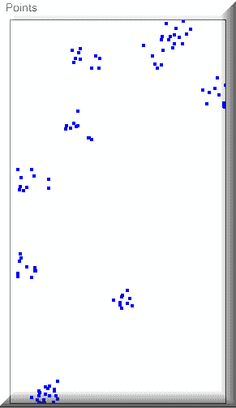

1.  第二步是算法将选择一个单一的数据点。

1.  在第三步，我们需要找到与所选数据点最近的神经元（数据点）。然后这将成为我们的最佳匹配单元。

1.  第四步是将我们的最佳匹配单元移动到该数据点。我们移动的距离由我们的学习率决定，该学习率在每个迭代后最终会减小。

1.  第五，我们将把最佳匹配单元的邻居移动得更近，距离较远的神经元移动的距离小于较近的神经元。屏幕上您看到的初始半径变量是我们用来识别邻居的。这个值，就像初始学习率一样，会随着时间的推移而减小。如果您已经启动并运行了**ReflectInsight**（**RI**），您可以观察初始学习率随时间的变化，如下面的截图所示：

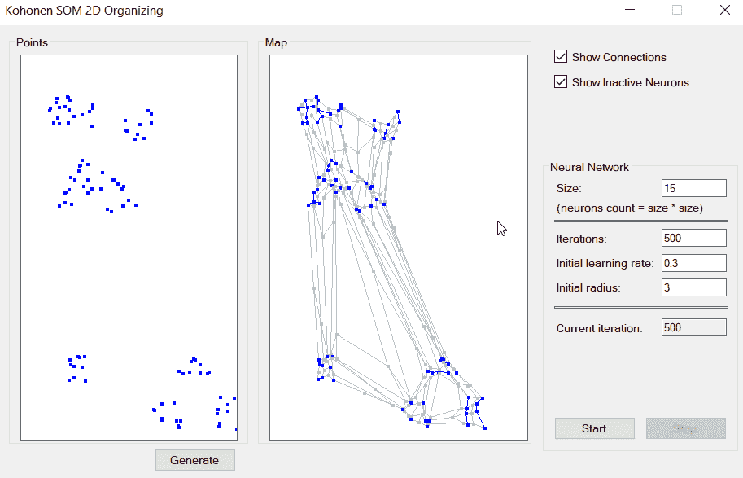

1.  我们第六步和最后一步将是更新初始学习率和初始半径，正如我们之前所描述的，然后重复。我们将继续这个过程，直到我们的数据点稳定并处于正确的位置。

现在我们已经向你介绍了一些关于 SOMs 的直觉，让我们再谈谈本章我们将要做什么。我们选择了一个非常常见的机制来教授我们的原则，即颜色的映射。颜色本身是由红色、绿色和蓝色表示的 3D 对象，但我们将它们组织到二维中。你将在这里看到两个关于颜色组织的要点。首先，颜色被聚类到不同的区域，其次，具有相似属性的区域通常相邻。

我们的第二个例子，稍微复杂一些，将使用我们之前描述的**人工神经网络**（**ANN**）；这是一种高级的机器学习方法，用于创建与提供给它的组织映射相匹配的组织映射。让我们看看我们的第一个例子。

这是我们示例的截图。正如你所见，我们有一个随机的颜色模式，完成后，这些颜色将被组织成相似颜色的簇：

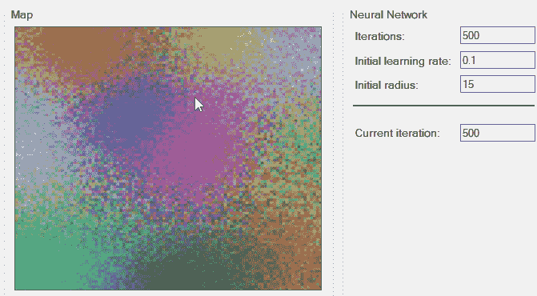

如果我们成功——我们会成功的——我们的结果应该如下所示：


让我们首先按照以下步骤遵循处理过程：

1.  我们将首先使用 500 次迭代来实现我们的目标。使用较小的数字可能不会产生我们最终想要的混合效果。例如，如果我们使用了 500 次迭代，我们的结果将如下所示：


1.  正如你所见，我们离我们想要达到的目标还很远。能够改变迭代次数让你可以尝试正确的设置。我可以告诉你 500 次迭代比我们需要的要多，所以我会把它留给你作为练习，找出进度停止并且你对组织满意的数量。

1.  在设置迭代次数后，我们唯一要做的就是确保我们有我们想要的随机颜色模式，这可以通过点击“随机化”按钮来实现。

1.  一旦你得到了你想要的模式，你只需点击“开始”按钮并观察结果。

1.  一旦你点击“开始”，“停止”按钮将被激活，你可以在任何时候停止进度。当你达到指定的迭代次数时，组织将自动停止。

在我们进入实际代码之前，让我给你展示一些组织模式的一些截图。通过简单地改变不同的参数，你可以取得惊人的效果，我们将在后面详细描述。在下面的截图中，我们将迭代次数设置为 3000，初始半径为 10：

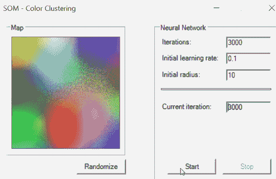

在下面的屏幕截图中，我们使用了 4000 次迭代和初始半径为 18：

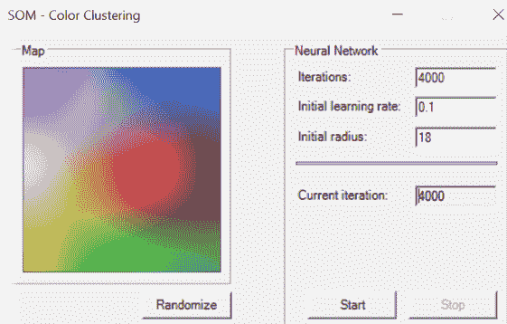

在以下屏幕截图中，我们将迭代次数设置为 4000，初始半径为 5：

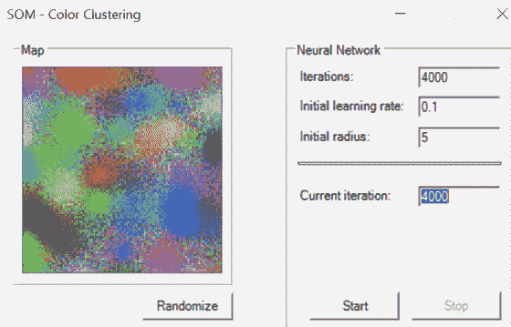

在这里，我们将迭代次数设置为 5000，初始学习率为 0.3，初始半径为 25，如以下屏幕截图所示，以获得期望的结果：

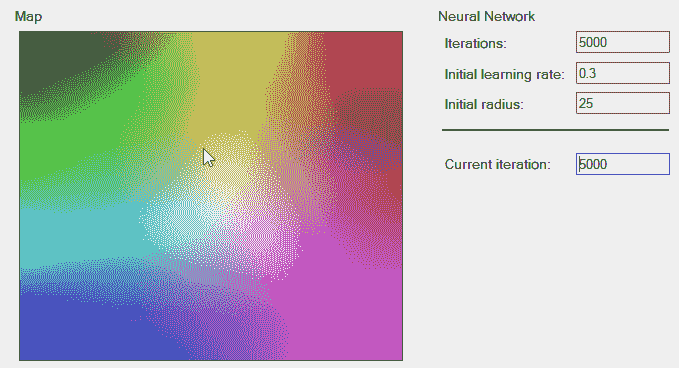

如承诺的那样，现在让我们深入代码。

在这个例子中，我们将使用`AForge`并使用`DistanceNetwork`对象。距离网络是一个只有单一距离的神经网络。除了用于 SOM 之外，它还用于弹性网络操作，这是我们用来展示在进展过程中对象之间弹性连接的。

我们将使用三个输入神经元和`1000`个将在幕后工作的神经元来创建我们的距离网络：

```py
network = new DistanceNetwork(3, 100 * 100);
```

当你点击随机化按钮来随机化颜色时，下面是幕后发生的事情：

```py
private void RandomizeNetwork()
         {
             if (network != null)
             {
                 foreach (var neuron in (network?.Layers.SelectMany(layer
                   => layer?.Neurons)).Where(neuron => neuron != null))
                     neuron.RandGenerator = 
                       new UniformContinuousDistribution
                       (new Range(0, 255));

                 network?.Randomize();
             }

             UpdateMap();
         }
```

你会注意到我们正在处理的随机化范围保持在任何颜色的红色、绿色或蓝色特征的范围内，即`255`。

接下来，我们将查看我们的学习循环，它看起来是这样的。我们稍后会深入探讨：

```py
SOMLearning trainer = new SOMLearning(network);
             double[] input = new double[3];
             double fixedLearningRate = learningRate / 10;
             double driftingLearningRate = fixedLearningRate * 9;
             int i = 0;

             while (!needToStop)
             {
                 trainer.LearningRate = driftingLearningRate 
                   * (iterations - i)
                   / iterations + fixedLearningRate;
                 trainer.LearningRadius = radius * (iterations - i) 
                   / iterations;

                 if (rand != null)
                 {
                     input[0] = rand.Next(256);
                     input[1] = rand.Next(256);
                     input[2] = rand.Next(256);
                 }

                 trainer.Run(input);

                 // update map once per 50 iterations
                 if ((i % 10) == 9)
                 {
                     UpdateMap();
                 }

                 i++;

                 SetText(currentIterationBox, i.ToString());

                 if (i >= iterations)
                     break;
             }
```

如果我们仔细观察，我们首先创建的是一个`SOMLearning`对象。这个对象针对正方形空间学习进行了优化，意味着它期望它正在工作的网络的高度与宽度相同。这使得找到网络神经元数量的平方根变得更容易：

```py
SOMLearning trainer = new SOMLearning(network);
```

接下来，我们需要创建变量来保存我们的红色、绿色和蓝色输入颜色，我们将不断地随机化输入颜色以达到我们的目标：

```py
                if (rand != null)
                 {
                     input[0] = rand.Next(256);
                     input[1] = rand.Next(256);
                     input[2] = rand.Next(256);
                 }
```

一旦我们进入`while`循环，我们将不断地更新我们的变量，直到达到我们选择的迭代总数。在这个更新循环中，有几件事情正在发生。首先，我们将更新学习率和学习半径，并将其存储在我们的`SOMLearning`对象中：

```py
trainer.LearningRate = driftingLearningRate * (iterations - i) /
  iterations + fixedLearningRate;
trainer.LearningRadius = radius * (iterations - i) / iterations;
```

学习率决定了我们的学习速度。学习半径，它可以对视觉输出产生相当大的影响，决定了相对于获胜神经元的距离要更新的神经元数量。指定半径的圆圈由神经元组成，它们在学习过程中不断地被更新。一个神经元越接近获胜神经元，它将接收到的更新就越多。请注意，如果在你的实验中，你将此值设置为 0，那么只有获胜神经元的权重将被更新，其他神经元则不会。

尽管我们将有一个非常漂亮的视觉效果可以观看，但我们仍然需要了解我们应用程序内部的情况，这就是 RI 的作用所在：

```py
RILogManager.Default.ViewerSendWatch("Learning Rate", $"{trainer.LearningRate}");
RILogManager.Default.ViewerSendWatch("Learning Radius", $"{trainer.LearningRadius}");
RILogManager.Default.ViewerSendWatch("Red", $"{RGBInput[0]}");
RILogManager.Default.ViewerSendWatch("Green", $"{RGBInput[1]}");
RILogManager.Default.ViewerSendWatch("Blue", $"{RGBInput[2]}");
```

RI，如我们之前提到的，有一个监视面板，让你可以持续跟踪你感兴趣的任何变量。在我们的情况下，我们感兴趣的是监视学习率、学习半径以及每个随机化的 RGB 颜色。我们只需要提供标签和值，RI 就会完成剩下的工作，正如我们稍后将看到的。

最后，与 RI 相关，我们还想在我们的消息窗口中看到 RGB 值，因此我们将添加一个调试消息：

```py
RILogManager.Default.SendDebug($"Red {RGBInput[0]}, Green {RGBInput[1]}, Blue 
  {RGBInput[2]}");
```

我们现在为这次迭代进行一次训练`Run`，并将`RGBInput`数组传递给它：

```py
trainer.Run(RGBInput);
```

让我们暂时谈谈学习。正如我们提到的，每次迭代都会尝试学习越来越多的信息。这次学习迭代返回一个学习误差，即神经元权重与输入向量`RGBInput`之间的差异。如前所述，距离是根据获胜神经元（权重值与`RGBInput`中提供的值最接近的神经元）的距离来衡量的。过程如下。

训练器运行一次学习迭代，找到获胜神经元（权重值与`RGBInput`中提供的值最接近的神经元），并更新其权重。它还更新邻近神经元的权重。随着每次学习迭代的进行，网络越来越接近最优解。

接下来是应用程序运行的截图。背景是 RI，这样你可以看到我们如何记录每个迭代，我们在更新地图时使用什么颜色值，以及学习率和学习半径。随着你的机器学习程序和算法变得越来越复杂，你会意识到这种对应用程序的洞察变得极其宝贵。它也是一个不可或缺的实时调试和诊断工具！

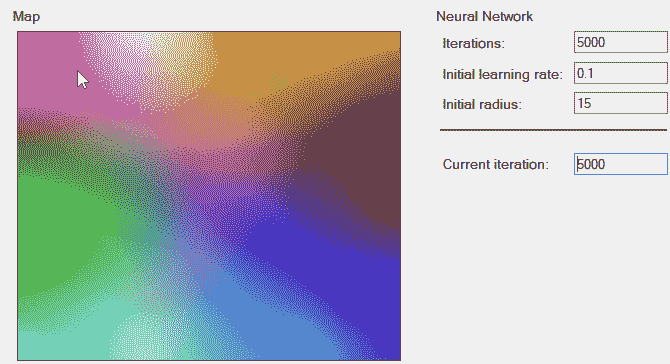

由于 SOM 是自我组织的，我们的第二个例子将更加图形化。我们希望它能帮助你更好地理解幕后发生的事情。

在这个例子中，我们再次使用 AForge.NET 构建一个由几个组组织起来的二维对象平面。我们将从单个位置开始，直观地到达那些形状的位置。从概念上讲，这与我们的颜色示例相同，该示例使用了三维空间中的点，但这次我们的点是二维的。可视化发生在地图面板中，是二维空间中发生情况的俯视图，以便得到一维图形视图。

在 SOM 网格中，神经元最初处于随机位置，但它们逐渐被调整成与我们的数据形状相匹配的模具轮廓。这是一个迭代过程，尽管将动画`.gif`放入书中是一项我们尚未实现的壮举，但我已经在不同迭代点拍摄了快照，以展示发生了什么。你可以亲自运行示例，以实时查看。

我们从所有对象在左侧的位置开始。我们将运行 500 次迭代以展示演变。我们将从一个空白白色面板到一个，希望，类似于点面板的面板：

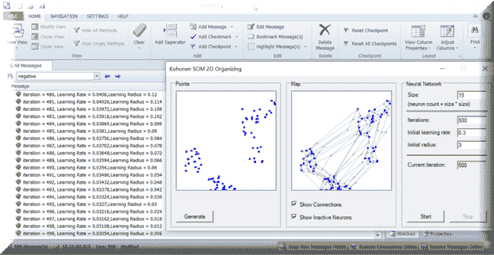

现在我们点击“开始”按钮，它就出发了！你会看到点开始移动到它们正确的位置，这（希望）将反映出我们指定的点：

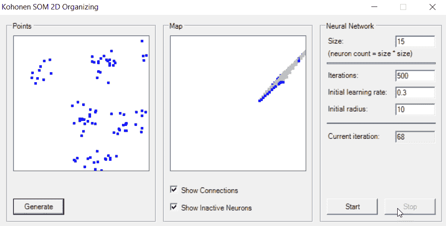

经过 199 次迭代后：

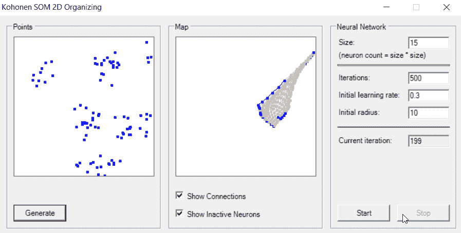

经过 343 次迭代后：

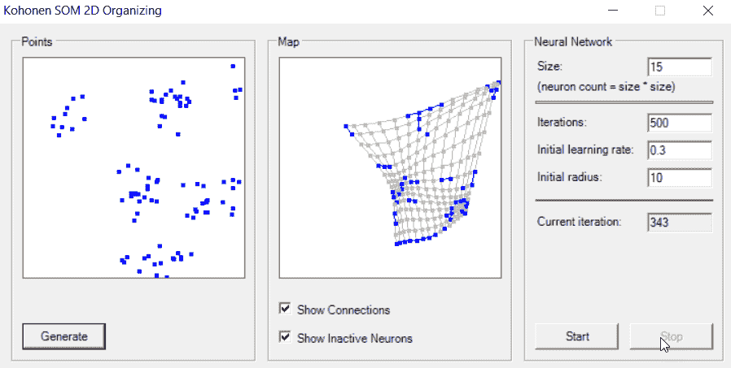

完成后，你可以看到物体已经按照我们最初创建的图案组织起来。如果你想象自己正俯瞰地图，即使你站在一张平坦的纸上，只要你足够专注，你就能看到三维体验。蓝色的小点代表活跃的神经元，浅灰色的小点代表不活跃的神经元，画出的线条是神经元之间的弹性连接。

地图下方的复选框允许你轻松选择是否显示这些中的任何一个或两个：


如果你截图时不显示连接和不活跃的神经元，你会看到地图上的组织模式达到了与我们的目标相同的聚类，对我们来说这意味着成功：

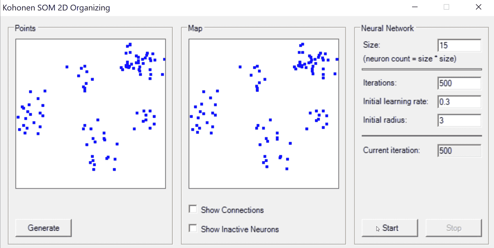

所有这一切是如何工作的，是我们接下来要调查的主题。像往常一样，让我们看看我们的主要执行循环。正如你所看到的，我们将使用之前讨论过的相同的`DistanceNetwork`和`SOMLearning`对象：

```py
DistanceNetwork network = new DistanceNetwork(2, networkSize 
  * networkSize);

             // set random generators range
             foreach (var neuron in network.Layers.SelectMany(layer =>
               layer.Neurons))
                 neuron.RandGenerator = new UniformContinuousDistribution(
                     new Range(0, Math.Max
                       (pointsPanel.ClientRectangle.Width,
                       pointsPanel.ClientRectangle.Height)));

             // create learning algorithm
             SOMLearning trainer = new SOMLearning(network, networkSize, 
               networkSize);

             // create map
             map = new int[networkSize, networkSize, 3];

             double fixedLearningRate = learningRate / 10;
             double driftingLearningRate = fixedLearningRate * 9;

             // iterations
             int i = 0;

             // loop
             while (!needToStop)
             {
                 trainer.LearningRate = driftingLearningRate 
                   * (iterations - i) / iterations + fixedLearningRate;
                 trainer.LearningRadius = (double)learningRadius * 
                   (iterations - i) / iterations;

                 // run training epoch
                 trainer.RunEpoch(trainingSet);

                 // update map
                 UpdateMap(network);

                 // increase current iteration
                 i++;

                 // set current iteration's info
                 SetText(currentIterationBox, i.ToString());

                 // stop ?
                 if (i >= iterations)
                     break;
             }
```

如我们之前提到的，`学习率`和`学习半径`会随着每一次迭代而不断进化。这次，让我们谈谈训练器的`RunEpoch`方法。这个方法虽然非常简单，但旨在接受一个输入值向量，然后返回该迭代的 学习误差（正如你现在可以看到的，有时也称为**epoch**）。它是通过计算向量中的每个输入样本来实现的。学习误差是神经元权重和输入之间的绝对差异。差异是根据获胜神经元的距离来衡量的。如前所述，我们针对一次学习迭代/epoch 进行计算，找到获胜者，并更新其权重（以及相邻权重的）。我应该指出，当我提到“获胜者”时，我指的是权重值最接近指定输入向量的神经元，即网络输入的最小距离。

接下来，我们将展示如何更新“地图”本身；我们的计算项目应该与初始输入向量（点）相匹配：

```py
            // get first layer
             Layer layer = network.Layers[0];

             // lock
             Monitor.Enter(this);

             // run through all neurons
             for (int i = 0; i < layer.Neurons.Length; i++)
             {
                 Neuron neuron = layer.Neurons[i];

                 int x = i % networkSize;
                 int y = i / networkSize;

                 map[y, x, 0] = (int)neuron.Weights[0];
                 map[y, x, 1] = (int)neuron.Weights[1];
                 map[y, x, 2] = 0;
             }

             // collect active neurons
             for (int i = 0; i < pointsCount; i++)
             {
                 network.Compute(trainingSet[i]);
                 int w = network.GetWinner();

                 map[w / networkSize, w % networkSize, 2] = 1;
             }

             // unlock
             Monitor.Exit(this);

             //
             mapPanel.Invalidate();
```

如您从这段代码中可以看到，我们获取第一层，计算所有神经元的`map`，收集活跃的神经元以便我们确定获胜者，然后更新`map`。

由于我们已经多次提到了获胜者，让我向您展示一下计算获胜者所需的代码量：

```py
public int GetWinner()
{
// find the MIN value
double min = output[0];
int minIndex = 0;
for (int i = 1; i < output.Length; i++)
{
if (output[i] < min)
{
// found new MIN value
min = output[i];
minIndex = i;
}
}
return minIndex;
}
```

就这样！我们正在做的只是寻找权重与网络输入距离最小的神经元的索引。

# 摘要

在本章中，我们学习了如何利用 SOMs（自组织映射）和弹性神经网络的强大功能。你现在已经正式从机器学习跨越到神经网络；恭喜你！

在我们接下来的章节中，我们将运用一些知识来开始面部和动作检测程序，并享受一些真正的乐趣！你将有机会与我的章节合作伙伴 Frenchie 一起工作！
