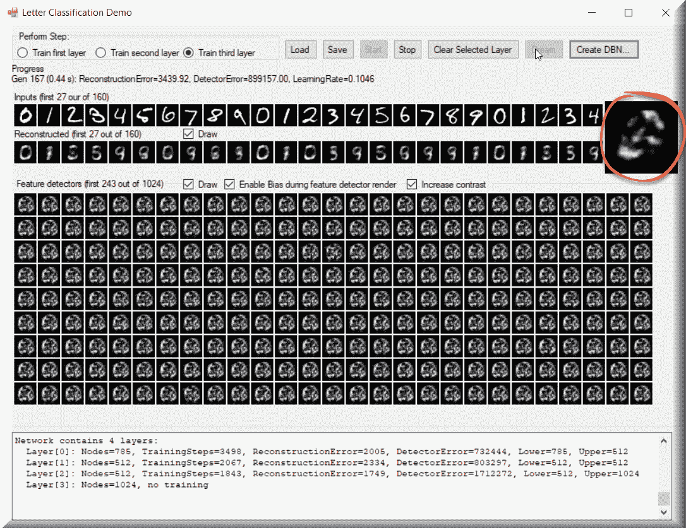

# 第十章：深度信念 – 深度网络与梦境

我们都听说过深度学习，但有多少人知道**深度信念网络**是什么？让我们从这个章节开始，回答这个问题。深度信念网络是一种非常高级的机器学习方法，其含义正在迅速演变。作为一名机器学习开发者，了解这个概念很重要，这样当你遇到它或它遇到你时，你会熟悉它！

在机器学习中，深度信念网络在技术上是一种深度神经网络。我们应该指出，当提到深度学习或深度信念时，“深度”的含义是指网络由多个层（隐藏单元）组成。在深度信念网络中，这些连接在层内的每个神经元之间进行，但不在不同层之间。深度信念网络可以被训练以无监督地学习，以便以概率重建网络的输入。然后这些层作为“特征检测器”来识别或分类图像、字母等。你还可以观察深度信念网络做梦，这是一个非常有趣的话题。

在本章中，我们将涵盖：

+   受限玻尔兹曼机

+   使用 C#创建和训练深度信念网络

# 受限玻尔兹曼机

构建深度信念网络的一种流行方法是将其构建为一个由**受限玻尔兹曼机**（**RBMs**）组成的分层集合。这些 RBMs 作为自编码器运行，每个隐藏层都作为下一层的可见层。这种结构导致了一种快速、逐层和无监督的训练过程。深度信念网络在预训练阶段将包含 RBM 层，然后在微调阶段使用前馈网络。训练的第一步是从可见单元学习一层特征。下一步是将之前训练的特征的激活作为新的可见单元。然后我们重复这个过程，以便在第二个隐藏层中学习更多特征。然后这个过程会继续应用于所有隐藏层。

在这里，我们应该提供两条信息。

首先，我们应该解释一下什么是自编码器以及它做什么。自编码器是所谓**表示学习**的核心。它们编码输入，通常是显著特征的压缩向量，以及通过无监督学习重建的数据。

其次，我们应该注意，在深度信念网络中堆叠 RBMs 只是处理这个问题的一种方法。堆叠带有 dropout 的受限线性单元（ReLUs）并进行训练，然后配合反向传播，这再次成为了最先进的技术。我说再次是因为 30 年前，监督方法是唯一可行的方法。与其让算法查看所有数据并确定感兴趣的特征，有时我们作为人类实际上可以更好地找到我们想要的特征。

我认为深度信念网络最显著的两个特性如下：

+   存在一个高效、逐层的学习过程，用于学习自上而下的生成权重。它决定了某一层的变量如何依赖于其上层的变量。

+   学习完成后，可以通过从底层观察到的数据向量开始的单个自下而上的遍历，很容易地推断出每一层变量的值，并使用生成权重反向重建数据。

话虽如此，现在让我们也来谈谈 RBM 以及一般的霍尔兹曼机。

霍尔兹曼机是一种具有二元单元和单元之间无向边的循环神经网络。对于那些在图论课程中没注意听讲的同学，无向意味着边（或链接）是双向的，它们不指向任何特定方向。对于那些不熟悉图论的人来说，以下是一个具有无向边的无向图的示意图：


霍尔兹曼机是第一批能够学习内部表示的神经网络之一，并且如果给定足够的时间，它们可以解决难题。然而，它们在扩展方面并不擅长，这让我们转向下一个主题，即 RBMs。

RBM 被引入来处理霍尔兹曼机无法扩展的问题。它们有隐藏层，隐藏单元之间的连接受到限制，但不在这些单元之外，这有助于高效学习。更正式地说，我们必须稍微深入研究一下图论，才能正确解释这一点。

RBM 必须让它们的神经元形成所谓的**二分图**，这是一种更高级的图论形式；两组单元（可见层和隐藏层）中的每一对节点之间可能存在对称连接。任何一组内的节点之间不能有连接。二分图，有时称为**双图**，是一组图顶点分解为两个不相交的集合，使得同一集合内的两个顶点不相邻。

这里有一个很好的例子，可以帮助可视化这个主题。

注意，同一集合内（左侧的红色或右侧的黑色）没有连接，但两个集合之间存在连接：


更正式地说，RBM 被称为**对称二分图**。这是因为所有可见节点的输入都传递给所有隐藏节点。我们称之为对称，因为每个可见节点都与一个隐藏节点相关联；二分是因为有两个层次；而图是因为，嗯，它是一个图，或者如果你更喜欢，它是一组节点！

想象一下，我们的 RBM 被呈现了猫和狗的图像，并且我们有两个输出节点，一个用于每种动物。在我们的正向学习过程中，我们的 RBM 会问自己“*看到这些像素，我应该为猫还是狗发送更强的权重信号？*”在反向过程中，它会思考“*作为一个狗，我应该看到什么样的像素分布？*”朋友们，这就是今天关于联合概率的教训：给定*A*的*X*和给定*X*的*A*的同时概率。在我们的案例中，这个联合概率以两层之间的权重表示，并且是 RBMs 的一个重要方面。

在掌握了今天的联合概率和图论的小课程之后，我们现在将讨论**重建**，这是 RBMs（限制玻尔兹曼机）所做的重要部分。在我们一直在讨论的例子中，我们正在学习哪些像素组在一系列图像中发生（意味着处于*开启*状态）。当一个隐藏层节点被一个显著权重激活（无论这个权重是如何确定的以将其*开启*），它代表了某些事件同时发生的共现，在我们的案例中，是狗或猫。如果图像是一只猫，尖耳朵+圆脸+小眼睛可能就是我们要找的特征。大耳朵+长尾巴+大鼻子可能使图像成为一只狗。这些激活代表了我们的 RBM“认为”原始数据看起来像什么。从所有目的和用途来看，我们实际上正在重建原始数据。

我们还应该迅速指出，RBM 有两个偏差而不是一个。这一点非常重要，因为它将 RBM 与其他自动编码算法区分开来。隐藏偏差帮助我们的 RBM 在正向过程中产生所需的激活，而可见层偏差帮助在反向过程中学习正确的重建。隐藏偏差很重要，因为它的主要任务是确保在数据可能非常稀疏的情况下，某些节点仍然会激活。你将在稍后看到这如何影响深度信念网络做梦的方式。

# 层次化

一旦我们的 RBM 学会了输入数据的结构，这与我们在第一隐藏层中做出的激活有关，数据就会传递到下一个隐藏层。第一隐藏层随后成为新的可见层。我们在隐藏层中创建的激活现在成为我们的输入。它们将被新的隐藏层中的权重相乘，产生另一组激活。这个过程会继续通过我们网络中的所有隐藏层。隐藏层变成可见层，我们有了另一个我们将使用的权重的隐藏层，我们重复这个过程。每个新的隐藏层都会导致权重的调整，直到我们达到可以识别来自前一层的输入的点。

为了更详细地说明（帮助你保持术语的合规性），这从技术上讲被称为**无监督、贪婪、分层训练**。不需要输入来改进每一层的权重，这意味着没有任何类型的外部影响。这进一步意味着我们应该能够使用我们的算法在之前未见过的不监督数据上进行训练。正如我们一直强调的那样，*数据越多，我们的结果越好*！随着每一层变得更好，希望也更准确，我们就有更好的位置通过每一隐藏层增加我们的学习，权重在这个过程中负责引导我们到达正确的图像分类。

但当我们讨论重建时，我们应该指出，在我们重建努力中，每当一个数字（权重）不为零，这表明我们的 RBM 已经从数据中学习到了一些东西。从某种意义上说，你可以将返回的数字当作你对待百分比指示器一样来处理。数字越高，算法对其所看到的东西就越有信心。记住，我们有一个主数据集，我们试图恢复到这个数据集，并且我们有一个参考数据集用于我们的重建工作。随着我们的 RBM 遍历每一张图像，它还不知道它正在处理什么图像；这正是它试图确定的事情。

让我们简要澄清一下。当我们说我们使用贪婪算法时，我们真正意思是我们的 RBM 将采取最短路径以实现最佳结果。我们将从我们看到的图像中采样随机像素，并测试哪些像素能引导我们到达正确答案。RBM 将测试每个假设与主数据集（测试集）的对比，这是我们正确的最终目标。记住，每张图像只是我们试图分类的一组像素。这些像素包含了数据的特征和特性。例如，一个像素可以有不同亮度的阴影，其中深色像素可能表示边界，浅色像素可能表示数字，等等。

但当事情不按我们的意愿发展时会发生什么？如果我们在任何给定步骤中学到的任何东西都不正确，会发生什么？如果发生这种情况，这意味着我们的算法猜错了。我们的行动方案是回过头去再试一次。这并不像看起来那么糟糕，也不那么耗时。当然，一个错误假设有一个时间成本，但最终目标是我们必须提高我们的学习效率并减少每个阶段的错误。每个错误的加权连接将像我们在强化学习中做的那样受到惩罚。这些连接的权重将减少，不再那么强大。希望下一次遍历将提高我们的准确性，同时减少错误，权重越强，它的影响就越大。

因此，让我们假设一个场景，并且稍微思考一下。假设我们正在对数字图像进行分类，即数字。一些图像会有曲线，例如 2、3、6、8、9 等等。其他数字，如 1、4 和 7，则不会有。这样的知识非常重要，因为我们的 RBM 将利用它来继续改进其学习并减少错误。如果我们认为我们正在处理数字 2，那么指向这个方向的权重将比其他权重更重。这是一个极端的简化，但希望这足以帮助你理解我们即将开始的事情。

当我们将所有这些放在一起时，我们现在有了深度信念网络的理论框架。尽管我们比其他章节更深入地探讨了理论，但当你看到我们的示例程序运行时，一切都将开始变得有意义。而且你将更好地准备好在你的应用中使用它，了解幕后发生的事情。记住，黑洞与黑箱！

为了展示深度信念网络和 RBMs，我们将使用由 Mattia Fagerlund 编写的出色开源软件 SharpRBM。这款软件是对开源社区的巨大贡献，我毫不怀疑你将花费数小时，甚至数天的时间与之共事。这款软件附带了一些非常令人惊叹的演示。对于本章，我们将使用字母分类演示。

以下截图是我们深度信念测试应用。你是否好奇当计算机在睡眠时它在想什么？好吧，我的朋友，你即将找到答案！


和往常一样，我们也会使用 ReflectInsight 来提供幕后发生的事情的视角：


你首先会注意到我们的演示应用中有很多事情在进行。让我们花点时间将其分解成更小的部分。

在程序屏幕的左上角是我们要指定的层，我们有三层隐藏层，所有这些层在测试之前都需要适当的训练。我们可以一次训练一层，从第一层开始。你可以根据自己的喜好训练多长时间，但训练越多，你的系统会越好：


在我们的训练选项之后是下一节，我们的进度。在我们训练的过程中，所有相关信息，如生成、重建错误、检测器错误和学习率，都显示在这里：


下一节是关于我们特征检测器的绘图，如果勾选了“绘制”复选框，它将在整个训练过程中更新自己：


当你开始训练一层时，你会注意到重建和特征检测器基本上是空的。随着你的训练进展，它们会自我完善。记住，我们正在重建我们已经知道是真实的内容！随着训练的继续，重建的数字变得越来越清晰，我们的特征检测器也随之变得更加明显：


这是应用程序在训练过程中的一个快照。正如你所见，它处于第 31 代，重建的数字非常清晰。它们仍然不完整或不正确，但你可以看到我们正在取得多大的进步：


# 计算机做梦是什么？

“*当计算机做梦时，它在想什么*？” 这是一句著名的话。对我们来说，这将是一个特性，它允许我们在计算机重建阶段看到它在想什么。当程序试图重建我们的数字时，特征检测器本身在整个过程中会呈现各种形式。我们就是在梦境窗口（用红色圆圈表示）中显示这些形式：



好吧，我们已经花了很多时间查看我们应用程序的截图。我认为现在是时候看看代码了。让我们先看看我们是如何创建 `DeepBeliefNetwork` 对象本身的：

```py
DeepBeliefNetwork = new DeepBeliefNetwork(28 * 29, 500, 500, 1000);
```

创建完成后，我们需要创建我们的网络训练器，我们根据正在训练的层的权重来做这件事：

```py
DeepBeliefNetworkTrainer trainer = new
  DeepBeliefNetworkTrainer(DeepBeliefNetwork,
  DeepBeliefNetwork?.LayerWeights?[layerId], inputs);
```

这两个对象都在我们的主 `TrainNetwork` 循环中使用，这是我们应用程序中活动发生的主要部分。这个循环将持续进行，直到被通知停止。

```py
private void TrainNetwork(DeepBeliefNetworkTrainer trainer)
         {
             try
             {
                 Stopping = false;
                 ClearBoxes();
                 _unsavedChanges = true;
                 int generation = 0;

                 SetThreadExecutionState(EXECUTION_STATE.ES_CONTINUOUS
                   | EXECUTION_STATE.ES_SYSTEM_REQUIRED);

                 while (Stopping == false)
                 {
                     Stopwatch stopwatch = Stopwatch.StartNew();
                     TrainingError error = trainer?.Train();
                     label1.Text = string.Format(
                         "Gen {0} ({4:0.00} s): ReconstructionError=
                           {1:0.00}, DetectorError={2:0.00},
                           LearningRate={3:0.0000}",
                         generation, error.ReconstructionError,
                         error.FeatureDetectorError,
                         trainer.TrainingWeights.AdjustedLearningRate,
                           stopwatch.ElapsedMilliseconds / 1000.0);

                     Application.DoEvents();
                     ShowReconstructed(trainer);
                     ShowFeatureDetectors(trainer);
                     Application.DoEvents();

                     if (Stopping)
                     {
                         break;
                     }
                     generation++;
                 }
                 DocumentDeepBeliefNetwork();
             }
             finally
             {
                 SetThreadExecutionState(EXECUTION_STATE.ES_CONTINUOUS);
             }
         }
```

在前面的代码中，我们突出了 `trainer.Train()` 函数，这是一个基于数组的机器学习算法，其形式如下：

```py
 public TrainingError Train()
         {
             TrainingError trainingError = null;
             if (_weights != null)
             {
                 ClearDetectorErrors(_weights.LowerLayerSize,
                  _weights.UpperLayerSize);

                 float reconstructionError = 0;

                 ParallelFor(MultiThreaded, 0, _testCount,
 testCase =>
 {
 float errorPart = 
 TrainOnSingleCase(_rawTestCases, 
 _weights?.Weights, _detectorError,
 testCase, _weights.LowerLayerSize, 
 _weights.UpperLayerSize, _testCount);

 lock (_locks?[testCase % 
 _weights.LowerLayerSize])
 {
 reconstructionError += errorPart;
 }
 });

                 float epsilon = 
                 _weights.GetAdjustedAndScaledTrainingRate(_testCount);
                 UpdateWeights(_weights.Weights, 
                   _weights.LowerLayerSize, _weights.UpperLayerSize, 
                   _detectorError, epsilon);
                 trainingError = new 
                   TrainingError(_detectorError.Sum(val => 
                   Math.Abs(val)), reconstructionError);
                   _weights?.RegisterLastTrainingError(trainingError);
                 return trainingError;
             }
             return trainingError;
         }
```

这段代码使用并行处理（突出部分）来并行训练单个案例。这个函数负责处理输入和隐藏层的转换，正如我们在本章开头所讨论的。它使用 `TrainOnSingleCase` 函数，其形式如下：

```py
private float TrainOnSingleCase(float[] rawTestCases, float[] weights, float[] detectorErrors, int testCase,
             int lowerCount, int upperCount, int testCaseCount)
         {
             float[] model = new float[upperCount];
             float[] reconstructed = new float[lowerCount];
             float[] reconstructedModel = new float[upperCount];
             int rawTestCaseOffset = testCase * lowerCount;

             ActivateLowerToUpperBinary(rawTestCases, lowerCount, 
               rawTestCaseOffset, model, upperCount, weights); // Model
             ActivateUpperToLower(reconstructed, lowerCount, model,
               upperCount, weights); // Reconstruction
             ActivateLowerToUpper(reconstructed, lowerCount, 0,
             reconstructedModel, upperCount, weights); // 
             Reconstruction model
             return AccumulateErrors(rawTestCases, lowerCount, 
             rawTestCaseOffset, model, upperCount, reconstructed,
                 reconstructedModel, detectorErrors); // Accumulate 
                  detector errors
         }
```

最后，我们在处理过程中累积错误，这是我们的模型应该相信的内容与它实际执行的内容之间的差异。显然，错误率越低越好，这样我们才能更准确地重建我们的图像。`AccumulateErrors` 函数如下所示：

```py
private float AccumulateErrors(float[] rawTestCases, int lowerCount, int rawTestCaseOffset, float[] model,
             int upperCount, float[] reconstructed, float[] reconstructedModel, float[] detectorErrors)
         {
             float reconstructedError = 0;
             float[] errorRow = new float[upperCount];

             for (int lower = 0; lower < lowerCount; lower++)
             {
                 int errorOffset = upperCount * lower;
                 for (int upper = 0; upper < upperCount; upper++)
                 {
                     errorRow[upper] = rawTestCases[rawTestCaseOffset + 
                       lower] * model[upper] + 
                       // What the model should believe in
                         -reconstructed[lower] * 
                           reconstructedModel[upper]; 
                           // What the model actually believes in
                 }

                 lock (_locks[lower])
                 {
                     for (int upper = 0; upper < upperCount; upper++)
                     {
                         detectorErrors[errorOffset + upper] -= 
                           errorRow[upper];
                     }
                 }

                 reconstructedError += 
                   Math.Abs(rawTestCases[rawTestCaseOffset + lower] - 
                   reconstructed[lower]);
             }

             return reconstructedError;
         }
```

# 摘要

好吧，朋友们，这就是全部内容！在本章中，你学习了 RBMs、一点图论，以及如何在 C# 中创建和训练深度信念网络。你的 buzzword-compliant 检查清单几乎已经完成！我建议你尝试代码，将网络层训练到不同的阈值，并观察你的计算机在重建过程中是如何“做梦”的。记住，训练越多越好，所以花时间在每个层上，确保它有足够的数据来完成准确的重建工作。

一个简短的警告：如果你启用了绘制你的特征检测器和重建输入的功能，你会注意到性能会有大幅下降。如果你正在尝试训练你的层，你可能希望在首先不进行可视化的情况下训练它们，以减少所需的时间。相信我，如果你将每个级别训练到高迭代次数，那么使用可视化将感觉像永恒！在你进步的过程中，随时保存你的网络。祝你好运，祝你梦想成真！

在下一章中，我们将学习微基准测试，并有机会使用有史以来最强大的开源微基准测试工具包之一！

# 参考文献

+   Mattias Fagerlund: [`lotsacode.wordpress.com/2010/09/14/sharprbm-restricted-boltzmann-machines-in-c-net/#comments`](https://lotsacode.wordpress.com/2010/09/14/sharprbm-restricted-boltzmann-machines-in-c-net/#comments)

+   Nykamp DQ, *无向图定义*, 来自 *Math Insight*: [`mathinsight.org/definition/undirected_graph`](http://mathinsight.org/definition/undirected_graph)
