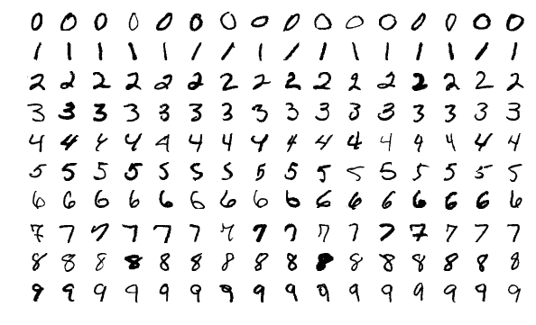
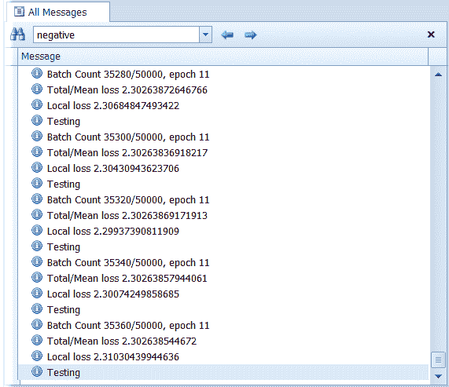
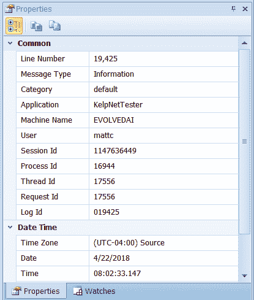
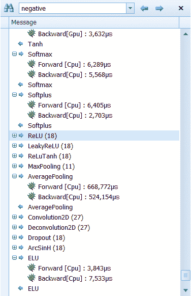
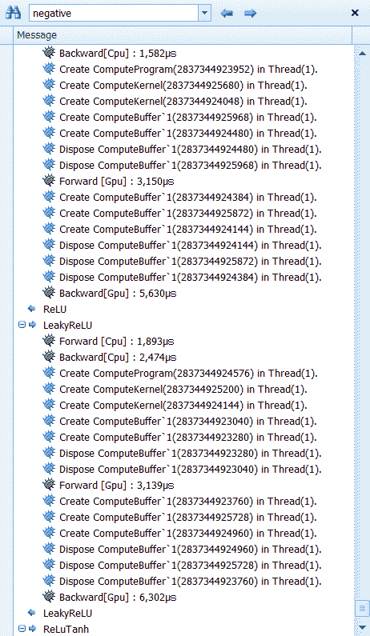
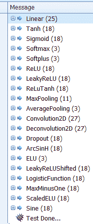
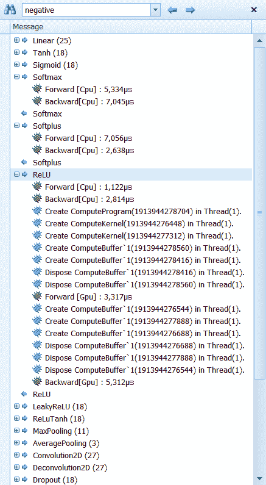

# 第十二章：C# .NET 中的直观深度学习

本章的目标是向您展示 Kelp.Net 提供的强大功能。

在本章中，你将学习：

+   如何使用 Kelp.Net 进行自己的测试

+   如何编写测试

+   如何对函数进行基准测试

+   如何扩展 Kelp.Net

Kelp.Net[4]是一个用 C#和.NET 编写的深度学习库。它能够将函数链入函数堆栈，提供了一个非常灵活和直观的平台，具有极大的功能。它还充分利用了 OpenCL 语言平台，以实现 CPU 和 GPU 设备上的无缝操作。深度学习是一个功能强大的工具，对 Caffe 和 Chainer 模型加载的原生支持使这个平台更加强大。正如你将看到的，你只需几行代码就可以创建一个拥有 100 万个隐藏层的深度学习网络。

Kelp.Net 还使得将模型保存到磁盘存储和从磁盘加载变得非常容易。这是一个非常强大的功能，允许你进行训练、保存模型，然后根据需要加载和测试。它还使得将代码投入生产并真正分离训练和测试阶段变得更加容易。

在其他方面，Kelp.Net 是一个功能强大的工具，可以帮助你更好地学习和理解各种类型的函数、它们的交互和性能。例如，你可以对同一网络使用不同的优化器进行测试，通过更改一行代码来查看结果。你也可以轻松设计测试，以查看使用不同批量大小、隐藏层数量、epoch 等时的差异。在.NET 中，几乎没有提供 Kelp.Net 所具有的强大功能和灵活性的深度学习工作台。

让我们先简单谈谈深度学习。

# 深度学习是什么？

要讨论深度学习，我们需要回顾一下，不久前，大数据出现在我们面前。这个术语当时，现在仍然无处不在。这是一个每个人都必须拥有的技能，一个符合流行术语的清单项。但这个术语究竟意味着什么呢？嗯，它只是意味着，我们不再使用孤立的 SQL 数据库和文件通过 FTP 传输来使用，而是从社交媒体、互联网搜索引擎、电子商务网站等地方爆发了大量的数字数据。当然，这些数据以各种形式和格式出现。更正式地说，我们突然开始处理非结构化数据。不仅由于 Facebook、Twitter、Google 等应用程序的数据爆炸，而且爆炸还在继续。越来越多的人相互连接并保持联系，分享大量关于自己的信息，这些信息他们如果通过电话询问，是绝对不敢提供的，对吧？我们对这些数据的格式和质量几乎没有控制权。随着我们继续前进，这将成为一个重要的观点。

现在，这庞大的数据量是很好的，但人类几乎无法吸收他们每天所接触到的，更不用说数据爆炸了。因此，在这个过程中，人们意识到机器学习和人工智能可以适应这样的任务。从简单的机器学习算法到多层网络，人工智能和深度学习诞生了（至少企业界喜欢相信是这样发生的！）。

深度学习，作为机器学习和人工智能的一个分支，使用许多层级的神经网络层（如果你喜欢，可以称之为分层）来完成其任务。在许多情况下，这些网络被构建来反映我们对我们所了解的人脑的认识，神经元像复杂层叠的网一样连接各个层。这使得数据处理可以以非线性方式发生。每一层处理来自前一层的（当然，第一层除外）数据，并将信息传递给下一层。如果有任何运气，每一层都会改进模型，最终，我们达到目标并解决问题。

# OpenCL

Kelp.Net 大量使用开放计算语言，即 OpenCL。根据维基百科：

“OpenCL 将计算系统视为由多个计算设备组成，这些设备可能是中央处理器（CPU），或者是连接到主机处理器（CPU）的加速器，如图形处理单元（GPU）。在 OpenCL 设备上执行的功能称为内核。单个计算设备通常由多个计算单元组成，这些计算单元又由多个处理元素（PE）组成。单个内核执行可以在所有或许多 PE 上并行运行。”

在 OpenCL 中，任务是在命令队列上安排的。每个设备至少有一个命令队列。OpenCL 运行时将安排的数据并行任务分解成片段，并将任务发送到设备处理元素。

OpenCL 定义了一个内存层次结构：

+   **Global**: 由所有处理元素共享，具有高延迟

+   **Read-only**: 较小，延迟较低，可由主机 CPU 写入但不能由计算设备写入

+   **Local**: 由进程元素组共享

+   **Per-element**: 私有内存

OpenCL 还提供了一个更偏向数学的 API。这可以从固定长度向量类型（如 float4，单精度浮点数的四个向量）的暴露中看出，长度为 2、3、4、8 和 16。随着你对 Kelp.Net 的更多了解以及开始创建自己的函数，你将遇到 OpenCL 编程。现在，只需知道它存在并且被广泛使用就足够了。

# OpenCL 层次结构

在 Kelp.Net 中，各种 OpenCL 资源的层次结构如下所示：


让我们更详细地描述这些。

# 计算内核

内核对象封装了程序中声明的特定内核函数以及执行此内核函数时要使用的参数值。

# 计算程序

由一组内核组成的 OpenCL 程序。程序还可以包含由内核函数调用的辅助函数和常量数据。

# 计算采样器

一个描述如何在内核中读取图像时进行采样的对象。图像读取函数接受一个采样器作为参数。采样器指定图像寻址模式（意味着如何处理超出范围的坐标）、过滤模式以及输入图像坐标是归一化还是未归一化的值。

# 计算设备

计算设备是一组计算单元。命令队列用于向设备排队命令。命令的例子包括执行内核或读取/写入内存对象。OpenCL 设备通常对应于 GPU、多核 CPU 以及其他处理器，如**数字信号处理器**（**DSP**）和 cell/B.E. 处理器。

# 计算资源

一个应用程序可以创建和删除的 OpenCL 资源。

# 计算对象

在 OpenCL 环境中通过其句柄识别的对象。

# 计算上下文

计算上下文是内核实际执行的环境以及定义同步和内存管理的域。

# 计算命令队列

命令队列是一个对象，它包含将在特定设备上执行的操作。命令队列在上下文中的特定设备上创建。对队列的命令按顺序排队，但可以按顺序或非顺序执行。

# 计算缓冲区

一个存储字节线性集合的内存对象。缓冲区对象可以通过在设备上执行的内核中的指针访问。

# 计算事件

事件封装了操作的状态，如命令。它可以用于在上下文中同步操作。

# 计算图像

一个存储 2D 或 3D 结构化数组的内存对象。图像数据只能通过读取和写入函数访问。读取函数使用采样器。

# 计算平台

主机加上由 OpenCL 框架管理的设备集合，允许应用程序共享资源并在平台上的设备上执行内核。

# 计算用户事件

这代表一个用户创建的事件。

# Kelp.Net 框架

# 函数

函数是 Kelp.Net 神经网络的基本构建块。单个函数在函数栈中链在一起，以创建强大且可能复杂的网络链。你需要了解四种主要类型的函数，以及它们的目的，应该是显而易见的：

+   单输入函数

+   双输入函数

+   多输入函数

+   多输出函数

当从磁盘加载网络时，函数也会被链在一起。

每个函数都有一个正向和反向方法，你将在创建自己的函数时实现：

```py
public abstract NdArray[] Forward(params NdArray[] xs);
public virtual void Backward([CanBeNull] params NdArray[] ys){}
```

# 函数栈

函数栈是在一个正向、反向或更新过程中同时执行的一组函数层。当你创建测试或从磁盘加载模型时，会创建函数栈。以下是一些函数栈的示例。

它们也可以很小且简单：

```py
FunctionStack nn = new FunctionStack(
                 new Linear(2, 2, name: "l1 Linear"),
                 new Sigmoid(name: "l1 Sigmoid"),
                 new Linear(2, 2, name: "l2 Linear"));
```

它们可以稍微大一点：

```py
FunctionStack nn = new FunctionStack(
                 new Convolution2D(1, 2, 3, name: "conv1", gpuEnable: true),// Do not forget the GPU flag if necessary
                 new ReLU(),
                 new MaxPooling(2, 2),
                 new Convolution2D(2, 2, 2, name: "conv2", gpuEnable: true),
                 new ReLU(),
                 new MaxPooling(2, 2),
                 new Linear(8, 2, name: "fl3"),
                 new ReLU(),
                 new Linear(2, 2, name: "fl4")
             );
```

或者，它们也可以非常大：

```py
FunctionStack nn = new FunctionStack(
                 new Linear(neuronCount * neuronCount, N, name: "l1 Linear"), // L1
                 new BatchNormalization(N, name: "l1 BatchNorm"),
                 new LeakyReLU(slope: 0.000001, name: "l1 LeakyReLU"),
                 new Linear(N, N, name: "l2 Linear"), // L2
                 new BatchNormalization(N, name: "l2 BatchNorm"),
                 new LeakyReLU(slope: 0.000001, name: "l2 LeakyReLU"),
                 new Linear(N, N, name: "l3 Linear"), // L3
                 new BatchNormalization(N, name: "l3 BatchNorm"),
                 new LeakyReLU(slope: 0.000001, name: "l3 LeakyReLU"),
                 new Linear(N, N, name: "l4 Linear"), // L4
                 new BatchNormalization(N, name: "l4 BatchNorm"),
                 new LeakyReLU(slope: 0.000001, name: "l4 LeakyReLU"),
                 new Linear(N, N, name: "l5 Linear"), // L5
                 new BatchNormalization(N, name: "l5 BatchNorm"),
                 new LeakyReLU(slope: 0.000001, name: "l5 LeakyReLU"),
                 new Linear(N, N, name: "l6 Linear"), // L6
                 new BatchNormalization(N, name: "l6 BatchNorm"),
                 new LeakyReLU(slope: 0.000001, name: "l6 LeakyReLU"),
                 new Linear(N, N, name: "l7 Linear"), // L7
                 new BatchNormalization(N, name: "l7 BatchNorm"),
                 new LeakyReLU(slope: 0.000001, name: "l7 ReLU"),
                 new Linear(N, N, name: "l8 Linear"), // L8
                 new BatchNormalization(N, name: "l8 BatchNorm"),
                 new LeakyReLU(slope: 0.000001, name: "l8 LeakyReLU"),
                 new Linear(N, N, name: "l9 Linear"), // L9
                 new BatchNormalization(N, name: "l9 BatchNorm"),
                 new PolynomialApproximantSteep(slope: 0.000001, name: "l9 PolynomialApproximantSteep"),
                 new Linear(N, N, name: "l10 Linear"), // L10
                 new BatchNormalization(N, name: "l10 BatchNorm"),
                 new PolynomialApproximantSteep(slope: 0.000001, name: "l10 PolynomialApproximantSteep"),
                 new Linear(N, N, name: "l11 Linear"), // L11
                 new BatchNormalization(N, name: "l11 BatchNorm"),
                 new PolynomialApproximantSteep(slope: 0.000001, name: "l11 PolynomialApproximantSteep"),
                 new Linear(N, N, name: "l12 Linear"), // L12
                 new BatchNormalization(N, name: "l12 BatchNorm"),
                 new PolynomialApproximantSteep(slope: 0.000001, name: "l12 PolynomialApproximantSteep"),
                 new Linear(N, N, name: "l13 Linear"), // L13
                 new BatchNormalization(N, name: "l13 BatchNorm"),
                 new PolynomialApproximantSteep(slope: 0.000001, name: "l13 PolynomialApproximantSteep"),
                 new Linear(N, N, name: "l14 Linear"), // L14
                 new BatchNormalization(N, name: "l14 BatchNorm"),
                 new PolynomialApproximantSteep(slope: 0.000001, name: "l14 PolynomialApproximantSteep"),
                 new Linear(N, 10, name: "l15 Linear") // L15
             );
```

# 函数字典

函数字典是一个可序列化的函数字典（之前已描述）。当从磁盘加载网络模型时，将返回一个函数字典，可以像在代码中直接创建函数栈一样对其进行操作。函数字典主要用于与 Caffe 数据模型加载器一起使用。

# Caffe1

Kelp.Net 在 Caffe 风格的开发基础上得到了强化，并支持其许多特性。

Caffe 为多媒体科学家和从业者提供了一个干净且可修改的框架，用于最先进的深度学习算法和一系列参考模型。该框架是一个带有 Python 和 MATLAB 绑定的 BSD 许可证 C++ 库，用于在通用架构上高效地训练和部署通用卷积神经网络和其他深度模型。通过 CUDA GPU 计算，Caffe 满足行业和互联网规模媒体需求，单个 K40 或 Titan GPU 每天处理超过 4000 万张图片（每张图片大约 2 毫秒）。通过分离模型表示和实际实现，Caffe 允许实验，并在平台之间无缝切换，便于开发和部署，从原型机到云环境。

# Chainer

根据 Chainer 文档[2]：

"Chainer 是一个灵活的神经网络框架。一个主要目标是灵活性，因此它必须能够让我们简单直观地编写复杂的架构。"

Chainer 采用定义-运行方案，即网络通过实际的正向计算动态定义。更精确地说，Chainer 存储计算的历史而不是编程逻辑。例如，Chainer 不需要任何魔法就可以将条件语句和循环引入网络定义中。定义-运行方案是 Chainer 的核心概念。这种策略也使得编写多 GPU 并行化变得容易，因为逻辑更接近网络操作。

Kelp.Net 可以直接从磁盘加载 Chainer 模型。

# 损失

Kelp.Net 由一个单一的抽象 `LossFunction` 类组成，该类旨在实现你的特定实例，以确定你如何评估损失。

在机器学习中，损失函数或代价函数是一个将事件或一个或多个变量的值映射到实数的函数，直观地表示与事件相关的某些成本。Kelp.Net 提供了两种现成的损失函数：均方误差和 softmax 交叉熵。你可以轻松扩展这些函数以满足你的需求。

# 模型保存和加载

Kelp.Net 通过调用一个简单的类即可轻松保存和加载模型。`ModelIO` 类公开了 `Save` 和 `Load` 方法，以便轻松地将模型保存到磁盘。以下是一个在训练后保存模型、重新加载并随后对该模型进行测试的非常简单的示例：


# 优化器

优化算法根据模型的参数最小化或最大化误差函数。参数的例子可以是权重和偏差。它们帮助计算输出值，并通过最小化损失来更新模型，使其朝向最优解的位置。将 Kelp.Net 扩展以添加自己的优化算法是一个简单的过程，尽管添加 OpenCL 和资源方面需要协调努力。

Kelp.Net 随带许多预定义的优化器，例如：

+   AdaDelta

+   AdaGrad

+   Adam

+   GradientClipping

+   MomentumSGD

+   RMSprop

+   SGD

这些都是基于抽象优化器类。

# 数据集

Kelp.Net 本地支持以下数据集：

+   CIFAR

+   MNIST

# CIFAR

CIFAR 数据集有两种风味，CIFAR-10 和 CIFAR 100，区别在于每个数据集中的类别数量。让我们简要讨论一下两者。

# CIFAR-10

CIFAR-10 数据集由 10 个类别的 60,000 张 32 x 32 彩色图像组成，每个类别有 6,000 张图像。有 50,000 张训练图像和 10,000 张测试图像。数据集分为五个训练批次和一个测试批次，每个批次有 10,000 张图像。测试批次包含每个类别恰好 1,000 张随机选择的图像。训练批次包含剩余的图像，以随机顺序排列，但某些训练批次可能包含比另一个类别更多的图像。在这些批次之间，训练批次包含每个类别恰好 5,000 张图像。

# CIFAR-100

CIFAR-100 数据集与 CIFAR-10 类似，但它有 100 个类别，每个类别包含 600 张图片。每个类别有 500 张训练图片和 100 张测试图片。CIFAR-100 的 100 个类别被分为 20 个超级类别。每张图片都附有一个精细标签（它所属的类别）和一个粗略标签（它所属的超级类别）。以下是 CIFAR-100 中类别的列表：

| **超级类别** | **类别** |
| --- | --- |
| 水生哺乳动物 | 海狸、海豚、水獭、海豹和鲸鱼 |
| 鱼类 | 水族馆鱼类、扁鱼、鳐鱼、鲨鱼和鲑鱼 |
| 花卉 | 兰花、罂粟花、玫瑰、向日葵和郁金香 |
| 食品容器 | 瓶子、碗、罐头、杯子和盘子 |
| 水果和蔬菜 | 苹果、蘑菇、橙子、梨和甜椒 |
| 家用电器 | 时钟、电脑键盘、灯、电话和电视 |
| 家具 | 床、椅子、沙发、桌子和衣柜 |
| 昆虫 | 蜜蜂、甲虫、蝴蝶、毛毛虫和蟑螂 |
| 大型食肉动物 | 熊、豹、狮子、老虎和狼 |
| 大型人造户外物品 | 桥梁、城堡、房屋、道路和摩天大楼 |
| 大型自然户外景观 | 云、森林、山脉、平原和海洋 |
| 大型杂食性和草食性动物 | 骆驼、牛、黑猩猩、大象和袋鼠 |
| 中型哺乳动物 | 狐狸、刺猬、负鼠、浣熊和臭鼬 |
| 非昆虫无脊椎动物 | 螃蟹、龙虾、蜗牛、蜘蛛和蠕虫 |
| 人群 | 婴儿、男孩、女孩、男人和女人 |
| 爬行动物 | 鳄鱼、恐龙、蜥蜴、蛇和乌龟 |
| 小型哺乳动物 | 仓鼠、老鼠、兔子、鼩鼱和松鼠 |
| 树木 | 榉树、橡树、棕榈、松树和柳树 |
| 车辆 1 | 自行车、公共汽车、摩托车、皮卡和火车 |
| 车辆 2 | 草割机、火箭、电车、坦克和拖拉机 |

# MNIST

MNIST 数据库是一个包含大量手写数字的大型数据库，通常用于训练各种图像处理系统。该数据库在机器学习领域的训练和测试中也得到了广泛的应用。它包含 60,000 个示例的训练集和 10,000 个示例的测试集。数字已经被标准化到固定大小的图像中，并进行了居中处理，这使得它成为想要尝试各种学习技术而不需要预处理和格式化工作的人们的首选标准：



MNIST 示例

# 测试

测试是实际的执行事件，可以说是小型程序。由于使用了 OpenCL，这些程序在运行时进行编译。要创建一个测试，您只需要提供一个静态的`Run`函数，该函数封装了您的代码。Kelp.Net 附带了一个预配置的测试器，这使得添加您自己的测试变得非常简单。我们将在编写测试的章节中详细探讨这一点，现在，这里有一个简单的 XOR 测试程序的示例：

```py
public static void Run()
         {
             const int learningCount = 10000;

             Real[][] trainData =
             {
                 new Real[] { 0, 0 },
                 new Real[] { 1, 0 },
                 new Real[] { 0, 1 },
                 new Real[] { 1, 1 }
             };

             Real[][] trainLabel =
             {
                 new Real[] { 0 },
                 new Real[] { 1 },
                 new Real[] { 1 },
                 new Real[] { 0 }
             };

             FunctionStack nn = new FunctionStack(
                 new Linear(2, 2, name: "l1 Linear"),
                 new ReLU(name: "l1 ReLU"),
                 new Linear(2, 1, name: "l2 Linear"));

             nn.SetOptimizer(new AdaGrad());

             RILogManager.Default?.SendDebug("Training...");
             for (int i = 0; i < learningCount; i++)
             {
                 //use MeanSquaredError for loss function
                 Trainer.Train(nn, trainData[0], trainLabel[0], new MeanSquaredError(), false);
                 Trainer.Train(nn, trainData[1], trainLabel[1], new MeanSquaredError(), false);
                 Trainer.Train(nn, trainData[2], trainLabel[2], new MeanSquaredError(), false);
                 Trainer.Train(nn, trainData[3], trainLabel[3], new MeanSquaredError(), false);

                 //If you do not update every time after training, you can update it as a mini batch
                 nn.Update();
             }

             RILogManager.Default?.SendDebug("Test Start...");
             foreach (Real[] val in trainData)
             {
                 NdArray result = nn.Predict(val)[0];
                 RILogManager.Default?.SendDebug($"{val[0]} xor {val[1]} = {(result.Data[0] > 0.5 ? 1 : 0)} {result}");
             }
         }
```

# 监控 Kelp.Net

ReflectSoftware 的 ReflectInsight 无疑是当今最好的实时日志记录和丰富可视化框架。Kelp.Net 原生支持此框架，因此您很容易看到测试内部的运行情况。

下面是 ReflectInsight 主屏幕的样貌：


Reflect Insight 主屏幕的一个示例

# 表盘

监视器允许您在测试执行过程中关注特定的数据元素。在机器学习领域，理解和看到算法内部的确切运行情况至关重要，而监视面板正是实现这一目标的地方：


# 消息

消息面板是测试执行期间显示每个消息的地方。可用的信息完全取决于您。消息文本左侧显示的图像基于您发送的消息类型（信息、调试、警告、错误等）：



# 属性

每个消息都有预定义的属性，可以通过属性面板查看。有标准属性，如下所示，适用于每个消息。然后还有可自定义的消息属性，可以应用：



消息属性示例

# Weaver

Weaver 是 Kelp.Net 的关键组件，当你运行测试时，你将首先调用这个对象。这个对象包含各种 OpenCL 对象，例如：

+   计算上下文

+   一组计算设备

+   计算命令队列

+   一个布尔标志，指示是否启用 GPU

+   计算平台

+   核心源字典

Weaver 是你告诉程序是否将使用 CPU 或 GPU，以及你将使用哪个设备（如果你的系统具有多个设备）的地方。你只需要在程序开始时调用一次 weaver，就像你在这里看到的那样：

```py
Weaver.Initialize(ComputeDeviceTypes.Gpu);
```

你还可以避免使用 weaver 的初始化调用，并允许它自动确定需要发生什么。

这里是 weaver 的基本内容。其目的是构建（在运行时动态编译）将要执行的程序：

```py
 /// <summary>   The context. </summary>
         internal static ComputeContext Context;
         /// <summary>   The devices. </summary>
         private static ComputeDevice[] Devices;
         /// <summary>   Queue of commands. </summary>
         internal static ComputeCommandQueue CommandQueue;
         /// <summary>   Zero-based index of the device. </summary>
         private static int DeviceIndex;
         /// <summary>   True to enable, false to disable. </summary>
         internal static bool Enable;
         /// <summary>   The platform. </summary>
         private static ComputePlatform Platform;
         /// <summary>   The kernel sources. </summary>
         private static readonly Dictionary<string, string> KernelSources = new Dictionary<string, string>();
```

# 编写测试

为 Kelp.Net 编写测试非常简单。你编写的每个测试只需要公开一个 `Run` 函数。其余的是你想要网络如何运行的逻辑。你的 `Run` 函数的一般指南将是：

+   加载数据（真实或模拟）：

```py
Real[][] trainData = new Real[N][];
             Real[][] trainLabel = new Real[N][];

             for (int i = 0; i < N; i++)
             {
                 //Prepare Sin wave for one cycle
                 Real radian = -Math.PI + Math.PI * 2.0 * i / (N - 1);
                 trainData[i] = new[] { radian };
                 trainLabel[i] = new Real[] { Math.Sin(radian) };
             }
```

+   创建你的函数堆栈：

```py
FunctionStack nn = new FunctionStack(
                 new Linear(1, 4, name: "l1 Linear"),
                 new Tanh(name: "l1 Tanh"),
                 new Linear(4, 1, name: "l2 Linear")
             );
```

+   选择你的优化器：

```py
 nn.SetOptimizer(new SGD());
```

+   训练你的数据：

```py
for (int i = 0; i < EPOCH; i++)
            {
                Real loss = 0;
                for (int j = 0; j < N; j++)
                {
                    //When training is executed in the network, an error is returned to the return value
                    loss += Trainer.Train(nn, trainData[j], trainLabel[j], new MeanSquaredError());
                }
                if (i % (EPOCH / 10) == 0)
                {
                    RILogManager.Default?.SendDebug("loss:" + loss / N);
                    RILogManager.Default?.SendDebug("");
                }
            }
```

+   测试你的数据：

```py
    RILogManager.Default?.SendDebug("Test Start...");
            foreach (Real[] val in trainData)
            {
                RILogManager.Default?.SendDebug(val[0] + ":" + nn.Predict(val)[0].Data[0]);
            }
```

# 基准测试函数

`KelpNetTester` 类中的 `SingleBenchmark` 类允许对各种激活、噪声和其他函数进行简单的基准测试。如果一个函数具有 GPU 功能，那么它将被基准测试，CPU 功能也是如此。时间精度在微秒级别，因为 ReLU 前向通常总是低于 1 毫秒的粒度。

**启用 CPU****启用 GPU**

现在我们来谈谈如何运行单个基准测试。

# 运行单个基准测试

当你运行 `SingleBenchmark` 类时，你将在即将出现的图像中看到的功能将被计时。将提供前向和反向 CPU 和 GPU 的时间（当适用时）。以下是基准测试的折叠视图：



这里是基准测试的展开视图：



# 摘要

在本章中，我们欢迎你进入直观深度学习的世界。我们展示了你如何使用 Kelp.Net 作为你的研究平台来测试几乎任何假设。我们还展示了 Kelp.Net 的强大功能和灵活性。在我们的下一章中，我们将进入量子计算的世界，并展示计算的一小部分未来。戴上你的帽子，这一章是不同的！

# 参考文献

1.  *快速特征嵌入的卷积架构*，Y Jia, E Shelhamer, J Donahue, S Karayev, J Long，第 22 届 ACM 国际会议论文集，2014

1.  Chainer 在 [`docs.chainer.org/en/stable/index.html`](https://docs.chainer.org/en/stable/index.html)

1.  *从微小图像中学习多层特征*，Alex Krizhevsky，2009，见 [`www.cs.toronto.edu/~kriz/learning-features-2009-TR.pdf`](https://www.cs.toronto.edu/~kriz/learning-features-2009-TR.pdf)

1.  原始 Kelp.Net 在 [`github.com/harujoh`](https://github.com/harujoh)

1.  (Filice '15) Simone Filice, Giuseppe Castellucci, Danilo Croce, Roberto Basili，*Kelp：一种基于核的自然语言处理学习平台*，ACL 系统演示会议论文集，北京，中国（2015 年 7 月）
