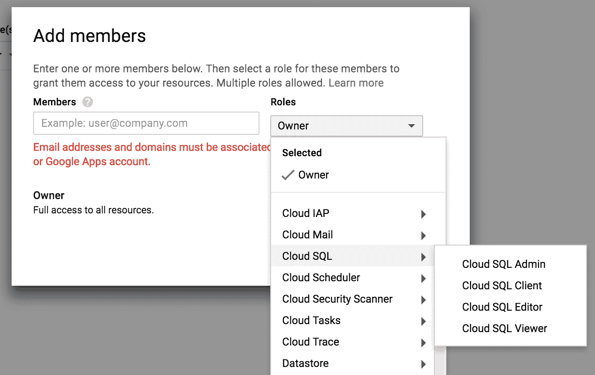

# 第一章：介绍谷歌云平台

本章的第一个介绍性目标是为您提供一个关于**谷歌云平台**（**GCP**）的概述。我们首先解释为什么**机器学习**（**ML**）和云计算是相辅相成的，因为对今天机器学习应用日益增长的计算资源需求。然后，我们全面介绍平台的数据相关服务。账户和项目的创建以及角色分配本章结束。

数据科学项目遵循一系列常规步骤：在提取数据、探索、清洗数据、提取信息、训练和评估模型，最后构建机器学习应用。对于数据科学流程的每个步骤，GCP 中都有一个或多个适当的服务。

但是，在我们展示 GCP 数据相关服务的整体映射之前，了解为什么机器学习和云计算真正是天生一对是很重要的。

在本章中，我们将涵盖以下主题：

+   机器学习和云计算

+   介绍 GCP

+   谷歌平台的数据服务

# 机器学习和云计算

简而言之，**人工智能**（**AI**）需要大量的计算资源。云计算解决了这些担忧。

机器学习是一种新型的显微镜和望远镜，使我们每个人都能推动人类知识和人类活动的边界。随着越来越强大的机器学习平台和开源工具，我们能够征服新的知识领域，发展新的商业模式。在家中、办公室，甚至笔记本电脑的舒适环境中，我们能够更好地理解和预测人类在广泛领域的各种行为。想想医疗保健、交通、能源、金融市场、人类沟通、人机交互、社交网络动态、经济行为和自然（天文学、全球变暖或地震活动）。受人工智能爆炸影响的领域名单实际上是无限的。对社会的影响？令人震惊。

随着如此多的资源对任何有在线连接的人开放，加入人工智能革命的门槛从未像现在这样低。书籍、教程、MOOCs、聚会，以及各种语言的开放源代码库，对资深和初出茅庐的数据科学家都是免费提供的。

如资深数据科学家所熟知，数据科学总是渴望更多的计算资源。在鸢尾花或 MINST 图像数据集上的分类，或者在泰坦尼克号乘客上的预测建模，并不能反映现实世界的数据。现实世界的数据本质上是不干净的、不完整的、有噪声的、多源头的，而且往往数量庞大。利用这些大型数据集需要计算能力、存储、CPU、GPU 和快速的 I/O。

然而，更强大的机器本身并不足以构建有意义的机器学习应用。基于科学，数据科学需要一种科学思维，包括可重复性和审查等概念。通过使用在线可访问的资源，这两个方面都变得更容易。当数据存储在个人电脑上时，共享数据集和模型以及展示结果总是更加困难。使用新数据重现结果和维护模型也需要轻松访问资源。随着我们处理越来越个性化且至关重要的数据（例如在医疗保健领域），隐私和安全问题对于项目利益相关者来说变得更加重要。

这就是云发挥作用的地方，它通过提供可扩展性和可访问性，同时提供足够的保障。

在深入探讨 GCP 之前，让我们先了解一下云。

# 云的本质

机器学习项目资源密集。从存储到计算能力，训练模型有时需要无法在简单独立计算机上找到的资源。近年来，在存储方面的物理限制已经缩小。我们现在可以以较低的价格享受可靠的千兆存储，对于大多数不在大数据领域的数据项目来说，存储不再是问题。计算能力也大幅提升，几年前需要昂贵工作站的任务现在可以在笔记本电脑上运行。

然而，尽管所有这些惊人的快速演变，独立个人电脑的能力是有限的。你可以在机器上存储的数据量以及你愿意等待模型训练的时间都是有限的。人工智能的新领域，如语音转文本、实时视频字幕、自动驾驶汽车、音乐生成或能够欺骗人类并通过图灵测试的聊天机器人，需要越来越多的资源。这对于深度学习模型来说尤其如此，它们在标准 CPU 上运行得太慢，需要基于 GPU 的机器在合理的时间内进行训练。

云中的机器学习不受这些限制。云计算提供的是直接访问**高性能计算**（**HPC**）。在云出现之前（大约在 2006 年 AWS 推出其**弹性计算云**（**EC2**）服务之前），HPC 只能通过超级计算机获得，如克雷计算机。克雷是一家自 1960 年代以来建造了一些最强大超级计算机的美国公司。中国的天河二号现在是世界上最强大的超级计算机，其计算能力为 100,000 petaflops（即 10² x 10¹⁵，或每秒 10 的 17 次方浮点运算！）。

超级计算机不仅成本数百万美元，还需要自己的物理基础设施，并且维护成本高昂。对于个人和大多数公司来说，它都遥不可及。渴望高性能计算（HPC）的工程师和研究人员现在转向按需云基础设施。云服务提供民主化了对 HPC 的访问。

云计算建立在分布式架构之上。处理器分布在不同的服务器上，而不是集中在一台机器上。只需几点击或命令行，任何人都可以在几分钟内注册大量复杂的服务器。您可支配的功率可能会令人震惊。

云计算不仅能处理最苛刻的优化任务，还能在小型数据集上执行简单的回归分析。云计算极其灵活。

总结一下，云计算提供以下服务：

+   **即时性**：资源可以在几分钟内变得可用。

+   **按需使用**：当不再需要时，实例可以被置于待机状态或退役。

+   **多样性**：广泛的操作系统、存储和数据库解决方案，允许架构师创建以项目为中心的架构，从简单的移动应用程序到机器学习 API。

+   **无限资源**：如果还不是无限的，你可以组装的存储、计算和网络资源量是令人震惊的。

+   **GPU**：大多数个人电脑基于 CPU（除了为游戏优化的机器）。深度学习需要 GPU 以实现与人类兼容的训练模型速度。云计算以极低的成本提供 GPU，这比购买 GPU 机器的成本要低得多。

+   **可控的可访问性和安全性**：通过细粒度的角色定义、服务分区、加密连接和基于用户的访问控制，云平台大大降低了入侵和数据丢失的风险。

除了这些，市场上还有几种其他类型的云平台和产品。

# 公共云

根据客户需求，存在两种主要的云模型：公共云与私有云，以及多租户与单租户。这些不同的云类型提供了不同层次的管理、安全和定价。

公共云由位于互联网上的远程资源组成。在公共云中，基础设施通常是多租户的。多个客户可以共享相同的底层硬件或服务器。网络、存储、电力、冷却和计算资源都是共享的。客户通常无法看到基础设施托管的位置，除非选择一个地理位置。公共云服务的定价模式基于数据量、使用的计算能力以及其他与基础设施管理相关的服务——或者更精确地说，是 RAM、vCPU、磁盘和带宽的组合。

在私有云中，资源专门用于单个客户；架构是单租户而不是多租户。服务器位于本地或远程数据中心。客户拥有（或租赁）基础设施并负责维护它。私有云基础设施的运营成本更高，因为它们需要为单个租户提供专用硬件以确保安全。私有云的客户对其基础设施有更多的控制权，因此他们可以实现其合规性和安全要求。

混合云由公共云和私有云的混合组成。

GCP 是一个公共的多租户云平台。您与其他客户共享您使用的服务器，并让谷歌处理支持、数据中心和基础设施。

# 管理云与非管理云

云市场也已经分化为两个大型细分市场——管理云与非管理云。

在非管理云平台上，基础设施是自助服务。在出现故障的情况下，客户有责任实施一些机制来恢复操作。非管理云要求客户拥有构建、管理和维护云实例和基础设施的合格专家资源和资源。专注于自助服务应用程序的非管理云服务不包括其基本层支持。

在管理云平台上，提供商将通过提供监控、故障排除和全天候客户服务来支持底层基础设施。管理云立即为团队带来合格的专家资源和资源。对于许多公司来说，拥有服务提供商来处理他们的公共云可能比雇佣自己的员工来运营他们的云更容易、更经济高效。

GCP 是一个公共的、多租户的、非管理云服务。AWS 和 Azure 也是如此。另一方面，Rackspace 是一家管理云服务公司的例子。例如，Rackspace 于 2017 年 3 月刚刚开始为 GCP 提供管理服务。

# IaaS 与 PaaS 与 SaaS 的比较

另一个重要区别是关于用户或云平台提供商完成的工作量。让我们借助以下服务级别来看看这个区别：

+   **基础设施即服务（IaaS）**：在最低级别，IaaS，云提供商处理机器、虚拟化和所需的网络。用户负责其他所有事情——操作系统、中间件、数据和应用程序软件。提供商是用户在其上构建基础设施的资源的主机。Google 计算引擎、SQL、DNS 或负载均衡是 GCP 中 IaaS 服务的例子。

+   **平台即服务（PaaS）**：在 PaaS 提供中，用户只需负责软件和数据。其余一切均由云提供商处理。提供商构建基础设施，而用户部署软件。PaaS 相较于 IaaS 的主要优势，除了减少工作量和对系统管理员资源的需求外，还包括为 Web 应用提供的自动扩展功能。随着需求的波动，适当数量的资源会自动分配。PaaS 服务的例子包括 Heroku 或 Google App Engine。

+   **软件即服务（SaaS）**：在 SaaS 中，提供商是一家提供在线服务的软件公司，而用户消费的是提供的服务。想想 Uber、Facebook 或 Gmail。

虽然 GCP 主要是一家 IaaS 提供商，但它也有一些 PaaS 提供，如 Google App Engine。而且它的 ML API（文本、语音、视频和图像）可以被视为 SaaS。

# 成本和定价

云服务的定价复杂且因供应商而异。云服务的基本成本结构可以分解为：

+   **计算成本**：按 vCPU 数量、每 GB RAM 运行的 VM 持续时间

+   **存储成本**：每 GB 的磁盘、文件和数据库

+   **网络成本**：内部和外部，入站和出站流量

Google 的预留 VM（AWS Spot 实例）是基于剩余的、未使用的容量构建的 VM，其价格比正常按需 VM 低三到四倍。然而，如果 Compute Engine 需要为其他任务访问这些资源，它可能会终止（预留）这些实例。预留实例适用于批处理作业或可以承受突然中断的工作流程。它们也可能并不总是可用。在下一章中，我们将学习如何从命令行启动预留实例。

Google 云最近也推出了承诺使用量的降价。当你为长期保留实例时，你会获得折扣，通常承诺使用期限为 1 年或 3 年。

当你的基础设施快速演变并需要可扩展性和快速修改时，转移到云中的成本削减论点是成立的。如果你的应用程序非常静态且负载稳定，云可能不会导致成本降低。最终，由于云提供了更多的灵活性，并打开了快速实施新项目的大门，整体成本可能高于固定基础设施。但这种灵活性是云计算的真正好处。

请参阅[`cloud.google.com/compute/pricing`](https://cloud.google.com/compute/pricing)了解当前 Google Compute Engine 的定价。

价格战

在过去几年中，云服务的成本已经大幅下降。自 2012 年以来，三大主要公共云服务提供商经历了连续的价格下降阶段，当时 AWS 大幅降低了其存储价格，以削弱竞争。2012 年，四大主要云服务提供商降低了 22 次价格，2013 年降低了 26 次。降价幅度从 6%到 30%，涉及所有类型的服务：计算、存储、带宽和数据库。截至 2014 年 1 月，亚马逊已经降低了其提供方案的价格超过 40 次。这些降价被其他主要云服务提供商匹配或超过。最近，三大主要角色进一步降低了存储价格，可能重新点燃了价格战。根据最近的一项云计算价格研究，没有多少数据表明云计算已经接近成为商品。451 研究公司表示如此，并进一步预测关系数据库很可能是下一场价格战的战场。

# ML

因此，云计算的优势在于几乎即时的可用性、低成本、灵活的架构和几乎无限的资源，但代价是额外的开销和持续的成本。

在全球云计算的格局中，GCP 是一个公共未管理的 IaaS 云服务，提供一些 PaaS 和 SaaS 服务。尽管 Azure 和 GCP 在标准云服务方面，如计算（EC2、云计算等）、数据库（BigQuery、Redshift 等）、网络等方面可以直接比较，但谷歌云在机器学习方面的方法与亚马逊或 Azure 截然不同。

简而言之，AWS 提供了一站式服务，针对非常具体的应用——如人脸识别和与 Alexa 相关的应用，或者基于经典（非深度学习）模型的预测分析平台，称为 Amazon ML。微软的提供方案更侧重于 PaaS，拥有其 Cortana 智能套件。微软的机器学习服务与 AWS 相当相似，但提供了更多可用的模型。

GCP 的机器学习提供方案基于 TensorFlow，谷歌的深度学习库。谷歌提供了一系列基于预训练 TensorFlow 模型的机器学习 API，用于自然语言处理、语音转文本、翻译、图像和视频处理。它还提供了一个平台，你可以在这里训练自己的 TensorFlow 模型并评估它们（TensorBoard）。

# 介绍 GCP

第一项云计算服务可以追溯到 15 年前，当时在 2002 年 7 月，亚马逊推出了 AWS 平台，以展示亚马逊及其附属公司的技术和产品数据，使开发者能够构建创新和创业应用。2006 年，AWS 作为 EC2 重新推出。

AWS 的早期启动让亚马逊在云计算领域取得了领先地位，这一领先地位从未动摇。竞争对手缓慢地反击并推出他们自己的产品。2008 年 4 月，Google App Engine 作为开发和管理 Web 应用程序的 PaaS 服务推出，这是来自主要公司的 AWS 云服务的第一个替代品。因此，GCP 诞生了。微软和 IBM 也相继跟进，2010 年 2 月推出了 Windows Azure 平台，2009 年 1 月推出了 LotusLive。

Google 直到很久以后才进入 IaaS 市场。2013 年，Google 将 Compute Engine 以企业 **服务级别协议**（**SLA**）的形式向公众发布。

# GCP 的映射

GCP 生态系统拥有超过 40 种不同的 IaaS、PaaS 和 SaaS 服务，丰富而复杂。这些服务可以分为六个不同的类别：

+   托管和计算

+   存储和数据库

+   网络连接

+   机器学习（ML）

+   身份和安全性

+   资源管理和监控

在下一节中，我们将学习如何在 Google Compute Engine 上设置和管理单个虚拟机实例。但在那之前，我们需要创建我们的账户。

# 开始使用 GCP

在 GCP 上开始使用相当直接。您真正需要的是 Google 账户。访问 [`cloud.google.com/`](https://cloud.google.com/)，使用您的 Google 账户登录，并按照说明操作。根据需要添加您的账单信息。这为您提供了访问 GCP 的基于 Web 的用户界面。我们将在下一章中介绍命令行和 Shell 可访问性以及相关的 SSH 密钥创建。

免费试用在撰写本文时，Google 为新账户提供了一项相当慷慨的 12 个月期限和 300 美元的信用额度免费试用服务。然而，某些服务有限制。例如，您不能启动具有超过八个 CPU 的 Google Compute Engine 虚拟机实例，您创建的项目数量也有限制，尽管您可以请求超过分配的配额。没有 SLA。不允许使用 Google Cloud 服务进行比特币挖矿等活动。一旦您升级账户，这些限制就不再适用，并且超出初始 300 美元的余额将记入您的账户。有关免费试用服务的更多信息，请参阅[`cloud.google.com/free/docs/frequently-asked-questions`](https://cloud.google.com/free/docs/frequently-asked-questions)。

# 基于项目的组织

GCP 的一个关键方面是其以项目为中心的组织。所有账单、权限、资源和设置都组在一个用户定义的项目中，这基本上充当了一个全局命名空间。如果不指定项目，就无法启动资源。

这些项目中的每一个都有：

+   一个项目名称，由您选择。

+   一个项目 ID，由 GCP 建议，但可编辑。项目 ID 用于 API 调用和项目内的资源。

+   一个项目编号，由 GCP 提供。

项目 ID 和项目编号在所有 GCP 项目中都是唯一的。项目组织具有几个简单直观的好处：

+   由于资源仅分配给单个项目，因此预算分配和计费都得到了简化。

+   由于分配给项目的资源受相同的区域和区域规则约束，并且共享相同的元数据，因此它们之间的操作和通信无缝进行。

+   类似地，访问管理在单个项目中是一致的，这限制了整体访问控制的复杂性。

基于项目的组织大大简化了您对资源的管理，这也是 GCP 容易使用的关键因素之一。

# 创建您的第一个项目

要创建一个新项目：

1.  前往资源管理页面，[`console.cloud.google.com/cloud-resource-manager`](https://console.cloud.google.com/cloud-resource-manager)。

1.  点击创建项目。

1.  记下您的项目标题，并注意 Google 如何即时生成项目 ID。根据需要编辑它。

1.  点击创建。

1.  您被重定向到 IAM 服务的角色部分。

# 角色和权限

默认情况下，当您创建一个新项目时，您的 Google 账户被设置为项目的所有者，拥有对所有项目资源和计费的全权访问权限。在 IAM 页面的角色部分 [`console.cloud.google.com/iam-admin/roles/`](https://console.cloud.google.com/iam-admin/roles/)，您可以向项目中添加人员并定义该人员的角色。您还可以基于每个服务创建新的自定义角色或分配按服务组织的预定义角色。

1.  前往 IAM 页面并选择您刚刚创建的项目，如果尚未选择：[`console.cloud.google.com/iam-admin/iam/project`](https://console.cloud.google.com/iam-admin/iam/project)。您应该看到您的 Google 账户电子邮件作为项目的所有者。

1.  要向项目中添加新人员：

    1.  点击 + 添加。

    1.  输入人员的 Google 账户电子邮件（它必须对应一个活跃的 Google 账户）。

    1.  选择该人员的所有角色，如以下截图所示：

角色菜单按服务和行政域（计费、日志和监控）组织，并且对于每个服务，按访问级别划分。尽管这取决于服务，但您可以选择以下四种角色类型之一：

+   **管理员**：对资源的完全控制

+   **客户端**：连接访问

+   **编辑器/创建者**：除了用户管理、SSL 证书和删除实例外，拥有完全控制权

+   **查看者**：只读访问

您还可以从 [`console.cloud.google.com/iam-admin/roles/project?project=packt-gcp`](https://console.cloud.google.com/iam-admin/roles/project?project=packt-gcp) 的角色 IAM 页面创建新的自定义角色。

当你为项目分配新的资源时，平台会在服务之间创建适当的和必需的角色和权限。您可以从管理资源页面右侧的信息面板或给定项目的 IAM 页面查看和管理这些访问权限和相关角色。谷歌在生成正确的访问级别方面做得很好，这使得平台用户的生活更加轻松。

我们的谷歌云项目对于这本书，我创建了`packt-gcp`项目。由于该名称在所有其他 GCP 项目中都是唯一的，因此项目 ID 也是`packt-gcp`。并且所有资源都创建在 us-central1 区域。

# 进一步阅读

在整本书中，我将在每一章结束时列出一些在线资源，这些资源回顾或超越了章节中讨论的内容：

+   在谷歌大数据博客[`cloud.google.com/blog/big-data/`](https://cloud.google.com/blog/big-data/)上可以找到许多关于 GCP 用于大数据的精彩文章。

+   GCP 服务有哪些？谷歌软件工程师 Reto Meier 以简单的方式描述了不同的谷歌云服务（更多信息，请参阅[`hackernoon.com/what-are-the-google-cloud-platform-gcp-services-285f1988957a`](https://hackernoon.com/what-are-the-google-cloud-platform-gcp-services-285f1988957a)）。这对于掌握 GCP 服务的多样性非常有用。

+   *谷歌云平台的注释历史*是 Reto Meier 关于 GCP 历史的另一篇文章。您可以在[`medium.com/@retomeier/an-annotated-history-of-googles-cloud-platform-90b90f948920`](https://medium.com/@retomeier/an-annotated-history-of-googles-cloud-platform-90b90f948920)找到它。它从以下项目符号开始：*2008 年之前—计算机发明。谷歌成立...*。在 Crunchbase 上可以找到 GCP 的更详细的时间线，网址为[`www.crunchbase.com/organization/google-cloud-platform/timeline#/timeline/index`](https://www.crunchbase.com/organization/google-cloud-platform/timeline#/timeline/index)。

+   计算能力的演变，也称为摩尔定律，可在[`www.cs.columbia.edu/~sedwards/classes/2012/3827-spring/advanced-arch-2011.pdf`](http://www.cs.columbia.edu/~sedwards/classes/2012/3827-spring/advanced-arch-2011.pdf)找到，以及一个包含最近七个数据点的更近版本，所有这些数据点都是 NVIDIA GPU，可在[`en.wikipedia.org/wiki/Moore%27s_law#/media/File:Moore%27s_Law_over_120_Years.png`](https://en.wikipedia.org/wiki/Moore%27s_law#/media/File:Moore%27s_Law_over_120_Years.png)找到。

+   更多关于三大云平台价格战的信息，请参阅这篇文章：*云定价趋势：获取白皮书，Rightscale*，*2013 年*，在[`www.rightscale.com/lp/cloud-pricing-trends-white-paper`](https://www.rightscale.com/lp/cloud-pricing-trends-white-paper)。

+   可以在[`www.linkedin.com/pulse/supercomputing-vs-cloud-computing-david-stepania/`](https://www.linkedin.com/pulse/supercomputing-vs-cloud-computing-david-stepania/)找到 David Stepania 关于*超级计算与云计算*的好文章。

# 摘要

在本章的介绍中，我们探讨了 GCP 的本质并探索了其服务架构。我们创建了一个新项目并理解了角色创建和分配。尽管 GCP 是云计算市场的新进入者，但它为广泛的用途提供了一套完整的服务。我们将在本书的其余部分深入研究这些服务。

我们现在可以开始使用谷歌平台上的数据科学了。在下一章中，我们将在谷歌计算引擎上创建一个虚拟机实例，并使用 Anaconda 发行版安装数据科学 Python 栈。我们将探索 Web 界面，并学习如何通过命令行和谷歌 Shell 管理实例。
