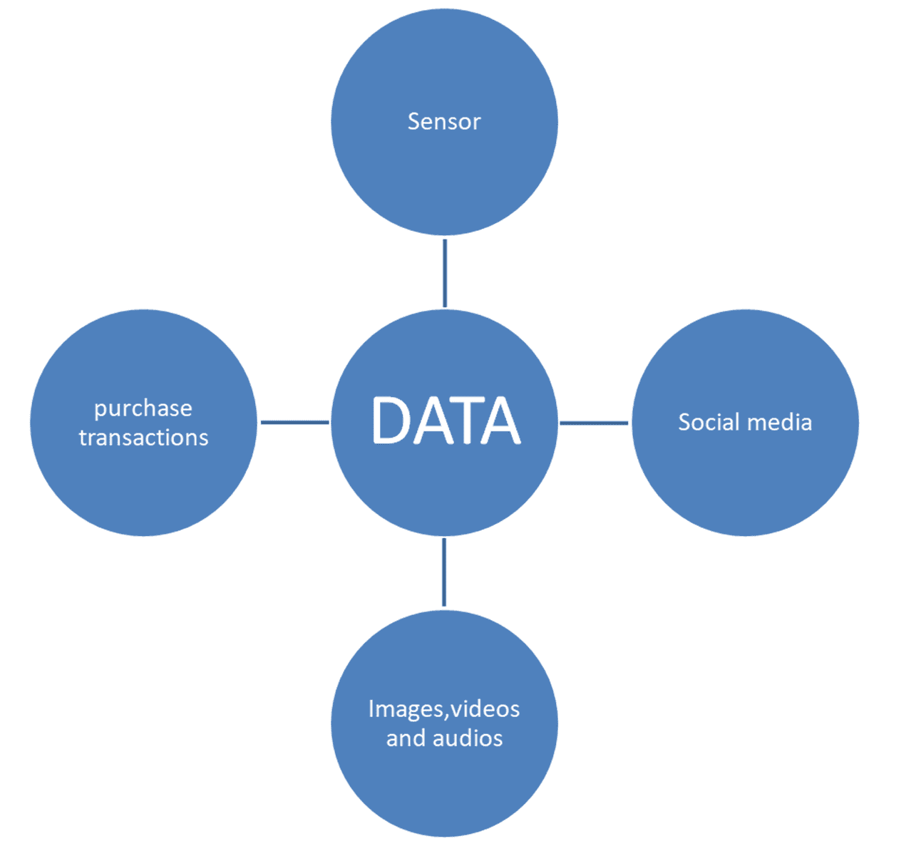
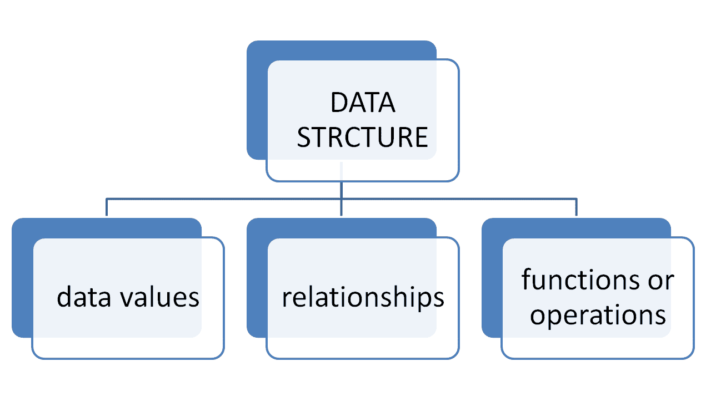
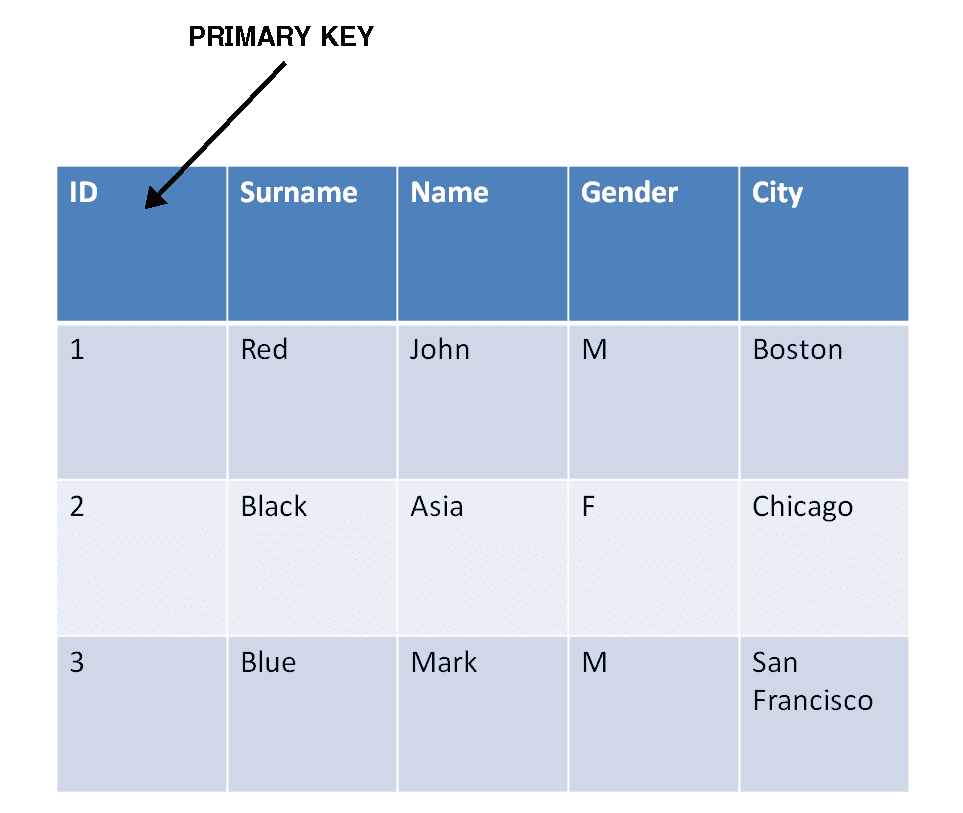
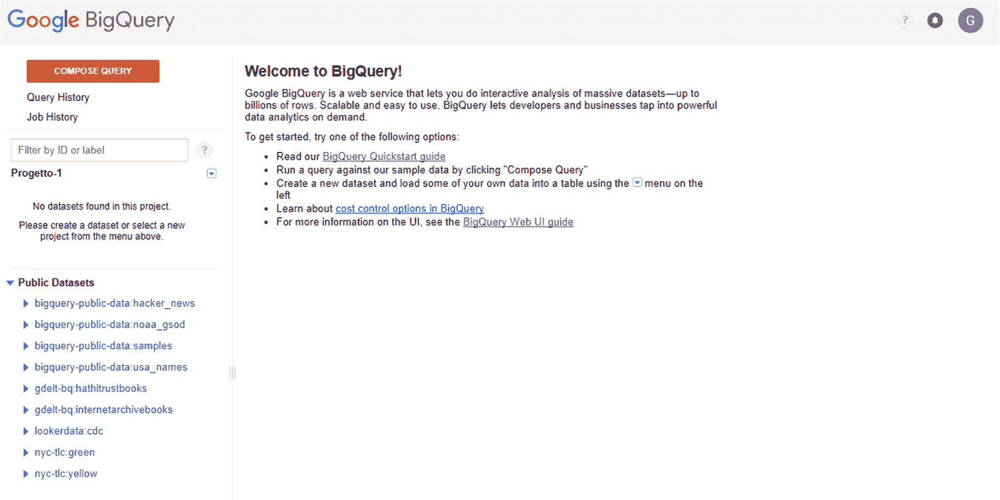
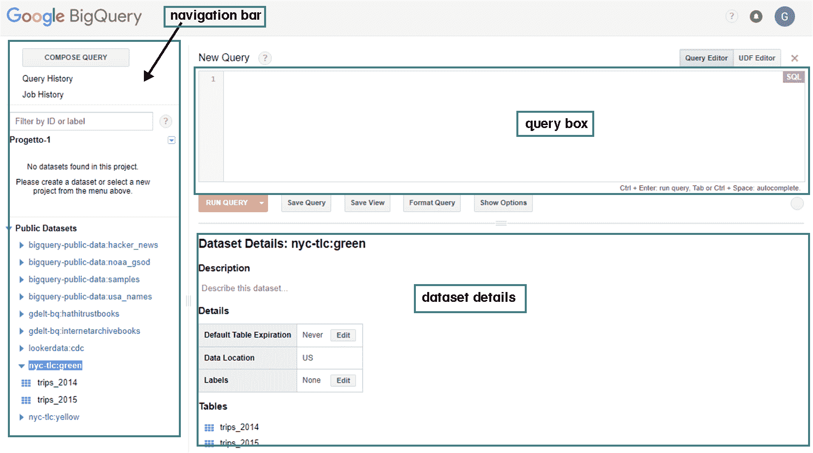
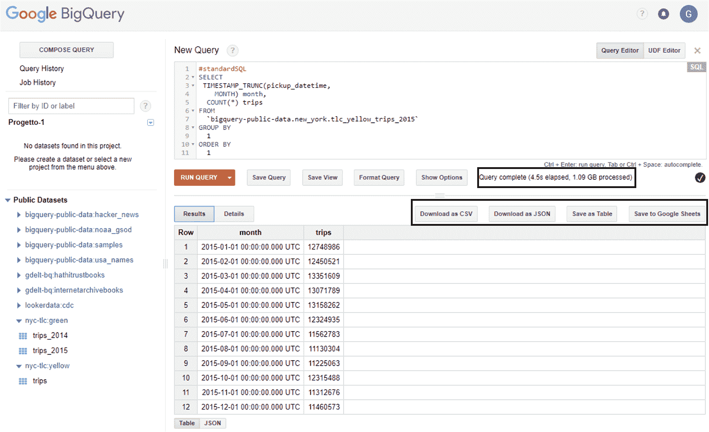
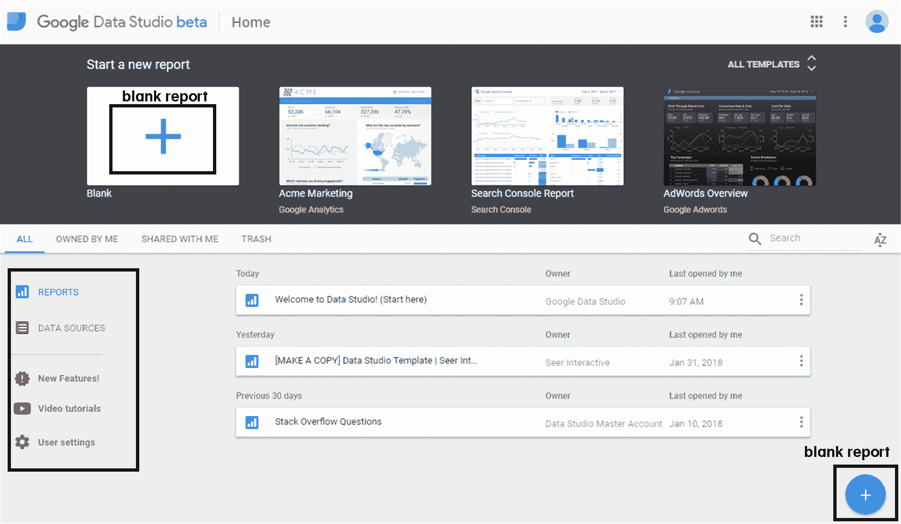
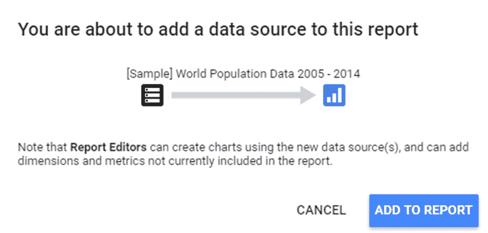
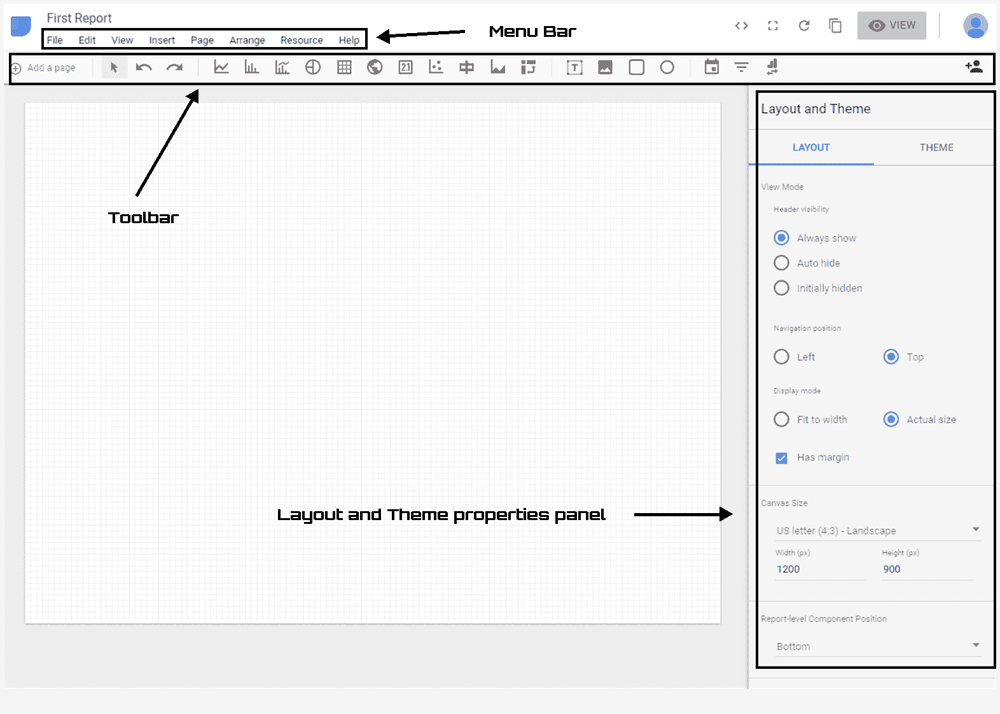
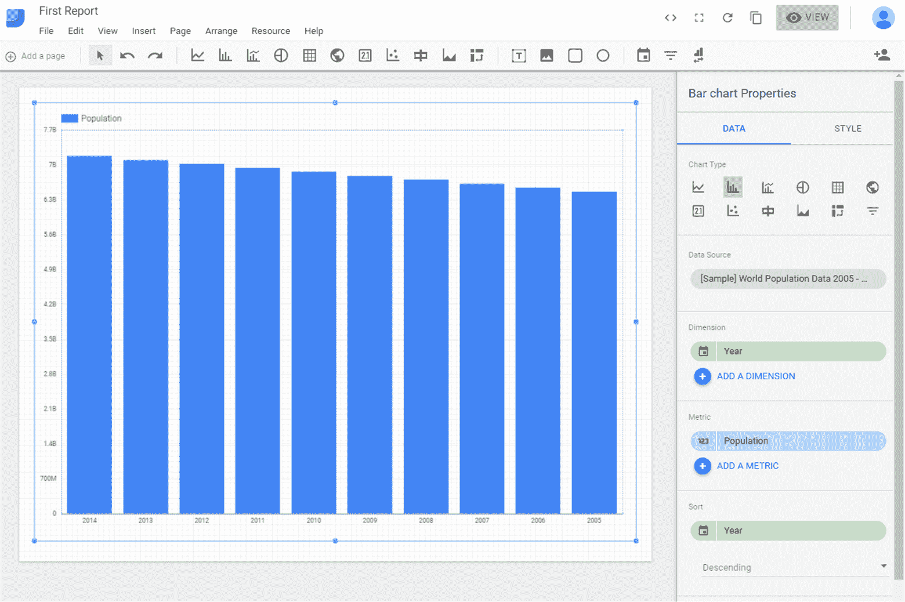

# 第四章：使用 BigQuery 查询您的数据

技术的演变在过去的几年中导致了能够自动化许多操作的电子设备数量的显著增加，无论是在商业世界还是在家庭中。这些设备每天产生大量数据，其数量在近年来呈指数级增长。

这些数据代表了一个巨大的资源，在过去，这种资源并没有被充分表达。今天，大型公司意识到，他们的活动成功至少部分地取决于从处理这些数据中获取的信息。但处理大量数据需要公司付出大量的努力——无论是技术上的还是人力上的。谷歌是第一批理解数据管理重要性的公司之一，随着时间的推移，它创造了一个今天可供公司和个人使用的科技背景。

在本章中，我们将介绍 BigQuery 和 Data Studio 平台，以管理和查看数据。首先，我们将探讨大数据以及管理大量数据所面临的问题。然后，我们将分析如何组织数据以及用于正确查询数据库的工具。考虑到这一点，我们将提出 SQL 语言的介绍。接着，我们将分析 Google BigQuery，这是一个能够实现大规模数据集交互式分析的网络服务。最后，我们将分析如何使用 Google Data Studio 从我们的数据中创建报告。

涵盖的主题包括：

+   大数据

+   查询数据库

+   SQL 语言

+   Google BigQuery

+   Google Data Studio

在本章结束时，读者将能够应用这些工具来分析他们的数据，而无需技术支持。我们将处理几个示例，以使这些工具在实际情况中的使用尽可能现实。

# 接近大数据

社交网络的爆炸式增长，加上智能手机不可阻挡的传播，证明了在创新、营销和信息技术的世界中，近年来反复出现的术语之一就是大数据。这个术语指的是以大量、高速和最多样化的格式产生的大量数据，其处理需要的技术和资源远远超出了传统数据管理和存储系统。但这个术语究竟包含了什么？

在一篇广为引用的文章《大数据时代》中，纽约时报的技术记者 Steve Lohr 这样解释大数据：

“什么是大数据？当然是一个迷因和营销术语，但也是对技术发展趋势的简写，这些趋势为理解世界和做出决策开辟了新的途径。”

对于整篇文章的详细阅读，请参考以下 URL：[`www.nytimes.com/2012/02/12/sunday-review/big-datas-impact-in-the-world.html`](http://www.nytimes.com/2012/02/12/sunday-review/big-datas-impact-in-the-world.html)。

“大数据”这个术语不应误导我们；实际上，乍一看，我们可能会认为这种现象只与数据大小有关。尽管维度确实代表了问题的要素之一，但还有其他方面或大数据的其他属性，它们不一定与它们相关。

“大数据有三个维度——体积、种类和速度，”迈克尔·米内利说。“并且在这三个维度中的每一个维度都包含着广泛的变量。”

让我们更深入地了解与大数据相关的三个维度：

+   **体积**：大数据意味着巨大的数据量。以前，数据是由人创造的。现在，数据由机器、网络和社交媒体生成，需要分析的数据量是巨大的。然而，体积并不是唯一需要解决的问题。

+   **种类**：数据的多样性是由于存储这些数据的许多来源和类型，包括结构化和非结构化数据。在过去，数据存储在电子表格和数据库中。现在，它以照片、视频、音频、电子邮件等形式存在。这种非结构化数据的多样性给数据的存储、提取和分析带来了问题。

+   **速度**：最后，速度指的是数据从工业流程、机器、网络、社交媒体、移动设备等来源到达的顺序。因此，数据流是巨大且连续的。这种实时数据可以帮助研究人员和公司做出重要决策，如果他们能够管理速度，这将提供战略性的竞争优势。

公司正在产生越来越多的数据，记录了数万亿关于客户、供应商和运营的信息字节。这么大的信息量是由于数据大量来自以下来源：

+   收集不同类型数据的传感器

+   映射潜在客户位置的移动电话 GPRS 套餐

+   社交媒体上的内容

+   图片——数字和视频

+   线上购买交易记录

+   任何其他可以产生我们感兴趣信息的数据来源

这在以下图表中展示：



从功能上讲，收集如此大量的结构和非结构化数据可以帮助组织：

+   降低成本

+   提高运营效率和生产力

+   改善客户关系

+   以更明智的方式开发新产品

+   加速和同步交付

+   制定和回应更深入的需求

+   改进并简化决策过程

所有这些对于许多大型公司来说已经是现实。未来的挑战是确保即使是小型公司和个人也能获得资源，使他们能够以简单和实用的方式处理数据。

多亏了数据存储和云计算，记忆、聚合和组合数据（因此使用结果进行深入分析）的能力逐渐变得更加容易获得。换句话说，这些服务继续降低其成本和其他技术障碍，以面对日益高效和高效的服务。例如，通过云计算，可以通过互联网访问高度可扩展的计算资源，通常比在他们的计算机上安装所需的成本要低，因为资源被许多用户共享。

# 数据结构化

每天在世界各地，人类的各种活动都会产生大量数据。最初，这些数据片段并没有结构化，因为它们来自不同性质的资源。因此，它们需要组织起来以便使用。因此，收集的无结构信息必须根据特定要求进行处理，然后作为结构化数据存储。数据结构的形式多种多样，从基本到高级和复杂，它们在数据结构化过程中是必不可少的。

数据结构化包括对作为输入的看似随机和无结构的数据执行的一系列线性或非线性操作。这些操作旨在分析数据的性质及其重要性。然后，系统根据分析结果将数据划分为广泛的信息类别，并将它们存储或发送进行进一步分析。这种附加分析可用于将数据进一步细分为嵌套的子类别。在分析过程中，某些数据也可以被认为是无用的，并最终被丢弃。

这个过程的成果是结构化数据，它可以进一步分析或直接用于提取以前未知的信息。从非结构化数据到有用信息的转变是数据结构化和处理周期的基础，它们的成功往往决定了数据在特定应用领域的价值。

数据结构化是一种组织和存档数据的方法，以便可以高效地访问和修改。特别是，数据结构由一组数据值、它们之间的关系以及可以应用于数据的函数或操作组成，如下面的图所示：



随着时间的推移，数据以不同的方式被组织起来，从编程语言中常用的非常基本的结构，如数组，到可以采取复杂形式的现代数据结构。现代数据结构是不同类型的数据库，支持广泛的扩展操作，允许以许多不同的方式轻松地操作、分类和排序数据。

**关系数据库**是许多人首选的数据结构，因为它们已经被广泛使用了多年。术语**数据库**指的是在特定信息系统、商业、科学、行政或其他类型中使用的数据集。数据库由两种不同类型的信息组成，属于不同的抽象级别：

+   数据，代表要建模的系统实体。这些实体的属性用值（数值、字母数字等）来描述。数据片段也根据它们的共同结构（例如，书籍、作者等）进行分组或分类。

+   结构（元数据），用于描述各种数据类别（如属性值的名字和类型）的共同特征。

数据库必须代表现实的各个方面，特别是除了实际数据外，还必须表示数据之间的关系，即各种类别之间的逻辑连接。例如，将每位作者与其书籍以及反之亦然关联的关联必须被表示。数据库还必须满足以下要求：

+   数据必须以最小冗余组织，也就是说，不应不必要地重复。这一条件源于避免不仅是不必要地使用存储资源，而且更重要的是避免管理多个副本的负担；此外，如果与某一类数据相关的信息被重复，那么在其中一个副本上执行更新而未在其他副本上显示，可能会对所有数据的完整性和可靠性产生负面影响。

+   数据必须能够同时被多个用户使用。这一要求源于前一点；应避免每个用户（或用户类别）在自己的数据副本上工作的情形，而必须有一个单一的数据版本，所有用户都可以访问；这暗示了每种类型的用户都需要对数据有一个特定的视图和特定的数据访问权限。此外，还需要技术来防止各种用户的活动在同时使用相同数据时产生冲突。

+   数据必须是永久的。这不仅仅意味着使用大容量存储器，还意味着在系统任何组件出现故障的情况下，必须应用技术来保存数据集。

表是关系数据库的基本数据结构。表代表概念模式中的实体和关系。它由记录（行或元组）和字段（列或属性）组成：

+   每条记录代表实体/关系的实例（或发生或元组）。

+   每个字段代表实体/关系的属性。

对于每个字段，都确定了其域（数据类型）：字母数字、数值、日期、布尔值等。

唯一标识表中记录的值的一组字段称为**主键**。当主键仅由一个字段组成时，它被称为**键字段**。以下图显示了数据库中主键的一个示例：



当在实体的属性之间找不到键字段时，定义一个自动增加（计数器）的数字 ID 字段。

引用完整性是关系模型的一组规则，它通过外键将关系相互关联时保证数据完整性：这些规则用于验证表之间的关联，并消除插入、删除或修改链接数据时的错误。

索引在数据库中是相关的。索引是一种旨在提高数据搜索时间的数据结构。对于需要搜索或连接操作的字段可以建立索引。在没有索引的情况下，对字段值的搜索是在表中的记录上顺序进行的。索引自动从数据库为定义为键的字段生成。

# 查询数据库

到目前为止，我们已经看到了如何从非结构化信息移动到结构化信息。特别是，我们已经了解到这项操作需要大量资源。对正确结构化数据的需要源于在数据库中搜索信息以提取知识的需求。

任何**数据库管理系统**（**DBMS**）都提供了一个非常强大的工具来咨询数据库表的内容：查询。

数据库管理系统（DBMS）是一种软件系统，旨在允许创建、操作（由数据库管理员（DBA）管理员操作）和高效查询（由一个或多个客户端用户操作）数据库，因此也称为**数据库管理器**或**引擎**，并托管在专用硬件架构（服务器）或简单计算机上。

查询是查询数据库的方法，即显示从表中提取的信息。为此，可以执行以下操作：

+   根据各种标准过滤表中的数据

+   重新关联不同表中的数据

+   选择要查看的字段

+   根据某些字段的值对结果进行排序

+   组（聚合）记录在某个字段具有相同值

查询可以执行以仅显示一次结果，也可以保存到数据库中以便多次执行。如果您在更改表后再次使用查询，查询结果将返回新的表内容。

例如，假设您有一个包含两个表的图书馆数据库：

+   书籍表表示目录中的书籍，包含字段`ID_Book`（主键）、标题、作者、年份、价格、出版社

+   出版社表表示图书馆有联系的出版社，包括字段出版社（主键）、城市、电话

想象一下，想要定义一个查询，显示所有书籍的标题和价格。这个查询需要访问书籍表，并向用户展示仅选择的两个字段（标题和价格）。如果书籍表包含 80 卷，查询将显示 80 个标题和价格对的结果。如果从书籍表中删除了一条记录，重新运行已定义的查询将只显示 79 个标题和价格对，而无需干预查询的定义。

# SQL 基础

在这一点上，提出以下问题是合法的：*使用哪种语言来编写数据库查询？*我们需要一种查询语言，这种语言是用户用来在数据库和信息系统中创建查询的语言。它用于通过相关的数据库管理系统（DBMS）查询数据库，然后与用户及其服务请求进行接口。普遍使用的查询语言是 SQL。

SQL 是一种定义和操作数据的语言。作为操作语言，SQL 允许从数据库中选择感兴趣的数据并更新其内容。查询既用于数据定义的 SQL 构造中，也用于数据库更新的构造中。

SQL 是一种声明性语言：它允许你指定要查找的内容，而不必说明如何查找。当查询处理器执行查询时，它会在系统内部被转换成一种过程性语言，这种语言允许指定如何访问数据。通常，一个 SQL 查询会被转换成多种过程性语言。查询优化器的任务是选择最有效的执行计划。

在数据库上执行一个 SQL 查询，然后在一个通过外键机制相互连接的表集上执行。查询的结果是一个表。我们将通过示例来介绍 SQL，即展示越来越丰富和复杂的查询示例。

要理解 SQL 是如何工作的，我们分析包含意大利博物馆两年游客数量的表格，如下截图所示：


这个表名为**Museum**；可以编写的最简单的查询如下：

```py
select *
from museum
```

结果是整个博物馆表。查询的第一行称为`select`语句，用于从数据库中检索数据。`*`运算符允许我们选择所有列。查询的第二行称为`from`语句，用于指示要使用哪些表。在查询中，`select`语句和`from`语句是强制性的。请密切关注每个查询中 SQL 关键字的组成部分的大小写、空格和逻辑分隔。

如果我们只对博物馆的名称和所在城市感兴趣，我们可以这样选择它们：

```py
select Museum, City
from museum
```

结果是以下表格：

| **博物馆** | **城市** |
| --- | --- |
| 科洛西奥和罗马广场 | 罗马 |
| 庞贝考古遗址 | 庞贝 |
| 乌菲齐美术馆 | 佛罗伦萨 |
| 佛罗伦萨学院美术馆 | 福尔尼兹 |
| 圣安杰洛城堡 | 罗马 |
| 文尼亚雷亚莱 | 文尼亚雷亚莱 |
| 都灵埃及博物馆 | 都灵 | 1012033 |
| 博洛尼亚博物馆… | 福尔尼兹 |
| 卡塞塔王宫 | 卡塞塔 |
| 博尔盖塞美术馆 | 罗马 |

为了阐明数据库表和 SQL 表之间的区别，我们看到了一个生成具有相同名称两列的表的简单查询：

```py
select Museum, Museum
from museum
```

结果如下表所示：

| **博物馆** | **博物馆** |
| --- | --- |
| 科洛塞奥和罗马广场 | 科洛塞奥和罗马广场 |
| 庞贝考古遗址 | 庞贝考古遗址 |
| 乌菲齐美术馆 | 乌菲齐美术馆 |
| 佛罗伦萨学院美术馆 | 佛罗伦萨学院美术馆 |
| 圣安杰洛城堡 | 圣安杰洛城堡 |
| 文尼亚雷亚莱 | 文尼亚雷亚莱 |
| 都灵埃及博物馆 | 都灵埃及博物馆 |
| 博洛尼亚博物馆… | 博洛尼亚博物馆… |
| 卡塞塔王宫 | 卡塞塔王宫 |
| 博尔盖塞美术馆 | 博尔盖塞美术馆 |

一个 SQL 表可以包含具有相同名称的重复行和列。列通过其位置唯一标识。这对于查询结果表也是正确的。数据库表，即数据库的一部分，不能有具有相同名称的列。

此外，我们展示了一个生成具有相等行的简单查询：

```py
select city
from museum
```

结果如下表所示：

| **城市** |
| --- |
| 罗马 |
| 庞贝 |
| 福尔尼兹 |
| 福尔尼兹 |
| 罗马 |
| 文尼亚雷亚莱 |
| 都灵 |
| 福尔尼兹 |
| 卡塞塔 |
| 罗马 |

此外，你可以在`select`关键字之后指定`distinct`关键字以消除重复项：

```py
select distinct city
from museum
```

结果如下表所示：

| **城市** |
| --- |
| 罗马 |
| 庞贝 |
| 福尔尼兹 |
| 文尼亚雷亚莱 |
| 都灵 |
| 卡塞塔 |

现在让我们介绍`where`子句：

```py
select Museum,City
from museum
where City = 'Rome'
```

结果如下表所示：

| **博物馆** | **城市** |
| --- | --- |
| 科洛塞奥和罗马广场 | 罗马 |
| 圣安杰洛城堡 | 罗马 |
| 博尔盖塞美术馆 | 罗马 |

如果你想要在数据库中查找特定的项目或项目组，你需要一个或多个条件。条件包含在`where`子句中。例如，要查找 2016 年注册的游客数量超过一百万的博物馆，我们必须编写：

```py
select Museum, City, Visitors_2016
from museum
where Visitors_2016 >= 1000000
```

结果如下表所示：

| **博物馆** | **城市** | **Visitors_2016** |
| --- | --- | --- |
| 科洛塞奥和罗马广场 | 罗马 | 6408852 |
| 庞贝考古遗址 | 庞贝 | 3283740 |
| 乌菲齐美术馆 | 福尔尼兹 | 2010631 |
| 佛罗伦萨学院美术馆 | 福尔尼兹 | 1461185 |
| 圣安杰洛城堡 | 罗马 | 1234443 |
| 文尼亚雷亚莱 | 文尼亚雷亚莱 | 1012033 |

在这一系列示例中，我们学习了如何使用 SQL 语言正确地提出数据库查询。正如我们所看到的，使用 SQL 非常简单。在以下表中列出了一些最重要的 SQL 命令：

| **命令** | **简要描述** |
| --- | --- |
| `SELECT` | 从数据库中提取数据 |
| `UPDATE` | 更新数据库中的数据 |
| `DELETE` | 从数据库中删除数据 |
| `INSERT INTO` | 将新数据插入到数据库中 |
| `CREATE DATABASE` | 创建一个新的数据库 |
| `ALTER DATABASE` | 修改一个数据库 |
| `CREATE TABLE` | 创建一个新的表 |
| `ALTER TABLE` | 修改一个表 |
| `DROP TABLE` | 删除一个表 |
| `CREATE INDEX` | 创建一个索引（搜索键） |
| `DROP INDEX` | 删除一个索引 |

我们现在将讨论其他 SQL 查询，以便我们能够获得更多的技能。

# Google BigQuery

数据是公司管理和增长的基本因素。确保数据得到保护、可用且易于访问是任何 IT 部门的基本要求。更重要的是，另一个要求是确保数据被正确使用：管理流程、向决策者提供信息，以及在不断变化的环境中智能干预。

公司确保数据可用性的方式正在迅速变化。云计算近年来在概念和实践的 IT 基础设施组成部分上都取得了令人印象深刻的增长。

云计算是一种技术，允许通过远程服务器使用软件和硬件资源（如用于数据存储的大容量存储），其使用由提供商提供，具体来说是通过订阅提供。

一个特别有趣的云计算解决方案是谷歌 BigQuery。BigQuery 是一个旨在允许你对大型数据集进行查询的 Web 服务；例如，它能够在几秒钟内对包含数十亿记录的表执行选择和聚合查询，因此，以交互式方式获取以前需要几天才能计算的信息将是一个很好的进步。

BigQuery 使全球的公司和开发者能够实时管理大量数据，无需任何硬件或软件投资。例如，如果一家大型跨国公司需要根据销售和广告数据优化其日常支出，或者即使是一家小型在线零售商需要根据用户点击更改产品展示，谷歌提供的服务都是有用的。正如生产商自己所说的，该系统还旨在帮助许多公司应对当前的世界经济危机。

通过将 BigQuery 作为一个公共服务，谷歌声称在使大数据分析通过云服务对所有企业可访问的努力中达到了一个重要的里程碑。BigQuery 通过一个简单的用户界面提供访问，允许你利用谷歌提供的计算能力。收集的数据在多个安全级别得到保护，在多个服务器上复制，并且可以轻松导出。开发者和企业可以在线订阅该服务，并免费获得每月 100 GB 的数据。

BigQuery 的主要特点包括：

+   **可扩展性**：云计算的一个固有优势是能够根据需求扩展基础设施，确保应用容量根据需求的增加实现动态可扩展性。这在托管应用程序的峰值使用水平随着时间的推移而持续变化时尤其有用。

+   **交互性**：能够在几秒钟内对数十亿条记录执行选择或分组查询。

+   **熟悉性**：使用 SQL 语法编写查询。

它还允许良好的数据共享，使用 Google Storage 允许您创建一个协作中心。每当需要与其他用户共享数据时，可以通过设置**访问控制列表**（**ACL**）来允许那些希望适当访问信息的人访问信息。

ACL 是一种机制，用于表达复杂的规则，这些规则决定了 IT 系统的一些资源是否被其用户访问。

BigQuery 包含允许创建、填充和删除表以及在其上查询的方法。使用 SQL 语法在 BigQuery 中编写查询是可能的；在这个方言中，一些 SQL 方法已被修改以加快某些查询的执行速度；在这些情况下，如果结果精度不是关键，它们基于统计估计并返回一个指示性值。

# BigQuery 基础

BigQuery 是 Google Analytics 的数据仓库。它基本上是一个完全托管、PB 级别且低成本的工具。BigQuery 是 NoOps：术语 **NoOps**（代表 **no operation**）用于标识一个 IT 环境，该环境自动化程度高，从底层基础设施中抽象出来，不需要专门的团队来管理内部软件。实际上，在 BigQuery 中没有要管理的基础设施，也不需要数据库管理员。节省的时间可以用来分析数据，以找到有意义的信息。在 BigQuery 中形成查询时，我们可以使用熟悉的 SQL 语法，非常容易学习，且非常有效。但使用这项技术的真正便利之处来自于实际节省，这是由于按需付费的模型，它允许我们只为执行特定分析所需的资源实际使用量付费。

要访问 BigQuery，我们基本上可以使用三种模式：

+   使用图形网页界面

+   使用命令行工具

+   使用 API 或客户端库

在本章中，我们将仅通过图形界面分析 BigQuery 的操作。

# 使用图形网页界面

BigQuery 可以通过一个网页图形用户界面进行访问，该界面可用于加载数据、导出数据、在浏览器中执行查询以及执行其他用户和管理任务。网页用户界面可以在任何浏览器中运行，尽管谷歌推荐使用 Chrome 网页浏览器，因为它能产生最佳性能。

要通过网页界面访问 BigQuery，请访问以下链接：

[`bigquery.cloud.google.com`](https://bigquery.cloud.google.com)

一旦登录，你将看到如下所示的 BigQuery 控制台：



在 BigQuery 控制台中，会显示一条欢迎信息。在其中，提出了各种活动供我们选择：

+   阅读 BigQuery 快速入门指南

+   通过点击“编写查询”来运行一个查询——在已提供的样本数据上练习——

+   使用左侧菜单创建一个新的数据集并将数据加载到表中

+   发现 BigQuery 中的成本控制选项

+   最后，参考 BigQuery 网络用户界面指南以获取有关用户界面的更多信息

要详细分析 BigQuery 控制台，我们将选择第二个选项，然后点击左上角的“编写查询”按钮。这样，就会显示如下所示的窗口：



在前面的屏幕截图中，两个主要部分被突出显示：

+   **导航栏**：从顶部开始，它包含一个元素列表，描述了你想要执行的操作：编写查询、查看查询历史或查看作业历史。继续向下，我们可以识别出当前项目中具有读取访问权限的数据集列表，以及一个名为**公共数据**的公开数据集。此列表显示了一系列公开数据库，这些数据库为我们提供了练习的机会。要使用这些数据，只需点击任何数据集旁边的数据集展开图标或数据集名称，这样链接就会扩展，我们就可以查看该数据集中的表。

+   **查询框**：表示一个可以在其中使用 SQL 语法编写查询的框。这是窗口的主要部分，因为它代表了我们的查询形成的地方。正如预期的那样，为了形成查询，我们需要使用我们在前几节中至少部分看到的 SQL 语法。当然，在我们将要提出的例子中，我们将有机会深入探讨这个话题。在正确地形成要执行的查询后，只需点击查询框底部的“运行查询”按钮即可。

+   **数据集详情**：表示包含我们在导航栏中选择的数据的摘要部分。提出了数据集的名称、其内容的简要描述、一系列细节，最后是该数据集中的表。要预览单个表的内容，只需点击表名。

让我们通过一个例子来了解 BigQuery 控制台的使用便捷性。我们使用以下一个公开数据集：

`bigquery-public-data.new_york.tlc_yellow_trips_2015`.

此数据集由纽约市**出租车和豪华轿车委员会**（**TLC**）收集，包括从 2009 年至今所有黄色和绿色出租车在纽约市完成的行程记录，以及从 2015 年至今所有**出租车**（**FHV**）的行程记录。记录包括捕获接车和下车日期/时间、接车和下车地点、行程距离、详细费用、费率类型、支付类型和司机报告的乘客数量等字段。

以下表格列出了数据集中包含的几个字段及其内容的简要描述：

| **字段名称** | **简要描述** |
| --- | --- |
| `vendor_id` | 一个代码，表示提供记录的 TPEP 提供商。*1=Creative Mobile Technologies, LLC*；*2=VeriFone Inc*。 |
| `pickup_datetime` | 车载计价器启动的日期和时间。 |
| `dropoff_datetime` | 车载计价器断开连接的日期和时间。 |
| `passenger_count` | 车辆中的乘客数量。这是一个司机输入的值。 |
| `trip_distance` | 由计价器报告的行程距离（英里）。 |
| `pickup_longitude` | 车载计价器启动时的经度。 |
| `pickup_latitude` | 车载计价器启动时的纬度。 |
| `rate_code` | 行程结束时的最终费率代码。*1=标准费率*，*2=JFK*，*3=纽瓦克*，*4=纳萨乌或韦斯特切斯特*，*5=协商费用*，*6=团体行程*。 |
| `store_and_fwd_flag` | 此标志指示行程记录在发送到供应商之前是否保留在车辆内存中，也称为**存储和转发**，因为车辆没有连接到服务器。*Y=存储和转发行程*；*N=非存储和转发行程*。 |
| `dropoff_longitude` | 车载计价器断开连接时的经度。 |
| `dropoff_latitude` | 车载计价器断开连接时的纬度。 |
| `payment_type` | 一个数字代码，表示乘客如何支付行程费用。*1=信用卡*，*2=现金*，*3=免费*，*4=争议*，*5=未知*，*6=作废行程*。 |
| `fare_amount` | 车载计价器计算的时间-距离费率。 |
| `extra` | 杂项额外费用和附加费。目前，这仅包括$0.50 和$1 的拥堵时段和夜间费用。 |
| `mta_tax` | 基于使用的计价器费率的自动触发的$0.50 MTA 税。 |
| `tip_amount` | 小费金额——此字段自动填充信用卡小费。不包括现金小费。 |
| `tolls_amount` | 行程中支付的所有过路费总额。 |
| `imp_surcharge` | 在标志放下时对行程征收的$0.30 改善附加费。改善附加费始于 2015 年开始征收。 |
| `total_amount` | 向乘客收取的总金额。不包括现金小费。 |

首先，让我们向数据库提出一个简单的查询。*2015 年，黄色出租车每个月的行程数是多少？* 这个查询必须返回 2015 年所有黄色出租车的月度行程总数。有人可能会认为我们开始得太简单了；实际上，对于大多数小城市来说，计算每个月的出租车呼叫似乎微不足道。这对于像纽约这样的大都市来说并非如此。事实上，我们正在谈论一个 18.1 GB 的数据库，包含 146,112,989 个观测值。

然后让我们看看要插入查询框的 SQL 代码：

```py
#standardSQL
SELECT
 TIMESTAMP_TRUNC(pickup_datetime,
    MONTH) month,
  COUNT(*) trips
FROM
  `bigquery-public-data.new_york.tlc_yellow_trips_2015`
GROUP BY
  1
ORDER BY
  1
```

让我们逐行解释，以理解每个命令的含义。让我们从第一行开始：

```py
#standardSQL
```

第一行是为了让 BigQuery 知道您想使用 SQL 标准。我们可以为查询启用标准 SQL，这样您就不必在 SQL 中插入此标记。要做到这一点，只需点击查询框下方立即显示的“显示选项”按钮。在打开的选项中，取消选中“使用旧版 SQL”复选框。让我们继续分析查询：

```py
SELECT
 TIMESTAMP_TRUNC(pickup_datetime, MONTH) month,
  COUNT(*) trips
```

在这段代码中，我们使用了`SELECT`语句，正如在前几节中已经预料的，它从数据库中检索数据。在语句的第一部分，您指定要检索哪些数据。我们说过，每个月的行程数在 us 中。为此，我们将计算每个月的行数。回想一下，数据库中的每一行对应一次行程。包含此信息的字段是`pickup_datetime`。为了以易于阅读的格式返回数据，我们使用了`TIMESTAMP_TRUNC`函数，该函数截断到`TIMESTAMP`值（返回值类型为`TIMESTAMP`）。然后，我们使用了`count()`函数，该函数返回符合指定标准的行数。让我们继续前进：

```py
FROM
  `bigquery-public-data.new_york.tlc_yellow_trips_2015`
```

使用`FROM`子句，我们选择要搜索的表。最后两行：

```py
GROUP BY
  1
ORDER BY
  1
```

这些行被插入以分组和排序数据。结果如下表所示：

| **行** | **月份** | **行程** |
| --- | --- | --- |
| 1 | 2015-01-01 00:00:00.000 UTC | 12748986 |
| 2 | 2015-02-01 00:00:00.000 UTC | 12450521 |
| 3 | 2015-03-01 00:00:00.000 UTC | 13351609 |
| 4 | 2015-04-01 00:00:00.000 UTC | 13071789 |
| 5 | 2015-05-01 00:00:00.000 UTC | 13158262 |
| 6 | 2015-06-01 00:00:00.000 UTC | 12324935 |
| 7 | 2015-07-01 00:00:00.000 UTC | 11562783 |
| 8 | 2015-08-01 00:00:00.000 UTC | 11130304 |
| 9 | 2015-09-01 00:00:00.000 UTC | 11225063 |
| 10 | 2015-10-01 00:00:00.000 UTC | 12315488 |
| 11 | 2015-11-01 00:00:00.000 UTC | 11312676 |
| 12 | 2015-12-01 00:00:00.000 UTC | 11460573 |

如您所见，每个月的行程数量从最低的 11,130,304 到最高的 13,351,609 不等。以下截图显示了 BigQuery 控制台中的结果：



在之前的屏幕截图中，有两个细节被突出显示：

+   关于计算时间和处理数据的报告

+   一系列结果存储选项

在第一种情况下，BigQuery 告诉我们，为了完成操作，Google 资源已经投入了 4.5 秒，在此期间处理了 1.09GB 的数据。这些信息将有助于计算交易的成本。

在上一张图像中，我们强调了可用的存储选项。提供了四种选项供我们选择：

+   下载为 CSV

+   下载为 JSON

+   以表格形式保存

+   保存到 Google Sheets

如果你还记得，JSON 语法是 JavaScript 语法的子集，而 Google Sheets 是一个在线电子表格应用程序，允许用户创建和格式化电子表格，并与其他人同时工作。

在上一张截图上，你可以注意到在结果的最上方有两个标签页：结果和详情。到目前为止，我们已经看到了结果标签页返回的内容；现在让我们看看点击详情标签页会看到什么。一系列关于执行操作的统计数据返回给我们，如下所示：

```py
Job ID   progetto-1-191608:bquijob_1d181029_1614bc7198f
Creation Time  Jan 31, 2018, 11:33:14 AM
Start Time     Jan 31, 2018, 11:33:15 AM
End Time Jan 31, 2018, 11:33:18 AM
User     xxxxxx@gmail.com
Bytes Processed      1.09 GB
Bytes Billed   1.09 GB
Slot Time (ms) 153 K
Destination Table    progetto-1-191608:_b6e2bd761c7590ee099d343a7b87889c01400431.anond9ac14f20bd65f3658af2aa65b7b8847b7d677be
Use Legacy SQL false
```

这条信息再次提到了我们进行的查询和获得的结果。

# 使用 Google Data Studio 可视化数据

Google Data Studio 是一个**免费**的工具，它允许我们快速轻松地创建吸引人的报告。我们终于可以告别冗余和令人困惑的数据表了。实际上，使用 Data Studio，除了能够插入简单的表格外，还可以附加可定制的图形，具有各种颜色和字体，易于理解。由于 Google Data Studio 是 Google Drive 应用程序，因此共享报告变得更加容易，它的工作方式与 Google Drive 类似。

对公司来说最重要的新闻（但同样，如果不是最重要的，也是对客户来说）在于其极其直观的界面。此外，为了保持一切在控制之下，Google 还提供了更改日期范围（在报告或图表级别）的可能性。

实际上，只需几秒钟，你就可以几乎实时地了解网站的进展情况。Data Studio 对两种类型的用户都很有用：

+   **谁创建报告**：分析和营销员工

+   **谁会阅读报告**：公司的客户和 CEO

目前处于测试阶段的 Google Data Studio 允许你创建具有强烈视觉冲击力的动态报告和仪表板。使用 Data Studio，你可以做到：

+   轻松连接到不同的数据源

+   使用动态、交互式和引人注目的报告和仪表板查看你的数据

+   按照在 Google Drive 上使用的逻辑与他人共享和协作

要使用 Data Studio 查看报告，必须满足以下要求：

+   你只需要一个网络浏览器（已测试的包括：Chrome、Firefox 和 Safari）。

+   你不需要 Google 账户。

而在创建报告和数据源时，必须满足以下要求：

+   你需要登录到 Google 账户

+   你需要位于受支持的任何国家（换句话说，除了以下国家之外的所有国家：中华人民共和国、俄罗斯、斯瓦尔巴群岛和扬马延岛、伊朗、伊拉克、克里米亚、朝鲜、叙利亚、古巴）

+   你需要能够使用 Google Drive

数据源使用管道来确保名为**连接器**的数据集。当数据工作室首次连接到特定类型的数据集，例如 Google Analytics 或 AdWords 时，你会被要求授权连接，这可以在任何时候取消。此时，要连接到某种类型的数据集，例如 Google Analytics，你可以连接到一个账户、一个属性和一个视图；对于 AdWords，你连接到一个管理员或标准账户；对于 BigQuery，你提供一个项目和一个表或一个自定义查询，等等。

# 在数据工作室中创建报告

首先，让我们看看立即在数据工作室中创建报告需要采取的第一步。为了使用数据工作室，不需要填写任何注册表单；你只需要有一个活跃的 Google 账户。如果你已经登录了你的 Google 账户，只需在浏览器中输入以下 URL：[`datastudio.google.com/`](https://datastudio.google.com/)。

这将直接带您到数据工作室主页，如下面的截图所示：



一旦您查看了数据工作室的主页，我们就可以识别出一些有助于我们创建报告的部分（在之前的截图中被突出显示）。为了开始熟悉数据工作室界面，我们可以咨询一些内置模板以开始使用。你可以选择一个现有的模型并对其进行修改，或者简单地从一个空白报告开始。

点击“所有模型”下拉菜单会显示所有内置模板。这样我们就可以选择任何符合我们需求的模型，并使用可用的编辑器对其进行修改，以便适应我们的需求。预定义模板对于开始使用或那些没有太多时间花在格式设置上的人来说很有用。实际上，在这些模型中，功能已经准备好供使用，从而节省了大量时间。

为了有效地了解如何使用数据工作室，我们将从一个空报告开始，以便解释创建报告所需的所有步骤。有两种方法可以从新报告开始：

+   点击水平标题栏上的空加号（空白）

+   点击右下角的（+）图标

两种选项在上一个图中都清楚地突出显示，并且在两种情况下，以下屏幕中显示的窗口都会出现：


这会显示报告编辑器，其中包含添加图表和数据以及选择报告风格所需的所有控件和元素。最初，新报告在屏幕左上角有一个默认名称（“未命名报告”），所以只需点击它，我们就会为新报告输入一个新名称（“第一报告”）。

首先要做的事情是将数据源添加到报告中。为此，我们又有两种选择：

+   已存在的数据源

+   创建新的数据源

在前面的屏幕截图中，两个可以激活选项的区域被突出显示。可以注意到，练习中提出的资源已经出现在数据源选择器的底部。在此场合，我们将参考这些资源。例如，要选择第一个与 `[样本] 世界人口数据 2005-2014` 相关的项目，只需点击它。此数据集包含 2005 年至 2014 年的世界人口数据。在这种情况下，以下屏幕截图所示的窗口将显示：



点击“添加到报告”按钮后，Data Studio 的主窗口将增加新的组件：

+   **菜单栏**：这允许您通过在组件上右键单击来访问许多其他菜单功能。

+   **工具栏**：这允许您在各种工具、页面和控制选项中进行选择。此工具栏分为五个部分。

+   **布局和主题属性面板**：我们可以通过此面板中的选项来控制报告在查看器屏幕上的显示方式。这是默认属性面板；当没有选择其他组件时，它会显示出来。

在以下屏幕截图中，您可以查看报告图表的新外观：



要将图表添加到我们空报告的页面，只需单击工具栏中的一个图标即可。例如，要添加从 2005 年到 2014 年的世界人口条形图，只需这样做：

1.  点击工具栏第三区域的第二个图标（条形图）

1.  将视图定位器放置在页面上您想要显示图表的点

1.  在标题下绘制图表，要移动它，只需单击并拖动，或者选择它，并使用键盘上的箭头键

完成此操作后，我们的数据条形图将出现在主区域，而右侧的布局和主题属性面板将让位于条形图属性面板，如下面的屏幕截图所示：



条形图属性面板对于修改刚刚添加到我们报告中的图表至关重要。实际上，我们可以更改图表类型，更改数据源，添加另一个维度，添加新的度量值，并更改数据的排序。

Data Studio 不允许整个仪表板或多个报告以 `.pdf` 或其他格式导出。尽管可以导出单个表格或图表的 CSV 格式。要导出图表或表格：

+   点击右上角的“视图”选项卡以查看报告的查看模式

+   将鼠标悬停在您想要导出的图表或报告上

+   右键单击并选择导出 CSV

要将整个仪表板导出为 PDF，目前还没有添加任何内部功能来帮助你将报告导出为`.pdf`格式。但是，通过使用 Chrome 扩展程序，你可以非常容易地完成这项操作（Google Data Studio PDF Export）。另一种将报告导出为 PDF 的方法是通过浏览器打印到 PDF。你将不得不为每个报告页面这样做。

# 摘要

在本章中，我们提出了 BigQuery 和 Data Studio 平台的管理和查看数据的介绍。首先，我们探讨了大数据及其与大量数据管理相关的问题。然后，我们分析了如何以结构化格式组织数据以正确查询数据库。

在此之后，你被引入了 SQL。SQL 是一种用于定义和操作数据的语言。作为一种操作语言，SQL 允许从数据库中选择感兴趣的数据并更新其内容。查询在数据定义的 SQL 构造和更新数据库的构造中都被使用。

然后进行了 Google BigQuery 的介绍。BigQuery 是一种网络服务，它使对大量数据集的交互式分析成为可能。BigQuery 使全球的公司和开发者能够在不依赖任何硬件或软件投资的情况下，实时管理大量数据。

最后，我们分析了如何使用 Google Data Studio 从我们的数据中创建报告。Google Data Studio 是一个免费工具，允许我们快速轻松地创建引人入胜的报告。使用 Data Studio，除了能够插入简单的表格外，还可以附加可定制的图形，具有各种颜色和字体，易于理解。

在下一章中，我们将介绍 Dataprep 服务，这是一个用于预处理数据、提取特征和清理记录的有用服务，以及 Dataflow 服务，这是一个用于实现流式和批量处理的服务。
