# 第五章：转换您的数据

实际世界的数据集非常多样：变量可以是文本的、数值的或分类的，观察值可以是缺失的、错误的或错误的（异常值）。为了进行适当的数据分析，我们将了解如何正确解析数据、清理数据并创建一个针对机器学习分析优化构建的输出矩阵。为了提取知识，读者能够使用不同的数据分析和技术创建一个观察矩阵是至关重要的。

在本章中，我们将介绍 Cloud Dataprep，这是一种用于预处理数据、提取特征和清理记录的有用服务。我们还将介绍 Cloud Dataflow，这是一种实现流式和批量处理的服务。我们将通过一些实际案例研究深入探讨一些细节。我们将从发现转换数据的不同方法和数据清理的程度开始。我们将分析可用于准备最适合分析和建模的数据的技术，这包括缺失数据的插补、异常值的检测和消除以及派生变量的添加。然后我们将学习如何归一化数据，其中数据单位被消除，使我们能够轻松比较来自不同位置的数据。

在本章中，我们将涵盖以下主题：

+   转换数据的不同方法

+   如何组织数据

+   处理缺失数据

+   检测异常值

+   数据归一化

在本章结束时，我们将能够进行数据准备，以便其信息内容能够最好地暴露给回归工具。我们将学习如何将转换方法应用于我们的数据，以及这些技术是如何工作的。我们将发现如何清理数据，识别缺失数据，以及处理异常值和缺失条目。我们还将学习如何使用归一化技术来比较来自不同位置的数据。

# 如何清理和准备数据

初学者可能会认为，一旦我们完成数据的收集并将其导入 Google Cloud，就终于可以开始分析过程了。相反，我们必须首先进行数据的准备工作（数据整理）。

数据整理是将数据转换和映射的过程，将原始数据转换为格式化数据，目的是使其更适合后续的分析操作。

这个过程可能需要很长时间，而且非常繁琐，在某些情况下，可能占整个数据分析过程的约 80%。

然而，这是数据分析工作流程中的基本先决条件；因此，掌握这些技术的最佳实践至关重要。在将我们的数据提交给任何机器学习算法之前，我们必须能够评估我们观察的质量和准确性。如果我们不知道如何从原始数据转换成可分析的数据，我们就无法继续前进。

# Google Cloud Dataprep

为了正确准备我们的数据，有必要执行一系列涉及使用不同算法的操作。正如我们预料的，这项工作可能需要很长时间，并且会使用很多资源。在云服务中，Google 提供了一种简单直接的方式来完成这项工作：Google Cloud Dataprep。

它是一种智能数据服务，允许您直观地探索、清理和准备结构化和非结构化数据分析。Google Cloud Dataprep 是无服务器的，并且可以在任何规模上工作。不需要分发或管理任何基础设施。

Google Cloud Dataprep 有助于快速准备数据以进行即时分析或用于训练机器学习模型。通常，数据需要手动清理；然而，Google Cloud Dataprep 通过自动检测模式、类型、连接和异常（如缺失值）使这个过程变得极为简单。至于机器学习，建议了不同的数据清理方式，可以使数据准备过程更快且更少出错。

在 Google Cloud Dataprep 中，您可以通过与数据样本的交互来定义数据准备规则。应用程序的使用是免费的。一旦定义了数据准备流程，您可以免费导出样本或将其作为 Cloud Dataprep 作业运行，这将产生额外的费用。

使用 Google Cloud Dataprep，您可以执行以下操作：

+   从不同来源导入数据

+   识别并删除或修改缺失数据

+   识别异常值（离群值）

+   在数据集中执行搜索

+   标准化数据集中字段中的值

+   通过连接合并数据集

+   通过合并操作将一个数据集添加到另一个数据集中

这些操作可以在非常短的时间内无需技术基础设施的情况下执行。

# 探索 Dataprep 控制台

第一次登录 Google Cloud Dataprep 控制台时，您将被要求接受服务条款、登录您的 Google 账户并选择一个用于 Cloud Dataprep 的云存储桶。您还将被要求允许第三方应用程序托管商 Trifacta 访问项目数据。完成这些步骤后，您将获得一个包含打开的 Flows 屏幕的 Cloud Dataprep 主页，如下面的截图所示：


目前，控制台看起来是空的，因为我们还没有执行任何操作；它将在以后被我们的操作填充。在 Google Cloud Dataprep 控制台顶部，您可以找到三个链接，它们可以打开以下页面：

+   **FLOWS**：此页面显示了您可访问的流程，并允许您创建、审查和管理它们。流程是一个对象，允许我们收集和组织数据集以生成结果。

+   **DATASETS**：在此页面上，我们可以审查我们可访问的导入和参考数据集。

+   **作业**：在这个页面上，我们可以跟踪所有正在运行、完成或失败的作业的状态。

默认情况下，Flows 页面是打开的。要创建一个新的流程，请点击创建流程按钮。以下窗口将打开，我们可以为新流程设置名称和描述：

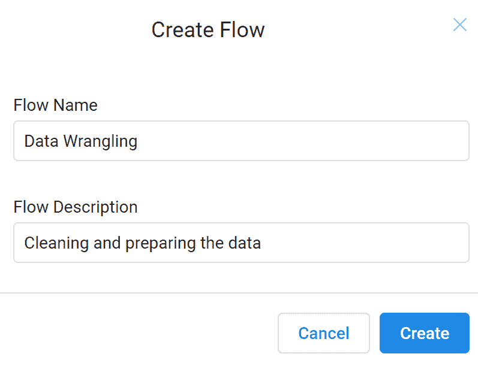

在我们完成这些后，在 flows 页面上，刚刚创建的新流程将显示，并建议可以添加到此流程的数据集以开始整理。为了分析 Google Cloud Dataprep 示例的工作方式，我们将使用一个专门设计的文件，该文件包含一小部分观测数据的数据；它列出了测试的结果。我们将获取`CleaningData.csv`，这是一个包含我们刚刚列出的一些问题的电子表格。在正确识别此文件并上传到我们的计算机后，将显示以下窗口（Transformer 页面）：

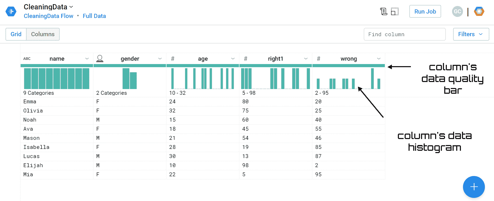

在这个页面上，我们可以轻松地识别我们已导入的数据。在这个时候，我们可以编写我们想要应用到此数据的转换。一旦我们确定了我们要做什么，我们就可以立即预览结果，然后再对整个最终数据集进行更改。

在 Transformer 页面上，有两个面板可用：网格和列。默认情况下，Transformer 页面显示网格面板，其中以列网格的形式显示列的预览。在列面板中，返回有关单个列的附加统计信息。此面板特别适用于管理异常值，以审查平均值、最小值和最大值。

从对 Transformer 页面的第一眼观察中，我们可以了解我们已导入的数据。实际上，我们可以查看所有字段和所有观测值。

在这里，我们上传了一个只有几个字段和观测值的文件。更普遍地说，在左下角，我们得到了行数、列数和数据类型的总结。

从返回窗口的分析中，我们可以提取有用的信息。从每个列的名称开始，其左侧出现一个符号，用于标识自动分配给它的数据类型。这样我们就可以验证 Dataprep 已将变量编目如下：

+   `name`: 名称（字符串）

+   `gender`: 性别（性别）

+   `age`: 年龄（整数）

+   `right1`: 正确答案的百分比（整数）

+   `wrong`: 错误答案的百分比（整数）

数据类型的分配似乎正确。这些信息是通过光标返回给我们的。实际上，当你将光标在页面上的选定数据元素上移动时，光标会改变。在列标题下方立即有有用的摘要图表。在列的数据质量条上，显示了值的类别。以下三种类型的值可用：

+   有效

+   不匹配

+   缺失

然后，显示直方图，为我们提供有关每个列中包含的数据的统计信息。进一步的信息通过将光标移过它返回给我们。

由于值很少，我们还可以预览所有数据。让我们看一下，以视觉上识别异常。已经可以看到，年龄变量有一个缺失值。任何类型的变量的缺失值都由 NA 代码表示，这意味着不可用。另一方面，**非数字**（**NaN**）代码表示无效的数值，例如零除以数值。如果一个变量包含缺失值，GCP 无法对其应用某些函数。因此，有必要提前处理缺失值。

在转换页面上，你可以看到当你将鼠标悬停在区域和相关面板上时，光标旁边会出现一个灯泡图标，以指示有建议可用。

在每个列标题的左侧，你可以看到一个下拉列菜单。借助此菜单，我们可以对列数据进行多项操作，例如根据列数据类型更改其数据类型。以下操作可用：

+   重命名：重命名列

+   更改类型：更改列的数据类型

+   移动：将列移动到开始或结束位置，或移动到数据集中的指定位置

+   编辑列：对列执行一系列编辑

+   列详情：探索列详情的交互式配置文件

+   显示相关步骤：在配方面板中突出显示引用所选列的步骤

+   查找：查找并替换特定值或从列中提取模式值

+   过滤：根据列的文本书面值或计算值过滤数据集的行

+   清理：清理列中的不匹配或缺失值，用固定或计算值替换值或删除整个行

+   公式：根据所选函数从源列生成包含计算值的新的列

+   聚合：根据跨组的计算生成汇总表，或将汇总数据作为新列添加到当前表中

+   重新结构化：根据列的值更改数据集的结构

+   查找：在另一个数据集的另一列的值集中查找列值

+   删除：从数据集中删除列

以下截图显示了性别列的列菜单：

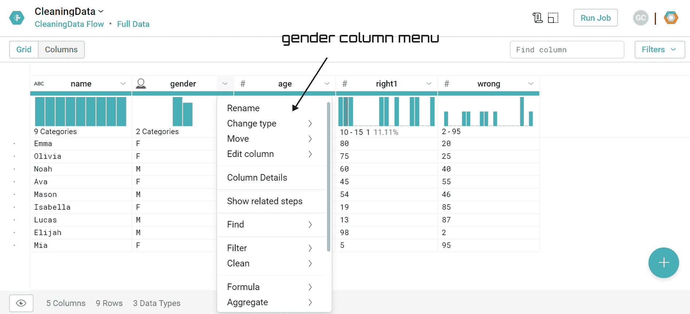

当选择一列时，Transformer 页面右侧会打开一个新的建议面板。此面板显示一系列与特定列中包含的数据类型相关的建议。建议根据所选数据而变化。通过悬停在任何一个建议上，你可以在数据网格中预览结果，以确保所提出的转换适用于数据集。在下一节中，我们将能够扩展建议面板的使用。

# 删除空单元格

从导入数据的视觉分析中，我们检测到第三行第二列有一个空单元格；这表明存在缺失值。在分析数据集之前，有必要消除这个异常。

在这种情况下，由于数据量小，识别空单元格特别容易；在大型数据集的情况下，视觉分析不起作用。因此，为了识别缺失值，我们可以分析数据质量条。在这里，缺失值用黑色标识。

要预览缺失数据的数量，我们可以将鼠标移到数据质量条的黑色部分；会返回缺失数据的数量，如下面的截图所示：

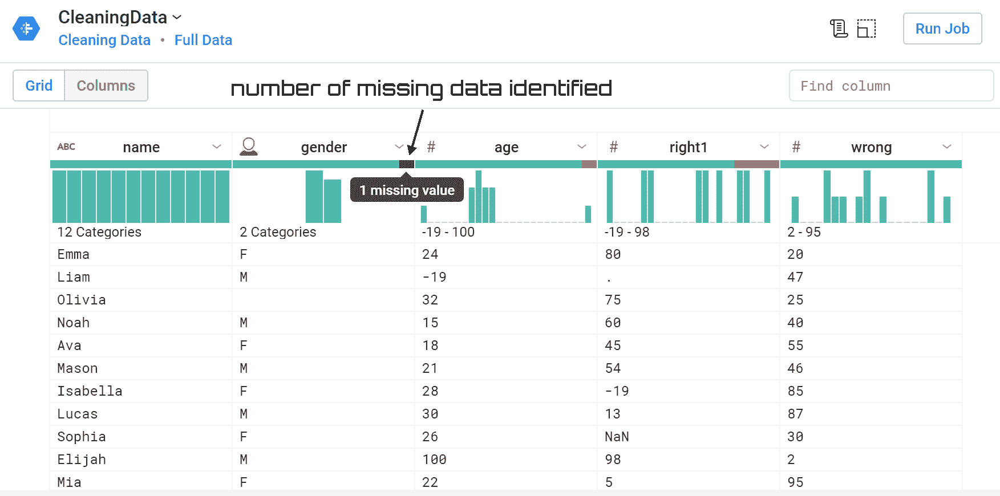

我们已经确认性别字段存在缺失值。回想一下，缺失值是指不包含内容或不存在的内容的值。这些缺失值可能是由一系列事件引起的：

+   数据集创建中的错误；值输入错误，留下了空单元格

+   数据集包含自动创建的字段，其中单元格不包含值

+   不可能计算的后果

现在，如果我们选择性别列，一个新建议面板会在转换器页面右侧打开。如前所述，此面板显示一系列与特定列中包含的数据类型相关的建议。提出了几个建议：

+   删除列

+   重命名

+   聚合和分组数据

+   创建新列

+   设置

+   将值添加到列中

当我们悬停在不同的建议上时，每个建议的左侧都会出现一个迷你预览，如下面的截图所示：

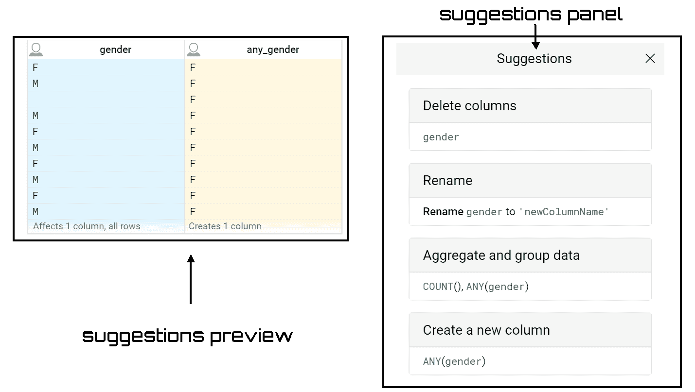

在建议面板中，出现一个特定的文本“缺失值”，这意味着在列中识别出的缺失值可以被其他内容替换。通过点击“设置”项，会出现两个按钮：编辑和添加。点击编辑按钮会打开一个新框；在这个框中提出了以下新公式：

```py
ifmissing($col, '')
```

缺失函数会在源值是空或缺失值时写入指定的值。在引号之间插入`NA`字符串后，每次在列中识别到缺失值时，它将被替换为`NA`值。修改公式后，我们将能够实时预览列，这是由应用公式修改的；如下面的截图所示：

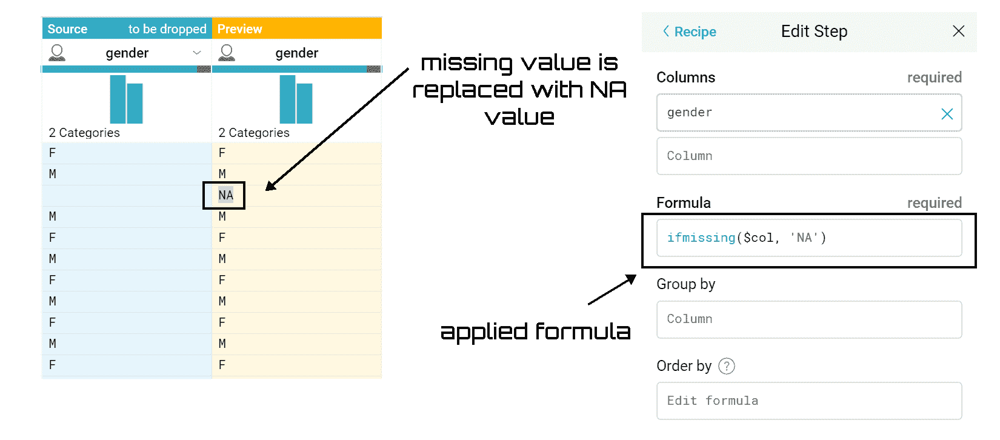

现在，要应用这个建议，只需在建议面板中点击“添加”按钮。这样，就会在配方面板中添加一个新的步骤。

注意，配方面板允许我们回顾和修改迄今为止创建的配方步骤，同时，它还允许我们添加新的步骤。如果面板没有显示，要使其出现，只需点击运行作业按钮左上角的图标（配方）。

要为不同的列生成一组新的建议，请点击取消。然后，选择列中的一组不同的列或值；这样，就会打开一个新的建议面板。

# 替换不正确的值

下一步将允许我们替换不正确的值指示符。如果我们再次查看数据，我们会看到在年龄列中显示的值是`-19`。这显然是一个不正确的值，因为对于这个变量，允许的值大于零（这是一个年龄）：

```py
24 -19 32 15 18 21 28 30 26 100 22 NA
```

我们可以用缺失值指示符`NA`替换这个值。为此，我们将在设置建议中写下以下公式：

```py
IF($col<0, 'NA',$col)
```

在上一节创建的步骤之后，将立即在配方面板中添加一个新步骤。同时，我们可以看到对数据集所做的更改预览。不正确的值不再存在；取而代之的是进一步的`NA`值。

可以通过直接在配方面板中操作来获得相同的结果：

1.  记住，要打开配方面板，只需点击运行作业按钮左上角的图标（配方）。

1.  点击新建步骤按钮；转换构建器被打开

1.  在转换下拉菜单中，从可用的转换中选择应用公式

1.  指定列（年龄）

1.  在公式框中编辑所需的公式

1.  点击添加按钮

1.  在配方面板中添加新步骤

在下面的截图中，我们可以看到转换构建器：

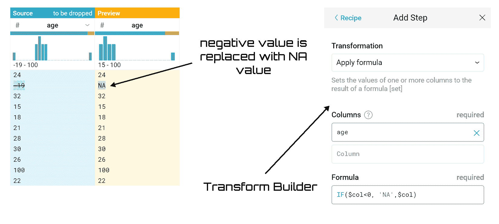

获得的结果与我们通过在设置建议中编写公式获得的结果相同；在这种情况下，年龄列中也不再存在负值。

# 不匹配的值

任何看起来与列指定的数据类型不同的值都被视为不匹配的值。在我们目前分析的这个数据库中，有几个值似乎偏离了分配给列的类型。例如，在右侧列中有一个包含点的单元格；很明显，这是在填充数据库阶段的一个错误。同样明显的是，这样的值在分析阶段可能会引起很多问题，因此必须适当地处理。

如同处理缺失值一样，不匹配的值也显示在每列顶部的数据质量条上。在数据质量条中，不匹配的值用红色标识，如下面的截图所示：

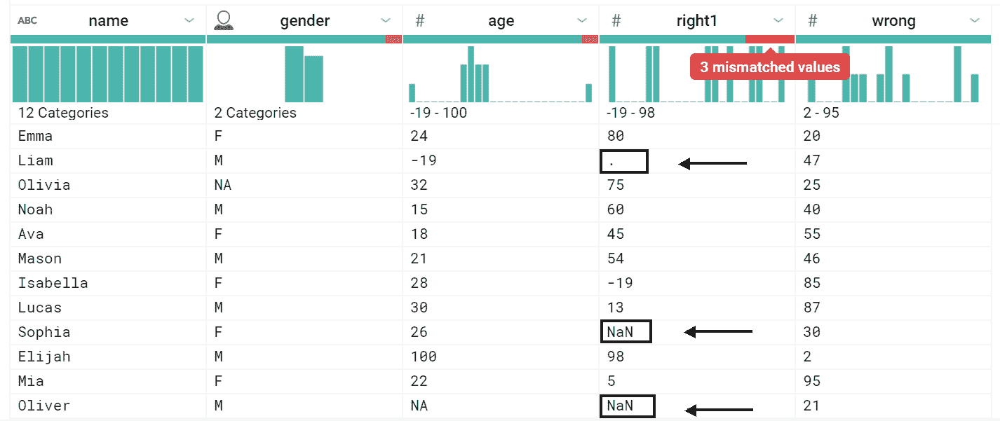

要修复不匹配的数据，有几种选项可用：

+   更改数据类型

+   用常数值替换值

+   使用其他列的值设置值

+   使用函数转换数据

+   删除行

+   暂时隐藏该列

+   删除列

在这种情况下，由于选中的两行在其他列中也存在不匹配的数据，我们将删除所有三列。为此，只需在建议面板的删除行区域点击添加按钮。

分析数据集，我们可以看到不匹配的数据仍然存在。实际上，年龄列中的数据质量条在红色区域。我们试图解决这个问题。这次不适宜删除整行。实际上，通过分析第一列，我们可以看到`NA`值指的是一个名字明显指代女性的行（Olivia）。所以最合适的解决方案是将这个值替换为已知值，在这种情况下是`'F'`。

要做到这一点，我们将在建议面板的集合项中写下以下公式：

```py
ifmismatched($col, ['Gender'], 'F')
```

将在配方面板中添加一个新步骤。再次，我们可以看到对数据集所做的更改的预览。实际上，我们可以看到错误值不再存在；取而代之的是`'F'`。

我们已经调整了几个方面，但乍一看，还有一些事情要做。如果我们注意右 1 列，它代表提供的正确答案的百分比，我们会注意到值的范围如下：-19 到 98。但-19 显然是一个错误值，因为这个变量的允许值在 0 到 100 之间（这是一个百分比）。我们可以假设在创建数据集时错误地添加了负号。然后我们可以修改这个值，只留下值 19。

要做到这一点，我们执行以下步骤：

1.  打开配方面板。只需点击运行作业按钮左上角的图标（配方）。

1.  点击“新建步骤”按钮。打开转换构建器。

1.  在转换下拉菜单中，从可用转换列表中选择应用公式。

1.  指定列（右侧）。

1.  在公式框中编辑以下公式：

1.  `IF($col==-19,19,$col)`

1.  点击“添加”按钮。

1.  在配方面板中添加了一个新步骤。

我们添加到配方面板中的操作有五个，如本截图所示：

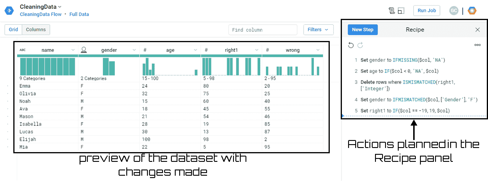

通过分析配方面板，我们随后对数据集上计划采取的行动有一个总结。此外，对数据集预览所做的更改的视觉分析没有显示任何需要修复的异常。在每列顶部的数据质量条上，没有红色/黑色区域被突出显示，尽管现在还为时尚早！数据准备的工作还远未完成。

# 在数据中寻找异常值

异常值是与其他值相比特别极端的值（一个明显远离其他可用观察值的值）。异常值的存在造成阻碍，因为它们往往会扭曲数据分析的结果，特别是在描述性统计和相关性中。在数据清洗阶段本身识别这些异常值是理想的；然而，它们也可以在数据分析的下一步中处理。异常值可以是单变量的，当它们对于单个变量具有极端值时，或者多变量的，当它们对于多个变量具有不寻常的值组合时。

异常值是分布的极端值，与分布中的其他值相比，其极端高或极端低，因此相对于其他分布而言是孤立案例。

检测异常值有不同的方法。Google Cloud Dataprep 使用 Tukey 的方法，该方法采用 **四分位距**（**IQR**）方法。这种方法不依赖于数据的分布，并忽略了受异常值影响的平均值和标准差。

如前所述，为了确定异常值，参考由第 25 百分位数和第 75 百分位数之间的差异给出的 IQR，即它所在的范围的幅度。这 50% 的观测值占据了有序数据系列中的中心位置。异常值是相对于其他分布而言，偏离第 75 百分位数（正值）大于两倍 IQR 的值，或者对称地，是偏离第 25 百分位数（绝对值）大于两倍 IQR 的值。

实际上，异常值可以是以下两种情况之一：

```py
< (25th percentile) - (2 * IQR)
> (75th percentile) + (2 * IQR)
```

要在单个列中识别异常值，Google Cloud Dataprep 提供了视觉功能和统计信息。

# 视觉功能

此前，我们已讨论过每列顶部的直方图。此图显示了列中检测到的每个值的计数（对于字符串数据）或数值范围内的值的计数（对于数值数据）。

Google Cloud Dataprep 提供的视觉功能正是使用这些直方图来识别异常值或异常值，这些值在执行整个数据集上的任何分析之前应被移除或修正。

返回的直方图类型取决于列中包含的数据类型。实际上，对于数值数据，每个条形图代表一个值范围，条形图按数值顺序排序。对于分类类型，每个垂直条形图覆盖单个值，按出现频率最高的值排序。

将鼠标移至直方图的条形图上，会返回一系列信息。这样，我们可以突出显示特定值，获取该值的计数以及该值在列中所有值总计数中的百分比。我们还可以选择特定的条形图；在这种情况下，包含它们的行会被突出显示，并显示建议面板以管理这些值。

要同时选择不同的条形图：

+   使用 *Ctrl* + 点击来选择多个条形图

+   点击并拖动选择一系列条形图

为了更好地理解这种视觉功能的有用性，让我们参考一个例子。特别是，我们将分析在前面章节中已经使用过的数据集，我们已经有机会对其进行修改。让我们看一下年龄列，因为它目前在预览报价中呈现，并且已经生效了更改。我们可以看到直方图有四个条形在左侧分组，只有一个条形在右侧孤立。这种直方图形式表明存在异常值，如下面的截图所示：

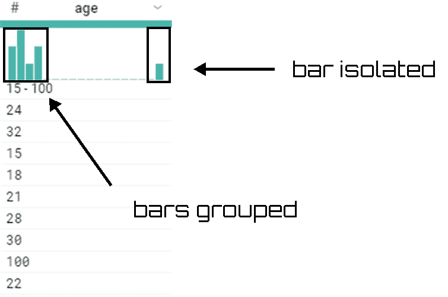

在这种情况下，异常值的出现是明显的；更普遍地说，图表两端孤立条形的存在必须引起我们的注意。

如果数据集包含多个异常值实例，则有必要进一步调查。通常，如果数据集包含大量异常值，则在执行修改或删除这些行的操作之前，有必要审查这些值及其在其他列中的数据，因为删除这些值可能变得具有统计学意义。

# 统计信息

我们到目前为止所进行的视觉分析在某些情况下并不允许我们轻松地识别异常值的存在。为了获得更多信息，我们可以检查当前选定列的详细统计数据，包括在列详细信息面板中可用的异常值数据。要打开列详细信息面板，只需从列的下拉菜单中选择列详细信息；以下面板将被打开：

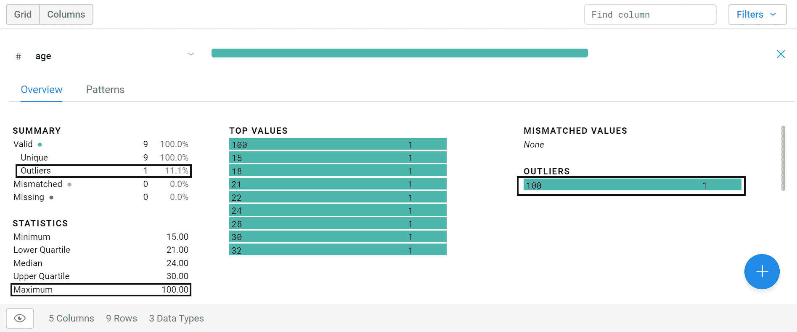

在这个面板中，有很多信息可用，以下是一些信息：

+   概述统计：有效（唯一和异常）值的计数、不匹配值和缺失值

+   统计意味着你可以获得许多选项，如最小值、最大值、平均值、最低和最高四分位数、中位数和标准差

+   值直方图

+   最高值

+   异常值

在这种情况下，任何异常值都被清楚地识别并标记出来。此外，直方图现在更加精确，清楚地指示条形的排列。

# 删除异常值

到目前为止，我们已经看到了识别可能异常值的不同技术。在识别它们之后我们应该做什么？在确定列中的值是异常值之后，需要确定这些值对于数据集是否有效或无效。

如果这些值无效是由于数据集人口统计阶段的错误导致的，那么我们必须纠正它们。这个操作可能涉及用可能有效的值替换这个值，或者删除整行。在后一种情况下，我们必须注意这个操作对整个数据集可能产生的影响。

为了替换看起来在所有方面都无效的值`100`（可能原本是`10`，多加了一个零），我们可以插入以下公式：

```py
IF(($col == 100),10, $col)
```

相反，如果删除此记录在统计上没有显著的重要性，我们可以采用简单的擦除指令，如下所示：

```py
DELETE row: age == 100
```

如果数据看起来有效（实际上，人类可能有一百年的寿命），我们可以保持原样。或者我们可以将其转换为对我们来说在统计上更有意义的值。例如，我们可以决定用整个列的平均值替换这个值，以保留至少从其他列中得到的这个观察结果的信息。要用列的平均值替换 100，请使用以下公式：

```py
if($col > 80, average($col), $col)
```

最终我们选择了第一个选项，所以年龄列中的`100`将被替换为`10`。为此，我们（像往常一样）在新的步骤中插入刚刚提出的公式，如下面的屏幕截图所示：

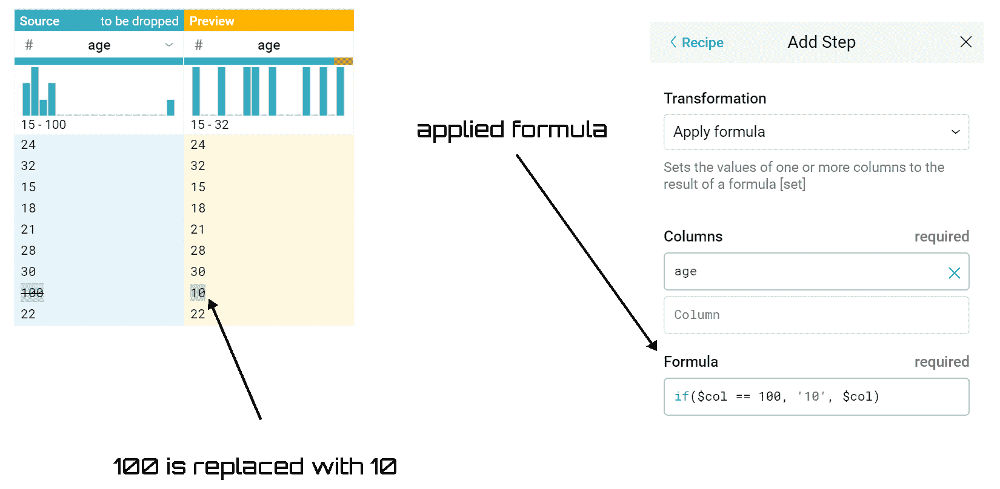

要查看更改的预览，请点击“添加”按钮，新的步骤将被添加到我们的配方面板中。在屏幕截图中，我们还可以验证现在值的范围已经显著减少：从 10 到 32，而不是从 15 到 100。不仅如此，直方图也不再在末端有孤立的长条。

# 运行作业

我们已经在数据库上计划了几个操作：现在是时候做出这些改变了。为此，只需在 Transformer 页面上点击“运行作业”。这样，就会打开“运行作业”页面，在那里我们可以为当前加载的数据集指定转换和概要分析作业。可用的选项包括输出格式和输出目的地。

“概要结果”选项允许我们生成可视化的结果概要。可视化概要对于检查我们的配方问题并进行迭代非常有用，即使这是一个需要大量资源的流程。如果我们正在处理的数据集很大，禁用结果概要可以提高作业的整体执行速度。

在正确设置可用选项后，我们可以通过简单地点击“运行作业”来排队指定的作业以供执行。一旦完成，作业就会排队等待处理。在处理结束时，您可以使用数据集详细信息页面查看成功运行的作业结果。

流处理时间取决于服务器可用性和数据集的大小。在我们的案例中，数据集确实很小，所以我们只需等待服务可用。点击“查看结果”以在作业结果页面上打开作业，如下面的屏幕截图所示：

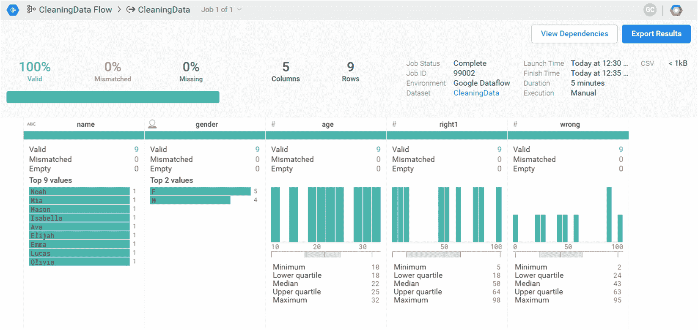

在之前的屏幕截图（作业结果页面）中，可以查看转换配方对整个数据集的影响。提供了统计信息和数据直方图，这些信息可以提供对我们转换配方质量的总体可见性。

在截图左上角，你可以找到关于生成数据集中包含的数据的一系列总结信息。特别是，显示了有效值的计数、不匹配值和缺失值的数量。这些值在整个数据集中以完整形式显示。

在截图的上部，总是会出现一系列关于所执行工作的总结信息，但这次你可以在右侧找到它。

在截图的下部，我们可以可视化对单个列进行的变换细节。根据列的数据类型，会显示变量的信息。

最后，在截图右上角的上部，有两个按钮：

+   **查看依赖项**：要查看作业所依赖的配方和数据集

+   **导出结果**：要导出结果

# 特征缩放

数据缩放是一种通常在特征选择和分类之前使用的预处理技术。许多基于人工智能的系统使用由许多不同的特征提取算法生成的特征，这些算法来自不同的来源。这些特征可能具有不同的动态范围。流行的距离度量，如欧几里得距离，隐含地给范围较大的特征比范围较小的特征更多的权重。因此，特征缩放是必要的，以大致相等化特征的范围，并使它们在相似度计算中具有大约相同的影响。

此外，在具有大量特征和较大动态范围的数据挖掘应用中，特征缩放可能会提高拟合模型的性能。然而，选择这些技术是重要的问题。这是因为对输入进行缩放可能会改变数据的结构，从而影响数据挖掘中使用的多元分析的结果。

到目前为止，我们已经对数据进行处理，纠正了任何错误或遗漏。我们可以这样说，在这个阶段，数据集中包含的所有变量都是完整的，并且数据是一致的。那么，具有不同范围和单位的变量呢？在数据框中可能存在变量，其中一个特征的值可能从 1 到 10，而另一个特征的值可能从 1 到 1,000。

In data frames such as these, owing to mere greater numeric range, the impact on response variables by the feature having greater numeric range could be more than the one having less numeric range, and this could, in turn, impact prediction accuracy. Our goal is to improve predictive accuracy and not allow a particular feature to impact the prediction due to a large numeric value range. Thus, we may need to scale values under different features such that they fall under a common range. Through this statistical procedure, it is possible to compare identical variables belonging to different distributions, but also different variables, or variables expressed in different units. Two methods are usually well known for rescaling data: normalization and standardization.

Remember, it is good practice to rescale the data before training a machine learning algorithm. With rescaling, data units are eliminated, allowing you to easily compare data from different locations.

# Min–max normalization

Min-max normalization (usually called **feature scaling**) performs a linear transformation on the original data. This technique gets all the scaled data in the range (0, 1). The formula to achieve this is the following:


Min-max normalization preserves the relationships among the original data values. The cost of having this bounded range is that we will end up with smaller standard deviations, which can suppress the effect of outliers.

To better understand how to perform a min-max normalization, just analyze an example. We will use a dataset contained in the `Airquality.csv` file.

This dataset is available at the UCI machine learning repository, a large collection of data, at the following link: [`archive.ics.uci.edu/ml/index.php`](https://archive.ics.uci.edu/ml/index.php).

S. De Vito, E. Massera, M. Piga, L. Martinotto, G. Di Francia, *On field calibration of an electronic nose for benzene estimation in an urban pollution monitoring scenario*, Sensors and Actuators B: Chemical, Volume 129, Issue 2, 22 February 2008, Pages 750-757, ISSN 0925-4005 at: [`www.sciencedirect.com/science/article/pii/S0925400507007691`](https://www.sciencedirect.com/science/article/pii/S0925400507007691).

These are the daily readings of the following air quality values for May 1, 1973 (a Tuesday) to September 30, 1973:

+   **臭氧**：罗斯福岛 1300 至 1500 小时的平均臭氧浓度，每十亿分之一

+   **太阳辐射**：中央公园 0800 至 1200 小时在 4000–7700 埃频率范围内的太阳辐射，单位为朗格利

+   **风速**：拉瓜迪亚机场 0700 和 1000 小时的平均风速，单位为每小时英里

+   **温度**：拉瓜迪亚机场每日最高温度，单位为华氏度

The data was obtained from the New York State Department of Conservation (ozone data) and the **National Weather Service** or **NWS** (meteorological data).

A data frame consists of 154 observations on 6 variables:

| **名称** | **类型** | **单位** |
| --- | --- | --- |
| 臭氧 | 数值 | ppb |
| 太阳 | 数值 | lang |
| 风速 | 数值 | mph |
| 温度 | 数值 | 华氏度 |
| 月份 | 数值 | 1 到 12 |
| 天 | 数值 | 1 到 31 |

如所示，六个变量具有不同的度量单位。正如我们在前面的章节中所做的那样，即使在这种情况下，我们也从创建新的流程开始准备数据，然后我们将`.csv`文件导入 Google Cloud Dataprep。以下窗口将打开：


正如我们所预期的，四个变量有不同的度量单位，这意味着值范围差异很大。实际上，通过分析前一个截图中的每一列的上部，我们可以获得以下范围：

+   **臭氧**：1 到 168

+   **太阳辐射强度**：7 到 334

+   **风速**：2 到 21

+   **温度**：56 到 97

在进行标准化之前，我们消除数据质量栏中突出显示的一些问题。已识别不匹配的值。为了更精确：

+   **臭氧**：37 个不匹配的值

+   **太阳辐射强度**：7 个不匹配的值

首先，我们将尝试修复这些问题，就像我们在上一节中学到的那样。

我们从臭氧列开始；我们点击数据质量栏的红色区域。这样，所有 37 个不匹配的值都会被突出显示。同时，窗口右侧打开建议面板。特别是，第一个建议建议我们删除臭氧中不匹配值的行。我们只需点击添加按钮。以下行将被添加到“配方”面板中：

```py
Delete rows where ISMISMATCHED(Ozone, ['Integer'])
```

我们对`Solar_R`列执行相同的操作；以下行将被添加到“配方”面板中：

```py
Delete rows where ISMISMATCHED(Solar_R, ['Integer'])
```

在这两种情况下，预览窗口显示我们数据中现在没有不匹配的值。此时，我们可以处理归一化。正如我们之前指定的，变量的范围非常广泛。我们希望通过最小-最大归一化消除这一特征。正如之前所述，要应用此程序，我们必须计算每个变量的最小值和最大值。为此，我们可以应用 Google Cloud Dataprep 中可用的两个函数：`MIN`和`MAX`。

Google Cloud Dataprep 支持在大多数桌面电子表格软件中常见的支持函数。可以使用这些函数创建公式来操作列中的数据。

之前，我们提出了归一化的公式；要将它应用于一列，我们执行以下步骤：

1.  在“配方”面板中，点击“新建步骤”按钮。还记得吗？要打开“配方”面板，只需点击运行作业按钮左上角的图标（配方）。

1.  从“转换”下拉菜单中选择“应用公式”项（此项目将一列或多列的值设置为公式的结果）。

1.  从列框中选择臭氧列，例如（相同的步骤可以应用于数据集的所有变量）。

1.  在“公式”框中，编辑以下公式：`(Ozone-MIN(Ozone))/(MAX(Ozone)-MIN(Ozone))`

1.  只需点击“添加”按钮。

在“配方”面板中添加以下语句：

```py
Set Ozone to (Ozone-MIN(Ozone))/(MAX(Ozone)-MIN(Ozone))
```

我们对其他三个变量（`Solar_R`、`Wind`和`Temp`）遵循相同的程序。最后，我们将添加以下行到“配方”面板中：

```py
Set Solar_R to (Solar_R -MIN(Solar_R))/(MAX(Solar_R)-MIN(Solar_R))
Set Wind to (Wind -MIN(Wind))/(MAX(Wind)-MIN(Wind))
Set Temp to (Temp -MIN(Temp))/(MAX(Temp)-MIN(Temp))
```

变换页面已更改如下：

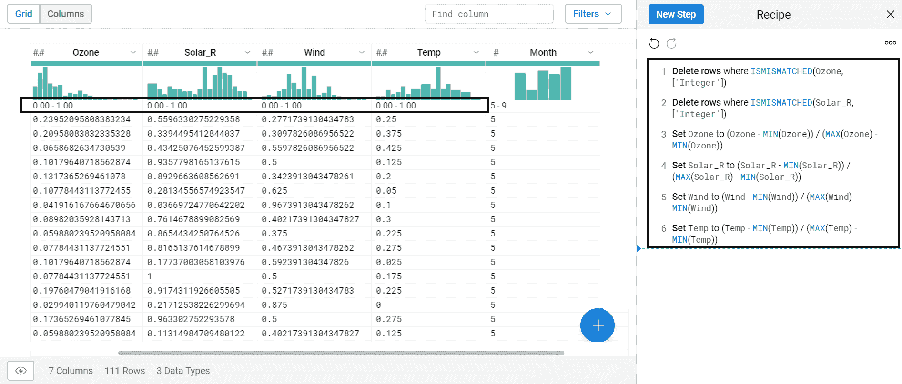

显然，现在数据都在零和一之间；这是针对数据集的每一列以及每个变量发生的。因此，由于不同测量单位的差异导致的缩放差异已被消除。

# z 分数标准化

这种技术包括从列的每个值中减去列的平均值，然后将结果除以列的标准差。实现这一目标的公式如下：

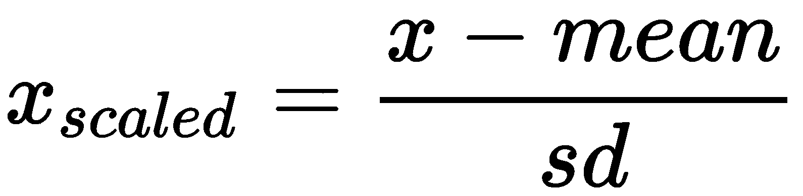

标准化的结果是，特征将被重新缩放，以便它们具有标准正态分布的性质，如下所示：

+   *μ=0*

+   *σ=1*

μ是平均值，*σ*是平均值的标准差。

总结来说，z 分数（也称为**标准分数**）表示观测点或数据值与观测或测量的平均值相比的标准差数。高于平均值的值具有正的 z 分数，而低于平均值的值具有负的 z 分数。z 分数是一个无量纲的量，通过从单个粗略分数中减去总体平均值，然后除以总体标准差得到。

再次，为了标准化数据，我们将使用与 min-max 归一化相同的程序。这次，两个函数更改如下：

+   `平均数`：计算每列的平均值

+   `标准差`：计算每列的标准差

要执行 z 分数标准化，只需分析用于 min-max 归一化的相同数据集。我指的是名为 Airquality.csv 的数据集，它包含了 1973 年 5 月 1 日（星期二）至 1973 年 9 月 30 日的每日空气质量值。

要将 z 分数标准化应用于数据集列，请执行以下步骤：

1.  在“配方”面板中，点击“新建步骤”按钮。再次，要打开“配方”面板，只需点击运行作业按钮左上角的图标（配方）。

1.  从“转换”下拉菜单中选择“应用公式”（此选项将一个或多个列的值设置为公式的结果）。

1.  从“列”框中选择 Ozone 列（相同的步骤可以应用于所有数据集变量）。

1.  在“公式”框中，编辑以下公式：

1.  `(Ozone- AVERAGE(Ozone))/STDEV(Ozone)`

1.  只需点击“添加”按钮。

在“配方”面板中添加以下语句：

```py
Set Ozone to (Ozone- AVERAGE(Ozone))/STDEV(Ozone)
```

我们对其他三个变量 `Solar_R`、`Wind` 和 `Temp` 也遵循相同的程序。最后，我们将以下行添加到配方面板中：

```py
Set Solar_R to (Solar_R - AVERAGE(Solar_R))/STDEV(Solar_R)
Set Wind to (Wind - AVERAGE(Wind))/STDEV(Wind)
Set Temp to (Temp - AVERAGE(Temp))/STDEV(Temp)
```

变压器页面已经发生了如下变化：

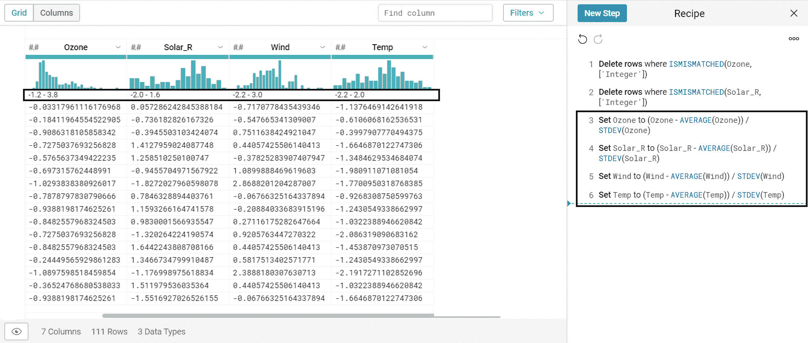

z 分数标准化所做的修改是明显的：数据范围相当相似。这发生在数据集的每一列中，然后是每个变量。因此，由于不同的测量单位导致的规模差异已被消除。

根据假设，所有变量都必须满足 `平均= 0` 和 `标准差 =1`。让我们来验证这一点。为此，只需使用之前章节中已经使用过的列详细信息面板中的统计信息。要打开列详细信息面板，从列的下拉菜单中选择列详细信息；以下面板将被打开：

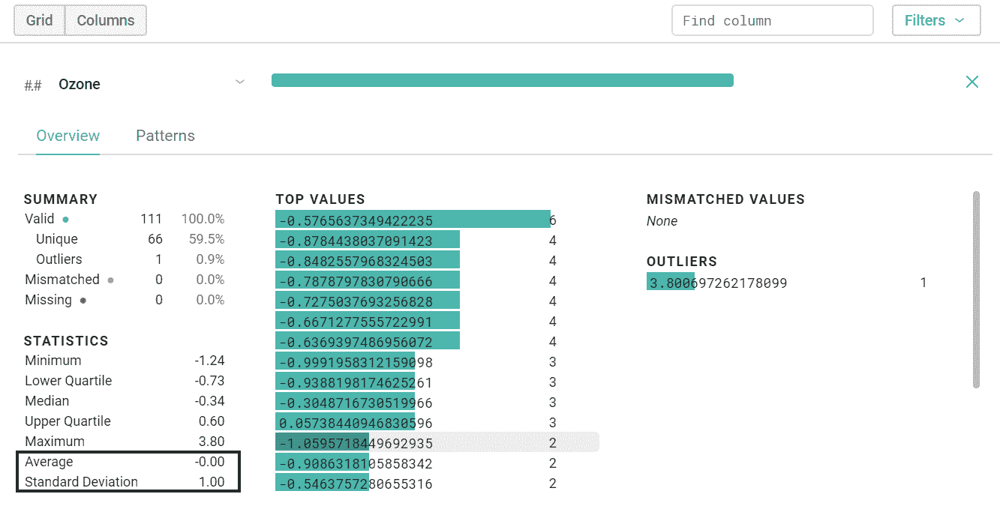

因此，我们已经验证了臭氧变量具有零平均值和一的标准差。可以对其他变量执行相同的检查。

# Google Cloud Dataflow

Google Cloud Dataflow 是一个全托管服务，用于创建在批量模式和流式模式下转换、丰富和分析数据的数据管道。Google Cloud Dataflow 从数据中提取有用信息，降低运营成本，无需实施、维护或调整数据基础设施，无需麻烦。

管道是一组按顺序连接的数据处理元素，其中前一个元素的输出是下一个元素的输入。数据管道被实现以提高吞吐量，即给定时间内执行的指令数量，并行化多个指令的处理流程。

通过适当地定义进程管理流程，可以从数据中提取知识时节省大量资源。由于采用无服务器方法来提供和管理资源，Dataflow 为解决最严重的数据处理问题提供了几乎无限的容量，但您只需为使用的部分付费。

Google Cloud Dataflow 自动提供和管理处理资源，以减少延迟时间并优化利用率。不再需要手动激活实例或预留它们。自动和优化的分区允许待处理的作业动态重新分配。您无需使用键盘快捷键或预处理您的输入数据。Cloud Dataflow 支持使用 Apache Beam SDK 中的表达性 Java 和 Python API 快速和简化管道开发。

Google Cloud Dataflow 作业按分钟计费，基于批量模式或 Cloud Dataflow 流式传输中实际使用的工人的数量。使用其他 GCP 资源（如 Cloud Storage 或 Cloud Pub/Sub）的作业将根据相应服务的价格计费。

# 摘要

在本章中，我们探讨了 Google Cloud Dataprep，这是一种用于数据预处理、提取特征和清理记录的有用服务。我们通过实际案例的例子深入了解了实践细节。我们首先查看云应用程序界面，以获取访问平台所需的一些初步信息。然后，我们分析了为准备最适合分析和建模的数据所提供的各种技术，这包括缺失数据的插补、检测和消除异常值以及处理不匹配值。我们发现了不同的数据转换方法以及数据清理的程度。接着，我们学习了如何规范化我们的数据，其中数据单位被消除，使我们能够轻松比较来自不同位置的数据。
