# 第九章：使用 TensorFlow 和 Keras 的神经网络

神经网络是一种受大脑功能启发的不严格监督学习算法。类似于大脑中神经元相互连接的方式，神经网络接收输入并通过一个函数传递它，基于此，某些后续神经元被激活，从而产生输出。

在本章中，我们将关注使用 TensorFlow 和 Keras 的神经网络的实际实现。TensorFlow 提供了一个低级框架来创建神经网络模型。Keras 是一个高级神经网络 API，它显著简化了定义神经网络模型的任务。我们将展示如何在 TensorFlow 上使用 Keras 来定义和训练 GCP 上的模型。我们将以 Python 中的 Keras API 展示，并使用经典 MNIST 数据集上的简单前馈网络进行操作。此外，我们还将介绍神经网络的各个组成部分：

+   初始化

+   指标和损失函数

+   激活函数

+   网络深度

# 神经网络概述

神经网络的起源在于每个函数都不能用线性/逻辑回归来近似——数据中可能存在只能由复杂函数近似的潜在复杂形状。

函数越复杂（有某种处理过拟合的方法），预测精度就越好。

以下图像解释了神经网络如何将数据拟合到模型中的方式。

神经网络的典型结构如下：

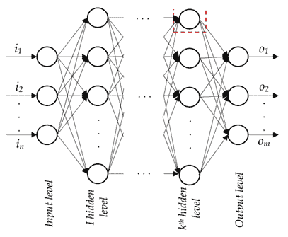

在此图中，输入层通常由用于预测输出（因变量）层或层的独立变量组成。

隐藏层用于将输入变量转换成高阶函数。隐藏层转换输出的方式如下：

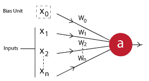

在前面的图中，*x[1]*、*x[2]*、...、*x[n]* 是独立变量，而 *x[0]* 是偏置项（类似于我们在线性/逻辑回归中有一个偏置的方式）。

*w[1]*、*w[2]*、...、*w[n]* 是分配给每个输入变量的权重。如果 *a* 是隐藏层中的一个神经元，它将等于：

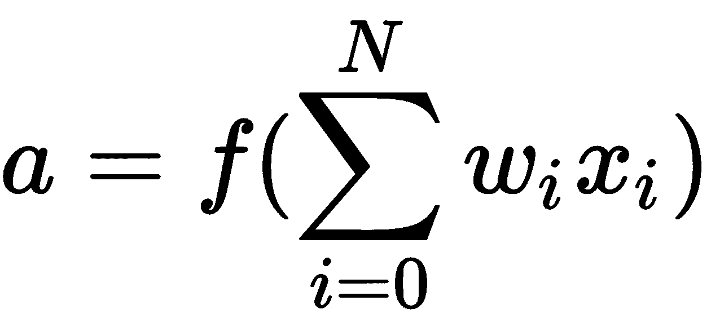

在此方程中我们看到的是我们在求和之上应用的激活函数，以便我们获得非线性。我们需要非线性，以便我们的模型能够学习复杂的模式。

此外，拥有多个隐藏层有助于实现高非线性。

下面的章节将提供可以调整的神经网络各种参数的详细信息。

# 设置 Google Cloud Datalab

为了设置 Google Cloud Datalab，我们点击 Cloud Shell 图标：


在 Cloud Shell 中，设置需要工作的项目，如下所示：

```py
gcloud config set core/project gcp-test-196204
```

一旦设置了项目，按照以下方式配置区域：

```py
gcloud config set compute/zone us-west1-b
```

最后，通过指定以下内容创建一个 Datalab 实例：

+   对于 CPU 版本：

```py
datalab create --no-create-repository mlgcp
```

+   对于 GPU 版本：

首先，您需要通过配额页面请求 GPU 版本，如下所示：


提交配额请求，您应该很快就会收到在指定区域使用 GPU 的权限。

注意，在构建神经网络模型时，GPU 版本更好，因为 GPU 中的多个处理器可以并行更新神经网络中的多个权重。 

将端口更改为 `8081` 以打开 Datalab 并因此打开笔记本。

# 安装和导入所需的包

TensorFlow 作为包，是为了执行神经网络计算而构建的。它使用懒加载评估概念，即在执行代码之前，需要指定神经网络连接的各种元素。

另一个名为 Keras 的 API 使得构建神经网络变得容易得多。在本章中，我们将首先利用 TensorFlow 后端运行的 Keras 包，然后我们将展示如何使用 TensorFlow 中的预制估计器和自定义估计器构建神经网络。

在前面的章节中，我们了解了如何设置 Datalab 笔记本。在本章中，我们将看到如何将所需的包安装并导入到 Datalab 笔记本中。

默认情况下，Datalab 预装了 TensorFlow 包。然而，它默认不包含 Keras。让我们看看如何安装 `keras` 包：

```py
!pip install keras
```

一旦安装了 Keras，让我们导入所需的两个包：

```py
import keras as K
import tensorflow as tf
```

# 简单神经网络的详细工作原理

为了理解神经网络是如何工作的，我们将构建一个非常简单的网络。输入和预期的输出如下：

```py
import numpy as np
x=np.array([[1,2],[3,4]])
y=np.array([0,1])
```

注意，`x` 是包含两个变量的输入数据集，每个行有两个变量。`y` 是两个输入的预期输出。

实质上，我们已经建立了输入和输出层。

例如，对于前面数据点中的一个，网络的输入和输出值将如下所示：

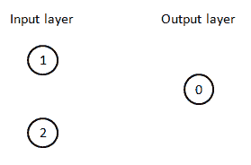

在传统的机器学习中，您会直接在输入和输出值之间找到关系。然而，神经网络架构的工作原理如下：

*"输入值可以表示在一个更丰富（更高）的维度空间中。输入值所表示的维度越多，输入数据集中的复杂性就越大。"*

基于前面的直觉，让我们在神经网络中构建一个包含三个单元的隐藏层：

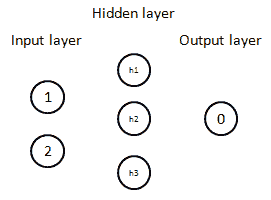

现在层已经构建，让我们按照以下方式在每个单元之间建立连接：

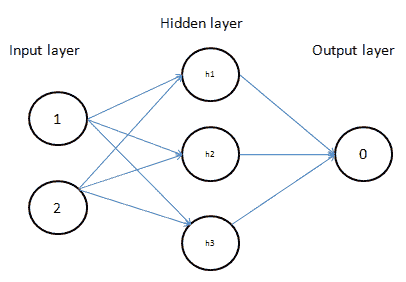

现在已经建立了每个单元之间的连接，每个连接将会有一个与之相关的权重。在下面的图中，我们将初始化每个连接所代表的权重：

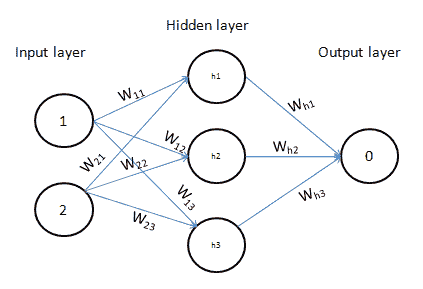

注意，权重**W**代表连接的强度。

现在我们已经构建了一个简单的神经网络。让我们随机初始化输入层和隐藏层之间的权重值，以了解隐藏层值是如何计算的：

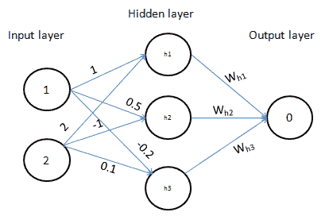

隐藏层值是输入值和与之相关的权重的乘积，如下所示：

*h1 = 1*1 + 2*(2) = 5*

*h2 = 1*0.5 + 2*(-1) = -1.5*

*h3 = 1*(-0.2) + 2*0.1 = 0*

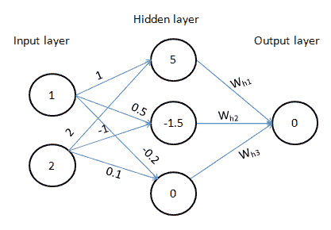

现在隐藏值已经计算出来，我们将它们通过一个激活函数。激活函数的直觉如下：

*"我们之前呈现的神经网络状态（没有激活函数）是输入变量的一个大线性组合。非线性只能通过对隐藏层值进行激活来获得。"*

为了简化，目前我们将假设我们要应用的非线性是 sigmoid 函数。

Sigmoid 函数的工作原理如下：

+   它接受一个输入值*x*，并将其转换成新的值*1/(1+exp(-x))*

Sigmoid 曲线的非线性对于各种*x*的值看起来是这样的：

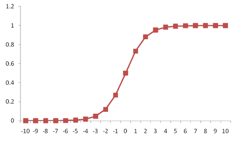

因此，隐藏层值，即 5，-1.5 和 0，被转换成**0.99**，**0.18**和**0.5**：

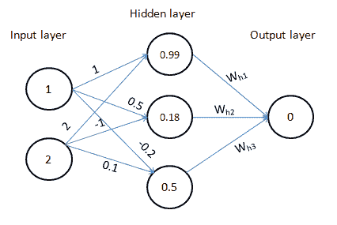

现在隐藏层值已经计算出来，让我们初始化连接隐藏层到输出层的权重。

注意，权重再次是随机初始化的：

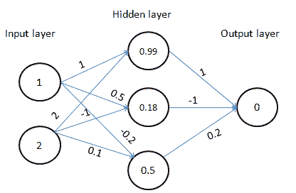

现在权重已经初始化，让我们计算与输出层相关的值：

*0.99*1 + 0.18*(-1) + 0.5*0.2 = 0.91*

输出层的预期值是*0.91*，而实际值是 0。

因此，在这种情况下相关的损失是*(0.91 - 0)² = 0.83*。

到目前为止的过程，即计算与权重值相对应的损失，被称为**前向过程**。

到目前为止，在本节中，我们已经理解了：

+   权重

+   激活函数

+   损失计算

在先前的场景中，虽然对于我们要尝试解决的给定目标，损失函数保持不变，但权重初始化和激活函数可以针对不同的网络架构而变化。

对于刚才提出的这个问题，目标是通过迭代地改变权重来最小化与网络架构相对应的损失。

例如，在先前的架构中，可以通过将隐藏层到输出层连接的最终权重从*0.2*更改为*0.1*来减少损失。一旦权重改变，损失从*0.83*减少到*0.74*。

通过迭代改变权重以最小化损失值的过程称为**反向传播**。

每个给定数据集中权重变化发生的次数称为**epoch**。本质上，一个 epoch 由前向传播和反向传播组成。

智能地达到最佳权重值的一种技术称为**梯度下降**——关于各种权重优化器将在后面的章节中详细介绍。

# 反向传播

在上一节中，我们看到了反向传播中权重如何更新的直觉。在本节中，我们将看到权重更新过程的详细细节：


在反向传播过程中，我们从神经网络末端的权重开始，向后工作。

在先前的图（1）中，我们通过迭代地以小量（0.01）改变每个连接隐藏层到输出层的权重值：

| **原始权重** | **变化后的权重** | **误差** | **误差减少量** |
| --- | --- | --- | --- |
| 1 | 1.01 | 0.84261 | -1.811 |
| -1 | -0.99 | 0.849 | -0.32 |
| 0.2 | 0.21 | 0.837 | -0.91 |

从前面的表中，我们注意到，为了提高误差，应该减少权重值，而不是增加它们：

| **原始权重** | **变化后的权重** | **误差** | **误差减少量** |
| --- | --- | --- | --- |
| 1 | 0.99 | 0.8108 | 1.792 |
| -1 | -1.01 | 0.8248 | 0.327 |
| 0.2 | 0.19 | 0.819 | 0.9075 |

现在我们注意到，对于某些权重更新，误差的改进很高，而对于其他一些权重更新，误差的改进较低。

这表明，对于某些误差改进很大的权重，权重更新可以更快；而对于误差改进相对较低的权重，权重更新可以更慢。

对于值为 1 的权重，其变化后的权重可能是：

*变化后的权重 = 原始权重 + 学习率 X 误差减少量*

现在，让我们假设学习率为*0.05*；那么：

*变化后的权重 = 1 + 0.05*(1.792) = 1.089*

其他权重将使用相同的公式进行更改。

直觉上，学习率帮助我们建立对算法的信任。例如，在决定权重更新的幅度时，我们可能会选择不是一次性改变所有内容，而是采取更谨慎的方法，更慢地更新权重。

一旦使用所描述的过程更新了所有权重，反向传播过程就完成了，然后我们再次进行前向传播。

前向传播和反向传播步骤合在一起称为**一个 epoch**。

注意，我们一次计算预测一个数据点的误差值，从而形成一个大小为 1 的批次。在实践中，我们计算一组数据点的误差值，然后使用一个数据批次而不是单个数据点来更新权重。

# 在 Keras 中实现简单的神经网络

从前面的讨论中，我们已经看到神经网络中的关键组件是：

+   隐藏层

+   隐藏层的激活

+   损失函数

除了这些，神经网络中还有一些其他关键组件。然而，我们将在后面的章节中学习它们。

现在，我们将使用我们到目前为止所获得的知识，在 Keras 中构建一个具有给定玩具数据集的神经网络模型：

导入相关函数：

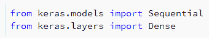

序列模型是层（输入、隐藏和输出）的线性堆叠。

在每一层中，`dense` 帮助实现网络中指定的操作。

让我们继续构建网络，如下所示：

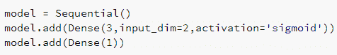

在我们的数据中，我们首先将二维的输入数据集转换为三维的隐藏层单元。

一旦计算了隐藏层的值，我们将在第二步通过 sigmoid 激活函数传递它们。

前两个步骤在模型指定的第二行中得到了体现。

从隐藏层，我们将其连接到一个一维的输出层，因此第三行代码有 `Dense(1)`。

让我们看看我们指定的模型摘要：

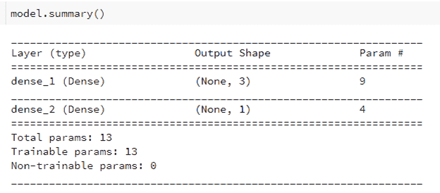

让我们了解前面总结中的输出形状列：`(None, 3)`。

`None` 表示输出与输入数量无关（不要与输入维度混淆）。`3` 表示隐藏层中的单元数量。

同样地，第二层中的 `(None,1)` 代表输出层的维度（输出层只有一个单元）。

`Param #` 表示与网络相关的参数数量。

注意，输入层和隐藏层之间的连接总共有九个参数，因为有六个权重值（如前一小节中的图所示），以及与隐藏层中每个单元相关的三个偏置项。

同样地，隐藏层和输出层之间有四个参数，因为隐藏层和输出层之间有三个权重值，还有一个与输出层相关的偏置项。

现在既然已经指定了网络架构，让我们编译模型，如下所示：

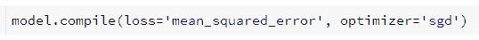

在上一行代码中，我们指定损失是基于均方误差计算的，这是实际值与预测值之间平方差的平均值，涉及输入数据集中的所有数据点。

类似地，我们指定优化技术基于随机梯度下降。

现在我们已经指定了模型结构、我们正在计算的损失函数以及我们正在使用的优化技术，让我们将模型拟合到输入和输出值。

在拟合模型时需要指定的附加指标是：

+   输入和输出值

+   在模型上运行的 epoch 数量：

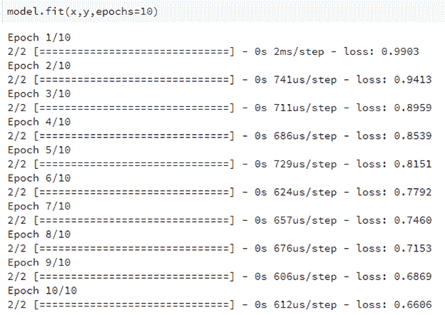

注意，我们指定的输入和输出变量是`x`和`y`。

还应该注意到，随着权重值调整以尽可能在 10 个 epoch 内最小化损失，损失值在不同的 epoch 中会降低。

现在我们已经建立了模型，让我们看看如何获得每一层的权重值：

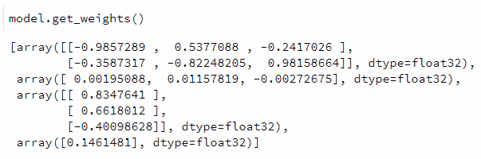

现在可以按照以下方式计算对应于新输入值的值：

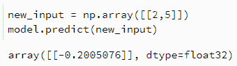

在前面的代码片段中，我们初始化了一个新的输入，并使用通过运行模型获得的最佳权重预测了对应于这个新输入的输出。

让我们了解如何获得输出。

获得隐藏层中三个单元的值：

*h1 = 2*(-0.985) + 5*(-0.3587) + 0.00195 = -3.76*

*h2 = 2*0.537 + 5*(-0.8225) + 0.0011 = -3.025*

*h3 = 2*(-0.24) + 5*0.98 - 0.0027 = 4.421*

一旦计算了隐藏层值，我们就将它们通过模型架构中指定的 sigmoid 激活函数传递。

*final h1 = sigmoid(h1) = 0.0226*

*final h2 = sigmoid(h2) = 0.0462*

*final h3 = sigmoid(h3) = 0.988*

一旦获得了最终的隐藏层单元值，我们将它们与连接隐藏层到输出层的权重相乘，如下所示：

*Output = 0.0226 * 0.834 + 0.0462 * 0.6618 + (-0.401) * 0.988 + 0.14615 = -0.20051*

注意，我们获得的是与`model.predict`函数中获得相同的值。这证明了我们迄今为止所学的架构功能。

现在我们已经建立了模型，让我们重新执行我们的代码，看看结果是否保持不变：

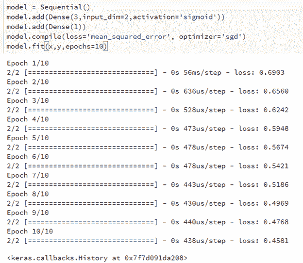

注意，损失值与我们之前迭代中获得的不同。这是因为神经网络运行的第一个 epoch 中权重是随机初始化的。一种修复方法是设置一个种子。种子有助于在每次神经网络运行时初始化相同的随机值集合。

注意，每次重建模型时都应该运行种子。设置种子的代码片段如下：

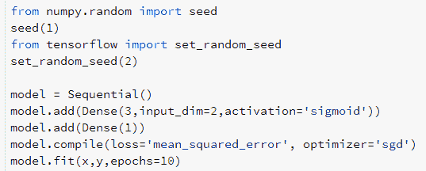

# 理解各种损失函数

如前一章所述，存在两种类型的因变量——连续变量和分类变量。在连续变量预测的情况下，损失（误差）函数可以通过计算所有预测的平方误差值之和来计算。

在因变量是与其相关联的唯一两个不同值的分类变量的情况下，损失是通过使用此公式的二进制交叉熵误差来计算的：

*y*logp + (1-y)*log(1-p)*

在因变量是具有多个不同值的分类变量的情况下，损失是通过使用分类交叉熵误差来计算的：

*∑ y*logp*

其中 *p* 是事件为 1 的概率。

在实践中，分类变量通常按以下方式进行 one-hot 编码：

假设三个不同行的输出为`[1,2,3]`；则输出值表示为`[[1,0,0], [0,1,0], [0,0,1]]`。其中每个索引值表示是否存在一个不同的值。在上面的例子中，零索引对应于 1，因此只有第一行在零索引处有值为 1，其余的值为 0。

Keras 中可用的其他损失函数包括：

+   均方绝对误差

+   均方绝对百分比误差

+   均方对数误差

+   平方铰链

+   铰链

+   分类铰链

+   Logcosh

# Softmax 激活

从前面的章节中，我们应该注意到，在分类变量预测的情况下，输出层的单元数将与因变量中不同值的数量相同。

此外，请注意，输出层的任何单元的预测值都不能大于 1 或小于 0。同时，输出层中所有节点值的总和应等于 1。

例如，假设两个输出节点的输出值分别为-1 和 5。鉴于输出值的期望值应在 0 到 1 之间（即事件发生的概率），我们将输出值通过 softmax 激活函数传递，如下所示：

+   通过指数函数传递值：

*exp(-1) = 0.367*

*exp(5) = 148*

+   将输出值归一化以获得介于 0 到 1 之间的概率，并确保两个输出节点之间的概率总和为 1：

*0.367/(0.367+148) =0.001*

*148/(0.367+148) = 0.999*

因此，softmax 激活帮助我们将输出值转换为概率数。

# 在 Keras 中构建更复杂的网络

到目前为止，我们已经构建了一个相当简单的神经网络。传统的神经网络会有更多可变的参数，以实现更好的预测能力。

让我们通过使用经典的 MNIST 数据集来理解它们。MNIST 是一个包含 28 x 28 像素大小的手写数字数据集，这些图像表示为 28 x 28 维度的 NumPy 数组。

每个图像都是一个数字，当前的挑战是预测图像对应的数字。

让我们下载并探索 MNIST 数据集中的一些图像，如下所示：

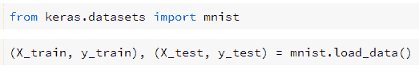

在前面的代码片段中，我们正在导入 MNIST 对象并使用`load_data`函数下载 MNIST 数据集。

还要注意，`load_data`函数有助于自动将 MNIST 数据集分割成训练集和测试集。

让我们可视化训练集中的其中一个图像：

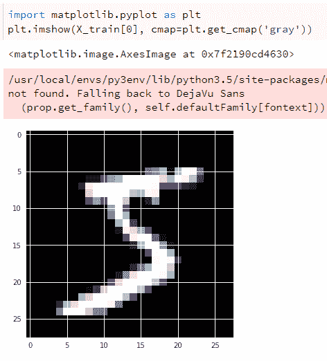

注意，前面的数字是 5，而我们看到的网格大小为 28 x 28。

让我们进一步了解输入和输出的形状，以更好地理解数据集：

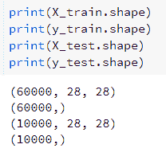

由于每个输入图像的大小为 28 x 28，让我们将其展平以获取`784`个像素值的分数：

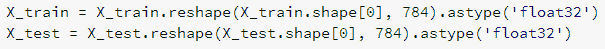

输出层需要预测图像是否对应于 0 到 9 之间的数字之一。因此，输出层由 10 个单元组成，分别对应于 10 个不同的数字：

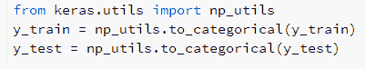

在前面的代码中，`to_categorical`提供了标签的一热编码版本。

现在我们已经准备好了训练集和测试集，接下来让我们在下一节中构建神经网络的架构：

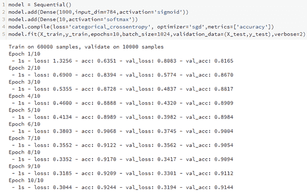

注意，前面的截图中的`batch_size`指的是用于更新权重的数据点的数量。批量大小的直觉是：

"如果在包含 1,000 个数据点的数据集中，批量大小为 100，那么在整个数据中遍历时会有 10 次权重更新"。

注意，在预测测试集上的标签时，准确率约为 91%。

当达到 300 个 epoch 时，准确率提高至 94.9%。请注意，对于测试集上的 94.9%准确率，训练集上的准确率约为 99%。

这是一个过度拟合的经典案例，处理方法将在后续章节中讨论。

# 激活函数

到目前为止，我们只考虑了隐藏层中的 Sigmoid 激活函数。然而，还有许多其他激活函数在构建神经网络时非常有用。此图表提供了各种激活函数的详细信息：


最常用的激活函数是 ReLU、Tanh 和逻辑或 Sigmoid 激活。

让我们探索各种激活函数在测试集上的准确率：

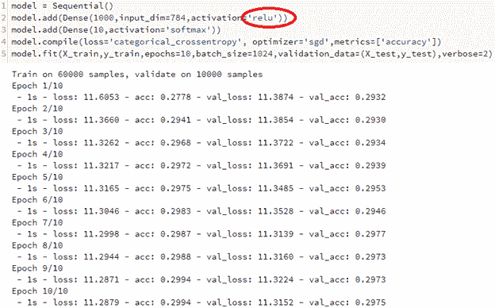

注意，当使用 ReLU 激活时，测试集上的准确率仅为 29.75%。

然而，在进行 ReLU 激活时，在拟合模型之前对数据进行缩放总是一个好主意。缩放是一种减少输入数据集中所有值幅度的方法。

让我们先对输入进行缩放，如下所示：

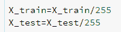

现在，让我们重新运行模型并查看测试数据集上的准确率：

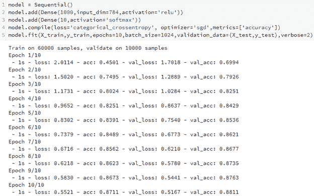

注意，运行 10 次迭代后，测试数据集的准确率为 88.1%。现在，让我们运行模型 300 个 epoch，以便比较 sigmoid 激活和 ReLU 激活的输出。

你会注意到测试数据集的准确率为 95.76%，略高于 sigmoid 激活的准确率。然而，训练数据集的准确率为 96%，这表明它不太可能在该数据集上过拟合；因此，更多的 epoch 可能会进一步提高测试数据集的准确率。

让我们使用 Tanh 激活函数重新运行模型，首先不进行缩放，然后进行缩放。

当模型在未缩放的数据上运行时，10 个 epoch 后的准确率为 92.89%，300 个 epoch 后为 94.6%。

缩放输入数据集后，测试数据集的准确率在 10 个 epoch 后为 88%，300 个 epoch 后为 93%。

注意，当数据集缩放时，无论使用哪种激活函数，都不会出现过拟合的问题（训练数据集的准确率远高于测试数据集的准确率）。

# 优化器

在前一节中，我们探讨了各种激活函数，并注意到 ReLU 激活函数在高 epoch 数运行时能给出更好的结果。

在本节中，我们将探讨在激活函数保持为 ReLU 的情况下，改变优化器对缩放数据集的影响。

当运行 10 个 epoch 时，各种损失函数及其在测试数据集上的准确率如下：

| **优化器** | **测试数据集准确率** |
| --- | --- |
| SGD | 88% |
| RMSprop | 98.44% |
| Adam | 98.4% |

现在我们已经看到 RMSprop 和 Adam 优化器比随机梯度下降优化器表现更好；让我们看看优化器内部可以修改以改进模型准确率的另一个参数——学习率。

优化器的学习率可以通过以下方式指定：

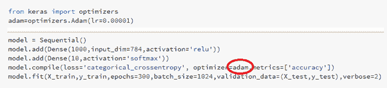

在前面的代码片段中，`lr`代表学习率。学习率的典型值介于 0.001 和 0.1 之间。

在 MNIST 数据集上，当我们改变学习率时，准确率没有进一步提高；然而，通常对于较低的学习率，需要更多的 epoch 才能达到相同的准确率。

# 增加网络的深度

增加隐藏层的深度等同于增加神经网络中隐藏层的数量。

通常，对于隐藏层中隐藏单元数量更多和/或隐藏层数量更多的情况，预测的准确率更高。

由于 Adam 优化器或 RMSprop 在经过一定数量的 epoch 后准确率会饱和，让我们切换回随机梯度下降，以了解模型运行 300 个 epoch 时的准确率；但这次我们在隐藏层中使用了更多的单元：

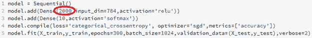

注意，通过在隐藏层中使用 2,000 个单元，我们的准确率在 300 个 epoch 结束时增加到 95.76%。这可能是因为输入现在可以在更高维的空间中表示，因此与 1,000 维空间场景相比，可以学习到更好的表示。

现在，我们将增加隐藏层的数量，以了解构建深度神经网络对准确率的影响：

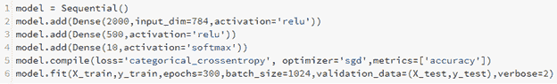

注意，当网络深度增加，有两个隐藏层而不是一个时，300 个 epoch 后的准确率为 97.24%，与单隐藏层网络相比，这是一个明显的改进。

类似地，当一层中的隐藏单元数量增加时，网络学会更复杂的数据表示，当隐藏层的数量增加时，网络也会学会更复杂的数据表示。

# 批量大小变化的影响

如前所述，批量大小越小，给定神经网络中权重的更新频率就越高。这导致达到网络一定准确率所需的 epoch 数量更少。同时，如果批量大小过低，网络结构可能会导致模型不稳定。

让我们在一种场景中将之前构建的网络与较小的批量大小进行比较，在下一个场景中与较大的批量大小进行比较：


注意，在前面的场景中，批量大小非常高，300 个 epoch 结束时的测试数据集准确率仅为 89.91%。

这是因为批量大小为 1,024 的网络会比批量大小为 30,000 的网络更快地学习权重，因为当批量大小较小时，权重更新的数量要高得多。

在下一个场景中，我们将批量大小减少到非常小的数值，以观察对网络准确率的影响：

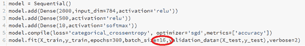

注意，虽然准确率在 10 个 epoch 内迅速提高到 97.77%，但要产生结果需要相当长的时间，因为每个 epoch 的权重更新数量很高。这导致更多的计算，因此执行时间更长。

# 在 TensorFlow 中实现神经网络

在前面的章节中，我们已经了解了神经网络的工作原理以及如何在 Keras 中构建神经网络模型。在本节中，我们将致力于在 TensorFlow 中构建神经网络模型。在 TensorFlow 中构建模型有两种方式：

+   使用预制的估计器

+   定义自定义估计器

# 使用预制的估计器

预制估计器类似于 scikit-learn 等包中可用的方法，其中指定了输入特征和输出标签，以及各种超参数。然后，可以通过传递不同的函数作为参数来优化解决预定义为默认值的损失函数。

让我们探索在代码中构建训练和测试数据集：

1.  导入相关包：

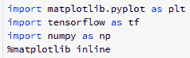

1.  导入数据集。我们将在这个练习中使用 `MNIST` 数据集：

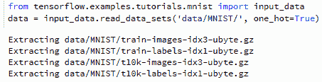

图像和标签的形状如下：

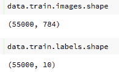

预制函数在标签值上工作，而不是在独热编码版本上。让我们将独热编码标签转换为值，如下所示：

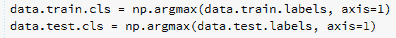

让我们了解数据点的样子：

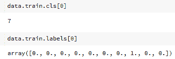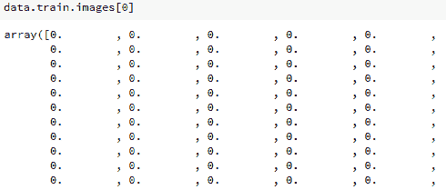

1.  将数据集输入到消耗自变量（`x`）和因变量（`y`）的函数中：


注意，我们将自变量命名为 `x2`，因变量命名为 `y`。

此外，请注意，我们已经传递了形成自变量和因变量值的数组。

`batch_size` 表示用于计算损失函数的训练示例数量，而 `num_epochs = None` 表示稍后将会提供要运行的 epoch 数量。

`train_input_fn` 返回特征和标签，如下所示：

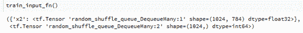

同样，我们传递测试数据集：

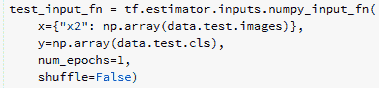

注意，在测试数据集的情况下，`num_epochs = 1`，因为我们只通过前馈传递一次测试数据集，一旦从训练中推导出模型权重。

一个数据集可能包含多个列，因此让我们指定特征列及其类型，如下所示：

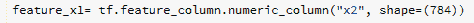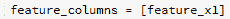

如果有多个列，我们将在列表中指定所有列，如下所示：

`feature_columns = [feature_x1, feature_x2]`

`feature_x1` 是一个特征，而 `feature_x2` 是另一个特征。

现在，我们将指定隐藏层的数量以及每层的隐藏单元数：

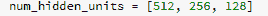

注意，通过以上方式指定隐藏单元数，我们已经指定了有三个隐藏层，其中第一个隐藏层有 **512** 个单元，第二个隐藏层有 **256** 个单元，最后一个隐藏层有 **128** 个单元。

既然我们已经指定了特征和隐藏层，让我们指定神经网络架构，如下所示：

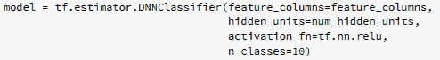

既然我们已经指定了模型架构，我们可以继续训练模型。如果您想进一步更改函数中可用的超参数，您可以通过使用 `help` 函数查看可用的超参数调节器，如下所示：

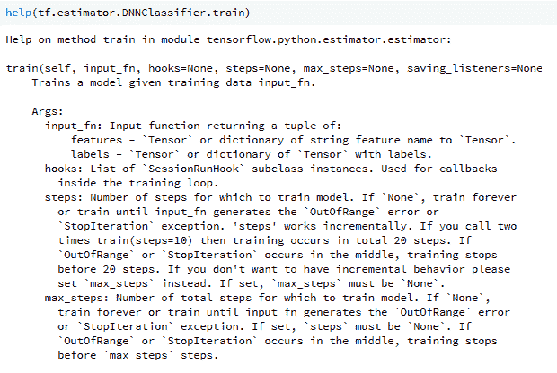

以下代码运行神经网络模型总共 2,000 个 epoch：

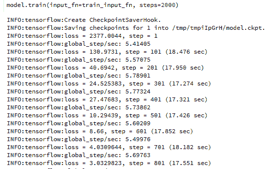

现在我们已经运行了模型，让我们评估测试数据集上的准确率，如下所示：

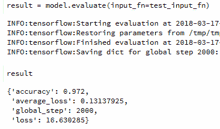

我们可以看到，模型在测试数据集上的准确率为 97.2%。

到目前为止，我们一直在使用预制评估器实现模型；在接下来的章节中，我们将探讨在不使用预制评估器的情况下定义模型。

# 创建自定义评估器

预制评估器限制了 TensorFlow 可以发挥的全面潜力；例如，我们无法在各个层之后有不同的 dropout 值。在这方面，让我们继续创建一个我们自己的函数，如下所示：

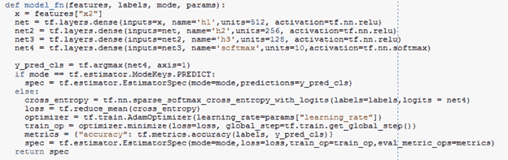

让我们详细探索前面代码片段的每个部分：


该函数接受特征（自变量）和标签（因变量）作为输入。`mode`表示我们想要训练、预测还是评估给定数据。

`params`为我们提供了提供有关参数信息的功能；例如，学习率：


前面的代码片段类似于我们在 Keras 中定义模型架构的方式，其中我们指定了输入、隐藏层激活函数和隐藏层中的单元数：


如果我们的模式是预测类别，我们就不需要训练模型，只需传递预测的类别，因此在这种情况下评估器规范只需计算`y_pred_cls`值，因此以下代码：


如果模式是训练或测试模型，我们就必须计算损失，因此以下代码：


在前面的代码中，第一行用于定义交叉熵计算。第二行计算所有行交叉熵的平均值。

`optimizer`指定我们感兴趣的优化器和学习率。`train_op`指定我们感兴趣的是最小化损失，而`global_step`参数记录模型当前所在的步（epoch）。`metrics`指定我们感兴趣计算的指标，最终计算的`spec`将是之前定义的所有参数的组合。

一旦定义了模型架构和需要返回的评估器规范，我们定义参数和模式如下：


从前面的代码中，函数学习需要更改的参数以及需要工作的模型架构（`model_fn`）：


我们通过指定模式（在这种情况下为`train`）和一定的训练轮数（在这种情况下为`2000`）来运行模型。

运行模型后，我们评估模型在测试数据集上的准确度，如下所示：


# 摘要

在本章中，我们学习了如何设置 Datalab 在 Google Cloud 上执行神经网络。我们还学习了神经网络的架构以及各种参数，如深度、隐藏单元数量、激活函数、优化器、批量大小和训练轮数如何影响模型的准确度。我们还看到了如何在 Keras 和 TensorFlow 中实现神经网络。本章还涵盖了使用预制的估计器和在 TensorFlow 中创建自定义估计器等主题。
