# 第一章：IBM 云简介

在本章中，我们将简要介绍 IBM 云平台及其提供的服务，例如**机器学习**（**ML**）。此外，本章还将提供如何在 IBM 云上设置数据科学和机器学习开发环境的详细说明。最后，我们将通过一个涉及加载数据和可视化的项目示例来结束。

我们将把第一章分解为以下部分：

+   理解 IBM 云

+   IBM 云和 Watson 机器学习服务

+   设置环境

+   数据可视化教程

# 理解 IBM 云

我们能对 IBM 云环境说些什么？是什么让它独一无二且如此令人兴奋？首先，IBM 云平台（以前称为**Bluemix**）实际上将**平台即服务**（**PaaS**）与**基础设施即服务**（**IaaS**）相结合，此外，还提供了一组或目录的云服务，您可以将这些服务与 PaaS 和 IaaS 集成，以高效构建个人、企业甚至全球创新的应用程序。

在 IBM 云（从开发者角度）的一些其他关键点包括以下内容：

+   您可以在所谓的**无边界云**中开发，这意味着您可以将私有服务连接到 IBM 提供的公共 IBM 云服务

+   您可以期待看到越来越多的服务和运行时框架被添加并可供您使用

+   您可以使用 IBM Watson 工具和服务，从想法的起点开始，到开发沙盒，再到全球分布式环境，而无需进行重大投资

+   您可以从 IBM、开源社区和第三方开发者那里测试和采用广泛的云服务和能力

+   您可以根据需求或工作负载需求的变化实时控制资源

我们可以做很多事情。

# 先决条件

作为基于云的环境，IBM 云没有需要担心的先决条件，这使得将其启动和运行变得相当容易。您真正需要的是一台网络浏览器（请参阅文档以获取推荐的版本）和合理的互联网连接。

可选，但推荐的是**IBM Cloud Developer Toolset**。IBM 将其宣传为与您的应用程序、容器、基础设施和其他服务交互的统一方式。在此安装中，您将获得独立的 IBM Cloud**命令行界面**（**CLI**），以及 Git、Docker、Helm、kubectl 和 curl 等工具，以及以下 IBM Cloud 插件：

+   IBM Cloud Developer Tools 插件

+   IBM Cloud Functions 插件

+   IBM Cloud Container Registry 插件

+   IBM Cloud Kubernetes Service 插件

+   sdk-gen 插件

如果您想安装 IBM Cloud CLI 以及为 IBM Cloud 应用程序开发推荐的其他插件和工具，请遵循此处在线描述的方法：[`console.bluemix.net/docs/cli/index.html#overview`](https://console.bluemix.net/docs/cli/index.html#overview)。

# 访问 IBM 云

让我们开始吧！要访问 IBM 云，您可以访问[`www.ibm.com/cloud`](https://www.ibm.com/cloud)，您将到达云注册/登录页面，如下面的屏幕截图所示：

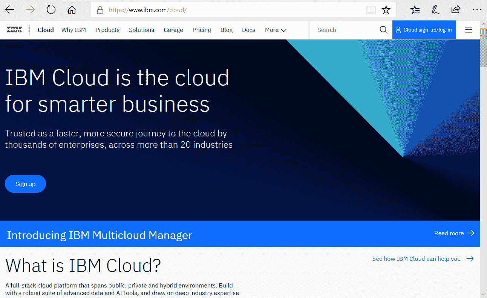

如果您点击蓝色云注册/登录链接，您可以使用 IBM ID 创建免费账户或登录（一旦您设置了付费或免费账户）。

在您的 ID 经过验证后，您将到达 IBM 云主页面或控制台，如下面的屏幕截图所示：

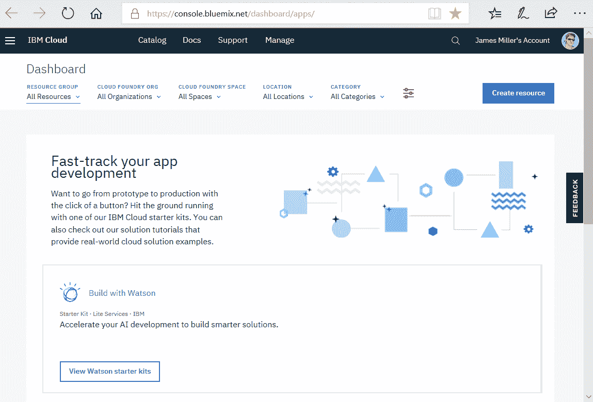

**IBM 云控制台**是您用来管理所有 IBM 云资源的用户界面。当您访问控制台时，您可以管理您的账户、登录、访问文档、访问目录、查看定价信息、获取支持或检查 IBM 云组件的状态。

登录后，**菜单栏**包含一个导航菜单图标和根据您的账户类型提供的其他链接。

从控制台，您可以执行以下任务：

+   使用导航菜单图标访问仪表板上的所有现有资源。

+   使用“目录”链接创建新资源。

+   使用“文档”链接访问有关 IBM 云的有用信息。

+   从“支持”菜单中，您可以访问有关 IBM 云新功能的信息、支持中心、添加和查看工单的选项以及状态页面。

+   从“管理”菜单中，您可以访问您的账户、计费和使用信息，以及安全选项。

+   按下键盘上的正斜杠键（/*）将光标导航到搜索字段。

# 云资源

通过 IBM 云仪表板或控制台，您可以查看和使用**IBM 云资源**和 Cloud Foundry**服务实例**。我们将在后面的章节中深入了解这些内容，但到目前为止，您可以将资源视为任何可以创建、管理和包含在资源组内的东西。一些例子包括应用程序、服务实例、容器集群、存储卷和虚拟服务器。

在以下屏幕截图中，您将看到控制台的上半部分：

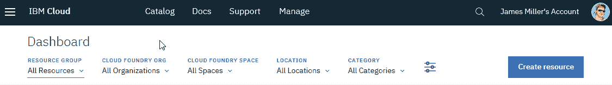

而不是在这里向您展示所有功能和特性的完整列表，我们将专注于有助于启动我们的机器学习项目开发的云领域。IBM 云提供了整洁的开发者仪表板（可通过控制台页面左上角的导航菜单图标访问），每个仪表板都专注于不同的兴趣领域（如沃森、安全或金融）或数字渠道（如移动或 Web 应用）。

开发者仪表板的菜单列表如下截图所示：

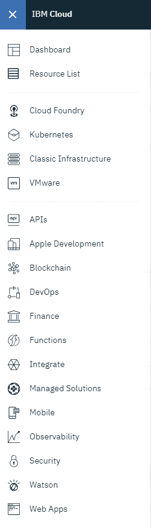

每个开发者仪表板都提供适用于仪表板关注区域的启动套件，提供一致、直观的工作流程，这有助于您在几分钟内创建一个可工作的应用程序解决方案。

# IBM 云和 Watson 机器学习服务

从提供的启动套件列表中选择 Watson 会打开“使用 Watson 构建”页面，其上半部分如下截图所示：

此页面分为几个部分，即概述、启动套件、Watson 服务、开发者资源和应用程序。如果您点击 Watson 服务，然后浏览服务，当前提供的 Watson 相关服务将作为面板呈现，如下截图所示：

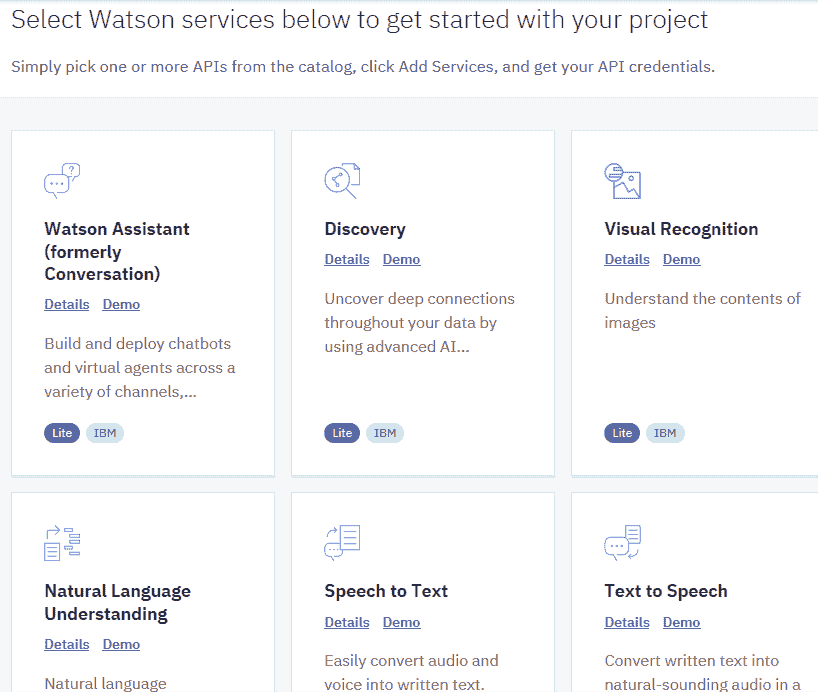

在此阶段，我们需要找到一个我们想要使用的服务实例。要选择服务提供，您可以点击您感兴趣的面板（例如，机器学习）。为了确保这是您想要的服务，您可以点击“详情”并阅读服务描述，包括其功能列表和其他相关信息（如下截图所示），然后点击“创建”：

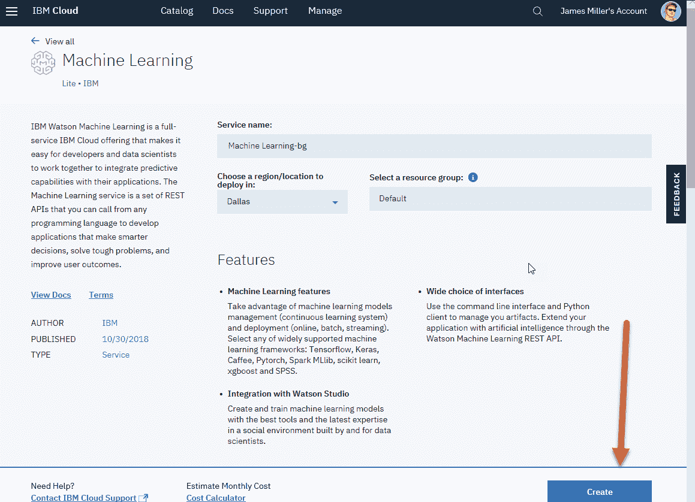

想要更多细节？别忘了点击页面上的“查看文档”链接。

# 设置环境

要构建基于 Watson 的项目，您需要访问 IBM Watson Studio。

您将从云仪表板菜单（使用前面 *访问 IBM 云* 部分提供的 URL）访问 IBM Watson Studio。

**IBM Watson Studio** 是一个集成环境，旨在使开发、训练和管理模型以及部署人工智能应用程序变得容易。您可以使用 Watson Studio 中的神经网络模型器和深度学习实验来解决最具有挑战性和计算密集型的问题，清晰且轻松。您需要您的 IBM ID 来设置此环境。

目前 Watson Studio 有三个版本，分别是 **Cloud**、**Desktop** 和 **Local**，每个版本都提供基于您想要执行工作的地方的解决方案：

+   **Watson Studio Cloud**：您的模型存储在 IBM 公共云中

+   **Watson Studio Desktop**：您的模型存储在您的桌面上

+   **Watson Studio Local**：您的模型存储在您的私有局域网或私有 IBM 云上

在本书中，我们将首先关注 Watson Studio Cloud。

# Watson Studio Cloud

一旦设置完成，您会发现 Watson Studio Cloud 格式与其他我们合作过的 IBM 网站（例如 IBM Watson Analytics 和云控制台）类似：

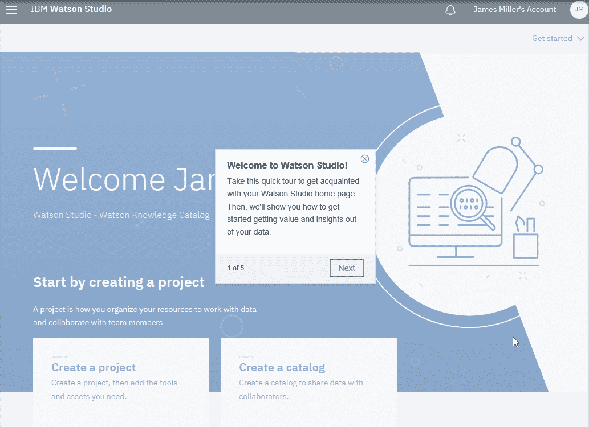

所有版本的 Watson Studio 都为您提供了通过协作处理数据来解决业务问题的环境和工具。您可以选择您需要的工具来分析和可视化数据、清洗和塑形数据、摄取流数据，或者创建、训练和部署机器学习模型。

# Watson Studio 架构和布局

Watson Studio 的架构围绕项目概念展开。项目是您组织资源并处理数据的地方。项目中最重要的资源包括协作者（您的用户，按安全角色分类）、数据资产（这些指向项目中要使用的数据）以及各种分析资产和工具（您从中提取数据洞察的地方）。

提供了一些有趣的工具，我们将在本书的后续部分详细介绍，例如 Streams Designer、Data Refinery、RStudio 等。您还可以从 IBM Watson 社区引入数据和数据分析资产。

您会发现 Watson Studio 的主页面或主页（有时被称为面板而不是页面）组织得很好，分为以下部分：

+   一个“入门”部分（如前一个截图所示），您可以点击面板创建（新的）项目或目录。

+   一个“最后或最近更新的项目”部分，您可以查看您有权访问的项目链接或通过点击“新建项目”创建新项目：

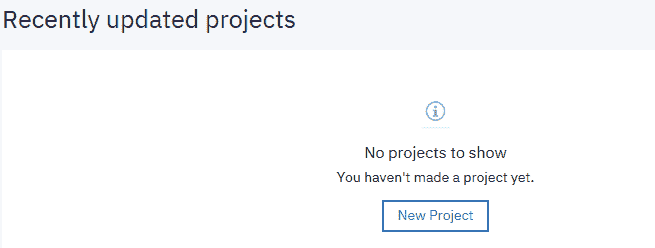

+   一个“您的目录”部分，您可以查看您有权访问的目录链接；您也可以创建一个新的：

目录是您组织资产（例如，您的数据、数据连接和分析）以及协作者的地方。

+   一个 Watson 服务部分，您可以查看您正在使用或使用过的活跃服务和工具列表，或者添加新的服务：

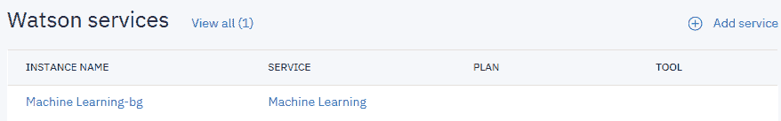

+   其他部分包括“社区新内容”部分：

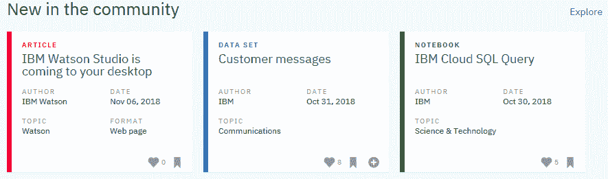

+   您还可以查看“有用的链接”：

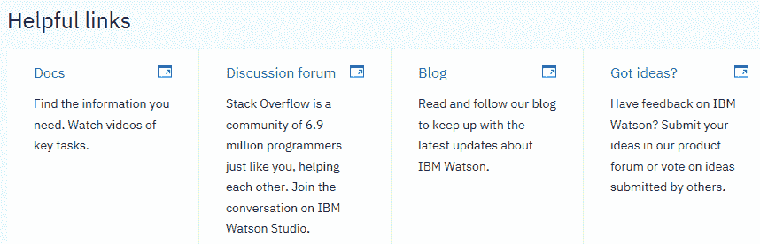

Watson Studio 简化了服务实例的管理、与队友协作，以及设计、训练和部署模型。本主题是关于在 Watson Studio 中设置机器学习环境。

要在不使用 Watson Studio 的情况下设置 Watson Machine Learning，请参阅此链接：[`dataplatform.cloud.ibm.com/docs/content/analyze-data/ml-setup.html`](https://dataplatform.cloud.ibm.com/docs/content/analyze-data/ml-setup.html)。

# 建立上下文

在我们设置项目之前需要做的是问自己：我们是要创建一个新项目还是重用现有项目？接下来，我们是要创建一个新的 Watson Machine Learning 服务实例还是重用已经拥有的一个？

# 设置新项目

简而言之，为了回顾我们已经讨论过的内容，为了设置我们的第一个新项目，我们需要点击主页标题区域中的 IBM Watson 链接，导航到 IBM Watson Studio 主面板。然后我们将执行以下步骤：

1.  点击“新建项目”。

1.  选择项目类型：

    +   如果您想使用实验训练复杂的神经网络，请选择*深度学习*项目

    +   对于所有其他机器学习工作，选择模型器项目类型

1.  如果您还没有任何所需的服务，例如 Watson 机器学习和 IBM 云对象存储，将创建新的服务实例。

到目前为止，我们本可以进一步探讨 IBM Watson Studio 的每个管理区域，但本书的目标更注重结果导向和动手实践，因此，也许下一步最好的做法是查看一个小而具体的项目，我们将在下一节中这样做。

与 IBM Watson 机器学习和 IBM Watson Studio 相关的有用关键词可以在网上查看[`dataplatform.cloud.ibm.com/docs/content/analyze-data/ml-terminology.html`](https://dataplatform.cloud.ibm.com/docs/content/analyze-data/ml-terminology.html)。

# 数据可视化教程

让我们从简单的项目开始吧！

和往常一样，你开始任何项目都是从陈述项目目标开始的。在这个项目中，目标是使用一个简单的文本文件（`TripRuns.csv`），该文件包含来自专业驾驶服务组织的成果，来展示如何使用 IBM Watson Studio 轻松创建一个简单的可视化分析仪表板。

使用分析仪表板，您可以构建复杂的分析结果可视化，基于这些结果在仪表板上传达见解，然后轻松与他人共享仪表板。Cognos 仪表板嵌入式使用 IBM Cognos Analytics 的仪表板功能。您可以通过访问以下 URL 了解更多关于如何使用仪表板的信息：[`www.ibm.com/support/knowledgecenter/en/SSEP7J_11.0.0/com.ibm.swg.ba.cognos.ug_ca_dshb.doc/wa_dashboard_discoveryset_intro.html`](https://www.ibm.com/support/knowledgecenter/en/SSEP7J_11.0.0/com.ibm.swg.ba.cognos.ug_ca_dshb.doc/wa_dashboard_discoveryset_intro.html)。

现在我们已经明确地陈述了项目目标，并铭记在心，我们需要遵循以下逐步指导：

1.  点击“新建项目”。

1.  接下来，点击“创建项目”页面。选择一个项目启动器（所需服务将自动提供。您可以在以后添加其他资产和服务）。对于这个示例项目，我们将通过点击“创建项目”，如图所示来选择业务分析：

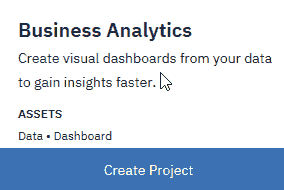

1.  接下来，您需要从下拉列表中选择一个区域，您的项目实例将驻留其中（我选择了美国南部）：

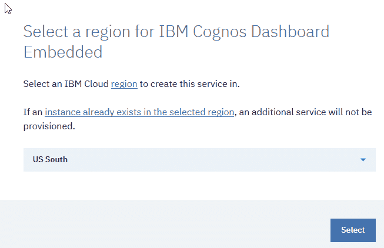

1.  点击“选择”后，如下面的截图所示的“新项目”页面允许您在点击“创建”之前提供适当的项目详细信息：

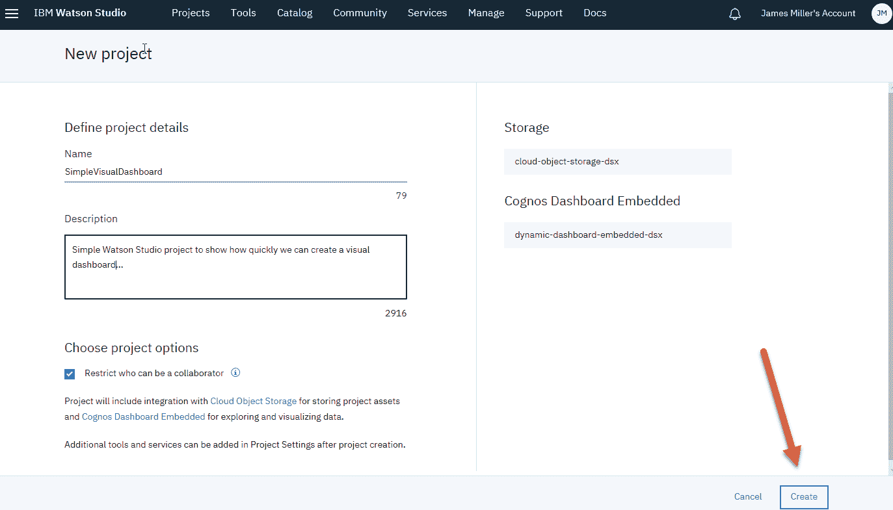

在“名称”和“描述”下输入名称和描述。对于此示例项目，您可以保留项目、选项和存储以及 Cognos 仪表板嵌入式信息，如前面的截图所示。

一旦创建项目，我们将有一个工作空间，我们可以组织项目将使用的资产。有许多资产（数据、协作者和分析工具），但我们需要从数据开始。要将数据加载到我们的项目工作空间中，我们可以使用直接数据库连接器，或者简单地拖放文件到着陆区（您也可以浏览到您的文件）。

对于我们的简单示例，我们使用文本文件作为数据源，因此您可以在项目工作空间页面右上角点击**查找并添加数据**图标，如下面的截图所示：

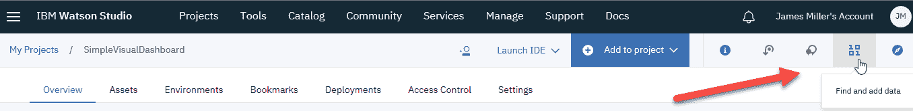

从那里，您可以在页面上点击“加载”，浏览以定位并选择您要在项目中使用的文件（我们的文件是`TripRuns.csv`）。文件加载后，然后点击“文件”，您应该会看到文件列出并准备好使用：

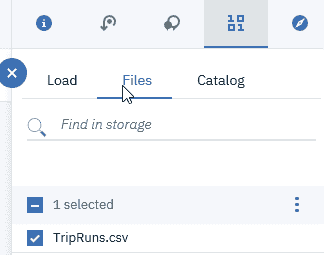

现在我们有一些数据可以处理，我们可以点击菜单选择“添加到项目”，然后选择“仪表板”：

在您选择仪表板后，您需要在“名称”和“描述”下提供名称和描述，然后点击保存：

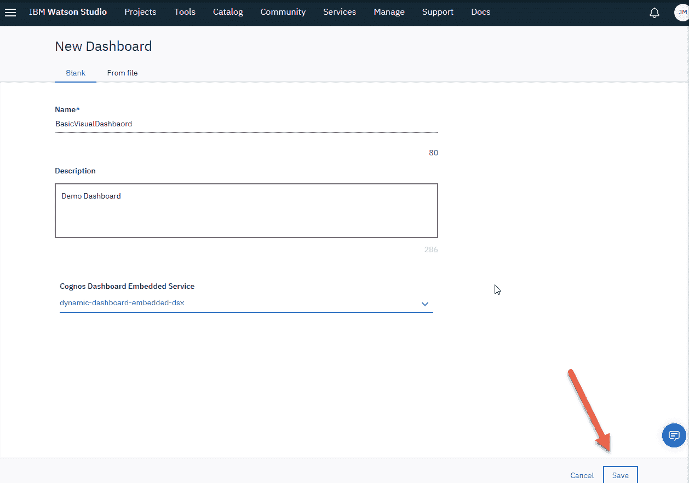

在 IBM Watson 为您的新项目设置仪表板后，您可以自定义它，从其一般布局开始。您可以从选择预格式化的模板开始：

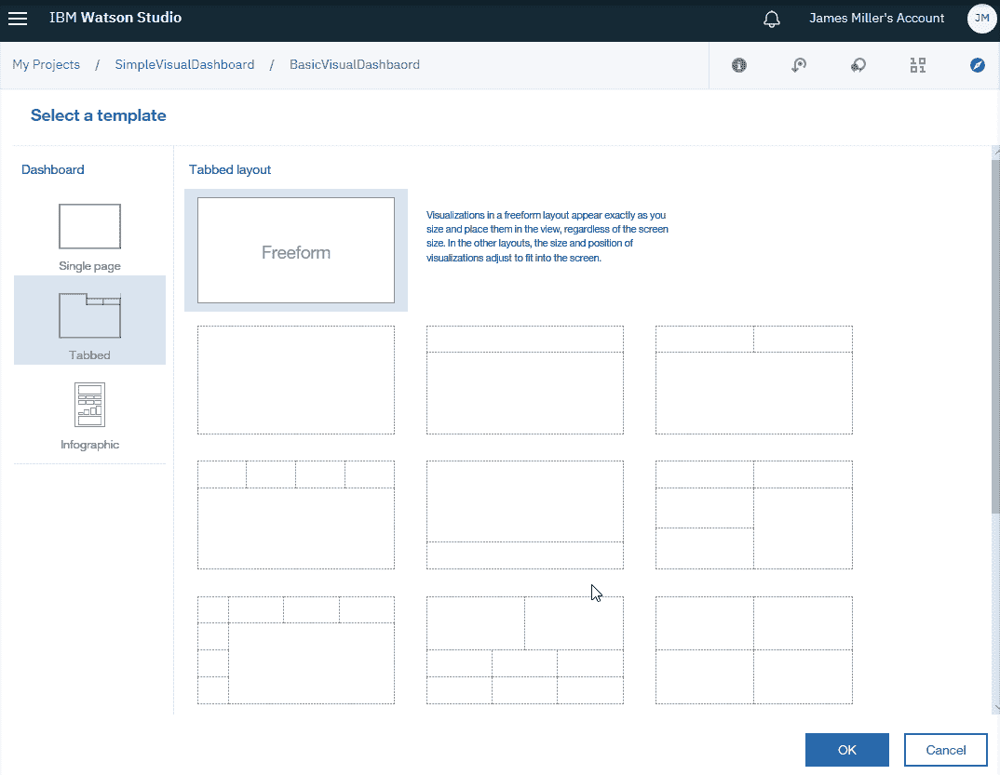

一旦您选择了模板（我选择了标签页和自由格式），您将发现自己处于仪表板画布上（如下面的截图所示），在那里我们可以设计您的仪表板：

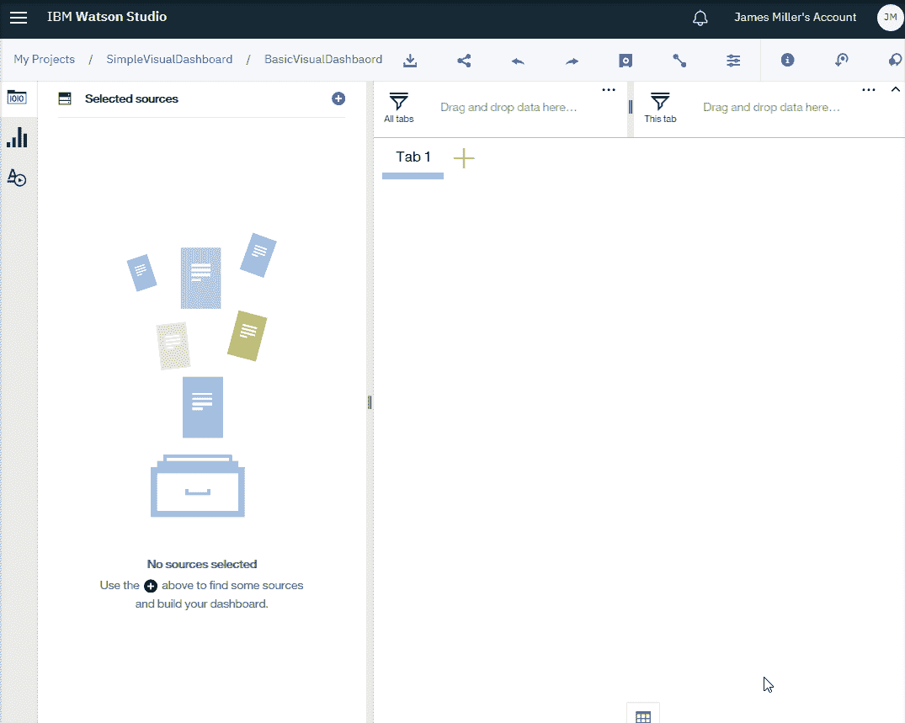

接下来，点击页面左上角“所选来源”附近的加号图标：

点击加号图标后，您可以选择我们之前添加到项目中的`TripRuns.csv`数据资产：

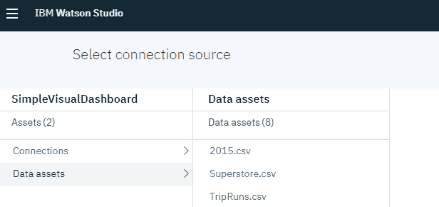

如果您想知道什么是连接，那将是您定义任何以直接连接到数据库或其他形式的数据资产的地方。**连接资产**包含创建数据源连接所需的信息。您创建到 IBM（或其他）云服务和本地数据库的连接。

在选择我们的数据资产后，它应该会显示出来，如下面的截图所示。现在我们准备开始构建我们的仪表板：

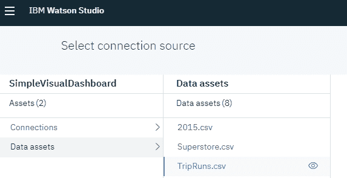

当你悬停在数据资产旁边的眼睛图标上时，你会注意到 Watson Studio 会给你一个选项，只需点击眼睛图标就可以快速查看数据资产。当处理多个数据资产时，这非常有用，如下面的截图所示：

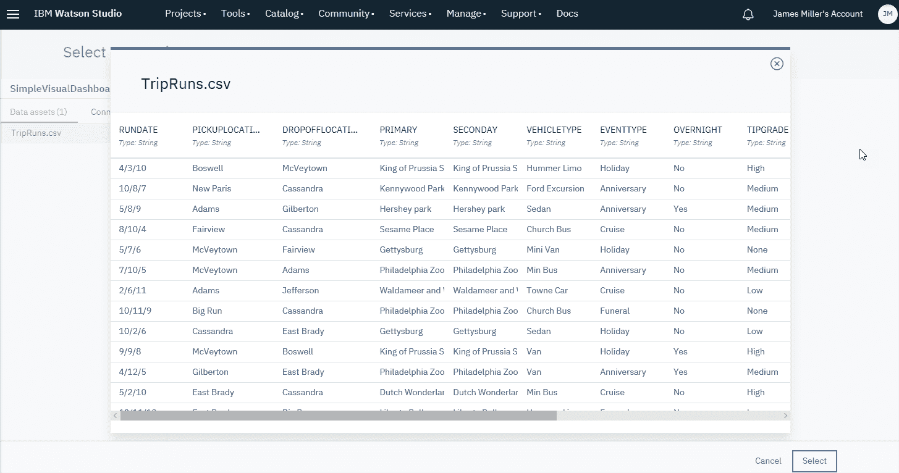

既然我们已经准备好继续，我们只需点击我们的数据资产名称（而不是眼睛图标），然后点击页面右下角的带有标题“选择”的按钮。仪表板画布页面再次显示。请注意，页面分为两个部分，如下面的截图所示：

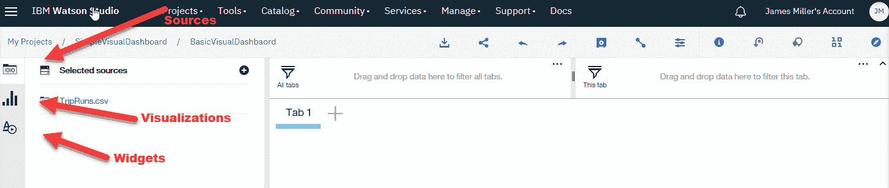

右边是绘图空间或画布，左边是菜单面板，它由三个图标组成：选择来源、可视化、和部件。我们已经设置了我们的数据源，所以让我们点击可视化。可视化选择器会显示出来，在那里你可以选择你想要在分析仪表板上使用的可视化类型：

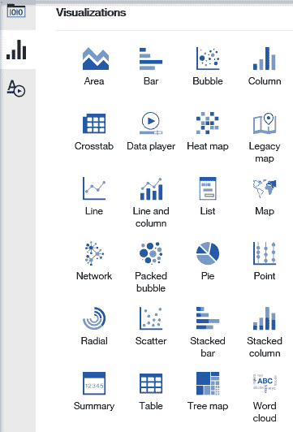

为了使这个例子简单，我们只是通过点击条形图标选择了条形作为可视化类型。一个构建你的可视化模板将被添加到你的画布上，如下面的截图所示：

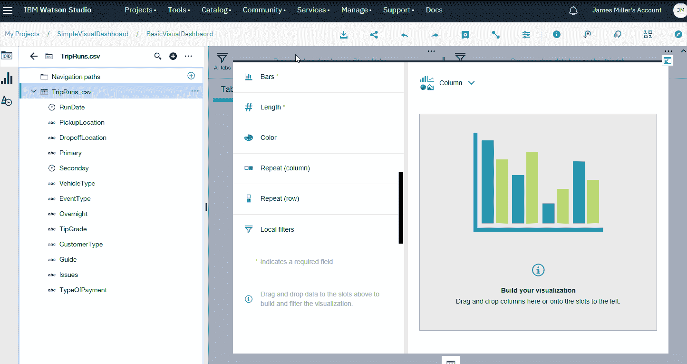

从那里，我们可以将数据列拖放到所需的可视化参数中，例如条形和长度。请注意，必需的参数由红色星号标注。

与大多数 Watson 可视化界面一样，当你添加或删除参数值时，可视化会实时更新：

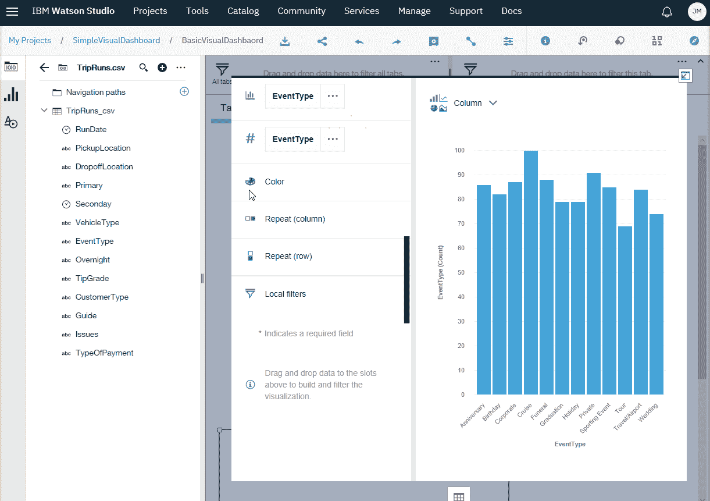

一旦你对你的可视化满意，你可以点击保存图标（位于仪表板操作栏上）来保存你的仪表板。你创建的仪表板会列在项目“资产”页面上的仪表板部分。

从仪表板操作栏，你可以执行以下任务：

+   将仪表板作为 JSON 文件下载

+   创建一个永久仪表板 URL 与他人分享

+   撤销/重做在仪表板上执行的操作

+   保存仪表板

+   添加/删除小部件连接

+   更改仪表板属性，例如颜色

+   查看仪表板详细信息，例如名称和描述，或者选择与项目关联的多个服务中的一个 Cognos Dashboard 嵌入式服务实例

+   在社区中查找资源，例如，有用的数据集

# 摘要

在本章中，我们首先介绍了 IBM 云环境以及如何首次访问它。此外，我们使用 IBM Watson 控制台来说明如何创建项目。

最后，我们回顾了添加新的数据集资产到项目以及用我们的数据在几分钟内创建一个简单的分析仪表板等任务，无需任何编程。

在下一章，我们将探讨特征提取。
