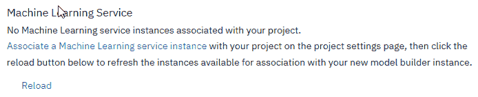
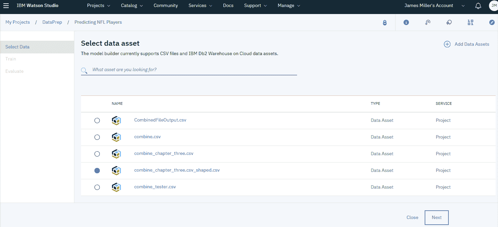
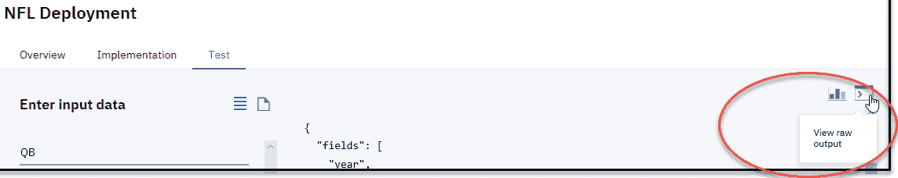
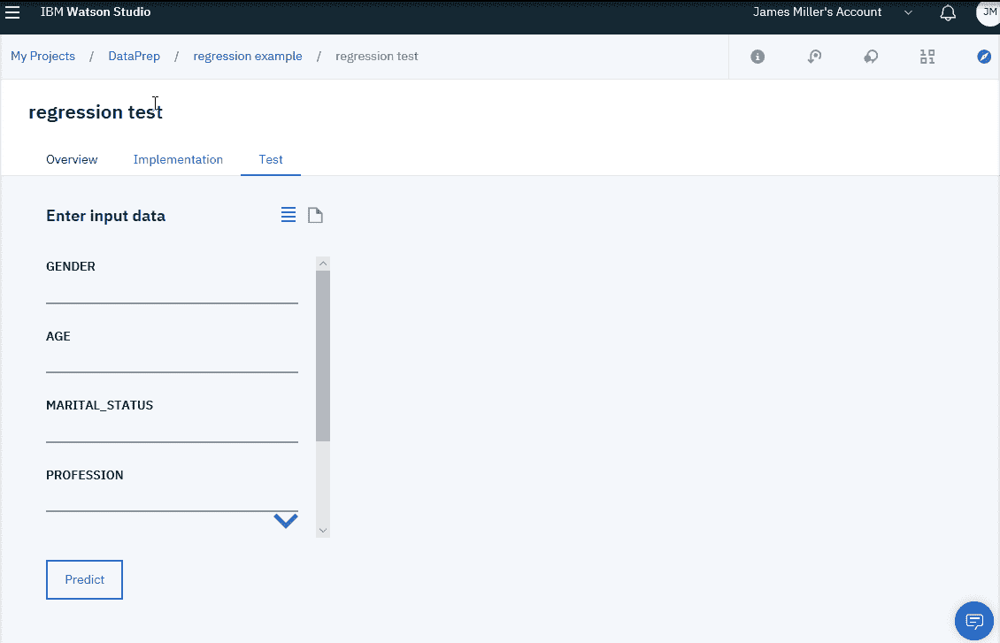

# 第三章：为您的数据提供监督式机器学习模型

本章（连同前两章）是整本书的骨架。它提供了机器学习范式的概览——通过 IBM Cloud 和 IBM Watson 平台提供的特性和功能，重点关注知名方法和算法。我们将从为模型评估、模型选择和机器学习中的算法选择提供一个相对实用的背景开始本章。接下来，我们将探讨 IBM Cloud 平台如何帮助简化并加速整个过程。

此外，本章还将讨论用于分类和回归问题的机器学习算法，并再次使用 IBM Cloud 平台来探讨这些主题。到本章结束时，读者不仅应该能够理解选择适当分类技术估计量所涉及的概念，而且能够使用 IBM Cloud 构建和部署针对现有数据的基线机器学习模型。

我们将本章分为以下几个部分：

+   模型选择

+   测试模型

+   分类

+   回归

+   测试预测能力

# 模型选择

机器学习变得越来越普遍，了解根据您的数据和目标选择哪种机器学习算法（或模型类型）很重要，如果您对这个过程相对较新，可能会感到有些令人畏惧。

将模型拟合到训练数据是一回事，但您如何知道您选择的模型（技术）或算法能否很好地泛化到所有数据并创建最佳预测？过多的训练或过拟合并不能解决这个问题；实际上，在这种情况下，模型在新数据上表现不佳是典型的。

再次强调，IBM Cloud 平台提供了强大且实用的工具来协助您完成这个过程。

云提供了机器学习服务（IBM Watson Machine Learning）。该服务提供了一种使用持续学习系统管理您开发的机器学习模型的能力，以及包括在线、批量流和流模式在内的简单部署方法。

您可以点击以下链接了解更多关于 IBM Watson Machine Learning 的信息：[`console.bluemix.net/catalog/services/machine-learning`](https://console.bluemix.net/catalog/services/machine-learning)。

此外，IBM Watson Studio 中提供的模型构建器（包括教程和示例数据集，说明如何在不编写代码的情况下训练不同类型的机器学习模型）可以通过引导您完成可能繁琐的模型选择任务（甚至评估和部署）来快速入门。

在本章的后面部分，我们将引用提供的数据资产来展示读者理解选择模型类型、训练模型和评估模型性能的过程。

# IBM Watson Studio 模型构建器

IBM Watson Studio 中的模型构建器是一个图形工具，它实际上会引导您一步一步地构建您的第一个机器学习模型。模型构建器使用以下工作流程：

1.  上传数据以进行训练

1.  选择机器学习技术和算法

1.  训练和评估模型

1.  测试和部署模型

模型构建器（目前）专注于创建三种基本的机器学习模型技术（这对于大多数机器学习项目的入门通常已经足够）。此外，对于每种类型的模型，您可以在模型内部选择多个算法来实现。这些被称为模型技术。

构建机器学习解决方案的部分焦虑在于选择合适的 ML 算法。如果您不确定，或者为了节省时间，至少在您的前几次尝试中，您可能希望利用模型构建器自动根据您提供的训练数据为您选择算法的选项。模型技术包括以下内容：

+   **二元分类器**：将数据分类到两个类别

+   **多类分类器**：将数据分类到多个类别

+   **回归**：从连续值集中预测一个值

# 使用模型构建器

让我们现在逐步了解一些使用模型构建器的初始示例：

1.  要使用模型构建器，您需要将 Watson 机器学习服务作为资产添加到新的或现有项目中（这被称为将服务与项目关联）。为此，您可以在项目内部点击“添加到项目”，然后选择 WATSON MACHINE LEARNING 服务作为资产类型，如下截图所示：

1.  一旦您将此服务添加到项目中，您就可以通过点击“模型”下的“新建 Watson 机器学习模型”来创建和添加新模型。

1.  在“新建模型”页面（如下截图所示），您必须提供您新模型的基本详细信息如下：

+   名称：您新模型的名称。

+   描述：对您的模型的描述。

+   机器学习服务：模型将使用的服务（还有其他服务，但目前我们将选择 IBM Watson 机器学习服务：Machine Learning-bg）。

+   选择模型类型：在这个初次尝试中，我们希望模型构建器帮助我们选择模型类型和算法，因此您可以选择自动模式。

+   选择运行时：选择运行环境（目前只需使用默认的 Spark Scala 2.11 选项）。运行环境是内存、空间和 CPU 的组合，这可能会影响定价和成本。您可以在网上查看各种运行环境的详细信息（[`dataplatform.cloud.ibm.com/docs/content/wsj/console/environment-runtimes.html`](https://dataplatform.cloud.ibm.com/docs/content/wsj/console/environment-runtimes.html)）。

1.  最后，您可以点击创建：

Scala 已经获得了很大的流行度，并被大量公司广泛使用。Scala 和 Spark 被 Facebook、Pinterest、Netflix、Conviva 和 TripAdvisor 用于大数据和机器学习应用。IBM 云平台将 Scala 作为其默认选项之一。

如果您错过了或跳过了关联机器学习服务的步骤，当您点击“创建”时，您将看到以下消息：

1.  如果您看到此消息，您需要点击“关联机器学习服务实例”链接，选择一个服务，然后点击“重新加载”，才能继续创建模型。

# 训练数据

到此为止，我们需要为我们的模型选择一些训练数据。因此，从选择数据资产页面，我们需要找到我们的特定数据资产（文件），点击其左侧的选择单选按钮，然后点击“下一步”：

作为备注，选择数据资产页面通过如点击预览数据等特性，使确定用于训练模型的数据资产变得容易。

通过悬停在任何列出的资产上，然后点击它（点击预览日期），沃森将为您检索并加载数据以供您审查。

您不能在此处修改或精炼数据，但您可以滚动浏览以确保这是您想要用于训练模型的资产数据。如果您满意并希望将此数据用于模型，您可以点击“使用此数据”：

到此为止，是时候选择三种模型技术中的一种了。首先，您选择您想要预测的内容（数据文件中的列，称为标签列，模型需要预测其值）以及用于确定预测的列。这些是模型应特征化的数据资产中的数据列，或称为特征列。

然后，您可以使用模型构建器建议的技术（换句话说，算法）或选择您自己的：

使用模型构建器的一个明显优势是您可以在购买之前轻松尝试，换句话说，如果您不确定要选择哪种建模技术，您有机会快速使用并评估每个选项，投入最小。在前面的例子中，我选择了一个非常简单的尝试：我想让模型根据选定的年份（或 NFL 赛季）的体重预测球员的身高。

查看提供的模型技术选项，多类分类是将实例分类到三个或更多类别的过程；**二分类**是将实例分类到两个类别之一，回归将处理大量类别。

# 猜测要使用的技术

在这个例子中，高度的可能值可能不止两个，因此我们可能会选择多类分类甚至回归。再次强调，由于模型构建者可以快速处理这个问题，所以尝试两者并评估结果会更好。

接下来，如果您指明了手动方法（或选择了手动模式）来构建模型，您将必须点击页面右上角的添加估计器以选择一个或多个特定的估计器。选择正确的模型估计器通常比选择技术更难。不同的估计器更适合不同类型的数据和解决不同的问题。

正如我们将在本章后面看到的那样，模型构建器允许您为同一模型选择多个估计器并在每个估计器上训练，这样您就可以在同一页面上轻松比较和对比每个估计器的性能结果。

使用模型构建者，根据所选的分类技术，您将有一系列估计器可供选择（如下面的截图所示）。例如，我们选择了多类分类，因此您可以选择以下估计器之一：

+   决策树分类器

+   随机预测分类器

+   简单贝叶斯

在这里，我们将选择随机森林分类器估计器并点击添加：

点击添加后，然后点击下一步，模型将基于所选的数据、技术和估计器进行训练。然后结果将发布到选择模型页面（如下面的截图所示），在那里您可以点击保存以保存模型结果以供评估：

一个由模型构建器创建的沃森机器学习模型（创建于模型构建器）成为一项资产，并在 IBM Watson Studio 项目页面上列出（如上图所示），以便以后参考、改进和重用。

值得注意的是，学习如何选择分类技术（算法）和估计器的方法是通过模型构建者的实验。换句话说，使用更广泛的分类和特征选择术语，模型构建者现在使其足够有效和高效，可以测试各种方法来验证假设，轻松评估结果，然后将最佳拟合（关于模型性能和准确性的评估将在本章后面的部分和整本书中详细讨论）作为持续学习模型，用于新的和未见过的数据。

我们将在本章后面通过一些实验更详细地了解这个过程。

# 部署

将预测模型部署以便在常规决策中利用通常是一个相对复杂的过程，因为存在各种挑战，而且让我们面对现实——从未部署的预测模型永远不会增加价值。

当你使用 IBM Watson Studio 模型构建器创建模型时，你可以在训练后直接从模型构建器部署模型。更好的是，在你部署模型后，你可以为你的模型设置一个持续学习和评估的过程。

当你部署一个模型时，你将其保存到与你的 Watson 机器学习服务关联的模型存储库中，然后你可以使用部署的模型对数据进行评分并构建应用程序。

# 模型构建器部署步骤

要部署我们的预测模型，我们可以使用以下步骤：

1.  在模型页面上，点击添加部署。

1.  在部署模型页面上，选择在线部署类型并输入部署名称和描述。

1.  点击部署。

1.  当模型部署完成后，从 ACTION 菜单（如下截图所示圆圈处）点击查看：

部署详情窗口出现，显示三个标签页：概览、实施和测试（如下截图所示）：

# 测试模型

现在是查看如何在 IBM Watson Studio 中测试模型预测的好时机。为此，你可以点击测试：

默认生成的测试格式显示一个输入表单，你可以使用它来输入数据值。稍后，你会看到如果你有一个外部进程生成测试数据，你可以使用输入格式图标来使用 JSON 数据文件格式并粘贴你的数据测试值：

现在（停留在测试标签页），保留默认格式（输入表单）并为重要列输入一些值（输入数据表单使用数据集的样本记录填充）。要测试模型，更改值并点击预测：

1.  对于年份，请输入 `2016`

1.  对于位置，请输入 `QB`

1.  对于重量，请输入 `225`

1.  点击预测

一旦你的模型测试完成，IBM Watson Studio 会显示该列预测能力的图形评分（百分比）。在以下示例中，字段 5 和 6 分别是**位置**和**重量**，我们可以通过模型性能评分看到它们的预测能力：

因此，根据前面的输出，我们可能可以得出结论，在我们的 NFL 球员统计文件中，球员的位置是球员身高的一个很好的指标。

如果你想这样做，可以点击输出格式图标（如下截图所示圆圈处）并将性能信息转换为原始输出（查看原始输出）：

以这种方式（使用 Watson Studio 部署）部署你的模型时，部署是一次性的事件。换句话说，你输入数据，在数据上训练模型，然后查看性能结果并得出结论。

这对于探索和研究目的来说是有用的，但现实情况下，你可能会希望保留并随着新数据的可用而持续训练模型。为此，你可以使用 IBM Watson Machine Learning 的持续学习系统，该系统提供对模型性能的自动监控（在本章下一节中简要讨论），重新训练和重新部署，以确保模型预测的质量。

# 持续学习和模型评估

尽管我们不会在本章中深入探讨这个主题，但 IBM Watson Studio 确实提供了一个简单的方法来完成这项任务，使用你在模型构建器中开发并部署的模型。这种方法确实需要选择一个 Spark 服务或环境选项，并建立一个反馈数据存储作为项目资源，这是结果模型性能指标将被保留（保存）的地方。

这些资源可以通过以下截图所示的“配置性能监控”页面进行配置：

一旦你建立了（反馈）数据存储，你就可以使用 Watson Studio 和模型构建器轻松定义作为持续学习过程一部分的指标和触发器，并定期审查更新的模型性能指标，使用图表控件切换指标或以图表或表格的形式查看结果。

# 分类

分类是机器学习和统计学中的一个关键概念。我们已经展示了模型构建器提供了二元和多元分类技术（以及回归）。在本章的早期部分，我们使用了模型构建器并随意选择了一种分类技术，只是为了展示使用该工具构建、训练和部署模型是多么容易。在本节中，我们将更详细地研究每种技术，并考虑在给定我们的训练数据的情况下，哪种选择最有意义。

# 二元分类

二元分类（也称为**二项式**分类）是根据分类规则将给定集合的元素分为两组的过程。产品文档提供了一个很好的示例练习，你可以用它来了解何时二元分类可能是你模型的最佳选择。示例是训练一个模型来预测客户是否可能从户外用品店购买帐篷，基于训练数据样本。如果你继续下载样本数据并检查列，你可以理解二元分类是如何工作的。让我们分析这个练习。

我们想要构建一个模型，该模型可以预测给定客户是否可能购买特定产品；在这种情况下，是帐篷。假设我们再次使用模型构建器创建一个新的模型，加载提供的样本数据，并设置基本模型细节。

流程如下：

1.  定义一个标签列。在这个例子中，选择的是`IS_TENT`。此列指示客户是否购买了帐篷。

1.  定义特征列。特征列是数据中的列，包含机器学习模型将基于其预测的属性。在这份历史数据中，有以下四个特征列：

+   `GENDER`: 客户性别

+   `AGE`: 客户年龄

+   `MARITAL_STATUS`: `已婚`，`单身`，或`未指定`

+   `PROFESSION`: 客户职业的一般类别，例如酒店业或销售，或简单地其他

1.  将构建类型设置为自动（这将导致模型构建者自动选择一个算法来实现您指定的机器学习技术）。

1.  点击创建并添加训练数据。

要训练模型，您将指定前面的标签和特征列，然后选择机器学习技术：二元分类。模型保存后，将自动打开模型详细信息页面。要查看模型构建者使用了哪个算法，您可以转到模型详细信息页面上的概述信息中的摘要表（如下面的截图所示），然后单击模型构建者详细信息行中的“查看”：

这将揭示以下详细信息以供审查：

您可以看到，在选择了二元分类后，模型构建者选择了 LogisticRegression 作为其最佳估计量选择。当因变量是二元的（二分类）时，逻辑回归是通常的选择。在我们的案例中，因变量是我们的标签列，`IS_TENT`。

考虑到我们的数据和目标，结论是选择了二元分类作为技术，因为我们想将数据分类到定义好的类别中（例如，考虑训练数据中的记录如何分组：男性，已婚，从事销售；男性，单身，作为专业人士；等等）。使用的估计量（逻辑回归）被选择，因为，再次，因变量是二元的（购买或不购买）。

将样本数据值与所选技术和估计量对齐，这些选择的推理应该开始变得有意义。继续与数据和模型构建者进行实验以进一步熟悉这些概念是个好主意。

# 多类分类

多类分类（也称为**多项式分类**）是将预排列集的元素分类到三个或更多组中的任务。再次，产品文档提供了很好的例子：训练一个模型来预测户外设备店中最有可能引起客户兴趣的产品类别。

在上一节中，示例使用了相同的数据，但本例用例旨在确定产品类别（组）作为结果，而不是特定的购买决策。本例中构建的模型将预测哪个产品线最有可能引起特定客户的兴趣。

在逐步通过示例过程时，我们将拥有相同的训练数据和相同的特征列（与先前的示例相同），但不同的标签列：`PRODUCT_LINE`。此外，在本例中，而不是选择自动（Automatic），请选择手动（Manual），这样您就可以选择模型使用的特定算法。

因此，为了训练此模型，您将指定先前的标签和特征列，然后选择机器学习技术：多类分类（Multiclass Classification）。在这个练习中的另一个不同之处在于，我们希望为模型添加两个估计器（算法选择），以便我们可以比较每个性能：

1.  点击“添加估计器”（Add Estimators）以查看模型构建器中可用于多类分类技术的可用估计器（算法）。

1.  点击标有“朴素贝叶斯”（Naive Bayes）的卡片，然后点击“添加”（Add）。

1.  再次点击“添加估计器”（Add Estimators）。

1.  点击标有“随机森林分类器”（Random Forest Classifier）的卡片，然后点击“添加”（Add）：

模型构建器的一个整洁功能是，在训练完成后，您可以看到对两种算法选择的评估（如下面的屏幕截图所示）：

在前面的屏幕截图中，您可以看到使用朴素贝叶斯进行模型性能评估被评为差（Poor），而使用随机森林分类的模型性能被评为优秀（Excellent）。请考虑以下内容，正如我在本章中已经提到的，以及产品文档中甚至明确指出的。

“为了找到给定机器学习问题的最佳解决方案，有时您必须对训练数据、模型设计和/或使用的算法进行实验。使用模型构建器，您可以轻松比较不同算法使用的结果（以更好地了解最佳选择应该是什么）。”

这是一条非常好且实用的建议，尤其是对于那些相对较新的机器学习初学者来说。

现在，让我们继续本章的最后一个主题：回归。

# 回归

回归本质上是一种统计方法，用于寻找变量之间的关系。在机器学习中，这用于根据从数据集中获得的变量关系预测事件的结果。

正如我们在先前的模型训练选项中看到的那样，产品文档为我们提供了一个非常好的示例练习，我们可以用它来说明机器学习的回归方法：训练一个模型来预测客户在户外装备店旅行可能花费的金额。

再次，我们将回顾完成此练习所需的适当步骤。对于这个练习，我们将选择以下内容：

+   `PURCHASE_AMOUNT`（这是客户每次访问商店所花费的平均金额）作为我们的标签列

+   `GENDER`（性别）、`AGE`（年龄）、`MARITAL_STATUS`（婚姻状况）和`PROFESSION`（职业）作为我们的特征列

接下来，与前面章节的练习一样，我们再次点击手动，这样我们就可以选择模型使用的特定算法（而不是让模型构建器为我们选择），然后执行以下步骤：

1.  对于选择技术选项（如下面的截图所示），选择回归。

1.  添加名为梯度提升树回归估计器。以下截图显示了我们在本练习模型构建中选择的参数：

1.  一旦设置了上述详细信息，您就可以点击下一步，开始使用所选技术和估计器用样本数据训练模型。训练完成后，您可以点击保存。当然，在模型保存后，模型详情页面会自动打开：

1.  按照常规做法，为了验证模型构建者使用的算法，您可以再次访问模型详情页面上的概述信息中的摘要表（如下面的截图所示），然后点击模型构建者详情行中的查看：

# 测试预测能力

模型构建器的另一个有用功能是它为您提供了轻松测试已部署模型预测能力的能力，而无需进行任何编程。

要从部署详情页面测试已部署的模型，请执行以下步骤：

1.  首先，在部署详情页面的测试区域，将有一个简单的输入表单（如下面的截图所示），您可以在其中为特征列输入一些值：`GENDER`（性别）、`AGE`（年龄）、`MARITAL_STATUS`（婚姻状况）和`PROFESSION`（职业）（您可以忽略表单中的其他字段）：

1.  接下来，点击预测，根据您刚刚输入的值和构建的模型创建一个预测。这将是对具有输入属性的顾客在商店购物时可能花费的金额的预测。以下截图显示了测试结果。预测的花费金额为$118.81：

如文档所述，您可以从训练文件中获取额外的值组合并将它们输入到输入数据表单中，以进行额外的测试。

# 摘要

在本章中，我们讨论了模型选择的重要性；具体来说，是选择分类技术和相关估计器。我们看到了如何使用 IBM 云平台和 Watson Studio 以高效和有效的方式探索各种技术和估计器的性能。通过这个简单的探索过程，你可以有信心地认为你选定的模型与数据很好地匹配。我们还看到了如何使用 Watson Studio 来构建、部署和测试模型，并为其配置持续学习。

在下一章中，我们将讨论监督学习和无监督学习之间的区别，同时也会探讨半监督学习。此外，我们还将研究聚类算法的概念，并比较在线学习和批量学习。
