# 第六章：在 IBM Watson Studio 中使用 Spark

在本章中，我们将讨论**机器学习（ML）**管道，并提供在 IBM Watson Studio 中创建和部署 Spark 机器学习管道的指南。

我们将本章内容分为以下几部分：

+   Apache Spark 简介

+   在 Watson Studio 中创建 Spark 管道

+   数据准备

+   数据分析和可视化示例

# Apache Spark 简介

在我们开始创建任何类型的管道之前，我们应该花一分钟时间熟悉 Spark 是什么以及它为我们提供了什么。

Spark，既注重速度又易于使用，是一个专为大规模数据处理而设计的超快速开源引擎。

通过支持**循环数据流**和内存计算的先进**有向无环图**（**DAG**）执行引擎，程序和脚本在内存中可以比 Hadoop MapReduce 快 100 倍，在磁盘上快 10 倍。

Spark 由以下组件组成：

+   **Spark Core**：这是 Spark 的底层引擎，利用名为**弹性分布式数据集**（**RDDs**）的基本编程抽象。RDDs 是 Spark 用作“对象集合”的小的逻辑数据块。

+   **Spark SQL**：它提供了一个新的数据抽象，称为 DataFrame，用于使用分布式 SQL 查询引擎进行结构化数据处理。它使得未经修改的 Hadoop Hive 查询在现有部署和数据上运行速度可提高至 100 倍。

+   **MLlib**：这是 Spark 内置的算法库，用于挖掘大数据，包括常见的机器学习算法和实用工具，如分类、回归、聚类、协同过滤和降维，以及支持 Spark 的最佳底层优化原语。

+   **Streaming**：这扩展了 Spark 的快速调度能力，以对连续的新数据进行实时分析。

+   **GraphX**：这是用于分析图结构数据的图处理框架。

# Watson Studio 和 Spark

IBM Watson Studio 提供某些 Spark 环境，您可以使用这些环境作为默认的 Spark 环境定义，以便在 Watson Studio 中快速开始使用 Spark，而无需花费时间创建自己的 Spark 环境定义。这节省了设置时间，让您有更多时间创建解决方案而不是管理环境。

Spark 环境默认对所有 Watson Studio 用户可用。您不需要为您的 Watson Studio 项目配置或关联任何外部 Spark 服务。您只需选择所需的 Spark 运行时服务的硬件和软件配置，然后当您使用环境定义启动工具时，将根据您的配置规范创建一个运行时实例。Spark 计算资源仅用于您的工具，不与协作者共享——[`medium.com/ibm-watson/ibm-watson-studio-spark-environments-generally-available-f3dda78d3668`](https://medium.com/ibm-watson/ibm-watson-studio-spark-environments-generally-available-f3dda78d3668)。

# 创建支持 Spark 的笔记本

要在 Watson Studio 中使用 Spark，您需要创建一个笔记本，并通过执行以下步骤将其与 Spark 版本关联：

1.  创建笔记本的步骤与我们之前章节中遵循的相同。首先，在项目内部找到笔记本部分，然后点击新建笔记本。在新笔记本页面，提供名称和描述：

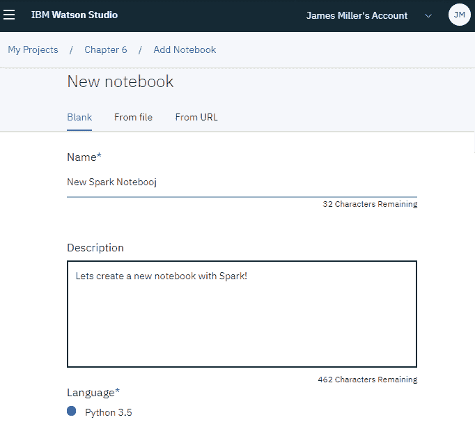

1.  注意，在上面的截图中，选中的语言是 Python 3.5——这是可以的，但如果我们向下滚动，我们会看到 Spark 版本*。从下拉列表中，您可以选择笔记本的运行环境。在我们的例子中，我们可以选择默认的 Spark Python 3.5 XS（驱动器有 1 个 vCPU 和 4GB，2 个执行器，每个执行器有 1 个 vCPU 和 4GB RAM）：

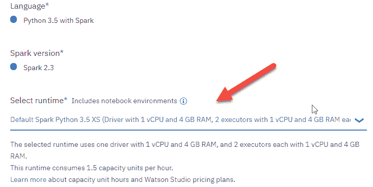

1.  一旦您点击创建笔记本，笔记本环境将被实例化，您就可以开始输入 Spark 命令了。

1.  一旦创建了支持 Spark 的笔记本，您就可以运行 Python 命令并执行 Spark 作业，使用 DataFrame 抽象作为数据源来处理 Spark SQL 查询，如下面的示例所示：

```py
df_data_2.createOrReplaceTempView("station")
sqlDF = spark.sql("SELECT * FROM station where VALUE > 200")
sqlDF.show()
```

在这一点上不要过分关注前面示例中的实际代码，因为在下一节中，我们将使用我们的支持 Spark 的笔记本来创建**Spark ML 流水线**。

# 在 Watson Studio 中创建 Spark 流水线

因此，让我们首先理解当我们说*流水线*时我们究竟指的是什么。

# 什么是流水线？

ML 流水线通常用于**自动化**ML 工作流程，本质上使数据集能够在模型中转换和关联，然后可以对其进行测试和评估以实现或估计结果。

这样的工作流程由四个基本区域组成：

+   数据准备

+   训练集生成

+   算法训练/评估/选择

+   部署/监控

# 流水线目标

管道由一系列阶段组成。管道有两个基本类型：**转换器**和**估计器**。正如在*什么是管道？*部分中暗示的，转换器接受一个数据集作为输入并产生一个增强的数据集作为输出，而估计器抽象了学习算法的概念并实现了一个接受数据和产生模型的方法。

更简单地说，管道执行一个可以重复准备新数据（用于转换）、转换准备好的数据，然后训练模型（在准备好的数据上）的工作流程。另一种总结方式是将管道视为运行一系列算法以处理和从数据中学习的过程。

# 拆解管道示例

我们将从在**IBM Watson Studio 社区**（*使用 Spark 和 Python 预测设备购买*，由 Melanie Manley 提交，2018 年 7 月 26 日）中可用的 Spark 管道示例的关键步骤开始：

在这个特定的例子中，我们看到一个现有的 Spark 启用笔记本，其中包含加载数据、创建预测模型和评分数据的步骤。

示例使用 Spark 命令来完成加载数据、执行数据清洗和探索、创建管道、训练模型、持久化模型、部署模型和评分模型的任务；然而，我们在这里将只关注创建 Spark ML 模型的步骤。读者可以选择在线查看整个示例。

# 数据准备

在这一步，DataFrame 对象中的数据（使用 Spark 的`randomSplit`命令）被分成三部分——一个**训练集**（用于训练模型）、一个**测试集**（用于模型评估和测试模型的假设）和一个**预测集**（用于预测），然后为每个集打印记录数：

```py
splitted_data=df_data.randomSplit([0.8,0.18,0.02],24)
train_data=splitted_data[0]
test_data=splitted_data[1]
predict_data=splitted_data[2]
print("Number of training records: " + str(train_data.count())) print("Number of testing records : " + str(test_data.count())) print("Number of prediction records : " + str(predict_data.count()))
```

在笔记本中执行前面的命令，如下面的截图所示：

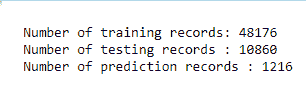

# 管道

在这里，在我们创建了三个数据集之后，将创建 Apache Spark ML 管道，并通过以下步骤训练模型：

1.  首先，你需要导入后续步骤中需要的 Apache Spark ML 包：

```py
frompyspark.ml.featureimportOneHotEncoder,StringIndexer,IndexToString,VectorAssembler
frompyspark.ml.classification importRandomForestClassifier
frompyspark.ml.evaluationimportMulticlassClassificationEvaluator
from pyspark.ml import Pipeline, Model
```

1.  接下来，示例使用`StringIndexer`函数作为转换器，将所有字符串列转换为数值列：

```py
stringIndexer_label=StringIndexer(inputCol="PRODUCT_LINE",outputCol="label").fit(df_data)
stringIndexer_prof=StringIndexer(inputCol="PROFESSION",outputCol="PROFESSION_IX")
stringIndexer_gend=StringIndexer(inputCol="GENDER",outputCol="GENDER_IX")
stringIndexer_mar = StringIndexer(inputCol="MARITAL_STATUS", outputCol="MARITAL_STATUS_IX")
```

1.  在接下来的步骤中，示例通过组合所有特征创建一个特征向量：

```py
vectorAssembler_features = VectorAssembler(inputCols=["GENDER_IX", "AGE", "MARITAL_STATUS_IX", "PROFESSION_IX"], outputCol="features")
```

1.  接下来，定义你想要用于分类的估计器（使用**随机森林**）：

```py
rf = RandomForestClassifier(labelCol="label", featuresCol="features")
```

1.  最后，将索引后的标签转换回原始标签：

```py
labelConverter = IndexToString(inputCol="prediction", outputCol="predictedLabel", labels=stringIndexer_label.labels)
```

1.  现在构建实际的管道：

```py
pipeline_rf = Pipeline(stages=[stringIndexer_label, stringIndexer_prof, stringIndexer_gend, stringIndexer_mar, vectorAssembler_features, rf, labelConverter])
```

在这个示例的这个阶段，你准备好使用你刚刚构建的管道和训练数据来训练随机森林模型。

# 数据分析和可视化示例

在 IBM Watson Studio 项目中使用启用了 Spark 的笔记本最令人兴奋的优势之一是，所有数据探索和随后的可视化通常只需几行（交互式编写的）代码即可完成。此外，笔记本界面允许尝试和错误的方法来运行查询和命令，查看结果，并可能调整（查询）并重新运行，直到您对结果满意。

最后，笔记本和 Spark 可以轻松扩展以处理大量（GB 和 TB）数据集。

在本节中，我们的目标是使用一个启用了 Spark 的笔记本来展示如何完成某些任务，例如将数据加载到笔记本中，进行一些简单的数据探索，运行查询（对数据进行查询），绘图，然后保存结果。

# 设置

让我们查看以下部分，以了解设置过程。

# 获取数据

首先，我们需要数据。我们不会自己编造，而是会遵循 Watson Studio 社区中其他几个工作示例的做法，并从 NOAA 国家气候数据中心（**NCDC**）公开下载一些收集到的数据：[www.ncdc.noaa.gov/data-access/quick-links](http://www.ncdc.noaa.gov/data-access/quick-links)。

这是如何从 NCDC 获取原始数据的方法：

1.  从**国家海洋和大气管理局**（**NOAA**）网站，点击全球历史气候网络（GHCN）。

1.  点击 GHCN-Daily FTP Access。

1.  点击 by_year/文件夹。

1.  滚动到页面底部并点击 2015.csv.gz 以下载数据集。

1.  文件下载完成后，将其提取到易于访问的位置。

# 加载数据

现在我们有一个（尽管有些结构化）仍然是原始数据的文件。在准备数据进行分析时，一个典型的第一项任务是添加列标题。如果文件大小合理，您可以使用程序员的文本编辑器打开并添加标题行，但如果不是，您可以直接在 Spark 笔记本中完成此操作。

假设您已经将文件加载到您的 Watson 项目中（使用我们在前几章中展示的过程），然后您可以点击“插入代码”，然后选择如图所示的“插入 pandas DataFrame 对象”：

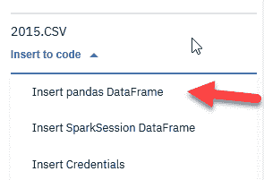

当您点击“插入 pandas DataFrame”时，会为您生成并添加到笔记本中的代码。生成的代码导入任何所需的包，访问数据文件（使用适当的凭据），并将数据加载到 DataFrame 中。然后，您可以在代码中的`pd.read_csv`命令中修改`names`参数（如图所示）。

这将在文件顶部创建一个标题行，使用提供的列名：

```py
df_data_1 = pd.read_csv(body, sep=',',names = ['STATION', 'DATE', 'METRIC', 'VALUE', 'C5', 'C6', 'C7', 'C8'])
```

在单元格中运行代码的截图如下：

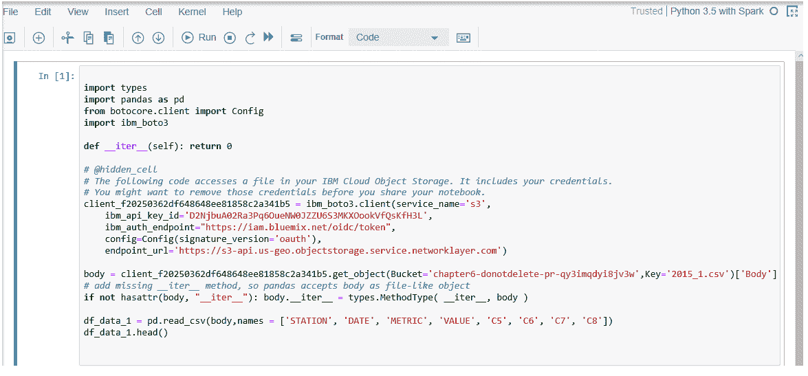

基础文件中的原始数据格式如图所示：

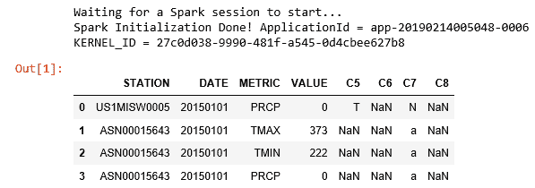

希望你能看到，每一列都包含一个气象站标识符、一个日期、收集的指标（如降水量、日最高和最低温度、观测时的温度、降雪、积雪深度等）以及一些额外的列（注意，缺失值可能显示为 NaN，表示 *非数字*）。

# 探索

正如我们在 第五章 中所展示的，“在 IBM Cloud 上的机器学习练习”，`pandas` 数据结构中有很多共同的基本功能，可以支持你的数据预处理和分析。然而，在这个例子中，我们将再次查看数据探索的示例，但这次使用 Spark DataFrame 方法。

例如，之前我们使用“插入 pandas DataFrame”加载了一个数据文件；这次，我们可以使用相同的步骤重新加载该文件，但这次选择“插入 SparkSession DataFrame”。生成的代码将包括 `import ibmos2spark` 和 `from pyspark.sql import SparkSession` 命令，并将数据加载到 `SparkSession DataFrame`（而不是 `pandas` DataFrame）中：

```py
import ibmos2spark
# @hidden_cell
credentials = {
   'endpoint': 'https://s3-api.us-geo.objectstorage.service.networklayer.com',
    'service_id': 'iam-ServiceId-f9f1f892-3a72-4bdd-9d12-32b5a616dbfa',
   'iam_service_endpoint': 'https://iam.bluemix.net/oidc/token',
   'api_key': 'D2NjbuA02Ra3Pq6OueNW0JZZU6S3MKXOookVfQsKfH3L'
}
configuration_name = 'os_f20250362df648648ee81858c2a341b5_configs'
cos = ibmos2spark.CloudObjectStorage(sc, credentials, configuration_name, 'bluemix_cos')
from pyspark.sql import SparkSession
spark = SparkSession.builder.getOrCreate()
df_data_2 = spark.read\
 .format('org.apache.spark.sql.execution.datasources.csv.CSVFileFormat')\
 .option('header', 'true')\
 .load(cos.url('2015.CSV', 'chapter6-donotdelete-pr-qy3imqdyi8jv3w'))
df_data_2.take(5)
```

运行单元格会启动 Spark 作业，显示这些作业的进度/状态，并最终显示由 `.take(5)` 命令生成的输出：

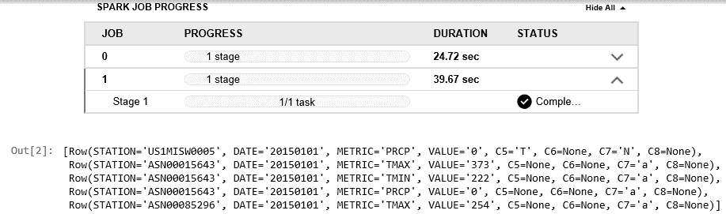`SparkSession` 是 Spark SQL 的入口点。它是你在开发 Spark SQL 应用程序时创建的第一个对象之一。作为一个 Spark 开发者，你使用 `SparkSession.builder` 方法（它为你提供了用于配置会话的 **Builder API**）来创建 `SparkSession`。

当然，我们也可以使用 `count()`、`first` 以及其他语句：

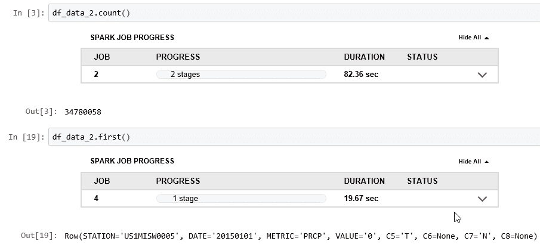

另一种有趣且实用的分析方法是通过显示 DataFrame 的模式。你可以使用 `printSchema()` 函数以树形格式打印出 `SparkR` DataFrame 的模式，如下所示：

```py
df_data_2.printSchema()
```

上述命令生成了以下输出：

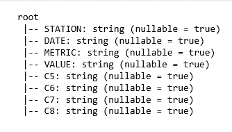

**模式**是数据结构的描述。模式使用 `StructType` 描述，它是一组 `StructField` 对象的集合（这些对象本身是包含名称、类型和可空性分类器的元组）。

使用 Spark DataFrame 也为你提供了在数据中导航和应用逻辑的能力。例如，通过运行 `print` 命令查看数据的前两行（或前几行）并不是不合理或不意外的；然而，为了可读性，你可能想通过以下代码在数据行之间添加一行星号：

```py
for row in df_data_2.take(2):
    print(row)
    print( "*" * 104)
```

上述代码生成了以下输出：

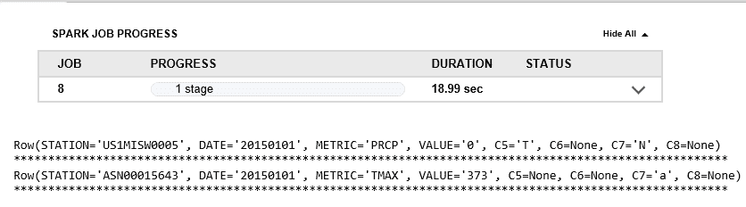

假设你感兴趣的是使用你的 SQL 技能来执行你的分析？

没问题！你可以使用 **SparkSQL** 与你的 `SparkSession` DataFrame 对象一起使用。

然而，所有 SQL 语句都必须在表上运行，因此你需要定义一个类似于 **指针** 的表来指向 DataFrame（在你导入 `SQLContext` 模块之后）：

```py
from pyspark.sql import SQLContext
sqlContext = SQLContext(sc)
df_data_2.registerTempTable("MyWeather")
```

此外，你还需要定义一个新的 DataFrame 对象来保存你的 SQL 查询结果，并将 SQL 语句放在 `sqlContext.sql()` 方法中。让我们看看它是如何工作的。

你可以运行以下单元格来选择我们刚刚创建的表中的所有列，然后打印关于结果 DataFrame 和数据模式的信息：

```py
temp_df =  sqlContext.sql("select * from MyWeather")
print (type(temp_df))
print ("*" * 104)
print (temp_df)
```

这会产生以下输出：

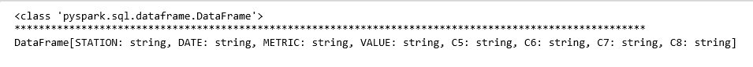

# 提取

现在让我们转向 **提取** 的概念。`print` 命令并没有真正以非常有用的格式显示数据。因此，而不是使用我们的 Spark DataFrame，我们可以使用 `pandas` 开源数据分析库来创建一个显示数据的 `pandas` DataFrame。

现在我们可以看看一个会让我们的 SQL 编程者感到高兴的例子。

导入 `pandas` 库并使用 `.toPandas()` 方法来显示 SQL 查询结果：

```py
import pandas as pd
sqlContext.sql("select STATION, METRIC from MyWeather limit 2").toPandas()
```

执行前面的命令会产生以下输出：

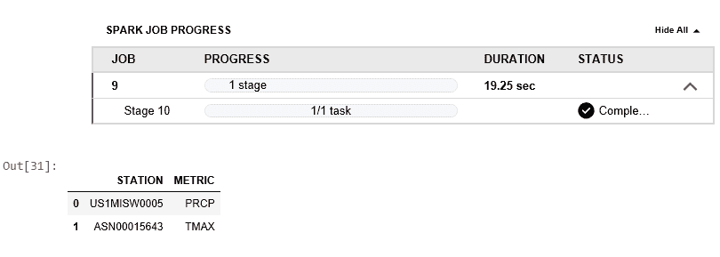

这里是另一个简单的 SQL 查询执行示例，这次是计算每个气象站记录的指标数量，然后创建一个按气象站指标记录数量排序的气象站列表：

```py
query = """
select
    STATION ,
    count(*) as metric_count
from MyWeather
group by STATION
order by count(*) desc
"""
sqlContext.sql(query).toPandas()
```

上述代码给出了以下输出：

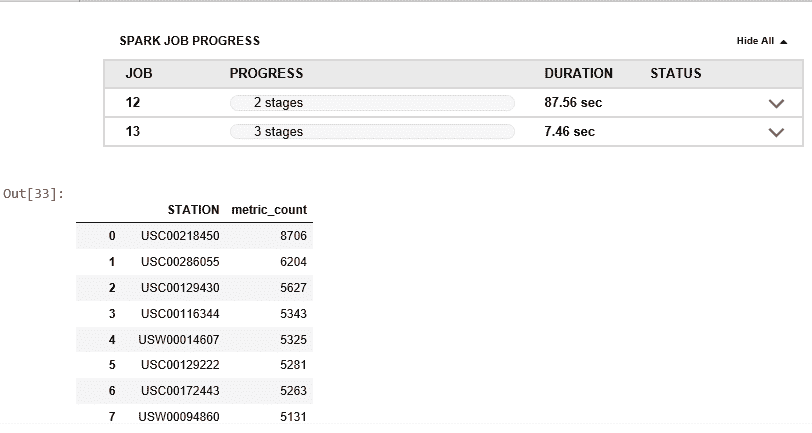

鼓励你尝试 SQL 语句的额外变体，然后实时查看结果。

# 绘图

那么，让我们继续前进！

我们现在将查看如何在 Spark DataFrame 中绘制一些我们收集的数据。你可以使用 `matplotlib` 和 `pandas` 创建几乎无限数量的可视化（一旦你足够了解你的数据）。

你甚至可能会发现，一旦达到这一点，生成可视化相当容易，但随后你可以花费几乎无限的时间来清理和准备与他人分享。

我们现在将查看这个过程的一个简单示例。

从上一节中的 Spark DataFrame 开始，假设我们认为生成一个基于数据中的 `DATE` 字段的简单柱状图会很不错。因此，为了开始，我们可以使用以下代码根据 `DATE` 来进行计数：

```py
df_data_2.groupBy("DATE").count().show()
df_data_2.groupBy("DATE").count().collect()
```

执行前面代码的结果如下截图所示：

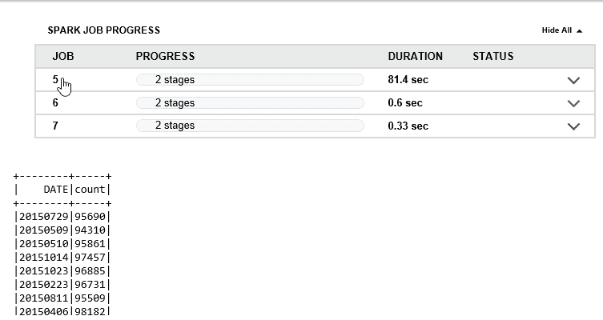

我们可能会说生成的输出看起来似乎有些合理（至少第一眼看起来是这样），所以下一步将使用以下代码构建一个以易于绘制的方式格式化的数据矩阵：

```py
count = [item[1] for item in df_data_2.groupBy("DATE").count().collect()]
year = [item[0] for item in df_data_2.groupBy("DATE").count().collect()]
number_of_metrics_per_year = {"count":count, "DATE" : year}
import pandas as pd
import matplotlib.pyplot as plt
%matplotlib inline
number_of_metrics_per_year = pd.DataFrame(number_of_metrics_per_year )
number_of_metrics_per_year .head()
```

执行此代码并查看生成的输出看起来完全合理，并且符合我们的目标：

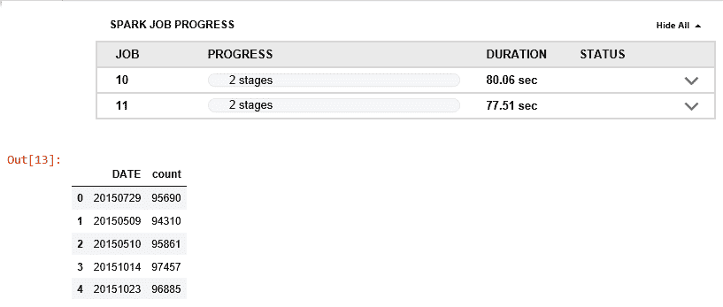

所以，太好了！如果我们达到了这个阶段，我们会认为我们已经准备好绘制和可视化数据了，所以我们可以继续使用以下代码来创建一个可视化：

```py
number_of_metrics_per_year = number_of_metrics_per_year.sort_values(by = "DATE")
number_of_metrics_per_year.plot(figsize = (20,10), kind = "bar", color = "red", x = "DATE", y = "count", legend = False)
plt.xlabel("", fontsize = 18)
plt.ylabel("Number of Metrics", fontsize = 18)
plt.title("Number of Metrics Per Date", fontsize = 28)
plt.xticks(size = 18)
plt.yticks(size = 18)
plt.show()
```

在运行前面的代码后，我们可以看到代码是有效的（我们已经基于我们的数据生成了一个可视化），但输出并不像我们希望的那样有用：

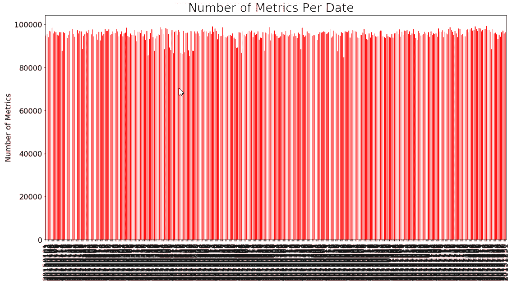

它相当混乱，并且不太有用！

所以，让我们回到并尝试减少我们试图绘制的数据量。幸运的是，我们可以重用本章前面部分的一些代码。

我们可以从再次设置一个可以查询的临时表开始：

```py
from pyspark.sql import SQLContext
sqlContext = SQLContext(sc)
df_data_2.registerTempTable("MyWeather")
```

然后，我们可以创建一个临时 DataFrame 来保存我们的结果（`temp_df`）。查询只能加载收集到的`METRIC`为`PRCP`且`VALUE`大于`500`的记录：

```py
temp_df =  sqlContext.sql("select * from MyWeather where METRIC = 'PRCP' and VALUE>500")
print (temp_df)
temp_df.count()
```

这应该会显著减少要绘制的数据记录数量。

现在，我们可以回到并重新运行我们用来创建要绘制的矩阵数据的代码以及实际的绘图代码，但这次使用临时 DataFrame：

```py
temp_df.groupBy("DATE").count().show()
temp_df.groupBy("DATE").count().collect()
count = [item[1] for item in temp_df.groupBy("DATE").count().collect()]
year = [item[0] for item in temp_df.groupBy("DATE").count().collect()]
number_of_metrics_per_year = {"count":count, "DATE" : year}
import pandas as pd
import matplotlib.pyplot as plt
%matplotlib inline
number_of_metrics_per_year = pd.DataFrame(number_of_metrics_per_year )
number_of_metrics_per_year .head()
number_of_metrics_per_year = number_of_metrics_per_year.sort_values(by = "DATE")
number_of_metrics_per_year.plot(figsize = (20,10), kind = "bar", color = "red", x = "DATE", y = "count", legend = False)
plt.xlabel("", fontsize = 18)
plt.ylabel("Number of Metrics", fontsize = 18)
plt.title("Number of Metrics Per Date", fontsize = 28)
plt.xticks(size = 18)
plt.yticks(size = 18)
plt.show()
```

现在我们得到了一个不同，也许稍微好一点的，但可能仍然还没有准备好分享的结果：

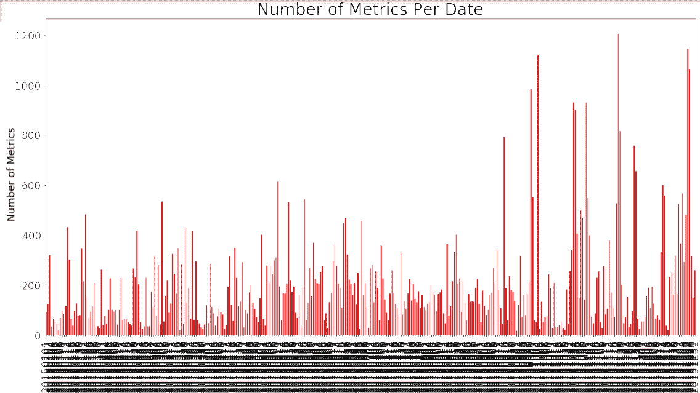

如果我们继续使用前面的策略，我们还可以再次修改 SQL 查询以进一步限制或过滤数据，如下所示：

```py
temp_df =  sqlContext.sql("select * from MyWeather where METRIC = 'PRCP' and VALUE > 2999")
print (temp_df)
temp_df.count()
```

然后，我们可以审查生成的临时 DataFrame，并看到现在它的记录数量少了很多：

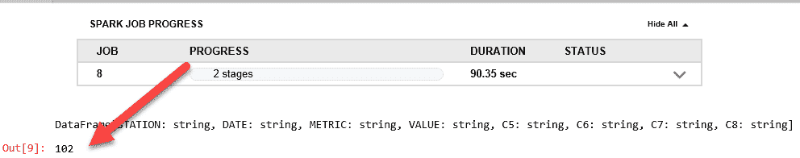

如果我们现在重新运行剩余的绘图代码，我们会看到它产生了一个稍微好一点的（但仍然不能接受）的图表：

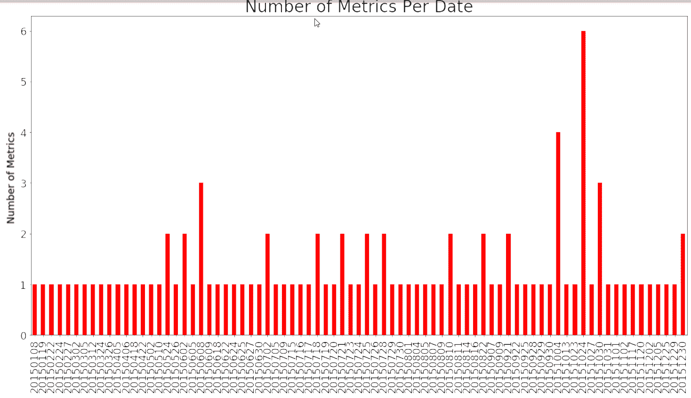

实际上，我们可以通过修改 SQL，重新运行代码，然后审查最新的结果来继续这个过程，直到我们对看到的结果满意为止，但你应该已经有了大致的概念，所以我们现在继续。

# 保存

就像在 Microsoft Word 或 Microsoft Excel 中工作一样，定期保存你的工作总是一个好主意。

事实上，你可能甚至想要保存你工作的多个版本，因为你继续进化它，以防你想要在某个时候回退。在进化你的脚本时，你可以点击文件，然后保存或保存版本以保留笔记本的适当副本：

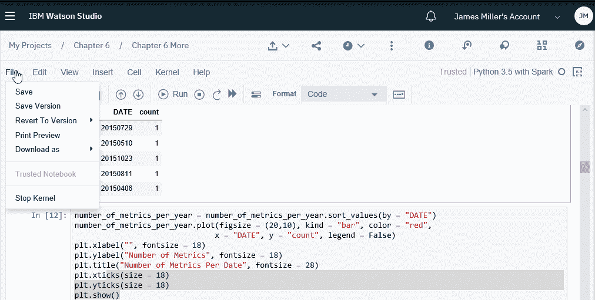

您还可以在 Watson Studio 之外保存和分享只读副本的笔记本，这样其他人即使不是 Watson Studio 项目的合作者也能查看和下载它们。您可以通过以下方式完成此操作：

+   **在社交媒体上分享 URL**：您可以在社交媒体或与 Watson Studio 外的人分享笔记本的最后保存版本。

+   **在 GitHub 上发布**：为了支持与利益相关者和整个数据科学社区的协作，您可以在 GitHub 仓库中发布您的笔记本。

+   **发布为 gist**：所有拥有管理员或编辑权限的项目协作者都可以将笔记本或笔记本的部分内容作为 gist 分享。您的笔记本的最新保存版本将作为 gist 发布。

# 下载您的笔记本

您可以按照以下截图所示下载您的笔记本：

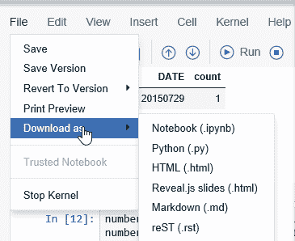

# 摘要

在本章中，我们介绍了 Spark 以及如何在 IBM Watson Studio 中创建一个 Spark 启用的笔记本，以及 ML 流程的概念。

最后，我们通过一个使用 Spark 进行数据分析并创建可视化来讲述数据更好故事的实际示例结束了这一部分。

在下一章中，我们将介绍在 IBM Cloud 上进行深度学习和神经网络的基础知识。
