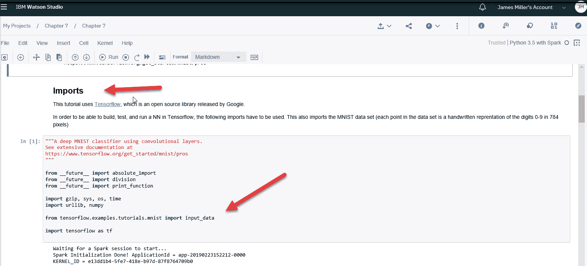

# 第七章：在 IBM 云上使用 TensorFlow 进行深度学习

在本章中，我们将介绍 IBM 云上深度学习和神经网络的概念。同时，我们将提供如何使用 TensorFlow 框架在云上实现深度学习模型的概述。本章旨在在理论与实践之间取得平衡。

在本章中，我们将介绍以下主题：

+   深度学习简介

+   TensorFlow 基础知识

+   使用 TensorFlow 的神经网络

+   一个例子

+   TensorFlow 与图像分类

+   额外的准备

# 深度学习简介

深度学习（也称为**深度结构学习**或**层次学习**）是更大一组基于学习数据表示的机器学习方法的组成部分，而不是特定任务的算法。

学习可以是监督的（我们在第三章，*监督机器学习模型与你的数据*）中已经讨论过）、半监督的，或无监督的（在第四章，*实现无监督算法*）。

深度学习算法正在一些令人兴奋的领域发挥作用，如图像分类（将数字图像中的每个像素分类为几种土地覆盖类别之一，或主题）、目标检测（在图像或视频中寻找现实世界对象（如人脸、汽车和建筑物）的实例的过程）、图像恢复（补偿或撤销由运动模糊、噪声和相机失焦引起的缺陷，这些缺陷会降低图像质量）以及图像分割（将数字图像分割成多个像素段的过程，也称为**超像素**，以简化图像表示或将其转换为更有意义且更容易分析的形式）。

使用巨大的神经网络进行深度学习正在教会机器自动化人类视觉系统执行的任务。

深度学习模型在某种程度上受到生物神经系统信息处理和通信模式的影响，但它们与生物大脑的结构和功能特性不同，这使得它们与神经科学证据不兼容。

足够的理论。虽然对机器/深度学习的先前列举可能属于高级别，但对于我们来说已经足够，可以继续到下一节，在那里我们开始思考深度学习实现的手段，特别是使用由谷歌大脑团队为谷歌内部使用开发的工具集，在 2015 年 11 月 9 日以 Apache 2.0 开源许可证发布：TensorFlow。

# TensorFlow 基础知识

张量可以被认为是广义的矩阵，或者更具体地说，是存在于结构中并与其他数学实体交互的数学实体。如果结构中的其他实体以任何方式变换，那么张量也必须按照那个变换规则变换。

前面的定义意味着什么？也许将**张量**视为多维数组更容易理解，或者考虑以下内容，比较**标量**、**向量**、**矩阵**和**张量**：


基于 TensorFlow 的主题，TensorFlow 是一个由 Google 最初创建的开源软件库（也称为**框架**），用于创建深度学习模型。

您可以访问[`www.tensorflow.org/`](https://www.tensorflow.org/)获取有关 TensorFlow 的更多详细信息。

在下一节中，我们将讨论深度学习、神经网络和 TensorFlow 之间的关系。

# 神经网络和 TensorFlow

深度学习模型通常采用被称为**神经网络**的算法，这些算法据说受到了实际生物神经系统（如大脑）处理信息方式的影响。这使得计算机能够识别所有数据点所代表的内容，并学习模式。

今天，深度学习模型的主要软件工具是 TensorFlow，因为它允许开发者创建具有多个层的庞大神经网络。

TensorFlow 主要用于以下目的：

+   分类

+   感知

+   理解

+   发现

+   预测

+   创建

如 Watson 文档中所述，部署复杂机器学习模型（如 TensorFlow 模型）的挑战在于这些模型在训练时非常计算密集和时间消耗。一些解决方案（针对这一挑战）包括 GPU 加速、分布式计算或两者的结合。IBM 云平台和 Watson Studio 都提供了这两种解决方案。

它还指出：IBM Watson Studio 允许用户利用云上可用的计算能力来加速更复杂机器学习模型的训练时间，从而将时间从数小时或数天缩短到几分钟。

在下一节中，我们将探讨几个练习，展示使用 IBM Watson Studio 和 TensorFlow 的各种方法。

# 一个例子

在本节中，我们将首先通过一个 Watson 社区([`dataplatform.cloud.ibm.com/community`](https://dataplatform.cloud.ibm.com/community))教程，展示如何使用 IBM Watson Studio 上的 TensorFlow 库轻松部署深度神经网络。

该教程可在 GitHub 上下载，但在此我们不会提供 URL，因为我们将展示如何直接在 IBM Watson Studio 项目中从外部来源（如 GitHub）导入内容变得多么简单。

本练习的关键点是复杂的机器学习模型可能非常计算密集，但 IBM Watson Studio 为您提供了轻松高效（按使用付费）使用云上计算能力来加速处理时间并缩短从数小时或数天到数分钟的学习时间的机遇。

此外，IBM Watson Studio 提供了在云中开发以数据为中心的解决方案所需的所有工具。它使用 Apache Spark 集群（用于计算能力），并允许您在 Python、Scala 和 R 中创建资产，并利用开源框架（如 TensorFlow），所有这些都在 Watson Studio 上预先安装。

如果您花时间阅读教程的细节，您会发现它解释了如何创建新的 IBM Cloud 账户并注册 IBM Watson Studio（我们在第一章，*IBM Cloud 简介*）。

然后教程继续展示如何导航到 IBM 的 Watson Studio（一旦在 IBM Cloud 平台上），创建一个新项目，然后将笔记本导入到项目中。

尽管在早期章节中，我们展示了如何在 Watson Studio 中创建新项目和创建新笔记本，但这将是第一次我们从外部 URL 直接进行笔记本导入，所以接下来的章节将重点介绍这个过程。

要导入的笔记本将已经包含 TensorFlow 库和示例代码，因此这项练习对我们来说应该既快又简单，所以让我们不要浪费更多时间！

# 创建新项目

通过遵循我们在早期章节中遵循的相同步骤，我们可以创建一个新的深度学习 IBM Watson Studio 项目（见以下截图）并为其命名：


# 笔记本资产类型

一旦创建新项目，从项目仪表板，您可以点击“添加到项目”选项并选择笔记本，如下截图所示：


正如我们在前面的章节中所做的那样，我们可以创建一个新的、空的笔记本。但在这个练习中，我们想要导入一个现有的笔记本。

IBM Watson Studio 允许您从文件或直接从已知且可访问的 URL 导入笔记本。

在此情况下，我们将选择从 URL 导入。为此，您需要选择“从 URL”选项，并输入以下行：

[`github.com/aounlutfi/building-first-dl-model/blob/master/first-dl-model.ipynb`](https://github.com/aounlutfi/building-first-dl-model/blob/master/first-dl-model.ipynb)

前面的链接将是导入到您的 Watson Studio 项目的（外部）URL。

接下来，点击“创建笔记本”开始导入（如果可以访问 URL，这个过程应该只需要几秒钟），如下截图所示：


几秒钟后，笔记本打开并准备好审查和执行：


# 运行导入的笔记本

要运行导入的笔记本，点击命令栏中的“单元格”，然后点击“运行所有”：


在点击运行全部之后，IBM Watson Studio 将运行笔记本中的所有单元格，这应该需要大约十五分钟的时间来完成，因为数据集由 20,000 张图像组成。

如果您想更好地理解正在发生的事情，您也可以单独运行每个单元格。

# 查看笔记本

如果您花时间（您应该这样做）查看笔记本中的单元格，您会注意到其中有很多 Markdown 单元格明确描述了笔记本中的步骤。

例如，你应该注意标记为“导入”的 Markdown 单元格（如下面的截图所示），其中清楚地说明为了能够在 TensorFlow 中构建、测试和运行神经网络，必须使用以下导入。这还导入了 MNIST 数据集（数据集中的每个点都是 0-9 数字的手写表示，每个数字由 784 个像素组成）：



指南还通过挑战您尝试在本地计算机上设置 Python 和 TensorFlow（而不是使用 IBM Watson Studio 在云上）并运行示例来强调一个观点，以便您可以比较结果，注意这可能需要数小时，甚至可能需要数天才能训练，这取决于机器的性能，而且是在您组装了所需环境之后！

在下一个示例中，我们将介绍如何使用 IBM Watson Studio 与 Watson 服务和 TensorFlow API 进行图像分类和对象检测。

# TensorFlow 和图像分类

IBM Watson 视觉识别服务使用深度学习算法来识别您上传到服务的图像中的特征，如场景、对象和面部。您还可以使用视觉识别服务、IBM Watson Studio 和相关 Python 模块创建和训练自定义分类器，以识别符合您要求的主题。

要开始使用视觉识别，我们需要使用常规程序创建 Watson Studio 项目并定义一个新的 Python 3.5 笔记本，但我们也需要将 IBM Watson 视觉识别服务实例与项目关联（实际上这是一件相当容易的事情）。

# 添加服务

要添加 Watson 视觉识别服务，您需要转到 IBM 云仪表板，选择 Watson 服务，然后浏览服务，在那里您可以找到并选择视觉识别服务：


接下来，从视觉识别页面（如下面的截图所示），您可以选择服务实例的位置和资源组，然后点击创建以实际创建您可以在项目中使用的服务实例：


一个视觉识别服务实例一次只能与一个项目相关联。

一旦创建了视觉识别服务实例，它将列在您的云仪表板上：


在创建服务实例后，您应该能够通过在服务凭据部分点击“新建凭据”或“查看凭据”来创建所谓的服务凭据（或 API 密钥）。

您将需要这个 API 密钥来引用和使用项目中的实例。

以下截图显示了服务凭据页面：


在本章的下一节中，我们需要引用这个 API 密钥，所以请将其保留在手边！

现在我们已经准备好开始实际的视觉识别项目。在这个例子中（GitHub 上有可用的版本），我们使用 Watson 视觉识别服务通过 TensorFlow 对象检测 API 进行对象检测。

# 必需的模块

尽管许多预安装的库和模块已经作为 IBM Watson 笔记本环境的一部分包含在内（取决于选择的笔记本类型），但为了使特定项目正确运行，可能还需要安装各种其他模块和框架，因此在我们笔记本中的第一件事就是输入以下命令以查看预安装库的列表：

```py
!pip list –isolated
```

总是以这个命令开始一个新的项目是一个非常好的主意，以了解您的笔记本环境；这可能会节省您以后的时间。

然后，您可以使用 Python 的`!pip install`命令逐行安装此项目所需的每个模块，如下所示：

```py
!pip install asn1crypto==0.23.0
!pip install bleach==1.5.0
!pip install certifi==2017.11.5
!pip install cffi==1.11.2
!pip install chardet==3.0.4
!pip install cryptography==2.1.3
!pip install cycler==0.10.0
!pip install enum34==1.1.6
!pip install html5lib==0.9999999
!pip install idna==2.6
!pip install Markdown==2.6.9
!pip install matplotlib==2.1.0
!pip install numpy==1.13.3
!pip install olefile==0.44
!pip install Pillow==4.3.0
!pip install protobuf==3.5.0.post1
!pip install pycparser==2.18
!pip install pyOpenSSL==17.4.0
!pip install pyparsing==2.2.0
!pip install pysolr==3.6.0
!pip install python-dateutil==2.6.1
!pip install pytz==2017.3
!pip install requests==2.18.4
!pip install six==1.11.0
!pip install tensorflow==1.4.0
!pip install tensorflow-tensorboard==0.4.0rc3
!pip install urllib3==1.22
!pip install watson-developer-cloud==1.0.0
!pip install Werkzeug==0.12.2
```

使用一个命令安装所需的模块的另一种更高效的方法是参考提供的`requirements.txt`文件：

```py
pip3 install -r requirements.txt
```

# 在代码中使用 API 密钥

IBM Watson 视觉识别服务内置了模型，您可以使用这些模型来分析图像，以识别场景、对象、面部以及许多其他类别，而无需任何训练。我们已创建了一个视觉识别服务的实例，因此它可用于我们的项目。为了使其工作，您需要拥有那个有效的密钥（我们的实际 API 密钥）。

即使您在 Watson 笔记本中有可工作的 Python 代码，您现在也需要使用您已建立的 API 密钥，这样它就可以与 Watson 服务进行验证（并且实际上可以工作）。

如果您查看 Python 项目代码（我们将在下一节中加载），您将找到以下代码语句：

```py
Visual_recognition = VisualRecognitionV3('2016-05-20', api_key='API_KEY')
```

这行代码是 Watson 视觉识别服务初始化为我们代码中可用的对象的地方。您需要将`API_KEY`短语替换为您实际的 API 密钥（您在上一节中创建的）。

# 额外的准备

在本节中，我们将处理一些在成功运行项目之前所需的额外家务。

Pillow 是**Python 图像库**（**PIL**），它提供了打开、操作和保存图像的支持。当前版本可以识别和读取大量格式。

这个项目使用`pillow`，并要求至少安装 5.3.0 版本。为了确保笔记本使用这个版本，我们需要运行以下命令：

```py
# --- we need pillow version of 5.3.0 to run this project
# --- this code will uninstall the current version:
!pip uninstall -y Pillow
# --- install the 5.3.0 version
!pip install Pillow==5.3.0
# --- import the new one
import PIL
# --- Should print 5.3.0\. If it doesn't, then restart the kernel 
print(PIL.PILLOW_VERSION)
```

代码卸载了当前安装的 Pillow 版本，安装了 5.3.0 版本，将其导入到项目中，然后打印出（现在）当前安装的版本。

如最后一行代码所示，如果`print`命令的输出没有显示安装的`pillow`版本是 5.3.0，你需要停止并重新启动你的内核（在笔记本中点击“内核”，然后重启），然后再次执行`print`命令，你应该就可以继续了：


# 升级 Watson

当我开始尝试这个项目时，在使用 Visual Recognition 服务时遇到了几个困难。经过大量的调试和一些来自 IBM Cloud 支持的宝贵帮助，确定我使用的项目代码正在使用较旧的云 API 版本。

为了解决我看到的问题，我需要使用以下命令将 Watson 服务升级到最新版本：

```py
# --- Upgrade Watson Developer
!pip install --upgrade "watson-developer-cloud>-2.8.0"
```

前一个命令生成了以下输出：


为了验证服务已升级，你应该看到以下消息：

```py
Successfully installed watson-developer-cloud-2.8.0 websocket-client-0.48.0
```

一旦服务升级，我之前遇到的所有问题都得到了解决。

在撰写本文时，2.8.0 是最新版本。建议始终检查并使用最新可用的版本。

# 图片

需要执行的最后一项设置任务是提供一个图像文件供我们的解决方案检测其中的对象。

示例项目代码提供了一个四只狗的图片，你可以使用它，但提供你自己的图片会更有趣。这个项目的 README 说明指出，代码期望文件位于`test_image/image1.jpg`，但你可以简单地使用我们在前几章中使用的相同步骤上传它作为数据资产，然后更新代码，以便找到文件（你还可以更改文件名）。

我选择了以下三张不同的图片：


# 代码审查

到目前为止，我们的环境应该已经准备好进行主代码部分。现在让我们看看代码的每个部分，以了解其目的。

第一部分执行了各种额外的导入操作。请注意导入 Visual Recognition 服务（`VisualRecognitionV3`）的代码行，该服务来自（现已升级的）`watson_developer_cloud`：

```py
from watson_developer_cloud import VisualRecognitionV3
```

以下是一些命令：

```py
import numpy as np
import os
import six.moves.urllib as urllib
import sys
import tarfile
import tensorflow as tf
import zipfile
import json
from io import StringIO
from PIL import Image
from watson_developer_cloud import VisualRecognitionV3
import matplotlib.pyplot as plt
import matplotlib.patches as patches
```

下一条代码使用了我们之前提到的 API 密钥（你将使用自己的）：

```py
# --- Replace with your api key
visual_recognition = VisualRecognitionV3('2016-05-20', api_key='r-1m0OdmBy9khRHJvujylJoLRJIqjwS6Bqwb6VMBfeCE')
```

下一个部分包含了一些变量，当你在运行笔记本时可以对其进行实验。查看结果并调整变量以观察效果：

```py
MAX_NUMBER_OF_BOXES = 9
MINIMUM_CONFIDENCE = .9
COLORS = ['b', 'g', 'r', 'c', 'm', 'y', 'b', 'w']
```

从前面的命令中，让我们探索定义的三个变量中的每一个：

+   `MAX_NUMBER_OF_BOXES`：这个变量代表在测试图像中要定位的最大对象数量；我使用了`9`，因为如果有很多，可能会变得很难看。

+   `MINIMUM_CONFIDENCE`：这个变量代表一个框可以有的最小置信度分数。如果这个值太低，你可能会在没有任何东西的地方得到框。

+   `COLORS`：这个变量设置结果识别框的属性。

# 访问模型

代码的下一部分将下载要使用的视觉识别模型并将其加载到内存中。第一次下载模型可能需要几分钟，但只需要在第一次运行时下载：

```py
# --- define What model to download.
MODEL_NAME = 'ssd_mobilenet_v1_coco_11_06_2017'
MODEL_FILE = MODEL_NAME + '.tar.gz'
DOWNLOAD_BASE = 'http://download.tensorflow.org/models/object_detection/'
# --- Path to frozen detection graph. This is the actual model that  # --- is used for the object detection.
PATH_TO_CKPT = MODEL_NAME + '/frozen_inference_graph.pb'
print('Downloading model... (This may take over 5 minutes)')
# --- Download model if not already downloaded
if not os.path.exists(PATH_TO_CKPT):
   opener = urllib.request.URLopener()
opener.retrieve(DOWNLOAD_BASE + MODEL_FILE, MODEL_FILE)
 print('Extracting...')
tar_file = tarfile.open(MODEL_FILE)
for file in tar_file.getmembers():
    file_name = os.path.basename(file.name)
if 'frozen_inference_graph.pb' in file_name:
tar_file.extract(file, os.getcwd())
else:
   print('Model already downloaded............')
# --- Load model into memory
print('Loading da model...')
detection_graph = tf.Graph()
with detection_graph.as_default():
    od_graph_def = tf.GraphDef()
    with tf.gfile.GFile(PATH_TO_CKPT, 'rb') as fid:
      serialized_graph = fid.read()
        od_graph_def.ParseFromString(serialized_graph)
       tf.import_graph_def(od_graph_def, name='')
```

# 检测

代码的下一部分运行图像使用 TensorFlow 对象检测 API。它将提供边框位置的坐标作为边缘位置的数组（顶部、左侧、底部和右侧）。然后根据这些框裁剪并保存图像。为了我们能够裁剪正确的区域，我们需要通过乘以宽度和高度将坐标从百分比转换为像素：

```py
def load_image_into_numpy_array(image):
   (im_width, im_height) = image.size
    return np.array(image.getdata()).reshape(
   (im_height, im_width, 3)).astype(np.uint8)
# --- Path to image to test, was: "test_image/image1.jpg"
TEST_IMAGE_PATH = 'image1.jpg'
```

在我们保存图像部分之后，我们可以将每个部分传递给 Watson 进行分类。

注意以下代码中使用了我们之前设置的变量（`MAX_NUMBER_OF_BOXES`和`MINIMUM_CONFIDENCE`）：

```py
print('detecting...')
with detection_graph.as_default():
   with tf.Session(graph=detection_graph) as sess: 
        image = Image.open(TEST_IMAGE_PATH)
        image_np = load_image_into_numpy_array(image)
        image_np_expanded = np.expand_dims(image_np, axis=0)
        image_tensor = detection_graph.
        get_tensor_by_name('image_tensor:0')
        boxes = detection_graph.get_tensor_by_name('detection_boxes:0')
        scores = detection_graph.
        get_tensor_by_name('detection_scores:0')
        num_detections = detection_graph.
        get_tensor_by_name('num_detections:0')
        # --- Actual detection.
    (boxes, scores, num_detections) = sess.run([boxes, scores, num_detections], feed_dict={image_tensor: image_np_expanded})
  # --- Create figure and axes and display the image
        fig, ax = plt.subplots(1)
        ax.imshow(image_np)
        (height, width, x) = image_np.shape
for i in range(0, int(min(num_detections,          MAX_NUMBER_OF_BOXES))):
           score = np.squeeze(scores)[i]
           # --- if the score is not greater than
           # --- what we set the minimun score to be then
           # --- exit the loop
           if score < MINIMUM_CONFIDENCE:
             break
            box = np.squeeze(boxes)[i]
            box_x = box[1] * width
            box_y = box[0] * height
            box_width = (box[3] - box[1]) * width
            box_height = (box[2] - box[0]) * height
            box_x2 = box[3] * width
            box_y2 = box[2] * height
            img2 = image.crop((box_x, box_y, box_x2, box_y2))
            path = 'cropped/image1'
            os.makedirs(path, exist_ok=True)
            full_path = os.path.join(path, 'img{}.jpg'.format(i))
            img2.save(full_path)        
```

# 分类和输出

假设你执行了本章前面概述的环境检查和设置，到目前为止的所有代码应该能够完美运行，不会产生任何错误。下一部分代码是从 GitHub 上提供的项目的原始版本更新的，因为 IBM 对 API 的新版本进行了更改。

如果你使用这本书提供的笔记本代码，更新已经为你做好了。

最后，下一段代码接收从 Watson 视觉识别服务返回的结果或分类，并将其存储在名为`results`的对象中。

从那个信息中，构建了一个标签，并在源图像文件中检测到的每个对象周围绘制了一个矩形形状：

```py
# --- Classify images with Watson visual recognition
         with open(full_path, 'rb') as images_file:
             parameters = json.dumps({'threshold': 0.7,          'classifier_ids': ['default']})
               results = visual_recognition.classify(images_file=images_file, parameters=parameters).get_result() 
                label = results['images'][0]['classifiers'][0]['classes'][0]['class']
                ax.text(box_x + 5, box_y - 5, label, fontsize=10, color='white', bbox={'facecolor':COLORS[i % 8], 'edgecolor':'none'})
            # --- Create a Rectangle patch
            rect = patches.Rectangle((box_x, box_y), box_width, box_height, linewidth=2, edgecolor=COLORS[i % 8], facecolor='none')
            ax.add_patch(rect)
```

如果你更仔细地检查`results`对象（尝试使用 Python 的`type`命令），你会看到结果对象是一个 Python 字典对象。

Python 字典对象与列表类似，因为它是一个对象的集合。

现在尝试在笔记本代码中添加`print(results)`，你将看到结果中返回的原始输出的一瞥。

使用`print(results)`命令，实际输出显示在以下屏幕截图：


# 检测到的对象

最后，我们准备好使用`matplotlib`，`plt.show()`来显示我们正在工作的当前图像：

```py
 # --- use matplotlib to show the result!
 plt.show()
```

我们现在终于可以看到项目的输出了。在这个例子中，我们的图像是一匹马，我们可以看到 Watson 视觉识别服务正确地检测并标记了这个对象为斑点马：


# 现在是好玩的部分

现在是最好玩的部分。你可以从几乎任何地方下载任意数量的文件来测试应用程序（或创建你自己的）。我使用了几个图像，发现沃森相当准确。

使用的第一张图像被正确地检测为摩托车，第二张（显示两辆复古汽车的图像）在沃森检测到其中一辆汽车为汽车，而另一辆被检测为轻型卡车方面很接近。

我们之前提到的最后一张图像的结果：沃森不仅正确地检测到一匹马，而且还标记了它的品种：斑马。

以下截图显示了三张不同的图像及其相应的结果：


# 保存并分享你的工作

和往常一样，一旦你有一个可工作的项目笔记本，你可以点击文件然后保存来保存你的工作。下一步是通过点击共享图标来共享你的笔记本，如下面的截图所示）：


从那里，你可以选择你想要分享笔记本的方式：


你应该养成在分享之前用 Markdown 单元格内容记录你的笔记本的习惯。你会发现，如果你为每个单元格添加注释和观点，你的工作将得到更好的接受。

最后，当你查看你的项目笔记本（见下面的截图）时，注意 SHARED 和 STATUS 图标。你可以将你的笔记本发布到各种目标环境中，例如 GitHub：


# 摘要

在本章中，我们从一个关于深度学习概念的介绍开始，然后探讨了使用 TensorFlow 库和神经网络的基礎。

我们接着浏览了两个 IBM Watson Studio 项目，以展示如何使用 IBM 云上提供的工具和服务构建神经网络和对象检测项目。

在下一章中，我们将在 IBM 云上创建一个面部表情平台。
