# 第九章：使用机器学习自动分类岩性形成

在本章中，我们将探讨构建一个端到端基于云的机器学习系统来根据井日志测量识别**岩性**的想法。这是所有钻井应用中的关键步骤。首先，我们将从介绍问题和数据集开始。接下来，我们将解释此类用例所需的预处理和后处理类型。最后，将使用机器学习服务、Python 和 IBM Watson Studio 构建一个完整的解决方案。

本章将涵盖以下主题：

+   理解岩性

+   探索数据

+   训练分类器

+   评估分类器

# 理解岩性

通过水、冰和风搬运的沉积物沉积和固结形成的沉积岩通常呈层状沉积。这些层的地质特性取决于多种力量，如构造、海平面、沉积物供应、沉积物搬运和沉积的物理和生物过程，以及气候。这些力量和相互作用的结果形成了所谓的**几何排列**，构成了一个地区的地层结构。通过岩性分析和对沉积环境的解释，可以识别出结构内部沉积体的排列或内部解剖结构。

收集和解释这些信息是石油和天然气、地下水、矿产和地热勘探工作中的关键组成部分（同时也是环境与岩土工程研究的重要部分）。

# 沉积环境

之前提到的沉积环境是由各种物理和生物过程搬运和沉积沉积物所形成的。这些过程导致各种粒度分布和生物成因沉积结构，这些结构通过直接关系表征（或分类）沉积物，与产生它们的沉积力有关。

将在环境结构中发现的特征与创造它们的力联系起来是地质学家用来解释沉积岩系沉积环境的基本方法。

# 岩性形成

在**岩性分析**（因此是岩性形成）的进展中，非常早期的步骤之一是对可用和传统核心数据的描述和解释。

核心描述的一个重要结果是核心被细分为岩性，定义为基于岩石学（岩石特性的研究）、粒度、物理和生物成因沉积结构以及与产生它们的沉积过程相关的层序的**沉积岩系分类**。

岩性及其岩性组合（相关岩性的群体）是解释沉积环境的基元。

# 我们的使用案例

我希望您在阅读本章前面的部分后，已经形成了这样的想法：在评估钻井应用机会的关键组成部分是岩性和岩性形成。

在这个项目中，我们的目标是使用机器学习来解释岩心数据并识别岩性（即，根据其物理特性、成分、形成或各种其他属性，将岩石或岩石类型分类为指定地层单元的可绘制单元）。

# 探索数据

在接下来的章节中，我们将探索测井训练数据并以各种形式绘制学习过程。

# 测井

测井，有时被称为**钻孔测井**，是详细记录（或测井）通过钻孔或井渗透的地质构造的实践。这个记录可以是通过对带到地面的样品进行视觉检查（称为**地质测井**）或通过将仪器降入孔中进行的物理测量（称为地球物理测井）来建立的。

地球物理测井，如钻井、完井、生产或废弃，可以在测井历史的任何阶段进行。

# 测井 ASCII 标准（LAS）

幸运的是，有一个普遍接受的格式，其中测井被期望以这种格式。

LAS 是石油和天然气以及水井行业使用的行业标准文件格式，用于记录和存储测井信息和数据。单个 LAS 文件只能包含一个井的数据。但在那个井中，它可以包含任何数量的数据集（称为**曲线**）。在 LAS 文件中常见的曲线可能包括自然伽马、旅行时间、电阻率测井和其他可能的信息。

关于 LAS 文件更详细的信息，您可以参考这篇论文：[`www.bcogc.ca/node/11400/download`](https://www.bcogc.ca/node/11400/download)。

哇！虽然不是火箭科学，但数据并非简单的关系表。这个练习的初步工作将是更好地理解提供的数据的具体细节。

在本章中，我们的目标是使用 Python 中的`scikit-learn`实现机器学习算法，这是 Python 中最受欢迎的机器学习工具之一，基于样本测井数据集来训练一个分类器，以区分不同类型的岩性。

假设我们被告知训练日志数据集是从样本日志创建的，并且基于定义八个不同岩性的研究，以及各种测井测量，如伽马射线、中子孔隙率、**光电因子**（**PeF**）和电阻率。

我们还知道，在这个文件中，我们将有六个岩性数据点（`GCR`、`NPHI`、`PE`、`PEF`、`ILD`和`ILM`），以及一个 ID 和岩性类型。

以下截图显示了实际测井文件顶部部分的一小部分：

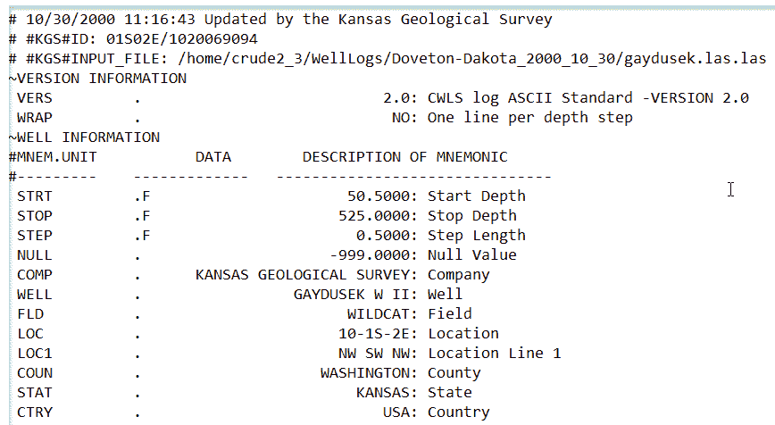

以下截图是我们文件的一部分的预览，我们将用它来训练我们的机器学习模型。此文件排除了顶部的 LAS 格式化部分标题，而是一个连续的曲线或测井测量的列表：

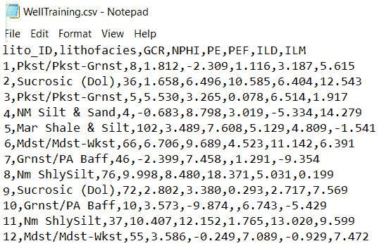

# 加载数据资产

我们将假设你已经创建了一个新的 IBM Watson Studio 项目，因此，你可以继续向其中添加一个数据资产（我们的井样本测井文件）以便我们可以处理这些数据。我们在前面的章节中已经加载了数据文件，但这里是一个快速回顾：

1.  从新项目的“资产”页面，点击“添加到项目”|“数据”

1.  在打开的“加载”面板中，浏览到文件。请记住，你必须停留在该页面上，直到加载完成。

1.  IBM Watson 然后将文件保存在与你的项目关联的对象存储中，它们在项目的“资产”页面作为数据资产列出。

# 数据资产注释

当你在 IBM Watson Studio 中构建你的资产时，强烈建议你在加载它们的时候花时间注释你的数据资产。这将允许你快速搜索和定位这些资产，以便与他人协作，并在其他项目中使用。你可以通过简单地添加描述和一到多个标签到你的资产来实现这一点。

标签是简化搜索你的资产的元数据。标签由一个包含空格、字母、数字、下划线、破折号以及#和@符号的字符串组成。你可以在同一资产上创建多个标签，通过使用逗号分隔各个标签值。

从项目页面，在“数据资产”下，你可以点击资产名称：

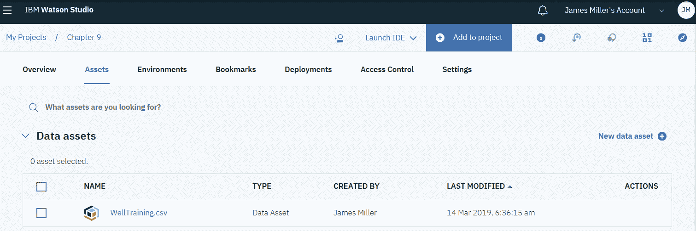

接下来，点击“标签”框内部以添加标签，你可以手动分配业务术语和标签到数据，以及描述，如以下截图所示：

**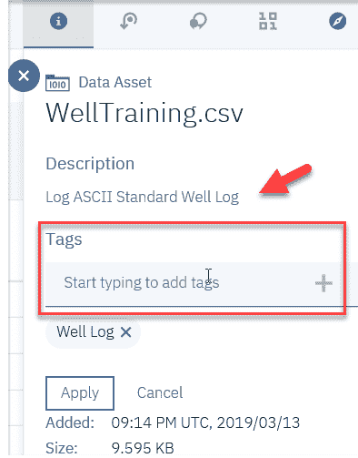**

# 数据分析

了解你的数据提供的内容的另一种方法是创建数据的配置文件，使用 IBM Watson Studio 中的配置文件功能。

数据资产的配置文件包括关于数据文本内容的生成元数据和统计信息，以便你可以“看到”它是如何构成的。你可以在项目的配置文件页面上创建配置文件，如以下截图所示：

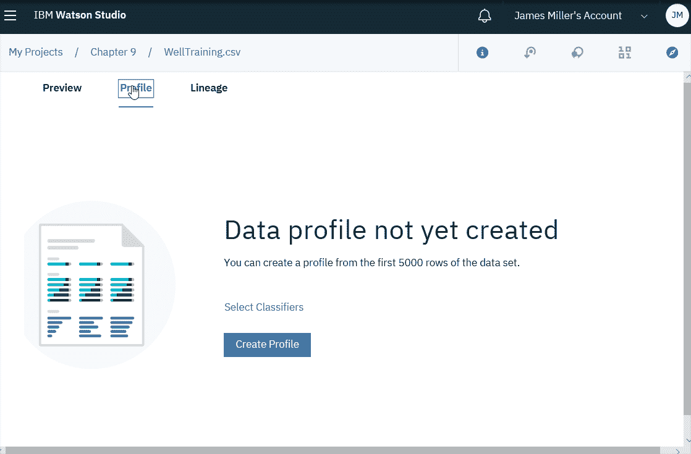

一旦你点击“创建配置文件”，IBM Watson 将审查数据并生成你可以滚动查看并轻松检查的视觉图表：

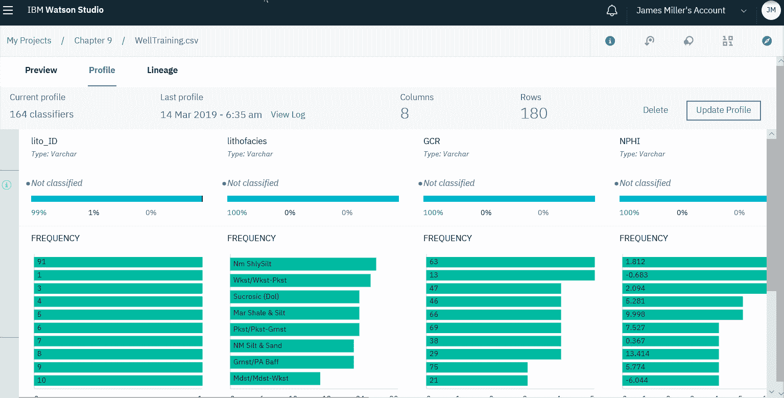

根据数据的大小和复杂性，生成配置文件可能需要几分钟。好消息是，一旦创建，它就会与文件一起保存，因此不需要再次生成。

# 使用笔记本和 Python 代替

而不是使用分析器，您可以使用 IBM Watson 笔记本中的可视化来直观地展示数据，以识别模式、获得见解并基于您项目的目标或假设做出决策。正如我们在前面的章节中所看到的，许多开源可视化库，如`matplotlib`，已经预安装在 IBM Watson Studio 中供您使用，您只需导入它们即可。

您可以使用相同的方式安装其他第三方和开源可视化库和包，或者利用 IBM 的其他可视化库和工具，如**Brunel**，通过简单的代码创建交互式图表，以及使用 SPSS 模型创建交互式表格和图表，以帮助评估和改进预测分析模型。

在接下来的几节中，我们将使用笔记本和 Python 命令来展示分析和处理数据的各种方法。

# 加载数据

由于我们假设我们已经创建了一个新的 IBM Watson Studio 项目，我们可以继续向项目中添加一个新的笔记本（从您的项目，点击添加到项目 | 笔记本，就像我们在前面的章节中所做的那样，只是确保指定语言为 Python）。让我们看看以下步骤：

1.  加载并打开文件，然后打印前五条记录（来自文件）。回想一下，为了完成这项任务，不需要编写代码。

1.  您只需点击插入代码，然后在文件 | 数据资产面板中插入我们的文件：

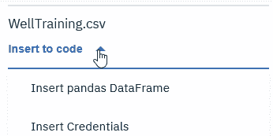

这将在我们的笔记本的第一个单元中自动生成以下代码，该代码将我们的数据文件加载到 pandas DataFrame 对象（`df_data_1`）中，然后打印文件的前五条记录：

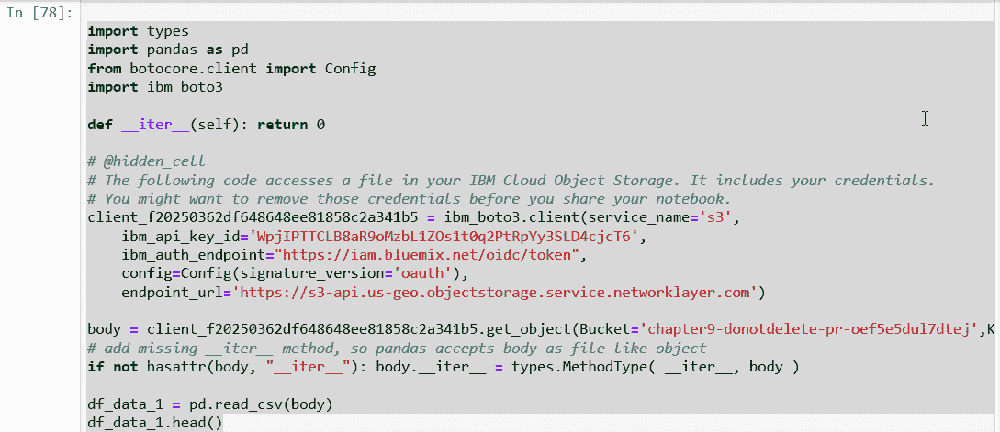

上述代码为我们生成了以下输出：

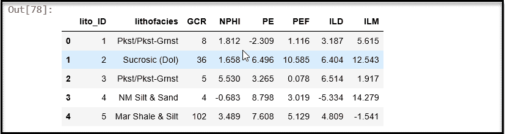

从这次回顾中，我们可以看到数据集的每一行代表一个岩性层，它们分别由我们表格的列中的几个特征表示（如前面的截图所示）。

使用 Python 的`print`和`.shape`函数，我们看到我们有`180`个岩性层（文件中的记录数）和`8`个数据集中的特征：

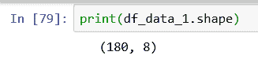

1.  我们还可以使用`.unique()`函数来证明我们的数据集中有八种不同的岩性层类型：

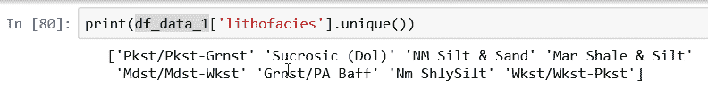

1.  接下来，我们可以使用`.size()`函数来查看每个岩性层在文件中的表示情况。数据显示，数据在`22`和`25`之间比较均衡，其中`Mdst/Mdst-Wkst`岩性层的分布最不均衡，有`16`个：

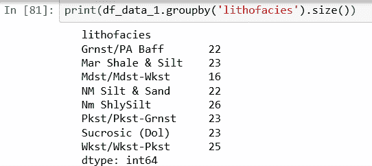

# 可视化

您可以使用 Python 创建基于岩性层大小的条形图；这使理解变得更容易，如下面的截图所示：

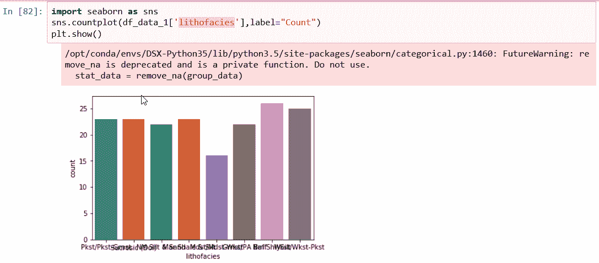

# 箱线图

经常用于执行解释性数据分析，箱线图是一种用于显示和理解分布形状、中心值及其变异性的图表。查看我们测井数据中每个数值变量的箱线图将使你更好地了解输入变量的分布，如下面的截图所示：

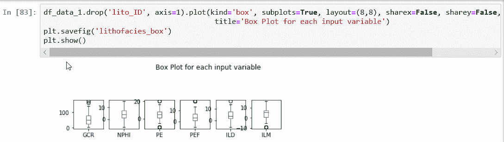

# 直方图

**直方图**用于图形化地总结和显示数据集中数据点的分布。

使用以下 Python 代码，我们现在可以尝试对数据中的每个数值输入值进行直方图分析（`GCR`、`ILD`、`ILM`、`NPHI`、`PE`和`PEF`）：

```py
import pylab as pl
df_data_1.drop('lito_ID' ,axis=1).hist(bins=30, figsize=(10,10))
pl.suptitle("Histogram for each numeric input variable")
plt.savefig('lithofacies_hist')
plt.show()
```

这将给出以下输出：

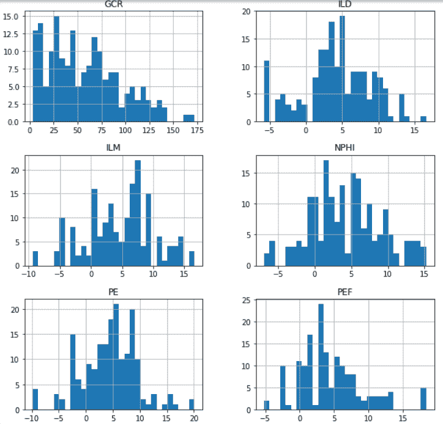

一旦从数据中生成直方图，通常会被问到的第一个问题是直方图的形状是否为正态分布。**正态分布**（数据）的一个特征是它是对称的。这意味着如果分布被切成两半，每一侧将是另一侧的镜像，形成一个钟形曲线，如下面的截图所示：

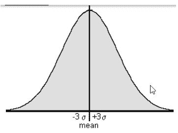

从我们生成的直方图中，也许**NPHI**数据点最接近于显示正态分布。

# 散点矩阵

**散点矩阵**是另一种常见的分析工具，因为它包括了变量在矩阵格式中的多个成对散点图。它也用于验证变量是否相关以及相关性是正还是负。

以下代码可用于尝试此类可视化：

```py
from pandas.tools.plotting import scatter_matrix
from matplotlib import cm
feature_names = [ 'GCR', 'NPHI', 'PE', 'ILD', 'ILM']
X = df_data_1[feature_names]
y = df_data_1['lito_ID']
cmap = cm.get_cmap('gnuplot')
scatter = pd.plotting.scatter_matrix(X, c = y, marker = 'o', s=40, hist_kwds={'bins':15}, figsize=(9,9), cmap = cmap)
plt.suptitle('Scatter-matrix for each input variable')
plt.savefig('lithofacies_scatter_matrix')
```

这将给出以下输出：

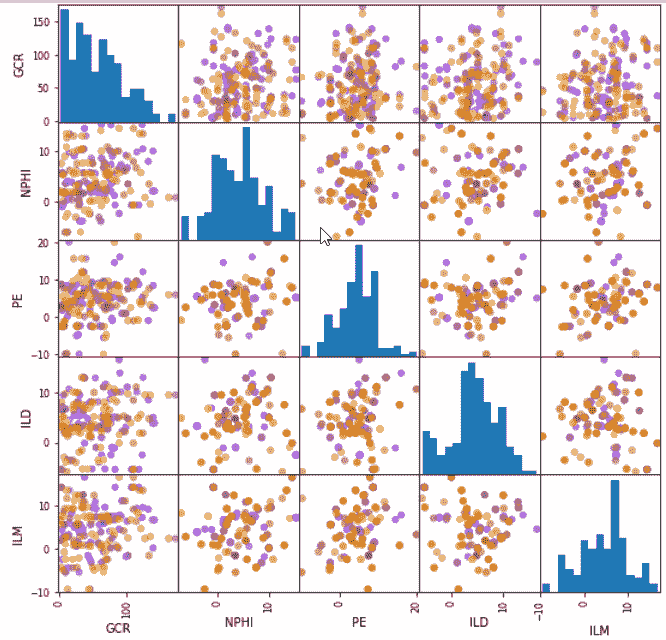

散点图试图揭示变量（称为相关性）之间的关系或关联。有关散点图的更多信息，请参阅以下链接：

[`mste.illinois.edu/courses/ci330ms/youtsey/scatterinfo.html`](https://mste.illinois.edu/courses/ci330ms/youtsey/scatterinfo.html)

观察从我们的测井数据生成的散点图（如前一个截图所示），我实在看不到数据之间有任何特定的或直接的相关性。

在这一点上，你可以继续深入数据，进行一些重组或聚合，甚至可能回到原始数据源并请求额外的或新的数据。

为了节省时间，在这个练习中，我们将假设我们将使用我们拥有的数据，并继续创建和测试各种建模算法。

# 训练分类器

`scikit-learn`库可用于编写机器学习分类器，并且是唯一具有四步建模模式的 Python 库。

有关`sckit-learn`的更多信息，请参阅以下链接：[`www.jmlr.org/papers/volume12/pedregosa11a/pedregosa11a.pdf`](http://www.jmlr.org/papers/volume12/pedregosa11a/pedregosa11a.pdf)。

实现 scikit-learn 模型的编码过程适用于`sklearn`中的各种分类器，如决策树、**k 近邻**（**KNN**）等。我们将在这里查看一些这些分类器，使用我们的测井数据。

使用 Scikit 构建模型的第一个步骤是创建训练集和测试集，并应用缩放，以下 Python 代码行展示了这一过程：

```py
from sklearn.model_selection import train_test_split
X_train, X_test, y_train, y_test = train_test_split(X, y, random_state=0)
from sklearn.preprocessing import MinMaxScaler
scaler = MinMaxScaler()
X_train = scaler.fit_transform(X_train)
X_test = scaler.transform(X_test)
```

现在我们已经创建了训练集，我们可以使用这些数据来构建各种类型的机器学习模型。通常，在一个特定的机器学习项目中，你会有一些关于你想要使用的机器学习算法类型的想法，但也可能没有。无论如何，你想要验证所选算法（们）的性能。

以下部分展示了使用`scikit-learn`模块创建模型的 Python 命令。

# 构建逻辑回归模型

**回归分析**用于理解哪些独立变量（我们的特征：`GCR`、`NPHI`、`PE`、`ILD`和`ILM`）与因变量相关；即岩性 facies 类型。

以下 Python 代码行创建了一个逻辑回归分类器模型并打印了其准确率统计信息：

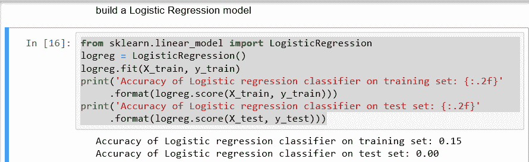

# 构建 KNN 模型

KNN 算法是一种简单、有监督的机器学习算法，也可以用于分类和回归问题。

以下 Python 代码行创建了一个 KNN 分类器模型并打印了其准确率统计信息：

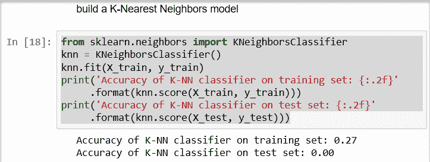

# 构建高斯朴素贝叶斯模型

给定类变量，所有朴素贝叶斯分类器都推断出数据中特定特征的价值与任何其他特征的价值无关。

以下 Python 代码行创建了一个**高斯朴素贝叶斯**（**GaussianNB**）分类器模型并打印了其准确率统计信息：

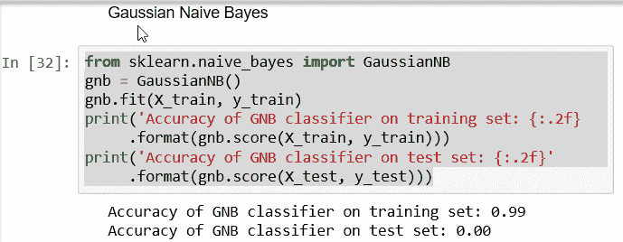

# 构建支持向量机模型

**支持向量机**（**SVM**）是一个有监督的学习模型，它关联的学习算法用于分类和回归分析。

以下 Python 代码行创建了一个 SVM 分类器模型并打印了其准确率统计信息：

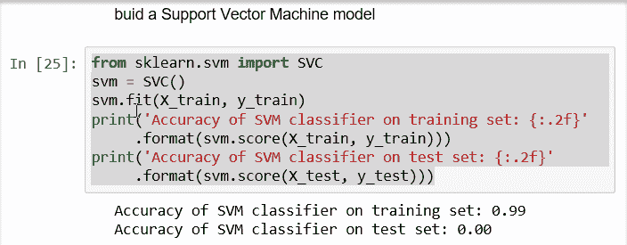

# 构建决策树模型

决策树是一种决策支持工具，它使用决策及其可能后果的树状模型，包括随机事件结果、资源成本和效用。

以下 Python 代码行创建了一个决策树分类器模型并打印了其准确率统计信息：

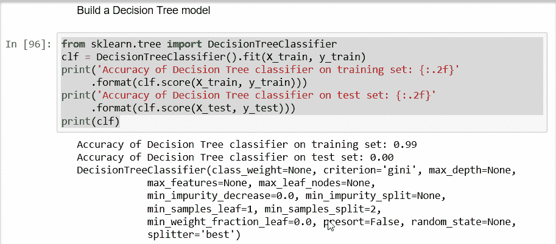

# 总结一下

再次强调，如果我们正在处理一个真实的项目，这一步或项目阶段将包括对每个模型性能结果的更深入审查，甚至可能需要决定返回数据探索和转换阶段。然而，为了节省时间，我们将继续前进。

由于我们已经看到了一些创建和至少从表面上看判断每个模型性能（就准确度而言）的简单方法，我们将继续本章的最后部分，并查看一个使用 Python 命令可视化所选模型的示例。

# 评估分类器

在每次模型构建后打印的输出中回顾，我们应该注意到决策树模型具有最佳结果之一：

```py
Accuracy of Decision Tree classifier on training set: 0.99 
Accuracy of Decision Tree classifier on test set: 0.00
```

# 类似于免责声明

通常，我们会花更多的时间评估和验证所选模型（并持续训练它），但再次强调，你得到了一个大致的概念（还有很多尽职调查工作要做！），我们的目标更多是展示使用 IBM Watson Studio 及其资源构建端到端机器学习解决方案的步骤。

考虑到这一点，我们现在将使用一些 Python 代码来创建我们模型的可视化。

# 理解决策树

决策树算法是非常常用的监督学习算法模型，用于分类和回归任务。在本节中，我们将展示如何可视化决策树分类器，以便更好地理解其逻辑。

决策树分类器通过使用一系列简单的 if/else 规则对数据进行建模，然后通过这些规则预测目标值。

由于其结构和我们可以使用如`sklearn export_graphviz`函数等模块可视化的建模树的能力，决策树通常更容易解释。

以下标准的 Python 代码可以用来可视化我们在笔记本中之前构建的决策树模型：

```py
!pip install graphviz
from sklearn.tree import DecisionTreeClassifier, export_graphviz
from sklearn import tree
from sklearn.datasets import load_wine
from IPython.display import SVG
from graphviz import Source
from IPython.display import display

# feature matrix
feature_names = [ 'GCR', 'NPHI', 'PE', 'ILD', 'ILM']
X = df_data_1[feature_names]

# target vector
y = df_data_1['lithofacies']

# print dataset description
estimator = DecisionTreeClassifier()
estimator.fit(X, y)

graph = Source(tree.export_graphviz(estimator, out_file=None
   , feature_names=labels
   , filled = True))
display(SVG(graph.pipe(format='svg')))
```

示例代码可以在[`towardsdatascience.com/interactive-visualization-of-decision-trees-with-jupyter-widgets-ca15dd312084`](https://towardsdatascience.com/interactive-visualization-of-decision-trees-with-jupyter-widgets-ca15dd312084)找到。

以下截图显示了在笔记本中执行的代码及其创建的图形输出（尽管这很难放入一个单独的截图）：

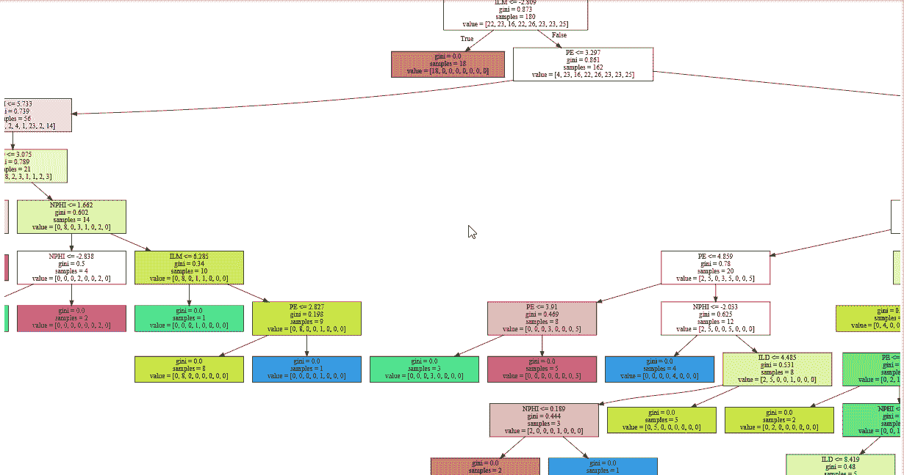

很少有人允许这样做。

# 摘要

在本章中，我们介绍了一个实际案例，在评估钻井日志以分类岩性时使用。

我们加载了一个样本文件，进行了各种配置文件和可视化练习，比较了 Watson 配置文件，并在笔记本中使用 Python 命令。最后，我们使用专门的 Python 库构建了各种类型的模型，并展示了一个监督机器学习算法的图表。

在下一章中，我们将构建一个基于云的多生物识别身份验证平台。
