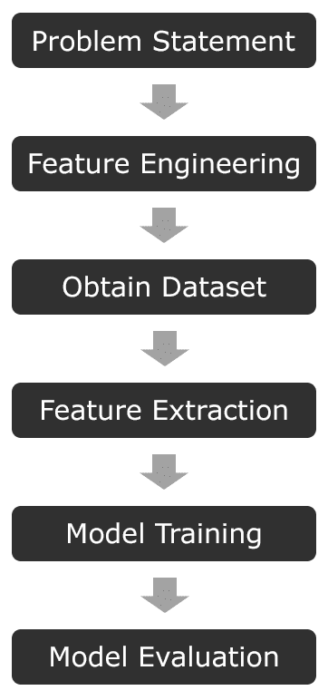
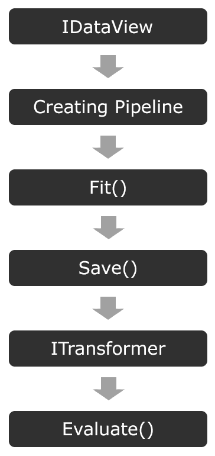

# 第一章：开始使用机器学习和 ML.NET

通过打开这本书，你正在通过使用微软的 ML.NET 框架，以机器学习的方法来接近解决复杂问题的解决方案，从而开始颠覆自己的知识。你将使用 Microsoft's ML.NET 框架来实现这一点。在将机器学习应用于网络安全领域度过了数年之后，我坚信，你从这本书中获得的知识不仅会为你打开职业机会，还会开启你的思维过程，改变你解决问题的方法。你将不再会面对复杂问题而不去思考机器学习如何可能解决它。

在本书的整个过程中，你将学习以下内容：

+   如何以及何时使用 ML.NET 提供的五种不同算法

+   展示 ML.NET 算法的实际应用端到端示例

+   训练模型、构建训练集和特征工程的最佳实践

+   在 TensorFlow 和 ONNX 格式中使用预训练模型

本书假设你有一个相当扎实的 C#理解。如果你有其他使用强类型面向对象编程语言（如 C++或 Java）的经验，语法和设计模式足够相似，不会阻碍你阅读本书。然而，如果你是第一次深入研究强类型语言（如 C#），我强烈建议你阅读 Gaurav Aroraa 所著的《Learn C# in 7 Days》，由 Packt Publishing 出版，以快速建立基础。此外，不需要或预期有先前的机器学习经验，尽管对机器学习有初步的了解将加速你的学习。

在本章中，我们将涵盖以下内容：

+   了解机器学习的重要性

+   模型构建过程

+   探索学习类型

+   探索各种机器学习算法

+   ML.NET 简介

到本章结束时，你应该对从头到尾构建模型所需的基本要素有一个基本的理解，这为本书的其余部分提供了基础。

# 了解机器学习的重要性

在最近几年中，机器学习和人工智能已经成为我们生活中许多领域的不可或缺的一部分，这些领域包括在 MRI 中寻找癌细胞以及职业篮球比赛中的面部和物体识别。仅在 2013 年至 2017 年的短短四年中，机器学习专利就增长了 34%，预计到 2021 年支出将增长到 576 亿美元（[`www.forbes.com/sites/louiscolumbus/2018/02/18/roundup-of-machine-learning-forecasts-and-market-estimates-2018/#794d6f6c2225`](https://www.forbes.com/sites/louiscolumbus/2018/02/18/roundup-of-machine-learning-forecasts-and-market-estimates-2018/#794d6f6c2225)）。

尽管机器学习是一个不断发展的技术，但“机器学习”这个术语是在 1959 年由亚瑟·塞缪尔提出的——那么是什么导致了 60 年的采用差距？可能最显著的两个因素是能够快速处理模型预测的技术可用性，以及每分钟以数字形式捕获的数据量。根据 DOMO Inc 的研究，2017 年的一项研究得出结论，每天产生 2.5 泽字节的数据，当时，2015 年至 2017 年间，全球 90%的数据被创造出来([`www.domo.com/learn/data-never-sleeps-5?aid=ogsm072517_1&sf100871281=1`](https://www.domo.com/learn/data-never-sleeps-5?aid=ogsm072517_1&sf100871281=1))。到 2025 年，预计每天将产生 463 艾字节的数据，其中大部分将来自汽车、视频、图片、物联网设备、电子邮件，甚至尚未过渡到智能运动的设备([`www.visualcapitalist.com/how-much-data-is-generated-each-day/`](https://www.visualcapitalist.com/how-much-data-is-generated-each-day/))。

在过去十年中，数据量的增长引发了关于企业或公司如何利用这些数据来改善销售预测、预测客户需求或检测文件中的恶意字节的问题。传统的统计方法可能需要指数级增加员工人数才能跟上当前的需求，更不用说随着捕获的数据进行扩展了。以谷歌地图为例。2013 年，谷歌收购了 Waze，谷歌地图的用户因此得到了基于其用户匿名 GPS 数据的非常准确的路线建议。在这个模型下，数据点（在这种情况下是智能手机的 GPS 数据）越多，谷歌对你的旅行预测就越好。正如我们将在本章后面讨论的，高质量的数据库是机器学习的关键组成部分，尤其是在谷歌地图的情况下，如果没有合适的数据库，用户体验就会大打折扣。

此外，计算机硬件的速度，特别是专门为机器学习定制的专用硬件，也发挥了作用。**应用特定集成电路**（**ASICs**）的使用呈指数增长。市场上最受欢迎的 ASIC 之一是谷歌的**张量处理单元**（**TPU**）。它最初于 2016 年发布，此后已经经过了两次迭代，并为谷歌云平台上的机器学习任务提供了基于云的加速。其他云平台，如亚马逊的 AWS 和微软的 Azure，也提供了 FPGA。

此外，来自 AMD 和 NVIDIA 的 **图形处理单元**（**GPU**）分别通过 ROCm 平台和 CUDA 加速库加速了基于云和本地的工作负载。除了加速工作负载外，AMD 和 NVIDIA 提供的典型专业 GPU 比仅采用 CPU 的传统方法提供了更高的处理器密度。例如，AMD Radeon Instinct MI60 提供了 4,096 个流处理器。虽然它不是一个完整的 x86 内核，但它也不是一对一的比较，双精度浮点任务的峰值性能被评为 7.373 TFLOPs，而 AMD 极其强大的 EPYC 7742 服务器 CPU 的性能为 2.3 TFLOPs。从成本和可扩展性的角度来看，即使在工作站配置中利用 GPU，如果算法加速以利用 AMD 和 NVIDIA 提供的更专业的核心，也会提供指数级的训练时间减少。幸运的是，ML.NET 提供了几乎不需要额外努力的 GPU 加速。

从软件工程职业的角度来看，随着这种增长和需求远远超过供应，作为软件工程师开发机器学习技能从未有过更好的时机。此外，软件工程师还拥有传统数据科学家不具备的技能——例如，能够自动化模型构建过程等任务，而不是依赖于手动脚本。软件工程师可以提供更多价值的另一个例子是在训练模型时，将单元测试和有效性测试作为完整流程的一部分。在一个大型生产应用中，拥有这些自动化测试对于避免生产问题至关重要。

最后，在 2018 年，数据首次被认为比石油更有价值。随着行业继续采用数据收集的使用，现有行业利用他们拥有的数据，机器学习将与数据交织在一起。机器学习对数据的重要性就像炼油厂对石油的重要性一样。

# 模型构建过程

在深入探讨 ML.NET 之前，了解核心机器学习概念是必要的。这些概念将为您构建基础，以便我们在本书的整个过程中开始构建模型并学习 ML.NET 提供的各种算法。从高层次来看，生成模型是一个复杂的过程；然而，它可以被分解为六个主要步骤：

在接下来的几节中，我们将详细讨论这些步骤，以向您提供如何执行每个步骤以及每个步骤如何与整个机器学习过程相关的清晰理解。

# 定义你的问题陈述

实际上，你试图解决什么问题？在这个阶段保持具体至关重要，因为一个不够简洁的问题可能导致大量的返工。例如，考虑以下问题陈述：*预测选举结果*。当我听到这个问题陈述时，我的第一个问题会是，在哪个层面？县、州还是国家？每个层面可能需要比上一个层面更多的特征和数据来正确预测。在机器学习旅程的早期，一个更好的问题陈述可能是针对县一级的具体职位，例如*预测 2020 年约翰·多伊县市长*。有了这个更直接的问题陈述，你的特征和数据集将更加聚焦，并且更有可能实现。即使在机器学习方面有更多经验，正确界定你的问题陈述也是至关重要的。应遵循谁（Who）、什么（What）、何时（When）、何地（Where）和为什么（Why）的五个 W，以保持你的陈述简洁。

# 定义你的特征

机器学习的第二步是定义你的特征。将特征视为你希望解决的问题的组成部分或属性。在机器学习中——特别是在创建新模型时——特征对你的模型性能影响最大。正确思考你的问题陈述将促进一组初始特征，这将推动你的数据集和模型结果之间的差异化。回到前一部分的市长例子，你会考虑哪些数据点作为市民的特征？或许可以从市长竞选和他在问题上的立场与其他候选人不同的方式开始考虑。这些值可以转化为特征，然后制成民意调查供约翰·多伊县的市民回答。使用这些数据点将创建特征的第一阶段坚实基础。这里的一个方面也存在于模型构建中，即运行多个特征工程和模型训练迭代，尤其是在你的数据集增长时。在模型评估后，*特征重要性*用于确定哪些特征实际上在驱动你的预测。偶尔，你会发现，在经过几轮模型训练和特征工程后，直觉特征实际上可能无关紧要。

在第十一章《训练和构建生产模型》中，我们将深入探讨在定义特征和解决复杂问题的常见方法时的最佳实践，以获得特征工程的第一阶段坚实基础。

# 获取数据集

如你所想，模型构建过程中最重要的方面之一是获取高质量的数据集。数据集用于在监督学习的情况下训练模型，以确定输出应该是什么。在无监督学习的情况下，需要对数据集进行标记。在创建数据集时，一个常见的误解是“越大越好”。在很多情况下，这远远不是事实。继续前面的例子，如果所有的民意调查结果对每个问题都给出了相同的回答，那会怎样？到那时，你的数据集将只包含相同的数据点，你的模型将无法正确预测任何其他候选人。这种情况被称为 *过度拟合*。对于机器学习算法来说，需要一个多样化但具有代表性的数据集，才能正确构建一个生产就绪的模型。

在第十一章 训练和构建生产模型，我们将深入探讨获取高质量数据集的方法，查看有用的资源，管理你的数据集的方式，以及数据转换，通常称为数据清洗。

# 特征提取和管道

一旦你获得了特征和数据集，下一步就是进行特征提取。特征提取，根据你的数据集大小和特征，可能是模型构建过程中最耗时的元素之一。

例如，假设上述虚构的约翰·多伊县选举民意调查的结果有 40,000 个回复。每个回复都存储在一个从网页表单捕获的 SQL 数据库中。执行一个 SQL 查询，比如说你将所有数据返回到一个 CSV 文件中，然后使用这个文件来训练你的模型。从高层次来看，这就是你的特征提取和管道。对于更复杂的场景，例如预测恶意网络内容或图像分类，提取将包括文件中特定字节的二进制提取。正确存储这些数据以避免需要重新运行提取对于快速迭代至关重要（假设特征没有变化）。

在第十一章 [训练和构建生产模型] 中，我们将深入探讨如何对你的特征提取数据进行版本控制并保持对数据集的控制，特别是随着数据集规模的增加。

# 模型训练

在特征提取之后，你现在已经准备好训练你的模型了。幸运的是，使用 ML.NET 进行模型训练非常直接。根据特征提取阶段提取的数据量、管道的复杂性和主机机的规格，这一步可能需要几个小时才能完成。当你的管道变得非常大，你的模型变得更加复杂时，你可能发现自己需要比笔记本电脑或台式机能提供的更多计算资源；存在像 Spark 这样的工具来帮助你扩展到 *n* 个节点。

在第十一章“训练和构建生产模型”中，我们将讨论使用易于使用的开源项目来扩展这一步骤的工具和技巧。

# 模型评估

模型训练完成后，最后一步是评估模型。典型的模型评估方法是保留一部分数据集用于评估。其背后的想法是将已知数据提交给训练好的模型，并衡量模型的有效性。这一步骤的关键是保留一个具有代表性的数据集。如果你的保留集受到某种影响，那么你很可能会得到一个关于高绩效或低绩效的虚假印象。在下一章中，我们将深入探讨各种评分和评估指标。ML.NET 提供了一个相对简单的接口来评估模型；然而，每个算法都有独特的属性需要验证，我们将在深入研究各种算法时进行回顾。

# 探索学习类型

现在你已经了解了构成模型构建过程的步骤，接下来要介绍的是两种主要的学习类型。还有其他几种机器学习类型，例如强化学习。然而，在本书的范围内，我们将专注于 ML.NET 提供的两种类型——监督学习和无监督学习。如果你对其他类型的学习感兴趣，可以查看 Giuseppe Bonaccorso 所著的《机器学习算法》，Packt 出版社出版。

# 监督学习

监督学习是两种类型中更常见的一种，因此它也用于我们将在本书中涵盖的大多数算法。简单来说，监督学习意味着作为数据科学家，你将已知的输出作为训练的一部分传递给模型。以本章前面讨论的选举示例为例。在监督学习中，选举调查中用作特征的每个数据点，以及他们表示将投票给谁，都会在训练期间发送到模型。这一步骤在分类算法中传统上被称为**标记**，其输出值将是预训练标签之一。

# 无监督学习

相反，在无监督学习中，典型的用例是在确定输入和输出标签困难时。以选举场景为例，当你不确定哪些特征将真正为模型提供数据点以确定选民投票时，无监督学习可以提供价值和见解。这种方法的优点是，你选择的算法决定了驱动标签的特征。例如，使用 k-means 这样的聚类算法，你可以将所有选民数据点提交给模型。然后，算法能够将选民数据分组到簇中，并预测未见数据。我们将在第五章“聚类模型”中深入探讨无监督学习和聚类。

# 探索各种机器学习算法

机器学习的核心是用于解决复杂问题的各种算法。如引言中所述，本书将涵盖五种算法：

+   二元分类

+   回归

+   异常检测

+   聚类

+   矩阵分解

每个算法将在本书后面的章节中详细介绍，但在此，我们先对这些算法进行简要概述。

# 二元分类

最容易理解的算法之一是二元分类。二元分类是一种监督式机器学习算法。正如其名，使用二元分类算法训练的模型将返回一个真或假的判断（如 0 或 1）。最适合二元分类模型的问题包括判断一个评论是否仇恨或一个文件是否恶意。ML.NET 提供了几个二元分类模型算法，我们将在第四章，*分类模型*中介绍，并附带一个判断文件是否恶意的示例。

# 回归

另一个强大且易于理解的算法是回归。回归是另一种监督式机器学习算法。与二元算法或返回特定值集合的算法不同，回归算法返回一个实数值。你可以将回归算法视为一个代数方程求解器，其中有许多已知值，目标是预测一个未知值。一些最适合回归算法的问题包括预测流失、天气预报、股市预测和房价等。

此外，还有一组称为**逻辑回归**模型的回归算法子集。与前面描述的传统线性回归算法不同，逻辑回归模型将返回结果发生的概率。

ML.NET 提供了几个回归模型算法，我们将在第三章，*回归模型*中介绍。

# 异常检测

异常检测，正如其名，是在提交给模型的 数据中寻找意外事件。这个算法的数据，你可能猜得到，需要一段时间内的数据。ML.NET 中的异常检测不仅考虑峰值，还考虑变化点。**峰值**，正如其名，是暂时的，而**变化点**是更长变化的开端。

ML.NET 提供了一个异常检测算法，我们将在第六章，*异常检测模型*中介绍。

# 聚类

聚类算法是无监督算法，为寻找相关项最接近匹配的问题提供了一种独特的解决方案。在数据训练过程中，数据根据特征分组，然后在预测过程中选择最接近的匹配项。聚类算法的用途示例包括文件类型分类和预测客户选择。

ML.NET 特别使用 k-means 算法，我们将在第五章“聚类模型”中深入探讨。

# 矩阵分解

最后但同样重要的是，矩阵分解算法提供了一个强大且易于使用的算法，用于提供推荐。此算法针对历史数据可用且需要解决的问题是从该数据中预测选择的情况，例如电影或音乐预测。Netflix 的电影推荐系统就使用了矩阵分解来提供他们认为你会喜欢的电影建议。

我们将在第七章“矩阵分解模型”中详细介绍矩阵分解。

# 什么是 ML.NET？

现在你对核心机器学习概念有了相当深入的理解，我们现在可以深入了解微软的 ML.NET 框架。ML.NET 是微软的顶级机器学习框架。它提供了一个易于使用的框架，在.NET 生态系统中轻松训练、创建和运行模型。

微软的 ML.NET 于 2018 年 5 月在华盛顿州西雅图的微软开发者大会 BUILD 上宣布并发布（版本 0.1）。该项目本身是开源的，在 GitHub 上拥有 MIT 许可证([`github.com/dotnet/machinelearning`](https://github.com/dotnet/machinelearning))，自首次发布以来，已经更新了 17 次。

在微软内部使用 ML.NET 的一些产品包括 Excel 中的 Chart Decisions、PowerPoint 中的幻灯片设计、Windows Hello 和 Azure 机器学习。这强调了 ML.NET 在生产部署中的生产就绪性。

ML.NET 从一开始就被设计和构建，以方便 C#和 F#开发者使用机器学习，其架构对于熟悉.NET Framework 的人来说是自然而然的。在 ML.NET 出现之前，没有一个完整的、受支持的框架，你不仅可以在.NET 生态系统中训练模型，还可以运行模型。例如，Google 的 TensorFlow 有一个由 Miguel de Icaza 编写的开源包装器，可在 GitHub 上找到([`github.com/migueldeicaza/TensorFlowSharp`](https://github.com/migueldeicaza/TensorFlowSharp))；然而，在撰写本书时，大多数工作流程都需要使用 Python 来训练模型，然后由 C#包装器运行预测。

此外，微软还致力于支持所有.NET 开发者过去几年习惯于发布应用程序的主要平台。以下是一些平台的示例，括号中列出了它们的目标框架：

+   网络端（ASP.NET）

+   移动端（Xamarin）

+   桌面端（UWP、WPF 和 WinForms）

+   游戏开发（MonoGame 和 SharpDX）

+   物联网（.NET Core 和 UWP）

在本书的后续部分，我们将在这大多数平台上实现几个现实世界的应用，以展示如何将 ML.NET 集成到各种应用类型和平台中。

# ML.NET 的技术细节

随着 ML.NET 1.4 的发布，推荐将目标设置为.NET Core 3.0 或更高版本，以利用.NET Core 3.0 作为一部分添加的硬件内建函数。对于那些不熟悉的人，.NET Core 2.x（以及更早版本）以及.NET Framework 针对具有**流式** **单指令多数据**（**SIMD**）**扩展**（**SSE**）的 CPU 进行了优化。实际上，这些指令为在数据集上执行多个 CPU 指令提供了一条优化路径。这种方法被称为**单指令多数据**（**SIMD**）。鉴于 SSE CPU 扩展最初是在 1999 年的 Pentium III 中添加的，后来 AMD 在 2001 年的 Athlon XP 中添加，这提供了一条极其向后兼容的路径。然而，这也并不允许代码利用过去 20 年中 CPU 扩展的所有进步。其中一项进步是大多数 2011 年或之后创建的 Intel 和 AMD CPU 上可用的**高级向量扩展**（**AVX**）。

这在单条指令中提供了八个 32 位操作，而 SSE 提供的是四个。正如你可能猜到的，机器学习可以利用这种指令数量的加倍。对于.NET Core 3 中尚未支持（如 ARM）的 CPU，.NET Core 3 会自动回退到基于软件的实现。

# ML.NET 组件

如前所述，ML.NET 被设计成对经验丰富的.NET 开发者直观。其架构和组件与 ASP.NET 和 WPF 中发现的模式非常相似。

ML.NET 的核心是`MLContext`对象。类似于.NET 应用程序中的`AppContext`，`MLContext`是一个单例类。`MLContext`对象本身提供了对 ML.NET 提供的所有训练目录的访问（其中一些由额外的 NuGet 包提供）。你可以将 ML.NET 中的训练目录视为一个特定的算法，例如二元分类或聚类。

这里是 ML.NET 的一些目录：

+   异常检测

+   二元分类

+   聚类

+   预测

+   回归

+   时间序列

这六个算法组在本章中已进行了回顾，并将在本书的后续专门章节中更详细地介绍。

此外，ML.NET 1.4 最近添加了直接从数据库导入数据的功能。这个特性，尽管在撰写本文时处于预览状态，不仅可以简化特征提取过程，还可以扩展在现有应用程序或管道中进行实时预测的可能性。所有主要数据库都受到支持，包括 SQL Server、Oracle、SQLite、PostgreSQL、MySQL、DB2 和 Azure SQL。我们将在第四章“分类模型”中探索这个特性，使用 SQLite 数据库的控制台应用程序。

下图展示了 ML.NET 的高级架构：

在这里，您可以看到几乎与传统的机器学习过程完全一致。这是有意为之，以降低熟悉其他框架的人的学习曲线。架构中的每一步可以总结如下：

1.  **IDataView**：这个接口用于将加载的训练数据存储到内存中。

1.  **创建管道**：管道创建将 `IDataView` 对象属性映射到值，以便发送给模型进行训练。

1.  **Fit()**：无论算法如何，在创建管道后，调用 `Fit()` 将启动实际的模型训练。

1.  **Save()**：正如其名所示，这个接口用于将模型（以二进制格式）保存到文件。

1.  **ITransformer**：这个接口用于将模型重新加载到内存中以运行预测。

1.  **Evaluate()**：正如其名所示，这个接口用于评估模型（第二章 设置 ML.NET 环境将进一步探讨评估架构）。

在本书的整个过程中，我们将更深入地探讨这些方法。

# ML.NET 的可扩展性

最后，ML.NET，像大多数健壮的框架一样，提供了相当大的可扩展性。微软随后推出了额外的可扩展性支持，以便能够运行以下外部训练的模型类型，以及其他类型：

+   TensorFlow

+   ONNX

+   Infer.Net

+   CNTK

TensorFlow ([`www.tensorflow.org/`](https://www.tensorflow.org/))，如前所述，是谷歌的机器学习框架，具有对 C++、Go、Java 和 JavaScript 的官方支持绑定。此外，TensorFlow 可以通过 GPU 加速，正如之前提到的，还有谷歌自己的 TPUs。此外，类似于 ML.NET，它还提供了在包括 iOS、Android、macOS、ARM、Linux 和 Windows 在内的广泛平台上运行预测的能力。谷歌提供了多个预训练模型。其中较受欢迎的一个模型是图像分类模型，它可以对提交的图像中的对象进行分类。ML.NET 近期的一些改进使得您可以根据该预训练模型创建自己的图像分类器。我们将在第十二章 使用 TensorFlow 与 ML.NET 中详细讨论这一场景。

ONNX ([`onnx.ai/`](https://onnx.ai/))，即 Open Neural Network Exchange Format 的缩写，由于能够导出为通用格式，在数据科学领域被广泛使用。ONNX 具有 XGBoost、TensorFlow、scikit-learn、LibSVM 和 CoreML 等转换器。ML.NET 对 ONNX 格式的原生支持不仅将允许与现有的机器学习管道更好地扩展，还将增加 ML.NET 在机器学习世界中的采用率。我们将在第十三章 使用 ONNX 与 ML.NET 中使用预训练的 ONNX 格式模型。

Infer.Net 是另一个专注于概率编程的微软开源机器学习框架。你可能想知道概率编程是什么。从高层次来看，概率编程处理传统变量类型确定性的灰色区域，例如布尔值或整数。概率编程使用具有一系列可能结果的随机变量，类似于数组。常规数组和概率编程中的变量之间的区别在于，对于每个值，都有一个特定值发生的概率。

Infer.Net 的一个很好的实际应用是微软 TrueSkill 背后的技术。TrueSkill 是一个评分系统，它为《光环》和《战争机器》中的匹配系统提供动力，玩家根据多种变量、游戏类型以及地图等因素进行匹配，甚至可以归因于两个玩家之间的匹配程度。虽然这超出了本书的范围，但一份深入探讨 Infer.Net 和概率编程（一般而言）的出色白皮书可以在这里找到：[`dotnet.github.io/infer/InferNet_Intro.pdf`](https://dotnet.github.io/infer/InferNet_Intro.pdf)。

CNTK，也来自微软，其缩写为认知工具包，是一个专注于神经网络的深度学习工具包。CNTK 的一个独特特性是它通过有向图来描述神经网络。虽然这超出了本书的范围（我们将在第十二章使用 TensorFlow 介绍神经网络），但前馈深度神经网络、卷积神经网络和循环神经网络的世界非常迷人。要更深入地了解神经网络，我建议阅读《使用 C#进行神经网络编程实践》，这也是 Packt 出版的一本书。

将 Azure 和其他模型支持（如 PyTorch [https://pytorch.org/](https://pytorch.org/））扩展到 Azure 的计划中，但在撰写本文时尚未确定时间表。

# 摘要

在本章中，你学习了发现机器学习的重要性。此外，你还学习了机器学习的核心概念，包括学习和本书后面将要介绍的算法之间的差异。你还接受了 ML.NET 的简介。本章的核心概念是本书其余部分的基础，我们将在后续章节中在此基础上进行构建。在下一章中，我们将设置你的环境并在 ML.NET 中训练你的第一个模型！
