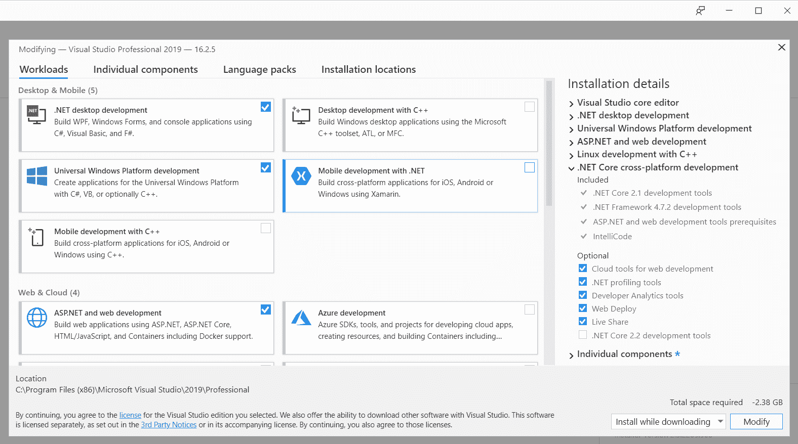
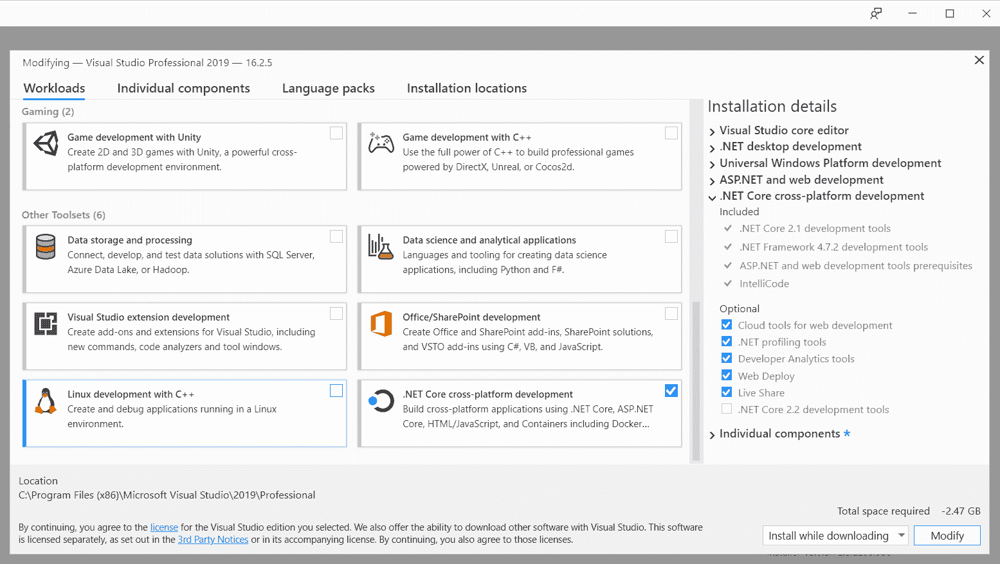
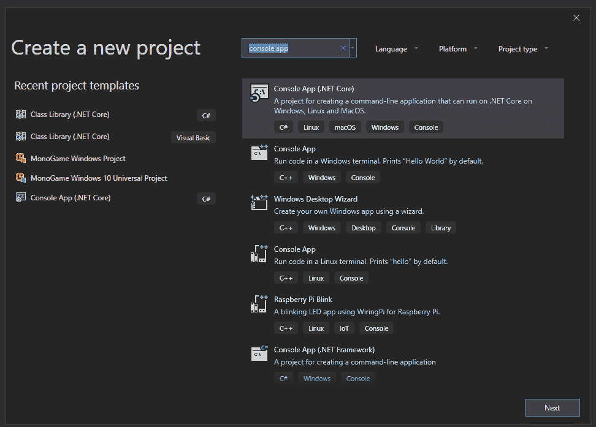
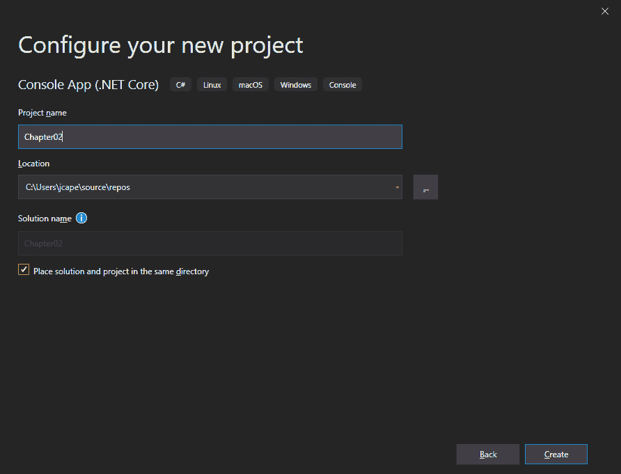
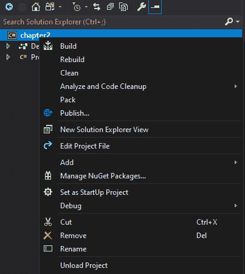
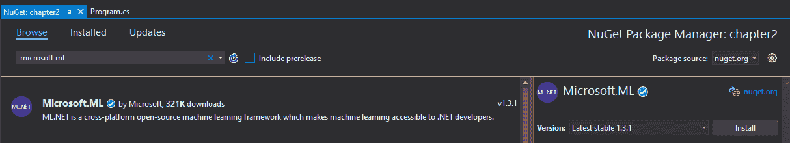
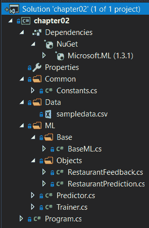

# 第二章：设置 ML.NET 环境

现在，您已经掌握了机器学习的基础知识，了解了 Microsoft 的 ML.NET 是什么以及它提供了什么，是时候训练并创建您的第一个机器学习模型了！我们将基于评论构建一个简单的餐厅情感分析模型，并将此模型集成到一个简单的 .NET Core 应用程序中。在我们开始训练和创建模型之前，我们首先需要配置开发环境。

在本章中，我们将涵盖以下主题：

+   设置您的开发环境

+   使用 ML.NET 从头到尾创建您的第一个模型

+   评估模型

# 设置您的开发环境

幸运的是，为 ML.NET 配置环境相对简单。在本节中，我们将安装 Visual Studio 2019 和 .NET Core 3。如果您不确定是否已安装，请按照以下步骤操作。此外，在本书的后续章节中，您开始自己实验时，我们还需要尽早建立一些组织元素和流程。

# 安装 Visual Studio

ML.NET 开发的核心是 Microsoft Visual Studio。本书中使用的所有示例和截图均基于 Windows 10 19H2 上的 Microsoft Visual Studio 2019 Professional。在撰写本文时，16.3.0 是最新版本。请使用最新版本。如果您没有 Visual Studio 2019，可以在 [www.visualstudio.com](http://www.visualstudio.com) 免费获得功能齐全的社区版。

如 第一章 中所述，本书的范围是*开始使用机器学习和 ML.NET*，我们将创建各种应用程序类型，以展示 ML.NET 在特定应用平台上的各种问题领域。因此，我们将提前安装几个可用的工作负载，以避免在后续章节中需要返回安装程序：

1.  首先，请确保已选中**.NET 桌面开发**、**通用 Windows 平台开发**和**ASP.NET 和 Web 开发**。这些工作负载将使您能够创建我们将在后续章节中使用的 UWP、WPF 和 ASP.NET 应用程序：



1.  此外，请确保已选中**.NET Core 跨平台开发**。这将使 .NET Core 能够为命令行和桌面应用程序进行开发，例如我们将在本章后面制作的程序：



# 安装 .NET Core 3

如第一章“开始使用机器学习和 ML.NET”中所述，由于.NET Core 3 在开发过程中实现了优化工作，因此在针对多个平台时，.NET Core 3 是写作时的首选.NET 框架。在写作时，.NET Core 3 在版本 16.3.0 之前的 Visual Studio 安装程序中未捆绑，需要在此处单独下载：[`dotnet.microsoft.com/download/dotnet-core/3.0`](https://dotnet.microsoft.com/download/dotnet-core/3.0)。本书中特定使用的下载版本是 3.0.100，但您阅读时可能已有更新的版本。对于好奇的读者，运行时与 SDK 捆绑在一起。

您可以通过打开 PowerShell 或命令提示符并执行以下命令来验证安装是否成功：

```py
dotnet --version
3.0.100
```

输出应从*3*开始，如下所示。在写作时，3.0.100 是可用的最新生产版本。

确保安装 32 位和 64 位版本，以避免在本书后续部分和未来的实验中针对 32 位和 64 位平台时出现的问题。

# 创建一个流程

在本书的整个过程中以及您自己的探索中，您将收集样本数据，构建模型，并尝试各种应用程序。尽早建立一个流程来组织这些元素将使长期工作更加容易。以下是一些建议，供您参考：

+   总是使用源控制来管理所有代码。

+   确保测试集和训练集在其各自的文件夹中命名正确（如果可能的话，进行版本管理）。

+   使用命名和源控制对模型进行版本管理。

+   将评估指标和使用的参数保存在电子表格中。

随着您技能的提升和更复杂问题的创建，可能需要额外的工具，如 Apache Spark 或其他聚类平台。我们将在第十一章“训练和构建生产模型”中讨论这一点，以及其他关于大规模训练的建议。

# 创建您的第一个 ML.NET 应用程序

现在是时候开始创建您的第一个 ML.NET 应用程序了。对于这个第一个应用程序，我们将创建一个.NET Core 控制台应用程序。这个应用程序将根据提供的小样本数据集对单词句子进行分类，判断其为正面陈述还是负面陈述。对于这个项目，我们将使用**随机对偶坐标上升法**（**SDCA**）的二进制逻辑回归分类模型。在第三章“回归模型”中，我们将更深入地探讨这种方法。

# 在 Visual Studio 中创建项目

打开时，根据你在 Visual Studio 中的配置，它将直接打开到项目创建屏幕，或者将是一个空的 Visual Studio 窗口。如果你的环境显示后者，只需点击 **文件**，然后 **新建**，然后 **项目**：

1.  当窗口打开时，在搜索字段中输入 `console app` 以找到 **Console App (.NET Core)**。确保语言类型是 C#（有相同名称的 Visual Basic 模板），突出显示此模板，然后点击 **下一步**：



1.  我建议给项目命名一个你可以回想起来的名字，比如 `Chapter02`，这样你以后就能找到这个项目：



1.  到目前为止，你有一个 .NET Core 3 控制台应用程序，所以现在让我们添加 `ML.NET` NuGet 包。在项目上右键单击并点击 **管理 NuGet 包**：



1.  在搜索字段中输入 `microsoft ml`。你应该能看到可用的最新 `Microsoft.ML` 版本：



1.  一旦找到，点击 **安装** 按钮。很简单！

在撰写本文时，1.3.1 是可用的最新版本，本书中的所有示例都将使用该版本。在 1.0 之前，语法变化很大，但自那时起一直保持一致，因此使用较新版本应该功能相同。

在这个阶段，项目已经配置为使用 ML.NET——所有未来的项目都将以此方式引用 ML.NET，并回指这些步骤。

# 项目架构

简单的项目将被分为两个主要功能：

+   训练和评估

+   模型运行

这种功能上的分割反映了现实世界的生产应用程序，这些应用程序通常使用机器学习，因为通常有专门的团队负责每个部分。

对于那些希望从完成的项目开始并跟随本节其余部分的人来说，你可以从这里获取代码：[`github.com/PacktPublishing/Hands-On-Machine-Learning-With-ML.NET/tree/master/chapter02`](https://github.com/PacktPublishing/Hands-On-Machine-Learning-With-ML.NET/tree/master/chapter02)

以下截图显示了 Visual Studio 解决方案资源管理器中的项目分解。如前所述，项目分为两个主要类——`Predictor` 和 `Trainer`：



`Trainer` 类包含所有模型构建和评估的代码，而 `Predictor` 类，正如其名所示，包含使用训练模型进行预测的代码。

`BaseML`类是我们将在后续章节中使用并在本书的其余部分进行扩展的类。这个类的想法是减少**DRY**（**不要** **重复** **自己**）违规，并创建一个统一且易于迭代的框架。《Constants》类进一步帮助这个想法——在进入更复杂的应用时减少魔法字符串；这种设计将在所有未来的章节项目中使用。

最后，`Program`类是我们控制台应用程序的主要入口点。

# 运行代码

我们现在将深入探讨在这个项目中使用的各种类，包括以下类：

+   `RestaurantFeedback`

+   `RestaurantPrediction`

+   `Trainer`

+   `Predictor`

+   `BaseML`

+   `Program`

# `RestaurantFeedback`类

`RestaurantFeedback`类为我们模型提供输入类。在 ML.NET（和其他框架）中，传统的做法是有一个结构化输入来馈入您的数据管道，该管道随后被传递到训练阶段，最终传递到您的训练模型。

以下类定义了我们的容器类，用于存储预测值。这是我们将在本书的其余部分使用的方法：

```py
using Microsoft.ML.Data;

namespace chapter02.ML.Objects
{
     public class RestaurantFeedback
     {
          [LoadColumn(0)]
          public bool Label { get; set; }

          [LoadColumn(1)]
          public string Text { get; set; }
     }
}
```

您可能想知道`RestarauntFeedback`类中的`Label`和`Text`属性与源数据之间的相关性。在`Data`文件夹中，有一个名为`sampledata.csv`的文件。此文件包含以下内容：

```py
0    "Great Pizza"
0    "Awesome customer service"
1    "Dirty floors"
1    "Very expensive"
0    "Toppings are good"
1    "Parking is terrible"
0    "Bathrooms are clean"
1    "Management is unhelpful"
0    "Lighting and atmosphere are romantic"
1    "Crust was burnt"
0    "Pineapple was fresh"
1    "Lack of garlic cloves is upsetting"
0    "Good experience, would come back"
0    "Friendly staff"
1    "Rude customer service"
1    "Waiters never came back"
1    "Could not believe the napkins were $10!"
0    "Supersized Pizza is a great deal"
0    "$5 all you can eat deal is good"
1    "Overpriced and was shocked that utensils were an upcharge"
```

第一列映射到`Label`属性。如您在第一章中回忆的那样，*开始使用机器学习和 ML.NET*，监督学习（如本示例中执行的那样）需要标记。在这个项目中，我们的标签是一个布尔值。数据集中的 False（0）表示正面反馈，而 True（1）表示负面反馈。

第二列映射到`Text`属性以传播情感（即要馈入模型的句子）。

# `RestaurantPrediction`类

`RestaurantPrediction`类包含模型运行将输出的属性。根据使用的算法，输出类（您将在未来的章节中找到）将包含更多的属性：

```py
using Microsoft.ML.Data;

namespace chapter02.ML.Objects
{
    public class RestaurantPrediction
    {
        [ColumnName("PredictedLabel")]
        public bool Prediction { get; set; }

        public float Probability { get; set; }

        public float Score { get; set; }
    }
}
```

与`RestaurantFeedback Label`属性类似，`Prediction`属性包含正面或负面反馈的整体结果。`Probability`属性包含我们对该决策的模型置信度。`Score`属性用于评估我们的模型。

# `Trainer`类

在以下内容中，您将找到`Trainer`类中的唯一方法。从高层次来看，`Trainer`方法执行以下操作：

+   它将训练数据（在这种情况下是我们的 CSV 文件）加载到内存中。

+   它构建了一个训练集和一个测试集。

+   它创建了管道。

+   它训练并保存模型。

+   它对模型进行评估。

这就是我们将在本书余下部分遵循的结构和流程。现在，让我们深入到`Train`方法的代码背后：

1.  首先，我们检查确保训练数据文件名存在：

```py
if (!File.Exists(trainingFileName)) {
    Console.WriteLine($"Failed to find training data file ({trainingFileName}");

    return;
}
```

尽管这是一个简单的测试应用程序，但始终将其视为生产级应用程序是一种良好的实践。此外，由于这是一个控制台应用程序，你可能会错误地传递一个训练数据的路径，这可能导致方法中进一步出现异常。

1.  使用 ML.NET 提供的`LoadFromTextFile`辅助方法来帮助将文本文件加载到`IDataView`对象中：

```py
IDataView trainingDataView = MlContext.Data.LoadFromTextFile<RestaurantFeedback>(trainingFileName);
```

如你所见，我们传递了训练文件名和类型；在这种情况下，它是之前提到的`RestaurantFeedback`类。需要注意的是，此方法还有其他几个参数，包括以下内容：

+   `separatorChar`：这是列分隔符字符；默认为`\t`（换句话说，制表符）。

+   `hasHeader`：如果设置为`true`，数据集的第一行包含标题；默认为`false`。

+   `allowQuoting`：这定义了源文件是否可以包含由引号字符串定义的列；默认为`false`。

+   `trimWhitespace`：这会从行中移除尾随空格；默认为`false`。

+   `allowSparse`：这定义了文件是否可以包含稀疏格式的数值向量；默认为`false`。稀疏格式需要一个新列来表示特征的数量。

对于本书中使用的多数项目，我们将使用默认设置。

1.  给定我们之前创建的`IDataView`对象，使用 ML.NET 提供的`TrainTestSplit`方法从主要训练数据中创建一个测试集：

```py
DataOperationsCatalog.TrainTestData dataSplit = MlContext.Data.TrainTestSplit(trainingDataView, testFraction: 0.2);
```

如第一章，“开始使用机器学习和 ML.NET”中提到的，样本数据被分为两个集合——训练集和测试集。参数`testFraction`指定了保留用于测试的数据集百分比，在我们的例子中是 20%。默认情况下，此参数设置为 0.2。

1.  首先，我们创建管道：

```py
TextFeaturizingEstimator dataProcessPipeline = MlContext.Transforms.Text.FeaturizeText(outputColumnName: "Features",
        inputColumnName: nameof(RestaurantFeedback.Text));
```

未来的示例将有一个更复杂的管道。在这个例子中，我们只是将之前讨论的`Text`属性映射到`Features`输出列。

1.  然后，我们实例化我们的`Trainer`类：

```py
SdcaLogisticRegressionBinaryTrainer sdcaRegressionTrainer = MlContext.BinaryClassification.Trainers.SdcaLogisticRegression(
        labelColumnName: nameof(RestaurantFeedback.Label),
        featureColumnName: "Features");

```

如你从第一章，“开始使用机器学习和 ML.NET”，中记得的那样，ML.NET 中找到的各种算法被称为训练器。在这个项目中，我们使用 SCDA 训练器。

1.  然后，我们通过附加之前实例化的训练器来完成管道：

```py
EstimatorChain<BinaryPredictionTransformer<CalibratedModelParametersBase<LinearBinaryModelParameters, PlattCalibrator>>> trainingPipeline = dataProcessPipeline.Append(sdcaRegressionTrainer);
```

1.  接下来，我们使用本章之前创建的数据集来训练模型：

```py
ITransformer trainedModel = trainingPipeline.Fit(dataSplit.TrainSet);
```

1.  我们将新创建的模型保存到指定的文件名中，与训练集的架构相匹配：

```py
MlContext.Model.Save(trainedModel, dataSplit.TrainSet.Schema, ModelPath);
```

1.  现在，我们使用之前创建的测试集来转换新创建的模型：

```py
IDataView testSetTransform = trainedModel.Transform(dataSplit.TestSet);
```

1.  最后，我们将之前创建的`testSetTransform`函数传递给`BinaryClassification`类的`Evaluate`方法：

```py
CalibratedBinaryClassificationMetrics modelMetrics = MlContext.BinaryClassification.Evaluate(
        data: testSetTransform,
        labelColumnName: nameof(RestaurantFeedback.Label),
        scoreColumnName: nameof(RestaurantPrediction.Score));

Console.WriteLine($"Area Under Curve: {modelMetrics.AreaUnderRocCurve:P2}{Environment.NewLine}" +
        $"Area Under Precision Recall Curve: {modelMetrics.AreaUnderPrecisionRecallCurve:P2}" +                    $"{Environment.NewLine}" +
        $"Accuracy: {modelMetrics.Accuracy:P2}{Environment.NewLine}" +
        $"F1Score: {modelMetrics.F1Score:P2}{Environment.NewLine}" +
        $"Positive Recall: {modelMetrics.PositiveRecall:#.##}{Environment.NewLine}" +
        $"Negative Recall: {modelMetrics.NegativeRecall:#.##}{Environment.NewLine}");
```

此方法允许我们生成模型度量。然后，我们使用训练模型和测试集打印主要度量。我们将在本章的*评估模型*部分具体探讨这些属性。

# `Predictor`类

如前所述，`Predictor`类是我们项目中提供预测支持的类。此方法背后的想法是提供一个简单的接口来运行模型，考虑到相对简单的输入。在未来的章节中，我们将扩展此方法结构以支持更复杂的集成，例如托管在 Web 应用程序中的集成：

1.  与`Trainer`类中执行的操作类似，我们在读取模型之前验证模型是否存在：

```py
if (!File.Exists(ModelPath)) {
    Console.WriteLine($"Failed to find model at {ModelPath}");

    return;
}
```

1.  然后，我们定义`ITransformer`对象：

```py
ITransformer mlModel;

using (var stream = new FileStream(ModelPath, FileMode.Open, FileAccess.Read, FileShare.Read)) {
    mlModel = MlContext.Model.Load(stream, out _);
}

if (mlModel == null) {
    Console.WriteLine("Failed to load model");

    return;
}
```

通过`Model.Load`方法加载模型后，此对象将包含我们的模型。此方法也可以直接接受文件路径。然而，流方法更适合支持我们在后续章节中使用的非磁盘方法。

1.  接下来，根据我们之前加载的模型创建一个`PredictionEngine`对象：

```py
var predictionEngine = MlContext.Model.CreatePredictionEngine<RestaurantFeedback,                        RestaurantPrediction>(mlModel);
```

我们传递了 TSrc 和 TDst，在我们的项目中，分别是`RestaurantFeedback`和`RestaurantPrediction`。

1.  然后，在`PredictionEngine`类上调用`Predict`方法：

```py
var prediction = predictionEngine.Predict(new RestaurantFeedback { Text = inputData });
```

因为当我们使用 TSrc 创建对象时，类型被设置为`RestaurantFeedback`，所以我们有一个对模型的强类型接口。然后，我们使用包含将要运行模型的句子的字符串的`inputData`变量创建`RestaurantFeedback`对象。

1.  最后，显示预测输出以及概率：

```py
Console.WriteLine($"Based on \"{inputData}\", the feedback is predicted to be:{Environment.NewLine}" +
        "{(prediction.Prediction ? "Negative" : "Positive")} at a {prediction.Probability:P0}" +                 " confidence");
```

# `BaseML`类

如前所述，`BaseML`类将包含我们的`Trainer`和`Predictor`类之间的公共代码，从本章开始。在本书的剩余部分，我们将在以下定义的`BaseML`类之上构建：

```py
using System;
using System.IO;

using chapter02.Common;

using Microsoft.ML;

namespace chapter02.ML.Base
{
    public class BaseML
    {
        protected static string ModelPath => Path.Combine(AppContext.BaseDirectory,                                                           Constants.MODEL_FILENAME);

        protected readonly MLContext MlContext;

        protected BaseML()
        {
            MlContext = new MLContext(2020);
        }
    }
}
```

对于所有 ML.NET 应用，无论是训练还是预测，都需要一个`MLContext`对象。初始化对象时需要一个特定的种子值，以便在测试组件期间创建更一致的结果。一旦加载了模型，种子值（或其缺失）不会影响输出。

# `Program`类

对于那些创建过控制台应用程序的人来说，应该熟悉`Program`类及其内部的`Main`方法。在本书的剩余部分，我们将遵循此结构来处理其他基于控制台的应用程序。以下代码块包含程序类，应用程序将从该类开始执行：

```py
using System;

using chapter02.ML;

namespace chapter02
{
    class Program
    {
        static void Main(string[] args)
        {
            if (args.Length != 2)
            {
                Console.WriteLine($"Invalid arguments passed in, exiting.{Environment.NewLine}" +                            $"{Environment.NewLine}Usage: {Environment.NewLine}" +
                    $"predict <sentence of text to predict against>{Environment.NewLine}" +
                    $"or {Environment.NewLine}" +
                    $"train <path to training data file>{Environment.NewLine}");

                return;
            }

            switch (args[0])
            {
                case "predict":
                    new Predictor().Predict(args[1]);
                    break;
                case "train":
                    new Trainer().Train(args[1]);
                    break;
                default:
                    Console.WriteLine($"{args[0]} is an invalid option");
                    break;
            }
        }
    }
}
```

对于熟悉解析命令行参数的人来说，这是一个相当直接的方法实现。使用简单的两个参数方法，如帮助文本所示。

当执行一个更复杂的命令行应用程序，该应用程序接受多个参数（可选和必需）时，微软提供了一个简单易用的 NuGet 包，可在以下链接找到：[`github.com/dotnet/command-line-api`](https://github.com/dotnet/command-line-api)

# 运行示例

要运行训练和预测，只需构建项目，然后传入适当的数据。

对于训练，您可以使用包含的`sampledata.csv`文件或创建自己的。我们将通过打开 PowerShell 窗口并传入相对路径来完成此操作：

```py
.\chapter02.exe train ..\..\..\Data\sampledata.csv
Area Under Curve: 100.00%
Area Under Precision Recall Curve: 100.00%
Accuracy: 100.00%
F1Score: 100.00%
Positive Recall: 1
Negative Recall: 1
```

一旦构建了模型，您可以按照以下方式运行预测：

```py
.\chapter02.exe predict "bad"
Based on "bad", the feedback is predicted to be:
Negative at a 64% confidence
```

随意尝试各种短语来测试模型的功效，并祝贺您训练出了您的第一个模型！

# 评估模型

正如您在运行示例项目的训练组件时所见，模型评估有多种元素。对于每种模型类型，在分析模型性能时都有不同的指标要考虑。

在例如示例项目中找到的二分类模型中，我们在调用`Evaluate`方法后，在`CalibratedBiniaryClassificationMetrics`中公开了以下属性。然而，首先，我们需要在二分类中定义四种预测类型：

+   真阴性：正确分类为负例

+   真阳性：正确分类为正例

+   假阴性：错误地分类为负例

+   假阳性：错误地分类为正例

首先要了解的指标是**准确度**。正如其名所示，准确度是在评估模型时最常用的指标之一。该指标简单地计算为正确分类预测与总分类的比率。

接下来要了解的指标是**精确度**。精确度定义为模型中所有正例中真实结果的比率。例如，精确度为 1 表示没有假阳性，这是理想场景。如前所述，假阳性是指将某物错误地分类为正例，而它应该被分类为负例。一个常见的假阳性例子是将一个文件错误地分类为恶意文件，而实际上它是良性的。

接下来要了解的指标是**召回率**。召回率是模型返回的所有正确结果的比例。例如，召回率为 1 表示没有假阴性，这是另一个理想场景。假阴性是指将某物错误地分类为负例，而它应该被分类为正例。

接下来要了解的指标是**F 分数**，它同时利用了精确度和召回率，基于假阳性和假阴性产生一个加权平均值。F 分数提供了与仅查看准确度相比对模型性能的另一种视角。值的范围在 0 到 1 之间，理想值为 1。

**曲线下面积**，也称为 AUC，正如其名所示，是在 y 轴上绘制真实正例，x 轴上绘制假正例的曲线下的面积。对于本章中我们之前训练的模型等分类器，正如你所看到的，这返回了介于 0 和 1 之间的值。

最后，**平均对数损失**和**训练对数损失**都用于进一步解释模型的性能。平均对数损失通过取真实分类与模型预测之间的差异，以一个数字有效地表达了错误结果的惩罚。训练对数损失表示模型的不确定性，使用概率与已知值进行比较。随着你训练模型，你将希望得到一个低数值（数值越低越好）。

关于其他模型类型，我们将在各自的章节中深入探讨如何评估它们，其中我们将涵盖回归和聚类指标。

# 摘要

在本章的整个过程中，我们设置了我们的开发环境，并了解了未来文件组织的正确方式。我们还创建了我们的第一个 ML.NET 应用程序，除了训练、评估和针对新模型运行预测之外。最后，我们探讨了如何评估模型以及各种属性的含义。

在下一章中，我们将深入探讨逻辑回归算法。
