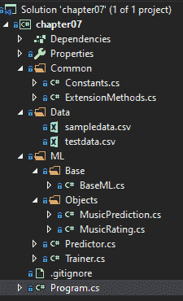
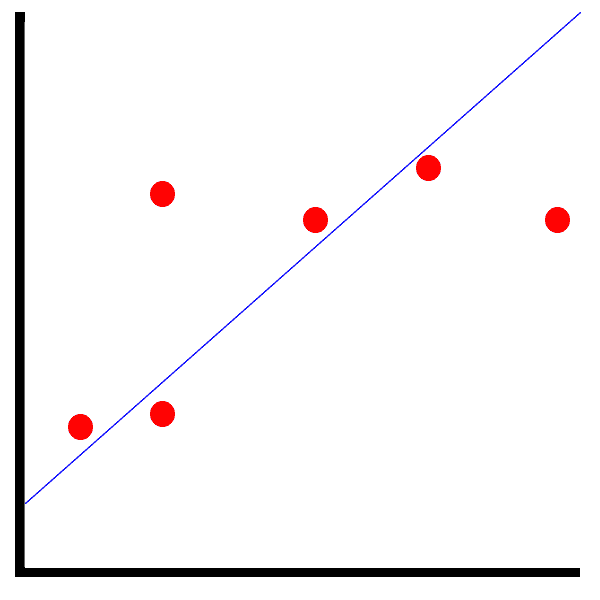
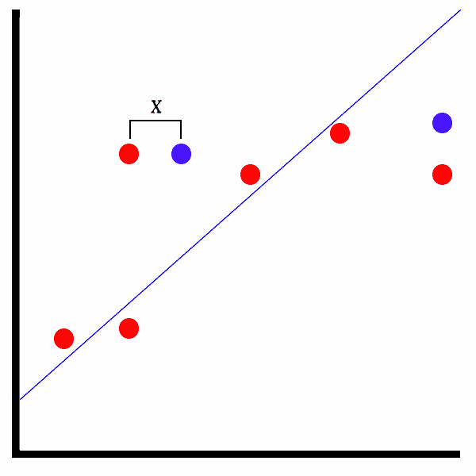

# 第七章：矩阵分解模型

在异常检测模型之后，现在是时候深入研究矩阵分解模型了。矩阵分解是 ML.NET 中较新的添加之一，具有相同的转换名称。在本章中，我们将深入研究矩阵分解，以及最适合利用矩阵分解的各种应用。此外，我们将构建一个新的示例应用程序，根据样本训练数据预测音乐推荐。最后，我们将探讨如何使用 ML.NET 公开的特性来评估矩阵分解模型。

在本章中，我们将涵盖以下主题：

+   破解矩阵分解

+   创建矩阵分解应用程序

+   评估矩阵分解模型

# 破解矩阵分解

如第一章中所述，《开始使用机器学习和 ML.NET》，矩阵分解，按定义，是一种无监督学习算法。这意味着该算法将在数据上训练并构建用户评分的模式矩阵，在预测调用期间，将尝试根据提供的数据找到类似评分。在本节中，我们将深入研究矩阵分解的应用案例，并查看 ML.NET 中的矩阵分解训练器。

# 矩阵分解的应用案例

正如你可能开始意识到的，矩阵分解在数据可用但基于先前未选择的数据提出其他匹配建议的许多应用中都有用。无需进行手动检查，矩阵分解算法在未选择的数据上训练，并使用键值对组合确定模式。ML.NET 提供了各种矩阵分解值，可以在你的应用程序中以编程方式查看。我们将在本章后面回顾这些值，以确保推荐不是假阳性。

一些最适合矩阵分解的应用包括：

+   音乐推荐

+   产品推荐

+   电影推荐

+   书籍推荐

实际上，任何可以追溯到单个用户的数据，并且随着更多数据的输入而构建的情况都可以利用矩阵分解。这个问题被称为**冷启动**问题。以一个旨在帮助你发现新乐队听的音乐平台为例。当你第一次到达网站并创建个人资料时，没有先前数据可用。作为最终用户，你必须告诉系统你喜欢什么，不喜欢什么。由于算法的性质，矩阵分解比我们在前几章中探讨的直接回归或二元分类算法更适合这个应用。

# 深入了解矩阵分解训练器

到目前为止，在 ML.NET 中找到的唯一传统训练器是矩阵分解训练器。矩阵分解训练器需要值的归一化和缓存。此外，如果您是从零开始创建项目，则要利用 ML.NET 中的矩阵分解，需要`Microsoft.ML.Recommender` NuGet 包。GitHub 仓库中包含的示例包括此包。

与其他算法类似，需要归一化，但矩阵分解是独特的。我们之前看到的二进制分类或回归算法，有多种值可以进行归一化。在矩阵分解中，只有三个值：`Label`、`Row`和`Column`值。输出由两个属性组成：`Score`和`Label`。`Score`值是`Float`类型，非负且无界。

应注意，在 2018 年 7 月的 ML.NET 0.3 更新中，添加了字段感知因子机。然而，此类训练器仅提供二进制推荐（例如喜欢或不喜欢），而与支持任何范围的浮点值的矩阵分解不同。这提供了相当大的使用灵活性，例如获得更细粒度的预测。例如，如果矩阵分解推荐在 0 到 100 的范围内返回 30，则推荐引擎很可能返回一个负面的推荐。而仅仅是一个二进制响应，应用程序以及最终用户都没有看到推荐的强度。

我们将在下一节通过提供音乐推荐来演示此训练器。

# 创建矩阵分解应用程序

如前所述，我们将创建的应用程序是用于音乐预测。给定 UserID、MusicID 和评分，算法将使用这些数据创建推荐。与其他应用程序一样，这并不是要推动下一个类似 Spotify 的机器学习产品；然而，它将向您展示如何在 ML.NET 中使用矩阵分解。

与前几章一样，完整的项目代码、示例数据集和项目文件可以在此处下载：[`github.com/PacktPublishing/Hands-On-Machine-Learning-With-ML.NET/tree/master/chapter07`](https://github.com/PacktPublishing/Hands-On-Machine-Learning-With-ML.NET/tree/master/chapter07).

# 探索项目架构

在前几章中创建的项目架构和代码的基础上，大部分更改都在模型的训练中，因为矩阵分解需要从我们之前章节中回顾的内容进行相当大的范式转变。

在下面的屏幕截图中，您将找到项目的 Visual Studio 解决方案资源管理器视图。解决方案的新增内容包括`MusicRating`和`MusicPrediction`文件，我们将在本节稍后进行回顾：



`sampledata.csv` 文件包含 10 行随机的音乐评分。您可以随意调整数据以适应您的观察，或者调整训练模型。以下是数据的一个片段：

```py
1,1000,4
1,1001,3.5
1,1002,1
1,1003,2
2,1000,1.5
2,1001,2
2,1002,4
2,1003,4
3,1000,1
3,1001,3
```

每一行都包含我们将在此章节稍后审查的 `MusicRating` 类中属性的价值。

此外，我们还添加了 `testdata.csv` 文件，其中包含额外的数据点以测试新训练的模型并评估。以下是 `testdata.csv` 内的数据片段：

```py
1,1000,4
1,1001,3.5
2,1002,1
2,1003,2
3,1000,1.5
3,1001,2
4,1002,4
4,1003,4
```

# 深入代码分析

对于这个应用，正如前一个章节所述，我们是在第六章完成的工作基础上构建的，*异常检测模型*。对于这次深入研究，我们将专注于这个应用中更改的代码。

修改或添加的类如下：

+   `MusicRating`

+   `MusicPrediction`

+   `Predictor`

+   `Trainer`

+   `Constants`

# `MusicRating` 类

`MusicRating` 类是包含预测和训练模型所需数据的容器类。如前几章所述，`LoadColumn` 装饰器中的数字映射到 CSV 文件中的索引。正如前面章节所述，ML.NET 中的矩阵分解需要使用归一化，如下面的代码块所示：

```py
using Microsoft.ML.Data;

namespace chapter07.ML.Objects
{
    public class MusicRating
    {
        [LoadColumn(0)]
        public float UserID { get; set; }

        [LoadColumn(1)]
        public float MovieID { get; set; }

        [LoadColumn(2)]
        public float Label { get; set; }
    }
}
```

# `MusicPrediction` 类

`MusicPrediction` 类包含映射到预测输出的属性。`Score` 包含预测准确的概率。我们将在本节稍后审查这些值，但现在它们可以在以下代码块中看到：

```py
namespace chapter07.ML.Objects
{
    public class MusicPrediction
    {
        public float Label { get; set; }

        public float Score { get; set; }
    }
}
```

# `Predictor` 类

在这个类中有一两个更改来处理音乐预测场景，如下所示：

1.  首先，我们使用 `MusicRating` 和 `MusicPrediction` 类型创建我们的预测引擎，如下所示：

```py
var predictionEngine = MlContext.Model.CreatePredictionEngine<MusicRating, MusicPrediction>(mlModel);
```

1.  接下来，我们将输入文件读取到字符串对象中，如下所示：

```py
var json = File.ReadAllText(inputDataFile);
```

3. 接下来，我们将字符串反序列化为 `MusicRating` 类型的对象，如下所示：

```py
var rating = JsonConvert.DeserializeObject<MusicRating>(json);
```

1.  1.  最后，我们需要运行预测，然后输出模型运行的结果，如下所示：

    ```py
    var prediction = predictionEngine.Predict(rating);

    Console.WriteLine(
        $"Based on input:{System.Environment.NewLine}" +
        $"Label: {rating.Label} | MusicID: {rating.MusicID} | UserID: {rating.UserID}{System.Environment.NewLine}" +
        $"The music is {(prediction.Score > Constants.SCORE_THRESHOLD ? "recommended" : "not recommended")}");
    ```

    由于转换只返回三个元素的向量，原始行数据被输出以提供上下文。

    # `Trainer` 类

    在 `Trainer` 类中，需要做出一些修改以支持矩阵分解。由于只有三个输入的性质，在很多方面都需要简化：

    1.  第一个增加的是两个用于变量编码的常量变量，如下面的代码块所示：

    ```py
    private const string UserIDEncoding = "UserIDEncoding";
    private const string MovieIDEncoding = "MovieIDEncoding";
    ```

    1.  然后我们构建 `MatrixFactorizationTrainer` 选项。`Row` 和 `Column` 属性设置为之前定义的列名。`Quiet` 标志在每次迭代时显示额外的模型构建信息，如下面的代码块所示：

    ```py
    var options = new MatrixFactorizationTrainer.Options
    {
        MatrixColumnIndexColumnName = UserIDEncoding,
        MatrixRowIndexColumnName = MovieIDEncoding,
        LabelColumnName = "Label",
        NumberOfIterations = 20,
        ApproximationRank = 10,
        Quiet = false
    };
    ```

    1.  我们可以创建矩阵分解训练器，如下所示：

    ```py
    var trainingPipeline = trainingDataView.Transformer.Append(MlContext.Recommendation().Trainers.MatrixFactorization(options));
    ```

    1.  现在，我们将模型拟合到训练数据中并保存模型，如下所示：

    ```py
    ITransformer trainedModel = trainingPipeLine.Fit(trainingDataView.DataView);

    MlContext.Model.Save(trainedModel, trainingDataView.DataView.Schema, ModelPath);

    Console.WriteLine($"Model saved to {ModelPath}{Environment.NewLine}");
    ```

    1.  最后，我们加载测试数据并将数据传递给矩阵分解评估器，如下所示：

    ```py
    var testingDataView = GetDataView(testingFileName, true);

    var testSetTransform = trainedModel.Transform(testingDataView.DataView);

    var modelMetrics = MlContext.Recommendation().Evaluate(testSetTransform);

    Console.WriteLine($"matrix factorization Evaluation:{Environment.NewLine}{Environment.NewLine}" +
                      $"Loss Function: {modelMetrics.LossFunction}{Environment.NewLine}" +
                      $"Mean Absolute Error: {modelMetrics.MeanAbsoluteError}{Environment.NewLine}" +
                      $"Mean Squared Error: {modelMetrics.MeanSquaredError}{Environment.NewLine}" +
                      $"R Squared: {modelMetrics.RSquared}{Environment.NewLine}" +
                      $"Root Mean Squared Error: {modelMetrics.RootMeanSquaredError}");
    ```

    # 常数类

    此外，由于训练过程仅需要训练数据，因此需要对`Program`类进行一些修改，如下所示：

    ```py
    namespace chapter07.Common
    {
        public class Constants
        {
            public const string MODEL_FILENAME = "chapter7.mdl";

            public const float SCORE_THRESHOLD = 3.0f;
        }
    }
    ```

    # 运行应用程序

    要运行应用程序，过程几乎与第六章的示例应用程序相同，如下所示：

    1.  准备好数据后，我们必须通过传递新创建的`sampledata.csv`文件来训练模型，如下所示：

    ```py
    PS Debug\netcoreapp3.0> .\chapter07.exe train ..\..\..\Data\sampledata.csv ..\..\..\Data\testdata.csv
    iter tr_rmse obj
       0 2.4172 9.6129e+01
       1 1.9634 6.6078e+01
       2 1.5140 4.2233e+01
       3 1.3417 3.5027e+01
       4 1.2860 3.2934e+01
       5 1.1818 2.9107e+01
       6 1.1414 2.7737e+01
       7 1.0669 2.4966e+01
       8 0.9819 2.2615e+01
       9 0.9055 2.0387e+01
      10 0.8656 1.9472e+01
      11 0.7534 1.6725e+01
      12 0.6862 1.5413e+01
      13 0.6240 1.4311e+01
      14 0.5621 1.3231e+01
      15 0.5241 1.2795e+01
      16 0.4863 1.2281e+01
      17 0.4571 1.1938e+01
    ```

    ```py
      18 0.4209 1.1532e+01
      19 0.3975 1.1227e+01

    Model saved to Debug\netcoreapp3.0\chapter7.mdl
    ```

    1.  要使用此文件运行模型，只需将前面提到的`testdata.csv`文件传递给新构建的应用程序，预测输出将显示以下内容：

    ```py
    matrix factorization Evaluation:

    Loss Function: 0.140
    Mean Absolute Error: 0.279
    Mean Squared Error: 0.140
    R Squared: 0.922
    Root Mean Squared Error: 0.375
    ```

    在运行预测之前，在记事本中创建一个包含以下文本的 JSON 文件：

    ```py
    { "UserID": 10, "MusicID": 4, "Label": 3 }
    ```

    然后将文件保存到你的输出文件夹。

    1.  然后，运行预测，如下所示：

    ```py
    PS Debug\netcoreapp3.0> .\chapter07.exe predict input.json
    Based on input:
    Label: 3 | MusicID: 4 | UserID: 10
    The music is not recommended
    ```

    随意修改这些值，并查看基于模型训练的数据集，预测如何变化。从这个点开始，一些实验的领域可能包括：

    +   修改`Trainer`类深入探讨中提到的超参数。

    +   向训练和测试数据添加多样化和更多数据点。

    # 评估矩阵分解模型

    如前几章所述，评估模型是整个模型构建过程中的关键部分。一个训练不良的模型只会提供不准确的预测。幸运的是，ML.NET 在训练时提供了许多流行的属性来计算模型准确度，基于测试集来给你一个关于你的模型在生产环境中表现如何的直观印象。

    如前所述，在 ML.NET 中评估矩阵分解模型时，有五个属性构成了`RegressionMetrics`类对象。让我们深入了解`RegressionMetrics`对象中公开的属性：

    +   损失函数

    +   **均方误差**（**MSE**）

    +   **平均绝对误差**（**MAE**）

    +   R 平方

    +   **均方根误差**（**RMSE**）

    在接下来的章节中，我们将分解这些值的计算方法，并详细说明理想值。

    # 损失函数

    此属性使用在矩阵分解训练器初始化时设置的损失函数。在我们的矩阵分解示例应用程序中，我们使用了默认构造函数，它默认为`SquaredLossRegression`类。

    ML.NET 提供的其他回归损失函数包括：

    +   平方损失单类

    +   平方损失回归

    这个属性的目的是在评估模型时提供一些灵活性，与其他四个属性相比，这四个属性使用固定的算法进行评估。

    # 均方误差（MSE）

    均方误差（MSE）定义为误差平方的平均值。简单来说，就是查看以下截图所示的图表：

    

    这些点代表我们模型的数据点，而蓝色线是预测线。红色点与预测线之间的距离是误差。对于均方误差（MSE），该值是基于这些点及其到线的距离计算的。从这个值中，计算平均值。对于 MSE，值越小，拟合越好，使用你的模型得到的预测将越准确。

    MSE 最适合在异常值对预测输出至关重要时评估模型。

    # MAE

    MAE 与 MSE 相似，关键区别在于它是对点与预测线之间的距离求和，而不是计算平均值。需要注意的是，MAE 在计算总和时不考虑方向。例如，如果你有两个与线等距离的数据点，一个在上面，一个在下面，实际上这将通过正负值相互抵消。在机器学习中，这被称为**平均偏差误差**（**MBE**）。然而，ML.NET 在撰写本文时并未提供作为`RegressionMetrics`类的一部分。

    MAE 最适合在将异常值视为简单异常时评估模型，并且不应计入评估模型性能。

    # R-squared

    R-squared，也称为**确定系数**，是另一种表示预测与测试集比较效果的方法。R-squared 是通过取每个预测值与其对应实际值之间的差值，平方该差值，然后对每对点的平方和进行求和来计算的。

    R-squared 的值通常在 0 到 1 之间，表示为浮点数。当拟合模型被评估为比平均拟合更差时，可能会出现负值。然而，低数值并不总是反映模型不好。基于预测人类行为的预测，如我们在本章中看到的，通常发现其值低于 50%。

    相反，高值并不一定是模型性能的可靠指标，因为这可能是模型过拟合的迹象。这种情况发生在向模型提供大量特征时，与我们在第二章的“创建第一个 ML.NET 应用程序”部分中构建的模型相比，模型变得更加复杂。在“设置 ML.NET 环境”部分中，训练集和测试集的多样性不足。例如，如果所有员工的价值大致相同，并且测试集保留组由相同范围的价值组成，这将被视为过拟合。

    # RMSE

    RMSE 可以说是最容易理解的性质，鉴于前面的方法。以下截图显示了以下截图中的图：

    

    在测试模型的情况下，正如我们之前使用保留集所做的，红色点代表测试集的实际值，而蓝色点代表预测值。X 所表示的是预测值和实际值之间的距离。RMSE 简单地取所有这些距离的平均值，然后平方该值，最后取平方根。

    低于 180 的值通常被认为是一个好的模型。

    # 摘要

    在本章的整个过程中，我们深入探讨了 ML.NET 的矩阵分解支持。我们还创建并训练了我们的第一个矩阵分解应用程序，用于预测音乐推荐。最后，我们还深入了解了如何评估矩阵分解模型，并查看了 ML.NET 提供的各种属性，以实现矩阵分解模型的正确评估。

    随着本章的结束，我们也完成了对 ML.NET 提供的各种模型的初步调查。在下一章中，我们将创建完整的应用程序，基于前几章所获得的知识，第一个将是一个完整的 .NET Core 应用程序，提供股票预测。
