# 第一章：实现机器学习算法

学习多年来一直是研究的课题。人类如何获取新知识，从基本的生存技能到高级的抽象主题，在计算机世界中难以理解并复制。机器通过比较示例并找出它们之间的相似性来学习。

机器（以及人类）学习最简单的方法是简化需要解决的问题。现实的一个简化版本，称为模型，对这个任务很有用。需要研究的相关问题包括样本的最小数量、欠拟合和过拟合、相关特征以及模型能够学习得多好。不同类型的目标变量需要不同的算法。

在本章中，将涵盖以下主题：

+   理解学习和模型

+   关注模型特征

+   实践中研究机器学习模型

+   评估模型

# 技术要求

本章没有技术要求，因为它是一个入门章节。为了能够跟随示例，章节中显示的数据应输入到 Excel 电子表格中。

# 理解学习和模型

人类的学习方式已经被研究了几十年。有一些心理学理论试图解释我们如何获取知识，如何使用它，以及如何将其推广以将我们所知应用于全新的场景。退一步来说，我们可以问自己：学习意味着什么？我们可以这样说，一旦我们学会了某样东西，我们就能以或多或少详细的方式重复它。实际上，学习远不止是复制一种行为或记住一首诗。事实上，我们理解我们所学的，并且能够概括这种知识，这有助于我们正确地应对新的人、新的地方和新的情况。

需要创建一种能够以某种方式模仿我们人类行为和智能的机器，这个需求已经存在了很长时间。几百年前，国王们对下棋的机器、不需要人类演奏者的乐器以及能够回答各种问题的神秘盒子感到惊讶。这些许多时候是虚假的发明表明，人类最大的梦想之一就是创造一个智能体，它能够复制人们通常执行的任务，即使智能是一个难以捉摸且不易定义的东西。

多年过去了，技术已经发展到我们可以现在创造出能够“思考”的机器，或者至少看起来是这样。事实上，我们称之为“智能”的大多数系统只是能够执行重复性任务或根据我们所展示的例子对外部输入做出反应。随着我们进入本章，我们将看到人类学习和智能的一些定义特征已经成为了现代机器学习系统的一部分，而一些则仍然是科幻小说的主题。

根据定义，机器学习意味着教会机器或算法执行任务。我们已经在做这件事很多年了——这被称为**编程**。我们给计算机一组指令，它们应该被执行的顺序，以及如何对有限数量的输入做出反应的几种选择。如果输入未知，或者如果我们要求计算机执行程序中不包含的操作，那么它将失败，显示错误。这种传统范式与机器学习之间的区别在于，我们永远不会告诉计算机确切要做什么。我们要么让它发现模式，要么展示我们想要的样本。我们当然会使用编程，但只是为了定义那些*学习*的算法，正如之前所描述的那样。从找到更好地代表一组点的直线到驾驶汽车，机器能做的每一件事都是通过这种方式学习的。

作为婴儿，我们开始探索我们周围的世界。由于我们太小，无法理解词语或例子，我们基本上是通过我们的感官来体验世界的。我们学会区分硬和软、粗糙和平滑、热和冷。当我们需要某样东西时，我们可以呼唤注意，甚至可以理解我们父母和宠物的耐心程度。在大多数情况下，没有人坐在我们旁边来解释我们看到、听到、感觉到、尝到和闻到的东西。这就是我们所说的*无监督学习*的例子。

在无监督学习中，训练数据是“未标记的”。在没有我们的帮助或干预的情况下，算法/（或程序/）将在数据中找到所需的联系或未预料到的模式，并学习数据集的细节和属性。

随着我们长大，我们开始理解词语并开始命名事物。当我们看到狗或猫时，我们的父母会告诉我们，我们学会了自己的名字和他们的名字，我们学会从其他孩子的玩具中识别出自己的玩具（并且为它们而争斗）。在不经意间，我们将物体、动物和人的某些特征与它们的名称联系起来。这些都是我们所说的*监督学习*的例子。在计算机的情况下，算法被展示为一组代表问题属性的变量集合，然后它学习这些特征如何与标签的名称相关联。

科学已经向我们展示了我们所处世界的巨大复杂性。科学知识的每一个分支都需要高级数学计算，甚至完全新的看待数据的方式。然而，我们所能解释的绝大多数只是真实世界的一小部分。每当描述一个物理现象、经济或金融事件，或者试图理解个人和群体的行为时，我们依赖于对真实问题的简化版本。这些被称为**模型**，它们使我们能够构建我们试图解释的任何事物的心理表征。如果模型足够准确，我们就能预测某些未来的事件，或者为某种结果得到一个近似值。正如你现在应该意识到的，这是非常强大的。例如，如果一个炮兵能够精确计算出炮弹将落在哪里，那么他的军队在战斗中将明显优于敌人。模型是现实的简化版本，用于理解问题并最终做出预测。理解你的对手忽视的东西始终是一种优势。

# 通过实例学习——线性回归模型

想象一下你和一位朋友拥有一家小型冰淇淋店。你们正在讨论每天应该生产多少千克的冰淇淋，并且你们都同意天气越热，售出的冰淇淋就越多。你补充说，这并不是唯一需要考虑的因素，还有其他变量也可能影响销售数量。作为理性的人和优秀的分析师，你们决定通过记录商店营业时间内的平均温度和售出的冰淇淋数量来进行一个小实验。夏天特别多雨，温度变化大，这有助于你得到一个良好的变量范围。最终的数据库看起来如下表：

| **平均温度 (°C)** | **售出的冰淇淋 (kg)** |
| --- | --- |
| 26 | 45 |
| 23 | 42.5 |
| 29 | 53.5 |
| 23 | 35.5 |
| 15 | 32.5 |
| 19 | 34.5 |
| 21 | 33.5 |
| 18 | 35 |
| 15 | 32.5 |
| 25 | 40.5 |
| 25 | 39.5 |
| 16 | 32 |
| 23 | 44.5 |
| 23 | 39.5 |
| 20 | 33 |
| 17 | 26.5 |
| 21 | 37.5 |
| 29 | 49.5 |
| 25 | 40.5 |
| 24 | 44 |

你的模型表明售出的冰淇淋数量与平均温度成正比。为了测试这个假设，我们可以绘制收集到的数据的散点图：

1.  选择包含表格的全部单元格范围，点击插入菜单，然后选择图表：

1.  现在，点击散点图，如下所示：

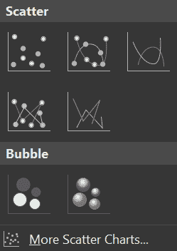

在写下坐标轴标题后，你应该得到一个类似于以下图表的图表：

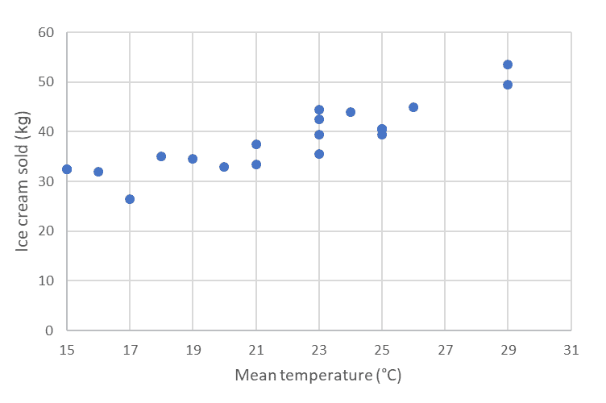

我们可以看到确实存在线性相关性，并且它是正相关的（温度值越大，你卖出的冰淇淋就越多）。然后我们可以使用线性方程来表示这个模型，如下所示：

*IC = a * T + b* (1)

在这里，*IC* 是卖出的冰淇淋数量，*T* 是平均温度，而 *a* 和 *b* 是需要通过线性回归计算出的常数。

要获得 *a* 和 *b* 的值，我们可以使用 Excel 的分析工具包数据分析插件*。如果你还没有启用它，请参考链接 [`support.office.com/en-ie/article/use-the-analysis-toolpak-to-perform-complex-data-analysis-6c67ccf0-f4a9-487c-8dec-bdb5a2cefab6`](https://support.office.com/en-ie/article/use-the-analysis-toolpak-to-perform-complex-data-analysis-6c67ccf0-f4a9-487c-8dec-bdb5a2cefab6) 了解如何操作。

1.  在你的工作表中选择数据范围，然后在主菜单中选择数据，接着选择数据分析：

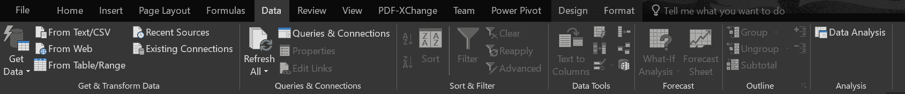

1.  在弹出菜单中选择回归，然后点击确定：

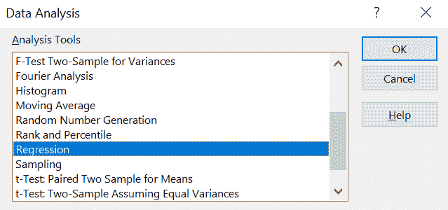

1.  确保 x 和 y 的范围是正确的（x 是温度，y 是冰淇淋数量）。选择线形拟合图，在新图表中查看数据点上的回归线：

观察输出结果，我们看到最佳拟合数据线可以表示如下：

*IC = 1.5* T + 6* (2)

*a* 的标准误差为 *±0.2*，*b* 的标准误差为 *±4*。*R²* 值为 *0.78*，这意味着拟合不是很好，只有 78% 的冰淇淋销售变化可以通过平均温度来解释。所以，你和你的朋友都是对的！

下面的图表显示了拟合线：

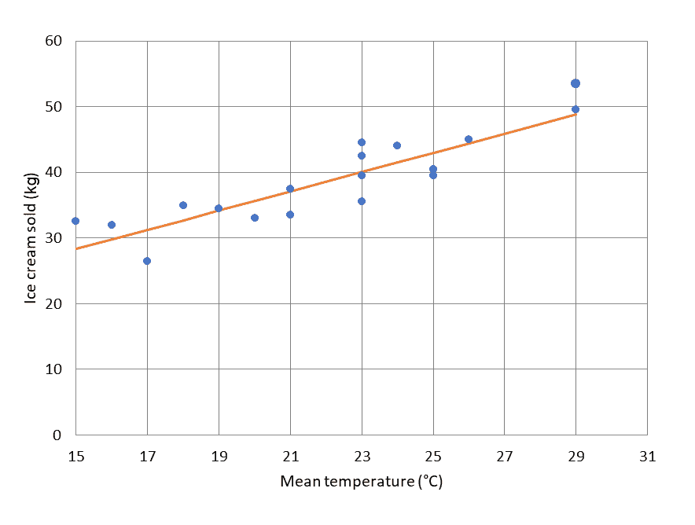

很明显，这条线很好地代表了数据，但有些点稍微偏离了一些，这表明在预测冰淇淋消费时需要考虑其他因素。无论如何，给定某一天的预测平均温度，你可以使用方程 *(2)* 来大致估计需要生产多少冰淇淋来满足可能的消费需求。

保留线性回归的其他结果，因为我们将在接下来的章节中使用其中的一些。

# 关注模型特征

作为对现实的简化表示，模型还包括一组变量，这些变量包含描述我们代表问题不同部分的相关信息。这些变量可以是像我们之前例子中看到的那样具体，比如 1 公斤的冰淇淋，或者像文本文档中两个单词意义相似度的数值表示那样抽象。

在特定的机器学习模型情况下，这些变量被称为**特征**。选择提供有关我们试图解释或预测的现象的相关信息的显著特征至关重要。如果我们考虑无监督学习，那么相关的特征是那些更好地表示数据集中信息聚类或关联的特征。对于监督学习，最重要的特征是与目标变量高度相关的特征——即我们想要预测或解释的值。

从机器学习模型中可以获得的洞察力的质量取决于输入到模型中的特征。**特征选择**和**特征工程**是常用的技术，用于提高模型的输入。特征选择是选择相关特征子集的过程，用于任何已识别的模型构建。它也可以称为变量选择或属性选择。在构建任何机器学习模型时，特征选择和数据清洗应该是第一步和最重要的步骤。特征工程被定义为使用已识别数据的领域知识来创建特征的过程，这些特征使机器学习算法能够工作。如果这样做正确，那么它将通过从输入到该模型或系统的新的数据中创建特征来增加机器学习算法的预测能力。

在我们之前的例子中，模型特征是平均温度和销售的冰淇淋数量。由于我们已经证明还有更多变量参与其中，我们可以添加一些额外的特征来更好地解释每日冰淇淋的消费。例如，我们可以考虑我们正在记录数据的那一天，并将这一信息作为另一个特征。此外，任何其他相关信息都可以或多或少地表示为一个特征。在监督学习中，通常将输入变量称为*特征*，将目标或预测变量称为*标签*。

特征可以是数值的（例如我们之前的例子中的温度），也可以是分类的（例如一周中的某一天）。由于计算机中的所有东西都是以数值数据表示的，因此分类数据应该通过将类别分配给数字来转换为数值形式。独热编码是一种将分类变量转换为数值形式（或*编码*）的过程，以便它们可以被输入到机器学习算法中。

按照我们的例子，我们可以将星期转换为星期数，如下所示：

| **星期** | **星期数** |
| --- | --- |
| 星期一 | 1 |
| 星期二 | 2 |
| 星期三 | 3 |
| 星期四 | 4 |
| 星期五 | 5 |
| 星期六 | 6 |
| 星期日 | 7 |

这种编码反映了星期的顺序，并为周末保留了最高的值。

假设你想更具体地预测你销售的每种口味的冰淇淋数量。为了方便起见，让我们说我们生产四种不同的口味：巧克力、草莓、柠檬和香草。你能否为每种口味分配一个数字，就像你在星期几编码中所做的那样？答案，正如我们将看到的，是否定的。让我们试一试，看看哪里出了问题：

| 口味 | 口味编号 |
| --- | --- |
| 巧克力 | 1 |
| 草莓 | 2 |
| 柠檬 | 3 |
| 香草 | 4 |

通过使用这种编码，我们隐含地表示巧克力比香草更接近草莓（1 个单位与 3 个单位），这不是口味的一个真实属性。将属性转换为数字的正确方式是创建二进制变量。这种方法被称为独热编码，如下表所示：

| **口味** | **它是巧克力吗？** | **它是草莓吗？** | **它是柠檬吗？** | **它是香草吗？** |
| --- | --- | --- | --- | --- |
| 巧克力 | 1 | 0 | 0 | 0 |
| 草莓 | 0 | 1 | 0 | 0 |
| 柠檬 | 0 | 0 | 1 | 0 |
| 香草 | 0 | 0 | 0 | 1 |

这种方法产生了一些开销，因为它通过为原始变量的每个可能值创建一个二进制变量来增加特征的数量。从积极的一面来看，它正确地计算了特征的性质。我们将在下一章中看到一些例子。

根据目标变量的类型，我们可以将它们分类为*回归模型*（即连续目标变量）或*分类模型*（即离散目标变量）。例如，如果我们想预测一个实数或整数，我们使用回归，而如果我们试图预测一个具有有限选项的标签，我们使用分类。

# 实践中研究机器学习模型

我们已经看到了一个非常简单的例子，并使用它来解释一些基本概念。在下一章中，我们将探索更复杂的模型。为了清晰起见，并开始我们的机器学习之旅，我们只限制在一个非常小的数据集上。当使用机器学习模型解决实际问题时应注意一些一般性考虑：

+   数据量通常非常大。实际上，更大的数据集有助于获得更精确的模型和更可靠的预测。通常称为*大数据*的极大数据集可能会带来存储和处理挑战。

+   数据永远不会干净且可直接使用，因此数据清洗非常重要，并且需要花费大量时间。

+   正确表示现实生活问题所需的特征数量通常很大。之前提到的特征工程技术无法手工完成，因此必须设计并应用自动方法。

+   评估一组输入特征的预测能力远比评估每个单独特征的显著性重要。第五章（0da64bd8-0bc9-491b-875c-7ec7c35c6165.xhtml）中给出了如何选择特征的简单示例，*相关性与变量的重要性*

+   我们不太可能第一次应用模型就能得到非常好的结果。测试和评估许多不同的机器学习模型意味着要重复相同的步骤多次，通常还需要自动化。

+   数据集应该足够大，以便可以使用其中的一部分数据进行训练（通常为 80%），其余部分用于测试。仅基于训练数据评估模型的准确性是误导性的。一个模型可能在解释和预测训练数据集时非常精确，但当面对新的、之前未见过的数据值时，可能无法泛化并给出错误的结果。

+   训练数据和测试数据应从同一完整数据集中随机选择。试图基于远离训练范围的数据进行预测不太可能得到好的结果。

监督机器学习模型通常使用输入数据的一部分进行训练，并在剩余部分上进行测试。然后，该模型可以用来预测当输入新的和未知特征值时的结果，如下面的图所示：

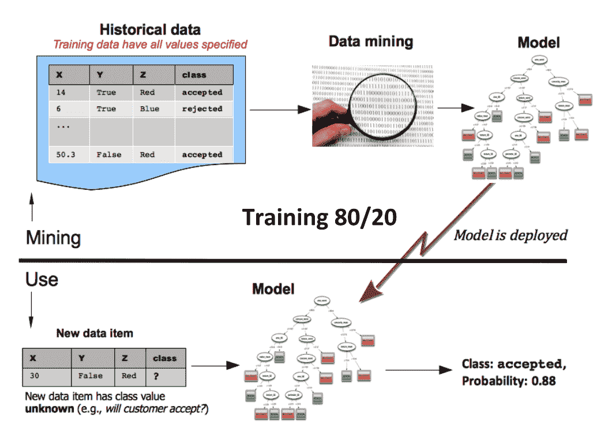

一个典型的监督机器学习项目包括以下步骤：

1.  获取数据并合并不同的数据源（关于此内容的更多信息请参阅第三章，*从不同数据源导入 Excel 数据*)

1.  清洗数据（您可以参考第四章，*数据清洗和初步数据分析*)

1.  初步分析和特征工程（您可以参考第五章，*相关性与变量的重要性*)

1.  尝试不同的模型及其参数，并使用完整数据集的一部分进行训练，其余部分用于测试

1.  将模型部署以便在连续的分析流程中使用，而不仅仅是进行小规模的、孤立的测试

1.  预测新输入数据的值

在下一章的示例中，此过程将变得清晰。

# 比较欠拟合和过拟合

在前面的列表中，步骤 *4* 意味着一个迭代过程，我们尝试模型、参数和特征，直到我们得到最佳结果。现在让我们考虑一个分类问题，我们想要将正方形与圆形分开，如图所示。在过程的开始，我们可能会处于与第一张图（左侧）类似的情况。模型未能有效地分离这两种形状，两侧都是正方形和圆形的混合。这被称为 **欠拟合**，指的是一个无法表示数据集特征的模型：

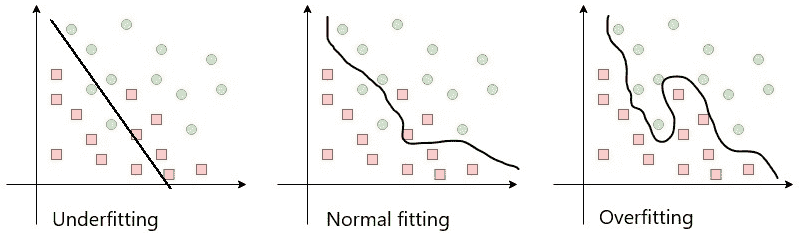

随着我们继续调整参数并将模型调整到训练数据集，我们可能会发现自己处于与第三张图（右侧）类似的情况。模型准确地分割了数据集，使得边界线两侧只留下一个形状。即使这看起来是正确的，但它完全缺乏泛化能力。结果调整得太适合训练数据，以至于当我们用不同的数据集对其进行测试时，它将完全错误。这个问题被称为 **过拟合**。

为了解决我们模型中的过拟合问题，我们需要增加其适应性。然而，使其过于灵活也可能使其在预测方面表现不佳。为了避免这种情况，通常的解决方案是使用 *正则化* 技术。在专门的文献中可以找到许多类似的技术，但它们超出了本书的范围。

中心图表显示了一个更灵活的模型；它代表数据集，但足够泛化，可以处理新的、之前未见过的数据。这通常很耗时，并且很难找到正确的平衡，以构建一个好的机器学习模型。

# 评估模型

每当我们获得一个结果时，它只与表示真实问题的模型一样准确。因此，了解哪些方法可以用来评估我们模型的性能至关重要。

当处理 *分类* *模型* 时，我们可以使用以下方法。

# 分析分类准确率

这是正确预测数（**CP**）与样本总数之比：

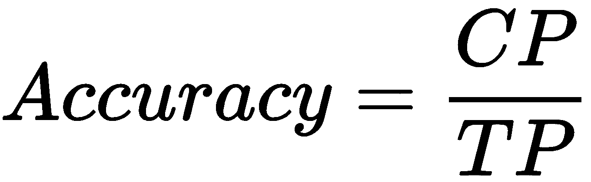

在这里，*CP* 代表准确或正确的预测数量，而 *TP* 代表所有已做预测的总数。

# 构建混淆矩阵

现在让我们考虑一个二元分类问题。我们有一组属于两个类别的样本：*YES* 或 *NO*。我们可以构建一个机器学习模型，该模型为每个输入变量集输出一个类别。通过在 200 个样本上测试我们的模型，我们将得到以下结果：

| **N=200** | **预测 NO** | **预测 YES** |
| --- | --- | --- |
| **实际 NO** | 60 | 15 |
| **实际 YES** | 25 | 100 |

混淆矩阵有四个要素：

+   **真阳性（TP）**：模型预测为 YES 且实际值为 YES 的次数。在我们的例子中，这是 100 次。

+   **真阴性（TN）**：模型预测为 NO 且实际值为 NO 的次数。在我们的例子中，这是 60 次。

+   **假阳性（FP）**：模型预测为 YES 且实际值为 NO 的次数。在我们的例子中，这是 15 次。

+   **假阴性（FN）**：模型预测为 NO 且实际值为 YES 的次数。在这个例子中，这是 25 次。

然后，我们按照以下方程计算混淆矩阵：

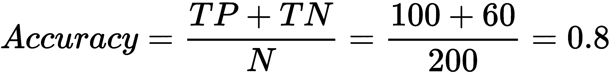

# 计算曲线下面积（AUC）

分类模型的 AUC 定义为模型将随机正例排在随机负例之上的概率。

使用混淆矩阵，我们可以定义其他量如下：

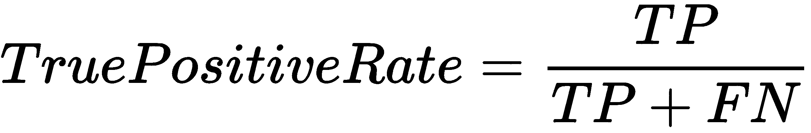

**真阳性率（TPR）**或灵敏度是正确预测为正的数据点与具有真实值为*YES*的所有数据点的比率：

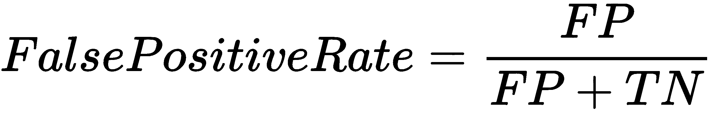

**假阳性率（FPR）**或特异性是错误地将*NO*数据点预测为*YES*的比率，与所有*NO*数据点的比率。

这两个量都在[0, 1]范围内。FPR 和 TPR 在不同的阈值值下计算，并构建一个图表。这条曲线被称为**接受者操作特征**（**ROC**）；AUC 是该曲线下的面积，如图所示：

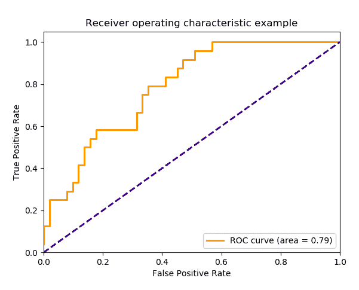

如果我们想评估回归模型，可以使用以下技术。

# 计算平均绝对误差（MAE）

MAE 是真实值（*y[j]*）和预测值（*ŷ[j]*）之间绝对差值的平均值。它不能告诉我们错误的方向，这意味着预测可能高于或低于真实值。如果我们有总共*N*个数据点，我们可以这样计算 MAE：

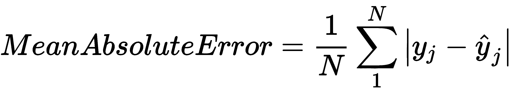

# 计算平均平方误差（MSE）

MSE 取实际值和预测值之间差异的平方的平均值：

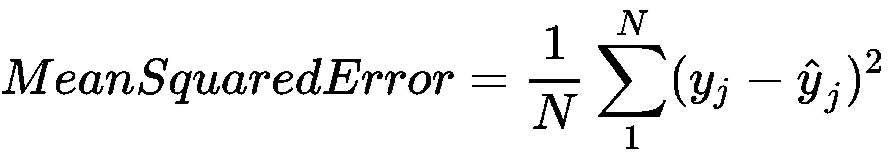

无论我们选择哪种评估方法，考虑问题的业务部分都极其重要。最佳解决方案不一定是拥有最精确的模型，而是更好地满足您的业务需求的模型。可能的情况是，一个可以快速构建的不是很精确的模型比一个需要一年时间才能完成的完美模型更好。考虑到数据集不平衡和业务需求，对模型进行微调以改进混淆矩阵值是很重要的：

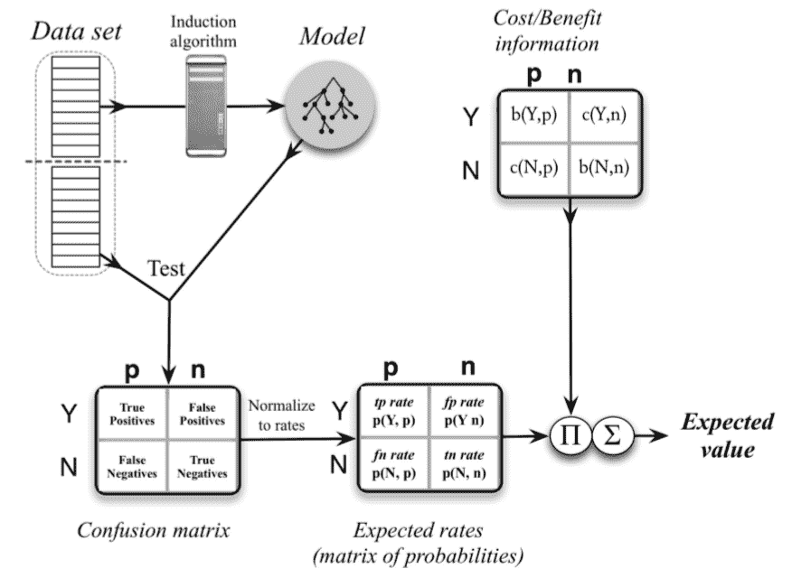

另一个需要考虑的重要因素是，在分类问题的情况下，我们是否有一个平衡的数据集。一个占主导地位的类别将导致一个每次预测结果几乎相同的模型。例如，一个 99% *YES* 标签的数据集在训练后会产生一个机器学习模型，该模型对 99%的输入预测为 *YES*（并且它是正确的！）有许多已知的技巧用于平衡数据集并找出我们数据中的问题。

# 摘要

在本章中，我们简要讨论了机器的学习过程，这在某种程度上模仿了人类的学习过程。我们描述了如何使用一个模型，它是我们想要解决的问题的简化表示，来应用机器学习以找到解决方案。

使用线性回归模型，我们构建了一个简单的监督预测模型，并解释了如何使用它。然后我们讨论了回归和分类之间的区别，并展示了输入变量和特征的性质。

在训练机器学习模型时，欠拟合和过拟合是两个主要问题。我们解释了它们是什么，并提出了避免它们的方法。

最后，不同类型的目标变量需要不同的算法和评估方法来测试模型的质量——我们详细讨论了这一点在最后几节。

在下一章中，我们将使用机器学习来解决一些实际问题，并探讨一些监督学习和无监督模型是如何构建的。

# 问题

1.  经典计算机编程与机器学习的主要区别是什么？

1.  考虑到目标变量的类型，模型是如何分类的？

1.  根据它们的学习方式，有哪些不同类型的模型？

1.  创建和使用机器学习模型的主要步骤是什么？

1.  在 Excel 中执行的回归分析的结果包含关于残差的信息。它们是什么，它们与 MAE 和 MSE 有何关系？

1.  解释欠拟合和过拟合。

1.  如何使用分类特征来为机器学习模型提供数据？

# 进一步阅读

+   *机器学习入门指南*：[`towardsdatascience.com/machine-learning-for-beginners-d247a9420dab`](https://towardsdatascience.com/machine-learning-for-beginners-d247a9420dab)

+   *机器学习基础 — 这是你的茶杯里的茶*：[`hackernoon.com/machine-learning-basics-its-your-cup-of-tea-af4baf060ace`](https://hackernoon.com/machine-learning-basics-its-your-cup-of-tea-af4baf060ace)
