# 第三章：从不同的数据源将数据导入 Excel

严肃的数据分析和机器学习不能仅通过手工输入数据来完成。数据源有不同的风味和大小，Excel 可以处理其中许多。本章将讨论如何从不同的来源导入数据，这是任何分析的第一步。

Get & Transform（在 Excel 2016 之前的版本中称为**Power Query**）是一个强大的工具，您可以使用它从不同的来源加载数据并进行转换。这些转换是必要的，以便您有一个干净的数据样本，然后可以使用它来训练和测试任何机器学习模型。

如果您正在运行 Excel 2010 SP1 或 Excel 2013，您需要下载并安装 Power Query。有关安装说明，请参阅链接[`www.microsoft.com/en-us/download/details.aspx?id=39379`](https://www.microsoft.com/en-us/download/details.aspx?id=39379)。

在本章中，我们将涵盖以下主题：

+   从文本文件导入数据

+   从另一个 Excel 工作簿导入数据

+   从网页导入数据

+   从 Facebook 导入数据

+   从 JSON 文件导入数据

+   从数据库导入数据

# 技术要求

您需要从本书的 GitHub 仓库下载`homes.csv`、`homes.txt`、`titanic.xls`和`azure_text_analytics.json`文件，该仓库地址为[`github.com/PacktPublishing/Hands-On-Machine-Learning-with-Microsoft-Excel-2019/tree/master/Chapter03`](https://github.com/PacktPublishing/Hands-On-Machine-Learning-with-Microsoft-Excel-2019/tree/master/Chapter03)。

# 从文本文件导入数据

最常用的数据文本文件是**逗号分隔值**（**CSV**）。正如其名所示，值按行写入文件，并且对于每一行，逗号分隔了属于每一列的值。打开一个新的工作簿，按照以下步骤操作：

1.  点击“数据”。

1.  导航到“获取数据”|“从文件”|“从文本/CSV”：

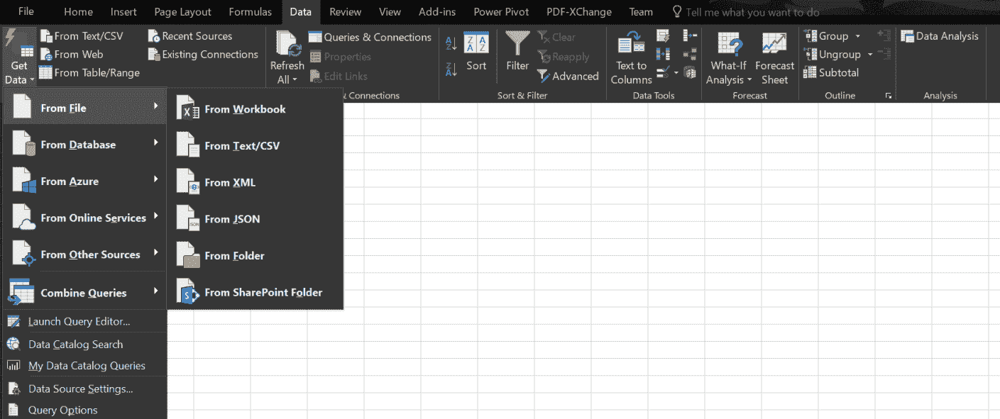

1.  导航到文件的存储位置并打开`homes.csv`文件。

1.  将弹出一个窗口，显示文件内容的预览，如下面的截图所示：

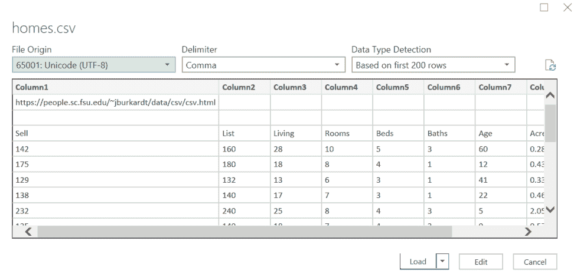

我们可以看到，Excel 通过使用正确的分隔符（逗号）正确地识别了不同的列。它还尝试自动检测数据类型。不过，这里有一个小问题。这个文件不是纯 CSV 格式，开头多了一行，显示了它最初是从哪里下载的。这对于给原作者致谢是好的，但它会稍微混淆加载过程。幸运的是，这种情况已经被考虑到了。要解决这个问题，请点击“编辑”。

1.  将弹出一个窗口，包含许多处理这些文件格式差异的选项：

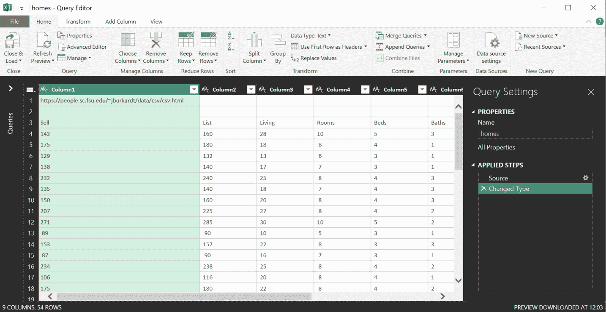

1.  导航到“删除行”|“删除顶部行”。

1.  你将看到指定要跳过多少行的选项。在这个文件中，我们需要跳过`2`行，如下面的截图所示：

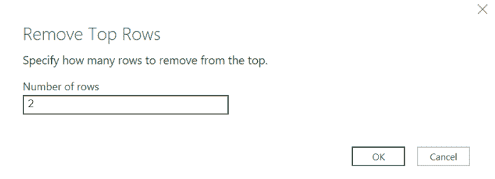

在移除行之后，我们只保留感兴趣的数据。你会注意到文件标题尚未用作列名，这将是理想的。为了纠正这一点，点击使用第一行作为标题。

1.  如下截图所示，这是结果：

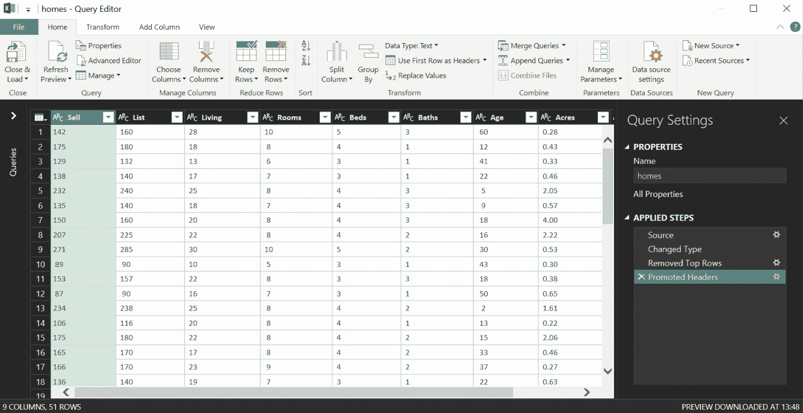

注意，步骤列表已经应用于输入数据，位于表格的右侧。这允许你撤销任何操作，并且有助于跟踪你所做的一切，尤其是当你进行更复杂的转换时，比如我们在下一章将要展示给你的那些。

过程几乎准备好了，除了每列的数据类型。最初，它被自动设置为文本，因为我们跳过的前两行后来被评估为不包含数值数据。有两种类型的列：`Acres`显示十进制数，而其余的显示整数或整个数字。为了正确定义数据类型，执行以下步骤：

1.  选择`Acres`。

1.  导航到转换菜单中的数据类型。

1.  将类型更改为十进制数。

1.  选择其余的列，并将类型更改为整数以修复其他列。

1.  最后，点击关闭并加载。你会看到以下数据表：

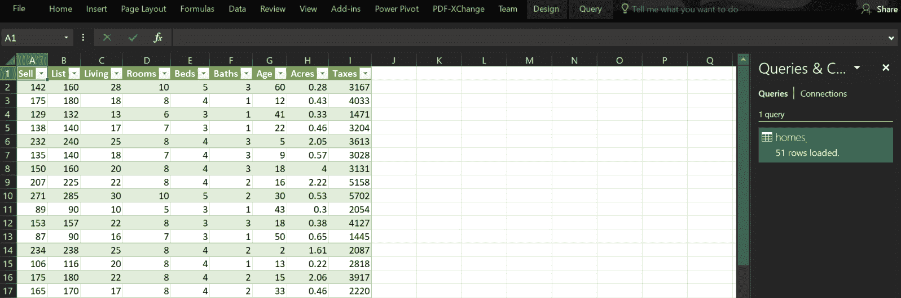

这个表格看起来像任何 Excel 表格，除了我们总是可以双击查询（称为`homes`）并执行更多转换，甚至撤销我们已做的转换。

如果文件不是 CSV 文件，而是一个使用不同分隔符的文本文件，我们仍然可以使用类似的程序来加载它。我们只需重复用于导入 CSV 文件的步骤：

1.  点击数据。

1.  导航到“获取数据”|“从文件”|“从文本/CSV”。

1.  导航到文件的存储位置并打开`homes.txt`。你会看到以下预览：

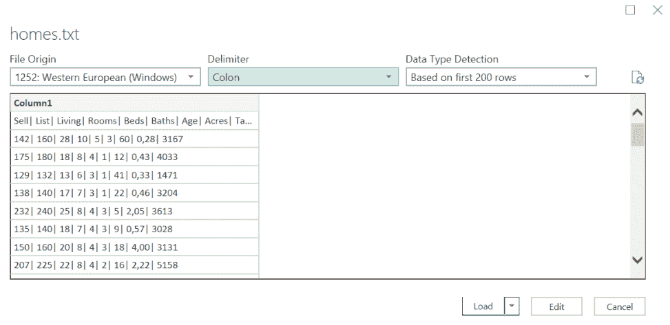

在这种情况下，开头没有多余的行，但我们可以看到 Excel 未能识别列分隔符，即`|`字符。为了修复这个问题，从下拉菜单中选择自定义。

1.  输入`|`。

1.  结果是数据现在已经被正确地分隔成列。列自动使用文件标题进行标记，并且数据类型被正确猜测，如下面的截图所示：

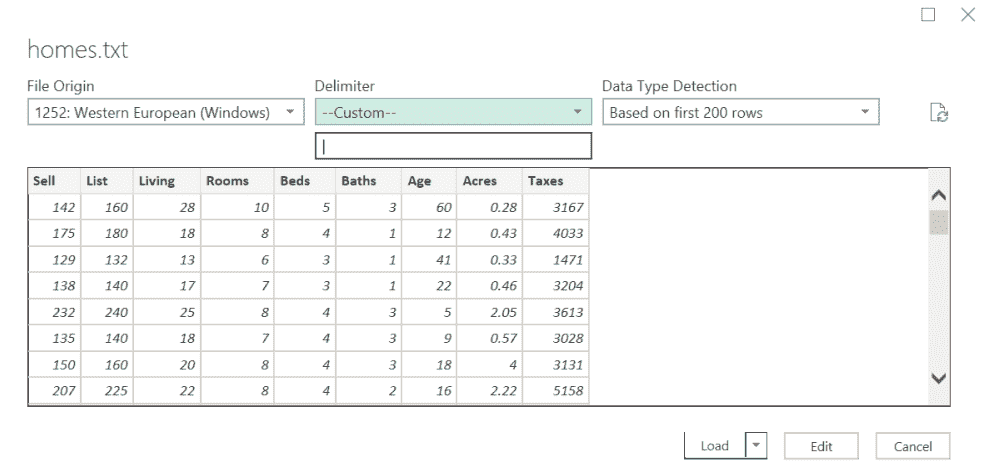

最终结果是表格与我们从`homes.csv`加载的表格相同，但获得它所需的步骤更少，因为文件结构更简单。

在本节中，我们学习了如何将文本文件导入 Excel，这是最简单的情况。让我们继续一些更复杂的例子。

# 从另一个 Excel 工作簿导入数据

为什么我们还要从 Excel 工作簿导入数据，如果我们可以直接打开它呢？主要原因是想利用 Get & Transform 可以进行的转换。我们将通过使用包含泰坦尼克号乘客真实数据的文件来展示这一点，这个文件常被用来测试机器学习分类模型，并预测某个乘客是否在悲剧中幸存。

让我们遵循一些简单的步骤来加载数据并进行转换。在新的工作簿中，请按照以下步骤操作：

1.  点击“数据”。

1.  导航到“获取数据 | 从文件 | 从工作簿”，如下面的截图所示：

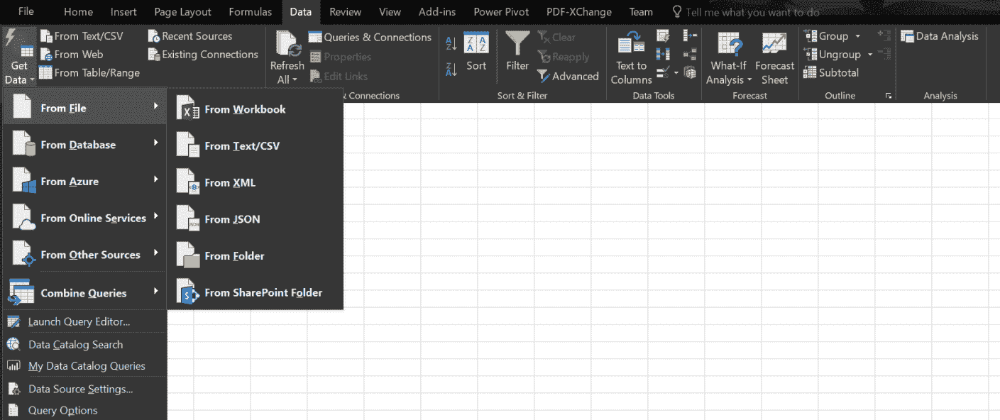

预览窗口与我们打开 CSV 文件时看到的略有不同，如下面的截图所示：

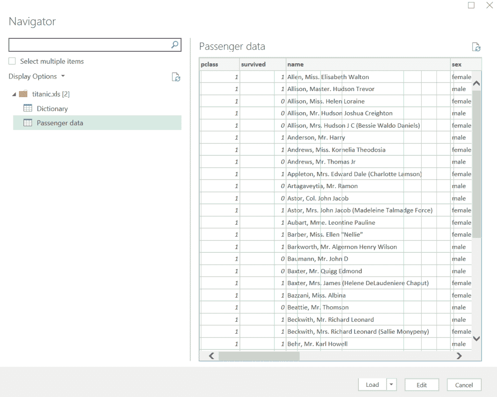

在预览的左侧，你可以看到一个名为 `titanic.xls` 的文件夹，它代表文件，下面是包含的工作表。`Dictionary` 只是变量的简短描述；数据包含在 `Passenger data` 工作表中。

当选择此项目时，我们将看到一个包含数据的表格。我们可以点击“加载”并将数据放入我们的工作表中，但在尝试我们将在下一章详细讨论的转换之前，我们将先尝试一下。为此，点击“编辑”并进入查询编辑器，如下面的截图所示：

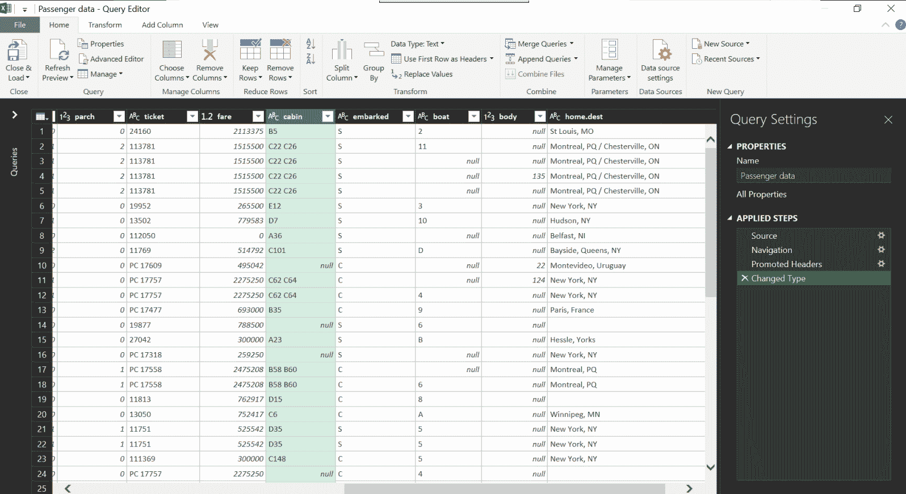

列被正确识别，并且从列名中提取的名称被放置在输入文件中。你可以看到其中一个列，`cabin`，包含缺失值，标记为 `null`。这意味着对于这些乘客，没有关于他们在船上哪个船舱的信息。一些机器学习模型不接受空值，因此我们需要通过选择该列，如前一个截图所示来修复这个问题。

1.  在转换菜单中点击“替换值”。

1.  你将得到一个弹出对话框，你可以告诉 Excel 将 `null` 替换为 `Unknown`，如下面的截图所示：

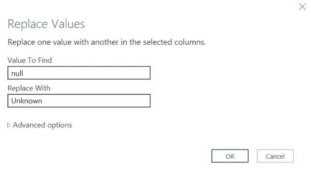

结果如以下截图所示，所有 `null` 值都被替换为 `Unknown`。这对于机器学习模型来说既更优雅也更容易管理：

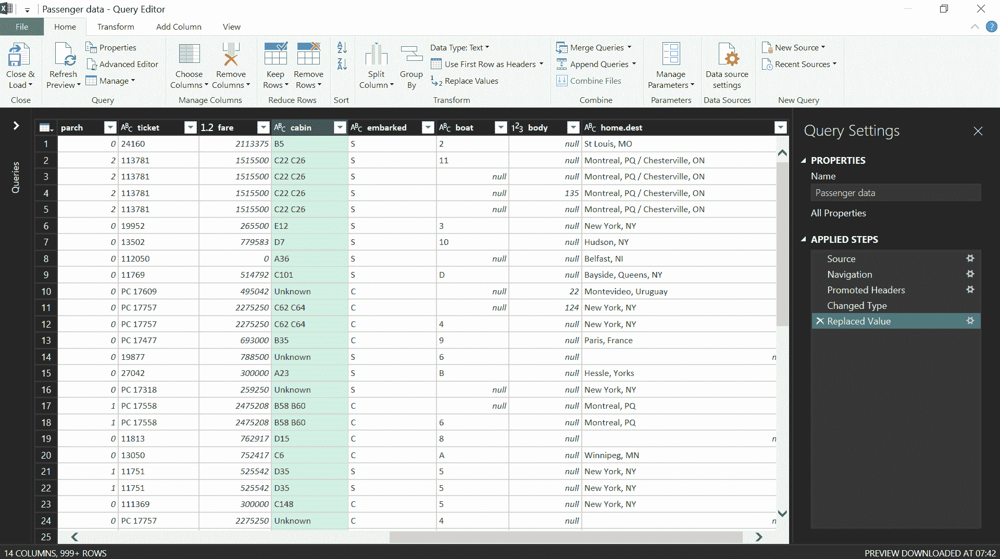

使用查询编辑器可以对数据进行多种转换。我们将在下一章中展示其他示例。你应该尝试测试不同的选项。

# 从网页导入数据

如果一个网页包含表格形式的数据，那么 Excel 能够自动导入这些表格。作为一个例子，我们将从关于 Excel 的维基百科页面导入一个表格。以下是我们的操作步骤：

1.  点击“数据”，然后导航到“获取数据 | 从其他来源 | 从网页”，如下面的截图所示：

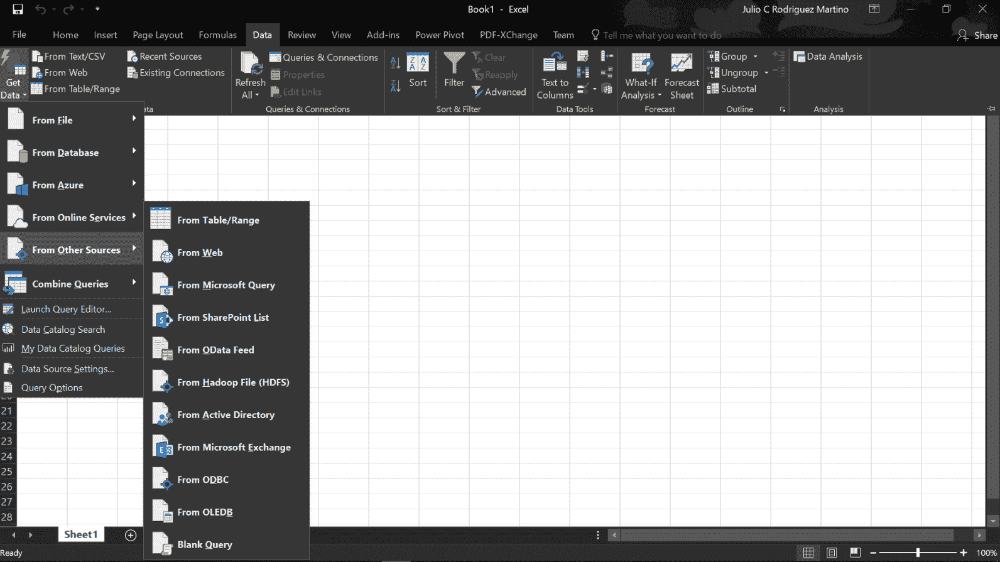

1.  在弹出的对话框中，我们输入所提及网页的 URL 并点击确定，如下截图所示：

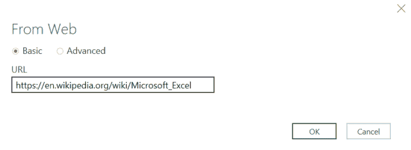

1.  现在，我们将能够看到可用表格的列表。选择显示 Excel 发布历史的表格。右侧显示了表格预览，如下截图所示：

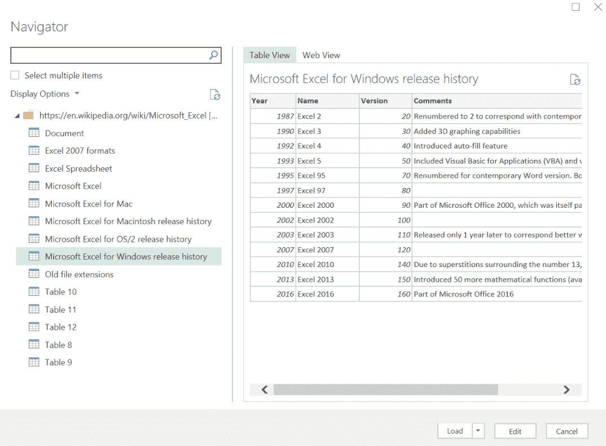

1.  就像我们之前做的那样，我们只需加载数据或编辑它，根据我们的需求转换值。最终结果是 Excel 表格。

我们还可以选择切换到网页视图，就像在 Internet Explorer 中查看目标网页一样，这有助于我们确定哪些信息对我们的分析有用。

我们已经看到从网页导入数据是多么容易。现在，让我们探索从最受欢迎的网站之一：Facebook 导入数据。

# 从 Facebook 导入数据

可以直接从 Facebook 个人资料或页面导入数据。如果我们想记录新帖子出现的时间和日期，例如，我们可以按照以下步骤操作：

1.  点击“数据”。

1.  导航到“获取数据”|“从在线服务”|“从 Facebook”，如下截图所示：

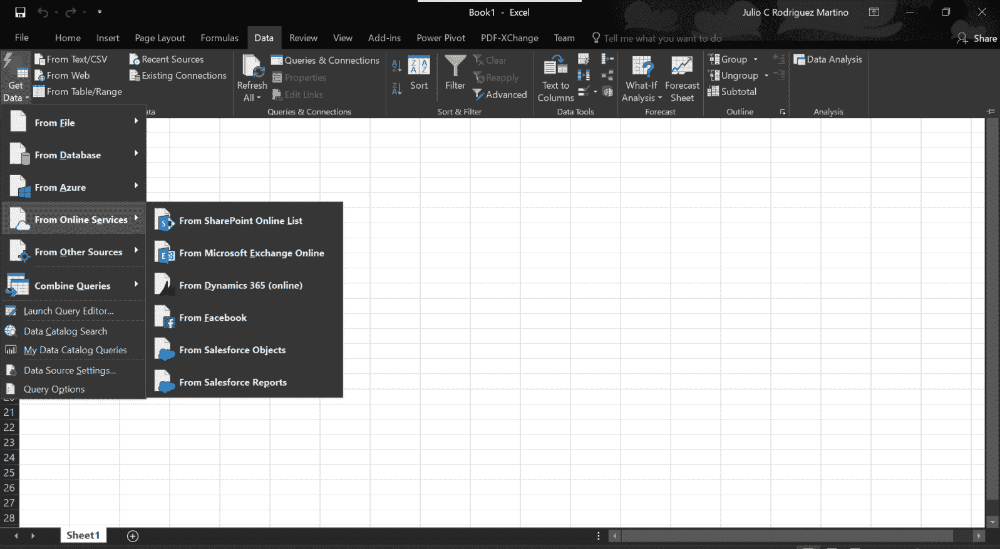

1.  您需要指定用户或页面名称，这是页面 URL 的最后部分。例如，我将使用我的 Facebook 页面，这是默认选项。第一次连接时，您将需要使用用户名和密码登录（要从 Excel 连接到 Facebook，您需要一个 Facebook 个人资料）。以下对话框将出现：

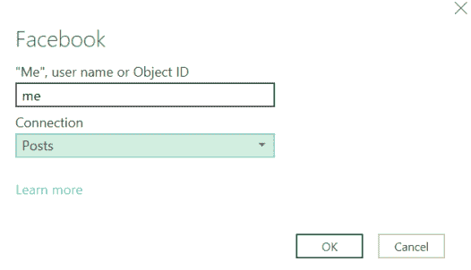

1.  我们将选择获取帖子信息。点击确定后，我们得到以下屏幕（我将只展示部分，以保护我的隐私）：

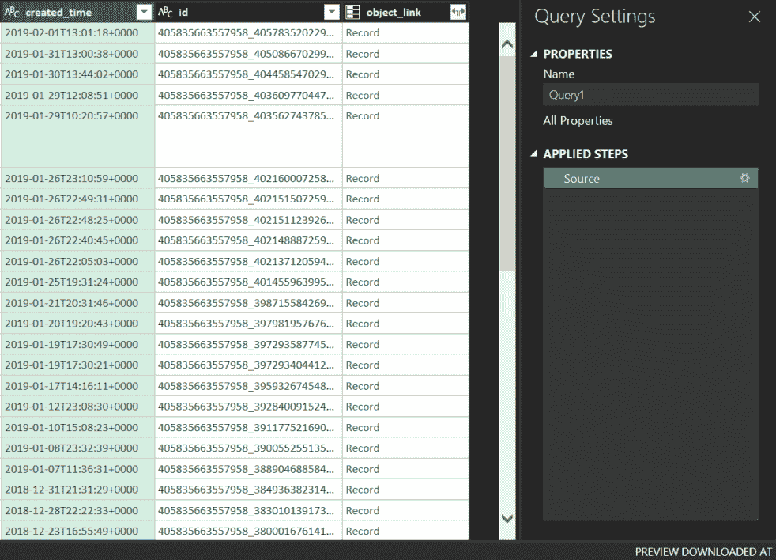

1.  如我们所见，帖子的时间和日期被合并在一个单独的列中。要拆分这个列，点击编辑。

1.  选择列，然后在查询编辑器中选择“拆分列”。

1.  在对话框中，指定您想要通过字符`T`拆分列，如下截图所示：

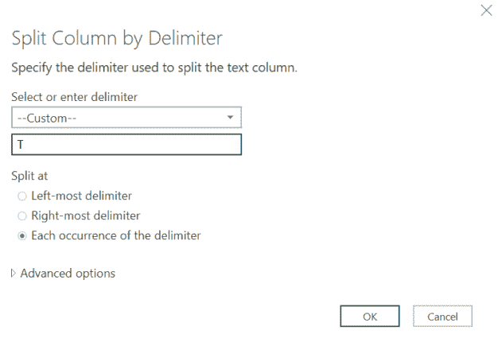

1.  因此，你将得到两个新的列，一个用于日期，另一个用于时间，如下截图所示：

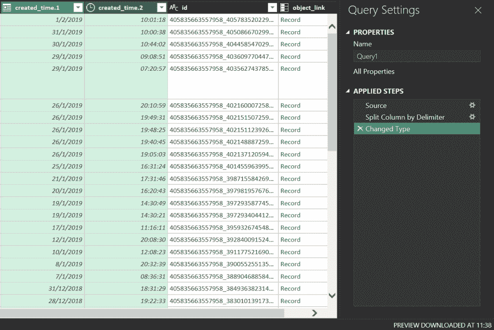

您已成功从您的 Facebook 页面提取信息，您现在可以使用这些信息来分析您发布频率，发布的内容类型以及其他有用的见解。这对于查看商业个人资料尤其有用，您可能希望调整内容以提高您的服务或产品的营销。

# 从 JSON 文件导入数据

JSON 是一种标准的数据共享格式，因为它使用人类可读的文本字段。它被大多数网络应用程序用于数据输入和输出。

在我们的示例中，我们将使用 Azure 文本分析 API。给定一个句子，这项服务可以识别文本情感、语言并提取关键词等。

输入句子为`我在西雅图度过了一次美妙的旅行，并享受了看到太空针塔的乐趣！`。API 正确识别语言为英语，提取了主要关键词，并告诉我们情感是积极的（分配的值大于 0.5）。所有这些信息都以 JSON 格式显示在窗口的右侧，并且可以在我们即将导入的文件中找到。以下截图是从 Azure 文本分析演示页面提取的：

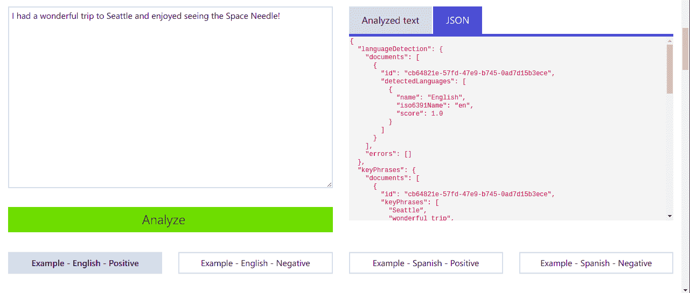

要加载输入的 JSON 文件，请按照以下步骤操作：

1.  点击“数据”。

1.  导航到*获取数据 | 从文件 | 从 JSON*，如下截图所示：

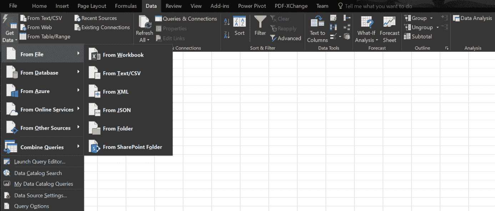

1.  您将获得一个预览，显示 JSON 结构中的主要字段，如下截图所示：

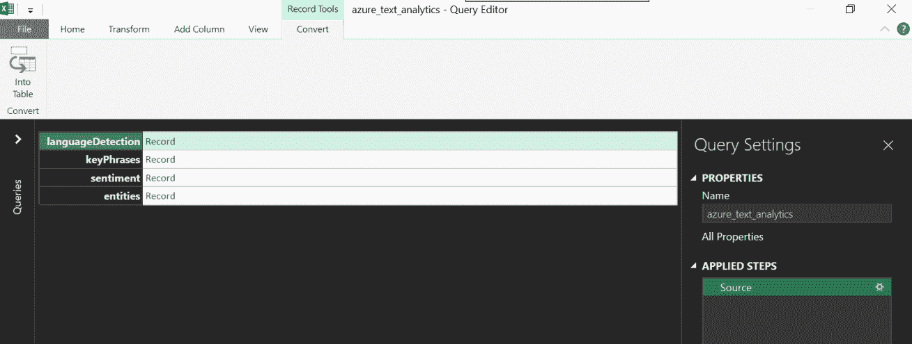

1.  点击“转换为表格”将条目转换为常规 Excel 表格，如下截图所示：

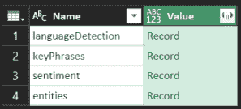

`值`列是一个包含嵌套值的特殊表列。要导航到所需的变量，我们需要点击符号，并在随后出现的列中重复此操作。通过这样做，例如，我们可以获取情感值，它是 0.97。一旦没有更多的列可以展开，我们就可以加载数据并创建一个包含 JSON 结构中所有值的常规 Excel 表格，这将用于进一步分析。

# 从数据库导入数据

可用的数据库种类繁多，Excel 可以连接到其中大多数。对于所有这些数据库，连接过程都是相似的。我们将以一个为例：免费的 MS SQL Server Express 数据库，可以在任何计算机上下载。它有一些限制，但对于学习和测试少量数据来说非常实用。假设您的计算机中有一个本地数据库，请按照以下步骤连接数据库：

1.  点击“数据”。

1.  导航到*获取数据 | 从数据库 | 从 SQL 服务器数据库*，如下截图所示：

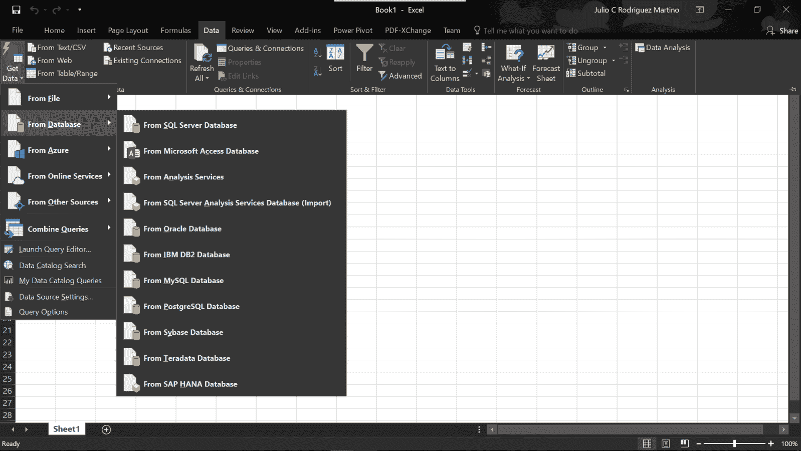

1.  弹出对话框将请求数据库服务器的名称。在这种情况下，它是本地计算机名称和 SQL Express 服务器。可选地，我们可以添加数据库名称，但如果我们留空，我们将能够看到服务器中所有数据库的列表。以下截图显示了这些细节：

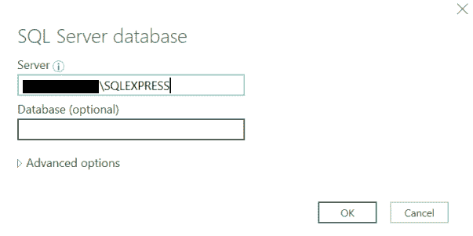

1.  使用您的凭证连接到数据库。您可能可以使用 Windows 用户名和密码登录（如下面的截图所示）或者您可能有一个用于数据库的特殊用户名和密码对：

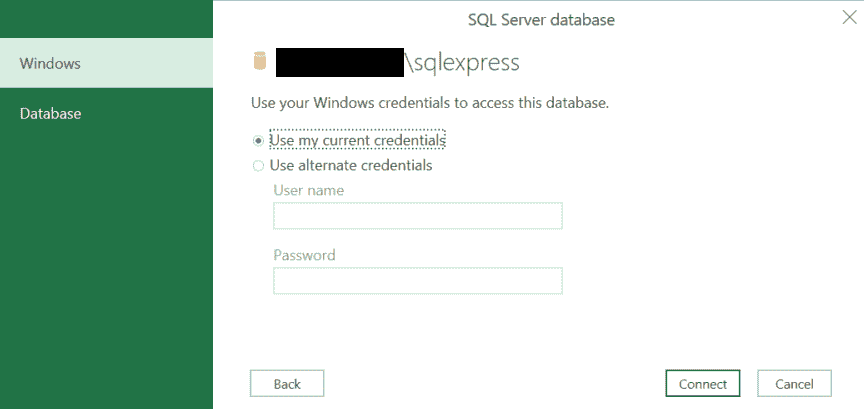

1.  如果连接成功，您将看到服务器上所有数据库及其包含的表的列表。

1.  选择一个表格，并获取通常的预览，如下面的截图所示：

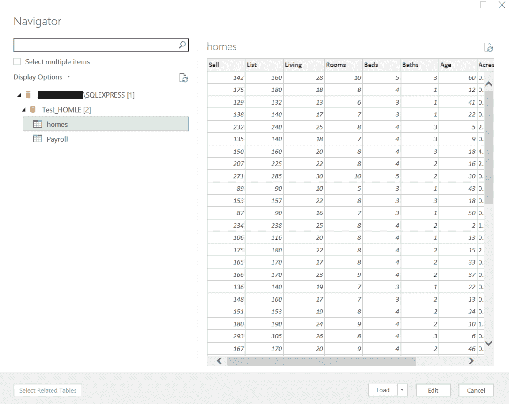

与前述案例一样，您可以选择编辑数据或加载数据。最终结果总是一个 Excel 表格。

现在，您已经知道如何将 Excel 表格连接到数据库，这是最常用的数据存储方式。现在我们有了数据，下一步是准备它以进行分析。这将在下一章中详细展示。

# 摘要

在本章中，我们描述了将信息输入到 Excel 工作表中的不同方法，这超出了手动输入数据的范围。通过使用 Power Query 和查询编辑器，可以从 Excel 内部分析各种文件类型、网络数据源和数据库，以提取、转换和加载数据。我鼓励您探索其他数据源，因为加载过程非常相似。

到目前为止，我们已经看到了一些非常简单的数据转换在数据加载之前被应用。在下一章中，我们将讨论更多用于数据清洗的高级技术。

# 问题

1.  在文本文件中可以使用哪些字符作为分隔符？

1.  为什么在加载数据之前预处理数据如此重要？

1.  打开 Excel 文件和导入它之间有什么区别？

1.  可以从网页导入哪些类型的信息？

1.  JSON 是用于交换信息的结构化格式之一。还有哪些格式存在？

1.  进行一些在线研究，了解使用数据库而不是单个数据文件的优势。

# 进一步阅读

+   *Power Query 文档*：[`docs.microsoft.com/en-us/power-query/`](https://docs.microsoft.com/en-us/power-query/)

+   *查询编辑器（Power Query）简介*：[`support.office.com/en-us/article/introduction-to-the-query-editor-power-query-1d6cdb63-bf70-4ae8-a7d5-6ae9547004d9`](https://support.office.com/en-us/article/introduction-to-the-query-editor-power-query-1d6cdb63-bf70-4ae8-a7d5-6ae9547004d9)

+   *介绍 JSON*：[`www.json.org/`](https://www.json.org/)
