# 第七章：实现时间序列

时间演变的现象对许多学科至关重要。了解发生了什么，预测不同变量将如何演变，是做出正确、明智决策的关键知识。

时间序列分析是一个广泛的领域，有许多不同的方法来检测模式、预测行为，并将时间演变分解为已知和先前研究过的形状。我们将讨论其中的一些，重点关注那些易于使用 Excel 解决的问题。通常的想法是，我们的机器学习数据中的细节，并从中提取关于过去和可能未来发展的有用知识。

在本章中，我们将涵盖以下主题：

+   建模和可视化时间序列

+   在 Excel 中自动预测时间序列

+   研究时间序列的平稳性

# 技术要求

为了完成本章，读者需要从 GitHub 仓库[`github.com/PacktPublishing/Hands-On-Machine-Learning-with-Microsoft-Excel-2019/tree/master/Chapter07`](https://github.com/PacktPublishing/Hands-On-Machine-Learning-with-Microsoft-Excel-2019/tree/master/Chapter07)下载`AirPassengers_modified.csv`文件。

# 建模和可视化时间序列

我们已经看到，进行初步数据分析和可视化数据集是任何机器学习项目的第一步。时间序列也不例外。因此，我们将首先探索时间序列，并了解其不同的特征。

在时间序列的情况下，初步分析意味着对其进行**建模**；也就是说，了解它是否具有周期性，是否显示出某种趋势（随时间增加或减少），或者它是否是平稳的（值的均值和方差随时间不变），以及其他一些指标。可视化在这个分析中起着基本的作用，因为许多时间序列的特征可以通过数据点的图形表示来推断，即使有数值方法可以计算它们。

让我们使用一个流行的数据集来说明时间序列的建模和可视化。`AirPassengers_modified.csv`文件是一个非常流行的数据集的简化版本，通常在教授时间序列分析时作为示例（来源：*Box, G. E. P., Jenkins, G. M. and Reinsel, G. C. (1976) 时间序列分析、预测与控制。第三版。Holden-Day. Series G*）。我们的版本包含 1949 年至 1961 年间通过飞机旅行的国际乘客数量（以千为单位），按月分组。通过常规方式（数据 | 从文本/CSV）加载文件后，我们可以在以下图表中可视化时间序列，其中我们可以看到乘客数量作为时间的函数：

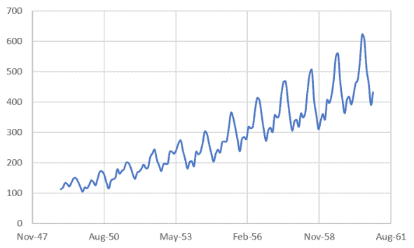

我们首先注意到乘客数量随时间增加。然后，如果我们仔细观察序列中的峰值，似乎有一个 12 个月的重复模式。让我们用数据来证明这个观察结果。

获取趋势的最简单方法是用 Excel 内置的趋势计算功能。要使用它，请按照以下步骤操作：

1.  点击图表区域。

1.  勾选“趋势线”复选框。

1.  点击“更多选项...”，如以下截图所示：

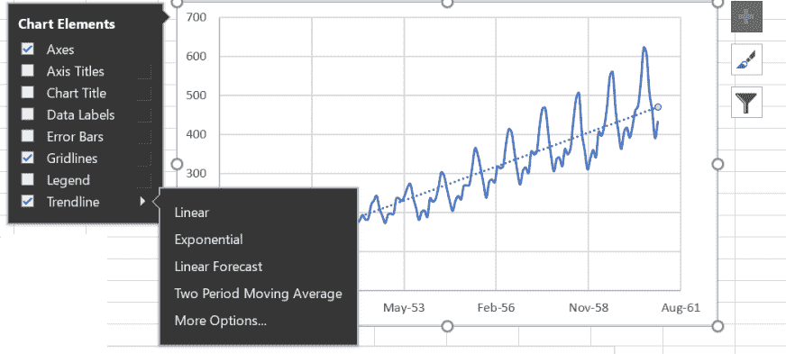

第一个选择将显示图表中的线条，然后，在选择了“更多选项...”之后，我们可以勾选复选框以在图表上查看线条方程表达式。请注意，线性并不是趋势线的唯一选项，更复杂的回归分析也是可用的，如以下截图所示：

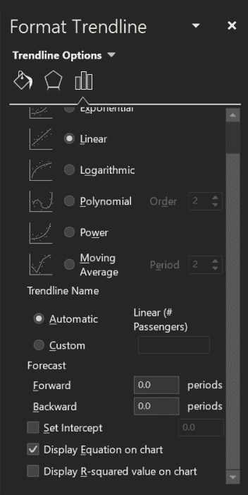

如图表上所示的结果方程如下：

*乘客数 = 0.0873*旅行日期 - 1472*

观察生成的图表，我们看到一条直线并不能正确地跟随序列的时间演变。一些部分大部分在直线上方，而其他部分在直线下方，如以下图表所示：

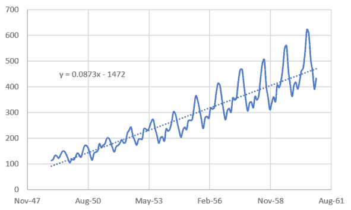

我们如何对数据集的一般行为进行建模？我们可以先意识到，我们可以将序列视为由三部分组成：

+   一个周期性部分，它每 12 个月重复一次（我们猜测这是由于峰值的周期性，我们将这个 12 个月周期称为*季节*）

+   一个*增长*部分，我们可以通过回归或平均序列来获得

+   一个*噪声*部分，我们基本上将其定义为一旦我们隔离前两部分后剩下的值

这个模型可以写成以下形式：

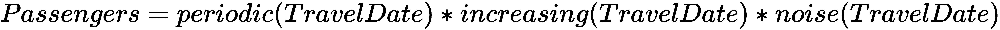

让我们通过使用移动平均来改进*增长*部分的计算。这可以通过 Excel 自动计算，但我们将手动进行，因为它很简单，我们可以确切地了解它是如何工作的：

1.  首先计算前 12 个月的平均乘客数：

*=AVERAGE(B2:B13)*

1.  在右侧的单元格中，计算标准差（我们将在下一节中使用它，当我们测试序列的平稳性时）：

*=STDEV.S(B2:B13)*

1.  将这两个计算复制到表格的末尾。

然后，我们就有前 12 个月的平均值和标准差，在每个单元格对中。在实践中，我们正在定义一个移动的 12 个月窗口，并滑动它通过数据。生成的表格看起来类似于以下截图：

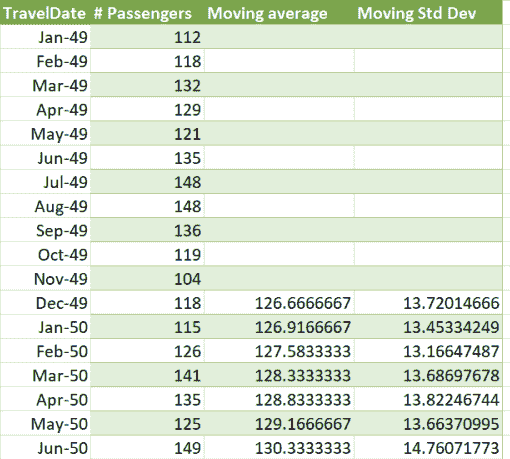

前十二位显然是空的，因为我们至少需要 12 个值来开始平均。如果我们把所有内容都放在同一个图表中，我们会看到一个类似于以下图表的图形：

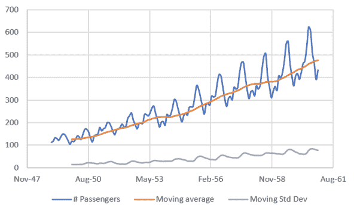

移动平均更好地遵循序列的细节，我们将用它作为*increasing(TravelDate)*的良好近似。注意，移动标准差也随时间增加，我们将在下一节中使用这个结果。

回到我们为时间序列建立的模式，我们可以写出：

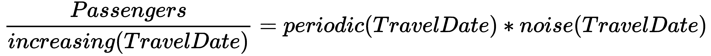

这个比率是在*Passengers*列和之前计算的移动平均之间。由于平均值需要从某个地方开始，所以你会缺少前 12 个点，但这没关系。对于其余的行，你可以计算*Passengers/Moving Average*，这近似于*Passengers/increasing(TravelDate)*。

1.  添加一个额外的列来计算这个比率。

1.  建立一个新的图表来显示计算。你会看到以下类似的图表：

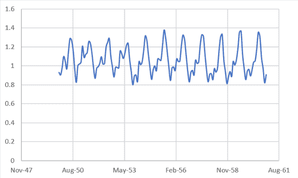

我们清楚地提取了增长部分，但我们仍然有振荡和噪声的混合。让我们通过重复前 12 个值来按顺序模拟*periodic(TravelDate)*。

1.  在新列中，根据需要复制粘贴前 12 个值以填充相同数量的单元格。这些值将给出以下图表：

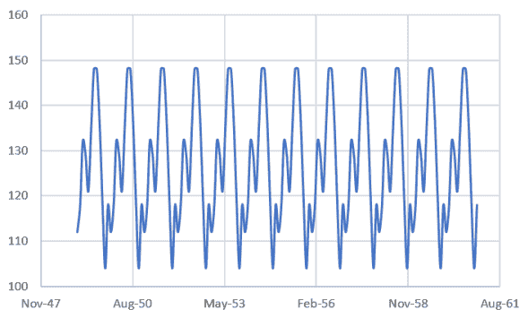

最后，我们将计算*noise(TravelDate)*。我们再次将从我们的模型中计算这个值：

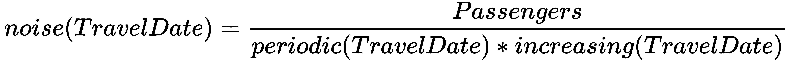

1.  在另一列中，使用前面的计算创建一个新的图表：

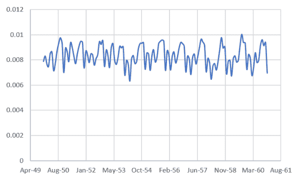

现在我们有了时间序列的完整模型，我们可以用它来预测未来的值！让我们一步一步来做：

1.  打开一个新的工作表。

1.  复制序列值并扩展时间范围至`Dec-62`。

1.  在`C`列中，复制*periodic(TravelDate)*值（两个 12 个值的相等序列中的 24 个值）。

1.  在`D`列中，复制对应于最后两年的噪声值。

1.  在`E`列的第 146 个单元格中，使用趋势线公式(*=0.0873*A146 - 1472*)计算*increasing(TravelDate)*。

1.  将公式向下复制到表格末尾。然后单元格`B1`如下：

*=C146*D146*E146*

然后将相同的计算向下复制。得到的表格如下：

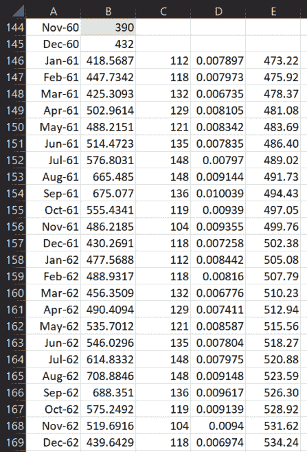

1.  插入一个新的图表，包括原始和预测的两个数据序列。

1.  在以下图表中，你可以看到预测相当准确！（或者至少它遵循了历史数据；预测质量的唯一真正衡量标准是将它与那些日期的真实数据进行比较）：

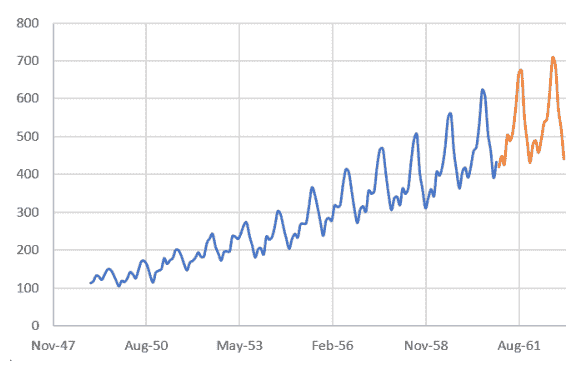

我们已经遵循了必要的步骤，根据其特征对时间序列进行建模，并广泛使用计算和可视化。我们将在下一节中展示这也可以通过使用 Excel 的内置功能自动实现。

# 在 Excel 中自动预测时间序列

现在我们已经艰难地预测了时间序列，理解了每一步，我们可以用简单的方法来做。我们将使用 Excel 的内置函数来预测未来乘客数量。执行以下步骤：

1.  选择两个列，`TravelDate`和`Passengers`，对应于时间和乘客数量。

1.  在主菜单中导航到“数据”：

1.  选择预测工作表（参考以下截图）：

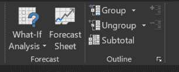

1.  将弹出一个窗口，显示预测预览，并允许我们通过点击“选项”来更改一些参数：

+   +   **预测结束**：我们可以选择预测期的结束。默认情况下，Excel 预测三个季节之后（更多内容将在后面介绍）。

    +   **预测开始**：我们可以对预测期的开始做同样的处理。默认是我们时间序列的最后一点时间。

    +   **置信区间**：这定义为围绕每个预测值的范围，其中 95%的预测点将落在其中（假设预测点的正态分布）。

    +   **季节性**：季节是时间序列重复其模式（如果它是周期性的，当然）的时期。它可以手动添加或自动检测。

以下图表显示了包含可用选项的弹出窗口：

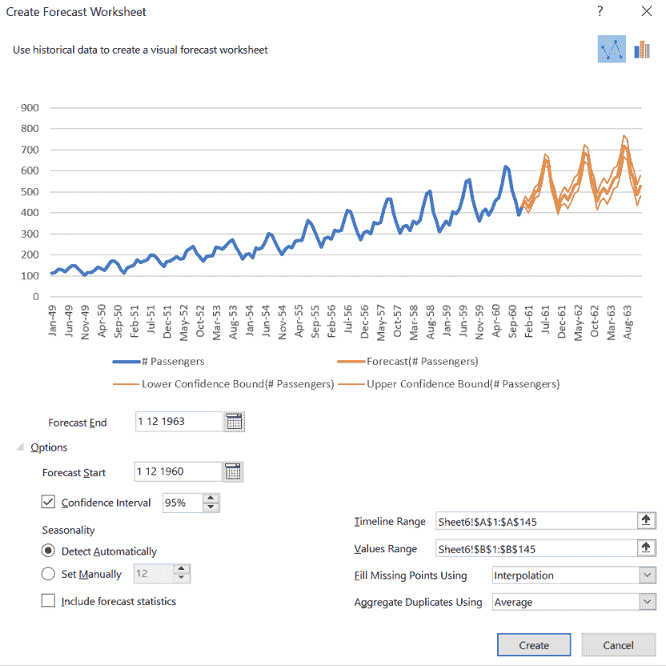

1.  时间范围和值范围是选定的列（在我们的案例中是`TravelDate`和`Passenger`）。

1.  点击“创建”，我们获得三个新列：`Forecast`、`Lower Confidence Bounds (Passengers)`和`Upper Confidence Bounds (Passengers)`：

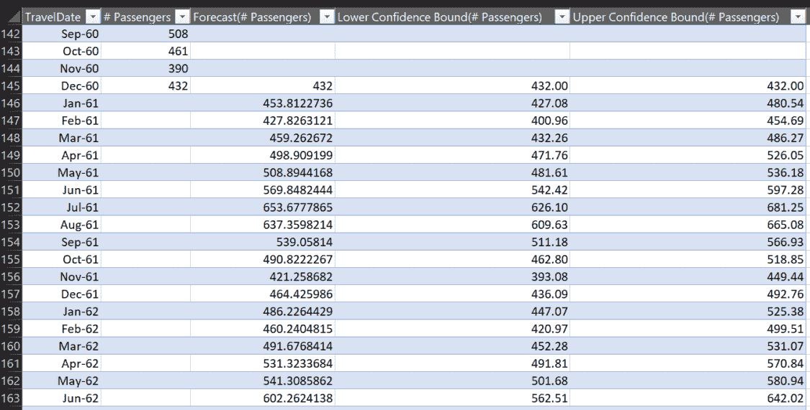

我们还将看到以下图表，显示时间序列加上预测值：

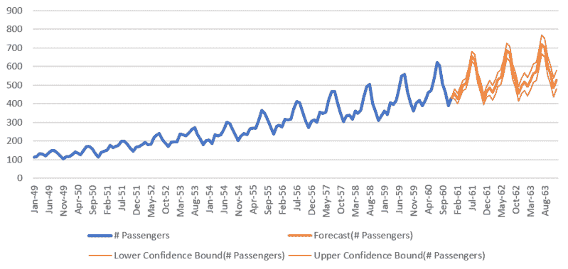

如果我们在弹出窗口中选择“包含预测统计信息”，我们将得到以下表格：

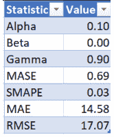

这些值对应于 Excel 内置的*FORECAST.ETS.STAT*函数，该函数是预测算法内部使用的。这些值的含义如下：

+   **Alpha**：这衡量了赋予数据点的权重。值越高意味着我们给予最近的数据点更高的权重。

+   **Beta**：这衡量了赋予趋势的权重。值越高意味着我们给予最近趋势更高的权重。

+   **Gamma**：这衡量了赋予季节的权重。值越高意味着我们给予最近季节周期更高的权重。

+   **平均绝对缩放误差 (MASE)**：这衡量了预测的准确性。

+   **对称平均绝对百分比误差 (SMAPE)**：这基于百分比误差来衡量准确性。

+   **平均绝对百分比误差 (MAPE)**：这基于百分比误差来衡量准确性。

+   **均方根误差 (RMSE)**：这衡量预测值和观察值之间的差异。

我们已经解释了如何使用 Excel 的内置功能来分析和预测时间序列。在下一节中，我们将关注时间序列平稳性的重要性。

# 研究时间序列的平稳性

大多数时间序列预测方法都依赖于序列是平稳的这一事实。这是有道理的，因为这增加了在未来重复某种行为的概率，并使预测变得更容易。

我们如何知道给定的时间序列是否平稳？有正式的统计方法来衡量这一点，但我们也可以查看序列的一些属性。在实践中，有三个主要的平稳性检查：

+   均值是恒定的（不依赖于时间）。

+   方差是恒定的。

+   元素 *i* 和 *i+m* 的协方差是恒定的。

在我们之前的例子中，在 *建模和可视化时间序列* 部分中，我们绘制了移动平均（均值）和方差。如果您重新访问该图表，您会看到它们都不是随时间恒定的，因此序列是非平稳的，我们必须对其进行建模才能预测值。

更正式的统计测试是 *Dickey-Fuller 测试*，这超出了本书的范围。这个测试不是由 Excel 自动完成的，但有许多插件可以执行它。手动执行它没有意义。

有两种方法可以去除季节性和趋势：

+   将序列分解为噪声、周期性和增长项的技术。

+   差分——即通过取值 *i* 和 (*i+m*) 之间的差值来创建一个新的序列。位置差， *m* 被称为**滞后**。

您现在已经看到了基于对时间序列特征详细理解的不同预测方法。当我们讨论在 第十章 中使用 Azure 机器学习模型时，我们将展示更多高级预测方法，例如 ARIMA。

可视化也是本章展示的分析过程中的一个关键要素。我们将在下一章中看到不同的可视化技术，重点关注它们的特定用例。

# 摘要

我们已经看到了分解时间序列并预测其未来值的逐步方法。这至少在一般术语上可以帮助我们预测不同过程的结局。时间序列可以图形化和数值化地研究，提取其特征，并使用它们来理解它们在未来的行为。我们还看到，这可以在 Excel 中自动完成，但存在将其作为黑盒使用而不理解完整预测方法的风险。存在更高级的技术，我们将在未来的章节中讨论它们。

下一章将向您展示如何在 Excel 中构建一些基本图表以及如何使用它们来深入了解您的数据集。

# 问题

1.  在我们的预测中，我们使用 Excel 生成的趋势函数来模拟时间序列的增长部分。我们也可以使用移动平均值。这该如何操作？尝试一下，并比较结果。

1.  修改季节性和置信区间的值，并研究预测图和参数如何变化。

1.  你如何计算时间序列中两个值的协方差？

1.  使方差与时间无关的可能方法是对时间序列值取对数。在航空乘客数据序列中尝试这种方法，并检查方差值。

# 进一步阅读

+   《时间序列分析与应用》，作者 R.H. Shumway 和 D.S. Stoffer

+   《时间序列建模与预测导论研究》，作者 Ratnadip Adhikari R. K. Agrawal
