# 第八章：在图表、直方图和地图中可视化数据

如果我们在谈论机器学习，为什么我们应该关心可视化？答案很简单：如果你不能向没有任何技术知识的人展示你所分析的内容以及你模型的输出结果，那么你就无法展示任何附加值。我们已经展示了数据可视化对于理解数据集和决定哪些特征将对我们训练模型最有用的重要性。我们现在将要研究哪种类型的图表最适合讲述我们的数据以及我们从其中获得的新信息的故事。

本章将涵盖以下主题：

+   展示变量之间基本比较和关系

+   使用直方图构建数据分布

+   在地图上表示数据的地理分布

+   展示随时间变化的数据

# 技术要求

为了完成本章，读者需要从 GitHub 仓库[`github.com/PacktPublishing/Hands-On-Machine-Learning-with-Microsoft-Excel-2019/tree/master/Chapter08`](https://github.com/PacktPublishing/Hands-On-Machine-Learning-with-Microsoft-Excel-2019/tree/master/Chapter08)下载`1976USpresident.xlsx`和`subte.xlsx`文件。

# 展示变量之间基本比较和关系

在数据分析和机器学习的背景下，数据可视化极其重要。以下是一些原因：

+   讲述你的数据故事，并帮助决策者完成他们的工作。

+   预测某些变量未来的演变。

+   在数据中找到隐藏的趋势和模式。

+   找到异常值，即数据中的异常。

+   理解分布、组成和关系。

+   构建组和类别。

我们将展示用于展示不同类型数据的各种图表类型。示例图表中使用的数据如下：

| **Year** | **Sales** | **Cost** | **Profit** | **ROI** |
| --- | --- | --- | --- | --- |
| 2015 | 23455 | 18294.9 | 5160.1 | 28.21% |
| 2016 | 19226 | 12881.42 | 6344.58 | 49.25% |
| 2017 | 34557 | 24881.04 | 9675.96 | 38.89% |
| 2018 | 20134 | 14697.82 | 5436.18 | 36.99% |
| 2019 | 22314 | 14057.82 | 8256.18 | 58.73% |

还应考虑以下数据：

<td">20134

| **Year** | **SalesA** | **CostA** | **ProfitA** | **SalesB** | **CostB** | **ProfitB** |
| --- | --- | --- | --- | --- | --- | --- |
| 2015 | 23455 | 18294.9 | 5160.1 | 23455 | 18294.9 | 5160.1 |
| 2016 | 19226 | 12881.42 | 6344.58 | 19226 | 12881.42 | 6344.58 |
| 2017 | 34557 | 24881.04 | 9675.96 | 34557 | 24881.04 | 9675.96 |
| 2018 | 20134 | 14697.82 | 5436.18 | 14697.82 | 5436.18 |
| 2019 | 22314 | 14057.82 | 8256.18 | 22314 | 14057.82 | 8256.18 |

将此数据输入 Excel 工作表，以便您可以在以下章节中创建图表。

# Excel 图表的基本部分

Excel 图表有不同的部分，了解它们的名称很重要，这样我们就可以随意修改图表。以下图表详细展示了它们：

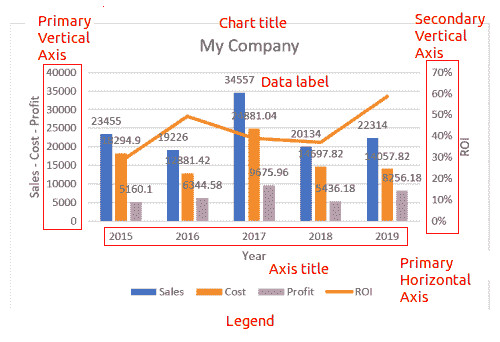

*x* 轴表示数据类别，*y* 轴表示数据系列。

在以下子节中展示的所有图表都可以通过选择数据范围并导航到插入 | 推荐图表来创建。在那里，我们可以看到预览并选择一个更好地讲述我们数据故事的图表。

# 柱状图

当你想在同一个图表中展示两个到四个不同的数据系列时，可以使用簇状柱状图。仅绘制一个系列没有意义，而超过四个可能会显得杂乱。看看以下示例：

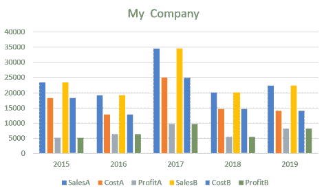

在这种情况下，如果我们拆分数据，例如，显示更小的年份组并切换时间序列和类别（见以下图表），这肯定看起来更好：

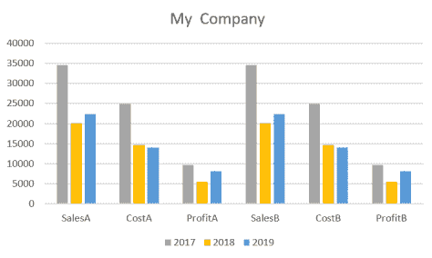

柱状图中的系列应使用相同的单位表示，否则它们无法比较，或者比较可能会误导。

# 组合图表

如果我们需要展示用不同单位表示的数据系列，我们可以使用组合图表。基本区别是这些图表有两个具有不同测量单位的垂直轴。以下图表展示了此类示例：

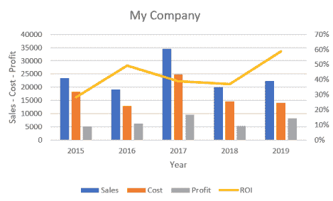

在这种情况下，主要垂直轴（左侧）表示货币单位，次要垂直轴表示百分比。

# 堆积图表

当需要强调数据系列中相对值的重要性时，会使用此类图表。例如，*成本 + 利润 = 销售额*。我们可以看到，正如以下图表所示，一眼就能比较值。

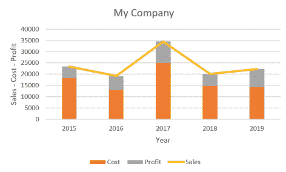

此图表可以通过首先包括**成本**和**利润**变量，然后添加**销售额**来创建。

# 饼图和柱状图

饼图在比较多个系列时很有用。作为一个例子，我们将使用以下表格中列出的 2016 年美国俄勒冈州总统选举的结果：

| **候选人** | **选票** |
| --- | --- |
| 克林顿，希拉里 | 1,002,106 |
| 特朗普，唐纳德·J. | 782,403 |
| 约翰逊，加里 | 94,231 |
| 其他 | 72,594 |
| 斯坦，吉尔 | 50,002 |

结果的饼图如下：

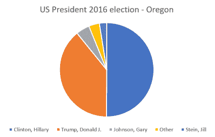

同样的结果可以用柱状图展示，而且比较选票数量的差异更容易。

通过在图表的任何部分右键单击，将图表类型更改为柱状图。

柱状图将看起来类似于以下：

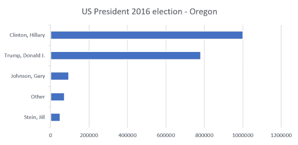

我们现在知道如何为每种类型的数据选择最佳的图表。在下一节中，我们将研究在预览数据时使用直方图时最常用且最重要的图表之一。

# 使用直方图构建数据分布

我们在第五章“相关性和变量的重要性”中使用了直方图，但没有正式介绍它们。这种图表显示了数值或分类值的计数。为了显示数值数据，我们可以构建类别，就像我们对泰坦尼克号乘客的年龄所做的那样：

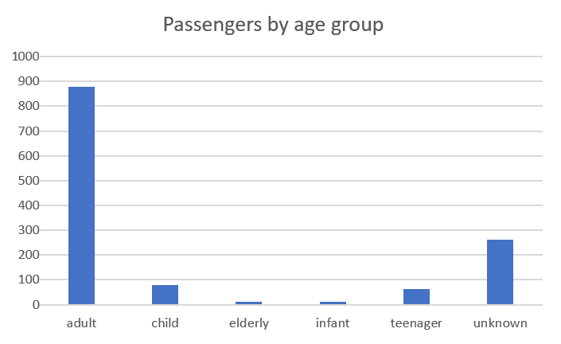

或者，我们也可以将年龄变量作为数字使用，并将值分布在箱子（落在相同数值范围内的数据点组）中：

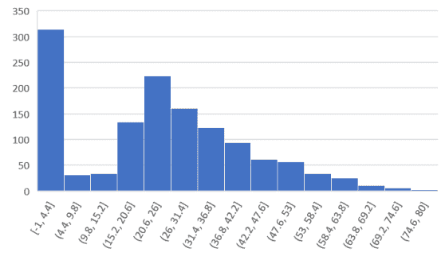

上述直方图是按照以下步骤创建的：

1.  导航到插入 | 直方图。

1.  双击*x*轴以设置箱子的数量为`15`。

我们可以立即看到第一个箱子中有大量条目，对应于缺失的年龄值，我们将其定义为`-1`以方便识别。我们还注意到，大多数乘客年龄在 20 到 26 岁之间，分布并不对称；它似乎显示出向较老年龄的指数衰减和向较年轻年龄的更快下降。这可以通过考虑这样一个事实来解释，即当时在跨大西洋的船上旅行的小孩子并不多（至少在泰坦尼克号沉没的时候是这样）。

您还会注意到，直方图是发现**异常值**的一个极好的图形方法；也就是说，这些数据点不遵循与其他数据点相同的分布。在我们的当前例子中，缺失值也是异常值。

直方图的另一个有用应用是在比较大量项目时比较值。假设我们使用机器学习模型进行了预测。我们正在预测一个数值，我们希望将其与实际值进行比较以测试我们的模型。然后，对于每一组特征值，我们可以绘制实际值和预测值之间的差异。如果我们的模型是一个好的预测器，我们应该看到以下图表：

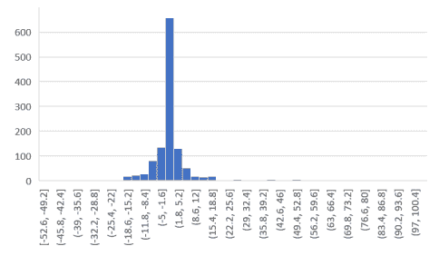

分布以**0**为中心，大部分是对称的，向右有一些较大的值。显然，这些都是不良的预测。

我们已经看到直方图是识别数据集不同特征的有价值工具。现在让我们集中讨论更复杂的数据表示。

# 在地图上表示数据的地理分布

在地图上定位信息对于理解空间维度上的数据非常有用，这通常通过其他方法很难实现。Excel 提供了不同的选项，我们将展示其中的一些。我们将首先使用包含地理坐标的数据，即纬度和经度。如今 GPS 系统的广泛应用使得获取此类信息变得容易。无论如何，如果此类精确信息不可用，我们将看到 Excel 内置的信息仍然可以使其简单绘制地图并显示有用信息。

在我们的第一个例子中，我们将使用关于 1976 年美国总统选举的麻省理工学院选举数据与科学实验室的数据。`1976USpresident.xlsx`文件包含其他信息，其中包括美国各州的列表以及每位总统候选人的得票数。我们希望将这些信息放入地图中，类似于新闻中展示的，共和党州用红色表示，民主党州用蓝色表示。

输入数据表如下：

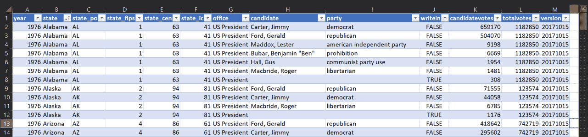

从这张表中，我们需要提取每个州的获胜政党，即获得更多选票的那个政党。我们将使用 Power Query 及其分组功能。

1.  导航到“数据”|“来自表/范围”。

1.  打开 Power Query 窗口。你应该会看到以下截图类似的内容：

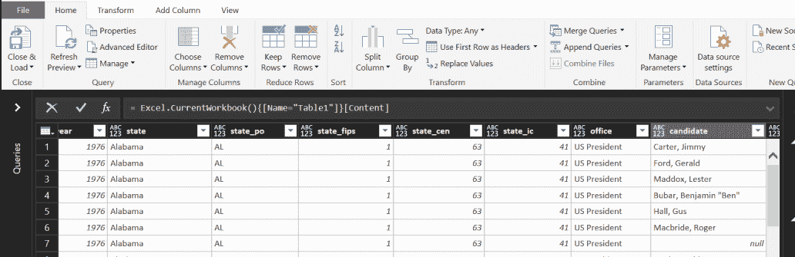

1.  选择“分组”|“高级”，然后选择“州”作为分组选项。

1.  然后，我们将添加一个名为“获胜者”的新列，其中我们将对 party 的值求和。这将产生一个错误，但将为我们获取获胜政党名称的基函数。

1.  我们将添加的第二列命名为“投票数”，其中我们选择 candidatevotes 的最大值。这将显示每个州的较大投票数。

以下截图显示了选择详细选项后窗口应该看起来像什么：

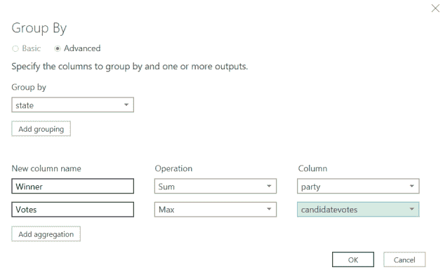

点击确定后，生成的表如下：

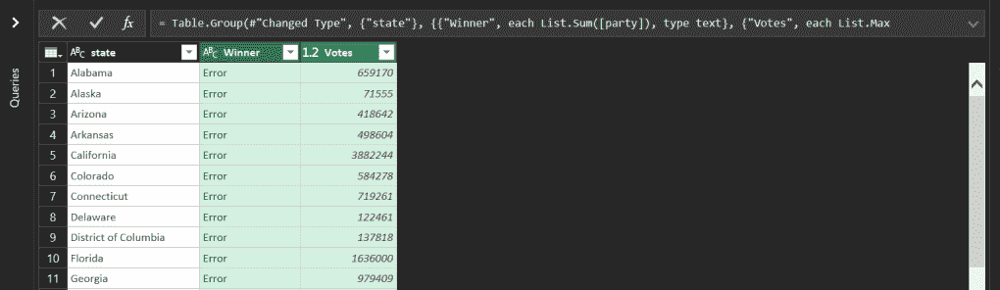

1.  为了修复错误并获取“获胜者”列中的政党名称，我们替换了以下函数：

*= Table.Group(#"Changed Type", {"state"}, {{"Winner", each List.**Sum**([party]), type text}, {"Votes", each List.Max([candidatevotes]), type number}})*

我们将替换前面的函数为以下内容：

*= Table.Group(#"Changed Type", {"state"}, {{"Winner", each List.**First**([party]), type text}, {"Votes", each List.Max([candidatevotes]), type number}})*

这将显示获胜政党，如下表所示：

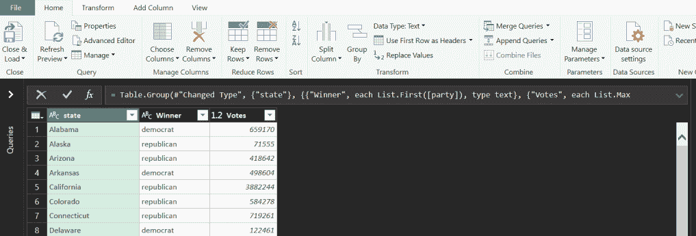

1.  点击“关闭并加载”。

1.  使用生成的表创建地图。选择表中的任何单元格，然后导航到“插入”|“推荐图表”。第一个建议将是我们要的地图类型。

1.  点击确定。

1.  通过双击图例更改标题和颜色。生成的地图如下：

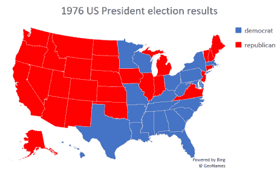

我们的第二个例子将使用来自阿根廷政府公共数据库（`datos.gob.ar`）的数据。表中列出了布宜诺斯艾利斯所有地下车站的经纬度、名称以及它们所属的线路。

布宜诺斯艾利斯地铁的昵称是**Subte**，这是**subterráneo（地下**）这个词的缩写，因此文件以此命名。

地理坐标在常规 Excel 地图中不接受作为输入，因此我们将展示 3D 地图功能，它还有其他优点。

执行以下步骤：

1.  加载 `subte.xlsx` 文件，你将看到以下表格（部分显示）：

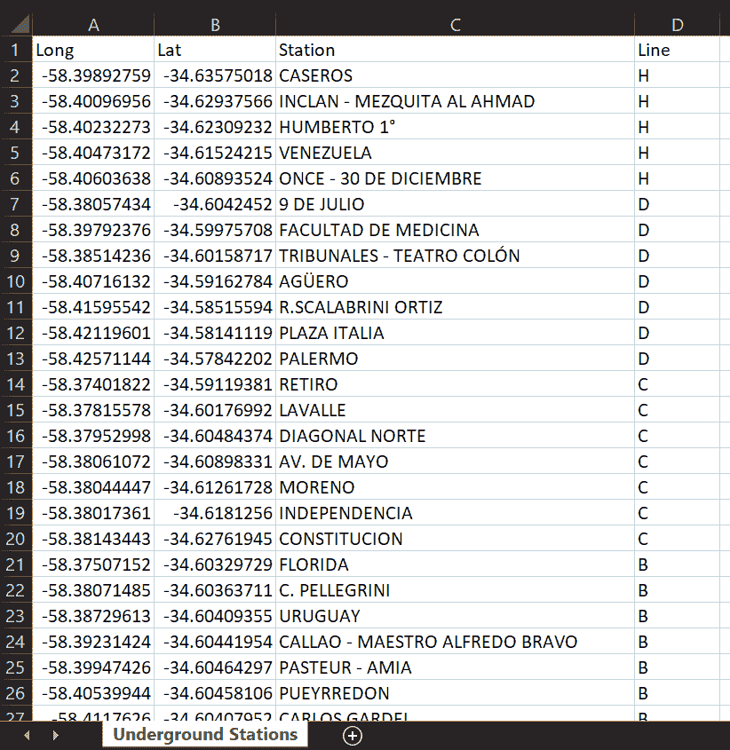

1.  选择完整的数据范围。

1.  导航到插入 | 3D 地图。你应该会看到以下截图类似的内容：

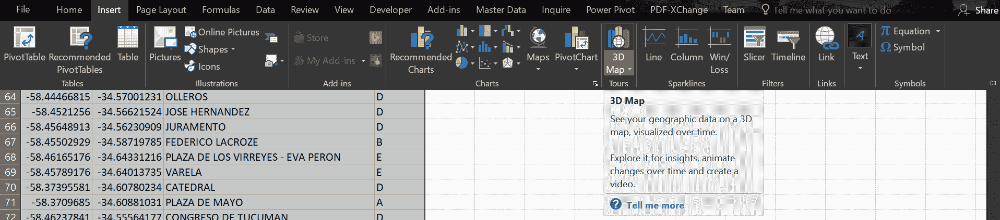

如果图标变灰，请参考链接 [`support.office.com/en-ie/article/get-started-with-3d-maps-6b56a50d-3c3e-4a9e-a527-eea62a387030`](https://support.office.com/en-ie/article/get-started-with-3d-maps-6b56a50d-3c3e-4a9e-a527-eea62a387030) 以获取激活 3D 地图的逐步说明。

1.  点击如下截图所示的新游：

3D 地图窗口将打开，显示地球的默认视图，如下截图所示：

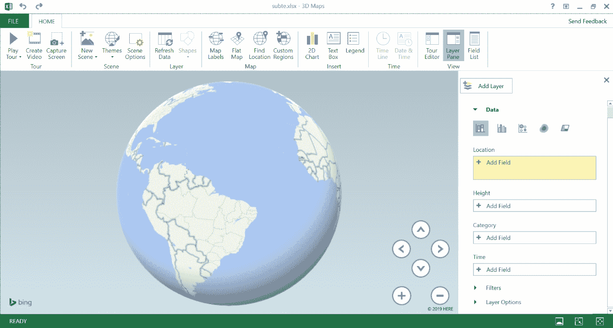

1.  在位置窗口中添加两个字段：`Long` 和 `Lat`。它们应该自动分配给相应的变量。如果不这样，从名称右侧的菜单中选择它们（见以下截图）。

1.  现在，地图应该以布宜诺斯艾利斯市为中心，但缩放可能仍然太远。

1.  通过鼠标滚动或使用 + 按钮放大。

1.  在类别字段中，添加线路，因为我们想区分不同的车站组。

1.  地图看起来将类似于以下截图：

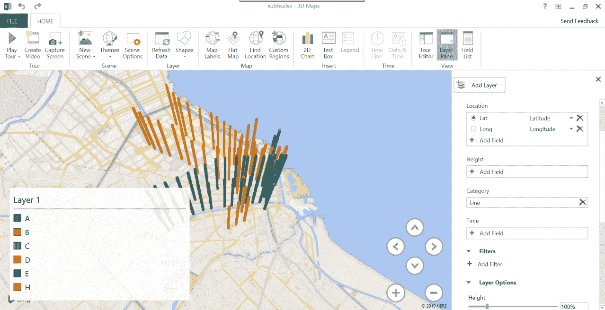

让我们稍作改进。我们不希望用代表每个车站的大列，我们希望用小符号。为了实现这一点，请执行以下步骤：

1.  点击图层选项。

1.  将高度设置为 0%，并将厚度设置为 50% 到 70% 之间。

1.  你也可以为每条线（类别）更改颜色。在许多其他城市中，Subte 线路通过颜色来识别。A 是浅蓝色，B 是红色，C 是蓝色，D 是绿色，E 是紫色，H 是黄色（F 和 G 呢？它们，还有我，都还没有建成）。最终结果如下截图所示：

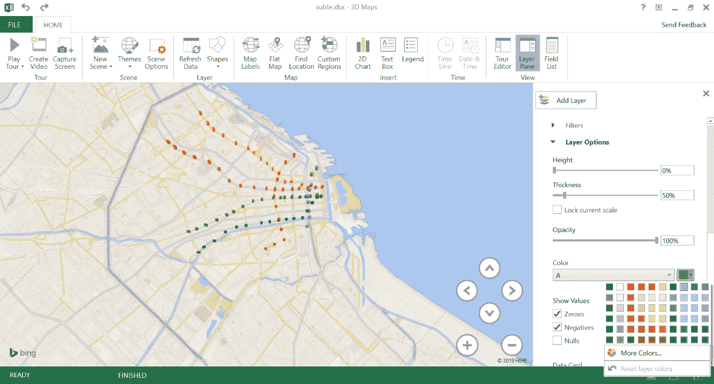

我们还可以做的最后一件事，因为 3D 地图可以交互使用，就是向数据卡（或通常在可视化中称为工具提示）添加有用的信息。为此，请执行以下步骤：

1.  点击自定义按钮（位于数据卡下方），你可以看到，默认情况下，迄今为止包含的三个变量都在那里（见以下示例截图）：

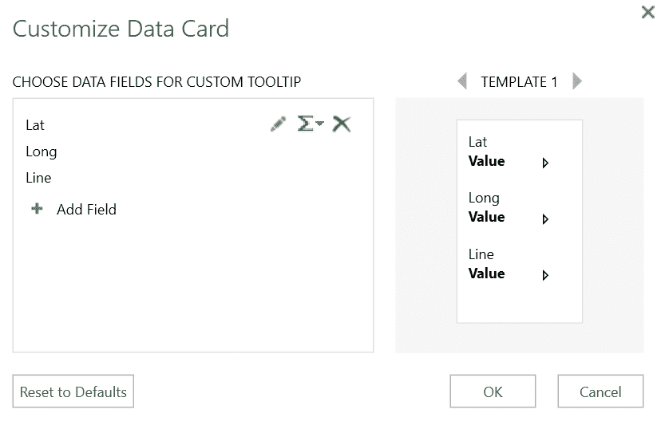

1.  通过点击红色 X 删除 Lat 和 Long。

1.  添加车站。

之后，如果我们把鼠标移到代表地下车站的任何符号上，我们会看到它的名称和它所属的线路，如下截图所示：

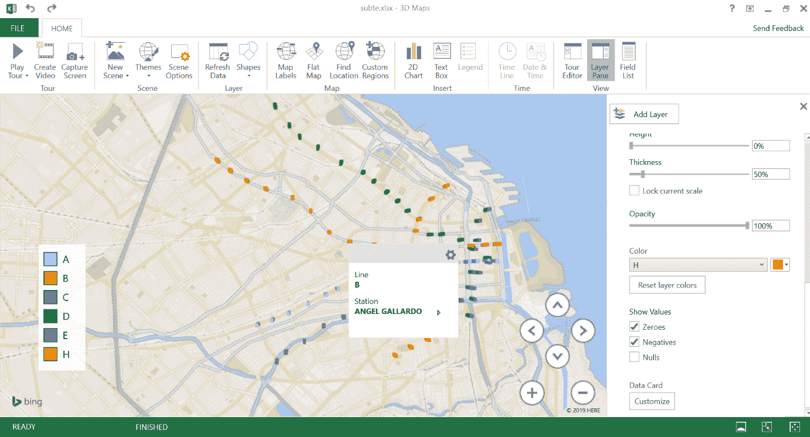

我们现在知道如何使用 Excel 使用地名或 GPS 坐标有效地表示地理数据。

在我们最后的例子中，我们将重新审视时间序列，展示不同的表示方式。

# 显示随时间变化的数据

在前面的章节中，我们详细分析了时间序列。我们主要使用折线图来表示数据的演变。时间演变能否以不同的方式表示？根据经验，当我们想要比较两个值时，线条可能会误导，而其他方法更好。

回到美国选举数据，假设我们想要比较一个州（例如，民主党）在几年内两个主要政党（民主党与共和党）的时间演变。执行以下步骤：

1.  在 Excel 中加载`1976_2016USpresident.xlsx`文件，你将看到与上一节中使用的表格相同的信息，但现在我们可以看到从 1976 年到 2016 年每个州每届选举的结果。

1.  随机选择一个州（以我们的案例为例，是加利福尼亚州）并尝试比较每个政党投票数随时间的变化。

1.  导航到数据 | 从表/范围。

1.  在 Power Query 窗口中，点击“选择列”。

1.  选择我们感兴趣的列：`year`、`state`、`party`、`candidatevotes`和`totalvotes`，如下截图所示：

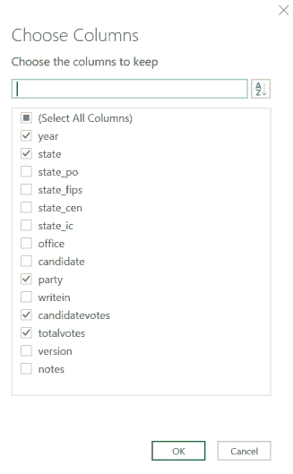

1.  通过点击“添加列”|“自定义列”添加新列，计算按政党划分的投票百分比，即*[candidatevotes]/[totalvotes]*。

1.  将该列的类型更改为百分比（在“开始”|“数据类型”中）。结果类似于以下截图所示：

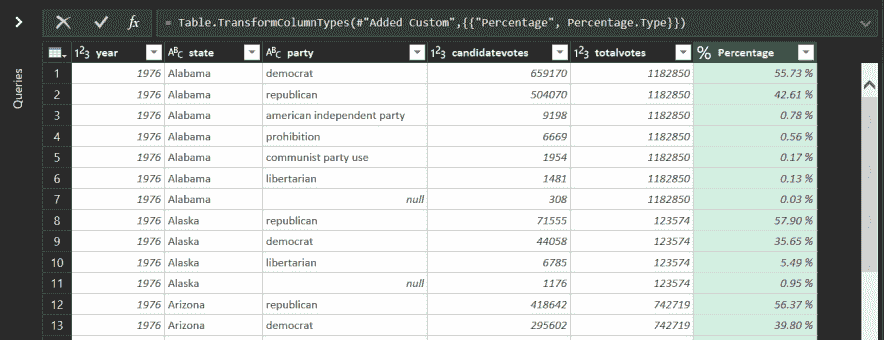

1.  筛选行，只留下`state`为`California`和`party`为`republican`或`democrat`。

我们需要以这种方式格式化表格，以便我们可以有意义地比较两个时间序列。为此，执行以下步骤：

1.  选择`party`列。

1.  导航到转换。

1.  点击“Pivot Column”。在点击“确定”之前，弹出窗口应该如下截图所示：

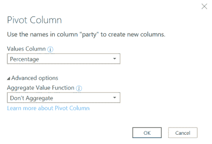

结果如下表所示：

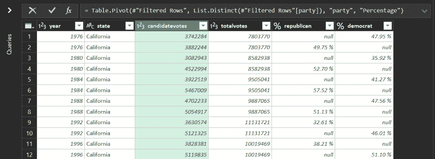

我们现在将重复之前使用的一些步骤，所以我会快速解释一下：

1.  选择两个`%`列。

1.  导航到转换 | 替换值。

1.  将所有`nulls`转换为零。

1.  使用“开始”|“按组分组”按州分组。

1.  选择求和作为聚合。

1.  最后一步是创建另一列来计算民主党与共和党投票百分比与总数的差异：

*100%- %republican -%democrat*

这将给出投给其他政党的投票百分比。我们将使用以下表格创建图表：

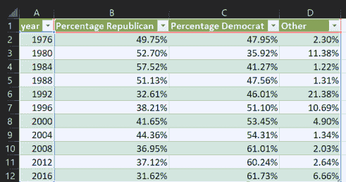

1.  点击图表中的任何单元格。

1.  导航到插入 | 推荐图表。

1.  选择堆叠柱状图。

结果将类似于以下图表：

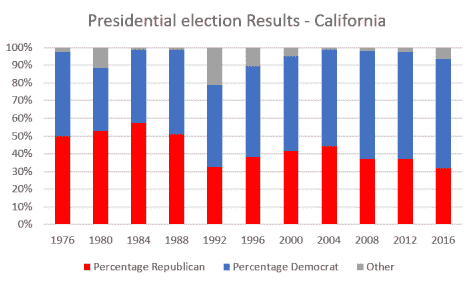

很明显，这种图表更适合比较各政党获得的投票数量和其他数据细节。例如，我们立即可以看到，在 1992 年，两个政党，尤其是共和党，都失去了对其他非传统政党的选票。

提示：在谷歌中搜索`罗斯·佩罗特`。

我们已经展示了除了折线图之外，还有其他方式来展示时间序列中包含的信息。现在你可以根据需要显示的信息类型尝试其他类型的图表。

# 摘要

我们已经讨论了 Excel 中不同类型的图表，可以用来比较变量并以有意义的方式展示数据，帮助我们从结果中提取价值。

我们现在可以回到纯机器学习模型，并跃进到高级神经网络的世界。

# 问题

1.  哪些类型的数据可以用图表表示？列出并考虑每种情况下最适合的图表。

1.  当你尝试使用饼图来展示五个或六个以上的数据系列时会发生什么？

1.  哪种类型的图表可以作为堆叠柱状图的良好替代品？

1.  尝试使用其他地理数据（例如，街道地址）来创建图表。

1.  你能使用美国总统选举数据来预测 2020 年的结果吗？原则上，应该可以预测时间序列的值。试一试，并思考预测的准确性以及可能的解释。

# 进一步阅读

+   《定量信息的视觉展示》，作者：爱德华·R·图费

+   《用数据讲故事：商业专业人士的数据可视化指南》，作者：科尔·努斯鲍默·克纳弗利克
