# 第九章：人工神经网络

人工神经网络试图模仿人脑的工作方式。它们被用于解决一系列难题，例如理解书面或口头语言、识别图像中的物体，或驾驶汽车。

您将学习人工神经网络的基本工作原理，查看训练它所需的步骤和数学计算，并对复杂神经网络有一个总体了解。

本章节将涵盖以下主题：

+   介绍感知器——最简单的神经网络类型

+   构建深度网络

+   理解反向传播算法

# 技术要求

为了完成本章，您需要从 GitHub 仓库[`github.com/PacktPublishing/Hands-On-Machine-Learning-with-Microsoft-Excel-2019/tree/master/Chapter09`](https://github.com/PacktPublishing/Hands-On-Machine-Learning-with-Microsoft-Excel-2019/tree/master/Chapter09)下载`transfusion.xlsx`文件[.](https://github.com/PacktPublishing/Hands-On-Machine-Learning-with-Microsoft-Excel-2019/tree/master/Chapter09)

# 介绍感知器——最简单的神经网络类型

神经网络受到人脑的启发，更具体地说，是构成它的神经元细胞。实际上，自从第一个人工神经元被设计以来，神经科学已经取得了重大进展，因此最好说它们是受到几年前对大脑所知内容的启发。

感知器是构建人工神经网络的第一次尝试（弗兰克·罗森布拉特，1959 年）。它实际上是一个单神经元的模型，具有多个输入和一个输出。输出值是输入的加权总和，这些权重会迭代调整。这种简单的实现有许多缺点和限制，因此后来被多层感知器所取代。这种人工神经网络的最基本模型在以下图中显示：

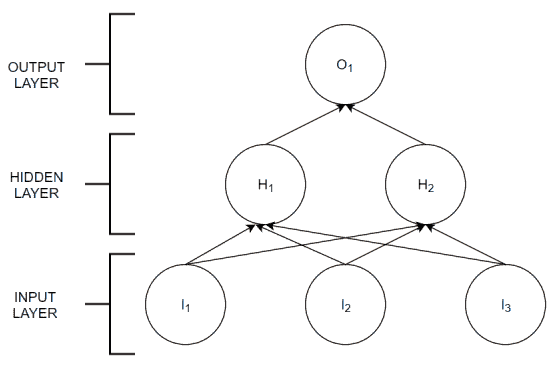

输入层和输出层来自感知器，但现在增加了一个隐藏层节点。实际上，这一层的每个节点都充当一个神经元。为了理解每个神经元的输入和输出是如何工作的，以及信息是如何通过网络传递的，我们需要知道每个神经元构建的细节。人工神经元的示意图可以表示如下：

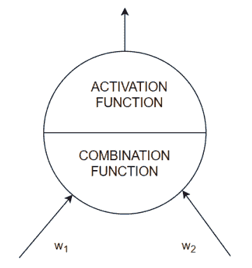

组合函数计算加权输入的总和作为结果输入，其中 w[i]是权重。激活函数使用这个输入来计算输出。输出范围通常限制在[0;1]之间，使用不同的函数。通常情况下，只有当输入值高于某个特定阈值时，神经元才会传递信号。

人工神经网络是如何学习的？使用一个训练数据集，其中输出是已知的。将输入值输入网络，将预测输出与实际输出进行比较，并在每一步迭代中调整 w[i] 权重。这意味着神经网络是一个监督学习模型。

问题越复杂，所需的训练样本数量就越大，以调整权重。我们还将看到，隐藏层和神经元的数量也会根据问题进行调整。调整这些参数是一个复杂的问题，几乎可以成为一个研究领域。

人工神经网络很有用，因为它们可以模拟任何数学函数。因此，即使输入值之间的关系未知，我们也可以使用网络来重现它并做出预测。

由于训练过程可能很复杂，并且在训练时调整的参数数量很大，因此通常很难理解为什么人工神经网络能够正确预测某个值。基于神经网络的智能模型的可解释性也是一个广泛研究的问题。

神经网络的某些应用如下：

+   图像分析——面部、物体、颜色、表情和手势

+   声音分析——声音、语音转文本和情感

+   文本分类——电子邮件垃圾邮件、文档内容中的欺诈和情感

+   硬件故障——预测性和/或诊断性

+   健康风险和/或诊断

+   客户或员工流失

让我们通过一个例子来看看实际中的训练是如何进行的。

# 训练神经网络

我们将使用来自台湾新竹市血液输血服务中心的公共数据集（由 Yeh, I-Cheng, Yang, King-Jang 和 Ting, Tao-Ming 编写的《使用伯努利序列在 RFM 模型上的知识发现》，发表于 2008 年的《Expert Systems with Applications》）。该数据集包含有关献血者的信息，总结为五个变量：

+   R（最近性 - 自上次捐赠以来的月数）

+   F（频率 - 总捐赠次数）

+   M（货币 - 总捐赠血液量，单位为 cc）

+   T（时间 - 自首次捐赠以来的月数）

+   一个二元变量，表示他们是否在 2007 年 3 月捐赠了血液（1 表示捐赠血液；0 表示未捐赠血液）

我们想证明人工神经网络如何从前面的四个特征中学习，并预测目标变量五。按照以下步骤重现并了解 `transfusion.xlsx` 文件中已显示的计算：

1.  将 `transfusion.xlsx` 文件加载到 Excel 中。

1.  在名为 `transfusion`* 的表格中，您将找到输入数据。它应该看起来像以下截图：

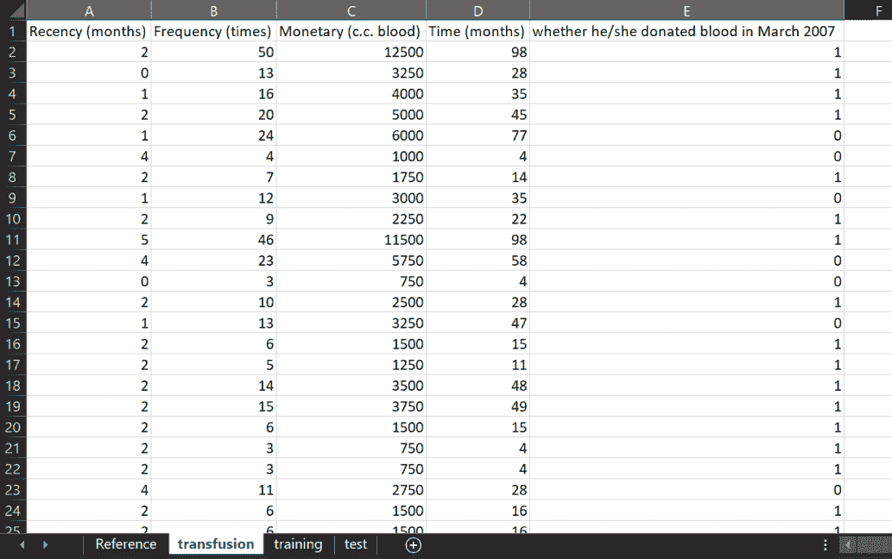

1.  由于数据没有按照任何特定的顺序呈现，我们可以使用前 500 个条目来训练神经网络。打开一个新的工作表并将其重命名为 `training1`（记住，我们正在重复创建文件中已经存在的工作表，以便你可以比较你的结果）。

1.  创建一组变量，就像你在下面的屏幕截图中所看到的那样。如果你使用相同的单元格，将更容易跟随下一步：

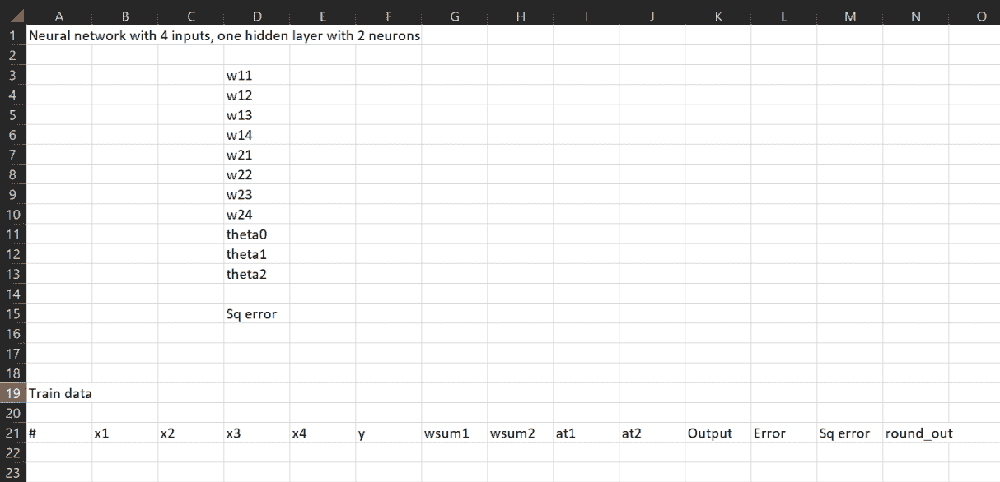

如果我们构建一个具有四个输入（输入数据中的四个特征）和一个包含两个神经元的隐藏层的艺术神经网络，我们需要八个权重参数：`w[11]`、`w[12]`、`w[13]` 和 `w[14]` 用于隐藏神经元一，以及 `w[2][1]`、`w[21]`、`w[23]` 和 `w[24]` 用于隐藏神经元二。其余参数将在稍后解释。

1.  从名为 `transfusion` 的电子表格中复制前 500 行数据（不包括标题）。

1.  在 `training1` 工作表中点击 B22 单元格。

1.  粘贴复制的单元格。

1.  你现在有一个包含输入值、称为 x[1]、x[2]、x[3]、[和] x[4]，以及输出二进制值 y 的表格。表格中的 *#* 列仅显示行号。

隐藏神经元 *j* 的组合函数是输入的加权和，如下公式所示：

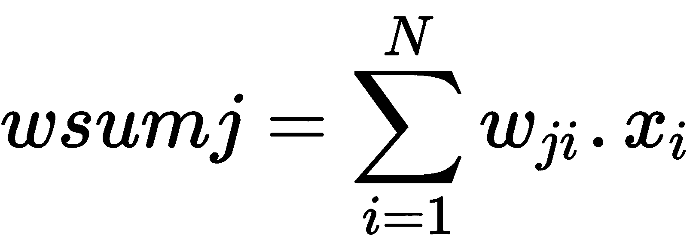

在我们的例子中，*N=4*，这给我们带来了以下两个表达式：

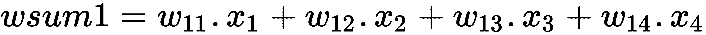

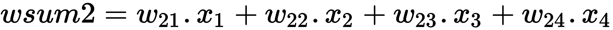

1.  考虑到这些表达式，在 G22 单元格中写下以下公式：

*=$E$3*B22+$E$4*C22+$E$5*D22+$E$6*E22*

在 H22 单元格中写下以下内容：

*=$E$7*B22+$E$8*C22+$E$9*D22+$E$10*E22*

1.  将这些表达式复制到 G 列和 H 列的其余单元格中。最简单且最常用的激活函数是以下 Sigmoid 函数：

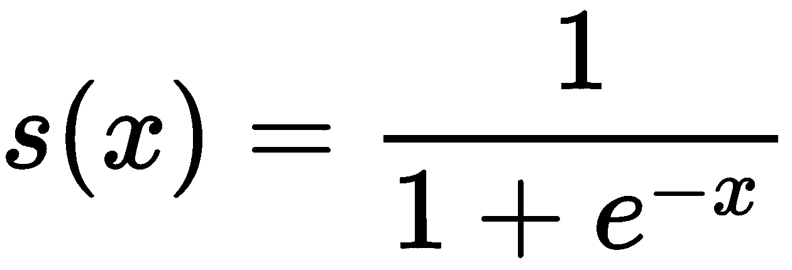

在我们的例子中，x 是针对每个隐藏神经元和每个用于训练的条目计算的组合函数：

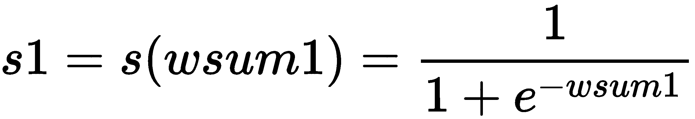

1.  定义 I22 单元格为 *=1/(1+EXP(-G22))*，并将 J22 单元格定义为 *=1/(1+EXP(-H22)).*

1.  将这些公式复制到 I 列和 J 列的其余行中。最后的计算是神经网络输出，它是隐藏神经元输出的加权和，加上一个作为阈值的常数；如果总输入小于此值，输出为零且网络不激活。这可以用以下公式表示：

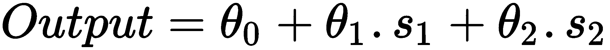

1.  然后，你可以在 K22 单元格中写下以下内容：

*=$E$11+$E$12*I22+$E$13*J22*

1.  将公式复制到 K 列的其余单元格。由于 *E11*、*E12* 和 *E13* 分别是我们为 theta 1、theta 2 和 theta 3 保存的单元格。我们在计算中使用了所有定义的权重和参数，但它们没有值。训练神经网络意味着找到这些参数的值，使得输出尽可能接近目标值，例如，对于 *x[1]*、*x**[2]*、*x[3]* 和 *x[4]* 的每一种组合，*Output* 的值与 *y* 的值之间的差异应该是可能的最小值。我们需要计算三个值：输出误差（Output-y）、平方误差（Error²）和平方误差的总和，这是需要最小化的值。

我们要最小化的函数，即平方误差的总和，只是可能损失函数之一。还有其他函数用于比较神经网络输出与训练值。在更高级的机器学习书籍中可以看到何时应用每个函数。

1.  将单元格 L22 定义为 *=K22-F22.*

1.  将公式复制到 L 列的其余行。

1.  将单元格 M22 定义为 *=L22²*。

1.  将公式复制到 M 列的其余行。

1.  将单元格 E15 定义为 *=SUM(M22:M521)*。这是平方误差的总和。

我们现在可以使用 Excel 的“求解器”设置 w[11]、w[12]、w[13]、w[14]、w[2][1]、w[21]、w[23]、w[24]、θ[o]、θ[1] 和 θ[2] 的值，同时最小化平方误差的总和：

1.  导航到“数据”。

1.  点击“求解”。

1.  填写以下截图所示的详细信息：

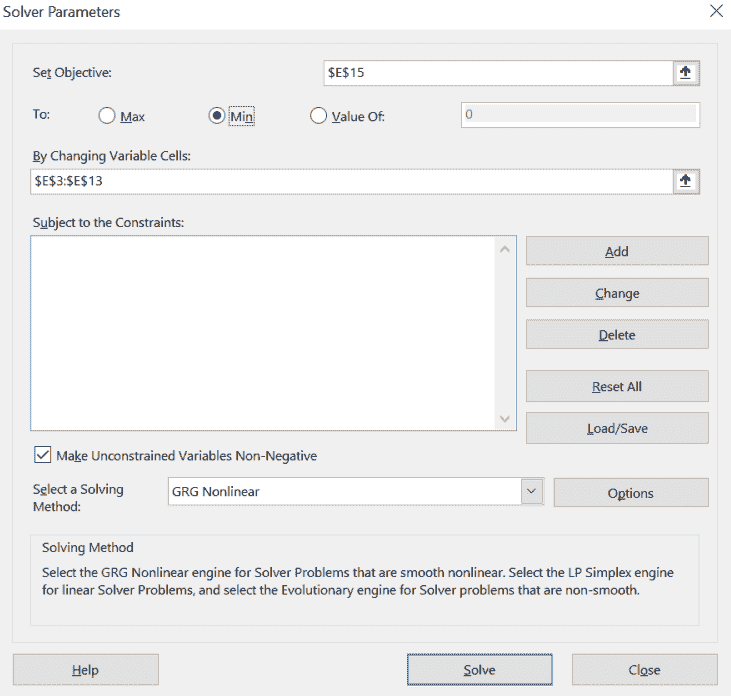

目标是 E15，其中我们存储平方误差的总和，以及变量单元格 E3 到 E13。

1.  点击“求解”。

1.  以下表格显示了最佳结果：

| **参数** | **值** |
| --- | --- |
| w11 | -3.915205816 |
| w12 | 0.055009315 |
| w13 | 0.016855755 |
| w14 | -0.301397506 |
| w21 | -0.016701972 |
| w22 | 0.451221978 |
| w23 | -0.001645853 |
| w24 | -0.011395209 |
| theta0 | -0.349977457 |
| theta1 | 0.247932886 |
| theta2 | 1.256803829 |
| **平方误差** | **77.02669809** |

结果可能因求解器中使用的回归类型和初始值而异。梯度下降算法搜索（在 *理解反向传播算法* 部分中解释）可能会陷入一个局部最小值，其值大于全局最小值。

1.  将单元格 N22 定义为 *=round(K22)* 以将神经网络的输出转换为二进制值。

1.  比较预测值和线性值，你可以构建混淆矩阵：

|  |  | 实际值 |  |
| --- | --- | --- | --- |
|  |  | 1 | 0 |
| 预测值 | 1 | 32 | 22 |
|  | 0 | 86 | 360 |

使用混淆矩阵来衡量神经网络训练的准确性。

# 测试神经网络

一旦你对训练结果满意，你可以使用获得的参数值来**预测**剩余数据的 y 值（这些数据在训练中从未使用过，然后可以用来测试网络输出）。

按照以下步骤使用测试数据集预测目标变量：

1.  复制名为 `training1` 的工作表。将新工作表命名为 `test1`。

1.  删除 B22:F521 的单元格范围。

1.  将名为 `transfusion` 的工作表中的最后 248 行复制到新的工作表中，从 B22 单元格开始。

1.  所有计算都应该正常工作，你应该能够看到使用测试数据作为输入的结果。

我们现在开发了一个简单的练习，展示了人工神经网络如何从输入数据中学习。我们进行的计算是**反向传播**算法的基础，该算法在本章的最后部分进行了详细解释。

# 构建深度网络

我们的简单人工神经网络示例非常简单，只包含一个隐藏层。我们能否添加更多层？当然可以！复杂性的下一步可能类似于以下图示：

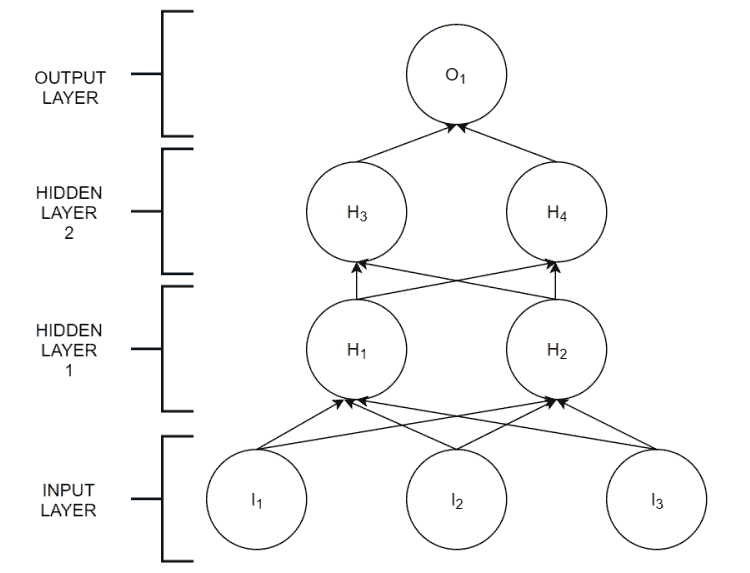

我们添加了一个包含两个神经元的新的隐藏层，但我们也可以添加更多层，每层更多的神经元。网络的架构取决于我们赋予它的特定用途。多层人工神经网络通常被称为**深度神经网络**。

深度网络的输出计算类似于单层网络，考虑了每个神经元的所有输入、激活函数以及所有输入到输出神经元的加和。从先前的图中可以看出，网络中的每一层都受到前一层的影响。通常情况下，为了解决复杂问题，每一层都会学习一组特定的特征。例如，在识别图像时，第一层可能训练颜色，第二层训练形状，第三层训练物体，等等，随着我们向输出方向前进，复杂性逐渐增加。

随着我们在网络中添加更多的神经元，我们需要调整的参数也更多。在实践中如何做到这一点将在以下部分中变得清晰，其中将描述反向传播算法。

# 理解反向传播算法

深度神经网络训练过程中有两个阶段：前向传播和反向传播。我们已经详细了解了前向传播阶段：

1.  计算输入的加权总和：

1.  将激活函数应用于结果：

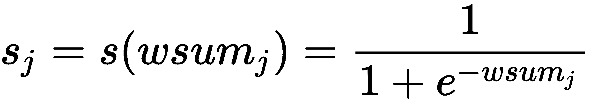

在章节末尾的建议阅读材料中找到不同的激活函数。Sigmoid 函数是最常见的，且易于使用，但并非唯一的选择。

1.  通过将最后一层的所有结果（N 个神经元）相加来计算输出：

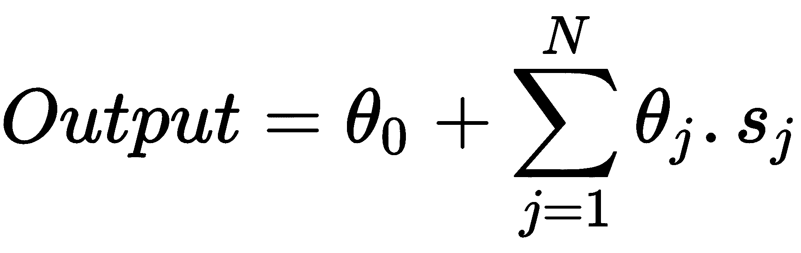

在前向传播阶段之后，我们计算误差为输出和已知目标值之间的差异：*误差 = (输出-y)²*。

所有权重在正向传播阶段开始时都分配了随机值。

输出以及因此产生的误差是权重 *w[i]* 和 *θ[i]* 的函数。这意味着我们可以从误差出发，查看每个权重的微小变化如何影响结果。这在数学上表示为导数或梯度：

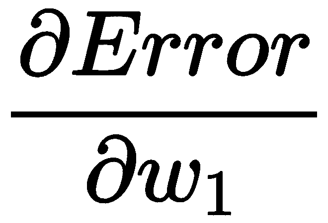

这个方程衡量了每次我们通过微小地改变 w[1] 而产生的误差变化。实际上，我们在每个神经元内部应用一个激活函数，因此误差的变化转化为以下方程（称为链式法则）：

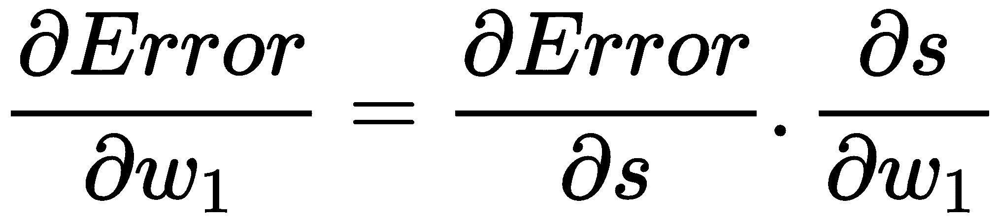

我们希望改变所有权重值的方向，以减少误差。这就是为什么优化方法被称为**梯度下降**。如果我们想象误差是两个权重（当然，实际上不止两个，但我们人类很难想象超过三维的情况！）的函数，我们可以这样想象这个优化：

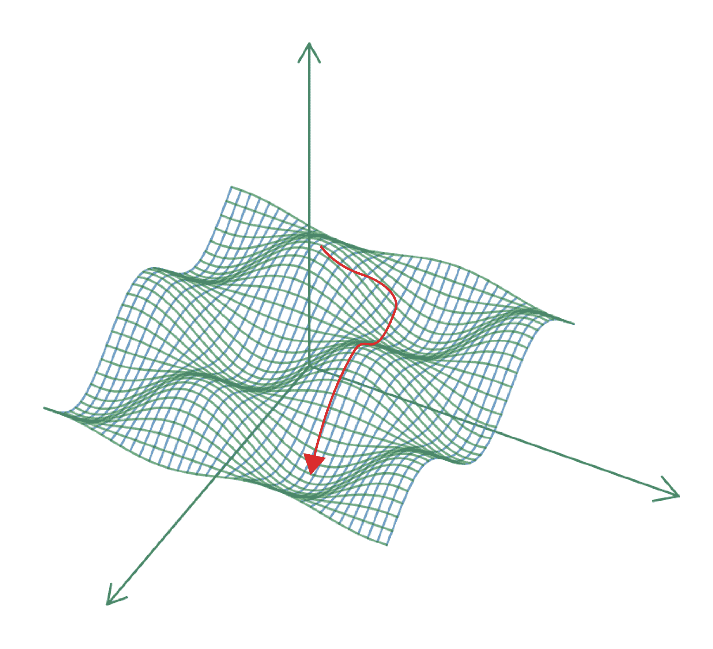

权重何时进行调整？有三种方法：

+   **在线**: 每次新的训练样本，所有权重都会重新计算。这非常耗时，如果数据集有太多异常值，可能会导致问题。

+   **批量**: 对整个训练数据集计算权重，计算累积误差并用来纠正它们。

+   **随机**: 使用批量模式，取训练数据的小样本。这加快了整个过程，并使方法对局部最优值更加稳健。

我们现在熟悉了人工神经网络是如何构建的以及它们的输出是如何计算的。随着网络规模的增大，通常不切实际进行这些计算，这在所有实际和有用的实现中经常发生。

# 摘要

我们已经研究了人工神经网络构建的基本原理以及它们如何从输入数据中学习。即使实际使用神经网络的方法与我们的示例不同，我们的方法对于理解细节和超越神经网络是神秘的黑盒子、神奇地解决问题的想法是有用的。

在下一章中，我们将看到如何使用 Azure 中可用的预构建机器学习模型，将它们连接到 Excel 来解决我们迄今为止提出的问题。

# 问题

1.  使用感知器测试的结果，构建混淆矩阵并评估预测的质量。

1.  在我们用人工神经网络解决的二分类问题中，遗漏了一个重要的步骤，如果我们实现它可能会改善结果。我们遗漏了什么？提示：构建一个表示 2007 年 3 月是否有献血行为的二进制变量的直方图。

# 进一步阅读

+   *《神经网络简明介绍》* by David Kriesel*，可在[`www.dkriesel.com/_media/science/neuronalenetze-en-zeta2-1col-dkrieselcom.pdf`](http://www.dkriesel.com/_media/science/neuronalenetze-en-zeta2-1col-dkrieselcom.pdf)在线获取

+   *《神经网络与深度学习》* by Michael A. Nielsen*，可在[`neuralnetworksanddeeplearning.com/`](http://neuralnetworksanddeeplearning.com/)在线获取

+   *《深度学习：利用算法让机器思考》*，[`opensourceforu.com/2017/12/deep-learning-using-algorithms-to-make-machines-think/`](https://opensourceforu.com/2017/12/deep-learning-using-algorithms-to-make-machines-think/)
