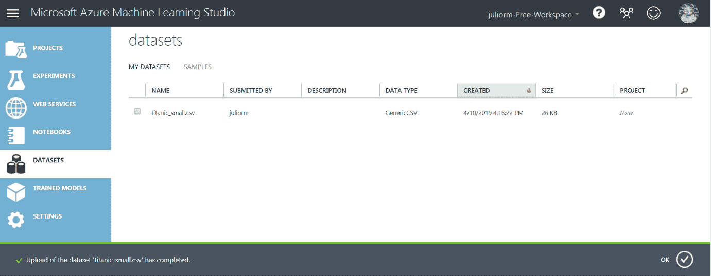

# 第十章：Azure 和 Excel - 云端机器学习

当今的明显趋势是将所有分析、存储和可视化活动迁移到云端。在本章中，您将找到有关如何使用 Azure 服务和免费订阅以测试它们的信息。深度学习似乎是实现通用人工智能的途径，即能够像人类一样思考的机器。我们甚至还没有接近那个阶段，但人工神经网络被用于计算机视觉、文本和语音分析以及许多其他高级应用。Azure 中内置了许多人工智能用例，可以通过构建实验来使用，本章将详细说明。

本章将涵盖以下主题：

+   介绍 Azure 云

+   使用 Azure 机器学习工作室免费 - 步骤指南

+   将您的数据加载到 Azure 机器学习工作室

+   在 Azure 机器学习工作室中创建和运行实验

# 技术要求

要完成本章，您需要一个 Microsoft 账户。如果您没有，您可以在[`signup.live.com/`](https://signup.live.com/)免费获取一个。

您还需要从 GitHub 仓库[`github.com/PacktPublishing/Hands-On-Machine-Learning-with-Microsoft-Excel-2019/tree/master/Chapter10`](https://github.com/PacktPublishing/Hands-On-Machine-Learning-with-Microsoft-Excel-2019/tree/master/Chapter10)下载`titanic_small.csv`文件。

# 介绍 Azure 云

云计算是计算机系统资源（尤其是数据存储和计算能力）的按需可用性，用户无需直接主动管理。该术语通常用于描述通过互联网向许多用户开放的数据中心。以下是使用云而不是本地计算机的一些优点：

+   **成本**: 与购买和维护昂贵的硬件和软件相比，云模式仅按使用量付费。

+   **速度**: 通常只需在网站上配置一些设置，就可以在几分钟内获得大量资源。

+   **全球规模**: 资源的大小和位置可以根据用户需求动态更改。

+   **生产力**: IT 人员可以节省时间，专注于有助于业务增长的任务，而不是进行本地设备的实际维护。

+   **性能**: 云服务器经常升级，提供最新的可用技术。

+   **安全**: 尽管将敏感数据存储和传输到云端的担忧很常见，但大多数提供商都有足够的政策来保护用户数据。

在撰写本书时，最重要的云提供商是 AWS、MS-Azure 和 GCP。我们将重点关注 Azure，并描述一些与使用机器学习进行数据分析相关的服务。

就像所有云服务提供商一样，微软将所有类型的服务都包含在 Azure 中。我们的兴趣将主要在于**Azure 机器学习工作室**（**AMLS**），它旨在轻松创建和测试机器学习项目和实验。

# 使用 AMLS 免费版 – 步骤指南

微软 AMLS 是一个提供拖放界面的工具，用于构建、测试和部署机器学习模型和分析解决方案。可以将模型发布为 Web 服务，以便从 Excel（以及其他工具）中消费。

我们将首先在 AMLS 主页上注册，使用您的微软账户：

1.  打开[`studio.azureml.net/`](https://studio.azureml.net/)。您将看到以下首页：

1.  点击此处注册并进入下一页：

1.  选择第二个选项（即免费工作区），这要求您拥有微软账户。优点是此选项免费，并且您可以无限制地使用它。一旦您点击免费工作区选项，您将被带到以下登录界面：

1.  输入您创建微软账户时选择的用户名并点击下一步。然后您将看到密码输入界面：

1.  输入您的微软账户密码并点击登录。

1.  您将被带到 AMLS 主页：

现在您已准备好开始，我们将介绍如何将您的数据集加载到 ALMS 中。

# 将您的数据加载到 AMLS 中

没有数据就没有机器学习项目，因此我们分析的第一步是将输入文件（`titanic_small.csv`）加载到 AMLS 中。这是泰坦尼克数据集的简化版本，包含三个特征和一个目标变量：

+   特征：

    +   **乘客等级**：乘客所乘坐的等级（值 1、2 或 3 分别对应头等舱、二等舱和三等舱）

    +   **性别**：乘客的性别（女性或男性）

    +   **年龄组**：婴儿、儿童、青少年、成人、老年或未知

+   目标变量：

    +   **幸存**：如果乘客在船难中幸存，则为 1，如果没有，则为 0。

要加载文件，请按照以下步骤操作：

1.  从主页点击 DATASETS。您将看到一个空的数据集列表：

1.  点击+NEW 获取上传本地数据文件的链接：

1.  点击从本地文件，您将看到以下对话框：

1.  点击选择文件，并在您的计算机中导航到输入文件（`titanic_small.csv`）的位置。

1.  在相应字段中输入您想要的数据集名称。

1.  选择文件类型，在本例中为带有标题的通用 CSV 文件 (.csv)。

1.  可选地，描述数据集的内容以供将来参考。

1.  点击确定。

1.  您将在列表中看到您最近上传的数据集：

你现在拥有开始构建你的第一个 AMLS 实验所需的一切。我们将在下一节中一起完成。

# 在 AMLS 中创建和运行实验

AMLS 的基本组件是实验。它们是通过将预定义的模块拖放到工作区中构建的。每个模块都有一些定义的任务，一些在运行时可以选择的参数数量，以及定义的输入和输出节点数量。以下是 AMLS 模块的截图：

它们可以连接起来构建分析工作流程，从数据输入和转换到机器学习模型训练和结果。我们将逐步进行，创建一个机器学习实验，训练一个决策树来预测泰坦尼克号乘客的生存情况。

# 创建新实验

按以下步骤创建新环境：

1.  从主页选择“实验”。你会看到一个空的实验列表：

1.  点击+NEW 创建一个新的实验。你会看到可以从 Azure 目录加载的可用实验列表：

1.  点击“空白实验”创建一个空的。以下截图显示了在添加模块之前实验的外观：

左边是模块目录，按功能分组。中间（灰色）区域是工作区，我们将在这里放置模块，右边显示了实验的摘要。在工作区的左上角，你可以看到实验名称。你可以点击它并编辑文本。在我们的例子中，文本被编辑以显示“泰坦尼克号 - 模型训练”。

一旦你熟悉了 AMLS，就可以探索目录中的实验。它们是 AMLS 能提供的能力和你可以用它解决的问题类型的良好示例。

这个第一个实验将仅使用输入数据来训练决策树，并使其准备好在另一个实验中使用，该实验将预测乘客的生存情况。我们将实验分为两部分，因为我们只想训练一次树，然后用于预测。我们将在下一节中逐步展示如何训练决策树模型。

# 训练决策树模型

1.  在模块目录中，转到“已保存数据集 | 我的数据集”，将“titanic_small.csv”拖放到包含我们的输入数据的工作区右侧模块中。它包含从文件中读取的数据。在放置数据模块后，你应该看到类似于以下截图的内容：

在工作区上放置模块后点击它，将在屏幕的右侧显示有关它的信息。

1.  拖放另外两个模块，它们代表我们将要训练的决策树和一个通用训练模块。第一个位于“机器学习 | 初始化模型 | 分类 | 双类增强决策树”。第二个位于“机器学习 | 训练 | 训练模型”。

1.  一旦所有模块都拖放到工作区中，您需要将它们连接起来以构建数据流。要连接两个模块，请执行以下操作：

    1.  点击第一个模块的输出节点。

    1.  按住鼠标按钮，将指针移动到第二个模块的输入节点。

    1.  释放鼠标按钮。您应该看到连接两个模块的曲线线。

1.  最终连接的模块应类似于以下截图：

您需要在标记为“训练模型”的模块中选择目标变量。为此，请执行以下步骤：

1.  点击模块。

1.  点击右侧面板上的“启动列选择器”。

1.  在弹出的窗口中，点击“按名称”。

1.  从可用的列列表中，点击“survived”。

1.  点击右箭头（>）。这将把“survived”变量移动到右边。您应该看到类似于以下截图的内容：

1.  在底部菜单中，点击“运行”：

1.  等待运行完成。应该只需几分钟您就会看到所有模块上出现绿色的波浪线。

您可以可视化您训练的模型。在这种情况下，默认情况下训练 100 个决策树。要详细了解它们，请按照以下步骤操作：

1.  右键单击“训练模型”模块。

1.  导航到“训练模型 | 可视化”：

1.  选择左侧以缩略图形式显示的任何树，以查看详细信息。您可以看到在每个节点上如何做出决策，并跟随分支值到目标变量的最终值。以下截图说明了这一点：

1.  点击标记为“双类增强决策树”的模块，将在右侧面板上显示一系列模型参数。这些参数会影响决策树的训练。您可以更改这些参数并再次运行实验：

1.  通过在底部菜单中点击“保存”来保存实验。

最后，我们将保存模型以供将来使用，无论何时我们想要预测给定乘客的生存机会。为此，请按照以下步骤操作：

1.  右键单击“训练模型”模块。

1.  导航到“训练模型 |另存为训练模型”：

现在，模型已使用输入数据集训练完毕，并准备好在新实验中使用。我们将在下一个子节中构建这样一个实验，并展示如何从 Excel 工作簿中使用它。

# 使用模型从 Excel 进行预测

现在我们将使用训练好的决策树创建一个 Web 服务。Web 服务用于允许不同应用程序和不同源之间的通信，不依赖于操作系统或特定的编程语言。然后我们将使用 Excel 与这个 Web 服务通信，向它发送输入数据，并接收带有预测生存值的输出数据。

如果你仔细遵循了创建实验的说明，你现在应该能够自己完成，以下是一些一般性的指导：

1.  创建一个新的实验，并将其命名为“Titanic - Web 服务”。

1.  将五个模块拖放到工作区：

    +   已保存的数据集 | 我的数据集 | `titanic_small.csv`：我们加载并用于训练决策树的数据集。

    +   训练好的模型 | Titanic 模型 - 已训练：我们为将来使用而保存的训练好的模型。

    +   机器学习 | 分数 | 分数模型：将根据模型训练预测目标变量。

    +   Web 服务 | Web 服务输入和 Web 服务输出：这将处理从 Excel 到 Web 服务的通信。

1.  将模块连接起来，使实验看起来像以下截图：

1.  保存实验并运行它。

输入数据实际上并没有在实验中使用，因为预测的数据最终将来自使用 Web 服务的应用程序。尽管如此，输入数据模块需要包含作为数据格式（变量名称和总列数）的参考。

1.  一旦运行成功，点击底部菜单中的“部署 Web 服务”。你将被带到以下屏幕：

Web 服务现在已创建，AMLS 让你可以下载一个已经连接到它的 Excel 文件。

1.  从屏幕最后一行的链接（批量执行，Excel 2013 或更高版本工作簿）下载文件。

1.  在你的电脑上打开 Excel 文件。你应该在工作簿右侧看到一个菜单：

这意味着文件已经连接到了我们创建的 Web 服务。

1.  点击“Titanic – Web 服务”。你将看到右侧的数据输入菜单：

1.  点击“使用示例数据”以获取几行数据用于预测。你现在有一个类似于以下表格的表格：

1.  在输入对话框中，写下*A1:D6*。

1.  在输出对话框中，写下你想要输出数据开始的单元格坐标。在这个例子中，我们使用了*G1*：

1.  点击“预测”。原始表格加上预测值将出现在工作表中：

由于“存活”列中的数据是目标变量，因此它不会被用于预测。它必须存在，以符合训练数据格式。

注意，在“评分标签”列中，五个预测值中有四个与用于训练的值一致。预测永远不会完美，这就是为什么精细调整模型参数和仔细研究预测误差如此重要的原因。

现在，你已经知道如何在 AMLS 中构建实验并与它从 Excel 中通信，发送和接收数据。所以，当你听到“云计算”这个词时，你就知道它是关于什么的。

# 摘要

我们已经完成了在 AMLS 中开设账户的所有必要步骤，AMLS 是微软 Azure 云的一部分，帮助我们构建简单的数据和数据分析流程。我们还构建了两个实验：其中一个训练决策树，另一个预测目标变量。然后我们学习了如何创建网络服务并将 Excel 连接到它，发送和接收数据。

在下一章中，我们将展示机器学习的当前状态，它几乎完全将操作转移到云端，使数据流完全自动化，并使用自动化来精细调整预测模型。

# 问题

1.  使用云计算的主要优势是什么？

1.  云计算只对机器学习有用吗？

1.  什么是网络服务，为什么它有用？

1.  如果模型已经训练好，为什么我们还需要在用于预测的分析流程中包含输入数据模型？

1.  为什么我们要将训练和预测分成两个不同的流程？

# 进一步阅读

查看以下资源，了解更多关于本章涵盖主题的信息：

+   *理解云计算的基本知识*：[`www.lucidchart.com/blog/cloud-computing-basics`](https://www.lucidchart.com/blog/cloud-computing-basics)

+   *Azure Machine Learning Studio 文档*：[`docs.microsoft.com/en-us/azure/machine-learning/studio/`](https://docs.microsoft.com/en-us/azure/machine-learning/studio/)

+   *简单易懂的决策树解释*：[`medium.com/@chiragsehra42/decision-trees-explained-easily-28f23241248`](https://medium.com/@chiragsehra42/decision-trees-explained-easily-28f23241248)
