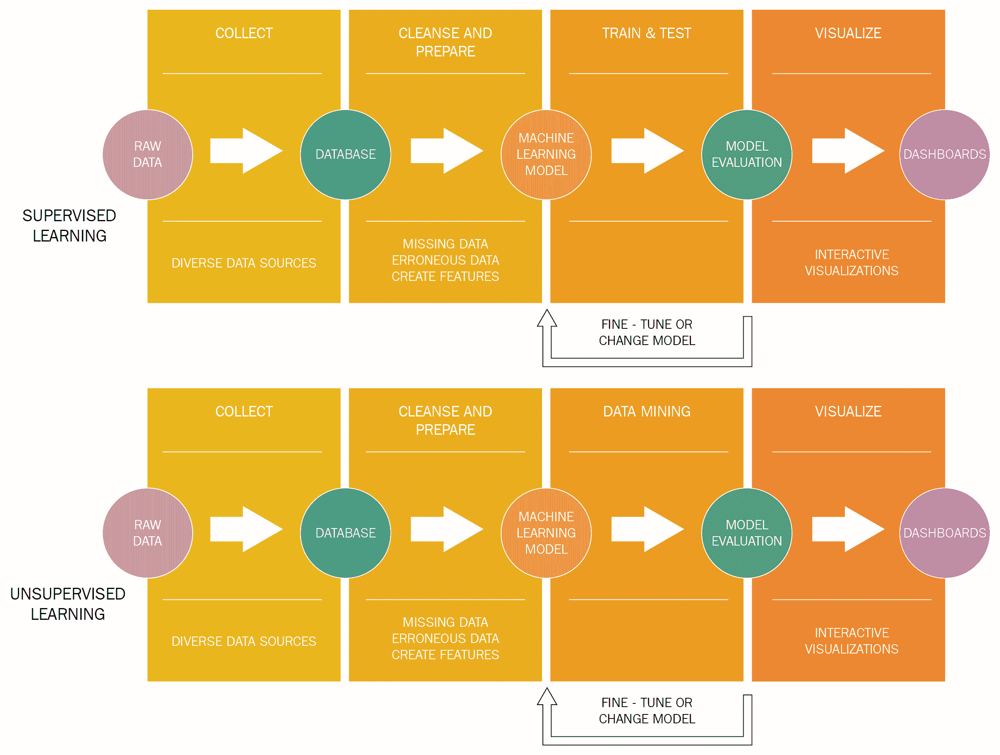
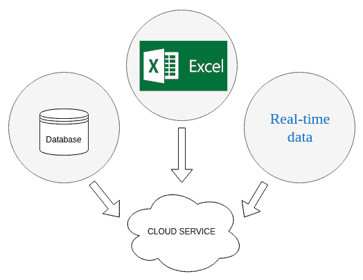
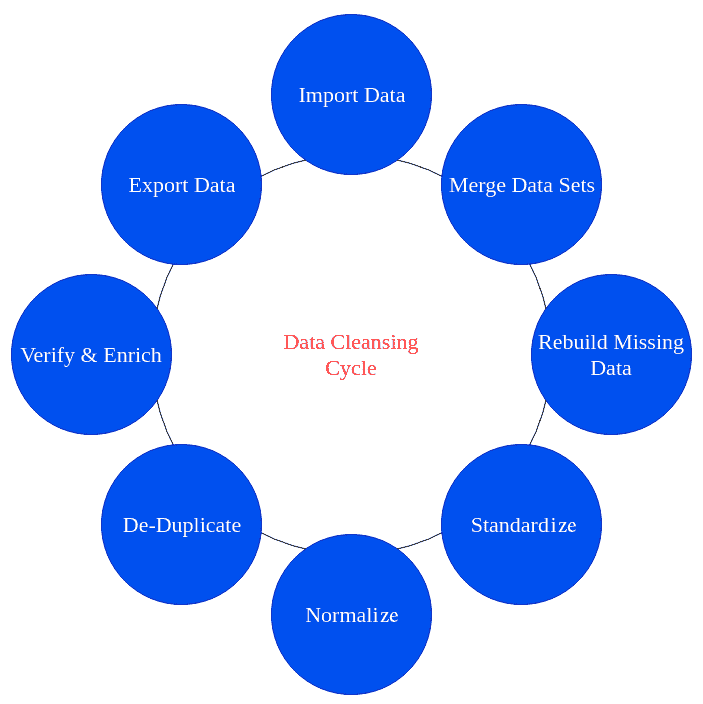
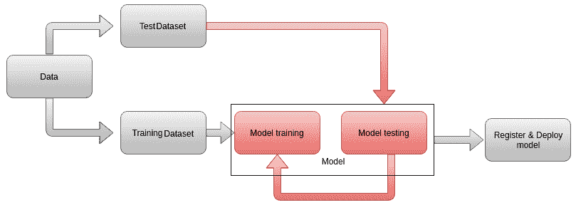
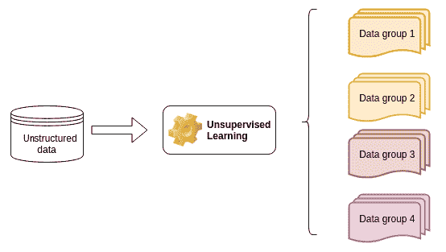
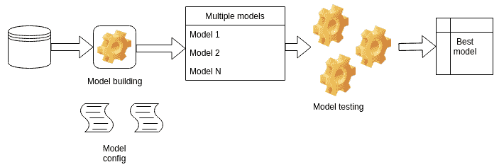

# 第十一章：机器学习的未来

将数据分析迁移到云只是过去几年中机器学习项目变化的一部分。由于将自动化、**人工智能**（**AI**）和机器学习添加到许多不同的业务运营部分的好处现在已清晰，并且不需要进一步的证明，因此公司现在专注于更持久的解决方案。事实上，自然的后续步骤是考虑可以完成整个数据周期（从数据收集到可视化）的成品。

有许多创建数据分析流程的方法，这些流程可以在数据创建时消费数据，并在应用机器学习模型后返回结果和可视化。云服务使这项任务变得更加容易和高效。

自动机器学习是数据分析领域的当前趋势，其中可以在同一数据集上自动测试多个机器学习模型。模型参数被优化，直到找到最佳模型。这允许“公民数据科学家”这一概念的出现，这是一个利用大数据工具和技术分析数据并为公司创建数据和商业模型的角色。公民数据科学家不一定是数据科学或商业智能专家。这个角色被赋予那些能够使用大数据工具和技术创建数据模型的组织员工。

本章将涵盖以下主题：

+   自动数据分析流程

+   机器学习模型的再训练

+   自动机器学习

+   我们可以期待未来什么？

# 自动数据分析流程

在本书撰写几年之前，企业在接触机器学习时心中想着的是“让我们看看这东西能做什么……”。现在情况已不再如此。使用分析、机器学习模型、人工智能和高级可视化来理解、简化并预测许多不同情况的价值是显而易见的。这种价值可以用节省的钱、时间和努力来衡量，这有助于做出更好、更快的商业决策。

作为总结本书所学内容，我们可以列出数据分析流程的不同部分：

+   数据收集，通常来自多个不同的来源

+   数据清洗和准备，包括探索性可视化

+   选择适合我们数据的机器学习模型

+   使用历史数据训练模型（如果我们谈论监督学习）

+   挖掘数据中的隐藏或未知模式（如果我们谈论无监督学习）

+   测试模型预测的准确性

+   如果结果不满意，微调模型参数或更改模型

+   可视化结果

+   定期使用新数据重新训练模型

以下图示说明了这些步骤：

在以下小节中，我们将详细讨论每个步骤是如何自动化的。

# 数据收集

一旦确定了不同的数据源（本地文件和数据库），数据就可以定期上传到云存储服务。这通常是通过定期运行的过程自动完成的，需要最小程度的人工干预。主要云服务提供商提供了许多不同的存储选项。

这个概念在以下图中得到了说明：

下一步是为将数据输入模型做准备，即数据准备。

# 数据准备

完整的数据周期在以下图中展示：

在将数据导入云服务后，数据周期步骤如下：

1.  将数据集合并到一个单一表或一组连接的表中。这可能需要一些数据处理以将其转换为合适的格式。

1.  重建缺失数据，通过替换缺失值或决定丢弃不完整的条目。

1.  标准化数据的度量单位、小数精度和其他特征。

1.  标准化数据，特别是如果机器学习模型需要这样做的话。

1.  去重，即删除冗余条目。

1.  使用预定义的标准验证数据质量，并通过添加计算来丰富数据。

1.  将数据导出到下一个分析阶段，通常是机器学习模型。

所有云服务提供商都提供内置或第三方数据准备解决方案。一些替代方案包括 Amazon QuickSight、Azure 机器学习数据准备 SDK、Google Cloud 中的 Cloud Dataprep 以及许多其他选项。

# 模型训练

监督机器学习模型的训练周期可以总结如下：

准备好的数据被分为训练集和测试集。测试结果提供反馈以修改模型超参数和模型类型，并给出关于获得良好准确率所需数据量的提示。

最后一步是将模型部署以使其可用（例如，作为 Web 服务），同时也注册了特定训练运行的所有特征。模型的类型、所有超参数，甚至使用的数据都应作为元数据保存。

在云中提供了许多预构建的模型可供使用，以及注册和管理不同模型的方法。

# 无监督学习

每当我们不确定数据中会发现什么，或者需要处理大量无法手动管理的条目时，我们使用无监督机器学习。一个通用图示可能如下所示：

经过模型处理后，数据被排序并显示出可能对做出明智决策有用的模式。我们可以应用云中可用的所有模型，然后选择更适合我们知识和理解需求的模型。

# 可视化

数据流中的最后一步是**可视化**。在向非技术受众展示我们的结果时，强调我们分析的好处对于展示我们工作的价值至关重要。交互式仪表板是通常的做法，使用诸如**Tableau**、**Power BI**或**QlikView**等高级工具。一些示例可以在以下 URL 找到：[`www.clearpointstrategy.com/executive-dashboard-examples/`](https://www.clearpointstrategy.com/executive-dashboard-examples/)。

每个仪表板工具都可以在线使用或连接到云端以展示分析结果。

# 机器学习模型的再训练

由于新数据始终可用且业务条件不断变化，机器学习模型需要定期再训练。云服务提供了一种最小干预的方法来做这件事，无需重建数据流中的任何部分。您只需加载新数据并指定您不是在构建一个新模型，而是在再训练一个现有模型。完成后，模型将像往常一样可供使用。

在本节中，我们展示了一个可以完全托管在云中的完整数据分析流程。本节也作为本书内容的详细总结很有用。下一节概述了机器学习的真正未来，届时编码和手动工作将减少到绝对最小。

# 自动化机器学习

在将机器学习应用于解决特定业务问题时，有几个任务对于模型的成功至关重要，例如：

+   数据预处理

+   特征工程

+   模型选择

+   模型超参数优化

+   模型结果的分析

这些任务通常由该领域的专家或多或少手动完成。近年来，对*民主化*机器学习的兴趣日益增长，允许非专家（有时被称为*公民* *数据* *科学家*）使用、改进并将机器学习应用于具体问题。**自动化机器学习**（**AutoML**）针对这一特定需求。

通常，新模型的构建过程可以描述如下图所示：

以下是构建新模型的过程：

+   输入数据经过预处理并用于构建最佳模型特征

+   根据用户完成的一些配置，构建并测试一组给定的模型

+   模型根据某些标准进行评估和测试

在开发、微调和评估模型的过程中，大部分工作都是自动完成的。结果是，根据输入数据和用户给出的条件，得到的是最佳可能的模型。

亚马逊、谷歌和微软都拥有 AutoML 功能，无论是使用专有代码还是外部包。存在其他解决方案，例如**TPOT**和**H2O.ai**。

机器学习的未来已经到来。无需编写代码，只需对工具集有最少了解，任何人都可以构建完整的数据分析流程。这既是优势也是风险：熟练的分析师可以更快地测试不同的选项并优化他们的工作；不熟练的人可能会使用如黑盒等解决方案，而不完全了解它们的工作原理，可能误解结果并做出错误决策。最终的责任属于任何商业工具的有兴趣的用户。

# 摘要

书的最后一章既被视为所有章节的总结，也视为一个窗口，展示了在 Excel 之外和未来的可能性。自动数据流和机器学习模型生成简化了分析师的工作并加快了决策过程。

希望你现在对机器学习有了广泛的了解，如何将其应用于每个业务线，以及这本书阅读之前所知的最高级替代方案。

# 问题

1.  监督学习和无监督学习在分析流程的哪个部分是不同的？

1.  为什么数据清洗是一个持续的过程？

1.  简要解释模型超参数是什么。

1.  哪些步骤可以通过 AutoML 自动执行？

# 进一步阅读

+   *Azure 机器学习服务文档*: [`docs.microsoft.com/en-us/azure/machine-learning/service/`](https://docs.microsoft.com/en-us/azure/machine-learning/service/)

+   *AWS 上的机器学习*: [`aws.amazon.com/machine-learning/`](https://aws.amazon.com/machine-learning/)

+   *人工智能和机器学习产品*: [`cloud.google.com/products/ai/`](https://cloud.google.com/products/ai/)

+   *宣布 Azure 机器学习中的自动机器学习功能*: [`azure.microsoft.com/en-us/blog/announcing-automated-ml-capability-in-azure-machine-learning/`](https://azure.microsoft.com/en-us/blog/announcing-automated-ml-capability-in-azure-machine-learning/)

+   *H2O.ai*: [`www.h2o.ai/`](https://www.h2o.ai/)

+   *Cloud AutoMLB*: [`cloud.google.com/automl/`](https://cloud.google.com/automl/)

+   *AUTOML*: [`www.ml4aad.org/automl/`](http://www.ml4aad.org/automl/)
