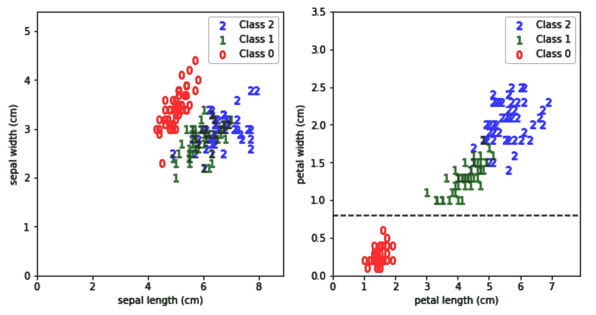

# 第二章：使用树做决策

在这一章，我们将从查看我们的第一个监督学习算法——决策树开始。决策树算法多功能且易于理解。它被广泛使用，并且是我们在本书后续将遇到的许多高级算法的构建模块。在这一章中，我们将学习如何训练一个决策树，并将其应用于分类或回归问题。我们还将了解它的学习过程的细节，以便知道如何设置不同的超参数。此外，我们将使用一个现实世界的数据集，将我们在这里学到的内容付诸实践。我们将首先获取并准备数据，并将我们的算法应用于数据。在此过程中，我们还将尝试理解一些关键的机器学习概念，如交叉验证和模型评估指标。在本章结束时，你将对以下主题有非常好的理解：

+   理解决策树

+   决策树是如何学习的？

+   获取更可靠的分数

+   调整超参数以提高准确性

+   可视化树的决策边界

+   构建决策树回归器

# 理解决策树

我选择从决策树开始这本书，因为我注意到大多数新手机器学习从业者在两个领域中有之前的经验——软件开发或统计与数学。决策树在概念上可以类似于软件开发人员习惯的一些概念，例如嵌套的`if-else`条件和二叉搜索树。至于统计学家，忍耐一下——很快，当我们进入线性模型这一章时，你们会感到非常熟悉。

## 什么是决策树？

我认为解释决策树是什么的最佳方式是通过展示它们在训练后生成的规则。幸运的是，我们可以访问这些规则并将其打印出来。以下是决策树规则的一个例子：

```py
Shall I take an umbrella with me?
|--- Chance of Rainy <= 0.6
|    |--- UV Index <= 7.0
|    |    |--- class: False
|    |--- UV Index >  7.0
|    |    |--- class: True
|--- Chance of Rainy >  0.6
|    |--- class: True
```

正如你所看到的，这基本上是一组条件。如果降雨的概率高于`0.6`（60%），那么我需要带伞。如果低于`0.6`，那么就取决于紫外线指数。如果紫外线指数高于`7`，那么需要带伞；否则，我没有伞也没关系。现在，你可能会想 <q>好吧，几个嵌套的`if-else`条件就能解决这个问题。</q> 没错，但这里的主要区别是我并没有自己编写这些条件。算法在处理以下数据后，自动学会了这些前提条件：


当然，对于这个简单的案例，任何人都可以手动查看数据并得出相同的条件。然而，在处理更大的数据集时，我们需要编程的条件数目会随着列数和每列中的值的增多而迅速增长。在这种规模下，手动完成相同的工作是不可行的，因此需要一个可以从数据中学习条件的算法。  

另一方面，也可以将构建的树映射回嵌套的`if-else`条件。这意味着你可以使用 Python 从数据中构建一棵树，然后将底层的条件导出，以便在其他语言中实现，甚至可以将它们放入**Microsoft Excel**中。  

## Iris 分类  

scikit-learn 内置了许多数据集，我们可以用来测试新的算法。其中一个数据集是 Iris 数据集。Iris 是一种有 260 到 300 个物种的开花植物属，具有显眼的花朵。然而，在我们的数据集中，只包含三种物种——**Setosa**、**Versicolor**和**Virginica**。数据集中的每个样本都有每株植物的萼片和花瓣的长度和宽度（特征），以及它是 Setosa、Versicolor 还是 Virginica（目标）。我们的任务是根据植物的萼片和花瓣尺寸来识别其物种。显然，这是一个分类问题。由于数据中提供了目标，因此这是一个监督学习问题。此外，这是一个分类问题，因为我们有有限的预定义值（三种物种）。  

### 加载 Iris 数据集  

现在让我们开始加载数据集：  

1.  我们从 scikit-learn 导入数据集模块，然后将 Iris 数据加载到一个变量中，我们也称之为`iris`：  

```py
from sklearn import datasets
import pandas as pd
iris = datasets.load_iris()
```

1.  使用`dir`，我们可以查看数据集提供了哪些方法和属性：  

```py
dir(iris)
```

我们得到了一些方法的列表，包括`DESCR`、`data`、`feature_names`、`filename`、`target`和`target_names`。

数据创建者提供每个数据的描述是非常贴心的，我们可以通过`DESCR`访问它们。*然而，真实世界中的数据往往没有这么周到。通常，我们需要与数据的生产者进行沟通，才能理解每个值的含义，或者至少通过一些描述性统计来理解数据，然后再使用它。*  

*3.  现在，让我们打印出 Iris 数据集的描述：  

```py
print(iris.DESCR)
```

现在查看描述并尝试思考一下从中得到的一些主要结论。我稍后会列出我的结论：  

```py
.. _iris_dataset:
 Iris plants dataset
 --------------------
Data Set Characteristics:
 :Number of Instances: 150 (50 in each of three classes)
  :Number of Attributes: 4 numeric, predictive attributes and the class
   :Attribute Information:        
- sepal length in cm
- sepal width in cm
- petal length in cm
- petal width in cm
- class:
    - Iris-Setosa
    - Iris-Versicolor
    - Iris-Virginica
:Summary Statistics:
    ============== ==== ==== ======= ===== ====================
                Min  Max   Mean    SD     Class   Correlation
    ============== ==== ==== ======= ===== ====================
sepal length:   4.3  7.9   5.84   0.83    0.7826
sepal width:    2.0  4.4   3.05   0.43   -0.4194
petal length:   1.0  6.9   3.76   1.76    0.9490  (high!)
petal length:   1.0  6.9   3.76   1.76    0.9490  (high!)
petal width:    0.1  2.5   1.20   0.76    0.9565  (high!)
    ============== ==== ==== ======= ===== ====================
:Missing Attribute Values: None
:Class Distribution: 33.3% for each of 3 classes.

:Creator: R.A. Fisher
```

这个描述包含了一些有用的信息，我认为以下几点最为有趣：  

+   数据集由 150 行（或 150 个样本）组成。这是一个相当小的数据集。稍后，我们将看到如何在评估模型时处理这个事实。  

+   类别标签或目标有三个值 —— `Iris-Setosa`、`Iris-Versicolor` 和 `Iris-Virginica`。一些分类算法只能处理两个类别标签；我们称它们为二元分类器。幸运的是，决策树算法可以处理多于两个类别，所以这次我们没有问题。

+   数据是平衡的；每个类别有 50 个样本。这是我们在训练和评估模型时需要牢记的一点。

+   我们有四个特征 —— `sepal length`、`sepal width`、`petal length` 和 `petal width` —— 所有四个特征都是数值型的。在 [第三章](https://cdp.packtpub.com/hands_on_machine_learning_with_scikit_learn/wp-admin/post.php?post=26&action=edit)，*数据准备*，我们将学习如何处理非数值型数据。

+   没有缺失的属性值。换句话说，我们的样本中没有空值。在本书的后续部分，如果遇到缺失值，我们将学习如何处理它们。

+   花瓣尺寸与类别值的相关性比萼片尺寸更高。我希望我们从未看到这条信息。了解数据是有用的，但问题在于这种相关性是针对整个数据集计算的。理想情况下，我们只会为我们的训练数据计算它。无论如何，现在让我们暂时忽略这些信息，稍后再用它进行健全性检查。

1.  现在是时候将所有数据集信息放入一个 DataFrame 中了。

`feature_names` 方法返回我们特征的名称，而 `data` 方法以 NumPy 数组的形式返回它们的值。同样，`target` 变量以零、一和二的形式返回目标的值，而 `target_names` 则将 `0`、`1` 和 `2` 映射到 `Iris-Setosa`、`Iris-Versicolor` 和 `Iris-Virginica`。

NumPy 数组在处理上是高效的，但它们不允许列具有名称。我发现列名在调试过程中非常有用。在这里，我认为 `pandas` 的 DataFrame 更加合适，因为我们可以使用列名将特征和目标组合到一个 DataFrame 中。

在这里，我们可以看到使用 `iris.data[:8]` 得到的前八行数据：

```py
array([[5.1, 3.5, 1.4, 0.2], [4.9, 3\. , 1.4, 0.2], [4.7, 3.2, 1.3, 0.2], [4.6, 3.1, 1.5, 0.2], [5\. , 3.6, 1.4, 0.2], [5.4, 3.9, 1.7, 0.4], [4.6, 3.4, 1.4, 0.3], [5\. , 3.4, 1.5, 0.2]])
```

以下代码使用 `data`、`feature_names` 和 `target` 方法将所有数据集信息合并到一个 DataFrame 中，并相应地分配其列名：

```py
df = pd.DataFrame(
    iris.data,
    columns=iris.feature_names
)

df['target'] = pd.Series(
 iris.target
)
```

scikit-learn 的版本 0.23 及更高版本支持将数据集直接加载为 `pandas` 的 DataFrame。您可以在 `datasets.load_iris` 及其类似的数据加载方法中设置 `as_frame=True` 来实现这一点。然而，在写作时，这本书尚未测试过此功能，因为版本 0.22 是最稳定的版本。

1.  `target` 列现在包含类别 ID。然而，为了更清晰起见，我们还可以创建一个名为 `target_names` 的新列，将我们的数值目标值映射到类别名称：

```py
df['target_names'] = df['target'].apply(lambda y: iris.target_names[y])
```

1.  最后，让我们打印六行样本来看看我们新创建的 DataFrame 是什么样子的。在 Jupyter notebook 或 Jupyter lab 中运行以下代码将直接打印 DataFrame 的内容；否则，你需要用`print`语句将代码包裹起来。我假设在所有后续的代码示例中都使用 Jupyter notebook 环境：

```py
# print(df.sample(n=6))
df.sample(n=6)
```

这给我带来了以下随机样本：


样本方法随机选择了六行来展示。这意味着每次运行相同的代码时，你将得到一组不同的行。有时，我们需要每次运行相同的代码时得到相同的随机结果。那么，我们就使用一个具有预设种子的伪随机数生成器。一个用相同种子初始化的伪随机数生成器每次运行时都会产生相同的结果。

所以，将`random_state`参数设置为`42`，如下所示：

```py
df.sample(n=6, random_state=42) 
```

你将得到与之前展示的完全相同的行。

### 数据分割

让我们将刚刚创建的 DataFrame 分成两部分——70%的记录（即 105 条记录）应进入训练集，而 30%（45 条记录）应进入测试集。选择 70/30 的比例目前是任意的。我们将使用 scikit-learn 提供的`train_test_split()`函数，并指定`test_size`为`0.3`：

```py
from sklearn.model_selection import train_test_split
df_train, df_test = train_test_split(df, test_size=0.3)
```

我们可以使用`df_train.shape[0]`和`df_test.shape[0]`来检查新创建的 DataFrame 中有多少行。我们还可以使用`df_train.columns`和`df_test.columns`列出新 DataFrame 的列名。它们都有相同的六列：

+   `sepal length (cm)`

+   `sepal width (cm)`

+   `petal length (cm)`

+   `petal width (cm)`

+   `target`

+   `target_names`

前四列是我们的特征，而第五列是我们的目标（或标签）。第六列目前不需要。直观地说，你可以说我们将数据在垂直方向上分成了训练集和测试集。通常，将我们的 DataFrame 在水平方向上进一步分成两部分是有意义的——一部分是特征，通常我们称之为*x*，另一部分是目标，通常称之为*y*。在本书的剩余部分，我们将继续使用这种*x*和*y*的命名约定。

有些人喜欢用大写的*X*来表示二维数组（或 DataFrame），而用小写字母*y*表示一维数组（或系列）。我发现坚持使用单一大小写更为实用。

如你所知，`iris`中的`feature_names`方法包含与我们的特征相对应的列名列表。我们将使用这些信息，以及`target`标签，来创建我们的*x*和*y*集合，如下所示：

```py
x_train = df_train[iris.feature_names]
x_test = df_test[iris.feature_names]

y_train = df_train['target']
y_test = df_test['target']
```

### 训练模型并用于预测

为了更好地理解一切是如何运作的，我们现在将使用算法的默认配置进行训练。稍后在本章中，我将解释决策树算法的详细信息及如何配置它们。

我们首先需要导入`DecisionTreeClassifier`，然后创建它的实例，代码如下：

```py
from sklearn.tree import DecisionTreeClassifier

# It is common to call the classifier instance clf
clf = DecisionTreeClassifier()
```

训练的一个常用同义词是拟合。它是指算法如何利用训练数据（*x*和*y*）来学习其参数。所有的 scikit-learn 模型都实现了一个`fit()`方法，它接收`x_train`和`y_train`，`DecisionTreeClassifier`也不例外：

```py
clf.fit(x_train, y_train)
```

通过调用`fit()`方法，`clf`实例被训练并准备好用于预测。接着我们在`x_test`上调用`predict()`方法：

```py
# If y_test is our truth, then let's call our predictions y_test_pred
y_test_pred = clf.predict(x_test)
```

在预测时，我们通常不知道特征（*x*）的实际目标值（*y*）。这就是为什么我们在这里只提供`predict()`方法，并且传入`x_test`。在这个特定的情况下，我们恰好知道`y_test`；然而，为了演示，我们暂时假装不知道它，稍后再用它进行评估。由于我们的实际目标是`y_test`，我们将预测结果称为`y_test_pred`，并稍后进行比较。

### 评估我们的预测

由于我们有了`y_test_predict`，现在我们只需要将它与`y_test`进行比较，以检查我们的预测效果如何。如果你记得上一章，评估分类器有多种指标，比如`precision`、`recall`和`accuracy`。鸢尾花数据集是一个平衡数据集，每个类别的实例数相同。因此，在这里使用准确率作为评估指标是合适的。

计算准确率，结果如下，得分为`0.91`：

```py
from sklearn.metrics import accuracy_score
accuracy_score(y_test, y_test_pred)
```

你的得分与我的不同吗？别担心。在*获取更可靠的得分*部分，我将解释为什么这里计算的准确率分数可能会有所不同。

恭喜你！你刚刚训练了你的第一个监督学习算法。从现在开始，本书中所有我们将使用的算法都有类似的接口：

+   `fit()`方法接收你的训练数据的*x*和*y*部分。

+   `predict()`方法只接收*x*并返回预测的*y*。

### 哪些特征更重要？

现在我们可以问自己，*模型在决定鸢尾花种类时，认为哪些特征更有用？* 幸运的是，`DecisionTreeClassifier`有一个名为`feature_importances_`的方法，它会在分类器拟合后计算，并评估每个特征对模型决策的重要性。在以下代码片段中，我们将创建一个 DataFrame，将特征名称和它们的重要性放在一起，然后按重要性对特征进行排序：

```py
pd.DataFrame(
  {
    'feature_names': iris.feature_names,
    'feature_importances': clf.feature_importances_
  }
).sort_values(
  'feature_importances', ascending=False
).set_index('feature_names')
```

这是我们得到的输出：


正如你会记得的，当我们打印数据集描述时，花瓣的长度和宽度值开始与目标变量高度相关。它们在这里也有很高的特征重要性分数，这验证了描述中的说法。

### 显示内部树的决策

我们还可以使用以下代码片段打印学习到的树的内部结构：

```py
from sklearn.tree import export_text
print(
  export_text(clf, feature_names=iris.feature_names, spacing=3, decimals=1)
) 
```

这将打印以下文本：

```py
|--- petal width (cm) <= 0.8
| |--- class: 0
|--- petal width (cm) > 0.8
| |--- petal width (cm) <= 1.8
| | |--- petal length (cm) <= 5.3
| | | |--- sepal length (cm) <= 5.0
| | | | |--- class: 2
| | | |--- sepal length (cm) > 5.0
| | | | |--- class: 1
| | |--- petal length (cm) > 5.3
| | | |--- class: 2
| |--- petal width (cm) > 1.8
| | |--- class: 2
```

如果你打印出完整的数据集描述，你会注意到在最后，它写着以下内容：

一个类别可以与其他两个类别线性分开；后者不能彼此线性分开。

这意味着一个类别比其他两个类别更容易被分开，而其他两个类别则更难相互分开。现在，看看内部树的结构。你可能会注意到，在第一步中，它决定将花瓣宽度小于或等于`0.8`的样本归类为类别`0`（`Setosa`）。然后，对于花瓣宽度大于`0.8`的样本，树继续分支，试图区分类别`1`和`2`（`Versicolor`和`Virginica`）。一般来说，类别之间分离越困难，分支就越深。

# 决策树是如何学习的？

是时候了解决策树是如何学习的，以便配置它们。在我们刚刚打印的内部结构中，树决定使用`0.8`的花瓣宽度作为其初始分割决策。这是因为决策树试图使用以下技术构建尽可能小的树。

它遍历所有特征，试图找到一个特征（此处为`花瓣宽度`）和该特征中的一个值（此处为`0.8`），这样如果我们将所有训练数据分成两部分（一个部分是`花瓣宽度 ≤ 0.8`，另一个部分是`花瓣宽度 > 0.8`），我们就能得到最纯净的分割。换句话说，它试图找到一个条件，在这个条件下，我们可以尽可能地将类别分开。然后，对于每一边，它迭代地使用相同的技术进一步分割数据。

## 分割标准

如果我们只有两个类别，理想的分割应该将一个类别的成员放在一侧，另一个类别的成员放在另一侧。在我们的例子中，我们成功地将类别`0`的成员放在一侧，将类别`1`和`2`的成员放在另一侧。显然，我们并不总是能得到如此纯净的分割。正如我们在树的其他分支中看到的那样，每一侧总是混合了类别`1`和`2`的样本。

话虽如此，我们需要一种衡量纯度的方法。我们需要一个标准来判断哪个分割比另一个更纯净。`scikit-learn`为分类器纯度提供了两个标准——`gini`和`entropy`——其中`gini`是默认选项。对于决策树回归，还有其他标准，我们稍后会接触到。

## 防止过拟合

“如果你追求完美，你将永远不会满足。”

– 列夫·托尔斯泰

在第一次分裂后，树继续尝试区分剩下的类别；即`Versicolor`和`Virginica`鸢尾花。然而，我们真的确定我们的训练数据足够详细，能够解释区分这两类的所有细微差别吗？难道所有这些分支不是在引导算法学习一些仅存在于训练数据中的特征，而当面对未来数据时，它们并不会很好地泛化吗？让树生长过多会导致所谓的过拟合。树会尽力完美拟合训练数据，却忽视了未来可能遇到的数据可能会有所不同。为了防止过拟合，可以使用以下设置来限制树的生长：

+   `max_depth`：这是树可以达到的最大深度。较小的数字意味着树会更早停止分枝。将其设置为`None`意味着树会继续生长，直到所有叶节点都纯净，或直到所有叶节点包含的样本数少于`min_samples_split`。

+   `min_samples_split`：在一个层级中，允许进一步分裂所需的最小样本数。更高的数字意味着树会更早停止分枝。

+   `min_samples_leaf`：**允许成为叶节点的层级中所需的最小样本数。叶节点是没有进一步分裂的节点，是做出决策的地方。更高的数字可能会对模型产生平滑效果，尤其是在回归模型中。**

**检查过拟合的一个快速方法是比较分类器在测试集上的准确度与在训练集上的准确度。如果训练集的得分明显高于测试集的得分，那就是过拟合的迹象。在这种情况下，推荐使用一个较小且修剪过的树。**

如果在训练时没有设置`max_depth`来限制树的生长，那么在树构建后，你也可以修剪这棵树。有兴趣的读者可以查看决策树的`cost_complexity_pruning_path()`方法，了解如何使用它来修剪已经生长的树。

## 预测

在训练过程结束时，那些不再分裂的节点被称为叶节点。在叶节点内，我们可能有五个样本——其中四个来自类别`1`，一个来自类别`2`，没有来自类别`0`。然后，在预测时，如果一个样本最终落入相同的叶节点，我们可以轻松判断该新样本属于类别`1`，因为这个叶节点中的训练样本中有 4:1 的比例来自类别`1`，而其他两个类别的样本较少。

当我们在测试集上进行预测时，我们可以评估分类器的准确度与我们在测试集中的实际标签之间的差异。然而，我们划分数据的方式可能会影响我们得到的分数的可靠性。在接下来的部分中，我们将看到如何获得更可靠的分数。

# 获取更可靠的分数

鸢尾花数据集是一个只有 150 个样本的小型数据集。当我们将其随机拆分为训练集和测试集时，测试集中最终有 45 个实例。由于样本量如此之小，我们可能会在目标的分布上看到一些变化。例如，当我随机拆分数据时，我在测试集中得到了 13 个类`0`的样本，以及从另外两个类中各得到 16 个样本。考虑到在这个特定数据集中，预测类`0`比其他两个类更容易，我们可以推测，如果我运气好一些，在测试集中有更多类`0`的样本，我的得分就会更高。此外，决策树对数据变化非常敏感，每次轻微变化训练数据时，你可能得到一棵完全不同的树。

## 现在该做什么以获得更可靠的评分

统计学家会说：<q>让我们多次运行整个数据拆分、训练和预测的过程，并得到每次获得的不同准确度分数的分布</q>。以下代码正是实现了这一点，迭代了 100 次：

```py
import pandas as pd

from sklearn.model_selection import train_test_split
from sklearn.tree import DecisionTreeClassifier
from sklearn.metrics import accuracy_score

# A list to store the score from each iteration
accuracy_scores = []
```

在导入所需模块并定义一个`accuracy_scores`列表来存储每次迭代的得分后，就该编写一个`for`循环来重新拆分数据，并在每次迭代时重新计算分类器的准确度：

```py
for _ in range(100):

    # At each iteration we freshly split our data
    df_train, df_test = train_test_split(df, test_size=0.3) 
    x_train = df_train[iris.feature_names]
    x_test = df_test[iris.feature_names]

    y_train = df_train['target']
    y_test = df_test['target']

    # We then create a new classifier
    clf = DecisionTreeClassifier()

    # And use it for training and prediction
    clf.fit(x_train, y_train)
    y_pred = clf.predict(x_test)

    # Finally, we append the score to our list
    accuracy_scores.append(round(accuracy_score(y_test, y_pred), 3))

# Better convert accuracy_scores from a list into a series
# Pandas series provides statistical methods to use later
accuracy_scores = pd.Series(accuracy_scores)
```

以下代码片段让我们通过箱型图绘制准确度的分布：

```py
accuracy_scores.plot(
    title='Distribution of classifier accuracy',
    kind='box',
)

print(
    'Average Score: {:.3} [5th percentile: {:.3} & 95th percentile: {:.3}]'.format(
        accuracy_scores.mean(),
        accuracy_scores.quantile(.05),
        accuracy_scores.quantile(.95),
    )
)
```

这将为我们提供以下准确度的图形分析。由于训练集和测试集的随机拆分以及决策树的随机初始设置，你的结果可能会略有不同。几乎所有的 scikit-learn 模块都支持一个伪随机数生成器，可以通过`random_state`超参数进行初始化。这可以用来确保代码的可重复性。然而，我这次故意忽略了它，以展示模型结果如何因运行而异，并强调通过迭代估计模型误差分布的重要性：


箱型图在展示分布方面非常有效。与其只有一个数字，我们现在得到了对分类器性能的最佳和最差情况的估计。

如果在任何时候无法访问 NumPy，你仍然可以使用 Python 内置的`statistics`模块提供的`mean()`和`stdev()`方法计算样本的均值和标准差。该模块还提供了计算几何平均数、调和平均数、中位数和分位数的功能。

## ShuffleSplit

生成不同的训练和测试拆分被称为交叉验证。这帮助我们更可靠地估计模型的准确性。我们在上一节中所做的就是一种叫做重复随机子抽样验证（Monte Carlo 交叉验证）的交叉验证策略。

在概率论中，大数法则指出，如果我们多次重复相同的实验，得到的结果的平均值应该接近预期结果。蒙特卡罗方法利用随机采样来不断重复实验，从而根据大数法则获得更好的结果估计。蒙特卡罗方法的实现得益于计算机的存在，在这里我们使用相同的方法来重复训练/测试数据拆分，以便获得更好的模型准确性估计。

scikit-learn 的 `ShuffleSplit` 模块提供了执行蒙特卡罗交叉验证的功能。我们无需自己拆分数据，`ShuffleSplit` 会为我们提供用于拆分数据的索引列表。在接下来的代码中，我们将使用 DataFrame 的 `loc()` 方法和 `ShuffleSplit` 提供的索引来随机拆分数据集，生成 100 对训练集和测试集：

```py
import pandas as pd

from sklearn.model_selection import ShuffleSplit
from sklearn.tree import DecisionTreeClassifier
from sklearn.metrics import accuracy_score

accuracy_scores = []

# Create a shuffle split instance
rs = ShuffleSplit(n_splits=100, test_size=0.3)

# We now get 100 pairs of indices 
for train_index, test_index in rs.split(df):

 x_train = df.loc[train_index, iris.feature_names]
 x_test = df.loc[test_index, iris.feature_names]

 y_train = df.loc[train_index, 'target']
 y_test = df.loc[test_index, 'target']

 clf = DecisionTreeClassifier()

 clf.fit(x_train, y_train)
 y_pred = clf.predict(x_test)

 accuracy_scores.append(round(accuracy_score(y_test, y_pred), 3))

accuracy_scores = pd.Series(accuracy_scores)
```

或者，我们可以通过使用 scikit-learn 的`cross_validate`**功能进一步简化之前的代码。这一次，我们甚至不需要自己将数据拆分为训练集和测试集。我们将 `x` 和 `y` 的值传递给 `cross_validate`，并将 `ShuffleSplit` 实例传递给它以供内部使用，进行数据拆分。我们还将传递分类器并指定要使用的评分标准。完成后，它将返回一个包含计算出的测试集分数的列表：**

**```py
import pandas as pd

from sklearn.model_selection import ShuffleSplit
from sklearn.tree import DecisionTreeClassifier
from sklearn.model_selection import cross_validate

clf = DecisionTreeClassifier()
rs = ShuffleSplit(n_splits=100, test_size=0.3)

x = df[iris.feature_names]
y = df['target']

cv_results = cross_validate(
    clf, x, y, cv=rs, scoring='accuracy'
)

accuracy_scores = pd.Series(cv_results['test_score'])
```

我们现在可以绘制结果的准确性分数序列，得到与之前相同的箱型图。当处理小数据集时，推荐使用交叉验证，因为一组准确性分数能比单次实验后计算出的单个分数更好地帮助我们理解分类器的性能。

# 调整超参数以提高准确性

现在我们已经学会了如何使用 `ShuffleSplit` 交叉验证方法更可靠地评估模型的准确性，接下来是检验我们之前的假设：更小的树是否更准确？

以下是我们将在接下来的子章节中进行的操作：

1.  将数据拆分为训练集和测试集。

1.  现在将测试集放在一边。

1.  使用不同的 `max_depth` 值限制决策树的生长。

1.  对于每个 `max_depth` 设置，我们将使用 `ShuffleSplit` 交叉验证方法在训练集上获取分类器的准确性估计。

1.  一旦我们决定了要使用的 `max_depth` 值，我们将最后一次在整个训练集上训练算法，并在测试集上进行预测。

## 拆分数据

这里是将数据拆分为训练集和测试集的常用代码：

```py
from sklearn.model_selection import train_test_split

df_train, df_test = train_test_split(df, test_size=0.25)

x_train = df_train[iris.feature_names]
x_test = df_test[iris.feature_names]

y_train = df_train['target']
y_test = df_test['target']
```

## 尝试不同的超参数值

如果我们允许之前的树无限生长，我们会得到一个深度为`4`的树。你可以通过调用`clf.get_depth()`来检查树的深度，一旦它被训练好。所以，尝试任何大于`4`的`max_depth`值是没有意义的。在这里，我们将循环遍历从`1`到`4`的最大深度，并使用`ShuffleSplit`来获取分类器的准确度：

```py
import pandas as pd
from sklearn.model_selection import ShuffleSplit
from sklearn.tree import DecisionTreeClassifier
from sklearn.model_selection import cross_validate

for max_depth in [1, 2, 3, 4]:

    # We initialize a new classifier each iteration with different max_depth
    clf = DecisionTreeClassifier(max_depth=max_depth)
    # We also initialize our shuffle splitter
    rs = ShuffleSplit(n_splits=20, test_size=0.25)

    cv_results = cross_validate(
        clf, x_train, y_train, cv=rs, scoring='accuracy'
    )
    accuracy_scores = pd.Series(cv_results['test_score'])

print(
        '@ max_depth = {}: accuracy_scores: {}~{}'.format(
            max_depth, 
            accuracy_scores.quantile(.1).round(3), 
            accuracy_scores.quantile(.9).round(3)
        )
    )
```

我们像之前一样调用了`cross_validate()`方法，传入了分类器的实例和`ShuffleSplit`实例。我们还将评估分数定义为`accuracy`。最后，我们打印出每次迭代得到的得分。在下一节中，我们将更详细地查看打印的值。

## 比较准确度得分

由于我们有每次迭代的得分列表，我们可以计算它们的平均值，或者像我们这里做的那样，打印它们的第 10 百分位和第 90 百分位，以了解每个`max_depth`设置下的准确度范围。

运行前面的代码给出了以下结果：

```py
@ max_depth = 1: accuracy_scores: 0.532~0.646
@ max_depth = 2: accuracy_scores: 0.925~1.0
@ max_depth = 3: accuracy_scores: 0.929~1.0
@ max_depth = 4: accuracy_scores: 0.929~1.0
```

我现在确定的一点是，单层树（通常称为 stub）的准确度不如深层树。换句话说，仅根据花瓣宽度是否小于`0.8`来做出决策是不够的。允许树进一步生长会提高准确度，但我看不出深度为`2`、`3`和`4`的树之间有太大的差异。我得出结论，与我之前的猜测相反，在这里我们不必过于担心过拟合问题。

在这里，我们尝试了不同的单一参数值，`max_depth`。因此，简单地对其不同值使用`for`循环是可行的。在后续章节中，我们将学习当需要同时调整多个超参数以找到最佳准确度组合时该如何处理。

最后，你可以再次使用整个训练集和一个`max_depth`值，例如`3`来训练你的模型。然后，使用训练好的模型预测测试集的类别，以评估最终模型。这次我不会再赘述代码部分，因为你完全可以自己轻松完成。

除了打印分类器的决策和其准确度的描述性统计数据外，查看分类器的决策边界也是非常有用的。将这些边界与数据样本进行映射有助于我们理解为什么分类器会做出某些错误决策。在下一节中，我们将检查我们在鸢尾花数据集上得到的决策边界。

# 可视化树的决策边界

为了能够为问题选择正确的算法，理解算法如何做出决策是非常重要的。正如我们现在已经知道的，决策树一次选择一个特征，并试图根据这个特征来划分数据。然而，能够可视化这些决策也同样重要。让我先绘制我们的类别与特征的关系图，然后再进一步解释：



当树决定以`0.8`的花瓣宽度将数据分割时，可以将其视为在右侧图表上画一条水平线，值为`0.8`。然后，每一次后续的分割，树将继续使用水平和垂直线的组合进一步划分空间。了解这一点后，你就不应该期待算法使用曲线或 45 度的线来分隔类别。

绘制树训练后决策边界的一个技巧是使用等高线图。为了简化，假设我们只有两个特征——花瓣长度和花瓣宽度。我们接着生成这两个特征的几乎所有可能值，并预测新假设数据的类别标签。然后，我们使用这些预测创建等高线图，以查看类别之间的边界。以下函数，由哥德堡大学的理查德·约翰松（Richard Johansson）创建，正是完成这个工作的：

```py
import numpy as np
import pandas as pd
import matplotlib.pyplot as plt

def plot_decision_boundary(clf, x, y):

 feature_names = x.columns
 x, y = x.values, y.values

 x_min, x_max = x[:,0].min(), x[:,0].max()
 y_min, y_max = x[:,1].min(), x[:,1].max()

 step = 0.02

 xx, yy = np.meshgrid(
 np.arange(x_min, x_max, step),
 np.arange(y_min, y_max, step)
 )
 Z = clf.predict(np.c_[xx.ravel(), yy.ravel()])
 Z = Z.reshape(xx.shape)

 plt.figure(figsize=(12,8))
 plt.contourf(xx, yy, Z, cmap='Paired_r', alpha=0.25)
 plt.contour(xx, yy, Z, colors='k', linewidths=0.7)
 plt.scatter(x[:,0], x[:,1], c=y, edgecolors='k')
 plt.title("Tree's Decision Boundaries")
 plt.xlabel(feature_names[0])
 plt.ylabel(feature_names[1])
```

这次，我们将仅使用两个特征训练分类器，然后使用新训练的模型调用前面的函数：

```py
x = df[['petal width (cm)', 'petal length (cm)']]
y = df['target']

clf = DecisionTreeClassifier(max_depth=3)
clf.fit(x, y)

plot_decision_boundary(clf, x, y)
```

理查德·约翰松的函数将等高线图叠加到我们的样本上，从而生成以下图表：


通过查看决策边界以及数据样本，你可以更好地判断一个算法是否适合当前的问题。

## 特征工程

“每个人将自己视野的边界当作世界的边界。”

– 阿图尔·叔本华

通过查看花瓣长度和宽度与类别分布之间的关系，你可能会想：*如果决策树也能绘制 40 度的边界呢？40 度的边界是不是比那些水平和垂直的拼图更合适呢？* 不幸的是，决策树做不到这一点，但我们暂时放下算法，转而思考数据本身。怎么样，如果我们创建一个新的轴，让类别边界改变它们的方向呢？

让我们创建两个新列——`花瓣长度 x 宽度 (cm)`和`萼片长度 x 宽度 (cm)`——看看类别分布会是什么样子：

```py
df['petal length x width (cm)'] = df['petal length (cm)'] * df['petal width (cm)']
df['sepal length x width (cm)'] = df['sepal length (cm)'] * df['sepal width (cm)']
```

以下代码将绘制类别与新生成特征之间的关系：

```py
fig, ax = plt.subplots(1, 1, figsize=(12, 6));

h_label = 'petal length x width (cm)'
v_label = 'sepal length x width (cm)'

for c in df['target'].value_counts().index.tolist():
    df[df['target'] == c].plot(
        title='Class distribution vs the newly derived features',
        kind='scatter',
x=h_label,
y=v_label,
color=['r', 'g', 'b'][c], # Each class different color
marker=f'${c}$', # Use class id as marker
s=64,
        alpha=0.5,
        ax=ax,
    )

fig.show()
```

运行这段代码将生成以下图表：


这个新的投影看起来更好，它使数据在垂直方向上更加可分离。不过，结果还是要看实际效果。所以，我们训练两个分类器——一个使用原始特征，另一个使用新生成的特征——来看看结果如何。

他们的准确率如何比较。以下代码将执行 500 次迭代，每次随机分割数据，然后训练两个模型，每个模型使用不同的特征集，并存储每次迭代得到的准确率：

```py
features_orig = iris.feature_names
features_new = ['petal length x width (cm)', 'sepal length x width (cm)']

accuracy_scores_orig = []
accuracy_scores_new = []

for _ in range(500):

    df_train, df_test = train_test_split(df, test_size=0.3)

x_train_orig = df_train[features_orig]
x_test_orig = df_test[features_orig]

x_train_new = df_train[features_new]
x_test_new = df_test[features_new]

     y_train = df_train['target']
y_test = df_test['target']

clf_orig = DecisionTreeClassifier(max_depth=2)
clf_new = DecisionTreeClassifier(max_depth=2)

     clf_orig.fit(x_train_orig, y_train)
clf_new.fit(x_train_new, y_train)

y_pred_orig = clf_orig.predict(x_test_orig)
y_pred_new = clf_new.predict(x_test_new)

accuracy_scores_orig.append(round(accuracy_score(y_test, y_pred_orig), 
                                       3))
accuracy_scores_new.append(round(accuracy_score(y_test, y_pred_new), 
                                      3))

accuracy_scores_orig = pd.Series(accuracy_scores_orig)
accuracy_scores_new = pd.Series(accuracy_scores_new)
```

然后，我们可以使用箱线图来比较两个分类器的准确率：

```py
fig, axs = plt.subplots(1, 2, figsize=(16, 6), sharey=True);

accuracy_scores_orig.plot(
    title='Distribution of classifier accuracy [Original Features]',
    kind='box',
grid=True,
ax=axs[0]
)

accuracy_scores_new.plot(
title='Distribution of classifier accuracy [New Features]',
kind='box',
grid=True,
ax=axs[1]
)

fig.show()
```

在这里，我们将顶部的图表并排放置，以便相互比较：


显然，所得到的特征有所帮助。它的准确度平均更高（`0.96`对比`0.93`），并且它的下限也更高。

# 构建决策树回归器

决策树回归器的工作方式与其分类器版本类似。该算法递归地使用一个特征进行数据分割。最终，我们会得到叶节点——即没有进一步分裂的节点。对于分类器来说，如果在训练时，一个叶节点有三个属于类别`A`的实例和一个属于类别`B`的实例，那么在预测时，如果一个实例落入该叶节点，分类器会判定它属于多数类别（类别`A`）。对于回归器来说，如果在训练时，一个叶节点有三个值`12`、`10`和`8`，那么在预测时，如果一个实例落入该叶节点，回归器会预测它的值为`10`（即训练时三个值的平均值）。

事实上，选择平均值并不总是最佳的情况。它实际上取决于所使用的分裂标准。在下一节中，我们将通过一个例子来更详细地了解这一点。

## 预测人们的身高

假设我们有两个群体。群体`1`中，女性的平均身高为 155 厘米，标准差为`4`，男性的平均身高为 175 厘米，标准差为`5`。群体 2 中，女性的平均身高为 165 厘米，标准差为`15`，男性的平均身高为 185 厘米，标准差为`12`。我们决定从每个群体中各取 200 名男性和 200 名女性。为了模拟这一点，我们可以使用 NumPy 提供的一个函数，从正态（高斯）分布中抽取随机样本。

这里是生成随机样本的代码：

```py
# It's customary to call numpy np
import numpy as np

# We need 200 samples from each
n = 200

# From each population we get 200 male and 200 female samples
height_pop1_f = np.random.normal(loc=155, scale=4, size=n)
height_pop1_m = np.random.normal(loc=175, scale=5, size=n)
height_pop2_f = np.random.normal(loc=165, scale=15, size=n)
height_pop2_m = np.random.normal(loc=185, scale=12, size=n)
```

此时，我们实际上并不关心每个样本来自哪个群体。因此，我们将使用`concatenate`将所有男性和所有女性合并在一起：

```py
# We group all females together and all males together
height_f = np.concatenate([height_pop1_f, height_pop2_f])
height_m = np.concatenate([height_pop1_m, height_pop2_m])
```

然后，我们将这些数据放入一个 DataFrame（`df_height`）中，以便更容易处理。在这里，我们还将女性标记为`1`，男性标记为`2`：

```py
df_height = pd.DataFrame(
    {
        'Gender': [1 for i in range(height_f.size)] + 
                   [2 for i in range(height_m.size)],
        'Height': np.concatenate((height_f, height_m))
    }
)
```

让我们用直方图绘制我们虚构的数据，以查看每个性别的身高分布：

```py
fig, ax = plt.subplots(1, 1, figsize=(10, 5))

df_height[df_height['Gender'] == 1]['Height'].plot(
    label='Female', kind='hist', 
    bins=10, alpha=0.7, ax=ax
)
df_height[df_height['Gender'] == 2]['Height'].plot(
    label='Male', kind='hist', 
    bins=10, alpha=0.7, ax=ax
)

ax.legend()

fig.show()
```

上面的代码给我们生成了以下图表：


如你所见，得到的分布并不对称。尽管正态分布是对称的，但这些人工分布是由两个子分布组合而成。我们可以使用这行代码查看它们的均值和中位数不相等：

```py
df_height.groupby('Gender')[['Height']].agg([np.mean, np.median]).round(1)
```

这里是每个群体的均值和中位数身高：


现在，我们想要通过一个特征——性别来预测人们的身高。因此，我们将数据分为训练集和测试集，并创建我们的*x*和*y*集，具体如下：

```py
df_train, df_test = train_test_split(df_height, test_size=0.3)
x_train, x_test = df_train[['Gender']], df_test[['Gender']]
y_train, y_test = df_train['Height'], df_test['Height']
```

请记住，在分类问题中，决策树使用`gini`或`entropy`来决定训练过程中每一步的最佳划分。这些标准的目标是找到一个划分，使得结果的两个子组尽可能纯净。在回归问题中，我们的目标不同。我们希望每个组的成员目标值尽可能接近它们所做出的预测值。scikit-learn 实现了两种标准来达到这个目标：

+   **均方误差** (**MSE 或 L2**)：假设划分后，我们得到三组样本，其目标值为`5`、`5`和`8`。我们计算这三个数字的均值（`6`）。然后，我们计算每个样本与计算得到的均值之间的平方差——`1`、`1`和`4`。接着，我们计算这些平方差的均值，即`2`。

+   **平均绝对误差** (**MAE 或 L1**)：假设划分后，我们得到三组样本，其目标值为`5`、`5`和`8`。我们计算这三个数字的中位数（`5`）。然后，我们计算每个样本与计算得到的中位数之间的绝对差值——`0`、`0`和`3`。接着，我们计算这些绝对差值的均值，即`1`。

在训练时，对于每一个可能的划分，决策树会计算每个预期子组的 L1 或 L2 值。然后，在这一阶段，选择具有最小 L1 或 L2 值的划分。由于 L1 对异常值具有鲁棒性，因此有时会优先选择 L1。需要注意的另一个重要区别是，L1 在计算时使用中位数，而 L2 则使用均值。

如果在训练时，我们看到 10 个样本具有几乎相同的特征，但目标值不同，它们可能最终会被分到同一个叶节点中。现在，如果我们在构建回归模型时使用 L1 作为划分标准，那么如果我们在预测时得到一个特征与这 10 个训练样本相同的样本，我们应该期望该预测值接近这 10 个训练样本目标值的中位数。同样，如果使用 L2 来构建回归模型，我们应该期望新样本的预测值接近这 10 个训练样本目标值的均值。

现在让我们比较划分标准对身高数据集的影响：

```py
from sklearn.tree import export_text
from sklearn.tree import DecisionTreeRegressor

for criterion in ['mse', 'mae']:
    rgrsr = DecisionTreeRegressor(criterion=criterion)
    rgrsr.fit(x_train, y_train)

    print(f'criterion={criterion}:\n')
    print(export_text(rgrsr, feature_names=['Gender'], spacing=3, decimals=1))
```

根据选择的标准，我们得到以下两棵树：

```py
criterion=mse:

|--- Gender <= 1.5
|    |--- value: [160.2]
|--- Gender > 1.5
|    |--- value: [180.8]

criterion=mae:

|--- Gender <= 1.5
|    |--- value: [157.5]
|--- Gender > 1.5
|    |--- value: [178.6]
```

正如预期的那样，当使用 MSE 时，预测值接近每个性别的均值，而使用 MAE 时，预测值接近中位数。

当然，我们的数据集中只有一个二元特征——性别。这就是为什么我们得到了一棵非常浅的树，只有一个分裂（一个**存根**）。实际上，在这种情况下，我们甚至不需要训练决策树；我们完全可以直接计算男性和女性的平均身高，并将其作为预期值来使用。由这样一个浅层树做出的决策被称为偏倚决策。如果我们允许每个个体使用更多的信息来表达自己，而不仅仅是性别，那么我们将能够为每个个体做出更准确的预测。

最后，就像分类树一样，我们也有相同的控制参数，例如`max_depth`、`min_samples_split`和`min_samples_leaf`**，**用于控制回归树的生长。

## 回归模型的评估

相同的 MSE 和 MAE 分数也可以用来评估回归模型的准确性。我们使用它们将回归模型的预测与测试集中的实际目标进行比较。以下是预测并评估预测结果的代码：

```py
from sklearn.metrics import mean_squared_error, mean_absolute_error

y_test_pred = rgrsr.predict(x_test)
print('MSE:', mean_squared_error(y_test, y_test_pred))
print('MAE:', mean_absolute_error(y_test, y_test_pred))
```

使用均方误差（MSE）作为分裂标准时，我们得到的 MSE 为`117.2`，MAE 为`8.2`，而使用绝对误差（MAE）作为分裂标准时，MSE 为`123.3`，MAE 为`7.8`。显然，使用 MAE 作为分裂标准在测试时给出了更低的 MAE，反之亦然。换句话说，如果你的目标是基于某个指标减少预测误差，建议在训练时使用相同的指标来生长决策树。

## 设置样本权重

无论是决策树分类器还是回归器，都允许我们通过设置训练样本的权重，来对个别样本赋予更多或更少的权重。这是许多估计器的共同特性，决策树也不例外。为了查看样本权重的效果，我们将给身高超过 150 厘米的用户赋予 10 倍的权重，与其他用户进行对比：

```py
rgrsr = DecisionTreeRegressor(criterion='mse')
sample_weight = y_train.apply(lambda h: 10 if h > 150 else 1)
rgrsr.fit(x_train, y_train, sample_weight=sample_weight)
```

反过来，我们也可以通过修改`sample_weight`计算，为身高 150 厘米及以下的用户赋予更多的权重，如下所示：

```py
sample_weight = y_train.apply(lambda h: 10 if h <= 150 else 1)
```

通过使用`export_text()`函数，正如我们在前一节中所做的，我们可以显示结果树。我们可以看到`sample_weight`**如何影响它们的最终结构：**

**```py
Emphasis on "below 150":

|--- Gender <= 1.5
|    |--- value: [150.7]
|--- Gender > 1.5
|    |--- value: [179.2]

Emphasis on "above 150":

|--- Gender <= 1.5
|    |--- value: [162.4]
|--- Gender > 1.5
|    |--- value: [180.2]

```**

默认情况下，所有样本被赋予相同的权重。对单个样本赋予不同的权重在处理不平衡数据或不平衡的商业决策时非常有用；也许你可以更容忍对新客户延迟发货，而对忠实客户则不能。在[第八章](https://cdp.packtpub.com/hands_on_machine_learning_with_scikit_learn/wp-admin/post.php?post=30&action=edit)中，*集成方法——当一个模型不够时*，我们将看到样本权重是 AdaBoost 算法学习的核心部分。

# 总结

决策树是直观的算法，能够执行分类和回归任务。它们允许用户打印出决策规则，这对于向业务人员和非技术人员传达你所做的决策非常有利。此外，决策树易于配置，因为它们的超参数数量有限。在训练决策树时，你需要做出的两个主要决定是：选择你的划分标准以及如何控制树的生长，以在*过拟合*和*欠拟合*之间取得良好的平衡。你对树的决策边界局限性的理解，在决定算法是否足够适应当前问题时至关重要。

在本章中，我们了解了决策树如何学习，并使用它们对一个著名的数据集进行分类。我们还学习了不同的评估指标，以及数据的大小如何影响我们对模型准确性的信心。接着，我们学习了如何使用不同的数据分割策略来应对评估中的不确定性。我们看到如何调整算法的超参数，以在过拟合和欠拟合之间取得良好的平衡。最后，我们在获得的知识基础上，构建了决策树回归器，并学习了划分标准的选择如何影响我们的预测结果。

我希望本章能为你提供一个良好的 scikit-learn 和其一致接口的介绍。有了这些知识，我们可以继续研究下一个算法，看看它与决策树算法有何不同。在下一章中，我们将学习线性模型。这组算法可以追溯到 18 世纪，它至今仍然是最常用的算法之一。
