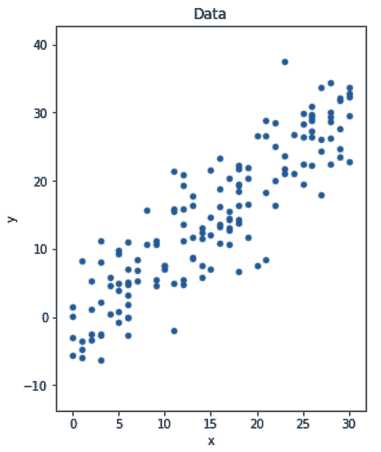
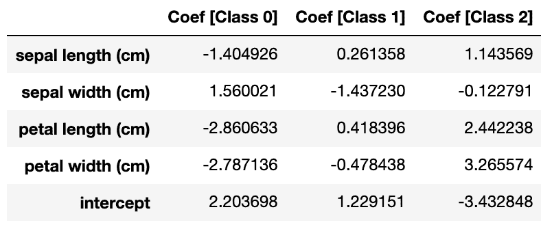

# 第三章：使用线性方程做决策

最小二乘回归分析方法可以追溯到 18 世纪卡尔·弗里德里希·高斯的时代。两个多世纪以来，许多算法基于它或在某种形式上受到它的启发。这些线性模型可能是今天回归和分类中最常用的算法。我们将从本章开始，首先看一下基本的最小二乘算法，然后随着章节的深入，我们将介绍更高级的算法。

以下是本章涵盖的主题列表：

+   理解线性模型

+   预测波士顿的房价

+   对回归器进行正则化

+   寻找回归区间

+   额外的线性回归器

+   使用逻辑回归进行分类

+   额外的线性分类器

# 理解线性模型

为了能够很好地解释线性模型，我想从一个例子开始，在这个例子中，解决方案可以通过线性方程组来求解——这是我们在 12 岁左右上学时学到的一项技术。然后，我们将看到为什么这种技术并不总是适用于现实生活中的问题，因此需要线性回归模型。接着，我们将把回归模型应用于一个现实中的回归问题，并在此过程中学习如何改进我们的解决方案。

## 线性方程

"数学是人类精神最美丽和最强大的创造。"

– 斯特凡·巴纳赫

在这个例子中，我们有五个乘客，他们乘坐了出租车旅行。这里记录了每辆出租车行驶的距离（以公里为单位）以及每次旅行结束时计价器上显示的费用：


我们知道，出租车计价器通常会从一定的起始费用开始，然后根据每公里的行驶距离收取固定费用。我们可以用以下方程来建模计价器：


在这里，*A*是计价器的起始值，*B*是每公里增加的费用。我们还知道，对于两个未知数——*A*和*B*——我们只需要两个数据样本就可以确定*A*是`5`，*B*是`2.5`。我们还可以用*A*和*B*的值绘制公式，如下所示：


我们还知道，蓝线会在*y*轴上与*A*（`5`）相交。因此，我们将*A*称为**截距**。我们还知道，直线的斜率等于*B*（`2.5`）。

乘客们并不总是带有零钱，所以他们有时会将计价器上显示的金额四舍五入，加上小费给司机。这是每位乘客最终支付的金额数据：


在我们加入小费后，很明显，行驶距离与支付金额之间的关系不再是线性的。右侧的图表显示，无法通过一条直线来捕捉这种关系：


我们现在知道，之前的解方程方法在此时不再适用。然而，我们可以看出，仍然存在一条线，能够在某种程度上近似这个关系。在接下来的部分，我们将使用线性回归算法来找到这个近似值。

## 线性回归

算法的核心是目标。我们之前的目标是找到一条通过图中所有点的直线。我们已经看到，如果这些点之间不存在线性关系，那么这个目标是无法实现的。因此，我们将使用线性回归算法，因为它有不同的目标。线性回归算法试图找到一条线，使得估计点与实际点之间的平方误差的均值最小。从视觉上看，在下面的图中，我们希望找到一条虚线，使得所有垂直线的平方长度的平均值最小：


这里用来找到一条最小化**均方误差**（**MSE**）的线性回归方法被称为普通最小二乘法。通常，线性回归就意味着普通最小二乘法。然而，在本章中，我将使用`LinearRegression`（作为一个词）来指代 scikit-learn 实现的普通最小二乘法，而将*线性回归*（作为两个词）保留用来指代线性回归的通用概念，无论是使用普通最小二乘法方法还是其他方法。

普通最小二乘法方法已有两个世纪的历史，它使用简单的数学来估算参数。这也是为什么一些人认为这个算法实际上不是机器学习算法的原因。就个人而言，我在分类什么是机器学习、什么不是时，采取了更加宽松的方式。只要算法能从数据中自动学习，并且我们用这些数据来评估它，那么在我看来，它就属于机器学习范畴。

### 估算支付给出租车司机的金额

现在我们已经了解了线性回归的工作原理，接下来让我们看看如何估算支付给出租车司机的金额。

1.  让我们使用 scikit-learn 构建一个回归模型来估算支付给出租车司机的金额：

```py
from sklearn.linear_model import LinearRegression

# Initialize and train the model
reg = LinearRegression()
reg.fit(df_taxi[['Kilometres']], df_taxi['Paid (incl. tips)'])

# Make predictions
df_taxi['Paid (Predicted)'] = reg.predict(df_taxi[['Kilometres']])
```

很明显，scikit-learn 具有一致的接口。我们使用了与前一章节相同的`fit()`和`predict()`方法，只不过这次使用的是`LinearRegression`对象。

这次我们只有一个特征`Kilometres`，然而`fit()`和`predict()`方法期望的是一个二维的`ax`，这就是为什么我们将`Kilometres`放入了一个额外的方括号中——`df_taxi[['Kilometres']]`。

1.  我们将预测结果放在同一个数据框架中的`Paid (Predicted)`列下。然后，我们可以使用以下代码绘制实际值与估算值的对比图：

```py
fig, axs = plt.subplots(1, 2, figsize=(16, 5))

df_taxi.set_index('Kilometres')['Meter'].plot(
   title='Meter', kind='line', ax=axs[0]
)

df_taxi.set_index('Kilometres')['Paid (incl. tips)'].plot(
title='Paid (incl. tips)', label='actual', kind='line',  ax=axs[1]
)
df_taxi.set_index('Kilometres')['Paid (Predicted)'].plot(
    title='Paid (incl. tips)', label='estimated', kind='line', ax=axs[1]
)

fig.show()
```

我删去了代码中的格式部分，以保持简洁和直接。以下是最终结果：


1.  一旦线性模型训练完成，您可以使用`intercept_`和`coef_`参数来获取其截距和系数。因此，我们可以使用以下代码片段来创建估计直线的线性方程：

```py
print(
    'Amount Paid = {:.1f} + {:.1f} * Distance'.format(
        reg.intercept_, reg.coef_[0], 
    )
) 
```

然后打印出以下方程：


获取线性方程的参数在某些情况下非常有用，尤其是当您想要在 scikit-learn 中构建一个模型，然后在其他语言中使用它，甚至是在您最喜欢的电子表格软件中使用它时。了解系数还有助于我们理解模型为什么做出某些决策。更多内容将在本章后面详细讨论。

在软件中，函数和方法的输入被称为参数。在机器学习中，模型学习到的权重也被称为参数。在设置模型时，我们将其配置传递给`__init__`方法。因此，为了避免任何混淆，模型的配置被称为超参数。

# 预测波士顿的房价

现在我们已经了解了线性回归的工作原理，接下来我们将研究一个真实的数据集，展示一个更实际的用例。

波士顿数据集是一个小型数据集，表示波士顿市的房价。它包含 506 个样本和 13 个特征。我们可以将数据加载到一个 DataFrame 中，如下所示：

```py
from sklearn.datasets import load_boston

boston = load_boston()

df_dataset = pd.DataFrame(
    boston.data,
    columns=boston.feature_names,
)
df_dataset['target'] = boston.target
```

## 数据探索

确保数据中没有任何空值非常重要；否则，scikit-learn 会报错。在这里，我将统计每一列中的空值总和，然后对其求和。如果得到的是`0`，那么我就会很高兴：

```py
df_dataset.isnull().sum().sum() # Luckily, the result is zero
```

对于回归问题，最重要的是理解目标变量的分布。如果目标变量的范围在`1`到`10`之间，而我们训练模型后得到的平均绝对误差为`5`，那么在这个情况下，我们可以判断误差较大。

然而，对于一个目标值在`500,000`到`1,000,000`之间的情况，相同的误差是可以忽略不计的。当您想要可视化分布时，直方图是您的好帮手。除了目标的分布，我们还可以绘制每个特征的均值：

```py
fig, axs = plt.subplots(1, 2, figsize=(16, 8))

df_dataset['target'].plot(
    title='Distribution of target prices', kind='hist', ax=axs[0]
)
df_dataset[boston.feature_names].mean().plot(
    title='Mean of features', kind='bar', ax=axs[1]
)

fig.show()
```

这为我们提供了以下图表：


在前面的图表中，我们观察到：

+   价格范围在`5`到`50`之间。显然，这些并非真实价格，可能是归一化后的值，但现在这并不重要。

+   此外，从直方图中我们可以看出，大多数价格都低于`35`。我们可以使用以下代码片段，看到 90%的价格都低于`34.8`：

```py
df_dataset['target'].describe(percentiles=[.9, .95, .99])
```

您可以始终深入进行数据探索，但这次我们就到此为止。

## 数据划分

对于小型数据集，建议为测试预留足够的数据。因此，我们将数据划分为 60%的训练数据和 40%的测试数据，使用`train_test_split`函数：

```py
from sklearn.model_selection import train_test_split

df_train, df_test = train_test_split(df_dataset, test_size=0.4)

x_train = df_train[boston.feature_names]
x_test = df_test[boston.feature_names]
y_train = df_train['target']
y_test = df_test['target']
```

一旦你拥有了训练集和测试集，就将它们进一步拆分为*x*集和*y*集。然后，我们就可以进入下一步。

## 计算基准

目标值的分布让我们了解了我们能容忍的误差水平。然而，比较我们的最终模型与某些基准总是有用的。如果我们从事房地产行业，并且由人类代理估算房价，那么我们很可能会被期望建立一个比人类代理更准确的模型。然而，由于我们无法获得实际估算值来与我们的模型进行比较，因此我们可以自己提出一个基准。房屋的均价是`22.5`。如果我们建立一个虚拟模型，无论输入什么数据都返回均价，那么它就会成为一个合理的基准。

请记住，`22.5`的值是针对整个数据集计算的，但因为我们假装只能访问训练数据，所以只计算训练集的均值是有意义的。为了节省我们的精力，scikit-learn 提供了虚拟回归器，可以为我们完成所有这些工作。

在这里，我们将创建一个虚拟回归器，并用它来计算测试集的基准预测值：

```py
from sklearn.dummy import DummyRegressor

baselin = DummyRegressor(strategy='mean')
baselin.fit(x_train, y_train)

y_test_baselin = baselin.predict(x_test)

```

我们可以使用其他策略，比如找到中位数（第 50^(th) 分位数）或任何其他*N*^(th) 分位数。请记住，对于相同的数据，使用均值作为估算值相比于使用中位数时，会得到更低的均方误差（MSE）。相反，中位数会得到更低的**平均绝对误差**（**MAE**）。我们希望我们的模型在 MAE 和 MSE 两方面都能超越基准。

## 训练线性回归器

基准模型的代码和实际模型几乎一模一样，不是吗？这就是 scikit-learn API 的优点。意味着当我们决定尝试不同的算法，比如上一章的决策树算法时，我们只需要更改几行代码。无论如何，下面是线性回归器的代码：

```py
from sklearn.linear_model import LinearRegression

reg = LinearRegression()
reg.fit(x_train, y_train)

y_test_pred = reg.predict(x_test)
```

我们暂时会坚持默认配置。

## 评估模型的准确性

在回归中，有三种常用的指标：*R²*、*MAE*和*MSE*。首先让我们编写计算这三个指标并打印结果的代码：

```py
from sklearn.metrics import r2_score
from sklearn.metrics import mean_absolute_error
from sklearn.metrics import mean_squared_error

print(
    'R2 Regressor = {:.2f} vs Baseline = {:.2f}'.format(
        r2_score(y_test, y_test_pred), 
        r2_score(y_test, y_test_baselin)
     )
)
print(
    'MAE Regressor = {:.2f} vs Baseline = {:.2f}'.format(
        mean_absolute_error(y_test, y_test_pred), 
        mean_absolute_error(y_test, y_test_baselin)
    )
)
print(
    'MSE Regressor = {:.2f} vs Baseline = {:.2f}'.format(
        mean_squared_error(y_test, y_test_pred), 
        mean_squared_error(y_test, y_test_baselin)
    )
)
```

下面是我们得到的结果：

```py
R2 Regressor = 0.74 vs Baseline = -0.00
MAE Regressor = 3.19 vs Baseline = 6.29
MSE Regressor = 19.70 vs Baseline = 76.11
```

到现在为止，你应该已经知道如何计算*MAE*和*MSE*了。只需要记住，*MSE*比*MAE*对异常值更敏感。这就是为什么基准的均值估算得分较差的原因。至于*R²*，让我们看一下它的公式：


下面是前面公式的解释：

+   分子可能让你想起了*MSE*。我们基本上计算所有预测值与对应实际值之间的平方差。

+   至于分母，我们使用实际值的均值作为伪估算值。

+   基本上，这个指标告诉我们，和使用目标均值作为估算值相比，我们的预测有多么准确。

+   `1`的 R²分数是我们能得到的最佳结果，`0`的分数意味着我们与一个仅依赖均值作为估计的有偏模型相比没有提供任何附加价值。

+   一个负分数意味着我们应该把模型扔进垃圾桶，改用目标的均值作为预测。

+   显然，在基线模型中，我们已经使用目标的均值作为预测。因此，它的 R²分数是`0`。

对于*MAE*和*MSE*，它们的值越小，模型就越好。相反，对于*R²*，它的值越高，模型就越好。在 scikit-learn 中，那些值越高表示结果越好的度量函数名称以`_score`结尾，而以`_error`或`_loss`结尾的函数则是值越小，越好。

现在，如果我们比较得分，就会发现我们的模型在所有三项得分中都优于基线得分。恭喜！

## 显示特征系数

我们知道线性模型会将每个特征乘以一个特定的系数，然后将这些乘积的和作为最终预测结果。我们可以在模型训练后使用回归器的`coef_`方法打印这些系数：

```py
df_feature_importance = pd.DataFrame(
    {
        'Features': x_train.columns,
        'Coeff': reg.coef_,
        'ABS(Coeff)': abs(reg.coef_),
    }
).set_index('Features').sort_values('Coeff', ascending=False)
```

如我们在这些结果中看到的，某些系数是正的，其他的是负的。正系数意味着特征与目标正相关，反之亦然。我还添加了系数绝对值的另一列：


在前面的截图中，观察到如下情况：

+   理想情况下，每个系数的值应该告诉我们每个特征的重要性。绝对值越高，不管符号如何，都表示特征越重要。

+   然而，我在这里犯了一个错误。如果你查看数据，你会注意到`NOX`的最大值是`0.87`，而`TAX`的最大值是`711`。这意味着如果`NOX`只有微不足道的重要性，它的系数仍然会很高，以平衡它的较小值；而对于`TAX`，它的系数会始终相对较小，因为特征本身的值较高。

+   所以，我们需要对特征进行缩放，以保持它们在可比较的范围内。在接下来的章节中，我们将看到如何对特征进行缩放。

## 为了更有意义的系数进行缩放

scikit-learn 有多种缩放器。我们现在将使用`MinMaxScaler`。使用其默认配置时，它会将所有特征的值压缩到`0`和`1`之间。该缩放器需要先进行拟合，以了解特征的范围。拟合应该仅在训练*X*数据集上进行。然后，我们使用缩放器的`transform`函数对训练集和测试集的*X*数据进行缩放：

```py
from sklearn.linear_model import LinearRegression
from sklearn.preprocessing import MinMaxScaler

scaler = MinMaxScaler()
reg = LinearRegression()

scaler.fit(x_train)
x_train_scaled = scaler.transform(x_train)
x_test_scaled = scaler.transform(x_test)

reg.fit(x_train_scaled, y_train)
y_test_pred = reg.predict(x_test_scaled)
```

这里有一行简化代码，它用于拟合一个数据集并进行转换。换句话说，以下未注释的行代替了两行注释的代码：

```py
# scaler.fit(x_train)
# x_train_scaled = scaler.transform(x_train)
x_train_scaled = scaler.fit_transform(x_train)
```

从现在开始，我们将经常使用`fit_transform()`函数，视需要而定。

如果你想要有意义的系数，缩放特征非常重要。更进一步，缩放有助于基于梯度的求解器更快地收敛（稍后会详细说明）。除了缩放，你还应该确保没有高度相关的特征，这样可以获得更有意义的系数，并使线性回归模型更稳定。

现在我们已经对特征进行了缩放并重新训练了模型，我们可以再次打印特征及其系数：


请注意，`NOX` 现在比之前更不重要了。

## 添加多项式特征

现在我们知道了最重要的特征，我们可以将目标与这些特征进行绘图，看看它们与目标之间的相关性：


在前面的截图中，观察到以下情况：

+   这些图看起来似乎并不完全是线性的，线性模型无法捕捉到这种非线性。

+   虽然我们不能将线性模型转变为非线性模型，但我们可以通过数据转换来实现。

+   这样想：如果 *y* 是 *x²* 的函数，我们可以使用一个非线性模型——一个能够捕捉 *x* 和 *y* 之间二次关系的模型——或者我们可以直接计算 *x²* 并将其提供给线性模型，而不是 *x*。此外，线性回归算法无法捕捉特征交互。

+   当前模型无法捕捉多个特征之间的交互。

多项式变换可以解决非线性和特征交互问题。给定原始数据，scikit-learn 的多项式变换器将把特征转化为更高维度（例如，它会为每个特征添加平方值和立方值）。此外，它还会将每对特征（或三元组）之间的乘积添加进去。`PolynomialFeatures` 的工作方式类似于我们在本章前面使用的缩放器。我们将使用其 `fit_transform` 变量和 `transform()` 方法，如下所示：

```py
from sklearn.preprocessing import PolynomialFeatures

poly = PolynomialFeatures(degree=3)
x_train_poly = poly.fit_transform(x_train)
x_test_poly = poly.transform(x_test)
```

为了获得二次和三次特征转换，我们将 `degree` 参数设置为 `3`。

`PolynomialFeatures` 有一个令人烦恼的地方，它没有保留 DataFrame 的列名。它将特征名替换为 `x0`、`x1`、`x2` 等。然而，凭借我们的 Python 技能，我们可以恢复列名。我们就用以下代码块来实现这一点：

```py
feature_translator = [
    (f'x{i}', feature) for i, feature in enumerate(x_train.columns, 0)
]

def translate_feature_names(s):
    for key, val in feature_translator:
        s = s.replace(key, val)
    return s

poly_features = [
    translate_feature_names(f) for f in poly.get_feature_names()
]

x_train_poly = pd.DataFrame(x_train_poly, columns=poly_features)
x_test_poly = pd.DataFrame(x_test_poly, columns=poly_features)
```

现在我们可以使用新派生的多项式特征，而不是原始特征。

### 使用派生特征拟合线性回归模型

*"当我六岁时，我妹妹只有我一半大。现在我 60 岁，我妹妹多大了？"*

*这是在互联网上找到的一个谜题。如果你的答案是 30，那么你忘记为线性回归模型拟合截距了。*

现在，我们准备使用带有新转换特征的线性回归器。需要记住的一点是，`PolynomialFeatures`转换器会添加一个额外的列，所有值都是`1`。训练后，这一列得到的系数相当于截距。因此，我们这次训练回归器时，将通过设置`fit_intercept=False`来避免拟合截距：

```py
from sklearn.linear_model import LinearRegression

reg = LinearRegression(fit_intercept=False)
reg.fit(x_train_poly, y_train)

y_test_pred = reg.predict(x_test_poly)
```

最后，当我们打印*R²*、*MAE*和*MSE*结果时，迎来了一些不太愉快的惊讶：

```py
R2 Regressor = -84.887 vs Baseline = -0.0
MAE Regressor = 37.529 vs Baseline = 6.2
MSE Regressor = 6536.975 vs Baseline = 78.1
```

回归器的表现比之前差得多，甚至比基准模型还要差。多项式特征究竟对我们的模型做了什么？

普通最小二乘回归算法的一个主要问题是它在面对高度相关的特征（多重共线性）时效果不好。

多项式特征转换的“厨房水槽”方法——我们添加特征、它们的平方值和立方值，以及特征对和三重对的乘积——很可能会给我们带来多个相关的特征。多重共线性会损害模型的表现。此外，如果你打印`x_train_poly`的形状，你会看到它有 303 个样本和 560 个特征。这是另一个问题，称为“维度灾难”。

**维度灾难**是指当你的特征数远超过样本数时的问题。如果你把数据框想象成一个矩形，特征是矩形的底边，样本是矩形的高度，你总是希望矩形的高度远大于底边。假设有两列二进制特征——`x1`和`x2`。它们可以有四种可能的值组合——`(0, 0)`、`(0, 1)`、`(1, 0)`和`(1, 1)`。同样，对于*n*列，它们可以有*2^n*种组合。正如你所看到的，随着特征数的增加，可能性数量呈指数增长。为了使监督学习算法有效工作，它需要足够的样本来覆盖所有这些可能性中的合理数量。当我们有非二进制特征时（如本例所示），这个问题更为严重。

幸运的是，两个世纪的时间足够让人们找到这两个问题的解决方案。正则化就是我们在下一部分将要深入探讨的解决方案。

# 正则化回归器

“用更多做本可以用更少做的事是徒劳的。”

——奥卡姆的威廉

最初，我们的目标是最小化回归器的 MSE 值。后来我们发现，特征过多是一个问题。这就是为什么我们需要一个新的目标。我们仍然需要最小化回归器的 MSE 值，但同时我们还需要激励模型忽略无用的特征。这个目标的第二部分，就是正则化的作用。

常用于正则化线性回归的两种算法是**Lasso**和**Ridge**。Lasso 使得模型的系数更少——也就是说，它将尽可能多的系数设为`0`——而 Ridge 则推动模型的系数尽可能小。Lasso 使用一种叫做 L1 的正则化形式，它惩罚系数的绝对值，而 Ridge 使用 L2，它惩罚系数的平方值。这两种算法都有一个超参数（alpha），用来控制系数的正则化程度。将 alpha 设为`0`意味着没有任何正则化，这就回到了普通最小二乘回归。较大的 alpha 值指定更强的正则化，而我们将从 alpha 的默认值开始，稍后再看看如何正确设置它。

普通最小二乘法算法中使用的标准方法在这里不起作用。现在，我们有了一个目标函数，旨在最小化系数的大小，同时最小化预测器的 MSE 值。因此，使用求解器来找到能够最小化新目标函数的最佳系数。我们将在本章稍后进一步讨论求解器。

## 训练 Lasso 回归器

训练 Lasso 与训练其他模型没有区别。与我们在前一节中所做的类似，我们将在这里将`fit_intercept`设置为`False`：

```py
from sklearn.linear_model import Ridge, Lasso

reg = Lasso(fit_intercept=False)
reg.fit(x_train_poly, y_train)

y_test_pred = reg.predict(x_test_poly)
```

一旦完成，我们可以打印 R²、MAE 和 MSE：

```py
R2 Regressor = 0.787 vs Baseline = -0.0
MAE Regressor = 2.381 vs Baseline = 6.2
MSE Regressor = 16.227 vs Baseline = 78.
```

我们不仅修复了多项式特征引入的问题，而且还比原始线性回归器有了更好的表现。*MAE*值为`2.4`，相比之前的`3.6`，*MSE*为`16.2`，相比之前的`25.8`，*R²*为`0.79`，相比之前的`0.73`。

现在我们已经看到了应用正则化后的 promising results，接下来是时候看看如何为正则化参数设置一个最佳值。

## 寻找最佳正则化参数

理想情况下，在将数据拆分为训练集和测试集之后，我们会将训练集进一步拆分为*N*个折叠。然后，我们会列出我们想要测试的所有 alpha 值，并逐一循环进行测试。每次迭代时，我们将应用*N*-fold 交叉验证，找出能够产生最小误差的 alpha 值。幸运的是，scikit-learn 有一个叫做`LassoCV`的模块（`CV`代表交叉验证）。在这里，我们将使用这个模块，利用五折交叉验证来找到最佳的 alpha 值：

```py
from sklearn.linear_model import LassoCV

# Make a list of 50 values between 0.000001 & 1,000,000
alphas = np.logspace(-6, 6, 50)

# We will do 5-fold cross validation
reg = LassoCV(alphas=alphas, fit_intercept=False, cv=5)
reg.fit(x_train_poly, y_train)

y_train_pred = reg.predict(x_train_poly)
y_test_pred = reg.predict(x_test_poly)
```

一旦完成，我们可以使用模型进行预测。你可能想预测训练集和测试集，并查看模型是否在训练集上出现过拟合。我们还可以打印选择的 alpha 值，如下所示：

```py
print(f"LassoCV: Chosen alpha = {reg.alpha_}")
```

我得到了`1151.4`的`alpha`值。

此外，我们还可以看到，对于每个 alpha 值，五个折叠中的*MSE*值是多少。我们可以通过`mse_path_`访问这些信息。

由于每个 alpha 值对应五个*MSE*值，我们可以绘制这五个值的平均值，并绘制围绕平均值的置信区间。

置信区间用于展示观察数据可能取值的预期范围。95%的置信区间意味着我们期望 95%的值落在这个范围内。较宽的置信区间意味着数据可能取值的范围较大，而较窄的置信区间则意味着我们几乎可以准确地预测数据会取什么值。

95%的置信区间计算如下：


这里，标准误差等于标准差除以样本数量的平方根（![]，因为我们这里有五个折数）。

这里的置信区间公式并不是 100%准确。从统计学角度来看，当处理小样本且其基本方差未知时，应该使用 t 分布而非 z 分布。因此，鉴于这里的折数较小，1.96 的系数应当用 t 分布表中更准确的值来替代，其中自由度由折数推断得出。

以下代码片段计算并绘制了 MSE 与 alpha 的置信区间：

1.  我们首先计算返回的*MSE*值的描述性统计数据：

```py
# n_folds equals to 5 here
n_folds = reg.mse_path_.shape[1]

# Calculate the mean and standard error for MSEs
mse_mean = reg.mse_path_.mean(axis=1)
mse_std = reg.mse_path_.std(axis=1)
# Std Error = Std Deviation / SQRT(number of samples)
mse_std_error = mse_std / np.sqrt(n_folds)
```

1.  然后，我们将计算结果放入数据框中，并使用默认的折线图进行绘制：

```py
fig, ax = plt.subplots(1, 1, figsize=(16, 8))

# We multiply by 1.96 for a 95% Confidence Interval
pd.DataFrame(
    {
        'alpha': reg.alphas_,
        'Mean MSE': mse_mean,
        'Upper Bound MSE': mse_mean + 1.96 * mse_std_error,
        'Lower Bound MSE': mse_mean - 1.96 * mse_std_error,
    }
).set_index('alpha')[
    ['Mean MSE', 'Upper Bound MSE', 'Lower Bound MSE']
].plot(
    title='Regularization plot (MSE vs alpha)', 
    marker='.', logx=True, ax=ax
)

# Color the confidence interval 
plt.fill_between(
    reg.alphas_, 
    mse_mean + 1.96 * mse_std_error, 
    mse_mean - 1.96 * mse_std_error, 
)

# Print a vertical line for the chosen alpha
ax.axvline(reg.alpha_, linestyle='--', color='k')
ax.set_xlabel('Alpha')
ax.set_ylabel('Mean Squared Error')
```

这是前面代码的输出：


在选择的 alpha 值下，MSE 值最小。此时，置信区间也更窄，这反映了对预期的*MSE*结果更高的信心。

最后，将模型的 alpha 值设置为建议值，并使用它对测试数据进行预测，得出了以下结果：

|  | **基准** | **线性回归** | **Lasso（Alpha = 1151.4）** |
| --- | --- | --- | --- |
| **R²** | `0.00` | `0.73` | `0.83` |
| **MAE** | `7.20` | `3.56` | `2.76` |
| **MSE** | `96.62` | `25.76` | `16.31` |

显然，正则化解决了由维度灾难引起的问题。此外，我们通过交叉验证找到了最佳的正则化参数。我们绘制了误差的置信区间，以可视化 alpha 对回归器的影响。我在本节讨论置信区间的内容，激发了我将下一节专门用于回归区间的写作。

# 查找回归区间

“探索未知需要容忍不确定性。”

– 布莱恩·格林

我们无法总是保证得到准确的模型。有时，我们的数据本身就很嘈杂，无法使用回归模型进行建模。在这些情况下，能够量化我们估计结果的可信度非常重要。通常，回归模型会做出点预测。这些是目标值（通常是均值）在每个 *x* 值下的预期值 (*y*)。贝叶斯岭回归模型通常也会返回预期值，但它还会返回每个 *x* 值下目标值 (*y*) 的标准差。

为了演示这一点，我们来创建一个带噪声的数据集，其中 ：

```py
import numpy as np
import pandas as pd

df_noisy = pd.DataFrame(
    {
        'x': np.random.random_integers(0, 30, size=150),
        'noise': np.random.normal(loc=0.0, scale=5.0, size=150)
    }
)

df_noisy['y'] = df_noisy['x'] + df_noisy['noise']
```

然后，我们可以将其绘制成散点图：

```py
df_noisy.plot(
    kind='scatter', x='x', y='y'
)
```

绘制结果数据框将给我们以下图形：



现在，让我们在相同的数据上训练两个回归模型——`LinearRegression` 和 `BayesianRidge`。这里我将坚持使用默认的贝叶斯岭回归超参数值：

```py
from sklearn.linear_model import LinearRegression
from sklearn.linear_model import BayesianRidge

lr = LinearRegression()
br = BayesianRidge()

lr.fit(df_noisy[['x']], df_noisy['y'])
df_noisy['y_lr_pred'] = lr.predict(df_noisy[['x']])

br.fit(df_noisy[['x']], df_noisy['y'])
df_noisy['y_br_pred'], df_noisy['y_br_std'] = br.predict(df_noisy[['x']], return_std=True)
```

注意，贝叶斯岭回归模型在预测时会返回两个值。

贝叶斯线性回归与前面提到的算法在看待其系数的方式上有所不同。对于我们到目前为止看到的所有算法，每个系数在训练后都取一个单一的值，但对于贝叶斯模型，系数实际上是一个分布，具有估计的均值和标准差。系数是通过一个先验分布进行初始化的，然后通过训练数据更新，最终通过贝叶斯定理达到后验分布。贝叶斯岭回归模型是一个正则化的贝叶斯回归模型。

这两个模型的预测结果非常相似。然而，我们可以使用返回的标准差来计算我们预期大多数未来数据落入的范围。以下代码片段绘制了这两个模型及其预测的图形：

```py
fig, axs = plt.subplots(1, 3, figsize=(16, 6), sharex=True, sharey=True)

# We plot the data 3 times
df_noisy.sort_values('x').plot(
    title='Data', kind='scatter', x='x', y='y', ax=axs[0]
)
df_noisy.sort_values('x').plot(
    kind='scatter', x='x', y='y', ax=axs[1], marker='o', alpha=0.25
)
df_noisy.sort_values('x').plot(
    kind='scatter', x='x', y='y', ax=axs[2], marker='o', alpha=0.25
)

# Here we plot the Linear Regression predictions
df_noisy.sort_values('x').plot(
    title='LinearRegression', kind='scatter', x='x', y='y_lr_pred', 
    ax=axs[1], marker='o', color='k', label='Predictions'
)

# Here we plot the Bayesian Ridge predictions
df_noisy.sort_values('x').plot(
    title='BayesianRidge', kind='scatter', x='x', y='y_br_pred', 
    ax=axs[2], marker='o', color='k', label='Predictions'
)

# Here we plot the range around the expected values
# We multiply by 1.96 for a 95% Confidence Interval
axs[2].fill_between(
    df_noisy.sort_values('x')['x'], 
    df_noisy.sort_values('x')['y_br_pred'] - 1.96 * 
                df_noisy.sort_values('x')['y_br_std'], 
    df_noisy.sort_values('x')['y_br_pred'] + 1.96 * 
                df_noisy.sort_values('x')['y_br_std'],
    color="k", alpha=0.2, label="Predictions +/- 1.96 * Std Dev"
)

fig.show()
```

运行前面的代码会给我们以下图形。在`BayesianRidge`的案例中，阴影区域显示了我们预期 95%的目标值会落在其中：


回归区间在我们想量化不确定性时非常有用。在[第八章](https://cdp.packtpub.com/hands_on_machine_learning_with_scikit_learn/wp-admin/post.php?post=30&action=edit)，*集成方法——当一个模型不够用时*，我们将重新讨论回归区间。

# 了解更多的线性回归模型

在继续学习线性分类器之前，理应将以下几种额外的线性回归算法加入到你的工具箱中：

+   **Elastic-net** 使用 L1 和 L2 正则化技术的混合，其中 `l1_ratio` 控制两者的混合比例。这在你希望学习一个稀疏模型，其中只有少数权重为非零（如 **lasso**）的情况下非常有用，同时又能保持 **ridge** 正则化的优点。

+   **随机样本一致性**（**RANSAC**）在数据存在离群点时非常有用。它试图将离群点与内点样本分开。然后，它仅对内点样本拟合模型。

+   **最小角回归**（**LARS**）在处理高维数据时非常有用——也就是当特征数量与样本数量相比显著较多时。你可以尝试将其应用到我们之前看到的多项式特征示例中，看看它的表现如何。

让我们继续进入书中的下一个章节，你将学习如何使用逻辑回归来分类数据。

# 使用逻辑回归进行分类

“你可以通过一个人的答案看出他是否聪明。你可以通过一个人的问题看出他是否智慧。”

– 纳吉布·马赫福兹

有一天，在面试时，面试官问：“*那么告诉我，逻辑回归是分类算法还是回归算法？*” 对此的简短回答是它是分类算法，但更长且更有趣的回答需要对逻辑函数有很好的理解。然后，问题可能会完全改变其意义。

## 理解逻辑函数

逻辑函数是 S 型（*s*形）函数的一种，它的表达式如下：


别让这个方程吓到你。真正重要的是这个函数的视觉效果。幸运的是，我们可以用计算机生成一系列θ的值——比如在`-10`到`10`之间。然后，我们可以将这些值代入公式，并绘制出对应的`y`值与θ值的关系图，正如我们在以下代码中所做的：

```py
import numpy as np
import pandas as pd

fig, ax = plt.subplots(1, 1, figsize=(16, 8))

theta = np.arange(-10, 10, 0.05)
y = 1 / (1 + np.exp(-1 * theta))

pd.DataFrame(
    {
        'theta': theta,
        'y': y
    }
).plot(
    title='Logistic Function', 
    kind='scatter', x='theta', y='y', 
    ax=ax
)

fig.show()
```

运行此代码将生成以下图表：


逻辑函数中需要注意的两个关键特征如下：

+   *y* 仅在`0`和`1`之间变化。当θ趋近于正无穷时，*y*趋近于`1`；当θ趋近于负无穷时，*y*趋近于`0`。

+   当θ为`0`时，`y`的值为`0.5`。

## 将逻辑函数代入线性模型

“概率不仅仅是对骰子上的赔率或更复杂的变种进行计算；它是接受我们知识中不确定性的存在，并发展出应对我们无知的方法。”

– 纳西姆·尼古拉斯·塔勒布

对于一个包含两个特征的线性模型，*x[1]* 和 *x[2]*，我们可以有一个截距和两个系数。我们将它们称为、 和 。那么，线性回归方程将如下所示：


另外，我们也可以将前面方程右侧的部分代入逻辑函数，替代。这将得到以下的*y*方程：


在这种情况下，*x*值的变化将使得*y*在`0`和`1`之间波动。*x*与其系数的乘积的较高值会使得*y*接近`1`，较低值会使其接近`0`。我们也知道，概率的值介于`0`和`1`之间。因此，将*y*解释为给定*x*的情况下，*y*属于某一类的概率是有意义的。如果我们不想处理概率，我们可以直接指定 ；那么，我们的样本就属于类别 1，否则属于类别 0。

这是对逻辑回归工作原理的简要介绍。它是一个分类器，但被称为*回归*，因为它基本上是一个回归器，返回一个介于`0`和`1`之间的值，我们将其解释为概率。

要训练逻辑回归模型，我们需要一个目标函数，以及一个求解器，用来寻找最优的系数以最小化这个函数。在接下来的章节中，我们将更详细地讲解这些内容。

### 目标函数

在训练阶段，算法会遍历数据，尝试找到能够最小化预定义目标（损失）函数的系数。在逻辑回归的情况下，我们尝试最小化的损失函数被称为对数损失。它通过以下公式来衡量预测概率(*p*)与实际类别标签(*y*)之间的差距：

*-log(p) if y == 1 else -log(1 - p)*

数学家使用一种相当难看的方式来表达这个公式，因为他们缺少`if-else`条件。所以，我选择在这里显示 Python 形式，便于理解。开个玩笑，数学公式在你了解其信息论根源后会变得非常优美，但这不是我们现在要讨论的内容。

### 正则化

此外，scikit-learn 实现的逻辑回归算法默认使用正则化。开箱即用时，它使用 L2 正则化（如岭回归器），但它也可以使用 L1（如 Lasso）或 L1 和 L2 的混合（如 Elastic-Net）。

### 求解器

最后，我们如何找到最优的系数来最小化我们的损失函数呢？一个天真的方法是尝试所有可能的系数组合，直到找到最小损失。然而，由于考虑到无限的组合，全面搜索是不可行的，因此求解器的作用就是高效地搜索最优系数。scikit-learn 实现了大约六种求解器。

求解器的选择以及所使用的正则化方法是配置逻辑回归算法时需要做出的两个主要决策。在接下来的章节中，我们将讨论如何以及何时选择每一个。

## 配置逻辑回归分类器

在谈论求解器之前，让我们先了解一些常用的超参数：

+   **`fit_intercept`**：通常，除了每个特征的系数外，方程中还有一个常数截距。然而，有些情况下你可能不需要截距，例如，当你确定当所有 *x* 的值为 `0` 时，*y* 的值应该是 `0.5`。另一个情况是当你的数据已经有一个常数列，所有值都设为 `1`。这种情况通常发生在数据的早期处理阶段，比如在多项式处理器的情况下。此时，`constant` 列的系数将被解释为截距。线性回归算法中也有类似的配置。

+   **`max_iter`**：为了让求解器找到最佳系数，它会多次遍历训练数据。这些迭代也称为周期（epochs）。通常会设置迭代次数的上限，以防止过拟合。与之前解释的 lasso 和 ridge 回归器使用的超参数相同。

+   **`tol`**：这是另一种停止求解器过多迭代的方法。如果将其设置为较高的值，意味着只接受相邻两次迭代之间的较大改进；否则，求解器将停止。相反，较低的值将使求解器继续迭代更多次，直到达到 **`max_iter`**。

+   **`penalty`**：选择要使用的正则化技术。可以是 L1、L2、弹性网（elastic-net）或无正则化（none）。正则化有助于防止过拟合，因此当特征较多时，使用正则化非常重要。当 `max_iter` 和 **`tol`** 设置为较高值时，它还可以减轻过拟合的效果。

+   `C` 或 `alpha`：这些是用于设置正则化强度的参数。由于我们在此使用两种不同的逻辑回归算法实现，因此需要了解这两种实现使用了不同的参数（`C` 与 `alpha`）。`alpha` 基本上是 `C` 的倒数—()。这意味着，较小的 `C` 值表示较强的正则化，而对于 `alpha`，则需要较大的值来表示较强的正则化。

+   `l1_ratio`：当使用 L1 和 L2 的混合时，例如弹性网（elastic-net），此值指定 L1 与 L2 的权重比例。

以下是我们可以使用的一些求解器：

+   `liblinear`：**该求解器在 `LogisticRegression` 中实现，推荐用于较小的数据集。它支持 L1 和 L2 正则化，但如果想使用弹性网，或者如果不想使用正则化，则无法使用此求解器。**

*** `sag`或`saga`：这些求解器在`LogisticRegression`和`RidgeClassifier`中实现，对于较大的数据集，它们运行更快。然而，你需要对特征进行缩放，才能使其收敛。我们在本章早些时候使用了`MinMaxScaler`来缩放特征。现在，这不仅仅是为了更有意义的系数，也是为了让求解器更早地找到解决方案。`saga`支持四种惩罚选项。* `lbfgs`：**此求解器在`LogisticRegression`中实现。它支持 L2 惩罚或根本不使用正则化。****

***** **随机梯度下降**（**SGD**）：SGD 有专门的实现——`SGDClassifier`和`SGDRegressor`。这与`LogisticRegression`不同，后者的重点是通过优化单一的损失函数——对数损失来进行逻辑回归。`SGDClassifier`的重点是 SGD 求解器本身，这意味着相同的分类器可以使用不同的损失函数。如果将`loss`设置为`log`，那么它就是一个逻辑回归模型。然而，将`loss`设置为`hinge`或`perceptron`，则分别变成**支持向量机**（**SVM**）或感知机。这是另外两种线性分类器。

**梯度下降**是一种优化算法，旨在通过迭代地沿着最陡下降的方向移动来找到函数的局部最小值。最陡下降的方向通过微积分求得，因此称之为*梯度*。如果你将目标（损失）函数想象成一条曲线，梯度下降算法会盲目地选择曲线上的一个随机点，并利用该点的梯度作为指导，逐步向局部最小值移动。通常，损失函数选择为凸函数，这样它的局部最小值也就是全局最小值。在**随机**梯度下降的版本中，估算器的权重在每个训练样本上都会更新，而不是对整个训练数据计算梯度。梯度下降的更多细节内容可以参考[第七章](https://cdp.packtpub.com/hands_on_machine_learning_with_scikit_learn/wp-admin/post.php?post=33&action=edit)，《神经网络——深度学习来临》。** **## 使用逻辑回归对鸢尾花数据集进行分类

我们将把鸢尾花数据集加载到数据框中。以下代码块与在[第二章](http://cdp.packtpub.com/hands_on_machine_learning_with_scikit_learn/wp-admin/post.php?post=25&action=edit)《使用树做决策》中使用的代码类似，用于加载数据集：

```py
from sklearn import datasets
iris = datasets.load_iris()

df = pd.DataFrame(
    iris.data,
    columns=iris.feature_names
)

df['target'] = pd.Series(
    iris.target
)
```

然后，我们将使用`cross_validate`通过六折交叉验证来评估`LogisticRegression`算法的准确性，具体如下：

```py
from sklearn.linear_model import LogisticRegression
from sklearn.model_selection import cross_validate

num_folds = 6

clf = LogisticRegression(
    solver='lbfgs', multi_class='multinomial', max_iter=1000
)
accuracy_scores = cross_validate(
    clf, df[iris.feature_names], df['target'], 
    cv=num_folds, scoring=['accuracy']
)

accuracy_mean = pd.Series(accuracy_scores['test_accuracy']).mean()
accuracy_std = pd.Series(accuracy_scores['test_accuracy']).std()
accuracy_sterror = accuracy_std / np.sqrt(num_folds)

print(
     'Logistic Regression: Accuracy ({}-fold): {:.2f} ~ {:.2f}'.format(
         num_folds,
         (accuracy_mean - 1.96 * accuracy_sterror),
         (accuracy_mean + 1.96 * accuracy_sterror),
    )
)
```

运行前面的代码将给我们一组准确率得分，并且其 95%的置信区间在`0.95`和`1.00`之间。运行相同的代码进行决策树分类器训练时，得到的置信区间在`0.93`和`0.99`之间。

由于我们这里有三个类别，因此为每个类别边界计算的系数与其他类别是分开的。在我们再次训练逻辑回归算法且不使用`cross_validate`包装器之后，我们可以通过`coef_`访问系数。我们也可以通过`intercept_`访问截距。

在下一段代码中，我将使用字典推导式。在 Python 中，创建`[0, 1, 2, 3]`列表的一种方法是使用`[i for i in range(4)]`列表推导式。这基本上执行循环来填充列表。同样，`['x' for i in range(4)]`列表推导式将创建`['x', 'x', 'x', 'x']`列表。字典推导式以相同的方式工作。例如，`{str(i): i for i in range(4)}`这一行代码将创建`{'0': 0, '1': 1, '2': 2, '3': 3}`字典。

以下代码将系数放入数据框中。它基本上创建了一个字典，字典的键是类别 ID，并将每个 ID 映射到其相应系数的列表。一旦字典创建完成，我们将其转换为数据框，并在显示之前将截距添加到数据框中：

```py
# We need to fit the model again before getting its coefficients
clf.fit(df[iris.feature_names], df['target'])

# We use dictionary comprehension instead of a for-loop
df_coef = pd.DataFrame(
    {
        f'Coef [Class {class_id}]': clf.coef_[class_id]
        for class_id in range(clf.coef_.shape[0])
    },
    index=iris.feature_names
)
df_coef.loc['intercept', :] = clf.intercept_
```

在训练之前，别忘了对特征进行缩放。然后，你应该得到一个看起来像这样的系数数据框：



上面截图中的表格显示了以下内容：

+   从第一行可以看出，花萼长度的增加与类别 1 和类别 2 的相关性高于其他类别，这是基于类别 1 和类别 2 系数的正号。

+   这里使用线性模型意味着类别边界不会像决策树那样局限于水平和垂直线，而是会呈现线性形态。

为了更好地理解这一点，在下一部分中，我们将绘制逻辑回归分类器的决策边界，并将其与决策树的边界进行比较。

## 理解分类器的决策边界

通过可视化决策边界，我们可以理解模型为什么做出某些决策。以下是绘制这些边界的步骤：

1.  我们首先创建一个函数，该函数接受分类器的对象和数据样本，然后为特定的分类器和数据绘制决策边界：

```py
def plot_decision_boundary(clf, x, y, ax, title):

   cmap='Paired_r' 
   feature_names = x.columns
   x, y = x.values, y.values

   x_min, x_max = x[:,0].min(), x[:,0].max()
   y_min, y_max = x[:,1].min(), x[:,1].max()

   step = 0.02

   xx, yy = np.meshgrid(
      np.arange(x_min, x_max, step),
      np.arange(y_min, y_max, step)
   )
   Z = clf.predict(np.c_[xx.ravel(), yy.ravel()])
   Z = Z.reshape(xx.shape)

   ax.contourf(xx, yy, Z, cmap=cmap, alpha=0.25)
   ax.contour(xx, yy, Z, colors='k', linewidths=0.7)
   ax.scatter(x[:,0], x[:,1], c=y, edgecolors='k')
   ax.set_title(title)
   ax.set_xlabel(feature_names[0])
   ax.set_ylabel(feature_names[1])
```

1.  然后，我们将数据分为训练集和测试集：

```py
from sklearn.model_selection import train_test_split
df_train, df_test = train_test_split(df, test_size=0.3, random_state=22)
```

1.  为了方便可视化，我们将使用两个特征。在下面的代码中，我们将训练一个逻辑回归模型和一个决策树模型，然后在相同数据上训练后比较它们的决策边界：

```py
from sklearn.metrics import accuracy_score
from sklearn.linear_model import LogisticRegression
from sklearn.tree import DecisionTreeClassifier

fig, axs = plt.subplots(1, 2, figsize=(12, 6))

two_features = ['petal width (cm)', 'petal length (cm)']

clf_lr = LogisticRegression()
clf_lr.fit(df_train[two_features], df_train['target'])
accuracy = accuracy_score(
    df_test['target'], 
    clf_lr.predict(df_test[two_features])
)
plot_decision_boundary(
    clf_lr, df_test[two_features], df_test['target'], ax=axs[0], 
    title=f'Logistic Regression Classifier\nAccuracy: {accuracy:.2%}'
)

clf_dt = DecisionTreeClassifier(max_depth=3)
clf_dt.fit(df_train[two_features], df_train['target'])
accuracy = accuracy_score(
    df_test['target'], 
    clf_dt.predict(df_test[two_features])
)
plot_decision_boundary(
    clf_dt, df_test[two_features], df_test['target'], ax=axs[1], 
    title=f'Decision Tree Classifier\nAccuracy: {accuracy:.2%}'
)

fig.show()
```

运行此代码将给我们以下图表：


在上面的图表中，观察到以下内容：

+   这次，当只使用两个特征时，逻辑回归模型的表现并不好。然而，我们关心的是边界的形状。

+   很明显，左侧的边界不像右侧那样是水平和垂直的线。虽然右侧的边界可以由多个线段组成，但左侧的边界只能由连续的线组成。

# 了解额外的线性分类器

在结束本章之前，有必要强调一些额外的线性分类算法：

+   **SGD**是一种多功能求解器。如前所述，它可以执行逻辑回归分类，以及 SVM 和感知机分类，这取决于使用的损失函数。它还允许进行正则化惩罚。

+   **r****ide****分类器**将类别标签转换为`1`和`-1`，并将问题视为回归任务。它还能够很好地处理非二分类任务。由于其设计，它使用不同的求解器，因此在处理大量类别时，它可能会更快地学习，值得尝试。

+   **线性支持向量分类**（**LinearSVC**）是另一个线性模型。与对数损失不同，它使用`hinge`函数，旨在找到类别边界，使得每个类别的样本尽可能远离边界。这与支持向量机（SVM）不同。与线性模型相反，SVM 是一种非线性算法，因为它采用了所谓的核技巧。SVM 不再像几十年前那样广泛使用，且超出了本书的范围。

# 总结

线性模型无处不在。它们的简单性以及提供的功能——例如正则化——使得它们在实践者中非常受欢迎。它们还与神经网络共享许多概念，这意味着理解它们将有助于你在后续章节的学习。

线性通常不是限制因素，只要我们能通过特征转换发挥创意。此外，在更高维度下，线性假设可能比我们想象的更常见。这就是为什么建议总是从线性模型开始，然后再决定是否需要选择更高级的模型。

话虽如此，有时确实很难确定线性模型的最佳配置或决定使用哪种求解器。在本章中，我们学习了如何使用交叉验证来微调模型的超参数。我们还了解了不同的超参数和求解器，并获得了何时使用每一个的提示。

到目前为止，在我们处理的前两章中的所有数据集上，我们很幸运数据格式是正确的。我们只处理了没有缺失值的数值数据。然而，在实际场景中，这种情况很少见。

在下一章，我们将学习更多关于数据预处理的内容，以便我们能够无缝地继续处理更多的数据集和更高级的算法。
