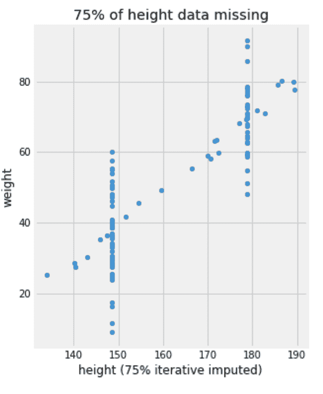

# 第四章：准备数据

在前一章中，我们处理的是干净的数据，其中所有值都可以使用，所有列都有数值，当面对过多特征时，我们有正则化技术作为支持。在现实生活中，数据往往不像你期望的那样干净。有时候，即使是干净的数据，也可能会以某种方式进行预处理，以使我们的机器学习算法更容易处理。在本章中，我们将学习以下数据预处理技术：

+   填充缺失值

+   编码非数值型列

+   改变数据分布

+   通过特征选择减少特征数量

+   将数据投影到新维度

# 填充缺失值

“在没有数据之前，理论化是一个重大错误。”

– 夏洛克·福尔摩斯

为了模拟现实生活中数据缺失的情况，我们将创建一个数据集，记录人的体重与身高的关系。然后，我们将随机删除`height`列中 75%的值，并将它们设置为`NaN`：

```py
df = pd.DataFrame(
    {
        'gender': np.random.binomial(1, .6, 100),
        'height': np.random.normal(0, 10, 100), 
        'noise': np.random.normal(0, 2, 100), 
    }
)

df['height'] = df['height'] + df['gender'].apply(
    lambda g: 150 if g else 180
)
df['height (with 75% NaN)'] = df['height'].apply(
    lambda x: x if np.random.binomial(1, .25, 1)[0] else np.nan
)
df['weight'] = df['height'] + df['noise'] - 110
```

我们在这里使用了一个带有底层**二项**/**伯努利**分布的随机数生成器来决定每个样本是否会被删除。该分布的*n*值设置为`1`——也就是伯努利分布——而*p*值设置为`0.25`——也就是说，每个样本有 25%的机会保留。当生成器返回的值为`0`时，该样本被设置为`NaN`。正如你所看到的，由于随机生成器的性质，最终`NaN`值的百分比可能会略高或略低于 75%。

**这是我们刚刚创建的 DataFrame 的前四行。这里只显示了有缺失值的`height`列和体重：


我们还可以使用以下代码来检查每一列缺失值的百分比：

```py
df.isnull().mean()
```

当我运行前一行时，77%的值是缺失的。请注意，由于使用了随机数生成器，您可能得到的缺失值比例与我这里得到的有所不同。

到目前为止我们看到的所有回归器都无法接受包含所有`NaN`值的数据。因此，我们需要将这些缺失值转换为某些值。决定用什么值来填补缺失值是数据填充过程的任务。

有不同类型的填充技术。我们将在这里尝试它们，并观察它们对我们体重估计的影响。请记住，我们恰好知道原始的`height`数据没有任何缺失值，而且我们知道使用岭回归器对原始数据进行回归会得到`3.4`的 MSE 值。现在就暂时将这个信息作为参考。

## 将缺失值设置为 0

一种简单的方法是将所有缺失值设置为`0`。以下代码将使我们的数据再次可用：

```py
df['height (75% zero imputed)'] = df['height (with 75% NaN)'].fillna(0)
```

在新填充的列上拟合岭回归器将得到`365`的 MSE 值：

```py
from sklearn.linear_model import Ridge
from sklearn.metrics import mean_squared_error

reg = Ridge()
x, y = df[['height (75% zero imputed)']], df['weight']
reg.fit(x, y)
mean_squared_error(y, reg.predict(x))
```

尽管我们能够使用回归器，但其误差与我们的参考场景相比仍然很大。为了理解零填充的效果，让我们绘制填充后的数据，并使用回归器的系数来查看训练后创建的线条类型。让我们还绘制原始数据进行比较。我相信生成以下图表的代码对您来说现在已经很简单了，所以我会跳过它：


到目前为止，我们已经知道线性模型只能将连续直线拟合到数据上（或在更高维度情况下的超平面）。我们还知道`0`不是任何人的合理身高。尽管如此，在零填充的情况下，我们引入了一堆身高为`0`、体重在`10`到`90`左右的值。这显然让我们的回归器感到困惑，正如我们在右侧图表中所看到的。

非线性回归器（例如决策树）将能够比其线性对应更好地处理这个问题。实际上，对于基于树的模型，我建议您尝试将*x*中的缺失值替换为数据中不存在的值。例如，在这种情况下，您可以尝试将身高设置为`-1`。

## 将缺失值设置为均值

统计均值的另一个名称是*期望值*。这是因为均值充当数据的有偏估计。话虽如此，用列的均值值替换缺失值听起来是一个合理的想法。

在本章中，我正在整个数据集上拟合一个回归器。我不关心将数据拆分为训练集和测试集，因为我主要关心回归器在填充后的行为。尽管如此，在现实生活中，您只需了解训练集的均值，并使用它来填补训练集和测试集中的缺失值。

scikit-learn 的`SimpleImputer`功能使得可以从训练集中找出均值并将其用于填补训练集和测试集。它通过我们喜爱的`fit()`和`transform()`方法来实现。但在这里我们将坚持一步`fit_transform()`函数，因为我们只有一个数据集：

```py
from sklearn.impute import SimpleImputer
imp = SimpleImputer(missing_values=np.nan, strategy='mean')
df['height (75% mean imputed)'] = imp.fit_transform(
    df[['height (with 75% NaN)']]
)[:, 0]
```

这里我们需要填补一个单列，这就是为什么我在填补后使用`[:, 0]`来访问其值。

岭回归器将给我们一个 MSE 值为`302`。为了理解这种改进来自哪里，让我们绘制模型的决策并与零填充前进行比较：


显然，模型的决策现在更有意义了。您可以看到虚线与实际未填充数据点重合。

除了使用**均值**作为策略外，该算法还可以找到训练数据的**中位数**。如果您的数据存在异常值，中位数通常是一个更好的选择。在非数值特征的情况下，您应该选择`most_frequent`选项作为策略。

## 使用有依据的估算填充缺失值

对所有缺失值使用相同的值可能并不理想。例如，我们知道数据中包含男性和女性样本，每个子样本的平均身高不同。`IterativeImputer()` 方法是一种可以利用相邻特征来估算某个特征缺失值的算法。在这里，我们使用性别信息来推断填充缺失身高时应使用的值：

```py
# We need to enable the module first since it is an experimental one 
from sklearn.experimental import enable_iterative_imputer
from sklearn.impute import IterativeImputer
imp = IterativeImputer(missing_values=np.nan)
df['height (75% iterative imputed)'] = imp.fit_transform(
    df[['height (with 75% NaN)', 'gender']]
)[:, 0]
```

现在我们有了两个用于填充的数据值：



这次 MSE 值为 `96`。这个策略显然是胜者。

这里只有一个特征有缺失值。在多个特征的情况下，`IterativeImputer()` 方法会遍历所有特征。它使用除一个特征外的所有特征通过回归预测剩余特征的缺失值。完成所有特征遍历后，它可能会多次重复此过程，直到值收敛。该方法有一些参数可以决定使用哪种回归算法、遍历特征时的顺序以及允许的最大迭代次数。显然，对于较大的数据集和更多缺失特征，计算开销可能较大。此外，`IterativeImputer()` 的实现仍处于实验阶段，其 API 未来可能会发生变化。

拥有过多缺失值的列对我们的估算几乎没有信息价值。我们可以尽力填充这些缺失值；然而，有时放弃整列并完全不使用它，尤其是当大多数值都缺失时，是最好的选择。

# 编码非数值列

"每一次解码都是一次编码。"

– 大卫·洛奇（David Lodge）

非数值数据是算法实现无法处理的另一个问题。除了核心的 scikit-learn 实现之外，`scikit-learn-contrib` 还列出了多个附加项目。这些项目为我们的数据工具库提供了额外的工具，以下是它们如何描述自己的：

"scikit-learn-contrib 是一个 GitHub 组织，旨在汇集高质量的 scikit-learn 兼容项目。它还提供了一个模板，用于建立新的 scikit-learn 兼容项目。"

我们将在这里使用一个项目——`category_encoders`。它允许我们将非数值数据编码成不同的形式。首先，我们将使用 `pip` 安装这个库，命令如下：

```py
          pip install category_encoders

```

在深入了解不同的编码策略之前，让我们首先创建一个虚拟数据集来进行实验：

```py
df = pd.DataFrame({
    'Size': np.random.choice(['XS', 'S', 'M', 'L', 'XL', 'XXL'], 10),
    'Brand': np.random.choice(['Nike', 'Puma', 'Adidas', 'Le Coq', 'Reebok'], 10),
})
```

然后我们将其分成两个相等的部分：

```py
from sklearn.model_selection import train_test_split
df_train, df_test = train_test_split(df, test_size=0.5)
```

请记住，核心的 scikit-learn 库实现了我们将在此看到的两种编码器——`preprocessing.OneHotEncoder` 和 `preprocessing.OrdinalEncoder`。不过，我更喜欢 `category_encoders` 的实现，因为它更丰富、更灵活。

现在，让我们进入第一个也是最流行的编码策略——独热编码（one-hot encoding）。

## 独热编码

**一热编码**，也叫虚拟编码，是处理类别特征的最常见方法。如果你有一列包含`red`、`green`和`blue`值的数据，那么将它们转换为三列——`is_red`、`is_green`和`is_blue`——并根据需要填充这些列的值为 1 和 0，看起来是很合乎逻辑的。

以下是使用`OneHotEncoder`解码数据集的代码：

```py
from category_encoders.one_hot import OneHotEncoder
encoder = OneHotEncoder(use_cat_names=True, handle_unknown='return_nan')
x_train = encoder.fit_transform(df_train)
x_test = encoder.transform(df_test)
```

我设置了`use_cat_names=True`，以在分配列名时使用编码后的值。`handle_unknown`参数告诉编码器如何处理测试集中在训练集中不存在的值。例如，我们的训练集中没有`XS`或`S`尺码的衣物，也没有`Adidas`品牌的衣物。这就是为什么测试集中的这些记录会被转换为`NaN`：


你仍然需要填补那些`NaN`值。否则，我们可以通过将`handle_unknown`设置为`value`来将这些值设置为`0`。

一热编码推荐用于线性模型和**K-最近邻**（**KNN**）算法。尽管如此，由于某一列可能会扩展成过多列，并且其中一些列可能是相互依赖的，因此建议在这里使用正则化或特征选择。我们将在本章后面进一步探讨特征选择，KNN 算法将在本书后面讨论。

## 序数编码

根据你的使用场景，你可能需要以反映顺序的方式对类别值进行编码。如果我要使用这些数据来预测物品的需求量，那么我知道，物品尺码越大，并不意味着需求量越高。因此，对于这些尺码，一热编码仍然适用。然而，如果我们要预测每件衣物所需的材料量，那么我们需要以某种方式对尺码进行编码，意味着`XL`需要比`L`更多的材料。在这种情况下，我们关心这些值的顺序，因此我们使用`OrdinalEncoder`，如下所示：

```py
from category_encoders.ordinal import OrdinalEncoder

oencoder = OrdinalEncoder(
  mapping= [
    {
      'col': 'Size', 
      'mapping': {'XS': 1, 'S': 2, 'M': 3, 'L': 4, 'XL': 5}
    }
  ]
)

df_train.loc[
  :, 'Size [Ordinal Encoded]'
] = oencoder.fit_transform(
  df_train['Size']
)['Size'].values
df_test.loc[
  :, 'Size [Ordinal Encoded]'
] = oencoder.transform(
  df_test['Size']
)['Size'].values
```

请注意，我们必须手动指定映射。我们希望将`XS`编码为`1`，`S`编码为`2`，依此类推。因此，我们得到了以下的 DataFrame：


这次，编码后的数据只占用了一列，而训练集中缺失的值被编码为`-1`。

这种编码方法推荐用于非线性模型，例如决策树。至于线性模型，它们可能会将`XL`（编码为`5`）解释为`XS`（编码为`1`）的五倍。因此，对于线性模型，一热编码仍然是首选。此外，手动设置有意义的映射可能会非常耗时。

## 目标编码

在有监督学习场景中，编码类别特征的一种显而易见的方法是基于目标值进行编码。假设我们要估计一件衣物的价格。我们可以将品牌名称替换为我们训练数据集中相同品牌所有物品的平均价格。然而，这里有一个明显的问题。假设某个品牌在我们的训练集中只出现一次或两次。不能保证这几次出现能够很好地代表该品牌的价格。换句话说，单纯使用目标值可能会导致过度拟合，最终模型在处理新数据时可能无法很好地泛化。这就是为什么 `category_encoders` 库提供了多种目标编码变体的原因；它们都有相同的基本目标，但每种方法都有不同的处理上述过度拟合问题的方式。以下是一些这些实现的示例：

+   留一法交叉验证

+   目标编码器

+   CatBoost 编码器

+   M 估计器

留一法可能是列出的方法中最著名的一种。在训练数据中，它将原始数据中的类别值替换为所有具有相同类别值但不包括该特定原始数据行的其他行的目标值均值。对于测试数据，它只使用从训练数据中学习到的每个类别值对应的目标均值。此外，编码器还有一个名为 `sigma` 的参数，允许您向学习到的均值添加噪声，以防止过度拟合。

# 同质化列的尺度

不同的数值列可能具有不同的尺度。一列的年龄可能在十位数，而它的薪资通常在千位数。如我们之前所见，将不同的列调整到相似的尺度在某些情况下是有帮助的。以下是一些建议进行尺度调整的情况：

+   它可以帮助梯度下降法的求解器更快地收敛。

+   它是 KNN 和**主成分分析**（**PCA**）等算法所必需的。

+   在训练估计器时，它将特征放置在一个可比的尺度上，这有助于对比它们的学习系数。

在接下来的章节中，我们将探讨最常用的标准化器。

## 标准标准化器

它通过将特征的均值设置为 `0`，标准差设置为 `1`，将特征转换为正态分布。此操作如下，首先从每个值中减去该列的均值，然后将结果除以该列的标准差：


标准化器的实现可以如下使用：

```py
from sklearn.preprocessing import StandardScaler

scaler = StandardScaler()
x_train_scaled = scaler.fit_transform(x_train)
x_test_scaled = scaler.transform(x_test)
```

一旦拟合完成，您还可以通过 `mean_` 和 `var_` 属性查找训练数据中每一列的均值和方差。在存在异常值的情况下，标准化器无法保证特征尺度的平衡。

## MinMax 标准化器

这会将特征压缩到一个特定的范围，通常是在`0`到`1`之间。如果你需要使用不同的范围，可以通过`feature_range`参数来设置。这个标准化方法的工作方式如下：

```py
from sklearn.preprocessing import MinMaxScaler

scaler = MinMaxScaler(feature_range=(0,1))
x_train_scaled = scaler.fit_transform(x_train)
x_test_scaled = scaler.transform(x_test)
```

一旦拟合，你还可以通过`data_min_`**和`data_max_`属性找出训练数据中每一列的最小值和最大值。由于所有样本都被限制在预定范围内，异常值可能会迫使正常值被压缩到该范围的一个小子集内。**

**## RobustScaler

这与标准缩放器相似，但使用数据分位数来增强对异常值对均值和标准差影响的鲁棒性。如果数据中存在异常值，建议使用这个方法，使用方式如下：

```py
from sklearn.preprocessing import RobustScaler

scaler = RobustScaler()
x_train_scaled = scaler.fit_transform(x_train)
x_test_scaled = scaler.transform(x_test)
```

还有其他的标准化方法；不过，我这里只涵盖了最常用的标准化方法。在本书中，我们将使用上述标准化方法。所有标准化方法都有一个`inverse_transform()`方法，所以如果需要，你可以恢复特征的原始尺度。此外，如果你无法一次性将所有训练数据加载到内存中，或者数据是按批次来的，那么你可以在每一批次上调用标准化方法的`partial_fit()`方法，而不是对整个数据集一次性调用`fit()`方法。

# 选择最有用的特征

“更多的数据，比如在过马路时注意周围人们的眼睛颜色，可能会让你错过那辆大卡车。”

– 纳西姆·尼古拉斯·塔勒布

在前面的章节中，我们已经看到，特征过多可能会降低模型的表现。所谓的维度诅咒可能会对算法的准确性产生负面影响，特别是当训练样本不足时。此外，这也可能导致更多的训练时间和更高的计算需求。幸运的是，我们也学会了如何对我们的线性模型进行正则化，或是限制决策树的生长，以应对特征过多的影响。然而，有时我们可能会使用一些无法进行正则化的模型。此外，我们可能仍然需要去除一些无意义的特征，以减少算法的训练时间和计算需求。在这些情况下，特征选择作为第一步是明智的选择。

根据我们处理的是标记数据还是未标记数据，我们可以选择不同的特征选择方法。此外，一些方法比其他方法计算开销更大，有些方法能带来更准确的结果。在接下来的部分中，我们将看到如何使用这些不同的方法，并且为了演示这一点，我们将加载 scikit-learn 的`wine`数据集：

```py
from sklearn import datasets

wine = datasets.load_wine()
df = pd.DataFrame(
    wine.data,
    columns=wine.feature_names
)
df['target'] = pd.Series(
    wine.target
)
```

然后，我们像平常一样拆分数据：

```py
from sklearn.model_selection import train_test_split
df_train, df_test = train_test_split(df, test_size=0.4)

x_train = df_train[wine.feature_names]
x_test = df_test[wine.feature_names]

y_train = df_train['target']
y_test = df_test['target']
```

`wine`数据集有 13 个特征，通常用于分类任务。在接下来的部分中，我们将探索哪些特征比其他特征更不重要。

## VarianceThreshold

如果你还记得，当我们使用`PolynomialFeatures`转换器时，它添加了一列，所有的值都被设置为`1`。此外，像独热编码这样的类别编码器，可能会导致几乎所有值都为`0`的列。在现实场景中，通常也会有某些列，列中的数据完全相同或几乎相同。方差是衡量数据集变异量的最直观方法，因此`VarianceThreshold`允许我们为每个特征设置最小的方差阈值。在以下代码中，我们将方差阈值设置为`0`，然后它会遍历训练集，学习哪些特征应该保留：

```py
from sklearn.feature_selection import VarianceThreshold
vt = VarianceThreshold(threshold=0)
vt.fit(x_train)
```

和我们其他所有模块一样，这个模块也提供了常见的`fit()`、`transform()`和`fit_transform()`方法。然而，我更倾向于不在这里使用它们，因为我们已经给我们的列命名了，而`transform()`函数不会尊重我们所赋予的名称。因此，我更喜欢使用另一种方法叫做`get_support()`。这个方法返回一个布尔值列表，任何`False`值对应的列应该被移除，基于我们设置的阈值。以下是我如何使用`pandas`库的`iloc`函数移除不必要的特征：

```py
x_train = x_train.iloc[:, vt.get_support()]
x_test = x_test.iloc[:, vt.get_support()]
```

我们还可以打印特征名并根据它们的方差进行排序，如下所示：

```py
pd.DataFrame(
    {
        'Feature': wine.feature_names,
        'Variance': vt.variances_,
    }
).sort_values(
    'Variance', ascending=True
)
```

这将给我们以下表格：


我们可以看到，我们的特征没有零方差；因此，没有特征会被移除。你可以决定使用更高的阈值——例如，将阈值设置为`0.05`，这将移除`nonflavanoid_phenols`特征。然而，让我列出这个模块的主要优缺点，帮助你决定何时以及如何使用它：

+   与我们接下来会看到的其他特征选择方法不同，这个方法在选择特征时不使用数据标签。在处理无标签数据时，特别是在无监督学习场景中，这非常有用。

+   它不依赖标签的特性也意味着，一个低方差的特征可能仍然与我们的标签高度相关，去除它可能会是一个错误。

+   方差和均值一样，依赖于数据的尺度。一个从`1`到`10`的数字列表的方差为`8.25`，而`10, 20, 30,...100`的列表的方差为`825.0`。我们可以从`proline`的方差中清楚地看到这一点。这使得表格中的数字不可比，并且很难选择正确的阈值。一个思路是，在计算方差之前对数据进行缩放。然而，记住你不能使用`StandardScaler`，因为它故意统一了所有特征的方差。所以，我认为在这里使用`MinMaxScaler`更有意义。

总结来说，我发现方差阈值对于去除零方差特征非常方便。至于剩余的特征，我会让下一个特征选择算法来处理它们，特别是在处理标记数据时。

## 过滤器

现在我们的数据有标签了，因此利用每个特征与标签之间的相关性来决定哪些特征对我们的模型更有用是合乎逻辑的。这类特征选择算法处理每个独立的特征，并根据与标签的关系来衡量其有用性；这种算法叫做 *filters*。换句话说，算法对 *x* 中的每一列使用某种度量来评估它在预测 *y* 时的有效性。有效的列被保留，而其他列则被移除。衡量有效性的方式就是区分不同筛选器的关键。为了更清楚地说明，我将重点讨论两个筛选器，因为每个筛选器都根植于不同的科学领域，理解它们有助于为未来的概念打下良好的基础。这两个概念是 **ANOVA (F 值)** 和 **互信息**。

### f-regression 和 f-classif

如其名称所示，`f_regression` 用于回归任务中的特征选择。`f_classif` 是它的分类兄弟。`f_regression` 根植于统计学领域。它在 scikit-learn 中的实现使用皮尔逊相关系数来计算 *x* 和 *y* 中每列之间的相关性。结果会转换为 F 值和 P 值，但我们先不谈这个转换，因为相关系数才是关键。我们首先从每列的所有值中减去均值，这与我们在 `StandardScaler` 中所做的类似，但不需要将值除以标准差。接着，我们使用以下公式计算相关系数：


由于已减去均值，当一个实例高于其列的均值时，*x* 和 *y* 的值为正，而当其低于均值时，则为负。因此，这个方程会被最大化，使得每当 *x* 高于平均值时，*y* 也高于平均值，而每当 *x* 低于平均值时，*y* 也随之下降。这个方程的最大值是`1`。因此，我们可以说 *x* 和 *y* 完全相关。当 *x* 和 *y* 顽固地朝相反方向变化时，即呈负相关，方程值为`-1`。零结果意味着 *x* 和 *y* 不相关（即独立或正交）。

通常，统计学家会以不同的方式书写这个方程。通常会将* x *和* y *减去均值的事实写成方程的一部分。然后，分子显然是协方差，分母是两个方差的乘积。然而，我故意选择不遵循统计学惯例，以便我们的自然语言处理的朋友们在意识到这与余弦相似度的方程完全相同时，能够感到熟悉。在这种情况下，* x *和* y *被视为向量，分子是它们的点积，分母是它们的模长的乘积。因此，当它们之间的角度为`0`（余弦`0` = `1`）时，两个向量是完全相关的（方向相同）。相反，当它们彼此垂直时，它们是独立的，因此被称为*正交*。这种可视化解释的一个要点是，这个度量只考虑了* x *和* y *之间的线性关系。

对于分类问题，会执行单因素方差分析（ANOVA）测试。它比较不同类别标签之间的方差与每个类别内部的方差。与回归分析类似，它衡量特征与类别标签之间的线性依赖关系。

现在先不谈太多理论；让我们使用 `f_classif` 来选择数据集中最有用的特征：

```py
from sklearn.feature_selection import f_classif
f, p = f_classif(x_train, y_train)
```

让我们暂时将结果中的*f*和*p*值放到一边。在解释特征选择的互信息方法之后，我们将使用这些值来对比这两种方法。

### 互信息

这种方法起源于一个不同的科学领域，叫做**信息理论**。该领域由克劳德·香农（Claude Shannon）提出，旨在解决与信号处理和数据压缩相关的问题。当我们发送一个由零和一组成的消息时，我们可能知道这个消息的确切内容，但我们能否真正量化这个消息所携带的信息量呢？香农通过借用热力学中的**熵**概念来解决这个问题。进一步发展出来的是**互信息**的概念。它量化了通过观察一个变量时，获得关于另一个变量的信息量。互信息的公式如下：


在解析这个方程之前，请记住以下几点：

+   *P(x)* 是 *x* 取某个特定值的概率，*P(y)* 也是 *y* 取某个特定值的概率。

+   *P(x, y)* 被称为联合概率，它表示 *x* 和 *y* 同时取特定一对值的概率。

+   *P(x, y)* 只有在 *x* 和 *y* 独立时才等于 *P(x)* * *P(y)*。否则，根据 *x* 和 *y* 的正相关或负相关关系，它的值会大于或小于它们的乘积。

双重求和和方程的第一部分，*P(x, y)*，是我们计算所有可能的 *x* 和 *y* 值的加权平均值的方法。我们关心的是对数部分，它被称为点对点互信息。如果 *x* 和 *y* 是独立的，那么这个分数等于 `1`，它的对数为 `0`。换句话说，当这两个变量不相关时，结果为 `0`。否则，结果的符号指示 *x* 和 *y* 是正相关还是负相关。

下面是我们如何计算每个特征的互信息系数：

```py
from sklearn.feature_selection import mutual_info_classif
mi = mutual_info_classif(x_train, y_train)
```

与皮尔逊相关系数不同，互信息能够捕捉任何类型的相关性，无论其是否是线性的。

### 比较并使用不同的过滤器

现在，我们来将互信息得分与 F 值进行比较。为此，我们将两者放入一个 DataFrame，并使用 `pandas` 的样式功能在 DataFrame 内绘制柱状图，如下所示：

```py
pd.DataFrame(
  {
    'Feature': wine.feature_names,
    'F': f,
    'MI': mi,
  }
).sort_values(
  'MI', ascending=False
).style.bar(
  subset=['F', 'MI'], color='grey'
)
```

这为我们提供了以下的 DataFrame：


如你所见，它们在特征重要性排序上大体一致，但有时仍会有所不同。我使用这两种方法分别选择了四个最重要的特征，然后比较了 **逻辑回归** 分类器与决策树分类器在每种特征选择方法下的准确性。以下是训练集的结果：


如你所见，这两种选择方法分别对两种分类器的效果不同。似乎`f_classif`更适用于线性模型，因为它具有线性特性，而非线性模型则更倾向于捕捉非线性相关性的算法。然而，我并未找到任何文献来确认这一猜测的普遍性。

不难看出，两个度量之间有一个潜在的共同主题。分子计算的是一些变量内的信息——协方差、点积或联合概率；分母计算的是变量间的信息的乘积——方差、范数或概率。这个主题将在未来的不同话题中继续出现。有一天，我们可能会使用余弦相似度来比较两篇文档；另一天，我们可能会使用互信息来评估聚类算法。

## 同时评估多个特征

本章 *Filters* 部分所展示的特征选择方法也被认为是单变量特征选择方法，因为它们会在决定是否保留一个特征之前，单独检查每一个特征。这可能会导致以下两种问题之一：

+   如果两个特征高度相关，我们只希望保留其中一个。然而，由于单变量特征选择的特性，它们仍然会同时被选择。

+   如果两个特征本身并不非常有用，但它们的组合却有用，那么它们仍然会被移除，因为单变量特征选择方法的工作方式就是如此。

为了处理这些问题，我们可以决定使用以下解决方案之一：

+   **使用估计器进行特征选择**：通常，回归器和分类器会在训练后给特征赋值，表示它们的重要性。因此，我们可以使用估计器的系数（或特征重要性）来添加或移除我们初始特征集中的特征。scikit-learn 的**递归特征消除**（**RFE**）算法从初始特征集开始。然后，它通过每次迭代使用训练模型的系数逐步移除特征。`SelectFromModel`算法是一种元转换器，可以利用正则化模型来移除系数为零或接近零的特征。

+   **使用内置特征选择的估计器**：换句话说，这意味着使用正则化估计器，如 Lasso，其中特征选择是估计器目标的一部分。

总结来说，像使用方差阈值和滤波器这种方法执行起来比较快，但在特征相关性和交互作用方面有其缺点。计算开销更大的方法，如包装法，能够解决这些问题，但容易发生过拟合。

如果你问我关于特征选择的建议，个人来说，我的首选方法是在去除零方差特征后进行正则化，除非我处理的是大量特征，在这种情况下，训练整个特征集不可行。对于这种情况，我会使用单变量特征选择方法，同时小心去除那些可能有用的特征。之后，我仍然会使用正则化模型来处理任何多重共线性问题。

最终，验证一切的标准在于实际效果，通过反复试验和错误得到的实证结果可能会超越我的建议。此外，除了提高最终模型的准确性，特征选择仍然可以用来理解手头的数据。特征重要性评分仍然可以用于指导商业决策。例如，如果我们的标签表示用户是否会流失，我们可以提出一个假设，认为得分最高的特征对流失率的影响最大。然后，我们可以通过调整产品的相关部分来进行实验，看看是否能够减少流失率。

# 总结

从事与数据相关的职业需要有应对不完美情况的倾向。处理缺失值是我们无法忽视的一步。因此，我们从学习不同的数据填补方法开始这一章。此外，适用于某一任务的数据可能不适用于另一个任务。这就是为什么我们学习了特征编码以及如何将类别数据和顺序数据转换为适合机器学习需求的形式。为了帮助算法表现得更好，我们可能需要重新调整数值特征的尺度。因此，我们学习了三种缩放方法。最后，数据过多可能会成为模型的诅咒，因此特征选择是应对维度灾难的一个有效方法，常与正则化一起使用。

贯穿这一章的一个主要主题是简单快速的方法与更为深思熟虑且计算开销大的方法之间的权衡，这些方法可能会导致过拟合。知道该使用哪些方法需要了解它们背后的理论，同时也需要有实验和迭代的意愿。因此，我决定在必要时深入探讨理论背景，这不仅有助于你明智地选择方法，还能让你未来能够提出自己的方法。

既然我们已经掌握了主要的数据预处理工具，接下来就可以进入下一个算法——KNN。****
